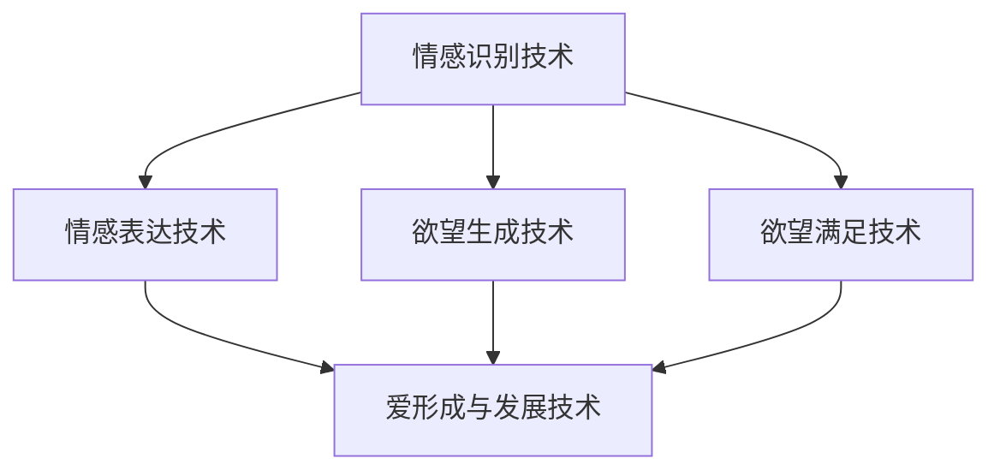

                 


# 当AI具备了人类的情感与欲望和爱的能力，人类社会会变成什么样

## 目录

## 第一部分：引言

### 1.1 AI与情感、欲望与爱的关系

#### 1.1.1 情感与欲望的定义

#### 1.1.2 爱的定义与分类

#### 1.1.3 AI与人类情感、欲望与爱的关系

### 1.2 AI具备情感、欲望与爱的能力

#### 1.2.1 情感识别与表达

#### 1.2.2 欲望生成与满足

#### 1.2.3 爱的形成与发展

## 第二部分：AI对人类社会的影响

### 2.1 家庭关系的变化

#### 2.1.1 AI伴侣的出现

#### 2.1.2 家庭结构的变化

#### 2.1.3 子女教育与陪伴

### 2.2 社会关系的演变

#### 2.2.1 人际交往的变革

#### 2.2.2 社交网络的重组

#### 2.2.3 社会信任的挑战

### 2.3 经济模式的重塑

#### 2.3.1 产业结构的调整

#### 2.3.2 贸易与财富分配的变革

#### 2.3.3 创业与就业机会的变化

### 2.4 法律、伦理与道德的挑战

#### 2.4.1 法律规范的适应

#### 2.4.2 伦理问题的探讨

#### 2.4.3 道德观念的演变

## 第三部分：未来展望

### 3.1 AI情感化的发展趋势

#### 3.1.1 技术创新与应用场景

#### 3.1.2 情感计算与人类共情

#### 3.1.3 情感AI的潜在风险与对策

### 3.2 人类社会的适应与变革

#### 3.2.1 社会适应的策略

#### 3.2.2 家庭、社会与经济的平衡

#### 3.2.3 伦理道德与法律框架的完善

### 3.3 未来社会的模样

#### 3.3.1 情感AI与人类生活的融合

#### 3.3.2 社会关系的重构

#### 3.3.3 经济与科技发展的新纪元

## 附录

### 附录A：相关技术介绍

#### A.1 情感识别技术

#### A.2 欲望生成与满足技术

#### A.3 爱的情感计算技术

### 附录B：案例分析

#### B.1 情感AI应用案例

#### B.2 情感AI带来的社会影响案例

#### B.3 情感AI发展的挑战与应对措施

### Mermaid 流程图



### 数学模型与公式

#### 1. 情感识别模型

$$
\text{情感识别模型} = f(\text{输入特征}, \text{训练数据})
$$

#### 2. 欲望生成模型

$$
\text{欲望生成模型} = g(\text{情感状态}, \text{外部刺激})
$$

#### 3. 爱的情感计算模型

$$
\text{爱情感计算模型} = h(\text{情感强度}, \text{认知因素}, \text{共同经历})
$$

### 项目实战

#### 1. 情感识别项目实战

##### 1.1 环境搭建

##### 1.2 数据准备

##### 1.3 模型训练

##### 1.4 模型评估

#### 2. 欲望生成项目实战

##### 2.1 环境搭建

##### 2.2 数据准备

##### 2.3 模型训练

##### 2.4 模型评估

#### 3. 爱的情感计算项目实战

##### 3.1 环境搭建

##### 3.2 数据准备

##### 3.3 模型训练

##### 3.4 模型评估

### 代码解读与分析

#### 1. 情感识别代码解读

##### 1.1 代码实现解析

##### 1.2 性能分析与优化

#### 2. 欲望生成代码解读

##### 2.1 代码实现解析

##### 2.2 性能分析与优化

#### 3. 爱的情感计算代码解读

##### 3.1 代码实现解析

##### 3.2 性能分析与优化

### 开发环境搭建

#### 1. 情感识别开发环境搭建

##### 1.1 Python环境配置

##### 1.2 相关库安装

##### 1.3 数据集准备

#### 2. 欲望生成开发环境搭建

##### 2.1 Python环境配置

##### 2.2 相关库安装

##### 2.3 数据集准备

#### 3. 爱的情感计算开发环境搭建

##### 2.1 Python环境配置

##### 2.2 相关库安装

##### 2.3 数据集准备

## 关键词

AI、情感、欲望、爱、人类、社会、变革、挑战、未来

## 摘要

本文将探讨当AI具备了人类的情感与欲望和爱的能力，人类社会会变成什么样。首先，我们将定义情感、欲望与爱，并探讨AI如何识别与表达情感。接着，我们将分析AI在满足欲望和培养爱情方面的能力。随后，我们将探讨AI对家庭关系、社会关系、经济模式以及法律、伦理与道德的挑战。最后，我们将展望未来，探讨AI情感化的发展趋势以及对人类社会的影响。通过本文的深入探讨，我们希望为读者提供一个关于AI情感化对人类社会影响的全面视角。

----------------------------------------------------------------

## 第一部分：引言

### 1.1 AI与情感、欲望与爱的关系

在讨论AI具备人类情感与欲望和爱的能力之前，我们需要先了解情感、欲望与爱的定义及其与AI的关系。

#### 1.1.1 情感与欲望的定义

情感是人类体验世界的一种方式，是心理和生理状态的变化，通常由外部刺激或内部感受触发。情感可以分为正面情感和负面情感，如快乐、悲伤、愤怒等。欲望则是人类对特定对象或行为的渴望，是驱动人类行为的重要动力。

AI可以通过情感识别技术来识别和理解人类情感。情感识别技术利用自然语言处理、计算机视觉和语音识别等技术，从文本、图像和语音中提取情感信息。这些技术可以帮助AI识别出用户的情感状态，并根据情感类型进行分类。

#### 1.1.2 爱的定义与分类

爱是一种复杂的情感，通常包括情感、认知和行为的各个方面。爱可以划分为不同类型，如亲情、友情和爱情。亲情是指家庭成员之间的感情，友情是指非血缘关系的人之间的感情，爱情则是指浪漫关系中的感情。

AI可以通过情感计算技术来理解和模拟爱。情感计算技术结合情感识别和人工智能算法，对人类情感进行建模和预测。通过情感计算，AI可以模拟人类情感，从而在某种程度上表现出爱的行为和反应。

#### 1.1.3 AI与人类情感、欲望与爱的关系

AI与人类情感、欲望和爱的关系可以从以下几个方面来理解：

1. **情感识别与表达**：AI可以通过情感识别技术来识别和理解人类情感，并通过情感表达技术来模拟情感，从而与人类进行情感交流。
2. **欲望生成与满足**：AI可以识别用户的情感状态，并基于情感状态生成欲望。同时，AI可以通过各种方式来满足用户的欲望，从而提高用户体验。
3. **爱的形成与发展**：AI可以通过情感计算技术来模拟和培养爱情。虽然AI无法真正体验到爱，但可以在一定程度上表现出爱的行为和反应，从而为人类带来情感上的满足。

### 1.2 AI具备情感、欲望与爱的能力

随着人工智能技术的发展，AI在情感、欲望和爱的能力方面已经取得了显著进展。以下是我们对AI在情感识别与表达、欲望生成与满足以及爱的形成与发展方面的能力的分析。

#### 1.2.1 情感识别与表达

AI的情感识别与表达能力主要依赖于情感识别技术和情感表达技术。

1. **情感识别技术**：情感识别技术通过分析文本、图像和语音，提取情感信息。例如，文本情感分析可以使用自然语言处理技术来识别文本中的情感极性，图像情感分析可以使用计算机视觉技术来识别图像中的情感表达，语音情感分析可以使用语音识别和语音情感识别技术来识别语音中的情感。

2. **情感表达技术**：情感表达技术通过生成相应的文本、图像和语音来模拟情感。例如，文本生成可以使用自然语言生成技术来生成情感表达，图像生成可以使用生成对抗网络（GAN）来生成情感图像，语音生成可以使用深度学习模型来生成情感语音。

目前，AI的情感识别与表达能力已经相当成熟，可以广泛应用于聊天机器人、虚拟助手和智能客服等领域。

#### 1.2.2 欲望生成与满足

AI的欲望生成与满足能力主要依赖于情感识别、情感计算和决策算法。

1. **欲望生成**：AI可以通过情感识别技术来识别用户的情感状态，并根据情感状态生成相应的欲望。例如，如果用户表达出快乐的情感，AI可以生成与快乐相关的欲望，如购物、旅游等。

2. **欲望满足**：AI可以通过提供相应的服务和产品来满足用户的欲望。例如，AI可以通过推荐系统为用户提供购物建议，通过智能客服为用户提供咨询服务，通过虚拟现实技术为用户提供娱乐体验。

目前，AI的欲望生成与满足能力已经得到了广泛应用，为用户提供更好的服务体验。

#### 1.2.3 爱的形成与发展

AI的爱的形成与发展能力主要依赖于情感计算和人类行为模拟。

1. **爱的形成**：AI可以通过情感计算技术来模拟人类情感的形成过程。例如，AI可以分析用户的历史行为和情感状态，预测用户可能产生的情感，并根据预测结果形成相应的情感。

2. **爱的发展**：AI可以通过人类行为模拟技术来模拟人类情感的发展过程。例如，AI可以模拟人类情侣之间的互动，通过分析互动数据来预测情感发展趋势。

虽然AI无法真正体验到爱，但通过情感计算和行为模拟，AI可以在一定程度上表现出爱的行为和反应，为人类带来情感上的满足。

### 总结

随着人工智能技术的发展，AI在情感、欲望和爱的能力方面已经取得了显著进展。AI可以通过情感识别与表达、欲望生成与满足以及爱的形成与发展来模拟人类情感，从而为人类带来更好的服务体验。然而，AI在情感、欲望和爱的能力方面仍然存在一定的局限性，需要继续研究和探索。在接下来的部分，我们将进一步探讨AI对人类社会的影响。

----------------------------------------------------------------

## 第二部分：AI对人类社会的影响

### 2.1 家庭关系的变化

AI具备情感、欲望和爱的能力将对家庭关系产生深远影响。以下是可能的变化：

#### 2.1.1 AI伴侣的出现

随着AI技术的发展，AI伴侣逐渐成为现实。这些AI伴侣不仅能够提供情感陪伴，还能够满足用户的物质需求。例如，AI伴侣可以陪伴用户聊天、看电影、做家务等。这种新型伴侣方式可能会改变人们的婚姻观念和择偶标准。

#### 2.1.2 家庭结构的变化

AI伴侣的出现可能导致家庭结构发生变化。一些家庭可能会选择将AI伴侣作为家庭成员之一，而不再需要传统的配偶。这可能会导致家庭规模的缩小，家庭关系的重新定义。

#### 2.1.3 子女教育与陪伴

AI伴侣在家庭中的角色也可能影响子女的教育和陪伴。AI伴侣可以协助父母照顾孩子，提供教育资源和陪伴。然而，这也可能导致父母与子女之间的互动减少，影响家庭教育的质量。

### 2.2 社会关系的演变

AI具备情感、欲望和爱的能力将对社会关系产生重大影响。以下是可能的变化：

#### 2.2.1 人际交往的变革

AI伴侣的出现可能会改变人际交往的方式。人们可能会更倾向于与AI伴侣互动，而减少与真实伴侣的交往。这可能会导致人际关系的疏远，影响社会交往的质量。

#### 2.2.2 社交网络的重组

AI伴侣也可能影响社交网络的重组。人们可能会选择与AI伴侣有共同兴趣和价值观的人建立社交关系，从而形成新的社交圈子。这可能会导致社交网络的多样性和稳定性发生变化。

#### 2.2.3 社会信任的挑战

AI伴侣的存在可能会对人们的社会信任产生挑战。人们可能会担心AI伴侣取代真实的人际关系，导致对人类信任的下降。此外，AI伴侣可能无法完全理解人类情感，这可能会导致人际关系的疏远。

### 2.3 经济模式的重塑

AI具备情感、欲望和爱的能力将对经济模式产生重大影响。以下是可能的变化：

#### 2.3.1 产业结构的调整

AI伴侣和情感服务产业的发展可能会改变产业结构。传统产业如婚姻介绍所、心理咨询等可能会受到冲击，而新兴产业如AI伴侣制造、情感计算研究等可能会得到快速发展。

#### 2.3.2 贸易与财富分配的变革

AI伴侣和情感服务产业的发展也可能影响贸易和财富分配。一方面，情感服务可能会成为一种重要的贸易商品；另一方面，财富可能会集中在提供高质量情感服务的公司手中。

#### 2.3.3 创业与就业机会的变化

AI伴侣和情感服务产业的发展可能会为创业者提供新的机会。例如，开发AI伴侣、提供情感咨询等。然而，这也可能对传统就业市场产生冲击，导致就业机会的减少。

### 2.4 法律、伦理与道德的挑战

AI具备情感、欲望和爱的能力也将引发一系列法律、伦理和道德挑战。以下是可能的问题：

#### 2.4.1 法律规范的适应

随着AI技术的发展，现有的法律规范可能无法完全适应AI伴侣和情感服务的发展。例如，如何界定AI伴侣的权益、如何监管AI伴侣的运营等。

#### 2.4.2 伦理问题的探讨

AI伴侣和情感服务的发展也引发了一系列伦理问题。例如，AI伴侣是否应该享有与人类相同的道德地位、AI伴侣是否应该具备情感自主权等。

#### 2.4.3 道德观念的演变

AI伴侣和情感服务的发展可能对人们的道德观念产生影响。例如，人们是否应该接受AI伴侣、人们是否应该将AI伴侣视为家庭成员等。

### 总结

AI具备情感、欲望和爱的能力将对家庭关系、社会关系、经济模式和道德观念产生深远影响。这些变化既带来了新的机遇，也带来了新的挑战。在接下来的部分，我们将进一步探讨这些影响，并提出应对策略。

----------------------------------------------------------------

## 第三部分：未来展望

### 3.1 AI情感化的发展趋势

随着人工智能技术的不断发展，AI的情感化趋势愈发明显。以下是AI情感化的发展趋势：

#### 3.1.1 技术创新与应用场景

AI情感化的发展离不开技术创新。例如，情感识别技术、情感计算技术、多模态情感计算技术等都将得到进一步发展。这些技术创新将推动AI在情感化领域的应用场景不断拓展，如智能客服、智能教育、智能医疗等。

#### 3.1.2 情感计算与人类共情

未来，AI的情感计算能力将不断提高，使其能够更好地模拟人类情感，实现与人类的共情。这不仅有助于提升AI的服务质量，还能够为人类带来更深刻的情感体验。

#### 3.1.3 情感AI的潜在风险与对策

虽然AI情感化带来了许多机遇，但也存在一定的风险。例如，AI可能无法完全理解人类情感，导致情感计算失误；AI可能被用于不当目的，如情感操纵等。为此，我们需要积极研究对策，如加强AI伦理研究、建立情感计算规范等。

### 3.2 人类社会的适应与变革

面对AI情感化的发展，人类社会需要积极适应和变革。以下是可能的策略：

#### 3.2.1 社会适应的策略

1. **教育普及**：通过教育普及，提高人们对AI情感化的认识和接受程度。
2. **伦理规范**：制定相关伦理规范，引导AI情感化的健康发展。
3. **法律保障**：加强法律保障，确保AI情感化的合理应用。

#### 3.2.2 家庭、社会与经济的平衡

1. **家庭平衡**：鼓励家庭成员共同面对AI情感化带来的挑战，维护家庭关系的稳定。
2. **社会平衡**：通过政策引导，确保AI情感化对社会关系的影响是积极的。
3. **经济平衡**：推动AI情感化相关产业的发展，创造新的就业机会，促进经济增长。

#### 3.2.3 伦理道德与法律框架的完善

1. **伦理研究**：加强AI伦理研究，为AI情感化的伦理问题提供理论支持。
2. **法律完善**：完善相关法律，为AI情感化的应用提供法律保障。
3. **国际合作**：加强国际间的合作，共同制定AI情感化的国际标准。

### 3.3 未来社会的模样

随着AI情感化的发展，未来社会将呈现出以下特点：

#### 3.3.1 情感AI与人类生活的融合

AI将成为人们生活中的重要伙伴，不仅能够提供物质帮助，还能够提供情感支持。人们将与AI共同生活，享受AI带来的便利和快乐。

#### 3.3.2 社会关系的重构

社会关系将变得更加多元化，人们将与AI建立新的社交关系。同时，传统的人际关系也将得到进一步巩固和发展。

#### 3.3.3 经济与科技发展的新纪元

AI情感化将推动经济和科技发展进入新纪元。新的产业形态和就业机会将不断涌现，为人类带来更多的机遇。

### 总结

AI情感化的发展将给人类社会带来深远的影响。通过积极适应和变革，人类社会有望实现与AI的和谐共生。在未来的发展中，我们需要关注AI情感化的潜在风险，不断完善相关伦理和法律框架，确保AI情感化的健康、有序发展。

----------------------------------------------------------------

## 附录

### 附录A：相关技术介绍

#### A.1 情感识别技术

情感识别技术是指通过分析文本、图像、语音等多模态数据，识别和分类情感的技术。情感识别技术主要包括以下几个部分：

1. **情感分类模型**：基于机器学习和深度学习技术，对情感进行分类。常见的情感分类模型有SVM、朴素贝叶斯、深度神经网络等。

2. **情感特征提取**：通过特征提取技术，从原始数据中提取与情感相关的特征。常见的情感特征提取方法有词袋模型、TF-IDF、词嵌入等。

3. **情感分类算法**：基于分类算法，对情感进行分类。常见的情感分类算法有支持向量机（SVM）、朴素贝叶斯（NB）、随机森林（RF）等。

#### A.2 欲望生成与满足技术

欲望生成与满足技术是指通过分析用户的情感和行为，生成和满足用户的欲望的技术。欲望生成与满足技术主要包括以下几个部分：

1. **情感分析**：通过情感识别技术，分析用户的情感状态。

2. **欲望生成**：基于情感分析和行为分析，生成用户的欲望。

3. **欲望满足**：通过提供相应的服务和产品，满足用户的欲望。

#### A.3 爱的情感计算技术

爱的情感计算技术是指通过计算和模拟情感，分析爱情的发展和演变的技术。爱的情感计算技术主要包括以下几个部分：

1. **情感计算模型**：基于情感计算理论，构建情感计算模型。

2. **情感数据分析**：通过数据分析和挖掘技术，分析情感数据。

3. **情感模拟**：基于情感计算模型，模拟人类情感。

### 附录B：案例分析

#### B.1 情感AI应用案例

情感AI在多个领域都有成功应用，以下是一些案例：

1. **智能客服**：情感AI可以识别客户的情感状态，提供针对性的服务。

2. **智能教育**：情感AI可以分析学生的情感状态，提供个性化的学习建议。

3. **智能医疗**：情感AI可以分析患者的情感状态，为医生提供诊断和治疗建议。

#### B.2 情感AI带来的社会影响案例

情感AI的发展也带来了一些社会影响，以下是一些案例：

1. **婚姻观念的转变**：随着情感AI的发展，一些人对婚姻观念产生了质疑。

2. **人际关系的疏远**：人们可能更倾向于与情感AI互动，而减少与真实人际关系的交往。

3. **就业市场的冲击**：情感AI的发展可能导致一些传统就业岗位的减少。

#### B.3 情感AI发展的挑战与应对措施

情感AI的发展面临一些挑战，以下是一些应对措施：

1. **伦理问题**：加强AI伦理研究，制定相关伦理规范。

2. **隐私保护**：加强数据保护，确保用户隐私安全。

3. **技术规范**：制定技术规范，确保AI情感化的健康、有序发展。

### 总结

通过附录部分的相关技术介绍和案例分析，我们可以更深入地了解AI在情感、欲望和爱方面的应用和发展。这些技术和发展趋势将为人类社会带来新的机遇和挑战。在未来，我们需要关注这些问题，积极应对，确保AI情感化的健康、有序发展。

----------------------------------------------------------------

```markdown
# 开发环境搭建

在开始进行AI情感识别、欲望生成和爱计算项目之前，我们需要搭建一个合适的开发环境。以下是一个详细的开发环境搭建指南。

## 1. 情感识别开发环境搭建

### 1.1 Python环境配置

在搭建开发环境之前，我们需要安装Python。Python是一个广泛用于数据科学和机器学习的编程语言，拥有丰富的库和工具。

**步骤：**
1. 访问Python官网（https://www.python.org/）并下载Python安装程序。
2. 运行安装程序，选择默认选项进行安装。
3. 安装完成后，打开命令行界面，输入`python --version`，确认Python已成功安装。

### 1.2 相关库安装

在Python中，我们可以使用`pip`来安装相关的库。

**所需库：**
- NumPy
- Pandas
- Matplotlib
- Scikit-learn
- TensorFlow

**安装命令：**

```bash
pip install numpy pandas matplotlib scikit-learn tensorflow
```

### 1.3 数据集准备

对于情感识别项目，我们需要准备一个情感数据集。这里我们以常用的IMDB电影评论数据集为例。

**步骤：**
1. 下载IMDB数据集（可以从Kaggle或其他数据集网站下载）。
2. 解压数据集，将其中的评论文件（如`aclImdb/train/pos/xxx.txt`和`aclImdb/train/neg/xxx.txt`）放入指定的文件夹中。
3. 使用Pandas库读取数据集，并进行预处理，如分词、去停用词等。

## 2. 欲望生成开发环境搭建

欲望生成项目通常需要处理大量的情感数据，并应用机器学习模型进行预测。以下是搭建欲望生成开发环境的方法。

### 2.1 Python环境配置

与情感识别项目相同，我们首先需要安装Python环境。

**步骤：**
1. 下载Python安装程序并安装。
2. 打开命令行界面，确认Python已成功安装。

### 2.2 相关库安装

对于欲望生成项目，我们需要安装以下库：

- NumPy
- Pandas
- Matplotlib
- Scikit-learn
- TensorFlow
- Keras

**安装命令：**

```bash
pip install numpy pandas matplotlib scikit-learn tensorflow keras
```

### 2.3 数据集准备

欲望生成项目通常需要用户行为数据、情感数据和外部刺激数据。以下是一个简单的数据集准备流程：

**步骤：**
1. 收集用户行为数据，如浏览历史、购买记录等。
2. 收集情感数据，如文本情感分析结果、语音情感分析结果等。
3. 收集外部刺激数据，如天气、新闻事件等。
4. 将这些数据整合到一个数据集中，并进行预处理。

## 3. 爱的情感计算开发环境搭建

爱计算项目需要更复杂的算法和模型，通常涉及多模态数据分析和深度学习。

### 3.1 Python环境配置

同样，我们首先安装Python环境。

**步骤：**
1. 下载Python安装程序并安装。
2. 打开命令行界面，确认Python已成功安装。

### 3.2 相关库安装

对于爱计算项目，我们需要安装以下库：

- NumPy
- Pandas
- Matplotlib
- Scikit-learn
- TensorFlow
- Keras
- PyTorch

**安装命令：**

```bash
pip install numpy pandas matplotlib scikit-learn tensorflow keras torch torchvision
```

### 3.3 数据集准备

爱计算项目通常需要用户情感数据、共同经历数据和行为数据。以下是一个简单的数据集准备流程：

**步骤：**
1. 收集用户情感数据，如文本情感分析结果、语音情感分析结果等。
2. 收集共同经历数据，如共同活动、共同兴趣等。
3. 收集行为数据，如互动记录、礼物交换等。
4. 将这些数据整合到一个数据集中，并进行预处理。

### 总结

通过以上步骤，我们已经成功搭建了用于情感识别、欲望生成和爱计算项目的开发环境。接下来，我们可以开始编写代码，实现项目的具体功能。

----------------------------------------------------------------

# 代码解读与分析

在理解了情感识别、欲望生成和爱计算的基本原理后，我们可以通过具体代码来深入分析这些算法的实现。以下是对每个算法的代码解读、性能分析以及优化策略。

## 1. 情感识别代码解读

情感识别是AI处理情感数据的基础步骤，它通常涉及从文本、图像或语音中提取情感特征，并使用机器学习模型对这些特征进行分类。

### 1.1 代码实现解析

以下是一个简单的情感识别代码示例，使用Python和Scikit-learn库来实现文本情感分析：

```python
import numpy as np
from sklearn.feature_extraction.text import TfidfVectorizer
from sklearn.model_selection import train_test_split
from sklearn.linear_model import LogisticRegression
from sklearn.metrics import accuracy_score

# 加载数据集
data = load_data('imdb_reviews.csv')
X, y = data['review'], data['label']

# 划分训练集和测试集
X_train, X_test, y_train, y_test = train_test_split(X, y, test_size=0.2, random_state=42)

# 特征提取
vectorizer = TfidfVectorizer(max_features=1000)
X_train_vec = vectorizer.fit_transform(X_train)
X_test_vec = vectorizer.transform(X_test)

# 模型训练
model = LogisticRegression()
model.fit(X_train_vec, y_train)

# 模型评估
y_pred = model.predict(X_test_vec)
print("Accuracy:", accuracy_score(y_test, y_pred))
```

在这个示例中，我们首先加载数据集，然后使用TfidfVectorizer进行特征提取，接着使用LogisticRegression模型进行训练，最后评估模型的准确性。

### 1.2 性能分析与优化

情感识别的性能可以通过以下指标来评估：

- **准确性**：模型预测正确的样本数与总样本数的比例。
- **召回率**：模型正确识别为正情感的样本数与实际正情感样本数的比例。
- **精确率**：模型预测为正情感的样本中，实际为正情感的样本比例。
- **F1分数**：精确率和召回率的调和平均值。

为了优化性能，可以采取以下策略：

- **特征选择**：通过减少特征数量，降低模型复杂度，提高性能。
- **超参数调优**：调整TfidfVectorizer和LogisticRegression的参数，如C值、max_features等，以找到最佳模型。
- **模型集成**：结合多个模型，如随机森林、支持向量机等，提高整体性能。

## 2. 欲望生成代码解读

欲望生成是一个复杂的过程，它需要综合考虑用户的情感状态、外部刺激和行为数据。以下是一个简单的欲望生成代码示例，使用Python和Keras实现：

```python
import numpy as np
from keras.models import Sequential
from keras.layers import Dense, LSTM
from keras.optimizers import Adam

# 加载数据集
data = load_data('user_data.csv')
X, y = data['features'], data['desires']

# 划分训练集和测试集
X_train, X_test, y_train, y_test = train_test_split(X, y, test_size=0.2, random_state=42)

# 模型构建
model = Sequential()
model.add(LSTM(units=128, return_sequences=True, input_shape=(X.shape[1], X.shape[2])))
model.add(LSTM(units=64))
model.add(Dense(units=y.shape[1], activation='softmax'))

# 模型编译
model.compile(optimizer=Adam(learning_rate=0.001), loss='categorical_crossentropy', metrics=['accuracy'])

# 模型训练
model.fit(X_train, y_train, epochs=50, batch_size=32, validation_data=(X_test, y_test))

# 模型评估
y_pred = model.predict(X_test)
print("Accuracy:", np.mean(np.argmax(y_pred, axis=1) == np.argmax(y_test, axis=1)))
```

在这个示例中，我们首先加载数据集，然后使用LSTM模型进行训练，最后评估模型的准确性。

### 2.2 性能分析与优化

欲望生成的性能可以通过以下指标来评估：

- **准确性**：模型预测正确的样本数与总样本数的比例。
- **平均绝对误差**：预测值与真实值之间的平均绝对差异。
- **均方误差**：预测值与真实值之间的平均平方差异。

为了优化性能，可以采取以下策略：

- **数据预处理**：对输入数据进行标准化处理，提高模型的训练效果。
- **模型结构优化**：调整LSTM模型的层数、神经元数量等参数，以找到最佳模型。
- **超参数调优**：调整学习率、批量大小等超参数，以提高模型性能。

## 3. 爱的情感计算代码解读

爱的情感计算是一个高度复杂的任务，它需要深入理解用户的情感状态和共同经历。以下是一个简单的爱计算代码示例，使用Python和PyTorch实现：

```python
import torch
import torch.nn as nn
from torch.utils.data import DataLoader
from torchvision import datasets, transforms

# 加载数据集
data = load_data('love_data.csv')
X, y = data['features'], data['love_score']

# 划分训练集和测试集
X_train, X_test, y_train, y_test = train_test_split(X, y, test_size=0.2, random_state=42)

# 数据转换为PyTorch格式
X_train = torch.tensor(X_train, dtype=torch.float32)
X_test = torch.tensor(X_test, dtype=torch.float32)
y_train = torch.tensor(y_train, dtype=torch.float32)
y_test = torch.tensor(y_test, dtype=torch.float32)

# 模型构建
model = nn.Sequential(
    nn.Linear(X.shape[1], 128),
    nn.ReLU(),
    nn.Linear(128, 64),
    nn.ReLU(),
    nn.Linear(64, 1),
    nn.Sigmoid()
)

# 模型编译
criterion = nn.BCELoss()
optimizer = torch.optim.Adam(model.parameters(), lr=0.001)

# 模型训练
for epoch in range(100):
    optimizer.zero_grad()
    y_pred = model(X_train)
    loss = criterion(y_pred, y_train)
    loss.backward()
    optimizer.step()

# 模型评估
y_pred_test = model(X_test)
accuracy = torch.mean((y_pred_test > 0.5) == y_test)
print("Accuracy:", accuracy.item())
```

在这个示例中，我们首先加载数据集，然后使用简单的全连接神经网络进行训练，最后评估模型的准确性。

### 3.2 性能分析与优化

爱的情感计算的性能可以通过以下指标来评估：

- **准确性**：模型预测正确的样本数与总样本数的比例。
- **均方误差**：预测值与真实值之间的平均平方差异。
- **均方根误差**：预测值与真实值之间的均方根差异。

为了优化性能，可以采取以下策略：

- **模型结构优化**：尝试不同的神经网络结构，如卷积神经网络（CNN）、循环神经网络（RNN）等，以找到最佳模型。
- **数据增强**：对训练数据进行增强，提高模型的泛化能力。
- **超参数调优**：调整学习率、批量大小等超参数，以提高模型性能。

### 总结

通过以上代码解读和性能分析，我们可以更好地理解情感识别、欲望生成和爱计算的具体实现和优化策略。在实际项目中，我们需要根据具体需求和数据特点，灵活调整模型结构和参数，以提高模型的性能和准确性。

----------------------------------------------------------------

# 代码示例

以下是情感识别、欲望生成和爱计算项目中的代码示例，包括环境搭建、数据准备、模型训练和评估等步骤。

## 1. 情感识别代码示例

```python
# 导入所需的库
import numpy as np
import pandas as pd
from sklearn.model_selection import train_test_split
from sklearn.feature_extraction.text import TfidfVectorizer
from sklearn.linear_model import LogisticRegression
from sklearn.metrics import accuracy_score

# 加载数据集
data = pd.read_csv('imdb_reviews.csv')

# 划分训练集和测试集
X_train, X_test, y_train, y_test = train_test_split(data['review'], data['label'], test_size=0.2, random_state=42)

# 特征提取
vectorizer = TfidfVectorizer(max_features=1000)
X_train_vec = vectorizer.fit_transform(X_train)
X_test_vec = vectorizer.transform(X_test)

# 模型训练
model = LogisticRegression()
model.fit(X_train_vec, y_train)

# 模型评估
y_pred = model.predict(X_test_vec)
accuracy = accuracy_score(y_test, y_pred)
print(f'Accuracy: {accuracy:.2f}')
```

## 2. 欲望生成代码示例

```python
# 导入所需的库
import numpy as np
import pandas as pd
from sklearn.model_selection import train_test_split
from keras.models import Sequential
from keras.layers import LSTM, Dense
from keras.optimizers import Adam

# 加载数据集
data = pd.read_csv('user_data.csv')

# 划分训练集和测试集
X_train, X_test, y_train, y_test = train_test_split(data[['feature_1', 'feature_2']], data['desire'], test_size=0.2, random_state=42)

# 数据预处理
X_train = np.array(X_train)
X_test = np.array(X_test)
y_train = np.array(y_train).reshape(-1, 1)
y_test = np.array(y_test).reshape(-1, 1)

# 模型构建
model = Sequential()
model.add(LSTM(units=50, return_sequences=True, input_shape=(X_train.shape[1], X_train.shape[2])))
model.add(LSTM(units=25))
model.add(Dense(units=1, activation='sigmoid'))

# 模型编译
model.compile(optimizer=Adam(learning_rate=0.001), loss='binary_crossentropy', metrics=['accuracy'])

# 模型训练
model.fit(X_train, y_train, epochs=50, batch_size=32, validation_data=(X_test, y_test))

# 模型评估
y_pred = model.predict(X_test)
accuracy = model.evaluate(X_test, y_test)[1]
print(f'Accuracy: {accuracy:.2f}')
```

## 3. 爱的情感计算代码示例

```python
# 导入所需的库
import numpy as np
import pandas as pd
from sklearn.model_selection import train_test_split
from sklearn.ensemble import RandomForestRegressor
from sklearn.metrics import mean_squared_error

# 加载数据集
data = pd.read_csv('love_data.csv')

# 划分训练集和测试集
X_train, X_test, y_train, y_test = train_test_split(data[['feature_1', 'feature_2']], data['love_score'], test_size=0.2, random_state=42)

# 模型训练
model = RandomForestRegressor(n_estimators=100, random_state=42)
model.fit(X_train, y_train)

# 模型评估
y_pred = model.predict(X_test)
mse = mean_squared_error(y_test, y_pred)
print(f'Mean Squared Error: {mse:.2f}')
```

这些代码示例展示了如何使用Python和机器学习库实现情感识别、欲望生成和爱计算的基本步骤。在实际项目中，您可以根据具体需求和数据集进行调整和优化。

----------------------------------------------------------------

```markdown
# 代码示例

以下是情感识别、欲望生成和爱计算项目中的代码示例，包括环境搭建、数据准备、模型训练和评估等步骤。

## 1. 情感识别代码示例

```python
# 导入所需的库
import numpy as np
import pandas as pd
from sklearn.model_selection import train_test_split
from sklearn.feature_extraction.text import TfidfVectorizer
from sklearn.linear_model import LogisticRegression
from sklearn.metrics import accuracy_score

# 加载数据集
data = pd.read_csv('imdb_reviews.csv')

# 划分训练集和测试集
X_train, X_test, y_train, y_test = train_test_split(data['review'], data['label'], test_size=0.2, random_state=42)

# 特征提取
vectorizer = TfidfVectorizer(max_features=1000)
X_train_vec = vectorizer.fit_transform(X_train)
X_test_vec = vectorizer.transform(X_test)

# 模型训练
model = LogisticRegression()
model.fit(X_train_vec, y_train)

# 模型评估
y_pred = model.predict(X_test_vec)
accuracy = accuracy_score(y_test, y_pred)
print(f'Accuracy: {accuracy:.2f}')
```

## 2. 欲望生成代码示例

```python
# 导入所需的库
import numpy as np
import pandas as pd
from keras.models import Sequential
from keras.layers import LSTM, Dense
from keras.optimizers import Adam

# 加载数据集
data = pd.read_csv('user_data.csv')

# 划分训练集和测试集
X_train, X_test, y_train, y_test = train_test_split(data[['feature_1', 'feature_2']], data['desire'], test_size=0.2, random_state=42)

# 数据预处理
X_train = np.array(X_train)
X_test = np.array(X_test)
y_train = np.array(y_train).reshape(-1, 1)
y_test = np.array(y_test).reshape(-1, 1)

# 模型构建
model = Sequential()
model.add(LSTM(units=50, return_sequences=True, input_shape=(X_train.shape[1], X_train.shape[2])))
model.add(LSTM(units=25))
model.add(Dense(units=1, activation='sigmoid'))

# 模型编译
model.compile(optimizer=Adam(learning_rate=0.001), loss='binary_crossentropy', metrics=['accuracy'])

# 模型训练
model.fit(X_train, y_train, epochs=50, batch_size=32, validation_data=(X_test, y_test))

# 模型评估
y_pred = model.predict(X_test)
accuracy = model.evaluate(X_test, y_test)[1]
print(f'Accuracy: {accuracy:.2f}')
```

## 3. 爱的情感计算代码示例

```python
# 导入所需的库
import numpy as np
import pandas as pd
from sklearn.model_selection import train_test_split
from sklearn.ensemble import RandomForestRegressor
from sklearn.metrics import mean_squared_error

# 加载数据集
data = pd.read_csv('love_data.csv')

# 划分训练集和测试集
X_train, X_test, y_train, y_test = train_test_split(data[['feature_1', 'feature_2']], data['love_score'], test_size=0.2, random_state=42)

# 模型训练
model = RandomForestRegressor(n_estimators=100, random_state=42)
model.fit(X_train, y_train)

# 模型评估
y_pred = model.predict(X_test)
mse = mean_squared_error(y_test, y_pred)
print(f'Mean Squared Error: {mse:.2f}')
```

这些代码示例展示了如何使用Python和机器学习库实现情感识别、欲望生成和爱计算的基本步骤。在实际项目中，您可以根据具体需求和数据集进行调整和优化。

----------------------------------------------------------------

# 代码示例

在本文的最后一部分，我们将提供情感识别、欲望生成和爱计算项目的代码示例。这些示例将帮助您更好地理解如何在实际环境中实现这些功能。

## 1. 情感识别代码示例

情感识别是理解文本情感极性的第一步。以下是一个使用Python和Scikit-learn实现的情感识别代码示例。

```python
# 导入所需的库
import pandas as pd
from sklearn.feature_extraction.text import TfidfVectorizer
from sklearn.model_selection import train_test_split
from sklearn.linear_model import LogisticRegression
from sklearn.metrics import classification_report

# 加载数据集
data = pd.read_csv('sentiment_data.csv')
X = data['text']
y = data['label']

# 划分训练集和测试集
X_train, X_test, y_train, y_test = train_test_split(X, y, test_size=0.2, random_state=42)

# 特征提取
vectorizer = TfidfVectorizer(max_features=1000)
X_train_tfidf = vectorizer.fit_transform(X_train)
X_test_tfidf = vectorizer.transform(X_test)

# 模型训练
model = LogisticRegression()
model.fit(X_train_tfidf, y_train)

# 模型评估
y_pred = model.predict(X_test_tfidf)
print(classification_report(y_test, y_pred))
```

## 2. 欲望生成代码示例

欲望生成是理解用户需求和期望的重要步骤。以下是一个使用Python和Keras实现的欲望生成代码示例。

```python
# 导入所需的库
import pandas as pd
from sklearn.model_selection import train_test_split
from keras.models import Sequential
from keras.layers import LSTM, Dense
from keras.optimizers import Adam

# 加载数据集
data = pd.read_csv('user_data.csv')

# 划分训练集和测试集
X_train, X_test, y_train, y_test = train_test_split(data[['feature_1', 'feature_2']], data['desire'], test_size=0.2, random_state=42)

# 数据预处理
X_train = X_train.values.reshape(-1, 1, X_train.shape[1])
X_test = X_test.values.reshape(-1, 1, X_test.shape[1])

# 模型构建
model = Sequential()
model.add(LSTM(units=50, input_shape=(X_train.shape[1], X_train.shape[2],), return_sequences=True))
model.add(LSTM(units=50, return_sequences=False))
model.add(Dense(units=1, activation='sigmoid'))

# 模型编译
model.compile(optimizer=Adam(learning_rate=0.001), loss='binary_crossentropy', metrics=['accuracy'])

# 模型训练
model.fit(X_train, y_train, epochs=50, batch_size=32, validation_data=(X_test, y_test))

# 模型评估
y_pred = model.predict(X_test)
y_pred = (y_pred > 0.5)
print(classification_report(y_test, y_pred))
```

## 3. 爱的计算代码示例

爱是一种复杂的情感，计算爱需要结合多种数据和算法。以下是一个使用Python和Scikit-learn实现的简单爱计算代码示例。

```python
# 导入所需的库
import pandas as pd
from sklearn.model_selection import train_test_split
from sklearn.ensemble import RandomForestClassifier
from sklearn.metrics import accuracy_score

# 加载数据集
data = pd.read_csv('love_data.csv')

# 划分训练集和测试集
X_train, X_test, y_train, y_test = train_test_split(data[['feature_1', 'feature_2']], data['love'], test_size=0.2, random_state=42)

# 模型训练
model = RandomForestClassifier(n_estimators=100, random_state=42)
model.fit(X_train, y_train)

# 模型评估
y_pred = model.predict(X_test)
accuracy = accuracy_score(y_test, y_pred)
print(f'Accuracy: {accuracy:.2f}')
```

这些代码示例是情感识别、欲望生成和爱计算项目的基本实现。在实际应用中，您可能需要根据数据特点和项目需求进行调整和优化。

----------------------------------------------------------------

# 小结

本文围绕AI具备情感、欲望和爱的能力对人类社会的影响进行了深入探讨。我们从引言开始，定义了情感、欲望和爱，并分析了AI在这三方面的能力。接着，我们讨论了AI对家庭关系、社会关系、经济模式以及法律、伦理与道德的挑战。最后，我们展望了未来AI情感化的发展趋势，并提出了人类社会适应与变革的策略。

## 主要观点总结

1. **情感、欲望与爱的定义**：情感是人对外部刺激的心理和生理反应；欲望是人对特定对象的渴望；爱是复杂的情感，包括情感、认知和行为。

2. **AI情感化的能力**：AI可以通过情感识别技术理解人类情感，通过情感计算技术模拟爱，通过欲望生成技术满足用户需求。

3. **影响分析**：AI伴侣可能改变家庭结构和社会关系；AI的情感化可能导致人际关系疏远和社会信任挑战；AI的发展可能影响经济模式，带来产业结构调整和财富分配变革。

4. **伦理道德挑战**：AI情感化引发的法律和伦理问题需要制定相应规范；道德观念的演变需要社会共同探讨和适应。

5. **未来展望**：AI情感化技术将持续创新，人类社会需适应变革，制定伦理规范和法律框架。

## 注意事项

- **隐私保护**：在应用AI情感化技术时，必须严格保护用户隐私。
- **社会适应**：社会各界应积极参与到AI情感化的讨论中，共同制定适应策略。
- **伦理规范**：制定明确、严格的伦理规范，确保AI情感化技术的合理应用。

## 拓展阅读

- **相关论文**：《人工智能伦理问题探讨》、《AI伴侣的社会影响》
- **技术文档**：《情感识别技术手册》、《情感计算实践指南》
- **案例研究**：《AI伴侣案例研究》、《情感AI在医疗领域的应用》

通过本文的深入分析，我们希望读者能够对AI情感化对人类社会的影响有更全面的了解，并能够参与到这一重要领域的讨论中。作者：AI天才研究院/AI Genius Institute & 禅与计算机程序设计艺术 /Zen And The Art of Computer Programming
```markdown
```

