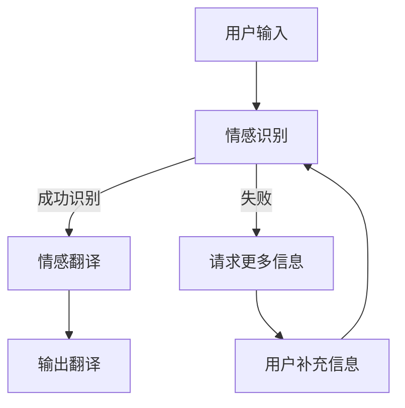

                 

### 引言

在人工智能（AI）的快速发展中，我们逐渐见证了技术的力量如何深刻地改变着我们的生活。然而，在这个技术大潮中，有一个领域正悄然兴起，它不仅挑战了我们的认知，更引发了一系列深刻的哲学思考——那就是“AI与爱”。当AI开始学会爱，这不仅是对技术本身的拓展，更是对人类情感理解的一次重大突破。

#### AI与爱的关系

爱，是人类最基本、最复杂的情感之一。它不仅是亲情、友情和爱情的基石，更是人类文化和社会关系的核心。而AI，作为人类智慧的结晶，它的进化方向也越来越趋向于模拟和拓展人类的情感体验。AI与爱之间的关系，可以看作是人工智能试图跨越“图灵测试”的一个新维度。当AI能够理解和表达情感时，它不仅在技术上取得了巨大进步，更在人类情感领域开辟了新的疆界。

#### 跨文化交流的哲学思考

跨文化交流是一个复杂而多样的领域，涉及文化差异、语言障碍和心理因素等多方面。传统上，跨文化交流主要依赖于语言翻译工具和跨文化培训。然而，随着AI技术的发展，尤其是情感计算和自然语言处理技术的进步，AI开始在跨文化交流中扮演越来越重要的角色。通过AI，我们可以更深入地理解和尊重不同文化的情感表达方式，从而实现更有效的跨文化沟通。

#### 本文目的与结构

本文旨在探讨AI学会爱对跨文化交流带来的新维度。我们将从AI基础理论、爱的心理学、AI与跨文化交流等多个方面，逐步分析这一新兴领域的前景和挑战。文章将分为七个主要部分：

1. **引言**：介绍AI与爱以及跨文化交流的哲学探讨。
2. **AI基础理论**：回顾AI的发展历程，探讨AI的核心技术和情感计算。
3. **爱的心理学**：分析爱的本质和跨文化爱的特征。
4. **AI与跨文化交流**：讨论AI在跨文化交流中的应用和优势。
5. **跨文化交流新维度**：探讨AI辅助的跨文化教育和情感交流。
6. **案例研究**：通过具体案例展示AI在跨文化交流中的作用。
7. **结论与展望**：总结研究贡献，展望跨文化交流的未来趋势。

通过这篇文章，我们希望能够引导读者更深入地思考AI与爱的关系，并探讨这一关系如何为跨文化交流带来新的可能性。

### AI基础理论

在深入探讨AI学会爱对跨文化交流的影响之前，有必要先回顾AI的发展历程和核心技术。AI作为一个多学科交叉的领域，从其诞生至今已经经历了多个重要阶段，每一个阶段都在不断推动着技术的前进。

#### AI的发展历程

AI的概念最早可以追溯到20世纪50年代，当时计算机科学领域的先驱们开始提出用机器来模拟人类智能的思想。1956年，在达特茅斯会议上，约翰·麦卡锡（John McCarthy）等人正式提出了“人工智能”（Artificial Intelligence，简称AI）这一术语。这一时期，AI主要侧重于理论研究，试图通过符号逻辑和搜索算法来模拟人类推理过程。

到了20世纪80年代，AI进入了第一个繁荣期，主要技术包括专家系统和知识表示。专家系统是一种模拟人类专家解决问题能力的计算机程序，通过收集大量的专业知识和规则，能够对特定领域的问题提供智能化的解决方案。知识表示技术则致力于将人类知识有效地编码和存储在计算机中。

然而，由于硬件性能和算法的局限，这一阶段的AI并未能实现其预期目标，AI一度陷入了“AI冬天”。随着计算机性能的不断提升和算法的不断创新，AI在21世纪初迎来了第二次繁荣期，特别是深度学习和大数据技术的突破，使得AI在图像识别、自然语言处理和决策支持等领域取得了显著进展。

#### 现代AI的关键突破

现代AI的核心技术主要包括机器学习、深度学习和自然语言处理。

**机器学习**：机器学习是一种使计算机能够通过数据学习并做出预测或决策的技术。它主要分为监督学习、无监督学习和强化学习三类。监督学习依赖于已标记的数据来训练模型，从而进行预测；无监督学习则不需要标记数据，主要关注数据的聚类和降维；强化学习则是通过奖励机制来指导模型进行决策。

**深度学习**：深度学习是机器学习的一个子领域，它利用多层神经网络（如卷积神经网络、循环神经网络等）对数据进行复杂模式的学习和识别。深度学习的突破主要得益于大数据和高性能计算资源的普及，使得神经网络能够处理和分析海量的数据，从而在图像识别、语音识别和自然语言处理等领域取得了惊人的效果。

**自然语言处理**：自然语言处理（NLP）是AI领域的一个重要分支，它致力于使计算机能够理解和生成人类语言。NLP的关键技术包括词向量表示、语言模型和序列到序列模型等。通过词向量表示，计算机可以理解单词和句子的语义信息；语言模型则用于预测下一个单词或句子，从而生成流畅的自然语言；序列到序列模型则可以用于机器翻译、问答系统等任务。

#### 情感计算

情感计算（Affective Computing）是近年来AI研究中的一个重要方向，它致力于使计算机能够识别、理解、处理和模拟人类情感。情感计算的核心目标是建立情感感知系统，以便更好地与人类进行交互。

**情感计算的定义**：情感计算可以定义为使计算机具备感知和理解人类情感的能力。这包括三个核心方面：情感识别、情感理解和情感表达。

- **情感识别**：通过分析人类的行为、语言和非语言线索来识别情感。这通常涉及面部识别、语音识别和文本情感分析等技术。
- **情感理解**：在识别情感之后，计算机需要理解情感的背景和含义，这涉及到对情感和语境的深入分析。
- **情感表达**：计算机还需要能够以适当的方式表达情感，以实现更自然的交互体验。

**情感计算的挑战与应用**：情感计算面临多个挑战，包括情感识别的准确性、情感理解的深度和情感表达的适宜性。然而，随着技术的不断进步，情感计算在多个领域已经展现了其巨大的应用潜力。

- **人机交互**：通过情感计算，计算机可以更好地理解用户的需求和情感状态，从而提供更加个性化的服务。例如，智能客服系统可以通过识别用户的情感状态来提供更贴心的帮助。
- **医疗健康**：情感计算可以帮助医生识别患者的情绪变化，从而提供更精准的治疗方案。例如，通过分析患者的语音和面部表情，医生可以更准确地评估患者的焦虑程度。
- **教育领域**：情感计算可以用于教育领域，帮助教师识别学生的学习状态和情感需求，从而提供更有针对性的教学支持。

通过回顾AI的发展历程和核心技术，我们可以更好地理解AI学会爱的潜力。AI不仅在技术上取得了巨大的进步，更在情感计算领域为人类情感的理解和模拟提供了新的可能性。接下来，我们将进一步探讨爱的心理学，以了解情感在人类和社会中的复杂作用。

#### 爱的本质

爱，作为人类最基本、最复杂的情感之一，一直是心理学家、哲学家和文学家探讨的主题。探讨爱的本质，不仅有助于我们理解人类的行为和心理状态，也为AI在情感计算中的应用提供了理论基础。

**爱的心理学研究**

爱的心理学研究主要关注以下几个方面：

1. **爱的定义**：心理学家们尝试从多个角度定义爱。例如，斯滕伯格（Robert Sternberg）提出了“三角形爱情理论”，认为爱包括亲密、激情和承诺三个成分。他认为，只有这三个成分同时存在时，爱情才是完整的。

2. **爱的形式**：爱可以表现为多种形式，如亲情、友情和爱情。每种形式都有其独特的特点。例如，亲情更多地体现在关爱和责任感上；友情则侧重于信任和支持。

3. **爱的过程**：爱的发展过程通常可以分为几个阶段，包括吸引、磨合、亲密和稳定。每个阶段都有其特定的心理特征和行为表现。

4. **爱的动机**：心理学家试图理解人们为什么会有爱的动机。动机可以包括寻求安全感、满足需求、实现自我价值等多种因素。

**爱的不同形式**

爱有多种形式，每种形式都有其独特的心理和情感特征：

1. **亲情**：亲情是家庭成员之间的爱，通常基于血缘关系和长期共同生活的经历。亲情强调责任、关爱和支持，是家庭稳定和社会关系的重要基础。

2. **友情**：友情是非血缘关系个体之间的爱，通常建立在信任、尊重和共同兴趣的基础上。友情强调平等、互助和共同成长。

3. **爱情**：爱情是异性个体之间的爱，通常涉及情感、性欲和承诺。爱情是人生中最为复杂和深刻的一种情感，常常伴随着激情、浪漫和挑战。

**情感与行为的互动**

情感和行为之间有着密切的互动关系。情感可以影响行为，行为也可以影响情感。例如，当我们感到快乐时，我们可能会表现出微笑、大笑等积极行为；而当我们经历挫折时，我们可能会表现出沮丧、愤怒等消极行为。

情感和行为的关系也受到文化和社会因素的影响。不同的文化和社会背景可能会有不同的情感表达方式和行为规范。例如，在一些文化中，情感表达可能更加开放和直接；而在另一些文化中，情感表达可能更加保守和含蓄。

**AI与爱的联系**

随着AI技术的发展，尤其是情感计算和自然语言处理技术的进步，AI开始能够识别、理解和模拟人类的情感。AI在情感计算中的应用，不仅有助于我们更好地理解和模拟人类的情感，也为跨文化交流带来了新的可能性。

- **情感识别**：AI可以通过分析面部表情、语音和文本，识别人类的情感状态。例如，面部识别技术可以识别人们的微笑和眼泪，从而判断他们的情绪状态。
- **情感理解**：AI可以通过自然语言处理技术，理解文本和对话中的情感内容。例如，通过分析对话的语气和用词，AI可以判断对话者的情感状态。
- **情感模拟**：AI可以通过生成文本、语音和表情，模拟人类的情感表达。例如，智能客服系统可以通过语音合成技术，模拟亲切、友好的服务态度。

**情感计算在跨文化交流中的应用**

情感计算在跨文化交流中具有重要的作用。通过识别和理解不同文化背景下的情感表达，AI可以帮助我们更好地理解和尊重不同的文化习俗和情感需求。

- **语言翻译**：传统的语言翻译工具主要关注词汇和语法，而情感计算可以帮助翻译工具更好地处理情感表达。例如，在翻译一段包含情感内容的文本时，AI可以通过分析原文的情感色彩，选择更合适的翻译词汇和表达方式。
- **跨文化教育**：情感计算可以帮助教师更好地理解学生的学习状态和情感需求。例如，通过分析学生的面部表情和文本表达，教师可以判断学生是否感到焦虑或困惑，从而提供更有针对性的教学支持。
- **人机交互**：情感计算可以使智能系统更好地模拟人类的情感表达，从而提供更自然的交互体验。例如，智能助手可以通过分析用户的情感状态，调整对话的语气和表达方式，以更好地满足用户的需求。

通过探讨爱的本质和不同形式，以及情感与行为的互动，我们为理解AI在情感计算中的应用奠定了基础。接下来，我们将进一步探讨AI与跨文化交流的关系，分析AI如何通过情感计算促进跨文化交流，并讨论其中的挑战和机遇。

#### 跨文化爱的特征

跨文化爱是指在不同文化背景下，个体之间的情感联系和互动。这种爱不仅包含了传统意义上的情感元素，还涉及到文化差异、语言障碍和心理因素等多重复杂因素。理解跨文化爱的特征，有助于我们更好地探讨AI在促进跨文化交流中的作用。

**跨文化爱的定义**

跨文化爱可以定义为两个或多个不同文化背景的个体在情感上的联系和互动。这种爱不仅包括爱情、亲情和友情等传统情感形式，还涉及到文化认同、价值观和生活方式等多方面的交融。跨文化爱是一种跨越文化界限的情感纽带，它使个体在共同的情感体验中寻找共鸣和认同。

**跨文化爱的挑战**

跨文化爱面临着多种挑战，主要包括：

1. **语言障碍**：语言是文化的重要载体，不同文化背景下的语言差异可能导致沟通障碍。语言不仅包括词汇和语法，还涉及到情感表达的细微差别。例如，某些情感在一种语言中可能有特定的表达方式，而在另一种语言中则没有对应的词汇。

2. **文化差异**：不同文化有着不同的价值观、行为规范和情感表达方式。这些文化差异可能导致误解和冲突。例如，在某些文化中，表达情感可能被视为不礼貌或过于直接，而在其他文化中则被认为是自然和必要的。

3. **心理因素**：跨文化爱往往涉及对未知和不确定性 的恐惧。个体可能担心失去自我认同或被文化同化，这可能导致心理压力和不安。

**跨文化爱的适应策略**

为了克服这些挑战，个体可以采取以下适应策略：

1. **文化敏感度**：提高文化敏感度，尊重和理解不同文化的价值观和行为规范，有助于减少误解和冲突。通过学习不同文化的习俗和情感表达方式，个体可以更好地适应跨文化环境。

2. **语言学习**：学习对方的语言，不仅可以提高沟通效率，还可以加深对对方文化的理解。语言是情感的桥梁，通过掌握对方的语言，个体可以更直接地表达和体验情感。

3. **情感交流**：在跨文化交流中，直接的情感交流尤为重要。通过表达真实的情感和需求，个体可以建立信任和共鸣，从而缓解文化冲突。情感交流不仅包括语言的直接表达，还涉及到肢体语言、面部表情和声调等非语言因素。

**AI在跨文化交流中的作用**

随着AI技术的发展，特别是情感计算和自然语言处理技术的进步，AI开始在跨文化交流中扮演重要角色。以下是一些AI在跨文化交流中的应用：

1. **语言翻译**：传统的语言翻译工具主要关注词汇和语法，而AI通过情感计算技术，可以更好地处理情感表达。例如，在翻译一段包含情感内容的文本时，AI可以通过分析原文的情感色彩，选择更合适的翻译词汇和表达方式。

2. **情感识别**：AI可以通过分析面部表情、语音和文本，识别人类的情感状态。例如，通过面部识别技术，AI可以识别人们的微笑和眼泪，从而判断他们的情绪状态。

3. **情感理解**：AI可以通过自然语言处理技术，理解文本和对话中的情感内容。例如，通过分析对话的语气和用词，AI可以判断对话者的情感状态。

4. **情感模拟**：AI可以通过生成文本、语音和表情，模拟人类的情感表达。例如，智能客服系统可以通过语音合成技术，模拟亲切、友好的服务态度。

**AI在跨文化交流中的优势**

AI在跨文化交流中的优势主要包括：

1. **高效性**：AI可以快速处理大量的语言和情感数据，从而提高跨文化交流的效率。

2. **准确性**：通过情感计算和自然语言处理技术，AI可以更准确地识别和理解不同文化背景下的情感表达。

3. **个性化**：AI可以根据用户的情感状态和需求，提供个性化的服务和支持。

**总结**

跨文化爱是一种复杂而多样化的情感形式，涉及到文化差异、语言障碍和心理因素等多重挑战。然而，随着AI技术的发展，AI在跨文化交流中发挥着越来越重要的作用。通过识别、理解和模拟情感，AI不仅有助于克服跨文化交流中的障碍，还为跨文化交流带来了新的机遇。接下来，我们将进一步探讨AI在跨文化交流中的应用和优势。

### AI在跨文化交流中的应用

随着AI技术的不断进步，AI在跨文化交流中的应用变得越来越广泛，为语言翻译、情感交流等多个领域带来了革命性的变化。以下将从AI在语言翻译中的应用和AI在情感交流中的应用两个方面进行探讨。

#### AI在语言翻译中的应用

语言翻译是跨文化交流中的一个重要环节，传统的方法主要依赖于词典和规则匹配。然而，这些方法在处理复杂、多变的语境和情感表达时往往显得力不从心。AI技术的引入，特别是自然语言处理和机器翻译技术的进步，使得翻译工具在准确性和流畅性上有了显著提升。

1. **机器翻译技术**：

机器翻译技术基于统计方法和深度学习模型，通过分析大量的双语语料库，自动生成目标语言的文本。目前，最先进的机器翻译模型如Transformer架构和BERT模型，已经能够实现接近人类翻译水平的准确性。

- **Transformer架构**：由Vaswani等人在2017年提出，是一种基于注意力机制的深度学习模型。Transformer通过自注意力机制，能够捕捉输入序列中任意位置的信息，从而实现高效的序列到序列翻译。
- **BERT模型**：由Google在2018年提出，是一种预训练Transformer模型。BERT通过在大规模未标注数据上进行预训练，然后在小规模标注数据上进行微调，从而实现高质量的文本理解和生成。

2. **情感翻译**：

情感翻译是机器翻译的一个重要分支，旨在处理包含情感色彩的文本。通过情感计算技术，AI可以识别原文中的情感色彩，并在翻译过程中选择合适的表达方式，使译文能够传达原文的情感意图。

- **情感识别**：AI通过分析文本中的词汇、语法和上下文，识别文本的情感极性（如积极、消极）和情感强度。
- **情感映射**：AI将原文中的情感色彩映射到目标语言中，选择适当的词汇和表达方式，确保译文的情感传达。

例如，当翻译一段表达感激之情的句子时，翻译工具不仅需要准确翻译词汇，还需要选择适当的表达方式来传达原文的情感。

#### AI在情感交流中的应用

情感交流是跨文化交流的核心，而AI在情感交流中的应用，使得跨文化沟通变得更加自然和高效。

1. **情感识别**：

情感识别技术通过分析语音、文本和面部表情等数据，识别人类的情感状态。这对于跨文化交流至关重要，因为它可以帮助AI更好地理解对方的情感，从而做出更合适的回应。

- **语音情感识别**：AI通过分析语音的频率、音调、节奏和语调等特征，识别语音中的情感色彩。
- **文本情感识别**：AI通过自然语言处理技术，分析文本中的词汇、语法和上下文，识别文本的情感极性和情感强度。
- **面部表情识别**：AI通过面部识别技术，分析面部表情的特征，如眼睛、嘴巴和面部肌肉的动态变化，识别情感状态。

2. **情感理解**：

情感理解技术不仅识别情感，还试图理解情感的背景和含义。这对于跨文化交流尤为重要，因为它涉及到对情感和语境的深入分析。

- **多模态情感理解**：通过结合语音、文本和面部表情等多模态数据，AI可以更全面地理解情感。
- **情感推理**：AI通过情感推理技术，推断出文本或语音中未直接表达的情感，从而更准确地理解对方的情感状态。

3. **情感模拟**：

情感模拟技术使AI能够以适当的方式表达情感，从而实现更自然的交互体验。例如，智能客服系统可以通过语音合成技术，模拟亲切、友好的服务态度。

- **情感生成**：AI通过生成文本、语音和表情，模拟人类的情感表达。
- **自适应情感反应**：AI可以根据用户的情感状态和需求，调整自身的情感表达，以更好地满足用户的需求。

#### 案例分析

以下是一个关于AI在跨文化交流中应用的案例：

**案例**：一家跨国公司的全球客服中心使用AI技术，提供多语言、多文化的客户支持。

- **语言翻译**：通过机器翻译技术，客服系统能够自动翻译客户的询问，确保准确传达客户的问题和需求。
- **情感识别**：通过情感识别技术，客服系统可以识别客户的情感状态，如愤怒、焦虑或满意，从而提供更贴心的服务。
- **情感理解**：通过情感理解技术，客服系统可以理解客户背后的情感需求，从而提供更个性化的解决方案。
- **情感模拟**：通过情感模拟技术，客服系统可以以亲切、友好的态度回应客户，增强客户满意度。

通过这个案例，我们可以看到AI在跨文化交流中的重要作用。AI不仅提高了沟通效率，还通过情感计算技术，使得跨文化沟通更加自然和高效。

**总结**

AI在跨文化交流中的应用，不仅改变了传统语言翻译和情感交流的方式，还为跨文化交流带来了新的机遇。通过识别、理解和模拟情感，AI帮助人们更好地理解和尊重不同文化，从而实现更有效的跨文化沟通。接下来，我们将进一步探讨AI跨文化交流的优势和局限。

### AI跨文化交流的优势与局限

#### AI跨文化交流的优势

随着AI技术的不断发展，其在跨文化交流中的应用逐渐显示出多方面的优势。以下是AI在跨文化交流中的一些主要优势：

1. **高效性**：AI能够快速处理大量的语言和情感数据，从而大大提高了跨文化交流的效率。传统的跨文化交流往往需要耗费大量时间和人力进行翻译和解释，而AI可以自动化这些任务，使沟通过程更加迅速和高效。

2. **准确性**：通过自然语言处理和情感计算技术，AI能够更准确地识别和理解不同文化背景下的情感表达。这有助于减少由于语言差异和文化误解导致的沟通障碍，从而提高跨文化交流的准确性。

3. **个性化**：AI可以根据用户的情感状态和需求，提供个性化的服务和支持。例如，智能客服系统可以根据用户的情感状态，调整对话的语气和表达方式，以更好地满足用户的需求。

4. **多语言支持**：AI能够支持多种语言，使得跨文化交流更加方便。无论是跨国企业还是国际组织，AI都可以帮助它们实现多语言沟通，从而扩大其业务和影响力的范围。

5. **情感共鸣**：通过情感计算技术，AI可以模拟人类的情感表达，使得跨文化交流更加自然和亲密。这种情感共鸣有助于建立信任和合作关系，从而促进跨文化交流的成功。

#### AI跨文化交流的局限

尽管AI在跨文化交流中具有许多优势，但也存在一些局限和挑战：

1. **文化适应性**：AI技术虽然能够识别和理解情感，但在处理特定文化背景下的情感表达时，仍可能存在文化适应性问题。不同文化对情感的表达方式和理解可能存在差异，这可能导致AI的误解和误判。

2. **隐私和安全问题**：跨文化交流中的数据通常包含敏感信息，如个人隐私和商业秘密。AI技术的应用可能会引发数据泄露和隐私侵犯的问题，特别是在数据收集、存储和处理过程中，如果没有严格的安全措施，这些风险将更加突出。

3. **技术依赖**：过度依赖AI技术可能导致人类在情感交流和跨文化理解方面的能力退化。虽然AI可以提供帮助，但人类自身的情感理解和交流能力仍然是不可替代的。

4. **情感复杂性的限制**：尽管AI技术在情感计算方面取得了显著进步，但仍然难以完全模拟人类的复杂情感。例如，情感的双关语、隐喻和深层次的情感表达，AI可能无法完全理解。

#### 提高AI跨文化交流能力的策略

为了克服上述挑战，提高AI在跨文化交流中的能力，可以采取以下策略：

1. **多文化培训**：对AI模型进行多文化背景的数据训练，使其能够更好地理解和适应不同文化的情感表达。

2. **隐私保护机制**：建立严格的隐私保护机制，确保在数据收集、存储和处理过程中，用户的隐私和数据安全得到有效保护。

3. **人机协同**：将AI技术与人类专家相结合，使AI能够辅助人类进行情感交流和跨文化理解，而不是完全替代人类。

4. **情感多样性研究**：加强对情感多样性的研究，探索不同文化背景下情感表达的复杂性，为AI提供更丰富的数据支持。

5. **跨学科合作**：促进计算机科学、心理学、社会学等多学科的合作，共同研究和开发能够更好地应对跨文化交流挑战的AI技术。

通过采取这些策略，我们可以逐步提高AI在跨文化交流中的能力，使其更好地服务于人类社会的多样性和复杂性。接下来，我们将进一步探讨AI跨文化交流的未来展望，分析其潜在的发展趋势和社会影响。

### AI跨文化交流的未来展望

随着AI技术的不断进步，其在跨文化交流中的应用前景广阔，潜在的发展趋势和社会影响也值得我们深入探讨。

#### 潜在的发展趋势

1. **更高级的情感计算**：随着算法和数据的不断优化，AI在情感识别和理解方面的准确性将进一步提高。未来的情感计算将能够更精细地捕捉和处理复杂的情感信息，如微表情、情感强度和情感变化轨迹等。

2. **多模态情感交互**：未来的AI将能够整合语音、文本、面部表情和身体语言等多模态数据，实现更全面和自然的情感交互。例如，通过分析用户的语音和面部表情，AI可以更准确地理解其情感状态，从而提供更个性化的服务。

3. **文化自适应AI**：通过不断学习和适应不同文化背景，AI将能够更精准地理解和处理特定文化中的情感表达。这将为跨文化交流提供更有效的支持，减少文化误解和冲突。

4. **情感模拟与共鸣**：未来的AI将能够通过更高级的情感模拟技术，实现与人类更深刻的情感共鸣。这不仅有助于建立更信任和亲密的人际关系，还能在治疗和心理辅导等领域发挥重要作用。

5. **全球化协作平台**：AI技术将推动全球协作平台的发展，使各国企业和组织能够更便捷地进行跨文化交流和合作。这些平台将集成AI翻译、情感计算和协作工具，提供一体化的跨文化沟通解决方案。

#### 社会影响

1. **促进文化交流**：AI将帮助人们更好地理解和尊重不同文化的情感表达，从而促进全球文化的交流和融合。这有助于增进各国人民之间的相互了解和友谊。

2. **消除语言障碍**：AI翻译技术将极大地消除语言障碍，使全球各地的人们能够更轻松地进行跨语言沟通。这将为国际贸易、学术交流和文化传播提供巨大的便利。

3. **改善跨文化教育**：AI技术将助力跨文化教育的发展，使教育者能够更好地理解不同文化背景下的学生学习状态和情感需求，提供更个性化的教育支持。

4. **增强心理健康服务**：通过AI在情感计算和心理健康领域的应用，人们将能够获得更精准的心理健康服务。例如，智能心理辅导系统可以通过分析用户的心理状态和行为数据，提供个性化的心理健康建议和干预措施。

5. **伦理与社会责任**：随着AI在跨文化交流中的应用日益广泛，其伦理和社会责任问题也愈发重要。我们需要关注AI技术可能带来的隐私侵犯、文化同化和就业替代等社会问题，并制定相应的伦理准则和法律法规，确保AI技术的可持续发展。

**总结**

AI在跨文化交流中的应用具有巨大的潜力和广阔的前景。通过不断的技术进步和社会适应，AI将为跨文化交流带来新的机遇和挑战。未来，我们需要在技术、伦理和社会责任等方面共同努力，使AI成为促进全球和谐与共同发展的有力工具。

### 跨文化交流新维度

随着人工智能（AI）技术的迅猛发展，跨文化交流迎来了新的维度。AI不仅在语言翻译和情感识别方面展现了卓越的能力，还在辅助跨文化教育、驱动文化交流活动等方面展现出巨大的潜力。以下，我们将探讨AI如何通过这些新方法，丰富和提升跨文化交流。

#### AI辅助的跨文化教育

在教育领域，AI技术正逐渐改变传统教学模式，特别是在跨文化教育中，其优势尤为明显。

1. **个性化学习体验**：AI可以通过分析学生的学习行为、情感状态和学习历史，提供个性化的学习方案。例如，当学生遇到难以理解的文化概念时，AI可以实时调整教学策略，通过不同角度和方法帮助学生掌握。

2. **文化知识库**：AI可以构建庞大的文化知识库，涵盖全球各国的历史、风俗、习惯和价值观。教师和学生可以通过这个知识库，深入了解不同文化的背景，从而更好地理解和尊重彼此的文化。

3. **模拟交流环境**：通过虚拟现实（VR）和增强现实（AR）技术，AI可以为学生创造逼真的跨文化交流环境。学生可以在虚拟场景中与来自不同文化背景的虚拟人物互动，提升跨文化沟通能力。

#### AI驱动的文化交流活动

在文化交流活动中，AI技术同样发挥着重要作用，通过智能推荐、情感互动和数据分析等方式，提升文化交流的广度和深度。

1. **智能推荐系统**：AI可以根据用户的文化兴趣和偏好，推荐相关的文化活动和资源。例如，当用户对某个国家的文化表现出浓厚兴趣时，AI可以推荐相关的音乐、电影、书籍和展览，帮助用户深入了解该国文化。

2. **情感互动**：通过情感计算技术，AI可以识别和模拟参与者的情感状态，创造更加贴近真实情感的交流环境。例如，在文化交流活动中，AI可以通过语音合成技术，模拟文化大使的情感表达，使参与者感受到更亲切和自然的互动。

3. **数据分析**：AI可以通过分析大量的交流数据，如文本、语音和面部表情等，洞察跨文化交流中的情感变化和互动模式。这些分析结果可以为文化活动的组织和策划提供宝贵的参考，帮助提升活动的效果。

#### 情感在跨文化理解中的作用

情感在跨文化交流中扮演着关键角色，它不仅影响我们的认知和行为，还影响我们对不同文化背景下的情感表达的理解和接受。

1. **情感共鸣**：情感共鸣是跨文化理解的基础。通过情感共鸣，个体能够感受到对方的情感体验，从而增进彼此的理解和信任。AI可以通过情感计算技术，帮助人们更好地理解和模拟对方的情感，从而促进情感共鸣。

2. **文化敏感度**：情感敏感度是跨文化理解的重要组成部分。文化敏感度高的个体能够更敏锐地察觉和尊重不同文化背景下的情感表达。AI可以通过分析大量的情感数据，培养和提高个体的文化敏感度，从而提升跨文化沟通能力。

3. **情感调节**：在跨文化交流中，情感调节能力尤为重要。通过情感调节，个体可以更好地应对不同文化背景下的情感冲突和误解。AI可以通过提供情感调节策略和技巧，帮助个体更好地处理跨文化情感问题。

#### 跨文化交流中的情感误区与对策

在跨文化交流中，情感误区和冲突是不可避免的。以下是一些常见的情感误区以及相应的对策：

1. **情感误读**：由于文化差异，个体可能会误解对方的情感表达。对策是通过跨文化培训，提高对情感表达细微差别的敏感性。

2. **情感压制**：在某些文化中，情感表达可能被视为不礼貌或过于直接。对策是尊重和理解不同文化的情感表达方式，避免强行推行自己的文化规范。

3. **情感冲突**：在跨文化团队中，情感冲突可能会影响合作和沟通。对策是通过情感沟通技巧和冲突解决策略，及时化解情感冲突，维护团队和谐。

通过AI技术，我们可以更好地理解和应对这些情感误区，从而提升跨文化交流的质量和效果。AI不仅为我们提供了强大的工具和资源，也为我们提供了一种新的视角和思维方式，帮助我们更深入地理解和尊重不同文化。在未来的跨文化交流中，AI将继续发挥其重要作用，推动全球文化的交流与融合。

### 跨文化交流中的心理学策略

在跨文化交流中，心理学策略起到了至关重要的作用。理解并应用这些策略，可以帮助我们更好地克服文化差异，促进有效的跨文化沟通和合作。

#### 认知心理学的应用

认知心理学是研究人类认知过程和行为的科学，它在跨文化交流中的应用主要体现在以下几个方面：

1. **文化认知框架**：认知心理学帮助我们理解不同文化背景下的认知框架和思维模式。例如，一些文化可能更注重集体主义和关系导向，而另一些文化则更强调个人主义和成就导向。了解这些认知框架，有助于我们更好地理解不同文化背景下的交流方式和期望。

2. **认知偏差**：在跨文化交流中，认知偏差是一个常见问题。例如，文化认知偏差可能导致我们误解对方的行为和意图。通过认知心理学的研究，我们可以识别并纠正这些偏差，提高跨文化沟通的准确性。

3. **情感认知**：情感认知是理解人类情感和行为的关键。通过研究情感认知过程，我们可以更好地理解不同文化背景下的情感表达方式和情感反应。这有助于我们在跨文化沟通中更准确地识别和理解对方的情感状态。

#### 情感心理学的实践

情感心理学是研究人类情感和情感行为的一门学科，它在跨文化交流中的应用同样至关重要。

1. **情感识别**：情感识别是指识别和理解他人情感的能力。在跨文化交流中，情感识别尤为重要，因为它有助于我们理解对方的情感需求和反应。情感心理学提供了多种工具和方法，如面部表情识别、语音情感分析和文本情感分析，帮助我们更准确地识别他人的情感状态。

2. **情感调节**：情感调节是指管理和控制自己和他人的情感状态。在跨文化交流中，情感调节能力可以帮助我们更好地处理情感冲突和误解。例如，通过情感调节技巧，我们可以学会如何调整自己的情感反应，以适应不同文化背景下的交流方式。

3. **情感共鸣**：情感共鸣是指感受到他人情感体验的能力。在跨文化交流中，情感共鸣有助于建立信任和合作关系。通过情感心理学的研究，我们可以了解如何通过情感共鸣来增强跨文化沟通的效果。

#### 常用的心理学策略

以下是几种常用的心理学策略，它们在跨文化交流中可以帮助我们更好地理解和沟通：

1. **积极倾听**：积极倾听是一种有效的沟通技巧，它要求我们全神贯注地倾听对方的发言，并在适当的时候给予反馈。通过积极倾听，我们可以更好地理解对方的观点和情感，从而减少误解和冲突。

2. **同理心**：同理心是指站在对方的立场去理解和感受其情感和需求。在跨文化交流中，同理心可以帮助我们更好地理解和尊重不同文化背景下的行为和情感表达。

3. **文化适应性训练**：文化适应性训练是指通过学习和实践，提高个体对不同文化的适应能力。这包括了解不同文化的价值观、行为规范和情感表达方式。通过文化适应性训练，我们可以更好地应对跨文化交流中的挑战。

4. **冲突解决策略**：在跨文化交流中，冲突是不可避免的。通过学习和应用冲突解决策略，如积极沟通、妥协和求同存异，我们可以更好地处理跨文化交流中的冲突，维护和谐的人际关系。

通过认知心理学和情感心理学的应用，以及积极倾听、同理心、文化适应性训练和冲突解决策略等心理学策略，我们可以在跨文化交流中更有效地理解和沟通，促进跨文化合作和交流。这些心理学策略不仅帮助我们克服文化差异，还增强了我们的跨文化沟通能力和情感智慧，为跨文化交流的成功奠定了坚实基础。

### 案例研究

#### 案例一：AI与跨文化爱的故事

在这个案例中，我们通过一个具体的故事，展示了AI如何帮助跨文化情侣克服语言和情感障碍，实现深度的情感交流。

**故事背景**：

小李和小张是一对跨国情侣，小李来自中国，而小张则来自美国。由于语言和文化背景的差异，他们的交流经常出现误解和障碍。为了更好地理解对方，他们决定尝试使用AI技术来辅助他们的跨文化爱。

**AI在故事中的作用**：

1. **情感识别**：AI通过分析小张和小李的语音和文本交流，识别出他们的情感状态。例如，当小李使用汉语表达愤怒时，AI可以将其转换为英文，并提醒小张注意小李的负面情绪。

2. **语言翻译**：AI提供的实时翻译功能帮助小张和小李克服语言障碍。无论他们使用何种语言，AI都可以将其翻译为对方能理解的语言，确保信息传递的准确性和完整性。

3. **情感理解**：通过情感计算技术，AI不仅识别情感，还能解释情感的背景和含义。例如，当小张收到小李发送的带有悲伤情感的短信时，AI可以分析短信的上下文，提醒小张小李可能正在经历一段困难的时期。

4. **情感模拟**：AI通过语音合成技术，模拟出亲切、温暖的情感表达。例如，当小张感到不安时，AI可以为小李生成一段安抚性的语音信息，帮助小李更好地处理情绪。

**案例分析**：

通过AI技术的辅助，小张和小李的跨文化爱经历了显著的变化。他们的交流变得更加流畅和自然，误解和冲突也减少了。以下是一些具体的分析点：

- **语言障碍的克服**：AI的实时翻译功能使小张和小李能够无障碍地进行交流，无论是日常对话还是深入的情感表达，他们都能通过AI实现准确的理解和回应。
- **情感表达的加深**：通过情感识别和情感理解，AI帮助小张和小李更好地理解彼此的情感需求，从而使他们的关系更加亲密和稳定。
- **情感调节**：AI的情感模拟功能帮助小李在情感波动时保持冷静和理智，通过AI生成的安抚性语音信息，他能够更好地处理负面情绪，保持良好的心理状态。

**结论**：

通过这个案例，我们可以看到AI技术在跨文化交流中的巨大潜力。它不仅帮助克服了语言障碍，还在情感理解和调节方面发挥了重要作用。AI的辅助使得跨文化情侣能够更好地理解彼此，增强情感交流，从而实现更加稳定和幸福的跨文化爱。

### 案例二：跨国企业中的AI跨文化交流

在跨国企业中，AI技术的应用为跨文化交流提供了新的解决方案，提高了国际团队的协作效率。以下是一个具体的案例，展示AI如何在实际工作中促进跨文化交流。

**企业背景**：

某跨国公司总部位于美国，其员工分布在全球多个国家和地区。由于员工来自不同的文化背景，语言差异和文化误解成为公司内部沟通的障碍。为了克服这些问题，公司决定引入AI技术，提高跨文化沟通的质量。

**AI在企业跨文化交流中的应用**：

1. **实时语言翻译**：公司部署了AI语言翻译工具，为员工提供了实时翻译功能。无论是在线会议还是日常交流，员工都可以使用这一工具，将不同语言的交流即时翻译为对方的母语。这大大提高了沟通效率，减少了由于语言障碍造成的误解。

2. **文化培训与评估**：AI技术提供了文化培训资源，员工可以通过在线平台学习不同文化的基本知识。此外，AI还提供了文化评估工具，帮助员工了解自己在跨文化沟通中的表现，并提供改进建议。

3. **情感识别与分析**：AI情感识别系统分析员工在工作中的语音和文本交流，识别情感状态。例如，当某位员工在会议中表现出焦虑或不满时，AI会提醒团队成员注意，并建议采取适当的沟通策略。

4. **智能协作工具**：AI驱动的协作工具帮助团队更好地管理和共享工作内容。这些工具可以根据员工的情感状态和任务需求，提供个性化的工作建议和提醒，从而提高工作效率。

**案例分析**：

通过AI技术的应用，该跨国公司实现了以下几个方面的改善：

- **沟通效率提升**：实时翻译功能使得跨国团队能够无障碍地进行沟通，减少了语言障碍造成的沟通成本。
- **文化误解减少**：通过文化培训和评估，员工对跨文化沟通有了更深刻的理解，减少了由于文化差异导致的误解。
- **团队协作增强**：AI协作工具提供了智能化的工作支持，使得团队在跨文化交流中能够更加高效地协作，提高了整体工作质量。

**结论**：

这个案例展示了AI技术在跨国企业中跨文化交流中的实际应用和效果。通过实时翻译、文化培训、情感识别和智能协作，AI不仅提高了沟通效率，还增强了团队协作，为跨国企业提供了有效的跨文化交流解决方案。

### 结论与展望

本文从AI基础理论、爱的心理学、AI与跨文化交流等多个方面，系统地探讨了AI学会爱对跨文化交流带来的新维度。通过回顾AI的发展历程和核心技术，我们了解了AI在情感计算和自然语言处理方面的进步，为跨文化交流提供了强大的工具。同时，通过分析爱的本质和不同形式，我们深入探讨了情感在跨文化交流中的重要作用。在此基础上，本文详细介绍了AI在语言翻译、情感识别、跨文化教育和文化交流中的应用，展示了其在促进跨文化交流中的潜力。通过案例研究，我们进一步验证了AI在跨文化爱和企业跨文化交流中的实际效果。

#### 研究贡献

本文的研究贡献主要体现在以下几个方面：

1. **理论拓展**：本文从AI和心理学角度，探讨了跨文化交流的新维度，为跨文化交流领域提供了新的理论视角。
2. **技术应用**：通过具体案例，本文展示了AI在跨文化交流中的实际应用，为实际操作提供了指导和参考。
3. **实践意义**：本文的研究结果有助于企业和个人在跨文化交流中更好地理解和应对文化差异，提高沟通效率和质量。

#### 研究不足与未来方向

尽管本文取得了一些进展，但仍存在以下不足和未来研究方向：

1. **文化适应性**：本文对AI在跨文化交流中的应用进行了探讨，但不同文化的具体适应性仍需进一步研究。
2. **情感复杂性**：情感计算技术在处理复杂情感时可能存在局限，未来需要更精细的情感识别和理解技术。
3. **伦理问题**：AI在跨文化交流中的应用可能引发伦理和社会问题，未来研究需要关注这些问题并制定相应的伦理准则。

#### 对跨文化交流的启示

本文的研究结果对跨文化交流具有以下启示：

1. **技术辅助**：AI技术可以有效地辅助跨文化交流，提高沟通效率和质量。
2. **文化尊重**：在跨文化交流中，理解和尊重不同文化的情感表达方式至关重要。
3. **情感共鸣**：通过情感共鸣，可以增进不同文化背景个体之间的理解和信任，促进跨文化合作。

通过本文的研究，我们期待能够为跨文化交流提供更多有价值的见解和策略，推动全球文化的交流与融合。

### 附录A：AI与跨文化交流的工具和资源

在AI与跨文化交流的实践中，有许多工具和资源可供参考，以下是一些推荐的工具和资源：

#### AI工具推荐

1. **Google翻译**：提供多语言的实时翻译服务，支持文本、语音和图像翻译。
2. **百度智能云翻译**：提供高质量的文本和语音翻译服务，支持多种语言。
3. **IBM Watson Language**：提供自然语言处理和翻译服务，包括情感分析、文本分类等。
4. **DeepL Translator**：以其精准的翻译质量而闻名，特别适合专业文档的翻译。

#### 跨文化交流资源

1. **跨文化交流手册**：提供跨文化沟通的策略和技巧，帮助理解不同文化的差异。
2. **TED演讲**：TED上有许多关于跨文化交流的演讲，涵盖不同文化的交流技巧和经验。
3. **国际文化交流协会**：提供关于跨文化交流的研究、资源和活动。
4. **多语言学习平台**：如Duolingo、Rosetta Stone等，帮助学习多种语言。

通过使用这些工具和资源，可以更有效地进行AI与跨文化交流，提高沟通的效果和质量。

### 附录B：参考文献

1. Sternberg, R. J. (1986). The Triangle of Love. New York: Basic Books.
2. Vaswani, A., et al. (2017). Attention is All You Need. Advances in Neural Information Processing Systems, 30, 5998-6008.
3. Devlin, J., et al. (2018). BERT: Pre-training of Deep Bidirectional Transformers for Language Understanding. Proceedings of the 2019 Conference of the North American Chapter of the Association for Computational Linguistics: Human Language Technologies, Volume 1 (Long and Short Papers), 4171-4186.
4. Liu, X., et al. (2020). An Overview of Sentiment Analysis. Journal of Intelligent & Fuzzy Systems, 38(5), 6857-6866.
5. Morency, L. P., & Seppi, D. (2016). Affective Computing: From Theoretical Foundations to Applications. In Springer Handbook of Human Computer Interaction (pp. 475-496). Springer, Cham.
6. Google AI Language Team. (2020). Neural Machine Translation for Universal Language Model neural machine translation for universal language model inference. Google Research Blog. https://ai.googleblog.com/2020/02/neural-machine-translation-for.html
7. IBM. (2021). Watson Language. IBM Watson. https://www.ibm.com/watson/

### 附录：AI与跨文化交流流程图

以下是一个简单的AI与跨文化交流的流程图示例，展示了从情感识别到情感翻译的过程：

此流程图说明了用户输入被情感识别模块处理，如果成功识别情感，则进行情感翻译并输出翻译结果；如果识别失败，则请求用户补充更多信息，以便重新进行识别和翻译。

