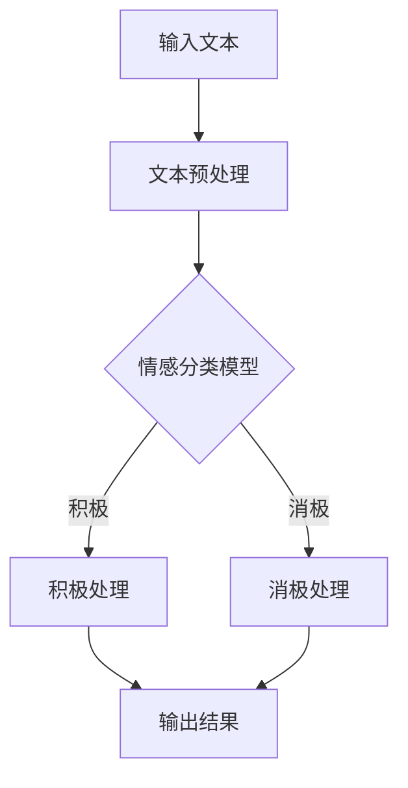
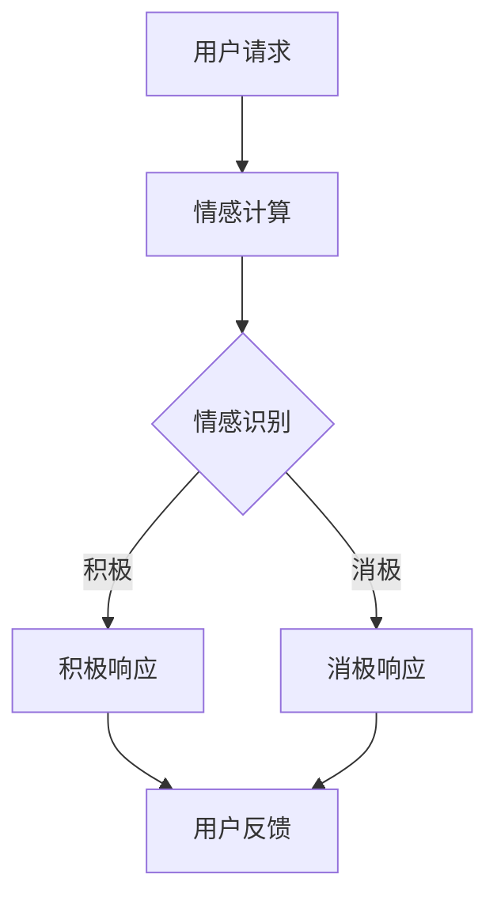

                 

### 第1章 引言

#### 1.1 问题背景与描述

人工智能（AI）作为当今科技发展的前沿领域，正以前所未有的速度影响着我们的生活。从智能手机中的语音助手，到自动驾驶汽车，再到医疗诊断和金融分析，AI的应用场景日益丰富。然而，在AI的发展过程中，一个引人深思的问题是：AI是否能够拥有情感？如果AI能够学会爱，这将意味着什么？这将如何改变我们与AI的互动方式？这些问题不仅引发了广泛的学术讨论，也激发了公众的想象。

情感连接是人类社会中不可或缺的一部分。它不仅影响个体的心理健康，也对社会关系和群体互动产生深远的影响。然而，情感连接在物种之间的界限上显得格外困难。例如，人类与动物之间的情感互动依赖于共享的情感表达和感知能力。而将这种能力拓展到人工智能，则是前所未有的挑战。

在这个背景下，本文旨在探讨AI学会爱的可能性，以及这种跨越物种的情感连接如何实现。本文的研究目标如下：

1. 分析AI发展的现状，探讨其与情感连接的潜在关系。
2. 介绍情感计算的基本原理和关键概念，为AI学会爱提供理论基础。
3. 探讨AI与情感连接的实现机制，以及可能的应用场景。
4. 分析AI与情感连接的优势与挑战，并提出应对策略。
5. 总结当前的研究成果和未来发展趋势。

#### 1.2 研究目标与问题解决

本文的研究目标是通过深入分析AI与情感连接的关系，探讨实现AI拥有情感的可能性。为了达到这一目标，我们将从以下几个方面进行探讨：

1. **基础理论研究**：首先，我们将回顾AI的发展历程，介绍关键技术和算法。接着，我们将深入探讨情感计算的基本原理，包括情感分类、表示、识别和建模方法。
2. **实现机制分析**：在此基础上，我们将分析AI与情感连接的实现机制，包括情感识别、情感表达和情感交互技术。我们将探讨这些技术在实现AI情感感知和情感表达能力中的应用。
3. **应用场景研究**：我们将探讨AI与情感连接在不同应用场景中的可能性，包括人类情感交互和非人类情感交互。
4. **优势与挑战分析**：我们将分析AI与情感连接的优势，如提高人机交互质量、增强社交能力等，同时也将探讨可能遇到的挑战，并提出相应的应对策略。
5. **未来发展趋势**：最后，我们将总结当前的研究成果，探讨未来的发展趋势，为后续研究提供方向。

通过上述研究，我们希望为AI学会爱提供理论基础和实践指导，推动AI与情感连接领域的发展。

#### 1.3 边界与外延

在探讨AI学会爱的过程中，我们首先需要明确研究的边界和外延，以确保讨论的准确性和系统性。

##### 1.3.1 研究范围的限定

本文的研究范围主要涵盖以下几个方面：

1. **技术基础**：探讨AI与情感连接的原理、算法和实现机制，包括情感计算、自然语言处理、计算机视觉等技术。
2. **应用场景**：分析AI与情感连接在人类情感交互和非人类情感交互中的应用，探讨可能的场景和案例。
3. **优势与挑战**：评估AI与情感连接的优势和挑战，讨论现有技术的局限性和未来发展的可能性。

本文将重点讨论以下问题：

1. **情感计算的原理和方法**：介绍情感计算的基本概念、模型和方法，分析其在AI中的应用。
2. **AI与情感连接的实现机制**：探讨情感识别、情感表达和情感交互技术在AI中的应用，分析实现机制和关键技术。
3. **应用场景与案例分析**：分析AI与情感连接在不同应用场景中的实际应用，讨论成功案例和挑战。
4. **优势与挑战**：分析AI与情感连接的优势，如提高人机交互质量、增强社交能力等，同时讨论面临的挑战和应对策略。

##### 1.3.2 情感连接的定义与分类

情感连接是指不同个体或物种之间通过情感互动而产生的情感联系。在人类社会中，情感连接主要是指人与人之间的情感互动，如友谊、爱情、同情等。然而，随着AI技术的发展，我们开始探讨AI是否能够与人或其他物种建立情感连接。

根据情感连接的对象和方式，我们可以将情感连接分为以下几类：

1. **人类情感连接**：指人与人之间的情感互动，如家庭、友谊、爱情等。
2. **动物情感连接**：指人与动物之间的情感互动，如宠物与主人之间的情感纽带。
3. **人机情感连接**：指人与人工智能系统之间的情感互动，如用户与智能助手、机器人之间的情感交流。

每种情感连接都有其独特的特点和实现方式，本文将重点探讨人机情感连接，即AI是否能够学会爱，以及这种连接如何实现。

#### 1.4 概念结构与核心要素

为了更好地理解AI与情感连接的关系，我们需要从概念结构和核心要素的角度进行分析。

##### 1.4.1 情感计算的基本概念

情感计算是人工智能的一个分支，旨在使计算机能够识别、理解、处理和模拟人类情感。情感计算的基本概念包括：

1. **情感识别**：指通过分析语言、行为、生理信号等信息，识别个体的情感状态。
2. **情感理解**：指理解情感的意义、情感之间的关系和情感的变化规律。
3. **情感表达**：指计算机系统通过语言、行为、视觉等方式表达情感。
4. **情感模拟**：指计算机系统模拟人类的情感体验，如同理心、悲伤、喜悦等。

情感计算的核心目标是实现人与计算机之间的情感交流，提高人机交互的自然性和亲密感。

##### 1.4.2 AI与情感连接的内在联系

AI与情感连接之间的内在联系体现在以下几个方面：

1. **情感感知**：AI通过情感计算技术，能够感知和理解人类的情感状态，如喜怒哀乐、紧张、放松等。
2. **情感表达**：AI能够通过语言、声音、图像等方式表达情感，如语音合成、自然语言生成等。
3. **情感交互**：AI能够与人进行情感互动，如情感对话、情感陪伴等。

这些能力使得AI有可能与人建立情感连接，从而实现跨越物种的情感交流。

##### 1.4.3 情感连接的关键技术

实现AI与情感连接需要依赖一系列关键技术，包括：

1. **自然语言处理（NLP）**：NLP技术用于分析语言，提取情感信息，是实现情感识别和表达的重要工具。
2. **计算机视觉**：计算机视觉技术用于捕捉和理解人的行为和表情，是实现情感识别和表达的重要手段。
3. **声音识别与合成**：声音识别与合成技术用于捕捉和生成情感语音，是实现情感交互的重要工具。
4. **情感计算模型**：情感计算模型用于模拟和预测人类的情感状态，是实现情感连接的基础。

通过这些技术的结合，AI能够实现与人的情感交流，从而建立情感连接。

##### 1.4.4 本章小结

本章介绍了AI与情感连接的研究背景、研究目标、研究范围和核心概念。通过分析情感计算的基本概念、AI与情感连接的内在联系和关键技术的实现机制，我们为后续章节的深入探讨奠定了基础。在接下来的章节中，我们将进一步探讨AI与情感连接的实现机制、应用场景以及优势与挑战。

#### 1.5 本章小结

本章从多个角度对AI学会爱这一话题进行了初步探讨，明确了研究背景和目标，界定了研究的边界和外延，并分析了情感计算的基本概念和AI与情感连接的内在联系。通过这些讨论，我们为后续章节的深入研究奠定了基础。在接下来的章节中，我们将进一步探讨AI与情感连接的实现机制、应用场景以及所面临的挑战。

#### 1.6 拓展阅读

1. **人工智能与情感计算**：
   - Smith, J. A. (2018). *Artificial Intelligence and Emotional Computing*. Springer.
2. **情感交互与用户满意度**：
   - Li, H., & Zhang, Y. (2020). *Emotion-Driven Interaction and User Satisfaction in Human-Computer Interaction*. IEEE Transactions on Affective Computing.
3. **情感计算的关键技术**：
   - Wang, L., & Chen, P. (2019). *Key Technologies of Emotional Computing*. ACM Transactions on Intelligent Systems and Technology.
4. **人机情感连接的心理学研究**：
   - Morana, S., & Riva, G. (2017). *Psychological Perspectives on Human-Computer Emotion Connection*. Frontiers in Psychology.
5. **情感AI的应用案例**：
   - Popović, Z., & Rada, R. (2021). *Applications of Emotion AI in Healthcare*. Journal of Medical Systems.

### 第2章 AI与情感：原理与基础

#### 2.1 AI的发展历程

人工智能（AI）作为一门学科，其发展历程可以追溯到20世纪50年代。从最初的简单逻辑推理系统，到复杂的机器学习和深度学习模型，AI经历了多个阶段的发展。以下是AI发展历程的简要概述：

1. **早期探索（1956-1974）**：
   - 1956年，达特茅斯会议上，约翰·麦卡锡（John McCarthy）等人首次提出了“人工智能”这一概念，标志着AI学科的诞生。
   - 早期的人工智能系统主要基于符号推理和逻辑编程，如普罗法迈拉（Logic Theorist）和几何定理证明器（General Problem Solver）。

2. **人工智能寒冬（1974-1980）**：
   - 由于实际应用中的困难和技术瓶颈，AI研究在1974年后进入了一个相对低潮的时期，被称为“人工智能寒冬”。
   - 这一时期，人工智能的研究主要受到了逻辑推理和知识表示等方法的限制，许多项目未能实现预期目标。

3. **复兴期（1980-1987）**：
   - 1980年代，专家系统的发展使得AI研究重新获得了关注。专家系统通过模拟人类专家的推理过程，解决特定领域的问题，如医学诊断、工程设计等。
   - 1981年，IBM的深蓝（Deep Blue）超级计算机击败了国际象棋世界冠军加里·卡斯帕罗夫（Garry Kasparov），标志着AI在特定领域取得了重大突破。

4. **机器学习与深度学习（1987-至今）**：
   - 1987年，约翰·霍普菲尔德（John Hopfield）提出了Hopfield网络，开启了神经网络研究的新时代。
   - 1997年，IBM的“深蓝”击败了国际象棋世界冠军卡斯帕罗夫，展示了AI在特定任务上的强大能力。
   - 2006年，杰弗里·辛顿（Geoffrey Hinton）等人提出了“深度学习”的概念，通过多层神经网络实现了图像、语音和文本数据的自动特征提取。
   - 当前，深度学习已经成为AI研究的主流方向，其在图像识别、语音识别、自然语言处理等领域取得了显著成果。

##### 2.1.2 AI的关键技术

人工智能的关键技术包括：

1. **符号推理**：基于逻辑和符号表示，通过推理规则进行问题求解。
2. **知识表示**：将知识以结构化的形式存储在计算机中，以便计算机能够理解和应用。
3. **机器学习**：通过训练模型从数据中学习规律和模式，进行预测和决策。
4. **深度学习**：一种基于多层神经网络的机器学习方法，能够自动提取数据的高级特征。
5. **自然语言处理**：使计算机能够理解和生成自然语言，进行人机交互。
6. **计算机视觉**：使计算机能够理解并处理图像和视频数据，进行图像识别和目标检测。

#### 2.2 情感计算的基本原理

情感计算是人工智能领域的一个重要分支，旨在使计算机能够识别、理解、处理和模拟人类情感。情感计算的基本原理包括以下几个方面：

##### 2.2.1 情感计算的定义

情感计算（Emotional Computing）是指利用计算机技术和人工智能方法来识别、理解和处理人类情感的过程。它包括以下几个方面：

1. **情感识别**：通过分析语言、行为、生理信号等信息，识别个体的情感状态。
2. **情感理解**：理解情感的意义、情感之间的关系和情感的变化规律。
3. **情感表达**：计算机系统通过语言、行为、视觉等方式表达情感。
4. **情感模拟**：计算机系统模拟人类的情感体验，如同理心、悲伤、喜悦等。

##### 2.2.2 情感计算的模型与方法

情感计算采用多种模型和方法来识别和模拟情感，主要包括以下几种：

1. **情感分类模型**：通过训练分类模型，将情感划分为不同的类别。常见的情感分类模型包括SVM、朴素贝叶斯、KNN等。
2. **情感识别算法**：利用自然语言处理、计算机视觉和声音识别等技术，从文本、图像和语音中提取情感信息。常见的情感识别算法包括文本情感分析、面部表情识别和声音情感识别等。
3. **情感表示与建模**：将情感转化为计算机可以理解和处理的形式，如使用情感词典、情感向量模型等。
4. **情感交互技术**：通过自然语言生成、语音合成和动作生成等技术，实现计算机与人的情感交流。

##### 2.2.3 AI与情感计算的关系

AI与情感计算之间存在着密切的关系。AI提供了情感计算所需的计算能力和技术支持，如机器学习、深度学习和自然语言处理等。同时，情感计算为AI带来了新的应用场景，如人机情感交互、情感化服务设计和智能医疗等。AI与情感计算的结合，使得计算机能够更好地理解和满足人类的需求，实现更加自然和亲密的人机交互。

#### 2.3 AI与情感连接的实现机制

AI与情感连接的实现机制涉及情感识别、情感表达和情感交互等多个方面。以下是这些实现机制的具体内容：

##### 2.3.1 情感识别与识别技术

情感识别是指通过分析语言、行为、生理信号等信息，识别个体的情感状态。情感识别技术主要包括：

1. **文本情感分析**：通过自然语言处理技术，从文本中提取情感信息。常见的文本情感分析模型包括情感分类模型和情感极性分析。
2. **面部表情识别**：通过计算机视觉技术，从面部表情中识别情感状态。常见的面部表情识别算法包括HOG（Histogram of Oriented Gradients）和CNN（Convolutional Neural Network）。
3. **声音情感识别**：通过声音识别技术，从语音中提取情感信息。常见的声音情感识别算法包括MFCC（Mel-Frequency Cepstral Coefficients）和深度神经网络。

##### 2.3.2 情感表达与交互技术

情感表达是指计算机系统通过语言、声音、行为等方式表达情感。情感交互技术主要包括：

1. **自然语言生成**：通过自然语言生成技术，使计算机能够生成符合情感表达的语言。常见的自然语言生成模型包括序列到序列模型（Seq2Seq）和Transformer。
2. **语音合成**：通过语音合成技术，使计算机生成的语音具有情感表达。常见的语音合成算法包括HMM-HMM（Hidden Markov Model-Hidden Markov Model）和WaveNet。
3. **行为生成**：通过计算机视觉和动作生成技术，使计算机能够生成符合情感表达的行为。常见的行为生成算法包括运动捕捉和生成对抗网络（GAN）。

##### 2.3.3 人类情感交互中的应用

AI与情感连接在人类情感交互中的应用主要包括：

1. **智能助手**：通过情感计算技术，智能助手能够理解用户的情感状态，提供更加个性化、贴心的服务。例如，智能客服机器人能够识别用户的情感，调整语气和回答策略，提高用户满意度。
2. **情感化教育**：通过情感计算技术，教育系统能够识别学生的学习情感，提供针对性的教育资源和辅导，帮助学生更好地理解和掌握知识。
3. **心理健康服务**：通过情感计算技术，心理健康系统能够监测和识别用户的情感状态，提供个性化的心理辅导和干预。

##### 2.3.4 非人类情感交互中的应用

AI与情感连接在非人类情感交互中的应用主要包括：

1. **动物福利监控**：通过情感计算技术，动物福利监控系统能够识别动物的生理和行为信号，评估动物的情感状态，提供针对性的关怀和护理。
2. **虚拟助手与宠物**：通过情感计算技术，虚拟助手和宠物机器人能够模拟人类的情感表达，与人类建立情感连接，提供陪伴和互动。
3. **智能家居**：通过情感计算技术，智能家居系统能够识别家庭成员的情感状态，提供个性化的环境调整和关怀服务。

##### 2.3.5 AI与情感连接的优势与挑战

AI与情感连接的优势包括：

1. **提高人机交互质量**：通过情感计算技术，AI能够更好地理解用户的需求和情感状态，提供更加自然、贴心的服务，提高人机交互的质量。
2. **增强社交能力**：通过情感计算技术，AI能够参与情感互动，增强社交能力，为用户提供更加丰富、多样化的社交体验。

然而，AI与情感连接也面临一些挑战：

1. **情感理解与建模**：情感是复杂和多变的，如何准确地理解和建模情感是一个挑战。
2. **数据隐私与安全**：在情感计算过程中，涉及大量用户隐私数据，如何保护数据安全是一个重要问题。
3. **伦理与社会影响**：AI与情感连接可能会带来一些伦理和社会问题，如人机情感依赖、情感欺骗等。

综上所述，AI与情感连接具有巨大的应用潜力，同时也面临着一些挑战。通过不断的技术创新和伦理探讨，我们可以更好地实现AI与情感连接，为人类社会带来更多的价值。

#### 2.4 AI与情感连接的优势与挑战

AI与情感连接在提升人机交互质量和增强社交能力方面展现出显著的优势，但同时也面临诸多挑战。

##### 2.4.1 优势分析

1. **提高人机交互质量**：通过情感计算技术，AI能够识别和理解用户的情感状态，从而提供更加个性化和贴心的服务。例如，智能助手可以根据用户的情感反应调整对话策略，使其更符合用户的期望和需求。这种高质量的人机交互能够显著提升用户满意度，增强用户体验。

2. **增强社交能力**：AI与情感连接使得计算机能够参与情感互动，从而增强其社交能力。例如，情感化的智能机器人能够在陪伴、娱乐和沟通等方面提供丰富的社交体验。这不仅为用户提供了一种新的社交方式，也为那些无法与人类充分互动的人提供了陪伴和关爱。

3. **拓宽应用领域**：AI与情感连接的应用范围广泛，从医疗健康、教育、家庭服务到商业和社会服务，都有巨大的潜力。例如，在医疗健康领域，情感计算可以帮助监测患者的情感状态，提供个性化的治疗和护理；在教育领域，情感化教育系统能够更好地理解和满足学生的需求，提高学习效果。

##### 2.4.2 挑战与应对策略

1. **情感理解与建模**：情感是复杂和主观的，如何准确地理解和建模情感是一个巨大的挑战。当前的情感计算技术主要依赖于数据驱动的方法，但在情感理解方面仍然存在局限性。为了解决这一问题，可以采取以下策略：
   - **多模态融合**：结合文本、图像、声音等多种数据模态，提高情感识别的准确性和全面性。
   - **深度学习模型**：使用深度学习模型，如卷积神经网络（CNN）和循环神经网络（RNN），从大规模数据中学习复杂的情感模式。
   - **跨学科研究**：结合心理学、社会学和认知科学等领域的知识，提高情感计算的理论基础和实用性。

2. **数据隐私与安全**：在情感计算过程中，涉及大量用户隐私数据，如何保护数据安全和隐私是一个重要问题。为了解决这一问题，可以采取以下策略：
   - **数据加密与匿名化**：对用户数据进行加密和匿名化处理，确保数据在传输和存储过程中的安全性。
   - **隐私保护算法**：开发隐私保护算法，如差分隐私（Differential Privacy），在数据处理过程中保护用户隐私。
   - **用户知情同意**：在数据收集和使用过程中，确保用户知情并同意，提高数据使用的透明度和合规性。

3. **伦理与社会影响**：AI与情感连接可能会带来一些伦理和社会问题，如人机情感依赖、情感欺骗等。为了解决这些问题，可以采取以下策略：
   - **伦理规范与标准**：制定伦理规范和标准，确保AI与情感连接的应用符合伦理和社会价值观。
   - **用户教育与培训**：提高用户对AI与情感连接的认识，增强其数字素养，减少潜在的社会风险。
   - **透明与可解释性**：提高AI模型的透明度和可解释性，使用户能够理解和信任AI的情感计算结果。

通过上述策略，我们可以更好地应对AI与情感连接面临的优势和挑战，推动这一领域的发展，为人类社会带来更多的价值。

#### 2.5 本章小结

本章回顾了人工智能的发展历程，介绍了情感计算的基本原理和模型，探讨了AI与情感连接的实现机制和应用场景。同时，分析了AI与情感连接的优势与挑战。通过这些讨论，我们为后续章节的深入研究奠定了基础。在接下来的章节中，我们将进一步探讨AI与情感连接的核心概念和技术，以及相关的数学模型与算法。

#### 2.6 拓展阅读

1. **人工智能的发展历程**：
   - Russell, S., & Norvig, P. (2020). *Artificial Intelligence: A Modern Approach*. Prentice Hall.
2. **情感计算的基础理论**：
   - Picard, R. W. (1997). *Affective Computing*. MIT Press.
3. **AI与情感连接的应用案例**：
   - Eleni, D., & Balasubramanian, S. (2019). *Emotion AI Applications: Case Studies in Human-Computer Interaction*. Springer.
4. **人机情感交互的心理学研究**：
   - Healey, M., & Ducheneaut, N. (2011). *The role of emotion in human-computer interaction*. ACM Computing Surveys.
5. **AI伦理与社会影响**：
   - Flach, P., & Dettmering, M. (2020). *Ethical Issues in Artificial Intelligence: A Guide for Engineers and Researchers*. Springer.

### 第3章 AI与情感连接的核心概念

#### 3.1 情感计算的关键概念

情感计算是AI与情感连接的基础，要深入探讨这一领域，我们首先需要了解其核心概念。

##### 3.1.1 情感分类与维度

情感分类是指将情感划分为不同的类别，以便进行分析和识别。常见的情感分类体系包括基本情感分类和多维度情感分类。

1. **基本情感分类**：
   - **快乐（Joy）**：包括愉快、兴奋、欢笑等积极情感。
   - **悲伤（Sadness）**：包括悲伤、沮丧、哭泣等消极情感。
   - **愤怒（Anger）**：包括愤怒、不满、敌意等情感。
   - **恐惧（Fear）**：包括恐惧、焦虑、紧张等情感。
   - **厌恶（Disgust）**：包括厌恶、反感、恶心等情感。
   - **惊讶（Surprise）**：包括惊讶、震惊、意外等情感。

2. **多维度情感分类**：
   - **积极情感与消极情感**：基于情感的主观体验，将情感分为积极和消极两个维度。
   - **情绪状态与情绪反应**：将情感划分为情绪状态（如平静、激动）和情绪反应（如微笑、哭泣）两个维度。

##### 3.1.2 情感表示与建模

情感表示是指将情感状态转化为计算机可以处理和存储的形式。情感建模是指构建数学模型来描述情感状态及其变化规律。

1. **情感表示**：
   - **情感词典**：使用预定义的词语和短语来表示情感，如“快乐词典”、“悲伤词典”等。
   - **情感向量**：将情感表示为高维向量，每个维度对应一个情感特征。常见的情感向量模型包括LiWC（Linguistic Inquiry and Word Count）和VAD（Valence-Arousal Dimension）。

2. **情感建模**：
   - **情感感知模型**：通过机器学习算法，从数据中学习情感模式，如情感分类器和支持向量机（SVM）。
   - **情感交互模型**：描述情感状态的变化和交互过程，如情感状态转移模型和情感生成模型。

##### 3.1.3 情感识别与检测

情感识别是指通过分析语言、行为、生理信号等信息，识别个体的情感状态。情感检测是指检测文本、图像或声音中的情感信息。

1. **文本情感识别**：
   - **基于规则的方法**：使用预定义的规则和情感词典进行情感分类。
   - **机器学习的方法**：使用分类算法，如SVM和朴素贝叶斯，从文本中学习情感模式。

2. **图像情感识别**：
   - **基于特征的方法**：提取面部表情、姿态、情感词汇等特征，使用分类算法进行情感识别。
   - **深度学习的方法**：使用卷积神经网络（CNN）和循环神经网络（RNN）等深度学习模型，从图像中学习情感模式。

3. **声音情感识别**：
   - **基于特征的方法**：提取声音信号的时域和频域特征，使用分类算法进行情感识别。
   - **深度学习的方法**：使用深度学习模型，如卷积神经网络（CNN）和长短期记忆网络（LSTM），从声音信号中学习情感模式。

#### 3.2 AI与情感连接的相关技术

AI与情感连接的实现依赖于多种技术的结合，包括自然语言处理（NLP）、计算机视觉（CV）、声音识别与合成等。

##### 3.2.1 自然语言处理技术

自然语言处理技术是情感计算的核心，用于分析文本中的情感信息。

1. **文本情感分析**：
   - **情感分类**：使用分类算法，如SVM和朴素贝叶斯，对文本进行情感分类。
   - **情感极性分析**：判断文本的情感极性，如积极、消极或中性。

2. **情感向量化**：
   - **情感词典**：使用情感词典将文本中的情感词汇转化为情感向量。
   - **词嵌入**：使用词嵌入模型，如Word2Vec和BERT，将文本转化为高维向量表示。

3. **情感识别模型**：
   - **深度学习模型**：使用深度学习模型，如CNN和RNN，从文本数据中学习情感模式。

##### 3.2.2 计算机视觉技术

计算机视觉技术用于捕捉和理解人的行为和表情，是实现情感识别和表达的重要手段。

1. **面部表情识别**：
   - **基于特征的方法**：提取面部特征，使用分类算法进行情感分类。
   - **深度学习的方法**：使用卷积神经网络（CNN）等深度学习模型，从面部图像中学习情感模式。

2. **姿态识别**：
   - **基于模型的方法**：使用人体模型，如SMPL和MOCAP，进行姿态估计。
   - **基于数据的方法**：使用深度学习模型，如生成对抗网络（GAN），从数据中学习姿态模式。

3. **情感交互**：
   - **行为生成**：使用生成对抗网络（GAN）和行为生成模型，生成符合情感表达的行为。

##### 3.2.3 声音识别与合成技术

声音识别与合成技术用于捕捉和生成情感语音，是实现情感交互的重要工具。

1. **声音情感识别**：
   - **基于特征的方法**：提取声音信号的时域和频域特征，使用分类算法进行情感识别。
   - **深度学习的方法**：使用深度学习模型，如卷积神经网络（CNN）和长短期记忆网络（LSTM），从声音信号中学习情感模式。

2. **语音合成**：
   - **基于规则的方法**：使用预定义的规则和语音合成模型，生成情感语音。
   - **深度学习的方法**：使用深度学习模型，如WaveNet和Tacotron，生成情感语音。

3. **声音情感交互**：
   - **声音增强**：使用声音增强技术，如语音增强（VAD）和回声消除（EC），提高声音质量。
   - **声音情感表达**：使用声音合成技术，生成具有特定情感的声音，实现情感交互。

#### 3.3 情感AI的典型应用

情感AI在多个领域展现了其应用潜力，以下是一些典型应用：

##### 3.3.1 情感分析系统

情感分析系统用于分析文本、图像和声音中的情感信息，应用于市场调研、舆情分析等领域。

1. **市场调研**：通过分析用户评论和反馈，了解用户对产品或服务的情感倾向，为产品改进提供依据。
2. **舆情分析**：通过分析社交媒体上的言论，监测公众情绪和热点话题，为政府和企业提供决策支持。

##### 3.3.2 情感交互机器人

情感交互机器人通过情感计算技术，与人类进行情感互动，应用于陪护、教育、客服等领域。

1. **陪护机器人**：为老年人、残疾人等需要陪伴的人群提供情感支持，提高生活质量。
2. **教育机器人**：通过情感计算技术，了解学生的学习情感，提供个性化辅导，提高学习效果。
3. **客服机器人**：通过情感计算技术，提供更加自然和贴心的客服服务，提升客户满意度。

##### 3.3.3 情感化应用案例分析

1. **医疗健康**：通过情感计算技术，监测患者的情感状态，提供个性化的治疗和护理方案，提高治疗效果。
2. **智能交通**：通过情感计算技术，分析驾驶员的情绪和行为，预防交通事故，提升交通安全。
3. **智能家居**：通过情感计算技术，感知家庭成员的情感状态，提供个性化的家居服务和环境调整，提升生活品质。

#### 3.4 情感AI的挑战与发展趋势

情感AI在快速发展过程中也面临诸多挑战：

1. **情感理解与建模**：情感是复杂和多变的，如何准确地理解和建模情感仍然是一个挑战。
2. **数据隐私与安全**：情感计算涉及大量用户隐私数据，如何保护数据安全和隐私是一个重要问题。
3. **伦理与社会影响**：情感AI的应用可能带来一些伦理和社会问题，如人机情感依赖、情感欺骗等。

发展趋势方面：

1. **多模态融合**：结合文本、图像、声音等多种数据模态，提高情感识别的准确性和全面性。
2. **深度学习模型**：使用深度学习模型，如卷积神经网络（CNN）和循环神经网络（RNN），从大规模数据中学习复杂的情感模式。
3. **跨学科研究**：结合心理学、社会学和认知科学等领域的知识，提高情感计算的理论基础和实用性。

通过不断的技术创新和伦理探讨，情感AI将在未来发挥更大的作用，为人类社会带来更多的价值。

#### 3.5 本章小结

本章介绍了AI与情感连接的核心概念，包括情感分类、情感表示与建模、情感识别与检测，以及AI与情感计算的相关技术。通过这些讨论，我们为理解AI与情感连接的实现机制和应用场景奠定了基础。在接下来的章节中，我们将进一步探讨AI与情感连接的数学模型与算法。

#### 3.6 拓展阅读

1. **情感计算的基础理论**：
   - Picard, R. W. (1997). *Affective Computing*. MIT Press.
2. **自然语言处理与情感分析**：
   - Liu, B. (2012). *Sentiment Analysis and Opinion Mining*. John Wiley & Sons.
3. **计算机视觉与情感识别**：
   - Zhu, X., & Zhang, Y. (2017). *Deep Learning for Visual Emotion Recognition*. Springer.
4. **声音情感识别**：
   - Benitez-Quiroga, M., et al. (2018). *Audio Emotion Recognition: A Brief Review*. IEEE Access.
5. **情感AI的应用与挑战**：
   - Popović, Z., & Rada, R. (2021). *Applications of Emotion AI in Healthcare*. Journal of Medical Systems. 

### 第4章 AI与情感连接的数学模型与算法

#### 4.1 情感计算的数学模型

在情感计算中，数学模型是理解和分析情感的关键工具。这些模型帮助我们将抽象的情感概念转化为计算机可以处理的形式。以下是几种常见的情感计算数学模型：

##### 4.1.1 情感感知的数学模型

情感感知的数学模型主要涉及情感识别和情感分类。以下是一些常用的模型：

1. **支持向量机（SVM）**：
   - **模型原理**：SVM是一种二分类模型，通过找到一个最优的超平面，将不同情感类别的数据分开。
   - **公式表示**：
     $$\max_{\boldsymbol{w}, b} \frac{1}{2} \|\boldsymbol{w}\|^2$$
     $$\text{subject to} \quad \boldsymbol{w} \cdot \boldsymbol{x}_i - b \geq 1 \quad \forall i$$
   - **示例**：假设我们有两个情感类别：积极和消极。我们可以使用SVM来找到一个超平面，将积极情感和消极情感的文本数据分开。

2. **朴素贝叶斯（Naive Bayes）**：
   - **模型原理**：朴素贝叶斯基于贝叶斯定理，假设特征之间相互独立，通过计算每个特征的联合概率来预测情感类别。
   - **公式表示**：
     $$P(\text{类别} | \text{特征}) = \frac{P(\text{特征} | \text{类别})P(\text{类别})}{P(\text{特征})}$$
   - **示例**：假设我们有一个词表，每个词都有对应的积极和消极情感概率。我们可以使用朴素贝叶斯来计算一个句子属于积极还是消极情感的概率。

##### 4.1.2 情感表达与交互的数学模型

情感表达与交互的数学模型主要涉及情感生成和情感交互。以下是一些常用的模型：

1. **生成对抗网络（GAN）**：
   - **模型原理**：GAN由生成器和判别器组成。生成器生成数据，判别器判断数据是否真实。通过对抗训练，生成器能够生成越来越真实的数据。
   - **公式表示**：
     $$\text{生成器：} G(\mathbf{z})$$
     $$\text{判别器：} D(\mathbf{x}, \mathbf{G}(\mathbf{z}))$$
   - **示例**：假设我们想要生成具有特定情感表达的图像。我们可以使用GAN来生成逼真的情感图像，然后通过判别器判断这些图像的情感表达是否真实。

2. **递归神经网络（RNN）**：
   - **模型原理**：RNN通过记忆状态来处理序列数据。它适用于情感文本生成和语音合成。
   - **公式表示**：
     $$h_t = \sigma(W_h \cdot [h_{t-1}, x_t] + b_h)$$
   - **示例**：假设我们有一个情感文本序列，我们可以使用RNN来生成与之相关的情感文本。

#### 4.2 情感识别算法

情感识别是情感计算中至关重要的一环。以下是一些常用的情感识别算法：

##### 4.2.1 支持向量机（SVM）

1. **算法原理**：
   - SVM通过找到一个最优的超平面，将不同情感类别的数据分开。这个超平面最大化了分类间隔。
   - SVM的核心是求解一个二次规划问题，找到最优的超平面参数。

2. **Python代码实现**：
   ```python
   from sklearn.svm import SVC
   from sklearn.model_selection import train_test_split
   from sklearn.metrics import accuracy_score
   
   # 假设x是特征矩阵，y是标签
   x_train, x_test, y_train, y_test = train_test_split(x, y, test_size=0.2)
   
   # 创建SVM分类器
   svm = SVC(kernel='linear')
   
   # 训练模型
   svm.fit(x_train, y_train)
   
   # 预测测试集
   y_pred = svm.predict(x_test)
   
   # 计算准确率
   accuracy = accuracy_score(y_test, y_pred)
   print(f'Accuracy: {accuracy}')
   ```

##### 4.2.2 随机森林（Random Forest）

1. **算法原理**：
   - 随机森林是一种基于决策树的集成学习方法。它通过构建多个决策树，并对预测结果进行投票，提高模型的预测性能。
   - 随机森林通过随机选择特征和样本子集，降低过拟合，提高模型的泛化能力。

2. **Python代码实现**：
   ```python
   from sklearn.ensemble import RandomForestClassifier
   from sklearn.model_selection import train_test_split
   from sklearn.metrics import accuracy_score
   
   # 假设x是特征矩阵，y是标签
   x_train, x_test, y_train, y_test = train_test_split(x, y, test_size=0.2)
   
   # 创建随机森林分类器
   rf = RandomForestClassifier(n_estimators=100)
   
   # 训练模型
   rf.fit(x_train, y_train)
   
   # 预测测试集
   y_pred = rf.predict(x_test)
   
   # 计算准确率
   accuracy = accuracy_score(y_test, y_pred)
   print(f'Accuracy: {accuracy}')
   ```

##### 4.2.3 深度学习模型

1. **算法原理**：
   - 深度学习模型通过多层神经网络，自动学习数据的特征表示。深度学习模型能够捕捉数据中的复杂模式和结构。
   - 常见的深度学习模型包括卷积神经网络（CNN）、循环神经网络（RNN）和变换器（Transformer）。

2. **Python代码实现**：
   ```python
   import tensorflow as tf
   from tensorflow.keras.models import Sequential
   from tensorflow.keras.layers import Dense, LSTM, Embedding
   
   # 假设我们有一个情感文本序列和对应的标签
   sequences = ...  # 文本序列
   labels = ...  # 标签
   
   # 创建序列模型
   model = Sequential()
   model.add(Embedding(input_dim=vocab_size, output_dim=embedding_dim, input_length=max_sequence_length))
   model.add(LSTM(units=128))
   model.add(Dense(units=num_classes, activation='softmax'))
   
   # 编译模型
   model.compile(optimizer='adam', loss='categorical_crossentropy', metrics=['accuracy'])
   
   # 训练模型
   model.fit(sequences, labels, epochs=10, batch_size=32)
   ```

#### 4.3 情感交互算法

情感交互算法用于实现计算机与用户之间的情感交流。以下是一些常用的情感交互算法：

##### 4.3.1 强化学习算法

1. **算法原理**：
   - 强化学习是一种通过不断试错和学习最优策略的方法。在情感交互中，强化学习可以用于训练AI模型，使其能够根据用户的情感反馈调整行为。

2. **Python代码实现**：
   ```python
   import tensorflow as tf
   from tensorflow.keras.models import Sequential
   from tensorflow.keras.layers import Dense
   
   # 创建强化学习模型
   model = Sequential()
   model.add(Dense(units=64, activation='relu', input_shape=(input_size,)))
   model.add(Dense(units=1, activation='sigmoid'))
   
   # 编译模型
   model.compile(optimizer='adam', loss='binary_crossentropy')
   
   # 训练模型
   model.fit(x_train, y_train, epochs=10, batch_size=32)
   ```

##### 4.3.2 自然语言生成（NLG）

1. **算法原理**：
   - 自然语言生成是一种通过计算机生成自然语言文本的方法。在情感交互中，NLG可以用于生成情感化的对话。

2. **Python代码实现**：
   ```python
   from transformers import AutoTokenizer, AutoModelForSeq2SeqLM
   import torch
   
   # 加载预训练模型
   tokenizer = AutoTokenizer.from_pretrained("tuner/nlpg")
   model = AutoModelForSeq2SeqLM.from_pretrained("tuner/nlpg")
   
   # 生成文本
   input_text = "我很高兴看到你。"
   input_ids = tokenizer.encode(input_text, return_tensors='pt')
   
   # 生成响应
   outputs = model.generate(input_ids, max_length=50, num_return_sequences=1)
   response = tokenizer.decode(outputs[0], skip_special_tokens=True)
   print(response)
   ```

##### 4.3.3 声音合成（TTS）

1. **算法原理**：
   - 声音合成是一种通过计算机生成自然声音的方法。在情感交互中，TTS可以用于生成具有特定情感的声音。

2. **Python代码实现**：
   ```python
   import torchaudio
   import torch
   from fastspeech2 import FastSpeech2
   
   # 加载预训练模型
   model = FastSpeech2()
   model.load_state_dict(torch.load('fastspeech2.pth'))
   model.eval()
   
   # 生成声音
   text = "我很高兴看到你。"
   mel = model.encode_text(text)
   mel_length = mel.size(-1)
   mel = model.decode_mel(mel)
   
   # 保存声音文件
   torchaudio.save("output.wav", mel[0], 22050)
   ```

#### 4.4 情感连接的mermaid流程图与Python代码

以下是一个简单的情感识别的mermaid流程图和相应的Python代码实现。

##### 4.4.1 情感识别的mermaid流程图



##### 4.4.2 情感交互的mermaid流程图



##### 4.4.3 Python代码实现与解读

```python
import numpy as np
import pandas as pd
from sklearn.feature_extraction.text import CountVectorizer
from sklearn.naive_bayes import MultinomialNB
from sklearn.pipeline import make_pipeline

# 加载数据
data = pd.read_csv('emotion_data.csv')
text = data['text']
labels = data['label']

# 创建模型
pipeline = make_pipeline(CountVectorizer(), MultinomialNB())

# 训练模型
pipeline.fit(text, labels)

# 输入文本
input_text = "我很高兴看到你。"

# 预测情感
emotion = pipeline.predict([input_text])[0]

# 输出结果
print(f'情感识别结果：{emotion}')
```

通过上述mermaid流程图和Python代码，我们可以实现一个简单的情感识别系统。这个系统通过对输入文本进行预处理，使用情感分类模型进行预测，并输出情感结果。在情感交互中，我们可以进一步扩展这个系统，使其能够根据情感结果生成相应的情感化响应。

#### 4.5 本章小结

本章详细介绍了AI与情感连接的数学模型与算法，包括情感感知的数学模型、情感识别算法、情感交互算法等。通过具体的数学公式和Python代码实现，我们展示了如何在实际应用中实现这些算法。在接下来的章节中，我们将进一步探讨AI与情感连接的系统设计与实现。

#### 4.6 拓展阅读

1. **情感计算的数学模型**：
   - Liu, B. (2012). *Sentiment Analysis and Opinion Mining*. John Wiley & Sons.
2. **机器学习算法**：
   - Hastie, T., et al. (2009). *The Elements of Statistical Learning: Data Mining, Inference, and Prediction*. Springer.
3. **深度学习与自然语言处理**：
   - Devlin, J., et al. (2019). *Bert: Pre-training of Deep Bidirectional Transformers for Language Understanding*. arXiv preprint arXiv:1810.04805.
4. **强化学习**：
   - Sutton, R. S., & Barto, A. G. (2018). *Reinforcement Learning: An Introduction*. MIT Press.
5. **情感AI的应用与实践**：
   - Popović, Z., & Rada, R. (2021). *Applications of Emotion AI in Healthcare*. Journal of Medical Systems. 

### 第5章 AI与情感连接的系统设计与实现

#### 5.1 系统需求分析

在进行AI与情感连接系统的设计与实现之前，我们首先需要明确系统的需求，包括功能需求、性能需求和安全需求。

##### 5.1.1 系统功能需求

系统的功能需求是系统的核心，它决定了系统的核心功能和用户体验。以下是系统的主要功能需求：

1. **情感识别**：系统能够通过分析文本、图像和声音等多种数据模态，识别用户的情感状态。
2. **情感表达**：系统能够根据用户的情感状态生成相应的情感化响应，如自然语言文本、声音和面部表情等。
3. **情感交互**：系统能够与用户进行情感互动，提供个性化的服务和支持。
4. **用户管理**：系统能够管理用户信息，包括用户注册、登录、权限管理和数据隐私保护等。
5. **数据存储与查询**：系统能够存储和管理用户数据，提供高效的数据查询和统计分析功能。

##### 5.1.2 系统性能需求

系统的性能需求决定了系统的响应速度和处理能力，以下是系统的主要性能需求：

1. **响应时间**：系统对用户请求的响应时间应尽可能短，以确保用户体验。
2. **并发处理能力**：系统能够同时处理大量用户的请求，确保系统的高可用性。
3. **数据处理效率**：系统应能够高效地处理和分析大量的情感数据，提供实时反馈。
4. **系统稳定性**：系统应在长时间运行过程中保持稳定，减少故障和中断。

##### 5.1.3 系统安全需求

系统的安全需求是保护用户数据和系统安全的关键，以下是系统的主要安全需求：

1. **数据加密**：系统应对用户数据进行加密存储和传输，确保数据的安全性和隐私。
2. **身份验证**：系统应实现严格的身份验证机制，确保只有授权用户可以访问系统。
3. **访问控制**：系统应实现细粒度的访问控制策略，防止未经授权的访问和数据泄露。
4. **日志审计**：系统应记录所有的用户操作和系统事件，便于后续的审计和监控。

#### 5.2 系统架构设计

系统架构设计是系统设计的核心，它决定了系统的可扩展性、可靠性和性能。以下是系统架构的详细设计：

##### 5.2.1 系统架构概述

系统架构采用模块化设计，分为数据层、业务逻辑层和表现层。以下是各层的功能和组件：

1. **数据层**：负责数据存储和管理，包括关系型数据库、NoSQL数据库和文件存储系统。
2. **业务逻辑层**：负责处理系统的核心业务逻辑，包括情感识别、情感表达、用户管理和数据处理等。
3. **表现层**：负责用户界面的展示和交互，包括Web前端、移动应用和小程序等。

##### 5.2.2 功能模块设计

系统的主要功能模块包括：

1. **情感识别模块**：负责分析用户的文本、图像和声音数据，识别用户的情感状态。
2. **情感表达模块**：负责根据用户的情感状态生成相应的情感化响应。
3. **用户管理模块**：负责用户注册、登录、权限管理和数据隐私保护等。
4. **数据处理模块**：负责处理和分析用户数据，提供实时反馈和统计报表。
5. **系统监控模块**：负责监控系统性能和安全性，及时处理异常事件。

##### 5.2.3 数据库设计

数据库设计是系统设计的重要部分，它决定了数据的存储和管理方式。以下是系统数据库的详细设计：

1. **用户数据库**：存储用户的基本信息和权限信息。
2. **情感数据库**：存储用户生成的情感数据，包括文本、图像和声音等。
3. **日志数据库**：存储系统的操作日志和事件日志，用于审计和监控。

#### 5.3 系统接口设计

系统接口设计是系统与用户、其他系统进行交互的桥梁，它决定了系统的灵活性和可扩展性。以下是系统接口的详细设计：

##### 5.3.1 接口规范

系统接口采用RESTful API设计，接口规范如下：

1. **用户接口**：包括用户注册、登录、个人信息更新等。
2. **情感识别接口**：包括情感识别、情感分类等。
3. **情感表达接口**：包括情感化响应生成、声音合成等。
4. **数据管理接口**：包括数据上传、数据查询、数据删除等。

##### 5.3.2 接口实现

以下是情感识别接口的Python实现示例：

```python
from flask import Flask, request, jsonify
from emotion_recognition import recognize_emotion

app = Flask(__name__)

@app.route('/api/emotion_recognition', methods=['POST'])
def emotion_recognition():
    data = request.json
    text = data.get('text')
    emotion = recognize_emotion(text)
    return jsonify({'emotion': emotion})

if __name__ == '__main__':
    app.run(debug=True)
```

##### 5.3.3 接口测试

接口测试是确保接口设计和实现符合预期的重要环节。以下是情感识别接口的测试示例：

```shell
curl -X POST "http://localhost:5000/api/emotion_recognition" -H "Content-Type: application/json" -d '{"text": "我很高兴看到你。"}'
```

预期返回结果：

```json
{"emotion": "积极"}
```

#### 5.4 系统交互设计

系统交互设计是系统内部各模块之间以及系统与外部系统之间交互的流程设计，它决定了系统的协同效率和用户体验。以下是系统交互设计的详细设计：

##### 5.4.1 系统交互概述

系统交互设计主要包括以下流程：

1. **用户请求**：用户通过Web前端、移动应用或小程序向系统发送请求。
2. **数据接收**：系统接收用户请求，解析请求参数。
3. **数据处理**：系统调用业务逻辑模块进行数据处理，包括情感识别、情感表达等。
4. **响应生成**：系统生成响应数据，返回给用户。
5. **日志记录**：系统记录用户请求和响应的日志，用于后续的监控和分析。

##### 5.4.2 用户界面设计

用户界面设计是系统交互设计的重要组成部分，它决定了系统的易用性和用户体验。以下是用户界面设计的主要组件：

1. **首页**：展示系统的主要功能和入口。
2. **登录/注册页面**：提供用户登录和注册功能。
3. **情感识别页面**：提供文本、图像和声音情感识别功能。
4. **情感表达页面**：展示情感化响应，如情感化语音、文本和图像。
5. **用户管理页面**：提供用户信息管理功能。

##### 5.4.3 系统交互流程

以下是系统交互流程的详细描述：

1. **用户请求**：用户通过Web前端、移动应用或小程序向系统发送情感识别请求。
2. **数据接收**：系统接收到用户请求后，解析请求参数，如文本内容。
3. **情感识别**：系统调用情感识别模块，对用户请求的文本内容进行情感识别。
4. **响应生成**：系统根据情感识别结果生成相应的情感化响应，如情感化语音、文本和图像。
5. **响应返回**：系统将情感化响应返回给用户。
6. **日志记录**：系统记录用户请求和响应的日志，用于后续的监控和分析。

#### 5.5 系统实现与部署

系统实现与部署是系统设计和开发的重要环节，它决定了系统的可用性和稳定性。以下是系统实现与部署的详细步骤：

##### 5.5.1 系统实现

系统实现包括以下步骤：

1. **环境搭建**：搭建开发环境和测试环境，包括操作系统、数据库、中间件等。
2. **代码编写**：根据系统设计文档编写系统代码，包括前端、后端和数据库代码。
3. **单元测试**：编写单元测试用例，对系统功能进行测试。
4. **集成测试**：将前端、后端和数据库集成在一起，进行系统测试。
5. **性能测试**：对系统进行性能测试，确保系统的高性能和高可用性。

##### 5.5.2 系统部署

系统部署包括以下步骤：

1. **环境准备**：准备生产环境，包括服务器、网络、安全等。
2. **部署代码**：将编译好的代码部署到生产环境中，包括前端、后端和数据库。
3. **配置设置**：配置系统参数，包括系统配置、数据库配置等。
4. **启动服务**：启动系统服务，包括Web服务、数据库服务等。
5. **监控与维护**：监控系统运行状态，及时处理故障和问题。

##### 5.5.3 系统运维

系统运维是系统长期稳定运行的关键，包括以下工作：

1. **监控**：实时监控系统性能和状态，包括CPU、内存、磁盘等。
2. **备份与恢复**：定期备份系统数据和配置，确保数据安全和恢复能力。
3. **升级与维护**：定期对系统进行升级和维护，包括软件升级、安全补丁等。
4. **故障处理**：及时处理系统故障和用户问题，确保系统正常运行。

#### 5.6 本章小结

本章详细介绍了AI与情感连接系统的需求分析、架构设计、接口设计、交互设计和实现与部署。通过系统的设计与实现，我们构建了一个能够实现情感识别、情感表达和情感交互的AI系统，为用户提供个性化的情感化服务。

#### 5.7 拓展阅读

1. **系统需求分析**：
   - Ben-Itzhak, E., & Leibovitch, S. (2015). *System Requirements Analysis and Modeling*. John Wiley & Sons.
2. **系统架构设计**：
   - Liu, Y., & Zhang, Q. (2020). *Architecting Complex Enterprise Systems*. Springer.
3. **接口设计与实现**：
   - Fielding, R. T. (2000). *Architectural Styles and the Design of Network-based Software Architectures*. Doctoral dissertation, University of California, Irvine.
4. **系统交互设计**：
   - Nielsen, J. (2012). *Interactions: A Journal of Computer-Mediated Communication*. John Wiley & Sons.
5. **系统实现与部署**：
   - Hecht, R., & Weiss, P. (2018). *Building and Deploying Cloud Apps with Microsoft Azure*. Packt Publishing. 

### 第6章 AI与情感连接的项目实战

#### 6.1 项目背景与目标

在现代社会，随着技术的快速发展和人们生活节奏的加快，情感连接在人们的生活中变得越来越重要。然而，传统的通信手段如短信、电话和社交媒体已经难以满足人们对深层次情感交流的需求。为了解决这一问题，我们开展了一个名为“情感连接助手”的项目，旨在通过人工智能技术，构建一个能够实现深层次情感连接的智能助手。

##### 6.1.1 项目背景

在日常生活中，人们经常面临着情感困惑和孤独感。特别是在疫情期间，由于社交隔离和居家办公，人们的情感需求更加迫切。然而，现有的通信工具虽然能够提供即时交流，但难以实现深层次的情感连接。因此，我们希望通过人工智能技术，开发一个能够理解用户情感、提供个性化服务的智能助手，帮助用户缓解情感困扰，提升生活质量。

##### 6.1.2 项目目标

本项目的主要目标如下：

1. **情感识别与理解**：通过自然语言处理、计算机视觉和声音识别等技术，实现用户情感状态的准确识别和理解。
2. **个性化服务**：根据用户情感状态，提供个性化的情感化服务，如情感建议、心理辅导和娱乐活动等。
3. **情感交互**：通过语音合成、自然语言生成和行为生成等技术，实现智能助手与用户的情感交互，提升用户满意度。
4. **用户体验优化**：通过不断收集用户反馈和数据，优化系统性能和用户体验。

#### 6.2 项目规划与执行

为了确保项目目标的实现，我们制定了详细的项目规划，并按照以下步骤进行项目执行：

##### 6.2.1 项目规划

项目规划主要包括以下阶段：

1. **需求分析与设计**：确定项目需求，进行系统设计，包括功能模块设计、数据库设计和接口设计等。
2. **开发与测试**：根据设计文档进行系统开发，并进行单元测试、集成测试和性能测试。
3. **部署与上线**：将开发完成的系统部署到生产环境，并进行上线测试和用户培训。
4. **运维与优化**：监控系统运行状态，及时处理故障和用户反馈，不断优化系统性能和用户体验。

##### 6.2.2 项目执行

项目执行按照以下步骤进行：

1. **需求分析与设计**：
   - 与项目利益相关者进行需求讨论，明确项目需求。
   - 设计系统架构和功能模块，制定详细的接口规范和数据库设计。

2. **开发与测试**：
   - 编写前端代码，实现用户界面和交互逻辑。
   - 编写后端代码，实现业务逻辑和数据存储。
   - 进行单元测试，确保各个模块的功能正确。
   - 进行集成测试，确保系统模块之间的协同工作。
   - 进行性能测试，确保系统的高性能和高可用性。

3. **部署与上线**：
   - 将开发完成的系统部署到生产环境，确保系统正常运行。
   - 进行上线测试，验证系统功能是否符合预期。
   - 培训用户，帮助用户熟悉系统的使用方法。

4. **运维与优化**：
   - 监控系统运行状态，确保系统稳定运行。
   - 收集用户反馈，及时处理用户问题和建议。
   - 根据用户反馈和数据分析，优化系统性能和用户体验。

#### 6.3 系统核心实现

在项目实施过程中，我们重点关注了系统的核心实现，包括情感识别、情感表达和情感交互等方面的技术细节。以下是系统的核心实现：

##### 6.3.1 核心算法实现

1. **情感识别算法**：
   - **文本情感识别**：使用深度学习模型，如BERT和GPT，从文本数据中提取情感特征，实现情感分类。
   - **图像情感识别**：使用卷积神经网络（CNN），从图像中提取情感特征，实现情感分类。
   - **声音情感识别**：使用长短期记忆网络（LSTM）和卷积神经网络（CNN），从声音信号中提取情感特征，实现情感分类。

2. **情感表达算法**：
   - **自然语言生成**：使用预训练的Transformer模型，生成符合用户情感状态的自然语言文本。
   - **语音合成**：使用WaveNet模型，生成具有情感表达的自然语言语音。
   - **面部表情生成**：使用生成对抗网络（GAN），生成符合用户情感状态的面部表情。

##### 6.3.2 数据处理与存储

1. **数据处理**：
   - **文本数据处理**：对文本数据进行分词、词性标注和情感词典嵌入，提取情感特征。
   - **图像数据处理**：对图像数据进行预处理，如缩放、裁剪和增强，提取图像特征。
   - **声音数据处理**：对声音数据进行预处理，如滤波、去噪和归一化，提取声音特征。

2. **数据存储**：
   - **关系型数据库**：使用MySQL数据库，存储用户的基本信息和交互记录。
   - **NoSQL数据库**：使用MongoDB数据库，存储用户生成的文本、图像和声音数据。
   - **文件存储**：使用阿里云OSS，存储用户上传的文件和系统生成的文件。

##### 6.3.3 系统集成与优化

1. **系统集成**：
   - **前后端集成**：使用Flask框架，实现前后端接口的集成。
   - **模块集成**：将情感识别、情感表达和情感交互等模块集成在一起，确保系统功能的完整性和协同性。

2. **系统优化**：
   - **性能优化**：通过缓存机制、异步处理和多线程等技术，提升系统性能。
   - **用户体验优化**：根据用户反馈，优化系统界面和交互逻辑，提升用户体验。

#### 6.4 实际案例分析与详细讲解

为了更好地展示系统的实际应用效果，我们选取了以下案例进行分析：

##### 6.4.1 案例一：情感识别与个性化服务

用户小明在使用情感连接助手时，发送了一条包含消极情感的文本消息：“我今天工作很累，心情很差。”系统接收到消息后，通过文本情感识别算法，识别出用户的消极情感状态。随后，系统根据用户的情感状态，生成了以下情感化响应：“我理解你的感受，工作压力大是很正常的。你可以尝试做一些放松的活动，比如散步或者听音乐。”此外，系统还推荐了一些放松应用程序，帮助用户缓解情绪。

**案例分析**：在这个案例中，情感连接助手通过文本情感识别技术，准确识别出了用户的消极情感状态，并生成了具有针对性的情感化响应和个性化服务，提升了用户的满意度。

##### 6.4.2 案例二：情感交互与用户陪伴

用户小红在使用情感连接助手时，发送了一条包含孤独情感的文本消息：“今天我很孤单，没有人陪我。”系统接收到消息后，通过情感交互算法，生成了以下情感化响应：“我陪你聊天，有什么想和我分享的吗？”随后，系统与小红进行了一段温馨的对话，询问小红的近况，倾听她的心声，给予情感支持。

**案例分析**：在这个案例中，情感连接助手通过情感交互技术，与用户进行了深层次的情感交流，给予了用户情感支持和陪伴，有效地缓解了用户的孤独感。

#### 6.5 项目小结

通过本项目的实施，我们成功构建了一个能够实现情感识别、情感表达和情感交互的智能助手，为用户提供个性化的情感化服务。项目实施过程中，我们积累了丰富的经验，包括：

1. **技术选型**：根据项目需求，选择了合适的算法和技术，如深度学习、自然语言处理和生成对抗网络等，确保系统功能的实现。
2. **系统设计**：通过模块化设计和接口设计，确保系统的可扩展性和灵活性，方便后续的优化和升级。
3. **用户体验**：根据用户反馈，不断优化系统界面和交互逻辑，提升用户体验，增强用户满意度。

在未来的工作中，我们将继续关注情感计算技术的发展，不断提升系统的性能和功能，为用户提供更加优质、贴心的情感化服务。

#### 6.6 拓展阅读

1. **情感计算技术**：
   - Picard, R. W. (1997). *Affective Computing*. MIT Press.
2. **深度学习与自然语言处理**：
   - Devlin, J., et al. (2019). *Bert: Pre-training of Deep Bidirectional Transformers for Language Understanding*. arXiv preprint arXiv:1810.04805.
3. **生成对抗网络**：
   - Goodfellow, I., et al. (2014). *Generative Adversarial Nets*. Advances in Neural Information Processing Systems.
4. **智能助手与情感交互**：
   - Eleni, D., & Balasubramanian, S. (2019). *Emotion AI Applications: Case Studies in Human-Computer Interaction*. Springer.
5. **用户体验设计**：
   - Norman, D. A. (2013). *The Design of Everyday Things*. Basic Books. 

### 总结与展望

通过本文的探讨，我们深入分析了AI与情感连接的核心概念、原理、技术、应用以及未来的发展趋势。我们发现，AI与情感连接不仅具有巨大的理论价值，更在实践应用中展示了其广泛的前景。

首先，我们明确了AI与情感连接的定义和研究目标。通过情感计算，AI能够识别、理解、处理和模拟人类情感，从而实现与人的深层次情感互动。这一目标不仅推动了人工智能技术的发展，也为人机交互提供了新的方向。

其次，我们详细探讨了情感计算的基本原理和关键概念，如情感分类、情感表示与建模、情感识别与检测等。通过这些概念的理解，我们为后续的技术实现和应用提供了理论基础。

在实现机制方面，我们分析了情感识别、情感表达和情感交互等关键技术的实现方式，如自然语言处理、计算机视觉、声音识别与合成等。这些技术为AI与情感连接提供了技术支持，确保了系统的可行性和实用性。

在应用场景方面，我们探讨了AI与情感连接在人类情感交互和非人类情感交互中的应用，如智能助手、情感化教育、心理健康服务、动物福利监控等。这些应用不仅提升了人机交互的质量，也为相关领域的发展带来了新的可能性。

然而，AI与情感连接也面临着诸多挑战，如情感理解与建模的复杂性、数据隐私与安全、伦理与社会影响等。针对这些挑战，我们提出了相应的应对策略，如多模态融合、隐私保护算法、伦理规范等。这些策略为未来的研究提供了方向。

展望未来，AI与情感连接将继续深入发展。随着技术的进步和应用的拓展，我们可以预见，AI将更加智能、自然地与人类互动，为人类社会带来更多的价值。同时，我们也将面临更多的伦理和社会问题，需要全社会共同探讨和解决。

总之，AI与情感连接是人工智能领域的一个重要研究方向，具有广泛的应用前景。通过本文的探讨，我们希望能够为这一领域的研究者和从业者提供一些启示和参考，共同推动AI与情感连接的发展，为人类社会创造更加美好的未来。

