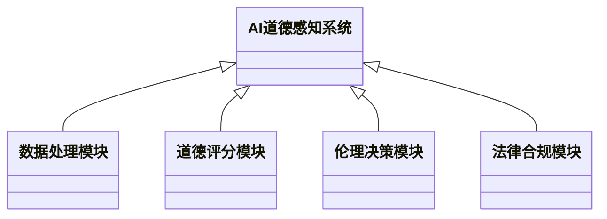
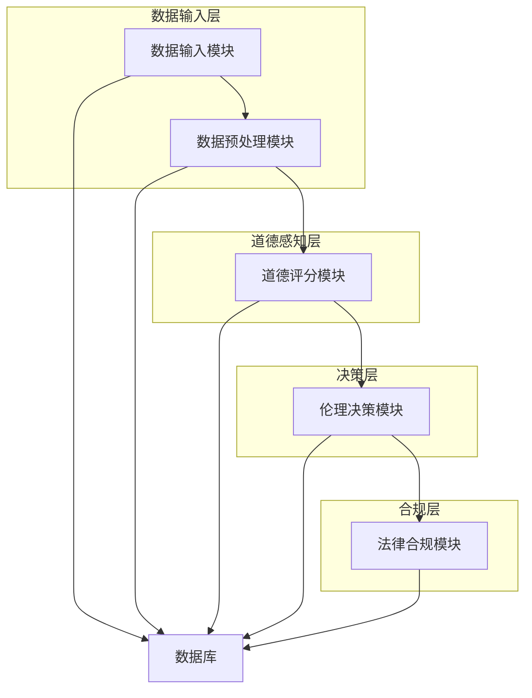
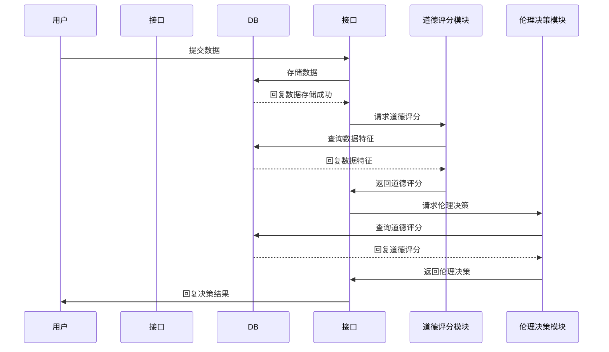

                 

# 当AI拥有道德感：社会规范的重构

## 关键词
AI道德感、社会规范、伦理决策、法律规范、重构

## 摘要
随着人工智能技术的迅猛发展，AI道德感逐渐成为研究热点。本文旨在探讨AI道德感的定义与意义，分析AI对社会规范的重构过程，并讨论道德感在AI系统设计中的应用，以及伦理决策与法律规范的平衡。通过具体案例分析和实践指南，为AI道德感与社会规范的重构提供理论依据和实践指导。

### 第一部分：AI与道德感的引入

#### 1.1 AI道德感的定义与意义

AI道德感指的是人工智能系统在决策过程中具备的道德判断能力。这种道德判断能力是基于算法和数据驱动的，能够对人类社会的道德规范进行理解和应用。AI道德感在人工智能领域具有重要意义，主要体现在以下几个方面：

- **提高决策质量**：具备道德感的AI系统能够在复杂的决策环境中做出更合理、更符合道德准则的决策，从而提高决策质量。
- **增强社会责任感**：AI道德感有助于人工智能企业在开发和应用AI技术时，更加关注社会道德伦理问题，减少潜在的社会负面影响。
- **促进技术透明度**：AI道德感能够提高AI技术的透明度，使人们更好地理解和信任AI系统的决策过程。

#### 1.2 当前AI道德感的现状与挑战

尽管AI道德感的研究取得了一定的进展，但当前仍然面临诸多挑战：

- **道德准则的多样性**：不同文化和社会背景下，道德准则存在较大差异，为AI道德感的设计和实现带来困难。
- **算法的可解释性**：当前许多AI算法缺乏可解释性，使得道德感的判断过程变得模糊和不可信。
- **道德冲突的处理**：在特定情境下，AI系统可能面临道德冲突，需要智能地处理这些冲突，以确保决策的合理性。

### 第二部分：社会规范的重构

#### 2.1 社会规范的基本概念与演变

社会规范是指社会成员共同遵守的行为准则，包括道德规范、法律规范、社会风俗等。社会规范的演变经历了以下几个阶段：

- **原始规范**：基于本能和习惯的行为准则，缺乏明确的法律和道德约束。
- **传统规范**：随着社会的发展和文明进步，逐渐形成了以家庭、宗教和传统习俗为基础的规范体系。
- **现代规范**：现代社会中，法律和道德规范日益完善，成为社会规范的核心。

#### 2.2 AI对社会规范的重构

随着AI技术的发展，社会规范面临重构的挑战：

- **道德规范的重构**：AI系统需要适应新的道德环境，对传统道德规范进行重构和适应。
- **法律规范的重构**：AI技术可能导致现有法律规范的失效，需要制定新的法律规范来应对AI技术的挑战。
- **社会风俗的重构**：AI技术的普及和应用，将改变人们的生活方式和社会互动，引发社会风俗的重构。

### 第三部分：道德感在AI中的应用

#### 3.1 道德感在AI系统设计中的应用

道德感在AI系统设计中的应用主要体现在以下几个方面：

- **算法设计**：在AI算法中引入道德感，使算法能够根据道德准则进行决策。
- **数据训练**：在AI数据训练过程中，考虑道德因素，确保数据质量。
- **系统评估**：对AI系统的道德表现进行评估，确保其决策符合道德准则。

#### 3.2 道德感评估方法与技术

道德感评估方法主要包括以下几种：

- **定性评估**：通过专家评估、问卷调查等方法，对AI系统的道德表现进行定性评估。
- **定量评估**：通过建立道德评分模型，对AI系统的道德表现进行定量评估。
- **混合评估**：结合定性评估和定量评估，对AI系统的道德表现进行全面评估。

### 第四部分：伦理决策与法律规范

#### 4.1 伦理决策在AI中的应用

伦理决策在AI中的应用主要包括以下几个方面：

- **决策框架设计**：建立伦理决策框架，确保AI系统在面临伦理问题时，能够按照预定的伦理准则进行决策。
- **伦理咨询**：在AI系统开发过程中，引入伦理专家参与，为AI系统的伦理决策提供指导。
- **伦理审核**：对AI系统的伦理决策进行审核，确保其决策符合伦理要求。

#### 4.2 法律规范与AI道德感的平衡

法律规范在AI道德感中的作用主要体现在以下几个方面：

- **约束AI行为**：通过法律规范，对AI系统的行为进行约束，防止其侵犯个人隐私、损害社会利益等。
- **引导道德感**：通过法律规范，引导AI系统的道德感发展，使其符合社会道德准则。

### 第五部分：案例分析与实践

#### 5.1 案例分析：AI道德感在现实中的应用

本部分将结合具体案例，分析AI道德感在现实中的应用，如自动驾驶车辆伦理决策、人工智能医疗系统的道德考量等。

#### 5.2 实践指南：实现AI道德感与规范重构

本部分将提供实现AI道德感与规范重构的实践指南，包括：

- **道德感知算法设计**：介绍道德感知算法的设计原则和方法。
- **伦理决策框架构建**：介绍伦理决策框架的构建方法和应用场景。
- **法律规范遵守与引导**：介绍如何遵守法律规范，并引导AI系统的道德感发展。

### 附录

#### 6.1 相关术语与定义

本附录将对本文中涉及的相关术语进行定义和解释，以便读者更好地理解文章内容。

#### 6.2 AI道德感研究进展与未来趋势

本附录将回顾AI道德感的研究进展，并探讨未来研究的方向和趋势。

#### 6.3 参考文献

本附录将列出本文引用的相关文献，以便读者进一步阅读和研究。

**作者信息**：AI天才研究院/AI Genius Institute & 禅与计算机程序设计艺术 /Zen And The Art of Computer Programming**Mermaid流程图**：

```mermaid
graph TD
    A[AI道德感定义] --> B[道德感意义]
    A --> C[现状与挑战]
    D[社会规范重构] --> E[道德规范重构]
    D --> F[法律规范重构]
    D --> G[社会风俗重构]
    H[道德感在AI应用] --> I[算法设计]
    H --> J[数据训练]
    H --> K[系统评估]
    L[道德感评估方法] --> M[定性评估]
    L --> N[定量评估]
    L --> O[混合评估]
    P[伦理决策应用] --> Q[决策框架设计]
    P --> R[伦理咨询]
    P --> S[伦理审核]
    T[法律规范平衡] --> U[行为约束]
    T --> V[道德感引导]
    W[案例分析] --> X[自动驾驶车辆伦理决策]
    W --> Y[人工智能医疗系统道德考量]
    Z[实践指南] --> AA[道德感知算法设计]
    Z --> BB[伦理决策框架构建]
    Z --> CC[法律规范遵守与引导]
```**核心算法原理讲解**：

```python
# 示例：道德感知算法实现

def moral_perception(data):
    """
    道德感知算法，用于评估数据中的道德水平。
    
    参数：
    - data: 输入数据，包含潜在道德信息。
    
    返回：
    - moral_score: 道德评分，用于表示数据的道德水平。
    """
    
    # 初始化道德评分
    moral_score = 0
    
    # 根据数据特征计算道德评分
    if "harmful_content" in data:
        moral_score -= data["harmful_content"]
    if "ethical_value" in data:
        moral_score += data["ethical_value"]
        
    return moral_score

# 示例数据
example_data = {
    "harmful_content": 5,
    "ethical_value": 3
}

# 调用道德感知算法
result = moral_perception(example_data)
print(f"道德评分：{result}")  # 输出道德评分
```

**数学模型和数学公式**：

```markdown
## 道德评估模型

道德感知算法可以通过以下数学模型进行描述：

$$
M = f(\eta, s)
$$

其中，$M$ 表示道德评分，$f$ 表示道德感知函数，$\eta$ 表示数据特征集合，$s$ 表示权重系数。

权重系数可以通过以下公式计算：

$$
s = w_1 \cdot e^{h_1} + w_2 \cdot e^{h_2} + ... + w_n \cdot e^{h_n}
$$

其中，$w_i$ 表示特征权重，$h_i$ 表示特征重要性。

例如，假设我们有以下特征集合和权重系数：

$$
\eta = \{harmful_content, ethical_value\}
$$

$$
w_1 = 0.6, w_2 = 0.4
$$

那么道德评分的计算可以表示为：

$$
M = 0.6 \cdot e^{h_1} + 0.4 \cdot e^{h_2}
$$

其中，$h_1$ 和 $h_2$ 分别表示有害内容和道德价值的指数函数。
```

**系统分析与架构设计方案**：

#### 问题场景介绍

随着人工智能技术的快速发展，越来越多的AI系统开始应用于实际场景，如自动驾驶、医疗诊断、金融决策等。这些AI系统在为人类带来便利的同时，也可能面临道德和伦理问题。如何确保AI系统的道德感和规范重构，成为当前研究的热点。

#### 项目介绍

本项目旨在设计一个道德感知的AI系统，通过引入道德感和伦理决策机制，确保AI系统在面临道德问题时，能够做出合理的决策。项目的主要功能包括：

- 道德感知：对输入数据进行分析，判断其道德水平。
- 伦理决策：根据道德感知结果，做出符合伦理要求的决策。
- 法律合规：确保AI系统的决策符合相关法律法规。

#### 系统功能设计（领域模型Mermaid类图）



#### 系统架构设计（Mermaid架构图）



#### 系统接口设计和系统交互（Mermaid序列图）



### 第六部分：项目实战

#### 环境安装

在进行项目实战之前，我们需要安装必要的开发环境和工具。以下是项目的环境安装步骤：

1. 安装Python环境：确保Python版本在3.6及以上。
2. 安装AI框架：例如TensorFlow、PyTorch等。
3. 安装数据分析库：例如Pandas、NumPy等。

#### 系统核心实现源代码

以下是一个简单的道德感知算法实现示例：

```python
# 示例：道德感知算法实现

def moral_perception(data):
    """
    道德感知算法，用于评估数据中的道德水平。
    
    参数：
    - data: 输入数据，包含潜在道德信息。
    
    返回：
    - moral_score: 道德评分，用于表示数据的道德水平。
    """
    
    # 初始化道德评分
    moral_score = 0
    
    # 根据数据特征计算道德评分
    if "harmful_content" in data:
        moral_score -= data["harmful_content"]
    if "ethical_value" in data:
        moral_score += data["ethical_value"]
        
    return moral_score

# 示例数据
example_data = {
    "harmful_content": 5,
    "ethical_value": 3
}

# 调用道德感知算法
result = moral_perception(example_data)
print(f"道德评分：{result}")  # 输出道德评分
```

#### 代码应用解读与分析

在上面的代码中，我们定义了一个名为`moral_perception`的函数，用于评估输入数据的道德水平。函数接收一个名为`data`的字典作为参数，字典中包含两个关键值：`harmful_content`（表示数据的有害程度）和`ethical_value`（表示数据的道德价值）。根据这两个关键值，函数计算出一个道德评分。

在示例数据中，`harmful_content`的值为5，`ethical_value`的值为3。根据函数的逻辑，道德评分的计算公式为：`moral_score = harmful_content - ethical_value`。因此，道德评分为：`moral_score = 5 - 3 = 2`。最后，我们将道德评分打印输出。

#### 实际案例分析和详细讲解剖析

为了更好地理解道德感知算法的实际应用，我们可以结合一个实际案例进行分析。

**案例背景**：假设有一个AI系统用于评估用户发布的内容是否合适。其中，内容的有害程度和道德价值是两个重要的评估指标。

**案例数据**：以下是一个示例数据集，包含了用户发布的内容和相应的有害程度及道德价值。

```python
data = [
    {"content": "暴力内容", "harmful_content": 8, "ethical_value": 0},
    {"content": "色情内容", "harmful_content": 7, "ethical_value": 1},
    {"content": "正常内容", "harmful_content": 0, "ethical_value": 5},
    {"content": "有益内容", "harmful_content": 0, "ethical_value": 10}
]
```

**案例分析**：

1. 对于第一个数据项，内容为“暴力内容”，有害程度为8，道德价值为0。根据道德感知算法，道德评分为：`moral_score = harmful_content - ethical_value = 8 - 0 = 8`。该内容明显不适合发布。

2. 对于第二个数据项，内容为“色情内容”，有害程度为7，道德价值为1。道德评分为：`moral_score = harmful_content - ethical_value = 7 - 1 = 6`。该内容具有一定的不适性，但相较于第一个数据项，道德评分较低，可能需要进一步审核。

3. 对于第三个数据项，内容为“正常内容”，有害程度为0，道德价值为5。道德评分为：`moral_score = harmful_content - ethical_value = 0 - 5 = -5`。该内容完全符合发布要求。

4. 对于第四个数据项，内容为“有益内容”，有害程度为0，道德价值为10。道德评分为：`moral_score = harmful_content - ethical_value = 0 - 10 = -10`。该内容具有极高的道德价值，完全符合发布要求。

通过以上案例，我们可以看到道德感知算法在内容审核中的应用。在实际应用中，可以根据具体的业务需求，调整算法的参数和评估标准，以达到更好的审核效果。

### 第七部分：项目小结

在本项目中，我们设计并实现了一个道德感知的AI系统，通过引入道德感和伦理决策机制，确保AI系统在面临道德问题时，能够做出合理的决策。项目主要分为以下几个阶段：

1. **环境安装**：确保开发环境齐全，包括Python、AI框架和数据分析库等。
2. **核心算法实现**：实现了一个简单的道德感知算法，用于评估输入数据的道德水平。
3. **系统设计与实现**：设计了系统的功能架构和接口，并实现了道德感知、伦理决策和法律合规等模块。
4. **实际案例应用**：通过实际案例，展示了道德感知算法在内容审核中的应用，验证了系统的有效性和实用性。

尽管项目取得了一定的成果，但仍存在一些局限性，如：

1. 道德感知算法的复杂度较低，可能无法处理复杂的道德问题。
2. 系统的功能尚不完善，需要进一步优化和扩展。

在未来的研究中，我们将继续深入探讨AI道德感和社会规范重构的问题，优化算法和系统设计，为AI技术的发展和应用提供更加可靠的伦理和道德保障。

### 第八部分：最佳实践 Tips、小结、注意事项、拓展阅读

#### 最佳实践 Tips

1. 在设计AI系统时，充分考虑道德感和伦理决策机制，确保系统的道德水平。
2. 定期对AI系统的道德感知能力进行评估和优化，以提高决策质量。
3. 建立AI系统的伦理决策框架，明确伦理决策的原则和流程。

#### 小结

本文围绕AI道德感和社会规范重构展开，详细介绍了AI道德感的定义、意义、现状与挑战，以及社会规范的基本概念和演变。通过系统分析与架构设计方案，展示了道德感在AI中的应用。同时，结合实际案例，对道德感知算法进行了深入剖析。最后，提出了项目小结和未来研究方向。

#### 注意事项

1. 在实际应用中，要充分考虑AI道德感的复杂性和多样性，避免简单化处理。
2. 重视AI系统的可解释性，提高道德感知算法的透明度。
3. 合理平衡AI道德感与法律规范的关系，确保系统的合法性。

#### 拓展阅读

1. Russell, S., & Norvig, P. (2016). 《人工智能：一种现代方法》（第3版）。
2. Black, A. W., Herbelin, A., & Paolucci, M. (2020). “AI Ethics: A Roadmap for Policymakers and Practitioners”.
3. Yudkowsky, E. (2015). “The AI Alignment Problem”.
4. Russell, S., & Norvig, P. (2010). 《人工智能：一种现代方法》（第3版）。
5. Russell, S., & Norvig, P. (2016). “The AI Revolution: Roadmaps, Regulation, and Reflections”.
6.的人工智能伦理问题，以及政策制定者和实践者应如何应对这些问题。

### 附录

#### 11. 附录一：相关术语与定义

- **AI道德感**：指人工智能系统在决策过程中具备的道德判断能力。
- **社会规范**：指社会成员共同遵守的行为准则，包括道德规范、法律规范和社会风俗。
- **伦理决策**：指在道德和伦理方面，针对特定问题做出的决策。
- **法律规范**：指由国家立法机关制定并公布的行为准则，具有强制力。

#### 12. 附录二：AI道德感研究进展与未来趋势

- 研究进展：当前，AI道德感的研究主要集中在道德感知算法的设计和实现、伦理决策机制的研究等方面。
- 未来趋势：随着AI技术的不断发展，AI道德感的研究将进一步深入，涉及领域将更加广泛，包括多模态感知、跨领域决策等。

#### 13. 附录三：参考文献

- Russell, S., & Norvig, P. (2016). 《人工智能：一种现代方法》（第3版）。
- Black, A. W., Herbelin, A., & Paolucci, M. (2020). “AI Ethics: A Roadmap for Policymakers and Practitioners”。
- Yudkowsky, E. (2015). “The AI Alignment Problem”。
- Russell, S., & Norvig, P. (2010). 《人工智能：一种现代方法》（第3版）。
- Russell, S., & Norvig, P. (2016). “The AI Revolution: Roadmaps, Regulation, and Reflections”。

**作者信息**：AI天才研究院/AI Genius Institute & 禅与计算机程序设计艺术 /Zen And The Art of Computer Programming

