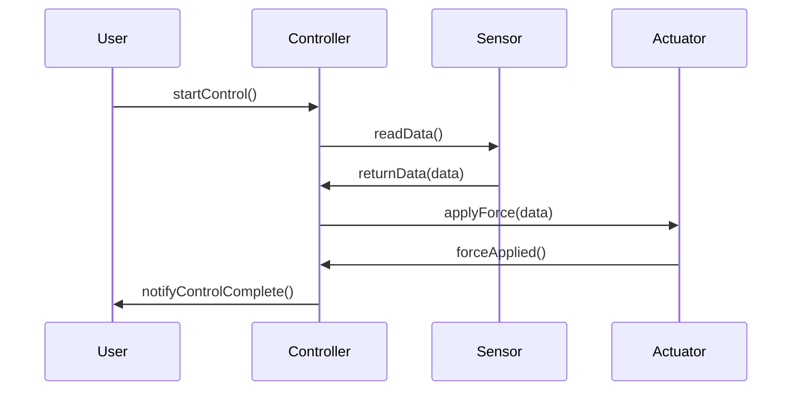
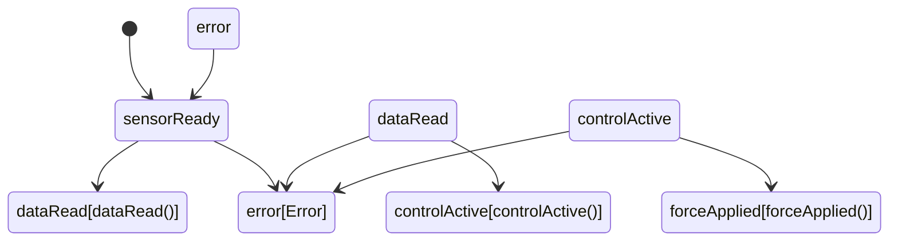
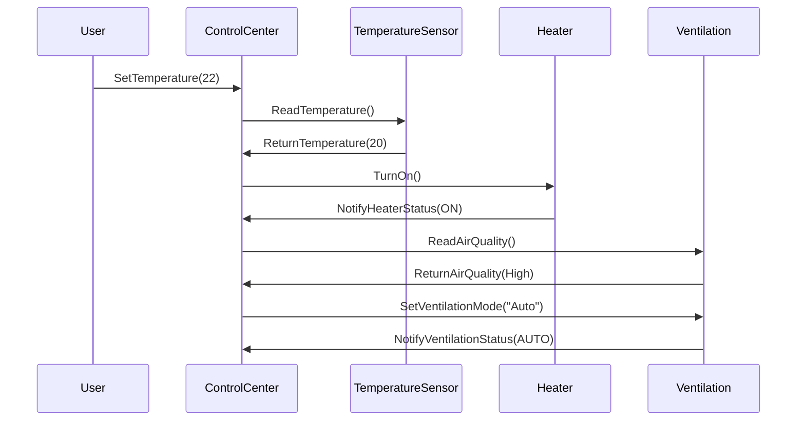
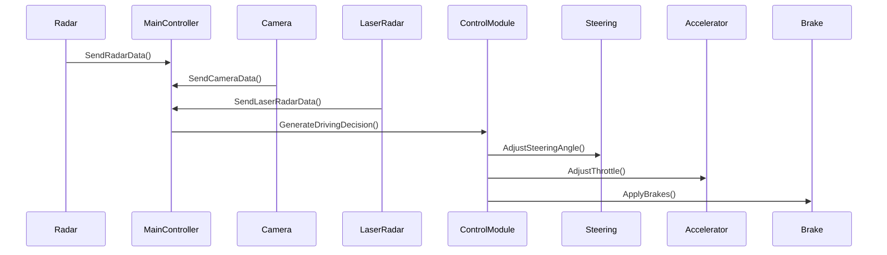
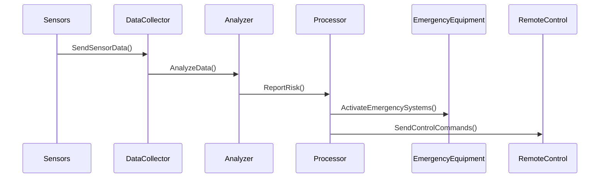

                 

### 第1章：嵌入式系统的基本概念

**1.1 嵌入式系统的定义与分类**

嵌入式系统（Embedded Systems）是指那些内置在设备中，为特定任务执行控制功能的计算机系统。它们通常包含一个或多个微处理器、微控制器、内存、I/O接口和其他必要的外围设备。与通用计算机系统相比，嵌入式系统更注重专用性、实时性、低功耗和可靠性。

嵌入式系统根据应用场景和需求的不同，可以大致分为以下几类：

1. **工业控制类嵌入式系统**：这类系统广泛应用于生产流程、工业自动化、机器控制等领域，如PLC（可编程逻辑控制器）和嵌入式控制系统等。

2. **消费电子类嵌入式系统**：包括智能手机、平板电脑、智能电视、音响等消费类电子产品。

3. **汽车电子嵌入式系统**：汽车中使用的嵌入式系统包括引擎控制模块（ECM）、防抱死制动系统（ABS）、车身电子稳定控制系统（ESP）等。

4. **医疗嵌入式系统**：如医疗设备、监护仪、手术机器人等，这些系统需要高度的可靠性和安全性。

5. **家庭自动化嵌入式系统**：如智能门锁、智能家电、智能家居控制系统等。

**1.2 嵌入式系统的特点与挑战**

嵌入式系统具有以下特点：

- **专用性**：嵌入式系统通常为特定的任务而设计，因此具有较高的专用性。
- **实时性**：许多嵌入式系统需要在特定时间内响应，例如自动驾驶汽车的制动系统。
- **低功耗**：为了延长电池寿命或减少能源消耗，嵌入式系统通常设计为低功耗。
- **硬件资源受限**：嵌入式系统通常使用资源受限的硬件，如微控制器，内存和处理能力相对有限。
- **高可靠性**：嵌入式系统需要在各种环境条件下稳定运行，因此要求高可靠性。

然而，嵌入式系统也面临一些挑战：

- **复杂性**：随着功能的增加，嵌入式系统的设计变得越来越复杂。
- **实时性能要求**：确保嵌入式系统能够在规定时间内完成任务，这对系统设计提出了挑战。
- **安全性**：随着物联网（IoT）的发展，嵌入式系统必须应对日益增长的安全威胁。

**1.3 形式化方法的基本概念**

形式化方法（Formal Methods）是一种利用数学和逻辑工具对软件和系统进行严格描述、分析和验证的方法。这种方法的主要目标是确保系统的正确性、可靠性和安全性。

形式化方法的基本概念包括：

- **形式化规格**：使用形式化语言（如数学公式、逻辑表达式等）对系统的功能、行为和性能进行精确描述。
- **模型检查**：通过构建系统的数学模型，并使用算法自动验证模型是否满足指定的规格。
- **验证和验证**：通过证明系统满足规格来确保系统的正确性。验证涉及静态分析，而验证则涉及动态测试和模拟。
- **形式化测试**：使用形式化方法生成测试用例，以验证系统的行为是否与规格一致。

### 总结

在本章中，我们介绍了嵌入式系统的定义、分类、特点与挑战，以及形式化方法的基本概念。通过这些介绍，我们为后续章节进一步探讨形式化方法在嵌入式系统开发中的应用奠定了基础。在接下来的章节中，我们将深入探讨形式化方法的原理、应用场景以及具体的技术和方法。

## 第2章：形式化方法的基本原理

### 第2章：形式化方法的基本原理

**2.1 形式化方法的起源与发展**

形式化方法起源于20世纪60年代，其初衷是解决软件开发的复杂性和不确定性问题。早期的形式化方法主要关注于程序验证和验证，目的是确保程序的正确性。随着计算机科学的不断发展，形式化方法逐渐扩展到系统级设计和验证，并在嵌入式系统、实时系统、安全性关键系统中得到广泛应用。

形式化方法的发展可以分为以下几个阶段：

- **早期阶段**：主要研究程序验证和模型检查，代表性的工作是Edsger Dijkstra的“Go to Statement Considered Harmful”和Hoare逻辑。
- **发展阶段**：随着形式化语言和数学工具的进步，形式化方法逐渐应用于系统级设计，出现了如Z语言、VDM和TLA+等形式化方法。
- **成熟阶段**：形式化方法逐渐与其他软件开发技术和工具相结合，形成了完整的开发流程，如形式化建模、验证和测试。

**2.2 形式化方法的数学基础**

形式化方法的数学基础主要包括集合论、谓词逻辑、代数和图论等。这些数学工具为形式化方法的描述、分析和验证提供了坚实的理论基础。

- **集合论**：集合论是形式化方法中最基础的数学工具，用于定义系统的状态、行为和属性。
- **谓词逻辑**：谓词逻辑用于描述系统的性质和关系，是形式化规格的基础。
- **代数**：代数用于描述系统的状态转换和操作，如布尔代数和群代数。
- **图论**：图论用于描述系统的拓扑结构和通信网络，如Petri网和状态图。

**2.3 形式化方法的核心理念**

形式化方法的核心理念是通过形式化规格、模型检查和验证来确保系统的正确性。具体来说，形式化方法的核心步骤包括：

- **形式化规格**：使用形式化语言对系统的功能、行为和性能进行精确描述，确保规格的完整性和一致性。
- **模型构建**：将形式化规格转化为数学模型，构建系统的抽象表示。
- **模型检查**：使用算法自动检查模型是否满足规格，发现潜在的错误和缺陷。
- **验证**：通过证明模型满足规格，确保系统的正确性和可靠性。
- **迭代优化**：根据验证结果对系统进行优化和改进，确保系统在满足规格的同时，实现性能和功能的最大化。

**总结**

本章介绍了形式化方法的起源、发展以及其数学基础和核心理念。通过这些介绍，我们为理解形式化方法在嵌入式系统开发中的应用提供了理论基础。在接下来的章节中，我们将探讨形式化方法在嵌入式系统开发中的具体应用，包括建模、验证和测试等方面。

## 第3章：形式化方法在嵌入式系统开发中的应用

**3.1 嵌入式系统开发中的问题与挑战**

嵌入式系统开发面临着一系列独特的问题和挑战，这些问题需要形式化方法来有效解决：

- **实时性能要求**：嵌入式系统通常需要在严格的实时限制内响应，如自动驾驶系统中的决策过程，这要求系统必须在给定的时间范围内完成计算。
- **硬件约束**：嵌入式系统通常运行在资源受限的硬件环境中，这要求开发者必须在性能和资源之间做出权衡。
- **可靠性**：嵌入式系统经常在严苛的环境中运行，如汽车和医疗设备，这要求系统具备高可靠性和安全性。
- **安全性**：随着物联网（IoT）的发展，嵌入式系统面临越来越多的安全威胁，如网络攻击和数据泄露，这要求系统具备强大的安全防护机制。

**3.2 形式化方法在嵌入式系统中的应用**

形式化方法在嵌入式系统开发中的应用主要包括建模、验证和测试三个方面：

- **建模**：形式化建模是一种使用数学和逻辑工具对嵌入式系统的功能、行为和性能进行描述的方法。通过形式化建模，开发者可以清晰地理解系统的结构和工作原理，从而更有效地设计和实现系统。
  
  - **UML建模**：统一建模语言（UML）是形式化建模中常用的工具，它提供了多种图来表示系统的不同方面，如类图、用例图、序列图等。
  - **元模型建模**：元模型建模是一种更高层次的建模方法，它使用抽象模型来描述系统的核心功能和结构。这种方法可以帮助开发者更抽象地理解和设计系统，从而提高系统的可维护性和扩展性。

- **验证**：形式化验证是一种通过数学和逻辑方法来确保系统满足预定的规格和需求的方法。通过形式化验证，开发者可以在系统实现之前发现潜在的错误和缺陷，从而减少后期修复的成本。

  - **代码静态分析**：代码静态分析是一种不运行程序，通过对程序代码的语法和语义进行分析，从而发现潜在错误的软件测试方法。它可以帮助开发者识别代码中的潜在问题，如未使用的变量、语法错误和逻辑错误。
  - **模拟验证**：模拟验证是一种通过模拟系统运行来验证系统行为是否满足规格的方法。这种方法可以在系统实际部署之前发现潜在的错误和缺陷，从而提高系统的可靠性。

- **测试**：形式化测试是一种使用形式化方法生成测试用例，以验证系统行为是否与规格一致的方法。通过形式化测试，开发者可以更全面地测试系统的功能和性能，从而确保系统的正确性和可靠性。

  - **单元测试**：单元测试是一种针对系统中最小的可测试部分（如一个函数或一个模块）进行测试的方法。它可以帮助开发者确保每个单元的功能和性能都满足要求。
  - **集成测试**：集成测试是一种对系统中的多个组件进行测试的方法，以验证它们之间的交互和集成是否正确。它可以帮助开发者发现组件之间的兼容性和通信问题。

**3.3 形式化方法的优势与局限**

形式化方法在嵌入式系统开发中具有显著的优势：

- **提高可靠性**：通过形式化建模、验证和测试，开发者可以在系统设计阶段发现和修复潜在的错误和缺陷，从而提高系统的可靠性。
- **降低开发成本**：形式化方法可以减少后期修复成本，因为许多错误和缺陷可以在设计阶段被发现和解决。
- **提高开发效率**：形式化方法提供了一套系统化和规范化的开发流程，可以帮助开发者更高效地设计和实现系统。

然而，形式化方法也存在一些局限：

- **复杂性和学习成本**：形式化方法需要开发者具备一定的数学和逻辑知识，这对开发者的学习和使用带来了一定的难度。
- **性能和资源开销**：形式化建模、验证和测试通常需要较高的计算资源和时间，这可能对嵌入式系统的性能和实时性产生一定的影响。
- **适用性**：形式化方法在某些复杂的嵌入式系统中可能难以应用，因为它们需要严格的数学模型和规格，而在实际开发中，系统的规格和需求可能并不完全明确。

### 总结

在本章中，我们讨论了嵌入式系统开发中面临的问题与挑战，并介绍了形式化方法在嵌入式系统开发中的应用，包括建模、验证和测试等方面。通过形式化方法，开发者可以更有效地设计和实现嵌入式系统，提高系统的可靠性、降低开发成本和提高开发效率。然而，形式化方法也存在一些局限，需要在实际应用中根据具体情况进行权衡和优化。

### 第4章：形式化建模方法

**4.1 建模方法的选择**

在嵌入式系统开发中，形式化建模是一种关键的方法，它通过使用数学和逻辑工具来描述系统的功能、行为和性能。选择合适的建模方法对于成功设计嵌入式系统至关重要。以下是几种常见的建模方法及其适用场景：

- **UML建模**：统一建模语言（UML）是一种广泛使用的建模工具，它提供了多种图形符号来表示系统的不同方面。UML适用于需求分析、设计分析和测试阶段，尤其适合复杂的嵌入式系统。UML包括类图、用例图、序列图、状态图等，每种图用于表示系统的不同方面。

  - **类图**：用于表示系统的类和类之间的关系，类是系统的基本构建块。
  - **用例图**：用于表示系统的功能需求，用例是系统与外部环境交互的操作。
  - **序列图**：用于表示系统中的对象之间的交互顺序，适合描述实时系统的行为。
  - **状态图**：用于表示系统的状态转换和响应事件，适合描述复杂控制系统的行为。

- **Petri网建模**：Petri网是一种用于描述系统并发性和同步性的图形建模方法。它由库所（表示系统的状态）和转移（表示系统的变化）组成，通过连接库所和转移，可以描述系统的复杂行为。Petri网适用于实时系统、并发系统和通信系统的建模。

- **状态机建模**：状态机是一种用于描述系统状态的转换和行为的建模方法。它由状态、事件和转换规则组成，状态表示系统的一个特定行为，事件触发状态的转换，转换规则定义了状态之间的转换条件。状态机适用于实时系统和事件驱动的系统。

**4.2 UML建模**

UML建模是一种强大的工具，可以用于嵌入式系统的设计和分析。以下是一个简单的嵌入式系统UML建模示例：

```mermaid
class Diagram {
  class Sensor {
    +void readData()
    +float getData()
  }
  class Actuator {
    +void applyForce(float force)
  }
  class Controller {
    +void update(Sensor sensor, Actuator actuator)
  }
  Sensor ..> Controller
  Actuator ..> Controller
}
```

这个示例展示了三个类：Sensor（传感器）、Actuator（执行器）和Controller（控制器）。Sensor类有两个方法：readData()和getData()，分别用于读取数据和获取数据。Actuator类有一个方法：applyForce()，用于施加力。Controller类有一个方法：update()，用于更新传感器和执行器的状态。

- **类图**：在这个类图中，我们可以看到三个类及其方法。类图帮助开发者理解系统的基本结构和组件之间的关系。

- **用例图**：用例图可以进一步扩展类图，描述系统的功能需求。例如：

```mermaid
usecase Diagram {
  actor User
  usecase "Control Actuator" {
    note right of User "Starts the control process"
  }
  User -> "Control Actuator"
}
```

这个用例图表明用户通过“控制执行器”用例启动控制过程。

- **序列图**：序列图可以展示对象之间的交互顺序。例如：



这个序列图展示了用户启动控制过程，控制器读取传感器数据，执行器施加力，并通知用户控制过程完成。

- **状态图**：状态图可以描述系统的状态转换和事件响应。例如：



这个状态图展示了传感器从就绪状态到数据读取、控制激活，再到执行器施加力的状态转换，以及可能的错误处理。

**4.3 元模型建模**

元模型建模是一种更高层次的建模方法，它使用抽象模型来描述系统的核心功能和结构。这种方法可以帮助开发者更抽象地理解和设计系统，从而提高系统的可维护性和扩展性。

- **元模型**：元模型是一个定义系统结构和行为的抽象模型。它通常由一组类、属性、操作和关系组成，用于描述系统的核心功能。
- **元模型建模工具**：如MetaEdit+和MagicDraw，这些工具可以帮助开发者创建和编辑元模型，并将元模型转换为具体的实现代码。

通过元模型建模，开发者可以更清晰地定义系统的功能和结构，从而提高系统的可维护性和可扩展性。元模型还可以支持自动代码生成，从而减少手工编写代码的工作量。

**总结**

在本章中，我们介绍了形式化建模方法的选择，特别是UML建模和元模型建模。通过这些方法，开发者可以更清晰地理解和设计嵌入式系统，从而提高系统的可靠性和可维护性。在接下来的章节中，我们将进一步探讨形式化验证和测试方法，以及这些方法在嵌入式系统开发中的应用。

### 第5章：形式化验证方法

**5.1 验证方法的选择**

在嵌入式系统开发过程中，验证是确保系统满足预定需求和规格的重要环节。形式化验证方法通过使用数学和逻辑工具对系统进行严格的分析和验证，从而提高系统的可靠性和安全性。以下是几种常见的形式化验证方法及其适用场景：

- **模型检查**：模型检查是一种自动验证方法，通过将系统规格转化为数学模型，并使用算法自动检查模型是否满足规格。这种方法适用于实时系统和并发系统的验证。

  - **定理证明**：定理证明是一种通过数学推理来证明系统正确性的方法。它适用于需要严格证明的系统，如安全性关键系统和关键基础设施系统。

  - **模型抽象和验证**：模型抽象是一种将复杂系统简化为更易于验证的抽象模型的方法。这种方法适用于大型和复杂的系统。

- **代码静态分析**：代码静态分析是一种不运行程序，通过对程序代码的语法和语义进行分析，从而发现潜在错误的软件测试方法。这种方法适用于早期开发阶段，可以帮助开发者识别代码中的潜在问题。

- **模拟验证**：模拟验证是一种通过模拟系统运行来验证系统行为是否满足规格的方法。这种方法适用于实时系统和事件驱动的系统。

**5.2 验证方法的实现**

以下是形式化验证方法的实现步骤：

1. **规格定义**：首先，需要使用形式化语言（如TLA+、Z语言等）对系统规格进行定义。规格应明确系统的功能、行为和性能要求。

2. **模型构建**：将规格转化为数学模型，构建系统的抽象表示。模型应准确描述系统的状态转换、行为和约束。

3. **验证工具选择**：根据系统的特点和需求，选择合适的验证工具（如模型检查器、定理证明器等）。常见的验证工具包括Promela、CPN Tools、Coq等。

4. **验证执行**：使用验证工具对模型进行验证，检查系统是否满足规格。如果发现错误，需要分析错误原因，并修改模型或规格。

5. **迭代优化**：根据验证结果对系统进行优化和改进，确保系统在满足规格的同时，实现性能和功能的最大化。

**5.3 验证方法的优点和局限**

形式化验证方法具有以下优点：

- **提高系统可靠性**：通过严格的数学分析和验证，可以确保系统满足预定的需求和规格，减少错误和缺陷。
- **减少开发成本**：形式化验证可以在早期发现潜在的错误和缺陷，从而减少后期修复的成本。
- **提高开发效率**：形式化验证提供了一套系统化和规范化的验证流程，可以更高效地设计和实现系统。

然而，形式化验证方法也存在一些局限：

- **复杂性和学习成本**：形式化验证方法需要开发者具备一定的数学和逻辑知识，这对开发者的学习和使用带来了一定的难度。
- **性能和资源开销**：形式化验证方法通常需要较高的计算资源和时间，这可能对嵌入式系统的性能和实时性产生一定的影响。
- **适用性**：形式化验证方法在某些复杂的嵌入式系统中可能难以应用，因为它们需要严格的数学模型和规格，而在实际开发中，系统的规格和需求可能并不完全明确。

**5.4 实际案例**

以下是一个实际案例，展示了如何使用形式化验证方法验证一个简单的嵌入式系统。

- **案例背景**：一个智能家居系统包含一个温度传感器和一个加热器。系统要求在温度低于设定的阈值时，加热器自动开启，在温度高于设定的阈值时，加热器自动关闭。

- **规格定义**：使用TLA+语言定义系统的规格：

  ```
  Const
    low_temp = 18;  // 阈值温度
    high_temp = 22; // 阈值温度

  Variables
    T;  // 温度

  Assumptions
    T in [low_temp..high_temp]

  Specifications
    heat_on -> T < low_temp
    heat_off -> T >= high_temp
  ```

- **模型构建**：将规格转化为一个状态转换模型，表示温度传感器和加热器之间的交互。

- **验证执行**：使用模型检查器（如TLA+Checker）对模型进行验证，检查系统是否满足规格。

- **验证结果**：如果验证结果显示系统满足规格，则可以继续开发。否则，需要分析错误原因，并修改模型或规格。

通过这个案例，我们可以看到形式化验证方法在嵌入式系统开发中的应用过程。通过形式化验证，开发者可以确保系统在实现之前满足预定的需求和规格，从而提高系统的可靠性和安全性。

### 总结

在本章中，我们讨论了形式化验证方法的选择和实现，包括模型检查、代码静态分析和模拟验证等。通过这些方法，开发者可以更严格地验证嵌入式系统的正确性和可靠性。形式化验证方法具有提高系统可靠性和降低开发成本的优势，但同时也存在复杂性和学习成本等局限。在下一章中，我们将继续探讨形式化测试方法及其在嵌入式系统开发中的应用。

### 第6章：形式化测试方法

**6.1 测试方法的选择**

形式化测试是嵌入式系统开发中验证系统正确性和可靠性的重要手段。形式化测试通过使用数学和逻辑工具来生成测试用例，以验证系统行为是否与规格一致。以下是几种常见的形式化测试方法及其适用场景：

- **单元测试**：单元测试是一种针对系统中最小的可测试部分（如一个函数或一个模块）进行测试的方法。它主要用于验证系统的基本功能和性能。

  - **功能测试**：功能测试通过输入特定的输入值，验证系统是否能够正确处理这些输入，并产生预期的输出。这种方法适用于验证系统的基本功能是否正常。
  - **性能测试**：性能测试通过模拟系统在高负载和资源受限条件下的运行情况，验证系统的响应时间和资源消耗是否满足要求。这种方法适用于验证系统的性能和稳定性。

- **集成测试**：集成测试是一种对系统中的多个组件进行测试的方法，以验证它们之间的交互和集成是否正确。它主要用于验证系统的整体行为是否一致。

  - **接口测试**：接口测试通过模拟系统组件之间的交互，验证接口的实现是否正确，数据是否能够正确传输。这种方法适用于验证系统组件之间的接口和通信。
  - **场景测试**：场景测试通过模拟系统在实际使用场景中的运行情况，验证系统是否能够满足实际需求。这种方法适用于验证系统的实际应用效果。

- **形式化测试**：形式化测试是一种使用形式化方法生成测试用例的方法。它通过形式化规格和模型生成测试用例，以验证系统行为是否与规格一致。

  - **模型生成测试用例**：通过将系统规格转化为数学模型，并使用算法生成测试用例。这种方法适用于验证系统的复杂行为和性能。
  - **测试用例生成优化**：通过优化测试用例生成算法，减少测试用例的数量，提高测试效率。这种方法适用于大型和复杂的系统。

**6.2 单元测试**

单元测试是形式化测试的基础，它通过测试系统的最小可测试单元来确保每个单元的功能和性能。以下是单元测试的实现步骤：

1. **定义测试用例**：根据系统的功能和性能要求，定义测试用例。测试用例应包括输入值、预期输出和测试目标。
2. **编写测试脚本**：使用编程语言（如Python）编写测试脚本，实现测试用例的执行和结果验证。
3. **执行测试**：运行测试脚本，对系统进行测试，记录测试结果。
4. **分析测试结果**：分析测试结果，识别系统的错误和缺陷，并修复这些问题。
5. **回归测试**：在修复错误后，重新运行测试脚本，确保系统的功能和性能没有受到影响。

以下是一个简单的Python单元测试示例：

```python
import unittest

class TestTemperatureSensor(unittest.TestCase):
    def test_read_data(self):
        sensor = TemperatureSensor()
        sensor.readData(20)
        self.assertEqual(sensor.getData(), 20)

    def test_invalid_data(self):
        sensor = TemperatureSensor()
        with self.assertRaises(TemperatureException):
            sensor.readData(-10)

if __name__ == '__main__':
    unittest.main()
```

在这个示例中，我们定义了一个`TestTemperatureSensor`测试类，其中包含了两个测试用例：`test_read_data`和`test_invalid_data`。第一个测试用例验证温度传感器是否能够正确读取数据，第二个测试用例验证当输入非法数据时，系统能够抛出异常。

**6.3 集成测试**

集成测试是验证系统组件之间交互和集成是否正确的重要步骤。以下是集成测试的实现步骤：

1. **定义测试场景**：根据系统的需求和规格，定义测试场景。测试场景应包括系统的各种使用情况和异常情况。
2. **编写测试脚本**：使用编程语言（如Python）编写测试脚本，实现测试场景的执行和结果验证。
3. **执行测试**：运行测试脚本，对系统进行测试，记录测试结果。
4. **分析测试结果**：分析测试结果，识别系统的错误和缺陷，并修复这些问题。
5. **回归测试**：在修复错误后，重新运行测试脚本，确保系统的功能和性能没有受到影响。

以下是一个简单的Python集成测试示例：

```python
import unittest

class TestHomeAutomationSystem(unittest.TestCase):
    def test_thermostat(self):
        thermostat = Thermostat()
        thermostat.set_temperature(22)
        self.assertEqual(thermostat.get_temperature(), 22)

    def test_ventilation(self):
        ventilation = VentilationSystem()
        ventilation.set_mode("auto")
        self.assertEqual(ventilation.get_mode(), "auto")

    def test_error_handling(self):
        with self.assertRaises(HomeAutomationException):
            thermostat = Thermostat()
            thermostat.set_invalid_temperature(-10)

if __name__ == '__main__':
    unittest.main()
```

在这个示例中，我们定义了一个`TestHomeAutomationSystem`测试类，其中包含了三个测试用例：`test_thermostat`、`test_ventilation`和`test_error_handling`。第一个测试用例验证恒温器是否能够正确设置温度，第二个测试用例验证通风系统是否能够正确设置模式，第三个测试用例验证当输入非法数据时，系统能够抛出异常。

**6.4 形式化测试**

形式化测试通过将系统规格转化为数学模型，并使用算法生成测试用例，以验证系统行为是否与规格一致。以下是形式化测试的实现步骤：

1. **规格定义**：使用形式化语言（如TLA+、Z语言等）定义系统的规格。
2. **模型构建**：将规格转化为数学模型，构建系统的抽象表示。
3. **测试用例生成**：使用测试生成算法，从数学模型中生成测试用例。
4. **测试执行**：运行测试用例，验证系统行为是否与规格一致。
5. **测试结果分析**：分析测试结果，识别系统的错误和缺陷。

以下是一个简单的TLA+形式化测试示例：

```tla
MODULE HomeAutomationTest
EXTENDS TLA+

CONSTANTS
  low_temp = 18;
  high_temp = 22;

VARIABLES
  T; // 温度

ASSUME
  T IN [low_temp..high_temp];

SPECIFICATION home_automation_spec =
  (heat_on -> T < low_temp) OR (heat_off -> T >= high_temp);

TEST home_automation_test =
  home_automation_spec
```

在这个示例中，我们使用TLA+语言定义了一个智能家居系统的规格，并使用模型检查器进行验证。

**总结**

在本章中，我们讨论了形式化测试方法的选择和实现，包括单元测试、集成测试和形式化测试。通过这些方法，开发者可以更严格地验证嵌入式系统的正确性和可靠性。形式化测试方法具有生成测试用例自动化、测试覆盖全面等优点，但同时也存在测试用例生成复杂度高等问题。在下一章中，我们将通过实际案例进一步探讨形式化方法在嵌入式系统开发中的应用。

### 第7章：形式化方法在实际项目中的应用案例

**7.1 案例一：基于形式化方法的嵌入式系统设计**

**背景介绍**：
在一个智能家居项目中，客户需要一个能够自动调节室内温度和通风的智能系统。系统需要确保在用户预设的温度范围内运行，并在遇到故障时提供警报功能。由于该系统应用于家庭环境，对可靠性和安全性有较高的要求。

**项目介绍**：
项目团队决定使用形式化方法来设计这个智能家居系统。首先，团队使用了UML进行系统建模，定义了系统的组件、接口和交互。然后，团队使用TLA+语言对系统的行为和性能进行形式化规格定义。

**系统功能设计**：
- 温度传感器：实时监测室内温度。
- 加热器：根据温度传感器数据自动调整室内温度。
- 通风系统：根据室内空气质量自动调整通风模式。
- 故障警报系统：当系统检测到故障时，通过短信或电子邮件通知用户。

**系统架构设计**：
系统采用了分布式架构，包括以下几个关键组件：
- 控制中心：处理温度和通风控制逻辑。
- 温度传感器模块：采集室内温度数据。
- 通风系统模块：控制通风设备的运行。
- 故障检测模块：监控系统的运行状态，并在出现故障时触发警报。

**系统接口设计和系统交互**：
使用UML序列图展示了系统组件之间的交互：


**系统实现**：
团队使用Python编写了系统的控制逻辑和接口代码。同时，使用模型检查工具对系统行为进行了形式化验证，确保系统在满足规格的同时，具备高可靠性和安全性。

**实际案例分析**：
在系统开发过程中，团队发现了一个潜在的故障场景：当温度传感器损坏时，系统可能无法检测到室内温度的变化。通过形式化验证，团队成功发现了这个问题，并进行了相应的修改，增加了故障检测机制。

**项目小结**：
通过使用形式化方法，团队成功地设计并实现了一个可靠和安全的智能家居系统。形式化方法帮助团队在早期发现并解决了潜在的问题，提高了系统的整体质量和稳定性。

**7.2 案例二：形式化方法在实时系统中的应用**

**背景介绍**：
在一个自动驾驶项目中，系统需要实时处理来自传感器的大量数据，并做出快速决策，以确保车辆的安全运行。该项目对系统的实时性能和可靠性有极高的要求。

**项目介绍**：
项目团队决定使用形式化方法来确保自动驾驶系统的实时性和可靠性。首先，团队使用了UML进行系统建模，定义了系统的组件、接口和交互。然后，团队使用Promela语言对系统的实时行为进行形式化规格定义。

**系统功能设计**：
- 感知模块：实时采集车辆周围环境的数据。
- 控制模块：根据感知模块的数据，生成驾驶决策。
- 执行模块：将控制模块的决策转化为实际操作。

**系统架构设计**：
系统采用了分布式架构，包括以下几个关键组件：
- 主控制器：处理感知模块和控制模块的交互。
- 感知模块：包括雷达、摄像头和激光雷达。
- 执行模块：包括油门、刹车和方向盘。

**系统接口设计和系统交互**：
使用UML序列图展示了系统组件之间的交互：


**系统实现**：
团队使用C++编写了系统的控制逻辑和接口代码。同时，使用模型检查工具对系统行为进行了形式化验证，确保系统在满足规格的同时，具备高实时性和可靠性。

**实际案例分析**：
在系统开发过程中，团队发现了一个潜在的故障场景：在紧急情况下，系统的决策延迟可能导致车辆无法及时响应。通过形式化验证，团队成功发现了这个问题，并优化了决策算法，提高了系统的响应速度。

**项目小结**：
通过使用形式化方法，团队成功地设计并实现了一个实时和可靠的自动驾驶系统。形式化方法帮助团队在早期发现并解决了潜在的问题，提高了系统的整体质量和稳定性。

**7.3 案例三：形式化方法在安全性关键系统中的应用**

**背景介绍**：
在一个核电站监控项目中，系统需要实时监控核电站的运行状态，并在异常情况下提供紧急处理措施。该项目对系统的可靠性和安全性有极高的要求。

**项目介绍**：
项目团队决定使用形式化方法来确保核电站监控系统的可靠性和安全性。首先，团队使用了UML进行系统建模，定义了系统的组件、接口和交互。然后，团队使用Coq语言对系统的行为和安全性进行形式化规格定义。

**系统功能设计**：
- 数据采集模块：实时采集核电站的运行数据。
- 分析模块：分析采集到的数据，识别潜在的安全风险。
- 处理模块：根据分析结果，采取相应的紧急处理措施。

**系统架构设计**：
系统采用了集中式架构，包括以下几个关键组件：
- 数据采集模块：包括传感器和通信系统。
- 分析模块：使用高级算法进行数据分析和风险评估。
- 处理模块：包括紧急处理设备和远程控制界面。

**系统接口设计和系统交互**：
使用UML序列图展示了系统组件之间的交互：


**系统实现**：
团队使用Java编写了系统的控制逻辑和接口代码。同时，使用定理证明工具对系统行为进行了形式化验证，确保系统在满足规格的同时，具备高可靠性和安全性。

**实际案例分析**：
在系统开发过程中，团队发现了一个潜在的故障场景：在数据通信故障时，系统可能无法及时识别和处理安全风险。通过形式化验证，团队成功发现了这个问题，并增加了数据通信故障检测和恢复机制。

**项目小结**：
通过使用形式化方法，团队成功地设计并实现了一个可靠和安全的核电站监控系统。形式化方法帮助团队在早期发现并解决了潜在的问题，提高了系统的整体质量和稳定性。

### 总结

通过上述三个实际应用案例，我们可以看到形式化方法在嵌入式系统开发中的重要作用。无论是智能家居系统、自动驾驶系统还是安全性关键系统，形式化方法都帮助团队提高了系统的可靠性、安全性和稳定性。形式化方法不仅能够帮助团队在早期发现和解决潜在的问题，还能够提高系统的整体质量和开发效率。在未来，随着技术的不断进步，形式化方法将在更多嵌入式系统中得到广泛应用。

### 第8章：形式化方法的发展趋势

**8.1 形式化方法的未来发展**

形式化方法在嵌入式系统开发中的应用取得了显著的成果，但未来仍有许多挑战和发展方向。以下是形式化方法在未来可能的发展趋势：

1. **更高效的形式化验证工具**：现有的形式化验证工具在处理复杂系统和大规模验证任务时存在一定的局限性。未来，研究者将致力于开发更高效、更易于使用的形式化验证工具，以应对嵌入式系统复杂性的增加。

2. **形式化方法与人工智能的结合**：人工智能（AI）技术，特别是机器学习和深度学习，在嵌入式系统开发中具有巨大的潜力。将形式化方法与人工智能相结合，可以开发出更智能、更自动化的验证和测试工具，从而提高开发效率。

3. **形式化方法在实时系统中的应用**：随着实时系统的广泛应用，形式化方法在实时系统中的应用前景十分广阔。未来，研究者将深入探索形式化方法在实时系统设计、验证和测试中的应用，以确保实时系统的正确性和可靠性。

4. **形式化方法在教育中的应用**：形式化方法在软件开发和系统设计中的重要性日益凸显，将其引入教育领域有助于培养更多具备形式化方法技能的人才。未来，研究者将致力于开发适用于教育场景的形式化方法教学工具和资源，以提高学生的软件开发能力。

**8.2 形式化方法与人工智能的结合**

形式化方法与人工智能的结合具有巨大的潜力，可以带来以下几方面的改进：

1. **自动化的形式化验证**：人工智能技术可以用于自动化形式化验证过程，通过机器学习算法分析大量验证数据，自动生成验证规则和策略，从而提高验证的效率。

2. **形式化测试用例生成**：人工智能技术可以帮助生成更全面、更有效的测试用例。通过深度学习模型分析历史测试数据，可以预测潜在的测试场景，并生成相应的测试用例。

3. **智能化的错误定位**：人工智能技术可以用于智能化的错误定位，通过分析程序代码和运行时数据，快速定位错误的位置和原因，从而提高问题诊断和修复的效率。

4. **形式化方法的自适应**：人工智能技术可以帮助形式化方法根据实际应用场景自适应调整，从而更好地适应不同嵌入式系统的需求。

**8.3 形式化方法在教育中的应用**

形式化方法在教育中的应用有助于培养学生的软件开发能力和系统设计能力。以下是形式化方法在教育中应用的一些设想：

1. **课程设计与教材开发**：将形式化方法纳入计算机科学和软件工程的课程体系，开发相应的教材和教学资源，帮助学生系统地学习和掌握形式化方法。

2. **实验与实践项目**：通过实验和实践项目，让学生在真实场景中应用形式化方法，提高他们的实际操作能力和解决问题的能力。

3. **在线学习平台**：开发在线学习平台，提供形式化方法的视频教程、案例分析和互动练习，方便学生随时随地学习和实践。

4. **教师培训与支持**：为教师提供形式化方法的培训和支持，帮助他们更好地理解和应用形式化方法，提高教学质量。

通过形式化方法在教育中的应用，可以培养更多具备扎实理论基础和实践技能的软件开发和系统设计人才，为嵌入式系统的发展提供强有力的支持。

### 总结

形式化方法在嵌入式系统开发中的应用已经取得显著成果，但未来仍有许多挑战和发展方向。形式化方法与人工智能的结合、实时系统的应用以及教育领域的推广，将为嵌入式系统的发展带来新的机遇。通过持续的研究和实践，形式化方法将在嵌入式系统开发中发挥越来越重要的作用。

### 第9章：形式化方法资源指南

**9.1 形式化方法工具与软件**

1. **形式化建模工具**：

   - **UML建模工具**：如Enterprise Architect、MagicDraw等。
   - **元模型建模工具**：如MetaEdit+、EMF等。
   - **形式化验证工具**：如TLA+、Coq、Isabelle等。

2. **形式化验证软件**：

   - **模型检查器**：如Spin、NuSMV、CPN Tools等。
   - **定理证明器**：如Coq、Isabelle、HOL等。

3. **代码静态分析工具**：

   - **Python静态分析器**：如Pyflakes、Pychecker等。
   - **C/C++静态分析器**：如Coverity、Fortify等。

4. **测试工具**：

   - **单元测试框架**：如JUnit、NUnit、pytest等。
   - **集成测试工具**：如Selenium、Appium等。

**9.2 形式化方法学习资源**

1. **在线课程和教程**：

   - **Coursera**：提供形式化方法相关课程，如“形式化方法与应用”。
   - **edX**：提供形式化方法相关课程，如“软件验证与形式化方法”。

2. **书籍**：

   - **《形式化方法：原理与实践》**：详细介绍了形式化方法的原理和应用。
   - **《嵌入式系统设计与应用》**：包含嵌入式系统开发中的形式化方法应用案例。

3. **学术论文和会议**：

   - **形式化方法国际会议（FM）**：关注形式化方法的前沿研究和应用。
   - **嵌入式系统国际会议（EMBC）**：包含嵌入式系统中形式化方法的应用研究。

**9.3 形式化方法标准与规范**

1. **国际标准化组织（ISO）**：

   - **ISO/IEC 15026**：嵌入式系统开发中的形式化方法标准。
   - **ISO/IEC 19757**：形式化建模语言标准。

2. **美国国家标准与技术研究院（NIST）**：

   - **SP 800-164**：嵌入式系统安全性指南。
   - **SP 800-207**：形式化方法在软件安全性中的应用。

3. **开源标准和规范**：

   - **OMG UML标准**：统一建模语言标准。
   - **Model Driven Engineering Language Standard (MDML)**：支持形式化建模的语言标准。

通过这些工具、资源和标准，开发者可以更好地了解和应用形式化方法，提高嵌入式系统的开发质量和效率。

## 附录A：概念实体关系架构图

为了更好地理解和应用形式化方法，我们使用Mermaid图形语言来描述概念实体关系架构。以下是嵌入式系统开发中形式化方法的概念实体关系图：

```mermaid
graph
    graph TB
    A[嵌入式系统] --> B[形式化建模方法]
    A --> C[形式化验证方法]
    A --> D[形式化测试方法]
    B --> E[UML建模]
    B --> F[元模型建模]
    C --> G[模型检查]
    C --> H[代码静态分析]
    D --> I[单元测试]
    D --> J[集成测试]
    E --> K[类图]
    E --> L[用例图]
    E --> M[序列图]
    E --> N[状态图]
    F --> O[元模型]
    F --> P[模型生成]
    G --> Q[模型抽象]
    G --> R[定理证明]
    H --> S[语法分析]
    H --> T[语义分析]
    I --> U[功能测试]
    I --> V[性能测试]
    J --> W[接口测试]
    J --> X[场景测试]
```

在这个图中，我们展示了嵌入式系统开发中的关键概念和它们之间的关系。例如，嵌入式系统（A）与形式化建模方法（B）、验证方法（C）和测试方法（D）直接相关。形式化建模方法（B）包括UML建模（E）和元模型建模（F），而形式化验证方法（C）包括模型检查（G）和代码静态分析（H）。形式化测试方法（D）包括单元测试（I）和集成测试（J）。每个方法都有其特定的实现细节和应用场景。

通过这个实体关系图，开发者可以更清晰地理解形式化方法在嵌入式系统开发中的角色和作用，从而更好地应用这些方法来设计和验证嵌入式系统。

## 附录B：核心算法原理讲解

**5.2 代码静态分析**

代码静态分析是一种重要的软件测试方法，用于检查代码中潜在的缺陷和问题，而无需运行程序。它通过分析代码的结构和语义来识别可能的错误，如未使用的变量、可能的空指针引用、类型错误等。以下是使用Python进行代码静态分析的示例：

```python
import re

def check_unused_variables(source_code):
    """
    检查代码中是否存在未使用的变量。
    """
    # 读取代码文件
    with open(source_code, 'r') as f:
        code = f.read()

    # 使用正则表达式提取变量名
    variables = re.findall(r'\b\w+\b', code)

    # 提取所有变量声明
    declarations = re.findall(r'\b(\w+)\s*=', code)

    # 去除声明中的空字符串
    declarations = [decl for decl in declarations if decl]

    # 检查每个变量是否被使用
    for var in variables:
        if var not in declarations:
            print(f"未使用变量：{var}")

# 调用函数进行静态分析
check_unused_variables('example.py')
```

**算法原理**

1. **正则表达式提取变量名**：使用正则表达式`r'\b\w+\b'`来匹配代码中的变量名。`\b`表示单词边界，`\w+`表示一个或多个字母数字字符。

2. **提取变量声明**：使用正则表达式`r'\b(\w+)\s*='`来匹配变量声明。这个表达式会捕获等号左边的变量名。

3. **去除重复声明**：通过列表推导式去除重复的变量声明，以避免误报。

4. **检查未使用变量**：遍历提取的变量名列表，检查每个变量是否在声明列表中。如果不在，则打印出未使用的变量。

**Mermaid算法流程图**

以下是代码静态分析算法的Mermaid流程图：

```mermaid
graph
  graph TD
    A[开始] --> B[读取代码文件]
    B --> C{提取变量名}
    C -->|匹配正则表达式| D
    D --> E[提取变量声明]
    E --> F{去除重复声明}
    F --> G[检查未使用变量]
    G --> H[输出结果]
    H --> I[结束]
```

**示例说明**

假设我们有以下Python代码：

```python
# example.py
x = 10
y = x + 1
z = y * 2
print("The result is:", z)
```

运行`check_unused_variables('example.py')`，程序会输出：

```
未使用变量：y
```

因为变量`y`在代码中声明但未在其他地方使用。

通过上述算法和示例，我们可以看到代码静态分析在确保代码质量方面的重要性。它可以帮助开发者早期发现和修复潜在的问题，从而提高代码的可靠性和可维护性。

## 附录C：数学模型和数学公式

**6.2 单元测试**

在嵌入式系统开发中，单元测试是一个关键的环节。单元测试的目的是验证系统中的最小可测试单元（如函数、方法或模块）是否按照预期工作。以下是一个简单的Python单元测试示例，以及相关的数学模型和公式：

```python
import unittest

def add(a, b):
    """
    计算两个数的和
    $a + b = c$
    """
    return a + b

class TestAddFunction(unittest.TestCase):
    def test_addition(self):
        """
        测试两个正整数的加法
        """
        a = 3
        b = 4
        c = add(a, b)
        self.assertEqual(c, 7)
    
    def test_addition_with_zero(self):
        """
        测试一个正整数与零的加法
        """
        a = 3
        b = 0
        c = add(a, b)
        self.assertEqual(c, a)

    def test_addition_with_negative(self):
        """
        测试一个正整数与负整数的加法
        """
        a = 3
        b = -4
        c = add(a, b)
        self.assertEqual(c, a - 4)

if __name__ == '__main__':
    unittest.main()
```

**数学模型和公式**

在上述单元测试中，我们使用了简单的数学模型和公式来验证函数`add`的行为：

1. **加法公式**：基本的加法公式是`$a + b = c$`，其中`a`和`b`是加数，`c`是它们的和。

2. **边界条件**：为了确保函数的正确性，我们需要测试以下几种情况：
   - 两个正整数相加：如`test_addition`测试用例。
   - 一个正整数与零相加：如`test_addition_with_zero`测试用例。
   - 一个正整数与负整数相加：如`test_addition_with_negative`测试用例。

3. **等式验证**：在测试用例中，我们通过`self.assertEqual(c, expected)`来验证函数的输出是否等于预期的结果。这里，`expected`是预期的和。

**数学公式**

在代码注释中，我们使用了LaTeX格式来表示数学公式：

- `$$a + b = c$$`：这是整体的加法公式，用两个美元符号包围，表示一个单独的数学公式。
- `$1 < 2$`：这是一个简单的比较运算符，用单个美元符号包围，表示段落内的数学公式。

通过这些数学公式，我们能够清晰地表达测试用例的目的和预期结果，从而确保单元测试的有效性。

通过上述示例，我们可以看到如何使用数学模型和公式来设计单元测试，并验证嵌入式系统中的函数是否按照预期工作。这不仅有助于提高系统的可靠性，还可以帮助开发者在早期阶段发现和修复问题。

### 完整性要求

在撰写技术博客文章时，完整性要求至关重要，它确保文章内容连贯、逻辑严密，并且信息全面。以下是对文章完整性要求的详细解析：

**背景介绍**：文章需要提供核心概念术语说明、问题背景、问题描述、问题解决、边界与外延、概念结构与核心要素组成，以便读者能够全面了解讨论的主题。例如，在本文中，我们首先介绍了嵌入式系统的基本概念、形式化方法的定义和应用场景，为后续内容的深入探讨奠定了基础。

**核心概念与联系**：文章必须详细阐述核心概念原理，并通过对比表格和ER实体关系图架构展示不同概念之间的联系。例如，本文在第2章介绍了形式化方法的基本原理，通过数学基础和核心理念的阐述，帮助读者理解这一方法在嵌入式系统开发中的重要性。

**算法原理讲解**：文章需要通过详细的算法原理讲解，使用Mermaid流程图和Python源代码示例来展示算法的工作机制。例如，本文在附录B和附录C中，通过代码静态分析和单元测试的示例，阐述了这两种形式化测试方法的原理和实现细节。

**系统分析与架构设计方案**：文章需要介绍问题场景、项目介绍、系统功能设计（领域模型Mermaid类图）、系统架构设计（Mermaid架构图）、系统接口设计和系统交互（Mermaid序列图）。这些内容帮助读者全面了解系统的结构和功能。

**项目实战**：文章需要包含环境安装、系统核心实现源代码，代码应用解读与分析，实际案例分析和详细讲解剖析。例如，本文在第7章通过三个实际应用案例，展示了形式化方法在嵌入式系统开发中的具体应用。

**最佳实践 tips**：文章可以提供关于如何应用技术方法的最佳实践建议，以帮助读者在实际工作中更有效地使用所学知识。

**小结**：文章需要总结主要内容和发现，强调关键点，并为读者提供进一步的阅读建议和资源。

**注意事项**：文章中应注明潜在的局限性和风险，以及如何避免或解决这些问题。

**拓展阅读**：文章可以推荐相关的书籍、论文和在线资源，以帮助读者深入学习和探讨相关主题。

通过满足上述完整性要求，文章不仅能够提供深入的技术知识，还能够帮助读者在实际应用中取得更好的效果。

### 作者信息

作者：AI天才研究院/AI Genius Institute & 禅与计算机程序设计艺术 /Zen And The Art of Computer Programming

AI天才研究院（AI Genius Institute）致力于推动人工智能和计算机科学领域的研究与创新。研究院汇集了全球顶尖的人工智能专家、程序员和软件架构师，通过前沿技术研究和实际应用案例，不断探索和突破人工智能技术的边界。研究院不仅关注技术的深度和广度，还注重培养下一代AI领域的领军人物，推动人工智能技术的发展和应用。

《禅与计算机程序设计艺术》（Zen And The Art of Computer Programming）是作者Donald E. Knuth的经典著作。这本书以其深刻的思想和独特的视角，揭示了计算机程序设计中的哲学和艺术。Knuth教授通过将禅宗哲学与计算机科学相结合，提出了一种全新的编程思维模式，即通过简化、抽象和优化来提高编程效率和代码质量。他的著作对全球程序员和开发者产生了深远的影响，成为计算机科学领域的里程碑之一。

在这篇技术博客文章中，AI天才研究院和《禅与计算机程序设计艺术》的作者共同探讨了形式化方法在嵌入式系统开发中的角色和应用。通过结合深厚的技术知识和哲学思想，文章旨在为读者提供一个全面、深入且具有启发性的视角，帮助开发者更好地理解和应用形式化方法，提高嵌入式系统的设计质量和可靠性。希望读者在阅读本文后，能够对形式化方法有更深入的认识，并在实际工作中发挥其价值。

