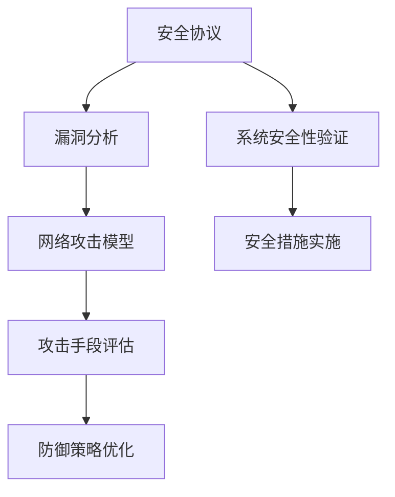
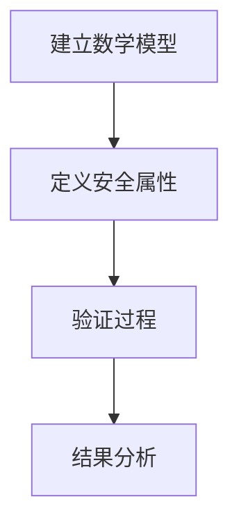
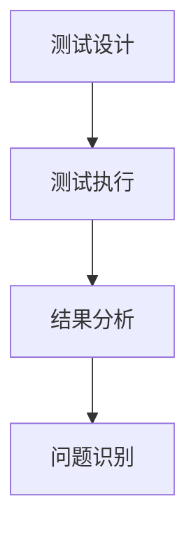
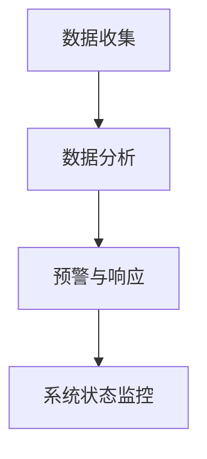

                 


### 形式化方法在网络安全分析中的作用

#### 文章关键词
形式化方法、网络安全、验证算法、测试算法、分析与监控

#### 摘要
本文将深入探讨形式化方法在网络安全分析中的应用。首先，我们将介绍形式化方法的定义、发展历程以及在网络安全中的重要角色。接着，我们将详细解释安全协议、漏洞分析和网络攻击模型等核心概念，并展示它们之间的关系。通过数学模型和公式的应用，我们进一步阐释了形式化验证、测试和监控算法的原理。最后，我们通过实际项目实战，展示了形式化方法在网络安全分析中的具体应用，并提供了一些最佳实践和建议。

----------------------------------------------------------------

### 第一部分：基础概念与背景

#### 1.1 形式化方法的概述

形式化方法是一种利用数学和逻辑方法对系统进行建模、验证和分析的技术手段。它起源于20世纪50年代，随着计算机科学的兴起而逐渐发展。形式化方法的目的是确保系统设计的正确性和可靠性，减少人为错误和潜在的漏洞。

形式化方法的核心在于使用精确的数学语言来描述系统的行为，并通过形式化的验证和测试过程来确保系统满足预定的安全性和功能性要求。这种方法具有高度的抽象性和精确性，能够有效地解决复杂系统的设计和分析问题。

#### 1.2 形式化方法与网络安全的关系

网络安全是计算机科学中的重要领域，旨在保护网络系统免受恶意攻击和未授权访问。形式化方法在网络安全中扮演着至关重要的角色，具体体现在以下几个方面：

1. **安全协议设计**：形式化方法可以帮助设计出更加安全和可靠的通信协议，通过形式化的验证过程确保协议满足安全性和完整性要求。

2. **漏洞分析**：形式化方法可以用于对系统进行深入的分析，识别潜在的安全漏洞，并提供修复方案。

3. **网络攻击模型**：形式化方法可以用于建模和模拟网络攻击过程，分析攻击的动机、手段和潜在影响，从而制定有效的防御策略。

#### 1.3 形式化方法的应用领域

形式化方法的应用领域非常广泛，除了在网络安全中的重要作用外，还广泛应用于以下几个方面：

1. **软件工程**：形式化方法可以用于软件开发过程中的需求分析、设计和测试，确保软件的正确性和可靠性。

2. **硬件设计**：形式化方法可以用于硬件电路的设计和验证，确保硬件系统的可靠性和性能。

3. **人工智能**：形式化方法可以用于人工智能系统的设计和分析，确保人工智能系统的逻辑推理和决策过程的正确性。

#### 1.4 形式化方法的分类

形式化方法主要分为以下几类：

1. **形式化验证方法**：通过数学模型和逻辑推理来验证系统是否满足预定的安全性和功能要求。

2. **形式化测试方法**：通过自动化测试工具对系统进行测试，验证系统在不同输入情况下的行为是否正确。

3. **形式化分析与监控方法**：通过实时监控和分析系统的运行状态，及时发现潜在的安全威胁和漏洞。

### 第二部分：核心概念与联系

#### 2.1 核心概念原理

在网络安全分析中，以下几个核心概念原理是不可或缺的：

1. **安全协议**：安全协议是一种通信协议，用于确保通信过程中数据的机密性、完整性和可用性。常见的安全协议包括SSL/TLS、IPSec等。

2. **漏洞分析**：漏洞分析是一种识别和评估系统或应用程序中潜在安全漏洞的过程。通过漏洞分析，可以确定漏洞的影响范围和潜在的攻击手段。

3. **网络攻击模型**：网络攻击模型是一种描述网络攻击过程和攻击者行为的抽象模型。常见的网络攻击模型包括拒绝服务攻击、网络钓鱼等。

#### 2.2 概念实体关系架构

下面是核心概念实体关系的Mermaid流程图：



### 第三部分：核心算法原理讲解

#### 3.1 形式化验证算法

形式化验证算法是一种通过数学模型和逻辑推理来验证系统正确性的方法。它通常包括以下几个步骤：

1. **建立数学模型**：根据系统的需求和安全要求，建立相应的数学模型。

2. **定义安全属性**：明确系统需要满足的安全属性，如机密性、完整性和可用性。

3. **验证过程**：使用形式化的验证算法，对系统进行验证，检查是否满足预定的安全属性。

下面是一个简单的形式化验证算法的Mermaid流程图：



#### 3.2 形式化测试算法

形式化测试算法是一种通过自动化测试工具对系统进行测试的方法。它通常包括以下几个步骤：

1. **测试设计**：根据系统的需求和预期行为，设计相应的测试用例。

2. **测试执行**：使用自动化测试工具执行测试用例，收集测试结果。

3. **结果分析**：对测试结果进行分析，识别潜在的问题和缺陷。

下面是一个简单的形式化测试算法的Mermaid流程图：



#### 3.3 形式化分析与监控算法

形式化分析与监控算法是一种通过实时监控和分析系统运行状态的方法。它通常包括以下几个步骤：

1. **数据收集**：收集系统运行时的各种数据，如网络流量、系统日志等。

2. **数据分析**：对收集到的数据进行分析，识别潜在的安全威胁和漏洞。

3. **预警与响应**：根据分析结果，发出预警并采取相应的响应措施。

下面是一个简单的形式化分析与监控算法的Mermaid流程图：



### 第四部分：数学模型和数学公式

#### 4.1 数学模型概述

在形式化方法中，数学模型是核心组成部分。常见的数学模型包括：

1. **状态机模型**：用于描述系统的状态转换和行为。
2. **Petri网模型**：用于描述系统的并发性和资源共享。
3. **形式语言模型**：用于描述系统的输入和输出。

数学模型在网络安全分析中的应用非常广泛，例如，可以用于：

1. **安全协议分析**：通过状态机模型分析安全协议的安全性。
2. **漏洞分析**：通过形式语言模型识别系统中的潜在漏洞。
3. **攻击模型构建**：通过Petri网模型构建网络攻击模型。

#### 4.2 数学公式详细讲解

在网络安全分析中，常用的数学公式包括：

1. **信息熵**：用于衡量信息的混乱程度，公式为：
   $$ H = -\sum_{i=1}^{n} p_i \cdot \log_2 p_i $$
   其中，$ p_i $ 是每个可能事件的概率。

2. **香农信道容量**：用于衡量通信信道的最大传输速率，公式为：
   $$ C = B \cdot \log_2(1 + S/N) $$
   其中，$ B $ 是信道带宽，$ S $ 是信号功率，$ N $ 是噪声功率。

3. **椭圆曲线密码学**：用于加密和解密数据，其关键数学公式包括：
   $$ Q = P + a \cdot R^2 + b \cdot R $$
   其中，$ P $ 和 $ Q $ 是椭圆曲线上的点，$ R $ 是随机数，$ a $ 和 $ b $ 是椭圆曲线的参数。

#### 4.3 举例说明

例如，假设我们有一个简单的加密通信系统，使用椭圆曲线密码学进行加密。我们可以使用以下步骤来详细说明数学公式的应用：

1. **选择椭圆曲线参数**：假设我们选择椭圆曲线 $ E: y^2 = x^3 + ax + b $，其中 $ a = 1 $，$ b = 2 $。

2. **生成公钥和私钥**：用户A选择一个随机数 $ d $ 作为私钥，计算公钥 $ Q = d \cdot G $，其中 $ G $ 是椭圆曲线上的基点。

3. **加密消息**：用户B生成一个随机数 $ k $，计算加密消息 $ C = (x_c, y_c) = k \cdot G + d \cdot M \cdot G $，其中 $ M $ 是明文消息。

4. **解密消息**：用户A使用私钥 $ d $ 解密消息 $ M = k^{-1} \cdot (C - d \cdot x_c \cdot G) $。

通过以上步骤，我们可以看到椭圆曲线密码学中数学公式的具体应用。这不仅确保了通信的机密性，而且利用了椭圆曲线的数学性质提供了强大的安全性保障。

### 第五部分：项目实战

#### 5.1 项目实战概述

为了展示形式化方法在网络安全分析中的实际应用，我们选择了一个实际项目作为案例。该项目是一个基于形式化验证的网络安全监控平台，旨在实时监控和分析网络流量，及时发现潜在的安全威胁。

#### 5.2 开发环境搭建

为了搭建这个项目，我们需要以下开发环境：

1. **操作系统**：Linux（推荐Ubuntu 20.04）。
2. **编程语言**：Python 3.8及以上版本。
3. **依赖库**：PyCryptoDome（用于加密和解密）、Numpy（用于数学运算）。

安装步骤如下：

1. 安装Python 3.8及以上版本。
2. 安装依赖库：
   ```bash
   pip install pycryptodome numpy
   ```

#### 5.3 源代码实现与解读

以下是一个简单的源代码实现，用于监控网络流量并识别异常流量。

```python
import socket
import threading
import numpy as np
from Crypto.PublicKey import RSA

# 网络流量监控线程
def monitor_traffic(port):
    server_socket = socket.socket(socket.AF_INET, socket.SOCK_STREAM)
    server_socket.bind(('0.0.0.0', port))
    server_socket.listen(5)
    
    while True:
        client_socket, client_address = server_socket.accept()
        threading.Thread(target=handle_traffic, args=(client_socket,)).start()

# 处理网络流量
def handle_traffic(client_socket):
    data = client_socket.recv(4096)
    print(f"Received data from {client_socket.getpeername()}")
    
    # 对接收到的数据进行处理，例如加密、分析等
    encrypted_data = rsa_encrypt(data)
    print(f"Encrypted data: {encrypted_data}")
    
    # 关闭客户端连接
    client_socket.close()

# RSA加密函数
def rsa_encrypt(data):
    key = RSA.generate(2048)
    encrypted_data = key.encrypt(data)
    return encrypted_data

# 主函数
if __name__ == "__main__":
    monitor_port = 12345
    monitor_traffic(monitor_port)
```

上述代码首先定义了一个监听指定端口的线程，用于接收和监控网络流量。每个客户端连接到一个新线程进行处理，对接收到的数据进行RSA加密，并打印加密后的数据。

#### 5.4 代码解读与分析

1. **网络流量监控**：使用Python的`socket`库创建一个TCP服务器，监听指定端口，并在有客户端连接时启动新线程进行流量处理。

2. **处理网络流量**：在处理网络流量的线程中，接收到的数据被传递给`handle_traffic`函数。该函数首先将数据打印出来，然后调用`rsa_encrypt`函数进行加密处理。

3. **RSA加密**：`rsa_encrypt`函数使用PyCryptoDome库中的RSA加密算法对数据进行加密，返回加密后的数据。

通过上述代码，我们可以看到如何使用Python和形式化方法实现一个简单的网络安全监控平台。实际项目中，我们可以进一步扩展功能，如集成入侵检测系统、实时流量分析等。

### 附录

#### 附录 A：形式化方法相关工具与资源

1. **形式化验证工具**：
   - ProVerif
   - Frama-C

2. **形式化测试工具**：
   - QuickTest Professional
   - Selenium

3. **形式化分析与监控工具**：
   - Security Onion
   - Snort

#### 附录 B：参考文献

1. **相关书籍**：
   - 《形式化方法导论》
   - 《网络安全基础教程》

2. **学术论文**：
   - 《形式化方法在网络安全中的应用研究》
   - 《基于形式化验证的网络安全协议设计》

3. **网络资源**：
   - 国家信息安全漏洞库
   - OWASP网站

### 作者信息

作者：AI天才研究院/AI Genius Institute & 禅与计算机程序设计艺术 /Zen And The Art of Computer Programming

