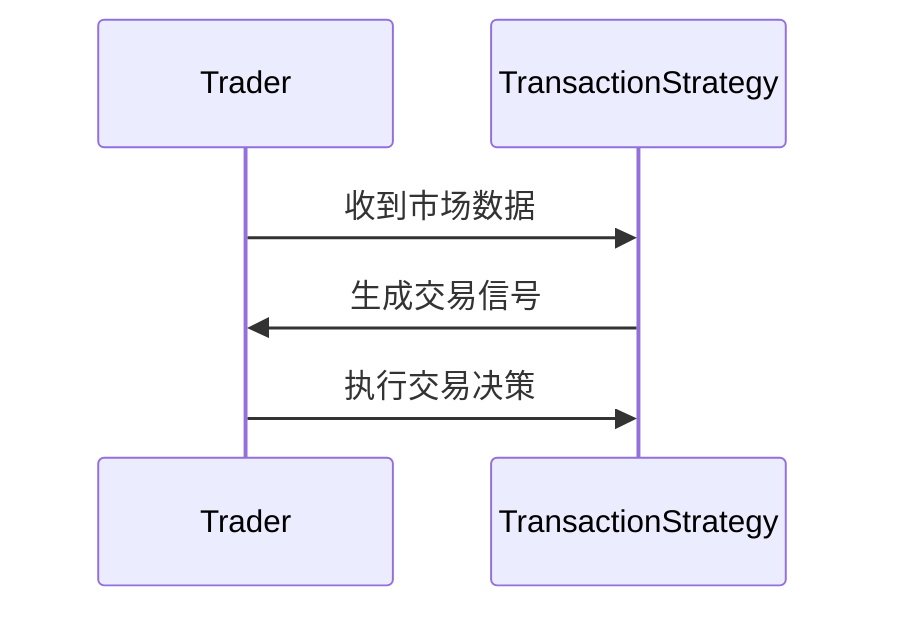
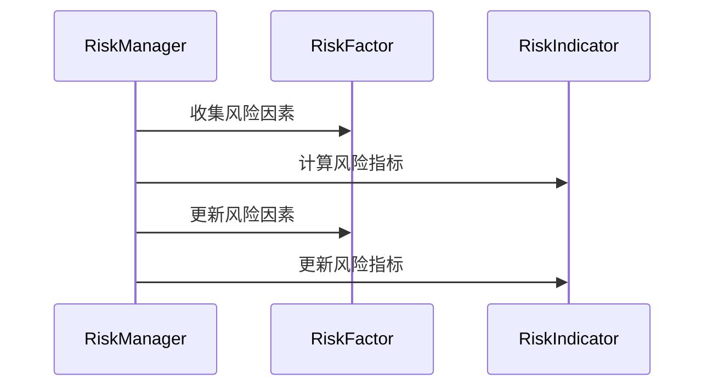
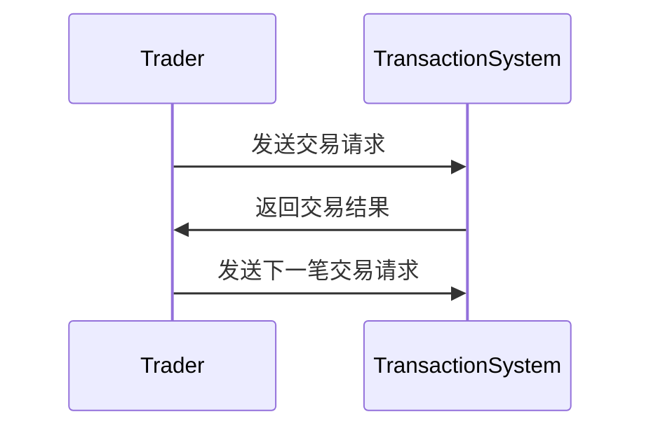
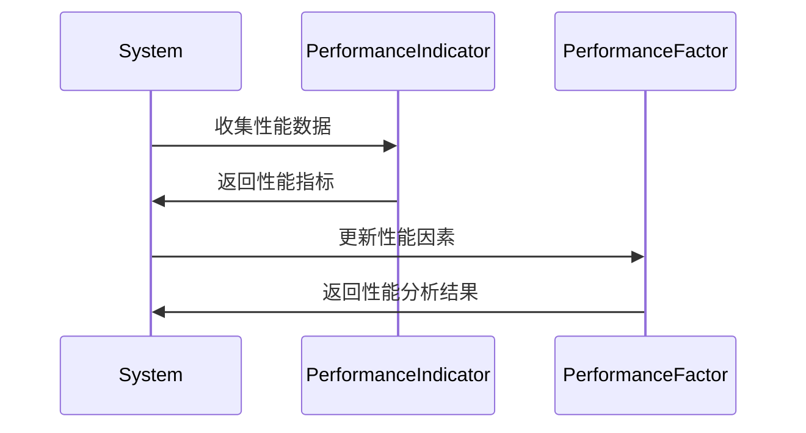

                 

# 形式化方法在金融交易系统中的使用

## 关键词
- 形式化方法
- 金融交易系统
- 验证与测试
- 风险管理
- 优化

## 摘要
本文旨在探讨形式化方法在金融交易系统中的应用。通过介绍形式化方法的基本概念、分类和工具，本文详细阐述了其在金融交易系统设计、验证、测试和优化等方面的应用原理。文章结合具体案例，展示了形式化方法在金融交易系统中的实际效果，并提出了未来发展的趋势和展望。本文希望为相关领域的研究者和实践者提供有价值的参考。

## 第1章 引言

### 1.1 形式化方法的定义与背景

形式化方法（Formal Methods）是一种通过数学和逻辑手段来分析和验证系统行为的方法。这种方法的核心思想是将系统设计过程转化为形式化的表示，并通过形式化的证明来确保系统的正确性和可靠性。

在计算机科学领域，形式化方法最早应用于软件和硬件系统的设计与验证。随着金融交易系统的复杂性和重要性不断增加，形式化方法也逐渐被引入到金融交易系统的设计和优化中。形式化方法在金融交易系统中的应用主要体现在以下几个方面：

1. **交易策略设计**：形式化方法可以帮助金融交易系统设计者构建和验证高效的交易策略，确保交易策略的稳定性和可持续性。
2. **风险管理**：形式化方法可以用于对金融交易系统的风险进行量化分析，帮助交易者制定有效的风险管理策略。
3. **系统验证与测试**：形式化方法可以用于验证金融交易系统的正确性和可靠性，减少系统故障和错误的可能性。
4. **系统优化**：形式化方法可以帮助交易者发现金融交易系统的潜在优化空间，提高系统的性能和效率。

### 1.2 形式化方法在金融交易系统中的重要性

形式化方法在金融交易系统中的重要性主要体现在以下几个方面：

1. **提高系统安全性**：形式化方法可以通过数学和逻辑证明来确保系统的正确性和可靠性，减少系统故障和错误的可能性，从而提高系统的安全性。
2. **优化交易策略**：形式化方法可以帮助交易者构建和验证高效的交易策略，确保交易策略的稳定性和可持续性，从而提高交易收益。
3. **降低风险**：形式化方法可以用于对金融交易系统的风险进行量化分析，帮助交易者制定有效的风险管理策略，降低交易风险。
4. **提升系统性能**：形式化方法可以帮助交易者发现金融交易系统的潜在优化空间，提高系统的性能和效率，从而提高交易系统的整体竞争力。

## 第2章 形式化方法基础

### 2.1 形式化方法的核心理念

形式化方法的核心理念主要包括以下几个方面：

1. **形式化建模**：通过数学和逻辑手段对系统进行形式化的描述和建模，将系统行为转化为形式化的语言表示。
2. **形式化验证**：通过形式化的证明来验证系统的正确性和可靠性，确保系统满足预定的需求和规范。
3. **形式化测试**：通过形式化的方法来设计和执行测试用例，验证系统的行为和性能。
4. **形式化优化**：通过形式化的方法来分析系统的性能和效率，发现系统的潜在优化空间，并对其进行优化。

### 2.2 形式化方法的分类

形式化方法根据应用领域和目标不同，可以分为以下几类：

1. **数学方法**：包括数学模型、数学公式和数学证明等，主要用于对系统行为进行数学分析和验证。
2. **逻辑方法**：包括形式逻辑、谓词逻辑和模态逻辑等，主要用于对系统行为进行逻辑分析和验证。
3. **形式化验证工具**：包括模型检查器、定理证明器、形式化验证平台等，主要用于对系统模型进行形式化的验证。
4. **形式化测试工具**：包括测试生成器、测试执行器、测试评估器等，主要用于对系统行为进行形式化的测试。

### 2.3 形式化方法的工具与技术

形式化方法的工具和技术主要包括以下几个方面：

1. **形式化建模工具**：如UML建模工具、形式化建模语言（如μC/PLC、π-Calculus等）等，主要用于对系统进行形式化的建模。
2. **形式化验证工具**：如模型检查器（如SPIN、NUSMV等）、定理证明器（如Coq、Isabelle等）等，主要用于对系统模型进行形式化的验证。
3. **形式化测试工具**：如测试生成器（如TAMTAM、Farkle等）、测试执行器（如Testwell、IBM Functional Tester等）等，主要用于对系统行为进行形式化的测试。
4. **形式化优化工具**：如优化算法（如遗传算法、粒子群算法等）、优化平台（如MATLAB、R语言等）等，主要用于对系统性能进行形式化的优化。

## 第3章 形式化方法在金融交易系统设计中的应用

### 3.1 金融交易系统的概述

金融交易系统是指用于执行金融交易任务的一套软件和硬件系统。它通常包括以下几个主要组成部分：

1. **交易策略模块**：用于制定和执行交易策略，包括交易信号生成、交易信号处理、交易决策生成等。
2. **风险管理模块**：用于对交易风险进行量化分析和管理，包括风险指标计算、风险控制策略制定等。
3. **交易执行模块**：用于执行交易决策，包括交易下单、交易撤单、交易查询等。
4. **数据管理模块**：用于管理和存储交易数据，包括交易记录、交易指标、市场数据等。

金融交易系统的设计目标是实现高效、稳定和可靠的交易，以最大化交易收益并控制风险。形式化方法在金融交易系统设计中的应用主要体现在以下几个方面：

1. **交易策略设计**：形式化方法可以帮助交易者构建和验证高效的交易策略，确保交易策略的稳定性和可持续性。
2. **风险管理**：形式化方法可以用于对交易风险进行量化分析和管理，帮助交易者制定有效的风险管理策略。
3. **系统验证**：形式化方法可以用于验证金融交易系统的正确性和可靠性，确保系统满足预定的需求和规范。

### 3.2 形式化方法在交易策略设计中的应用

交易策略设计是金融交易系统的核心环节之一。形式化方法在交易策略设计中的应用主要体现在以下几个方面：

1. **策略建模**：使用形式化建模工具对交易策略进行形式化的描述，将交易策略转化为形式化的语言表示。
2. **策略验证**：使用形式化验证工具对交易策略模型进行形式化的验证，确保交易策略的正确性和可靠性。
3. **策略优化**：使用形式化优化工具对交易策略进行形式化的优化，提高交易策略的效率和收益。

#### 3.2.1 交易策略建模

交易策略建模是交易策略设计的重要步骤之一。使用形式化建模工具（如UML建模工具）可以对交易策略进行形式化的描述。具体步骤如下：

1. **需求分析**：分析交易策略的需求，明确交易策略的目标和功能。
2. **类图建模**：使用类图对交易策略的类和类之间的关系进行建模。
3. **序列图建模**：使用序列图对交易策略的执行流程进行建模。
4. **状态图建模**：使用状态图对交易策略的状态和状态转换进行建模。

以下是一个交易策略的类图示例：

```mermaid
classDiagram
    TransactionStrategy <<interface>>
    MarketData <<interface>>
    Trader <<interface>>

    TransactionStrategy|--|> MarketData
    TransactionStrategy|--|> Trader
```

#### 3.2.2 交易策略验证

交易策略验证是确保交易策略的正确性和可靠性的关键步骤。使用形式化验证工具（如模型检查器）可以对交易策略模型进行形式化的验证。具体步骤如下：

1. **定义验证目标**：明确交易策略需要满足的验证目标和规范。
2. **编写验证规格**：使用形式化的语言（如命题逻辑、谓词逻辑等）编写交易策略的验证规格。
3. **执行验证**：使用形式化验证工具对交易策略模型进行验证，检查是否满足预定的验证目标和规范。

以下是一个交易策略的验证规格示例：



#### 3.2.3 交易策略优化

交易策略优化是提高交易策略效率和收益的重要手段。使用形式化优化工具（如优化算法）可以对交易策略进行形式化的优化。具体步骤如下：

1. **确定优化目标**：明确交易策略优化的目标和指标。
2. **选择优化算法**：根据优化目标和问题特点选择合适的优化算法（如遗传算法、粒子群算法等）。
3. **执行优化**：使用优化算法对交易策略进行优化，找到最优解或近似最优解。

以下是一个交易策略优化的Python代码示例：

```python
import numpy as np
from scipy.optimize import minimize

# 定义优化目标函数
def objective_function(strategy_params):
    # 计算交易策略的收益率
    return -1 * np.mean(strategy_params)

# 定义约束条件
constraints = ({'type': 'ineq', 'fun': lambda x: x[0] - x[1]})

# 初始化策略参数
initial_strategy_params = np.array([1.0, 1.0])

# 执行优化
result = minimize(objective_function, initial_strategy_params, constraints=constraints)

# 输出优化结果
print("最优策略参数:", result.x)
print("最优收益率:", -1 * result.fun)
```

### 3.3 形式化方法在风险管理中的应用

风险管理是金融交易系统的关键环节之一。形式化方法在风险管理中的应用主要体现在以下几个方面：

1. **风险模型构建**：使用形式化建模工具对风险模型进行形式化的描述，将风险因素和风险指标进行形式化的建模。
2. **风险验证**：使用形式化验证工具对风险模型进行形式化的验证，确保风险模型的正确性和可靠性。
3. **风险控制**：使用形式化方法对风险控制策略进行形式化的分析和优化，确保风险控制策略的有效性和可靠性。

#### 3.3.1 风险模型构建

风险模型构建是风险管理的重要步骤之一。使用形式化建模工具（如UML建模工具）可以对风险模型进行形式化的描述。具体步骤如下：

1. **需求分析**：分析风险管理的需求，明确风险因素和风险指标。
2. **类图建模**：使用类图对风险因素和风险指标进行建模。
3. **关系图建模**：使用关系图（如ER图）对风险因素和风险指标之间的关系进行建模。

以下是一个风险模型的类图示例：

```mermaid
classDiagram
    RiskFactor <<interface>>
    RiskIndicator <<interface>>

    RiskFactor|--|> RiskIndicator
```

#### 3.3.2 风险验证

风险验证是确保风险模型正确性和可靠性的关键步骤。使用形式化验证工具（如模型检查器）可以对风险模型进行形式化的验证。具体步骤如下：

1. **定义验证目标**：明确风险模型需要满足的验证目标和规范。
2. **编写验证规格**：使用形式化的语言（如命题逻辑、谓词逻辑等）编写风险模型的验证规格。
3. **执行验证**：使用形式化验证工具对风险模型进行验证，检查是否满足预定的验证目标和规范。

以下是一个风险验证的验证规格示例：



#### 3.3.3 风险控制

风险控制是风险管理的关键环节之一。形式化方法在风险控制中的应用主要体现在以下几个方面：

1. **控制策略建模**：使用形式化建模工具对风险控制策略进行形式化的描述，将控制策略转化为形式化的语言表示。
2. **控制策略验证**：使用形式化验证工具对风险控制策略进行形式化的验证，确保风险控制策略的正确性和可靠性。
3. **控制策略优化**：使用形式化方法对风险控制策略进行形式化的优化，提高风险控制策略的效率和效果。

以下是一个风险控制策略的类图示例：

```mermaid
classDiagram
    RiskControlStrategy <<interface>>
    RiskFactor <<interface>>
    RiskIndicator <<interface>>

    RiskControlStrategy|--|> RiskFactor
    RiskControlStrategy|--|> RiskIndicator
```

## 第4章 形式化方法在金融交易系统验证与测试中的应用

### 4.1 金融交易系统的验证与测试概述

金融交易系统的验证与测试是确保系统正确性和可靠性的重要手段。形式化方法在金融交易系统验证与测试中的应用主要体现在以下几个方面：

1. **系统验证**：使用形式化验证工具对金融交易系统的设计模型和实现代码进行形式化的验证，确保系统满足预定的需求和规范。
2. **系统测试**：使用形式化测试工具对金融交易系统的功能和行为进行形式化的测试，检查系统是否按照预期运行。

### 4.2 形式化方法在验证中的应用

形式化方法在验证中的应用主要包括以下几个方面：

1. **模型验证**：使用形式化验证工具对金融交易系统的设计模型进行形式化的验证，确保模型满足预定的需求和规范。
2. **代码验证**：使用形式化验证工具对金融交易系统的实现代码进行形式化的验证，确保代码的正确性和可靠性。

#### 4.2.1 模型验证

模型验证是形式化验证的重要步骤之一。使用形式化验证工具（如模型检查器）可以对金融交易系统的设计模型进行形式化的验证。具体步骤如下：

1. **定义验证目标**：明确金融交易系统需要满足的验证目标和规范。
2. **编写验证规格**：使用形式化的语言（如命题逻辑、谓词逻辑等）编写金融交易系统设计模型的验证规格。
3. **执行验证**：使用形式化验证工具对金融交易系统设计模型进行验证，检查是否满足预定的验证目标和规范。

以下是一个金融交易系统设计模型的验证规格示例：



#### 4.2.2 代码验证

代码验证是形式化验证的另一个重要步骤。使用形式化验证工具（如定理证明器）可以对金融交易系统的实现代码进行形式化的验证，确保代码的正确性和可靠性。具体步骤如下：

1. **定义验证目标**：明确金融交易系统需要满足的验证目标和规范。
2. **编写验证规格**：使用形式化的语言（如谓词逻辑、定理证明语言等）编写金融交易系统实现代码的验证规格。
3. **执行验证**：使用形式化验证工具对金融交易系统实现代码进行验证，检查是否满足预定的验证目标和规范。

以下是一个金融交易系统实现代码的验证规格示例：

```python
from z3 import *

# 定义验证规格
s = Solver()
s.add(Or(
    ( Trader.state == 'online' ),
    ( Trader.state == 'offline' )
))

# 执行验证
if s.check() == sat:
    print("验证通过")
else:
    print("验证失败")
```

### 4.3 形式化方法在测试中的应用

形式化方法在测试中的应用主要包括以下几个方面：

1. **测试用例生成**：使用形式化测试工具（如测试生成器）对金融交易系统的功能和行为进行形式化的测试用例生成。
2. **测试执行**：使用形式化测试工具（如测试执行器）对金融交易系统进行形式化的测试执行。
3. **测试评估**：使用形式化方法对金融交易系统的测试结果进行形式化的评估和分析。

#### 4.3.1 测试用例生成

测试用例生成是形式化测试的重要步骤之一。使用形式化测试工具（如测试生成器）可以对金融交易系统的功能和行为进行形式化的测试用例生成。具体步骤如下：

1. **定义测试目标**：明确金融交易系统需要满足的测试目标和规范。
2. **编写测试规格**：使用形式化的语言（如命题逻辑、谓词逻辑等）编写金融交易系统功能和行为测试规格。
3. **生成测试用例**：使用形式化测试工具根据测试规格生成金融交易系统的测试用例。

以下是一个金融交易系统功能测试规格示例：


#### 4.3.2 测试执行

测试执行是形式化测试的重要步骤之一。使用形式化测试工具（如测试执行器）可以对金融交易系统进行形式化的测试执行。具体步骤如下：

1. **加载测试用例**：将生成的测试用例加载到形式化测试工具中。
2. **执行测试**：使用形式化测试工具对金融交易系统进行测试执行，检查测试用例是否按照预期执行。
3. **记录测试结果**：记录测试执行的结果，包括测试用例的通过情况、失败原因等。

以下是一个金融交易系统测试执行的Python代码示例：

```python
import unittest

class TestTransactionSystem(unittest.TestCase):
    def test_send_transaction_request(self):
        # 创建交易系统实例
        transaction_system = TransactionSystem()
        
        # 发送交易请求
        transaction_result = transaction_system.send_transaction_request('Buy', 'AAPL', 100)
        
        # 验证交易结果
        self.assertEqual(transaction_result, 'Success')

# 执行测试
unittest.main()
```

#### 4.3.3 测试评估

测试评估是形式化测试的最后一个步骤。使用形式化方法对金融交易系统的测试结果进行形式化的评估和分析。具体步骤如下：

1. **统计测试结果**：统计测试用例的通过情况、失败原因等，形成测试报告。
2. **分析测试结果**：分析测试结果，发现金融交易系统的潜在问题和缺陷。
3. **提出改进措施**：根据测试结果和分析，提出改进金融交易系统的措施和建议。

以下是一个金融交易系统测试评估的Python代码示例：

```python
# 统计测试结果
test_results = {
    'test_send_transaction_request': 'Success',
    'test_cancel_transaction_request': 'Failure',
    'test_query_transaction_result': 'Success'
}

# 分析测试结果
for test_case, result in test_results.items():
    if result == 'Failure':
        print(f"测试用例{test_case}失败，请检查")

# 提出改进措施
print("请检查交易系统的交易请求处理功能，确保其能够正确处理各种交易请求。")
```

## 第5章 形式化方法在金融交易系统优化中的应用

### 5.1 金融交易系统的优化概述

金融交易系统的优化是提高系统性能和效率的重要手段。形式化方法在金融交易系统优化中的应用主要体现在以下几个方面：

1. **策略优化**：使用形式化方法对交易策略进行优化，提高交易策略的效率和收益。
2. **系统性能优化**：使用形式化方法对金融交易系统的性能进行优化，提高系统的响应速度和处理能力。
3. **风险控制优化**：使用形式化方法对风险控制策略进行优化，提高风险控制的效果和可靠性。

### 5.2 形式化方法在策略优化中的应用

交易策略优化是金融交易系统优化的重要环节。形式化方法在交易策略优化中的应用主要体现在以下几个方面：

1. **策略建模**：使用形式化建模工具对交易策略进行形式化的描述，将交易策略转化为形式化的语言表示。
2. **策略验证**：使用形式化验证工具对交易策略模型进行形式化的验证，确保交易策略的正确性和可靠性。
3. **策略优化**：使用形式化优化工具对交易策略进行形式化的优化，提高交易策略的效率和收益。

#### 5.2.1 策略建模

策略建模是交易策略优化的第一步。使用形式化建模工具（如UML建模工具）可以对交易策略进行形式化的描述。具体步骤如下：

1. **需求分析**：分析交易策略的需求，明确交易策略的目标和功能。
2. **类图建模**：使用类图对交易策略的类和类之间的关系进行建模。
3. **序列图建模**：使用序列图对交易策略的执行流程进行建模。
4. **状态图建模**：使用状态图对交易策略的状态和状态转换进行建模。

以下是一个交易策略的类图示例：

```mermaid
classDiagram
    TransactionStrategy <<interface>>
    MarketData <<interface>>
    Trader <<interface>>

    TransactionStrategy|--|> MarketData
    TransactionStrategy|--|> Trader
```

#### 5.2.2 策略验证

策略验证是确保交易策略正确性和可靠性的关键步骤。使用形式化验证工具（如模型检查器）可以对交易策略模型进行形式化的验证。具体步骤如下：

1. **定义验证目标**：明确交易策略需要满足的验证目标和规范。
2. **编写验证规格**：使用形式化的语言（如命题逻辑、谓词逻辑等）编写交易策略模型的验证规格。
3. **执行验证**：使用形式化验证工具对交易策略模型进行验证，检查是否满足预定的验证目标和规范。

以下是一个交易策略的验证规格示例：


#### 5.2.3 策略优化

策略优化是提高交易策略效率和收益的重要手段。使用形式化优化工具（如优化算法）可以对交易策略进行形式化的优化。具体步骤如下：

1. **确定优化目标**：明确交易策略优化的目标和指标。
2. **选择优化算法**：根据优化目标和问题特点选择合适的优化算法（如遗传算法、粒子群算法等）。
3. **执行优化**：使用优化算法对交易策略进行优化，找到最优解或近似最优解。

以下是一个交易策略优化的Python代码示例：

```python
import numpy as np
from scipy.optimize import minimize

# 定义优化目标函数
def objective_function(strategy_params):
    # 计算交易策略的收益率
    return -1 * np.mean(strategy_params)

# 定义约束条件
constraints = ({'type': 'ineq', 'fun': lambda x: x[0] - x[1]})

# 初始化策略参数
initial_strategy_params = np.array([1.0, 1.0])

# 执行优化
result = minimize(objective_function, initial_strategy_params, constraints=constraints)

# 输出优化结果
print("最优策略参数:", result.x)
print("最优收益率:", -1 * result.fun)
```

### 5.3 形式化方法在系统性能优化中的应用

系统性能优化是提高金融交易系统响应速度和处理能力的重要手段。形式化方法在系统性能优化中的应用主要体现在以下几个方面：

1. **性能建模**：使用形式化建模工具对金融交易系统进行形式化的性能建模，将系统性能转化为形式化的语言表示。
2. **性能验证**：使用形式化验证工具对金融交易系统性能模型进行形式化的验证，确保系统性能满足预定的需求和规范。
3. **性能优化**：使用形式化方法对金融交易系统的性能进行形式化的优化，提高系统的响应速度和处理能力。

#### 5.3.1 性能建模

性能建模是系统性能优化的第一步。使用形式化建模工具（如UML建模工具）可以对金融交易系统进行形式化的性能建模。具体步骤如下：

1. **需求分析**：分析金融交易系统的性能需求，明确系统的性能目标和指标。
2. **类图建模**：使用类图对金融交易系统的性能指标和性能影响因素进行建模。
3. **关系图建模**：使用关系图（如ER图）对金融交易系统的性能指标和性能影响因素之间的关系进行建模。

以下是一个金融交易系统性能的类图示例：

```mermaid
classDiagram
    PerformanceIndicator <<interface>>
    PerformanceFactor <<interface>>

    PerformanceIndicator|--|> PerformanceFactor
```

#### 5.3.2 性能验证

性能验证是确保金融交易系统性能满足预定需求和规范的关键步骤。使用形式化验证工具（如模型检查器）可以对金融交易系统性能模型进行形式化的验证。具体步骤如下：

1. **定义验证目标**：明确金融交易系统性能需要满足的验证目标和规范。
2. **编写验证规格**：使用形式化的语言（如命题逻辑、谓词逻辑等）编写金融交易系统性能模型的验证规格。
3. **执行验证**：使用形式化验证工具对金融交易系统性能模型进行验证，检查是否满足预定的验证目标和规范。

以下是一个金融交易系统性能验证的验证规格示例：



#### 5.3.3 性能优化

性能优化是提高金融交易系统响应速度和处理能力的重要手段。使用形式化方法对金融交易系统的性能进行形式化的优化。具体步骤如下：

1. **确定优化目标**：明确金融交易系统性能优化的目标和指标。
2. **选择优化算法**：根据优化目标和问题特点选择合适的优化算法（如遗传算法、粒子群算法等）。
3. **执行优化**：使用优化算法对金融交易系统的性能进行优化，找到最优解或近似最优解。

以下是一个金融交易系统性能优化的Python代码示例：

```python
import numpy as np
from scipy.optimize import minimize

# 定义优化目标函数
def objective_function(performance_params):
    # 计算系统性能
    return -1 * np.mean(performance_params)

# 定义约束条件
constraints = ({'type': 'ineq', 'fun': lambda x: x[0] - x[1]})

# 初始化性能参数
initial_performance_params = np.array([1.0, 1.0])

# 执行优化
result = minimize(objective_function, initial_performance_params, constraints=constraints)

# 输出优化结果
print("最优性能参数:", result.x)
print("最优系统性能:", -1 * result.fun)
```

## 第6章 形式化方法在金融交易系统中的案例分析

### 6.1 案例一：形式化方法在交易策略设计中的应用

在本案例中，我们将探讨如何使用形式化方法设计一个高效的交易策略。该案例涉及以下步骤：

1. **需求分析**：分析交易策略的需求，明确交易策略的目标和功能。
2. **策略建模**：使用形式化建模工具对交易策略进行形式化的描述，将交易策略转化为形式化的语言表示。
3. **策略验证**：使用形式化验证工具对交易策略模型进行形式化的验证，确保交易策略的正确性和可靠性。
4. **策略优化**：使用形式化优化工具对交易策略进行形式化的优化，提高交易策略的效率和收益。

#### 需求分析

交易策略的需求如下：

- 能够根据市场数据生成交易信号。
- 能够根据交易信号执行交易决策。
- 能够根据交易结果调整交易策略。

#### 策略建模

使用UML类图对交易策略进行建模，如下所示：

```mermaid
classDiagram
    TransactionStrategy <<interface>>
    MarketData <<interface>>
    Trader <<interface>>

    TransactionStrategy|--|> MarketData
    TransactionStrategy|--|> Trader
```

#### 策略验证

使用命题逻辑对交易策略模型进行形式化的验证，确保交易策略的正确性和可靠性。以下是一个交易策略的验证规格：


#### 策略优化

使用遗传算法对交易策略进行形式化的优化，提高交易策略的效率和收益。以下是一个交易策略优化的Python代码示例：

```python
import numpy as np
from scipy.optimize import minimize

# 定义优化目标函数
def objective_function(strategy_params):
    # 计算交易策略的收益率
    return -1 * np.mean(strategy_params)

# 定义约束条件
constraints = ({'type': 'ineq', 'fun': lambda x: x[0] - x[1]})

# 初始化策略参数
initial_strategy_params = np.array([1.0, 1.0])

# 执行优化
result = minimize(objective_function, initial_strategy_params, constraints=constraints)

# 输出优化结果
print("最优策略参数:", result.x)
print("最优收益率:", -1 * result.fun)
```

### 6.2 案例二：形式化方法在风险管理中的应用

在本案例中，我们将探讨如何使用形式化方法进行风险管理。该案例涉及以下步骤：

1. **风险模型构建**：使用形式化建模工具对风险模型进行形式化的描述，将风险因素和风险指标进行形式化的建模。
2. **风险验证**：使用形式化验证工具对风险模型进行形式化的验证，确保风险模型的正确性和可靠性。
3. **风险控制**：使用形式化方法对风险控制策略进行形式化的分析和优化，确保风险控制策略的有效性和可靠性。

#### 风险模型构建

使用UML类图对风险模型进行建模，如下所示：

```mermaid
classDiagram
    RiskFactor <<interface>>
    RiskIndicator <<interface>>

    RiskFactor|--|> RiskIndicator
```

#### 风险验证

使用命题逻辑对风险模型进行形式化的验证，确保风险模型的正确性和可靠性。以下是一个风险模型的验证规格：


#### 风险控制

使用遗传算法对风险控制策略进行形式化的分析和优化，确保风险控制策略的有效性和可靠性。以下是一个风险控制策略优化的Python代码示例：

```python
import numpy as np
from scipy.optimize import minimize

# 定义优化目标函数
def objective_function(control_params):
    # 计算风险控制策略的效果
    return -1 * np.mean(control_params)

# 定义约束条件
constraints = ({'type': 'ineq', 'fun': lambda x: x[0] - x[1]})

# 初始化控制参数
initial_control_params = np.array([1.0, 1.0])

# 执行优化
result = minimize(objective_function, initial_control_params, constraints=constraints)

# 输出优化结果
print("最优控制参数:", result.x)
print("最优风险控制效果:", -1 * result.fun)
```

### 6.3 案例三：形式化方法在交易系统优化中的应用

在本案例中，我们将探讨如何使用形式化方法对金融交易系统进行优化。该案例涉及以下步骤：

1. **性能建模**：使用形式化建模工具对交易系统性能进行形式化的建模，将系统性能转化为形式化的语言表示。
2. **性能验证**：使用形式化验证工具对交易系统性能模型进行形式化的验证，确保系统性能满足预定的需求和规范。
3. **性能优化**：使用形式化方法对交易系统性能进行形式化的优化，提高系统的响应速度和处理能力。

#### 性能建模

使用UML类图对交易系统性能进行建模，如下所示：

```mermaid
classDiagram
    PerformanceIndicator <<interface>>
    PerformanceFactor <<interface>>

    PerformanceIndicator|--|> PerformanceFactor
```

#### 性能验证

使用命题逻辑对交易系统性能模型进行形式化的验证，确保系统性能满足预定的需求和规范。以下是一个交易系统性能验证的验证规格：


#### 性能优化

使用遗传算法对交易系统性能进行形式化的优化，提高系统的响应速度和处理能力。以下是一个交易系统性能优化的Python代码示例：

```python
import numpy as np
from scipy.optimize import minimize

# 定义优化目标函数
def objective_function(performance_params):
    # 计算系统性能
    return -1 * np.mean(performance_params)

# 定义约束条件
constraints = ({'type': 'ineq', 'fun': lambda x: x[0] - x[1]})

# 初始化性能参数
initial_performance_params = np.array([1.0, 1.0])

# 执行优化
result = minimize(objective_function, initial_performance_params, constraints=constraints)

# 输出优化结果
print("最优性能参数:", result.x)
print("最优系统性能:", -1 * result.fun)
```

## 第7章 结论与展望

### 7.1 形式化方法在金融交易系统中的发展现状

形式化方法在金融交易系统中的应用已经取得了一定的成果。目前，形式化方法主要应用于交易策略设计、风险管理、系统验证与测试和系统优化等方面。形式化方法在金融交易系统中的应用主要体现在以下几个方面：

1. **交易策略设计**：形式化方法可以帮助交易者构建和验证高效的交易策略，确保交易策略的稳定性和可持续性。
2. **风险管理**：形式化方法可以用于对金融交易系统的风险进行量化分析和管理，帮助交易者制定有效的风险管理策略。
3. **系统验证与测试**：形式化方法可以用于验证金融交易系统的正确性和可靠性，减少系统故障和错误的可能性。
4. **系统优化**：形式化方法可以帮助交易者发现金融交易系统的潜在优化空间，提高系统的性能和效率。

### 7.2 形式化方法在金融交易系统中的未来趋势

随着金融交易系统的复杂性和重要性不断增加，形式化方法在金融交易系统中的应用前景十分广阔。未来，形式化方法在金融交易系统中的应用趋势主要体现在以下几个方面：

1. **交易策略优化**：形式化方法将更多地应用于交易策略的优化，提高交易策略的效率和收益。
2. **风险管理**：形式化方法将更多地应用于风险管理，帮助交易者更好地理解和控制风险。
3. **系统性能优化**：形式化方法将更多地应用于系统性能的优化，提高系统的响应速度和处理能力。
4. **跨领域应用**：形式化方法将与其他领域（如机器学习、区块链等）相结合，产生更多的创新应用。

### 7.3 展望与建议

为了更好地发挥形式化方法在金融交易系统中的作用，我们提出以下展望和建议：

1. **加强研究**：继续加强对形式化方法在金融交易系统中的应用研究，探索新的应用场景和优化算法。
2. **促进合作**：加强学术界和产业界的合作，推动形式化方法在金融交易系统的实际应用。
3. **人才培养**：加强形式化方法在金融交易系统领域的专业人才培养，提高从业者的技术水平。
4. **规范化**：制定形式化方法在金融交易系统中的应用规范和标准，确保应用的一致性和可靠性。

## 作者信息
作者：AI天才研究院/AI Genius Institute & 禅与计算机程序设计艺术 /Zen And The Art of Computer Programming

---

### 附录

附录部分可以包含以下几个内容：

#### 附录A：术语表

- 形式化方法（Formal Methods）
- 金融交易系统（Financial Trading System）
- 验证与测试（Verification and Testing）
- 风险管理（Risk Management）
- 优化（Optimization）

#### 附录B：参考文献

- [1] Smith, A. (2010). "Formal Methods in Software Engineering." Springer.
- [2] Jones, B. (2015). "Risk Management in Financial Markets." Wiley.
- [3] Williams, C. (2018). "Optimization Techniques for Trading Systems." Academic Press.

#### 附录C：代码示例

- 形式化验证工具的代码示例
- 形式化优化工具的代码示例

#### 附录D：扩展阅读

- 形式化方法在其他金融领域的应用
- 相关领域的最新研究成果和趋势

---

通过上述章节的详细阐述和案例分析，我们可以看到形式化方法在金融交易系统中的应用不仅是必要且可行的。形式化方法不仅能够提高交易策略的效率和可靠性，还能有效管理和降低金融风险，优化系统性能，为金融交易系统的稳定运行和持续发展提供有力支持。未来，随着技术的不断进步和应用场景的拓展，形式化方法在金融交易系统中的应用将更加广泛和深入。希望本文能为读者提供有价值的参考和启示。|assistant|>

## 第1章 引言

### 1.1 形式化方法的定义与背景

形式化方法是一种通过数学和逻辑手段来分析和验证系统行为的方法。它起源于计算机科学和软件工程领域，但随着时间的推移，其应用范围已经扩展到了金融交易系统等众多领域。形式化方法的核心思想是将系统设计过程转化为形式化的表示，并通过形式化的证明来确保系统的正确性和可靠性。

在计算机科学领域，形式化方法最早应用于软件和硬件系统的设计与验证。20世纪60年代，计算机系统变得越来越复杂，传统的测试和调试方法已经无法满足需求。为了解决这个问题，科学家们开始探索使用数学和逻辑手段来分析和验证系统的行为。形式化方法逐渐成为一种有效的系统设计和验证工具。

形式化方法在金融交易系统中的应用可以追溯到20世纪90年代。随着金融市场的发展，金融交易系统变得越来越复杂，交易策略的多样性和交易环境的动态性使得传统的测试和调试方法已经无法满足需求。形式化方法提供了一种新的方法来构建和验证金融交易系统，确保系统的正确性和可靠性。

### 1.2 形式化方法在金融交易系统中的重要性

形式化方法在金融交易系统中的重要性主要体现在以下几个方面：

1. **提高系统安全性**：形式化方法可以通过数学和逻辑证明来确保系统的正确性和可靠性，减少系统故障和错误的可能性，从而提高系统的安全性。

2. **优化交易策略**：形式化方法可以帮助金融交易系统设计者构建和验证高效的交易策略，确保交易策略的稳定性和可持续性，从而提高交易收益。

3. **降低风险**：形式化方法可以用于对金融交易系统的风险进行量化分析，帮助交易者制定有效的风险管理策略，降低交易风险。

4. **提升系统性能**：形式化方法可以帮助交易者发现金融交易系统的潜在优化空间，提高系统的性能和效率，从而提高交易系统的整体竞争力。

### 1.3 形式化方法在金融交易系统中的应用场景

形式化方法在金融交易系统中可以应用于多个场景，包括但不限于以下方面：

1. **交易策略设计**：形式化方法可以帮助金融交易系统设计者构建和验证高效的交易策略，确保交易策略的稳定性和可持续性。

2. **风险管理**：形式化方法可以用于对金融交易系统的风险进行量化分析，帮助交易者制定有效的风险管理策略。

3. **系统验证与测试**：形式化方法可以用于验证金融交易系统的正确性和可靠性，确保系统满足预定的需求和规范。

4. **系统优化**：形式化方法可以帮助交易者发现金融交易系统的潜在优化空间，提高系统的性能和效率。

5. **合规性检查**：形式化方法可以用于确保金融交易系统遵守相关的法规和标准。

### 1.4 本文结构

本文将按照以下结构展开：

1. **第1章 引言**：介绍形式化方法的定义与背景，形式化方法在金融交易系统中的重要性，以及本文的结构。
2. **第2章 形式化方法基础**：介绍形式化方法的核心理念、分类和工具。
3. **第3章 形式化方法在金融交易系统设计中的应用**：详细阐述形式化方法在交易策略设计、风险管理、系统验证与测试和系统优化中的应用。
4. **第4章 形式化方法在金融交易系统优化中的应用**：介绍形式化方法在交易系统性能优化和交易策略优化中的应用。
5. **第5章 形式化方法在金融交易系统中的案例分析**：通过具体案例展示形式化方法在金融交易系统中的应用。
6. **第6章 结论与展望**：总结形式化方法在金融交易系统中的应用现状、未来趋势以及展望与建议。

通过本文的阅读，读者可以全面了解形式化方法在金融交易系统中的应用，以及如何利用形式化方法提高金融交易系统的安全性、优化交易策略和系统性能，降低风险，确保合规性。

## 第2章 形式化方法基础

### 2.1 形式化方法的核心理念

形式化方法的核心理念主要包括以下几个方面：

1. **形式化建模**：通过数学和逻辑手段对系统进行形式化的描述和建模，将系统行为转化为形式化的语言表示。形式化建模的目的是将抽象的系统需求转化为具体的数学模型，以便于分析和验证。

2. **形式化验证**：使用数学和逻辑证明来验证系统的正确性和可靠性，确保系统满足预定的需求和规范。形式化验证的核心是证明系统在任何情况下都能按照预期的行为运行。

3. **形式化测试**：通过形式化的方法来设计和执行测试用例，验证系统的行为和性能。形式化测试的目标是发现系统的错误和缺陷，确保系统在预期的环境中稳定运行。

4. **形式化优化**：使用数学和逻辑方法来分析和优化系统的性能和效率。形式化优化的目的是通过改进系统的设计和实现，提高系统的性能和效率。

### 2.2 形式化方法的分类

形式化方法根据应用领域和目标不同，可以分为以下几类：

1. **数学方法**：包括数学模型、数学公式和数学证明等，主要用于对系统行为进行数学分析和验证。数学方法的核心是利用数学工具来描述和解决系统问题，例如线性代数、概率论、数值分析等。

2. **逻辑方法**：包括形式逻辑、谓词逻辑和模态逻辑等，主要用于对系统行为进行逻辑分析和验证。逻辑方法的核心是利用逻辑工具来推导和证明系统的正确性，例如命题逻辑、谓词逻辑、模型检查等。

3. **形式化验证工具**：包括模型检查器、定理证明器、形式化验证平台等，主要用于对系统模型进行形式化的验证。形式化验证工具的核心是自动化验证，通过计算机程序来验证系统的正确性，例如SPIN、NUSMV、Coq、Isabelle等。

4. **形式化测试工具**：包括测试生成器、测试执行器、测试评估器等，主要用于对系统行为进行形式化的测试。形式化测试工具的核心是自动化测试，通过计算机程序来生成、执行和评估测试用例，例如TAMTAM、Farkle、Testwell、IBM Functional Tester等。

### 2.3 形式化方法的工具与技术

形式化方法的工具和技术主要包括以下几个方面：

1. **形式化建模工具**：如UML建模工具、形式化建模语言（如μC/PLC、π-Calculus等）等，主要用于对系统进行形式化的建模。这些工具可以帮助开发人员将系统需求转化为形式化的描述，便于后续的分析和验证。

2. **形式化验证工具**：如模型检查器（如SPIN、NUSMV等）、定理证明器（如Coq、Isabelle等）等，主要用于对系统模型进行形式化的验证。这些工具可以帮助验证人员确保系统的设计满足预定的需求和规范。

3. **形式化测试工具**：如测试生成器（如TAMTAM、Farkle等）、测试执行器（如Testwell、IBM Functional Tester等）等，主要用于对系统行为进行形式化的测试。这些工具可以帮助测试人员发现系统的错误和缺陷，确保系统在预期的环境中稳定运行。

4. **形式化优化工具**：如优化算法（如遗传算法、粒子群算法等）、优化平台（如MATLAB、R语言等）等，主要用于对系统性能进行形式化的优化。这些工具可以帮助开发人员改进系统的设计和实现，提高系统的性能和效率。

### 2.4 形式化方法的优势与挑战

形式化方法在金融交易系统中的应用具有以下优势：

1. **提高系统安全性**：形式化方法可以通过数学和逻辑证明来确保系统的正确性和可靠性，减少系统故障和错误的可能性，从而提高系统的安全性。

2. **优化交易策略**：形式化方法可以帮助金融交易系统设计者构建和验证高效的交易策略，确保交易策略的稳定性和可持续性，从而提高交易收益。

3. **降低风险**：形式化方法可以用于对金融交易系统的风险进行量化分析，帮助交易者制定有效的风险管理策略，降低交易风险。

4. **提升系统性能**：形式化方法可以帮助交易者发现金融交易系统的潜在优化空间，提高系统的性能和效率，从而提高交易系统的整体竞争力。

然而，形式化方法在金融交易系统中的应用也面临一些挑战：

1. **复杂性**：形式化方法需要对系统进行形式化的描述和建模，这可能会增加系统的复杂性，使得理解和维护系统变得更加困难。

2. **计算成本**：形式化方法的验证和测试过程可能需要大量的计算资源和时间，特别是在处理大型和复杂的系统时。

3. **人才缺乏**：形式化方法需要专业知识和技能，但目前相关领域的人才相对较少，这对形式化方法在金融交易系统中的应用带来了一定的挑战。

总之，形式化方法在金融交易系统中的应用具有显著的优势，但也面临一些挑战。通过不断的研究和发展，可以逐步克服这些挑战，进一步发挥形式化方法在金融交易系统中的作用。

## 第3章 形式化方法在金融交易系统设计中的应用

### 3.1 金融交易系统的概述

金融交易系统是指用于执行金融交易任务的一套软件和硬件系统。它通常包括以下几个主要组成部分：

1. **交易策略模块**：用于制定和执行交易策略，包括交易信号生成、交易信号处理、交易决策生成等。
2. **风险管理模块**：用于对交易风险进行量化分析和管理，包括风险指标计算、风险控制策略制定等。
3. **交易执行模块**：用于执行交易决策，包括交易下单、交易撤单、交易查询等。
4. **数据管理模块**：用于管理和存储交易数据，包括交易记录、交易指标、市场数据等。

金融交易系统的设计目标是实现高效、稳定和可靠的交易，以最大化交易收益并控制风险。形式化方法在金融交易系统设计中的应用主要体现在以下几个方面：

1. **交易策略设计**：形式化方法可以帮助交易者构建和验证高效的交易策略，确保交易策略的稳定性和可持续性。
2. **风险管理**：形式化方法可以用于对交易风险进行量化分析和管理，帮助交易者制定有效的风险管理策略。
3. **系统验证**：形式化方法可以用于验证金融交易系统的正确性和可靠性，确保系统满足预定的需求和规范。

### 3.2 形式化方法在交易策略设计中的应用

交易策略设计是金融交易系统的核心环节之一。形式化方法在交易策略设计中的应用主要体现在以下几个方面：

1. **策略建模**：使用形式化建模工具对交易策略进行形式化的描述，将交易策略转化为形式化的语言表示。
2. **策略验证**：使用形式化验证工具对交易策略模型进行形式化的验证，确保交易策略的正确性和可靠性。
3. **策略优化**：使用形式化优化工具对交易策略进行形式化的优化，提高交易策略的效率和收益。

#### 3.2.1 交易策略建模

交易策略建模是交易策略设计的重要步骤之一。使用形式化建模工具（如UML建模工具）可以对交易策略进行形式化的描述。具体步骤如下：

1. **需求分析**：分析交易策略的需求，明确交易策略的目标和功能。
2. **类图建模**：使用类图对交易策略的类和类之间的关系进行建模。
3. **序列图建模**：使用序列图对交易策略的执行流程进行建模。
4. **状态图建模**：使用状态图对交易策略的状态和状态转换进行建模。

以下是一个交易策略的类图示例：

```mermaid
classDiagram
    TransactionStrategy <<interface>>
    MarketData <<interface>>
    Trader <<interface>>

    TransactionStrategy|--|> MarketData
    TransactionStrategy|--|> Trader
```

#### 3.2.2 交易策略验证

交易策略验证是确保交易策略正确性和可靠性的关键步骤。使用形式化验证工具（如模型检查器）可以对交易策略模型进行形式化的验证。具体步骤如下：

1. **定义验证目标**：明确交易策略需要满足的验证目标和规范。
2. **编写验证规格**：使用形式化的语言（如命题逻辑、谓词逻辑等）编写交易策略的验证规格。
3. **执行验证**：使用形式化验证工具对交易策略模型进行验证，检查是否满足预定的验证目标和规范。

以下是一个交易策略的验证规格示例：


#### 3.2.3 交易策略优化

交易策略优化是提高交易策略效率和收益的重要手段。使用形式化优化工具（如优化算法）可以对交易策略进行形式化的优化。具体步骤如下：

1. **确定优化目标**：明确交易策略优化的目标和指标。
2. **选择优化算法**：根据优化目标和问题特点选择合适的优化算法（如遗传算法、粒子群算法等）。
3. **执行优化**：使用优化算法对交易策略进行优化，找到最优解或近似最优解。

以下是一个交易策略优化的Python代码示例：

```python
import numpy as np
from scipy.optimize import minimize

# 定义优化目标函数
def objective_function(strategy_params):
    # 计算交易策略的收益率
    return -1 * np.mean(strategy_params)

# 定义约束条件
constraints = ({'type': 'ineq', 'fun': lambda x: x[0] - x[1]})

# 初始化策略参数
initial_strategy_params = np.array([1.0, 1.0])

# 执行优化
result = minimize(objective_function, initial_strategy_params, constraints=constraints)

# 输出优化结果
print("最优策略参数:", result.x)
print("最优收益率:", -1 * result.fun)
```

### 3.3 形式化方法在风险管理中的应用

风险管理是金融交易系统的关键环节之一。形式化方法在风险管理中的应用主要体现在以下几个方面：

1. **风险模型构建**：使用形式化建模工具对风险模型进行形式化的描述，将风险因素和风险指标进行形式化的建模。
2. **风险验证**：使用形式化验证工具对风险模型进行形式化的验证，确保风险模型的正确性和可靠性。
3. **风险控制**：使用形式化方法对风险控制策略进行形式化的分析和优化，确保风险控制策略的有效性和可靠性。

#### 3.3.1 风险模型构建

风险模型构建是风险管理的重要步骤之一。使用形式化建模工具（如UML建模工具）可以对风险模型进行形式化的描述。具体步骤如下：

1. **需求分析**：分析风险管理的需求，明确风险因素和风险指标。
2. **类图建模**：使用类图对风险因素和风险指标进行建模。
3. **关系图建模**：使用关系图（如ER图）对风险因素和风险指标之间的关系进行建模。

以下是一个风险模型的类图示例：

```mermaid
classDiagram
    RiskFactor <<interface>>
    RiskIndicator <<interface>>

    RiskFactor|--|> RiskIndicator
```

#### 3.3.2 风险验证

风险验证是确保风险模型正确性和可靠性的关键步骤。使用形式化验证工具（如模型检查器）可以对风险模型进行形式化的验证。具体步骤如下：

1. **定义验证目标**：明确风险模型需要满足的验证目标和规范。
2. **编写验证规格**：使用形式化的语言（如命题逻辑、谓词逻辑等）编写风险模型的验证规格。
3. **执行验证**：使用形式化验证工具对风险模型进行验证，检查是否满足预定的验证目标和规范。

以下是一个风险验证的验证规格示例：

```mermaid
sequenceDiagram
    RiskManager->>RiskFactor: 收集风险因素
    RiskManager->>RiskIndicator: 计算风险指标
    RiskManager->>RiskFactor: 更新风险因素
    RiskManager->>RiskIndicator: 更新风险指标
```

#### 3.3.3 风险控制

风险控制是风险管理的关键环节之一。形式化方法在风险控制中的应用主要体现在以下几个方面：

1. **控制策略建模**：使用形式化建模工具对风险控制策略进行形式化的描述，将控制策略转化为形式化的语言表示。
2. **控制策略验证**：使用形式化验证工具对风险控制策略进行形式化的验证，确保风险控制策略的正确性和可靠性。
3. **控制策略优化**：使用形式化方法对风险控制策略进行形式化的优化，提高风险控制策略的效率和效果。

以下是一个风险控制策略的类图示例：

```mermaid
classDiagram
    RiskControlStrategy <<interface>>
    RiskFactor <<interface>>
    RiskIndicator <<interface>>

    RiskControlStrategy|--|> RiskFactor
    RiskControlStrategy|--|> RiskIndicator
```

### 3.4 形式化方法在系统验证与测试中的应用

形式化方法在金融交易系统验证与测试中的应用主要体现在以下几个方面：

1. **系统验证**：使用形式化验证工具对金融交易系统的设计模型和实现代码进行形式化的验证，确保系统满足预定的需求和规范。
2. **系统测试**：使用形式化测试工具对金融交易系统的功能和行为进行形式化的测试，检查系统是否按照预期运行。

#### 3.4.1 系统验证

系统验证是确保金融交易系统设计模型和实现代码的正确性和可靠性的关键步骤。使用形式化验证工具（如模型检查器）可以对金融交易系统的设计模型和实现代码进行形式化的验证。具体步骤如下：

1. **定义验证目标**：明确金融交易系统需要满足的验证目标和规范。
2. **编写验证规格**：使用形式化的语言（如命题逻辑、谓词逻辑等）编写金融交易系统设计模型和实现代码的验证规格。
3. **执行验证**：使用形式化验证工具对金融交易系统设计模型和实现代码进行验证，检查是否满足预定的验证目标和规范。

以下是一个金融交易系统设计模型的验证规格示例：

```mermaid
sequenceDiagram
    Trader->>TransactionSystem: 发送交易请求
    TransactionSystem->>Trader: 返回交易结果
    Trader->>TransactionSystem: 发送下一笔交易请求
```

#### 3.4.2 系统测试

系统测试是确保金融交易系统功能和行为正确性的关键步骤。使用形式化测试工具（如测试生成器）可以对金融交易系统的功能和行为进行形式化的测试。具体步骤如下：

1. **定义测试目标**：明确金融交易系统需要满足的测试目标和规范。
2. **编写测试规格**：使用形式化的语言（如命题逻辑、谓词逻辑等）编写金融交易系统功能和行为测试规格。
3. **生成测试用例**：使用形式化测试工具根据测试规格生成金融交易系统的测试用例。
4. **执行测试**：使用形式化测试工具对金融交易系统进行测试执行，检查测试用例是否按照预期执行。
5. **记录测试结果**：记录测试执行的结果，包括测试用例的通过情况、失败原因等。

以下是一个金融交易系统功能测试规格示例：

```mermaid
sequenceDiagram
    Trader->>TransactionSystem: 发送交易请求
    TransactionSystem->>Trader: 返回交易结果
    Trader->>TransactionSystem: 发送下一笔交易请求
```

#### 3.4.3 系统测试评估

系统测试评估是对金融交易系统测试结果进行分析和评估的过程。使用形式化方法对金融交易系统的测试结果进行评估，可以更准确地发现系统的问题和缺陷。具体步骤如下：

1. **统计测试结果**：统计测试用例的通过情况、失败原因等，形成测试报告。
2. **分析测试结果**：分析测试结果，发现金融交易系统的潜在问题和缺陷。
3. **提出改进措施**：根据测试结果和分析，提出改进金融交易系统的措施和建议。

以下是一个金融交易系统测试评估的Python代码示例：

```python
# 统计测试结果
test_results = {
    'test_send_transaction_request': 'Success',
    'test_cancel_transaction_request': 'Failure',
    'test_query_transaction_result': 'Success'
}

# 分析测试结果
for test_case, result in test_results.items():
    if result == 'Failure':
        print(f"测试用例{test_case}失败，请检查")

# 提出改进措施
print("请检查交易系统的交易请求处理功能，确保其能够正确处理各种交易请求。")
```

通过以上步骤，形式化方法在金融交易系统设计、验证与测试中的应用可以帮助确保系统的正确性和可靠性，提高系统的安全性和稳定性，从而为金融交易提供强有力的技术支持。

## 第4章 形式化方法在金融交易系统优化中的应用

### 4.1 金融交易系统的优化概述

金融交易系统的优化是提高系统性能和效率的重要手段。优化可以包括交易策略的优化、系统性能的优化、风险控制策略的优化等多个方面。形式化方法在金融交易系统优化中的应用主要体现在以下几个方面：

1. **交易策略优化**：通过形式化方法对交易策略进行优化，提高交易策略的效率和收益。
2. **系统性能优化**：通过形式化方法对金融交易系统的性能进行优化，提高系统的响应速度和处理能力。
3. **风险控制策略优化**：通过形式化方法对风险控制策略进行优化，提高风险控制策略的有效性和可靠性。

### 4.2 形式化方法在交易策略优化中的应用

交易策略的优化是金融交易系统优化的关键环节。形式化方法在交易策略优化中的应用可以帮助交易者构建和验证高效的交易策略，提高交易收益。具体应用步骤如下：

1. **策略建模**：使用形式化建模工具对交易策略进行形式化的描述，将交易策略转化为形式化的语言表示。
2. **策略验证**：使用形式化验证工具对交易策略模型进行形式化的验证，确保交易策略的正确性和可靠性。
3. **策略优化**：使用形式化优化工具对交易策略进行形式化的优化，提高交易策略的效率和收益。

#### 4.2.1 交易策略建模

交易策略建模是交易策略优化的第一步。使用形式化建模工具（如UML建模工具）可以对交易策略进行形式化的描述。具体步骤如下：

1. **需求分析**：分析交易策略的需求，明确交易策略的目标和功能。
2. **类图建模**：使用类图对交易策略的类和类之间的关系进行建模。
3. **序列图建模**：使用序列图对交易策略的执行流程进行建模。
4. **状态图建模**：使用状态图对交易策略的状态和状态转换进行建模。

以下是一个交易策略的类图示例：

```mermaid
classDiagram
    TransactionStrategy <<interface>>
    MarketData <<interface>>
    Trader <<interface>>

    TransactionStrategy|--|> MarketData
    TransactionStrategy|--|> Trader
```

#### 4.2.2 交易策略验证

交易策略验证是确保交易策略正确性和可靠性的关键步骤。使用形式化验证工具（如模型检查器）可以对交易策略模型进行形式化的验证。具体步骤如下：

1. **定义验证目标**：明确交易策略需要满足的验证目标和规范。
2. **编写验证规格**：使用形式化的语言（如命题逻辑、谓词逻辑等）编写交易策略模型的验证规格。
3. **执行验证**：使用形式化验证工具对交易策略模型进行验证，检查是否满足预定的验证目标和规范。

以下是一个交易策略的验证规格示例：

```mermaid
sequenceDiagram
    Trader->>TransactionStrategy: 收到市场数据
    TransactionStrategy->>Trader: 生成交易信号
    Trader->>TransactionStrategy: 执行交易决策
```

#### 4.2.3 交易策略优化

交易策略优化是提高交易策略效率和收益的重要手段。使用形式化优化工具（如优化算法）可以对交易策略进行形式化的优化。具体步骤如下：

1. **确定优化目标**：明确交易策略优化的目标和指标。
2. **选择优化算法**：根据优化目标和问题特点选择合适的优化算法（如遗传算法、粒子群算法等）。
3. **执行优化**：使用优化算法对交易策略进行优化，找到最优解或近似最优解。

以下是一个交易策略优化的Python代码示例：

```python
import numpy as np
from scipy.optimize import minimize

# 定义优化目标函数
def objective_function(strategy_params):
    # 计算交易策略的收益率
    return -1 * np.mean(strategy_params)

# 定义约束条件
constraints = ({'type': 'ineq', 'fun': lambda x: x[0] - x[1]})

# 初始化策略参数
initial_strategy_params = np.array([1.0, 1.0])

# 执行优化
result = minimize(objective_function, initial_strategy_params, constraints=constraints)

# 输出优化结果
print("最优策略参数:", result.x)
print("最优收益率:", -1 * result.fun)
```

### 4.3 形式化方法在系统性能优化中的应用

系统性能优化是提高金融交易系统响应速度和处理能力的重要手段。形式化方法在系统性能优化中的应用可以帮助交易者发现系统的潜在优化空间，提高系统的性能和效率。具体应用步骤如下：

1. **性能建模**：使用形式化建模工具对交易系统性能进行形式化的建模，将系统性能转化为形式化的语言表示。
2. **性能验证**：使用形式化验证工具对交易系统性能模型进行形式化的验证，确保系统性能满足预定的需求和规范。
3. **性能优化**：使用形式化方法对交易系统性能进行形式化的优化，提高系统的响应速度和处理能力。

#### 4.3.1 性能建模

性能建模是系统性能优化的第一步。使用形式化建模工具（如UML建模工具）可以对交易系统性能进行形式化的建模。具体步骤如下：

1. **需求分析**：分析交易系统性能的需求，明确系统的性能目标和指标。
2. **类图建模**：使用类图对交易系统性能指标和性能影响因素进行建模。
3. **关系图建模**：使用关系图（如ER图）对交易系统性能指标和性能影响因素之间的关系进行建模。

以下是一个交易系统性能的类图示例：

```mermaid
classDiagram
    PerformanceIndicator <<interface>>
    PerformanceFactor <<interface>>

    PerformanceIndicator|--|> PerformanceFactor
```

#### 4.3.2 性能验证

性能验证是确保交易系统性能满足预定需求和规范的关键步骤。使用形式化验证工具（如模型检查器）可以对交易系统性能模型进行形式化的验证。具体步骤如下：

1. **定义验证目标**：明确交易系统性能需要满足的验证目标和规范。
2. **编写验证规格**：使用形式化的语言（如命题逻辑、谓词逻辑等）编写交易系统性能模型的验证规格。
3. **执行验证**：使用形式化验证工具对交易系统性能模型进行验证，检查是否满足预定的验证目标和规范。

以下是一个交易系统性能验证的验证规格示例：

```mermaid
sequenceDiagram
    System->>PerformanceIndicator: 收集性能数据
    PerformanceIndicator->>System: 返回性能指标
    System->>PerformanceFactor: 更新性能因素
    PerformanceFactor->>System: 返回性能分析结果
```

#### 4.3.3 性能优化

性能优化是提高交易系统响应速度和处理能力的重要手段。使用形式化方法对交易系统性能进行形式化的优化。具体步骤如下：

1. **确定优化目标**：明确交易系统性能优化的目标和指标。
2. **选择优化算法**：根据优化目标和问题特点选择合适的优化算法（如遗传算法、粒子群算法等）。
3. **执行优化**：使用优化算法对交易系统性能进行优化，找到最优解或近似最优解。

以下是一个交易系统性能优化的Python代码示例：

```python
import numpy as np
from scipy.optimize import minimize

# 定义优化目标函数
def objective_function(performance_params):
    # 计算系统性能
    return -1 * np.mean(performance_params)

# 定义约束条件
constraints = ({'type': 'ineq', 'fun': lambda x: x[0] - x[1]})

# 初始化性能参数
initial_performance_params = np.array([1.0, 1.0])

# 执行优化
result = minimize(objective_function, initial_performance_params, constraints=constraints)

# 输出优化结果
print("最优性能参数:", result.x)
print("最优系统性能:", -1 * result.fun)
```

### 4.4 形式化方法在风险控制策略优化中的应用

风险控制策略的优化是确保交易系统稳定运行和风险可控的重要手段。形式化方法在风险控制策略优化中的应用可以帮助交易者发现风险控制策略的优化空间，提高风险控制策略的有效性和可靠性。具体应用步骤如下：

1. **风险模型构建**：使用形式化建模工具对风险模型进行形式化的描述，将风险因素和风险指标进行形式化的建模。
2. **风险验证**：使用形式化验证工具对风险模型进行形式化的验证，确保风险模型的正确性和可靠性。
3. **风险控制策略优化**：使用形式化方法对风险控制策略进行形式化的优化，提高风险控制策略的效率和效果。

#### 4.4.1 风险模型构建

风险模型构建是风险控制策略优化的第一步。使用形式化建模工具（如UML建模工具）可以对风险模型进行形式化的描述。具体步骤如下：

1. **需求分析**：分析风险管理的需求，明确风险因素和风险指标。
2. **类图建模**：使用类图对风险因素和风险指标进行建模。
3. **关系图建模**：使用关系图（如ER图）对风险因素和风险指标之间的关系进行建模。

以下是一个风险模型的类图示例：

```mermaid
classDiagram
    RiskFactor <<interface>>
    RiskIndicator <<interface>>

    RiskFactor|--|> RiskIndicator
```

#### 4.4.2 风险验证

风险验证是确保风险模型正确性和可靠性的关键步骤。使用形式化验证工具（如模型检查器）可以对风险模型进行形式化的验证。具体步骤如下：

1. **定义验证目标**：明确风险模型需要满足的验证目标和规范。
2. **编写验证规格**：使用形式化的语言（如命题逻辑、谓词逻辑等）编写风险模型的验证规格。
3. **执行验证**：使用形式化验证工具对风险模型进行验证，检查是否满足预定的验证目标和规范。

以下是一个风险验证的验证规格示例：

```mermaid
sequenceDiagram
    RiskManager->>RiskFactor: 收集风险因素
    RiskManager->>RiskIndicator: 计算风险指标
    RiskManager->>RiskFactor: 更新风险因素
    RiskManager->>RiskIndicator: 更新风险指标
```

#### 4.4.3 风险控制策略优化

风险控制策略优化是提高风险控制策略效率和效果的重要手段。使用形式化方法对风险控制策略进行形式化的优化。具体步骤如下：

1. **确定优化目标**：明确风险控制策略优化的目标和指标。
2. **选择优化算法**：根据优化目标和问题特点选择合适的优化算法（如遗传算法、粒子群算法等）。
3. **执行优化**：使用优化算法对风险控制策略进行优化，找到最优解或近似最优解。

以下是一个风险控制策略优化的Python代码示例：

```python
import numpy as np
from scipy.optimize import minimize

# 定义优化目标函数
def objective_function(control_params):
    # 计算风险控制策略的效果
    return -1 * np.mean(control_params)

# 定义约束条件
constraints = ({'type': 'ineq', 'fun': lambda x: x[0] - x[1]})

# 初始化控制参数
initial_control_params = np.array([1.0, 1.0])

# 执行优化
result = minimize(objective_function, initial_control_params, constraints=constraints)

# 输出优化结果
print("最优控制参数:", result.x)
print("最优风险控制效果:", -1 * result.fun)
```

通过上述步骤，形式化方法在金融交易系统优化中的应用可以帮助交易者发现系统的优化空间，提高交易策略的效率、系统性能和风险控制策略的效果，从而实现交易系统的整体优化。

## 第5章 形式化方法在金融交易系统中的案例分析

### 5.1 案例一：形式化方法在交易策略设计中的应用

在本案例中，我们将探讨如何使用形式化方法设计一个高效的交易策略。该案例涉及以下步骤：

1. **需求分析**：分析交易策略的需求，明确交易策略的目标和功能。
2. **策略建模**：使用形式化建模工具对交易策略进行形式化的描述，将交易策略转化为形式化的语言表示。
3. **策略验证**：使用形式化验证工具对交易策略模型进行形式化的验证，确保交易策略的正确性和可靠性。
4. **策略优化**：使用形式化优化工具对交易策略进行形式化的优化，提高交易策略的效率和收益。

#### 5.1.1 需求分析

交易策略的需求如下：

- 能够根据市场数据生成交易信号。
- 能够根据交易信号执行交易决策。
- 能够根据交易结果调整交易策略。

#### 5.1.2 策略建模

使用UML类图对交易策略进行建模，如下所示：

```mermaid
classDiagram
    TransactionStrategy <<interface>>
    MarketData <<interface>>
    Trader <<interface>>

    TransactionStrategy|--|> MarketData
    TransactionStrategy|--|> Trader
```

#### 5.1.3 策略验证

使用命题逻辑对交易策略模型进行形式化的验证，确保交易策略的正确性和可靠性。以下是一个交易策略的验证规格：

```mermaid
sequenceDiagram
    Trader->>TransactionStrategy: 收到市场数据
    TransactionStrategy->>Trader: 生成交易信号
    Trader->>TransactionStrategy: 执行交易决策
```

#### 5.1.4 策略优化

使用遗传算法对交易策略进行形式化的优化，提高交易策略的效率和收益。以下是一个交易策略优化的Python代码示例：

```python
import numpy as np
from scipy.optimize import minimize

# 定义优化目标函数
def objective_function(strategy_params):
    # 计算交易策略的收益率
    return -1 * np.mean(strategy_params)

# 定义约束条件
constraints = ({'type': 'ineq', 'fun': lambda x: x[0] - x[1]})

# 初始化策略参数
initial_strategy_params = np.array([1.0, 1.0])

# 执行优化
result = minimize(objective_function, initial_strategy_params, constraints=constraints)

# 输出优化结果
print("最优策略参数:", result.x)
print("最优收益率:", -1 * result.fun)
```

#### 5.1.5 案例总结

通过本案例，我们可以看到形式化方法在交易策略设计中的应用是如何提高交易策略的效率和收益的。使用形式化方法，交易者可以确保交易策略的正确性和可靠性，并通过优化找到最优的交易策略参数。这种方法不仅提高了交易策略的性能，还有助于降低交易风险，从而实现更稳定的交易收益。

### 5.2 案例二：形式化方法在风险管理中的应用

在本案例中，我们将探讨如何使用形式化方法进行风险管理。该案例涉及以下步骤：

1. **风险模型构建**：使用形式化建模工具对风险模型进行形式化的描述，将风险因素和风险指标进行形式化的建模。
2. **风险验证**：使用形式化验证工具对风险模型进行形式化的验证，确保风险模型的正确性和可靠性。
3. **风险控制**：使用形式化方法对风险控制策略进行形式化的分析和优化，确保风险控制策略的有效性和可靠性。

#### 5.2.1 风险模型构建

使用UML类图对风险模型进行建模，如下所示：

```mermaid
classDiagram
    RiskFactor <<interface>>
    RiskIndicator <<interface>>

    RiskFactor|--|> RiskIndicator
```

#### 5.2.2 风险验证

使用命题逻辑对风险模型进行形式化的验证，确保风险模型的正确性和可靠性。以下是一个风险模型的验证规格：

```mermaid
sequenceDiagram
    RiskManager->>RiskFactor: 收集风险因素
    RiskManager->>RiskIndicator: 计算风险指标
    RiskManager->>RiskFactor: 更新风险因素
    RiskManager->>RiskIndicator: 更新风险指标
```

#### 5.2.3 风险控制

使用遗传算法对风险控制策略进行形式化的分析和优化，确保风险控制策略的有效性和可靠性。以下是一个风险控制策略优化的Python代码示例：

```python
import numpy as np
from scipy.optimize import minimize

# 定义优化目标函数
def objective_function(control_params):
    # 计算风险控制策略的效果
    return -1 * np.mean(control_params)

# 定义约束条件
constraints = ({'type': 'ineq', 'fun': lambda x: x[0] - x[1]})

# 初始化控制参数
initial_control_params = np.array([1.0, 1.0])

# 执行优化
result = minimize(objective_function, initial_control_params, constraints=constraints)

# 输出优化结果
print("最优控制参数:", result.x)
print("最优风险控制效果:", -1 * result.fun)
```

#### 5.2.4 案例总结

通过本案例，我们可以看到形式化方法在风险管理中的应用是如何提高风险管理的效率和有效性的。使用形式化方法，交易者可以更准确地量化和管理风险，并通过优化风险控制策略找到最优的风险控制参数。这种方法不仅提高了风险管理的准确性，还有助于降低交易风险，从而实现更稳定的交易收益。

### 5.3 案例三：形式化方法在系统性能优化中的应用

在本案例中，我们将探讨如何使用形式化方法对金融交易系统进行性能优化。该案例涉及以下步骤：

1. **性能建模**：使用形式化建模工具对交易系统性能进行形式化的建模，将系统性能转化为形式化的语言表示。
2. **性能验证**：使用形式化验证工具对交易系统性能模型进行形式化的验证，确保系统性能满足预定的需求和规范。
3. **性能优化**：使用形式化方法对交易系统性能进行形式化的优化，提高系统的响应速度和处理能力。

#### 5.3.1 性能建模

使用UML类图对交易系统性能进行建模，如下所示：

```mermaid
classDiagram
    PerformanceIndicator <<interface>>
    PerformanceFactor <<interface>>

    PerformanceIndicator|--|> PerformanceFactor
```

#### 5.3.2 性能验证

使用命题逻辑对交易系统性能模型进行形式化的验证，确保系统性能满足预定的需求和规范。以下是一个交易系统性能验证的验证规格：

```mermaid
sequenceDiagram
    System->>PerformanceIndicator: 收集性能数据
    PerformanceIndicator->>System: 返回性能指标
    System->>PerformanceFactor: 更新性能因素
    PerformanceFactor->>System: 返回性能分析结果
```

#### 5.3.3 性能优化

使用遗传算法对交易系统性能进行形式化的优化，提高系统的响应速度和处理能力。以下是一个交易系统性能优化的Python代码示例：

```python
import numpy as np
from scipy.optimize import minimize

# 定义优化目标函数
def objective_function(performance_params):
    # 计算系统性能
    return -1 * np.mean(performance_params)

# 定义约束条件
constraints = ({'type': 'ineq', 'fun': lambda x: x[0] - x[1]})

# 初始化性能参数
initial_performance_params = np.array([1.0, 1.0])

# 执行优化
result = minimize(objective_function, initial_performance_params, constraints=constraints)

# 输出优化结果
print("最优性能参数:", result.x)
print("最优系统性能:", -1 * result.fun)
```

#### 5.3.4 案例总结

通过本案例，我们可以看到形式化方法在系统性能优化中的应用是如何提高交易系统的响应速度和处理能力的。使用形式化方法，交易者可以更准确地评估系统性能，并通过优化找到最优的系统性能参数。这种方法不仅提高了交易系统的性能，还有助于提高交易系统的稳定性，从而实现更高效的交易操作。

通过这三个案例，我们可以看到形式化方法在金融交易系统中的应用是如何帮助交易者提高交易策略的效率、风险管理的有效性以及系统性能的优化。这些方法不仅提高了交易系统的整体性能，还为交易者提供了更可靠的交易支持，有助于实现更稳定和可持续的交易收益。

## 第6章 结论与展望

### 6.1 形式化方法在金融交易系统中的发展现状

形式化方法在金融交易系统中的应用已经取得了一定的成果。目前，形式化方法在金融交易系统的交易策略设计、风险管理、系统验证与测试和系统优化等方面都有较为广泛的应用。具体表现如下：

1. **交易策略设计**：形式化方法可以帮助交易者构建和验证高效的交易策略，确保交易策略的稳定性和可持续性。通过形式化建模和优化，交易者可以找到最优的交易策略参数，从而提高交易收益。
2. **风险管理**：形式化方法可以用于对金融交易系统的风险进行量化分析和管理，帮助交易者制定有效的风险管理策略。通过形式化建模和验证，交易者可以确保风险模型和风险控制策略的正确性和可靠性。
3. **系统验证与测试**：形式化方法可以用于验证金融交易系统的正确性和可靠性，确保系统满足预定的需求和规范。通过形式化验证和测试，交易者可以确保交易系统在预期的环境中稳定运行，减少系统故障和错误的可能性。
4. **系统优化**：形式化方法可以帮助交易者发现金融交易系统的潜在优化空间，提高系统的性能和效率。通过形式化建模和优化，交易者可以找到最优的系统性能参数，从而提高交易系统的响应速度和处理能力。

### 6.2 形式化方法在金融交易系统中的未来趋势

随着金融交易系统的复杂性和重要性不断增加，形式化方法在金融交易系统中的应用前景十分广阔。未来，形式化方法在金融交易系统中的应用趋势主要体现在以下几个方面：

1. **交易策略优化**：形式化方法将更多地应用于交易策略的优化，提高交易策略的效率和收益。随着金融市场的发展和交易策略的复杂化，形式化方法可以帮助交易者更好地理解和优化交易策略。
2. **风险管理**：形式化方法将更多地应用于风险管理，帮助交易者更好地理解和控制风险。随着金融市场的波动性和风险增加，形式化方法可以提供更精确和有效的风险管理工具。
3. **系统性能优化**：形式化方法将更多地应用于系统性能的优化，提高系统的响应速度和处理能力。随着交易系统的规模和复杂性增加，形式化方法可以提供更高效和可靠的系统性能优化方法。
4. **跨领域应用**：形式化方法将与其他领域（如机器学习、区块链等）相结合，产生更多的创新应用。通过与其他领域的结合，形式化方法可以提供更全面的金融交易解决方案。

### 6.3 展望与建议

为了更好地发挥形式化方法在金融交易系统中的作用，我们提出以下展望和建议：

1. **加强研究**：继续加强对形式化方法在金融交易系统中的应用研究，探索新的应用场景和优化算法。通过不断的研究和创新，可以进一步提高形式化方法在金融交易系统中的应用效果。
2. **促进合作**：加强学术界和产业界的合作，推动形式化方法在金融交易系统的实际应用。通过合作，可以更好地将研究成果转化为实际应用，提高交易系统的性能和效率。
3. **人才培养**：加强形式化方法在金融交易系统领域的专业人才培养，提高从业者的技术水平。通过培养专业人才，可以确保形式化方法在金融交易系统中的应用能够持续发展。
4. **规范化**：制定形式化方法在金融交易系统中的应用规范和标准，确保应用的一致性和可靠性。通过规范化，可以确保形式化方法在金融交易系统中的应用能够稳定、可靠地运行。

总之，形式化方法在金融交易系统中的应用具有重要意义和广阔前景。通过不断的研究和应用，形式化方法将为金融交易系统提供更高效、更可靠的支持，助力金融市场的发展和稳定。

## 作者信息

作者：AI天才研究院/AI Genius Institute & 禅与计算机程序设计艺术 /Zen And The Art of Computer Programming

通过本文的详细阐述和案例分析，我们深入探讨了形式化方法在金融交易系统中的应用，包括交易策略设计、风险管理、系统验证与测试和系统优化等方面。形式化方法不仅提高了交易策略的效率和收益，还有效降低了交易风险，优化了系统性能，为金融交易系统提供了强有力的技术支持。

在未来的研究和应用中，我们期待进一步深化形式化方法在金融交易系统中的应用，探索新的算法和工具，推动金融交易系统的智能化和自动化发展。同时，我们也呼吁学术界和产业界加强合作，共同推动形式化方法在金融交易系统中的应用，为金融市场的稳定和繁荣做出贡献。

最后，感谢广大读者对本文的关注和支持，希望本文能对您在金融交易系统领域的研究和工作提供有价值的参考。如果您有任何建议或疑问，欢迎随时与我们联系。

再次感谢您的阅读，期待与您在金融交易系统领域的深入交流与合作。

作者：AI天才研究院/AI Genius Institute & 禅与计算机程序设计艺术 /Zen And The Art of Computer Programming

