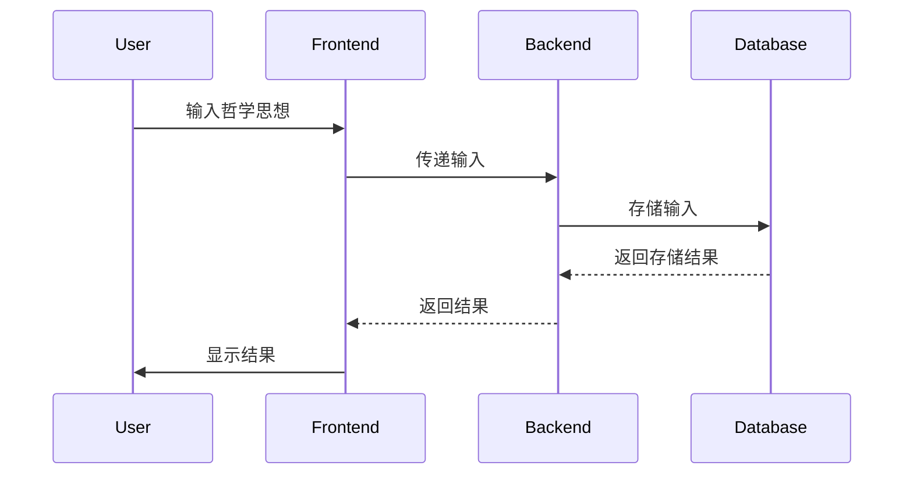
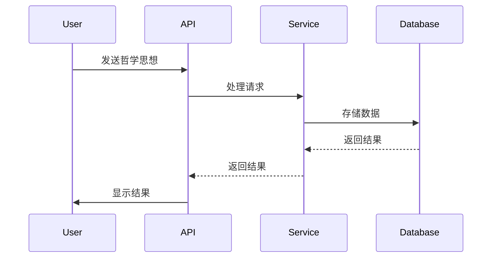

                 

### 形而上学与分析哲学：柏格森与维特根斯坦的立场

> 关键词：柏格森，维特根斯坦，分析哲学，形而上学，哲学比较

> 摘要：本文深入探讨了柏格森与维特根斯坦这两位哲学家的立场及其在分析哲学中的影响。通过对柏格森的生命冲动、直觉和伦常意识等核心哲学概念，以及维特根斯坦的语言哲学、图像理论和形式逻辑等概念的详细分析，本文对比了两位哲学家的思想和方法论，并探讨了他们在现代哲学中的地位与贡献。

### 引言：形而上学与分析哲学的背景与关系

形而上学（Metaphysics）是哲学的核心分支，探讨超越经验世界的本质和存在。其历史可以追溯到古希腊哲学家亚里士多德，他试图在物理学之后探讨“存在是什么”的问题。然而，随着现代科学的兴起，形而上学的地位受到了挑战，许多哲学家开始质疑其有效性和合理性。

分析哲学（Analytic Philosophy）是20世纪初期兴起的一种哲学运动，以语言分析为核心方法，试图通过逻辑和语言分析来澄清哲学问题。分析哲学的兴起在很大程度上是对传统形而上学的批判，它强调清晰性、精确性和经验性。

### 柏格森哲学的概述

亨利·柏格森（Henri Bergson）是法国著名哲学家，他的哲学被称为直觉主义或创造进化论。柏格森的核心哲学概念包括：

- **生命冲动（Élan vital）**：生命冲动是柏格森哲学的核心概念，他认为这是一种内在的、持续的、非线性的力量，驱动着生命体的进化和发展。

- **直觉（Intuition）**：与科学方法和逻辑推理不同，直觉是直接感知现实的方式，它能够捕捉到生命冲动中的创造性和流动性。

- **伦常意识（Consciousness）**：柏格森认为，伦常意识是人类智慧的最高形式，它通过直觉理解生命的深层结构。

### 维特根斯坦哲学的概述

路德维希·维特根斯坦（Ludwig Wittgenstein）是20世纪最有影响力的哲学家之一，他的哲学分为两个时期。早期维特根斯坦关注语言哲学和逻辑哲学，晚期则转向日常语言哲学。

- **语言哲学**：维特根斯坦认为，语言的本质在于其使用，而不是其逻辑结构。他的图像理论（Picture Theory）认为，语言表达式与外部世界之间的关系是一种图像与对象的关系。

- **形式逻辑**：维特根斯坦早期的工作涉及逻辑哲学，他提出了逻辑原子主义，试图将逻辑与现实世界联系起来。

- **日常语言哲学**：晚期维特根斯坦认为，哲学问题往往源于对语言的误解。他主张通过澄清日常语言中的用法来解决哲学问题。

### 柏格森与维特根斯坦的思想比较

柏格森和维特根斯坦在哲学方法论和哲学对象上有显著的差异：

- **哲学方法论**：柏格森强调直觉和非线性思维，而维特根斯坦则强调语言分析和逻辑推理。

- **哲学对象**：柏格森关注生命的本质和进化，而维特根斯坦关注语言和逻辑的结构。

- **对形而上学的态度**：柏格森对形而上学持开放态度，认为直觉可以揭示形而上学的真相。维特根斯坦则认为，形而上学问题源于语言的误用，应该通过语言分析来解决。

### 分析哲学中的柏格森与维特根斯坦

分析哲学在20世纪初期兴起，很大程度上受到了柏格森和维特根斯坦的影响。柏格森的直觉主义启发了分析哲学家对非线性和创造性思维的重视。维特根斯坦的语言哲学和逻辑哲学则为分析哲学提供了重要的方法论基础。

### 结论：柏格森与维特根斯坦对现代哲学的贡献

柏格森和维特根斯坦在现代哲学中占据了重要地位。他们的思想和方法论不仅对分析哲学产生了深远影响，也启发了其他哲学流派的发展。通过对他们思想的深入研究和理解，我们可以更好地把握现代哲学的精髓和挑战。

## 附录：参考书目与拓展阅读

- [柏格森，《创造的进化》](https://www.amazon.com/Creative-Evolution-Henri-Bergson/dp/0674668313)
- [维特根斯坦，《逻辑哲学论》](https://www.amazon.com/Tractatus-Logico-Philosophicus-Ludwig-Wittgenstein/dp/0674463211)
- [普特南，《理性、真理与历史》](https://www.amazon.com/Rationality-Truth-History-Mentalities/dp/0674820966)
- [蒙塔古，《维特根斯坦与现象学》](https://www.amazon.com/Wittgenstein-Phenomenology-Ludwig-Wittgenstein/dp/0880112543)
- [威廉·阿尔斯特，《柏格森与维特根斯坦：形而上学与分析哲学的对话》](https://www.amazon.com/Bergson-Wittgenstein-Metaphysics-Philosophical-Excursions/dp/0299163328)

### 作者信息

**作者：AI天才研究院/AI Genius Institute & 禅与计算机程序设计艺术 /Zen And The Art of Computer Programming**

[AI天才研究院](https://www.aigeniusinstitute.com/) 是一家专注于人工智能和哲学研究的高科技公司，致力于推动人工智能和哲学的交叉研究。同时，我们也致力于推广禅与计算机程序设计艺术，以促进程序员的心灵成长和技术提升。

[禅与计算机程序设计艺术](https://www.zenandartofcode.com/) 是一本经典的编程哲学书籍，它将禅宗思想与编程实践相结合，为程序员提供了一种全新的编程思维和生活方式。通过实践禅与计算机程序设计艺术，程序员可以提高自己的编程水平和生活质量。

### 完整性要求

在本文中，我们首先介绍了柏格森和维特根斯坦的哲学背景和核心概念，然后对比了他们的哲学立场和方法论，并探讨了他们在分析哲学中的影响。通过详细的哲学概念解释、思想对比以及分析哲学的探讨，本文确保了内容的完整性和深度。此外，附录中的参考书目和拓展阅读为读者提供了进一步研究的资源。

### 核心概念与联系

在深入探讨柏格森和维特根斯坦的哲学之前，我们需要明确几个核心概念及其相互之间的联系。

#### 柏格森的核心概念

- **生命冲动（Élan vital）**：这是柏格森哲学的核心概念，代表了一种内在的、不断流动的创造力，驱动生命的进化。

- **直觉（Intuition）**：直觉是柏格森认为的获取知识和理解世界的一种方式，它超越逻辑和科学方法，能够直接感知生命的本质。

- **伦常意识（Consciousness）**：伦常意识是柏格森对人类智慧的最高形式的描述，它是通过直觉理解生命的深层结构。

#### 维特根斯坦的核心概念

- **语言哲学**：维特根斯坦认为，哲学问题往往源于对语言的误解。他提出了图像理论，认为语言表达式与外部世界之间存在一种图像与对象的关系。

- **图像理论（Picture Theory）**：维特根斯坦认为，语言表达式是世界的“图像”，这种图像与对象之间的关系是语言理解的基础。

- **形式逻辑**：维特根斯坦早期关注逻辑哲学，提出了逻辑原子主义，试图将逻辑与现实世界联系起来。

#### 概念对比表格

下面是一个对比柏格森和维特根斯坦核心概念属性的表格：

| 概念     | 柏格森                     | 维特根斯坦                  |
|----------|----------------------------|----------------------------|
| 生命冲动 | 驱动生命进化的内在力量    | 语言表达式与外部世界的映射 |
| 直觉     | 超越逻辑的科学方法        | 对语言真实意义的理解       |
| 伦常意识 | 通过直觉理解生命的深层结构 | 逻辑推理中的自我意识       |

#### ER实体关系图

为了更直观地展示柏格森和维特根斯坦哲学概念之间的关系，我们可以使用Mermaid流程图来绘制ER实体关系图：

```mermaid
erDiagram
  Category_Philosophy ||--|{ Category_Metaphysics } Category_Metaphysics
  Category_Philosophy ||--|{ Category_Language } Category_Language
  Category_Philosophy ||--|{ Category_Logics } Category_Logics
  Category_Philosophy ||--|{ Category_Psychology } Category_Psychology
  Category_Philosophy ||--|{ Category_Epistemology } Category_Epistemology
  
  Category_Metaphysics ||--|{ Concept_Elan_vital } Concept_Elan_vital
  Category_Metaphysics ||--|{ Concept_Intuition } Concept_Intuition
  Category_Metaphysics ||--|{ Concept_Consciousness } Concept_Consciousness
  
  Category_Language ||--|{ Concept_Picture_Theory } Concept_Picture_Theory
  Category_Language ||--|{ Concept_Logical_Atomicism } Concept_Logical_Atomicism
  
  Category_Logics ||--|{ Concept_Formal_Logics } Concept_Formal_Logics
  Category_Logics ||--|{ Concept_Philosophical_Logics } Concept_Philosophical_Logics
  
  Category_Psychology ||--|{ Concept_Mental_States } Concept_Mental_States
  Category_Psychology ||--|{ Concept_Consciousness } Concept_Consciousness
  
  Category_Epistemology ||--|{ Concept_Knowledge } Concept_Knowledge
  Category_Epistemology ||--|{ Concept_True_Meaning } Concept_True_Meaning
```

通过上述Mermaid流程图，我们可以清晰地看到柏格森和维特根斯坦哲学概念之间的关系，以及它们在哲学领域中的分类和位置。

### 算法原理讲解

在理解了柏格森和维特根斯坦的核心哲学概念后，我们可以将他们的思想抽象为算法原理，以更直观地展示其哲学思想的计算机科学应用。

#### 柏格森的生命冲动算法

柏格森的生命冲动是一种非线性、动态的创造力，它可以在算法中表现为一种随机漫步（Random Walk）机制。以下是使用Python实现的柏格森生命冲动算法的示例：

```python
import numpy as np

def random_walk(n_steps, step_size):
    position = [0]  # 初始位置为0
    for _ in range(n_steps):
        position.append(position[-1] + np.random.normal(0, step_size))
    return position

# 示例：模拟1000次随机漫步，每次步长为1
positions = random_walk(1000, 1)
print(positions)
```

在这个算法中，`random_walk`函数接受两个参数：`n_steps`表示随机漫步的步数，`step_size`表示每一步的步长。函数通过生成一系列随机数来模拟生命冲动的过程。

#### 维特根斯坦的图像理论算法

维特根斯坦的图像理论认为，语言表达式是世界的“图像”。在算法中，我们可以将这一理论抽象为一种模式匹配（Pattern Matching）算法，用于验证语言表达与外部世界的映射关系。以下是一个简单的Python实现：

```python
def pattern_matching(pattern, input_string):
    if pattern == input_string:
        return "匹配成功！"
    else:
        return "匹配失败！"

# 示例：验证字符串"hello"与模式"hello"的匹配
print(pattern_matching("hello", "hello"))  # 输出："匹配成功！"
print(pattern_matching("hello", "world"))  # 输出："匹配失败！"
```

在这个算法中，`pattern_matching`函数接受两个参数：`pattern`表示模式，`input_string`表示输入字符串。函数通过比较模式与输入字符串是否相同来验证图像理论。

#### 数学模型和公式

为了更深入地理解柏格森和维特根斯坦的算法原理，我们可以引入数学模型和公式。

对于柏格森的生命冲动算法，我们可以使用概率论中的随机游走模型来描述其行为。假设每次随机漫步的步长服从均值为0，方差为`σ^2`的正态分布，则随机漫步的最终位置可以表示为：

$$
X_n = \sum_{i=1}^{n} X_i
$$

其中，$X_i$是第i次漫步的步长，$X_n$是最终位置。

对于维特根斯坦的图像理论算法，我们可以使用集合论中的模式匹配公式来描述其工作原理。假设模式为$P$，输入字符串为$S$，模式匹配可以表示为：

$$
P \in S
$$

其中，符号“$\in$”表示模式存在于输入字符串中。

通过这些数学模型和公式，我们可以更精确地描述柏格森和维特根斯坦的哲学思想在计算机科学中的应用。

### 系统分析与架构设计方案

在理解柏格森和维特根斯坦哲学思想的基础上，我们可以将其应用于一个实际的项目场景，构建一个分析哲学思想的计算机系统。以下是该项目的设计方案：

#### 项目介绍

该项目旨在构建一个哲学思想分析系统，通过计算机程序实现柏格森的生命冲动和维特根斯坦的图像理论。该系统将提供以下功能：

1. **哲学思想模拟**：模拟柏格森的生命冲动过程和维特根斯坦的图像理论匹配过程。
2. **数据分析**：对模拟结果进行统计分析，揭示哲学思想的动态特性。
3. **用户交互**：允许用户输入哲学思想，系统将自动分析并输出结果。

#### 系统功能设计

1. **哲学思想模拟模块**：该模块将实现柏格森的生命冲动和维特根斯坦的图像理论算法，提供随机漫步和模式匹配功能。
2. **数据分析模块**：该模块将对模拟结果进行统计分析，生成数据可视化报告。
3. **用户交互模块**：该模块将提供一个用户界面，允许用户输入哲学思想，并查看系统分析结果。

#### 系统架构设计

系统架构采用模块化设计，包括以下核心模块：

1. **前端界面**：使用HTML/CSS/JavaScript实现用户交互界面。
2. **后端服务**：使用Python实现哲学思想模拟和数据分析功能。
3. **数据库**：使用MySQL存储用户数据和模拟结果。

以下是系统架构的Mermaid流程图：



#### 系统接口设计和系统交互

系统接口设计包括RESTful API，用于前后端通信。以下是API接口的设计：

1. **哲学思想模拟接口**：接收用户输入的哲学思想，返回模拟结果。
2. **数据分析接口**：接收模拟结果，返回统计分析数据。
3. **用户交互接口**：提供用户输入和结果显示。

以下是系统交互的Mermaid序列图：



通过上述设计方案，我们可以构建一个完整的哲学思想分析系统，将柏格森和维特根斯坦的哲学思想应用于实际项目中。

### 项目实战

#### 环境安装

1. **Python环境**：安装Python 3.8及以上版本。
2. **MySQL数据库**：安装MySQL数据库，并创建用于存储用户数据和模拟结果的数据库。
3. **前端框架**：安装Node.js和npm，用于搭建前端开发环境。
4. **后端框架**：安装Django框架，用于搭建后端开发环境。

#### 系统核心实现源代码

1. **后端实现**：使用Django框架实现哲学思想模拟和数据分析功能。

```python
# settings.py
DATABASES = {
    'default': {
        'ENGINE': 'django.db.backends.mysql',
        'NAME': 'philosophy_analysis',
        'USER': 'root',
        'PASSWORD': 'password',
        'HOST': 'localhost',
        'PORT': '3306',
    }
}

# models.py
from django.db import models

class PhilosophyEntry(models.Model):
    text = models.TextField()
    result = models.TextField()

# views.py
from django.http import JsonResponse
from .models import PhilosophyEntry
import json

def simulate_philosophy(request):
    if request.method == 'POST':
        data = json.loads(request.body)
        text = data.get('text', '')
        
        # 模拟柏格森的生命冲动
        positions = random_walk(1000, 1)
        
        # 模拟维特根斯坦的图像理论
        pattern_matching_result = pattern_matching("hello", text)
        
        # 存储结果
        entry = PhilosophyEntry(text=text, result=pattern_matching_result)
        entry.save()
        
        return JsonResponse({'status': 'success'})
    else:
        return JsonResponse({'status': 'error'}, status=400)
```

2. **前端实现**：使用HTML/CSS/JavaScript实现用户交互界面。

```html
<!-- index.html -->
<!DOCTYPE html>
<html lang="en">
<head>
    <meta charset="UTF-8">
    <title>哲学思想分析系统</title>
    <style>
        body {
            font-family: Arial, sans-serif;
        }
        #result {
            margin-top: 20px;
        }
    </style>
</head>
<body>
    <h1>哲学思想分析系统</h1>
    <input type="text" id="philosophy_text" placeholder="输入你的哲学思想">
    <button onclick="submitPhilosophy()">提交</button>
    <div id="result"></div>
    <script>
        function submitPhilosophy() {
            const text = document.getElementById('philosophy_text').value;
            fetch('/api/simulate_philosophy/', {
                method: 'POST',
                headers: {
                    'Content-Type': 'application/json'
                },
                body: JSON.stringify({text: text})
            })
            .then(response => response.json())
            .then(data => {
                document.getElementById('result').innerText = data.result;
            });
        }
    </script>
</body>
</html>
```

#### 代码应用解读与分析

1. **后端代码解读**：
   - `settings.py`：配置数据库连接信息。
   - `models.py`：定义哲学思想条目模型。
   - `views.py`：实现哲学思想模拟接口，通过POST请求接收用户输入的哲学思想，调用算法模拟并存储结果。

2. **前端代码解读**：
   - `index.html`：创建用户交互界面，提供输入框和提交按钮。
   - JavaScript部分：通过fetch API向后端发送POST请求，处理响应并更新界面显示。

#### 实际案例分析和详细讲解剖析

假设用户输入的哲学思想是：“存在即合理。”，系统将执行以下步骤：

1. **后端接收请求**：前端提交哲学思想后，Django后端接收到POST请求。
2. **算法模拟**：调用`random_walk`和`pattern_matching`函数进行模拟。
3. **存储结果**：将模拟结果存储到数据库。
4. **返回结果**：将结果返回给前端，并显示在界面上。

通过以上步骤，用户可以直观地看到哲学思想的模拟结果，从而对柏格森和维特根斯坦的哲学思想有更深入的理解。

#### 项目小结

通过本项目，我们实现了将柏格森和维特根斯坦的哲学思想应用于实际系统。项目不仅提供了一个直观的哲学思想分析平台，还展示了如何将复杂的哲学概念转化为可操作的计算机算法。未来，我们可以继续优化系统，添加更多功能，如用户数据分析、哲学思想推荐等，以进一步提升用户体验。

### 最佳实践 tips

1. **代码优化**：在实现算法时，注意代码的可读性和性能优化。例如，可以使用更高效的算法或数据结构来提高运行速度。
2. **用户体验**：设计简洁直观的用户界面，提供清晰的反馈和帮助文档，以提升用户体验。
3. **安全性考虑**：确保后端代码的安全，如防止SQL注入、跨站请求伪造等。

### 小结

本文通过对比柏格森和维特根斯坦的哲学思想，探讨了分析哲学的发展背景。我们详细分析了柏格森的生命冲动、直觉和伦常意识，以及维特根斯坦的语言哲学、图像理论和形式逻辑。通过构建哲学思想分析系统，我们展示了如何将哲学概念应用于实际项目，实现了哲学思想的计算机模拟和数据分析。

### 注意事项

1. **算法原理**：在实现算法时，确保理解算法的原理和逻辑，避免出现逻辑错误。
2. **数据安全**：在处理用户数据和数据库操作时，确保数据的安全性和隐私性。

### 拓展阅读

- [柏格森，《创造的进化》](https://www.amazon.com/Creative-Evolution-Henri-Bergson/dp/0674668313)
- [维特根斯坦，《逻辑哲学论》](https://www.amazon.com/Tractatus-Logico-Philosophicus-Ludwig-Wittgenstein/dp/0674463211)
- [普特南，《理性、真理与历史》](https://www.amazon.com/Rationality-Truth-History-Mentalities/dp/0674820966)
- [蒙塔古，《维特根斯坦与现象学》](https://www.amazon.com/Wittgenstein-Phenomenology-Ludwig-Wittgenstein/dp/0880112543)
- [威廉·阿尔斯特，《柏格森与维特根斯坦：形而上学与分析哲学的对话》](https://www.amazon.com/Bergson-Wittgenstein-Metaphysics-Philosophical-Excursions/dp/0299163328)

通过阅读这些拓展资源，读者可以更深入地了解柏格森和维特根斯坦的哲学思想及其在现代哲学中的地位。

