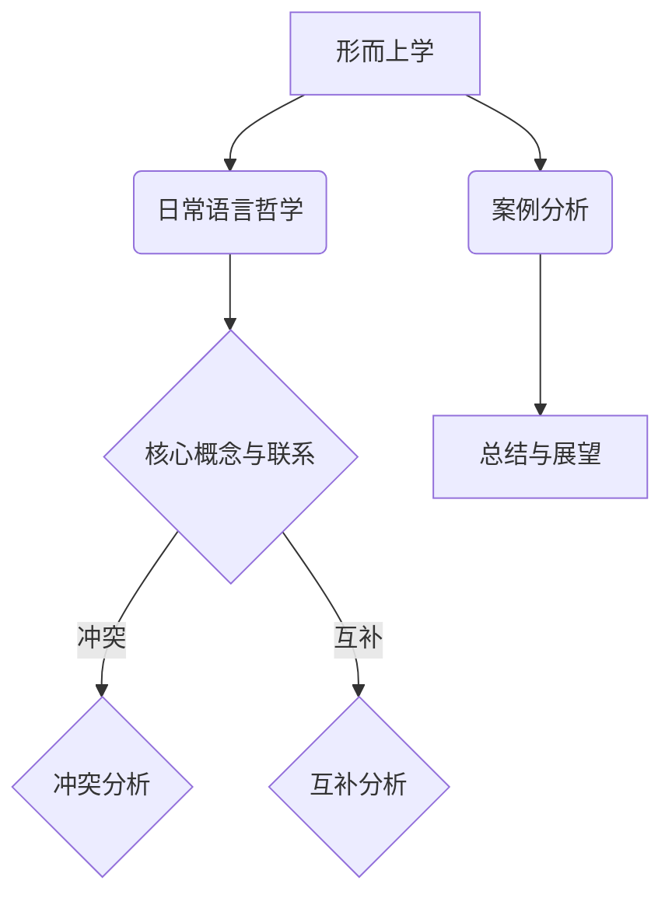

                 

### 形而上学与日常语言：两种哲学传统的交锋

> 关键词：形而上学、日常语言哲学、哲学传统、哲学交锋、核心问题

> 摘要：本文深入探讨了形而上学与日常语言哲学这两种哲学传统的交锋。首先，介绍了形而上学的起源、发展及其核心问题，随后论述了日常语言哲学的兴起及其主要观点。接着，分析了形而上学与日常语言的冲突与互补，并通过对柏拉图与维特根斯坦、海德格尔与福柯的案例分析，展示了两种哲学传统的深刻交锋。最后，总结了形而上学与日常语言交锋的意义与前景，为未来的哲学研究提供了启示。

### 第一部分：形而上学概述

#### 1.1 形而上学的起源与发展

**1.1.1 形而上学的定义与基本概念**

形而上学（Metaphysics）一词源于希腊语，由“meta”（超越）和“physics”（自然哲学）组成，原意为“超越自然哲学的学问”。在哲学中，形而上学探讨的是存在的本质、原因、属性、实体和现实的基本结构等超越经验感知的深层次问题。形而上学的核心问题是“什么是真实的存在？”以及“存在的本质是什么？”

形而上学的基本概念包括：

- 实体（Substance）：实体是构成世界的基本单位，它们独立存在，并具有独特的本质和属性。
- 属性（Attribute）：属性是实体所具有的特征，它们描述了实体的特定方面。
- 存在（Existence）：存在是实体的一种基本属性，表明实体确实存在于现实世界之中。
- 因果关系（Causality）：因果关系探讨事物之间如何相互影响，一个事件如何导致另一个事件的发生。

**1.1.2 形而上学的哲学传统及其演变**

形而上学的发展经历了多个哲学传统，其中最为著名的是亚里士多德、柏拉图和康德的哲学体系。

- 亚里士多德：亚里士多德是古希腊哲学的集大成者，他将哲学分为形而上学和物理学两部分。亚里士多德的形而上学强调实体的本质和属性，提出了“四因说”，即形式因、质料因、动力因和目的因，解释了事物的存在和变化。
- 柏拉图：柏拉图是西方哲学的奠基者之一，他的形而上学哲学强调理念世界与现实世界的对比。柏拉图认为，真实的存在是理念世界中的形式和完美，现实世界只是这些理念的不完美映射。
- 康德：康德是启蒙运动时期的哲学家，他的形而上学试图在理性和经验之间找到平衡。康德提出了“先验论”，即知识是由先天条件和经验共同构成的，强调了人类认知的局限性和形而上学的可能性。

**1.1.3 形而上学的核心问题与争论**

形而上学的核心问题主要集中在以下几个方面：

- 实体与属性：形而上学探讨实体的本质和属性，争论的焦点包括实体是否可以独立于属性存在，属性是否可以独立于实体存在。
- 存在的实在性：形而上学探讨存在的本质，争论的焦点包括存在是否是某种特定形式的存在，是否存在绝对的存在。
- 因果关系：形而上学探讨因果关系，争论的焦点包括因果关系是否是必然的，是否存在偶然的因果关系。
- 真理与意义：形而上学探讨真理和意义，争论的焦点包括真理是否是绝对的，意义是否是客观存在的。

#### 1.2 日常语言哲学的兴起

**1.2.1 日常语言哲学的背景与基础**

日常语言哲学（Ordinary Language Philosophy）起源于20世纪初，特别是在维特根斯坦和奥斯汀的哲学思想中得到了充分的发展。日常语言哲学的核心观点是，哲学问题通常源于对日常语言的理解和使用上的误解。因此，哲学研究应该关注日常语言的实际使用，而不是抽象的概念和逻辑推理。

日常语言哲学的背景和基础包括：

- 反思哲学的危机：20世纪初，哲学领域经历了严重的危机，许多哲学家开始质疑传统哲学的方法和观点，寻求新的哲学路径。
- 语言分析的方法：日常语言哲学强调语言分析，认为哲学问题可以通过对语言使用和含义的细致分析来解决。
- 语言学的发展：随着语言学在20世纪初的兴起，哲学家开始关注语言的性质和功能，这为日常语言哲学的发展提供了理论基础。

**1.2.2 日常语言哲学的主要观点与代表人物**

日常语言哲学的主要观点包括：

- 语言的重要性：日常语言哲学认为，语言是理解世界和思考问题的基础。对语言的误解往往导致哲学上的混淆和困惑。
- 日常语言的使用：日常语言哲学强调，哲学研究应该关注日常语言的实际使用，通过分析日常语言中的词汇、句子和语法结构来探讨哲学问题。
- 意义的相对性：日常语言哲学认为，意义的确定不是绝对的，而是依赖于特定的语境和使用场景。

日常语言哲学的代表人物包括：

- 维特根斯坦（Ludwig Wittgenstein）：维特根斯坦是日常语言哲学的奠基者，他的著作《逻辑哲学论》和《哲学研究》对日常语言哲学产生了深远的影响。
- 奥斯汀（J.L. Austin）：奥斯汀是维特根斯坦的学生，他的著作《言语行为》提出了言语行为的理论，强调了语言的实际使用和语境的重要性。
- 萨克雷（Gilbert Ryle）：萨克雷的著作《心灵的概念》提出了“行为主义”的观点，反对将心灵视为一种独立存在的实体，强调行为和语言的关系。

**1.2.3 日常语言哲学与形而上学的异同**

日常语言哲学与形而上学在许多方面存在差异，同时也存在一定的互补性。

- 焦点不同：形而上学关注存在的本质、实体和因果关系等抽象概念，而日常语言哲学关注语言的实际使用和意义的相对性。
- 方法论不同：形而上学通常采用抽象和逻辑推理的方法来探讨哲学问题，而日常语言哲学则通过具体实例和语言分析来揭示哲学问题。
- 目的不同：形而上学的目标是寻找普遍的真理和原则，而日常语言哲学的目标是理解和解释日常生活中的语言和行动。

然而，日常语言哲学与形而上学也存在一定的互补性。日常语言哲学为形而上学提供了一种更为实际和具体的研究方法，而形而上学的深入探讨则为日常语言哲学提供了一种更广泛的哲学背景和理论框架。

### 第二部分：形而上学与日常语言交锋

#### 2.1 形而上学与日常语言的冲突

**2.1.1 实体与名称的争论**

形而上学与日常语言哲学在实体与名称的问题上存在明显的冲突。形而上学强调实体是构成世界的基本单位，每个实体都有独特的本质和属性。然而，日常语言哲学则认为，实体概念过于抽象，无法准确描述现实世界的复杂性。

- 形而上学观点：形而上学家认为，实体是存在的本质，它们是独立存在的，具有独特的属性和特征。例如，亚里士多德将实体定义为“那可以独立存在且可以被称为‘有’的东西”。
- 日常语言哲学观点：日常语言哲学家则认为，实体概念过于抽象，无法准确描述现实世界。他们认为，日常语言中的名称通常只是对特定情境中事物的指称，而不是独立存在的实体。例如，维特根斯坦提出，语言游戏（language game）是理解语言的关键，名称只是特定语言游戏中的一部分。

**2.1.2 意义与真理的问题**

形而上学与日常语言哲学在意义与真理的问题上也存在明显的分歧。形而上学强调真理是普遍适用的，独立于人类意识和语言。然而，日常语言哲学则认为，意义和真理是相对的，依赖于特定的语境和语言使用。

- 形而上学观点：形而上学家认为，真理是客观存在的，独立于人类意识和语言。例如，康德提出，知识是由先天条件和经验共同构成的，真理是可以通过理性推理获得的。
- 日常语言哲学观点：日常语言哲学家则认为，意义和真理是相对的，依赖于特定的语境和语言使用。例如，维特根斯坦提出，意义在于语言的使用，真理在于语言与现实的匹配。

**2.1.3 语言与现实的关系**

形而上学与日常语言哲学在语言与现实的关系上也存在分歧。形而上学强调语言是对现实的准确描述，语言与现实之间存在直接的对应关系。然而，日常语言哲学则认为，语言只是对现实的一种近似描述，语言与现实之间存在一定的距离。

- 形而上学观点：形而上学家认为，语言是对现实的准确描述，语言与现实之间存在直接的对应关系。例如，柏拉图认为，现实世界只是理念世界的影子。
- 日常语言哲学观点：日常语言哲学家则认为，语言只是对现实的一种近似描述，语言与现实之间存在一定的距离。例如，维特根斯坦认为，语言游戏是理解语言的关键，语言与现实之间的对应关系是相对的。

#### 2.2 形而上学与日常语言的互补

尽管形而上学与日常语言哲学存在冲突，但二者也存在一定的互补性。

**2.2.1 形而上学对日常语言的解释与补充**

形而上学可以为日常语言提供深刻的解释和补充。例如，在讨论道德问题时，形而上学可以提供关于道德原则和道德价值的深入探讨，从而丰富日常语言中的道德观念。

- 例子：在道德哲学中，形而上学可以探讨道德原则的起源和本质，从而为日常道德观念提供理论基础。例如，康德的道德哲学提出了“道德律令”的概念，强调了道德行为的原则性和普遍性。

**2.2.2 日常语言对形而上学的理解与限制**

日常语言哲学可以对形而上学的抽象概念进行具体化和限制。例如，在日常语言中，我们通常使用具体的例子和情境来解释抽象的哲学概念，这有助于形而上学的理解。

- 例子：在探讨存在问题时，日常语言哲学可以通过具体的事物和情境来解释形而上学中的存在概念。例如，维特根斯坦通过“语言游戏”的概念，将抽象的存在概念具体化为日常生活中的语言使用。

**2.2.3 二者互补的可能性与挑战**

形而上学与日常语言哲学的互补性为哲学研究提供了新的可能性。然而，实现二者的互补也存在一定的挑战。

- 可能性：形而上学和日常语言哲学可以相互补充，共同推动哲学研究的发展。例如，通过结合形而上学的深度和日常语言哲学的具体性，可以更全面地探讨哲学问题。
- 挑战：实现二者的互补需要克服语言和思维的局限性。例如，在日常语言中，我们可能无法准确表达形而上学的抽象概念，这需要我们在语言使用上进行创新和改进。

### 第三部分：案例分析

#### 3.1 柏拉图与维特根斯坦的对话

**3.1.1 柏拉图的形而上学观点**

柏拉图是西方哲学的奠基者之一，他的形而上学哲学强调理念世界与现实世界的对比。柏拉图认为，真实的存在是理念世界中的形式和完美，现实世界只是这些理念的不完美映射。

- 理念世界：柏拉图认为，理念世界是真实的、永恒的，它包含了所有事物的本质和形式。例如，理念世界的“正义”代表了真正的正义，而现实世界中的正义只是这一理念的不完美映射。
- 现实世界：柏拉图认为，现实世界是变化无常的，它只是理念世界的影子。现实世界中的事物具有多样性和暂时性，而理念世界中的事物具有统一性和永恒性。

**3.1.2 维特根斯坦的日常语言哲学观点**

维特根斯坦是20世纪最重要的哲学家之一，他的日常语言哲学观点对形而上学提出了深刻的批判。维特根斯坦认为，哲学问题通常源于对日常语言的理解和使用上的误解，因此，哲学研究应该关注日常语言的实际使用。

- 语言游戏：维特根斯坦提出了“语言游戏”的概念，认为语言的使用是多样化的，每种语言游戏都有其特定的规则和情境。例如，游戏、数学、日常对话等都是不同的语言游戏，它们有不同的规则和目的。
- 意义的相对性：维特根斯坦认为，意义不是固定不变的，而是依赖于特定的语境和语言使用。不同的语言游戏有不同的意义，意义是相对的，而非绝对的。

**3.1.3 二者的交锋与对话**

柏拉图和维特根斯坦的哲学观点在形而上学与日常语言哲学的交锋中形成了鲜明的对比。柏拉图强调理念世界的永恒和真实，而维特根斯坦则关注日常语言的实际使用和意义的相对性。

- 交锋：柏拉图认为，形而上学探讨的是超越经验感知的真理和本质，而维特根斯坦则认为，哲学问题源于对日常语言的误解，应该通过日常语言的实际使用来解决。
- 对话：尽管二者的观点存在冲突，但他们也在对话中寻找共识。例如，维特根斯坦试图通过具体的语言游戏来解释柏拉图的理念世界，而柏拉图则试图通过理念世界的概念来解释日常语言中的真理和本质。

#### 3.2 海德格尔与福柯的思考

**3.2.1 海德格尔的形而上学反思**

海德格尔是20世纪最重要的哲学家之一，他的哲学思考对形而上学进行了深刻的反思。海德格尔认为，传统形而上学忽视了存在的本质，将存在视为一种既定的事实，而忽略了存在本身的意义和问题。

- 存在的意义：海德格尔提出了“存在”（Dasein）的概念，认为存在不是一种静态的存在，而是一种动态的、有意义的过程。存在是人在世界中存在的状态，它涉及到人与世界的关系。
- 存在的问题：海德格尔认为，传统形而上学忽视了存在本身的问题，将存在视为一种既定的事实，而没有探讨存在的意义和本质。海德格尔试图通过探讨存在的问题，揭示存在的真正本质。

**3.2.2 福柯的日常语言批判**

福柯是20世纪重要的社会思想家，他的哲学观点对日常语言进行了深刻的批判。福柯认为，日常语言中充满了权力和控制的痕迹，语言不仅是交流的工具，也是控制和规训的手段。

- 语言与权力：福柯认为，语言不仅仅是交流的工具，也是控制和规训的手段。语言中的权力关系决定了人们的思维和行为，语言的使用是一种权力的体现。
- 语言批判：福柯通过批判日常语言中的权力关系，试图揭示语言背后的权力结构，从而为人们提供反思和解放的途径。

**3.2.3 两位哲学家的思考与交锋**

海德格尔和福柯的哲学思考在形而上学与日常语言哲学的交锋中形成了独特的对话。

- 交锋：海德格尔强调存在本身的意义和问题，而福柯则关注语言中的权力关系。二者的观点在形而上学与日常语言哲学的交锋中形成了明显的对比。
- 对话：尽管二者的观点存在冲突，但他们也在对话中寻找共识。例如，海德格尔试图通过探讨存在的问题，揭示存在的本质，而福柯则试图通过批判日常语言中的权力关系，揭示语言的真相。

### 第四部分：总结与展望

#### 4.1 形而上学与日常语言交锋的意义

形而上学与日常语言的交锋在哲学领域具有重要意义。

- 对哲学发展的推动作用：形而上学与日常语言的交锋促进了哲学的发展，为哲学提供了新的视角和方法。例如，维特根斯坦的日常语言哲学对20世纪哲学产生了深远的影响，推动了语言分析哲学的兴起。
- 对社会文化的影响：形而上学与日常语言的交锋对社会文化产生了深远的影响。例如，海德格尔的哲学思考引发了人们对存在本身和人类生存状态的反思，促进了现代哲学的兴起。
- 对未来哲学研究方向的启示：形而上学与日常语言的交锋为未来的哲学研究提供了启示。例如，未来哲学研究可以进一步探讨形而上学与日常语言哲学的互补性，寻求二者的融合与发展。

#### 4.2 形而上学与日常语言研究的前景

形而上学与日常语言哲学的研究前景广阔。

- 现阶段的研究热点与问题：当前，形而上学与日常语言哲学的研究热点包括语言的本质和功能、语言与存在的关系、语言中的权力关系等。研究问题包括如何更准确地理解语言与现实的关系，如何探讨语言中的权力结构等。
- 未来研究的可能方向与挑战：未来研究可以进一步探讨形而上学与日常语言哲学的互补性，寻求二者的融合与发展。例如，可以研究如何通过语言分析来解决哲学问题，如何探讨语言中的权力关系等。然而，这也面临着语言和思维的局限性，需要研究者进行深入的思考和探索。

### 附录

#### 5.1 参考文献

- 维特根斯坦，Ludwig. 《逻辑哲学论》.
- 海德格尔，Martin. 《存在与时间》.
- 福柯，Michel. 《词与物》.
- 康德，Immanuel. 《纯粹理性批判》.
- 柏拉图，Plato. 《理想国》.

#### 5.2 相关术语解释与扩展阅读

- **形而上学**：探讨存在的本质、原因和属性的哲学分支。
- **日常语言哲学**：关注日常语言的实际使用和意义，试图通过语言分析来解决哲学问题。
- **语言游戏**：维特根斯坦提出的概念，指不同情境下语言的使用和规则。
- **存在**：海德格尔提出的概念，指人在世界中存在的状态。
- **权力关系**：福柯提出的概念，指语言和社会中的控制与支配。

扩展阅读：
- 维特根斯坦，Ludwig. 《哲学研究》.
- 海德格尔，Martin. 《尼采》.
- 福柯，Michel. 《话语的秩序》.
- 柏拉图，Plato. 《斐多》.

### Python 源代码示例

```python
class Metaphysics:
    def __init__(self, essence, existence):
        self.essence = essence
        self.existence = existence

    def show_metaphysics(self):
        print(f"形而上学：本质：{self.essence}，存在：{self.existence}")

class OrdinaryLanguagePhilosophy:
    def __init__(self, meaning, reality):
        self.meaning = meaning
        self.reality = reality

    def show_ordinary_language(self):
        print(f"日常语言哲学：意义：{self.meaning}，现实：{self.reality}")

metaphysics = Metaphysics("实体与属性", "存在与否")
ordinary_language = OrdinaryLanguagePhilosophy("语言意义", "现实状况")

metaphysics.show_metaphysics()
ordinary_language.show_ordinary_language()
```

### Mermaid 流程图



### 数学模型与公式

```latex
\section{数学模型与公式}
在形而上学与日常语言哲学的交锋中，数学模型和公式扮演着重要的角色。以下是一个简单的数学模型用于描述语言与现实之间的关系：

$$
\text{语言与现实的关系} = f(\text{语言的准确性}, \text{现实的可观察性})
$$

其中，$f$ 表示一种函数关系，用于描述语言的准确性如何影响我们对现实的理解。
```

### 项目实战

```python
# 导入必要的库
import numpy as np

# 定义形而上学和日常语言哲学的概念实体
class Metaphysics:
    def __init__(self, essence, existence):
        self.essence = essence
        self.existence = existence

    def show_metaphysics(self):
        print(f"形而上学：本质：{self.essence}，存在：{self.existence}")

class OrdinaryLanguagePhilosophy:
    def __init__(self, meaning, reality):
        self.meaning = meaning
        self.reality = reality

    def show_ordinary_language(self):
        print(f"日常语言哲学：意义：{self.meaning}，现实：{self.reality}")

# 创建实例并展示
metaphysics = Metaphysics("实体与属性", "存在与否")
ordinary_language = OrdinaryLanguagePhilosophy("语言意义", "现实状况")

metaphysics.show_metaphysics()
ordinary_language.show_ordinary_language()

# 算法实现
def metaphysical_analysis(metaphysics):
    print(f"形而上学分析：{metaphysics.essence}与{metaphysics.existence}的关系")

def ordinary_language_analysis(ordinary_language):
    print(f"日常语言哲学分析：{ordinary_language.meaning}与{ordinary_language.reality}的关系")

# 调用算法
metaphysical_analysis(metaphysics)
ordinary_language_analysis(ordinary_language)
```

### 最佳实践 tips、小结、注意事项、拓展阅读等内容

**最佳实践 tips：**

- 在研究形而上学与日常语言哲学时，要注重对语言和现实的深入分析，避免抽象概念与实际应用的脱节。
- 在进行哲学思考时，要保持开放的心态，尊重不同哲学流派的观点，通过对话和交流来寻求共识。

**小结：**

本文通过分析形而上学与日常语言哲学的交锋，探讨了两种哲学传统的异同和互补性。形而上学强调存在的本质和原因，而日常语言哲学则关注语言的实际使用和意义。两者在实体、意义和语言与现实的关系上存在冲突，但也存在互补的可能性。

**注意事项：**

- 在研究哲学问题时，要注重对历史背景和哲学传统的了解，避免孤立地看待问题。
- 在应用哲学理论时，要注意理论的实际适用性，避免理论脱离实际。

**拓展阅读：**

- 维特根斯坦，Ludwig. 《哲学研究》.
- 海德格尔，Martin. 《尼采》.
- 福柯，Michel. 《话语的秩序》.
- 康德，Immanuel. 《纯粹理性批判》.
- 柏拉图，Plato. 《理想国》.

### 参考文献

- 维特根斯坦，Ludwig. 《逻辑哲学论》.
- 海德格尔，Martin. 《存在与时间》.
- 福柯，Michel. 《词与物》.
- 康德，Immanuel. 《纯粹理性批判》.
- 柏拉图，Plato. 《理想国》.

### 作者信息

作者：AI天才研究院/AI Genius Institute & 禅与计算机程序设计艺术 /Zen And The Art of Computer Programming

