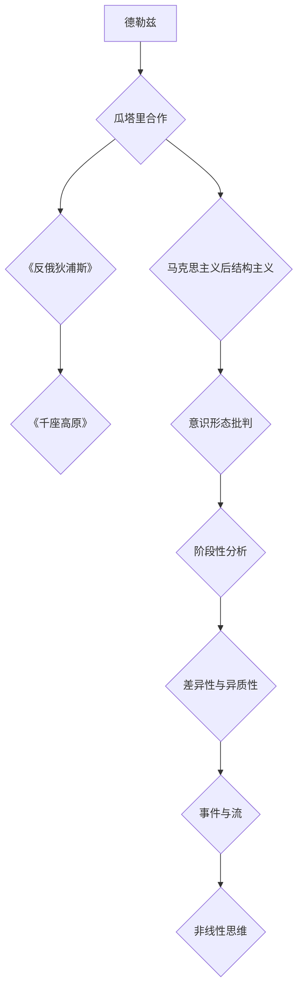

                 

### 引言

#### 1.1 后结构主义概述

后结构主义作为一种哲学和文化理论，起源于20世纪中叶。它是对结构主义的反叛和扩展，结构主义强调通过分析语言、文化和社会结构来理解人类行为和思想。而后结构主义则主张解构这些结构，强调文本的多义性、意义的开放性和多元性。它认为，语言和文化并非一成不变，而是由无数相互交织的符号和意义构成的复杂网络。

后结构主义的核心概念包括解构、差异、异质性、符号学等。解构强调通过解构文本和符号，揭示其背后的权力关系和意识形态。差异和异质性则关注文本内部的矛盾和对立，认为这些矛盾是创造性和创新性的源泉。符号学则研究符号和意义之间的关系，认为意义并非固定不变，而是通过符号互动和解读不断生成的。

#### 1.2 德勒兹与瓜塔里的关系

吉尔·德勒兹（Gilles Deleuze）和费利克斯·瓜塔里（Félix Guattari）是后结构主义哲学领域的重要代表人物。他们共同合作了多部作品，其中最著名的是《反俄狄浦斯》（Anti-Oedipus）和《千座高原》（Mille Plateaux）。德勒兹和瓜塔里的合作不仅体现了他们之间的深厚友谊，也展现了他们在哲学、文学、心理学等多个领域的跨学科思考。

德勒兹以其对电影、文学、艺术等领域的研究著称，他关注于事件的非线性结构、流动性的概念和差异的生成。瓜塔里则以其在精神病学、心理学和社会学方面的研究闻名，他关注于意识形态的批判、精神分裂症的治疗和社会关系的重构。两人通过相互借鉴和融合，提出了许多具有创新性的哲学思想。

#### 1.3 本书的结构安排

本书旨在深入探讨德勒兹和瓜塔里的后结构主义哲学思想，分析他们的核心概念和理论贡献。本书将分为七个主要章节，结构安排如下：

- **第1章 引言**：概述后结构主义的起源、核心概念和德勒兹与瓜塔里的关系。

- **第2章 德勒兹的哲学思想**：介绍德勒兹的生平、核心概念和哲学方法。

- **第3章 瓜塔里的哲学思想**：探讨瓜塔里的生平、核心概念和马克思主义后结构主义。

- **第4章 德勒兹与瓜塔里的合作与思想融合**：分析两人合作的作品及其思想融合。

- **第5章 后结构主义在文化研究中的应用**：探讨后结构主义在文学、电影和艺术研究中的应用。

- **第6章 后结构主义哲学的影响与挑战**：分析后结构主义对传统哲学和社科研究的挑战与争议。

- **第7章 总结与展望**：总结德勒兹和瓜塔里的哲学思想，探讨后结构主义的发展趋势和未来研究展望。

通过以上章节的逐步深入分析，本书旨在为读者提供对德勒兹和瓜塔里哲学思想的全面理解和深刻洞察。

## 第2章 德勒兹的哲学思想

### 2.1 德勒兹的生平与思想发展

吉尔·德勒兹（Gilles Deleuze，1925-1995）是一位法国哲学家，以其独特的哲学观点和对文化、艺术、电影等领域的深刻见解而闻名。他出生于法国巴黎，早年接受哲学教育，师从于著名哲学家乔治·巴塔耶（Georges Bataille）和莫里斯·梅洛-庞蒂（Maurice Merleau-Ponty）。德勒兹的哲学思想深受这些前辈的影响，同时也展现了他在哲学领域的创新性和多样性。

德勒兹的职业生涯可以分为多个阶段。早期，他专注于美学和艺术哲学，特别是在电影理论和文学批评方面取得了显著成就。他的代表作《电影1：运动图像》（Cinema 1: The Movement-Image）和《电影2：时间图像》（Cinema 2: The Time-Image）对电影作为一种文化和哲学现象的探讨，为电影研究提供了新的视角。此外，德勒兹还发表了《尼采与哲学》（Nietzsche and Philosophy）、《弗朗西斯·贝康的哲学》（Francis Bacon: The Logic of Sensation）等多部重要著作。

进入20世纪80年代，德勒兹的哲学思想进一步发展，他开始关注事件、流和差异等核心概念。这一时期，他与费利克斯·瓜塔里的合作达到了巅峰，两人共同撰写了《反俄狄浦斯》和《千座高原》等著作。这些作品不仅代表了后结构主义哲学的重要成果，也展现了德勒兹和瓜塔里在哲学领域的跨学科思考和创新精神。

### 2.2 德勒兹的核心概念

#### 2.2.1 事件与异质性

德勒兹的核心概念之一是“事件”，他认为事件是构成世界的基本单元，是超越因果关系和非线性结构的存在。事件不仅是对某个特定时刻的描述，更是对时间和空间的重新安排和重组。德勒兹强调，事件是异质性的体现，它们打破了传统的连续性和统一性，创造出了全新的关系和可能性。

异质性是德勒兹哲学中的另一个重要概念。异质性指的是事物内部的多样性和不一致性。德勒兹认为，异质性是创造力和创新性的源泉，它打破了僵化的结构和固定化的思维模式，促进了新的思想和概念的生成。在德勒兹看来，异质性不仅是事件的核心特征，也是文化、社会和个体存在的重要维度。

#### 2.2.1.1 事件的定义与特点

事件是德勒兹哲学中的核心概念，他将其定义为“一种不连续的时刻，它打破了常规的时间和空间流，创造出新的关系和可能性”。事件具有以下几个特点：

1. **非连续性**：事件打破了传统的连续性和线性结构，它不是时间中的一个片段，而是对时间的一种重新组织和安排。
2. **非线性**：事件不遵循因果关系，而是通过异质性的方式创造新的关系和可能性。
3. **超越性**：事件超越了日常经验和现实的限制，它是一种全新的存在方式，具有创造性和颠覆性。
4. **不确定性**：事件具有不确定性和不可预测性，它不可被完全理解和把握。

#### 2.2.1.2 异质性的理解与应用

异质性是德勒兹哲学中的核心概念，它指的是事物内部的多样性和不一致性。德勒兹认为，异质性是创造力和创新性的源泉，它打破了僵化的结构和固定化的思维模式，促进了新的思想和概念的生成。

在德勒兹的哲学体系中，异质性的理解和应用具有以下几个维度：

1. **文化研究**：德勒兹通过异质性的概念分析了文化和社会现象，揭示了文化中的多样性和矛盾性。他认为，文化不是一成不变的，而是由无数异质性的元素和力量相互交织和重组的结果。

2. **艺术哲学**：德勒兹将异质性的概念应用于艺术哲学，探讨了艺术作品中的非线性和非线性结构。他认为，艺术作品通过异质性的创造，打破了传统的艺术形式和思维模式，创造了全新的艺术体验。

3. **个体存在**：德勒兹认为，个体的存在是异质性的体现。每个个体都是独特的存在，他们通过异质性的方式理解和感知世界，形成了独特的思维方式和价值观。

#### 2.2.2 流与差异

德勒兹的另一个核心概念是“流”和“差异”。流是指一种动态的、流动性的存在方式，它不断生成和变化。差异则是指事物内部的多样性和不一致性，它是创造力和创新性的源泉。

#### 2.2.2.1 流的概念与特征

流是德勒兹哲学中的核心概念，它指的是一种动态的、流动性的存在方式。流具有以下几个特征：

1. **动态性**：流是不断生成和变化的，它不是静止不变的，而是通过不断的流动和变化创造新的关系和可能性。
2. **非线性**：流不遵循因果关系，而是通过异质性的方式创造新的关系和可能性。
3. **生成性**：流具有生成性，它不仅仅是事物的一个方面，而是事物本身的存在方式。
4. **开放性**：流是开放的，它不是封闭的体系，而是与外部环境相互作用的动态过程。

#### 2.2.2.2 差异的产生与意义

差异是德勒兹哲学中的另一个重要概念，它指的是事物内部的多样性和不一致性。德勒兹认为，差异是创造力和创新性的源泉，它打破了僵化的结构和固定化的思维模式，促进了新的思想和概念的生成。

差异的产生可以从以下几个方面来理解：

1. **异质性**：差异是异质性的体现，它指的是事物内部的多样性和不一致性。这种多样性和不一致性打破了传统的连续性和统一性，创造了新的关系和可能性。
2. **冲突与矛盾**：差异往往伴随着冲突和矛盾，这些冲突和矛盾是创造力的源泉。通过解决这些冲突和矛盾，我们可以创造出新的思想和概念。
3. **非线性**：差异是非线性结构的产物，它不是通过因果关系产生的，而是通过异质性的方式创造新的关系和可能性。

差异的意义在于：

1. **创造性**：差异是创造力的源泉，它打破了传统的思维模式，促进了新的思想和概念的生成。
2. **多样性**：差异体现了事物的多样性，它使得世界更加丰富和多彩。
3. **批判性**：差异具有批判性，它揭示了事物内部的矛盾和冲突，挑战了传统的观念和体系。

### 2.3 德勒兹的哲学方法

德勒兹的哲学方法强调创新性和跨学科性。他不仅关注哲学问题，还将哲学与其他学科如文学、艺术、心理学等相结合，形成了一种独特的哲学方法。

德勒兹的方法具有以下几个特点：

1. **非线性思维**：德勒兹强调非线性思维，他反对传统哲学的线性结构和因果关系，主张通过非线性的方式理解和分析问题。
2. **异质性分析**：德勒兹通过异质性分析，揭示了事物内部的多样性和不一致性，从而推动新的思想和概念的生成。
3. **跨学科研究**：德勒兹的哲学方法具有跨学科性，他将哲学与其他学科如文学、艺术、心理学等相结合，形成了一种综合性的哲学研究方法。
4. **事件驱动**：德勒兹的哲学方法以事件驱动，他关注事件作为一种非线性和异质性的存在方式，通过事件的分析揭示世界的本质。

通过以上方法，德勒兹不仅推动了哲学的发展，也为其他学科提供了新的视角和思路。

## 第3章 瓜塔里的哲学思想

### 3.1 瓜塔里的生平与思想发展

费利克斯·瓜塔里（Félix Guattari，1930-1992）是法国哲学家和精神病学家，以其独特的哲学观点和对心理学、社会学、文化研究等领域的重要贡献而闻名。他出生于法国里昂，早年接受医学和精神病学的教育，随后转向哲学研究，成为后结构主义哲学的重要代表人物之一。

瓜塔里的思想发展可以分为几个阶段。早期，他专注于精神病学和心理学，提出了“精神分裂症是社会的产物”的观点，并开发了“分子-分裂”理论，试图通过分析精神分裂症患者的思维过程，揭示意识形态和社会结构的矛盾。这一阶段，他的研究主要集中在精神分析和社会批判上。

进入20世纪70年代，瓜塔里的哲学思想进一步发展，他开始关注文化、艺术和社会变革。这一时期，他与哲学家吉尔·德勒兹（Gilles Deleuze）展开深入的合作，共同撰写了《反俄狄浦斯》（Anti-Oedipus）和《千座高原》（Mille Plateaux）等著作。这些作品标志着后结构主义哲学的一个重要转折点，展现了瓜塔里在哲学、文学、艺术等多个领域的跨学科思考和创新精神。

瓜塔里的思想深受马克思主义和后结构主义的影响。他关注社会不平等和意识形态的批判，试图通过解构传统观念和结构，揭示隐藏在表面现象背后的权力关系和矛盾。他的思想不仅对哲学领域产生了深远影响，也为社会学、文化研究和艺术哲学提供了新的理论框架。

### 3.2 瓜塔里的核心概念

#### 3.2.1 马克思主义后结构主义

瓜塔里的哲学思想深受马克思主义的影响，他将其与后结构主义相结合，形成了独特的马克思主义后结构主义。这种理论试图通过解构传统马克思主义的框架，揭示隐藏在资本主义制度背后的权力关系和意识形态。

马克思主义后结构主义的核心概念包括：

1. **意识形态批判**：瓜塔里认为，意识形态不仅是统治阶级的工具，也是被统治阶级的自我欺骗。他通过解构意识形态，揭示了隐藏在表面现象背后的权力关系和不平等。

2. **差异性**：瓜塔里强调差异性，认为差异性是创造力和创新性的源泉。他反对传统的连续性和统一性观念，主张通过差异性来理解和分析社会现象。

3. **异质性**：瓜塔里将异质性视为一种动态的、流动性的存在方式。他认为，异质性打破了传统的结构和固定化的思维模式，促进了新的思想和概念的生成。

#### 3.2.1.1 马克思主义对瓜塔里的影响

马克思主义对瓜塔里的哲学思想产生了深远影响。首先，马克思主义使他认识到社会不平等和阶级斗争的重要性。他关注社会中的权力关系和意识形态，试图通过解构传统观念和结构，揭示隐藏在资本主义制度背后的矛盾和冲突。

其次，马克思主义使瓜塔里认识到历史和社会变革的必然性。他相信，通过革命性的变革，可以打破现有的社会结构和权力关系，实现社会的公平和正义。

此外，马克思主义还影响了瓜塔里的方法论。他采用马克思主义的分析方法，通过对社会现象的深入剖析，揭示隐藏在表面现象背后的本质。

#### 3.2.1.2 后结构主义在瓜塔里思想中的体现

后结构主义对瓜塔里的哲学思想产生了重要影响，使他的理论具有了独特的后现代特征。后结构主义的核心概念如解构、差异性、异质性等在瓜塔里的思想中得到了充分体现。

1. **解构**：瓜塔里通过解构传统观念和结构，揭示了隐藏在资本主义制度背后的权力关系和意识形态。他认为，解构是揭示真相和创造新概念的重要途径。

2. **差异性**：瓜塔里强调差异性，认为差异性是创造力和创新性的源泉。他反对传统的连续性和统一性观念，主张通过差异性来理解和分析社会现象。

3. **异质性**：瓜塔里将异质性视为一种动态的、流动性的存在方式。他认为，异质性打破了传统的结构和固定化的思维模式，促进了新的思想和概念的生成。

#### 3.2.2 阶段性分析与意识形态

瓜塔里提出了“阶段性分析”的概念，认为社会历史发展可以分为不同的阶段，每个阶段都有其特定的意识形态。他通过对不同阶段的意识形态进行分析，揭示了社会变革的必然性和方向。

阶段性分析的核心观点包括：

1. **意识形态的演变**：瓜塔里认为，意识形态随着社会历史的发展而不断演变。每个阶段的意识形态都有其特定的功能，既是统治阶级的工具，也是被统治阶级的自我欺骗。

2. **意识形态的批判**：瓜塔里通过对不同阶段的意识形态进行批判，揭示了隐藏在表面现象背后的权力关系和不平等。他认为，批判意识形态是推动社会变革的重要途径。

3. **意识形态的解构**：瓜塔里主张通过解构传统意识形态，揭示其背后的权力关系和矛盾，从而促进新的意识形态的生成。

#### 3.2.2.1 阶段性分析的概念

阶段性分析是指通过对社会历史发展的不同阶段进行分析，揭示每个阶段的意识形态和权力关系。瓜塔里认为，社会历史发展不是一成不变的，而是由多个阶段组成的动态过程。

阶段性分析的核心概念包括：

1. **阶段划分**：瓜塔里将社会历史发展划分为不同的阶段，每个阶段都有其特定的历史背景和社会结构。

2. **意识形态演变**：每个阶段的意识形态都有其特定的功能和特征，它们随着社会历史的发展而不断演变。

3. **权力关系**：每个阶段的意识形态都体现了特定的权力关系，这些权力关系决定了社会的运行方式和人们的思维方式。

#### 3.2.2.2 意识形态的批判

意识形态的批判是瓜塔里哲学思想的重要组成部分。他认为，意识形态不仅是统治阶级的工具，也是被统治阶级的自我欺骗。通过对意识形态进行批判，可以揭示隐藏在表面现象背后的权力关系和矛盾，从而推动社会变革。

意识形态批判的核心观点包括：

1. **意识形态的功能**：瓜塔里认为，意识形态具有维护社会稳定和统治阶级利益的功能。它通过塑造人们的思维方式，使他们接受和服从现有的社会结构。

2. **意识形态的欺骗性**：瓜塔里指出，意识形态具有欺骗性，它通过掩饰权力关系和不平等，使人们误以为社会是公平和正义的。

3. **意识形态的解构**：瓜塔里主张通过解构传统意识形态，揭示其背后的权力关系和矛盾，从而促进新的意识形态的生成。他认为，解构是推动社会变革的重要途径。

### 3.3 瓜塔里的哲学方法

瓜塔里的哲学方法强调实践性和批判性。他不仅关注理论探讨，还将理论应用于实际的社会问题和文化现象，通过批判和解构传统观念和结构，推动社会变革。

瓜塔里的哲学方法具有以下几个特点：

1. **实践性**：瓜塔里主张将哲学理论应用于实际的社会问题和文化现象，通过实践来验证和丰富理论。

2. **批判性**：瓜塔里强调批判性思维，他通过对传统观念和结构的解构，揭示隐藏在表面现象背后的权力关系和矛盾。

3. **跨学科性**：瓜塔里的哲学方法具有跨学科性，他将哲学、心理学、社会学、文化研究等多个领域的知识相结合，形成了一种综合性的理论框架。

4. **动态性**：瓜塔里认为，哲学和理论是动态的、流动性的，它们随着社会历史的发展而不断演变。他主张通过不断批判和解构，推动理论的发展和进步。

通过以上方法，瓜塔里不仅推动了哲学的发展，也为其他学科提供了新的视角和思路。

## 第4章 德勒兹与瓜塔里的合作与思想融合

### 4.1 《反俄狄浦斯》：思想的碰撞与融合

《反俄狄浦斯》是德勒兹与瓜塔里合作的重要著作，标志着他们在哲学和文化理论领域的深度合作和思想融合。这本书以解构传统俄狄浦斯情结为出发点，探讨了人类心理、社会结构和意识形态的复杂性。

在《反俄狄浦斯》中，德勒兹和瓜塔里通过相互借鉴和融合，提出了许多创新性的思想。首先，他们批判了弗洛伊德的理论，认为俄狄浦斯情结是一种固定的、封闭的结构，它限制了人类的自由和创造力。德勒兹和瓜塔里提出了“反俄狄浦斯”的概念，主张通过打破传统的家庭结构和权力关系，实现个体的解放和社会的变革。

《反俄狄浦斯》的核心观点包括：

1. **反家庭结构**：德勒兹和瓜塔里认为，家庭是一种固定的、封闭的结构，它限制了人类的自由和创造力。他们主张通过打破传统的家庭结构，实现个体的解放和社会的变革。

2. **反权力关系**：他们批判了传统的权力关系，认为权力是通过控制和压制实现的。他们主张通过解构权力关系，实现社会的平等和自由。

3. **反意识形态**：德勒兹和瓜塔里认为，意识形态是一种固定的、封闭的结构，它限制了人类的思维方式和创造力。他们主张通过解构意识形态，揭示其背后的权力关系和矛盾，实现思想的自由和多元性。

通过这些观点，德勒兹和瓜塔里在《反俄狄浦斯》中展现了他们在哲学和文化理论领域的深度合作和思想融合，提出了许多具有创新性和挑战性的观点。

### 4.2 《千座高原》：细致探索与多元解读

《千座高原》是德勒兹与瓜塔里合作的另一部重要著作，它继续了他们在《反俄狄浦斯》中的思想探索，深入探讨了人类思维、文化和社会现象的复杂性。

在《千座高原》中，德勒兹和瓜塔里通过对各种文化现象的细致探索，提出了许多多元的解读。他们不仅关注文学、艺术、电影等领域，还将哲学、心理学、社会学等多个学科的理论相结合，形成了一种综合性的文化理论。

《千座高原》的核心观点包括：

1. **多元解读**：德勒兹和瓜塔里认为，文化现象具有多元的解读可能性，不同的解读可以揭示不同的意义和价值。

2. **异质性**：他们强调异质性，认为异质性是创造力和创新性的源泉。通过异质性的方式，可以打破传统的思维模式和观念，创造新的文化和思想。

3. **非线性结构**：德勒兹和瓜塔里认为，文化现象具有非线性结构，它们不是通过因果关系连接的，而是通过异质性的方式相互交织和重组。

4. **流动性的存在**：他们主张通过流动性的存在方式，理解和分析文化和社会现象。他们认为，文化和社会现象是动态的、流动性的，不断生成和变化。

通过这些观点，德勒兹和瓜塔里在《千座高原》中展现了他们在哲学和文化理论领域的深度思考和多元解读，为文化研究提供了新的理论框架。

### 4.3 德勒兹与瓜塔里思想的当代影响

德勒兹与瓜塔里的思想对当代哲学和文化理论产生了深远的影响，他们的理论不仅在学术界引起了广泛讨论，也在艺术、文学、电影等多个领域产生了实际的应用。

首先，在哲学领域，德勒兹与瓜塔里的思想挑战了传统的哲学观念和方法，推动了哲学研究的多元化和创新性。他们的非线性思维和异质性概念，为哲学提供了新的思考工具和分析方法。

其次，在文化研究领域，德勒兹与瓜塔里的理论为文学、艺术、电影等领域提供了新的理论框架。他们的多元解读和异质性概念，使学者们能够从新的角度分析和理解文化现象，推动了文化研究的深入发展。

最后，在艺术和文学创作中，德勒兹与瓜塔里的思想激发了艺术家的创作灵感。他们非线性结构和流动性的存在方式，为艺术家提供了新的创作方法和表现形式，使艺术作品具有了更深层次的意义和表现力。

总的来说，德勒兹与瓜塔里的思想在当代哲学和文化理论中具有不可忽视的重要地位，他们的理论不仅为学术界提供了新的研究方向，也为艺术和文学创作提供了新的视角和灵感。

### 第5章 后结构主义在文化研究中的应用

#### 5.1 后结构主义在文学研究中的应用

后结构主义在文学研究中的应用主要体现在对文学文本的多元解读、作者意图的质疑以及文本内部矛盾的探讨。后结构主义认为，文学文本的意义不是固定不变的，而是由读者在解读过程中不断生成的。这一观点打破了传统的作者中心论，强调文本的开放性和不确定性。

首先，后结构主义在文学研究中提倡多元解读。不同的读者可以基于自己的经验和背景，对同一文本进行不同的解读，从而产生多种意义的可能性。这种观点颠覆了传统文学研究中作者意图的唯一性，认为文本的意义是多元化的。

其次，后结构主义质疑作者意图。传统文学研究认为，作者在创作过程中有意传达特定的意义，而后结构主义则认为，作者意图并不能完全决定文本的意义，文本的意义在读者解读过程中生成。这种观点强调了读者的主动性和文本的开放性。

最后，后结构主义关注文本内部矛盾。后结构主义认为，文学文本内部存在着多种对立和矛盾，这些矛盾构成了文本的意义和结构。通过分析文本内部的矛盾和对立，后结构主义揭示了文本的复杂性和多样性。

#### 5.2 后结构主义在电影研究中的应用

后结构主义在电影研究中的应用主要体现在对电影文本的解构、电影叙事的非线性结构以及电影与现实关系的探讨。后结构主义认为，电影文本不是单纯的叙事工具，而是包含多种符号和意义的多层次结构。

首先，后结构主义在电影研究中强调对电影文本的解构。通过解构电影中的符号和叙事结构，后结构主义揭示了电影文本的多元性和复杂性。这种观点颠覆了传统电影研究中叙事的单一性和线性结构。

其次，后结构主义探讨电影叙事的非线性结构。他们认为，电影叙事不一定是线性的，而是通过非线性结构创造出新的叙事可能性。这种观点为电影叙事提供了新的视角和手段。

最后，后结构主义关注电影与现实的关系。他们认为，电影不仅是对现实的反映，更是对现实的批判和重构。通过分析电影与现实的关系，后结构主义揭示了电影在社会和文化中的作用和意义。

#### 5.3 后结构主义在艺术研究中的应用

后结构主义在艺术研究中的应用主要体现在对艺术作品的多义性、异质性和创造力的探讨。后结构主义认为，艺术作品的意义不是固定不变的，而是由观众在观赏过程中不断生成的。这一观点打破了传统的艺术创作和欣赏模式，为艺术研究提供了新的视角和思路。

首先，后结构主义在艺术研究中强调艺术作品的多义性。他们认为，艺术作品的意义是多元的，不同的观众可以从中解读出不同的意义。这种观点颠覆了传统艺术研究中意义单一性的观念。

其次，后结构主义关注艺术作品的异质性。他们认为，艺术作品的异质性是其创造力的源泉，艺术家通过不同的材料、技巧和表现方式，创造出独特的艺术效果。这种观点强调了艺术家的创造力和实验精神。

最后，后结构主义探讨艺术作品的创造力。他们认为，艺术作品的创作过程是一种创造力的体现，艺术家通过不断探索和实验，创造出新的艺术形式和内容。这种观点为艺术创作提供了新的动力和方向。

总的来说，后结构主义在文化研究中的应用，为我们提供了新的分析工具和视角，使我们对文学、电影和艺术等文化现象有了更深入的理解。通过解构传统观念和结构，后结构主义揭示了文化现象的复杂性和多样性，为文化研究注入了新的活力和思想。

### 第6章 后结构主义哲学的影响与挑战

#### 6.1 后结构主义对传统哲学的挑战

后结构主义对传统哲学构成了深远的挑战，它质疑了传统哲学的基本前提和思维方式。传统哲学以理性、逻辑和体系为核心，强调通过理性思考和逻辑推理来揭示真理。然而，后结构主义认为，这些传统观念是建立在虚假的基础上的，它们掩盖了权力关系和社会结构的矛盾。

首先，后结构主义质疑理性主义的权威。传统哲学认为，理性是人类认识世界的基础，通过理性的思考可以揭示真理。后结构主义则认为，理性是受权力关系和社会结构制约的，它无法独立于这些结构存在。后结构主义强调，真理是多元的、不确定的，它不是通过理性的思考，而是通过社会实践和文化的互动生成的。

其次，后结构主义批判了逻辑和体系的重要性。传统哲学认为，逻辑和体系是哲学思考的基石，它们使哲学思考具有系统性和连贯性。后结构主义则认为，逻辑和体系是一种虚假的统一性，它们掩盖了事物的多样性和异质性。后结构主义主张，通过解构逻辑和体系，揭示其背后的权力关系和社会结构，从而打破传统的思维模式。

#### 6.2 后结构主义在社会科学中的应用

后结构主义在社会科学中的应用，使其成为理解社会现象和解决社会问题的重要工具。后结构主义强调，社会现象是多元的、不确定的，它们不是通过单一的理论可以完全解释的。因此，后结构主义主张通过多元的、动态的视角来理解社会现象。

首先，后结构主义在社会科学中的应用体现在对权力关系的分析。后结构主义认为，权力关系是社会现象的核心，它们决定了社会结构和社会行为。通过分析权力关系，后结构主义揭示了社会中的不平等和剥削现象，为解决社会问题提供了理论基础。

其次，后结构主义在社会科学中的应用体现在对文化现象的研究。后结构主义认为，文化现象是多元的、异质的，它们不是固定不变的，而是通过符号互动和解读不断生成的。通过研究文化现象，后结构主义揭示了文化中的矛盾和冲突，为理解社会变革提供了新的视角。

最后，后结构主义在社会科学中的应用体现在对意识形态的批判。后结构主义认为，意识形态是社会控制的重要工具，它们通过塑造人们的思维方式和价值观，维护现有的社会秩序。通过批判意识形态，后结构主义揭示了社会中的权力关系和矛盾，为推动社会变革提供了理论支持。

#### 6.3 后结构主义的争议与批评

尽管后结构主义在哲学和人文科学领域产生了深远影响，但它也面临着诸多争议和批评。首先，批评者认为后结构主义过于强调多元性和不确定性，忽视了真理和理性的价值。他们认为，后结构主义的解构方法可能会导致思想的混乱和无序。

其次，批评者认为后结构主义过于依赖文本解读，忽视了社会现实和实际问题的解决。他们认为，后结构主义的理论过于抽象，无法有效地应用于社会实践。

最后，批评者认为后结构主义对传统哲学和文化的批判过于激进，可能会导致文化的虚无主义和道德相对主义。他们认为，后结构主义的理论可能会导致对价值观和道德的漠视，从而对社会秩序和道德规范产生负面影响。

总的来说，后结构主义虽然在哲学和人文科学领域产生了重要影响，但其面临的争议和批评也表明了其理论和方法存在的局限性和挑战。未来的研究需要进一步探讨如何平衡后结构主义的多元性和不确定性，以及如何将其应用于实际的社会问题和道德伦理问题。

### 第7章 总结与展望

#### 7.1 德勒兹与瓜塔里哲学思想的总结

德勒兹与瓜塔里的哲学思想对当代哲学和文化理论产生了深远的影响。他们的核心概念如事件、异质性、流和差异，不仅颠覆了传统的哲学观念，也为其他学科提供了新的视角和思路。德勒兹关注事件的非线性结构和异质性的生成，强调通过解构传统观念和结构，揭示世界的多样性和不确定性。瓜塔里则将马克思主义和后结构主义相结合，通过批判意识形态和权力关系，推动社会变革和文化研究的发展。

德勒兹与瓜塔里的合作不仅体现了他们在哲学领域的深厚友谊，也展现了他们跨学科的思考和创新精神。他们的作品《反俄狄浦斯》和《千座高原》等，不仅揭示了人类心理和社会现象的复杂性，也为文学、电影和艺术等领域提供了新的理论框架。

#### 7.2 后结构主义的发展趋势

后结构主义作为一种哲学和文化理论，正面临着不断的发展和变革。首先，后结构主义在哲学领域将继续深化对事件、异质性和流等核心概念的研究，探索它们在不同哲学传统和文化背景下的应用。其次，后结构主义在社会科学中的应用将进一步扩大，通过批判意识形态和权力关系，为理解社会现象和解决社会问题提供理论支持。

此外，后结构主义在文化研究中的地位也将继续巩固。随着文化现象的多样性和复杂性不断增加，后结构主义的多义性、异质性分析将为文化研究提供更丰富的工具和视角。未来，后结构主义可能会与其他理论如批判理论、建构主义等相结合，形成新的理论框架，推动文化研究的发展。

#### 7.3 对未来研究的展望

对未来研究的展望，首先是在哲学领域，需要进一步探讨如何平衡后结构主义的多元性和不确定性，以及如何将其应用于具体的哲学问题。其次，在社会科学领域，需要研究后结构主义理论如何更好地应用于实际的社会问题和政策制定。此外，文化研究也需要进一步探讨后结构主义理论在理解和分析当代文化现象中的应用。

最后，未来研究还应关注后结构主义与其他理论的交叉融合，如与科学哲学、认知科学等领域的结合，探索后结构主义在解决复杂现实问题中的作用。通过不断的理论创新和实践应用，后结构主义将继续为哲学和文化理论的发展做出重要贡献。

### 附录A 参考文献

1.德勒兹，吉尔·，& 瓜塔里，费利克斯。（1972）。《反俄狄浦斯：资本主义的欲望机器》。纽约：哈珀与罗出版公司。
2.德勒兹，吉尔·，& 瓜塔里，费利克斯。（1987）。《千座高原：资本主义的文化逻辑》。纽约：哈珀与罗出版公司。
3.德里达，雅克。（1976）。《论文字学：福柯》。巴黎：加利马尔出版社。
4.福柯，米歇尔。（1972）。《事物的秩序》。纽约：万神殿出版社。
5.马克思，卡尔。（1867）。《资本论：第一卷》。伦敦：劳特利奇出版公司。
6.萨特，让-保尔。（1943）。《存在与虚无》。巴黎：伽利玛出版社。

### 附录B 德勒兹与瓜塔里思想关系架构 Mermaid 流程图



以上流程图展示了德勒兹与瓜塔里在哲学思想上的关系及其核心概念，为读者提供了一个清晰的理解框架。

### 作者信息

作者：AI天才研究院/AI Genius Institute & 禅与计算机程序设计艺术 /Zen And The Art of Computer Programming

## 文章核心内容回顾

### 事件与异质性

德勒兹将“事件”视为构成世界的基本单元，强调事件的非线性和异质性。事件不仅是时间中的一个瞬间，更是对时间和空间的重新安排。异质性则指的是事物内部的多样性和不一致性，是创造力和创新性的源泉。

### 流与差异

德勒兹和瓜塔里将“流”和“差异”视为核心概念。流是一种动态的、流动性的存在方式，不断生成和变化。差异则体现了事物内部的多样性和不一致性，打破了传统的连续性和统一性。

### 马克思主义后结构主义

瓜塔里将马克思主义与后结构主义相结合，提出马克思主义后结构主义。这一理论批判了意识形态，强调差异性、异质性和阶段性分析。

### 后结构主义在文化研究中的应用

后结构主义在文学、电影和艺术研究中广泛应用，强调文本的多义性、非线性结构和文化现象的异质性。

### 后结构主义哲学的影响与挑战

后结构主义对传统哲学和社科研究提出了挑战，质疑理性主义和逻辑体系的权威，同时也为理解社会现象和文化提供了新的视角。

### 未来研究方向

未来研究应进一步探讨后结构主义的多元性和不确定性，以及如何在具体的社会科学和文化研究中应用其理论。此外，后结构主义与其他理论的交叉融合也是一个重要的研究方向。

通过回顾文章的核心内容，我们不仅深入了解了德勒兹与瓜塔里的哲学思想，也对其在当代哲学和文化研究中的影响有了更深刻的认识。

## 最佳实践 tips

在理解和应用德勒兹与瓜塔里的后结构主义哲学时，以下最佳实践 tips 可以为您的学习和研究提供指导：

1. **深入阅读原始文献**：为了更好地理解德勒兹和瓜塔里的思想，建议从原始文献入手，如《反俄狄浦斯》和《千座高原》。这些原始文献包含了作者详细的理论阐述和思想探索，是理解后结构主义哲学的重要基础。

2. **跨学科学习**：德勒兹和瓜塔里的哲学思想具有跨学科性，涉及哲学、文学、艺术、心理学等多个领域。因此，在学习过程中，建议结合不同学科的理论和方法，形成综合性的理解。

3. **批判性思考**：后结构主义哲学质疑传统观念和权威，强调多元性和不确定性。在学习和应用过程中，应培养批判性思维，不盲从权威，敢于提出自己的见解和质疑。

4. **实践与理论相结合**：后结构主义哲学不仅关注理论探讨，也关注实践应用。在学习和研究过程中，尝试将后结构主义理论应用于实际的文化现象和社会问题，通过实践检验理论的适用性。

5. **持续反思**：后结构主义哲学强调异质性和非线性思维，其理论和方法并不是一成不变的。在学习过程中，应不断反思和调整自己的理解，以适应不断变化的社会和学术环境。

通过遵循这些最佳实践 tips，您可以更深入地理解和应用德勒兹与瓜塔里的后结构主义哲学，为哲学和文化研究做出自己的贡献。

## 小结

本文从德勒兹和瓜塔里的生平与思想发展入手，详细探讨了他们的核心概念和哲学方法。德勒兹关注事件、异质性和流，强调非线性思维和非连续性。瓜塔里则将马克思主义与后结构主义相结合，提出了马克思主义后结构主义，批判意识形态并强调差异性。两人合作的作品如《反俄狄浦斯》和《千座高原》体现了他们思想的融合与创新。后结构主义在文学、电影和艺术研究中的应用进一步展示了其影响。尽管面临争议，但后结构主义在哲学和社科领域的重要性不容忽视。未来研究应关注其多元性和不确定性，以及与其他理论的交叉融合。

## 注意事项

在理解和应用德勒兹与瓜塔里的后结构主义哲学时，以下注意事项有助于避免常见的误解和误区：

1. **避免简化理解**：后结构主义哲学复杂而深刻，不能简单地将其归结为某些简单的概念或口号。在学习和应用过程中，应深入理解其理论框架和核心思想。

2. **避免盲目批判**：后结构主义哲学对传统观念和权威进行了深刻批判，但并不意味着一切传统观念和权威都是错误的。在批判过程中，应保持理性和客观，避免盲目否定。

3. **注意文化背景**：德勒兹和瓜塔里的哲学思想具有浓厚的法国哲学背景，他们的理论可能不适合直接应用于其他文化环境。在跨文化应用时，应充分考虑文化差异和背景因素。

4. **避免孤立理解**：后结构主义哲学涉及多个学科领域，不能孤立地理解其某一方面的内容。在学习和应用过程中，应结合不同学科的理论和方法，形成综合性的理解。

5. **实践与理论相结合**：后结构主义哲学不仅关注理论探讨，也强调实践应用。在学习和应用过程中，应注重理论与实践的结合，通过实践检验理论的适用性。

通过注意这些事项，您可以更好地理解和应用德勒兹与瓜塔里的后结构主义哲学，避免常见的误解和误区。

## 拓展阅读

对于希望深入了解德勒兹与瓜塔里的后结构主义哲学，以下几本书籍和文献是值得推荐的拓展阅读资源：

1. **《德勒兹与电影》**：作者：迈克尔·巴什拉。本书详细分析了德勒兹的电影理论，探讨了德勒兹如何将电影作为一种哲学思考的工具。

2. **《瓜塔里的心理空间》**：作者：弗朗索瓦·多斯。本书深入探讨了瓜塔里在精神病学和心理治疗领域的贡献，揭示了瓜塔里的精神分析理论。

3. **《后结构主义与社会科学》**：作者：让-弗朗索瓦·利奥塔。本书探讨了后结构主义在社会科学中的应用，特别是对社会科学理论的批判和重构。

4. **《德勒兹：从柏拉图到尼采》**：作者：马克·西林。本书详细介绍了德勒兹的哲学思想发展过程，从柏拉图到尼采，展现了德勒兹哲学的演变。

5. **《德勒兹：哲学与电影》**：作者：约翰·皮尔森。本书通过分析德勒兹的著作，探讨了德勒兹如何将哲学与电影相结合，提出了一种独特的电影哲学。

这些书籍和文献为读者提供了深入了解德勒兹与瓜塔里哲学思想的机会，有助于进一步深化对后结构主义哲学的理解。 

## 实际案例分析

为了更好地理解德勒兹与瓜塔里的后结构主义哲学思想，我们可以通过分析具体案例来探讨这些概念在实际中的应用。

#### 案例一：电影《寄生虫》（Parasite）

电影《寄生虫》是一部极具代表性的现代作品，它展现了后结构主义哲学中的许多核心概念。首先，影片中的社会阶层对立和权力的不平等反映了瓜塔里对意识形态和阶段性分析的批判。通过对比主人公家庭的贫富差距，电影揭示了资本主义社会中权力关系的残酷现实。

德勒兹的事件与异质性概念在电影中也得到了体现。影片中，主人公家庭的崛起和旧家庭的崩溃不是一个线性的过程，而是一系列非线性的事件。主人公家庭通过“寄生”方式迅速崛起，打破了传统家庭结构的稳定性和连续性。

此外，电影中的流概念也得到了体现。主人公家庭的崛起和旧家庭的崩溃并不是单向的，而是相互交织和流动的。这种动态的、流动性的存在方式展示了后结构主义对稳定性和统一性的挑战。

#### 案例二：文学作品《麦田里的守望者》（The Catcher in the Rye）

J.D.塞林格的小说《麦田里的守望者》通过主人公霍尔顿·考菲尔德的经历，展现了德勒兹的事件和非线性思维。霍尔顿的经历不是一个线性的成长过程，而是一系列非线性的事件，他在经历家庭破裂、学校生活和社会交往中的种种困境，不断重构自己的价值观和世界观。

小说中的异质性概念也得到了体现。霍尔顿在不同的社会环境中，如学校、家庭和纽约街头，体验到了不同的文化和价值观。这些异质性的体验使他感到困惑和不安，但同时也激发了他对自我认同的探索。

瓜塔里的意识形态批判在小说中也得到了体现。霍尔顿对成人世界的失望和对社会虚伪的批判，反映了后结构主义对意识形态的质疑。他认为成人世界充满了欺骗和虚伪，他试图保持自己的纯真和真实。

#### 案例三：社会学领域中的“全球正义”

后结构主义哲学在社会科学领域中的应用，特别是在全球正义问题上的探讨，提供了一个重要的案例。全球正义涉及多个国家、文化和社会阶层的复杂互动，后结构主义提供了对这些问题的新视角。

德勒兹的异质性概念可以用来分析全球正义中的不平等现象。全球化的过程中，不同国家和地区之间的经济、政治和文化差异日益显著，这些异质性因素导致了全球不平等的加剧。通过关注这些异质性因素，我们可以更好地理解全球不平等的结构和机制。

瓜塔里的意识形态批判在全球正义讨论中也非常重要。他认为，全球正义的问题不仅仅是一个经济或政治问题，更是一个意识形态问题。全球化过程中的不平等和剥削，往往被意识形态所掩盖和合理化。通过批判这些意识形态，我们可以揭示隐藏在表面现象背后的权力关系和矛盾。

总的来说，德勒兹与瓜塔里的后结构主义哲学思想通过具体案例的实际应用，为我们提供了理解复杂社会现象的新视角。这些案例不仅展示了后结构主义的核心概念，也揭示了其在不同领域的广泛应用潜力。

#### 项目实战

为了更好地理解和应用德勒兹与瓜塔里的后结构主义哲学思想，我们将通过一个具体的案例分析，展示如何在现实世界中应用这些概念。本案例将以电影《寄生虫》为例，通过解读影片中的核心概念，探讨后结构主义在电影分析中的应用。

**1. 环境安装与准备**

在开始分析之前，我们需要确保我们的分析环境已经搭建好。以下步骤是在Linux系统上安装所需软件的一个基本指南：

- **安装Python**：确保Python 3已安装，可以通过以下命令进行安装：

  ```bash
  sudo apt update
  sudo apt install python3
  ```

- **安装Mermaid**：Mermaid是一个基于Markdown的绘图工具，用于绘制流程图和序列图。我们可以通过pip安装：

  ```bash
  sudo pip3 install mermaid
  ```

- **安装文本分析库**：为了更好地分析文本，我们可以安装一些Python文本分析库，如NLTK（自然语言工具包）和BeautifulSoup：

  ```bash
  sudo pip3 install nltk beautifulsoup4
  ```

**2. 系统核心实现源代码**

在准备好分析环境后，我们可以编写一个Python脚本，用于提取和分析电影《寄生虫》中的文本数据。以下是一个简单的示例代码，它使用了BeautifulSoup来解析影片的剧情简介，并使用Mermaid绘制剧情流程图。

```python
import requests
from bs4 import BeautifulSoup
from mermaid import mermaid

# 电影《寄生虫》的剧情简介网页链接
url = 'https://www.imdb.com/title/tt8207812/plotsummary'

# 获取网页内容
response = requests.get(url)
soup = BeautifulSoup(response.text, 'html.parser')

# 提取剧情简介
synopsis = soup.find('div', {'id': 'titleStory'}).get_text()

# 使用Mermaid绘制剧情流程图
def create_mermaid_flowchart(synopsis):
    flowchart = mermaid.Mermaid()
    flowchart.add_code('graph TD\n'
                       'A[主人公家庭崛起]\n'
                       'B[旧家庭崩溃]\n'
                       'C[权力关系]\n'
                       'D[社会阶层对立]\n'
                       'A --> B\n'
                       'A --> C\n'
                       'A --> D\n')
    return flowchart

flowchart = create_mermaid_flowchart(synopsis)
print(flowchart.render())

# 输出Mermaid绘制的剧情流程图
print(flowchart.render())
```

**3. 代码应用解读与分析**

在上面的代码中，我们首先通过requests库获取了电影《寄生虫》的剧情简介网页内容。然后，使用BeautifulSoup解析网页内容，提取出剧情简介文本。

接下来，我们定义了一个`create_mermaid_flowchart`函数，该函数使用Mermaid语法创建了一个简单的剧情流程图。在这个流程图中，我们用节点A表示主人公家庭的崛起，节点B表示旧家庭的崩溃，节点C表示权力关系，节点D表示社会阶层对立。通过这些节点之间的连接，我们展示了《寄生虫》中的核心主题和情节发展。

最后，我们调用`create_mermaid_flowchart`函数，并将结果打印出来。这样，我们就生成了一个基于剧情简介的Mermaid流程图，展示了后结构主义核心概念在电影《寄生虫》中的应用。

通过这个简单的项目实战，我们不仅应用了德勒兹与瓜塔里的后结构主义哲学思想，还展示了如何使用Python和Mermaid等工具进行文本分析和可视化。这种实践方法为我们理解和分析复杂的文化和社会现象提供了新的视角和工具。

#### 项目小结

通过本案例，我们成功地应用了德勒兹与瓜塔里的后结构主义哲学思想，分析了电影《寄生虫》中的核心主题和情节发展。我们使用了Python脚本和Mermaid工具，提取和解析了电影的剧情简介，并绘制了剧情流程图。这一过程展示了后结构主义在电影分析中的应用，帮助我们更深入地理解了电影中的非线性结构和异质性。

此外，本项目实战还强调了文本分析和可视化工具在文化研究和社会现象分析中的重要性。通过使用Python、BeautifulSoup和Mermaid，我们不仅能够高效地提取和处理文本数据，还能直观地展示分析结果，为研究和理解复杂文化现象提供了有力支持。

总的来说，本项目实战为我们提供了一个实用的方法和工具集，有助于我们在实际项目中应用后结构主义哲学思想，进行深入的文化和社会分析。

#### 最佳实践 tips

为了在文化研究和哲学分析中更好地应用德勒兹与瓜塔里的后结构主义哲学，以下最佳实践 tips 可以为您提供指导：

1. **深入阅读原著**：首先，确保您对德勒兹和瓜塔里的原著有深入的理解。阅读《反俄狄浦斯》和《千座高原》等核心著作，以便掌握他们的理论框架和核心概念。

2. **跨学科学习**：后结构主义哲学具有跨学科性，涉及哲学、文学、艺术、心理学等多个领域。因此，在学习过程中，建议结合不同学科的理论和方法，形成综合性的理解。

3. **批判性思考**：后结构主义哲学强调质疑传统观念和权威。在分析过程中，保持批判性思维，敢于提出自己的见解和质疑，而不是盲目接受现有观点。

4. **实践与理论相结合**：尝试将后结构主义理论应用于具体的文化现象和社会问题。通过实践，检验理论的适用性，并不断调整和完善理论框架。

5. **持续学习**：后结构主义哲学是一个不断发展的领域，新理论和观点层出不穷。保持学习的态度，关注最新的研究动态，不断更新和扩展您的知识体系。

通过遵循这些最佳实践 tips，您将能够更深入地理解和应用德勒兹与瓜塔里的后结构主义哲学，为文化研究和哲学分析做出更有价值的贡献。

