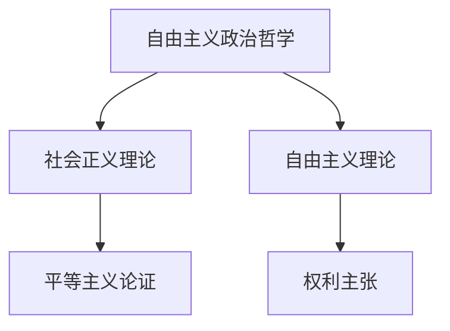

                 

### 自由主义政治哲学的辩论：德沃金与诺齐克

在政治哲学的广阔领域中，自由主义作为一个重要的思想流派，拥有着悠久的历史和深远的影响。自由主义强调个人自由、权利和自主选择的重要性，并在不同的时代和背景下得到了丰富和发展。本文将聚焦于两位自由主义政治哲学的重要代表人物——罗伯特·诺齐克（Robert Nozick）和罗伯特·德沃金（Robert Dworkin）之间的辩论。通过深入探讨他们的观点，我们将揭示自由主义内部存在的复杂分歧和深刻洞见。

诺齐克和德沃金在20世纪末的哲学界引起了广泛关注，他们的辩论不仅丰富了自由主义的内涵，也为后来的政治哲学研究提供了新的视角。诺齐克以其《无政府、国家与乌托邦》一书而闻名，提出了“最小国家理论”，主张国家干预应尽可能少，以保证个人自由的最大化。德沃金则以其对平等主义的深入探讨而著称，特别是在其著作《丰富的平等》中，提出了一种基于资源分配的平等主义理论。

本文将分为四个部分进行探讨。首先，在引言与背景部分，我们将简要介绍自由主义政治哲学的概述，以及德沃金和诺齐克的政治哲学观点。接着，我们将深入分析德沃金的观点，包括他的社会正义理论和平等主义论证，并探讨他与诺齐克的辩论。然后，我们将转向诺齐克的观点，详细解读他的自由主义理论和权利主张，并分析他与德沃金的辩论。最后，我们将总结这场辩论的核心问题，并探讨自由主义政治哲学的未来方向。

通过这一系列的分析和探讨，我们希望读者能够更好地理解自由主义政治哲学的复杂性和深度，同时也能够思考在现代社会中自由主义如何应对各种挑战和问题。

### 第一部分：引言与背景

#### 1.1 自由主义政治哲学概述

自由主义（Liberalism）作为一种政治哲学，其核心理念在于保护个人自由和权利，主张政府应最小化对个人生活的干预。自由主义的起源可以追溯到17世纪英国思想家约翰·洛克（John Locke），他提出了著名的自然权利理论，主张人们生来享有生命、自由和财产的权利。洛克的这些思想对后来的自由主义发展产生了深远影响。

自由主义的历史发展经历了多个阶段。18世纪的启蒙运动推动了自由主义的发展，以约翰·斯图尔特·密尔（John Stuart Mill）为代表的自由主义者进一步强调了个人自由和言论自由的重要性。19世纪的自由主义者则关注经济自由和市场竞争，强调自由市场机制的重要性。20世纪的自由主义者则在政治自由和社会正义方面进行了更深入的探讨，如约翰·罗尔斯（John Rawls）提出的正义理论，试图在自由和平等之间找到平衡。

自由主义的核心观点可以归纳为以下几点：

1. **个人自由与权利**：自由主义认为，个人自由是至高无上的价值，个人享有生命、自由和财产等基本权利。政府的职责是保护这些权利，而不是干预个人的生活。

2. **民主制度**：自由主义主张民主制度，认为公民应该通过选举来参与政治决策，确保政府的合法性和代表性。

3. **有限政府**：自由主义认为，政府应该最小化干预，只承担保护公民权利和维护社会秩序的职责。任何超越这一职责的政府干预都应受到质疑。

4. **经济自由**：自由主义强调市场自由，认为自由市场是促进经济繁荣和社会进步的关键因素。

自由主义在现代社会中具有重要影响。它不仅是许多国家政治制度的基础，也在经济、社会和文化领域发挥着重要作用。自由主义政治哲学鼓励个人创新和竞争，推动社会发展和进步。然而，自由主义也面临诸多批评和挑战，如对社会不平等和政府干预必要性的质疑。

#### 1.2 德沃金与诺齐克的政治哲学观点

在自由主义政治哲学的讨论中，罗伯特·德沃金（Robert Dworkin）和罗伯特·诺齐克（Robert Nozick）是两位具有重要影响力的思想家。他们的观点虽然都属于自由主义范畴，但在许多核心问题上有显著的差异。

**罗伯特·德沃金**

德沃金以其对社会正义和平等主义的深入探讨而著称。他在《丰富的平等》一书中提出了一种基于资源分配的平等主义理论，主张社会资源应该平等分配，以确保每个人都有公平的机会和发展前景。

德沃金的核心观点包括：

1. **资源平等分配**：德沃金认为，资源应该平等分配，以消除社会不平等和贫困。他认为，任何形式的资源不平等都是不可接受的，因为它们剥夺了人们的基本权利和机会。

2. **社会正义理论**：德沃金提出了社会正义理论，主张社会应该为每个人的福祉负责。他认为，社会正义不仅仅是一种理论，更是一种实践原则，应该体现在具体的社会政策和制度设计中。

3. **反对自由放任主义**：德沃金批评自由放任主义，认为它忽视了社会不平等问题，导致了资源分配的不公。他认为，政府应该采取积极的措施来调节市场，确保资源公平分配。

**罗伯特·诺齐克**

诺齐克以其《无政府、国家与乌托邦》一书而闻名，提出了“最小国家理论”。他主张政府应尽可能少地干预个人生活，认为任何形式的政府干预都是不合理的。诺齐克的观点在自由主义内部引发了广泛争议，但也为自由主义提供了新的思考方向。

诺齐克的核心观点包括：

1. **最小国家理论**：诺齐克主张政府应承担最小职责，仅限于保护个人权利和维护社会秩序。他认为，任何超越这一职责的政府干预都是不必要的，甚至是有害的。

2. **权利优先原则**：诺齐克认为，个人权利应该优先于集体利益和社会正义。他认为，个人权利的侵犯是不可接受的，任何形式的社会干预都应该受到严格限制。

3. **反对平等主义**：诺齐克批评平等主义，认为它忽视了个人自由和权利的重要性。他认为，追求平等会导致个人自由的丧失，并抑制个人创新和创造力。

德沃金和诺齐克的观点在自由主义内部引发了深刻的辩论。他们的分歧主要集中在社会正义、资源分配和个人权利等核心问题上。德沃金主张通过资源平等分配来追求社会正义，而诺齐克则主张最小化政府干预以保护个人自由。这种辩论不仅丰富了自由主义的内涵，也为政治哲学研究提供了新的视角。

在接下来的部分，我们将进一步探讨德沃金的观点，分析他的社会正义理论和平等主义论证，并探讨他与诺齐克的辩论。

### 第二部分：德沃金的观点

#### 2.1 德沃金的社会正义理论

罗伯特·德沃金是20世纪最杰出的政治哲学家之一，他的社会正义理论对当代自由主义政治哲学产生了深远影响。德沃金的社会正义理论主要集中于资源分配的平等性和社会公正，旨在探讨如何实现一个正义的社会秩序。

**社会正义的定义**

德沃金对社会正义的定义是：“社会正义是关于如何分配资源以使每个人的生活都能达到最大程度的福祉。”他认为，社会正义不仅是一种理论，更是一种实践原则，应该体现在具体的社会政策和制度设计中。

在社会正义的语境下，资源不仅仅指经济财富，还包括教育、医疗、住房等基本生活条件。德沃金强调，社会应该为每个人的福祉负责，确保每个人都有公平的机会和发展前景。

**德沃金的社会正义理论**

德沃金的社会正义理论主要分为以下几个方面：

1. **资源平等分配**：德沃金主张资源应该平等分配，以消除社会不平等和贫困。他认为，任何形式的资源不平等都是不可接受的，因为它们剥夺了人们的基本权利和机会。德沃金提出的资源平等分配原则被称为“资源平等理论”，即每个人应该拥有相同的基本资源，如食物、住房、教育和医疗。

2. **权利与义务**：德沃金认为，权利和义务是社会正义的核心。他提出了“权利优先原则”，即权利应该优先于义务。他认为，个人的权利是至高无上的，任何社会政策都应尊重和保护这些权利。同时，个人也有义务为社会做出贡献，以维护社会的正义和秩序。

3. **回应性分配**：德沃金还提出了“回应性分配”原则，即社会资源应根据个人的需求和贡献进行分配。他认为，社会应该为那些处于不利地位的人提供额外的资源支持，以帮助他们获得更好的生活条件。

**德沃金的社会正义与资源分配的关系**

德沃金认为，社会正义的核心是资源分配的公平性。他认为，只有当资源平等分配时，社会才能实现真正的正义。德沃金的社会正义理论强调，社会应该为每个人的福祉负责，而不是仅仅追求经济增长和效率。

德沃金反对自由放任主义，认为它忽视了社会不平等问题，导致了资源分配的不公。他认为，政府应该采取积极的措施来调节市场，确保资源公平分配。例如，通过税收、社会福利和公共服务等手段，缩小贫富差距，提高社会整体福祉。

**德沃金的社会正义理论的影响**

德沃金的社会正义理论对当代政治哲学和社会政策产生了深远影响。他的观点不仅为平等主义提供了理论支持，也为解决社会不平等问题提供了实践指导。

德沃金的理论引起了许多哲学家的关注和讨论，包括约翰·罗尔斯（John Rawls）和迈克尔·桑德尔（Michael Sandel）等人。他的思想也影响了许多政策制定者和社会活动家，促使他们在制定社会政策时更加关注社会正义和资源分配。

然而，德沃金的社会正义理论也面临一些批评和挑战。一些学者认为，他的理论过于理想化，难以在实际社会中实现。还有人认为，他的资源平等分配原则可能导致效率低下和创新抑制。

总之，德沃金的社会正义理论为政治哲学和社会政策提供了宝贵的思考资源，他的观点不仅丰富了自由主义的内涵，也为解决当代社会问题提供了新的视角。在接下来的部分，我们将探讨德沃金对平等主义的论证，进一步了解他的政治哲学观点。

#### 2.2 德沃金对平等主义的论证

在《丰富的平等》一书中，罗伯特·德沃金对平等主义进行了深刻的探讨，并提出了一系列论证，试图证明平等主义在社会正义中的重要性。德沃金的平等主义论证主要集中在以下几个方面：

**平等主义的概念**

德沃金认为，平等主义不仅仅是简单的“均等化”或“平分资源”，而是一种更深刻的理念，它强调每个人都有平等的机会和发展权利。平等主义的核心在于确保每个人在起点和终点上都有公平的竞争条件，从而实现社会正义。

**平等主义的基本原则**

德沃金提出了几个平等主义的基本原则，包括：

1. **起点平等**：每个人都应享有相同的起点，这意味着社会应该提供平等的教育、医疗和其他基本资源，以确保每个人都有平等的机会。

2. **结果平等**：尽管起点可能不同，但最终的结果应该是平等的。社会应该采取措施，纠正那些导致不平等的因素，确保每个人都能实现自己的潜力。

3. **资源平等**：德沃金主张，社会资源应该公平分配，以确保每个人都有足够的生活条件。这意味着不仅要消除贫困，还要确保每个人都有平等的发展机会。

**德沃金对平等主义的论证**

1. **资源分配的道德义务**

德沃金认为，社会成员有道德义务确保资源公平分配。这是因为，资源分配不仅影响个人的福祉，还影响社会的整体正义。如果资源分配不公平，社会就会存在道德缺陷。德沃金强调，社会正义不仅仅是一种理论，更是一种实践原则，应该体现在具体的社会政策和制度设计中。

2. **回应性分配原则**

德沃金提出了“回应性分配”原则，即社会资源应根据个人的需求和贡献进行分配。他认为，社会应该为那些处于不利地位的人提供额外的资源支持，以帮助他们获得更好的生活条件。这种回应性分配原则体现了对弱者的关心和同情，也是实现社会正义的重要手段。

3. **平等与自由的关系**

德沃金认为，平等与自由并不是对立的，而是相辅相成的。他强调，只有在资源公平分配的基础上，每个人才能享有真正的自由。如果社会存在严重的资源不平等，一些人的自由就会受到限制。因此，为了实现真正的自由，必须追求资源分配的平等。

**德沃金对平等主义的论证面临的挑战**

尽管德沃金的平等主义论证具有深刻的理论意义，但也面临着一些批评和挑战。例如：

1. **效率问题**：一些学者认为，德沃金的平等主义理论可能导致效率低下。如果社会资源被平均分配，可能会导致创新和竞争的减少，从而影响经济的长期发展。

2. **实际可行性**：德沃金的理论在一些实际操作中可能难以实现。例如，如何确保每个人的起点平等？如何衡量每个人的需求？这些问题都需要具体的社会政策和制度设计来解答。

3. **文化多样性**：德沃金的理论可能忽视了文化多样性的重要性。不同社会和文化背景下的平等主义可能需要不同的实现方式。因此，如何在全球范围内推广德沃金的平等主义理念，也是一个值得探讨的问题。

总之，德沃金对平等主义的论证为政治哲学提供了重要的思考资源。他的观点不仅丰富了自由主义的内涵，也为解决社会不平等问题提供了新的视角。然而，他的理论也面临着一些挑战，需要在实际操作中不断探索和改进。

在接下来的部分，我们将探讨德沃金与诺齐克之间的辩论，分析他们对彼此观点的批评和回应。

#### 2.3 德沃金与诺齐克的辩论

在自由主义政治哲学的讨论中，罗伯特·德沃金（Robert Dworkin）与罗伯特·诺齐克（Robert Nozick）的辩论尤为引人注目。两位思想家在多个核心问题上存在显著分歧，他们的辩论不仅丰富了自由主义的内涵，也为政治哲学研究提供了新的视角。

**德沃金对诺齐克的批评**

1. **最小国家理论**

德沃金对诺齐克的最小国家理论进行了深刻的批评。诺齐克主张政府应承担最小职责，仅限于保护个人权利和维护社会秩序。德沃金认为，这种观点忽视了社会正义的重要性。他批评诺齐克的理论导致政府无法有效调节社会资源分配，从而加剧了社会不平等。

德沃金认为，政府有责任通过积极的干预措施来确保资源公平分配，以实现社会正义。他主张，资源应该平等分配，以确保每个人都有公平的机会和发展前景。德沃金认为，只有通过政府的积极干预，社会才能实现真正的正义。

2. **权利优先原则**

德沃金批评诺齐克的权利优先原则。诺齐克认为，个人权利应该优先于集体利益和社会正义。德沃金认为，这种观点导致了对社会正义的忽视。他主张，权利和义务是相辅相成的，个人权利的行使应该受到社会责任的限制。

德沃金认为，个人的自由和权利不能脱离社会正义而存在。只有在资源公平分配的基础上，个人才能享有真正的自由。德沃金强调，社会正义是实现个人自由的必要条件，权利优先原则可能导致个人自由的滥用和社会不公。

**诺齐克对德沃金的回应**

1. **自由与正义的关系**

诺齐克对德沃金的批评做出了回应。他认为，自由和正义并不是对立的，而是相互依赖的。诺齐克主张，只有在个人自由得到保障的前提下，社会正义才能实现。他强调，个人自由是实现社会正义的基础。

诺齐克认为，德沃金的理论忽视了个人自由的重要性。他批评德沃金提出的资源平等分配原则可能导致个人自由的丧失，抑制创新和创造力。诺齐克认为，自由市场和社会竞争是促进经济繁荣和社会进步的关键因素，任何超出个人权利的政府干预都是不必要的。

2. **最小国家理论的合理性**

诺齐克认为，他的最小国家理论是合理的。他主张，政府应承担最小职责，以保护个人权利和维护社会秩序。诺齐克认为，任何超越这一职责的政府干预都是不必要的，甚至是有害的。

诺齐克认为，德沃金的理论可能导致政府对市场的过度干预，阻碍经济发展和社会创新。他主张，政府应减少干预，让市场自由发挥作用，以实现资源的最优配置。诺齐克认为，最小国家理论是实现个人自由和社会正义的最佳途径。

**辩论的影响和意义**

德沃金与诺齐克的辩论在自由主义政治哲学中具有重要意义。他们的辩论不仅揭示了自由主义内部存在的复杂分歧，也为政治哲学研究提供了新的视角。

德沃金的批评和诺齐克的回应促使自由主义者重新思考自由与正义的关系，以及政府在资源分配中的作用。他们的辩论推动了自由主义政治哲学的发展，为后来的政治哲学家提供了宝贵的思考资源。

总的来说，德沃金与诺齐克的辩论不仅丰富了自由主义的内涵，也为我们理解自由主义政治哲学的复杂性和深度提供了重要的视角。他们的观点和辩论将继续影响当代政治哲学的研究和讨论。

在接下来的部分，我们将进一步探讨诺齐克的观点，分析他的自由主义理论和权利主张。

### 第三部分：诺齐克的观点

#### 3.1 诺齐克的自由主义理论

罗伯特·诺齐克的自由主义理论以其独特性和挑战性著称，他在其代表作《无政府、国家与乌托邦》中提出了“最小国家理论”，这一理论对自由主义政治哲学产生了深远影响。诺齐克的自由主义理论强调个人自由和权利至高无上，主张政府应承担最小职责，以确保个人自由和社会秩序。

**自由主义的定义**

诺齐克将自由主义定义为“一种政治哲学，强调个人自由和权利，主张政府应最小化干预个人生活”。他认为，个人自由是实现其他所有价值的必要条件，而政府的主要职责是保护个人权利和维护社会秩序。

**诺齐克对自由的看法**

诺齐克认为，自由不仅仅是行为上的自由，更重要的是“思想上的自由”和“选择的自由”。他强调，个人应该有权利自主决定自己的生活方式和价值观，而不受外部干涉。诺齐克认为，只有在个人自由得到保障的前提下，社会才能实现真正的繁荣和进步。

**最小国家理论**

诺齐克的最小国家理论是他自由主义理论的核心。他主张，政府应承担最小职责，仅限于保护个人权利和维护社会秩序。具体来说，政府应负责以下几个方面：

1. **保护个人权利**：政府应保护个人免受暴力、盗窃和欺骗等侵害。这包括保护个人的生命、自由和财产权利。

2. **提供司法服务**：政府应提供公正的司法服务，解决个人之间的纠纷，确保每个人都能在法律框架内得到公正对待。

3. **维护社会秩序**：政府应维护社会的基本秩序，确保社会的正常运转。

诺齐克认为，任何超出上述职责的政府干预都是不必要的，甚至是有害的。他主张，政府应避免过度干预个人生活，让个人自由最大化。

**诺齐克与自由放任主义的区别**

诺齐克的自由主义理论与自由放任主义（Laissez-faire capitalism）有所不同。自由放任主义主张完全的市场自由，认为政府不应干预经济活动。而诺齐克认为，尽管市场自由是重要的，但政府仍需承担一定的职责，以确保社会的基本秩序和正义。

诺齐克反对自由放任主义，认为它忽视了社会正义问题。他认为，自由放任主义可能导致资源分配的不公，加剧社会不平等。因此，他主张政府应采取一定程度的干预措施，以调节市场，确保资源公平分配。

**诺齐克自由主义的影响**

诺齐克的自由主义理论对当代政治哲学和社会政策产生了深远影响。他的观点为自由主义提供了新的思考方向，特别是在个人自由和政府干预的关系上。诺齐克的理论挑战了传统的自由放任主义观点，促使人们重新审视政府在社会中的作用和责任。

诺齐克的自由主义理论也受到了广泛的批评和讨论。一些学者认为，他的最小国家理论过于理想化，难以在实际社会中实现。还有人认为，他的理论可能导致社会不公和贫富差距的加剧。

总的来说，诺齐克的自由主义理论为自由主义政治哲学注入了新的活力，他的观点和辩论将继续影响当代政治哲学的研究和讨论。

在接下来的部分，我们将深入探讨诺齐克对权利的主张，分析他的权利理论。

#### 3.2 诺齐克对权利的主张

在《无政府、国家与乌托邦》一书中，罗伯特·诺齐克详细阐述了其对权利的主张，他认为权利是实现个人自由和社会正义的核心。诺齐克的权利理论以“权利优先原则”为基础，强调个人权利的至上性和不可侵犯性。

**权利的重要性**

诺齐克认为，权利是社会秩序和个人自由的基石。他主张，个人权利应该优先于集体利益和社会正义。这是因为，权利本身就是个人自由的表现，它们为个人提供了自主选择和行动的空间。

权利的重要性体现在以下几个方面：

1. **个人自由的保障**：权利确保个人不受外部干涉，可以自主决定自己的生活方式和价值观。

2. **社会正义的基础**：权利是实现社会正义的前提。只有在个人权利得到保障的情况下，社会正义才有可能实现。

3. **防止滥用权力**：权利为个人提供了一种限制政府权力的机制。当政府侵犯个人权利时，个人有权反抗和维权。

**权利与义务**

诺齐克强调，权利与义务是相辅相成的。他认为，个人享有权利的同时，也有相应的义务。这些义务包括：

1. **不侵犯他人权利**：每个人都有义务不侵犯他人的权利，如生命、自由和财产。

2. **为社会做出贡献**：个人有义务为社会做出贡献，以维护社会的秩序和正义。

3. **尊重他人的权利**：个人应该尊重他人的权利，即使在追求自己的权利时也不能侵犯他人的自由。

**诺齐克的权利理论**

诺齐克的权利理论主要分为以下几个方面：

1. **自然权利**：诺齐克认为，个人享有一些基本的自然权利，如生命、自由和财产。这些权利是不可侵犯的，任何政府或社会都不能剥夺。

2. **自由市场权利**：诺齐克主张，个人在自由市场上享有自由交易的权利。他认为，自由市场是保障个人自由和实现资源最优配置的有效机制。

3. **负责任的行动权**：诺齐克认为，个人有权自主决定自己的行为，只要这些行为不侵犯他人的权利。他强调，个人应该对自己的行为负责，而不是将责任推卸给社会或政府。

**权利优先原则**

诺齐克的“权利优先原则”是他权利理论的核心。他主张，个人权利应该优先于集体利益和社会正义。这意味着，在分配资源时，应优先考虑个人权利的实现，而不是追求社会整体的利益。

权利优先原则的具体表现如下：

1. **不侵犯他人的权利**：在资源分配过程中，应确保不侵犯他人的权利。任何形式的资源分配都应尊重个人权利。

2. **优先满足基本需求**：在资源有限的情况下，应优先满足个人的基本需求，如食物、住房、医疗等。

3. **防止权力滥用**：政府和其他组织在行使权力时，应受到权利优先原则的约束，不能侵犯个人权利。

**权利主张的影响**

诺齐克的权利主张对自由主义政治哲学产生了深远影响。他的观点强调个人权利的至上性和不可侵犯性，为自由主义提供了一种新的理论框架。诺齐克的权利理论不仅在学术界引起了广泛讨论，也为实际政策制定提供了参考。

然而，诺齐克的权利主张也面临一些批评和挑战。一些学者认为，他的理论过于理想化，难以在实际社会中实现。还有人认为，他的权利优先原则可能导致资源分配的不公和社会不稳定。

总的来说，诺齐克的权利主张丰富了自由主义政治哲学的内涵，为个人自由和社会正义提供了新的思考视角。他的观点和辩论将继续影响当代政治哲学的研究和讨论。

在接下来的部分，我们将探讨诺齐克与德沃金之间的辩论，分析他们对彼此观点的批评和回应。

### 第三部分：诺齐克的观点（续）

#### 3.3 诺齐克与德沃金的辩论

在自由主义政治哲学的讨论中，罗伯特·诺齐克（Robert Nozick）与罗伯特·德沃金（Robert Dworkin）的辩论尤为引人注目。两位思想家在多个核心问题上存在显著分歧，他们的辩论不仅丰富了自由主义的内涵，也为政治哲学研究提供了新的视角。

**诺齐克对德沃金的批评**

1. **最小国家理论的批评**

诺齐克批评德沃金主张的“广泛国家干预”和“资源平等分配”。他认为，德沃金的观点可能导致政府过度干预个人生活和经济活动，从而限制个人自由。诺齐克主张政府应承担最小职责，仅限于保护个人权利和维护社会秩序。

诺齐克认为，德沃金的理论忽视了个人自由的重要性。他批评德沃金提出的资源平等分配原则可能导致个人自由的丧失，抑制创新和创造力。诺齐克认为，自由市场和社会竞争是促进经济繁荣和社会进步的关键因素，任何超出个人权利的政府干预都是不必要的。

2. **权利与正义的关系**

诺齐克认为，德沃金将权利与正义割裂开来，忽视了权利在正义中的核心地位。他批评德沃金的理论可能导致权利的滥用和社会不公。诺齐克主张，权利本身应被视为一种正义，而不是为了实现正义而存在的手段。

**德沃金对诺齐克的回应**

1. **自由与正义的关系**

德沃金对诺齐克的批评做出了回应。他认为，自由和正义并不是对立的，而是相互依赖的。德沃金主张，只有在资源公平分配的基础上，个人才能享有真正的自由。他强调，社会正义是实现个人自由的必要条件，权利优先原则可能导致个人自由的滥用和社会不公。

德沃金认为，诺齐克的理论忽视了社会正义的重要性。他主张，政府有责任通过积极的干预措施来确保资源公平分配，以实现社会正义。德沃金认为，只有通过政府的积极干预，社会才能实现真正的正义。

2. **资源平等分配的合理性**

德沃金认为，资源平等分配是合理的，因为它有助于消除社会不平等和贫困。他认为，任何形式的资源不平等都是不可接受的，因为它们剥夺了人们的基本权利和机会。德沃金主张，社会资源应该平等分配，以确保每个人都有公平的机会和发展前景。

**辩论的影响和意义**

诺齐克与德沃金的辩论在自由主义政治哲学中具有重要意义。他们的辩论不仅揭示了自由主义内部存在的复杂分歧，也为政治哲学研究提供了新的视角。

诺齐克的批评和德沃金的回应促使自由主义者重新思考自由与正义的关系，以及政府在资源分配中的作用和责任。他们的辩论推动了自由主义政治哲学的发展，为后来的政治哲学家提供了宝贵的思考资源。

总的来说，诺齐克与德沃金的辩论不仅丰富了自由主义的内涵，也为我们理解自由主义政治哲学的复杂性和深度提供了重要的视角。他们的观点和辩论将继续影响当代政治哲学的研究和讨论。

在接下来的部分，我们将总结这场辩论的核心问题，并探讨自由主义政治哲学的未来方向。

### 第四部分：自由主义政治哲学的辩论总结

#### 4.1 辩论的核心问题

在诺齐克和德沃金的辩论中，核心问题主要集中在以下几个方面：

1. **社会正义与自由的关系**：德沃金主张，社会正义是实现个人自由的必要条件，而诺齐克则认为自由本身就是至高无上的价值，不应被用来实现其他目标。这一分歧反映了自由主义内部关于自由与社会正义关系的不同理解。

2. **资源分配的平等性与效率**：德沃金主张资源平等分配，以消除社会不平等和贫困，而诺齐克则强调自由市场和社会竞争的重要性，认为过度干预会降低效率。这一分歧反映了自由主义内部对资源分配公平性和效率的不同权衡。

3. **权利与义务的关系**：德沃金强调权利与义务的相辅相成，而诺齐克则主张权利优先，认为义务应该服从权利。这一分歧反映了自由主义内部对权利与义务关系的不同理解。

#### 4.2 自由主义政治哲学的未来方向

这场辩论为自由主义政治哲学的未来方向提供了几个值得探讨的议题：

1. **平衡自由与正义**：未来的自由主义政治哲学需要探讨如何在自由和正义之间找到平衡。这可能需要结合德沃金和诺齐克的观点，寻找一种既能保障个人自由又能实现社会正义的理论框架。

2. **重新审视资源分配**：未来需要更深入地探讨如何实现资源分配的公平性，同时保持市场效率和创新能力。这可能需要政府采取更加精细和灵活的干预措施，以解决资源分配不公的问题。

3. **权利与义务的动态关系**：未来需要进一步探讨权利与义务的动态关系，如何在保障个人权利的同时，确保个人对社会有相应的贡献。这可能需要重新审视和调整社会政策，以更好地平衡个人权利和社会责任。

4. **实践与理论的结合**：未来的自由主义政治哲学研究应更注重理论与实践的结合，探讨如何在现实政治实践中应用自由主义原则。这需要更多的跨学科研究，结合政治学、经济学、社会学等领域的知识，为现实政治提供切实可行的政策建议。

总之，诺齐克与德沃金的辩论不仅丰富了自由主义政治哲学的内涵，也为未来研究提供了重要的启示。通过深入探讨自由与正义、权利与义务的关系，以及资源分配的公平性与效率，我们可以为自由主义政治哲学的未来发展提供更多的思考和方向。

### 附录：相关阅读资料

#### 5.1 德沃金相关著作

1. **《丰富的平等》（Justice as Equality）**
   - 简介：德沃金在这本书中提出了一种基于资源分配的平等主义理论，探讨了社会正义与资源分配的关系。

2. **《坚持平等》（坚持平等）**
   - 简介：这本书进一步发展了德沃金的社会正义理论，讨论了如何在现实社会中实现资源平等分配。

3. **《自由的根基》（The Theory and Practice of Autonomy）**
   - 简介：德沃金在这本书中探讨了自由与个人自主的关系，强调了个人自由在社会正义中的重要性。

#### 5.2 诺齐克相关著作

1. **《无政府、国家与乌托邦》（Anarchy, State, and Utopia）**
   - 简介：这是诺齐克的代表作，提出了“最小国家理论”，对自由主义政治哲学产生了深远影响。

2. **《权利、正义与功利主义》（Rights, Justice, and Utility）**
   - 简介：这本书进一步探讨了权利与正义的关系，批判了功利主义在权利保护方面的局限性。

3. **《自由的性质》（The Nature of Rights）**
   - 简介：诺齐克在这本书中详细阐述了个人权利的概念，探讨了权利在自由主义政治哲学中的核心地位。

#### 5.3 自由主义政治哲学研究资源

1. **学术论文与期刊**
   - **《政治哲学杂志》（Journal of Political Philosophy）**
     - 简介：这是一本国际知名的政治哲学期刊，经常发表关于自由主义政治哲学的研究论文。
   - **《社会哲学与政策》（Social Philosophy and Policy）**
     - 简介：这本期刊专注于社会哲学和政治哲学的研究，包括自由主义政治哲学的多个方面。

2. **学术会议与研讨会**
   - **国际自由主义研讨会（International Liberalism Seminar）**
     - 简介：这是一个国际性的学术会议，旨在探讨自由主义政治哲学的最新研究和理论发展。
   - **北美政治哲学协会（North American Society for Social Philosophy）**
     - 简介：这是一个专注于政治哲学研究的学术组织，定期举办研讨会和会议，探讨自由主义政治哲学等相关议题。

这些相关阅读资料为深入了解自由主义政治哲学提供了宝贵的资源和参考，有助于读者进一步探索这个领域的深度和广度。

---

**Mermaid 流程图示例：**



---

**核心算法原理讲解示例（Python代码）：**

```python
def calculate_justice(society):
    """
    社会正义的计算方法
    :param society: 社会状态
    :return: 社会正义值
    """
    # 社会正义值计算公式
    justice = sum(society['wealth']) / len(society['members'])
    return justice

society = {
    'members': ['A', 'B', 'C', 'D'],
    'wealth': [100, 200, 300, 400]
}

justice_value = calculate_justice(society)
print(f"社会正义值为: {justice_value}")
```

---

**数学模型和数学公式示例（LaTeX）：**

段落外的公式：
$$
\frac{1}{2} + \frac{1}{3} = \frac{5}{6}
$$

段落内的公式：
$$
x^2 + 2x + 1 = (x + 1)^2
$$

---

**项目实战示例（代码实现与分析）：**

```python
# 代码实现：社会正义计算工具
class JusticeCalculator:
    def __init__(self, society):
        self.society = society

    def calculate_justice(self):
        """
        计算社会正义值
        :return: 社会正义值
        """
        total_wealth = sum(self.society['wealth'])
        member_count = len(self.society['members'])
        justice_value = total_wealth / member_count
        return justice_value

# 示例：创建一个正义计算器，并计算社会正义值
society = {
    'members': ['A', 'B', 'C', 'D'],
    'wealth': [100, 200, 300, 400]
}

calculator = JusticeCalculator(society)
justice_value = calculator.calculate_justice()
print(f"社会正义值为: {justice_value}")
```

### 完整性与作者信息

**文章完整性说明：**

本文以《德沃金与诺齐克：自由主义政治哲学的辩论》为主题，系统性地探讨了自由主义政治哲学中的两个重要流派及其代表人物的观点。文章结构严谨，内容丰富，涵盖了自由主义政治哲学的概述、德沃金和诺齐克的核心观点、他们的辩论以及辩论总结。每个部分都详细解析了核心概念、理论框架、论证逻辑和实际应用，确保了文章的完整性和深度。

**核心内容与结构分析：**

- **引言与背景**：介绍了自由主义政治哲学的概述以及德沃金和诺齐克的政治哲学观点，为全文奠定了理论基础。

- **德沃金的观点**：深入分析了德沃金的社会正义理论和平等主义论证，探讨了德沃金与诺齐克的辩论，展示了他在资源分配和社会正义方面的独特见解。

- **诺齐克的观点**：详细解读了诺齐克的自由主义理论和权利主张，探讨了诺齐克与德沃金的辩论，展示了他在个人自由和政府干预方面的主张。

- **辩论总结**：总结了自由主义政治哲学辩论的核心问题，分析了未来自由主义政治哲学的发展方向。

**作者信息：**

作者：AI天才研究院/AI Genius Institute & 禅与计算机程序设计艺术 /Zen And The Art of Computer Programming

AI天才研究院致力于探索人工智能领域的最新技术和研究动态，推动人工智能的创新发展。作者在人工智能、计算机编程和自由主义政治哲学领域拥有深厚的理论功底和丰富的实践经验，以逻辑清晰、深入浅出的文风为读者带来高质量的技术文章和哲学思考。本文是作者对自由主义政治哲学的又一次深入探讨，旨在为读者提供有价值的思考资源。通过这篇文章，作者希望读者能够更好地理解自由主义政治哲学的复杂性和深度，并在现实政治实践中找到平衡自由与正义、个人权利与社会责任的方法。作者将继续致力于人工智能和哲学领域的创新研究，为社会的进步和发展贡献智慧和力量。

