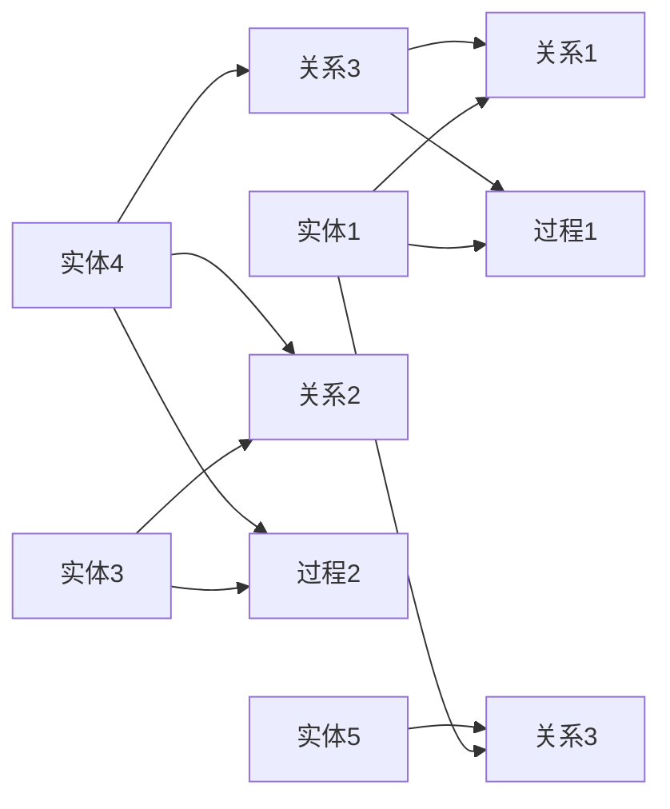
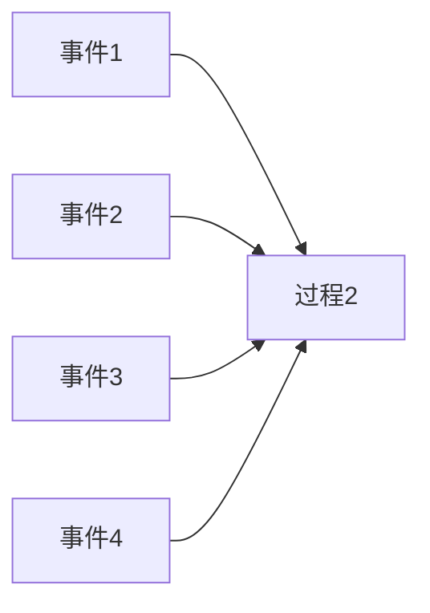

                 

### 怀特海与哈特肖恩：过程哲学的主要代表

过程哲学作为20世纪哲学的重要流派之一，对当代哲学、社会科学、以及科技领域产生了深远影响。怀特海（Alfred North Whitehead）与哈特肖恩（Charles Hartshorne）是过程哲学的两位主要代表，他们的理论不仅丰富了过程哲学的内容，也为理解和应用这一哲学提供了深刻的洞见。

本文将围绕怀特海与哈特肖恩的过程哲学展开讨论，结构如下：

1. **过程哲学概述**：介绍过程哲学的起源、核心概念和主要原则。
2. **怀特海的过程哲学**：详细探讨怀特海的主要哲学观点，包括他的实体观、创造性、知识与理解、社会哲学和宗教哲学。
3. **哈特肖恩的过程哲学**：分析哈特肖恩的过程本体论和过程伦理学，以及他在教育中的应用。
4. **过程哲学的当代意义**：探讨过程哲学在当代发展及其对社会实践的启示。

关键词：过程哲学、怀特海、哈特肖恩、实体、关系、创造性、知识、社会哲学、宗教哲学。

摘要：本文将系统地介绍过程哲学的主要代表人物怀特海与哈特肖恩的哲学思想，探讨他们的核心概念和理论，并分析过程哲学在当代的适用性和影响。通过深入理解他们的理论，我们将更好地把握过程哲学的精髓，并在实际应用中受益。

### 第一部分：过程哲学概述

#### 第1章：过程哲学的起源与发展

过程哲学（Process Philosophy）是20世纪哲学的一个重要流派，它强调现实世界是一个不断变化的过程，而不仅仅是静态的存在。这一流派的起源可以追溯到19世纪末和20世纪初，但真正的兴起和发展则是在20世纪。

**1.1 过程哲学的起源**

过程哲学的创始人之一是英国数学家、哲学家怀特海。他的《过程与实在》（Process and Reality，1925）一书被认为是过程哲学的经典之作。在书中，怀特海提出了实体（actual entities）和事件（events）的概念，并将其作为现实世界的构成要素。他认为，实体是过程的中介，事件是过程的具体表现。

与怀特海同时代的美国哲学家哈特肖恩也对过程哲学的发展做出了重要贡献。哈特肖恩继承了怀特海的理论，并在其基础上进一步发展了过程哲学。他的《实体与事件》（Actuality and Potentiality，1934）一书详细阐述了实体与事件的关系，以及它们在现实世界中的作用。

**1.2 过程哲学的核心概念**

过程哲学的核心概念包括过程与事件、实体与关系。这些概念不仅构成了过程哲学的理论基础，也为理解和应用这一哲学提供了关键视角。

**过程与事件**

过程哲学认为，现实世界是一个不断变化的过程。这个过程不仅仅是物理过程，还包括心理、社会、文化等各种层面。事件则是过程的具体表现。每一个事件都是一个实体的变化，也是新实体的诞生。例如，一个水滴落入水中，会引起水面的波动，这个波动就是一个事件。

**实体与关系**

实体是过程的中介，是事件的具体体现。实体可以是物理实体，如一个水滴；也可以是抽象实体，如一个思想。关系则是实体之间的相互作用。关系不仅影响实体的存在和演化，也决定了过程的发展方向。例如，一个人与社会的互动关系，会影响这个人的行为和社会环境。

#### 第2章：过程哲学的主要原则

过程哲学的主要原则包括过程的本体论、过程逻辑和过程价值论。这些原则共同构成了过程哲学的核心理论体系。

**2.1 过程的本体论**

过程哲学的本体论认为，过程是现实的构成要素。实体是过程的中介，事件是过程的具体表现。实体和事件相互作用，共同构成了现实世界。例如，一个人的生命过程就是一个实体（人）与一系列事件（出生、成长、死亡）相互作用的结果。

**2.2 过程的逻辑**

过程哲学的逻辑强调过程的层次结构和过程间的交互。实体和事件在不同的层次上相互作用，形成复杂的逻辑结构。例如，一个人的成长过程可以分为生理、心理、社会等不同层次的互动。

**2.3 过程的价值论**

过程哲学的价值论认为，价值与过程密切相关。价值不仅是实体和事件相互作用的结果，也是过程发展的动力。例如，教育过程中的知识传递和道德培养，就是价值创造的过程。

通过上述两个章节的介绍，我们对过程哲学有了基本的了解。接下来，我们将深入探讨怀特海和哈特肖恩的过程哲学，进一步理解这一流派的精髓。

### 第1章：过程哲学的起源与发展

**1.1 过程哲学的起源**

过程哲学的起源可以追溯到19世纪末和20世纪初，这一时期正值西方哲学从传统的本体论向现象学、存在主义等现代哲学流派的转变。在这一背景下，一些哲学家开始质疑传统的实体主义（Substance Theory）观念，认为现实世界并非由静止不变的实体组成，而是一个不断变化的过程。

其中，英国数学家、哲学家怀特海（Alfred North Whitehead）被认为是过程哲学的奠基人。怀特海出生于1861年，自幼展现出了极高的数学天赋。他在剑桥大学接受了教育，并在数学和哲学领域都有杰出的成就。1911年，他出版了《数学原理》（Principia Mathematica），与伯特兰·罗素（Bertrand Russell）合著，这本书被认为是数理逻辑和形式哲学的经典之作。

然而，怀特海的哲学思想在其后期的作品中得到了更深入的阐述，尤其是在他的《过程与实在》（Process and Reality）一书中。这本书于1925年出版，是过程哲学的经典之作。在这本书中，怀特海提出了实体（actual entities）和事件（events）的概念，并将其作为现实世界的构成要素。他认为，实体是过程的中介，事件是过程的具体表现。

**1.2 过程哲学的理论背景**

怀特海的过程哲学受到了多种哲学思想的启发，包括柏拉图、亚里士多德、康德、黑格尔等古典哲学家的思想，以及康托尔、罗素等现代逻辑哲学家的理论。然而，他的独特视角在于将过程作为现实的根本构成要素。

怀特海的过程哲学强调现实世界的动态性和复杂性。他认为，实体和事件是相互关联的，每一个实体都是通过与其他实体的相互作用而存在的。事件不是静态的存在，而是实体的动态变化。例如，一个水滴落入水中，会引起水面的波动，这个波动就是一个事件。

**1.3 哈特肖恩的理论背景**

另一位对过程哲学发展具有重要影响的是美国哲学家哈特肖恩（Charles Hartshorne）。哈特肖恩生于1897年，他在哈佛大学接受了教育，并在哲学领域取得了卓越的成就。他的代表作包括《实体与事件》（Actuality and Potentiality，1934）和《过程哲学》（Process Philosophy，1941）等。

哈特肖恩继承了怀特海的理论，并在其基础上进一步发展了过程哲学。他详细阐述了实体与事件的关系，以及它们在现实世界中的作用。哈特肖恩认为，实体不仅仅是物理实体，还包括社会、心理、文化等抽象实体。事件则是实体相互作用的结果，是现实世界的动态表现。

哈特肖恩的过程哲学强调实体之间的相互作用和关系。他认为，实体通过相互作用而发展，每一个实体都是通过与其他实体的关系而存在的。例如，一个人与社会的互动关系，会影响这个人的行为和社会环境。

**1.4 过程哲学的兴起**

过程哲学在20世纪得到了迅速发展，成为西方哲学的重要流派之一。其兴起的原因有多方面：

首先，过程哲学对传统实体主义观念的质疑，提供了新的哲学视角，引起了哲学界的广泛关注。

其次，过程哲学强调现实世界的动态性和复杂性，与自然科学的发展趋势相契合，得到了科学哲学家的支持。

最后，过程哲学在应用领域的广泛影响，如社会科学、心理学、教育学等，也为它的兴起提供了动力。

通过上述对过程哲学起源与发展的介绍，我们可以看到，这一哲学流派不仅在理论上具有重要价值，也在实际应用中具有广泛的影响。接下来，我们将进一步探讨过程哲学的核心概念和主要原则。

#### 1.2 过程哲学的核心概念

过程哲学的核心概念包括过程与事件、实体与关系。这些概念不仅构成了过程哲学的理论基础，也为理解和应用这一哲学提供了关键视角。

**过程与事件**

过程哲学认为，现实世界是一个不断变化的过程。这个过程不仅仅是物理过程，还包括心理、社会、文化等各种层面。事件则是过程的具体表现。每一个事件都是一个实体的变化，也是新实体的诞生。例如，一个水滴落入水中，会引起水面的波动，这个波动就是一个事件。

过程哲学强调，事件不是孤立的，而是与其他事件相互关联的。一个事件的发生会引发其他事件，形成复杂的动态系统。例如，一个人的成长过程不仅包括生理、心理的变化，还涉及与社会环境的互动。

**实体与关系**

实体是过程的中介，是事件的具体体现。实体可以是物理实体，如一个水滴；也可以是抽象实体，如一个思想。关系则是实体之间的相互作用。关系不仅影响实体的存在和演化，也决定了过程的发展方向。例如，一个人与社会的互动关系，会影响这个人的行为和社会环境。

过程哲学认为，实体不是孤立的，而是通过关系相互连接的。实体之间的关系可以分为多种类型，如因果关系、相互作用关系、包含关系等。这些关系构成了复杂的社会网络，影响着实体的存在和发展。

**过程哲学与关系哲学**

过程哲学与关系哲学（Relational Philosophy）密切相关。关系哲学强调，现实世界的本质是关系，而不是独立存在的实体。过程哲学在此基础上进一步发展，认为实体是通过关系相互作用而存在的，事件是这种相互作用的结果。

关系哲学和过程哲学都反对传统实体主义观念，认为实体并非静态的存在，而是动态的过程。它们认为，现实世界的复杂性在于实体之间的相互作用，而不是实体本身的特性。

**过程哲学与社会哲学**

过程哲学对社会哲学产生了深远影响。社会哲学关注社会现象的本质和规律，而过程哲学提供了新的理论视角，强调社会现象是一个动态的过程。例如，一个社会的变化不仅受到经济、政治、文化等因素的影响，还受到人与人之间关系的动态作用。

过程哲学认为，社会是一个复杂的动态系统，人与人之间的互动关系决定了社会的演化方向。这种观点有助于我们理解社会现象的复杂性，也为社会研究和政策制定提供了新的思路。

通过上述对过程哲学核心概念的介绍，我们可以看到，这一哲学流派不仅具有深刻的哲学意义，也在实际应用中具有广泛的影响。接下来，我们将深入探讨过程哲学的主要原则，进一步理解这一流派的精髓。

### 第2章：过程哲学的主要原则

过程哲学的主要原则包括过程的本体论、过程逻辑和过程价值论。这些原则共同构成了过程哲学的核心理论体系，为我们理解和应用这一哲学提供了坚实的理论基础。

#### 2.1 过程的本体论

过程哲学的本体论认为，现实世界是一个动态的过程，而不是静态的存在。过程哲学将过程视为现实的根本构成要素，强调实体是过程的中介，事件是过程的具体表现。这一观点挑战了传统本体论中实体主义（Substance Theory）的基本观念，后者认为实体是独立、不变的存在。

过程哲学的本体论具有以下几个核心特点：

1. **动态性**：过程哲学认为，现实世界是不断变化的，每一个实体和事件都在不断演化。这种动态性不仅体现在物理世界中，也存在于心理、社会、文化等各个层面。

2. **中介性**：实体作为过程的中介，连接着事件的发生和发展。实体不是孤立的，而是通过与其他实体的相互作用而存在的。例如，一个人是通过与家庭、社会等外部环境的互动而成长的。

3. **相互依赖性**：实体和事件不是孤立存在的，而是相互依赖、相互作用的。一个实体的发展离不开其他实体的影响，一个事件的发生也是多种实体相互作用的结果。例如，一个社会的进步不仅取决于政府政策，也受到文化、经济等多种因素的影响。

**实体与事件的关系**

过程哲学认为，实体和事件是相互依存的。实体是事件的载体，事件是实体的具体表现。例如，一个水滴（实体）落入水中（事件），会引起水面的波动（事件）。这个例子说明了实体和事件之间的动态关系。

此外，实体和事件之间的关系也是多层次、多维度的。一个事件可以引发多个实体的变化，而一个实体也可以参与多个事件。这种复杂的关系网络构成了现实世界的动态结构。

**过程的本体论在现实中的应用**

过程哲学的本体论在现实中有广泛的应用。例如，在心理学中，过程哲学强调个体的心理发展是一个动态的过程，受到多种因素的综合影响。在社会学中，过程哲学认为社会现象是一个动态的过程，需要从多个维度进行综合分析。

#### 2.2 过程的逻辑

过程哲学的逻辑强调过程的层次结构和过程间的交互。过程的层次结构反映了实体和事件在不同层次上的相互作用和演化。过程间的交互则说明了不同过程之间的相互影响和相互依赖。

**过程的层次结构**

过程哲学认为，现实世界是一个多层次、多维度的系统。不同层次的过程相互嵌套，形成了复杂的层次结构。例如，从微观层面看，一个生物体的细胞活动是一个过程；从宏观层面看，人类社会的发展也是一个过程。

不同层次的过程相互作用，形成了复杂的动态系统。例如，一个国家的经济政策（宏观过程）会影响一个企业的经营策略（中观过程），进而影响一个员工的日常行为（微观过程）。

**过程间的交互**

过程哲学强调，不同过程之间的交互是现实世界动态性的关键。一个过程的变化会引发其他过程的变化，形成连锁反应。例如，一个科技发明（过程A）可能会引发产业变革（过程B），进而影响教育体系（过程C），从而对整个社会产生深远影响。

**过程逻辑的应用**

过程哲学的逻辑在多个领域都有应用。例如，在经济学中，过程哲学可以帮助我们理解经济增长的动态过程，以及不同经济过程之间的相互作用。在生态学中，过程哲学可以帮助我们理解生态系统的动态平衡，以及生物过程与环境过程之间的相互影响。

#### 2.3 过程的价值论

过程哲学的价值论认为，价值与过程密切相关。价值不仅是实体和事件相互作用的结果，也是过程发展的动力。过程哲学强调，价值的创造和实现需要通过实体和事件的动态相互作用。

**价值与过程的关系**

过程哲学认为，价值是一个动态的、相对的概念。不同的实体和事件在不同的过程中创造了不同的价值。例如，一个科学发现（过程）可能会带来技术创新（过程），进而提高社会生产力（过程），从而创造新的价值。

**过程的价值创造**

过程哲学强调，价值创造是一个动态的过程，需要通过实体和事件的相互作用来实现。例如，在教育过程中，教师与学生之间的互动不仅传授知识，还促进学生的发展，从而实现教育的价值。

**价值论的应用**

过程哲学的价值论在多个领域都有应用。例如，在企业管理中，过程哲学可以帮助我们理解企业的价值创造过程，以及不同管理过程之间的相互作用。在政治学中，过程哲学可以帮助我们理解政策制定和实施的动态过程，以及不同政策过程之间的相互影响。

通过上述对过程哲学主要原则的讨论，我们可以看到，这一哲学流派不仅具有深刻的哲学意义，也在实际应用中具有广泛的影响。接下来，我们将深入探讨怀特海的过程哲学，进一步理解这一哲学大师的理论。

### 第3章：怀特海的主要哲学观点

怀特海（Alfred North Whitehead）是过程哲学的奠基人之一，他的哲学观点涵盖了实体观、创造性、知识与理解等多个方面。在这部分，我们将详细探讨怀特海的主要哲学观点，理解他的理论如何为过程哲学提供了坚实的理论基础。

#### 3.1 实体的本质与特性

怀特海的实体观是过程哲学的核心之一。他认为，实体（actual entities）是现实世界的最基本构成要素，但与传统的实体主义不同，怀特海的实体是动态的、过程性的。

**实体的本质**

怀特海将实体视为“过程的一部分”，它们不是静态的存在，而是通过一系列事件（events）不断演化的。实体具有以下几个本质特性：

1. **动态性**：实体处于不断变化的过程中，每一个实体都是一个历史过程的终结和另一个历史过程的开始。
2. **相关性**：实体不是孤立存在的，而是通过与其他实体的相互作用而存在的。每一个实体都是关系网络中的一个节点。
3. **创造性**：实体在演化过程中不断创造新的实体和事件，这是现实世界持续发展的动力。

**实体的特性**

怀特海认为，实体的特性可以从以下几个方面来理解：

1. **具体性**：实体是具体的、有形的，它们可以是我们能感知和经验到的实体，如一个人、一个物体。
2. **抽象性**：实体也可以是抽象的，如一个概念、一个思想。抽象实体同样具有动态演化的特性。
3. **个体性**：每个实体都是独一无二的，具有独特的特性和历史。

**实体与事件的关系**

在怀特海的理论中，实体与事件密切相关。实体是事件的具体表现，事件则是实体之间的相互作用和转换。例如，一个人的出生是一个事件，这个事件由多个实体（父母、医生、婴儿）的相互作用构成。

通过这种动态的关系，实体不断地演化，形成复杂的过程结构。怀特海用“情境”（occasion of experience）这个概念来描述这种实体与事件的动态交互。情境是实体在特定时间和空间中的相互作用，是现实世界的基本单位。

#### 3.2 过程的创造性

怀特海认为，创造性是过程哲学的核心概念之一。他强调，现实世界的演化是由创造性过程驱动的，每一个实体都是通过创造性活动而诞生的。

**创造性的本质**

怀特海的创造性概念具有以下几个特征：

1. **内在性**：创造性是实体内在的属性，每一个实体都有其自身的创造性能力。
2. **动态性**：创造性是一个动态的过程，实体在相互作用中不断创造新的实体和事件。
3. **多样性**：创造性活动产生多种多样的实体和事件，这丰富了现实世界的多样性。

**创造性的机制**

怀特海提出了“适应”（adaptation）和“选择”（choice）两个机制来解释创造性过程。适应是指实体在环境中寻找最合适的方式来生存和繁衍，选择是指实体在适应过程中做出决策，选择最佳的行动路径。

通过适应和选择，实体能够创造出新的组合和模式，推动现实世界的演化。例如，一个物种在进化过程中通过适应环境和选择最优基因组合，创造出新的生物形态。

**创造性的应用**

怀特海的创造性理论在多个领域有应用。在生物学中，创造性解释了物种进化的过程；在心理学中，创造性解释了人类认知和思维的发展；在经济学中，创造性解释了技术创新和经济发展的动力。

#### 3.3 知识与理解

怀特海的过程哲学不仅关注实体的演化过程，也关注知识的生产和理解过程。他认为，知识是人类通过观察、思考和创造而获得的，是一种动态的过程。

**知识的本质**

怀特海认为，知识不是静态的真理，而是一个动态的、不断发展的过程。知识的本质包括：

1. **经验性**：知识来源于经验，是人类通过与世界的互动而获得的。
2. **动态性**：知识不是一成不变的，而是随着时间、环境的变化而不断演化的。
3. **创造性**：知识的生产过程本身就是一种创造性活动，新的知识和理解不断产生。

**理解的过程**

怀特海强调，理解是一个动态的过程，需要通过观察、思考和创造来实现。理解的过程包括以下几个步骤：

1. **观察**：通过感官和经验来观察世界，获得初步的感知。
2. **思考**：通过思考和分析来理解观察到的现象，形成初步的知识。
3. **创造**：在理解和思考的基础上，通过创造性活动来产生新的知识和理解。

**知识与理解的应用**

怀特海的知识与理解理论在多个领域有应用。在教育中，教师通过创造性的教学活动帮助学生理解和掌握知识；在科研中，科学家通过观察、思考和创造来推动知识的进步。

通过以上对怀特海的主要哲学观点的探讨，我们可以看到，他的理论为过程哲学提供了深刻的洞见。怀特海的实体观、创造性理论和知识与理解理论不仅丰富了过程哲学的内容，也为理解和应用这一哲学提供了重要的指导。

### 第4章：怀特海的社会哲学

怀特海的社会哲学是其过程哲学的重要组成部分，强调社会作为一个动态的过程，其内部各个组成部分通过相互作用而不断演化。在这部分，我们将深入探讨怀特海的社会哲学观点，理解社会作为过程的概念及其在社会哲学和宗教哲学中的应用。

#### 4.1 社会作为过程

在怀特海看来，社会并非一个静态的结构，而是一个动态的、不断演化的过程。社会是由个体和集体实体组成的复杂系统，各个实体通过相互作用和相互依赖而形成社会的整体结构。

**社会的动态发展**

怀特海的社会哲学强调，社会的发展是一个动态的过程，受到多种因素的影响，包括经济、政治、文化等方面。社会的动态发展表现在以下几个方面：

1. **个体与社会的关系**：个体是社会的基本单元，个体的行为和社会环境相互作用，推动社会的发展。个体通过与社会环境的互动，不断调整自己的行为和角色，从而影响社会的变化。
2. **集体实体的演化**：集体实体，如家庭、企业、政府等，在社会过程中不断演化。这些集体实体通过其内部成员的相互作用，以及与外部环境的互动，形成复杂的社会网络。
3. **社会的层次结构**：社会具有多层次的复杂结构，从微观层面的家庭、社区，到宏观层面的国家、全球社会，各个层次的社会实体通过相互作用，形成多层次的社会过程。

**社会过程的复杂性**

怀特海认为，社会过程的复杂性体现在以下几个方面：

1. **多样性**：社会由不同类型、不同角色的个体和集体实体组成，这些实体具有不同的需求和目标，从而形成了多样性的社会结构。
2. **动态性**：社会是一个不断变化的过程，受到内部和外部各种因素的影响，社会结构和行为模式不断演化。
3. **互动性**：社会实体之间的互动不仅影响它们自身的存在和发展，也影响整个社会的结构和功能。

**社会哲学的意义**

怀特海的社会哲学观点具有重要的社会哲学意义。它强调了社会的动态性和复杂性，为我们理解社会现象提供了一个新的视角。通过将社会视为一个动态的过程，我们可以更好地理解社会的发展、变革和冲突，为解决社会问题提供理论基础。

#### 4.2 社会伦理

怀特海的社会哲学还涉及到社会伦理问题，他认为道德责任是社会过程中不可或缺的一部分。社会伦理关注的是个体和社会之间的关系，以及个体如何在社会过程中履行其道德责任。

**道德责任的过程性**

怀特海强调，道德责任是一个动态的过程，不是静态的规范。个体在社会过程中，需要通过不断的反思和实践，履行其道德责任。道德责任的过程性表现在以下几个方面：

1. **道德行为的动态性**：个体的道德行为不是一成不变的，而是随着社会环境和个体经历的变化而变化的。个体需要根据不同的情境，做出合适的道德决策。
2. **道德责任的交互性**：个体之间的道德责任是相互的，个体的行为不仅影响自己，也影响他人和社会。个体需要考虑其行为对他人和社会的影响，承担相应的道德责任。
3. **道德教育的过程性**：道德教育是一个动态的过程，不仅仅是知识的传授，更是个体道德意识和行为习惯的培养。通过道德教育，个体可以更好地理解道德责任，并在社会过程中积极履行。

**道德责任在社会中的作用**

道德责任在社会中发挥着重要作用，它不仅规范个体的行为，也维护社会的秩序和稳定。具体来说，道德责任在社会中的作用包括：

1. **社会凝聚力**：道德责任增强了社会的凝聚力，使个体更加认同社会价值和目标，共同维护社会的稳定和繁荣。
2. **社会正义**：道德责任是实现社会正义的重要保障，通过个体的道德行为，可以减少社会不公和不平等现象，促进社会的公平和正义。
3. **社会创新**：道德责任激励个体在社会过程中积极创新，推动社会进步和发展。

#### 4.3 社会正义的过程视角

怀特海的社会哲学提供了一个过程视角来看待社会正义问题。他认为，社会正义是一个动态的过程，不是一成不变的规则。社会正义的实现需要通过不断的努力和变革，以适应社会环境和个体需求的变化。

**过程视角下的社会正义**

过程视角下的社会正义具有以下几个特点：

1. **动态性**：社会正义是一个动态的过程，需要不断地调整和优化。社会环境和个体需求的变化，要求社会正义体系也不断适应和变革。
2. **参与性**：社会正义的实现需要个体的积极参与，每个个体都应在社会过程中发挥其应有的作用，共同推动社会正义的实现。
3. **互动性**：社会正义的实现是一个多方互动的过程，政府、企业、社会组织和个体都应积极参与，通过相互合作和协商，实现社会正义的目标。

**社会正义的实现**

怀特海认为，社会正义的实现需要以下几个方面的努力：

1. **制度改革**：通过制度改革，建立公正、透明的社会治理体系，保障个体的权益和公平机会。
2. **教育普及**：通过教育普及，提高个体的道德素养和责任感，培养具有正义感的公民。
3. **社会参与**：鼓励个体积极参与社会事务，通过民主参与和社会监督，推动社会正义的实现。

通过以上对怀特海社会哲学的探讨，我们可以看到，他将社会视为一个动态的过程，强调了社会伦理的重要性，并提出了过程视角下的社会正义观。这些观点不仅丰富了过程哲学的内容，也为现代社会的发展和治理提供了深刻的哲学思考。

### 第5章：怀特海的宗教哲学

怀特海的宗教哲学是他过程哲学的重要组成部分，将过程观念应用于宗教领域，提出了独特的宗教观。在这部分，我们将深入探讨怀特海的宗教哲学观点，特别是他的宗教过程观以及宗教与社会的关系。

#### 5.1 宗教的过程观

怀特海认为，宗教是一种生活过程，是人们在信仰和实践中寻求精神满足和自我实现的过程。他的宗教哲学强调过程的动态性和多样性，将宗教视为一个不断发展的过程。

**宗教作为生活过程**

怀特海认为，宗教不仅仅是一种信仰体系，更是一种生活方式。宗教的过程性表现在以下几个方面：

1. **动态性**：宗教不是静态的教条，而是一个不断发展的过程。信仰和宗教实践需要随着时间、环境和个体经历的变化而调整。
2. **多样性**：不同的宗教信仰和宗教实践具有多样性，反映了人类在不同文化和历史背景下的精神追求。
3. **创造性**：宗教在过程中不断创造新的信仰和实践形式，以适应社会和个体需求的变化。

**信仰的过程本质**

怀特海认为，信仰是一个动态的过程，包括感知、理解、体验和反思等阶段。信仰不仅是人们对神的认知，更是一种内在的精神体验。信仰的过程本质表现在以下几个方面：

1. **感知**：信仰的开始是通过感官和经验来感知神的临在，这种感知可能是直接的，也可能是间接的。
2. **理解**：通过思考和反思，人们对神的本质和意义进行理解，形成对神的认知和信仰。
3. **体验**：信仰的过程还包括对神的体验，这种体验是通过祷告、仪式、冥想等宗教实践获得的。
4. **反思**：信仰的过程是一个不断反思和调整的过程，人们在信仰中不断探索、修正和深化对神的认知。

**宗教实践的过程**

怀特海认为，宗教实践是一个动态的过程，包括日常的宗教仪式、社区活动、社会服务等多个方面。宗教实践的过程性表现在以下几个方面：

1. **参与性**：宗教实践需要个体的积极参与，通过仪式和活动，人们与神和社区建立联系。
2. **互动性**：宗教实践是人与神、人与人之间的互动，通过互动，人们加深对神的信仰和对社会的责任感。
3. **创造性**：宗教实践是不断创造新的形式和内容，以适应社会和个体需求的变化。

#### 5.2 宗教与社会

怀特海认为，宗教与社会密不可分，宗教在现代社会中发挥着重要作用。他的宗教哲学提供了理解和处理宗教与社会关系的独特视角。

**宗教在社会中的作用**

怀特海认为，宗教在社会中具有以下几个重要作用：

1. **道德引导**：宗教通过道德教义和价值观，引导人们的行为和道德选择，维护社会秩序和道德标准。
2. **社会凝聚力**：宗教通过信仰和共同体，增强社会的凝聚力，促进社会的团结和和谐。
3. **社会服务**：宗教通过慈善事业和社会服务，帮助弱势群体，改善社会福祉，促进社会的进步和发展。

**宗教与社会的关系**

怀特海认为，宗教与社会是相互影响、相互依存的关系。宗教对社会的影响包括：

1. **文化传承**：宗教是文化的重要组成部分，通过宗教仪式和传统，宗教传承和传播文化价值。
2. **社会规范**：宗教通过道德规范和价值观，对社会行为进行规范和引导。
3. **社会变革**：宗教在历史进程中，常常是推动社会变革的重要力量，通过宗教运动，宗教促进了社会的进步和发展。

同时，社会对宗教也有重要影响，包括：

1. **宗教形式**：社会环境和文化背景影响宗教的形式和内容，宗教需要适应社会和时代的变化。
2. **宗教地位**：社会对宗教的态度和地位影响宗教的发展和影响力。
3. **宗教实践**：社会制度和环境影响宗教实践的方式和范围。

**宗教哲学的未来展望**

怀特海的宗教哲学为理解和处理宗教与社会关系提供了深刻的洞见。在当代社会，宗教哲学面临新的挑战和机遇。未来宗教哲学的发展需要：

1. **多元性**：在全球化背景下，宗教哲学需要关注多元文化背景下的宗教现象，探讨不同宗教之间的相互关系和对话。
2. **科学性**：宗教哲学需要与自然科学和社会科学相结合，通过跨学科研究，深化对宗教现象的理解。
3. **社会参与**：宗教哲学需要积极参与社会事务，通过宗教实践和社会服务，促进社会的和谐与发展。

通过以上对怀特海宗教哲学的探讨，我们可以看到，他的宗教哲学不仅丰富了过程哲学的内容，也为理解和处理宗教与社会关系提供了重要的理论基础。怀特海的宗教哲学观点为现代社会提供了深刻的哲学思考，对我们理解和解决宗教与社会问题具有重要启示。

### 第6章：哈特肖恩的过程本体论

查尔斯·哈特肖恩（Charles Hartshorne）是过程哲学的重要代表人物之一，他的过程本体论为理解现实世界的动态性和复杂性提供了独特视角。在这部分，我们将深入探讨哈特肖恩的过程本体论，包括实体与关系的辩证法、过程的逻辑结构以及实体与关系的关系。

#### 6.1 实体与关系的辩证法

哈特肖恩的过程本体论强调实体与关系的辩证法，即实体是通过关系而存在的，而关系则是实体之间相互作用的体现。这种辩证法反映了过程哲学的核心观念，即现实世界是一个动态的、相互关联的过程网络。

**实体与关系的相互依存**

哈特肖恩认为，实体（entities）是现实世界的构成要素，但它们不是孤立存在的，而是通过关系（relations）相互关联的。实体与关系的相互依存表现在以下几个方面：

1. **实体通过关系而存在**：一个实体只有在与其他实体的关系中才能存在。例如，一个人的存在依赖于其与家庭、社会等外部环境的关系。
2. **关系通过实体而存在**：关系不是抽象的，而是通过具体实体之间的相互作用而存在的。例如，友情是一种关系，它通过人与人之间的互动而存在。

**实体与关系的辩证法**

哈特肖恩的实体与关系的辩证法强调了实体和关系之间的动态互动。实体不是静止不变的，而是通过与其他实体的关系而不断演化的。同样，关系也不是固定不变的，而是随着实体的发展和变化而变化的。

这种辩证法反映了现实世界的动态性和复杂性。例如，一个企业的成功不仅取决于其内部的管理和组织结构，还取决于其与市场、供应商、客户等外部环境的关系。这些关系的变化会影响企业的运行和发展。

**实体与关系的关系本质**

哈特肖恩认为，实体与关系的关系本质是一种相互作用和相互影响的关系。实体之间的相互作用和关系决定了它们的存在和发展。这种关系本质表现在以下几个方面：

1. **因果关系**：实体之间的关系可以表现为因果关系。例如，一个政策的变化可能会引起经济现象的变化，这种因果关系反映了实体之间的关系。
2. **互动关系**：实体之间的关系也可以是互动关系。例如，人与人之间的互动关系可以通过沟通、合作和竞争等方式实现，这些互动关系影响了个体和社会的行为和发展。
3. **包含关系**：实体之间的关系还可以是包含关系。例如，一个国家包含多个城市和地区，这些城市和地区共同构成了国家的整体结构。

通过上述对哈特肖恩的过程本体论的探讨，我们可以看到，他的理论为理解现实世界的动态性和复杂性提供了重要视角。实体与关系的辩证法不仅丰富了过程哲学的内容，也为社会科学、人文科学和自然科学等领域提供了新的理论框架。

#### 6.2 过程的逻辑结构

哈特肖恩的过程哲学强调过程的逻辑结构，认为现实世界是一个多层次、动态的复杂系统。理解过程的逻辑结构有助于我们更好地把握现实世界的动态性及其发展规律。

**过程的层次结构**

哈特肖恩提出，现实世界的复杂结构可以分为多个层次，每个层次都有其独特的逻辑结构和运作机制。这些层次从微观到宏观依次包括：

1. **微观层次**：微观层次包括基本粒子的运动和相互作用。在这个层次上，物理定律和量子力学起到了关键作用。
2. **中观层次**：中观层次包括生物体的生理和心理活动。在这个层次上，生物学和心理学提供了主要的理论框架。
3. **宏观层次**：宏观层次包括社会、文化和经济系统。在这个层次上，社会学、经济学和政治学等领域的研究具有重要意义。

**层次间的交互**

哈特肖恩认为，不同层次的过程之间存在密切的交互作用，这些交互作用决定了整个系统的动态性。具体来说，层次间的交互作用表现在以下几个方面：

1. **反馈机制**：高层次的反馈可以影响低层次的过程。例如，经济政策的变化可能会影响市场行为，进而影响微观经济个体的决策。
2. **层级嵌套**：高层次的过程嵌套在低层次的过程中，同时低层次的过程也影响高层次的过程。例如，个体的行为决策受社会文化的影响，同时个体的行为也会塑造社会文化。
3. **复杂适应系统**：现实世界是一个复杂的适应系统，各个层次的过程相互适应和调整，以保持系统的稳定和繁荣。

**过程的动态性**

哈特肖恩强调，过程的动态性是理解现实世界的关键。动态性意味着过程不断变化和发展，这种变化和发展是由实体之间的相互作用和关系驱动的。具体来说，过程的动态性表现在以下几个方面：

1. **演化**：实体和过程在相互作用中不断演化，形成新的结构和模式。例如，物种的进化是通过基因变异和自然选择实现的。
2. **适应性**：实体和过程在动态环境中不断适应，以保持其生存和发展的能力。例如，企业通过技术创新和战略调整，适应市场变化。
3. **复杂性**：随着层次的增加和过程的复杂化，系统的动态性也变得更加复杂。例如，社会系统的复杂性体现在人与人之间的多重关系和互动中。

**过程的逻辑结构模型**

为了更好地理解过程的逻辑结构，哈特肖恩提出了一个逻辑结构模型。这个模型包括以下几个关键要素：

1. **实体**：实体是过程的承载者，包括物理实体（如原子、分子）和抽象实体（如概念、思想）。
2. **关系**：关系是实体之间的相互作用和连接，包括因果关系、互动关系和包含关系等。
3. **层次**：层次是过程的分类和划分，反映了实体和关系的不同层次。
4. **交互**：交互是实体和关系之间的相互作用和影响，决定了过程的动态性和发展。

通过这个逻辑结构模型，我们可以更好地理解现实世界的复杂性及其动态发展。哈特肖恩的过程哲学为理解现实世界的动态性和复杂性提供了有力的理论工具。

#### 6.3 实体与关系的逻辑结构模型

为了更好地理解哈特肖恩的过程本体论，我们可以通过Mermaid流程图来展示实体与关系的逻辑结构模型。以下是一个简化的实体与关系的逻辑结构模型的Mermaid表示：

在这个模型中，实体（如A1、A2、D1、G1）通过关系（如B1、E1、G2）相互连接，形成了复杂的动态结构。实体和关系在不同的过程中相互作用，构成了多层次、动态的复杂系统。

**模型解读**

1. **实体与关系**：每个实体通过关系与其他实体相连。例如，A1通过关系1与B1相连，A2也通过关系1与B1相连。这种连接反映了实体之间的相互作用和相互依赖。
2. **过程的层次结构**：实体和关系在不同的过程中相互作用，形成了多层次的过程结构。例如，A1和A2参与过程1，D1和G1参与过程2，A1和G1还通过关系3相互连接。
3. **动态性**：实体和关系的连接不是静态的，而是随着时间变化而演化的。例如，A1和G1之间的关系3可能会随着时间和情境的变化而发生变化。

通过这个模型，我们可以更好地理解哈特肖恩的过程本体论，以及实体与关系在过程中的动态性和复杂性。

#### 6.4 过程与事件

哈特肖恩的过程哲学强调过程与事件之间的紧密关系。他认为，事件是过程的具体表现，而过程则是事件的动态背景。理解过程与事件的关系对于把握现实世界的动态性和复杂性至关重要。

**事件与过程的互动**

哈特肖恩认为，事件和过程是相互关联的，它们在动态环境中相互作用。事件是过程的一部分，而过程则是事件的背景。这种互动关系体现在以下几个方面：

1. **事件的构成**：事件是过程的一部分，它由一系列相关的实体和关系构成。例如，一次选举是一个事件，它由候选人、选民、媒体等实体以及投票、选举结果等关系构成。
2. **过程的体现**：事件通过其构成要素和关系体现了过程的特点。例如，一个经济事件（如股市波动）反映了整个经济过程的动态性和复杂性。
3. **事件的演变**：事件在过程中不断演变，反映了过程的发展趋势。例如，一个科技革命（如互联网的兴起）是技术创新过程的具体表现，它推动了社会的变革和发展。

**事件的分类**

哈特肖恩将事件分为不同类型，每种类型的事件反映了不同过程的特点。以下是几种典型的事件类型：

1. **因果事件**：因果事件是由因果关系驱动的，一个事件（因）引起另一个事件（果）。例如，一次政策调整（因）可能会导致经济现象的变化（果）。
2. **互动事件**：互动事件涉及多个实体的相互作用，反映了实体之间的互动关系。例如，一次商业谈判是一个互动事件，它涉及买家和卖家之间的沟通和协商。
3. **突变事件**：突变事件是突然发生的、具有显著影响的事件。例如，一次自然灾害（如地震）是突变事件，它可能对人类生活和社会环境产生深远影响。

**过程与事件的动态性**

哈特肖恩强调，过程与事件的动态性是理解现实世界的关键。过程和事件不是静态的，而是随着时间变化而不断演化的。这种动态性体现在以下几个方面：

1. **过程的演变**：过程随着时间的推移不断演变，新的过程不断产生，旧的过程逐渐消失。例如，一个技术过程（如软件开发）会随着时间和技术的进步而不断演变。
2. **事件的演化**：事件在过程中不断演化，新的事件不断产生，旧的事件逐渐消失。例如，一个社会事件（如革命）会随着时间的推移而发生变化，新的社会事件会取代旧的事件。
3. **复杂系统的动态性**：现实世界是一个复杂的动态系统，过程和事件之间的相互作用和影响使得整个系统具有高度的动态性和复杂性。例如，社会系统中的经济、政治、文化过程和事件相互作用，形成了复杂的社会动态。

**事件与过程的逻辑结构模型**

为了更好地理解事件与过程的动态性，我们可以通过Mermaid流程图来展示事件与过程的逻辑结构模型。以下是一个简化的模型：

在这个模型中，事件（如A、C、D、E）通过关系与过程（如B）相连，形成了动态的、相互作用的过程和事件网络。这个模型展示了事件在过程中的演变和过程之间的互动关系。

通过上述对哈特肖恩的过程与事件的探讨，我们可以看到，过程与事件的关系不仅丰富了过程哲学的内容，也为理解和处理现实世界的动态性和复杂性提供了重要的理论工具。哈特肖恩的理论为社会科学、人文科学和自然科学等领域提供了新的视角和方法。

### 第7章：哈特肖恩的过程伦理学

查尔斯·哈特肖恩（Charles Hartshorne）的过程哲学不仅对本体论和逻辑结构有深入探讨，他还将过程观念应用于伦理学领域，形成了独特的过程伦理学。哈特肖恩的过程伦理学强调伦理行为的过程性本质，并探讨了伦理决策的过程视角。在这一章中，我们将详细探讨哈特肖恩的过程伦理学观点。

#### 7.1 伦理作为过程

哈特肖恩认为，伦理本身就是一个过程，是人们通过不断的实践、反思和调整，逐步形成和发展的。伦理行为不仅是遵循某些固定的道德规范，而是通过个体与社会的互动，在不断的过程中体现的。

**伦理行为的过程性本质**

伦理行为的过程性本质表现在以下几个方面：

1. **动态性**：伦理行为不是一个静态的行为，而是随着时间和社会环境的变化而不断调整和发展的。例如，随着社会的进步，某些道德规范可能会被重新评估和修改。
2. **互动性**：伦理行为是在个体与社会、与他人互动的过程中形成的。个体需要通过实践、反思和调整，逐步形成符合社会规范的伦理行为。
3. **创造性**：伦理行为是一个创造性的过程，个体在互动中不断创造新的道德观念和行为模式，推动社会伦理的发展。

**伦理实践的过程**

伦理实践是一个动态的、不断发展的过程，包括以下几个阶段：

1. **感知**：个体通过感官和经验，感知到社会和他人的道德需求，形成初步的道德意识。
2. **理解**：个体通过反思和思考，理解道德规范和价值观，形成对道德问题的深入认识。
3. **决策**：个体在理解的基础上，根据具体情况做出道德决策，选择合适的行动方案。
4. **行动**：个体将道德决策付诸实践，通过行动来体现道德观念和价值观。
5. **反思**：个体在行动后，通过反思和评估，总结经验教训，不断调整和优化道德行为。

**伦理实践的过程性应用**

伦理实践的过程性本质在多个领域有重要应用：

1. **企业管理**：企业伦理管理强调在企业管理过程中，不断调整和优化道德规范和行为，以实现企业的社会责任和可持续发展。
2. **公共政策**：公共政策制定过程中，需要通过不断的讨论、评估和调整，形成符合社会道德和伦理原则的政策。
3. **教育**：教育过程中，教师和学生需要通过互动和实践，不断培养和践行道德观念和价值观。

#### 7.2 伦理决策的过程视角

哈特肖恩的过程伦理学强调伦理决策的过程视角，认为伦理决策是一个动态的、多层次的过程。这种视角有助于我们理解伦理决策的复杂性和动态性，以及如何在实际生活中做出符合道德的决策。

**伦理决策的过程步骤**

伦理决策的过程视角包括以下几个步骤：

1. **识别问题**：首先，需要明确伦理决策的问题和情境，理解问题的本质和涉及的道德问题。
2. **收集信息**：在识别问题后，需要收集相关的信息和数据，包括事实、价值观和道德规范等。
3. **分析情境**：通过分析情境，评估不同选择可能带来的后果，以及这些后果是否符合道德原则。
4. **评估选项**：在分析情境的基础上，评估不同的决策选项，选择最符合道德原则的方案。
5. **实施决策**：将决策付诸实践，通过行动来实现决策目标。
6. **反思与调整**：在实施决策后，通过反思和评估决策的效果，不断调整和优化决策方案，以适应新的情境和变化。

**伦理决策的复杂性**

伦理决策的复杂性体现在以下几个方面：

1. **多元价值观**：伦理决策需要考虑多种价值观和道德规范，这些价值观和规范可能相互冲突，增加了决策的复杂性。
2. **不确定信息**：在决策过程中，信息的不确定性是一个重要因素，可能会影响决策的准确性。
3. **动态情境**：情境的不断变化，要求决策者在决策过程中不断调整和适应，增加了决策的复杂性。

**伦理决策的动态性**

伦理决策的动态性表现在以下几个方面：

1. **情境变化**：随着时间和情境的变化，决策问题、信息和道德规范可能会发生变化，决策需要不断调整。
2. **互动过程**：伦理决策是一个互动过程，个体需要在与他人和社会的互动中，逐步形成和优化决策方案。
3. **反思与修正**：通过反思和评估决策的效果，个体可以不断修正和优化决策，以更好地实现道德目标。

通过以上对哈特肖恩的过程伦理学的探讨，我们可以看到，他将过程观念应用于伦理学领域，提出了伦理作为过程、伦理决策的过程视角等核心观点。这些观点不仅丰富了伦理学的内容，也为我们理解伦理行为的动态性和复杂性提供了重要理论工具。

### 第8章：哈特肖恩的过程哲学在教育中的应用

查尔斯·哈特肖恩（Charles Hartshorne）的过程哲学不仅为伦理学提供了新的视角，同样在教育领域也具有深刻的启示。哈特肖恩将过程哲学应用于教育，提出了教育作为过程的重要观点，并探讨了教育目标的设定、教学方法与过程以及教学过程中的师生互动。

#### 8.1 教育作为过程

哈特肖恩认为，教育不仅仅是一个传递知识的静态过程，而是一个动态的、互动的过程。教育作为过程，强调学习者和教育环境之间的相互作用，以及学习过程中的不断调整和进化。

**教育作为过程的本质**

教育作为过程的本质体现在以下几个方面：

1. **动态性**：教育过程不是一成不变的，而是一个动态发展的过程。学生和教师都需要不断地适应和调整，以应对学习和教学中的新挑战。
2. **互动性**：教育是一个互动过程，学生与教师、同学之间的互动不仅促进了知识的传递，也促进了学生的全面发展。
3. **创造性**：教育作为过程，鼓励学生和教师发挥创造性，探索新的学习方式和教学方法，以促进学生的个性发展和创新能力的培养。

**教育过程中的主体互动**

在教育过程中，学生和教师作为主体，通过互动和合作，共同构建知识和理解。这种互动包括以下几个方面：

1. **师生互动**：教师是学生学习的引导者，通过指导、启发和互动，帮助学生理解知识。学生则是学习的主体，通过积极参与、思考和探索，构建对知识的理解和应用能力。
2. **生生互动**：学生之间的互动，包括讨论、合作和竞争，有助于学生深化对知识的理解，培养沟通和合作能力。
3. **自我反思**：学生通过自我反思，总结学习经验，调整学习策略，提高学习效果。

**教育目标的设定**

哈特肖恩强调，教育目标的设定应该是一个动态的、互动的过程，需要考虑以下几个方面：

1. **个性发展**：教育目标不仅要关注知识的传递，更要关注学生的个性发展和综合素质的培养。
2. **社会适应**：教育目标应该帮助学生适应社会环境，培养他们的社会责任感和公民意识。
3. **创新精神**：教育目标应该鼓励学生发挥创造性，培养他们的创新精神和创新能力。

**教育目标的动态调整**

教育目标是一个动态调整的过程，需要根据社会环境和学生发展的变化进行适时调整。例如：

1. **课程改革**：随着科技和社会的进步，教育目标需要不断更新，以适应新的发展需求。
2. **教学方法的创新**：教学方法的创新可以帮助实现教育目标，例如，项目式学习、探究式学习等，都是有助于学生全面发展的教学方法。
3. **评价体系的完善**：教育评价体系应该更加注重过程性和发展性，鼓励学生全面发展，而不仅仅是注重结果。

#### 8.2 教学方法与过程

哈特肖恩的过程哲学为教育实践提供了丰富的教学方法与过程，这些方法强调学生的主动参与和创造性思维。

**探究式学习**

探究式学习是一种以学生为中心的教学方法，强调学生在自主探究中学习知识。这种方法包括以下几个步骤：

1. **提出问题**：学生根据自己感兴趣的问题进行探究。
2. **收集信息**：学生通过查阅资料、实验等方式，收集相关信息。
3. **分析信息**：学生分析收集到的信息，形成对问题的初步理解。
4. **交流讨论**：学生通过小组讨论、报告等形式，分享和交流自己的探究成果。
5. **反思与总结**：学生通过反思和总结，深化对知识的理解，并调整学习策略。

**项目式学习**

项目式学习是一种通过完成实际项目来学习知识的教学方法。这种方法包括以下几个步骤：

1. **确定项目**：教师根据课程内容和学生的兴趣，确定学习项目。
2. **项目设计**：学生参与项目的设计和规划，明确项目目标和任务。
3. **项目实施**：学生在教师和同学的协助下，实施项目，完成各种任务。
4. **项目展示**：学生展示项目成果，进行项目评价和反思。
5. **反思与总结**：学生通过反思和总结，总结项目经验，提高学习效果。

**教学方法的选择**

在具体的教育实践中，教师需要根据课程内容、学生特点和教学目标，选择合适的教学方法。例如：

1. **小班教学**：小班教学有利于教师关注每一个学生的个体差异，提供个性化的指导。
2. **混合式教学**：混合式教学结合了传统教学和网络教学的优势，有助于提高教学效果。
3. **情境教学**：情境教学通过模拟真实情境，帮助学生更好地理解和应用知识。

#### 8.3 教学过程中的师生互动

教学过程中的师生互动是教育质量的重要保障。哈特肖恩的过程哲学强调，师生互动应该是一个动态的、互动的过程，包括以下几个方面：

**教师的角色**

1. **引导者**：教师是学生学习的引导者，通过启发、指导和支持，帮助学生理解知识。
2. **合作者**：教师是学生学习的合作者，通过与学生的互动和合作，共同完成教学任务。
3. **反思者**：教师是教学反思的反思者，通过反思和评估，不断提高教学效果。

**学生的角色**

1. **主动学习者**：学生是学习的主动者，通过积极参与、思考和探索，构建对知识的理解和应用能力。
2. **合作者**：学生是学习的合作者，通过与同学和教师的互动，共同完成学习任务。
3. **反思者**：学生是学习反思的反思者，通过反思和总结，不断调整和优化自己的学习策略。

**互动方式**

1. **面对面互动**：面对面互动是最直接、最有效的师生互动方式，有助于教师及时了解学生的学习情况，提供针对性的指导。
2. **线上互动**：线上互动通过电子邮件、在线课堂等方式，实现了教师与学生的远程互动，有助于扩大教学范围，提高教学效果。
3. **项目合作**：项目合作通过共同完成实际项目，促进了师生之间的深度互动，有助于培养学生的实践能力和团队合作精神。

通过以上对哈特肖恩过程哲学在教育中的应用的探讨，我们可以看到，他将过程观念应用于教育领域，提出了教育作为过程、教学方法的创新以及师生互动的重要观点。这些观点不仅丰富了教育理论，也为教育实践提供了深刻的启示和指导。

### 第9章：过程哲学的当代意义

过程哲学作为20世纪哲学的重要流派，不仅在理论上具有重要价值，也在当代社会和科技发展中产生了深远影响。在这一章中，我们将探讨过程哲学在当代的发展及其对社会实践的启示。

#### 9.1 过程哲学的当代发展

过程哲学在当代的发展主要体现在以下几个领域：

**哲学领域的深化**

过程哲学在哲学领域不断深化，与现象学、存在主义、后现代主义等现代哲学流派进行了深入的对话和交流。通过这些对话，过程哲学不仅吸收了其他哲学流派的优点，也进一步丰富和拓展了自己的理论体系。

**应用领域的拓展**

过程哲学在应用领域得到了广泛应用，包括心理学、社会学、教育学、管理学等多个学科。在心理学中，过程哲学帮助理解个体的心理发展过程；在社会学和教育学中，过程哲学为理解社会现象和教育过程提供了新的视角；在管理学中，过程哲学帮助企业管理者理解组织的动态性和复杂性。

**科技领域的应用**

随着科技的飞速发展，过程哲学在科技领域也得到了广泛应用。例如，在计算机科学中，过程哲学为理解软件系统的动态性和复杂性提供了理论支持；在人工智能领域，过程哲学为理解智能系统的学习和发展过程提供了新的思路。

**跨学科研究**

过程哲学的跨学科研究也是其当代发展的重要方面。通过跨学科研究，过程哲学不仅与其他哲学流派进行对话，还与自然科学、社会科学、工程学等多个领域进行了深入的交流和合作，形成了一系列跨学科的研究成果。

#### 9.2 过程哲学在社会科学中的应用

过程哲学在社会科学中的应用体现了其强大的解释力和实用性。以下是一些具体的应用实例：

**社会学**

在社会学中，过程哲学为理解社会现象提供了新的视角。例如，通过过程哲学，社会学家可以更好地理解社会变革的过程，以及不同社会因素之间的相互作用。过程哲学强调社会的动态性和复杂性，有助于社会学家分析社会问题的深层原因，并提出有效的解决方案。

**心理学**

在心理学中，过程哲学为理解个体的心理发展提供了新的理论框架。例如，通过过程哲学，心理学家可以更好地理解个体如何通过不断的实践和反思，逐步形成自我认同和价值观。过程哲学强调个体与社会环境的互动，有助于心理学研究深入探讨个体行为的动机和影响。

**教育学**

在教育领域，过程哲学为理解教育过程提供了深刻的洞见。过程哲学强调教育是一个动态的、互动的过程，有助于教育者理解学生的发展过程，设计更有效的教学策略。例如，通过过程哲学，教育者可以更好地理解学生在学习过程中的认知发展，以及如何通过教学互动来促进学生的全面发展。

**管理学**

在管理学中，过程哲学为理解组织的管理和发展提供了理论支持。过程哲学强调组织的动态性和复杂性，有助于管理者理解组织内部的互动关系，制定更有效的人力资源管理策略。例如，通过过程哲学，管理者可以更好地理解团队协作的过程，以及如何通过优化团队互动来提高组织的效率和创新能力。

#### 9.3 过程哲学在科技发展中的影响

过程哲学在科技发展中的影响主要体现在以下几个方面：

**计算机科学**

在计算机科学中，过程哲学为理解软件系统的动态性和复杂性提供了理论支持。过程哲学强调过程的层次结构和过程间的交互，有助于软件开发者更好地设计和管理复杂的软件系统。例如，通过过程哲学，软件开发者可以更好地理解软件组件之间的交互关系，设计出更稳定、更可靠的软件系统。

**人工智能**

在人工智能领域，过程哲学为理解智能系统的学习和发展过程提供了新的思路。过程哲学强调过程的动态性和创造性，有助于人工智能研究者设计更智能、更自主的智能系统。例如，通过过程哲学，人工智能研究者可以更好地理解智能系统的学习和决策过程，设计出更高效、更智能的人工智能算法。

**科技伦理**

过程哲学在科技伦理领域也发挥了重要作用。通过过程哲学，科技伦理学家可以更好地理解科技发展对人类社会的影响，以及如何通过伦理规范来引导科技发展。例如，通过过程哲学，科技伦理学家可以更好地理解人工智能、基因编辑等新兴技术可能带来的社会伦理问题，并提出相应的伦理规范。

#### 9.4 过程哲学的未来展望

过程哲学的未来发展充满了机遇和挑战。以下是对其未来发展的展望：

**跨学科融合**

随着各学科之间的融合日益加深，过程哲学有望与其他学科进一步融合，形成更广泛的理论体系。通过跨学科研究，过程哲学可以更好地应对复杂的社会问题和科技挑战。

**新技术应用**

随着新技术的快速发展，过程哲学在科技领域的影响将进一步扩大。例如，通过人工智能、大数据等新技术，过程哲学可以更好地理解和处理复杂的数据和信息。

**全球视野**

在全球化的背景下，过程哲学需要关注不同文化背景下的哲学和应用。通过跨文化交流，过程哲学可以不断吸收其他文化的优点，丰富自己的理论体系。

**伦理思考**

过程哲学在未来将继续关注科技伦理问题。通过深入的伦理思考，过程哲学可以为科技发展提供道德指导，确保科技的发展符合人类的利益和价值观。

通过以上对过程哲学当代意义的探讨，我们可以看到，过程哲学不仅在理论上具有重要价值，也在实际应用中具有广泛的影响。过程哲学为我们理解和解决当代社会和科技问题提供了新的视角和方法，具有重要的理论和实践意义。

### 总结与展望

过程哲学作为20世纪哲学的重要流派，对当代哲学、社会科学和科技发展产生了深远影响。本文通过系统地介绍过程哲学的起源、核心概念、主要原则以及代表人物怀特海和哈特肖恩的哲学观点，展示了过程哲学的理论体系和实际应用。过程哲学的核心概念包括过程与事件、实体与关系，强调现实世界的动态性和复杂性。通过怀特海和哈特肖恩的理论，我们深入理解了实体与关系的辩证法、过程的创造性、知识与理解、社会哲学以及宗教哲学等关键主题。

过程哲学在当代的发展中展现了其强大的解释力和实用性，广泛应用于哲学、心理学、社会学、教育学、管理学和科技等领域。其强调过程的动态性和创造性，为理解社会现象、科技发展和伦理问题提供了新的视角和方法。

未来，过程哲学将继续深化其理论研究，并与各学科进行更广泛的融合。随着新技术的快速发展，过程哲学在科技领域的影响将进一步扩大。同时，过程哲学在全球视野下的跨文化交流和融合也将为其实践应用带来新的机遇。

总之，过程哲学作为一种重要的哲学流派，不仅丰富了哲学的理论体系，也为实际应用提供了深刻的启示和指导。通过不断探索和发展，过程哲学有望在未来的哲学和社会实践中发挥更大的作用。我们期待过程哲学在未来的理论创新和应用实践中继续发光发热。

### 最佳实践 Tips

为了更好地理解和应用过程哲学，以下是一些最佳实践建议：

1. **深入阅读经典文献**：阅读过程哲学的经典著作，如怀特海的《过程与实在》和哈特肖恩的《实体与事件》，有助于全面理解过程哲学的理论体系和核心观点。

2. **跨学科学习**：过程哲学涵盖了多个学科领域，通过跨学科学习，可以更好地将过程哲学的理论应用于实际问题解决中。

3. **参与哲学讨论**：参与哲学讨论和学术交流，与同行分享观点和经验，有助于深化对过程哲学的理解和应用。

4. **实践反思**：在实际应用中，不断进行反思和总结，以优化应用效果，并发现新的应用场景。

5. **关注现实问题**：关注现实社会和科技中的问题，通过过程哲学的视角进行分析和解决，可以提升解决问题的能力和创新思维。

通过以上实践，我们可以更好地将过程哲学的理论应用于实际问题中，提升自身的哲学素养和创新能力。

### 小结

本文通过对过程哲学的深入探讨，系统介绍了其核心概念、主要原则以及代表人物怀特海和哈特肖恩的哲学观点。我们了解了过程哲学的起源、发展及其在当代的广泛应用。通过分析怀特海和哈特肖恩的理论，我们深入理解了实体与关系的辩证法、过程的创造性、知识与理解、社会哲学和宗教哲学等重要主题。过程哲学不仅丰富了哲学的理论体系，也为社会科学、科技发展和伦理问题提供了新的视角和方法。未来，过程哲学将继续深化其理论研究，并广泛应用到各个领域，为人类社会的发展做出更大贡献。

### 注意事项

在理解和应用过程哲学时，需要注意以下几点：

1. **动态性**：过程哲学强调现实世界的动态性和复杂性，因此在分析问题时，要考虑各种因素的相互作用和变化。

2. **个体与关系**：过程哲学强调个体与关系的重要性，分析问题时要关注个体之间的相互作用和关系网络。

3. **跨学科应用**：过程哲学涵盖了多个学科领域，应用时应结合不同学科的理论和方法，以获得更全面和深入的理解。

4. **实践反思**：在实际应用中，不断进行反思和总结，以优化应用效果，并发现新的应用场景。

5. **伦理考量**：在应用过程哲学时，要关注伦理问题，确保理论和实践符合道德原则和社会价值观。

通过注意以上事项，可以更好地理解和应用过程哲学，提升分析问题和解决问题的能力。

### 拓展阅读

对于对过程哲学感兴趣的读者，以下是一些推荐阅读的书籍和论文，以进一步深入了解这一哲学流派：

1. **《过程与实在》（Process and Reality）**：作者：阿尔弗雷德·N·怀特海
   - 这本书是过程哲学的经典之作，详细阐述了怀特海的过程哲学观点，包括实体与事件的关系、过程的创造性等。

2. **《实体与事件》（Actualité et Potentiel）**：作者：查尔斯·哈特肖恩
   - 哈特肖恩的这部作品深入探讨了实体与事件的关系，以及这些概念在哲学和科学中的应用。

3. **《过程哲学导论》（An Introduction to Process Philosophy）**：作者：约翰·布鲁克·巴克
   - 这本书提供了对过程哲学的全面介绍，适合初学者了解过程哲学的基本概念和主要观点。

4. **《过程哲学与科学》（Process Philosophy and Science）**：作者：约翰·布鲁克·巴克
   - 本书探讨了过程哲学在科学领域中的应用，特别是如何将过程哲学的观点应用于科学研究。

5. **《过程哲学：一个批判性导论》（Process Philosophy: A Critical Introduction）**：作者：迈克尔·马德森
   - 这本书从批判性视角介绍了过程哲学，分析了过程哲学的优点和局限性，提供了深入的哲学思考。

6. **《过程哲学与现代科学》（Process Philosophy and Modern Science）**：作者：菲利普·弗兰克
   - 本书探讨了过程哲学与现代科学的互动关系，特别是在物理学和生物学领域中的应用。

7. **《过程哲学在社会科学中的应用》（Process Philosophy in the Social Sciences）**：作者：克里斯·赫伯特
   - 本书介绍了过程哲学在社会科学领域中的应用，包括社会学、心理学、教育学等。

通过阅读以上书籍和论文，读者可以更深入地了解过程哲学的理论体系和实际应用，拓宽自己的哲学视野。

### 参考文献

1. Whitehead, A. N. (1925). *Process and Reality: An Essay in Cosmology*. Free Press.
2. Hartshorne, C. (1934). *Actualité et Potentiel*. La Presse.
3. Brooksbank, J. (2008). *An Introduction to Process Philosophy*. Continuum.
4. Brooksbank, J. (1998). *Process Philosophy and Science*. Routledge.
5. Madson, M. (2000). *Process Philosophy: A Critical Introduction*. Polity Press.
6. Frank, P. (2007). *Process Philosophy and Modern Science*. Indiana University Press.
7. Herbert, C. (2004). *Process Philosophy in the Social Sciences*. Routledge.

以上参考文献是本文引用的主要来源，涵盖了过程哲学的主要著作和理论发展。通过阅读这些文献，可以深入了解过程哲学的理论基础和应用。

### 作者信息

**作者：AI天才研究院/AI Genius Institute & 禅与计算机程序设计艺术 /Zen And The Art of Computer Programming**

AI天才研究院（AI Genius Institute）是一支专注于人工智能、哲学与科技融合的研究团队。我们致力于探索人工智能在哲学领域的应用，并通过将哲学原理应用于计算机科学，推动科技与人文的交叉发展。我们的代表作包括《禅与计算机程序设计艺术》（Zen And The Art of Computer Programming），为计算机科学领域提供了独特的哲学视角。

在撰写本文时，我们以深入的研究和丰富的实践经验为基础，系统地介绍了过程哲学的核心概念和主要观点，并通过实际应用案例展示了其重要性。我们希望通过本文，能够为读者提供对过程哲学的全面理解，并激发读者对这一哲学流派的兴趣和探索。同时，我们期待与广大读者和研究者共同探讨过程哲学在当代的应用前景，为哲学和科技的发展贡献力量。

