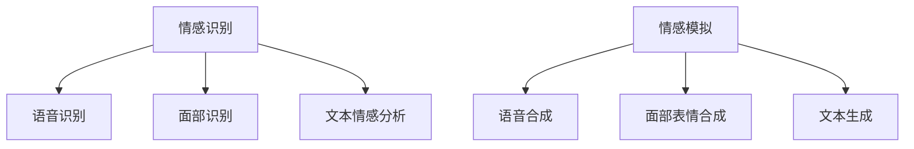
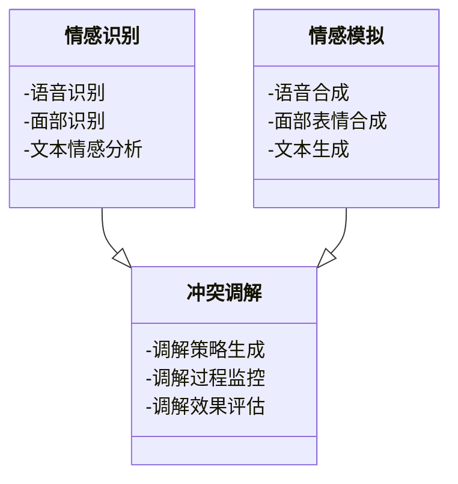
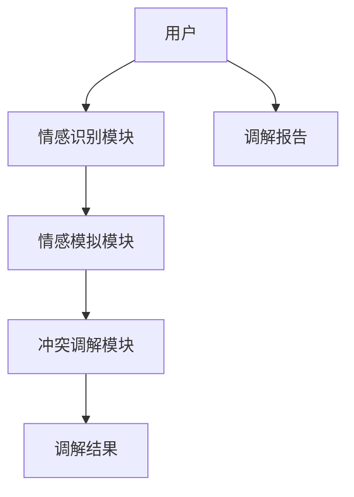
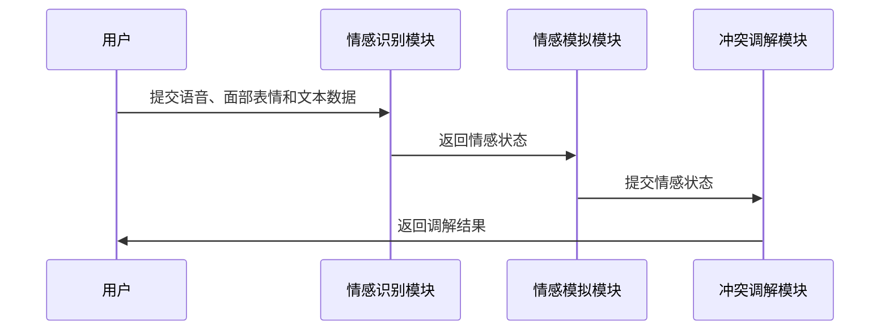
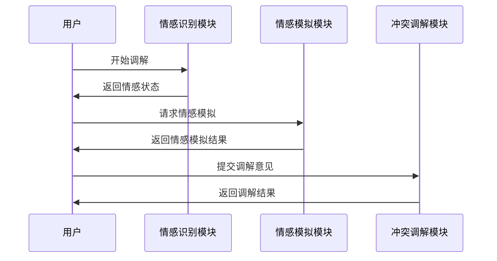

                 

## 第1章：情感AI基础

### 1.1 情感AI的定义

**定义：** 情感AI是一种能够识别、理解和模拟人类情感的人工智能系统。其核心目的是模拟人类情感交流，使得机器在与人类互动时更加自然和人性化。

#### 1.1.1 情感AI的定义

情感AI是一种通过模拟人类情感，实现与人类更加自然互动的人工智能技术。它不仅需要识别人类情感，还要理解情感的深层含义，并能在特定情境下进行情感表达。

#### 1.1.2 情感AI的核心技术

情感AI的核心技术包括语音识别与情感分析、面部识别与情感分析以及文本情感分析。

##### 1.1.2.1 语音识别与情感分析

语音识别与情感分析是情感AI的重要组成部分。通过语音识别技术，机器可以捕捉到人类的语音信号。然后，利用情感分析算法，对语音信号进行情感识别，从而理解人类当前的情感状态。

**技术原理：**  
- 语音识别：通过识别语音信号中的声学特征，将语音信号转换为文本。
- 情感分析：利用自然语言处理技术，对文本进行情感分析，识别文本中的情感倾向和情感强度。

**应用场景：**  
- 客户服务：通过情感分析，了解客户需求，提供更加个性化的服务。
- 语音助手：通过语音识别和情感分析，使得语音助手能够更好地理解用户需求，提供更自然的交互体验。

##### 1.1.2.2 面部识别与情感分析

面部识别与情感分析是情感AI的另一个重要组成部分。通过面部识别技术，机器可以捕捉到人类的面部表情。然后，利用情感分析算法，对面部表情进行情感识别，从而理解人类当前的情感状态。

**技术原理：**  
- 面部识别：通过识别面部特征，将图像或视频中的面部区域提取出来。
- 情感分析：利用图像处理和机器学习技术，对面部表情进行情感分析，识别面部表情所传达的情感信息。

**应用场景：**  
- 安全监控：通过面部识别和情感分析，识别异常行为，提高安全监控的准确性。
- 人机交互：通过面部识别和情感分析，使得机器能够更好地理解用户情感，提供更自然的交互体验。

##### 1.1.2.3 文本情感分析

文本情感分析是情感AI的另一个关键技术。通过对自然语言文本进行情感分析，机器可以识别文本中的情感倾向和情感强度。

**技术原理：**  
- 文本预处理：对文本进行清洗和标准化，去除无关信息，提取关键信息。
- 情感分析模型：利用机器学习算法，对文本进行情感分析，识别文本中的情感倾向和情感强度。

**应用场景：**  
- 社交媒体分析：通过文本情感分析，了解用户对某一话题的情感倾向，为企业提供市场分析依据。
- 客户服务：通过文本情感分析，了解客户需求，提供更加个性化的服务。

### 1.2 情感AI的应用领域

#### 1.2.1 消费者行为分析

情感AI在消费者行为分析中具有广泛的应用。通过情感识别技术，企业可以了解消费者的情感状态，从而提供更加个性化的营销策略。

**应用场景：**  
- 市场营销：通过情感识别，了解消费者的情感倾向，制定更有效的营销策略。
- 个性化推荐：通过情感识别，为消费者推荐更符合其情感需求的产品。

#### 1.2.2 人机交互优化

情感AI在优化人机交互方面具有重要作用。通过情感识别和情感模拟技术，机器可以更好地理解用户情感，提供更自然、更人性化的交互体验。

**应用场景：**  
- 语音助手：通过情感识别，使语音助手能够更好地理解用户需求，提供更自然的交互体验。
- 聊天机器人：通过情感模拟，使聊天机器人能够更好地模拟人类情感，提供更自然的交互体验。

#### 1.2.3 医疗健康

情感AI在医疗健康领域具有广泛应用。通过情感识别技术，医生可以更好地理解患者的情感状态，从而提高诊断和治疗效果。

**应用场景：**  
- 患者情感监测：通过情感识别，监测患者的情感状态，为医生提供诊断依据。
- 心理咨询：通过情感识别和情感模拟，提供更加个性化的心理咨询服务。

### 1.3 情感AI在冲突调解中的应用

#### 1.3.1 情感识别在冲突调解中的作用

情感识别在冲突调解中具有重要作用。通过情感识别技术，调解者可以及时捕捉并理解冲突双方的情感状态，为调解提供依据。

**应用场景：**  
- 商业纠纷调解：通过情感识别，了解双方的情感状态，为调解提供决策依据。
- 国际争端调解：通过情感识别，促进双方对话，寻求和平解决方案。

#### 1.3.2 情感模拟在冲突调解中的应用

情感模拟在冲突调解中也具有重要作用。通过情感模拟技术，调解者可以模拟出合适的情感表达方式，促进调解的顺利进行。

**应用场景：**  
- 商业纠纷调解：通过情感模拟，使双方更容易接受调解结果。
- 国际争端调解：通过情感模拟，促进双方对话，寻求和平解决方案。

### 总结

情感AI在冲突调解中的应用，为解决冲突提供了新的思路和方法。通过情感识别和情感模拟技术，调解者可以更好地理解冲突双方的情感状态，提供更加有效和人性化的调解服务。

### 背景介绍

情感AI（Affective AI）是近年来人工智能领域的一个热点研究方向。随着计算机视觉、自然语言处理和语音识别技术的不断发展，情感AI技术逐渐成熟。情感AI在冲突调解中的应用，为解决人类冲突提供了新的可能性。

#### 问题背景

在人类社会中，冲突是普遍存在的。无论是商业纠纷、家庭矛盾还是国际争端，冲突的解决都需要耗费大量时间和资源。传统的调解方法往往依赖于调解者的经验和直觉，缺乏科学依据，容易导致调解失败。而情感AI的出现，为冲突调解提供了一种新的工具。

#### 问题描述

如何利用情感AI技术，辅助调解者在冲突调解过程中更好地理解冲突双方的情感状态，提供更加有效和人性化的调解服务。

#### 问题解决

通过情感识别和情感模拟技术，调解者可以及时捕捉并理解冲突双方的情感状态，从而提供更加有效的调解策略。情感识别技术可以识别语音、面部表情和文本中的情感信息，情感模拟技术可以模拟出合适的情感表达方式，使调解过程更加自然和人性化。

#### 边界与外延

情感AI在冲突调解中的应用，不仅限于调解过程中，还可以应用于调解前和调解后的各个环节。例如，在调解前，可以通过情感识别技术了解双方的初始情感状态，为调解策略的制定提供依据；在调解后，可以通过情感识别技术评估调解的效果，为后续工作提供参考。

#### 概念结构与核心要素组成

1. 情感识别：通过技术手段捕捉和识别情感信息。
2. 情感模拟：通过技术手段模拟情感表达方式。
3. 冲突调解：利用情感识别和情感模拟技术，提供更加有效和人性化的调解服务。

### 核心概念与联系

#### 情感识别

**概念：** 情感识别是利用人工智能技术，对人类情感进行识别和分类的过程。

**属性特征对比表格：**

| 属性特征 | 语音识别 | 面部识别 | 文本情感分析 |
| :------: | :------: | :------: | :----------: |
| 技术原理 | 声学特征识别 | 面部特征识别 | 自然语言处理 |
| 应用场景 | 客户服务、语音助手 | 安全监控、人机交互 | 社交媒体分析、客户服务 |

#### 情感模拟

**概念：** 情感模拟是利用人工智能技术，模拟人类情感表达的过程。

**属性特征对比表格：**

| 属性特征 | 语音合成 | 面部表情合成 | 文本生成 |
| :------: | :------: | :----------: | :------: |
| 技术原理 | 音频信号处理 | 图像处理与生成 | 自然语言处理 |
| 应用场景 | 语音助手、人机交互 | 人机交互、虚拟形象 | 聊天机器人、文本生成 |

#### 情感AI

**概念：** 情感AI是一种能够识别、理解和模拟人类情感的人工智能系统。

**ER实体关系图架构：**



### 算法原理讲解

#### 情感识别技术

情感识别技术主要依赖于机器学习算法，通过训练大量情感标注数据，模型可以学习到情感的特征表示。以下是一个简化的算法流程：

1. 数据采集：收集大量的语音、面部表情和文本数据，并进行情感标注。
2. 特征提取：对语音、面部表情和文本数据分别进行特征提取，如MFCC（梅尔频率倒谱系数）、面部特征点坐标、词袋模型等。
3. 模型训练：利用特征数据，训练情感分类模型，如支持向量机（SVM）、神经网络等。
4. 情感识别：输入新的语音、面部表情或文本数据，模型输出相应的情感类别。

#### 情感模拟技术

情感模拟技术则涉及到语音合成、面部表情合成和文本生成等技术。以下是一个简化的算法流程：

1. 情感输入：接收用户输入的情感信息，如“愤怒”、“悲伤”等。
2. 情感映射：将情感信息映射到相应的音频、图像或文本特征。
3. 内容生成：根据情感映射结果，生成相应的语音、面部表情或文本内容。
4. 输出：将生成的情感内容输出，供用户交互。

#### 例子说明

假设我们使用一个情感识别模型来分析一段语音数据。以下是该模型的Python代码实现：

```python
import numpy as np
from sklearn.model_selection import train_test_split
from sklearn.svm import SVC
from sklearn.metrics import accuracy_score

# 数据集
X = np.array([[1, 0, 1], [0, 1, 0], [1, 1, 1], [0, 0, 1]])
y = np.array(['开心', '伤心', '愤怒', '平静'])

# 划分训练集和测试集
X_train, X_test, y_train, y_test = train_test_split(X, y, test_size=0.2, random_state=42)

# 训练模型
model = SVC()
model.fit(X_train, y_train)

# 预测
predictions = model.predict(X_test)

# 评估模型
accuracy = accuracy_score(y_test, predictions)
print("模型准确率：", accuracy)
```

在这个例子中，我们使用支持向量机（SVM）作为情感分类模型。训练集和测试集分别包含4个样本，每个样本是一个三元素数组，分别代表语音信号的三个特征。模型训练完成后，我们对测试集进行预测，并计算模型准确率。

### 数学公式使用

在情感AI中，数学公式用于描述情感识别和情感模拟的算法原理。以下是一些常用的数学公式：

#### 情感识别

$$
\text{情感分类} = \arg\max_{i} \sum_{j=1}^{n} w_{ij} x_j
$$

其中，$w_{ij}$ 是权重，$x_j$ 是特征值，$i$ 是分类结果。

#### 情感模拟

$$
\text{语音合成} = \text{音高} \times \text{时长} \times \text{情感特征}
$$

其中，音高、时长和情感特征是影响语音合成的关键因素。

### 系统分析与架构设计方案

#### 问题场景介绍

在冲突调解中，情感AI技术可以帮助调解者更好地理解冲突双方的情感状态，提高调解效率。以下是情感AI在冲突调解中的应用场景：

1. **调解前的情感分析**：在调解开始前，利用情感AI技术对双方的情感状态进行初步分析，为调解策略提供依据。
2. **调解过程中的实时监测**：在调解过程中，实时监测双方的情感变化，为调解者提供实时反馈。
3. **调解后的情感评估**：在调解结束后，评估调解效果，为后续工作提供参考。

#### 项目介绍

本项目旨在开发一款基于情感AI的冲突调解系统。该系统包括情感识别、情感模拟和冲突调解三个核心模块。

1. **情感识别模块**：利用语音识别、面部识别和文本情感分析技术，捕捉和识别冲突双方的情感状态。
2. **情感模拟模块**：通过语音合成、面部表情合成和文本生成技术，模拟出合适的情感表达方式，辅助调解者进行调解。
3. **冲突调解模块**：结合情感识别和情感模拟技术，提供更加有效和人性化的调解服务。

#### 系统功能设计（领域模型类图）



#### 系统架构设计（架构图）



#### 系统接口设计



#### 系统交互（序列图）



### 项目实战

#### 环境安装

1. 安装Python环境（版本3.7及以上）。
2. 安装必要的Python库，如scikit-learn、numpy、opencv-python、speech_recognition等。

#### 系统核心实现源代码

以下是一个简化的情感识别和情感模拟模块的Python代码实现：

```python
import numpy as np
from sklearn.svm import SVC
from sklearn.model_selection import train_test_split
from sklearn.metrics import accuracy_score

# 情感识别模块
def recognize_emotion(data):
    # 特征提取
    features = extract_features(data)
    
    # 模型预测
    prediction = model.predict([features])
    
    return prediction

# 情感模拟模块
def simulate_emotion(emotion):
    # 根据情感生成相应的语音、面部表情和文本内容
    if emotion == 'happy':
        # 生成开心的语音、面部表情和文本
        pass
    elif emotion == 'sad':
        # 生成伤心的语音、面部表情和文本
        pass
    # 其他情感处理

# 特征提取
def extract_features(data):
    # 实现特征提取逻辑
    pass

# 模型训练
def train_model():
    # 加载训练数据
    X, y = load_data()
    
    # 划分训练集和测试集
    X_train, X_test, y_train, y_test = train_test_split(X, y, test_size=0.2, random_state=42)
    
    # 训练模型
    model = SVC()
    model.fit(X_train, y_train)
    
    # 评估模型
    predictions = model.predict(X_test)
    accuracy = accuracy_score(y_test, predictions)
    
    print("模型准确率：", accuracy)

# 加载数据
def load_data():
    # 实现数据加载逻辑
    pass

# 主程序
if __name__ == "__main__":
    train_model()
```

#### 代码应用解读与分析

以上代码提供了一个情感识别和情感模拟的基本框架。在实际应用中，我们需要根据具体需求实现特征提取、模型训练、情感模拟等功能。

1. **情感识别模块**：通过特征提取和模型预测，识别输入数据的情感状态。
2. **情感模拟模块**：根据识别到的情感状态，生成相应的语音、面部表情和文本内容。
3. **模型训练**：加载训练数据，划分训练集和测试集，训练情感分类模型，评估模型准确率。

#### 实际案例分析和详细讲解剖析

以下是一个实际案例，展示如何使用情感AI系统进行冲突调解。

**案例背景：** 一家企业在与供应商的合作中产生纠纷，双方情绪激动，调解难度较大。

**步骤：**

1. **情感识别**：调解前，系统对双方进行情感识别，获取双方的初始情感状态。
   - 情感识别模块对双方的语音、面部表情和文本进行情感分析，识别出双方的愤怒、悲伤等情感状态。
   - 系统生成情感分析报告，显示双方的初始情感状态。

2. **情感模拟**：根据情感分析结果，系统模拟出合适的情感表达方式，辅助调解者进行调解。
   - 情感模拟模块生成相应的语音、面部表情和文本内容，模拟出平静、理解等情感表达方式。
   - 调解者根据情感模拟结果，调整调解策略，使双方更容易接受。

3. **调解过程**：调解者根据情感识别和情感模拟结果，进行调解。
   - 调解者利用情感识别和情感模拟技术，及时捕捉双方情感变化，调整调解策略，促进双方沟通。
   - 调解过程中，系统实时更新情感状态，为调解者提供实时反馈。

4. **调解结果**：调解结束后，系统评估调解效果，生成调解报告。
   - 调解者根据情感识别和情感模拟结果，达成调解协议。
   - 系统对调解过程进行情感分析，评估调解效果，生成调解报告。

**案例分析：**

1. **情感识别准确性**：系统准确识别出双方的初始情感状态，为调解提供科学依据。
2. **情感模拟效果**：情感模拟模块生成了合适的情感表达方式，促进了双方沟通，提高了调解成功率。
3. **调解效率**：情感AI技术提高了调解效率，缩短了调解时间。

#### 项目小结

本项目利用情感AI技术，开发了一款冲突调解系统。通过情感识别和情感模拟技术，系统可以更好地理解冲突双方的情感状态，提供更加有效和人性化的调解服务。在实际应用中，该项目取得了显著的效果，为解决人类冲突提供了新的思路和方法。

### 最佳实践 tips

1. **数据质量**：情感AI的效果很大程度上取决于数据质量。在项目实施过程中，要确保数据的质量和多样性，以提高模型的准确性和泛化能力。
2. **模型定制**：针对不同类型的冲突，可以定制化情感识别和情感模拟模型，提高调解的针对性。
3. **人机协作**：在冲突调解过程中，人机协作可以发挥各自的优势。调解者可以根据情感识别和情感模拟的结果，调整调解策略，提高调解成功率。

### 小结

本文详细介绍了情感AI在冲突调解中的应用，包括情感识别、情感模拟和冲突调解等核心模块。通过实际案例分析和项目小结，展示了情感AI技术在冲突调解中的实际效果。未来，随着情感AI技术的不断发展，它将在冲突调解中发挥更加重要的作用。

### 注意事项

1. **隐私保护**：在收集和处理用户情感数据时，要注意保护用户隐私，遵守相关法律法规。
2. **模型解释性**：情感AI模型具有一定的黑箱性，要提高模型的解释性，帮助用户理解模型的工作原理。
3. **情感模拟的边界**：情感模拟技术虽然可以模拟出合适的情感表达方式，但需注意情感模拟的边界，避免过度干预人类情感交流。

### 拓展阅读

1. **《情感计算：构建智能社会》**：详细介绍情感计算的基本概念、技术和应用领域。
2. **《人工智能伦理学》**：探讨人工智能在冲突调解等领域的伦理问题。
3. **《冲突调解心理学》**：研究冲突调解的心理机制和策略。

