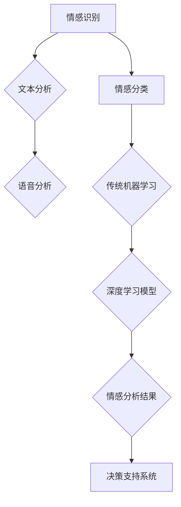

                 

### 情感AI的定义与发展

#### 1.1.1 情感AI的概念

情感AI，又称情感计算（Affective Computing），是指计算机模拟人类情感，理解、感知、处理和表达情感的能力。其核心是情感识别、情感生成和情感交互。情感识别是指通过分析语言、表情、声音等数据识别用户的情感状态；情感生成是指根据特定情境模拟情感反应；情感交互是指通过情感理解实现人与机器的有效沟通。

情感AI与自然语言处理（NLP）密切相关。自然语言处理主要关注文本数据的处理和理解，而情感AI则将情感因素纳入其中，使得机器能够更真实地模拟人类交流行为。例如，情感AI可以识别文本中的情感倾向，判断用户对某一话题的情感态度，从而提供更贴心的服务。

#### 1.1.2 情感AI的发展历程

1. **早期探索**：20世纪80年代，情感AI概念首次提出，主要集中在情感表达和情感理解方面。学者们开始尝试通过分析面部表情、语音语调等非语言因素来识别情感。

2. **技术进步**：随着计算机性能的提升和算法的发展，情感AI逐渐从理论走向应用。特别是深度学习技术的引入，使得情感识别的准确率和速度大大提高。

3. **当前研究热点**：当前，情感AI的研究主要集中在情感识别、情感生成和跨模态情感识别等方面。同时，随着物联网、大数据和5G技术的发展，情感AI的应用场景也在不断扩展。

4. **未来发展趋势**：未来，情感AI将在更多领域得到应用，如智能客服、虚拟助手、教育、医疗等。同时，随着技术的进一步成熟，情感AI的准确性和可靠性将不断提高，更好地服务于人类。

### 第2章：情感识别与分类

#### 2.1.1 情感识别原理

情感识别是情感AI的基础，主要分为基于文本的情感分析和基于语音的情感分析。

1. **基于文本的情感分析**：
   - **原理**：通过分析文本数据中的情感词汇、语法结构和上下文，识别出文本的情感倾向。
   - **方法**：传统方法包括基于规则的方法和基于统计的方法。现代方法主要采用深度学习模型，如卷积神经网络（CNN）和长短期记忆网络（LSTM）。

2. **基于语音的情感分析**：
   - **原理**：通过分析语音信号中的音调、音量、语速等特征，识别出用户的情感状态。
   - **方法**：常用的方法包括频谱分析、梅尔频率倒谱系数（MFCC）和隐藏马尔可夫模型（HMM）。

#### 2.1.2 情感分类方法

情感分类是将情感识别的结果进行分类的过程。常见的方法有：

1. **传统机器学习算法**：
   - **原理**：基于统计学习理论，通过训练数据集构建分类模型。
   - **算法**：包括支持向量机（SVM）、决策树、朴素贝叶斯等。

2. **深度学习模型**：
   - **原理**：通过多层神经网络模拟人类大脑的学习过程，自动提取特征并进行分类。
   - **模型**：包括卷积神经网络（CNN）、循环神经网络（RNN）、Transformer等。

#### 2.1.3 情感分类器的评估与优化

情感分类器的评估指标主要包括准确率、召回率、F1值等。准确率是指分类正确的样本数占总样本数的比例；召回率是指分类正确的正样本数占所有正样本数的比例；F1值是准确率和召回率的调和平均。

为了提高情感分类器的性能，可以采用以下方法：

1. **特征工程**：通过特征选择和特征转换，提取对分类任务更有效的特征。

2. **模型调优**：通过调整模型参数，如学习率、批量大小等，提高模型性能。

3. **数据增强**：通过增加训练数据量或生成合成数据，提高模型的泛化能力。

### 第3章：情感AI在危机管理中的应用

#### 3.1.1 危机管理的挑战

危机管理是指组织在面临突发危机事件时，采取的一系列应对措施，以减轻危机影响，确保组织运营的正常进行。危机管理的挑战主要包括：

1. **突发事件识别与预警**：及时识别潜在的危机事件，提前预警，以减少危机发生时的损失。

2. **情感分析在危机管理中的作用**：通过情感识别和分类技术，了解公众和员工的情感状态，为危机管理提供决策支持。

#### 3.1.2 情感AI在危机管理中的案例研究

1. **应对自然灾害**：
   - **案例**：在自然灾害如地震、洪水等发生时，情感AI可以帮助政府部门了解受灾群众的情感状态，为救援行动提供支持。
   - **应用**：通过社交媒体分析，识别受灾群众的情感倾向，判断其心理状态，为心理援助提供依据。

2. **处理社会冲突**：
   - **案例**：在社会冲突事件中，情感AI可以分析公众舆论，了解冲突双方的情感状态，为调解提供参考。
   - **应用**：通过媒体监测，识别社会热点事件，分析公众情感倾向，为政策制定提供支持。

3. **企业危机公关**：
   - **案例**：在企业面临公关危机时，情感AI可以帮助企业了解公众和员工的情感状态，制定有效的应对策略。
   - **应用**：通过社交媒体分析，识别企业品牌形象受损的情感因素，为企业制定危机公关方案提供支持。

### 第4章：情感智能的理论基础

#### 4.1.1 决策心理学

决策心理学研究人类在决策过程中的心理机制和行为特征。情感因素在决策过程中起着重要作用，包括：

1. **情感对决策质量的影响**：
   - **积极情感**：提高决策效率，增加创造性思维。
   - **消极情感**：降低决策效率，增加决策风险。

2. **情感与理性决策的平衡**：
   - **理性决策**：基于逻辑推理和分析，考虑各种可能性和风险。
   - **情感决策**：基于直觉和情感反应，迅速做出决策。

#### 4.1.2 情感计算与决策支持系统

情感计算是研究如何使计算机具备情感理解和处理能力的技术。决策支持系统（DSS）是一种基于数据分析的辅助决策工具，旨在提高决策的准确性和效率。情感计算与决策支持系统的结合，可以形成具有情感智能的决策支持系统。

1. **情感计算的基本原理**：
   - **情感识别**：通过情感分析技术，识别用户的情感状态。
   - **情感理解**：分析情感状态的原因和影响，为决策提供支持。

2. **决策支持系统的构建**：
   - **数据采集**：收集与决策相关的数据，包括情感数据。
   - **数据分析**：运用情感计算技术，分析情感数据，为决策提供支持。
   - **决策输出**：根据分析结果，提供决策建议或自动执行决策。

### 第5章：情感智能在危机决策中的应用

#### 5.1.1 情感分析在危机决策中的步骤

1. **数据采集与预处理**：
   - **数据来源**：社交媒体、新闻报道、调查问卷等。
   - **数据预处理**：数据清洗、去重、归一化等。

2. **情感分析模型的构建**：
   - **模型选择**：根据应用场景，选择合适的情感分析模型。
   - **模型训练**：使用训练数据集，训练情感分析模型。

3. **情感分析结果的应用**：
   - **情感趋势分析**：分析情感数据，了解公众情感趋势。
   - **决策支持**：根据情感分析结果，为决策提供参考。

#### 5.1.2 案例分析

1. **政府部门危机决策**：
   - **案例**：在疫情爆发初期，政府部门利用情感分析技术，了解公众对疫情防控政策的情感反应，调整政策。
   - **应用**：通过社交媒体分析，识别公众的情感倾向，为政策调整提供支持。

2. **企业危机管理中的情感智能应用**：
   - **案例**：一家知名企业在产品召回事件中，利用情感分析技术，了解消费者对事件的情感反应，制定应对策略。
   - **应用**：通过社交媒体分析，识别消费者的情感倾向，为危机公关提供支持。

### 第6章：情感智能系统设计

#### 6.1.1 情感智能系统的架构

1. **硬件选择**：
   - **CPU/GPU**：用于运行深度学习模型，提高计算性能。
   - **存储设备**：用于存储大量数据，支持快速访问。

2. **软件框架**：
   - **深度学习框架**：如TensorFlow、PyTorch等，用于构建和训练情感分析模型。
   - **数据分析工具**：如Pandas、NumPy等，用于数据预处理和分析。

#### 6.1.2 情感智能系统的实现

1. **情感分析模块的设计**：
   - **情感识别**：通过深度学习模型，识别文本或语音中的情感状态。
   - **情感分类**：将情感状态分类为正面、负面或其他类别。

2. **决策支持模块的实现**：
   - **数据采集**：从社交媒体、新闻报道等渠道收集数据。
   - **数据分析**：运用情感分析技术，分析数据，提取情感趋势。
   - **决策输出**：根据分析结果，提供决策建议。

### 第7章：情感智能系统评估与优化

#### 7.1.1 系统评估指标

1. **准确率**：指分类正确的样本数占总样本数的比例。

2. **召回率**：指分类正确的正样本数占所有正样本数的比例。

3. **F1值**：指准确率和召回率的调和平均。

#### 7.1.2 系统优化方法

1. **模型调整**：通过调整模型参数，提高模型性能。

2. **数据增强**：通过增加训练数据量或生成合成数据，提高模型的泛化能力。

3. **系统集成**：优化系统架构，提高系统稳定性和响应速度。

### 第8章：情感AI在危机管理中的挑战与机遇

#### 8.1.1 情感AI面临的挑战

1. **技术挑战**：情感识别和情感理解的准确性仍需提高，特别是在复杂情境下。

2. **法律与伦理问题**：情感AI的应用可能涉及隐私、歧视等问题，需要制定相应的法律法规和伦理标准。

#### 8.1.2 情感AI的未来发展方向

1. **应用场景拓展**：情感AI将在更多领域得到应用，如智慧城市、智慧医疗等。

2. **技术创新**：随着深度学习、大数据等技术的发展，情感AI的性能和适用性将不断提高。

### 第9章：情感AI在危机管理中的未来应用场景

#### 9.1.1 智能危机预警系统

1. **实时监控**：通过情感AI技术，实时监测社交媒体、新闻报道等渠道，预警潜在危机。

2. **自动化预警**：根据情感分析结果，自动触发预警信号，通知相关部门采取应对措施。

#### 9.1.2 跨界融合

1. **情感AI与物联网**：将情感AI技术应用于物联网设备，实现智能化的情感识别和交互。

2. **情感AI与大数据分析**：结合大数据分析技术，挖掘情感数据中的价值，为决策提供支持。

### 附录A：情感AI相关资源

1. **数据集**：包括情感文本数据集、情感语音数据集等。

2. **开源代码**：包括情感分析模型代码、数据预处理工具等。

3. **相关论文**：介绍情感AI的最新研究进展和应用案例。

### 文章小结

情感AI在危机管理中具有巨大的应用潜力，能够为决策提供情感支持，提高危机应对效率。然而，情感AI仍面临诸多挑战，需要进一步研究和优化。未来，随着技术的不断发展，情感AI将在危机管理中发挥更重要的作用。通过本文的探讨，我们希望能为读者提供对情感AI在危机管理中应用的深入理解和思考。

### 作者信息

作者：AI天才研究院/AI Genius Institute & 禅与计算机程序设计艺术 /Zen And The Art of Computer Programming

---

**Mermaid 流程图：**



**Python 源代码示例：**

```python
import numpy as np
from sklearn.feature_extraction.text import TfidfVectorizer
from sklearn.naive_bayes import MultinomialNB
from sklearn.pipeline import make_pipeline

# 示例数据
data = [
    "今天天气很好，我很高兴。",
    "这是一个糟糕的日子，我感到沮丧。",
    "我喜欢这个电影，剧情很精彩。",
    "我不喜欢这个食物，太难吃了。"
]

# 标签
labels = ["正面", "负面", "正面", "负面"]

# 构建模型
model = make_pipeline(TfidfVectorizer(), MultinomialNB())

# 训练模型
model.fit(data, labels)

# 预测
test_data = ["今天的新闻让我感到不安。"]
prediction = model.predict(test_data)

print(prediction)
```

**数学模型与公式：**

$$
\text{准确率} = \frac{\text{正确预测的数量}}{\text{总预测数量}}
$$

$$
\text{召回率} = \frac{\text{正确预测的数量}}{\text{实际为正类的数量}}
$$

---

本文从情感AI的定义与发展、情感识别与分类、情感AI在危机管理中的应用、情感智能的理论基础和决策支持、情感智能系统设计、系统评估与优化以及情感AI在危机管理中的未来展望等多个方面，详细探讨了情感AI在危机管理中的角色。通过本文的研究，我们可以看到情感AI在危机管理中具有巨大的应用潜力，能够为决策提供情感支持，提高危机应对效率。

#### 第一部分：情感AI概述

**第1章：情感AI的定义与发展**

情感AI，也被称为情感计算，是指计算机模拟人类情感，理解、感知、处理和表达情感的能力。这一领域的兴起源于20世纪80年代，由计算机科学家约翰·霍普金斯（John M. Davis）和罗纳德·里奇（Ronald M. Lee）首次提出。情感AI的核心在于情感识别、情感生成和情感交互。

**1.1.1 情感AI的概念**

情感AI的定义可以从以下几个方面理解：

1. **情感识别**：这是情感AI的基础，通过分析语言、面部表情、声音等数据，识别用户的情感状态。
2. **情感生成**：计算机模拟情感反应，例如，在语音合成系统中，可以模拟出高兴、愤怒、悲伤等情感。
3. **情感交互**：通过情感理解实现人与机器的有效沟通，如智能客服中的情感对话。

情感AI与自然语言处理（NLP）有着紧密的联系。NLP主要处理语言数据，而情感AI则进一步加入了情感因素，使得机器能够更贴近人类交流的复杂性。

**1.1.2 情感AI的发展历程**

1. **早期探索**：20世纪80年代，情感AI的概念首次被提出，主要集中于情感表达和情感理解的研究。此时，研究者们开始尝试通过分析面部表情、语音语调等非语言因素来识别情感。
   
2. **技术进步**：随着计算机性能的提升和算法的发展，情感AI从理论研究逐步走向实际应用。特别是深度学习技术的引入，使得情感识别的准确率和速度大幅提高。

3. **当前研究热点**：目前，情感AI的研究主要集中在以下几个方面：
   - **情感识别**：如何更精确地识别文本、语音和图像中的情感。
   - **情感生成**：如何通过语音合成、文本生成等技术模拟情感。
   - **跨模态情感识别**：如何结合文本、语音、图像等多种模态进行情感识别。

4. **未来发展趋势**：随着物联网、大数据和5G技术的不断发展，情感AI的应用场景将进一步扩展。未来，情感AI将在更多领域得到应用，如智慧城市、智能医疗、教育等。同时，随着技术的进一步成熟，情感AI的准确性和可靠性将不断提高，更好地服务于人类社会。

**第2章：情感识别与分类**

**2.1.1 情感识别原理**

情感识别是情感AI的核心任务，其主要原理可以分为基于文本的情感分析和基于语音的情感分析。

**基于文本的情感分析**：

1. **原理**：通过分析文本数据中的情感词汇、语法结构和上下文，识别出文本的情感倾向。
2. **方法**：传统方法包括基于规则的方法和基于统计的方法。现代方法主要采用深度学习模型，如卷积神经网络（CNN）和长短期记忆网络（LSTM）。

**基于语音的情感分析**：

1. **原理**：通过分析语音信号中的音调、音量、语速等特征，识别出用户的情感状态。
2. **方法**：常用的方法包括频谱分析、梅尔频率倒谱系数（MFCC）和隐藏马尔可夫模型（HMM）。

**2.1.2 情感分类方法**

情感分类是将情感识别的结果进行分类的过程。常见的方法有：

**传统机器学习算法**：

1. **原理**：基于统计学习理论，通过训练数据集构建分类模型。
2. **算法**：包括支持向量机（SVM）、决策树、朴素贝叶斯等。

**深度学习模型**：

1. **原理**：通过多层神经网络模拟人类大脑的学习过程，自动提取特征并进行分类。
2. **模型**：包括卷积神经网络（CNN）、循环神经网络（RNN）、Transformer等。

**2.1.3 情感分类器的评估与优化**

情感分类器的评估指标主要包括准确率、召回率、F1值等。

1. **准确率**：指分类正确的样本数占总样本数的比例。
2. **召回率**：指分类正确的正样本数占所有正样本数的比例。
3. **F1值**：指准确率和召回率的调和平均。

为了提高情感分类器的性能，可以采用以下方法：

1. **特征工程**：通过特征选择和特征转换，提取对分类任务更有效的特征。
2. **模型调优**：通过调整模型参数，提高模型性能。
3. **数据增强**：通过增加训练数据量或生成合成数据，提高模型的泛化能力。

**第3章：情感AI在危机管理中的应用**

**3.1.1 危机管理的挑战**

危机管理是指组织在面临突发危机事件时，采取的一系列应对措施，以减轻危机影响，确保组织运营的正常进行。危机管理的挑战主要包括：

1. **突发事件识别与预警**：及时识别潜在的危机事件，提前预警，以减少危机发生时的损失。
2. **情感分析在危机管理中的作用**：通过情感识别和分类技术，了解公众和员工的情感状态，为危机管理提供决策支持。

**3.1.2 情感AI在危机管理中的案例研究**

1. **应对自然灾害**：

   - **案例**：在自然灾害如地震、洪水等发生时，情感AI可以帮助政府部门了解受灾群众的情感状态，为救援行动提供支持。
   - **应用**：通过社交媒体分析，识别受灾群众的情感倾向，判断其心理状态，为心理援助提供依据。

2. **处理社会冲突**：

   - **案例**：在社会冲突事件中，情感AI可以分析公众舆论，了解冲突双方的情感状态，为调解提供参考。
   - **应用**：通过媒体监测，识别社会热点事件，分析公众情感倾向，为政策制定提供支持。

3. **企业危机公关**：

   - **案例**：在企业面临公关危机时，情感AI可以帮助企业了解公众和员工的情感状态，制定有效的应对策略。
   - **应用**：通过社交媒体分析，识别企业品牌形象受损的情感因素，为企业制定危机公关方案提供支持。

### 第4章：情感智能的理论基础

#### 4.1.1 决策心理学

决策心理学是研究个体和群体在决策过程中的心理机制和行为特征的科学。在危机管理中，决策心理学的重要性不言而喻。危机管理往往需要快速而准确的决策，而情感因素在这一过程中起着至关重要的作用。

**决策过程中的情感因素**

1. **情感与理性决策的平衡**：
   - **理性决策**：基于逻辑推理和分析，考虑各种可能性和风险。
   - **情感决策**：基于直觉和情感反应，迅速做出决策。
   - 在危机管理中，理性决策和情感决策往往是相互交织的。快速而准确的决策需要理性分析和情感反应的结合。

2. **情感对决策质量的影响**：
   - **积极情感**：提高决策效率，增加创造性思维。
   - **消极情感**：降低决策效率，增加决策风险。
   - 例如，在处理突发事件时，领导者的乐观情感可能会提高团队的士气和决策效率，而恐惧或焦虑则可能导致决策犹豫不决，甚至出现错误。

**情感对决策质量的影响**

1. **积极情感的影响**：
   - **提高决策效率**：积极情感可以降低决策过程中的犹豫和拖延，使决策者更迅速地做出决策。
   - **增加创造性思维**：积极情感可以激发决策者的创造力，促进创新性解决方案的提出。

2. **消极情感的影响**：
   - **降低决策效率**：消极情感可能导致决策者过于担忧和焦虑，从而影响决策的效率。
   - **增加决策风险**：消极情感可能导致决策者过于保守或悲观，从而忽略潜在的机会，增加决策风险。

**4.1.2 情感计算与决策支持系统**

情感计算是研究如何使计算机具备情感理解和处理能力的技术。而决策支持系统（DSS）是一种基于数据分析的辅助决策工具，旨在提高决策的准确性和效率。将情感计算与决策支持系统相结合，可以形成具有情感智能的决策支持系统。

**情感计算的基本原理**

1. **情感识别**：通过情感分析技术，识别用户的情感状态。
2. **情感理解**：分析情感状态的原因和影响，为决策提供支持。

**决策支持系统的构建**

1. **数据采集**：收集与决策相关的数据，包括情感数据。
2. **数据分析**：运用情感计算技术，分析情感数据，提取有价值的信息。
3. **决策输出**：根据分析结果，提供决策建议或自动执行决策。

通过情感计算与决策支持系统的结合，决策者可以更全面地了解危机情境中的情感因素，从而做出更加准确和高效的决策。

### 第5章：情感智能在危机决策中的应用

#### 5.1.1 情感分析在危机决策中的步骤

情感智能在危机决策中的应用，需要经过一系列科学的步骤，以确保决策的准确性和有效性。以下是情感分析在危机决策中的应用步骤：

**1. 数据采集与预处理**

- **数据来源**：危机决策所需的数据可以从多种渠道获取，包括社交媒体、新闻报道、调查问卷、传感器数据等。
- **数据预处理**：对采集到的数据进行分析前的预处理，包括去重、去噪、数据清洗、归一化等步骤，以确保数据的准确性和一致性。

**2. 情感分析模型的构建**

- **模型选择**：根据具体应用场景，选择合适的情感分析模型。传统机器学习算法如支持向量机（SVM）、朴素贝叶斯等，以及深度学习模型如卷积神经网络（CNN）、长短期记忆网络（LSTM）等，都是常见的选择。
- **模型训练**：使用预处理后的数据集，对选定的情感分析模型进行训练，使其能够识别和处理不同类型的情感数据。

**3. 情感分析结果的应用**

- **情感趋势分析**：通过对分析结果进行统计和可视化，了解公众和员工的情感趋势，识别潜在的危机信号。
- **决策支持**：将情感分析结果结合到危机决策过程中，为决策者提供基于情感的决策支持。例如，在处理社会冲突时，了解公众的情感倾向，可以为调解和冲突解决提供依据；在自然灾害应对中，了解受灾群众的心理状态，可以为救援和心理援助提供指导。

**5.1.2 案例分析**

**政府部门的危机决策**

- **案例背景**：在某次大规模自然灾害发生后，政府部门需要迅速采取行动，以减轻灾害影响。
- **情感分析应用**：
  - 通过社交媒体分析，了解公众对灾害的情感反应，识别出公众的主要情绪状态（如恐慌、焦虑、感激等）。
  - 分析新闻报道和政府公告，了解媒体和公众对政府应对措施的反馈。
  - 结合情感分析结果，政府可以及时调整救援计划，增加公众信任，提高危机应对效果。

**企业危机管理中的情感智能应用**

- **案例背景**：某知名企业在产品质量问题上遭遇重大危机，需要迅速应对。
- **情感分析应用**：
  - 通过社交媒体监测，了解消费者对企业产品的情感反应，识别出消费者对产品问题的不满情绪。
  - 分析客户投诉数据，了解具体问题所在，评估对企业品牌形象的影响。
  - 结合情感分析结果，企业可以制定有效的危机公关策略，通过社交媒体和新闻发布会等渠道，积极回应消费者关切，减少负面影响。

**案例分析**提供了情感智能在危机决策中的应用实例，展示了情感分析如何帮助决策者更全面地了解危机情境，提高决策的准确性和有效性。

### 第6章：情感智能系统设计

情感智能系统设计的目标是构建一个能够准确识别、理解并利用情感信息的系统，以支持危机管理中的决策制定。以下是情感智能系统的设计步骤和关键组成部分。

#### 6.1.1 情感智能系统的架构

情感智能系统的架构设计需要考虑硬件和软件两个方面。

**硬件选择**

1. **计算能力**：选择具备强大计算能力的硬件，如高性能CPU或GPU，用于运行深度学习模型和大数据分析。
2. **存储设备**：选择大容量、高速的存储设备，用于存储大量的情感数据和分析结果。

**软件框架**

1. **深度学习框架**：选择成熟的深度学习框架，如TensorFlow或PyTorch，用于构建和训练情感分析模型。
2. **数据分析工具**：使用Python的Pandas、NumPy等数据分析库，进行数据预处理和分析。

**6.1.2 情感智能系统的实现**

情感智能系统的实现包括情感分析模块的设计和决策支持模块的实现。

**情感分析模块的设计**

1. **情感识别**：
   - **文本情感分析**：通过自然语言处理技术，如词向量表示、情感词典、卷积神经网络（CNN）等，对文本数据进行情感识别。
   - **语音情感分析**：通过频谱分析、梅尔频率倒谱系数（MFCC）、循环神经网络（RNN）等技术，对语音信号进行情感识别。
   
2. **情感分类**：
   - **情感分类器**：使用支持向量机（SVM）、朴素贝叶斯、长短期记忆网络（LSTM）等算法，对识别出的情感进行分类。
   - **多标签分类**：在某些应用场景中，一个数据点可能包含多个情感标签，需要实现多标签分类算法。

**决策支持模块的实现**

1. **数据采集**：
   - **实时数据采集**：通过API接口、社交媒体爬虫等技术，实时采集与危机相关的数据。
   - **历史数据整合**：整合历史数据，为情感分析和趋势预测提供基础。

2. **数据分析**：
   - **情感趋势分析**：使用时间序列分析、机器学习预测模型等技术，分析情感数据的趋势变化。
   - **决策支持算法**：结合情感分析和大数据分析，为决策者提供基于情感的决策建议。

3. **决策输出**：
   - **可视化展示**：通过图表、仪表盘等方式，直观展示情感分析和决策结果。
   - **自动执行决策**：在安全策略和预案的基础上，自动执行决策，如调整资源分配、发布预警等。

通过上述设计，情感智能系统可以实现对危机管理中情感数据的全面分析，为决策者提供基于情感的决策支持，提高危机应对的效率和准确性。

### 第7章：情感智能系统评估与优化

情感智能系统在实际应用中，需要不断地进行评估与优化，以确保其性能和可靠性。以下是情感智能系统的评估与优化方法。

#### 7.1.1 系统评估指标

情感智能系统的评估指标主要包括以下几个方面：

1. **准确率**：指分类正确的样本数占总样本数的比例。准确率是评估情感分类器性能的基本指标。
   
2. **召回率**：指分类正确的正样本数占所有正样本数的比例。召回率是评估模型是否能够正确识别所有正样本的能力。

3. **F1值**：准确率和召回率的调和平均，是综合考虑分类正确率和召回率的综合评价指标。

4. **情感趋势预测准确率**：在需要情感趋势预测的系统中，评估模型对情感趋势预测的准确性。

#### 7.1.2 系统优化方法

为了提高情感智能系统的性能和可靠性，可以采用以下优化方法：

1. **模型调整**：

   - **超参数调优**：通过网格搜索、随机搜索等方法，调整模型参数（如学习率、批量大小等），寻找最优参数组合。
   - **集成学习**：使用集成学习方法（如Bagging、Boosting等），结合多个模型的优点，提高整体性能。

2. **数据增强**：

   - **数据扩充**：通过数据扩充技术，如旋转、翻转、缩放等，增加训练数据量，提高模型泛化能力。
   - **生成对抗网络（GAN）**：使用生成对抗网络生成更多的训练数据，特别是对于数据量较少的情感类别。

3. **系统集成**：

   - **系统优化**：通过优化系统架构，提高系统的响应速度和处理能力，如使用分布式计算、缓存机制等。
   - **模块化设计**：将系统划分为多个模块，每个模块负责不同的功能，便于维护和扩展。

通过上述评估与优化方法，情感智能系统可以在实际应用中持续改进，提高危机管理中的决策支持能力。

### 第8章：情感AI在危机管理中的挑战与机遇

#### 8.1.1 情感AI面临的挑战

情感AI在危机管理中的应用虽然前景广阔，但同时也面临着诸多挑战：

1. **技术挑战**：

   - **情感识别的准确性**：在复杂、多变的情境下，情感识别的准确性仍然较低，特别是在情感表达含糊、情感叠加或情感微表情识别方面。
   - **情感理解的深度**：当前的情感计算技术还难以深入理解情感背后的心理机制和复杂情感交互。
   - **实时性**：在危机管理中，需要情感分析能够实时响应，但高实时性的情感识别和分析技术尚需进一步提升。

2. **法律与伦理问题**：

   - **隐私保护**：情感AI在收集和处理用户情感数据时，可能涉及个人隐私，如何保护用户隐私是重要的法律和伦理问题。
   - **数据偏见**：情感分析模型可能会因为训练数据的偏见而导致歧视性决策，这需要严格的数据清洗和模型校准。
   - **责任归属**：在情感AI参与决策时，如果出现错误决策，如何确定责任归属，这是一个法律和伦理上的难题。

#### 8.1.2 情感AI的未来发展方向

面对挑战，情感AI的未来发展方向主要包括：

1. **技术创新**：

   - **深度学习与多模态融合**：通过深度学习技术，进一步提高情感识别的准确性和实时性。同时，结合多模态数据（如文本、语音、图像等）进行情感分析，实现更全面和深入的情感理解。
   - **生成对抗网络（GAN）**：利用GAN生成更多样化的训练数据，增强模型的泛化能力和对边缘情感的识别。
   - **迁移学习和联邦学习**：通过迁移学习和联邦学习，提高情感AI在不同应用场景下的适应能力和数据隐私保护。

2. **应用场景拓展**：

   - **智慧城市与应急管理**：将情感AI应用于智慧城市的应急管理中，如实时监控城市舆情，提供灾害预警和救援决策支持。
   - **医疗与健康护理**：利用情感AI分析患者情绪，为心理治疗和健康管理提供支持。
   - **企业危机管理**：为企业提供基于情感分析的危机预警和应对策略，提高危机管理效率。

3. **法律与伦理规范**：

   - **隐私保护法规**：制定和完善隐私保护法规，明确情感AI数据处理过程中的隐私保护要求。
   - **伦理准则**：建立情感AI伦理准则，确保情感AI的应用不会造成歧视、侵犯隐私或伦理冲突。
   - **透明性和可解释性**：提高情感AI系统的透明性和可解释性，使其决策过程更加公正和可信。

通过技术创新和应用场景拓展，结合法律与伦理规范，情感AI将在危机管理中发挥更大的作用，为人类社会提供更加智能和高效的决策支持。

### 第9章：情感AI在危机管理中的未来应用场景

情感AI在危机管理中的未来应用场景将更加广泛和深入，其技术进步和应用创新将为危机预警、应对和恢复带来革命性的变化。

#### 9.1.1 智能危机预警系统

智能危机预警系统是情感AI在危机管理中的一项重要应用。通过实时监控社交媒体、新闻报道、在线论坛等多种数据源，情感AI可以快速识别和解读公众的情感变化。具体应用场景包括：

1. **实时情感监测**：系统可以实时分析网络上的情感倾向，识别出潜在的危机信号，如大规模的负面情绪波动、极端言论的增多等，为危机预警提供数据支持。
2. **自动化预警触发**：当情感分析系统检测到特定情感阈值时，可以自动触发预警信号，通知相关部门采取行动，如增加安全警力、发布紧急通知等。
3. **多维度数据融合**：将情感AI与其他技术如物联网、大数据分析相结合，实现多维度数据的综合分析，提高预警的准确性和及时性。

#### 9.1.2 跨界融合

情感AI的跨界融合将使其在危机管理中发挥更加综合和高效的作用。以下是一些跨界融合的应用场景：

1. **情感AI与物联网**：
   - **智能设备情感分析**：通过物联网设备收集的数据，如摄像头、传感器等，情感AI可以分析环境情感状态，提供更加个性化的服务和应急响应。
   - **智能安防系统**：结合情感AI，智能安防系统能够识别异常行为和情感反应，提前预警潜在的安全隐患。

2. **情感AI与大数据分析**：
   - **舆情分析**：通过大数据分析技术，情感AI可以处理和分析大量的社会媒体数据，识别出关键的情感热点，为决策者提供全面的数据支持。
   - **行为预测**：结合情感AI和行为分析，可以预测人群的行为趋势，提前采取干预措施，防止危机的发生。

通过智能危机预警系统和跨界融合的应用，情感AI将大大提升危机管理的效率和精准度，为人类社会的安全与稳定提供强有力的技术支持。

### 附录A：情感AI相关资源

在情感AI领域，有许多重要的资源和工具可以帮助研究人员和开发者深入学习和应用这一技术。以下是情感AI相关资源的详细介绍。

#### 数据集

数据集是进行情感分析和研究的基础，以下是一些常用的情感数据集：

1. **IMDB电影评论数据集**：这是一个包含电影评论的广泛数据集，分为正面和负面评论，常用于情感分类的研究。
2. **MSRC2018数据集**：这是一个包含表情、语音和文本的多模态情感数据集，适合进行跨模态情感识别研究。
3. **TREC情感分析数据集**：这是一个包含社交媒体文本的情感数据集，用于情感极性分析和情感趋势研究。

#### 开源代码

开源代码为情感AI的研究和应用提供了丰富的资源，以下是一些著名的开源项目和代码库：

1. **DeepSpeech**：由百度开源的深度学习语音识别框架，支持情感语音分析。
2. **TextClassifier**：一个基于TensorFlow的情感分类器，适用于文本情感分析。
3. **pyAudioAnalysis**：一个多功能的音频分析库，包括情感识别功能。

#### 相关论文

情感AI是一个活跃的研究领域，以下是一些重要的相关论文，供读者进一步阅读：

1. **“Affectiva’s Emotion AI”**：介绍了Affectiva公司开发的情感识别技术及其应用。
2. **“Emotion Recognition Using Multimodal Fusion of Text and Audio”**：探讨文本和音频多模态融合的情感识别方法。
3. **“Sentiment Analysis with Deep Learning”**：介绍深度学习在情感分析中的应用。

通过这些资源，读者可以更深入地了解情感AI的技术原理和应用场景，为研究和实践提供有力支持。

