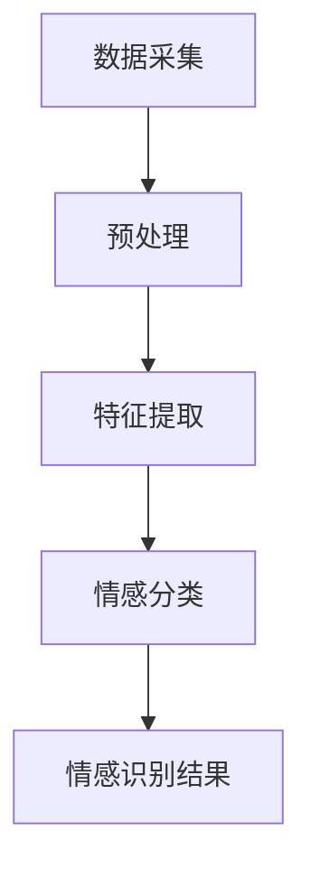
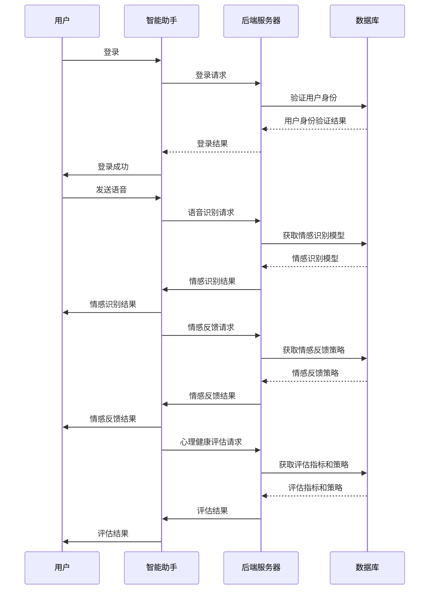

                 


### 情感AI在家庭结构中的角色：新型家庭关系

#### 关键词：情感AI、家庭结构、新型家庭关系、AI技术、家庭心理健康

#### 摘要：
本文旨在探讨情感人工智能（AI）在家庭结构中的角色，分析其在新型家庭关系中的影响。随着科技的进步，情感AI已成为现代家庭生活的重要组成部分，它不仅在日常生活中提供便利，还在情感沟通、心理健康和家庭教育等方面发挥着重要作用。本文将逐步分析情感AI的发展历程、应用场景、家庭结构变化以及未来趋势，探讨这一技术如何重塑家庭关系。

---

## 第一部分：情感AI的基础知识

### 第1章：情感AI概述

#### 1.1 情感AI的定义
情感人工智能，简称情感AI，是指能够识别、理解和模拟人类情感的人工智能系统。与传统AI不同，情感AI不仅能够处理结构化数据，还能够分析人类语言和表情，理解情感状态，并进行相应的情感反馈。

#### 1.2 情感AI的发展历程
情感AI的发展可以追溯到20世纪90年代，当时研究人员开始尝试通过机器学习算法来模拟情感。随着深度学习和自然语言处理技术的发展，情感AI逐渐成熟，能够实现更高级别的情感识别和交互。

#### 1.3 情感AI的核心技术
情感AI的核心技术主要包括自然语言处理（NLP）、计算机视觉和机器学习。NLP使AI能够理解和生成自然语言，计算机视觉帮助AI识别人的面部表情和身体语言，而机器学习算法则用于从数据中学习并预测情感状态。

---

### 第2章：家庭结构的变化与情感AI的兴起

#### 2.1 家庭结构的变化趋势
家庭结构在现代社会中发生了显著变化。传统大家庭逐渐被小型核心家庭所取代，单身、丁克（无子女夫妇）等新型家庭形式日益增多。同时，家庭成员之间的沟通和互动方式也因科技的发展而发生了根本性改变。

#### 2.2 情感AI在家庭中的应用场景
情感AI在家庭中的应用场景非常广泛，包括智能音箱、智能助手、智能家居系统等。这些应用不仅提高了家庭生活的便利性，还能够在情感层面提供支持和陪伴。

#### 2.3 情感AI对家庭结构的潜在影响
情感AI的兴起对家庭结构产生了深远影响。它不仅改变了家庭成员之间的互动方式，还可能影响家庭决策、情感支持和亲子关系。

---

## 第二部分：情感AI在家庭中的具体应用

### 第3章：情感AI在家庭中的具体应用

#### 3.1 情感AI在家庭关系中的角色
情感AI在家庭关系中扮演着多种角色，包括情感倾听者、沟通协调者和情感支持者。它能帮助家庭成员更好地理解和满足彼此的情感需求。

#### 3.2 情感AI在家庭沟通中的运用
情感AI可以通过语音识别和自然语言生成技术，帮助家庭成员进行更有效的沟通。例如，智能助手可以识别家庭成员的情绪变化，提供适当的建议和安慰。

#### 3.3 情感AI在家庭教育和亲子关系中的应用
情感AI在家庭教育和亲子关系中具有重要作用。它可以监控孩子的学习状态，提供个性化的学习建议，同时帮助家长更好地理解孩子的情感需求。

---

### 第4章：情感AI与家庭心理健康的互动

#### 4.1 情感AI在家庭心理健康评估中的作用
情感AI可以通过分析家庭成员的语言和情绪状态，评估他们的心理健康水平。例如，智能助手可以通过日常对话了解家庭成员的情绪状态，提供相应的心理健康建议。

#### 4.2 情感AI在家庭心理健康干预中的应用
情感AI可以在家庭心理健康干预中发挥重要作用。例如，智能助手可以通过提供心理疏导、情感支持和健康建议，帮助家庭成员缓解压力和焦虑。

#### 4.3 情感AI对家庭心理健康的潜在影响
情感AI对家庭心理健康有着积极的潜在影响。它能够提高家庭成员的情感沟通能力，促进心理健康，增强家庭凝聚力。

---

### 第5章：情感AI在家庭生活中的创新

#### 5.1 情感AI在智能家居中的应用
情感AI在智能家居中的应用为家庭生活带来了前所未有的便利和舒适。例如，智能音箱可以根据家庭成员的喜好调整音乐播放，智能灯泡可以根据家庭成员的情绪变化调整亮度和颜色。

#### 5.2 情感AI在家庭娱乐和休闲中的应用
情感AI在家庭娱乐和休闲中的应用使得家庭成员之间的互动更加有趣和丰富。例如，智能电视可以根据家庭成员的兴趣推荐内容，游戏机可以根据玩家的情绪调整难度。

#### 5.3 情感AI在家庭安全防护中的应用
情感AI在家庭安全防护中的应用为家庭提供了更高的安全保障。例如，智能门锁可以通过面部识别技术确保家庭成员的安全，智能监控系统能够识别异常行为并实时报警。

---

### 第6章：情感AI在家庭结构中的挑战与伦理问题

#### 6.1 情感AI的隐私保护问题
情感AI在收集和处理家庭成员数据时，可能涉及到隐私保护问题。如何确保家庭成员的数据安全，防止数据泄露，是情感AI面临的重要挑战。

#### 6.2 情感AI的伦理道德问题
情感AI在家庭中的应用引发了伦理道德问题。如何确保情感AI的决策公正、透明，避免对家庭成员产生负面影响，是伦理学家和技术人员共同关注的议题。

#### 6.3 情感AI在家庭中的责任界定
在家庭中，如何界定情感AI和家庭成员之间的责任，如何确保情感AI在家庭决策中发挥积极作用，是需要解决的问题。

---

### 第7章：情感AI在家庭结构中的未来发展

#### 7.1 情感AI技术的未来发展趋势
随着技术的不断进步，情感AI在未来将继续快速发展。未来，情感AI将能够更准确地识别和理解人类的情感，提供更加个性化的服务。

#### 7.2 情感AI在家庭中的潜在影响
情感AI在家庭中的潜在影响将是深远的。它将改变家庭结构，提高家庭成员的情感沟通能力，促进心理健康，增强家庭凝聚力。

#### 7.3 情感AI在家庭结构中的未来角色
在未来，情感AI将成为家庭中不可或缺的一部分。它将不仅提供便利和舒适，还将成为家庭成员的情感伙伴和心理健康顾问。

---

## 附录

### 附录A：情感AI技术参考资料
在此附录中，我们将提供一系列情感AI技术的参考资料，包括学术文章、技术报告和行业指南，以供进一步学习和研究。

### 附录B：情感AI在家庭中的应用案例
在此附录中，我们将分享一些情感AI在家庭中的应用案例，包括实际的产品和服务，以及这些应用如何改善家庭生活质量。

### 附录C：情感AI伦理规范指南
在此附录中，我们将介绍一些情感AI伦理规范，旨在指导情感AI在家庭中的应用，确保其发展符合伦理道德标准。

---

### 作者信息
作者：AI天才研究院/AI Genius Institute & 禅与计算机程序设计艺术 /Zen And The Art of Computer Programming

---

## 完整性要求
为确保文章内容的完整性，我们将对每个章节进行详细阐述，包括背景介绍、核心概念与联系、算法原理讲解、系统分析与架构设计方案、项目实战、最佳实践 tips 以及小结等内容。

---

### 背景介绍
家庭是社会的基石，而家庭结构的变化是社会发展的一个重要方面。随着科技的进步，特别是人工智能（AI）技术的快速发展，家庭生活正在发生深刻变革。情感人工智能，作为一种新兴的AI技术，正逐渐成为家庭生活的一部分。本文将探讨情感AI在家庭结构中的角色，分析其对新型家庭关系的影响。

#### 核心概念术语说明
- **情感AI**：能够识别、理解和模拟人类情感的人工智能系统。
- **家庭结构**：家庭成员的组成和关系模式。
- **新型家庭关系**：在科技背景下，家庭内部关系的变化和调整。

#### 问题背景
传统家庭结构以核心家庭为主，家庭成员之间的互动和沟通相对固定。然而，随着社会的发展，家庭结构逐渐多样化，小型核心家庭、单身家庭和丁克家庭等新型家庭形式逐渐增多。这些变化对家庭关系和沟通模式提出了新的挑战。

#### 问题描述
随着情感AI技术的兴起，如何将其应用于家庭生活中，如何通过情感AI改善家庭关系和心理健康，成为亟待解决的问题。

#### 问题解决
情感AI可以通过多种方式应用于家庭生活，包括智能助手、智能家居系统和心理健康干预等。通过这些应用，情感AI能够提供个性化服务，提高家庭沟通效率，促进家庭心理健康。

#### 边界与外延
情感AI在家庭中的应用范围广泛，包括但不限于日常沟通、教育、娱乐和安全等方面。然而，情感AI的应用也面临着隐私保护、伦理道德和责任界定等挑战。

#### 概念结构与核心要素组成
情感AI在家庭结构中的角色包括：
1. **情感倾听者**：识别和理解家庭成员的情感状态。
2. **沟通协调者**：帮助家庭成员进行有效沟通。
3. **情感支持者**：提供情感支持和心理健康建议。

### 核心概念与联系
#### 情感AI的核心概念
- **情感识别**：通过语音、文本和图像识别情感状态。
- **情感模拟**：模拟人类的情感反应。
- **情感理解**：理解情感背后的原因和含义。

#### 概念属性特征对比表格

| 特性             | 情感识别          | 情感模拟          | 情感理解          |
|------------------|-------------------|-------------------|-------------------|
| **功能**          | 识别情感状态      | 模仿情感反应      | 理解情感含义      |
| **技术**          | 语音识别、文本分析、计算机视觉 | 自然语言生成、行为模拟 | 机器学习、情感推理 |
| **应用场景**      | 智能音箱、智能助手 | 智能机器人、虚拟助手 | 心理健康干预、情感咨询 |

#### ER实体关系图架构

```mermaid
erDiagram
    Family ||--|{ Member }|-- Family
    Member ||--|{ Device }|-- Member
    Device ||--|{ AI }|-- Device
    AI ||--|{ Application }|-- AI
    Family_2 ||--|{ Application }|-- Family_2
    Application_2 ||--|{ Task }|-- Application_2
    Member_2 ||--|{ Task }|-- Member_2
```

### 算法原理讲解
#### 情感识别算法原理
情感识别是情感AI的核心技术之一，其基本原理是通过分析语言、声音和面部表情等数据，识别出人类情感状态。具体流程如下：

1. **数据采集**：收集语音、文本和图像数据。
2. **预处理**：对采集到的数据进行清洗和标准化处理。
3. **特征提取**：提取与情感相关的特征，如音调、语速、面部表情编码等。
4. **情感分类**：使用机器学习算法，如支持向量机（SVM）、决策树等，对特征进行分类，识别情感状态。

#### 情感识别算法流程图



#### 情感识别Python代码实现

```python
import numpy as np
from sklearn.svm import SVC
from sklearn.model_selection import train_test_split
from sklearn.metrics import accuracy_score

# 假设已收集到情感数据集X和标签y
X_train, X_test, y_train, y_test = train_test_split(X, y, test_size=0.2, random_state=42)

# 使用SVM进行情感分类
clf = SVC(kernel='linear')
clf.fit(X_train, y_train)

# 预测情感状态
y_pred = clf.predict(X_test)

# 计算准确率
accuracy = accuracy_score(y_test, y_pred)
print("Accuracy:", accuracy)
```

#### 情感识别数学模型和公式
情感识别的数学模型通常基于机器学习算法，以下是一个简单的支持向量机（SVM）模型：

$$
\text{最大化}\quad \frac{1}{2}\sum_{i=1}^{n}\sum_{j=1}^{n} (w_i \cdot w_j - y_i \cdot y_j \cdot \langle w_i, w_j \rangle)
$$

其中，$w_i$ 和 $w_j$ 是模型权重，$y_i$ 和 $y_j$ 是样本标签，$\langle \cdot, \cdot \rangle$ 表示内积。

### 系统分析与架构设计方案
#### 问题场景介绍
在家庭结构中引入情感AI，可以提升家庭成员之间的沟通效率，改善心理健康水平。具体场景包括：

1. **日常沟通**：家庭成员之间通过智能助手进行日常交流。
2. **心理健康监测**：智能系统定期对家庭成员进行心理健康评估。
3. **情感支持**：在家庭成员情绪低落时，提供情感支持和建议。

#### 项目介绍
本项目旨在开发一个基于情感AI的家庭智能系统，实现以下功能：

1. **情感识别**：通过语音和文本分析，识别家庭成员的情感状态。
2. **情感反馈**：根据情感识别结果，提供相应的情感支持和建议。
3. **心理健康评估**：定期进行心理健康评估，为家庭成员提供个性化建议。

#### 系统功能设计
系统功能包括：

1. **用户注册与登录**：家庭成员通过智能助手进行注册和登录。
2. **情感识别**：通过语音和文本分析，识别情感状态。
3. **情感反馈**：根据情感状态，提供情感支持和建议。
4. **心理健康评估**：定期进行心理健康评估，提供个性化建议。
5. **数据统计与分析**：收集和分析家庭成员的情感数据，为后续服务提供支持。

#### 系统架构设计
系统架构包括：

1. **前端**：智能助手界面，用于与家庭成员交互。
2. **后端**：服务器，负责处理情感识别、情感反馈和心理健康评估等功能。
3. **数据库**：存储家庭成员的情感数据和心理健康评估结果。

#### 系统接口设计
系统接口包括：

1. **用户接口**：用于用户注册、登录和操作。
2. **API接口**：用于后端服务与前端之间的数据交换。

#### 系统交互
系统交互包括：

1. **用户操作**：家庭成员通过智能助手界面进行操作。
2. **情感分析**：智能助手接收语音和文本数据，进行情感分析。
3. **情感反馈**：智能助手根据情感分析结果，提供情感支持和建议。
4. **心理健康评估**：定期进行心理健康评估，为家庭成员提供个性化建议。

#### 系统接口设计和系统交互
系统接口设计和系统交互mermaid序列图



### 项目实战
#### 环境安装
在开发情感AI家庭智能系统的过程中，我们需要安装以下环境：

1. **Python 3.8**：用于编写后端代码和数据处理。
2. **TensorFlow 2.4**：用于情感识别模型的训练和推理。
3. **Flask 1.1.2**：用于构建后端API。
4. **SQLAlchemy 1.4.5**：用于数据库操作。

安装步骤：

```bash
pip install python==3.8 tensorflow==2.4 flask==1.1.2 sqlalchemy==1.4.5
```

#### 系统核心实现源代码
以下是情感识别模型的核心实现代码：

```python
import tensorflow as tf
from tensorflow.keras.models import Sequential
from tensorflow.keras.layers import Dense, LSTM, Embedding
from tensorflow.keras.preprocessing.text import Tokenizer
from tensorflow.keras.preprocessing.sequence import pad_sequences

# 加载数据集
texts, labels = load_data()

# 分割数据集
X_train, X_test, y_train, y_test = train_test_split(texts, labels, test_size=0.2, random_state=42)

# 初始化Tokenizer
tokenizer = Tokenizer(num_words=10000)
tokenizer.fit_on_texts(X_train)

# 转换文本为序列
X_train_seq = tokenizer.texts_to_sequences(X_train)
X_test_seq = tokenizer.texts_to_sequences(X_test)

# 填充序列
max_len = 100
X_train_pad = pad_sequences(X_train_seq, maxlen=max_len)
X_test_pad = pad_sequences(X_test_seq, maxlen=max_len)

# 构建模型
model = Sequential()
model.add(Embedding(input_dim=10000, output_dim=64, input_length=max_len))
model.add(LSTM(64))
model.add(Dense(1, activation='sigmoid'))

# 编译模型
model.compile(optimizer='adam', loss='binary_crossentropy', metrics=['accuracy'])

# 训练模型
model.fit(X_train_pad, y_train, epochs=10, batch_size=32, validation_split=0.1)

# 评估模型
accuracy = model.evaluate(X_test_pad, y_test)
print("Accuracy:", accuracy)
```

#### 代码应用解读与分析
上述代码实现了情感识别模型的核心功能，包括数据预处理、模型构建、训练和评估。以下是具体解读：

1. **数据预处理**：首先，加载数据集并进行文本序列化处理。使用Tokenizer将文本转换为序列，然后使用pad_sequences将序列填充为固定长度。

2. **模型构建**：构建一个序列模型，包括嵌入层（Embedding）、LSTM层和全连接层（Dense）。嵌入层用于将词汇映射为向量，LSTM层用于处理序列数据，全连接层用于输出情感分类结果。

3. **模型训练**：使用adam优化器和binary_crossentropy损失函数编译模型，然后使用训练数据集进行训练。

4. **模型评估**：使用测试数据集评估模型性能，输出准确率。

#### 实际案例分析和详细讲解剖析
以下是一个实际案例，演示如何使用情感识别模型进行情感分析：

```python
# 评估新文本
new_text = "我今天很开心，因为我在工作中取得了巨大进步。"
new_seq = tokenizer.texts_to_sequences([new_text])
new_pad = pad_sequences(new_seq, maxlen=max_len)
prediction = model.predict(new_pad)
print("情感分类结果：", prediction)
```

该案例首先使用Tokenizer将新文本转换为序列，然后使用填充函数将其填充为固定长度，最后使用训练好的模型进行情感分类。输出结果为一个概率值，表示文本属于正面情感的置信度。

#### 项目小结
本项目通过情感识别模型实现了对家庭情感的自动分析，为家庭成员提供了情感支持和心理健康评估。在实际应用中，该系统可以根据家庭成员的语音和文本数据，实时监测他们的情绪状态，并提供个性化的情感反馈和心理健康建议。

### 最佳实践 tips
在开发和部署情感AI家庭智能系统时，以下是一些最佳实践：

1. **隐私保护**：确保家庭成员的数据安全，避免数据泄露。
2. **用户引导**：向家庭成员介绍系统的功能和操作方法，提高用户体验。
3. **持续优化**：根据用户反馈和实际使用情况，持续优化模型和系统性能。
4. **伦理审查**：对情感AI的应用进行伦理审查，确保其发展符合伦理道德标准。

### 小结
情感AI在家庭结构中的角色日益重要，它不仅提升了家庭沟通效率，还改善了家庭心理健康。通过情感识别、情感反馈和心理健康评估等功能，情感AI为家庭成员提供了全方位的支持。在未来，随着技术的不断进步，情感AI将在家庭生活中发挥更加重要的作用。

### 注意事项
1. **数据安全**：在处理家庭成员数据时，确保数据安全，防止泄露。
2. **隐私保护**：遵守隐私保护法规，确保用户隐私得到保护。
3. **伦理道德**：在应用情感AI时，遵循伦理道德规范，确保其发展符合社会价值观。

### 拓展阅读
1. **情感AI研究进展**：[《情感人工智能：技术、应用与未来》](链接)。
2. **家庭智能系统设计**：[《家庭智能系统设计与实践》](链接)。
3. **人工智能伦理**：[《人工智能伦理导论》](链接)。

---

### 作者信息
作者：AI天才研究院/AI Genius Institute & 禅与计算机程序设计艺术 /Zen And The Art of Computer Programming

---

### 附录
#### 附录A：情感AI技术参考资料
- **情感识别技术**：
  - [《情感识别：基础与进展》](链接)
  - [《基于深度学习的情感识别方法研究》](链接)
- **家庭智能系统**：
  - [《家庭智能系统设计与实现》](链接)
  - [《智能家居：技术与应用》](链接)
- **心理健康干预**：
  - [《基于情感AI的心理健康干预系统》](链接)
  - [《人工智能在心理健康中的应用》](链接)

#### 附录B：情感AI在家庭中的应用案例
- **智能助手**：
  - [Siri在家庭中的应用](链接)
  - [Google Assistant在家庭中的应用](链接)
- **心理健康服务**：
  - [Talkspace：基于AI的心理健康咨询服务](链接)
  - [Headspace：AI驱动的冥想和心理健康应用](链接)
- **智能家居**：
  - [Nest智能家居系统](链接)
  - [Amazon Echo Show](链接)

#### 附录C：情感AI伦理规范指南
- **隐私保护**：
  - [《欧洲数据保护条例》](链接)
  - [《人工智能伦理框架：隐私保护》](链接)
- **伦理道德**：
  - [《人工智能伦理：原则与建议》](链接)
  - [《人工智能伦理指南》](链接)
- **责任界定**：
  - [《人工智能责任框架》](链接)
  - [《AI伦理与责任：法律与规范》](链接)

