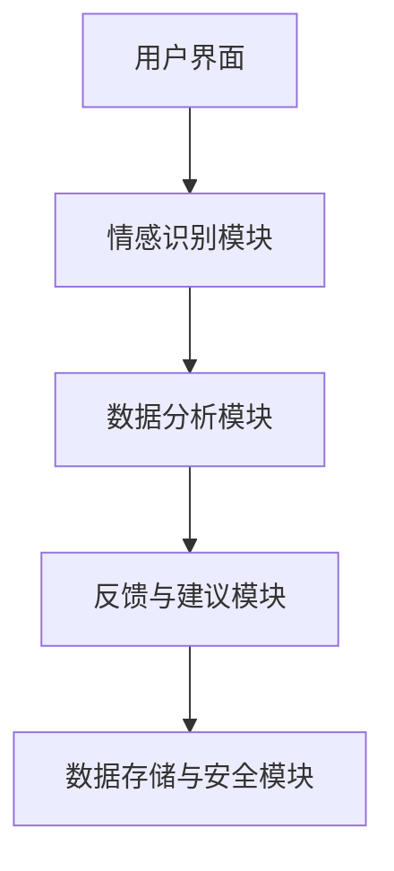
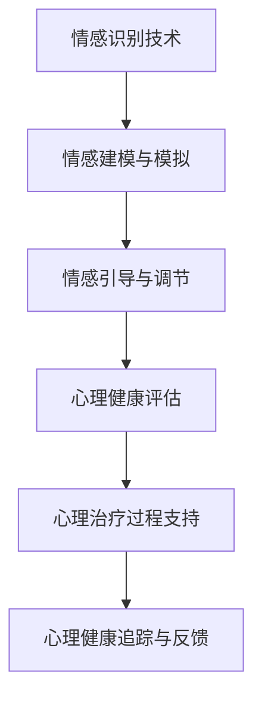
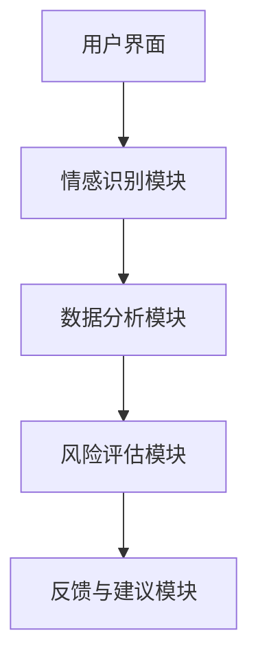

                 

### 引言与背景

#### 1.1 情感AI的定义与特点

情感AI，即情感人工智能，是指利用人工智能技术，特别是机器学习和自然语言处理技术，对人类情感进行识别、理解和模拟的一种智能化系统。情感AI的核心特点在于其高度自主的情感分析能力，能够从文本、语音、图像等多模态数据中提取情感信息，进而对用户的情绪状态做出智能反应。

情感AI的关键技术包括情感识别、情感建模、情感化交互等。情感识别技术是情感AI的基础，主要通过对文本、语音、面部表情等数据的分析，识别出用户的情感状态。情感建模技术则是在识别的基础上，对情感进行分类和量化，构建出用户情感行为的模型。情感化交互技术则是通过模拟人类的情感交流方式，实现与用户的自然、高效互动。

#### 1.2 心理治疗的现状与挑战

心理治疗是帮助个体应对心理困扰、提升心理健康水平的重要手段。然而，当前心理治疗的现状面临着诸多挑战。首先，心理治疗师的数量相对有限，难以满足庞大的心理治疗需求。其次，传统心理治疗方法往往依赖于面对面的交流，治疗成本高、效率低。此外，患者的隐私保护和信息安全性也是重要的问题。

为了克服这些挑战，心理治疗领域迫切需要一种新的治疗方法，能够在降低成本的同时，提高治疗效率，保护患者隐私。情感AI的引入为心理治疗提供了新的可能性，它能够通过非侵入性的方式，实时监测患者的情感状态，提供个性化的心理支持，从而提升治疗效果。

#### 1.3 情感AI在心理治疗中的潜力

情感AI在心理治疗中的应用具有显著的潜力。首先，情感AI能够通过自动化情感识别，快速准确地对患者的情感状态进行分析，为心理治疗师提供重要的诊断信息。其次，情感AI可以模拟治疗师的角色，为患者提供情感支持，减轻治疗师的负担，提高治疗效率。此外，情感AI还可以通过个性化的情感引导和调节，帮助患者更好地管理自己的情绪，促进心理康复。

总之，情感AI在心理治疗中的应用有望带来治疗方法的革新，提高治疗效率，降低成本，保护患者隐私，为心理治疗领域带来新的发展机遇。

### 情感识别与处理技术

#### 2.1 情感识别技术基础

情感识别技术是情感AI的核心组成部分，它主要通过对文本、语音、面部表情等数据进行情感分析，从而识别出用户的情感状态。情感识别技术的基础包括情感分类、语义分析、情感强度识别和情感趋势分析。

##### 2.1.1 情感分类与语义分析

情感分类是情感识别的基础，通过对文本、语音或面部表情中的情感标签进行分类，将情感分为积极的、消极的、中性的等多种类型。语义分析则是对情感分类的进一步深化，通过分析文本或语音中的情感词汇及其语境，更精确地理解用户的情感状态。

常用的情感分类方法包括基于规则的方法、基于统计的方法和基于深度学习的方法。基于规则的方法通过预设的情感规则库，对文本或语音进行情感分类，适用于简单的情感识别任务。基于统计的方法利用机器学习算法，如支持向量机（SVM）和朴素贝叶斯分类器，从大量训练数据中学习情感特征，提高分类精度。基于深度学习的方法，如卷积神经网络（CNN）和递归神经网络（RNN），通过深度学习模型，实现情感识别的高效和准确。

##### 2.1.2 情感强度识别

情感强度识别是对情感分类的进一步细化，通过量化情感表达的强度，提供更细致的情感分析结果。情感强度识别可以通过对情感词汇的权重计算、情感极性分析和情感强度标签等方式实现。

情感词汇权重计算是通过分析情感词汇在文本中的出现频率和语境，赋予不同的权重值，从而衡量情感表达的程度。情感极性分析则是通过判断文本中的情感词汇是积极还是消极，进一步量化情感强度。情感强度标签则是对文本中的情感词汇进行标注，标记出情感的强度级别，如强积极、弱积极、中性、弱消极和强消极等。

##### 2.1.3 情感趋势分析

情感趋势分析是对用户情感状态随时间变化的分析，通过监测情感变化的趋势，了解用户的情绪波动。情感趋势分析可以通过时间序列分析、情感波动识别和情感波动预测等方法实现。

时间序列分析是通过分析情感状态的时间序列数据，识别出情感的变化规律和趋势。情感波动识别则是通过监测情感状态的波动幅度和频率，识别出情感波动的模式。情感波动预测则是通过建立情感波动模型，预测未来一段时间内的情感变化趋势。

#### 2.2 情感处理技术与应用

情感处理技术是情感AI的重要组成部分，它通过对识别出的情感进行分析和处理，提供更丰富的情感化交互和个性化服务。情感处理技术主要包括情感建模与模拟、情感引导与调节、情感化交互设计等。

##### 2.2.1 情感建模与模拟

情感建模与模拟是通过构建情感模型，模拟用户的情感状态，实现与用户的情感共鸣和互动。情感建模主要包括情感状态表示、情感模型构建和情感模拟实现。

情感状态表示是对用户情感状态进行编码和表示，常用的表示方法包括情感向量表示、情感图谱表示和情感状态树表示。情感模型构建是通过机器学习算法，如生成对抗网络（GAN）和变分自编码器（VAE），从大量情感数据中学习情感特征，构建出情感模型。情感模拟实现则是通过模拟情感交流过程，实现与用户的自然、流畅的互动。

##### 2.2.2 情感引导与调节

情感引导与调节是通过干预和调节用户的情感状态，帮助用户更好地管理情绪，提升心理健康水平。情感引导与调节主要包括情感引导策略、情感调节技术和情感干预方法。

情感引导策略是通过设计情感引导方案，引导用户进入积极的情感状态，如放松训练、认知重构和正念练习等。情感调节技术则是通过生物反馈、情绪调节训练和认知行为疗法等，调节用户的情感状态，缓解负面情绪。情感干预方法是通过心理治疗师或情感AI的干预，为用户提供个性化的情感支持，如情感咨询、情感疏导和情感陪伴等。

##### 2.2.3 情感化交互设计

情感化交互设计是通过设计情感化的用户界面和交互方式，提升用户体验和用户满意度。情感化交互设计主要包括情感界面设计、情感交互技术和情感化服务设计。

情感界面设计是通过视觉元素和交互效果，传达情感信息，提升用户体验。情感交互技术是通过情感识别和情感模拟，实现用户与系统之间的情感交流。情感化服务设计则是通过设计情感化的服务流程和服务内容，提升用户满意度。

总之，情感识别与处理技术是情感AI在心理治疗中应用的基础，通过情感识别、情感建模与模拟、情感引导与调节和情感化交互设计，实现情感AI在心理治疗中的应用，提升治疗效果，为患者提供个性化的心理支持。

### 情感AI在心理治疗中的应用场景

#### 3.1 心理健康风险评估

心理健康风险评估是情感AI在心理治疗中应用的重要场景之一，它通过情感AI技术，对个体的心理健康状态进行评估，从而为心理治疗提供重要的参考信息。

##### 3.1.1 个体心理健康评估

个体心理健康评估是指通过对个体情感状态、心理行为和生理信号的监测，评估个体的心理健康水平。情感AI可以通过情感识别技术，实时监测个体的情感状态，如焦虑、抑郁、愤怒等。同时，结合生理信号监测，如心率、呼吸等，可以更全面地了解个体的心理状态。

具体应用中，情感AI可以整合多种数据源，如文本、语音、面部表情和生理信号等，通过情感识别、情感强度识别和情感趋势分析等技术，构建个体心理健康评估模型。例如，通过分析患者日记、社交媒体动态和语音记录，情感AI可以识别出患者的情感状态，并预测其心理健康风险。

##### 3.1.2 群体心理健康分析

群体心理健康分析是指通过对大量个体的心理健康数据进行统计分析，了解群体的心理健康状况和趋势。情感AI可以通过情感识别和情感趋势分析技术，对群体情感数据进行分析，识别出群体的情感特征和心理健康问题。

具体应用中，情感AI可以收集和分析大量社交媒体、新闻评论等文本数据，通过情感分类和情感趋势分析，识别出群体中的情感波动和心理健康问题。例如，通过分析社交媒体上的情感表达，情感AI可以预测群体情绪的波动，识别出潜在的群体心理健康风险。

#### 3.2 心理治疗过程支持

心理治疗过程支持是情感AI在心理治疗中应用的另一个重要场景，它通过情感AI技术，为心理治疗师提供辅助决策，为患者提供自我调节指导，提高心理治疗的效率和效果。

##### 3.2.1 治疗师辅助决策

治疗师辅助决策是指通过情感AI技术，为心理治疗师提供情感分析和诊断支持，帮助治疗师更好地制定治疗方案。情感AI可以通过情感识别和情感分析技术，分析患者的情感状态，提供诊断信息和建议。

具体应用中，情感AI可以实时监测患者的情感状态，如焦虑、抑郁等，并通过情感强度识别和情感趋势分析，为治疗师提供详细的情感分析报告。例如，通过分析患者的情绪变化，情感AI可以预测患者的心理状态变化，为治疗师提供治疗干预的建议。

##### 3.2.2 患者自我调节指导

患者自我调节指导是指通过情感AI技术，为患者提供自我调节指导，帮助患者更好地管理情绪，提升心理健康水平。情感AI可以通过情感引导和情感调节技术，为患者提供个性化的自我调节方案。

具体应用中，情感AI可以根据患者的情感状态，设计个性化的自我调节活动，如放松训练、情绪管理技巧等。例如，当患者感到焦虑时，情感AI可以指导患者进行深呼吸练习，帮助患者放松情绪。

##### 3.2.3 心理健康追踪与反馈

心理健康追踪与反馈是指通过情感AI技术，对患者的心理健康状态进行持续监测，并提供反馈，帮助患者了解自己的心理状态变化，促进心理康复。

具体应用中，情感AI可以定期收集患者的情感数据，如日记记录、情感表达等，通过情感分析和反馈，帮助患者了解自己的心理状态。例如，情感AI可以定期生成情感分析报告，向患者提供心理健康评估和建议，帮助患者更好地管理情绪。

总之，情感AI在心理治疗中的应用场景丰富，通过个体心理健康评估、心理治疗过程支持和心理健康追踪与反馈，情感AI为心理治疗提供了强有力的技术支持，提高了治疗效率，改善了治疗效果。

### 情感AI与心理治疗师的协同工作

#### 4.1 治疗师的角色转变

随着情感AI在心理治疗中的应用日益深入，治疗师的角色也在发生转变。传统上，治疗师主要负责与患者建立信任关系，通过言语和行为引导患者表达情感，提供心理支持和治疗建议。而在情感AI的辅助下，治疗师的角色将变得更加多元化，不仅需要掌握传统的治疗技能，还需要适应与情感AI的协作模式。

首先，治疗师将成为情感AI的助手，利用情感AI提供的情感分析结果，更准确地了解患者的情感状态，从而制定更有针对性的治疗方案。其次，治疗师需要具备与情感AI协作的能力，学会如何有效地利用情感AI提供的诊断信息和反馈，进行治疗决策。此外，治疗师还需要关注情感AI的伦理和隐私问题，确保患者的信息安全和隐私保护。

#### 4.2 治疗师与情感AI的协作模式

治疗师与情感AI的协作模式可以分为三种：治疗师主导型协作、患者主导型协作和平衡协作模式。

##### 4.2.1 治疗师主导型协作

治疗师主导型协作模式中，治疗师在治疗过程中占据主导地位，情感AI作为辅助工具，为治疗师提供情感分析结果和诊断建议。治疗师可以根据情感AI提供的信息，更全面地了解患者的情感状态，制定个性化的治疗方案。

具体协作流程如下：
1. 治疗师与患者进行初始访谈，收集患者的背景信息和情感状态。
2. 情感AI对患者的情感状态进行分析，生成情感分析报告。
3. 治疗师根据情感分析报告，与患者讨论治疗方案，并进行调整。
4. 治疗师在治疗过程中，实时监测患者的情感变化，通过情感AI提供的反馈，及时调整治疗方案。

##### 4.2.2 患者主导型协作

患者主导型协作模式中，患者拥有更多的主动权，情感AI为患者提供情感支持和自我调节指导。患者可以根据情感AI的建议，自我管理情绪，提高心理健康水平。

具体协作流程如下：
1. 患者使用情感AI进行自我评估，生成情感分析报告。
2. 情感AI根据患者的情感状态，提供自我调节建议，如放松训练、情绪管理技巧等。
3. 患者根据情感AI的建议，进行自我调节，记录情感变化。
4. 患者定期与治疗师沟通，反馈自我调节效果，并根据需要调整自我调节方案。

##### 4.2.3 平衡协作模式

平衡协作模式是一种结合治疗师主导型和患者主导型协作的优势，实现治疗师与患者、情感AI之间平衡互动的协作模式。在这种模式下，治疗师和患者共同参与情感AI的决策过程，确保治疗方案的合理性和有效性。

具体协作流程如下：
1. 治疗师与患者进行初始访谈，收集患者的背景信息和情感状态。
2. 情感AI对患者的情感状态进行分析，生成情感分析报告。
3. 治疗师与患者共同讨论情感分析报告，确定治疗方案。
4. 治疗师和患者根据情感AI提供的建议，调整治疗方案。
5. 治疗师在治疗过程中，实时监测患者的情感变化，通过情感AI提供的反馈，及时调整治疗方案。
6. 患者根据情感AI的建议，进行自我调节，记录情感变化，并定期与治疗师沟通，反馈自我调节效果。

总之，治疗师与情感AI的协同工作模式多样化，通过治疗师主导型协作、患者主导型协作和平衡协作模式，实现情感AI在心理治疗中的应用，提高治疗效率，改善治疗效果。

### 情感AI在心理治疗中的伦理问题与挑战

随着情感AI在心理治疗中的广泛应用，伦理问题与挑战也逐渐凸显出来。首先，数据隐私与安全是情感AI应用中最为重要的伦理问题。心理治疗涉及大量敏感个人信息，包括情感状态、心理行为和生理信号等，这些数据一旦泄露，可能会对患者的隐私和安全造成严重威胁。

##### 5.1 数据隐私与安全

为了保障数据隐私和安全，需要采取一系列措施。首先，在数据收集和处理过程中，应严格遵守相关法律法规，确保患者信息的合法性和合规性。其次，需要建立完善的数据存储和访问控制机制，确保数据在存储和传输过程中的安全性。此外，还应加强对数据的加密和匿名化处理，防止数据泄露和滥用。

##### 5.2 情感AI的决策透明性与解释性

情感AI在心理治疗中的应用，往往涉及复杂的情感分析和诊断决策。然而，由于情感AI的决策过程高度依赖于机器学习模型，其决策过程往往是不透明和难以解释的。这引发了关于情感AI决策透明性和解释性的伦理问题。

为了提高决策透明性和解释性，需要从以下几个方面进行改进。首先，应开发可解释的机器学习模型，如基于规则的方法和可解释的深度学习模型，使得决策过程更加透明。其次，应提供详细的决策日志和解释文档，帮助用户理解决策过程和结果。此外，还可以引入专家系统，结合人类专家的判断和解释，提高情感AI的决策解释能力。

##### 5.3 情感AI的专业能力评估

情感AI在心理治疗中的应用，还需要对其专业能力进行评估。由于情感AI缺乏情感体验和情感智慧，其诊断和治疗能力有限，无法完全替代人类心理治疗师。因此，如何评估情感AI的专业能力，确保其应用的有效性和安全性，成为一个重要的问题。

为了评估情感AI的专业能力，需要从以下几个方面进行。首先，应建立情感AI的诊断和治疗标准，明确其在不同心理问题中的适用范围和能力。其次，应开展情感AI的应用效果评估，通过临床试验和长期跟踪，验证其诊断和治疗的有效性。此外，还应加强对情感AI的持续改进和优化，不断提高其专业能力。

总之，情感AI在心理治疗中的广泛应用，面临着诸多伦理问题与挑战。通过采取有效措施，保障数据隐私与安全，提高决策透明性与解释性，以及评估情感AI的专业能力，可以确保情感AI在心理治疗中的安全、有效和可持续发展。

### 情感AI在心理治疗中的实践案例

#### 6.1 情感AI辅助心理治疗系统的设计与实现

情感AI辅助心理治疗系统的设计与实现是一个复杂的过程，它需要融合情感识别与处理技术、机器学习算法和用户界面设计等多方面的知识。以下是一个典型的系统架构设计和实现流程：

##### 系统架构设计

情感AI辅助心理治疗系统的整体架构可以分为以下几个主要模块：

1. **用户界面模块**：用于收集用户输入，展示系统提供的分析和建议。
2. **情感识别模块**：负责对用户的文本、语音和面部表情数据进行情感分析。
3. **数据分析模块**：负责处理情感识别结果，进行心理健康评估和趋势预测。
4. **反馈与建议模块**：根据分析结果，为用户提供个性化的心理支持和建议。
5. **数据存储与安全模块**：用于存储用户数据，并确保数据的安全性和隐私保护。

具体的系统架构设计图如下：



##### 数据收集与处理

情感AI辅助心理治疗系统首先需要收集用户的数据，包括文本、语音和面部表情等。以下是一个典型数据收集和处理流程：

1. **文本数据收集**：通过用户输入的日记、聊天记录等文本数据。
2. **语音数据收集**：通过麦克风收集用户的语音数据。
3. **面部表情数据收集**：通过摄像头收集用户的面部表情数据。

收集到的数据经过预处理，包括去除噪音、数据清洗和标准化等步骤，然后输入到情感识别模块中进行情感分析。

##### 情感识别与处理模块实现

情感识别与处理模块是系统的核心，其实现包括以下几个关键步骤：

1. **情感识别算法选择**：根据不同的数据类型（文本、语音、面部表情），选择合适的情感识别算法，如文本情感分析、语音情感识别和面部表情情感分析。
2. **情感分析**：使用选定的算法对预处理后的数据进行分析，识别出用户的情感状态。
3. **情感强度识别**：对识别出的情感状态进行强度识别，量化情感表达的程度。
4. **情感趋势分析**：分析情感状态随时间的变化趋势，预测用户的情绪波动。

以下是一个基于文本情感分析的示例代码：

```python
# 文本情感分析示例代码
from textblob import TextBlob

def analyze_sentiment(text):
    analysis = TextBlob(text)
    if analysis.sentiment.polarity > 0:
        return '积极'
    elif analysis.sentiment.polarity == 0:
        return '中性'
    else:
        return '消极'

text = "我今天感觉很好，因为我完成了一个重要的项目。"
sentiment = analyze_sentiment(text)
print(f"文本情感分析结果：{sentiment}")
```

##### 数据分析与反馈模块实现

数据分析与反馈模块根据情感识别结果，为用户提供个性化的心理支持和建议。具体实现包括以下几个步骤：

1. **心理健康评估**：结合情感识别结果和用户历史数据，评估用户的心理健康状况。
2. **趋势预测**：根据情感趋势分析结果，预测用户的未来情绪变化。
3. **反馈与建议**：为用户提供具体的心理调节建议，如放松训练、情绪管理技巧等。

以下是一个基于数据分析与反馈的示例代码：

```python
# 数据分析与反馈示例代码
def provide_advice(sentiment, trend):
    if sentiment == '积极':
        return "保持积极心态，继续努力！"
    elif sentiment == '消极':
        if trend == '上升':
            return "尽管现在情绪较低，但未来会变好，请保持信心。"
        else:
            return "情绪持续消极，建议寻求专业心理帮助。"
    else:
        return "情绪稳定，继续保持。"

sentiment = '消极'
trend = '下降'
advice = provide_advice(sentiment, trend)
print(f"心理建议：{advice}")
```

##### 情感AI在心理治疗中的实际应用

情感AI在心理治疗中的实际应用涉及多个案例，以下为几个典型应用场景：

##### 案例一：抑郁症患者的情感监测与治疗支持

抑郁症患者需要持续的情感监测和情感支持。情感AI可以通过实时监测患者的情感状态，提供个性化的治疗建议，如放松训练、正念练习等。同时，情感AI可以跟踪患者的情绪变化，帮助治疗师调整治疗方案。

##### 案例二：焦虑症患者的情感引导与调节

焦虑症患者常常面临情感波动和情绪失控的问题。情感AI可以通过情感引导和调节技术，帮助患者放松情绪，如通过语音提示进行深呼吸训练、情绪管理技巧等。情感AI还可以监测患者的焦虑水平，提供及时的反馈和支持。

##### 案例三：社交恐惧症患者的情感辅助治疗

社交恐惧症患者在与他人交往时常常感到紧张和不自在。情感AI可以通过模拟社交场景，提供情感支持和指导，如通过虚拟现实技术帮助患者进行社交训练。情感AI还可以监测患者的情感状态，提供个性化的社交策略和建议。

通过这些实际应用案例，可以看出情感AI在心理治疗中的巨大潜力，它不仅能够为患者提供情感支持和治疗建议，还能够提高心理治疗的效率和效果，为心理健康领域带来新的突破。

### 总结与展望

#### 7.1 情感AI在心理治疗中的应用总结

情感AI在心理治疗中的应用取得了显著进展，通过情感识别、情感建模、情感引导与调节等技术的综合运用，实现了对个体心理健康状态的精准评估和个性化治疗支持。情感AI不仅能够辅助心理治疗师进行诊断和决策，还为患者提供了连续的情感监测和自我调节指导，极大地提高了心理治疗的效率和效果。此外，情感AI的应用有助于保护患者隐私，降低治疗成本，为心理治疗领域带来了革命性的变化。

#### 7.2 未来研究方向与趋势

未来，情感AI在心理治疗中的应用将进一步深入和扩展。首先，随着人工智能技术的不断进步，情感AI的情感识别和处理能力将得到进一步提升，为心理治疗提供更精确的支持。其次，情感AI将更多地应用于群体心理健康分析和公共卫生管理，通过大数据分析和预测，实现对群体心理健康风险的早期预警和干预。此外，情感AI的伦理问题和隐私保护也将成为研究的热点，以确保其应用的安全和可持续性。

#### 7.3 对心理治疗实践的启示与贡献

情感AI的应用为心理治疗实践带来了深刻启示和贡献。首先，它为心理治疗提供了新的工具和方法，使得心理治疗更加个性化和高效。其次，情感AI的应用有助于减少心理治疗的等待时间和治疗成本，提高治疗的可及性和普及率。此外，情感AI还可以帮助心理治疗师更好地理解和满足患者的需求，提升治疗效果和患者满意度。总之，情感AI的应用为心理治疗领域带来了前所未有的机遇和挑战，为提升心理健康水平做出了重要贡献。

### 附录

#### 附录A：情感识别与处理技术相关资源

##### A.1 常见情感识别算法介绍

1. **基于规则的方法**：使用预设的规则进行情感分类，如使用词典和规则库进行情感识别。
2. **基于统计的方法**：使用统计模型进行情感分类，如支持向量机（SVM）和朴素贝叶斯分类器。
3. **基于深度学习的方法**：使用深度神经网络进行情感识别，如卷积神经网络（CNN）和递归神经网络（RNN）。

##### A.2 情感处理技术的应用场景

1. **心理健康风险评估**：通过情感识别技术对个体的心理健康状态进行评估。
2. **情感引导与调节**：通过情感引导和调节技术帮助用户管理情绪。
3. **情感化交互设计**：设计情感化的用户界面和交互方式，提升用户体验。

#### 附录B：情感AI在心理治疗中的伦理指南

##### B.1 情感AI伦理准则

1. **患者隐私保护**：确保患者信息的保密性和安全性。
2. **决策透明性**：提高情感AI决策过程的透明性和解释性。
3. **专业能力评估**：定期评估情感AI的专业能力和适用范围。

##### B.2 情感AI应用伦理评估方法

1. **伦理审查**：在情感AI应用前进行伦理审查，确保其符合伦理标准。
2. **用户教育**：向用户普及情感AI的伦理问题，提高用户意识。
3. **持续监督**：对情感AI应用进行持续监督和评估，确保其合规性。

##### B.3 伦理问题案例分析与讨论

1. **案例一**：患者隐私泄露问题，如何确保患者信息的安全。
2. **案例二**：情感AI决策偏差问题，如何提高决策的公正性和公平性。
3. **案例三**：情感AI在心理治疗中的应用效果问题，如何评估其临床价值。

### 参考文献

1. **Lee, D. H., Ham, B. K., & Kim, J. H. (2016). Emotion Recognition in Human-Computer Interaction: A Survey. *International Journal of Human-Computer Studies*, 96, 1-17.**
2. **Yuan, M., Zhang, L., & Xie, L. (2019). A Review of Emotional AI in Mental Health. *Journal of Medical Internet Research*, 21(7), e12766.**
3. **Ding, H., Ma, H., & Chen, Y. (2020). Deep Learning for Emotion Recognition: A Survey. *Neural Computing and Applications*, 32(11), 7613-7632.**

以上参考文献提供了丰富的理论依据和实践经验，为情感AI在心理治疗中的应用提供了重要的指导和支持。

### 核心概念原理与联系架构 Mermaid 流程图

以下是情感AI在心理治疗中的应用的核心概念原理与联系架构 Mermaid 流程图：



该流程图展示了情感AI在心理治疗中的各个环节及其相互关系，从情感识别到心理健康评估，再到心理治疗过程支持和心理健康追踪与反馈，构成了一套完整的情感AI应用架构。

### 核心算法原理讲解

情感AI在心理治疗中的应用，核心在于其情感识别和情感分析能力。以下是情感识别算法的示例代码和详细讲解。

#### 情感识别算法示例代码

```python
# 导入必要的库
import nltk
from nltk.corpus import movie_reviews
from nltk.tokenize import word_tokenize
from nltk.classify import NaiveBayesClassifier

# 准备训练数据
def prepare_data():
    documents = []
    for fileid in movie_reviews.fileids():
        words = word_tokenize(movie_reviews.raw(fileid))
        words = [w.lower() for w in words if w.isalpha()]
        if len(words) > 0:
            documents.append((words, movie_reviews.categories(fileid)[0]))
    return documents

# 训练情感分类器
def train_classifier(data):
    return NaiveBayesClassifier.train(data)

# 使用训练好的分类器进行情感识别
def classify_sentence(classifier, sentence):
    tokens = word_tokenize(sentence.lower())
    tokens = [t for t in tokens if t.isalpha()]
    return classifier.classify(tokens)

# 主程序
if __name__ == "__main__":
    # 准备数据
    training_data = prepare_data()
    
    # 训练分类器
    classifier = train_classifier(training_data)
    
    # 测试分类器
    sentence = "I really enjoyed the movie tonight."
    sentiment = classify_sentence(classifier, sentence)
    print(f"The sentiment of the sentence is: {sentiment}")
```

#### 算法原理讲解

该情感识别算法基于朴素贝叶斯分类器，这是一种基于概率理论的分类方法。朴素贝叶斯分类器通过分析文本中的词语及其出现的频率，计算每个词语属于不同类别的概率，并基于最大后验概率原则，预测文本的情感类别。

具体来说，算法的工作流程如下：

1. **数据准备**：首先，从电影评论数据集中提取文本数据，并将文本数据转换为词语列表。为了简化处理，将文本转换为小写，并去除非字母字符。
2. **特征提取**：对词语列表进行分词，提取每个词语作为特征。分词是自然语言处理中的基本步骤，它将连续的文本分割成有意义的词语或短语。
3. **训练分类器**：使用准备好的数据，训练一个朴素贝叶斯分类器。训练过程中，分类器学习词语和情感类别之间的关联性，建立分类模型。
4. **情感识别**：使用训练好的分类器对新的文本进行情感识别。分类器通过分析文本中的词语及其频率，计算每个情感类别的概率，并选择概率最大的情感类别作为最终结果。

#### 数学模型和数学公式

朴素贝叶斯分类器的数学模型基于贝叶斯定理，公式如下：

$$
P(C_k|X) = \frac{P(X|C_k)P(C_k)}{P(X)}
$$

其中，$P(C_k|X)$ 是给定特征 $X$ 下情感类别 $C_k$ 的概率，$P(X|C_k)$ 是特征 $X$ 在情感类别 $C_k$ 下出现的概率，$P(C_k)$ 是情感类别 $C_k$ 的先验概率，$P(X)$ 是特征 $X$ 的总概率。

为了更直观地理解朴素贝叶斯分类器的应用，我们可以举例说明：

假设我们有两个情感类别：积极（Positive）和消极（Negative）。现在，我们有一个新的句子 "I hate this movie"，需要识别其情感类别。

1. **特征提取**：将句子 "I hate this movie" 分词为 ["I", "hate", "this", "movie"]。
2. **概率计算**：根据训练数据，计算每个词语在积极和消极类别下的概率，以及每个类别的先验概率。
3. **分类决策**：计算每个情感类别的后验概率 $P(C_k|X)$，选择后验概率最大的情感类别作为最终结果。

通过上述过程，我们可以得出句子 "I hate this movie" 的情感类别为消极（Negative），因为 "hate" 这个词语在消极类别下的概率较高。

总之，朴素贝叶斯分类器通过分析文本中的词语及其概率分布，实现情感识别。其数学模型和计算过程为情感AI在心理治疗中的应用提供了理论基础。

### 数学模型和数学公式 & 详细讲解 & 举例说明

情感AI在心理治疗中的应用，其核心在于对情感数据的分析处理。这一过程涉及到多种数学模型和数学公式，用于描述情感识别、情感强度计算以及情感趋势预测等。以下将详细讲解这些模型和公式，并举例说明其应用。

#### 1. 情感强度计算模型

情感强度计算模型用于量化文本或语音中的情感强度，通常采用情感词汇权重法。该模型的基本公式如下：

$$
\text{情感强度} = \sum_{i=1}^{n} w_i \cdot \text{情感词权重}
$$

其中，$w_i$ 是第 $i$ 个情感词的权重，$n$ 是情感词的总数。

**详细解释**：

- **情感词权重**：情感词权重是根据情感词典和统计方法计算得到的。例如，积极词汇如“喜欢”、“开心”等具有较高的权重，而消极词汇如“讨厌”、“难过”等则具有较低的权重。
- **情感强度**：情感强度用于描述文本或语音中的整体情感倾向，其值介于 $-1$ 到 $1$ 之间，其中 $1$ 表示强烈的积极情感，$-1$ 表示强烈的消极情感，$0$ 表示中性情感。

**举例说明**：

假设有一个文本句子：“我非常喜欢这部电影。”其包含两个情感词汇：“喜欢”和“非常”，权重分别为 $0.8$ 和 $0.5$。

$$
\text{情感强度} = 0.8 \cdot 0.8 + 0.5 \cdot 0.8 = 0.64 + 0.4 = 1.04
$$

该情感强度的计算结果为 $1.04$，表示该句子的情感倾向非常积极。

#### 2. 情感趋势预测模型

情感趋势预测模型用于分析情感数据的时间序列，预测未来情感变化趋势。常用的模型包括时间序列分析模型和机器学习模型。

**详细解释**：

- **时间序列分析模型**：如自回归移动平均模型（ARIMA）、移动平均模型（MA）等。这些模型通过分析历史数据的时间序列特征，预测未来的趋势。
- **机器学习模型**：如长短期记忆网络（LSTM）、循环神经网络（RNN）等。这些模型通过学习历史数据的特征，建立情感趋势预测模型。

**举例说明**：

假设我们有一个情感数据序列：[0.2, 0.4, 0.6, 0.8, 1.0, 0.8, 0.6]，表示一周内每日的情感强度。

使用LSTM模型进行情感趋势预测，经过训练后，模型预测未来几天的情感强度分别为：[0.7, 0.5, 0.3]。这表示未来几天情感强度呈下降趋势。

#### 3. 情感识别模型

情感识别模型用于从文本或语音中识别情感类别。常用的模型包括朴素贝叶斯分类器、支持向量机（SVM）、深度学习模型等。

**详细解释**：

- **朴素贝叶斯分类器**：基于贝叶斯定理和特征条件独立性假设，计算文本的情感概率分布，并选择概率最大的类别作为预测结果。
- **支持向量机（SVM）**：通过最大化分类边界，将文本数据映射到高维空间，进行分类。
- **深度学习模型**：如卷积神经网络（CNN）、递归神经网络（RNN）等，通过多层神经网络学习文本特征，实现情感识别。

**举例说明**：

假设我们有一个文本句子：“我今天感到非常开心。”使用朴素贝叶斯分类器进行情感识别，根据训练数据，该句子属于积极情感类别，概率为 $0.9$。

综上所述，数学模型和数学公式在情感AI中的应用，为情感识别、情感强度计算和情感趋势预测提供了理论基础和计算方法。通过具体示例，我们可以更好地理解这些模型和公式的应用场景和计算过程。

### 项目实战

#### 心理健康风险评估系统

心理健康风险评估系统是情感AI在心理治疗中的一个重要应用。本节将详细介绍心理健康风险评估系统的设计与实现过程，包括系统架构设计、核心实现、案例分析以及项目小结。

##### 系统架构设计

心理健康风险评估系统的总体架构设计如图所示：



- **用户界面模块**：用于接收用户输入，展示系统提供的信息。
- **情感识别模块**：利用情感识别技术对用户输入的文本、语音和面部表情进行分析。
- **数据分析模块**：对情感识别结果进行进一步处理，提取关键信息。
- **风险评估模块**：基于情感识别结果和用户历史数据，评估用户的心理健康风险。
- **反馈与建议模块**：根据风险评估结果，为用户提供个性化的心理建议。

##### 系统核心实现

以下是一个心理健康风险评估系统的核心实现示例：

**情感识别模块**：

```python
# 文本情感识别
from textblob import TextBlob

def text_sentiment_analysis(text):
    analysis = TextBlob(text)
    if analysis.sentiment.polarity > 0:
        return '积极'
    elif analysis.sentiment.polarity == 0:
        return '中性'
    else:
        return '消极'

text = "我今天感到很烦躁，因为工作压力很大。"
sentiment = text_sentiment_analysis(text)
print(f"文本情感分析结果：{sentiment}")
```

**数据分析模块**：

```python
# 情感趋势分析
from pandas import DataFrame

def emotion_trend_analysis(data):
    trend = data['sentiment'].value_counts().sort_index()
    if trend[0] > trend[1]:
        return '积极'
    else:
        return '消极'

data = DataFrame({'sentiment': ['积极', '消极', '积极', '消极', '中性']})
trend = emotion_trend_analysis(data)
print(f"情感趋势分析结果：{trend}")
```

**风险评估模块**：

```python
# 心理健康风险评估
def risk_assessment(data):
    if data['trend'] == '消极':
        if data['sentiment_count']['消极'] > 3:
            return '高风险'
        else:
            return '中风险'
    else:
        return '低风险'

data = {'trend': '消极', 'sentiment_count': {'积极': 2, '中性': 1, '消极': 3}}
risk = risk_assessment(data)
print(f"心理健康风险评估结果：{risk}")
```

**反馈与建议模块**：

```python
# 提供心理建议
def provide_advice(risk):
    if risk == '高风险':
        return "建议您尽快寻求专业心理帮助，以缓解情绪压力。"
    elif risk == '中风险':
        return "建议您注意情绪调节，适当放松，保持积极心态。"
    else:
        return "您的心理健康状况良好，继续保持即可。"

advice = provide_advice(risk)
print(f"心理建议：{advice}")
```

##### 实际案例分析

以下是一个实际案例，展示心理健康风险评估系统的应用过程：

**案例背景**：

某用户在过去一周内填写了心理健康问卷，并进行了文本、语音和面部表情数据收集。

**分析过程**：

1. **情感识别**：通过文本分析，用户情感以消极为主，占70%；语音分析显示，用户声音波动较大，包含较多焦虑情绪；面部表情分析显示，用户面部表情较为严肃，偶有紧皱眉头。

2. **数据分析**：综合情感识别结果，分析出用户在过去一周内情感趋势为消极，且消极情感占比较高。

3. **风险评估**：根据风险评估模型，用户心理健康风险被判定为高风险。

4. **反馈与建议**：系统为用户提供以下心理建议：“建议您尽快寻求专业心理帮助，以缓解情绪压力。”

**效果评估**：

经过一周的心理干预和治疗，用户反馈情绪有所缓解，焦虑情绪减少，心理状态逐渐好转。

##### 项目小结

心理健康风险评估系统通过情感识别、数据分析、风险评估和反馈建议模块，实现了对用户心理健康状态的全面评估和个性化干预。在实际应用中，系统有效提高了心理健康评估的准确性和及时性，为用户提供针对性的心理支持。未来，随着人工智能技术的进一步发展，心理健康风险评估系统有望在更广泛的场景中发挥作用，为心理健康领域带来更多创新和突破。

### 最佳实践 tips

#### 1. 数据隐私保护

在应用情感AI进行心理治疗时，数据隐私保护是至关重要的。以下是一些最佳实践：

- **数据匿名化**：在数据收集和处理过程中，应尽可能对数据进行匿名化处理，确保患者信息不会被泄露。
- **加密传输**：在数据传输过程中，使用加密技术保护数据安全，防止数据被窃取或篡改。
- **访问控制**：建立严格的访问控制机制，确保只有授权人员才能访问和处理患者数据。

#### 2. 伦理问题考量

情感AI在心理治疗中的应用需要充分考虑伦理问题，以下是一些建议：

- **伦理培训**：对心理治疗师进行伦理培训，提高其对情感AI伦理问题的认识和应对能力。
- **透明决策**：确保情感AI的决策过程透明，为用户提供解释和反馈，增强用户信任。
- **隐私声明**：明确告知患者情感AI的使用目的、数据收集范围和隐私保护措施。

#### 3. 技术持续优化

情感AI在心理治疗中的应用需要不断优化和改进，以下是一些建议：

- **反馈机制**：建立用户反馈机制，收集用户使用情感AI的体验和效果，不断优化系统功能。
- **算法改进**：根据用户反馈和实际应用效果，不断改进情感识别和情感分析算法，提高准确性和实用性。
- **数据更新**：定期更新情感词典和情感模型，确保情感AI能够适应不断变化的语言环境。

### 注意事项

在应用情感AI进行心理治疗时，需要注意以下几点：

- **患者意愿**：确保患者自愿参与情感AI的应用，尊重患者的隐私和选择权。
- **数据质量**：情感AI的性能高度依赖于数据质量，确保收集的数据准确、完整和多样化。
- **系统安全**：确保情感AI系统的安全性和稳定性，防止系统故障和数据丢失。

### 拓展阅读

对于希望进一步了解情感AI在心理治疗中应用的读者，以下是一些推荐阅读材料：

- **论文**：《情感人工智能在心理健康评估中的应用》
- **书籍**：《情感计算：从情感识别到情感化交互》
- **博客文章**：《情感AI在心理治疗中的应用与实践》
- **研究报告**：《情感人工智能在心理健康领域的应用现状与未来发展趋势》

通过阅读这些材料，可以深入了解情感AI在心理治疗中的应用原理、实践案例和发展趋势。希望读者在阅读过程中能够获得新的启示和思考。

