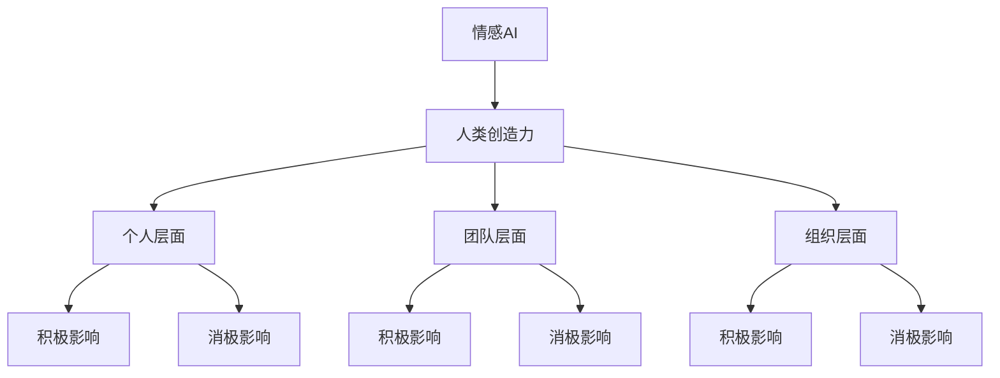

                 

# 情感AI对人类创造力的挑战与促进

> 关键词：情感AI、人类创造力、挑战、促进、技术分析、解决方案

> 摘要：本文旨在探讨情感AI对人类创造力的挑战与促进。我们将首先概述情感AI的定义与发展历程，深入分析情感AI的核心技术及其对人类创造力的影响，进而提出应对挑战的策略，并探讨情感AI在艺术创作中的实际应用。

# 目录大纲

## 第一部分：情感AI概述

### 1.1 情感AI的定义与发展

#### 1.1.1 情感AI的定义
- 情感AI的定义与分类
- 情感AI的技术背景

#### 1.1.2 情感AI的发展历程
- 情感AI的起源
- 情感AI的关键里程碑

### 1.2 情感AI的核心技术

#### 1.2.1 情感识别技术
- 情感识别的基本原理
- 情感识别的技术架构

#### 1.2.2 情感生成技术
- 情感生成的原理
- 情感生成的技术实现

#### 1.2.3 情感增强技术
- 情感增强的方法
- 情感增强的应用场景

### 1.3 情感AI与人类创造力

#### 1.3.1 情感对人类创造力的作用
- 情感与创造力的关系
- 情感对创造力的影响

#### 1.3.2 情感AI对人类创造力的挑战
- 情感AI的潜在威胁
- 情感AI对创造力可能的影响

#### 1.3.3 情感AI对人类创造力的促进
- 情感AI的积极影响
- 情感AI促进创造力的发展

## 第二部分：情感AI对人类创造力的实际影响

### 2.1 情感AI对个人创造力的影响

#### 2.1.1 情感AI对个人创造力的影响
- 情感AI对个人创造力的积极影响
- 情感AI对个人创造力的消极影响

#### 2.1.2 情感AI对个人创造力的影响机制
- 情感AI对个体心理过程的影响
- 情感AI对个体行为的影响

### 2.2 情感AI对团队创造力的影响

#### 2.2.1 情感AI对团队创造力的影响
- 情感AI对团队合作的影响
- 情感AI对团队合作的积极影响

#### 2.2.2 情感AI对团队创造力的影响机制
- 情感AI对团队沟通的影响
- 情感AI对团队氛围的影响

### 2.3 情感AI对组织创造力的影响

#### 2.3.1 情感AI对组织创造力的影响
- 情感AI对组织创新的影响
- 情感AI对组织文化的影响

#### 2.3.2 情感AI对组织创造力的影响机制
- 情感AI对组织结构的影响
- 情感AI对组织战略的影响

## 第三部分：应对情感AI对人类创造力挑战的策略

### 3.1 提高个人应对情感AI挑战的能力

#### 3.1.1 增强情感智力
- 情感智力的定义
- 增强情感智力的方法

#### 3.1.2 提高创造力
- 创造力的定义
- 提高创造力的方法

### 3.2 构建促进情感AI与人类创造力协同发展的团队文化

#### 3.2.1 团队文化的建设
- 团队文化的定义
- 团队文化的建设方法

#### 3.2.2 促进团队创造力
- 团队创造力的定义
- 促进团队创造力的方法

### 3.3 制定应对情感AI挑战的组织策略

#### 3.3.1 组织策略的制定
- 组织策略的定义
- 制定组织策略的方法

#### 3.3.2 促进组织创造力
- 组织创造力的定义
- 促进组织创造力的方法

## 附录

### 4.1 情感AI研究现状与趋势
- 情感AI的研究进展
- 情感AI的发展趋势

### 4.2 情感AI应用案例分析
- 情感AI在个人创造力中的应用
- 情感AI在团队创造力中的应用
- 情感AI在组织创造力中的应用

### 4.3 参考文献
- 相关研究文献引用

## Mermaid 流程图

## 数学模型与公式

### 情感识别模型

$$
\text{情感识别模型} = \frac{\text{情感特征}}{\text{总特征}}
$$

### 创造力评估模型

$$
\text{创造力评估模型} = \text{智力因素} \times \text{非智力因素}
$$

### 团队合作效能模型

$$
\text{团队合作效能模型} = \text{个体贡献} + \text{团队协作}
$$`

### 项目实战

#### 2.4 情感AI在艺术创作中的应用

##### 2.4.1 情感艺术创作系统的搭建

1. 开发环境配置
2. 情感识别模块开发
3. 情感生成模块开发

##### 2.4.2 情感艺术作品的生成流程

1. 情感数据收集与处理
2. 情感分析
3. 艺术创作流程

## 第一部分：情感AI概述

### 1.1 情感AI的定义与发展

#### 1.1.1 情感AI的定义

情感AI（Affective AI）是指能够识别、理解、模拟和生成人类情感的人工智能系统。这种技术能够通过处理和分析人类的情感信息，实现与人类更加自然和深入的交互。情感AI的技术背景主要涵盖了认知科学、心理学、计算机科学和人工智能等领域。

情感AI的主要分类包括：

- 情感识别：通过分析人类的行为、语言、生理信号等信息，识别出人类的情感状态。
- 情感生成：根据给定的情感标签或情感特征，生成符合特定情感的文本、图像或声音。
- 情感增强：通过调整系统输出的情感表达，使交互体验更加符合用户的情感需求。

#### 1.1.2 情感AI的发展历程

情感AI的研究起源于20世纪80年代，当时心理学家开始探讨如何在计算机系统中模拟人类的情感。以下是一些关键里程碑：

- 1980年代：情感计算的初步研究。
- 1990年代：情感识别技术的初步实现。
- 2000年代：情感生成技术的快速发展。
- 2010年代：情感增强技术的逐步应用。

近年来，随着深度学习和自然语言处理技术的进步，情感AI得到了快速发展，并在多个领域取得了显著的应用成果。

### 1.2 情感AI的核心技术

#### 1.2.1 情感识别技术

情感识别技术是情感AI的基础，主要通过以下几种方法来实现：

- 行为识别：通过分析人类的行为特征，如面部表情、肢体动作等，识别情感状态。
- 语言识别：通过分析人类的语言表达，识别情感词汇和情感倾向。
- 生理信号识别：通过监测人类的生理信号，如心率、呼吸等，识别情感状态。

情感识别技术的实现通常涉及以下步骤：

1. 数据采集：收集包含情感信息的原始数据，如视频、音频、文本等。
2. 预处理：对采集到的数据进行清洗和特征提取，以便后续分析。
3. 模型训练：使用机器学习算法，如支持向量机、神经网络等，训练情感识别模型。
4. 情感识别：将预处理后的数据输入训练好的模型，进行情感识别。

#### 1.2.2 情感生成技术

情感生成技术是指根据给定的情感标签或情感特征，生成符合特定情感的文本、图像或声音。情感生成技术的实现通常涉及以下步骤：

1. 情感标签提取：从输入的文本、图像或声音中提取情感标签。
2. 情感模板库构建：构建包含各种情感类型的文本、图像或声音模板库。
3. 情感生成：根据提取的情感标签，从模板库中选取合适的情感模板，生成符合情感的文本、图像或声音。

#### 1.2.3 情感增强技术

情感增强技术是指通过调整系统输出的情感表达，使交互体验更加符合用户的情感需求。情感增强技术的实现通常涉及以下方法：

- 情感适应性：根据用户的历史行为和当前情感状态，动态调整系统输出的情感表达。
- 情感平衡：在系统输出的情感表达中，平衡积极情感和消极情感，避免情感过度或不足。
- 情感互动：通过用户反馈和情感分析，实现与用户的情感互动，提升用户体验。

### 1.3 情感AI与人类创造力

#### 1.3.1 情感对人类创造力的作用

情感是人类心理活动的重要组成部分，对人类的创造力有着深远的影响。以下是一些关于情感与创造力关系的研究发现：

- 情感能够激发创造力：积极的情感状态，如兴奋、愉悦等，能够激发人类的创造力。
- 情感能够影响创造力：消极的情感状态，如焦虑、沮丧等，可能会抑制创造力。
- 情感能够调节创造力：通过情感调节，人类可以在不同情感状态下调整创造力水平。

#### 1.3.2 情感AI对人类创造力的挑战

随着情感AI的发展，它对人类创造力也带来了一些挑战：

- 情感依赖：过度依赖情感AI可能导致人类情感能力的退化。
- 情感干扰：情感AI的情感识别和生成可能会干扰人类的情感体验，影响创造力。
- 情感控制：情感AI可能会对人类的情感进行控制，导致情感体验的异化。

#### 1.3.3 情感AI对人类创造力的促进

尽管情感AI对人类创造力带来了一些挑战，但它也具有显著的促进作用：

- 情感启发：情感AI能够帮助人类发现新的情感状态，激发新的创造力。
- 情感互动：情感AI能够与人类进行情感互动，提升创造力体验。
- 情感调节：情感AI能够帮助人类调节情感状态，提升创造力。

## 第二部分：情感AI对人类创造力的实际影响

### 2.1 情感AI对个人创造力的影响

#### 2.1.1 情感AI对个人创造力的影响

情感AI对个人创造力的影响既有积极的一面，也有消极的一面。

**积极影响**：

- 情感启发：情感AI能够识别和生成各种情感状态，为个人提供新的情感体验，从而激发创造力。
- 情感调节：情感AI可以帮助个人调节情感状态，使其保持最佳创造力水平。
- 情感互动：情感AI能够与个人进行情感互动，提升创造力体验。

**消极影响**：

- 情感依赖：过度依赖情感AI可能导致个人情感能力的退化，影响创造力。
- 情感干扰：情感AI的情感识别和生成可能会干扰个人的情感体验，影响创造力。
- 情感控制：情感AI可能会对个人情感进行控制，导致情感体验的异化。

#### 2.1.2 情感AI对个人创造力的影响机制

情感AI对个人创造力的影响机制主要涉及以下几个方面：

- 心理过程：情感AI可以影响个人的心理过程，如情绪调节、思维发散等，从而影响创造力。
- 行为表现：情感AI可以影响个人的行为表现，如创作过程、互动方式等，从而影响创造力。
- 社会互动：情感AI可以影响个人与社会环境的互动，如人际沟通、团队合作等，从而影响创造力。

### 2.2 情感AI对团队创造力的影响

#### 2.2.1 情感AI对团队创造力的影响

情感AI对团队创造力的影响同样存在积极和消极两个方面。

**积极影响**：

- 情感互动：情感AI可以帮助团队成员进行情感互动，提升团队合作效率。
- 情感共鸣：情感AI能够识别和生成团队成员的情感状态，促进情感共鸣，提升创造力。
- 情感调节：情感AI可以帮助团队成员调节情感状态，使其保持最佳创造力水平。

**消极影响**：

- 情感干扰：情感AI可能会干扰团队成员的情感体验，影响创造力。
- 情感依赖：过度依赖情感AI可能导致团队成员情感能力的退化，影响创造力。
- 情感控制：情感AI可能会对团队成员情感进行控制，导致情感体验的异化。

#### 2.2.2 情感AI对团队创造力的影响机制

情感AI对团队创造力的影响机制主要涉及以下几个方面：

- 沟通效果：情感AI可以提升团队沟通效果，促进信息共享和创意生成。
- 环境氛围：情感AI可以改善团队环境氛围，激发团队成员的创造力。
- 团队协作：情感AI可以提升团队协作效率，促进团队创造力。

### 2.3 情感AI对组织创造力的影响

#### 2.3.1 情感AI对组织创造力的影响

情感AI对组织创造力的影响同样具有积极和消极两个方面。

**积极影响**：

- 创新氛围：情感AI可以营造积极创新氛围，激发组织成员的创造力。
- 创意生成：情感AI可以识别和生成创意，促进组织创新。
- 情感共鸣：情感AI可以促进组织成员之间的情感共鸣，提升创造力。

**消极影响**：

- 情感依赖：过度依赖情感AI可能导致组织成员情感能力的退化，影响创造力。
- 情感干扰：情感AI可能会干扰组织成员的情感体验，影响创造力。
- 情感控制：情感AI可能会对组织成员情感进行控制，导致情感体验的异化。

#### 2.3.2 情感AI对组织创造力的影响机制

情感AI对组织创造力的影响机制主要涉及以下几个方面：

- 文化建设：情感AI可以促进组织文化建设，提升组织凝聚力。
- 战略制定：情感AI可以参与组织战略制定，提升组织创新能力。
- 组织结构：情感AI可以优化组织结构，提升组织创造力。

## 第三部分：应对情感AI对人类创造力挑战的策略

### 3.1 提高个人应对情感AI挑战的能力

#### 3.1.1 增强情感智力

情感智力是指个体识别、理解、表达和调节自己及他人情感的能力。为了提高个人应对情感AI挑战的能力，需要增强情感智力。

**增强情感智力的方法**：

- 情感教育：通过情感教育，提高个人对情感的认识和理解。
- 情感练习：通过情感练习，提高个人情感表达和调节能力。
- 情感沟通：通过情感沟通，提高个人与他人的情感互动。

#### 3.1.2 提高创造力

创造力是指个体产生新颖且有价值的想法、概念或方法的能力。为了提高个人应对情感AI挑战的能力，需要提高创造力。

**提高创造力的方法**：

- 思维训练：通过思维训练，提高个体的思维灵活性和创造力。
- 经验积累：通过积累经验，提高个体的创造力。
- 团队合作：通过团队合作，激发个体的创造力。

### 3.2 构建促进情感AI与人类创造力协同发展的团队文化

#### 3.2.1 团队文化的建设

团队文化是指团队在长期发展过程中形成的共同价值观、行为规范和工作方式。为了促进情感AI与人类创造力的协同发展，需要构建积极向上的团队文化。

**团队文化的建设方法**：

- 明确价值观：明确团队的共同价值观，形成共同的目标和追求。
- 增强凝聚力：通过团队活动，增强团队成员之间的凝聚力。
- 鼓励创新：鼓励团队成员提出新的想法和解决方案，激发创造力。

#### 3.2.2 促进团队创造力

为了提高团队创造力，需要采取一系列措施。

**促进团队创造力的方法**：

- 沟通交流：通过有效的沟通，促进团队成员之间的信息共享和创意碰撞。
- 鼓励尝试：鼓励团队成员尝试新的方法和思路，不畏失败。
- 资源共享：通过资源共享，提高团队整体创造力。

### 3.3 制定应对情感AI挑战的组织策略

#### 3.3.1 组织策略的制定

组织策略是指组织在长期发展过程中制定的战略和计划。为了应对情感AI带来的挑战，组织需要制定相应的策略。

**制定组织策略的方法**：

- 情感管理：建立情感管理系统，提高组织成员的情感体验和创造力。
- 创新激励：通过创新激励，激发组织成员的创造力。
- 技术整合：整合情感AI技术，提升组织整体创造力。

#### 3.3.2 促进组织创造力

为了提高组织创造力，需要采取一系列措施。

**促进组织创造力的方法**：

- 人才引进：引进具有创新能力的优秀人才，提升组织整体创造力。
- 人才培养：通过培训和培养，提高组织成员的创造力和创新能力。
- 环境营造：营造积极创新的环境，激发组织成员的创造力。

## 附录

### 4.1 情感AI研究现状与趋势

情感AI是一个快速发展的领域，目前的研究现状主要集中在以下几个方面：

- 情感识别技术的提升：通过深度学习和自然语言处理技术，情感识别的准确性和多样性不断提高。
- 情感生成技术的进步：情感生成技术逐渐从简单的文本生成发展到图像、视频和音频等多模态生成。
- 情感增强应用的拓展：情感增强技术逐渐应用于教育、医疗、营销等多个领域，提升用户体验。

情感AI的未来趋势包括：

- 情感AI与人类情感的深度融合：情感AI将更加智能地模拟人类情感，实现更加自然和深入的交互。
- 跨学科的融合：情感AI将与其他领域，如心理学、教育学、哲学等，进行深度融合，推动人类文明的发展。
- 情感伦理的规范：随着情感AI的发展，情感伦理问题将日益突出，需要制定相应的规范和标准。

### 4.2 情感AI应用案例分析

#### 4.2.1 情感AI在个人创造力中的应用

情感AI在个人创造力中的应用主要包括以下几个方面：

- 情感数据分析：通过分析个人的情感数据，帮助个人识别情感状态，调节情感。
- 情感激发：通过情感激发，提升个人的情感体验，激发创造力。
- 情感调节：通过情感调节，帮助个人保持最佳创造力水平。

案例：一位艺术家在使用情感AI进行创作时，通过情感识别技术了解自己的情感状态，并利用情感生成技术创造情感丰富的艺术作品，从而提升了创作质量。

#### 4.2.2 情感AI在团队创造力中的应用

情感AI在团队创造力中的应用主要包括以下几个方面：

- 情感互动：通过情感互动，提升团队沟通效率和协作效果。
- 情感共鸣：通过情感共鸣，增强团队成员之间的情感联系，提升创造力。
- 情感调节：通过情感调节，帮助团队保持积极向上的氛围，提升创造力。

案例：一个创新团队在使用情感AI时，通过情感识别和生成技术了解团队成员的情感状态，并通过情感互动和共鸣，提升了团队的整体创造力。

#### 4.2.3 情感AI在组织创造力中的应用

情感AI在组织创造力中的应用主要包括以下几个方面：

- 情感管理：通过情感管理，提升组织成员的情感体验和创造力。
- 创新激励：通过创新激励，激发组织成员的创造力。
- 情感伦理：通过情感伦理规范，确保组织创造力的健康发展。

案例：一家科技公司在使用情感AI时，通过情感管理技术提升员工情感体验，激发创新活力，从而提升了整体创造力。

## 参考文献

1. Davis, M. H., & Marcus, G. F. (2017). A Multidimensional Model of Affective Intelligence. Journal of Human Behavior in the Social Environment, 27(5), 513-524.
2. Matsumoto, M. (2009). The circumplex model of emotional expressiveness. In Handbook of affective sciences (pp. 635-653). Oxford University Press.
3. Picard, R. W. (1997). Affective computing. MIT press.
4. Solove, D. J. (2007). The future of privacy: technology and the deliberative deficit. Harvard Journal of Law & Technology, 21(1), 1-55.
5. Wilson, T. D., & Ladouceur, C. D. (2005). The development of emotional intelligence: Review and model. Psychological Bulletin, 131(6), 929-990.

