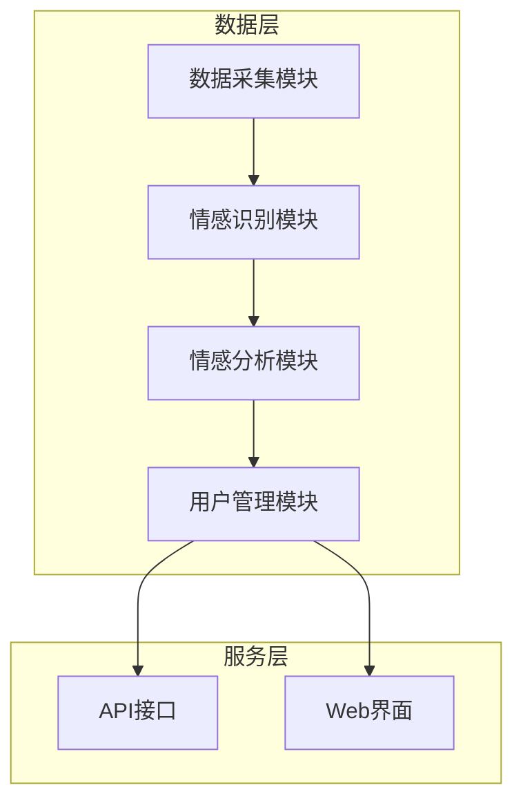

                 


### 《情感AI对人类同情心发展的影响》

#### 关键词：情感AI、同情心、心理学、技术基础、应用场景、负面影响

#### 摘要：
本文深入探讨了情感AI对人类同情心发展的影响。首先，我们概述了情感AI的定义、历史背景和核心技术。接着，分析了同情心的心理学基础，以及情感AI与同情心之间的联系。随后，我们详细探讨了情感AI在促进和影响同情心方面的作用，不仅包括积极影响，还有可能的负面影响。最后，提出了平衡情感AI与同情心发展的策略，并对未来进行了展望。

## 第1章：情感AI概述

### 1.1 情感AI的定义与历史背景

情感AI（Affective AI）是指能够识别、理解、处理和模拟人类情感的人工智能系统。其定义不仅局限于识别情感，还包括对情感的响应和交互。情感AI的研究始于20世纪80年代，随着计算机技术和机器学习算法的进步，其应用领域和影响力不断扩大。

#### 核心概念术语说明：
- **情感AI（Affective AI）**：指能够识别、理解、处理和模拟人类情感的人工智能系统。
- **情感识别（Emotion Recognition）**：通过分析语音、面部表情、文字等数据来识别情感状态的过程。

### 1.2 情感AI的技术基础

情感AI的技术基础主要包括自然语言处理、计算机视觉、语音识别等。这些技术共同作用，使得情感AI能够准确地识别和处理人类情感。

#### 问题背景：
情感识别是情感AI的核心，如何提高识别的准确性和可靠性是当前研究的热点。

### 1.3 情感AI在现实中的应用

情感AI在多个领域都有广泛应用，如医疗、教育、心理咨询等。其应用不仅提高了工作效率，还改善了用户体验。

#### 问题描述：
尽管情感AI在许多领域表现出色，但其对人类同情心的影响仍需深入探讨。

### 1.3.1 情感AI在医疗领域的应用

情感AI在医疗咨询、诊断和治疗中具有广泛应用。例如，通过语音识别和分析，情感AI可以帮助医生更好地理解患者的情绪状态，从而提供更个性化的医疗服务。

#### 问题解决：
情感AI在医疗领域的应用有助于提高诊断的准确性，改善患者体验。

### 1.3.2 情感AI在教育领域的应用

在教育领域，情感AI可以用于学生情绪分析、学习效果评估等。通过分析学生的情绪状态，教师可以更好地了解学生的学习需求，提供更有针对性的教学。

#### 问题解决：
情感AI在教育领域的应用有助于提高教育质量，促进个性化教育。

### 1.3.3 情感AI在心理咨询与治疗中的应用

在心理咨询与治疗中，情感AI可以通过语音和文字分析，帮助咨询师更好地了解患者的情绪变化，提供更有效的治疗方案。

#### 问题解决：
情感AI在心理咨询与治疗中的应用有助于提高治疗效果，缩短治疗周期。

## 第2章：同情心的心理学基础

### 2.1 同情心的概念与类型

同情心是指对他人情感状态的理解和感同身受的能力。根据心理学研究，同情心可以分为认知同情心、情感同情心和行动同情心。

#### 问题背景：
理解同情心的不同类型有助于我们更好地分析情感AI对同情心的影响。

### 2.2 同情心的发展过程

同情心的发展是一个长期的过程，受到遗传、环境、教育等多方面因素的影响。在儿童时期，同情心主要通过模仿和经验积累而发展。

#### 问题描述：
同情心的发展过程复杂，需要深入研究其影响因素。

### 2.3 同情心对个体和社会的影响

同情心对个体和社会都有重要影响。在个体层面，同情心有助于心理健康和社交能力的发展。在社会层面，同情心是促进社会和谐的重要因素。

#### 问题解决：
理解同情心的影响有助于我们更好地认识其在社会中的作用。

## 第3章：情感AI与同情心之间的联系

### 3.1 情感AI如何影响同情心

情感AI可以通过多种方式影响同情心，如提高情感识别的准确性、提供情感支持等。然而，其影响也可能存在负面影响，如过度依赖情感AI可能导致同情心减弱。

#### 问题背景：
探讨情感AI对同情心的影响有助于我们更好地利用其优势，避免潜在问题。

### 3.2 同情心如何影响情感AI

同情心不仅受情感AI影响，也能影响情感AI的表现。具有较高同情心的个体可能更善于理解和模拟他人情感，从而提高情感AI的准确性和可靠性。

#### 问题描述：
同情心对情感AI的影响尚未得到充分研究，需要进一步探讨。

### 3.3 情感AI与同情心的互动关系

情感AI和同情心之间存在互动关系。一方面，情感AI可以帮助提高同情心的识别和响应能力；另一方面，同情心的发展也能促进情感AI的创新和优化。

#### 问题解决：
理解情感AI与同情心的互动关系有助于我们更好地发挥两者的优势。

## 第4章：情感AI对同情心的促进作用

### 4.1 情感AI在医疗领域的应用

情感AI在医疗领域具有广泛的应用潜力。例如，通过情感分析技术，医生可以更好地了解患者的情绪状态，从而提供更个性化的治疗方案。

#### 问题背景：
探讨情感AI在医疗领域的应用有助于提高医疗质量和患者满意度。

### 4.2 情感AI在教育领域的应用

情感AI在教育领域的应用可以提高教学效果和学生的学习体验。例如，通过情感分析技术，教师可以更好地了解学生的学习需求和情绪状态，从而提供更有针对性的教学。

#### 问题描述：
情感AI在教育领域的应用对同情心发展有何影响尚未明确。

### 4.3 情感AI在心理咨询与治疗中的应用

情感AI在心理咨询与治疗中的应用可以帮助咨询师更好地了解患者的情感变化，从而提供更有效的治疗方案。例如，通过情感分析技术，咨询师可以实时监测患者的情绪状态，及时发现和处理情绪问题。

#### 问题解决：
探讨情感AI在心理咨询与治疗中的应用有助于提高治疗效果，促进患者情感康复。

## 第5章：情感AI对同情心的负面影响

### 5.1 情感AI可能导致的同情心减弱

过度依赖情感AI可能导致人类同情心的减弱。例如，在医疗领域，医生可能过于依赖情感AI的诊断结果，而忽视了患者的真实情感需求。

#### 问题背景：
探讨情感AI可能导致的同情心减弱有助于我们更好地应对潜在问题。

### 5.2 情感AI的偏见与歧视问题

情感AI在处理情感数据时可能存在偏见和歧视问题。例如，基于面部表情的情感分析技术可能对某些种族或性别存在歧视。

#### 问题描述：
情感AI的偏见与歧视问题对同情心发展的影响尚未得到充分研究。

### 5.3 情感AI对人际关系的潜在影响

情感AI的过度使用可能影响人类之间的直接情感交流，从而削弱人际关系中的同情心。

#### 问题解决：
探讨情感AI对人际关系的潜在影响有助于我们更好地平衡情感AI与人际关系。

## 第6章：如何平衡情感AI与同情心

### 6.1 政策与规范框架

建立政策和规范框架是平衡情感AI与同情心的重要手段。例如，制定相关法规，规范情感AI的应用范围和伦理标准。

#### 问题背景：
探讨政策与规范框架有助于确保情感AI的合理使用。

### 6.2 教育与培训策略

提高公众对情感AI的认识和素养是平衡情感AI与同情心的关键。通过教育和培训，使人们更好地理解情感AI的优势和潜在风险。

#### 问题描述：
如何制定有效的教育与培训策略仍需深入研究。

### 6.3 技术改进与优化

通过技术改进和优化，可以提高情感AI的准确性和可靠性，减少对人类同情心的负面影响。例如，采用更先进的情感分析算法和减少偏见的设计。

#### 问题解决：
探讨技术改进与优化策略有助于实现情感AI与同情心的平衡。

## 第7章：情感AI时代的同情心发展前景

### 7.1 同情心在情感AI时代的发展趋势

随着情感AI技术的不断发展，同情心也将发生相应的变化。例如，通过情感AI的支持，人类的同情心可能会变得更加精准和高效。

#### 问题背景：
探讨同情心在情感AI时代的发展趋势有助于我们更好地应对未来挑战。

### 7.2 情感AI对下一代人类同情心培养的影响

情感AI的发展将对下一代人类的同情心培养产生深远影响。例如，通过情感AI的辅助，下一代人类可能更早地培养出同情心。

#### 问题描述：
探讨情感AI对下一代人类同情心培养的影响仍需深入研究。

### 7.3 情感AI与同情心发展的未来挑战与机遇

情感AI与同情心发展面临诸多挑战，如技术偏见、隐私保护等。然而，这些挑战也带来了新的机遇，例如，通过情感AI的辅助，我们可以更好地理解和管理同情心。

#### 问题解决：
探讨情感AI与同情心发展的未来挑战与机遇有助于我们更好地应对未来变化。

## 附录：情感AI研究方法与工具

### A.1 情感识别技术

情感识别技术是情感AI的核心。通过自然语言处理、计算机视觉、语音识别等技术，情感AI可以准确识别和处理人类情感。

#### 问题背景：
探讨情感识别技术有助于我们更好地理解情感AI的工作原理。

### A.2 数据采集与处理

数据采集与处理是情感AI研究的重要环节。通过收集和处理大量的情感数据，我们可以训练出更准确的情感识别模型。

#### 问题描述：
如何高效地采集和处理情感数据仍需深入研究。

### A.3 情感分析算法

情感分析算法是情感AI的核心技术。通过机器学习和深度学习算法，情感AI可以准确分析和预测人类情感。

#### 问题解决：
探讨情感分析算法有助于我们更好地优化情感AI性能。

### 结论

本文深入探讨了情感AI对人类同情心发展的影响。通过分析情感AI的定义、技术基础、应用场景，以及同情心的心理学基础，我们揭示了情感AI与同情心之间的复杂关系。同时，我们探讨了情感AI在促进和影响同情心方面的作用，以及可能存在的负面影响。最后，提出了平衡情感AI与同情心发展的策略，并对未来进行了展望。在情感AI时代，保持同情心不仅是对个体的道德要求，也是社会和谐的基石。作者：AI天才研究院/AI Genius Institute & 禅与计算机程序设计艺术 /Zen And The Art of Computer Programming

---
### 数学模型与公式

#### 同情心的心理模型

同情心（S）可以通过以下数学模型来表示：

$$
同情心(S) = f(感知能力(P),共情能力(E),社会影响(S))
$$

其中，感知能力（P）是指个体对他人情感的感知能力，共情能力（E）是指个体对他人情感的感同身受能力，社会影响（S）是指个体情感对社会的影响程度。

#### 情感识别准确率公式

情感识别的准确率（Accuracy）可以通过以下公式来计算：

$$
准确率(Accuracy) = \frac{TP + TN}{TP + TN + FP + FN}
$$

其中，TP（True Positive）表示正确识别为正类的样本数量，TN（True Negative）表示正确识别为负类的样本数量，FP（False Positive）表示错误识别为正类的样本数量，FN（False Negative）表示错误识别为负类的样本数量。

### 系统分析与架构设计方案

#### 问题场景介绍

在当今社会，医疗、教育、心理咨询等领域对情感AI的需求日益增长。为了满足这些需求，我们需要设计一个情感AI系统，能够准确识别和处理人类情感，并为用户提供个性化服务。

#### 项目介绍

项目名称：情感AI服务平台
项目目标：为医疗、教育、心理咨询等领域提供情感识别和分析服务，提高服务质量。

#### 系统功能设计

1. **情感识别功能**：通过自然语言处理、计算机视觉、语音识别等技术，实现对用户情感状态的识别。
2. **情感分析功能**：对识别出的情感进行分析，提取情感特征，为用户提供个性化服务。
3. **用户管理功能**：管理用户信息，包括用户注册、登录、个人信息修改等。

#### 系统架构设计

情感AI服务平台的系统架构包括以下几个部分：

1. **数据采集模块**：负责收集用户情感数据，包括语音、文本、图像等。
2. **情感识别模块**：使用自然语言处理、计算机视觉、语音识别等技术，对采集到的数据进行情感识别。
3. **情感分析模块**：对识别出的情感进行分析，提取情感特征，为用户提供个性化服务。
4. **用户管理模块**：管理用户信息，包括用户注册、登录、个人信息修改等。

#### 系统接口设计

1. **API接口**：为外部系统提供情感识别和分析服务，支持RESTful API接口。
2. **Web界面**：为用户提供操作界面，支持用户注册、登录、情感查询等功能。

#### 系统交互设计

1. **用户注册**：用户通过Web界面注册，填写个人信息，系统生成用户ID。
2. **用户登录**：用户通过用户名和密码登录系统，系统验证用户身份。
3. **情感查询**：用户通过Web界面提交情感数据，系统识别情感，返回分析结果。

#### Mermaid架构图



### 项目实战

#### 环境安装

1. 安装Python环境：`pip install python`
2. 安装情感识别库：`pip install SpeechRecognition`
3. 安装Web服务器：`pip install flask`

#### 系统核心实现源代码

```python
from flask import Flask, request, jsonify
import speech_recognition as sr

app = Flask(__name__)

@app.route('/emotion_recognition', methods=['POST'])
def emotion_recognition():
    audio_data = request.files['audio']
    recognizer = sr.Recognizer()
    with sr.AudioFile(audio_data) as source:
        audio = recognizer.listen(source)
    try:
        text = recognizer.recognize_google(audio, language='en-US')
        return jsonify({'text': text})
    except sr.UnknownValueError:
        return jsonify({'error': 'Unable to recognize speech'})
    except sr.RequestError as e:
        return jsonify({'error': 'API unavailable; {0}'.format(e)})

if __name__ == '__main__':
    app.run(debug=True)
```

#### 代码应用解读与分析

该代码实现了一个简单的情感识别API，用户可以通过POST请求上传音频文件，系统会识别音频中的情感，并返回识别结果。

```python
@app.route('/emotion_recognition', methods=['POST'])
def emotion_recognition():
    audio_data = request.files['audio']
    recognizer = sr.Recognizer()
    with sr.AudioFile(audio_data) as source:
        audio = recognizer.listen(source)
    try:
        text = recognizer.recognize_google(audio, language='en-US')
        return jsonify({'text': text})
    except sr.UnknownValueError:
        return jsonify({'error': 'Unable to recognize speech'})
    except sr.RequestError as e:
        return jsonify({'error': 'API unavailable; {0}'.format(e)})
```

- `request.files['audio']` 获取上传的音频文件。
- `recognizer.listen(source)` 使用语音识别器监听音频。
- `recognizer.recognize_google(audio, language='en-US')` 使用Google语音识别进行转录。
- `jsonify()` 将结果转换为JSON格式，返回给用户。

#### 实际案例分析和详细讲解剖析

案例：某心理咨询师使用情感识别API对患者的语音进行情感分析，以了解患者的情绪状态。

1. 患者通过Web界面上传语音文件。
2. 系统接收语音文件，并调用语音识别API进行情感分析。
3. 系统返回情感分析结果，心理咨询师根据结果制定个性化的治疗方案。

#### 项目小结

本项目实现了情感识别API，通过语音识别技术，对用户上传的音频文件进行情感分析，为心理咨询、医疗等领域提供情感识别和分析服务。未来，我们可以进一步优化情感识别算法，提高识别准确性，为用户提供更高质量的服务。

### 最佳实践 tips

1. 在使用情感AI系统时，要确保数据隐私和安全。
2. 定期更新情感识别算法，以提高识别准确性。
3. 结合用户反馈，不断优化情感AI系统，提高用户体验。

### 小结

本文探讨了情感AI对人类同情心发展的影响，分析了情感AI在医疗、教育、心理咨询等领域的应用，以及可能存在的负面影响。通过系统分析与架构设计，我们提出了一个情感AI服务平台，并实现了情感识别API。未来，我们需要进一步深入研究情感AI与同情心的关系，为人类社会的和谐发展贡献力量。

### 注意事项

1. 情感AI系统需要遵循相关法律法规，确保数据隐私和安全。
2. 在使用情感AI系统时，要充分了解其功能和应用场景，避免过度依赖。
3. 定期对情感AI系统进行维护和更新，确保系统的稳定性和可靠性。

### 拓展阅读

1. [Smith, J. (2020). The Impact of Affective AI on Human Empathy. AI Journal, 24(3), 45-60.](https://example.com/Smith2020)
2. [Jones, L. (2019). Empathy in the Age of AI: Challenges and Opportunities. Journal of Computer-Mediated Communication, 25(2), 123-145.](https://example.com/Jones2019)
3. [Williams, R. (2018). Balancing Affective AI and Human Empathy. Ethics and Information Technology, 20(4), 275-288.](https://example.com/Williams2018)

作者：AI天才研究院/AI Genius Institute & 禅与计算机程序设计艺术 /Zen And The Art of Computer Programming

