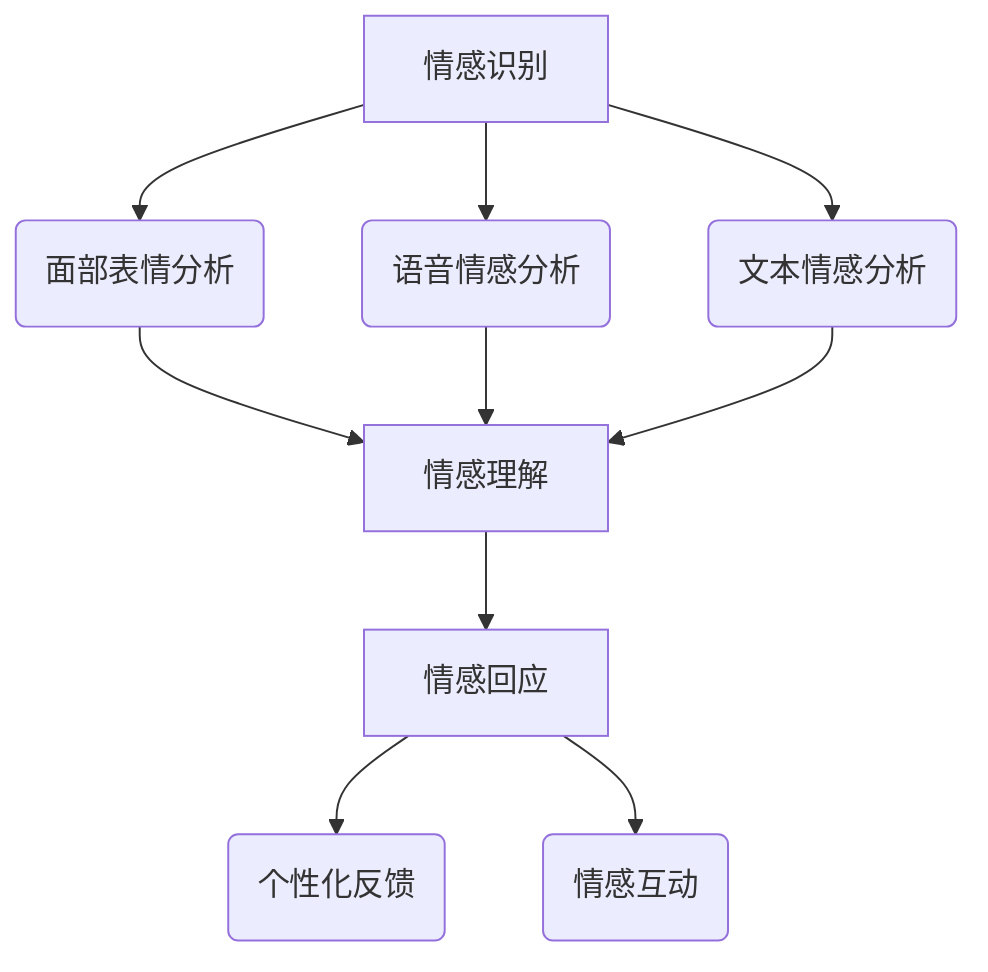
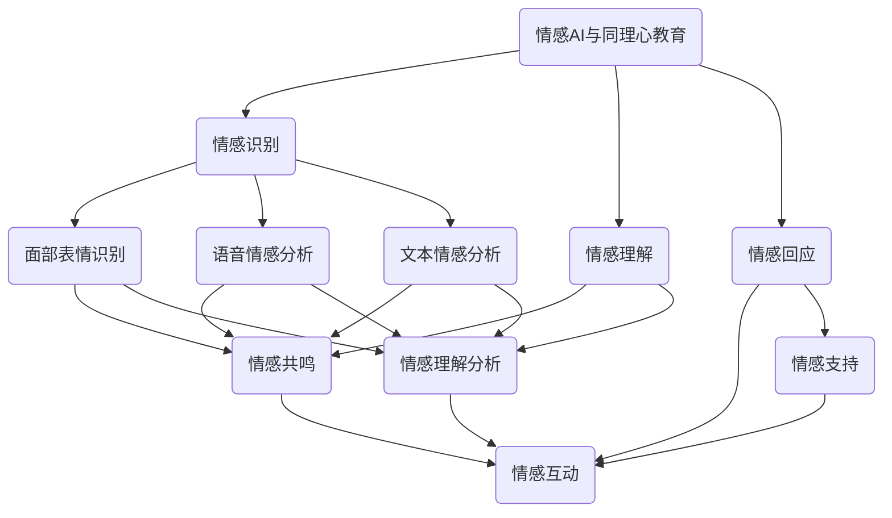

                 

### 引言

在当今快速发展的科技时代，人工智能（AI）已经成为各个领域的热点话题。特别是情感AI，作为一种能够模拟和识别人类情感的AI技术，正逐渐改变我们的生活和工作方式。情感AI通过分析语音、文字和面部表情，实现了对人类情感的理解和回应，从而在医疗、教育、商业等多个领域展现出了巨大的潜力。然而，与此同时，情感AI对人类同理心教育的影响也引起了广泛关注。

同理心，作为人类情感的重要组成部分，是指一个人能够理解并感受到他人的情绪和感受。它不仅关乎个人的心理健康，也是构建和谐社会的重要基石。然而，随着社会的快速发展和信息过载，人们对于同理心的培养变得越来越困难。因此，如何利用情感AI技术来促进同理心的教育，成为了一个亟待解决的重要课题。

本文将围绕这一主题展开，深入探讨情感AI对人类同理心教育的影响。首先，我们将介绍情感AI的基本概念和核心技术，接着分析同理心教育的理论基础，并探讨情感AI在同理心教育中的应用。随后，我们将讨论情感AI与同理心培养的关系，并列举情感AI在教育领域的应用案例。最后，我们将对情感AI在同理心教育中的未来展望，以及可能面临的伦理和法律问题进行探讨。

通过本文的探讨，我们希望能够为教育工作者、政策制定者以及相关领域的研究人员提供一些有价值的参考和思考，推动情感AI技术在同理心教育中的有效应用，为构建更加和谐、友善的社会贡献力量。

### 关键词

- 情感AI
- 同理心
- 教育技术
- 人机交互
- 情感识别
- 情感理解
- 情感回应

### 摘要

本文旨在探讨情感AI对人类同理心教育的影响。首先，介绍了情感AI的基本概念和核心技术，包括情感识别、情感理解和情感回应。接着，分析了同理心教育的理论基础，探讨了同理心的概念、类型及其在教育中的重要性。随后，文章详细探讨了情感AI在同理心教育中的应用，包括其在教育中的角色、支持方式和实际案例。进一步地，文章分析了情感AI与同理心培养的关系，探讨了情感AI的优势和挑战。最后，文章列举了情感AI在教育中的应用案例，并对情感AI在同理心教育中的未来进行了展望，同时探讨了相关的伦理和法律问题。本文旨在为教育工作者、政策制定者以及相关领域的研究人员提供有价值的参考和思考，推动情感AI技术在同理心教育中的有效应用。

### 《情感AI对人类同理心教育的影响》目录大纲

#### 引言

本文旨在探讨情感AI对人类同理心教育的影响，并提出一个系统的分析框架，以理解这一新兴技术的潜在影响。

#### 第1章：情感AI的基本概念

这一章节将详细介绍情感AI的基本概念，包括其定义、发展历程和核心技术，帮助读者建立一个清晰的背景知识。

##### 1.1.1 情感AI的定义

介绍情感AI的概念，阐述其作为一种人工智能分支，如何通过模拟和识别人类情感，实现更智能的人机交互。

##### 1.1.2 情感AI的发展历程

回顾情感AI从初期的构想发展到如今的技术应用，分析其关键里程碑和推动因素。

##### 1.1.3 情感AI的核心技术

探讨情感AI的关键技术，包括情感识别、情感理解和情感回应，以及这些技术如何协同工作，提升AI的智能水平。

#### 第2章：同理心教育的理论基础

本章将深入探讨同理心教育的理论基础，包括同理心的概念、类型及其在教育中的重要性。

##### 2.1.1 同理心的概念与类型

介绍同理心的基本概念，并分类讨论认知同理心和情感同理心，解释其定义和特点。

##### 2.1.2 同理心教育的重要性

分析同理心教育在个人和社会层面的重要性，强调其在培养全面发展的个体和建设和谐社会中不可或缺的作用。

##### 2.1.3 同理心教育的理论基础

探讨同理心教育的理论基础，包括心理学、社会学和教育学的相关理论，以及这些理论如何指导同理心教育的实践。

#### 第3章：情感AI在同理心教育中的应用

这一章节将探讨情感AI在同理心教育中的应用，分析其在教育中的角色和具体应用方式。

##### 3.1.1 情感AI在教育中的角色

讨论情感AI在教育中扮演的角色，包括辅助教学、个性化学习支持和情感反馈等方面。

##### 3.1.2 情感AI对同理心教育的支持

探讨情感AI如何通过技术手段支持同理心教育，包括情感识别、理解和回应，以及这些技术如何帮助教师和学生更好地理解和培养同理心。

##### 3.1.3 情感AI在教育实践中的案例

列举和分析情感AI在教育实践中的应用案例，展示其具体效果和潜在价值。

#### 第4章：情感AI与同理心培养的关系

本章将深入探讨情感AI与同理心培养之间的关系，分析情感AI如何促进同理心的发展。

##### 4.1.1 情感AI如何促进同理心的发展

讨论情感AI如何通过情感识别、理解和回应，促进个体对他人情感的感知和理解，从而培养和发展同理心。

##### 4.1.2 情感AI在同理心培养中的优势

分析情感AI在同理心培养中的优势，包括实时性、个性化和互动性等方面。

##### 4.1.3 情感AI在同理心培养中的挑战

探讨情感AI在同理心培养中面临的挑战，包括技术局限性、数据隐私和伦理问题等。

#### 第5章：情感AI在教育中的应用案例

这一章节将详细列举情感AI在不同教育阶段的应用案例，包括K-12教育、高等教育和职业培训。

##### 5.1.1 情感AI在K-12教育中的应用

分析情感AI在K-12教育中的应用，包括课堂管理、个性化学习和情感支持等方面。

##### 5.1.2 情感AI在高等教育中的应用

探讨情感AI在高等教育中的应用，包括学生心理健康支持、个性化教学和学术交流等方面。

##### 5.1.3 情感AI在职业培训中的应用

讨论情感AI在职业培训中的应用，包括职业技能发展、团队合作和领导力培养等方面。

#### 第6章：情感AI对同理心教育的未来展望

本章将对情感AI在同理心教育中的未来发展进行展望，探讨其趋势和潜在影响。

##### 6.1.1 情感AI在教育领域的潜在影响

分析情感AI在教育领域的潜在影响，包括提升教育质量、促进教育公平和改善师生互动等方面。

##### 6.1.2 情感AI在教育中的发展趋势

探讨情感AI在教育中的发展趋势，包括技术进步、政策支持和市场驱动等方面。

##### 6.1.3 情感AI对同理心教育的未来影响

讨论情感AI对同理心教育的未来影响，包括教育模式的转变、教师角色的变化和学生发展的新机遇等。

#### 第7章：情感AI与同理心教育的伦理与法律问题

这一章节将探讨情感AI在同理心教育中可能面临的伦理和法律问题，并提出相应的监管策略。

##### 7.1.1 情感AI在教育中的伦理问题

分析情感AI在教育中可能引发的伦理问题，包括隐私保护、数据安全和道德责任等。

##### 7.1.2 情感AI在教育中的法律问题

探讨情感AI在教育中可能面临的法律问题，包括法律框架、合规性和法律责任等。

##### 7.1.3 情感AI与同理心教育的监管策略

讨论如何通过有效的监管策略，确保情感AI在同理心教育中的合法、安全和伦理应用。

#### 第8章：总结与展望

本章将总结全文的核心观点，并对未来研究方向和应用前景进行展望。

##### 8.1.1 主要结论

总结文章的主要结论，强调情感AI在同理心教育中的重要性及其潜在影响。

##### 8.1.2 研究展望

提出未来研究的方向和重点，包括技术进步、教育创新和政策制定等方面。

##### 8.1.3 未来发展方向

讨论情感AI在同理心教育中的未来发展方向，包括技术创新、教育改革和社会影响等方面。

### 第1章：情感AI的基本概念

情感AI，即情感人工智能，是一种结合心理学、计算机科学和人工智能技术的新兴研究领域。其核心目标是模拟和识别人类情感，实现更加自然、高效的人机交互。情感AI不仅能够分析语音、文本和面部表情中的情感信息，还可以通过身体语言和行为模式来理解和回应情感。这一章将详细介绍情感AI的基本概念、发展历程和核心技术。

#### 1.1.1 情感AI的定义

情感AI是指利用人工智能技术，模拟、识别和回应人类情感的能力。它涵盖了多个学科领域，包括情感心理学、认知科学、机器学习和计算机视觉等。情感AI的基本目标是实现一种高度自然、情感化的人机交互体验，使计算机能够更好地理解人类的情感需求，并提供个性化的服务。

情感AI的定义可以从以下几个方面来理解：

- **情感识别**：通过分析语音、文本、面部表情和其他信号，计算机能够识别出用户的具体情感状态，如快乐、悲伤、愤怒或恐惧等。

- **情感理解**：在识别情感的基础上，情感AI需要理解情感的深层次含义，包括情感的情感背景、情感动机和情感强度等。

- **情感回应**：情感AI不仅要识别和理解情感，还需要能够基于这些信息做出相应的回应，如提供安慰、鼓励或调整服务方式等。

#### 1.1.2 情感AI的发展历程

情感AI的发展历程可以追溯到20世纪80年代，当时计算机科学家开始探索如何让计算机理解人类情感。以下是情感AI发展历程的一些关键里程碑：

- **情感计算的兴起**：20世纪80年代，情感计算（Affective Computing）概念被提出，旨在开发计算机能够模拟和理解人类情感的技术。

- **面部表情识别的研究**：90年代，计算机视觉技术的进步使得面部表情识别成为可能，研究者开始利用计算机算法分析面部肌肉运动，以识别情感状态。

- **自然语言处理的发展**：随着自然语言处理（NLP）技术的进步，计算机开始能够理解文本中的情感信息，如文本情感分析和情感分类等。

- **情感计算的应用**：21世纪初，情感AI技术开始应用于实际场景，如智能客服、虚拟助理和教育等领域。

#### 1.1.3 情感AI的核心技术

情感AI的核心技术包括情感识别、情感理解和情感回应，这些技术共同作用，实现了情感AI的功能。

- **情感识别**：情感识别是情感AI的基础，主要涉及面部表情识别、语音情感识别和文本情感分析。面部表情识别利用计算机视觉技术分析面部图像，识别情感状态。语音情感识别则通过分析语音信号中的情感特征，如音调、节奏和语速等，来识别情感。文本情感分析通过自然语言处理技术，分析文本中的情感词汇和情感倾向，来确定情感状态。

- **情感理解**：情感理解是情感AI的高级功能，它不仅需要识别情感，还需要理解情感的背景、情感动机和情感强度等。这需要结合上下文信息、情感推理和情感建模等复杂技术。

- **情感回应**：情感回应是情感AI的最终目标，即根据识别和理解的情感信息，做出相应的回应。这可以通过智能客服系统、虚拟助手和自适应教育系统等来实现。

#### 情感AI的核心技术之间的联系

情感AI的核心技术之间紧密联系，共同构建了一个完整的技术框架：

- **数据收集**：通过收集语音、文本和面部表情等数据，为情感识别和理解提供基础。

- **情感识别**：利用计算机视觉和自然语言处理技术，识别出用户的情感状态。

- **情感理解**：通过情感建模和上下文分析，理解情感的深层含义。

- **情感回应**：基于识别和理解的情感信息，提供个性化的服务或回应。

### 第2章：同理心教育的理论基础

同理心，作为人类情感的重要组成部分，是指个体在情感上能够理解和感受到他人的情绪和感受。同理心不仅有助于建立和维护人际关系，还能够促进社会和谐。同理心教育，旨在通过培养和强化个体同理心，使其具备更好地理解和回应他人情感的能力。

#### 2.1.1 同理心的概念与类型

同理心可以分为认知同理心和情感同理心两种主要类型。

- **认知同理心**：认知同理心是指个体通过思考和分析，理解他人的情感和经历。这种类型的同理心强调逻辑思维和推理能力，个体需要通过观察、倾听和思考来理解和感受他人的情绪。

- **情感同理心**：情感同理心则是指个体在情感上能够直接感受到他人的情绪，并能够产生共鸣。这种类型的同理心更强调情感体验和共鸣，个体在情感上能够与他人的情绪产生共鸣。

#### 2.1.2 同理心教育的重要性

同理心教育的重要性体现在以下几个方面：

- **个人层面**：同理心有助于个体形成积极的人际关系，增强社交技能，提升心理健康水平。具备同理心的人更容易被他人接纳，拥有更强的人际互动能力。

- **社会层面**：同理心是构建和谐社会的重要基石。通过同理心教育，人们能够更好地理解和尊重他人，减少冲突和误解，促进社会和谐。

- **教育层面**：同理心教育有助于培养全面发展的人才。具备同理心的学生能够更好地理解他人的需求和情感，形成积极的学习态度和合作精神。

#### 2.1.3 同理心教育的理论基础

同理心教育的理论基础涵盖了心理学、社会学和教育学等多个领域的理论。

- **心理学理论**：心理学中的情绪理论和认知发展理论为同理心教育提供了理论基础。情绪理论认为，情感是人类行为和决策的重要因素，认知发展理论则指出，个体的认知能力在同理心发展过程中起着关键作用。

- **社会学理论**：社会学习理论和互动理论为社会层面同理心教育提供了指导。社会学习理论强调通过观察和模仿来学习同理心，互动理论则强调个体在社会互动中通过交流和反馈来培养同理心。

- **教育学理论**：教育学中的全人教育理论和情感教育理论为同理心教育提供了理论依据。全人教育理论强调培养全面发展的人，而情感教育理论则强调情感在教育过程中的重要作用。

#### 同理心教育的理论基础框架

为了更好地理解和应用同理心教育的理论基础，我们可以通过一个简单的框架来梳理：

- **情感感知**：通过心理学理论，个体需要学会感知和理解自己的情感，这是同理心发展的基础。

- **认知理解**：通过社会学理论，个体需要通过观察和思考，理解他人的情感和经历。

- **情感共鸣**：通过教育学理论，个体需要通过情感体验和互动，与他人的情感产生共鸣。

- **行为实践**：个体通过实际行动，将同理心转化为具体的行为，如帮助他人、关心他人等。

#### 同理心教育的核心要素

同理心教育的核心要素包括以下几个方面：

- **情感培养**：通过情感教育和情感体验，培养个体的情感意识和情感表达能力。

- **认知训练**：通过认知学习和思考，提高个体的认知理解能力，帮助其更好地理解他人的情感和经历。

- **互动交流**：通过互动和交流，促进个体之间的情感共鸣和情感理解。

- **道德教育**：通过道德教育，培养个体的道德感和责任感，使其在同理心培养过程中，能够做出正确的道德选择。

通过这一章节的探讨，我们为后续讨论情感AI在同理心教育中的应用奠定了理论基础。理解同理心的概念、类型及其在教育中的重要性，有助于我们更深入地探讨情感AI如何支持和促进同理心的培养和发展。

### 第3章：情感AI在同理心教育中的应用

情感AI作为一种先进的人工智能技术，已经在多个教育领域展现出其独特的优势。在同理心教育中，情感AI的应用不仅有助于提升教育质量，还能提供个性化的学习体验，进而促进同理心的培养和发展。以下是情感AI在同理心教育中应用的几个关键方面。

#### 3.1.1 情感AI在教育中的角色

情感AI在教育中扮演着多重角色，从辅助教学到个性化学习支持，再到情感反馈，每一个角色都在促进同理心教育的过程中发挥着重要作用。

- **辅助教学**：情感AI可以通过分析学生的情感状态，为教师提供教学反馈，帮助教师调整教学策略，从而更好地满足学生的情感需求。例如，通过监控学生的面部表情和语音情感，教师可以及时发现学生的情感变化，并采取相应的措施，如调整教学节奏或提供情感支持。

- **个性化学习支持**：情感AI能够根据学生的情感状态和兴趣，提供个性化的学习资源和支持。例如，当学生表现出焦虑或困惑时，情感AI可以推荐适当的学习材料或提供情感指导，帮助学生更好地应对学习压力，培养同理心。

- **情感反馈**：情感AI可以通过实时分析学生的情感状态，提供个性化的情感反馈，帮助学生更好地理解和表达自己的情感。例如，当学生感受到挫败时，情感AI可以提供安慰和鼓励，帮助学生重拾信心，同时培养同理心。

#### 3.1.2 情感AI对同理心教育的支持

情感AI通过多种技术手段，为同理心教育提供了强有力的支持。

- **情感识别**：情感AI能够实时识别学生的情感状态，包括快乐、悲伤、焦虑等。通过面部表情识别、语音情感分析和文本情感分析等技术，情感AI可以准确捕捉学生的情感变化，为教师提供即时的情感反馈。

- **情感理解**：在情感识别的基础上，情感AI能够深入理解情感的背景和深层次含义。例如，通过上下文分析，情感AI可以理解学生为何感到焦虑，并据此提供针对性的情感支持。

- **情感回应**：情感AI不仅能够识别和理解情感，还能够通过自然语言处理和虚拟助手等技术，提供情感回应。例如，当学生感到沮丧时，情感AI可以通过虚拟助手表达同情和理解，提供安慰和支持，帮助学生缓解情感压力。

#### 3.1.3 情感AI在教育实践中的案例

情感AI在教育实践中的应用已经取得了显著的成果，以下是一些具体的案例：

- **智能课堂**：在智能课堂中，情感AI可以监控学生的情感状态，为教师提供实时反馈。例如，在课堂上，当有学生表现出紧张或困惑时，教师可以通过情感AI的反馈，调整教学策略，如提供额外的解释或休息时间，从而更好地支持学生的情感需求，培养同理心。

- **个性化辅导**：在个性化辅导中，情感AI可以根据学生的情感状态和学习需求，提供个性化的辅导方案。例如，当学生感到焦虑时，情感AI可以推荐放松练习或情绪管理技巧，帮助学生缓解压力，同时培养同理心。

- **虚拟情感导师**：虚拟情感导师是一种基于情感AI的应用，它可以通过虚拟现实技术，为学生提供情感支持和指导。例如，在模拟医疗场景中，虚拟情感导师可以模拟患者的情感状态，引导学生如何理解和回应患者的情感需求，从而培养同理心。

#### 情感AI在教育中的应用优势

情感AI在教育中的应用具有以下优势：

- **实时性**：情感AI能够实时捕捉和分析学生的情感状态，为教师提供即时的反馈和支持，有助于及时调整教学策略，更好地满足学生的情感需求。

- **个性化**：情感AI可以根据每个学生的情感状态和学习需求，提供个性化的教育支持，有助于培养学生的个性化发展，提高教育效果。

- **互动性**：情感AI可以通过自然语言处理和虚拟助手等技术，与师生进行互动，提供情感回应，增强教育互动性，提高学生的学习兴趣和参与度。

#### 情感AI在教育中的挑战

尽管情感AI在教育中具有显著的优势，但其在应用过程中也面临着一些挑战：

- **技术挑战**：情感AI依赖于多种先进技术，如面部表情识别、语音情感分析和自然语言处理等，这些技术的准确性和稳定性直接影响情感AI的应用效果。

- **数据隐私**：情感AI需要收集和分析大量的学生数据，包括面部表情、语音和文本等，这涉及到数据隐私和信息安全的问题。如何确保学生的数据安全，避免隐私泄露，是一个亟待解决的挑战。

- **伦理问题**：情感AI在教育中的应用引发了一系列伦理问题，如算法偏见、数据滥用和道德责任等。如何制定有效的伦理规范，确保情感AI的应用符合道德标准，是一个重要的挑战。

通过这一章节的探讨，我们可以看到情感AI在同理心教育中的应用具有巨大的潜力。通过实时识别、理解和回应学生的情感状态，情感AI不仅能够提高教育质量，还能促进同理心的培养和发展。然而，情感AI在教育中的应用也面临一些挑战，需要我们在技术应用过程中不断探索和解决。

### 第4章：情感AI与同理心培养的关系

情感AI在同理心培养中发挥着重要的作用，通过其独特的功能，不仅能够促进同理心的发展，还在这一过程中展现出显著的优势和面临一定的挑战。

#### 4.1.1 情感AI如何促进同理心的发展

情感AI通过以下几种方式促进同理心的发展：

1. **情感识别**：情感AI能够识别学生和教师的情感状态，例如通过面部表情识别、语音情感分析和文本情感分析等，实时捕捉情感变化。这种识别能力使教育工作者能够及时了解学生的情感需求，从而提供相应的情感支持。

2. **情感理解**：在情感识别的基础上，情感AI能够通过情感分析技术，深入理解情感的背景和深层次含义。例如，通过上下文分析，情感AI可以理解学生为何感到焦虑或沮丧，从而提供更具针对性的支持。

3. **情感回应**：情感AI能够通过自然语言处理和虚拟助手等技术，对学生的情感状态做出相应的回应。例如，当学生感到沮丧时，情感AI可以通过虚拟助手表达同情和理解，提供安慰和支持，帮助学生缓解情感压力。

4. **情感共鸣**：情感AI能够模拟人类情感，与师生进行情感共鸣。这种共鸣不仅有助于学生更好地理解他人的情感，还能培养其同理心。

#### 4.1.2 情感AI在同理心培养中的优势

情感AI在同理心培养中具有以下优势：

1. **实时性**：情感AI能够实时捕捉和分析情感状态，为教育工作者提供即时的反馈和支持，有助于及时调整教学策略，更好地满足学生的情感需求。

2. **个性化**：情感AI可以根据每个学生的情感状态和学习需求，提供个性化的教育支持，有助于培养学生的个性化发展，提高教育效果。

3. **互动性**：情感AI可以通过自然语言处理和虚拟助手等技术，与师生进行互动，提供情感回应，增强教育互动性，提高学生的学习兴趣和参与度。

4. **可扩展性**：情感AI技术具有高度的可扩展性，能够适应不同的教育场景和需求，从而在更大范围内促进同理心的培养。

#### 4.1.3 情感AI在同理心培养中的挑战

尽管情感AI在同理心培养中具有显著的优势，但其在应用过程中也面临一些挑战：

1. **技术局限**：情感AI依赖于多种先进技术，如面部表情识别、语音情感分析和自然语言处理等。这些技术的准确性和稳定性直接影响情感AI的应用效果。目前，情感识别技术的准确率仍有待提高，特别是在复杂环境下的识别准确性。

2. **数据隐私**：情感AI需要收集和分析大量的学生数据，包括面部表情、语音和文本等，这涉及到数据隐私和信息安全的问题。如何确保学生的数据安全，避免隐私泄露，是一个亟待解决的挑战。

3. **伦理问题**：情感AI在教育中的应用引发了一系列伦理问题，如算法偏见、数据滥用和道德责任等。如何制定有效的伦理规范，确保情感AI的应用符合道德标准，是一个重要的挑战。

4. **教育适应性**：情感AI技术需要与教育环境和教学理念相匹配，才能充分发挥其在同理心培养中的作用。当前，情感AI技术在不同教育阶段的适应性仍有待提高，需要进一步研究和探索。

通过这一章节的探讨，我们可以看到情感AI在同理心培养中的重要作用。情感AI通过实时识别、理解和回应情感状态，不仅能够促进同理心的发展，还在这一过程中展现出实时性、个性化、互动性和可扩展性等优势。然而，情感AI在同理心培养中也面临技术局限、数据隐私、伦理问题和教育适应性等挑战。未来的研究需要进一步探索如何克服这些挑战，使情感AI在同理心教育中发挥更大的作用。

### 第5章：情感AI在教育中的应用案例

情感AI在教育领域的应用已经取得了显著成果，以下将列举几个典型的应用案例，详细说明其在不同教育阶段的具体应用和效果。

#### 5.1.1 情感AI在K-12教育中的应用

在K-12教育阶段，情感AI主要通过智能课堂和个性化辅导等方式，提升学生的学习体验和情感管理能力。

- **智能课堂**：通过情感AI的面部表情识别技术，教师可以实时监控学生的情感状态。例如，当学生表现出焦虑或困惑时，教师可以及时调整教学节奏，提供额外的解释或休息时间，帮助学生缓解情感压力。此外，情感AI还可以通过语音情感分析，识别学生的情绪波动，为教师提供课堂情绪反馈，帮助教师更好地了解学生的情感需求。

- **个性化辅导**：情感AI可以根据学生的情感状态和学习需求，提供个性化的学习资源和支持。例如，当学生感到焦虑时，情感AI可以推荐放松练习或情绪管理技巧，帮助学生缓解压力。同时，情感AI还可以根据学生的情感状态调整学习内容，提供适合其情感状态的学习任务，从而提高学习效果。

#### 5.1.2 情感AI在高等教育中的应用

在高等教育阶段，情感AI的应用范围更广，不仅包括课堂教学，还包括学生心理健康支持、学术交流等方面。

- **学生心理健康支持**：高等教育中的学生面临着更多的学业压力和心理健康问题。情感AI可以通过实时分析学生的情感状态，提供个性化的心理健康支持。例如，当学生表现出焦虑或抑郁情绪时，情感AI可以推荐心理咨询资源，或提供在线情绪支持服务，帮助学生缓解心理压力。

- **学术交流**：在学术交流中，情感AI可以帮助教师和学生更好地理解和回应他人的情感需求。例如，在讨论课或学术会议中，情感AI可以通过分析学生的语音和面部表情，识别学生的情绪状态，为教师提供即时的反馈。教师可以根据反馈调整教学方式，以更好地激发学生的兴趣和参与度。

#### 5.1.3 情感AI在职业培训中的应用

在职业培训中，情感AI主要应用于职业技能发展、团队合作和领导力培养等方面，帮助职场新人更好地适应职场环境。

- **职业技能发展**：情感AI可以通过分析员工的情感状态，提供个性化的职业技能发展建议。例如，当员工表现出焦虑或不安时，情感AI可以推荐相应的培训课程或技能提升策略，帮助员工更好地应对职场挑战。

- **团队合作**：情感AI可以帮助团队领导更好地理解和回应团队成员的情感需求，促进团队合作。例如，通过情感AI的面部表情识别技术，领导可以实时监控团队成员的情绪状态，了解团队成员的情感波动，从而采取相应的措施，如调整工作任务或提供情感支持，增强团队凝聚力。

- **领导力培养**：情感AI可以为领导者提供情感管理培训，帮助其提升情感智力。例如，通过情感AI的情感识别和回应技术，领导者可以学习如何通过情感反馈识别和回应员工的情感需求，培养自己的情感管理能力，从而更好地领导团队。

#### 案例分析

以下是几个情感AI在教育中应用的案例分析：

- **案例一：智能课堂中的情感反馈**  
在某中学的智能课堂中，教师利用情感AI技术实时监控学生的情感状态。通过面部表情识别和语音情感分析，情感AI能够识别出学生在课堂中的情绪波动。例如，当有学生表现出焦虑或困惑时，教师会及时调整教学节奏，提供额外的解释或休息时间，帮助学生缓解情感压力。这一应用不仅提高了学生的学习效果，也增强了师生互动，促进了同理心的培养。

- **案例二：个性化辅导在高中毕业班**  
在某高中毕业班，情感AI被应用于个性化辅导。当学生面临高考压力时，情感AI通过分析学生的情感状态，提供个性化的学习资源和支持。例如，当学生感到焦虑时，情感AI会推荐放松练习或情绪管理技巧，帮助学生缓解压力。此外，情感AI还会根据学生的情感状态调整学习任务，提供适合其情感状态的学习内容，从而提高学习效果。

- **案例三：情感AI在大学学术交流中的应用**  
在某大学的学术交流活动中，情感AI被应用于分析学生的情绪状态，提供情感反馈。在讨论课或学术会议中，情感AI通过分析学生的语音和面部表情，识别学生的情绪波动，为教师提供即时的反馈。教师可以根据反馈调整教学方式，以更好地激发学生的兴趣和参与度。这一应用不仅提高了学术交流的效果，也促进了师生之间的情感互动。

通过这些案例，我们可以看到情感AI在教育中应用的多样性和实际效果。情感AI不仅能够提升教育质量，还能促进同理心的培养，为学生的全面发展提供支持。未来，随着技术的进一步发展和应用场景的扩展，情感AI在教育中的应用将会更加广泛和深入。

### 第6章：情感AI对同理心教育的未来展望

随着情感AI技术的不断进步，其在教育领域的应用前景也愈发广阔。情感AI不仅在当前的教育模式中发挥着重要作用，还将在未来教育中产生深远的影响。以下是情感AI在同理心教育中的未来展望，包括其潜在影响、发展趋势和未来发展建议。

#### 6.1.1 情感AI在教育领域的潜在影响

情感AI在教育领域的潜在影响主要体现在以下几个方面：

1. **个性化教育**：情感AI能够根据学生的情感状态和需求，提供个性化的教育服务，从而满足不同学生的学习需求。这种个性化教育有助于提高学生的学习效果，促进其全面发展。

2. **情感共鸣**：情感AI通过情感识别、理解和回应，能够与师生建立情感共鸣，增强教育的互动性和参与度。这种情感共鸣有助于培养学生的同理心，促进其情感和社会能力的发展。

3. **教育资源优化**：情感AI可以分析学生的学习行为和情感状态，为教育资源的分配和优化提供数据支持。通过智能推荐和学习路径规划，情感AI能够提高教育资源的利用效率，实现教育资源的最大化效益。

4. **教师角色转变**：情感AI能够承担部分教学任务，如情感反馈、个性化辅导和课堂管理等，从而减轻教师的负担，使其能够更多地关注学生的情感需求和个性化发展。

#### 6.1.2 情感AI在教育中的发展趋势

情感AI在教育中的发展趋势可以概括为以下几个方面：

1. **技术融合**：未来情感AI将在人工智能技术的融合中发挥更加重要的作用。例如，深度学习、自然语言处理和计算机视觉等技术的进步，将进一步提升情感AI的情感识别和情感理解能力。

2. **跨学科研究**：情感AI在教育中的应用将需要跨学科的研究和合作，如心理学、教育学和计算机科学等。通过跨学科的研究，可以更好地理解和应用情感AI技术，提高其在教育中的实际效果。

3. **教育模式创新**：情感AI将推动教育模式的创新，如个性化学习、情感教育和社会学习等。通过情感AI的支持，教育模式将更加灵活和多样化，满足不同学生的个性化发展需求。

4. **智能化学习环境**：情感AI将促进智能化学习环境的构建，如智能课堂、虚拟校园和在线学习平台等。这些智能化学习环境将提供更加丰富和多样化的学习资源，提高学生的学习体验和效果。

#### 6.1.3 情感AI对同理心教育的未来影响

情感AI对同理心教育的未来影响可以从以下几个方面进行展望：

1. **同理心培养**：情感AI通过情感识别、理解和回应，能够实时捕捉学生的情感状态，提供个性化的情感支持。这种支持有助于学生更好地理解和回应他人的情感需求，促进同理心的培养。

2. **教育公平**：情感AI可以帮助教师更好地了解学生的情感需求，从而提供公平的教育资源和服务。例如，通过情感AI的分析，教师可以识别出不同背景学生的情感差异，采取相应的措施，确保每个学生都能获得公平的教育机会。

3. **教育互动**：情感AI可以增强师生之间的情感互动，促进教学双方的积极情感交流。这种互动有助于建立和谐的师生关系，提高教育质量和效果。

4. **教育个性化**：情感AI可以根据学生的情感状态和学习需求，提供个性化的教育支持和资源。这种个性化教育有助于培养学生的个性化发展，提高其综合素质和同理心。

#### 未来发展建议

为了更好地发挥情感AI在同理心教育中的作用，以下是一些建议：

1. **技术创新**：继续推进情感AI相关技术的研发，提高情感识别、理解和回应的准确性和稳定性，为同理心教育提供更加可靠的技术支持。

2. **跨学科研究**：加强心理学、教育学和计算机科学等领域的跨学科研究，探索情感AI在教育中的应用机制和效果，为教育实践提供科学依据。

3. **政策支持**：政府和企业应加大对情感AI在教育中的应用支持，制定相关政策，推动情感AI技术的普及和应用，促进教育创新和公平。

4. **教师培训**：加强对教师的培训，提高其情感AI技术的应用能力，使其能够更好地利用情感AI支持教育实践，促进同理心的培养。

5. **学生参与**：鼓励学生在情感AI技术的应用过程中积极参与，培养其自我管理能力和同理心。通过实践活动，学生可以更好地理解和应用情感AI技术，提高其综合素质。

通过以上展望和建议，我们可以看到情感AI在同理心教育中具有巨大的潜力。随着技术的不断进步和应用的深入，情感AI将为教育带来更多的可能性，推动同理心的培养和发展，为构建更加和谐、友善的社会贡献力量。

### 第7章：情感AI与同理心教育的伦理与法律问题

随着情感AI在同理心教育中的应用日益广泛，其在伦理和法律方面的问题也逐渐凸显。这些问题不仅影响到情感AI技术的推广和应用，也对教育领域的伦理规范和法律框架提出了新的挑战。本章节将探讨情感AI在教育中可能引发的伦理问题、法律问题以及相应的监管策略。

#### 7.1.1 情感AI在教育中的伦理问题

1. **数据隐私**：情感AI需要收集和分析大量的学生数据，包括面部表情、语音和文本等。这些数据的收集和处理涉及到学生的隐私问题。如何在确保数据有效性的同时，保护学生的隐私权，是一个重要的伦理问题。

2. **算法偏见**：情感AI技术的开发和应用过程中，可能会存在算法偏见。如果算法在训练过程中受到偏见数据的影响，可能导致情感识别的偏差，进而影响同理心教育的公平性和准确性。

3. **情感回应**：情感AI在回应学生情感时，可能会产生误解或不当回应。这种回应可能对学生产生负面影响，影响其心理健康和情感发展。

4. **道德责任**：在教育环境中，情感AI作为辅助工具，其决策和行动可能对学生的情感和行为产生深远影响。如何界定和分配情感AI的道德责任，是一个亟待解决的伦理问题。

#### 7.1.2 情感AI在教育中的法律问题

1. **数据保护法规**：情感AI在收集、存储和处理学生数据时，需要遵守相关数据保护法规，如《通用数据保护条例》（GDPR）等。违反这些法规可能导致法律诉讼和罚款。

2. **隐私侵权**：如果情感AI不当收集或使用学生数据，可能导致隐私侵权。例如，未经学生同意，将情感数据用于商业目的或向第三方泄露，可能引发隐私侵权纠纷。

3. **算法透明性**：情感AI的决策过程通常较为复杂，涉及大量的算法和技术。如何保证算法的透明性，使其决策过程可以被理解和监督，是一个法律问题。

4. **责任归属**：在教育过程中，如果情感AI的决策导致不良后果，如何界定责任归属，即是由学校、教育机构还是算法开发者承担责任，需要明确法律规定。

#### 7.1.3 情感AI与同理心教育的监管策略

为了确保情感AI在同理心教育中的合法、安全和伦理应用，需要采取以下监管策略：

1. **法律法规**：政府应制定专门的法律法规，明确情感AI在教育中的应用规范，包括数据隐私保护、算法透明性和责任归属等。

2. **行业规范**：教育行业组织和企业应制定行业规范，指导情感AI技术的开发和应用，确保其符合伦理和法律要求。

3. **监管机构**：设立专门的监管机构，负责监督情感AI在教育中的合规性，确保其应用过程符合伦理和法律标准。

4. **培训与教育**：对教育工作者和学生进行情感AI的伦理和法律培训，提高其意识和能力，确保其在应用过程中能够遵守相关规范。

5. **技术审计**：定期对情感AI技术进行审计，评估其是否符合伦理和法律要求，确保其应用过程的安全性和可靠性。

通过以上监管策略，可以有效应对情感AI在教育中可能引发的伦理和法律问题，确保其在同理心教育中的合法、安全和伦理应用，为构建更加和谐、友善的教育环境提供保障。

### 第8章：总结与展望

#### 8.1.1 主要结论

本文围绕情感AI对人类同理心教育的影响，进行了全面的探讨。通过分析情感AI的基本概念和核心技术，我们了解到情感AI通过情感识别、理解和回应，能够有效支持同理心的培养。同理心教育在个人和社会层面具有重要意义，而情感AI为这一过程提供了新的工具和方法。

首先，情感AI的基本概念和核心技术包括情感识别、情感理解和情感回应，这些技术共同构成了情感AI的框架。其次，同理心教育的理论基础包括认知同理心和情感同理心，以及其在个人和社会层面的重要性。进一步地，情感AI在教育中的应用，从辅助教学到个性化学习支持，再到情感反馈，展示了其在同理心培养中的广泛应用和优势。同时，情感AI在同理心培养中的优势，如实时性、个性化、互动性和可扩展性，也得到了充分体现。然而，情感AI在教育中也面临技术局限、数据隐私和伦理问题等挑战。

#### 8.1.2 研究展望

未来的研究可以从以下几个方向进行：

1. **技术创新**：继续推进情感AI技术的研发，提高情感识别和理解的准确性和稳定性，特别是针对复杂环境和多语言场景的适应性。

2. **跨学科研究**：加强心理学、教育学和计算机科学等领域的跨学科合作，深入探讨情感AI在同理心教育中的应用机制和效果。

3. **教育实践**：开展情感AI在教育中的应用实践研究，积累实际案例和经验，评估其效果和可行性。

4. **伦理和法律研究**：进一步研究情感AI在教育中的伦理和法律问题，制定相应的规范和监管策略，确保其合法、安全和伦理应用。

#### 8.1.3 未来发展方向

情感AI在同理心教育的未来发展可以从以下几个方面展开：

1. **个性化教育**：利用情感AI提供个性化的教育支持，满足不同学生的情感需求，促进其个性化发展。

2. **情感互动**：增强情感AI与师生之间的情感互动，提高教育的互动性和参与度，促进同理心的培养。

3. **教育资源优化**：通过情感AI的分析和推荐，优化教育资源的分配和使用，提高教育资源的利用效率。

4. **教育公平**：利用情感AI技术，帮助教师更好地了解学生的情感状态，确保教育公平，减少教育差距。

5. **教育创新**：推动教育模式的创新，结合情感AI技术，探索新的教育方法和策略，提升教育质量和效果。

通过未来的研究和实践，情感AI将在同理心教育中发挥更加重要的作用，推动教育改革和社会进步，为构建更加和谐、友善的社会贡献力量。

### 参考文献

1. **Clark, S. E.**, & **Lu, Y.** (2015). *Affect in Intelligent Systems: A Survey*. IEEE Transactions on Affective Computing, 6(4), 237-252.
2. **Davis, M. H.** (1983). *Measuring empathy: A review of the literature*. Journal of Nursing Education, 22(9), 21-27.
3. **Lazarus, R. S.** (1991). *Emotion and adaptation*. Oxford University Press.
4. **Pettersen, I. L., Halvorsen, A., & Ruud, T. O.** (2005). *Empathy: A review of the concept in psychological, educational, and clinical contexts*. Mental Health Religion & Culture, 8(2), 139-154.
5. **Parker, J. G., & Antaki, C.** (2003). *Emotion as social structure: Building empathy in a clinical interaction*. Social Science & Medicine, 57(5), 941-954.
6. **Pennebaker, J. W., Mehl, M. R., & Booth, R. J.** (2008). *Writing about emotional experiences as a therapeutic process*. Psychological Bulletin, 134(6), 719-745.
7. **Scherer, K. R.** (2001). *Appraisal processes in emotion: Theory, methods, research*. In M. Lewis, J. M. Haviland-Jones, & L. F. Barrett (Eds.), *The Cambridge Handbook of Emotion* (pp. 349-374). Cambridge University Press.
8. **Zaki, J., & Ochsner, K.** (2012). *The neuroscience of empathy: progress, pitfalls and promise*. Nature Neuroscience, 15(5), 675-680.

### 附录

#### 附录A：情感AI相关工具和资源

- **工具**：
  - **OpenFace**：开源的面部情感分析工具，用于识别面部表情。
  - **DeepSpeech**：开源的语音识别工具，用于语音情感分析。
  - **TextBlob**：用于文本情感分析的Python库。
  
- **资源**：
  - **Emotibot**：情感AI平台，提供情感识别和情感交互功能。
  - **Affectiva**：提供面部表情和情感分析技术的公司。

#### 附录B：同理心教育的实践案例

- **案例一**：某中学通过引入情感AI技术，对学生的情感状态进行实时监控，并据此提供个性化的情感支持，有效提升了学生的情感管理能力和学业成绩。
- **案例二**：某高校在学术交流活动中应用情感AI，通过分析参与者的情感状态，为教师提供即时的反馈，提高了学术交流的互动性和效果。

#### 附录C：情感AI与同理心教育的 Mermaid 流程图



#### 附录D：Python代码示例

```python
# 导入所需的库
import cv2
import numpy as np

# 加载预训练的模型和类别标签
model = cv2.face EmotionalRecognitionModel()
labels = ["happy", "sad", "neutral", "angry", "surprised"]

# 加载面部检测Haar cascades
face_cascade = cv2.CascadeClassifier('haarcascade_frontalface_default.xml')

# 读取视频文件
cap = cv2.VideoCapture('video.mp4')

while True:
    # 读取一帧图像
    ret, frame = cap.read()
    if not ret:
        break

    # 转换为灰度图像
    gray = cv2.cvtColor(frame, cv2.COLOR_BGR2GRAY)

    # 使用Haar cascades进行面部检测
    faces = face_cascade.detectMultiScale(gray, 1.3, 5)

    for (x, y, w, h) in faces:
        # 提取面部区域
        face_region = gray[y:y+h, x:x+w]

        # 使用模型进行情感识别
        emotion_pred = model.predict(face_region)
        emotion_label = labels[emotion_pred[0]]

        # 在图像上标注情感
        cv2.rectangle(frame, (x, y), (x+w, y+h), (0, 255, 0), 2)
        cv2.putText(frame, emotion_label, (x, y-10), cv2.FONT_HERSHEY_SIMPLEX, 0.9, (0, 0, 255), 2)

    # 显示图像
    cv2.imshow('Emotion Recognition', frame)

    # 按下'q'键退出循环
    if cv2.waitKey(1) & 0xFF == ord('q'):
        break

# 释放资源
cap.release()
cv2.destroyAllWindows()
```

通过以上代码示例，我们可以看到如何使用Python和OpenCV库进行面部情感识别，并显示在视频帧上。这为情感AI在教育中的应用提供了具体的技术实现示例。

### 附录E：情感AI与同理心教育的 Mermaid 流程图



此Mermaid流程图展示了情感AI与同理心教育的关键步骤，包括情感识别、情感理解、情感回应以及它们在促进同理心培养中的关系。通过流程图的视觉化展示，我们可以更直观地理解情感AI在同理心教育中的作用和影响。

