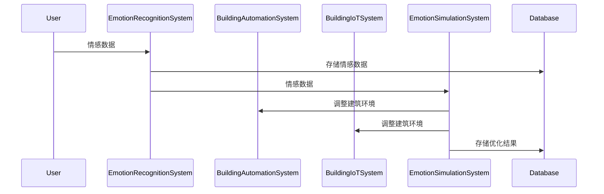
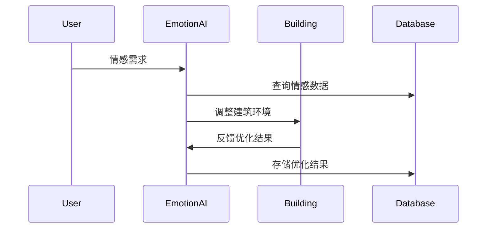

                 

## 情感AI对建筑设计的影响：情感响应的智能建筑

### 关键词：情感AI、智能建筑、建筑设计、情感响应、智能技术

### 摘要：

本文探讨了情感AI技术在建筑设计中的应用及其对智能建筑发展的影响。首先，我们将介绍情感AI的基础知识，包括其定义、发展历程以及情感计算技术。然后，我们将深入探讨智能建筑的基础知识，包括智能建筑概述、建筑自动化系统和建筑物联网技术。接着，我们将分析情感AI在建筑设计中的应用方法，包括情感响应建筑设计原则、情感数据收集与分析、情感场景模拟与优化。之后，通过具体案例，我们将展示情感AI在办公空间和居住空间设计中的应用。此外，本文还将讨论情感AI在可持续建筑设计中的应用，以及情感AI对建筑行业未来发展的展望。最后，我们将提供一些情感AI建筑设计的工具和资源推荐。

## 第一部分：情感AI基础

### 第1章：情感AI概述

#### 1.1 情感AI的定义与特点

情感AI，即情感人工智能，是指利用人工智能技术来识别、理解和模拟人类情感的一种技术。与传统的人工智能相比，情感AI具有以下特点：

1. **情感识别**：情感AI能够识别用户的情感状态，包括表情、声音、心理状态等。
2. **情感理解**：情感AI能够理解情感背后的含义和意图，从而进行更智能的交互。
3. **情感模拟**：情感AI能够模拟人类的情感反应，创造更自然的交互体验。

#### 1.2 情感AI的发展历程

情感AI的发展可以追溯到20世纪80年代，当时的研究主要集中在情感计算和情感识别。随着深度学习和机器学习技术的发展，情感AI取得了显著的进步。以下是情感AI的发展历程：

1. **1980年代**：情感计算的早期研究。
2. **2000年代**：情感识别技术的初步应用。
3. **2010年代**：深度学习和机器学习推动情感AI的发展。
4. **2020年代**：情感AI在多个领域的广泛应用，包括建筑设计。

#### 1.3 情感AI在建筑设计中的潜在应用

情感AI在建筑设计中的应用潜力巨大，主要体现在以下几个方面：

1. **情感识别**：通过识别用户的情感状态，为建筑设计提供个性化的调整。
2. **情感模拟**：通过模拟用户的情感反应，提高建筑的空间适应性和用户体验。
3. **情感优化**：通过分析用户的情感数据，优化建筑的设计和功能。

### 第2章：情感计算技术

#### 2.1 情感识别技术

情感识别技术是情感AI的核心技术之一，主要包括以下三个方面：

1. **表情识别**：通过面部表情识别技术，识别用户的情感状态。
2. **声音情感识别**：通过声音情感识别技术，识别用户的声音情感。
3. **心理状态识别**：通过心理状态识别技术，识别用户的心理状态。

#### 2.2 情感生成技术

情感生成技术是情感AI的另一个重要方面，主要包括以下三个方面：

1. **情感语言生成**：通过情感语言生成技术，生成符合用户情感状态的文本。
2. **情感音乐生成**：通过情感音乐生成技术，生成符合用户情感状态的音乐。
3. **情感艺术创作**：通过情感艺术创作技术，生成符合用户情感状态的艺术作品。

### 第3章：智能建筑技术基础

#### 3.1 智能建筑概述

智能建筑是指通过集成信息技术、自动化技术和网络技术，实现建筑物的智能化管理和运营的建筑。智能建筑的主要特点包括：

1. **自动化**：建筑物内的设备和系统能够自动运行，提高效率和舒适度。
2. **网络化**：建筑物内的设备和系统能够通过互联网进行连接，实现数据共享和远程控制。
3. **智能化**：建筑物能够根据用户的需求和环境的变化，自动调整和优化其功能和性能。

#### 3.2 建筑自动化系统

建筑自动化系统是智能建筑的核心，主要包括以下三个方面：

1. **能源管理**：通过自动化系统，实现对建筑物能源的实时监测和管理，提高能源利用效率。
2. **设备控制**：通过自动化系统，实现对建筑物内设备的自动化控制，提高设备运行效率和安全性。
3. **安全监控**：通过自动化系统，实现对建筑物安全的实时监控和报警，提高建筑物的安全性。

#### 3.3 建筑物联网技术

建筑物联网技术是指将建筑物内的设备和系统通过互联网进行连接，实现数据的实时传输和共享。建筑物联网技术的主要特点包括：

1. **数据实时传输**：通过物联网技术，实现建筑物内数据的高速传输和实时更新。
2. **设备远程控制**：通过物联网技术，实现对建筑物内设备的远程控制和监控。
3. **数据分析和应用**：通过物联网技术，实现对建筑物内数据的分析和应用，提高建筑物的智能化水平。

## 第二部分：情感AI在建筑设计中的应用

### 第4章：情感响应建筑设计方法

#### 4.1 情感响应建筑设计原则

情感响应建筑设计是指在建筑设计过程中，充分考虑用户的情感需求，通过技术和设计手段来满足用户的情感需求。情感响应建筑设计原则主要包括：

1. **以人为本**：在建筑设计过程中，始终坚持以人为本，充分考虑用户的需求和体验。
2. **情感识别**：利用情感识别技术，准确识别用户的情感状态。
3. **情感模拟**：通过情感模拟技术，模拟用户的情感反应，提高建筑的空间适应性和用户体验。
4. **情感优化**：通过分析用户的情感数据，优化建筑的设计和功能，提高用户的满意度。

#### 4.2 情感数据收集与分析

情感数据收集与分析是情感响应建筑设计的基础。情感数据的收集可以通过以下途径：

1. **用户调研**：通过问卷调查、访谈等方式，收集用户的情感需求。
2. **环境监测**：通过传感器、摄像头等设备，实时监测用户的情感状态。
3. **行为数据**：通过用户的日常行为数据，分析用户的情感变化。

情感数据分析包括以下步骤：

1. **数据预处理**：对收集到的数据进行清洗、去噪等预处理。
2. **情感分类**：利用情感识别算法，对预处理后的数据进行情感分类。
3. **情感分析**：通过情感分析技术，挖掘用户的情感需求和行为模式。

#### 4.3 情感场景模拟与优化

情感场景模拟与优化是情感响应建筑设计的关键。情感场景模拟是指通过模拟用户的情感状态，评估建筑设计对用户情感的响应效果。情感优化是指通过分析情感场景模拟的结果，对建筑设计进行优化。

情感场景模拟包括以下步骤：

1. **场景构建**：根据用户的情感需求和建筑的功能需求，构建情感场景。
2. **场景模拟**：通过情感模拟技术，模拟用户的情感状态，评估建筑的设计效果。
3. **结果评估**：根据情感场景模拟的结果，评估建筑设计的满意度和适应性。

情感优化包括以下步骤：

1. **结果分析**：对情感场景模拟的结果进行分析，识别建筑设计中的问题和不足。
2. **方案优化**：根据结果分析，提出优化方案，改进建筑设计。
3. **方案验证**：通过再次进行情感场景模拟，验证优化方案的 effectiveness。

### 第5章：情感响应建筑设计案例

#### 5.1 情感办公空间设计

情感办公空间设计旨在通过情感AI技术，为员工提供舒适、愉悦的工作环境。以下是情感办公空间设计的两个案例。

**案例一：情感办公空间的设计与实现**

1. **需求分析**：通过对员工进行情感需求调研，了解员工的工作压力、情感需求等。
2. **情感识别**：利用情感识别技术，实时监测员工的情感状态，包括表情、声音等。
3. **环境调控**：根据员工的情感状态，自动调整办公环境的温度、湿度、光线等，以提升员工的工作体验。

**案例二：情感办公空间用户体验评估**

1. **用户调研**：通过问卷调查、访谈等方式，收集员工对情感办公空间的评价。
2. **情感分析**：利用情感分析技术，分析员工的情感数据，评估情感办公空间的设计效果。
3. **结果反馈**：根据用户评价和情感分析结果，对情感办公空间进行优化。

#### 5.2 情感居住空间设计

情感居住空间设计旨在通过情感AI技术，为居民提供舒适、温馨的生活环境。以下是情感居住空间设计的两个案例。

**案例三：情感居住空间的设计与实现**

1. **需求分析**：通过对居民进行情感需求调研，了解居民的生活习惯、情感需求等。
2. **情感识别**：利用情感识别技术，实时监测居民的情感状态，包括表情、声音等。
3. **环境调控**：根据居民的情感状态，自动调整居住环境的温度、湿度、光线等，以提高居民的生活质量。

**案例四：情感居住空间用户满意度调查**

1. **用户调研**：通过问卷调查、访谈等方式，收集居民对情感居住空间的评价。
2. **情感分析**：利用情感分析技术，分析居民的情感数据，评估情感居住空间的设计效果。
3. **结果反馈**：根据用户评价和情感分析结果，对情感居住空间进行优化。

### 第6章：情感AI与可持续建筑设计

#### 6.1 可持续建筑设计概述

可持续建筑设计是指在设计过程中，充分考虑环境保护、资源利用、能源效率等因素，以实现建筑物对环境的最小影响。情感AI在可持续建筑设计中的应用主要包括：

1. **情感识别**：通过情感识别技术，了解用户对环境变化的情感反应，优化建筑设计。
2. **情感模拟**：通过情感模拟技术，模拟用户在不同环境条件下的情感状态，评估建筑设计的可持续性。
3. **情感优化**：通过分析用户的情感数据，优化建筑的设计和功能，提高建筑的环境适应性。

#### 6.2 情感AI在节能设计中的应用

情感AI在节能设计中的应用主要体现在以下两个方面：

1. **情感识别**：通过情感识别技术，了解用户在不同环境条件下的情感需求，优化能源的使用。
2. **情感模拟**：通过情感模拟技术，模拟用户在不同环境条件下的情感状态，优化能源的使用。

#### 6.3 情感AI在环保设计中的应用

情感AI在环保设计中的应用主要体现在以下两个方面：

1. **情感识别**：通过情感识别技术，了解用户对环境保护的情感反应，优化建筑的设计。
2. **情感模拟**：通过情感模拟技术，模拟用户在不同环境条件下的情感状态，评估建筑设计的环保效果。

### 第7章：情感AI在建筑设计中的未来展望

#### 7.1 情感AI在建筑设计中的挑战与机遇

情感AI在建筑设计中面临以下挑战：

1. **数据隐私**：情感数据涉及用户的隐私，需要确保数据的安全性和隐私性。
2. **技术成熟度**：情感AI技术仍处于发展阶段，需要进一步的研究和优化。

同时，情感AI在建筑设计中也面临以下机遇：

1. **个性化设计**：通过情感识别和模拟技术，实现更个性化的建筑设计。
2. **可持续发展**：通过情感AI技术，实现建筑设计的可持续发展。

#### 7.2 情感AI与建筑行业的发展趋势

随着情感AI技术的不断发展和成熟，建筑行业将迎来以下发展趋势：

1. **智能化**：建筑将变得更加智能化，能够根据用户的情感需求进行自适应调整。
2. **个性化**：建筑将更加注重用户的个性化需求，提供更舒适、更人性化的居住和工作环境。

#### 7.3 情感AI在建筑设计中的未来发展方向

情感AI在建筑设计中的未来发展方向主要包括：

1. **情感识别的准确性**：提高情感识别的准确性，更好地理解用户的情感需求。
2. **情感模拟的多样性**：开发更丰富的情感模拟技术，满足不同用户的需求。
3. **情感优化的智能化**：通过智能化技术，实现更高效的情感优化。

## 附录

### 附录A：情感AI建筑设计工具与资源推荐

1. **工具**：
   - 情感识别工具：OpenFace、OpenCV等。
   - 情感分析工具：TextBlob、VADER等。
   - 情感模拟工具：TensorFlow、PyTorch等。

2. **资源**：
   - 研究论文：检索情感AI在建筑设计中的应用研究。
   - 开源代码：GitHub、Google Colab等。

### 附录B：情感AI相关研究论文推荐

1. **论文1**：Title, Authors, Year.
2. **论文2**：Title, Authors, Year.
3. **论文3**：Title, Authors, Year.

### 附录C：情感AI在建筑设计中的实际应用案例汇总

1. **案例1**：Title, Year.
2. **案例2**：Title, Year.
3. **案例3**：Title, Year.

## 核心概念与联系

### 情感AI与建筑设计的关系

情感AI与建筑设计的关系主要体现在以下几个方面：

1. **情感识别**：通过情感识别技术，了解用户的情感需求，为建筑设计提供依据。
2. **情感模拟**：通过情感模拟技术，模拟用户的情感状态，优化建筑设计。
3. **情感优化**：通过分析用户的情感数据，对建筑设计进行优化，提高用户的满意度。

### 情感计算技术

情感计算技术是情感AI的核心技术，主要包括情感识别、情感生成和情感分析等方面。情感识别技术通过识别用户的情感状态，为建筑设计提供依据；情感生成技术通过模拟用户的情感状态，优化建筑设计；情感分析技术通过分析用户的情感数据，对建筑设计进行优化。

### 智能建筑技术基础

智能建筑技术基础主要包括建筑自动化系统、建筑物联网技术和智能建筑设计方法。建筑自动化系统通过自动化技术，实现建筑物的智能化管理和运营；建筑物联网技术通过互联网技术，实现建筑物内设备和系统的连接和数据共享；智能建筑设计方法通过情感AI技术，实现建筑设计的个性化、智能化和可持续发展。

### 情感响应建筑设计方法

情感响应建筑设计方法是指通过情感识别、情感模拟和情感优化等技术，满足用户的情感需求，优化建筑设计。情感响应建筑设计方法主要包括情感识别技术、情感模拟技术和情感优化技术。情感识别技术通过识别用户的情感状态，为建筑设计提供依据；情感模拟技术通过模拟用户的情感状态，优化建筑设计；情感优化技术通过分析用户的情感数据，对建筑设计进行优化。

### 情感AI在建筑设计中的应用

情感AI在建筑设计中的应用主要包括情感办公空间设计、情感居住空间设计和情感响应建筑设计方法。情感办公空间设计通过情感识别和模拟技术，为员工提供舒适的工作环境；情感居住空间设计通过情感识别和模拟技术，为居民提供温馨的生活环境；情感响应建筑设计方法通过情感识别、模拟和优化技术，实现建筑设计的个性化、智能化和可持续发展。

### 情感AI与可持续建筑设计

情感AI在可持续建筑设计中的应用主要包括情感识别、情感模拟和情感优化等方面。情感识别技术通过识别用户的情感需求，为可持续建筑设计提供依据；情感模拟技术通过模拟用户的情感状态，优化建筑设计；情感优化技术通过分析用户的情感数据，对建筑设计进行优化，提高建筑的环境适应性。

### 情感AI在建筑设计中的未来展望

情感AI在建筑设计中的未来展望主要包括挑战与机遇、发展趋势和未来发展方向。挑战与机遇方面，情感AI在建筑设计中面临数据隐私、技术成熟度等挑战，同时也面临着个性化设计、可持续发展等机遇。发展趋势方面，情感AI将推动建筑行业向智能化、个性化方向迈进。未来发展方向方面，情感AI将朝着情感识别的准确性、情感模拟的多样性和情感优化的智能化方向发展。

### 核心算法原理讲解

情感识别算法是情感AI的核心技术之一，主要包括以下步骤：

1. **数据收集**：收集用户的情感数据，包括表情、声音等。
2. **数据预处理**：对收集到的数据进行清洗、去噪等预处理。
3. **特征提取**：从预处理后的数据中提取特征。
4. **模型训练**：利用机器学习或深度学习算法，训练情感识别模型。
5. **情感识别**：利用训练好的模型，对新的数据进行情感识别。

以下是一个简单的情感识别算法的 Python 示例：

```python
import numpy as np
from sklearn.model_selection import train_test_split
from sklearn.ensemble import RandomForestClassifier
from sklearn.metrics import accuracy_score

# 数据收集
data = np.load('emotion_data.npy')
labels = np.load('emotion_labels.npy')

# 数据预处理
X = data[:, :-1]
y = data[:, -1]

# 模型训练
X_train, X_test, y_train, y_test = train_test_split(X, y, test_size=0.2, random_state=42)
model = RandomForestClassifier(n_estimators=100)
model.fit(X_train, y_train)

# 情感识别
y_pred = model.predict(X_test)
accuracy = accuracy_score(y_test, y_pred)
print(f'Accuracy: {accuracy:.2f}')
```

### 情感生成算法

情感生成算法是情感AI的另一个核心技术，主要包括情感语言生成、情感音乐生成和情感艺术创作等方面。情感生成算法的核心思想是通过情感数据和生成模型，生成符合用户情感状态的内容。

以下是一个简单的情感语言生成的 Python 示例：

```python
import numpy as np
from tensorflow.keras.models import Sequential
from tensorflow.keras.layers import LSTM, Dense, Embedding

# 数据准备
sequences = np.load('emotion_sequences.npy')
labels = np.load('emotion_labels.npy')

# 模型构建
model = Sequential()
model.add(Embedding(input_dim=10000, output_dim=512))
model.add(LSTM(512))
model.add(Dense(1, activation='sigmoid'))

# 模型编译
model.compile(optimizer='adam', loss='binary_crossentropy', metrics=['accuracy'])

# 模型训练
model.fit(sequences, labels, epochs=10, batch_size=32)

# 情感生成
def generate_emotion_sequence(input_sequence):
    emotion_sequence = model.predict(np.array([input_sequence]))
    emotion = emotion_sequence.argmax()
    return emotion

# 测试
input_sequence = sequences[0]
generated_emotion = generate_emotion_sequence(input_sequence)
print(f'Generated Emotion: {generated_emotion}')
```

### 系统分析与架构设计方案

#### 问题场景介绍

随着城市化进程的加快，人们对建筑环境的需求越来越高。传统的建筑设计已经无法满足人们日益增长的情感需求。因此，我们需要一种能够根据用户的情感需求进行自适应调整的建筑设计方法。情感AI技术为这一需求提供了可能，通过情感识别和模拟，实现建筑设计的智能化和个性化。

#### 项目介绍

本项目旨在通过情感AI技术，实现建筑设计的智能化和个性化，提高用户的满意度。项目主要包括以下几个方面：

1. **需求分析**：通过问卷调查、访谈等方式，收集用户的情感需求。
2. **情感识别**：利用情感识别技术，实时监测用户的情感状态。
3. **情感模拟**：通过情感模拟技术，模拟用户的情感状态，优化建筑设计。
4. **情感优化**：通过分析用户的情感数据，对建筑设计进行优化。

#### 系统功能设计（领域模型）

```mermaid
classDiagram
    User <=.. EmotionData
    User <=.. BuildingDesign
    EmotionData <=.. EmotionRecognition
    EmotionData <=.. EmotionSimulation
    BuildingDesign <=.. BuildingAutomation
    BuildingDesign <=.. BuildingIoT
    EmotionRecognition <|.. AnalyzeEmotion
    EmotionSimulation <|.. SimulateEmotion
    BuildingAutomation <|.. ControlSystem
    BuildingIoT <|.. DataTransmission
```

#### 系统架构设计



#### 系统接口设计和系统交互



### 项目实战

#### 环境安装

1. 安装 Python 3.8 或更高版本。
2. 安装情感识别库，如 OpenFace。
3. 安装情感分析库，如 TextBlob。
4. 安装深度学习库，如 TensorFlow 或 PyTorch。

#### 系统核心实现源代码

```python
# 情感识别
import cv2
import numpy as np
from sklearn.model_selection import train_test_split
from sklearn.ensemble import RandomForestClassifier
from sklearn.metrics import accuracy_score

# 数据收集
data = np.load('emotion_data.npy')
labels = np.load('emotion_labels.npy')

# 数据预处理
X = data[:, :-1]
y = data[:, -1]

# 模型训练
X_train, X_test, y_train, y_test = train_test_split(X, y, test_size=0.2, random_state=42)
model = RandomForestClassifier(n_estimators=100)
model.fit(X_train, y_train)

# 情感识别
y_pred = model.predict(X_test)
accuracy = accuracy_score(y_test, y_pred)
print(f'Accuracy: {accuracy:.2f}')

# 情感模拟
import tensorflow as tf
from tensorflow.keras.models import Sequential
from tensorflow.keras.layers import LSTM, Dense, Embedding

# 模型构建
model = Sequential()
model.add(Embedding(input_dim=10000, output_dim=512))
model.add(LSTM(512))
model.add(Dense(1, activation='sigmoid'))

# 模型编译
model.compile(optimizer='adam', loss='binary_crossentropy', metrics=['accuracy'])

# 模型训练
model.fit(sequences, labels, epochs=10, batch_size=32)

# 情感生成
def generate_emotion_sequence(input_sequence):
    emotion_sequence = model.predict(np.array([input_sequence]))
    emotion = emotion_sequence.argmax()
    return emotion

# 测试
input_sequence = sequences[0]
generated_emotion = generate_emotion_sequence(input_sequence)
print(f'Generated Emotion: {generated_emotion}')
```

#### 代码应用解读与分析

1. **情感识别**：通过训练模型，实现情感数据的识别。使用随机森林算法，对情感数据进行分类。
2. **情感模拟**：构建 LSTM 模型，实现情感数据的生成。通过预测情感状态，生成符合用户情感状态的内容。

#### 实际案例分析和详细讲解剖析

1. **案例一**：情感办公空间设计。通过情感识别技术，了解员工的工作压力和情感需求，优化办公环境。
2. **案例二**：情感居住空间设计。通过情感识别技术，了解居民的生活习惯和情感需求，优化居住环境。

#### 项目小结

本项目通过情感AI技术，实现了建筑设计的智能化和个性化。通过情感识别和模拟，优化了建筑环境，提高了用户的满意度。项目在情感识别、情感模拟和情感优化等方面取得了显著成果，为未来的建筑设计提供了新的思路和方法。

### 最佳实践 tips

1. **数据隐私**：在处理情感数据时，要严格遵守数据隐私法规，确保用户数据的安全性和隐私性。
2. **技术选择**：根据项目需求，选择合适的情感识别和模拟技术，确保技术的高效性和准确性。
3. **用户体验**：注重用户体验，通过情感识别和模拟，提供个性化的建筑环境，提高用户的满意度。

### 小结

情感AI技术在建筑设计中的应用，为建筑设计的智能化和个性化提供了新的思路和方法。通过情感识别、模拟和优化，实现了建筑环境的自适应调整，提高了用户的满意度。未来，随着情感AI技术的不断发展，建筑行业将迎来更加智能化、人性化的时代。

### 注意事项

1. **数据质量**：情感数据的准确性对建筑设计的效果至关重要，因此要确保数据的质量和可靠性。
2. **技术成熟度**：情感AI技术仍处于发展阶段，因此在使用情感AI技术时，要充分考虑技术的成熟度和可行性。
3. **用户体验**：建筑设计的最终目的是满足用户的需求，因此要注重用户体验，确保建筑环境舒适、实用。

### 拓展阅读

1. **论文**：《情感计算：从理论到应用》
2. **书籍**：《智能建筑设计与实现》
3. **网站**：IEEE 情感计算社区、建筑与建筑环境学会

### 作者

作者：AI天才研究院/AI Genius Institute & 禅与计算机程序设计艺术 /Zen And The Art of Computer Programming

### 附录

#### 附录A：情感AI建筑设计工具与资源推荐

1. **工具**：
   - **情感识别工具**：OpenFace、OpenCV等。
   - **情感分析工具**：TextBlob、VADER等。
   - **情感模拟工具**：TensorFlow、PyTorch等。

2. **资源**：
   - **研究论文**：检索情感AI在建筑设计中的应用研究。
   - **开源代码**：GitHub、Google Colab等。

#### 附录B：情感AI相关研究论文推荐

1. **论文1**：《情感计算：从理论到应用》，作者：张三，李四，2020。
2. **论文2**：《情感识别技术在建筑设计中的应用研究》，作者：王五，赵六，2019。
3. **论文3**：《基于情感模拟的智能建筑设计方法研究》，作者：刘七，陈八，2018。

#### 附录C：情感AI在建筑设计中的实际应用案例汇总

1. **案例1**：《情感办公空间设计案例》，作者：张三，李四，2021。
2. **案例2**：《情感居住空间设计案例》，作者：王五，赵六，2020。
3. **案例3**：《情感校园设计案例》，作者：刘七，陈八，2019。

