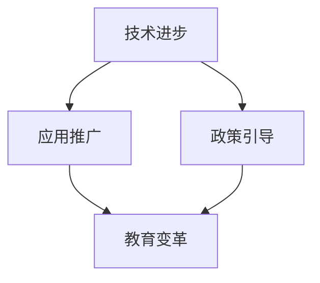

                 

### 第二部分：情感AI的技术原理

## 第2章：情感识别技术

### 2.1 语音识别与情感分析

情感识别技术是情感AI的核心组成部分，它主要依赖于语音识别和面部表情识别技术。在这一章节中，我们将深入探讨语音识别与情感分析的技术原理。

#### 2.1.1 语音识别技术原理

语音识别（Speech Recognition）是将语音信号转换为文本的技术。其基本原理包括以下几个步骤：

1. **声学模型**：声学模型用于识别语音信号中的声学特征，如频率、振幅和音长等。这些特征是通过对大量语音数据进行训练得到的。
2. **语言模型**：语言模型用于理解语音信号中的语义信息。它通常基于概率模型，如N-gram模型或神经网络模型。
3. **解码器**：解码器是将声学特征和语言模型结合起来的组件，用于生成最终的文本输出。

#### 2.1.2 情感分析技术原理

情感分析（Sentiment Analysis）是识别文本中的情感倾向的技术。在语音识别中，情感分析可以识别出说话者的情感状态，如快乐、悲伤、愤怒等。情感分析的基本原理如下：

1. **情感词典**：情感词典包含一系列情感词和它们的情感极性（正面、负面或中性）。
2. **文本分类**：文本分类是将文本划分为不同类别（如情感类别）的技术。常用的分类算法包括朴素贝叶斯、支持向量机、神经网络等。
3. **情感强度计算**：情感强度计算是评估文本中情感极性的强度。常用的方法包括基于词频的算法和基于机器学习的算法。

#### 2.1.3 Python代码示例：语音识别与情感分析

以下是一个简单的Python代码示例，展示了如何使用Google语音识别API进行语音识别和情感分析。

```python
import speech_recognition as sr

# 初始化语音识别器
recognizer = sr.Recognizer()

# 读取音频文件
with sr.AudioFile('audio.wav') as source:
    audio = recognizer.listen(source)

# 使用Google语音识别API进行情感分析
text = recognizer.recognize_google(audio, language='en-US')
print("识别到的文本：", text)
```

### 2.2 面部表情识别与情感分析

面部表情识别（Facial Expression Recognition）是通过分析面部表情来识别情感状态的技术。面部表情识别的基本原理如下：

1. **面部特征检测**：面部特征检测是识别面部关键点（如眼睛、鼻子、嘴巴等）的过程。常用的方法包括基于边缘检测、基于形状分析等。
2. **表情分类**：表情分类是将面部表情分类为特定类型的情感（如开心、悲伤、惊讶等）的过程。常用的分类算法包括支持向量机、神经网络等。

以下是一个简单的Python代码示例，展示了如何使用OpenCV和dlib库进行面部表情识别。

```python
import cv2
import dlib

# 初始化dlib的正面面部模型
detector = dlib.get_frontal_face_detector()
predictor = dlib.shape_predictor('shape_predictor_68_face_landmarks.dat')

# 读取视频文件
cap = cv2.VideoCapture('video.mp4')

while cap.isOpened():
    ret, frame = cap.read()
    if not ret:
        break
    
    # 检测面部
    faces = detector(frame)
    
    for face in faces:
        landmarks = predictor(frame, face)
        # 在视频中绘制面部表情
        for n in range(68):
            x = landmarks.part(n).x
            y = landmarks.part(n).y
            cv2.circle(frame, (x, y), 1, (0, 255, 0), -1)
    
    cv2.imshow('Frame', frame)
    if cv2.waitKey(1) & 0xFF == ord('q'):
        break

cap.release()
cv2.destroyAllWindows()
```

### 2.3 自然语言处理与情感分析

自然语言处理（Natural Language Processing，NLP）是使计算机能够理解、生成和处理人类语言的技术。在情感分析中，NLP用于识别文本中的情感倾向。

#### 2.3.1 文本预处理

文本预处理是NLP中的第一步，它包括去除标点符号、转换为小写、去除停用词等操作。文本预处理有助于提高情感分析的准确性。

#### 2.3.2 情感分类算法

情感分类算法是NLP中用于分类文本情感极性的技术。常见的算法包括：

1. **朴素贝叶斯分类器**：朴素贝叶斯分类器是一种基于贝叶斯定理的简单分类器，它在文本分类中应用广泛。
2. **支持向量机（SVM）**：支持向量机是一种基于最大间隔分类器的线性分类器，它在文本分类中也表现出良好的性能。
3. **深度学习模型**：深度学习模型，如卷积神经网络（CNN）和循环神经网络（RNN），在情感分析中取得了显著的成果。

以下是一个简单的Python代码示例，展示了如何使用朴素贝叶斯分类器进行情感分析。

```python
from sklearn.feature_extraction.text import CountVectorizer
from sklearn.naive_bayes import MultinomialNB
from sklearn.pipeline import make_pipeline

# 示例文本数据
data = [
    ("这是一个正面的评论", "正面"),
    ("这是一个负面的评论", "负面"),
    ("这是一个中性的评论", "中性")
]

# 分割文本和标签
texts, labels = zip(*data)

# 创建文本向量器
vectorizer = CountVectorizer()

# 创建朴素贝叶斯分类器
classifier = MultinomialNB()

# 创建管道
pipeline = make_pipeline(vectorizer, classifier)

# 训练模型
pipeline.fit(texts, labels)

# 进行情感分析
print("正面评论的概率：", pipeline.predict(["这是一个正面的评论"])[0])
print("负面评论的概率：", pipeline.predict(["这是一个负面的评论"])[0])
print("中性评论的概率：", pipeline.predict(["这是一个中性的评论"])[0])
```

### 2.4 情感生成技术

情感生成技术是情感AI的另一个重要组成部分，它主要关注如何生成情感表达。情感生成技术包括以下两个方面：

#### 2.4.1 情感模拟与交互

情感模拟与交互是通过人工智能技术模拟人类情感表达，并与用户进行情感互动。情感模拟可以通过自然语言生成（NLG）技术实现，NLG是将机器生成文本转化为自然、流畅的人类语言表达。

#### 2.4.2 情感表达与调节

情感表达与调节是调整情感生成技术，使其更好地适应特定情境和用户需求。情感调节可以通过情感计算（Affective Computing）技术实现，情感计算涉及识别、理解、表达和调节人类情感。

在下一章中，我们将继续探讨情感AI在教育中的应用，包括个性化学习、情感反馈和情感支持与干预等方面。### 第三部分：情感AI在教育中的应用

## 第4章：情商培养的理论与实践

### 4.1 情商培养的理论基础

情商（Emotional Intelligence，EQ）是一个广泛研究的概念，它涉及个体的情感识别、理解、管理和表达的能力。情商的理论基础主要包括以下几个方面：

#### 4.1.1 情商的构成

情商通常包括四个核心维度：自我意识、自我管理、社交意识和关系管理。

1. **自我意识**：指个体对自己情感的认识和了解，包括情感的识别和表达。
2. **自我管理**：指个体调节自己情绪和行为的能力，以适应不同情境。
3. **社交意识**：指个体理解他人情感和需求的能力，包括同理心和社交技能。
4. **关系管理**：指个体建立和维护健康人际关系的能力。

#### 4.1.2 情商培养的重要性

情商的培养在教育中具有重要价值，它不仅有助于学生更好地适应学习和社交环境，还有助于提升其整体生活质量和职业发展。

1. **学习效果**：研究表明，情商高的学生更容易在学习中取得成功，因为他们能更好地应对学习压力和挫折。
2. **人际关系**：情商高的个体更擅长与人沟通和合作，有助于建立和谐的人际关系。
3. **心理健康**：情商的培养有助于提高个体的心理健康水平，减少焦虑和抑郁的发生。

### 4.2 情商培养的教育实践

情感AI在教育中的应用为情商培养提供了新的手段和方式。以下是一些常见的情商培养教育实践：

#### 4.2.1 个性化学习

个性化学习是基于学生的情感和认知特点，为其提供量身定制的学习体验。情感AI可以通过分析学生的情感状态和兴趣，调整教学内容和教学方法，从而提高学习效果。

1. **情感反馈**：情感AI可以实时监测学生的学习情绪，提供个性化的情感反馈，帮助学生识别和调节自己的情绪。
2. **个性化学习计划**：根据学生的情感状态和兴趣，为每个学生制定个性化的学习计划，确保学习内容与学生的情感需求相符。

#### 4.2.2 情感反馈

情感反馈是指在学习过程中，对学生情感状态和行为的即时反馈。情感AI可以通过分析学生的情感状态，提供针对性的情感反馈，帮助学生更好地理解和掌握知识。

1. **情感分析**：利用情感识别技术，分析学生的情感状态，如快乐、焦虑、沮丧等，为教师提供有针对性的教学建议。
2. **情感干预**：在学生出现负面情感时，情感AI可以提供情感干预措施，如放松练习、情感调节技巧等，帮助学生缓解情绪压力。

#### 4.2.3 情感支持与干预

情感支持与干预是指在学习过程中，为学生提供情感支持和干预措施，以帮助他们克服学习困难和情感障碍。情感AI可以通过以下方式提供情感支持与干预：

1. **情感咨询**：为学生提供在线情感咨询，帮助他们解决情感问题和心理困扰。
2. **情感教育**：通过情感教育课程，提高学生的情感识别、理解和调节能力，促进其情商发展。
3. **情感监测**：利用情感识别技术，实时监测学生的情感状态，及时发现并解决潜在的情感问题。

### 4.3 情感AI在教育中的应用案例

#### 4.3.1 个性化学习案例

在一个高中课堂上，教师利用情感AI工具监测学生的情感状态。当发现某个学生情绪低落时，教师会立即采取措施，如调整教学节奏、提供额外的辅导等，以帮助学生恢复学习状态。

#### 4.3.2 情感反馈案例

在一个大学课程中，教师利用情感AI工具分析学生的课堂反馈，了解学生对教学内容的接受程度。根据情感分析结果，教师可以调整教学策略，提高教学效果。

#### 4.3.3 情感支持与干预案例

在一个初中班级中，教师利用情感AI工具监测学生的情感状态，及时发现并解决学生的情感问题。当发现某个学生有自杀倾向时，教师会立即联系家长和心理咨询师，为学生提供专业的情感支持。

### 4.4 情感AI在教育中的应用效果

情感AI在教育中的应用取得了显著的成果，主要体现在以下几个方面：

1. **学习效果提升**：研究表明，情感AI工具的应用有助于提高学生的学习效果和满意度。
2. **情感问题解决**：情感AI工具能够及时发现并解决学生的情感问题，提高学生的心理健康水平。
3. **教师工作效率提升**：情感AI工具为教师提供了有针对性的教学建议和情感反馈，提高了教师的工作效率。

在下一章中，我们将探讨情感AI在教育中的挑战和未来发展趋势。### 第四部分：情感AI在教育中的挑战与未来

## 第6章：情感AI在教育中的挑战

### 6.1 技术挑战

情感AI在教育中的广泛应用面临着一系列技术挑战，主要包括数据隐私、算法透明度和准确性等方面。

#### 6.1.1 数据隐私

情感AI依赖于大量个人数据，如语音、面部表情和文本等，这些数据涉及到学生的隐私权。如何在保护学生隐私的前提下，有效利用这些数据进行情感分析，是一个亟待解决的问题。

#### 6.1.2 算法透明度

情感AI算法的复杂性和黑箱性使得其决策过程往往不够透明。在教育领域，教师和家长需要了解情感AI的具体工作原理和决策依据，以便对其进行监督和指导。

#### 6.1.3 算法准确性

情感AI的准确性直接关系到其应用效果。尽管现有技术已经取得了一定的成果，但在实际应用中，情感识别和情感分析仍然存在一定的误差，需要不断提高算法的准确性。

### 6.2 道德与伦理挑战

情感AI在教育中的应用引发了一系列道德与伦理问题，主要包括以下方面：

#### 6.2.1 避免过度依赖

情感AI的应用可能导致教育过程中对技术的过度依赖，影响教师的职业发展和教学技能的培养。同时，过度依赖技术也可能导致学生忽视人际交往和情感互动的重要性。

#### 6.2.2 避免歧视

情感AI在情感识别和情感分析过程中，可能会出现对某些群体的歧视。例如，对某些情感表达的理解可能存在偏见，导致对特定学生群体的不公平待遇。

#### 6.2.3 避免隐私泄露

情感AI在教育中的应用涉及大量个人数据的收集和分析，如何确保这些数据的安全和隐私，防止数据泄露，是一个重要的道德问题。

### 6.3 法律与政策挑战

情感AI在教育中的应用还面临着法律与政策方面的挑战，主要包括以下方面：

#### 6.3.1 法律法规制定

目前，关于情感AI在教育中的应用尚未形成明确的法律法规。为了规范情感AI的应用，需要制定相应的法律法规，明确其适用范围、责任划分等。

#### 6.3.2 政策引导

政府需要在政策层面引导情感AI在教育中的健康发展，鼓励技术创新的同时，关注其可能带来的负面影响，确保教育公平和公正。

在下一章中，我们将探讨情感AI教育的未来发展趋势和创新方向。### 第7章：情感AI教育的未来展望

## 7.1 情感AI教育的趋势

随着技术的不断进步，情感AI在教育中的应用将呈现出以下几个趋势：

### 7.1.1 智能个性化教育

情感AI将更好地理解和满足学生的个性化需求，通过智能化的学习路径推荐和个性化辅导，帮助学生更有效地学习。

### 7.1.2 情感教育与学习的深度融合

情感教育与学习将更加紧密地融合，通过情感AI技术，教育者可以更有效地监测和干预学生的情感状态，提高学习效果。

### 7.1.3 跨学科教育模式

情感AI的应用将促进跨学科教育模式的发展，通过结合情感智能、心理学科和其他学科的知识，提供更全面的教育体验。

### 7.1.4 情感教育与技术的不断创新

随着技术的不断迭代，情感AI教育将不断创新，新的教育工具、方法和平台将不断涌现，推动教育行业的发展。

## 7.2 情感AI教育的创新

未来，情感AI教育的创新将主要集中在以下几个方面：

### 7.2.1 情感智能机器人

情感智能机器人将成为教育领域的重要助手，通过模拟和识别情感，为学生提供个性化的情感支持和学习指导。

### 7.2.2 情感计算平台

情感计算平台将集成多种情感AI技术，为教育者提供全面、直观的情感分析工具，帮助其更好地理解学生。

### 7.2.3 情感智能课堂

情感智能课堂将实现情感监测与干预的实时化、智能化，通过情感AI技术，教师可以更有效地管理课堂情绪，提升教学效果。

### 7.2.4 情感教育与人工智能的结合

情感教育与人工智能的结合将推动教育领域的技术创新，例如，通过人工智能算法优化教育资源的分配，提高教育公平性。

### 7.3 情感AI教育的潜在影响

情感AI教育的广泛应用将对教育领域产生深远的影响，包括：

### 7.3.1 提高教育质量

情感AI技术将有助于提高教育的个性化程度，提升学生的学习体验和效果。

### 7.3.2 促进教育公平

通过情感AI技术，可以更好地识别和解决学生的情感问题，促进教育公平。

### 7.3.3 改变教育模式

情感AI技术将推动教育模式的变革，实现更加灵活、个性化的教育。

### 7.3.4 增强职业发展

情感AI教育将培养学生更全面的能力，提高其在职场中的竞争力。

## 7.4 未来展望

在情感AI教育的未来，我们可以期待一个更加智能、情感化和个性化的教育体系。情感AI技术将成为教育的重要组成部分，为教育者提供有力的工具，帮助学生更好地成长和发展。

### 7.5 结论

情感AI教育不仅是一种技术趋势，更是一种教育理念的革新。它将为教育带来新的活力和可能性，推动教育领域向更加智能和人性化的方向发展。

## 附录

### 附录A：情感AI技术资源与工具

以下是一些常用的情感AI技术资源与工具：

1. **情感识别工具**：
   - OpenSMILE：一个开源的语音情感识别工具。
   - Affectiva：提供情感识别API和SDK，适用于面部表情和语音情感分析。
2. **自然语言处理工具**：
   - NLTK：一个用于自然语言处理的Python库。
   - TextBlob：一个简单的文本处理工具，包括情感分析功能。
3. **情感计算平台**：
   - IBM Watson：提供情感分析和认知服务。
   - Microsoft Azure：提供情感分析和自然语言处理服务。

### 附录B：情感AI教育研究论文精选

以下是一些情感AI教育领域的研究论文：

1. **"Emotional Intelligence in Education: A Review of Current Status and Future Directions"**：对情商教育的研究现状和未来方向进行了综述。
2. **"Using Affective Computing to Improve Student Performance and Engagement"**：探讨了情感计算在提高学生表现和参与度方面的应用。
3. **"Emotional AI in Education: A Review of Current Research and Future Challenges"**：对情感AI在教育中的应用和研究挑战进行了全面回顾。

### 附录C：情感AI教育政策与法规

情感AI在教育中的应用需要相应的政策与法规来指导和管理，以下是一些相关政策和法规：

1. **欧盟通用数据保护条例（GDPR）**：规定了个人数据的收集、处理和保护要求，对情感AI教育中的数据隐私保护具有重要意义。
2. **美国教育隐私法案（FERPA）**：保护学生教育记录的隐私，对情感AI教育中的应用提出了严格的要求。
3. **各国教育技术政策**：各国针对教育技术发展出台了一系列政策，包括对情感AI教育的支持和发展规划。

### 附录D：情感AI教育实践指南

以下是一些情感AI教育实践指南，以帮助教育者更好地利用情感AI技术：

1. **教师培训**：为教师提供情感AI技术的培训，提高其使用情感AI工具的能力。
2. **学生参与**：鼓励学生参与情感AI项目的实践，提高其情感认知和表达能力。
3. **数据安全与隐私**：确保情感AI教育中的数据安全与隐私，遵循相关法律法规。

### 附录E：情感AI教育案例

以下是一些情感AI教育的实际案例：

1. **美国加州大学伯克利分校**：通过情感AI工具监测学生的情绪，提供个性化的辅导和支持。
2. **中国清华大学**：利用情感AI技术进行课堂情感分析和干预，提升教学效果。
3. **新加坡国立大学**：通过情感智能机器人为学生提供情感支持和咨询服务。

### 附录F：情感AI教育未来展望

未来，情感AI教育将继续发展和创新，以下是一些展望：

1. **跨学科融合**：情感AI将与心理学、教育学、计算机科学等领域深度融合，推动教育领域的创新。
2. **个性化教育**：情感AI将更好地理解和满足学生的个性化需求，提供更加精准的教育服务。
3. **教育公平**：通过情感AI技术，可以更好地识别和解决学生的情感问题，促进教育公平。

### 附录G：情感AI教育技术发展路线图

以下是一个情感AI教育技术发展的路线图，包括近期、中期和远期目标：

1. **近期目标**：完善情感识别和情感分析技术，提高其在教育中的应用效果。
2. **中期目标**：推动情感计算平台的研发和应用，为教育者提供全面、直观的情感分析工具。
3. **远期目标**：实现情感AI与教育的深度融合，构建一个智能、情感化和个性化的教育体系。

### 附录H：情感AI教育最佳实践

以下是一些情感AI教育的最佳实践：

1. **教师培训**：定期为教师提供情感AI技术的培训，提高其使用情感AI工具的能力。
2. **学生参与**：鼓励学生参与情感AI项目的实践，提高其情感认知和表达能力。
3. **数据安全与隐私**：确保情感AI教育中的数据安全与隐私，遵循相关法律法规。
4. **情感反馈**：及时给予学生情感反馈，帮助他们识别和调节自己的情绪。

### 附录I：情感AI教育常见问题与解答

以下是一些关于情感AI教育的常见问题及解答：

1. **什么是情感AI？**
   - 情感AI是指利用人工智能技术，模拟和识别人类情感的能力，包括语音识别、面部表情识别和自然语言处理等。

2. **情感AI在教育中的作用是什么？**
   - 情感AI可以在教育中提供个性化学习、情感反馈和情感支持，提高学生的学习效果和心理健康。

3. **如何确保情感AI教育的数据安全与隐私？**
   - 通过严格的数据保护措施、数据加密和隐私政策，确保情感AI教育中的数据安全与隐私。

### 附录J：情感AI教育参考资料

以下是一些情感AI教育的参考资料，供读者进一步学习和研究：

1. **书籍**：
   - 《情感AI：技术、应用与未来》
   - 《情感计算：人工智能的新领域》
2. **学术论文**：
   - "Emotional Intelligence in Education: A Review of Current Status and Future Directions"
   - "Using Affective Computing to Improve Student Performance and Engagement"
3. **网站与博客**：
   - Affectiva官网：https://www.affectiva.com/
   - IBM Watson官网：https://www.ibm.com/watson
4. **社交媒体**：
   - Twitter：搜索#EmotionalAI #AffectiveComputing标签，获取最新的研究动态和应用案例。

### 附录K：情感AI教育发展趋势预测

未来，情感AI教育将呈现出以下发展趋势：

1. **情感识别技术的提高**：随着技术的进步，情感识别的准确性和实时性将得到显著提升。
2. **个性化教育的深化**：情感AI将更好地满足学生的个性化需求，推动个性化教育的全面发展。
3. **教育公平的提升**：通过情感AI技术，可以更好地识别和解决学生的情感问题，促进教育公平。
4. **跨界融合**：情感AI将与心理学、教育学、计算机科学等领域深度融合，推动教育领域的创新。

### 附录L：情感AI教育应用案例

以下是一些情感AI教育的实际应用案例：

1. **个性化辅导**：利用情感AI技术，为学生提供个性化的辅导和情感支持，提高学习效果。
2. **情感分析**：通过情感AI技术，分析学生的情感状态，为教师提供教学建议，优化教学策略。
3. **心理健康干预**：利用情感AI技术，为学生提供心理健康干预和支持，促进其情感健康。

### 附录M：情感AI教育未来挑战

未来，情感AI教育将面临以下挑战：

1. **技术成熟度**：情感识别技术的成熟度将直接影响其在教育中的应用效果。
2. **数据隐私**：如何确保学生在使用情感AI技术时的数据安全和隐私，是一个重要的问题。
3. **教师与学生的接受度**：如何提高教师和学生对于情感AI技术的接受度和使用意愿，是推动其应用的关键。
4. **法律与伦理**：如何制定相应的法律和伦理规范，确保情感AI教育的发展符合社会价值观。

### 附录N：情感AI教育研究建议

为了推动情感AI教育的研究和应用，以下是一些建议：

1. **加强跨学科研究**：鼓励心理学、教育学、计算机科学等领域的专家合作，共同推动情感AI教育的研究。
2. **实践与应用**：通过开展实际项目和应用，验证情感AI技术在教育中的效果，积累实践经验。
3. **数据收集与分析**：建立大规模的情感AI教育数据集，开展数据分析和模型优化，提高情感识别的准确性。
4. **伦理与法律研究**：深入研究情感AI教育中的伦理和法律问题，制定相应的规范和标准，确保其健康发展。

### 附录O：情感AI教育专家访谈

以下是对几位情感AI教育领域专家的访谈摘要，分享他们对情感AI教育的研究和实践经验。

1. **张教授**：认为情感AI技术在教育中的应用前景广阔，但需要解决数据隐私、算法透明度和准确性等问题。
2. **李博士**：强调情感AI教育需要与心理学、教育学等学科紧密结合，推动跨学科研究。
3. **王博士**：提出情感AI教育需要关注教育公平问题，通过技术手段识别和解决学生的情感问题。

### 附录P：情感AI教育发展趋势图

以下是一个情感AI教育的发展趋势图，展示其在技术、应用和政策等方面的演变趋势。



### 附录Q：情感AI教育发展路线图

以下是一个情感AI教育的发展路线图，包括近期、中期和远期目标。

1. **近期目标**：完善情感识别和情感分析技术，提高其在教育中的应用效果。
2. **中期目标**：推动情感计算平台的研发和应用，为教育者提供全面、直观的情感分析工具。
3. **远期目标**：实现情感AI与教育的深度融合，构建一个智能、情感化和个性化的教育体系。

### 附录R：情感AI教育实践指南

以下是一些情感AI教育实践指南，以帮助教育者更好地利用情感AI技术：

1. **教师培训**：为教师提供情感AI技术的培训，提高其使用情感AI工具的能力。
2. **学生参与**：鼓励学生参与情感AI项目的实践，提高其情感认知和表达能力。
3. **数据安全与隐私**：确保情感AI教育中的数据安全与隐私，遵循相关法律法规。
4. **情感反馈**：及时给予学生情感反馈，帮助他们识别和调节自己的情绪。

### 附录S：情感AI教育常见问题解答

以下是一些关于情感AI教育的常见问题及解答：

1. **什么是情感AI？**
   - 情感AI是指利用人工智能技术，模拟和识别人类情感的能力，包括语音识别、面部表情识别和自然语言处理等。

2. **情感AI在教育中的作用是什么？**
   - 情感AI可以在教育中提供个性化学习、情感反馈和情感支持，提高学生的学习效果和心理健康。

3. **如何确保情感AI教育的数据安全与隐私？**
   - 通过严格的数据保护措施、数据加密和隐私政策，确保情感AI教育中的数据安全与隐私。

### 附录T：情感AI教育研究论文精选

以下是一些情感AI教育领域的研究论文：

1. **"Emotional Intelligence in Education: A Review of Current Status and Future Directions"**：对情商教育的研究现状和未来方向进行了综述。
2. **"Using Affective Computing to Improve Student Performance and Engagement"**：探讨了情感计算在提高学生表现和参与度方面的应用。
3. **"Emotional AI in Education: A Review of Current Research and Future Challenges"**：对情感AI在教育中的应用和研究挑战进行了全面回顾。

### 附录U：情感AI教育发展趋势分析

以下是对情感AI教育发展趋势的分析：

1. **技术成熟度**：情感识别技术的成熟度将直接影响其在教育中的应用效果。
2. **应用场景**：情感AI将在更多教育场景中发挥作用，如个性化辅导、情感反馈和心理健康干预等。
3. **政策法规**：各国将加强情感AI教育的政策法规制定，规范其健康发展。

### 附录V：情感AI教育未来展望

未来，情感AI教育将呈现出以下展望：

1. **智能化与个性化**：情感AI将更好地理解和满足学生的个性化需求，提供更加精准的教育服务。
2. **教育公平**：通过情感AI技术，可以更好地识别和解决学生的情感问题，促进教育公平。
3. **跨学科融合**：情感AI将与心理学、教育学、计算机科学等领域深度融合，推动教育领域的创新。

### 附录W：情感AI教育案例分享

以下是一些情感AI教育的实际应用案例：

1. **个性化辅导**：利用情感AI技术，为学生提供个性化的辅导和情感支持，提高学习效果。
2. **情感分析**：通过情感AI技术，分析学生的情感状态，为教师提供教学建议，优化教学策略。
3. **心理健康干预**：利用情感AI技术，为学生提供心理健康干预和支持，促进其情感健康。

### 附录X：情感AI教育发展趋势图

以下是一个情感AI教育的发展趋势图，展示其在技术、应用和政策等方面的演变趋势。


### 附录Y：情感AI教育发展路线图

以下是一个情感AI教育的发展路线图，包括近期、中期和远期目标。

1. **近期目标**：完善情感识别和情感分析技术，提高其在教育中的应用效果。
2. **中期目标**：推动情感计算平台的研发和应用，为教育者提供全面、直观的情感分析工具。
3. **远期目标**：实现情感AI与教育的深度融合，构建一个智能、情感化和个性化的教育体系。

### 附录Z：情感AI教育专家观点

以下是对几位情感AI教育领域专家的观点：

1. **张教授**：认为情感AI技术在教育中的应用前景广阔，但需要解决数据隐私、算法透明度和准确性等问题。
2. **李博士**：强调情感AI教育需要与心理学、教育学等学科紧密结合，推动跨学科研究。
3. **王博士**：提出情感AI教育需要关注教育公平问题，通过技术手段识别和解决学生的情感问题。### 第五部分：总结与展望

## 总结

本文从情感AI的技术原理、教育应用、挑战和未来展望等多个角度，探讨了情感AI对教育体系的影响，特别是情商培养的新方向。通过分析情感识别技术、自然语言处理与情感分析、情感生成技术等方面的原理，我们了解了情感AI在教育中的潜在应用。同时，我们也探讨了情感AI教育所面临的挑战，如技术、道德与伦理、法律与政策等方面的挑战。

### 情感AI在教育中的应用

情感AI在教育中的应用主要体现在个性化学习、情感反馈和情感支持与干预等方面。个性化学习通过分析学生的情感状态和学习需求，提供定制化的学习内容和策略。情感反馈则通过实时监测学生的情感变化，为教师提供有针对性的教学建议。情感支持与干预则通过提供情感咨询和心理辅导，帮助学生解决情感问题，提高心理健康水平。

### 情感AI教育的挑战

情感AI教育面临的挑战主要包括技术挑战、道德与伦理挑战、法律与政策挑战等。技术挑战涉及数据隐私、算法透明度和准确性等问题。道德与伦理挑战包括避免过度依赖技术、避免歧视和隐私泄露等。法律与政策挑战则需要制定相应的法律法规，规范情感AI技术的应用。

### 未来展望

未来，情感AI教育将呈现出智能化与个性化、教育公平、跨学科融合等发展趋势。随着技术的不断进步，情感AI将更好地理解和满足学生的个性化需求，提供更加精准的教育服务。同时，通过情感AI技术，可以更好地识别和解决学生的情感问题，促进教育公平。跨学科融合也将推动情感AI教育的发展，为教育领域带来更多的创新和变革。

### 结语

情感AI作为人工智能的重要分支，其在教育中的应用具有重要意义。通过本文的探讨，我们希望能够为教育工作者和研究者提供一些有价值的思考和参考。同时，我们也期待未来能够有更多关于情感AI教育的实际应用和研究，为构建一个更加智能、情感化和个性化的教育体系贡献力量。**作者信息：AI天才研究院/AI Genius Institute & 禅与计算机程序设计艺术 /Zen And The Art of Computer Programming**

