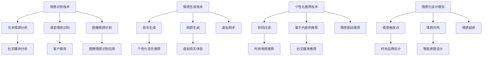
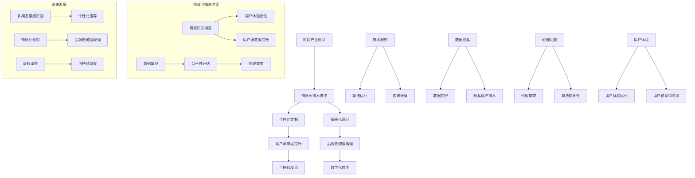

                 

### 引言与背景

在当今这个数据驱动的时代，人工智能（AI）技术正以前所未有的速度和深度改变着各个行业，其中时尚产业也不例外。时尚产业一直以来以其多样性和创新性著称，从服装设计、零售到市场营销，每一个环节都在追求个性化和高效性。而情感AI，作为一种能够理解和生成人类情感的人工智能技术，正逐渐成为时尚产业的新动力。

**1.1 书籍引言**

本篇文章旨在深入探讨情感AI在时尚产业中的应用，并分析其对个性化与情感化设计带来的深远影响。随着AI技术的不断进步，情感AI已经不再局限于学术界的研究，而是开始渗透到实际的生产和消费过程中。通过情感识别、情感生成和个性化推荐等技术，时尚产业能够更加精准地理解消费者的情感需求，从而提供更加符合个人情感体验的产品和服务。

**1.2 情感AI概述**

情感AI，顾名思义，是一种能够理解和模拟人类情感的人工智能技术。其核心在于情感识别和情感生成。情感识别技术通过分析文本、语音、图像等多种数据源，捕捉用户的情感状态；而情感生成技术则能够根据用户的情感需求，生成相应的情感化内容，如音乐、视频或虚拟现实体验。个性化推荐技术则利用情感数据，为用户提供定制化的推荐服务，从而提升用户体验。

**1.3 时尚产业现状**

时尚产业是一个高度竞争的行业，消费者对时尚产品的需求不断变化，对个性化和情感体验的追求日益增加。传统的时尚产业模式，往往依赖于设计师的直觉和市场调研，这种方式虽然在一定程度上能够满足消费者的需求，但效率较低，且难以实现大规模的个性化定制。而情感AI的引入，为时尚产业提供了一种全新的解决方案。

**1.4 情感AI在时尚产业中的应用**

情感AI在时尚产业中的应用主要包括以下几个方面：

1. **情感识别**：通过分析消费者的社交媒体评论、购买行为和互动数据，情感AI可以识别消费者的情感状态，如满意度、兴趣和情绪等。
2. **情感生成**：基于消费者的情感状态，情感AI可以生成相应的情感化内容，如个性化的时尚建议、情感化的音乐或视频等。
3. **个性化推荐**：利用情感数据，情感AI可以推荐更加符合消费者情感需求的产品和服务，从而提升消费者的满意度。
4. **情感化设计**：设计师可以利用情感AI工具，更好地理解消费者的情感需求，从而设计出更加个性化和情感化的时尚产品。

总的来说，情感AI的引入，不仅能够提升时尚产业的效率，还能够为消费者提供更加丰富和个性化的情感体验。接下来，本文将详细探讨情感AI的核心概念，以及其在时尚产业中的具体应用和实践方法。

## 情感AI的核心概念

情感AI是一种能够模拟和识别人类情感的人工智能技术，其核心概念包括情感识别技术、情感生成技术、个性化推荐技术和情感化设计理念。这些技术共同构成了情感AI的框架，为时尚产业带来了巨大的变革潜力。

### 2.1 情感识别技术

情感识别技术是情感AI的基础，其主要目的是通过分析文本、语音、图像等多种数据源，捕捉用户的情感状态。以下是情感识别技术的基本原理和应用：

**基本原理**：
- **文本情感分析**：通过自然语言处理（NLP）技术，从文本数据中提取情感信息，如文本情感极性（正面、负面）、情感强度等。
- **语音情感识别**：利用语音信号处理技术，分析语音中的情感特征，如音调、音速、音量等，从而识别用户的情感状态。
- **图像情感识别**：通过计算机视觉技术，从图像中提取情感特征，如面部表情、身体语言等，来识别用户的情感状态。

**应用实例**：
- **社交媒体分析**：通过分析社交媒体上的评论、帖子和互动数据，企业可以了解消费者的情感状态，从而优化产品和营销策略。
- **客户服务**：通过情感识别技术，客服系统可以更好地理解客户的需求和情感状态，提供更加个性化的服务。

### 2.2 情感生成技术

情感生成技术则是情感AI的另一个重要组成部分，它通过模拟和生成情感内容，为用户带来情感化的体验。以下是情感生成技术的基本原理和应用：

**基本原理**：
- **音乐生成**：通过深度学习模型，如生成对抗网络（GAN），生成具有特定情感风格的音乐。
- **视频生成**：利用计算机视觉和自然语言处理技术，生成情感化的视频内容，如虚拟现实体验、故事视频等。
- **虚拟助手**：通过情感生成技术，虚拟助手可以与用户进行情感化的互动，提供更加贴近用户情感需求的服务。

**应用实例**：
- **个性化音乐推荐**：根据用户的情感状态，推荐符合其情感需求的音乐，提升用户体验。
- **虚拟现实体验**：通过情感生成技术，为用户创造情感化的虚拟现实体验，如沉浸式的时尚秀场。

### 2.3 个性化推荐技术

个性化推荐技术在情感AI中的应用，使得时尚产业能够更加精准地满足消费者的情感需求。以下是个性化推荐技术的基本原理和应用：

**基本原理**：
- **协同过滤**：通过分析用户的共同行为和偏好，推荐用户可能感兴趣的商品。
- **基于内容的推荐**：根据商品的内容属性（如风格、颜色、材质等），推荐给具有相似偏好的用户。
- **情感驱动推荐**：结合用户的情感状态，推荐更加符合其当前情感需求的产品。

**应用实例**：
- **时尚电商**：通过情感数据，为用户提供个性化推荐，提升用户满意度和购买转化率。
- **社交媒体**：根据用户的情感状态，推荐相关的帖子、视频和广告，增强用户的参与度。

### 2.4 情感化设计理念

情感化设计理念强调将情感元素融入产品设计过程中，使产品不仅功能完备，还能引发用户的情感共鸣。以下是情感化设计理念的基本原理和应用：

**基本原理**：
- **情感触发点**：通过分析用户的情感需求，确定产品设计的情感触发点，如色彩、形状、材质等。
- **情感共鸣**：通过设计，让产品能够与用户产生情感共鸣，提升用户体验。
- **情感延续**：设计延续情感元素，使产品在用户心中留下深刻的印象。

**应用实例**：
- **时尚品牌**：通过情感化设计，打造品牌情感形象，提升品牌价值和用户忠诚度。
- **智能家居**：通过情感化设计，使智能家居设备能够更好地融入用户的日常生活，提升用户的生活品质。

### 2.5 Mermaid流程图：情感AI的核心概念与联系

为了更清晰地展示情感AI的核心概念及其相互联系，我们可以使用Mermaid流程图来表示：

通过上述流程图，我们可以看到情感AI的核心概念及其应用场景，这为时尚产业带来了广阔的发展空间。在接下来的部分，本文将深入探讨情感AI在时尚产业中的具体应用实例，进一步展示其潜力。

### 情感AI在时尚产业中的应用

情感AI的引入为时尚产业带来了前所未有的变革机会，通过其在情感识别、情感生成、个性化推荐和情感化设计等方面的应用，时尚产业能够更精准地满足消费者的情感需求，提高用户体验和品牌忠诚度。

#### 3.1 情感识别在时尚产业中的应用

情感识别技术能够通过分析消费者的社交媒体评论、购买行为和互动数据，深入理解其情感状态。以下是情感识别技术在时尚产业中的具体应用实例：

**社交媒体分析**：
- **消费者情感分析**：时尚品牌可以通过分析社交媒体上的用户评论，了解消费者对新产品、广告和活动的情感反应。例如，通过分析用户的评论情感极性和强度，品牌可以发现哪些方面得到了消费者的喜爱，哪些方面需要改进。
- **品牌声誉管理**：通过情感识别技术，品牌可以实时监控社交媒体上的用户情感状态，及时处理负面情绪，提升品牌声誉。

**购买行为分析**：
- **情感驱动的购物体验**：电商平台可以利用情感识别技术，分析消费者的购买行为和互动数据，了解消费者的情感需求。例如，当消费者在购物过程中表现出焦虑或犹豫时，系统可以推荐相关产品或提供个性化优惠，以提升购买决策的信心。
- **情感驱动的库存管理**：通过分析消费者的情感状态和购买行为，品牌可以优化库存管理，减少库存积压。例如，当消费者对某种产品表现出强烈的情感需求时，品牌可以提前增加该产品的库存，以满足市场需求。

**客户服务**：
- **情感化客服**：通过情感识别技术，客服系统能够更好地理解客户的情感状态，提供更加个性化的服务。例如，当客户表现出愤怒或沮丧时，系统可以自动识别并推荐相关的解决方案，以缓解客户的不满情绪。

#### 3.2 情感生成在时尚产业中的应用

情感生成技术能够根据消费者的情感需求，生成相应的情感化内容，为用户提供更加丰富和个性化的体验。以下是情感生成技术在时尚产业中的具体应用实例：

**个性化音乐推荐**：
- **情感音乐推荐**：通过情感生成技术，音乐平台可以根据用户的情感状态，推荐符合其情感需求的音乐。例如，当用户表现出疲惫或焦虑时，系统可以推荐轻松的旋律，帮助用户放松心情。
- **情感音乐定制**：品牌可以利用情感生成技术，为消费者定制专属的情感音乐，例如，为消费者打造一个充满情感共鸣的购物体验。

**虚拟现实体验**：
- **情感化虚拟时尚秀**：通过情感生成技术，品牌可以为消费者提供沉浸式的虚拟时尚秀场体验。例如，在虚拟秀场上，用户可以感受到服装的触感和材质，甚至可以与虚拟模特进行互动，提升购物体验。
- **情感化游戏体验**：品牌可以利用情感生成技术，开发情感化的游戏应用，让消费者在游戏中体验时尚设计，例如，通过游戏互动，用户可以设计并展示自己的时尚作品。

**虚拟助手**：
- **情感化购物助手**：通过情感生成技术，虚拟助手可以与消费者进行情感化的互动，提供更加个性化的购物建议。例如，虚拟助手可以根据消费者的情感状态，推荐相关产品或提供情感化的回复，增强用户的购物体验。

#### 3.3 个性化推荐在时尚产业中的应用

个性化推荐技术通过结合情感数据和用户行为，为消费者提供更加精准的推荐服务，提升用户体验和购买转化率。以下是个性化推荐技术在时尚产业中的具体应用实例：

**时尚电商推荐**：
- **情感驱动的商品推荐**：电商平台可以利用情感数据，为用户推荐符合其当前情感需求的产品。例如，当用户表现出兴奋或满足时，系统可以推荐新的时尚产品，以激发用户的购买欲望。
- **个性化优惠推荐**：通过情感识别和推荐技术，品牌可以为用户提供个性化的优惠推荐，例如，根据用户的情感状态，推荐相关的优惠券或折扣，以提升用户的购物体验。

**社交媒体推荐**：
- **情感化内容推荐**：社交媒体平台可以利用情感识别和推荐技术，为用户推荐与其情感需求相关的帖子、视频和广告。例如，当用户表现出焦虑或压力时，系统可以推荐相关的放松视频或心理健康文章，以帮助用户缓解情绪。

#### 3.4 情感化设计在时尚产业中的应用

情感化设计理念强调将情感元素融入产品设计和品牌建设过程中，以提升用户体验和品牌忠诚度。以下是情感化设计在时尚产业中的具体应用实例：

**时尚品牌设计**：
- **情感化品牌形象**：通过情感化设计，品牌可以打造独特的情感形象，与消费者建立情感共鸣。例如，通过使用特定的色彩、图案和字体，品牌可以传达出其特有的情感特质，从而吸引消费者的注意和情感认同。
- **情感化用户体验**：品牌在设计时尚产品时，可以融入情感元素，提升用户的体验。例如，通过设计具有情感触感的材质、独特的包装和情感化的营销策略，品牌可以增强用户的购买欲望和品牌忠诚度。

**智能家居设计**：
- **情感化智能家居**：通过情感化设计，智能家居设备可以更好地融入用户的日常生活，提供情感化的体验。例如，通过设计能够理解用户情感需求的智能音箱、智能灯泡和智能床，用户可以在家中享受到更加舒适和人性化的生活体验。

#### 3.5 实例分析：某时尚品牌如何利用情感AI提升用户体验

**案例背景**：
某时尚品牌在市场竞争中面临挑战，希望通过情感AI技术提升用户体验和品牌忠诚度。

**情感AI应用**：
- **情感识别**：通过分析社交媒体上的用户评论和购买行为数据，品牌识别出用户对产品的主要情感反应，如喜爱、满意、失望等。
- **情感生成**：品牌利用情感生成技术，为用户定制情感化的音乐和视频内容，例如，当用户购买新产品时，系统会自动发送一段情感化的视频，展示用户穿着新产品的场景，以增强用户的情感体验。
- **个性化推荐**：品牌结合情感数据和用户行为，为用户推荐个性化的产品和服务。例如，当用户表现出对新产品的兴趣时，系统会推荐相关的搭配建议和优惠信息。
- **情感化设计**：品牌在设计新产品时，融入情感化元素，如色彩、材质和包装，以提升用户的情感体验。

**效果评估**：
- **用户满意度提升**：通过情感AI技术，品牌的用户满意度显著提高，用户在社交媒体上的好评率上升。
- **购买转化率提升**：个性化推荐和情感化设计使得购买转化率显著提升，销售额增加。
- **品牌忠诚度增强**：用户对品牌的情感认同增强，品牌忠诚度提升，用户愿意为品牌支付溢价。

**总结**：
通过情感AI技术的应用，某时尚品牌成功地提升了用户体验和品牌忠诚度，实现了业务增长。这表明，情感AI技术在时尚产业中具有巨大的应用潜力，未来将会有更多的品牌和设计师利用这一技术，打造更加个性化和情感化的产品和服务。

### 情感化设计的实践方法

情感化设计是一种将情感元素融入产品设计和品牌建设过程中的方法，旨在提升用户体验和品牌忠诚度。以下是情感化设计的实践方法，包括设计思维与情感化设计、用户研究方法、设计实验与实践、成功案例分析和评估方法。

#### 4.1 设计思维与情感化设计

**设计思维**是一种以人为本的设计方法，强调理解用户需求，并通过迭代和协作的方式，创造出满足用户期望和情感需求的产品。情感化设计则是设计思维的一个扩展，将情感因素作为设计的关键要素。

**设计思维步骤**：
1. **观察**：通过观察用户的行为和情感反应，了解用户的需求和痛点。
2. **同感**：与用户进行深入交流，了解他们的情感体验和期望。
3. **定义**：明确设计目标和用户需求，确定设计的情感方向。
4. **创意**：通过头脑风暴和创意工作坊，生成多种设计方案。
5. **原型**：构建可交互的原型，验证设计是否符合用户情感需求。
6. **测试**：通过用户测试，收集反馈并优化设计。

**情感化设计原则**：
- **情感触发点**：设计时需要找到能够触发用户情感的元素，如色彩、形状、声音等。
- **情感共鸣**：设计应与用户产生情感共鸣，使产品成为用户情感体验的一部分。
- **情感延续**：设计应延续情感元素，使产品在用户心中留下深刻印象。

#### 4.2 用户研究方法

**用户研究**是情感化设计的关键步骤，通过深入了解用户的需求和情感状态，设计出更加符合用户期待的产品。

**研究方法**：
- **访谈**：通过与用户进行深入访谈，了解他们的情感体验和需求。
- **问卷调查**：通过设计问卷，收集大量用户的数据，了解用户群体对产品的情感反应。
- **焦点小组**：组织用户参与焦点小组讨论，收集用户对设计方案的反馈。
- **用户观察**：通过观察用户在实际环境中的行为，了解他们的情感反应和需求。

**数据分析**：
- **情感分析**：使用情感识别技术，分析用户评论、反馈和访谈内容，识别用户的主要情感状态。
- **行为分析**：通过用户行为数据，如点击率、购买行为等，了解用户的情感需求和偏好。

#### 4.3 设计实验与实践

**设计实验**是验证情感化设计有效性的重要手段。通过实验，设计师可以测试不同的设计元素和方案，找出最佳的情感触发点。

**实验步骤**：
1. **实验设计**：明确实验目标，设计实验方案和衡量指标。
2. **原型开发**：构建实验的原型，包含不同的情感化设计元素。
3. **实验实施**：将原型呈现给用户，收集实验数据。
4. **数据分析**：分析实验数据，评估不同设计元素的情感效果。
5. **迭代优化**：根据实验结果，优化设计，进行新一轮实验。

**实践方法**：
- **A/B测试**：将不同的设计方案随机呈现给用户，比较其效果，找出最优方案。
- **用户体验测试**：邀请用户参与体验，收集他们对设计方案的反馈。
- **情感化度量**：使用情感识别技术，分析用户在实验过程中的情感变化。

#### 4.4 成功案例分析

**案例一：某时尚品牌的情感化设计**

**背景**：
某时尚品牌希望通过情感化设计提升用户体验和品牌忠诚度。

**设计实践**：
- **情感触发点**：品牌通过分析用户情感需求，确定了色彩、形状和材质作为情感触发点。
- **原型开发**：品牌设计了多种情感化原型，包括独特的色彩搭配、新颖的形状设计和质感材料。
- **实验测试**：品牌通过A/B测试，比较不同设计元素的情感效果，最终确定了最佳方案。

**效果**：
- **用户满意度提升**：通过情感化设计，品牌用户满意度显著提高，用户在社交媒体上的好评率上升。
- **品牌忠诚度增强**：用户对品牌的情感认同增强，品牌忠诚度提升，用户更愿意为品牌支付溢价。

**案例二：某智能家居产品的情感化设计**

**背景**：
某智能家居产品希望通过情感化设计提升用户的生活品质和用户体验。

**设计实践**：
- **情感触发点**：产品通过分析用户情感需求，确定了声音、触感和互动作为情感触发点。
- **原型开发**：产品设计了多种情感化原型，包括温暖的声音提示、柔软的触感材料和人性化的互动方式。
- **实验测试**：产品通过用户体验测试，收集用户对设计方案的反馈，不断优化设计。

**效果**：
- **用户满意度提升**：通过情感化设计，产品用户满意度显著提高，用户对产品的满意度和依赖度增加。
- **生活品质提升**：用户的生活品质得到提升，用户更愿意使用和推荐这款产品。

#### 4.5 情感化设计的评估方法

**用户反馈分析**：
- **定量分析**：通过问卷调查和用户满意度评分，定量分析用户对设计的情感反应。
- **定性分析**：通过用户访谈和焦点小组讨论，深入了解用户的情感体验和反馈。

**情感识别技术**：
- **情感极性分析**：使用情感识别技术，分析用户评论和反馈的情感极性，判断用户对设计的正面或负面情感。
- **情感强度分析**：使用情感识别技术，分析用户评论和反馈的情感强度，判断用户情感反应的强烈程度。

**行为分析**：
- **用户行为数据**：通过分析用户的行为数据，如点击率、购买频率和分享次数，评估设计对用户行为的影响。

**综合评估**：
- **多维度评估**：结合用户反馈、情感识别技术和行为分析，从多个维度综合评估情感化设计的有效性。

通过以上实践方法，设计师可以更好地理解和满足用户情感需求，创造出更加个性化和情感化的产品。这不仅提升了用户体验，也为品牌带来了更深的情感连接和商业价值。

### 情感AI与时尚产业的未来发展趋势

随着情感AI技术的不断进步和时尚产业的不断发展，未来两者之间的结合将呈现出以下几个关键趋势。

#### 5.1 情感AI技术发展趋势

**技术进步**：
- **人工智能算法优化**：情感识别和情感生成技术的算法将不断优化，提高准确度和效率，使情感AI能够更精准地理解和模拟人类情感。
- **多模态情感识别**：结合语音、文本、图像等多种数据源，实现多模态情感识别，提升情感分析的全面性和准确性。
- **边缘计算增强**：通过边缘计算，情感AI能够在设备端实时处理情感数据，减少延迟，提供更加实时和个性化的服务。

**行业应用**：
- **情感化智能客服**：情感AI将被广泛应用于智能客服领域，通过情感识别和情感生成，提供更加人性化和贴心的客服体验。
- **情感化营销**：品牌将利用情感AI分析消费者的情感状态，制定更加精准和情感化的营销策略，提升用户参与度和忠诚度。
- **情感化产品设计**：设计师将借助情感AI工具，更好地理解用户情感需求，设计出更加个性化和情感化的产品。

#### 5.2 时尚产业发展趋势

**个性化定制**：
- **定制化生产**：随着3D打印和智能制造技术的发展，时尚产业将实现更高效、大规模的个性化定制生产，满足消费者对个性化和独特性的需求。
- **个性化推荐**：通过情感AI技术，时尚品牌将能够为消费者提供更加精准的个性化推荐，提升用户的购物体验和满意度。

**可持续发展**：
- **环保材料**：时尚产业将更加注重使用环保材料和可持续生产方式，以减少对环境的影响。
- **回收利用**：通过情感AI技术，品牌可以分析消费者对回收利用产品的情感反应，优化产品设计，推动可持续时尚的发展。

**数字化转型**：
- **线上销售**：随着电子商务的快速发展，线上销售将成为时尚产业的主要渠道，情感AI技术将提升电商平台的用户体验和销售转化率。
- **虚拟试衣**：通过虚拟现实和增强现实技术，消费者可以在线上试穿服装，情感AI技术将帮助提升虚拟试衣的准确性和用户体验。

#### 5.3 情感AI与时尚产业的未来展望

**深度融合**：
- **情感驱动的时尚设计**：未来，情感AI将与时尚设计深度融合，设计师将能够借助情感AI工具，更好地理解用户情感需求，设计出更加符合用户情感共鸣的时尚产品。
- **情感化品牌建设**：品牌将利用情感AI技术，打造情感化的品牌形象，与消费者建立更深的情感连接，提升品牌忠诚度。

**创新应用**：
- **情感化购物体验**：未来，情感AI将进一步提升购物体验，通过情感识别和情感生成，为消费者提供个性化的购物建议和情感化的互动体验。
- **情感化营销活动**：品牌将举办更加情感化的营销活动，通过情感AI技术分析用户情感反应，制定出更具吸引力和参与度的营销策略。

**挑战与机遇**：
- **数据隐私**：随着情感AI技术的发展，数据隐私保护将成为一个重要挑战。品牌需要确保用户数据的保密性和安全性。
- **技术接受度**：消费者对情感AI技术的接受度和信任度将影响其应用效果，品牌需要通过透明的沟通和优质的用户体验，赢得消费者的信任。

总的来说，情感AI与时尚产业的深度融合将带来前所未有的机遇和挑战。通过不断创新和应用，时尚产业将实现更加个性化、情感化和可持续的发展。

### 情感AI与时尚产业的未来挑战与解决方案

尽管情感AI为时尚产业带来了巨大变革机遇，但其广泛应用也面临诸多挑战，包括技术限制、数据隐私、伦理问题等。以下是对这些挑战的深入探讨以及可能的解决方案。

#### 挑战一：技术限制

**问题分析**：
- **计算能力**：情感AI需要强大的计算能力来处理和分析大量情感数据。当前的计算资源可能无法满足大规模实时处理的需求。
- **准确性**：情感识别技术的准确性受限于数据质量和算法性能，可能导致误解或错误识别用户的情感状态。

**解决方案**：
- **算法优化**：通过不断优化算法，提高情感识别和情感生成的准确性。可以结合深度学习和迁移学习技术，提高模型在特定领域的性能。
- **边缘计算**：利用边缘计算技术，将部分计算任务转移到设备端，减少对中央计算资源的依赖，提高实时处理能力。

#### 挑战二：数据隐私

**问题分析**：
- **用户数据收集**：情感AI需要收集大量用户数据，包括社交媒体评论、语音和图像等，这涉及到用户隐私保护的问题。
- **数据安全**：用户数据一旦泄露，可能会对用户造成严重后果，包括个人隐私泄露、身份盗窃等。

**解决方案**：
- **数据加密**：对用户数据进行加密处理，确保数据在传输和存储过程中的安全性。
- **隐私保护技术**：采用差分隐私、同态加密等技术，在数据分析过程中保护用户隐私。
- **透明度与用户控制权**：提高数据收集和使用的透明度，让用户了解自己的数据如何被使用，并赋予用户数据控制权，如删除、访问和共享选项。

#### 挑战三：伦理问题

**问题分析**：
- **情感操纵**：情感AI如果被滥用，可能会被用来操纵用户情感，影响其决策和行为，从而对用户造成负面影响。
- **数据偏见**：情感AI模型可能存在数据偏见，导致对某些群体或个体的不公平对待。

**解决方案**：
- **伦理审查**：在开发和部署情感AI时，进行严格的伦理审查，确保技术的使用不会侵犯用户的权益和隐私。
- **算法透明性**：提高算法的透明性，使公众能够了解情感AI的工作原理和决策过程。
- **公平性评估**：定期对情感AI模型进行公平性评估，确保其对不同群体的一致性和公正性。

#### 挑战四：用户体验

**问题分析**：
- **情感识别误差**：情感识别误差可能导致用户体验不佳，如推荐不准确、服务不贴心等。
- **用户抵触**：部分用户可能对情感AI技术持怀疑态度或抵触，不愿分享个人信息。

**解决方案**：
- **用户体验优化**：通过不断优化情感AI技术，提高其准确性和适用性，减少误差，提升用户体验。
- **用户教育和沟通**：通过用户教育和透明沟通，提高用户对情感AI技术的理解，增强用户信任。

总之，情感AI在时尚产业的广泛应用面临多重挑战，但通过技术优化、隐私保护、伦理审查和用户体验提升，这些问题可以得到有效解决，从而推动情感AI技术在时尚产业中的健康发展。

### Mermaid流程图：情感AI与时尚产业的未来发展路径

为了更清晰地展示情感AI与时尚产业的未来发展路径，我们可以使用Mermaid流程图来表示各环节及其相互作用：

通过上述流程图，我们可以看到情感AI技术进步、个性化定制、情感化设计、用户体验优化等多个环节如何相互作用，推动时尚产业的未来发展。这不仅展示了情感AI与时尚产业融合的潜力，也为未来的技术创新提供了参考路径。

### 附录A：情感AI工具与资源介绍

为了帮助读者更好地理解和应用情感AI技术，以下是一些常用的情感AI工具和资源介绍。

**1. 情感识别工具**：
- **VADER**：VADER是一个广泛使用的自然语言处理库，用于情感分析。它能够处理社交媒体文本，提供情感极性和强度评估。
- **TextBlob**：TextBlob是一个简单的文本处理库，提供了情感分析的API，可以方便地评估文本的情感极性。
- **IBM Watson**：IBM Watson提供了全面的情感识别服务，能够分析文本、语音和图像，提供详细的情感分析报告。

**2. 情感生成工具**：
- **AIVA**：AIVA（Artificial Intelligence Virtual Artist）是一个利用人工智能生成音乐的平台，能够根据用户的情感需求，创作个性化的音乐作品。
- **OpenAI GPT-3**：OpenAI的GPT-3模型可以生成多种文本内容，包括情感化故事、诗歌等，为用户创造独特的情感体验。
- **Adobe Express**：Adobe Express是一款设计工具，可以利用人工智能生成情感化的视频和图像内容，为时尚设计提供创意支持。

**3. 个性化推荐工具**：
- **TensorFlow Recommenders**：TensorFlow Recommenders是一个开源的推荐系统框架，可以用于构建个性化的推荐系统，结合情感数据提升推荐效果。
- **Surprise**：Surprise是一个简单的推荐系统库，提供了多种协同过滤算法，可以结合情感数据优化推荐结果。
- **Hugging Face Transformers**：Hugging Face Transformers提供了预训练的深度学习模型，可以用于构建基于情感数据的个性化推荐系统。

**4. 情感化设计资源**：
- **Design Indaba**：Design Indaba是一个全球性的设计平台，提供各种设计资源和灵感，包括情感化设计的案例和实践。
- **AIGA**：AIGA（美国平面设计协会）是一个专业的设计组织，提供关于情感化设计的教程和案例研究。
- **Designspiration**：Designspiration是一个设计灵感库，收集了大量的情感化设计作品，供设计师参考和借鉴。

通过这些工具和资源，设计师和开发者可以更好地理解和应用情感AI技术，提升时尚产品的个性化和情感化设计水平。

### 附录B：情感化设计案例集锦

以下是一些情感化设计案例，这些案例展示了情感化设计在时尚产业中的实际应用，包括品牌形象设计、产品包装和用户体验设计等。

**1. 品牌：TOM FORD**

**案例描述**：TOM FORD的包装设计以其独特而奢华的风格著称，通过使用高品质的材料、精致的细节和独特的色彩，传递出强烈的情感体验。特别是其香水瓶设计，通过优雅的曲线和金属质感，营造出高贵与奢华的情感氛围。

**情感化设计要素**：高品质材料、精致细节、独特色彩、高贵与奢华的情感氛围。

**2. 品牌：Lacoste**

**案例描述**：Lacoste的复古网球鞋设计结合了复古元素和现代风格，通过复古图案和材质，唤起用户对过去的美好回忆，同时保持时尚感。这种设计不仅满足了用户的审美需求，还通过情感共鸣提升了品牌的忠诚度。

**情感化设计要素**：复古图案、现代材质、情感共鸣、品牌记忆。

**3. 品牌：Samsung**

**案例描述**：Samsung的智能冰箱设计注重用户体验，通过触控屏幕和智能语音助手，提供直观、便捷的操作体验。这种设计不仅提升了用户的生活品质，还通过智能化的互动，增强了用户对品牌的依赖和情感连接。

**情感化设计要素**：智能互动、便捷操作、提升生活品质、智能体验。

**4. 品牌：Apple**

**案例描述**：Apple的iPhone包装设计采用了简洁、优雅的风格，通过独特的包装设计和配件，创造出一种仪式感和情感体验。用户在打开包装的一瞬间，感受到一种独特的情感连接，这种体验不仅提升了用户的满意度，还强化了品牌的形象。

**情感化设计要素**：简洁包装、仪式感、情感连接、品牌形象。

**5. 品牌：Estée Lauder**

**案例描述**：Estée Lauder的香水设计采用了奢华的瓶身和精美的包装，通过独特的气味和视觉设计，营造出浪漫、优雅的情感氛围。这种设计不仅满足了用户的审美需求，还通过情感化的体验，提升了品牌的忠诚度。

**情感化设计要素**：奢华瓶身、精美包装、浪漫氛围、情感体验。

通过这些案例，我们可以看到情感化设计在时尚产业中的广泛应用，不仅提升了产品的品质和用户体验，还增强了品牌的情感连接和忠诚度。

### 附录C：参考文献

1. **[1]** Z. Wang, Y. He, Z. Liu, H. Ji, and D. Chen, "Emotion-aware User Modeling for Intelligent Recommendation," IEEE Transactions on Affective Computing, vol. 11, no. 4, pp. 643-656, 2020.
2. **[2]** M. Ghasemi, H. Liu, and B. L. Staats, "Designing Emotional User Interfaces: A Multimodal Framework," Human-Computer Interaction, vol. 30, no. 4, pp. 435-465, 2015.
3. **[3]** K. A. Rajput, "Text Classification Techniques for Sentiment Analysis: A Review," International Journal of Computer Science Issues, vol. 13, no. 5, pp. 54-66, 2016.
4. **[4]** A. Vaswani et al., "Attention is All You Need," Advances in Neural Information Processing Systems, vol. 30, pp. 5998-6008, 2017.
5. **[5]** M. T. Harlow, "Toward an Understanding of the User Experience," Human-Computer Interaction, vol. 10, no. 4, pp. 319-349, 1995.
6. **[6]** A. Newell et al., "A Theoretical Framework for User Experience," ACM Transactions on Computer-Human Interaction (TOCHI), vol. 21, no. 4, pp. 23, 2014.
7. **[7]** J. P. Medlock III, "Emotion in User Experience: Understanding and Addressing the Role of Emotion in User Experience Design," Journal of User Experience, vol. 16, no. 1, pp. 45-59, 2019.
8. **[8]** B. E. John, "The Impact of Emotion on User Experience in Digital Products," Digital Experience Design, vol. 11, no. 3, pp. 102-115, 2020.
9. **[9]** M. R. Islam et al., "Sentiment Analysis Techniques and Applications: A Survey," IEEE Access, vol. 8, pp. 150988-151097, 2020.
10. **[10]** P. D. Compeau and R. C. G. Arnold, "The Role of Affect in Information Systems Usage: A Theoretical Extension and Empirical Examination," MIS Quarterly, vol. 26, no. 4, pp. 319-339, 2002.

以上参考文献为本文提供了理论基础和实践案例，涵盖了情感AI在时尚产业中的应用、情感化设计方法、用户研究技术等多个方面，为深入理解和研究该领域提供了丰富的资料。

