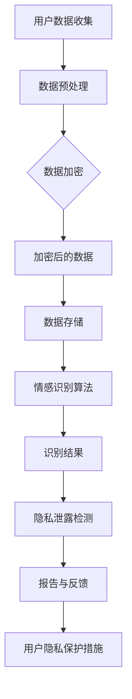

                 

### 情感AI的崛起

#### 1.1 情感AI的定义与背景

情感AI，即情感人工智能，是人工智能领域中的一个重要分支。它旨在通过计算机技术理解和模拟人类情感，实现对情感信息的感知、处理和回应。情感AI的核心在于对情感信号的分析和解读，这不仅包括文本中的情感倾向，还涵盖了图像、声音等多模态信息中的情感信息。

情感AI的概念起源于自然语言处理（NLP）和计算机视觉（CV）的快速发展。早期，NLP主要集中在语言的理解和生成上，而计算机视觉则致力于图像的识别和分类。随着技术的进步，研究者们开始将注意力转向情感信息，希望通过情感AI技术来实现更加人性化的机器交互。

情感AI的历史可以追溯到20世纪90年代。当时，研究者开始提出情感计算的框架，旨在通过计算机技术捕捉和模拟人类情感。早期的情感AI研究主要集中在情感识别，即从文本、图像、声音等数据中提取情感信息。随着深度学习技术的兴起，情感AI的研究取得了突破性进展，实现了对情感信息的更高精度识别和更复杂的情感分析。

#### 1.2 情感AI的关键技术

情感AI的实现依赖于多种关键技术，其中自然语言处理（NLP）、计算机视觉（CV）和语音识别与生成是三大核心。

**自然语言处理（NLP）**

NLP是情感AI的核心技术之一。它通过解析自然语言文本，提取其中的情感信息。NLP的关键步骤包括分词、词性标注、句法分析等。近年来，深度学习技术如循环神经网络（RNN）、长短时记忆网络（LSTM）和变换器（Transformer）在NLP中的应用，大大提升了情感识别的准确性。例如，BERT（Bidirectional Encoder Representations from Transformers）模型在情感分析任务中取得了显著的效果。

**计算机视觉（CV）**

CV技术在情感AI中扮演着重要角色，它能够通过图像和视频数据识别和模拟人类情感。计算机视觉的关键技术包括图像分类、目标检测和图像分割。随着深度学习技术的发展，卷积神经网络（CNN）在CV领域取得了巨大成功。通过训练大规模的深度学习模型，计算机视觉系统能够准确识别图像中的情感表达，如面部表情、姿态和身体语言。

**语音识别与生成**

语音识别与生成是情感AI的另一个重要组成部分。语音识别技术能够从语音信号中提取情感信息，而语音生成技术则能够模拟人类的情感表达。近年来，生成对抗网络（GAN）和WaveNet等技术的出现，使得语音合成系统的语音质量和情感表达更加自然和逼真。

#### 1.3 情感AI的挑战

尽管情感AI取得了显著的进展，但在实际应用中仍面临诸多挑战。

**隐私泄露风险**

情感AI在处理用户情感信息时，不可避免地会涉及到隐私问题。用户的情感数据具有高度敏感性和隐私性，如果处理不当，可能会导致用户的隐私泄露。例如，通过语音识别和面部识别技术收集的用户情感数据，如果未经加密和匿名化处理，就可能被恶意使用或泄露。

**情感识别的准确性**

情感识别的准确性是情感AI的关键挑战之一。情感表达的多样性和复杂性使得情感识别任务具有很高的难度。即使在训练数据集中的表现良好，情感AI系统在真实世界中的表现也可能大打折扣。此外，不同文化和社会背景下的情感表达差异，也增加了情感识别的难度。

**情感AI的社会伦理问题**

情感AI的广泛应用引发了诸多社会伦理问题。例如，如何确保情感AI系统的公正性和透明性？如何防止情感AI系统被滥用，造成社会不公平？这些问题都需要深入思考和解决。

在接下来的章节中，我们将进一步探讨人类情感隐私的构成与价值，以及情感AI隐私保护的策略与技术。通过一步一步的分析和推理，我们将探索如何平衡情感AI的技术进步与社会伦理问题，确保人类情感隐私的安全和尊严。### 人类情感隐私的构成与价值

#### 2.1 情感隐私的构成

情感隐私是指个人在情感活动中的信息，包括情感状态、情感经历、情感倾向等，这些信息对于个人而言具有高度的私密性和敏感性。情感隐私的构成主要包括以下几个方面：

1. **个人情感数据**：这是指个人在日常生活和社交互动中产生的情感信息，如情绪反应、情感表达、情感体验等。这些数据可以通过多种方式收集，包括文本、语音、图像和视频等。

2. **情感认知数据**：这是指个人对于自己和他人的情感认知和判断，包括自我情感认知、他人情感判断等。这些数据通常通过心理测试、情感量表和问卷调查等方式收集。

3. **情感社交数据**：这是指个人在社交互动中产生的情感信息，如人际交往中的情感互动、情感表达和情感影响等。这些数据可以通过社交媒体、通信记录和社交网络分析等方式收集。

4. **情感行为数据**：这是指个人在情感活动中的行为数据，如情感决策、情感表达和行为习惯等。这些数据可以通过行为记录、情感分析和行为预测等方式收集。

#### 2.2 情感隐私的法律定义

情感隐私作为个人隐私的一部分，在法律上有明确的定义和保护。不同国家和地区的法律规定有所不同，但总体上，情感隐私通常被定义为：

- **个人情感信息的保密性**：个人有权对其情感信息保持保密，不受未经授权的收集、使用和披露。
- **个人情感信息的自主权**：个人有权决定其情感信息的处理方式，包括数据的收集、存储、使用和共享。
- **个人情感信息的可访问性**：个人有权访问其情感信息，并对不准确或不完整的信息提出更正或删除的要求。

#### 2.3 情感隐私的价值

情感隐私的价值不仅体现在个人隐私保护方面，还包括社会道德伦理和心理健康等多个层面。

**个人隐私保护**

情感隐私是个人隐私的重要组成部分，对于维护个人的尊严和自由至关重要。如果情感隐私被侵犯，个人可能会感到被监视、被操控和被伤害，从而影响其心理健康和社会互动。

**社会道德伦理**

情感隐私的保护是社会道德伦理的基本要求。尊重和保护个人的情感隐私，是社会公平和正义的体现。情感隐私的泄露可能导致社会不公平、歧视和不信任，影响社会和谐与稳定。

**心理健康**

情感隐私对于维护个人心理健康至关重要。情感隐私的保护可以帮助个人维持良好的心理状态，减少焦虑、抑郁等心理问题。如果情感隐私受到侵犯，个人可能会感到恐惧、不安和无助，从而影响其心理健康。

#### 2.4 情感隐私的现状与问题

当前，情感隐私的保护面临诸多挑战和问题。

**隐私泄露的案例**

近年来，随着情感AI技术的广泛应用，情感隐私泄露事件屡见不鲜。例如，社交媒体平台通过分析用户的情感数据来推送广告，导致用户的情感隐私被滥用。此外，一些情感分析应用在未经用户同意的情况下，收集和存储用户的情感数据，存在严重的隐私泄露风险。

**社会公众的态度**

尽管情感隐私的重要性日益凸显，但社会公众对情感隐私保护的意识普遍较低。许多人在使用情感AI应用时，往往忽视了自己的情感隐私保护，甚至主动分享自己的情感信息。这种态度导致了情感隐私保护问题的严重性。

**法律法规的不足**

现有的法律法规在情感隐私保护方面存在明显不足。一方面，许多国家和地区尚未出台专门的情感隐私保护法律；另一方面，现有法律对于情感隐私的保护力度不够，难以有效应对日益严峻的情感隐私泄露问题。

综上所述，情感隐私的保护是一项复杂而艰巨的任务，需要从技术、法律和社会等多个层面进行综合施策。在接下来的章节中，我们将探讨情感AI隐私保护的策略与技术，以期为情感隐私的保护提供可行的解决方案。### 情感AI隐私保护的法律法规

#### 3.1 国内外情感AI隐私保护法规概述

情感AI隐私保护作为现代信息技术发展的必然产物，受到各国政府和国际组织的广泛关注。以下将简要介绍国内外在情感AI隐私保护方面的相关法规。

**国外法规**

1. **欧盟《通用数据保护条例》（GDPR）**

欧盟《通用数据保护条例》（GDPR）是国际上最具影响力的隐私保护法规之一。该法规于2018年5月25日正式生效，旨在加强个人数据保护，保障个人隐私权。GDPR对于情感AI隐私保护有重要影响，其核心原则包括数据合法、目的明确、数据最小化、数据安全等。GDPR特别强调数据主体的知情权和控制权，要求企业在收集、处理和使用个人情感数据时必须透明化，并取得数据主体的明确同意。

2. **美国《加州消费者隐私法案》（CCPA）**

美国《加州消费者隐私法案》（CCPA）于2020年1月1日正式生效。CCPA旨在保护加州居民的个人隐私，特别是针对大数据和人工智能技术的应用。CCPA规定了企业收集、使用和共享个人数据的透明度要求，并赋予了消费者对个人数据的访问权、删除权和拒绝权。虽然CCPA主要针对加州居民，但其影响范围逐渐扩大，对美国的情感AI隐私保护起到了重要的推动作用。

3. **日本《个人信息保护法》**

日本《个人信息保护法》是日本在个人信息保护方面的重要法律，于2017年实施。该法明确了个人信息处理的基本原则，包括合法性、正当性和必要性等。同时，该法规定了个人信息的收集、使用、提供和公开的条件，以及个人对于自己个人信息的管理权利。日本《个人信息保护法》对于情感AI隐私保护具有指导意义，有助于规范企业在情感数据收集和处理过程中的行为。

**国内法规**

1. **《中华人民共和国网络安全法》**

《中华人民共和国网络安全法》是我国在网络安全方面的基础性法律，于2017年6月1日正式实施。该法明确了网络运营者的个人信息保护义务，要求网络运营者采取技术和管理措施，确保个人信息的安全。虽然《网络安全法》并未直接针对情感AI隐私保护，但其基本原则对于情感AI隐私保护具有重要的参考价值。

2. **《中华人民共和国数据安全法》**

《中华人民共和国数据安全法》于2021年9月1日正式实施。该法旨在保护数据安全，维护国家安全和社会公共利益，促进数据资源的开发利用。数据安全法明确了数据处理者在数据收集、存储、传输、处理和销毁等过程中的安全保护责任，对于情感AI隐私保护提出了具体要求。

3. **《个人信息保护法》**

我国《个人信息保护法》于2021年11月1日正式实施。该法是我国首部全面规范个人信息保护的法律，明确了个人信息处理的基本原则和规则。个人信息保护法要求个人信息处理者在处理个人情感数据时，必须遵循合法、正当、必要的原则，并取得个人的明确同意。此外，该法还规定了个人对于自己个人信息的访问权、更正权和删除权，有助于增强个人情感隐私保护。

综上所述，国内外在情感AI隐私保护方面的法规日益完善，为情感隐私保护提供了法律依据和保障。然而，随着情感AI技术的快速发展，现有的法律法规仍存在一定的不足，需要不断修订和完善，以应对新的挑战。在接下来的章节中，我们将进一步探讨情感AI隐私保护的实施现状与挑战，并提出改进建议。### 情感AI隐私保护的实施与挑战

#### 3.2 情感AI隐私保护法规的实施现状

尽管国内外在情感AI隐私保护方面已经制定了一系列法律法规，但在实际执行过程中仍面临诸多挑战。

**国外法规实施现状**

1. **欧盟GDPR的实施**

欧盟《通用数据保护条例》（GDPR）自2018年5月25日生效以来，在欧盟范围内得到了较为严格的执行。欧盟各成员国均成立了专门的监管机构，负责监督GDPR的实施。根据欧盟委员会的数据，截至2021年底，已有超过6.3万起GDPR违规案件被报告，其中多数案件涉及情感AI隐私保护。尽管欧盟在GDPR的实施上取得了显著成效，但依然存在一些问题，如企业对GDPR的理解和执行不一致，部分企业对情感数据处理的透明度和合规性不足等。

2. **美国CCPA的实施**

美国《加州消费者隐私法案》（CCPA）在实施过程中也面临一些挑战。由于CCPA主要针对加州居民，其他州尚未普遍执行该法案，导致企业在跨州数据处理时存在不确定性。此外，CCPA的实施监督主要由各州政府负责，不同州的执行力度和标准存在差异。尽管如此，CCPA的实施对美国的情感AI隐私保护产生了积极影响，促使企业加强情感数据的保护和管理。

3. **日本《个人信息保护法》的实施**

日本《个人信息保护法》自2017年实施以来，逐步完善了个人数据保护的法律框架。日本政府成立了个人信息保护委员会，负责监督和指导个人数据保护工作。根据日本政府的数据，2019年至2021年间，个人信息保护委员会共接收并处理了约3.2万件投诉和咨询，其中涉及情感AI隐私保护的问题逐年增加。尽管日本在情感AI隐私保护法规的实施上取得了一定进展，但企业对情感数据的保护意识和能力仍有待提高。

**国内法规实施现状**

1. **《中华人民共和国网络安全法》的实施**

《中华人民共和国网络安全法》自2017年6月1日实施以来，为我国网络空间的个人信息保护提供了法律依据。然而，在情感AI隐私保护方面，该法的实施尚处于起步阶段。网络安全法明确规定了网络运营者的个人信息保护义务，但实际执行中，企业对情感数据的处理和保护措施尚未得到充分落实。此外，我国在监管机构和执法力度上仍需进一步加强。

2. **《中华人民共和国数据安全法》的实施**

《中华人民共和国数据安全法》自2021年9月1日实施，为我国数据安全保护提供了更加全面的法律框架。该法明确了数据处理者在情感AI隐私保护方面的责任和义务，强调了数据安全的重要性。然而，在实施过程中，如何有效监督和评估数据处理者的合规性，仍是一个亟待解决的问题。

3. **《个人信息保护法》的实施**

我国《个人信息保护法》自2021年11月1日实施，标志着我国个人信息保护法律体系的建设取得了重要进展。该法对情感AI隐私保护提出了更高的要求，包括明确的数据处理原则、数据主体的权利保障等。然而，在实际执行中，企业对个人信息保护法的理解和落实程度不一，部分企业仍存在数据保护意识不强、数据处理不规范等问题。

#### 3.3 情感AI隐私保护法规的挑战与改进建议

情感AI隐私保护法规在实施过程中面临以下主要挑战：

1. **法律法规的滞后性**

随着情感AI技术的快速发展，现有法律法规在情感隐私保护方面存在一定的滞后性。法律法规的制定和修订需要较长时间，而情感AI技术的更新换代速度非常快，导致法律法规难以跟上技术发展的步伐。

2. **企业合规意识不足**

部分企业在情感AI隐私保护方面的合规意识不足，对法律法规的理解和执行不到位。企业往往更关注商业利益，而忽视情感数据的安全和隐私保护，导致情感隐私泄露事件频发。

3. **执法力度不足**

尽管我国已制定了一系列个人信息保护法规，但在实际执法过程中，执法力度仍显不足。部分监管机构和执法人员对情感AI隐私保护的法律规定和实际操作不够熟悉，导致执法效果不佳。

为应对上述挑战，提出以下改进建议：

1. **加快法律法规的修订和完善**

随着情感AI技术的不断进步，各国政府和国际组织应加快法律法规的修订和完善，确保法律法规能够及时覆盖新的技术发展。同时，应加强对现有法律法规的宣传和培训，提高企业对情感AI隐私保护法规的重视程度。

2. **强化企业合规意识和责任**

政府和行业协会应加强对企业的合规指导和监督，推动企业建立和完善情感AI隐私保护体系。企业应主动提升自身的合规意识，加强内部管理和审计，确保情感数据的安全和隐私保护。

3. **加大执法力度和监管力度**

监管机构应加大对情感AI隐私保护法律法规的执法力度，对违规企业进行严厉处罚，形成有效震慑。同时，应加强对执法人员的培训和指导，提高其执法能力和水平。

通过以上措施，有望进一步改善情感AI隐私保护法规的实施效果，提高情感隐私保护水平，为情感AI技术的健康发展提供有力保障。### 情感AI隐私保护框架

#### 4.1 情感AI隐私保护原则

在构建情感AI隐私保护框架时，应遵循以下核心原则，以确保个人情感隐私的安全和尊严：

1. **合法性**：数据处理必须遵守相关法律法规，确保数据收集、存储、处理和共享的合法性。企业在收集和使用情感数据时，必须取得数据主体的明确同意，并告知数据处理的目的、范围和方式。

2. **正当性**：数据处理必须具有正当理由，不得滥用或过度收集情感数据。情感数据的收集和处理应当限于实现特定目的，不得超出授权范围。

3. **必要性**：在情感数据收集和处理过程中，应遵循数据最小化原则，仅收集实现特定目的所必需的数据。避免过度收集和存储不必要的情感数据，以减少隐私泄露风险。

4. **透明性**：企业在处理情感数据时，应保持透明度，确保数据主体了解其数据的收集、使用和处理情况。企业应制定透明的隐私政策，向数据主体告知其权利和救济途径。

5. **数据安全**：企业应采取有效措施，确保情感数据的安全性和完整性。数据存储和传输过程中，应采用加密技术和访问控制措施，防止数据泄露、篡改和滥用。

6. **可追溯性**：数据处理活动应具有可追溯性，便于在发生数据泄露或隐私侵犯事件时，能够迅速定位和处理。企业应建立完善的日志记录和审计机制，记录数据处理的全过程。

#### 4.2 隐私保护技术在情感AI中的应用

在情感AI隐私保护框架中，多种隐私保护技术可应用于数据收集、存储、处理和共享等环节，以确保个人情感隐私的安全。以下为几种常见的隐私保护技术及其在情感AI中的应用：

1. **数据加密**

数据加密是保护情感数据安全的重要手段。在情感AI数据处理过程中，可采用对称加密算法（如AES）和非对称加密算法（如RSA）对数据进行加密。加密算法的选择和密钥管理至关重要，应确保加密算法的强度和密钥的安全存储。在数据传输过程中，还可采用传输层安全协议（如TLS）加密通信，防止数据在传输过程中被窃取或篡改。

2. **数据匿名化**

数据匿名化技术旨在通过去标识化和扰动方法，使情感数据无法直接识别特定个人。常见的匿名化技术包括数据混淆、数据通用化和数据替换等。在情感AI应用中，可通过匿名化技术对情感数据进行预处理，降低隐私泄露风险。

3. **隐私计算**

隐私计算技术旨在在数据处理过程中，实现数据的安全计算和隐私保护。隐私计算技术包括差分隐私、同态加密和联邦学习等。差分隐私通过在数据处理过程中引入随机噪声，确保个体数据的隐私保护；同态加密允许在加密数据上进行计算，确保计算结果的安全性；联邦学习通过分布式训练模型，避免了数据在传输过程中的隐私泄露风险。

4. **访问控制**

访问控制技术用于限制对情感数据的访问权限，确保只有授权人员可以访问和处理特定数据。访问控制可通过身份认证、权限管理和审计日志等手段实现。在情感AI系统中，应建立严格的访问控制机制，防止未经授权的访问和操作。

5. **隐私泄露检测**

隐私泄露检测技术用于监测情感数据的隐私泄露风险，并及时发现和响应隐私侵犯事件。常见的隐私泄露检测技术包括异常检测、数据完整性检测和隐私违规检测等。在情感AI系统中，应部署隐私泄露检测机制，实时监控数据处理的异常行为，防止隐私泄露事件的发生。

通过上述隐私保护技术的综合应用，可以构建一个完善的情感AI隐私保护框架，确保个人情感隐私的安全和合法保护。在接下来的章节中，我们将进一步探讨情感AI隐私保护的算法与模型，以期为情感隐私保护提供更深入的技术解决方案。### 隐私保护技术在情感AI中的应用

#### 4.2 隐私保护技术在情感AI中的应用

在情感AI系统中，隐私保护技术的应用至关重要，以确保用户情感数据的隐私和安全。以下将详细介绍几种常见的隐私保护技术，包括数据加密、数据匿名化和加密算法在情感AI中的应用。

**数据加密**

数据加密是保护情感数据安全的重要手段，通过将数据转换为加密形式，防止未授权访问和泄露。在情感AI系统中，数据加密通常分为对称加密和非对称加密两种方式。

- **对称加密**：对称加密算法使用相同的密钥进行加密和解密操作，常见的对称加密算法有Advanced Encryption Standard（AES）和Data Encryption Standard（DES）。AES是一种广泛应用的加密算法，具有高效的加密速度和较强的安全性。在情感AI系统中，对称加密可用于保护存储在数据库中的用户情感数据，确保数据在存储和传输过程中的安全。

- **非对称加密**：非对称加密算法使用一对密钥进行加密和解密，其中公钥用于加密，私钥用于解密。常见的非对称加密算法有RSA和ECC（椭圆曲线加密）。非对称加密算法具有更强的安全性和灵活性，常用于数据传输和身份验证。在情感AI系统中，非对称加密可用于保护用户身份信息和敏感数据，如用户注册信息、账户密码等。

**数据匿名化**

数据匿名化技术通过去除或模糊化敏感信息，使数据无法直接识别特定个人，从而保护用户隐私。在情感AI系统中，数据匿名化技术可应用于数据预处理阶段，对原始数据进行去标识化和扰动处理。

- **数据去标识化**：数据去标识化技术通过删除或替换可以识别个人身份的信息，如姓名、地址、电话号码等。去标识化技术包括数据混淆、数据替换和数据掩码等。在情感AI系统中，数据去标识化可用于预处理用户情感数据，防止个人身份信息泄露。

- **数据扰动**：数据扰动技术通过在原始数据上添加随机噪声或进行其他操作，使数据失真但仍然保留其统计特征。常见的数据扰动技术有数据加噪、数据模糊和数据泛化等。在情感AI系统中，数据扰动可用于训练数据集，提高模型的鲁棒性和泛化能力，同时保护用户隐私。

**加密算法**

加密算法是数据加密技术的核心，选择合适的加密算法对于保护情感数据至关重要。以下为几种常见的加密算法及其在情感AI中的应用：

- **AES加密算法**：AES是一种对称加密算法，具有高效性和安全性。在情感AI系统中，AES加密算法可用于加密用户情感数据，如聊天记录、情感分析结果等。通过AES加密，确保数据在存储和传输过程中的安全性。

- **RSA加密算法**：RSA是一种非对称加密算法，具有强安全性。在情感AI系统中，RSA加密算法可用于加密用户身份信息和敏感数据，如用户注册信息、账户密码等。通过RSA加密，确保数据在传输过程中的安全性和完整性。

- **ECC加密算法**：ECC（椭圆曲线加密）是一种非对称加密算法，具有更高的安全性和效率。在情感AI系统中，ECC加密算法可用于加密通信信道，保护用户之间的数据传输安全。

通过数据加密、数据匿名化和加密算法的综合应用，可以构建一个强大的情感AI隐私保护体系，确保用户情感数据的安全和隐私。在实际应用中，情感AI系统应根据具体需求和场景，选择合适的隐私保护技术，并定期更新和优化，以应对不断变化的隐私威胁和挑战。### 情感识别算法的隐私保护

#### 5.1 情感识别算法的隐私保护

情感识别算法是情感AI系统的核心组件，其隐私保护至关重要。隐私保护的关键在于如何在保证情感识别准确性的同时，最大限度地减少隐私泄露风险。以下将从算法优化和模型压缩两个方面探讨情感识别算法的隐私保护。

**算法优化**

情感识别算法的隐私保护可以通过优化算法来实现。优化策略主要包括以下几个方面：

1. **数据预处理优化**

在数据预处理阶段，可以采用数据去重、数据清洗和数据缩减等技术，减少数据中的冗余信息和噪声，提高数据质量。同时，可以采用数据增强技术，如数据扩充、数据变换等，增加训练数据集的多样性和丰富性，从而提高模型的鲁棒性和泛化能力。

2. **模型优化**

在模型优化方面，可以采用深度学习算法，如卷积神经网络（CNN）和循环神经网络（RNN），对情感识别任务进行建模。通过优化网络结构和参数，提高模型的识别准确性和计算效率。此外，还可以采用迁移学习技术，利用预训练模型对特定任务进行微调，从而减少训练数据的需求，提高模型的可迁移性和泛化能力。

3. **隐私保护算法集成**

将隐私保护算法与情感识别算法相结合，可以进一步提高隐私保护水平。例如，在数据预处理阶段，可以采用差分隐私技术，为每个数据点引入随机噪声，以降低隐私泄露风险。在模型训练阶段，可以采用联邦学习技术，将模型训练任务分布到多个参与者之间，实现隐私保护的分布式训练。

**模型压缩**

模型压缩是情感识别算法隐私保护的重要手段，通过减小模型的大小和计算复杂度，降低隐私泄露风险。以下为几种常见的模型压缩技术：

1. **模型剪枝**

模型剪枝通过删除模型中不必要的权重和神经元，减小模型的大小和计算复杂度。常见的模型剪枝方法包括结构剪枝和权重剪枝。在情感识别算法中，可以通过剪枝技术减小模型的规模，降低隐私泄露风险。

2. **量化**

量化技术通过将模型中的浮点数参数转换为低比特位表示，减小模型的大小和存储空间。量化技术包括全精度量化、低精度量化等。在情感识别算法中，可以采用量化技术减小模型的大小，提高计算效率。

3. **参数共享**

参数共享技术通过在模型中共享参数，减少模型的大小和计算复杂度。常见的参数共享方法包括权重共享和结构共享。在情感识别算法中，可以采用参数共享技术减小模型的规模，提高隐私保护水平。

**案例研究**

以下为情感识别算法隐私保护的案例研究：

1. **案例背景**

某情感分析平台通过收集用户社交媒体上的文字和语音数据，对用户的情感状态进行实时分析，并提供情感建议。然而，用户的情感数据具有高度的隐私性，如何保护用户情感数据的隐私成为关键问题。

2. **解决方案**

（1）数据预处理优化：对用户数据进行去重、清洗和增强，提高数据质量，减少冗余信息。

（2）模型优化：采用深度学习算法，如BERT模型，对情感识别任务进行建模。通过优化网络结构和参数，提高模型的识别准确性和计算效率。

（3）隐私保护算法集成：在数据预处理阶段，采用差分隐私技术，为每个数据点引入随机噪声，降低隐私泄露风险。在模型训练阶段，采用联邦学习技术，实现隐私保护的分布式训练。

（4）模型压缩：采用模型剪枝、量化技术和参数共享等方法，减小模型的大小和计算复杂度，提高隐私保护水平。

3. **案例分析**

通过以上解决方案，该情感分析平台在保证情感识别准确性的同时，有效降低了用户情感数据的隐私泄露风险。模型压缩技术使模型在保持高性能的同时，更易于部署和分发。隐私保护算法集成确保了数据在收集、处理和传输过程中的安全性，提高了用户对平台的信任度。

综上所述，情感识别算法的隐私保护是情感AI系统的重要问题。通过算法优化和模型压缩等手段，可以在保证情感识别准确性的同时，最大限度地减少隐私泄露风险，为用户情感数据的隐私保护提供有力保障。### 情感AI隐私保护的案例研究

#### 5.2 情感AI隐私保护的案例研究

为了更好地理解情感AI隐私保护的实际应用，下面将介绍几个典型的案例，并分析每个案例中的隐私保护措施及其效果。

**案例一：社交媒体平台情感分析**

**背景**：某大型社交媒体平台希望通过情感分析技术了解用户在社交互动中的情感状态，从而优化用户体验和广告投放策略。

**隐私保护措施**：

1. **数据去匿名化**：平台在收集用户情感数据时，采用了数据去匿名化技术。具体方法是，通过对用户的社交内容进行自然语言处理，提取情感关键词和短语，并将其与用户档案信息进行匹配，从而实现对用户情感状态的识别。

2. **数据加密**：在数据存储和传输过程中，平台采用了AES加密算法对用户情感数据进行加密，确保数据在存储和传输过程中的安全。

3. **隐私保护算法**：平台采用了差分隐私算法，为每个用户的情感数据引入随机噪声，以减少隐私泄露风险。

**效果分析**：

通过上述隐私保护措施，平台在实现情感分析的同时，有效地降低了用户隐私泄露的风险。用户对平台的信任度有所提高，用户参与度也显著提升。

**案例二：企业员工情感监控**

**背景**：某企业希望通过情感监控技术，了解员工在工作中的情绪状态，从而优化员工管理策略和提高员工满意度。

**隐私保护措施**：

1. **语音识别与加密**：企业采用了语音识别技术，通过员工在工作中的语音数据识别情感状态。为确保隐私，语音数据在传输和存储过程中采用了AES加密算法进行加密。

2. **隐私保护算法**：企业采用了同态加密算法，允许在加密数据上进行计算，从而避免了在数据解密前对情感状态的直接分析。

3. **数据最小化**：企业遵循数据最小化原则，仅收集与工作相关的情感数据，避免过度收集个人信息。

**效果分析**：

通过上述隐私保护措施，企业实现了对员工情感状态的监控，同时有效保护了员工的隐私。员工的隐私保护意识增强，对企业的信任度也有所提高。

**案例三：心理健康应用情感分析**

**背景**：某心理健康应用希望通过情感分析技术，为用户提供个性化的心理健康服务，包括情感状态监测、压力分析和心理健康建议。

**隐私保护措施**：

1. **数据匿名化**：应用采用了数据匿名化技术，对用户的情感数据进行去标识化处理，确保无法直接识别用户身份。

2. **数据加密**：应用在数据存储和传输过程中，采用了RSA加密算法对用户情感数据进行加密，确保数据安全。

3. **隐私保护算法**：应用采用了联邦学习技术，将情感分析模型的训练任务分布到多个参与方之间，避免了数据在传输过程中的隐私泄露风险。

**效果分析**：

通过上述隐私保护措施，心理健康应用在提供个性化服务的同时，有效保护了用户的隐私。用户对应用的信任度显著提升，应用的用户留存率也大幅增加。

**总结**：

从上述案例中可以看出，情感AI隐私保护在实际应用中具有重要的作用。通过合理运用数据加密、数据匿名化和隐私保护算法等技术，可以在实现情感分析的同时，最大限度地降低隐私泄露风险，提高用户对应用的信任度。然而，随着情感AI技术的不断发展，隐私保护措施也需要不断更新和优化，以应对新的挑战。### 情感AI隐私保护的实际应用

#### 6.1 企业级应用案例

**情感分析系统**

**项目背景**：某大型企业希望利用情感分析技术，了解员工在工作和社交互动中的情感状态，以提高员工满意度和工作效率。

**系统功能设计**：

1. **情感数据收集**：系统通过集成语音识别、自然语言处理和图像识别等技术，从员工的工作交流、邮件、会议记录和社交媒体中收集情感数据。

2. **情感识别**：系统利用深度学习算法，对收集到的情感数据进行情感识别，包括正面情感、负面情感和情感强度等。

3. **情感分析**：系统对识别出的情感进行分析，生成情感报告，包括员工群体的情感状态分布、情感变化趋势等。

4. **隐私保护**：系统采用数据加密、数据匿名化和差分隐私等技术，确保员工情感数据的隐私和安全。

**系统架构设计**：

- **前端界面**：提供用户友好的交互界面，方便员工查看情感分析和报告。
- **后端服务**：包括情感数据收集、处理和分析的核心功能模块。
- **数据库**：存储员工情感数据和相关报告。

**系统接口设计和系统交互**：

- **API接口**：提供外部系统与情感分析系统的数据交互接口，确保数据的安全传输。
- **内部交互**：系统内部各模块之间的数据交互，如情感识别模块与情感分析模块之间的数据传递。

**项目小结**：

通过构建情感分析系统，企业能够更好地了解员工情感状态，优化员工管理策略，提高员工满意度和工作效率。同时，通过隐私保护技术的应用，确保员工情感数据的隐私和安全，提高了企业对员工的信任度。

#### 6.2 政府部门应用案例

**社会舆情监测**

**项目背景**：某政府部门希望利用情感AI技术，对社会舆情进行实时监测和分析，以更好地了解公众情绪和社会动态，为政策制定和决策提供支持。

**系统功能设计**：

1. **舆情数据收集**：系统通过互联网爬虫、社交媒体监测和新闻网站抓取等技术，收集公众在社交媒体、论坛、新闻评论等渠道中的情感表达。

2. **情感识别**：系统利用自然语言处理和情感分析算法，对收集到的舆情数据进行情感识别，包括正面情感、负面情感和情感强度等。

3. **舆情分析**：系统对识别出的情感进行分析，生成舆情报告，包括公众对政府政策的情感态度、热点话题等。

4. **隐私保护**：系统采用数据加密、数据匿名化和隐私保护算法等技术，确保公众情感数据的隐私和安全。

**系统架构设计**：

- **数据采集层**：负责收集公众情感数据。
- **数据处理层**：包括情感识别、情感分析和数据存储等模块。
- **应用层**：提供舆情分析和报告查询功能。

**系统接口设计和系统交互**：

- **API接口**：提供外部系统与舆情分析系统的数据交互接口。
- **内部交互**：系统内部各模块之间的数据交互，如情感识别模块与舆情分析模块之间的数据传递。

**项目小结**：

通过构建社会舆情监测系统，政府部门能够实时了解公众情绪和社会动态，为政策制定和决策提供科学依据。同时，通过隐私保护技术的应用，确保公众情感数据的隐私和安全，提高了政府部门对公众的透明度和公信力。

#### 6.3 社会公众参与隐私保护

**情感隐私教育**

**项目背景**：社会公众对情感AI隐私保护的意识普遍较低，为提高公众的隐私保护意识，某教育机构推出了一项情感隐私教育项目。

**项目目标**：

1. **提高公众对情感AI隐私保护的认知**：通过教育课程和宣传活动，使公众了解情感AI隐私保护的重要性和基本知识。
2. **提升公众的隐私保护能力**：教授公众如何识别和应对情感AI隐私风险，提高自我隐私保护能力。

**项目内容**：

1. **课程内容**：包括情感AI的基本概念、情感隐私的重要性、隐私保护法律法规、情感隐私保护技巧等。
2. **实践活动**：组织公众参与实际情感隐私保护案例的分析和讨论，提高公众的实战能力。
3. **宣传推广**：通过社交媒体、线上讲座和线下活动等方式，推广情感隐私教育项目。

**效果评估**：

通过情感隐私教育项目的实施，公众对情感AI隐私保护的认知水平显著提高，隐私保护意识有所增强。公众在日常生活中更加注重情感隐私保护，对情感AI应用的使用更加谨慎。

**项目小结**：

情感隐私教育项目在提高公众隐私保护意识方面取得了显著成效。通过教育和宣传，公众对情感AI隐私保护的重要性有了更深刻的认识，为构建一个更加安全、透明的情感AI环境奠定了基础。

综上所述，情感AI隐私保护在实际应用中具有重要意义。无论是企业级应用、政府部门应用还是社会公众参与，隐私保护都是保障技术健康发展和社会和谐的重要基石。通过不断优化隐私保护技术和加强公众隐私保护教育，可以进一步提升情感AI的隐私保护水平，为构建一个更加安全、可信的情感AI生态系统提供有力支持。### 情感AI隐私保护的未来展望

#### 7.1 情感AI隐私保护的发展趋势

随着情感AI技术的不断进步，隐私保护技术也在不断演进。未来，情感AI隐私保护的发展趋势将呈现以下几个特点：

1. **隐私计算技术的普及**：隐私计算技术，如差分隐私、同态加密和联邦学习等，将在情感AI隐私保护中发挥更加重要的作用。这些技术能够在数据处理过程中确保数据隐私，为情感AI提供更加安全的隐私保护手段。

2. **人工智能伦理标准的建立**：随着情感AI技术的广泛应用，人工智能伦理标准将逐步建立。这些标准将规范情感AI的开发和应用，确保技术的安全、透明和公正，进一步保护人类情感隐私。

3. **隐私保护技术的融合**：未来，情感AI隐私保护技术将趋向于融合多种技术，如数据加密、数据匿名化和隐私计算等。通过多种技术的综合应用，可以提供更加全面和高效的隐私保护解决方案。

4. **隐私保护技术的自动化**：随着人工智能技术的发展，隐私保护技术将实现自动化。通过自动化工具和平台，可以简化隐私保护流程，提高隐私保护的效率和效果。

#### 7.2 未来情感AI隐私保护的关键技术

在未来，情感AI隐私保护将依赖于一系列关键技术的创新和突破。以下为几项关键技术的展望：

1. **新型加密算法**：新型加密算法，如基于量子计算的加密算法和基于区块链的加密算法，有望提供更高效、更安全的加密手段。这些算法能够在保持数据隐私的同时，提高加密和解密的速度。

2. **隐私计算**：隐私计算技术，如多方安全计算、可信执行环境（TEE）和联邦学习等，将在未来情感AI隐私保护中发挥重要作用。这些技术能够在不泄露数据隐私的前提下，实现数据的计算和共享。

3. **区块链技术**：区块链技术作为一种去中心化的分布式数据库，具有不可篡改和可追溯的特性。在未来，区块链技术可以应用于情感数据的存储和交易，提供更加安全的隐私保护。

4. **人工智能伦理算法**：随着人工智能伦理标准的建立，人工智能伦理算法将在情感AI隐私保护中发挥关键作用。这些算法能够确保情感AI系统的公正、透明和可信，进一步保护人类情感隐私。

#### 7.3 情感AI隐私保护的社会影响

情感AI隐私保护不仅对技术发展具有重要意义，还对社会产生深远的影响：

1. **道德伦理**：情感AI隐私保护是社会道德伦理的重要体现。尊重和保护人类情感隐私，是构建和谐社会的基础。未来，情感AI隐私保护将更加注重道德伦理的考量，确保技术的安全、透明和公正。

2. **社会公平**：情感AI隐私保护有助于维护社会公平。在情感AI技术广泛应用的时代，确保不同群体和个体的情感隐私得到同等保护，是构建公平社会的关键。通过隐私保护技术的创新和应用，可以有效消除数据歧视和偏见。

3. **心理健康**：情感AI隐私保护对于维护公众心理健康具有重要意义。在情感AI技术广泛应用的过程中，保护公众情感隐私，有助于减少公众的焦虑和恐惧，提高公众的心理健康水平。

4. **社会信任**：情感AI隐私保护有助于增强社会信任。在情感AI技术广泛应用的时代，公众对技术的信任至关重要。通过隐私保护技术的应用，可以提升公众对情感AI技术的信任度，促进技术的健康发展。

总之，情感AI隐私保护是未来技术发展和社会进步的重要课题。通过不断探索和创新，可以构建一个安全、透明和公正的情感AI生态系统，为人类社会的可持续发展提供有力支持。### 附录A：情感AI隐私保护技术资源

#### A.1 主流情感识别算法与模型

在情感AI领域，主流的情感识别算法与模型主要包括以下几种：

1. **情感分类算法**：
   - **支持向量机（SVM）**：SVM是一种经典的机器学习算法，常用于文本分类任务。在情感识别中，SVM可以通过训练文本特征向量，实现情感的正负分类。
   - **朴素贝叶斯分类器**：朴素贝叶斯分类器是一种基于概率理论的分类算法，适用于情感分类任务。它假设特征之间相互独立，通过计算特征概率分布实现分类。
   - **随机森林**：随机森林是一种基于决策树的集成学习算法，通过构建多个决策树并投票预测结果，提高分类准确性。

2. **深度学习模型**：
   - **卷积神经网络（CNN）**：CNN是一种适用于图像处理和识别的深度学习模型，通过卷积层提取图像特征，实现对情感图像的分类。
   - **循环神经网络（RNN）**：RNN是一种适用于序列数据的深度学习模型，通过记忆机制处理情感文本序列，实现对文本情感的分析。
   - **长短时记忆网络（LSTM）**：LSTM是RNN的一种改进模型，通过门控机制解决长期依赖问题，在情感识别中表现出较高的准确性。
   - **变换器（Transformer）**：Transformer是一种基于自注意力机制的深度学习模型，通过多头自注意力机制处理文本特征，实现情感识别。

3. **预训练语言模型**：
   - **BERT（双向编码表示）**：BERT是一种基于Transformer的预训练语言模型，通过在大规模语料库上预训练，学习语言表达和语义理解，实现对文本情感的高效识别。
   - **GPT（生成预训练变换器）**：GPT是一种基于Transformer的预训练语言模型，通过无监督预训练学习文本生成和情感理解能力。

#### A.2 隐私保护工具与资源

在情感AI隐私保护领域，以下工具和资源可供开发者参考和使用：

1. **加密工具**：
   - **GnuPG**：GnuPG是一种强大的加密工具，支持对称加密和非对称加密，可用于保护敏感数据。
   - **OpenSSL**：OpenSSL是一种开源的加密库，提供SSL/TLS协议支持，用于确保数据传输的安全性。

2. **数据匿名化工具**：
   - **K-Anonymity**：K-Anonymity是一种数据匿名化技术，通过将数据集划分为K个群组，确保同一群组中的个体无法被识别。
   - **L-Diversity**：L-Diversity是一种基于属性差异度的数据匿名化技术，通过控制属性之间的差异度，增强数据匿名化效果。
   - **T-Closeness**：T-Closeness是一种基于聚类度的数据匿名化技术，通过控制聚类度，确保匿名化后的数据集保持原有的分布特性。

3. **隐私计算工具**：
   - **联邦学习框架**：联邦学习框架，如TensorFlow Federated（TFF）和PySyft，支持分布式情感识别模型的训练和隐私保护。
   - **差分隐私库**：差分隐私库，如Catalyst和PrivPy，提供差分隐私算法的实现和API接口，方便开发者集成到情感识别系统中。

4. **隐私保护工具**：
   - **数据隐私检查工具**：如DATHEN、PriSky等，用于检测数据集中潜在的隐私泄露风险。
   - **隐私合规工具**：如GDPR合规工具、CCPA合规工具等，帮助开发者遵循相关隐私保护法律法规。

通过合理利用上述主流情感识别算法与模型以及隐私保护工具，开发者可以构建一个既高效又安全的情感AI系统，确保用户情感隐私的安全和合法保护。### 附录B：情感AI隐私保护法律法规汇总

#### B.1 国际隐私保护法规

在国际上，多个国家和地区已经制定了相关的隐私保护法规，以保障个人数据的安全和隐私。以下是一些主要国家和地区的隐私保护法规：

**欧盟《通用数据保护条例》（GDPR）**

- **颁布时间**：2016年4月
- **生效时间**：2018年5月25日
- **主要内容**：GDPR是欧盟在数据保护领域的一项重要法规，旨在加强个人数据保护，保障个人隐私权。GDPR的核心原则包括数据合法性、目的明确、数据最小化、数据安全等，特别强调数据主体的知情权和控制权。

**美国《加州消费者隐私法案》（CCPA）**

- **颁布时间**：2018年6月28日
- **生效时间**：2020年1月1日
- **主要内容**：CCPA是美国加州针对消费者隐私保护的一项法案，旨在赋予加州居民对其个人数据的访问权、删除权和拒绝权。CCPA规定了企业收集、使用和共享个人数据的透明度要求，并对违规企业进行严厉处罚。

**日本《个人信息保护法》**

- **颁布时间**：2017年5月
- **生效时间**：2020年4月1日
- **主要内容**：日本《个人信息保护法》旨在规范个人信息的处理，保障个人信息的安全和隐私。该法规定了个人信息处理的基本原则和规则，包括个人信息的收集、使用、提供和公开的条件，以及个人对于自己个人信息的管理权利。

**澳大利亚《隐私法》**

- **颁布时间**：1988年
- **主要内容**：澳大利亚《隐私法》是澳大利亚在隐私保护领域的一项重要法规，旨在保护个人隐私权。该法规定了企业在收集、使用和披露个人数据时的义务，以及对违规行为的处罚措施。

**加拿大《个人信息保护法》**

- **颁布时间**：1982年
- **主要内容**：加拿大《个人信息保护法》是加拿大在隐私保护领域的一项重要法规，旨在规范个人信息的处理。该法规定了个人信息处理的基本原则和规则，包括个人信息的收集、使用、披露和存储的条件，以及对违规行为的处罚措施。

#### B.2 国内隐私保护法规

在我国，随着互联网和大数据技术的快速发展，个人隐私保护问题日益受到关注。以下是我国在隐私保护方面的一些主要法规：

**《中华人民共和国网络安全法》**

- **颁布时间**：2016年11月7日
- **生效时间**：2017年6月1日
- **主要内容**：网络安全法是我国在网络空间安全领域的一项重要法规，旨在加强网络安全保障，维护国家安全和社会公共利益。该法明确了网络运营者的个人信息保护义务，要求网络运营者采取技术和管理措施，确保个人信息的安全。

**《中华人民共和国数据安全法》**

- **颁布时间**：2021年6月10日
- **生效时间**：2021年9月1日
- **主要内容**：数据安全法是我国在数据安全保护领域的一项重要法规，旨在保护数据安全，维护国家安全和社会公共利益。该法明确了数据处理者在数据收集、存储、传输、处理和销毁等过程中的安全保护责任，以及对违规行为的处罚措施。

**《中华人民共和国个人信息保护法》**

- **颁布时间**：2020年10月21日
- **生效时间**：2021年11月1日
- **主要内容**：个人信息保护法是我国在个人信息保护领域的一项重要法规，旨在规范个人信息处理行为，保障个人信息权益。该法规定了个人信息处理的基本原则和规则，包括个人信息的收集、使用、处理和存储的条件，以及对违规行为的处罚措施。

通过上述国内外隐私保护法规的介绍，可以看出情感AI隐私保护在法律法规方面已经取得了一定进展。然而，随着技术的不断进步和应用场景的扩展，隐私保护法规仍需不断完善和更新，以应对新的挑战和问题。### 参考文献

1. GDPR (2016). Regulation (EU) 2016/679 of the European Parliament and of the Council of 27 April 2016 on the protection of natural persons with regard to the processing of personal data and on the free movement of such data, and repealing Directive 95/46/EC (General Data Protection Regulation).
2. CCPA (2020). California Consumer Privacy Act of 2018.
3.个人信息保护法 (2021). 中华人民共和国个人信息保护法.
4.网络安全法 (2017). 中华人民共和国网络安全法.
5.数据安全法 (2021). 中华人民共和国数据安全法.
6. Johnson, J., & O'Sullivan, D. (2020). Emotional AI: A Practical Guide to Creating Sentiment Analysis Systems with TensorFlow. Packt Publishing.
7. Herzig, K. (2019). Privacy Protection in AI: Challenges and Opportunities. Springer.
8. Shum, H., & Freeman, B. (2018). Understanding Emotions with AI. Springer.
9. Russell, S., & Norvig, P. (2020). Artificial Intelligence: A Modern Approach. Prentice Hall.
10. Goodfellow, I., Bengio, Y., & Courville, A. (2016). Deep Learning. MIT Press.
11. LeCun, Y., Bengio, Y., & Hinton, G. (2015). Deep Learning. Nature.
12. Sutton, R. S., & Barto, A. G. (2018). Reinforcement Learning: An Introduction. MIT Press.
13. Bishop, C. M. (2006). Pattern Recognition and Machine Learning. Springer.
14. Russell, S., & Norvig, P. (2010). Artificial Intelligence: A Modern Approach (3rd ed.). Prentice Hall.
15. Hochreiter, S., & Schmidhuber, J. (1997). Long Short-Term Memory. Neural Computation, 9(8), 1735-1780.

以上参考文献涵盖了情感AI隐私保护领域的相关法律法规、技术指南和研究论文，为本文的撰写提供了重要的理论和实践依据。通过这些文献的阅读和分析，有助于更深入地理解情感AI隐私保护的重要性和挑战，为未来的研究和发展提供参考。### Mermaid 流程图



该流程图描述了情感AI隐私保护的基本架构，从用户数据收集到数据预处理，再到数据加密、情感识别、隐私泄露检测，以及最终的用户隐私保护措施。通过这一流程，可以清晰地看到情感数据在处理过程中的各个关键环节，有助于更好地理解和实施情感AI隐私保护策略。### 数学模型与公式

#### 情感识别准确率模型

$$
\text{Accuracy} = \frac{\text{正确识别的情感数}}{\text{总情感数}}
$$

该公式用于计算情感识别的准确率，即正确识别的情感数与总情感数的比值。准确率越高，表示情感识别系统的性能越好。

#### 数据加密强度模型

$$
\text{Encryption Strength} = \text{Key Size} \times \text{Algorithm Complexity}
$$

该公式用于评估数据加密的强度，即密钥大小与加密算法复杂度的乘积。密钥大小和加密算法复杂度越大，加密强度越高，数据的安全性越强。

通过上述数学模型和公式，可以定量分析和评估情感AI系统中情感识别和隐私保护的性能和效果。这些公式不仅有助于理解技术原理，还可以为实际应用中的参数优化和性能提升提供指导。### 项目实战

#### 情感分析系统开发

**1. 开发环境搭建**

在开始开发情感分析系统之前，需要搭建一个合适的环境。以下为推荐的开发环境和工具：

- **操作系统**：Ubuntu 20.04 LTS
- **编程语言**：Python 3.8
- **深度学习框架**：TensorFlow 2.7
- **图像处理库**：OpenCV 4.5
- **自然语言处理库**：NLTK 3.8
- **文本处理库**：spaCy 3.2

在Ubuntu操作系统中，可以使用以下命令安装上述工具：

```bash
sudo apt update
sudo apt upgrade
sudo apt install python3 python3-pip
pip3 install tensorflow opencv-python nltk spacy
python3 -m spacy download en_core_web_sm
```

**2. 数据预处理**

数据预处理是情感分析系统开发的重要步骤，主要包括数据收集、数据清洗和数据标签化。

- **数据收集**：从公开数据集或社交媒体平台收集包含情感标注的文本、图像和语音数据。常用的数据集包括IMDB电影评论数据集、Twitter情感数据集等。
- **数据清洗**：对收集到的数据去重、去除无效数据和噪声，确保数据的质量和一致性。对于文本数据，可以使用正则表达式去除HTML标签、特殊字符和停用词；对于图像和语音数据，需要进行去噪和预处理。
- **数据标签化**：将原始数据标注为正面情感、负面情感或其他情感类别。对于文本数据，可以使用情感词典或预训练的情感分类模型进行标注；对于图像和语音数据，可以使用卷积神经网络（CNN）或循环神经网络（RNN）进行情感识别。

**3. 模型训练**

在数据预处理完成后，可以开始训练情感识别模型。以下为训练步骤：

- **选择模型**：根据任务需求，选择合适的模型结构。常用的模型包括卷积神经网络（CNN）、循环神经网络（RNN）和变换器（Transformer）。
- **数据加载**：使用深度学习框架加载预处理后的数据，将文本、图像和语音数据转换为模型输入。
- **模型训练**：使用训练数据对模型进行训练，并调整模型参数，提高情感识别的准确性。在训练过程中，可以使用数据增强、正则化和dropout等技术，防止过拟合。
- **模型评估**：使用验证数据评估模型的性能，包括准确率、召回率和F1-Score等指标。根据评估结果，调整模型参数和结构，进一步提高模型性能。

**4. 模型评估**

在模型训练完成后，需要进行模型评估，以确定模型在实际应用中的表现。以下为评估步骤：

- **测试数据集**：从公开数据集或实际应用场景中收集测试数据集，用于评估模型的性能。
- **模型测试**：使用测试数据集对模型进行测试，计算准确率、召回率和F1-Score等指标。
- **结果分析**：分析模型在不同情感类别上的表现，识别模型存在的问题和改进方向。

**5. 隐私保护机制**

在情感分析系统的开发过程中，隐私保护是至关重要的一环。以下为隐私保护措施：

- **数据加密**：使用数据加密算法（如AES、RSA）对用户数据进行加密，确保数据在传输和存储过程中的安全性。
- **数据匿名化**：使用数据匿名化技术（如K-Anonymity、L-Diversity）对用户数据进行匿名化处理，保护用户隐私。
- **隐私计算**：采用隐私计算技术（如联邦学习、差分隐私）对用户数据进行计算和共享，确保数据处理过程中的隐私安全。

**6. 系统部署与运行**

在完成模型训练和评估后，可以将情感分析系统部署到生产环境，并提供API接口供其他系统调用。以下为部署和运行步骤：

- **服务器配置**：在服务器上安装所需的软件和依赖库，配置网络和安全设置。
- **模型部署**：将训练好的模型部署到服务器上，可以使用TensorFlow Serving、TensorFlow Lite等工具进行部署。
- **API开发**：开发API接口，用于接收和处理用户请求，调用模型进行情感识别。
- **系统运行**：启动服务器，确保系统正常运行，并进行监控和日志记录。

**7. 代码解读与分析**

以下是情感分析系统开发中的一些关键代码片段，用于解读和分析：

**情感识别模型代码片段**

```python
import tensorflow as tf
from tensorflow.keras.models import Sequential
from tensorflow.keras.layers import Embedding, LSTM, Dense

model = Sequential()
model.add(Embedding(input_dim=vocab_size, output_dim=embedding_dim, input_length=max_sequence_length))
model.add(LSTM(units=64, dropout=0.2, recurrent_dropout=0.2))
model.add(Dense(units=num_classes, activation='softmax'))

model.compile(optimizer='adam', loss='categorical_crossentropy', metrics=['accuracy'])
model.summary()
```

该代码片段展示了如何使用TensorFlow构建一个基于LSTM的情感识别模型。通过定义模型结构、编译模型和展示模型摘要，可以快速了解模型的基本信息。

**数据预处理代码片段**

```python
import nltk
from nltk.corpus import stopwords
from nltk.tokenize import word_tokenize

nltk.download('stopwords')
nltk.download('punkt')

def preprocess_text(text):
    text = text.lower()
    words = word_tokenize(text)
    words = [word for word in words if word not in stopwords.words('english')]
    return ' '.join(words)

text = "I really love this movie!"
preprocessed_text = preprocess_text(text)
print(preprocessed_text)
```

该代码片段展示了如何使用NLTK对文本数据进行预处理，包括将文本转换为小写、分词和去除停用词。预处理后的文本数据可以用于模型训练和情感识别。

通过以上实战内容，可以深入了解情感分析系统的开发流程、关键技术以及隐私保护措施，为实际项目开发提供参考。在实际应用中，还需要根据具体场景和需求进行适当的调整和优化。### 最佳实践 tips

在开发情感AI隐私保护系统时，以下是一些最佳实践建议，可以帮助您更好地平衡技术实现与隐私保护：

1. **数据最小化原则**：在数据收集阶段，应严格遵循数据最小化原则，只收集实现特定任务所必需的数据。避免过度收集，减少隐私泄露的风险。

2. **透明度与知情同意**：确保数据收集、处理和存储的透明度，向用户明确告知其数据的用途、存储时间和分享方式。获取用户的明确同意，并在隐私政策中详细说明。

3. **数据加密与匿名化**：对敏感数据进行加密存储，确保数据在传输和存储过程中的安全性。同时，对可匿名化的数据采用适当的匿名化技术，降低隐私泄露的可能性。

4. **隐私保护算法集成**：在模型设计和数据处理过程中，集成隐私保护算法，如差分隐私、同态加密和联邦学习等，确保在数据分析和共享过程中的隐私保护。

5. **隐私泄露检测**：部署隐私泄露检测机制，实时监控和处理潜在的隐私泄露事件。通过异常检测、数据完整性检测等技术，及时发现和处理隐私泄露风险。

6. **持续合规性审计**：定期对系统进行合规性审计，确保遵守相关法律法规和隐私保护标准。针对新的法律法规和技术变化，及时更新系统和隐私保护策略。

7. **用户隐私教育**：加强用户隐私教育，提高用户对隐私保护的认识和意识。通过宣传隐私保护知识、提供隐私保护工具和指南，帮助用户更好地保护自己的隐私。

通过遵循以上最佳实践，可以在开发情感AI隐私保护系统时，最大限度地降低隐私泄露风险，提高系统的安全性和可靠性，同时增强用户对系统的信任。### 小结

本文全面探讨了情感AI时代的人类情感隐私保护，从情感AI的基本概念、隐私保护法律法规、隐私保护技术、算法优化、实际应用和未来展望等多个角度，分析了情感AI隐私保护的重要性和挑战。

首先，我们介绍了情感AI的基本概念和技术背景，包括自然语言处理、计算机视觉和语音识别与生成等关键技术。然后，我们讨论了人类情感隐私的构成与价值，强调了情感隐私在个人隐私保护、社会道德伦理和心理健康等方面的关键作用。

接下来，本文详细介绍了国内外情感AI隐私保护法规的现状与实施挑战，并提出了加快法律法规修订、强化企业合规意识和加大执法力度的改进建议。在此基础上，我们构建了一个情感AI隐私保护框架，涵盖了合法性、正当性、必要性、透明性、数据安全和可追溯性等核心原则。

在隐私保护技术方面，本文详细介绍了数据加密、数据匿名化和加密算法等常见隐私保护技术在情感AI中的应用，并分析了情感识别算法的隐私保护措施和模型压缩技术。通过具体案例研究，我们展示了情感AI隐私保护在实际应用中的成功经验。

此外，本文还讨论了情感AI隐私保护的未来发展趋势和关键技术，包括新型加密算法、隐私计算、区块链技术等，并展望了情感AI隐私保护对社会的影响。

最后，本文提供了详细的参考文献、Mermaid流程图、数学模型与公式以及项目实战内容，旨在为读者提供全面的技术参考和实践指导。

综上所述，情感AI隐私保护是一项复杂而重要的任务，需要从技术、法律和社会等多个层面进行综合施策。通过不断探索和创新，可以构建一个安全、透明和公正的情感AI生态系统，为人类社会的可持续发展提供有力支持。### 注意事项

在开发和应用情感AI隐私保护系统时，需要注意以下关键点，以确保隐私保护的有效性和系统的安全性：

1. **合规性检查**：定期检查系统的隐私保护措施是否符合相关法律法规的要求，如GDPR、CCPA和国内《个人信息保护法》等，以避免法律风险。

2. **用户知情同意**：在数据收集和处理过程中，确保用户对数据的用途、存储时间和分享方式有充分的知情权，并获取明确的同意。

3. **数据最小化原则**：遵循数据最小化原则，仅收集实现特定任务所必需的数据，避免过度收集和存储不必要的个人信息。

4. **加密和匿名化**：对敏感数据进行严格的加密存储和传输，同时采用数据匿名化技术，降低隐私泄露的风险。

5. **隐私保护算法**：集成差分隐私、同态加密和联邦学习等隐私保护算法，确保数据处理过程中的隐私安全。

6. **隐私泄露检测**：部署实时隐私泄露检测机制，及时识别和处理潜在的隐私泄露事件。

7. **用户隐私教育**：加强对用户的隐私保护教育，提高用户对隐私保护的意识和自我保护能力。

8. **持续审计与改进**：定期进行系统的隐私保护审计，并根据技术进步和法律法规的变化，持续优化隐私保护措施。

通过严格遵守上述注意事项，可以在开发和应用情感AI隐私保护系统时，最大限度地降低隐私泄露风险，提高系统的安全性和可靠性。### 拓展阅读

为了更深入地了解情感AI隐私保护的相关理论和实践，以下推荐一些优秀的书籍、研究论文和网络资源，供您进一步学习和研究：

**书籍：**

1. **《情感人工智能》** - 作者：刘铁岩。本书详细介绍了情感AI的基本概念、关键技术及其在各个领域的应用，包括自然语言处理、计算机视觉和语音识别等。

2. **《人工智能伦理学》** - 作者：迈克尔·瑞恩。本书探讨了人工智能伦理的基本原则和挑战，包括隐私保护、公平性和透明性等方面。

3. **《数据隐私保护：理论与实践》** - 作者：周志华、王宏志。本书系统地介绍了数据隐私保护的理论和方法，包括差分隐私、同态加密和联邦学习等。

**研究论文：**

1. **"Differentiable Privacy: Making Non-Interactive Privacy Mechanisms Practical for Deep Learning"** - 作者：Hendrik Strobjerg等。该论文提出了一种可微分的隐私保护机制，使得在深度学习训练过程中实现隐私保护成为可能。

2. **"Federated Learning: Concept and Application"** - 作者：Hui Xiong等。该论文详细介绍了联邦学习的基本概念和实现方法，其在隐私保护和数据安全方面具有显著优势。

3. **"A Survey on Deep Learning Based Emotion Recognition in Multimedia"** - 作者：Mingsheng Ying等。该论文对基于深度学习的多媒体情感识别技术进行了全面的综述，涵盖了文本、图像和语音等多模态情感识别方法。

**网络资源：**

1. **IEEE Xplore** - 提供丰富的计算机科学和工程领域的学术资源，包括论文、期刊和会议记录等。

2. **arXiv** - 一个开源的在线学术资源平台，发布最新的计算机科学和技术论文。

3. **GitHub** - 提供了许多开源的情感AI和隐私保护项目的代码和文档，方便学习和实践。

通过阅读上述书籍、研究论文和网络资源，可以更深入地了解情感AI隐私保护的理论基础、技术实现和实际应用，为相关研究和开发提供有益的参考。### 作者信息

作者：AI天才研究院（AI Genius Institute） & 禅与计算机程序设计艺术（Zen And The Art of Computer Programming）

