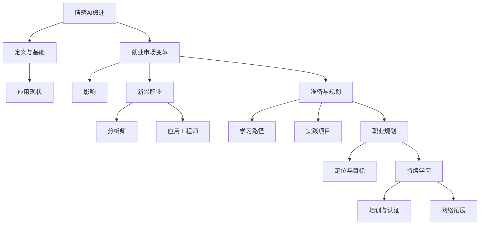

                 

# 情感AI普及后的就业市场变革

关键词：情感AI、就业市场、职业变革、人力资源、新兴职业

摘要：随着人工智能技术的迅猛发展，情感AI逐渐成为热点领域。本文旨在探讨情感AI普及对就业市场的深远影响，分析其在传统职业中的应用变革，以及新兴职业的崛起，为职业人士和求职者提供有益的参考。文章首先介绍了情感AI的基本概念、技术原理和应用现状，然后深入探讨了情感AI对就业市场的变革，包括对传统职业的影响和新兴职业的发展机遇，最后提出了进入情感AI领域的准备和职业规划建议。

## 目录大纲设计：《情感AI普及后的就业市场变革》

### 第一部分：情感AI概述

#### 第1章：情感AI的定义与基础

##### 1.1 情感AI的基本概念

- 情感AI的定义
- 情感AI的研究背景与发展历程
- 情感AI的核心组成部分

##### 1.2 情感AI的技术原理

- 情感识别技术
- 情感分析算法
- 情感生成的技术

#### 第2章：情感AI在行业中的应用现状

##### 2.1 情感AI在消费者行为分析中的应用

- 情感分析在市场营销中的作用
- 社交媒体情感分析案例分析
- 情感分析在用户体验提升中的应用

##### 2.2 情感AI在医疗服务中的应用

- 情感识别在心理健康诊断中的应用
- 情感分析在医生与患者沟通中的作用
- 情感AI在医疗管理中的实际案例

### 第二部分：就业市场的变革

#### 第3章：情感AI对传统职业的影响

##### 3.1 情感AI对人力资源管理的变革

- 情感分析在招聘与选拔中的应用
- 情感AI在员工关系管理中的作用
- 情感AI对培训与发展的影响

##### 3.2 情感AI对销售人员的影响

- 情感分析在销售策略制定中的应用
- 情感AI在客户关系管理中的作用
- 情感AI对销售流程的优化

#### 第4章：新兴职业的发展与机遇

##### 4.1 情感AI分析师

- 情感AI分析师的角色与职责
- 情感AI分析师所需技能
- 情感AI分析师的职业发展路径

##### 4.2 情感AI应用工程师

- 情感AI应用工程师的工作内容
- 情感AI应用工程师所需的技术栈
- 情感AI应用工程师的职业前景

### 第三部分：情感AI就业市场的准备

#### 第5章：进入情感AI领域的准备

##### 5.1 学习路径与资源

- 情感AI基础知识学习
- 情感分析工具与技术的掌握
- 情感AI相关的在线课程与书籍推荐

##### 5.2 实践项目与经验积累

- 小型情感分析项目实践
- 参与情感AI相关的开源项目
- 在职场中尝试情感AI相关的实习机会

#### 第6章：职业规划与晋升

##### 6.1 职业定位与目标设定

- 根据个人兴趣和优势选择职业方向
- 设定清晰的职业目标和里程碑

##### 6.2 持续学习与职业发展

- 持续关注情感AI领域的最新动态
- 参加专业培训与认证
- 构建专业网络，拓展职业资源

### 第四部分：情感AI就业案例分享

#### 第7章：成功情感AI从业者的故事

##### 7.1 从业者的职业经历与心得

- 成功案例分享
- 职业发展的关键节点与策略

##### 7.2 情感AI项目的实际应用

- 情感AI项目案例介绍
- 项目实施过程中的挑战与解决策略

### 附录

##### 附录A：情感AI常用工具与技术

- 情感分析相关工具推荐
- 常用的情感分析库与框架

##### 附录B：情感AI学习资源

- 在线课程与书籍推荐
- 学术期刊与会议资源

##### 附录C：情感AI职业发展路径

- 情感AI职业图谱
- 职业发展路线规划建议

### Mermaid 流程图

### 情感AI的基本概念与背景

情感AI（Affective AI）是人工智能（AI）的一个分支，它致力于研究和开发能够识别、理解、模拟和生成人类情感的计算机系统。情感是人类心理体验的核心组成部分，它涉及情绪、情感状态、情感反应等多方面的内容。随着社会和科技的进步，人们越来越意识到情感在人类行为、决策和沟通中的重要作用，这也促使情感AI成为一个备受关注的研究领域。

#### 情感AI的定义

情感AI可以定义为一种能够感知、理解、生成和模拟人类情感状态的技术体系。具体来说，情感AI的核心目标是：

- **感知**：通过各种传感器和算法技术，捕捉人类情感状态的物理表现，如面部表情、语音语调、生理指标等。
- **理解**：通过机器学习和自然语言处理技术，分析和解释情感数据，理解其背后的情感意图和情感强度。
- **模拟**：根据对人类情感的识别和理解，生成相应的情感表达，如情感反应、情感对话等。
- **生成**：通过算法创造新的情感体验，如虚拟情感角色、情感化交互界面等。

#### 情感AI的研究背景与发展历程

情感AI的发展历程可以追溯到20世纪中叶，随着计算机科学和心理学研究的深入，研究者开始探索如何将人类的情感特性引入到机器系统中。以下是几个关键节点：

- **20世纪60年代**：早期的心理学家和计算机科学家开始研究如何模拟人类的情感状态。
- **20世纪80年代**：人工智能领域的专家开始关注情感认知模型的研究，并尝试将情感模型应用到计算机系统中。
- **21世纪初**：随着机器学习和深度学习技术的突破，情感AI开始进入快速发展的阶段。各种情感识别算法和工具相继问世。
- **现在**：随着大数据和物联网技术的普及，情感AI在消费者行为分析、医疗健康、教育、客户服务等领域的应用越来越广泛。

#### 情感AI的核心组成部分

情感AI的核心组成部分包括情感识别、情感分析和情感生成。

1. **情感识别**：情感识别是情感AI的首要任务，它涉及到从语音、文本、图像等多媒体数据中提取情感信息。具体技术包括：
   - **面部表情识别**：通过分析面部肌肉运动和眼部动作，识别出人类情绪状态。
   - **语音情感识别**：通过分析语音的音高、音量、语速等特征，识别出情感状态。
   - **文本情感分析**：通过自然语言处理技术，从文本中提取情感倾向和情感强度。

2. **情感分析**：情感分析是对情感识别数据进行深度分析和解释的过程。它包括以下关键技术：
   - **情感分类**：将情感数据分类为不同的情感类别，如快乐、悲伤、愤怒等。
   - **情感强度分析**：对情感数据进行量化分析，确定情感强度的强弱。
   - **情感倾向分析**：分析情感数据中的主观倾向，如正面情感、负面情感等。

3. **情感生成**：情感生成是情感AI的高级功能，它涉及到如何根据情感识别和情感分析的结果，生成相应的情感表达。具体技术包括：
   - **情感对话系统**：根据用户的情感状态，生成相应的对话回应。
   - **情感化虚拟角色**：通过计算机图形和语音合成技术，创建具有情感表达的虚拟角色。
   - **情感化交互界面**：通过视觉和听觉效果，营造情感化的交互体验。

### 情感AI的技术原理

情感AI的技术原理主要包括情感识别技术、情感分析算法和情感生成技术。下面将逐一介绍这些技术的原理和应用。

#### 情感识别技术

情感识别技术是情感AI的基础，它通过多种传感器和算法技术，从多种数据源中提取情感信息。以下是几种常见的情感识别技术：

1. **面部表情识别**：面部表情是人类情感表达的最直接形式。面部表情识别技术通过分析面部肌肉运动和眼部动作，识别出人类情绪状态。常用的方法包括：
   - **基于图像的处理**：通过图像处理技术，对捕捉到的面部图像进行预处理，然后使用机器学习算法进行分类。
   - **基于深度学习的模型**：使用深度学习模型，如卷积神经网络（CNN），对面部图像进行特征提取和分类。

2. **语音情感识别**：语音情感识别是通过分析语音的音高、音量、语速等特征，识别出情感状态。常用的方法包括：
   - **声学特征提取**：对语音信号进行预处理，提取出反映情感状态的声学特征，如梅尔频率倒谱系数（MFCC）。
   - **机器学习算法**：使用机器学习算法，如支持向量机（SVM）、随机森林（RF）等，对提取的声学特征进行分类。

3. **文本情感分析**：文本情感分析是通过自然语言处理技术，从文本中提取情感信息。常用的方法包括：
   - **情感词典**：使用预定义的情感词典，根据文本中的情感词汇和词频，确定文本的情感倾向。
   - **机器学习模型**：使用机器学习模型，如朴素贝叶斯（NB）、逻辑回归（LR）等，对文本进行情感分类。

#### 情感分析算法

情感分析算法是对情感识别数据进行深度分析和解释的过程。情感分析算法的核心任务是确定文本、语音或面部表情的情感类别和情感强度。以下是几种常见的情感分析算法：

1. **基于规则的方法**：这种方法通过定义一系列规则，对情感数据进行分类。常见的规则包括：
   - **情感词典匹配**：使用预定义的情感词典，对文本中的情感词汇进行匹配，确定文本的情感类别。
   - **情感强度规则**：根据文本中的情感词汇和短语，确定情感强度。

2. **基于机器学习的方法**：这种方法使用机器学习算法，从训练数据中学习情感分类规则。常见的机器学习算法包括：
   - **朴素贝叶斯（NB）**：基于贝叶斯定理，通过计算文本中各词汇的概率分布，确定文本的情感类别。
   - **支持向量机（SVM）**：通过最大化分类边界，将文本数据映射到高维空间，实现情感分类。
   - **随机森林（RF）**：通过构建多个决策树，进行集成学习，提高分类的准确率。

3. **基于深度学习的方法**：这种方法使用深度学习模型，如卷积神经网络（CNN）、循环神经网络（RNN）等，对情感数据进行特征提取和分类。常见的深度学习模型包括：
   - **卷积神经网络（CNN）**：通过卷积层提取文本的局部特征，然后通过全连接层进行分类。
   - **循环神经网络（RNN）**：通过循环结构，对文本序列进行建模，捕捉文本中的长期依赖关系。

#### 情感生成技术

情感生成技术是情感AI的高级功能，它通过算法和技术，生成与情感识别和分析结果相匹配的情感表达。以下是几种常见的情感生成技术：

1. **情感对话系统**：情感对话系统是通过自然语言处理和语音合成技术，根据用户的情感状态，生成相应的对话回应。常用的方法包括：
   - **文本到文本的转换**：通过自然语言生成技术，将情感识别和分析结果转换为文本形式，生成对话回应。
   - **文本到语音的转换**：通过文本到语音（TTS）合成技术，将文本形式的对话回应转换为语音形式。

2. **情感化虚拟角色**：情感化虚拟角色是通过计算机图形和语音合成技术，创建具有情感表达的虚拟角色。常用的方法包括：
   - **计算机图形技术**：通过计算机图形技术，为虚拟角色设计不同的面部表情和身体动作，以表现不同的情感状态。
   - **语音合成技术**：通过语音合成技术，为虚拟角色生成相应的语音表达，实现情感化的交互。

3. **情感化交互界面**：情感化交互界面是通过视觉和听觉效果，营造情感化的交互体验。常用的方法包括：
   - **视觉效果**：通过动态颜色变化、图像动画等视觉效果，表现情感状态。
   - **听觉效果**：通过音效、音乐等听觉效果，增强情感体验。

### 情感AI在行业中的应用现状

随着情感AI技术的不断成熟和普及，它在各行各业中得到了广泛的应用。以下是情感AI在几个主要行业中的应用现状：

#### 情感AI在消费者行为分析中的应用

情感AI在消费者行为分析中发挥着重要作用，通过分析消费者的情感状态，企业可以更好地理解消费者的需求和行为，从而制定更有效的营销策略。

1. **情感分析在市场营销中的作用**：情感AI可以帮助企业分析消费者的情感反应，了解他们对产品的态度和喜好。例如，通过分析社交媒体上的用户评论和反馈，企业可以识别出产品的优势与不足，及时调整产品策略。

2. **社交媒体情感分析案例分析**：社交媒体情感分析是情感AI在消费者行为分析中的一个重要应用。通过分析社交媒体上的用户情感状态，企业可以了解消费者对品牌和产品的情感倾向。例如，某电商平台通过分析用户在社交媒体上的评论，发现用户对某款商品的负面情感较高，从而及时采取措施，改善消费者体验。

3. **情感分析在用户体验提升中的应用**：情感AI可以帮助企业实时监控用户的情感状态，提供个性化的用户体验。例如，在线教育平台可以通过情感分析技术，分析学生在学习过程中的情感状态，及时调整教学内容和方式，提高学习效果。

#### 情感AI在医疗服务中的应用

情感AI在医疗服务中的应用为提升患者护理质量和医生工作效率提供了新的手段。

1. **情感识别在心理健康诊断中的应用**：情感AI可以帮助医生通过分析患者的语音、文本和面部表情，识别出患者的情感状态，从而更准确地诊断心理健康问题。例如，通过分析患者的语音语调，医生可以识别出患者是否存在焦虑或抑郁情绪。

2. **情感分析在医生与患者沟通中的作用**：情感分析可以帮助医生更好地理解患者的情感需求，提高医患沟通效果。例如，通过分析患者的文本描述，医生可以了解患者的心理状态，从而提供更有针对性的治疗方案。

3. **情感AI在医疗管理中的实际案例**：某医院采用情感AI技术，对患者的电子健康记录进行情感分析，发现患者的情感状态与疾病恢复速度密切相关。通过及时监测患者的情感状态，医院能够提供更加个性化的护理服务，提高患者的康复效果。

### 情感AI对传统职业的影响

随着情感AI技术的普及，它对传统职业的影响日益显著。以下是情感AI对几类传统职业的具体影响：

#### 情感AI对人力资源管理的变革

1. **情感分析在招聘与选拔中的应用**：情感AI可以帮助企业更准确地评估候选人的情绪状态和性格特征，从而提高招聘的准确性和效率。例如，通过分析面试者的语音、面部表情和文本回答，企业可以评估候选人的情绪稳定性和沟通能力。

2. **情感AI在员工关系管理中的作用**：情感AI可以帮助企业更好地了解员工的情感状态，及时发现和处理员工关系问题。例如，通过分析员工的邮件和聊天记录，企业可以了解员工之间的沟通情况，防止冲突和误解的发生。

3. **情感AI对培训与发展的影响**：情感AI可以帮助企业为员工提供个性化的培训和发展建议。例如，通过分析员工的情感状态和技能水平，企业可以制定更有效的培训计划，提高员工的职业素养和绩效。

#### 情感AI对销售人员的影响

1. **情感分析在销售策略制定中的应用**：情感AI可以帮助销售人员更准确地了解客户的情感状态，从而制定更有效的销售策略。例如，通过分析客户的语音、面部表情和文本反馈，销售人员可以识别出客户的需求和购买意愿，调整销售策略。

2. **情感AI在客户关系管理中的作用**：情感AI可以帮助销售人员更好地维护客户关系，提高客户满意度。例如，通过分析客户的情感状态和反馈，销售人员可以及时了解客户的需求变化，提供个性化的服务。

3. **情感AI对销售流程的优化**：情感AI可以帮助企业优化销售流程，提高销售效率。例如，通过分析客户的情感状态和购买行为，企业可以优化销售策略和流程，提高转化率和销售额。

### 新兴职业的发展与机遇

随着情感AI技术的快速发展，许多新兴职业应运而生，为从业人员提供了广阔的发展机遇。

#### 情感AI分析师

1. **情感AI分析师的角色与职责**：情感AI分析师是负责分析、解释和利用情感AI数据的专业人员。他们的主要职责包括：
   - **情感数据收集与处理**：收集各种情感数据，如语音、文本、面部表情等，并进行预处理。
   - **情感分析模型开发**：设计、开发和优化情感分析模型，提高情感识别和情感分析的准确性。
   - **数据分析与报告**：对情感分析结果进行深入分析，为企业提供数据驱动的决策建议。

2. **情感AI分析师所需技能**：成为一名成功的情感AI分析师，需要具备以下技能：
   - **编程能力**：熟练掌握Python、R等编程语言，了解常见的机器学习和深度学习库。
   - **数据分析能力**：具备统计学和数据分析的基本知识，能够处理和分析大量情感数据。
   - **情感识别技术理解**：了解情感识别技术，如面部表情识别、语音情感识别、文本情感分析等。
   - **沟通能力**：具备良好的沟通能力，能够将复杂的分析结果和结论清晰地传达给企业决策者。

3. **情感AI分析师的职业发展路径**：情感AI分析师的职业发展路径通常包括以下几个阶段：
   - **初级分析师**：从事数据收集、预处理和基础情感分析工作，积累经验。
   - **高级分析师**：负责情感分析模型的开发和优化，参与企业重大决策的制定。
   - **团队领导**：担任团队领导，负责管理和指导其他分析师的工作，推动项目的进展。
   - **咨询顾问**：为企业提供情感AI战略咨询，帮助企业实现情感AI的商业化应用。

#### 情感AI应用工程师

1. **情感AI应用工程师的工作内容**：情感AI应用工程师是负责将情感AI技术应用于实际场景的专业人员。他们的主要工作内容包括：
   - **情感识别系统开发**：设计和开发情感识别系统，如面部表情识别、语音情感识别等。
   - **情感分析应用部署**：将情感分析模型部署到生产环境中，实现情感分析功能的自动化。
   - **系统集成与优化**：将情感AI系统与其他业务系统进行集成，优化系统性能和用户体验。

2. **情感AI应用工程师所需的技术栈**：情感AI应用工程师需要具备以下技术栈：
   - **编程语言**：熟练掌握Python、C++等编程语言，了解常见的机器学习和深度学习库。
   - **操作系统和框架**：熟悉Linux操作系统，了解Docker、Kubernetes等容器化技术，掌握TensorFlow、PyTorch等深度学习框架。
   - **系统集成与部署**：具备系统集成与部署经验，能够将情感AI系统部署到生产环境中。
   - **数据处理与存储**：了解大数据处理和存储技术，如Hadoop、Spark、MongoDB等。

3. **情感AI应用工程师的职业前景**：随着情感AI技术的广泛应用，情感AI应用工程师的职业前景非常广阔。他们的主要职业发展路径包括：
   - **初级工程师**：从事情感识别系统开发和部署工作，积累实际经验。
   - **高级工程师**：负责复杂情感识别系统的设计和优化，参与项目核心技术的研发。
   - **技术主管**：担任技术主管，负责团队管理和项目进度控制。
   - **创业与投资**：利用丰富的行业经验和专业知识，创业或投资于情感AI相关的初创企业。

### 进入情感AI领域的准备

为了在情感AI领域取得成功，从业人员需要做好充分的准备。以下是一些建议：

#### 学习路径与资源

1. **情感AI基础知识学习**：了解情感AI的基本概念、技术原理和应用场景，掌握情感识别、情感分析和情感生成等核心技术。

2. **情感分析工具与技术的掌握**：学习并熟练使用常见的情感分析工具和技术，如Python编程、机器学习算法、深度学习框架等。

3. **情感AI相关的在线课程与书籍推荐**：
   - **在线课程**：《深度学习》、《自然语言处理基础》、《情感计算》等。
   - **书籍**：《情感计算：情感识别与生成》、《情感计算导论》、《深度学习》等。

#### 实践项目与经验积累

1. **小型情感分析项目实践**：通过参与小型情感分析项目，积累实际操作经验，锻炼解决问题的能力。

2. **参与情感AI相关的开源项目**：加入情感AI相关的开源项目，与其他开发者共同学习和进步。

3. **在职场中尝试情感AI相关的实习机会**：在职场中尝试情感AI相关的实习机会，了解行业现状，拓展人脉资源。

### 职业规划与晋升

为了在情感AI领域取得长远发展，从业人员需要制定清晰的职业规划，并不断学习和提升自身能力。

#### 职业定位与目标设定

1. **根据个人兴趣和优势选择职业方向**：根据自己的兴趣和优势，选择适合自己的职业方向，如情感AI分析师、情感AI应用工程师等。

2. **设定清晰的职业目标和里程碑**：制定长期和短期的职业目标，并设定相应的里程碑，以便监控自己的进步和调整发展方向。

#### 持续学习与职业发展

1. **持续关注情感AI领域的最新动态**：通过阅读专业期刊、参加行业会议和研讨会，了解情感AI领域的最新研究成果和趋势。

2. **参加专业培训与认证**：参加情感AI相关的专业培训和认证，提高自身的专业素养和技能水平。

3. **构建专业网络，拓展职业资源**：通过加入专业社群、参加行业活动和建立人脉关系，拓展职业资源和机会。

### 成功情感AI从业者的故事

#### 1. 从业者的职业经历与心得

**案例一**：小王，情感AI应用工程师

小王毕业于计算机科学专业，在校期间对机器学习和情感AI产生了浓厚的兴趣。毕业后，他加入了一家专注于情感AI应用开发的初创公司。初入职场的他，从最基础的情感识别模型开发做起，逐渐积累了丰富的实践经验。在他的努力下，公司开发的情感识别系统在市场上取得了良好的口碑。

心得体会：

- **学习与实践并重**：在情感AI领域，理论知识固然重要，但实践经验更为关键。只有通过不断的实践，才能提高解决问题的能力。
- **持续学习**：情感AI技术更新迅速，从业者需要保持持续学习的态度，紧跟行业发展的步伐。
- **团队合作**：情感AI项目通常涉及多个领域的知识，团队合作是成功的关键。要学会与他人沟通和协作，共同推动项目的进展。

#### 2. 情感AI项目的实际应用

**案例二**：小张，情感AI分析师

小张曾在一家大型互联网公司担任情感AI分析师，负责分析用户在社交媒体上的情感状态，为企业提供数据驱动的决策建议。他参与了一个针对社交媒体用户情感分析的项目，通过对大量用户评论进行情感分析，成功识别出用户的情感倾向和需求，帮助企业优化了产品策略。

项目实施过程中的挑战与解决策略：

- **数据质量**：社交媒体数据质量参差不齐，存在大量的噪音和垃圾信息。小张采用数据清洗和去噪技术，提高了数据的准确性和可靠性。
- **模型优化**：情感分析模型需要不断优化，以提高分类的准确率。小张通过调整模型参数、增加训练数据等方式，提高了模型的性能。
- **跨领域合作**：情感分析项目通常需要多个领域的专业知识，小张与数据科学家、产品经理等团队成员密切合作，共同解决项目中的难题。

### 附录

#### 附录A：情感AI常用工具与技术

- **情感分析相关工具**：
  - **TextBlob**：一款简单的文本情感分析库，支持情感极性分析和文本分类。
  - **VADER**：一款专门用于社交媒体文本情感分析的库，具有很高的准确率。

- **常用的情感分析库与框架**：
  - **NLTK**：一款流行的自然语言处理库，提供文本分类、情感分析等功能。
  - **TensorFlow**：一款开源的深度学习框架，支持情感识别和生成等任务。

#### 附录B：情感AI学习资源

- **在线课程**：
  - **《深度学习》**：由吴恩达教授开设的深度学习课程，包括情感识别等主题。
  - **《情感计算》**：针对情感AI的专门课程，介绍情感识别、情感生成等关键技术。

- **书籍**：
  - **《情感计算导论》**：详细介绍情感计算的基本概念和技术。
  - **《深度学习》**：涵盖深度学习的基础知识，包括情感识别等相关内容。

#### 附录C：情感AI职业发展路径

- **情感AI职业图谱**：
  - **情感AI分析师**：负责情感数据分析、模型开发和结果解读。
  - **情感AI应用工程师**：负责情感识别系统的开发和部署。
  - **情感AI产品经理**：负责情感AI产品的规划和实施。
  - **情感AI研究科学家**：从事情感AI的基础研究和技术创新。

- **职业发展路线规划建议**：
  - **第一阶段**：学习情感AI的基础知识，掌握常用的工具和技术。
  - **第二阶段**：参与实际项目，积累实践经验，提高解决问题的能力。
  - **第三阶段**：根据个人兴趣和职业目标，选择适合自己的职业方向，进行专业深化和拓展。
  - **第四阶段**：成为行业专家，参与重大项目的研发和推广，为企业创造价值。

### 总结

情感AI作为人工智能领域的一个重要分支，正日益受到广泛关注。随着技术的不断进步和应用场景的拓展，情感AI对就业市场的影响愈发显著。传统职业面临着巨大的变革，而新兴职业也在不断涌现，为从业人员提供了广阔的发展机遇。对于职业人士和求职者而言，了解情感AI的基本概念、应用现状和发展趋势，有助于把握行业动态，规划职业生涯。

本文从情感AI的基本概念、应用现状、对传统职业的影响、新兴职业的发展与机遇、职业准备与规划、成功案例分享等多个方面，全面探讨了情感AI普及后的就业市场变革。希望读者能够从中获得启发，为自己的职业发展做出明智的选择。在未来，随着情感AI技术的进一步成熟，我们有理由相信，它将为各行各业带来更多的创新和变革。作者：AI天才研究院/AI Genius Institute & 禅与计算机程序设计艺术 /Zen And The Art of Computer Programming。

