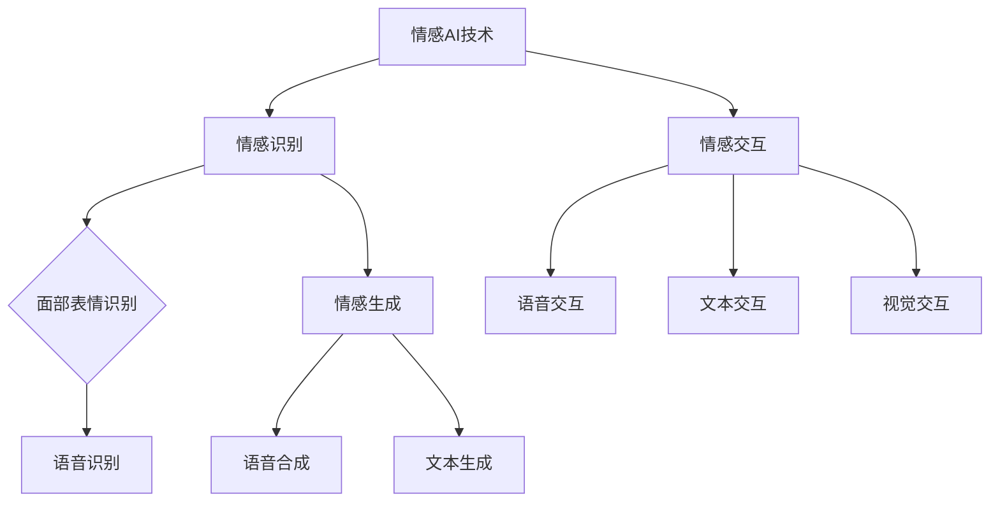

                 

# 《情感AI普及后的新型社交礼仪》

关键词：情感AI，社交礼仪，人工智能，情感识别，人机交互，用户体验

摘要：随着情感AI技术的不断发展，人工智能在社交领域的应用逐渐深入，为人类社交行为带来了新的变革。本文将从情感AI的基础概念、工作原理、应用场景以及新型社交礼仪的构建等方面进行探讨，旨在为读者呈现情感AI普及后的新型社交礼仪，帮助人们在信息化时代中更好地进行人机互动和人际交往。

## 目录大纲

### 第一部分：情感AI基础概述

### 第1章 情感AI的概念与发展历程

#### 1.1.1 情感AI的定义

情感AI（Affective AI）是指能够识别、理解和模拟人类情感的人工智能系统。它通过感知用户的面部表情、语音语调、文本情感色彩等，来理解用户的情感状态，并做出相应的反应。

#### 1.1.2 情感AI的发展历程

情感AI的发展可以追溯到20世纪80年代，随着计算机科学、心理学、神经科学等领域的不断进步，情感AI技术逐渐从理论研究走向实际应用。

#### 1.1.3 情感AI的核心技术

情感AI的核心技术包括情感识别、情感生成和情感模拟。情感识别是通过分析用户的面部表情、语音语调、文本情感等，来识别用户的情感状态；情感生成是通过算法生成具有特定情感的语音、文本或图像；情感模拟是通过模拟人类的情感反应，来与用户进行情感互动。

### 第2章 情感AI的工作原理

#### 2.1.1 人工智能与情感识别

情感识别是情感AI的基础，它依赖于人工智能技术，通过对大量数据的分析和学习，来识别和理解人类的情感状态。

#### 2.1.2 情感分析的基本模型

情感分析的基本模型包括情感分类模型、情感极性模型和情感强度模型。这些模型通过不同的算法和特征提取方法，来识别和量化用户的情感。

#### 2.1.3 情感交互的算法实现

情感交互的算法实现涉及语音合成、文本生成和图像生成等技术。通过这些技术，情感AI可以生成与用户情感状态相匹配的语音、文本或图像。

### 第二部分：情感AI在社交中的应用

### 第3章 情感AI在社交媒体中的应用

#### 3.1.1 情感AI在社交媒体监测中的应用

情感AI可以用于社交媒体监测，通过分析用户在社交媒体上的发言，来识别用户的情感状态，从而为品牌管理、舆情监控等提供数据支持。

#### 3.1.2 情感AI在社交媒体营销中的应用

情感AI可以帮助企业在社交媒体上进行情感营销，通过分析用户的情感状态，来制定更有针对性的营销策略。

#### 3.1.3 情感AI在社交媒体互动中的应用

情感AI可以用于社交媒体互动，通过分析用户的情感状态，来生成与用户情感相匹配的回复，从而提升用户体验。

### 第4章 情感AI在人际沟通中的应用

#### 4.1.1 情感AI在语音交互中的应用

情感AI可以在语音交互中模拟人类的情感反应，通过与用户的语音互动，来提升用户体验。

#### 4.1.2 情感AI在文本交互中的应用

情感AI可以在文本交互中分析用户的情感状态，并通过生成与用户情感相匹配的文本，来提升用户体验。

#### 4.1.3 情感AI在视觉交互中的应用

情感AI可以在视觉交互中分析用户的情感状态，并通过生成与用户情感相匹配的图像，来提升用户体验。

### 第三部分：新型社交礼仪的构建

### 第5章 情感AI与新型社交礼仪的关系

#### 5.1.1 情感AI对社交礼仪的影响

情感AI的普及将对社交礼仪产生深远的影响，它将改变人们传统的社交行为模式，使得社交礼仪更加注重情感的表达和理解。

#### 5.1.2 新型社交礼仪的核心特征

新型社交礼仪将更加注重情感的表达和理解，强调人机互动和人际交往的和谐共生。

#### 5.1.3 新型社交礼仪的发展趋势

新型社交礼仪将随着情感AI技术的不断发展而不断完善，它将成为信息化时代的一种新型社交规范。

### 第6章 新型社交礼仪的实施与推广

#### 6.1.1 新型社交礼仪的实施策略

新型社交礼仪的实施需要从教育、文化、法律等多个层面进行，通过多种途径来推广和普及。

#### 6.1.2 新型社交礼仪的推广方式

新型社交礼仪的推广可以采用线上宣传、线下培训、社交活动等多种方式。

#### 6.1.3 新型社交礼仪的挑战与应对

新型社交礼仪的推广面临着一系列挑战，如技术门槛、文化差异等，需要通过持续的技术创新和文化融合来应对。

### 第7章 案例研究：情感AI与新型社交礼仪的应用实例

#### 7.1.1 案例一：情感AI在客户服务中的应用

情感AI在客户服务中的应用可以帮助企业更好地理解客户的需求和情感，提供更加个性化的服务。

#### 7.1.2 案例二：情感AI在企业管理中的应用

情感AI在企业管理中的应用可以帮助企业更好地了解员工的情感状态，提升团队凝聚力和工作效率。

#### 7.1.3 案例三：情感AI在教育培训中的应用

情感AI在教育培训中的应用可以帮助教育机构更好地了解学生的学习情感，提供更加针对性的教育服务。

### 第四部分：未来展望

### 第8章 情感AI与社交礼仪的未来发展

#### 8.1.1 情感AI的未来趋势

随着人工智能技术的不断发展，情感AI将在更多领域得到应用，其能力也将不断升级。

#### 8.1.2 新型社交礼仪的未来发展

新型社交礼仪将随着情感AI技术的发展而不断演进，它将成为信息化时代的一种重要社交规范。

#### 8.1.3 情感AI与社交礼仪的未来展望

情感AI与社交礼仪的融合将为人类社交带来新的机遇和挑战，它将成为未来社会的一种新型社交方式。

### 附录：相关资源与进一步阅读

#### 附录1：情感AI技术资源汇总

#### 附录2：新型社交礼仪相关书籍推荐

#### 附录3：情感AI与社交礼仪研究论文精选

## 情感AI基础概述

### 第1章 情感AI的概念与发展历程

#### 1.1.1 情感AI的定义

情感AI（Affective AI）是指能够识别、理解和模拟人类情感的人工智能系统。它通过感知用户的面部表情、语音语调、文本情感等，来理解用户的情感状态，并做出相应的反应。情感AI旨在实现人与机器之间的情感交流和共鸣，从而提升用户体验。

#### 1.1.2 情感AI的发展历程

情感AI的发展可以追溯到20世纪80年代，当时人工智能领域的研究者开始关注情感在人类行为中的作用，并试图将情感因素引入到人工智能系统中。随着计算机科学、心理学、神经科学等领域的不断进步，情感AI技术逐渐从理论研究走向实际应用。

1980年代：研究者开始探讨情感计算的基本概念，提出情感AI的理论框架。

1990年代：情感AI技术开始应用于心理学、医学等领域，如情感分析、情感诊断等。

2000年代：随着计算机性能的提升和大数据技术的发展，情感AI开始应用于社交媒体、电子商务等领域，如情感监测、情感营销等。

2010年代：深度学习技术的发展推动了情感AI的进步，使其在语音识别、文本分析、图像识别等领域取得了显著成果。

#### 1.1.3 情感AI的核心技术

情感AI的核心技术包括情感识别、情感生成和情感模拟。情感识别是通过分析用户的面部表情、语音语调、文本情感等，来识别用户的情感状态；情感生成是通过算法生成具有特定情感的语音、文本或图像；情感模拟是通过模拟人类的情感反应，来与用户进行情感互动。

### 第2章 情感AI的工作原理

#### 2.1.1 人工智能与情感识别

情感识别是情感AI的基础，它依赖于人工智能技术，通过对大量数据的分析和学习，来识别和理解人类的情感状态。情感识别的关键技术包括面部表情识别、语音情感识别和文本情感分析。

面部表情识别：通过分析用户的面部表情，来识别用户的情感状态。面部表情识别技术通常采用计算机视觉算法，如卷积神经网络（CNN）等。

语音情感识别：通过分析用户的语音语调，来识别用户的情感状态。语音情感识别技术通常采用语音信号处理和机器学习算法，如支持向量机（SVM）等。

文本情感分析：通过分析用户的文本内容，来识别用户的情感状态。文本情感分析技术通常采用自然语言处理（NLP）算法，如词袋模型（Bag-of-Words）、情感词典等。

#### 2.1.2 情感分析的基本模型

情感分析的基本模型包括情感分类模型、情感极性模型和情感强度模型。

情感分类模型：将文本分为正面情感、负面情感和中性情感三类。情感分类模型通常采用机器学习算法，如朴素贝叶斯（Naive Bayes）、随机森林（Random Forest）等。

情感极性模型：对文本中的情感极性进行量化，通常使用情感极性得分来表示。情感极性模型可以通过调整模型参数来控制情感极性的敏感度。

情感强度模型：对文本中的情感强度进行量化，通常使用情感强度得分来表示。情感强度模型可以通过调整模型参数来控制情感强度的敏感度。

#### 2.1.3 情感交互的算法实现

情感交互的算法实现涉及语音合成、文本生成和图像生成等技术。通过这些技术，情感AI可以生成与用户情感状态相匹配的语音、文本或图像。

语音合成：通过合成语音来与用户进行语音交互。语音合成技术通常采用自然语音合成（TTS）算法，如基于深度学习的WaveNet等。

文本生成：通过生成文本来与用户进行文本交互。文本生成技术通常采用自然语言生成（NLG）算法，如基于生成对抗网络（GAN）的文本生成模型。

图像生成：通过生成图像来与用户进行视觉交互。图像生成技术通常采用生成对抗网络（GAN）等深度学习算法。

## 情感AI在社交中的应用

### 第3章 情感AI在社交媒体中的应用

#### 3.1.1 情感AI在社交媒体监测中的应用

情感AI在社交媒体监测中的应用具有重要意义。通过情感分析技术，可以实时监测社交媒体上的用户情感状态，为品牌管理、舆情监控等提供数据支持。具体应用包括：

1. 品牌情感分析：通过对用户在社交媒体上的评论、转发等行为进行分析，评估品牌的情感状态，了解用户对品牌的满意度和忠诚度。

2. 舆情监控：通过分析社交媒体上的负面评论和话题，及时发现和应对潜在的危机事件，防止负面信息扩散。

3. 用户画像：通过对用户在社交媒体上的发言进行分析，构建用户情感画像，为精准营销提供数据支持。

#### 3.1.2 情感AI在社交媒体营销中的应用

情感AI在社交媒体营销中的应用可以帮助企业更好地了解用户情感，制定更有针对性的营销策略。具体应用包括：

1. 情感营销：根据用户情感状态，制定相应的情感营销策略，如发布正面情感内容、设计情感化广告等。

2. 情感引导：通过分析用户情感，引导用户参与互动，提高社交媒体活动的参与度和用户粘性。

3. 情感反馈：收集用户在社交媒体上的情感反馈，优化产品和服务，提升用户满意度。

#### 3.1.3 情感AI在社交媒体互动中的应用

情感AI在社交媒体互动中的应用可以提升用户体验，增强用户互动效果。具体应用包括：

1. 情感回复：根据用户情感，生成与用户情感相匹配的回复，提升用户互动体验。

2. 情感标签：为社交媒体内容添加情感标签，帮助用户快速识别内容的情感倾向，提高信息获取效率。

3. 情感互动：通过情感分析，为用户提供个性化互动内容，增强用户参与感。

### 第4章 情感AI在人际沟通中的应用

#### 4.1.1 情感AI在语音交互中的应用

情感AI在语音交互中的应用可以提升人机交互的智能化水平，使语音助手更加自然地与用户进行情感交流。具体应用包括：

1. 语音情感识别：通过分析用户的语音语调，识别用户的情感状态，为语音助手提供情感反馈。

2. 语音情感生成：根据用户情感，生成具有相应情感的语音回复，提升用户互动体验。

3. 语音情感模拟：通过模拟人类的情感反应，与用户进行情感互动，增强人机互动的自然性。

#### 4.1.2 情感AI在文本交互中的应用

情感AI在文本交互中的应用可以提升文本互动的智能化水平，使文本助手更加理解用户的情感需求。具体应用包括：

1. 文本情感识别：通过分析用户的文本内容，识别用户的情感状态，为文本助手提供情感反馈。

2. 文本情感生成：根据用户情感，生成具有相应情感的文本回复，提升用户互动体验。

3. 文本情感模拟：通过模拟人类的情感反应，与用户进行情感互动，增强文本互动的自然性。

#### 4.1.3 情感AI在视觉交互中的应用

情感AI在视觉交互中的应用可以提升视觉互动的智能化水平，使视觉助手更加理解用户的情感需求。具体应用包括：

1. 视觉情感识别：通过分析用户的面部表情和身体语言，识别用户的情感状态，为视觉助手提供情感反馈。

2. 视觉情感生成：根据用户情感，生成具有相应情感的视觉内容，提升用户互动体验。

3. 视觉情感模拟：通过模拟人类的情感反应，与用户进行情感互动，增强视觉互动的自然性。

### 第三部分：新型社交礼仪的构建

#### 第5章 情感AI与新型社交礼仪的关系

#### 5.1.1 情感AI对社交礼仪的影响

情感AI的普及将对社交礼仪产生深远的影响。随着情感AI技术的发展，人们对于情感表达和理解的认知将发生改变，传统的社交礼仪也将随之调整。以下为情感AI对社交礼仪的影响：

1. 情感表达方式的转变：情感AI可以帮助人们更好地理解和表达情感，使得情感交流更加直接和准确。

2. 社交距离的调整：情感AI可以感知用户的情感状态，使得人们可以更准确地把握社交距离，避免尴尬和误解。

3. 礼仪规则的更新：随着情感AI的应用，社交礼仪规则将更加注重情感互动，强调情感理解和共鸣。

#### 5.1.2 新型社交礼仪的核心特征

新型社交礼仪将具有以下核心特征：

1. 情感为本：新型社交礼仪将更加注重情感的表达和理解，强调情感交流和共鸣。

2. 个性化：情感AI可以帮助人们更好地了解彼此的情感需求，使得社交活动更加个性化。

3. 高效性：情感AI可以提高社交互动的效率，减少不必要的情感消耗。

4. 可持续性：新型社交礼仪将更加注重长期的情感维系，强调可持续的情感发展。

#### 5.1.3 新型社交礼仪的发展趋势

随着情感AI技术的不断发展，新型社交礼仪将呈现以下发展趋势：

1. 情感智能化：情感AI将进一步渗透到社交礼仪的各个方面，使得社交活动更加智能化。

2. 情感互动化：社交礼仪将更加注重情感互动，强调情感共鸣和交流。

3. 情感规范化：新型社交礼仪将逐步形成一套规范，以指导人们的情感交流和互动。

### 第6章 新型社交礼仪的实施与推广

#### 6.1.1 新型社交礼仪的实施策略

要实施新型社交礼仪，需要从以下几个方面进行策略制定：

1. 教育培训：通过教育培训，提高人们对于情感AI的认知和运用能力，为新型社交礼仪的实施奠定基础。

2. 技术支持：提供情感AI技术支持，使得人们能够更好地理解和运用情感AI，提升社交互动的质量。

3. 社会引导：通过媒体宣传和社会活动，引导人们关注情感AI在社交礼仪中的应用，提升公众对于新型社交礼仪的认知。

#### 6.1.2 新型社交礼仪的推广方式

新型社交礼仪的推广可以通过以下几种方式进行：

1. 线上宣传：通过社交媒体、官方网站等渠道，发布关于新型社交礼仪的资讯和指南，提高公众的认知。

2. 线下活动：组织社交礼仪讲座、研讨会等活动，引导人们了解和运用新型社交礼仪。

3. 案例分享：通过分享情感AI与新型社交礼仪的案例，展示新型社交礼仪的实际应用效果，吸引人们的关注。

#### 6.1.3 新型社交礼仪的挑战与应对

在推广新型社交礼仪的过程中，将面临一系列挑战：

1. 技术挑战：情感AI技术的发展仍存在一定的局限性，需要不断改进和完善。

2. 文化挑战：不同文化背景的人们对于情感表达和理解存在差异，需要尊重和融合各种文化。

3. 社会挑战：新型社交礼仪的推广需要全社会的支持和参与，需要克服各种社会阻力。

针对这些挑战，可以采取以下应对策略：

1. 技术创新：持续推动情感AI技术的创新和发展，提升其性能和应用范围。

2. 文化交流：加强不同文化之间的交流与沟通，尊重和融合各种文化。

3. 社会动员：通过媒体宣传、教育培训等方式，动员全社会共同参与新型社交礼仪的推广。

### 第7章 案例研究：情感AI与新型社交礼仪的应用实例

#### 7.1.1 案例一：情感AI在客户服务中的应用

情感AI在客户服务中的应用可以为用户提供更加个性化的服务，提升客户满意度。以下是一个具体案例：

1. 案例背景：某电商企业通过情感AI技术，对其客户服务系统进行升级，以提升用户体验。

2. 应用场景：客户在电商平台上购买商品时，如果遇到问题或疑问，可以通过在线客服寻求帮助。

3. 情感识别：情感AI通过分析客户的语音、文本和面部表情，识别客户的情感状态，如愤怒、焦虑、满意等。

4. 情感回应：根据客户的情感状态，情感AI生成相应的情感回应，如安慰、鼓励、解释等。

5. 情感反馈：客户对情感AI的回应进行评价，以持续优化情感AI的性能和回应质量。

6. 结果：通过情感AI的应用，客户在购买过程中的情感体验得到显著提升，客户满意度提高，投诉率下降。

#### 7.1.2 案例二：情感AI在企业管理中的应用

情感AI在企业管理中的应用可以帮助企业更好地了解员工的需求和情感状态，提升团队凝聚力和工作效率。以下是一个具体案例：

1. 案例背景：某企业通过引入情感AI技术，对其员工管理系统进行升级，以提升员工满意度。

2. 应用场景：企业定期通过在线调查或面对面访谈的方式，收集员工的工作情感状态。

3. 情感识别：情感AI通过分析员工的语音、文本和面部表情，识别员工的工作情感状态，如满意、疲惫、不满等。

4. 情感反馈：情感AI将分析结果反馈给企业管理层，帮助管理层了解员工的工作情感状态。

5. 情感干预：根据员工的情感状态，企业管理层采取相应的干预措施，如调整工作安排、提供心理辅导等。

6. 结果：通过情感AI的应用，员工的工作情感状态得到改善，团队凝聚力和工作效率显著提升。

#### 7.1.3 案例三：情感AI在教育培训中的应用

情感AI在教育培训中的应用可以帮助教育机构更好地了解学生的学习情感，提供更加个性化的教育服务。以下是一个具体案例：

1. 案例背景：某教育机构通过引入情感AI技术，对其在线教育平台进行升级，以提升学生的学习体验。

2. 应用场景：学生在在线教育平台上观看课程视频、参与互动讨论时，情感AI实时分析学生的学习情感状态。

3. 情感识别：情感AI通过分析学生的语音、文本和面部表情，识别学生的学习情感状态，如专注、无聊、困惑等。

4. 情感反馈：情感AI将分析结果反馈给学生，帮助他们了解自己的学习情感状态。

5. 情感调整：学生可以根据情感反馈，调整自己的学习方式和方法，以改善学习情感状态。

6. 结果：通过情感AI的应用，学生的学习体验得到显著提升，学习效果和满意度提高。

### 第四部分：未来展望

#### 第8章 情感AI与社交礼仪的未来发展

#### 8.1.1 情感AI的未来趋势

随着人工智能技术的不断发展，情感AI将在更多领域得到应用，其能力也将不断升级。未来情感AI的发展趋势包括：

1. 情感识别的精度提升：通过不断优化算法和增加数据集，情感AI的情感识别精度将进一步提高。

2. 情感模拟的自然性提升：情感AI将更加擅长模拟人类的情感反应，使得人机互动更加自然。

3. 情感生成的多样性提升：情感AI将能够生成更加丰富和多样的情感内容，满足不同场景和需求。

#### 8.1.2 新型社交礼仪的未来发展

新型社交礼仪将随着情感AI技术的发展而不断演进，它将成为信息化时代的一种重要社交规范。未来新型社交礼仪的发展趋势包括：

1. 情感交流的常态化：情感AI将使得情感交流在日常社交中更加普遍，人们将更加注重情感的表达和理解。

2. 社交礼仪的个性化：情感AI将根据个体的情感需求，为人们提供更加个性化的社交礼仪指导。

3. 社交互动的智能化：情感AI将推动社交互动的智能化发展，使得社交活动更加高效和便捷。

#### 8.1.3 情感AI与社交礼仪的未来展望

情感AI与社交礼仪的融合将为人类社交带来新的机遇和挑战。未来，随着情感AI技术的不断发展，情感AI将在社交礼仪中发挥更加重要的作用，推动社交礼仪向更加人性化和智能化的方向发展。同时，社交礼仪也将不断适应情感AI的发展，形成一套更加完善和适应时代的社交规范。

### 附录：相关资源与进一步阅读

#### 附录1：情感AI技术资源汇总

1. 《情感计算：理论与实践》（Affective Computing: Principles, Models, and Applications）：这本书详细介绍了情感计算的理论和实践，包括情感识别、情感生成和情感模拟等方面。

2. 《情感人工智能：技术与应用》（Affective Artificial Intelligence: From Affective Computing to Embodied AI）：这本书涵盖了情感AI的各个领域，从情感识别到情感交互，提供了丰富的案例和实践经验。

3. 《情感计算年度报告》（Annual Review of Affective Computing）：这是一份权威的报告，汇总了情感计算领域的最新研究成果和进展。

#### 附录2：新型社交礼仪相关书籍推荐

1. 《社交礼仪：个性化沟通的艺术》（Social Etiquette: The Art of Personalized Communication）：这本书介绍了社交礼仪的基本原则，强调个性化沟通在社交中的重要性。

2. 《数字化社交礼仪：如何在网络世界中建立人际信任》（Digital Etiquette: How to Build Trust in the Online World）：这本书针对数字化时代，提供了关于在线社交礼仪的指导和建议。

3. 《未来社交礼仪：情感AI与人际交往的艺术》（Future Etiquette: The Art of Interpersonal Communication with Affective AI）：这本书探讨了情感AI对社交礼仪的影响，提出了未来社交礼仪的发展方向。

#### 附录3：情感AI与社交礼仪研究论文精选

1. “Affective AI: A Review of Current Research and Applications”：这篇综述文章全面总结了情感AI的研究现状和应用领域。

2. “Affective Computing: From Theory to Practice”：这篇文章详细介绍了情感计算的理论基础和实践应用。

3. “Emotion Recognition in Human-Computer Interaction”：这篇文章探讨了情感识别技术在人机交互中的应用。

4. “The Impact of Affective AI on Human-Robot Interaction”：这篇文章分析了情感AI对人类-机器人交互的影响。

5. “Affective AI in Social Robotics：Promises and Challenges”：这篇文章讨论了情感AI在社交机器人领域的应用前景和挑战。

## Mermaid流程图

### 作者信息

作者：AI天才研究院/AI Genius Institute & 禅与计算机程序设计艺术 /Zen And The Art of Computer Programming

### 最佳实践 Tips

1. 在使用情感AI时，要注意保护用户的隐私和数据安全。

2. 在设计情感AI系统时，要充分考虑不同文化背景和用户群体的需求，确保系统的普适性和包容性。

3. 在推广新型社交礼仪时，要结合实际案例和用户反馈，不断优化和调整礼仪规范。

4. 要注重情感AI技术的持续学习和迭代，以适应不断变化的社交需求和情感表达方式。

### 小结

本文从情感AI的概念、工作原理、应用场景、新型社交礼仪的构建等方面进行了深入探讨，旨在为读者呈现情感AI普及后的新型社交礼仪。随着情感AI技术的不断发展，新型社交礼仪将成为信息化时代的一种重要社交规范，它将改变人们的社交行为模式，提升人机互动和人际交往的质量。在未来，我们需要不断探索和优化情感AI与社交礼仪的融合，以适应新时代的社交需求。

### 注意事项

1. 情感AI技术的应用需要遵守相关法律法规，保护用户隐私和数据安全。

2. 在推广新型社交礼仪时，要充分考虑不同文化背景和用户群体的需求，避免出现文化冲突。

3. 情感AI系统的设计和开发需要注重用户体验，确保系统的易用性和互动性。

4. 随着情感AI技术的不断发展，新型社交礼仪也将不断演进，我们需要持续关注和适应这些变化。

### 拓展阅读

1. 情感AI技术的最新研究进展和未来发展趋势。

2. 新型社交礼仪的理论基础和实践案例。

3. 不同国家和地区在情感AI和社交礼仪方面的政策和实践。

4. 情感AI在人际沟通、教育培训、客户服务等领域的应用案例。

