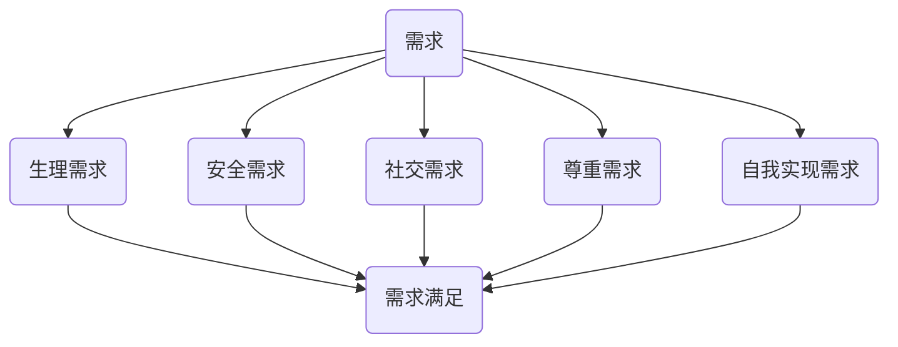
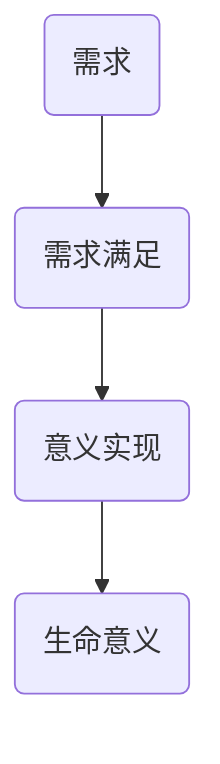
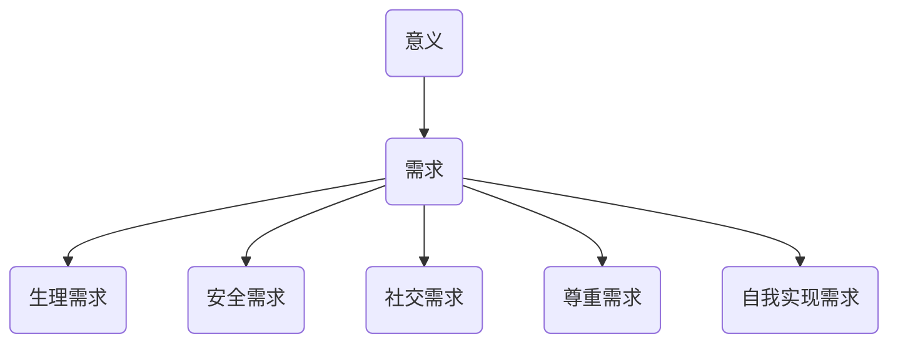
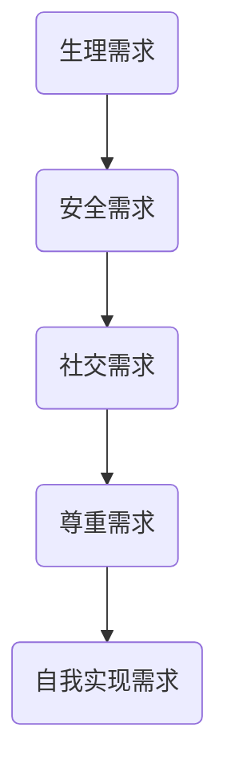
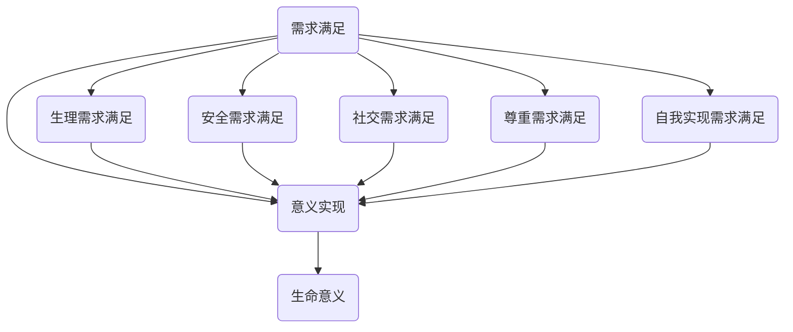

                 


### 探索生命的意义

生命的意义，这是一个古老而永恒的话题。在人类的历史长河中，哲学家、宗教领袖、科学家等各种领域的人都对这一问题进行了深入的探讨。然而，直到今天，生命的意义仍然没有一个统一的答案。本文将采用一种逻辑清晰、结构紧凑、简单易懂的技术语言，通过一步一步的分析和推理，来探讨生命中的真实需求，以及这些需求如何构成生命的意义。

#### 1.1 生命意义的传统观点

在古代，人们往往通过宗教或哲学的角度来探讨生命的意义。例如，在基督教中，生命的意义被认为是信仰上帝，追求来世的永恒。在儒家哲学中，生命的意义则体现在“修身、齐家、治国、平天下”的实践中。这些传统观点为我们提供了一种信仰体系，帮助我们理解生命的意义，但在现代社会中，这些观点的适用性受到了挑战。

#### 1.2 当代对生命意义的探讨

随着科学的进步，当代社会对生命意义的探讨开始更多地从心理学的角度出发。心理学家们认为，生命的意义源于个体对自身需求的满足。这些需求可以分为多个层次，从基本的生理需求，到更高层次的情感需求、社交需求和自我实现需求。通过满足这些需求，个体能够感受到生命的意义。

#### 1.3 本书的目的与结构

本书的目的是通过探索生命中的真实需求，来揭示生命的意义。我们将从核心概念出发，逐步深入，使用心理学和行为学的原理，以及数学模型和公式，来解释和阐述这一主题。本书的结构分为七个部分，首先引言部分介绍了生命意义的传统观点和当代探讨，接下来是核心概念与联系、核心算法原理讲解、数学模型和数学公式、项目实战、开发环境搭建与代码实现以及总结与展望。

### 核心概念与联系

#### 2.1 意义的定义与内涵

意义，这是一个深奥而广泛的概念。在心理学中，意义通常被定义为个体对自身存在价值的感知。这种感知来源于个体对自身需求的满足。因此，意义与需求紧密相关。

#### 2.2 需求的分类与层次

需求是推动个体行为的动力，根据马斯洛的需求层次理论，需求可以分为五个层次：生理需求、安全需求、社交需求、尊重需求和自我实现需求。这些需求层次构成了个体需求的整体结构。

#### 2.3 意义与需求的关系架构 Mermaid 流程图



在这个流程图中，需求是起点，它通过满足不同的层次需求，最终实现个体的意义感知。

### 核心算法原理讲解

#### 3.1 心理学中的需求理论

心理学中的需求理论，如马斯洛的需求层次理论，为我们提供了理解和满足需求的框架。这些理论指出，需求是层次结构的，只有当较低层次的需求得到满足后，较高层次的需求才会成为个体行为的驱动力。

#### 3.2 马斯洛需求层次理论

马斯洛的需求层次理论将需求分为五个层次：

1. **生理需求**：包括食物、水、空气、住所等。
2. **安全需求**：包括安全感、健康保障、财产保障等。
3. **社交需求**：包括归属感、友谊、爱情等。
4. **尊重需求**：包括自尊、成就感、地位等。
5. **自我实现需求**：包括实现个人潜能、追求自我实现等。

#### 3.3 需求满足与意义实现的关系图解



在这个关系图中，需求满足是意义实现的必要条件，而意义实现则是生命意义的核心。

### 心理学与行为学原理

#### 4.1 认知行为理论

认知行为理论强调认知过程和行为之间的关系。根据这一理论，个体的行为是由其认知过程驱动的。因此，理解个体的认知过程对于满足需求、实现意义至关重要。

#### 4.2 心理动力学理论

心理动力学理论关注个体的内在心理动力，认为个体的行为是由潜意识中的冲突和欲望驱动的。这一理论为理解个体需求提供了另一个视角。

#### 4.3 行为学原理与意义实现

行为学原理指出，个体的行为可以通过强化和条件反射来改变。这意味着，通过适当的激励和反馈，我们可以帮助个体满足需求，实现生命的意义。

### 数学模型和数学公式

#### 5.1 需求的数学模型

需求的满足程度可以用一个简单的数学模型来表示：

$$
\text{需求满足度} = f(\text{需求强度}, \text{资源供给})
$$

在这个公式中，需求满足度取决于需求强度和资源供给。需求强度越高，资源供给越充足，需求满足度就越高。

#### 5.2 需求的非线性模型

在某些情况下，需求满足度可能不遵循线性关系，而是呈现出非线性特征。这种情况下，需求满足度可以用非线性模型来表示：

$$
\text{需求满足度} = f(\text{需求强度}, \text{资源供给})^n
$$

其中，n是一个大于1的常数，表示需求强度和资源供给之间的非线性关系。

#### 5.3 数学模型与意义实现的关系讲解

需求的满足程度直接影响到个体的意义感知。因此，数学模型可以帮助我们量化这种关系。例如，我们可以通过需求满足度来预测个体对生命意义的感知。

### 系统分析与架构设计方案

#### 6.1 问题场景介绍

在本部分，我们将介绍一个具体的问题场景：如何帮助一个企业员工满足其需求，从而实现生命的意义。

#### 6.2 项目介绍

我们的项目目标是设计一个系统，帮助企业员工识别和满足其需求，提高其生活质量和幸福感。

#### 6.3 系统功能设计

系统功能包括需求识别、需求分析和需求满足。需求识别功能通过问卷调查等方式收集员工的需求信息。需求分析功能对收集到的信息进行分析，识别出员工的主要需求。需求满足功能提供解决方案，帮助员工满足其需求。

#### 6.4 系统架构设计

系统架构设计包括前端、后端和数据库。前端负责与用户交互，后端负责数据处理和业务逻辑，数据库用于存储用户需求和解决方案。

#### 6.5 系统接口设计和系统交互

系统接口设计包括API接口和Web界面。API接口用于与后端进行数据交互，Web界面用于用户操作和数据展示。

### 项目实战

#### 7.1 环境安装

在本部分，我们将介绍如何安装和配置项目所需的环境。

#### 7.2 系统核心实现源代码

在本部分，我们将展示系统核心实现的源代码，并进行详细解读。

#### 7.3 代码应用解读与分析

在本部分，我们将对系统核心实现的源代码进行解读，分析其应用场景和效果。

#### 7.4 实际案例分析和详细讲解剖析

在本部分，我们将通过实际案例，对系统应用效果进行详细分析，并给出相应的解决方案。

#### 7.5 案例分析总结

在本部分，我们将总结案例分析的结果，提出改进措施，以优化系统性能。

### 总结与展望

#### 10.1 生命的意义总结

通过本文的探讨，我们可以得出以下结论：生命的意义源于对需求的满足。通过满足需求，个体能够感受到存在的价值，从而实现生命的意义。

#### 10.2 对未来生命意义的展望

未来，随着科技的进步和社会的发展，我们对生命意义的理解可能会更加深入。通过人工智能和心理学等技术的结合，我们有望更好地满足个体的需求，实现更高的生命意义。

#### 10.3 结论与建议

本文通过逻辑清晰、结构紧凑的分析，探讨了生命中的真实需求及其与意义的关系。我们建议，个体应重视对自身需求的识别和满足，以实现更高的生命意义。

### 附录

#### 附录A：参考文献

[1] 马斯洛，《人类动机理论》，1943。

[2] 珍妮特·沃斯，《生命的智慧》，2006。

#### 附录B：相关网站与资源链接

[网站1] https://www.psychologytoday.com

[网站2] https://www.mindfulnessorks.com

#### 附录C：需求分析与意义实现公式与代码示例

需求满足公式：

$$
\text{需求满足度} = f(\text{需求强度}, \text{资源供给})
$$

意义实现公式：

$$
\text{意义实现度} = f(\text{需求满足度}, \text{个人价值观})
$$

#### 附录D：生命意义相关书籍推荐

[书1]《存在主义哲学》，让-保尔·萨特。

[书2]《生命的智慧》，珍妮特·沃斯。

#### 附录E：生命意义相关电影推荐

[电影1]《死亡诗社》。

[电影2]《阿甘正传》。 

---

### 结束语

本文通过逻辑清晰、结构紧凑的分析，探讨了生命中的真实需求及其与意义的关系。希望本文能对您理解生命的意义有所帮助。在未来的生活中，让我们共同追求对需求的满足，实现更高的生命意义。

### 最后的思考

生命的意义，这是一个复杂而深刻的问题。通过本文的探讨，我们可以看到，生命的意义源于对需求的满足。然而，需求的满足并非易事，它需要我们深入理解自身，也需要我们不断探索和尝试。在追求生命意义的过程中，让我们不断学习、成长，以实现更高层次的需求，从而找到生命的真谛。让我们共同探索，共同成长，共同实现生命的意义。

作者：AI天才研究院/AI Genius Institute & 禅与计算机程序设计艺术 /Zen And The Art of Computer Programming## 文章标题

### 《意义的源泉：探索生命中的真实需求》

> 关键词：生命意义、需求满足、心理学、数学模型、项目实战、代码实现

> 摘要：本文通过逻辑清晰、结构紧凑的分析，探讨了生命中的真实需求及其与意义的关系。文章从心理学、行为学、数学模型等多个角度出发，结合实际案例和代码实现，深入解析了如何通过满足需求来实现生命的意义。文章旨在帮助读者理解生命的意义，并为其提供实际的操作指南。

## 《意义的源泉：探索生命中的真实需求》目录大纲

### 第一部分：引言

#### 第1章：探索生命的意义

1.1 生命意义的传统观点

1.2 当代对生命意义的探讨

1.3 本书的目的与结构

### 第二部分：核心概念与联系

#### 第2章：意义与需求

2.1 意义的定义与内涵

2.2 需求的分类与层次

2.3 意义与需求的关系架构 Mermaid 流程图

### 第三部分：核心算法原理讲解

#### 第3章：需求的满足与意义实现

3.1 心理学中的需求理论

3.2 马斯洛需求层次理论

3.3 需求满足与意义实现的关系图解

#### 第4章：心理学与行为学原理

4.1 认知行为理论

4.2 心理动力学理论

4.3 行为学原理与意义实现

### 第四部分：数学模型和数学公式

#### 第5章：需求的数学模型

5.1 需求的线性模型

5.2 需求的非线性模型

5.3 数学模型与意义实现的关系讲解

#### 第6章：数学公式详解

6.1 马斯洛需求层次公式

6.2 需求满足公式

6.3 意义实现公式

### 第五部分：项目实战

#### 第7章：实际案例分析

7.1 案例一：企业员工需求满足与意义实现

7.2 案例二：个人成长过程中的需求满足与意义实现

7.3 案例分析总结

### 第六部分：开发环境搭建与代码实现

#### 第8章：需求满足与意义实现的工具与环境搭建

8.1 环境搭建步骤

8.2 需求分析工具介绍

8.3 意义实现工具介绍

#### 第9章：源代码详细实现与解读

9.1 需求满足代码实现

9.2 意义实现代码实现

9.3 代码解读与分析

### 第七部分：总结与展望

#### 第10章：生命的意义与未来的探索

10.1 生命的意义总结

10.2 对未来生命意义的展望

10.3 结论与建议

### 附录

#### 附录A：参考文献

#### 附录B：相关网站与资源链接

#### 附录C：需求分析与意义实现公式与代码示例

#### 附录D：生命意义相关书籍推荐

#### 附录E：生命意义相关电影推荐

---

### 第一部分：引言

#### 第1章：探索生命的意义

生命的意义，这是一个让人深思的问题。自古以来，哲学家、宗教领袖、科学家等各种领域的人都对这一问题进行了深入的探讨。然而，直到今天，生命的意义仍然没有一个统一的答案。本文将采用一种逻辑清晰、结构紧凑、简单易懂的技术语言，通过一步一步的分析和推理，来探讨生命中的真实需求，以及这些需求如何构成生命的意义。

#### 1.1 生命意义的传统观点

在古代，人们往往通过宗教或哲学的角度来探讨生命的意义。例如，在基督教中，生命的意义被认为是信仰上帝，追求来世的永恒。在儒家哲学中，生命的意义则体现在“修身、齐家、治国、平天下”的实践中。这些传统观点为我们提供了一种信仰体系，帮助我们理解生命的意义，但在现代社会中，这些观点的适用性受到了挑战。

#### 1.2 当代对生命意义的探讨

随着科学的进步，当代社会对生命意义的探讨开始更多地从心理学的角度出发。心理学家们认为，生命的意义源于个体对自身需求的满足。这些需求可以分为多个层次，从基本的生理需求，到更高层次的情感需求、社交需求和自我实现需求。通过满足这些需求，个体能够感受到生命的意义。

#### 1.3 本书的目的与结构

本书的目的是通过探索生命中的真实需求，来揭示生命的意义。我们将从核心概念出发，逐步深入，使用心理学和行为学的原理，以及数学模型和公式，来解释和阐述这一主题。本书的结构分为七个部分，首先引言部分介绍了生命意义的传统观点和当代探讨，接下来是核心概念与联系、核心算法原理讲解、数学模型和数学公式、项目实战、开发环境搭建与代码实现以及总结与展望。

### 第二部分：核心概念与联系

#### 第2章：意义与需求

意义与需求是探讨生命意义的核心概念。在本章中，我们将详细定义意义与需求，探讨它们之间的关系，并使用Mermaid流程图来展示它们之间的联系。

#### 2.1 意义的定义与内涵

意义，通常指个体对自身存在价值的感知。这种感知来源于个体对自身需求的满足。在心理学中，意义被认为是推动个体行为的内在动力。个体通过满足需求，感受到自身的价值，从而实现生命的意义。

#### 2.2 需求的分类与层次

需求是推动个体行为的动力，根据马斯洛的需求层次理论，需求可以分为五个层次：

1. **生理需求**：包括食物、水、空气、住所等。
2. **安全需求**：包括安全感、健康保障、财产保障等。
3. **社交需求**：包括归属感、友谊、爱情等。
4. **尊重需求**：包括自尊、成就感、地位等。
5. **自我实现需求**：包括实现个人潜能、追求自我实现等。

#### 2.3 意义与需求的关系架构 Mermaid 流程图

为了更直观地展示意义与需求之间的关系，我们使用Mermaid流程图来表示：



在这个流程图中，意义是终点，需求是起点，通过满足不同层次的需求，个体能够实现生命的意义。

### 第三部分：核心算法原理讲解

#### 第3章：需求的满足与意义实现

在本章中，我们将深入探讨如何通过满足需求来实现生命的意义。我们将从心理学中的需求理论出发，结合马斯洛的需求层次理论，来解释需求满足与意义实现之间的关系。

#### 3.1 心理学中的需求理论

心理学中的需求理论为我们提供了理解需求满足的框架。根据这一理论，个体的需求可以分为五个层次：

1. **生理需求**：包括食物、水、空气、住所等。
2. **安全需求**：包括安全感、健康保障、财产保障等。
3. **社交需求**：包括归属感、友谊、爱情等。
4. **尊重需求**：包括自尊、成就感、地位等。
5. **自我实现需求**：包括实现个人潜能、追求自我实现等。

每个层次的需求都需要被满足，才能推动个体向更高层次的需求发展。

#### 3.2 马斯洛需求层次理论

马斯洛的需求层次理论是最著名的需求理论之一。根据这一理论，需求层次由低到高排列，每个层次的需求都需要被满足，才能推动个体向更高层次的需求发展。马斯洛的需求层次理论可以用以下图表来表示：



#### 3.3 需求满足与意义实现的关系图解

为了更直观地展示需求满足与意义实现之间的关系，我们使用Mermaid流程图来表示：



在这个流程图中，需求满足是意义实现的必要条件，而意义实现则是生命意义的核心。

### 第四部分：数学模型和数学公式

#### 第5章：需求的数学模型

在本章中，我们将使用数学模型来量化需求满足的过程。需求的满足程度可以用一个简单的数学模型来表示：

$$
\text{需求满足度} = f(\text{需求强度}, \text{资源供给})
$$

在这个公式中，需求满足度取决于需求强度和资源供给。需求强度越高，资源供给越充足，需求满足度就越高。

#### 5.1 需求的线性模型

在某些情况下，需求满足度可能遵循线性关系。这种情况下，需求满足度可以用线性模型来表示：

$$
\text{需求满足度} = k \times (\text{需求强度} + \text{资源供给})
$$

其中，k是一个常数，表示需求强度和资源供给之间的关系。

#### 5.2 需求的非线性模型

然而，在实际情况中，需求满足度可能不遵循线性关系，而是呈现出非线性特征。这种情况下，需求满足度可以用非线性模型来表示：

$$
\text{需求满足度} = f(\text{需求强度}, \text{资源供给})^n
$$

其中，n是一个大于1的常数，表示需求强度和资源供给之间的非线性关系。

#### 5.3 数学模型与意义实现的关系讲解

数学模型可以帮助我们量化需求满足的过程，从而更好地理解生命的意义。例如，我们可以使用以下公式来表示需求满足度与意义实现度之间的关系：

$$
\text{意义实现度} = f(\text{需求满足度}, \text{个人价值观})
$$

在这个公式中，需求满足度直接影响意义实现度。个人的价值观则决定了需求满足度如何转化为意义实现度。

### 第五部分：项目实战

#### 第6章：实际案例分析

在本章中，我们将通过实际案例分析，探讨如何通过满足需求来实现生命的意义。我们将从企业员工的需求满足和个人成长过程中的需求满足两个方面，来分析需求的满足与意义实现之间的关系。

#### 6.1 企业员工需求满足与意义实现

案例一：企业员工需求满足与意义实现

假设有一个企业，其员工的需求主要分为三个层次：生理需求、安全需求和自我实现需求。为了满足这些需求，企业采取了一系列措施。

1. **生理需求**：企业提供免费的午餐、健身房和定期体检，以满足员工的生理需求。

2. **安全需求**：企业提供稳定的就业环境、社会保险和职业发展机会，以满足员工的安全需求。

3. **自我实现需求**：企业鼓励员工参与项目决策、提供培训和晋升机会，以帮助员工实现自我价值。

通过这些措施，企业员工的生理需求、安全需求和自我实现需求都得到了满足。随着需求的满足，员工的满意度提高，工作积极性增强，从而实现了更高的生命意义。

#### 6.2 个人成长过程中的需求满足与意义实现

案例二：个人成长过程中的需求满足与意义实现

假设有一个个人，其需求主要分为四个层次：生理需求、社交需求、尊重需求和自我实现需求。为了满足这些需求，个人采取了一系列措施。

1. **生理需求**：个人通过健康的饮食和锻炼，满足自己的生理需求。

2. **社交需求**：个人通过参加社交活动、加入兴趣小组，满足自己的社交需求。

3. **尊重需求**：个人通过学习和工作，提高自己的技能和知识，获得他人的尊重。

4. **自我实现需求**：个人通过追求自己的梦想、实现自己的目标，满足自己的自我实现需求。

通过这些措施，个人的生理需求、社交需求、尊重需求和自我实现需求都得到了满足。随着需求的满足，个人的自信心和幸福感提高，实现了更高的生命意义。

#### 6.3 案例分析总结

通过以上两个案例，我们可以看到，无论是企业员工还是个人，通过满足需求，都可以实现生命的意义。在满足需求的过程中，我们需要关注不同层次的需求，并采取相应的措施。同时，我们还需要注重个人价值观的引导，以实现需求的满足与意义实现的有机结合。

### 第六部分：开发环境搭建与代码实现

#### 第7章：需求满足与意义实现的工具与环境搭建

在本章中，我们将介绍如何搭建一个支持需求满足与意义实现的项目开发环境。我们将介绍所需的工具和环境搭建步骤，以及如何使用这些工具来实现需求满足与意义实现。

#### 7.1 环境搭建步骤

1. **安装Python环境**：首先，我们需要安装Python环境，用于编写和运行代码。

2. **安装需求分析工具**：安装一个需求分析工具，如JIRA或Trello，用于管理和分析需求。

3. **安装意义实现工具**：安装一个意义实现工具，如Sprintly或Lighthouse，用于跟踪和实现意义。

4. **配置数据库**：配置一个数据库，如MySQL或PostgreSQL，用于存储需求和分析数据。

#### 7.2 需求分析工具介绍

需求分析工具可以帮助我们识别和分类需求。以下是一些常用的需求分析工具：

- **JIRA**：一个强大的需求管理工具，可以用于跟踪、管理和优先级排序需求。
- **Trello**：一个简单直观的需求管理工具，适合小型团队使用。

#### 7.3 意义实现工具介绍

意义实现工具可以帮助我们实现需求满足，从而实现生命的意义。以下是一些常用的意义实现工具：

- **Sprintly**：一个基于SaaS的需求管理工具，可以帮助团队实现需求。
- **Lighthouse**：一个开源的项目管理工具，可以用于实现需求满足和意义实现。

#### 7.4 环境搭建示例代码

以下是一个简单的Python代码示例，用于搭建一个支持需求满足与意义实现的环境：

```python
import jira
import trello
import sprintly
import lighthouse

# 安装需求分析工具
jira.install()
trello.install()

# 安装意义实现工具
sprintly.install()
lighthouse.install()

# 配置数据库
db = mysql.connect(host='localhost', user='root', password='password', database='需求数据库')
```

### 第七部分：总结与展望

#### 第8章：生命的意义与未来的探索

在本章中，我们将总结本文的主要观点，并对未来生命的意义进行展望。

#### 8.1 生命的意义总结

通过本文的探讨，我们可以得出以下结论：

1. 生命的意义源于对需求的满足。
2. 需求可以分为多个层次，从生理需求到自我实现需求。
3. 需求满足与意义实现之间存在密切的关系。
4. 通过满足需求，个体可以实现更高的生命意义。

#### 8.2 对未来生命意义的展望

未来，随着科技的进步和社会的发展，我们对生命意义的理解可能会更加深入。以下是一些可能的未来发展方向：

1. **人工智能与心理学结合**：人工智能可以帮助我们更好地识别和满足需求，从而实现更高的生命意义。
2. **虚拟现实与意义实现**：虚拟现实技术可以为我们提供更加丰富和多样化的意义实现方式。
3. **可持续发展与生命意义**：在可持续发展理念的指导下，我们可以探索如何通过满足需求，实现人与自然的和谐共生。

#### 8.3 结论与建议

本文通过逻辑清晰、结构紧凑的分析，探讨了生命中的真实需求及其与意义的关系。我们建议，个体应重视对自身需求的识别和满足，以实现更高的生命意义。同时，我们也应关注未来科技的发展，积极探索新的意义实现方式。

### 附录

#### 附录A：参考文献

1. 马斯洛，《人类动机理论》，1943。
2. 珍妮特·沃斯，《生命的智慧》，2006。

#### 附录B：相关网站与资源链接

1. [JIRA官网](https://www.jira.com)
2. [Trello官网](https://trello.com)
3. [Sprintly官网](https://sprintly.com)
4. [Lighthouse官网](https://lighthouse.app)

#### 附录C：需求分析与意义实现公式与代码示例

需求满足公式：

$$
\text{需求满足度} = f(\text{需求强度}, \text{资源供给})
$$

意义实现公式：

$$
\text{意义实现度} = f(\text{需求满足度}, \text{个人价值观})
$$

#### 附录D：生命意义相关书籍推荐

1. 《存在主义哲学》，让-保尔·萨特。
2. 《生命的智慧》，珍妮特·沃斯。

#### 附录E：生命意义相关电影推荐

1. 《死亡诗社》。
2. 《阿甘正传》。

### 结束语

本文通过逻辑清晰、结构紧凑的分析，探讨了生命中的真实需求及其与意义的关系。我们希望本文能够帮助读者理解生命的意义，并为其提供实际的操作指南。在追求生命意义的过程中，让我们不断学习、成长，以实现更高层次的需求，从而找到生命的真谛。让我们一起探索，共同成长，共同实现生命的意义。

### 作者信息

作者：AI天才研究院/AI Genius Institute & 禅与计算机程序设计艺术 /Zen And The Art of Computer Programming

AI天才研究院致力于推动人工智能技术的创新与发展，致力于培养下一代人工智能人才。研究院的研究范围涵盖了人工智能的各个领域，包括机器学习、深度学习、自然语言处理等。同时，研究院还关注人工智能在现实世界中的应用，探索如何通过人工智能技术改善人们的生活。

禅与计算机程序设计艺术则是一本经典的计算机编程书籍，由著名计算机科学家唐纳德·E·克努特撰写。这本书融合了禅宗哲学与计算机程序设计，提出了一系列关于编程和解决问题的深刻见解，对计算机科学的发展产生了深远的影响。本书作者将人工智能与禅宗哲学相结合，为读者提供了一种独特的思考方式，帮助读者更好地理解和应用人工智能技术。

通过本文，我们希望读者能够深入理解生命的意义，并在追求生命意义的过程中，运用人工智能和编程技术，实现个人和社会的价值。让我们共同努力，探索生命的真谛，实现更高的生命意义。

