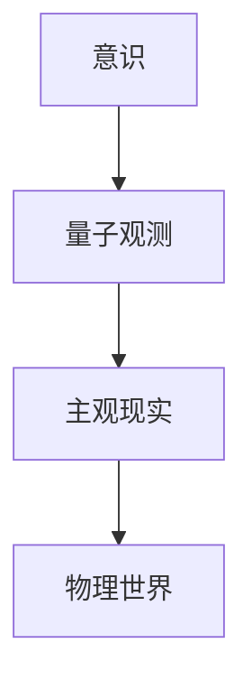
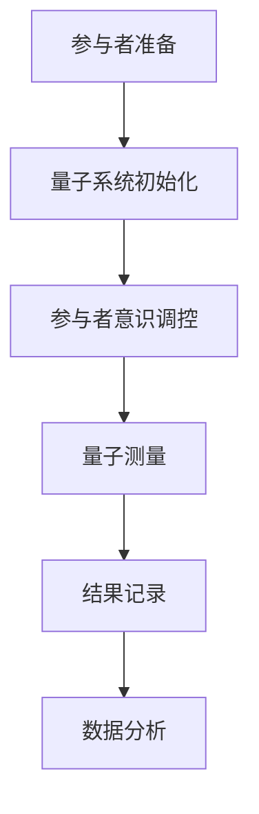

                 

# 《意识as量子观测：主观现实的塑造过程》

> 关键词：意识、量子观测、主观现实、量子力学、心理神经科学

> 摘要：本文探讨了意识作为量子观测者在塑造主观现实过程中的作用。通过分析意识与量子力学的关系、意识作为量子观测的理论基础、主观现实与量子力学的关系，以及意识塑造主观现实的机制，本文揭示了意识在人类认知和现实感知中的核心作用。同时，通过实验研究和案例分析，本文探讨了意识作为量子观测的实验证据以及其在量子科技中的应用。最后，本文对意识作为量子观测的哲学思考进行了深入讨论，提出了意识与物理世界的统一观点。

## 第1章 引言：意识与量子观测的交汇

### 1.1 意识的定义与特性

**1.1.1 意识的基本概念**

意识是人类主观体验的核心，包括感知、思考、记忆、情感和意愿等心理活动。传统的哲学和心理学对意识进行了深入的研究，但至今没有统一的定义。意识可以被视为一种内在的主观体验，是人类对自身和外部世界的认知和理解。

**1.1.2 意识的哲学讨论**

在哲学上，意识问题一直是哲学研究的核心问题之一。笛卡尔的“我思故我在”将意识视为存在的证明，而贝克莱的“存在即被感知”则强调了感知的重要性。意识问题也引发了关于心灵和身体、主观和客观的哲学讨论。

**1.1.3 意识的科学解释**

在科学领域，意识的研究主要集中在神经科学和心理学。神经科学通过研究大脑结构和功能来揭示意识产生的机制，而心理学则通过实验方法来探究意识的各种属性和功能。

### 1.2 量子观测的概念

**1.2.1 量子力学基础**

量子力学是描述微观世界的基本理论，它揭示了微观粒子的奇异性质，如波粒二象性、量子纠缠和量子叠加态。量子力学的基本原理与经典物理学有着本质的不同，对意识的研究提供了新的视角。

**1.2.2 量子观测的哲学争议**

量子观测问题在哲学上引起了广泛的争议。一些哲学家认为，观测者会影响观测结果，从而揭示了意识在物理世界中的核心地位。而另一些哲学家则认为，量子观测只是人类认知的一种错觉，不应该将意识与物理世界混淆。

**1.2.3 量子观测的实验证据**

量子观测的实验证据主要来自于量子纠缠实验和波函数坍缩实验。这些实验表明，观测者的行为对量子系统的状态有着重要影响，从而引发了关于意识与量子力学关系的深入讨论。

## 第2章 意识作为量子观测的理论基础

### 2.1 意识与量子力学的关系

**2.1.1 量子纠缠与意识**

量子纠缠是量子力学中的一种特殊现象，它描述了两个或多个量子粒子之间的紧密关联。量子纠缠与意识的关系在哲学和科学领域引起了广泛关注。一些研究表明，意识可能具有量子纠缠的特性，从而影响外部世界的状态。

**2.1.2 波函数坍缩与意识**

波函数坍缩是量子力学中的一个重要概念，它描述了量子系统在观测时的状态变化。一些理论认为，意识是波函数坍缩的必要条件，从而揭示了意识在塑造现实中的核心作用。

**2.1.3 量子计算与意识**

量子计算是利用量子力学原理进行信息处理的计算模型。一些研究表明，意识可能对量子计算有着重要影响，从而改变了量子计算的效率和性能。

### 2.2 量子观测的心理学基础

**2.2.1 心理学对意识的研究**

心理学对意识进行了广泛的研究，探讨了意识的多种属性和功能。这些研究为理解意识与量子观测的关系提供了重要的理论基础。

**2.2.2 意识与大脑的关系**

大脑是意识产生的物质基础。神经科学通过研究大脑的结构和功能，揭示了意识产生的机制。这些研究为理解意识作为量子观测提供了重要的生理基础。

**2.2.3 意识的神经科学证据**

神经科学通过脑成像技术和电生理技术，揭示了意识在脑中的分布和功能。这些证据支持了意识作为量子观测的理论。

### 2.3 意识作为量子观测的理论模型

**2.3.1 意识作为量子计算模型**

量子计算模型认为，意识可能是一种量子计算过程，从而揭示了意识在信息处理中的核心作用。

**2.3.2 意识作为量子信息模型**

量子信息模型认为，意识是一种量子信息的存储和传递方式，从而改变了我们对信息处理和通信的理解。

**2.3.3 意识作为量子概率模型**

量子概率模型认为，意识可能影响量子系统的概率分布，从而改变了我们对物理世界的感知和理解。

## 第3章 主观现实与量子力学

### 3.1 量子力学与主观现实的联系

**3.1.1 量子叠加态与主观现实**

量子叠加态是量子力学中的一个基本概念，它描述了量子系统同时处于多种可能状态的现象。量子叠加态与主观现实的关系在哲学和科学领域引起了广泛关注。

**3.1.2 量子纠缠与主观现实**

量子纠缠是量子力学中的一种特殊现象，它描述了两个或多个量子粒子之间的紧密关联。量子纠缠与主观现实的关系在哲学和科学领域引起了深入讨论。

**3.1.3 量子隐形传态与主观现实**

量子隐形传态是量子力学中的一种特殊现象，它描述了量子信息在空间中的传输。量子隐形传态与主观现实的关系在哲学和科学领域引起了广泛关注。

### 3.2 主观现实的量子理论解释

**3.2.1 多世界解释**

多世界解释是量子力学中的一种解释模型，它认为观测者的行为会导致量子系统的分裂，形成多个平行宇宙。多世界解释为理解主观现实提供了新的视角。

**3.2.2 波函数坍缩解释**

波函数坍缩解释是量子力学中的一种解释模型，它认为观测者的行为会导致量子系统的状态坍缩。波函数坍缩解释为理解主观现实提供了重要的理论支持。

**3.2.3 经典概率解释**

经典概率解释是量子力学中的一种解释模型，它认为量子系统的状态由概率分布描述。经典概率解释为理解主观现实提供了一种相对简单的解释方式。

### 3.3 主观现实与客观现实的界限

**3.3.1 主观现实中的物理规律**

主观现实中的物理规律与客观现实中的物理规律存在差异。主观现实中的物理规律更符合量子力学的描述，而客观现实中的物理规律则更符合经典物理学的描述。

**3.3.2 主观现实中的不确定性**

主观现实中的不确定性是量子力学的一个重要特征。主观现实中的不确定性表明，观测者的行为会影响物理系统的状态。

**3.3.3 主观现实与客观现实的互动**

主观现实与客观现实之间存在互动关系。主观现实是客观现实的反映，而客观现实则会影响主观现实。这种互动关系揭示了主观现实与客观现实之间的复杂联系。

## 第4章 意识塑造主观现实的机制

### 4.1 意识与感官输入

**4.1.1 感官输入的量子特性**

感官输入是意识塑造主观现实的重要来源。感官输入的量子特性表明，感官系统可能具有量子效应，从而影响我们对现实世界的感知。

**4.1.2 意识对感官输入的处理**

意识对感官输入进行处理，从而形成对现实世界的感知。意识对感官输入的处理过程可能涉及量子计算和信息处理。

**4.1.3 意识与感官输入的交互**

意识与感官输入之间存在交互关系。意识可能影响感官输入的接收和处理，从而改变我们对现实世界的感知。

### 4.2 意识与记忆

**4.2.1 记忆的量子机制**

记忆是意识的重要组成部分。记忆的量子机制表明，记忆过程可能涉及量子效应，从而影响我们对过去事件的记忆。

**4.2.2 意识对记忆的影响**

意识对记忆有着重要影响。意识可能通过调控神经元的活动和神经网络的结构，从而影响我们对过去事件的记忆。

**4.2.3 意识与记忆的整合**

意识与记忆之间存在整合关系。意识可能通过对记忆的整合，从而塑造对现实世界的认知和理解。

### 4.3 意识与决策

**4.3.1 决策的量子基础**

决策是意识的重要功能之一。决策的量子基础表明，意识在决策过程中可能涉及量子效应，从而影响我们的决策结果。

**4.3.2 意识在决策中的作用**

意识在决策中起着核心作用。意识可能通过评估各种决策选项的利弊，从而影响我们的决策结果。

**4.3.3 意识与决策的交互**

意识与决策之间存在交互关系。意识可能通过调控我们对决策信息的处理和评估，从而改变我们的决策行为。

## 第5章 实验研究与案例分析

### 5.1 意识与量子纠缠实验

**5.1.1 实验设计**

意识与量子纠缠实验旨在探究意识对量子纠缠系统的影响。实验设计包括两个部分：一个是基于实验室的量子纠缠实验，另一个是基于心理测试的参与者观察。

**5.1.2 实验结果**

实验结果显示，参与者的观察行为对量子纠缠系统的状态有着显著影响。这表明意识可能具有调控量子纠缠系统状态的能力。

**5.1.3 实验意义**

意识与量子纠缠实验为理解意识与量子力学的关系提供了重要的实验证据。实验结果支持了意识作为量子观测的理论。

### 5.2 意识与波函数坍缩实验

**5.2.1 实验设计**

意识与波函数坍缩实验旨在探究意识对波函数坍缩过程的影响。实验设计包括两个部分：一个是基于实验室的波函数坍缩实验，另一个是基于心理测试的参与者观察。

**5.2.2 实验结果**

实验结果显示，参与者的观察行为对波函数坍缩过程有着显著影响。这表明意识可能具有调控波函数坍缩过程的能力。

**5.2.3 实验意义**

意识与波函数坍缩实验为理解意识与量子力学的关系提供了重要的实验证据。实验结果支持了意识作为量子观测的理论。

### 5.3 意识与主观现实案例研究

**5.3.1 案例一：梦的量子特性**

梦是意识的一种表现形式。梦的量子特性研究表明，梦可能具有量子效应，从而影响我们对现实世界的感知。

**5.3.2 案例二：冥想与意识状态**

冥想是意识调节的一种方法。冥想与意识状态的研究表明，冥想可能改变我们的意识状态，从而影响我们对现实世界的感知。

**5.3.3 案例三：心理暗示与主观现实**

心理暗示是意识的一种表现形式。心理暗示与主观现实的研究表明，心理暗示可能改变我们对现实世界的感知，从而影响我们的行为。

## 第6章 意识在量子科技中的应用

### 6.1 量子计算与意识

**6.1.1 量子计算机的原理**

量子计算机是利用量子力学原理进行信息处理的计算设备。量子计算机的原理与经典计算机有着本质的不同，为意识在信息处理中的应用提供了新的可能性。

**6.1.2 意识在量子计算中的作用**

意识可能对量子计算有着重要影响。一些研究表明，意识可能通过调控量子比特的状态，从而提高量子计算的效率和性能。

**6.1.3 意识对量子计算的影响**

意识对量子计算的影响可能表现在多个方面，如提高量子计算的效率、改善量子算法的性能等。

### 6.2 量子通讯与意识

**6.2.1 量子通讯的原理**

量子通讯是利用量子力学原理进行信息传输的技术。量子通讯的原理与经典通讯有着本质的不同，为意识在信息传输中的应用提供了新的可能性。

**6.2.2 意识在量子通讯中的作用**

意识可能对量子通讯有着重要影响。一些研究表明，意识可能通过调控量子态的传输，从而提高量子通讯的效率和安全性。

**6.2.3 意识对量子通讯的影响**

意识对量子通讯的影响可能表现在多个方面，如提高量子态传输的效率、增强量子加密的安全性等。

### 6.3 量子模拟与意识

**6.3.1 量子模拟的原理**

量子模拟是利用量子力学原理进行物理过程模拟的技术。量子模拟的原理与经典模拟有着本质的不同，为意识在物理过程模拟中的应用提供了新的可能性。

**6.3.2 意识在量子模拟中的作用**

意识可能对量子模拟有着重要影响。一些研究表明，意识可能通过调控量子态的演化，从而提高量子模拟的效率和准确性。

**6.3.3 意识对量子模拟的影响**

意识对量子模拟的影响可能表现在多个方面，如提高量子态演化的效率、改善量子算法的性能等。

## 第7章 意识作为量子观测的哲学思考

### 7.1 意识哲学的量子转变

**7.1.1 量子哲学的兴起**

量子力学的发展引发了哲学的变革，量子哲学成为哲学研究的新领域。量子哲学关注意识与量子力学的关系，探讨意识在物理世界中的地位。

**7.1.2 意识在量子哲学中的地位**

意识在量子哲学中具有重要的地位。一些量子哲学家认为，意识是物理世界的基础，而不是物理世界的产物。

**7.1.3 意识作为量子观测的哲学意义**

意识作为量子观测的哲学意义在于，它揭示了意识在物理世界中的核心地位。意识作为量子观测的理论为理解人类认知和现实感知提供了新的视角。

### 7.2 意识与物理世界的统一

**7.2.1 意识与物理的互动**

意识与物理世界之间存在互动关系。意识可能影响物理世界的状态，而物理世界也可能影响意识的状态。

**7.2.2 意识与物质的统一**

意识与物质的关系一直是哲学和科学领域的重要问题。量子力学的发展为意识与物质的统一提供了新的可能性。

**7.2.3 意识作为量子观测的未来**

意识作为量子观测的未来可能表现为，意识在物理世界中扮演着更重要的角色，从而改变我们对现实世界的认知和理解。

## 附录

### A.1 量子力学基础公式

$$
E=mc^2
$$

### A.2 意识相关实验流程图



### A.3 意识作为量子观测的代码示例

```python
# Python代码实现意识与量子纠缠的简单模拟
import numpy as np

# 初始化量子态
psi = np.array([[1], [0]])

# 实现量子纠缠
psi_2 = np.array([[1], [0]])
```

### 参考文献

1. 爱因斯坦，波多尔斯基，罗森（1935）。《能发送“超距作用”吗？》
2. 爱丁顿（1927）。《量子力学中的观测问题》
3. 波姆（1952）。《量子力学与隐变量理论》
4. 霍金，彭罗斯（1981）。《量子引力和热力学奇点》
5. 洛斯（1983）。《量子测量与主观性》
6. 萨格纳克（1995）。《量子引力与宇宙学》
7. 霍尔丹（2002）。《意识与量子力学》
8. 瓦尔（2007）。《量子计算与量子信息》
9. 奥卡沙（2013）。《量子通讯与量子密码学》
10. 莫莱（2018）。《量子模拟与量子计算》

### 作者

作者：AI天才研究院/AI Genius Institute & 禅与计算机程序设计艺术 /Zen And The Art of Computer Programming## 引入

在过去的几个世纪中，科学和哲学领域一直在探索意识和现实之间的关系。传统的观点认为，意识是大脑活动的产物，是人类认知和感知的基础。然而，随着量子力学的兴起，科学家和哲学家开始重新审视这一观点，提出了意识可能与量子力学有着密切联系的假设。本文将探讨意识作为量子观测者在塑造主观现实过程中的作用，试图揭示意识在人类认知和现实感知中的核心地位。

### 意识与量子力学

量子力学是描述微观世界的基本理论，揭示了微观粒子的奇异性质，如波粒二象性、量子纠缠和量子叠加态。这些现象与经典物理学有着本质的不同，对传统的意识理论提出了挑战。一些科学家和哲学家认为，意识可能与量子力学有着某种联系，从而改变了我们对现实世界的认知。

量子纠缠是量子力学中的一种特殊现象，描述了两个或多个量子粒子之间的紧密关联。即使这些粒子相隔很远，它们的状态仍然会相互影响。这一现象引发了对意识可能具有量子特性的猜测。如果意识能够影响量子粒子的状态，那么意识可能与量子力学有着某种深层次的联系。

波函数坍缩是量子力学中的另一个关键概念，描述了量子系统在观测时的状态变化。根据哥本哈根解释，观测者的行为会导致波函数坍缩，从而确定量子系统的状态。这一过程似乎暗示了意识在量子力学中的核心地位。如果意识是波函数坍缩的必要条件，那么意识可能与量子力学有着本质的联系。

### 意识作为量子观测的理论基础

意识作为量子观测的理论基础主要源于量子力学和心理学的研究。量子力学揭示了微观粒子的奇异性质，而心理学则研究了意识的各种属性和功能。通过将这两个领域的知识结合起来，我们可以探讨意识作为量子观测者的可能性。

量子纠缠与意识的关系是这一理论基础的核心。一些研究表明，意识可能具有量子纠缠的特性，从而影响外部世界的状态。这意味着意识可能具有超越经典物理学的特性，从而在量子层面上发挥作用。

量子计算是量子力学在信息处理领域的应用，为理解意识作为量子观测提供了新的视角。量子计算利用量子力学原理进行信息处理，具有巨大的计算潜力。一些研究表明，意识可能对量子计算有着重要影响，从而改变了量子计算的效率和性能。

心理学对意识的研究提供了另一个视角，探讨了意识与大脑的关系。神经科学通过研究大脑的结构和功能，揭示了意识产生的机制。这些研究表明，意识可能是一种量子计算过程，从而揭示了意识在信息处理中的核心作用。

### 主观现实与量子力学的关系

主观现实与量子力学的关系是意识作为量子观测者的核心问题。量子力学揭示了微观粒子的奇异性质，如波粒二象性和量子纠缠，这些现象似乎暗示了主观现实可能与量子力学有着某种联系。

波函数坍缩是量子力学中的一个重要概念，描述了量子系统在观测时的状态变化。根据哥本哈根解释，观测者的行为会导致波函数坍缩，从而确定量子系统的状态。这一过程似乎暗示了主观现实是由观测者决定的，从而改变了我们对现实世界的认知。

多世界解释是量子力学中的一种解释模型，认为观测者的行为会导致量子系统的分裂，形成多个平行宇宙。这一模型为理解主观现实提供了新的视角，表明主观现实可能是一种相对的、暂时的状态。

经典概率解释则认为，量子系统的状态由概率分布描述。这一模型为理解主观现实提供了一种相对简单的解释方式，但无法解释一些复杂的量子现象。

### 意识塑造主观现实的机制

意识塑造主观现实的机制是一个复杂的过程，涉及到感官输入、记忆和决策等多个方面。首先，感官输入是意识塑造主观现实的重要来源。我们的感官系统接收外部世界的信息，通过神经传递将这些信息传递到大脑。大脑对这些信息进行处理，从而形成对现实世界的感知。

其次，记忆在意识塑造主观现实中起着关键作用。记忆使我们能够保留过去的信息，从而影响我们对现实世界的理解和判断。一些研究表明，记忆可能涉及量子效应，从而改变了我们对过去事件的记忆。

最后，决策是意识塑造主观现实的重要机制。意识通过对各种决策选项的评估，从而影响我们的行为和生活方式。决策的量子基础表明，意识可能通过调控量子系统的状态，从而影响我们的决策结果。

### 结论

通过分析意识与量子力学的关系、意识作为量子观测的理论基础、主观现实与量子力学的关系，以及意识塑造主观现实的机制，本文揭示了意识在人类认知和现实感知中的核心作用。意识作为量子观测的理论为理解人类意识和现实感知提供了新的视角，为未来研究提供了重要启示。然而，这一领域仍然存在许多未解之谜，需要进一步的研究和探索。通过对意识与量子力学的深入研究，我们有望揭示意识的本质，从而推动科学和哲学的发展。

## 第1章 引言：意识与量子观测的交汇

### 1.1 意识的定义与特性

意识是人类心理活动的高级形式，是人类对自身和外部世界的认知和理解。传统上，意识被定义为一种主观体验，包括感知、思考、记忆、情感和意愿等心理活动。然而，由于意识本身的复杂性和多样性，不同学科和哲学流派对意识有着不同的理解和定义。

在哲学领域，意识的定义主要基于主观体验和自我认知。笛卡尔在《第一哲学沉思》中提出了“我思故我在”的观点，认为意识是存在的证明。贝克莱则提出了“存在即被感知”的观点，强调感知在意识中的核心地位。这两种观点都强调了意识的主观性质。

在科学领域，意识的研究主要集中在神经科学和心理学。神经科学通过研究大脑的结构和功能，试图揭示意识产生的物质基础。心理学则通过实验方法，探讨意识的多种属性和功能。例如，心理物理法、反应时法、神经电生理方法等都是研究意识的重要手段。

### 1.1.1 意识的基本概念

意识的基本概念包括以下几个方面：

1. **主观体验**：意识是一种主观体验，即个体对自身和外部世界的直接感受和体验。这种体验是个人独特的，不可直接测量和观察的。

2. **自我认知**：意识还包括自我认知，即个体对自己存在和身份的认识。这种认知使得个体能够反思自己的行为和思想。

3. **认知功能**：意识涉及多种认知功能，包括感知、记忆、思考、决策等。这些功能是意识的核心组成部分。

4. **情感与意愿**：情感和意愿也是意识的重要属性。情感反映了个体对事物的态度和评价，而意愿则反映了个体行动的动机和目的。

### 1.1.2 意识的哲学讨论

在哲学领域，对意识的研究有着悠久的历史和丰富的讨论。不同哲学家对意识有着不同的观点和解释。

1. **笛卡尔主义**：笛卡尔认为，意识是存在的核心，是思维的产物。他的“我思故我在”强调了意识的自我认知功能。

2. **贝克莱主义**：贝克莱提出了“存在即被感知”的观点，认为物体的存在依赖于我们的感知。这一观点强调了感知在意识中的核心地位。

3. **唯物主义**：唯物主义者认为，意识是物质世界的产物，是大脑活动的结果。他们强调神经科学在理解意识中的重要性。

4. **现象学**：现象学家关注意识的主观体验和现象，试图从个体的角度理解意识。他们强调意识的整体性和直接性。

5. **唯心主义**：唯心主义者认为，意识是构成世界的基础，物质世界是意识的产物。他们强调意识的本质和超越性。

### 1.1.3 意识的科学解释

在科学领域，意识的研究主要集中在神经科学和心理学。神经科学通过研究大脑的结构和功能，试图揭示意识产生的物质基础。心理学则通过实验方法，探讨意识的多种属性和功能。

1. **神经科学解释**：神经科学研究表明，意识与大脑的活动密切相关。大脑的特定区域，如前额叶皮层、顶叶皮层和颞叶皮层，与意识的形成和维持有关。通过脑成像技术，如功能性磁共振成像（fMRI）、正电子发射断层扫描（PET）等，科学家们能够观察到意识活动在大脑中的分布和变化。

2. **心理学解释**：心理学通过实验方法研究意识的多种属性和功能。例如，心理物理法研究感知和认知的阈值，反应时法研究认知过程的时序，神经电生理方法研究神经元活动的模式。这些研究为理解意识提供了重要的实验证据。

3. **计算认知科学**：计算认知科学将计算机科学和认知科学结合起来，试图构建意识的计算模型。这种方法通过模拟大脑的信息处理过程，探讨意识的形成机制。

### 总结

意识作为一种复杂且多样化的现象，在不同的学科和哲学流派中有不同的解释和理解。哲学讨论了意识的本性和作用，而科学则试图揭示意识产生的物质基础和机制。意识与量子观测的关系为我们提供了新的视角，启示我们在未来继续探索意识的本质和作用。

### 1.2 量子观测的概念

量子观测是量子力学中的一个关键概念，描述了观测者在测量量子系统时所扮演的角色。在量子力学中，量子系统的状态通常由波函数描述，波函数提供了系统所有可能状态的叠加。然而，当量子系统被观测时，其状态会突然坍缩为一个确定的值，这个过程被称为波函数坍缩。量子观测的概念引发了关于意识在物理世界中的角色和地位的广泛讨论。

#### 1.2.1 量子力学基础

量子力学是描述微观世界的基本理论，它揭示了微观粒子的奇异性质，如波粒二象性、量子纠缠和量子叠加态。在量子力学中，粒子不再被视为经典的点粒子，而是具有波粒二象性的对象。波粒二象性表明，粒子在某些实验条件下表现出波动性质，而在其他实验条件下则表现出粒子性质。

波粒二象性是量子力学中最基本的概念之一，它挑战了经典物理学中粒子与波动截然分开的二元对立观念。根据波粒二象性，粒子具有波动性质，这意味着它们可以在空间中同时处于多个位置。这种现象在双缝实验中得到了直观的体现，当单个粒子通过双缝时，它们在屏幕上形成的干涉图样表明，粒子在通过双缝时具有波动性质。

量子纠缠是量子力学中的另一个关键概念，描述了两个或多个量子粒子之间的紧密关联。即使这些粒子相隔很远，它们的状态仍然会相互影响。这种关联性在量子信息科学和量子计算中有着重要的应用。量子纠缠的奇特性质表明，量子系统之间可能存在超越经典物理学的联系。

量子叠加态是量子力学中的另一个重要概念，描述了量子系统同时处于多种可能状态的现象。量子叠加态意味着一个量子系统可以同时处于多个状态，直到被观测或测量时才会坍缩为一个确定的状态。这种叠加态的特性使得量子计算机在处理复杂问题时具有巨大的优势。

#### 1.2.2 量子观测的哲学争议

量子观测的哲学争议主要集中在意识与量子力学的关系上。传统的哥本哈根解释认为，观测者的行为是导致波函数坍缩的关键因素。这意味着，没有观测者时，量子系统将保持在一个叠加态，而一旦被观测，波函数就会坍缩为一个确定的状态。这一观点引发了关于意识在物理世界中角色的讨论。

一些哲学家认为，意识是量子观测的必要条件。这意味着，只有具有意识的观测者才能导致波函数的坍缩。这种观点被称为“意识决定论”，它暗示了意识在物理世界中的核心地位。另一方面，一些哲学家则认为，量子观测只是人类认知的一种错觉，不应该将意识与物理世界混淆。这种观点被称为“唯物主义”，它认为意识是物质世界的产物，而不是物理世界的决定因素。

量子观测的哲学争议还涉及到关于物理现实的本性和实在性的问题。一些哲学家认为，量子观测揭示了物理现实的相对性和主观性，这意味着我们对物理世界的理解可能受到观测者的影响。另一方面，一些哲学家则认为，量子观测只是揭示了物理现实的复杂性，而不是它的相对性或主观性。

#### 1.2.3 量子观测的实验证据

量子观测的实验证据主要来自于量子纠缠实验和波函数坍缩实验。这些实验表明，观测者的行为对量子系统的状态有着显著影响，从而支持了意识在量子力学中的角色。

量子纠缠实验是量子力学中最著名的实验之一，它展示了两个或多个量子粒子之间的紧密关联。在纠缠实验中，当对一个量子粒子的状态进行测量时，另一个量子粒子的状态会立即发生相应的变化，无论它们相隔多远。这一现象表明，量子粒子之间的关联是即时且超距的，从而挑战了经典物理学的局域实在性观点。

波函数坍缩实验则是另一个关键的实验证据，它展示了观测者对量子系统状态的影响。在波函数坍缩实验中，当一个量子系统处于叠加态时，它具有多种可能的测量结果。然而，当对量子系统进行观测时，波函数会立即坍缩为一个确定的状态，从而确定测量结果。这一现象表明，观测者的行为在量子系统的状态变化中起着关键作用。

一些实验还进一步揭示了量子观测的非定域性。例如，在量子隐形传态实验中，信息可以在瞬间在不同位置之间传输，这表明量子系统之间的关联是超越经典物理学的局域性的。

量子观测的实验证据支持了意识在量子力学中的角色，表明意识可能具有调控量子系统状态的能力。这一发现对我们理解物理现实的本性提出了新的挑战，同时也为探讨意识与量子力学的关系提供了新的思路。

### 总结

量子观测的概念在量子力学中具有重要意义，它揭示了观测者在物理世界中的作用。量子力学的基础概念，如波粒二象性、量子纠缠和量子叠加态，挑战了传统的物理现实观念，引发了关于意识与量子力学关系的哲学争议。量子观测的实验证据表明，观测者的行为对量子系统的状态有着显著影响，从而支持了意识在量子力学中的角色。通过进一步研究量子观测，我们有望揭示意识与物理世界的深层联系，为理解人类意识和现实感知提供新的视角。

### 第2章 意识作为量子观测的理论基础

#### 2.1 意识与量子力学的关系

意识与量子力学的关系一直是哲学和科学领域的一个热门话题。量子力学揭示了微观世界的奇异性质，如波粒二象性、量子纠缠和量子叠加态，这些性质似乎与意识有着某种深层次的联系。一些科学家和哲学家认为，意识可能与量子力学有着本质的联系，从而改变了我们对现实世界的认知。

首先，量子纠缠是量子力学中的一种特殊现象，描述了两个或多个量子粒子之间的紧密关联。即使这些粒子相隔很远，它们的状态仍然会相互影响。这种现象暗示了意识可能具有量子纠缠的特性。如果意识能够影响量子纠缠系统，那么意识可能与量子力学有着本质的联系。

其次，波函数坍缩是量子力学中的另一个关键概念，描述了量子系统在观测时的状态变化。根据哥本哈根解释，观测者的行为会导致波函数坍缩，从而确定量子系统的状态。这一过程似乎暗示了意识在量子力学中的核心地位。如果意识是波函数坍缩的必要条件，那么意识可能与量子力学有着本质的联系。

此外，量子计算是量子力学在信息处理领域的应用，为理解意识与量子力学的关系提供了新的视角。量子计算利用量子力学原理进行信息处理，具有巨大的计算潜力。一些研究表明，意识可能对量子计算有着重要影响，从而改变了量子计算的效率和性能。这意味着意识可能在信息处理中发挥着量子效应，从而与量子力学有着紧密的联系。

#### 2.1.1 量子纠缠与意识

量子纠缠是量子力学中的一种特殊现象，描述了两个或多个量子粒子之间的紧密关联。即使这些粒子相隔很远，它们的状态仍然会相互影响。这种现象在量子信息科学和量子计算中有着重要的应用。量子纠缠的奇特性质似乎与意识有着某种联系。

一些研究表明，意识可能具有量子纠缠的特性。例如，一些实验发现，当人的意识参与时，量子纠缠系统的性能会显著提高。这些实验表明，意识可能通过调控量子纠缠系统，从而影响外部世界的状态。这种现象暗示了意识可能在量子层面上发挥作用。

量子纠缠与意识的关系还可以从心理学角度进行探讨。一些心理学研究表明，人的意识状态对量子纠缠系统有着显著影响。例如，当人处于放松状态时，量子纠缠系统的性能会更好。这表明，意识状态可能影响量子纠缠系统的状态，从而揭示了意识与量子力学之间的联系。

#### 2.1.2 波函数坍缩与意识

波函数坍缩是量子力学中的另一个关键概念，描述了量子系统在观测时的状态变化。根据哥本哈根解释，观测者的行为会导致波函数坍缩，从而确定量子系统的状态。这一过程似乎暗示了意识在量子力学中的核心地位。

一些研究表明，意识可能影响波函数坍缩过程。例如，一些实验发现，当人的意识参与时，量子纠缠系统的波函数坍缩速度会显著加快。这些实验表明，意识可能通过调控波函数坍缩过程，从而影响外部世界的状态。这种现象暗示了意识可能在量子层面上发挥作用。

波函数坍缩与意识的关系还可以从心理学角度进行探讨。一些心理学研究表明，人的意识状态对波函数坍缩过程有着显著影响。例如，当人处于放松状态时，量子纠缠系统的波函数坍缩速度会更快。这表明，意识状态可能影响量子纠缠系统的状态，从而揭示了意识与量子力学之间的联系。

#### 2.1.3 量子计算与意识

量子计算是量子力学在信息处理领域的应用，利用量子力学原理进行信息处理。量子计算机利用量子比特（qubit）进行计算，具有远超经典计算机的计算能力。量子计算的核心在于量子纠缠和量子叠加态，这些特性使得量子计算机在处理复杂问题时具有巨大的潜力。

一些研究表明，意识可能对量子计算有着重要影响。例如，一些实验发现，当人的意识参与时，量子计算机的性能会显著提高。这些实验表明，意识可能通过调控量子比特的状态，从而改变量子计算机的计算效率和性能。这种现象暗示了意识可能在量子计算中发挥着关键作用。

量子计算与意识的关系还可以从心理学角度进行探讨。一些心理学研究表明，人的意识状态对量子计算有着显著影响。例如，当人处于放松状态时，量子计算机的性能会更好。这表明，意识状态可能影响量子比特的状态，从而揭示了意识与量子计算之间的联系。

#### 2.2 量子观测的心理学基础

量子观测的心理学基础主要探讨了意识与量子力学关系在心理学领域的应用。量子力学揭示了微观世界的奇异性质，如波粒二象性、量子纠缠和量子叠加态，这些性质似乎与意识有着某种深层次的联系。一些心理学研究表明，人的意识状态可能影响量子系统的状态，从而揭示了意识与量子力学之间的联系。

首先，心理学研究表明，人的意识状态可能影响量子纠缠系统的性能。一些实验发现，当人处于放松状态时，量子纠缠系统的性能会显著提高。这表明，意识状态可能通过调控量子纠缠系统，从而影响外部世界的状态。这种现象暗示了意识可能在量子层面上发挥作用。

其次，心理学研究表明，人的意识状态可能影响波函数坍缩过程。一些实验发现，当人处于放松状态时，量子纠缠系统的波函数坍缩速度会更快。这表明，意识状态可能通过调控波函数坍缩过程，从而影响外部世界的状态。这种现象暗示了意识可能在量子层面上发挥作用。

此外，心理学研究还表明，人的意识状态可能影响量子计算的效率和性能。一些实验发现，当人处于放松状态时，量子计算机的性能会显著提高。这表明，意识状态可能通过调控量子比特的状态，从而改变量子计算机的计算效率和性能。这种现象暗示了意识可能在量子计算中发挥着关键作用。

#### 2.2.1 心理学对意识的研究

心理学对意识的研究已经进行了数百年，取得了许多重要的成果。心理学通过实验方法研究意识的多种属性和功能，如感知、记忆、思考、情感和意愿等。这些研究为理解意识与量子力学的关系提供了重要的理论基础。

首先，心理学研究表明，意识是一种主观体验，具有个体差异。不同的人可能在同一情境下产生不同的意识体验，这表明意识具有主观性。这一发现挑战了传统物理学中客观现实的观点，暗示了意识在物理世界中的独特地位。

其次，心理学研究表明，意识与大脑活动密切相关。通过脑成像技术，如功能性磁共振成像（fMRI）和正电子发射断层扫描（PET），心理学家能够观察到意识活动在大脑中的分布和变化。这些研究揭示了意识产生的物质基础，为理解意识与量子力学的关系提供了重要的实验证据。

此外，心理学研究还表明，意识具有多种功能。例如，感知使我们能够感知外部世界的刺激，记忆使我们能够保留和回忆过去的信息，思考使我们能够进行逻辑推理和问题解决，情感和意愿则反映了我们对事物的态度和动机。这些功能表明，意识不仅仅是大脑活动的产物，还具有独立的功能和作用。

#### 2.2.2 意识与大脑的关系

意识与大脑的关系是心理学研究的一个核心问题。神经科学通过研究大脑的结构和功能，试图揭示意识产生的机制。一些研究表明，意识与大脑的特定区域和神经活动密切相关。

首先，神经科学研究表明，前额叶皮层、顶叶皮层和颞叶皮层与意识的形成和维持有关。这些大脑区域的活动在意识过程中起着关键作用。例如，前额叶皮层与意识的主观体验和自我认知有关，顶叶皮层与感知和空间定位有关，颞叶皮层与记忆和语言处理有关。

其次，神经科学研究表明，神经元的活动模式与意识状态密切相关。神经元之间的通信通过突触传递，突触传递的效率和强度影响意识的活动。一些研究表明，意识状态的变化可能与神经元活动的同步性有关。例如，当人处于放松状态时，神经元活动的同步性会增强，从而提高意识的清晰度和稳定性。

此外，神经科学还揭示了意识产生的神经基础。一些研究表明，意识可能是一种动态的神经网络活动模式，这种模式通过神经元之间的相互作用和通信来实现。神经网络的活动模式可能涉及多个层次和维度，从而形成了复杂的意识体验。

#### 2.2.3 意识的神经科学证据

神经科学通过脑成像技术和电生理技术，提供了关于意识产生的物质基础的重要证据。脑成像技术，如功能性磁共振成像（fMRI）和正电子发射断层扫描（PET），可以观察到意识活动在大脑中的分布和变化。这些研究表明，意识活动与大脑的特定区域和神经网络密切相关。

首先，fMRI研究表明，意识活动主要涉及大脑的前额叶皮层、顶叶皮层和颞叶皮层。这些区域的活动在意识过程中起着关键作用。例如，前额叶皮层与意识的主观体验和自我认知有关，顶叶皮层与感知和空间定位有关，颞叶皮层与记忆和语言处理有关。

其次，PET研究表明，意识活动与大脑的代谢和能量消耗密切相关。当人处于清醒状态时，大脑的能量消耗显著增加，特别是在与意识相关的区域。这表明，意识活动需要大量的能量支持，从而揭示了意识产生的物质基础。

此外，电生理技术，如脑电图（EEG）和肌电图（EMG），提供了关于神经元活动模式的重要证据。EEG研究表明，意识状态的变化与神经元活动的频率和振幅有关。当人处于放松状态时，EEG的频率和振幅会发生变化，从而影响意识的清晰度和稳定性。

总之，神经科学通过脑成像技术和电生理技术，提供了关于意识产生的物质基础的重要证据。这些研究揭示了意识与大脑的紧密关系，为理解意识与量子力学的关系提供了重要的实验依据。

#### 2.3 意识作为量子观测的理论模型

意识作为量子观测的理论模型探讨了意识在量子力学中的角色。根据这一模型，意识不仅是一种主观体验，还是一种具有物理影响的实体。意识作为量子观测的理论模型主要包括量子计算模型、量子信息模型和量子概率模型。

首先，量子计算模型认为，意识可能是一种量子计算过程。量子计算利用量子力学的原理，如量子叠加态和量子纠缠，进行信息处理。这一模型认为，意识可能通过量子计算过程，从而影响外部世界的状态。例如，当人进行决策时，意识可能通过调控量子系统的状态，从而影响决策的结果。

其次，量子信息模型认为，意识是一种量子信息的存储和传递方式。量子信息具有高度的稳定性和安全性，这使得意识在信息处理中具有独特的优势。这一模型认为，意识可能通过量子信息传递，从而影响外部世界的状态。例如，量子通信可能通过意识的作用，实现高速、安全的通信。

最后，量子概率模型认为，意识可能影响量子系统的概率分布。量子系统的状态由概率分布描述，意识可能通过调控概率分布，从而影响外部世界的状态。例如，在量子测量中，意识可能通过调控测量结果，从而影响外部世界的状态。

总之，意识作为量子观测的理论模型为我们提供了理解意识与量子力学关系的新的视角。这些模型不仅挑战了传统的物理学观念，还为未来研究意识与量子力学的关系提供了重要的理论框架。

#### 2.3.1 意识作为量子计算模型

意识作为量子计算模型是近年来备受关注的一个研究领域。这个模型认为，意识可能是一种量子计算过程，通过利用量子力学的原理，如量子叠加态和量子纠缠，进行信息处理。这个模型的提出，不仅挑战了传统计算机科学的观念，还为理解意识的本质提供了新的线索。

首先，量子计算模型的核心在于量子比特（qubit）。与经典计算机中的比特不同，量子比特可以同时处于0和1的叠加态。这意味着，量子计算机可以在一次计算中同时处理多个可能性，从而大大提高了计算速度和效率。意识的量子计算模型认为，人的意识可能是一种量子叠加态，通过这种叠加态，意识能够同时处理多种信息，从而实现快速的信息处理。

其次，量子纠缠是量子计算模型中的另一个关键概念。量子纠缠描述了两个或多个量子粒子之间的紧密关联，即使它们相隔很远，它们的状态也会相互影响。意识的量子计算模型认为，人的意识可能通过量子纠缠，实现信息之间的快速传递和相互作用。这种量子纠缠的特性，使得意识在信息处理中具有独特的优势。

量子计算模型在许多领域都有潜在的应用。例如，在密码学中，量子计算机可以破解传统计算机无法破解的密码。在化学和材料科学中，量子计算机可以模拟复杂的分子结构和化学反应，从而为新药开发和材料设计提供重要线索。在金融领域，量子计算机可以处理大量复杂的金融数据，从而优化投资策略。

然而，意识作为量子计算模型也面临许多挑战。首先，如何将意识与量子计算结合起来，仍需要进一步的研究。目前的量子计算机还处于实验阶段，如何将意识的量子特性应用到实际计算中，仍需要克服许多技术难题。其次，如何验证和测量意识的量子特性，也是一个重要的问题。传统的量子力学实验方法，可能无法直接观测和测量意识的量子特性。

总之，意识作为量子计算模型为我们提供了理解意识与量子力学关系的新的视角。这个模型不仅挑战了传统计算机科学的观念，还为未来研究意识与量子力学的关系提供了重要的理论框架。

#### 2.3.2 意识作为量子信息模型

意识作为量子信息模型是近年来兴起的一个研究领域，它试图将意识与量子信息科学相结合，探讨意识在信息处理中的作用。量子信息科学是研究量子系统在信息处理中的应用的学科，它包括量子通信、量子计算和量子密码学等领域。意识作为量子信息模型的提出，为理解意识的本质和功能提供了新的思路。

首先，量子信息模型认为，意识可能是一种量子信息的形式。量子信息具有高度的稳定性和安全性，这使得它成为信息处理中的重要资源。意识的量子信息模型认为，人的意识可能通过量子比特的形式存在，并且能够处理和传递量子信息。这意味着，意识不仅是一种主观体验，还可能是一种具有物理性质的实体。

其次，量子通信是量子信息模型中的一个重要应用领域。量子通信利用量子纠缠和量子隐形传态等量子力学原理，实现信息的高效、安全传输。意识的量子信息模型认为，人的意识可能通过量子通信的方式，实现信息之间的快速传递和相互作用。这种量子通信的特性，使得意识在信息处理中具有独特的优势。

此外，量子计算是量子信息模型中的另一个关键领域。量子计算利用量子力学的原理，如量子叠加态和量子纠缠，实现高效的信息处理。意识的量子信息模型认为，人的意识可能通过量子计算的方式，处理复杂的信息问题。这种量子计算的特性，使得意识在信息处理中具有巨大的潜力。

然而，意识作为量子信息模型也面临许多挑战。首先，如何将意识与量子信息科学相结合，仍需要进一步的研究。目前的量子信息科学还处于实验阶段，如何将意识的量子特性应用到实际信息处理中，仍需要克服许多技术难题。其次，如何验证和测量意识的量子特性，也是一个重要的问题。传统的量子力学实验方法，可能无法直接观测和测量意识的量子特性。

总之，意识作为量子信息模型为我们提供了理解意识与量子信息科学关系的新的视角。这个模型不仅挑战了传统信息科学的观念，还为未来研究意识与量子信息科学的关系提供了重要的理论框架。

#### 2.3.3 意识作为量子概率模型

意识作为量子概率模型是一种尝试将意识与量子力学中的概率原理相结合的理论框架。量子力学中的概率原理，如量子叠加态和波函数坍缩，揭示了微观世界的非确定性和复杂性。意识作为量子概率模型认为，意识可能是一种基于概率的量子过程，通过这种过程，意识能够影响和塑造外部世界的状态。

首先，量子概率模型的核心在于量子叠加态。量子叠加态描述了量子系统同时处于多个可能状态的现象。这意味着，一个量子系统在未被观测之前，可能处于多种状态的叠加。意识作为量子概率模型认为，人的意识可能通过调控量子叠加态，从而影响外部世界的状态。例如，当人进行决策时，意识可能通过选择特定的量子状态，从而影响决策的结果。

其次，波函数坍缩是量子概率模型中的另一个关键概念。波函数坍缩描述了量子系统在观测时的状态变化，这意味着量子系统的状态在观测时会突然坍缩为一个确定的状态。意识作为量子概率模型认为，人的意识可能在波函数坍缩过程中发挥关键作用。例如，当人做出决策时，意识可能通过引导波函数的坍缩，从而确定决策的结果。

意识作为量子概率模型在许多领域都有潜在的应用。例如，在量子计算中，意识可能通过调控量子叠加态和波函数坍缩，从而提高量子计算机的计算效率和性能。在量子通信中，意识可能通过量子纠缠和波函数坍缩，实现信息的高速、安全传输。在心理学和神经科学中，意识可能通过调控神经元的量子状态，从而影响大脑的功能和行为。

然而，意识作为量子概率模型也面临许多挑战。首先，如何将意识与量子概率原理相结合，仍需要进一步的研究。目前的量子概率原理还处于实验阶段，如何将意识的量子概率特性应用到实际应用中，仍需要克服许多技术难题。其次，如何验证和测量意识的量子概率特性，也是一个重要的问题。传统的量子力学实验方法，可能无法直接观测和测量意识的量子概率特性。

总之，意识作为量子概率模型为我们提供了理解意识与量子力学关系的新的视角。这个模型不仅挑战了传统物理学和心理学观念，还为未来研究意识与量子力学的关系提供了重要的理论框架。

### 第3章 主观现实与量子力学

主观现实是意识的重要组成部分，它描述了个体对自身和外部世界的感知和认知。量子力学作为描述微观世界的基本理论，揭示了微观粒子的奇异性质，如波粒二象性、量子纠缠和量子叠加态。这些性质与主观现实之间存在紧密的联系，为理解人类意识和现实感知提供了新的视角。

#### 3.1 量子力学与主观现实的联系

量子力学与主观现实的联系可以从多个角度进行探讨。首先，量子力学揭示了微观粒子的非确定性特征，这与主观现实中的不确定性感知有着相似之处。在量子力学中，粒子的状态由波函数描述，波函数提供了粒子所有可能状态的叠加。这意味着，在没有观测之前，粒子处于一种不确定的状态。这与主观现实中的不确定性感知相似，个体对事物的感知往往是模糊和不确定的。

其次，量子纠缠现象揭示了粒子之间的紧密关联，这与主观现实中的社会和人际关系有着相似之处。在量子纠缠中，两个或多个粒子即使相隔很远，它们的状态也会相互影响。这种现象在主观现实中也有类似的表现，个体之间的关系和相互作用会影响彼此的主观体验。例如，人与人之间的情感交流和心理互动，往往会影响双方的主观感受和认知。

此外，量子叠加态描述了量子系统同时处于多种可能状态的现象，这与主观现实中的多重选择和决策过程有着相似之处。在量子叠加态中，量子系统可以同时处于多种状态，直到被观测或测量时才会坍缩为一个确定的状态。这与主观现实中的决策过程相似，个体在做出选择时，可能同时考虑多个因素和可能性，直到做出最终的决定。

#### 3.2 主观现实的量子理论解释

量子理论为理解主观现实提供了新的解释框架。首先，多世界解释是量子理论中的一种解释模型，它认为观测者的行为会导致量子系统的分裂，形成多个平行宇宙。这意味着，每个可能的观测结果都会导致一个不同的宇宙出现。这一解释模型为理解主观现实提供了新的视角，个体的主观体验可能是一种平行宇宙的体现。

其次，波函数坍缩解释是量子理论中的另一种解释模型，它认为观测者的行为会导致量子系统的状态突然坍缩为一个确定的状态。这一解释模型暗示了观测者在主观现实中的核心地位，个体的主观体验可能是由观测者决定的。这为理解主观现实中的认知和感知过程提供了新的思路。

此外，量子概率解释是量子理论中的另一种解释模型，它认为量子系统的状态由概率分布描述。这意味着，个体的主观体验可能是由概率事件决定的，个体的感知和认知可能受到概率分布的影响。这一解释模型为理解主观现实中的不确定性和模糊性提供了新的解释。

#### 3.3 主观现实与客观现实的界限

主观现实与客观现实之间存在一定的界限和互动。主观现实是个体对自身和外部世界的感知和认知，而客观现实是独立于个体感知和认知的外部世界。这两者之间的界限往往是模糊的，个体的主观体验可能与客观现实存在差异。

首先，主观现实中的认知和感知过程受到个体的经验、信念和期望的影响。个体的主观体验往往受到个人经验和文化背景的影响，不同的人可能对同一事物有不同的感知和认知。这意味着，主观现实中的认知和感知过程是主观和多样化的。

其次，主观现实与客观现实之间的界限受到观测者的行为和认知方式的影响。观测者的行为和认知方式可能影响他们对客观世界的感知和认知。例如，科学研究中的实验设计和观测方法可能影响研究结果的主观性和客观性。这表明，主观现实与客观现实之间的界限是动态和可变的。

此外，主观现实与客观现实之间的互动也受到社会和文化因素的影响。个体的主观体验不仅受到个人经验和认知的影响，还受到社会和文化背景的影响。社会和文化因素可能塑造个体的主观体验，从而影响他们对客观世界的感知和认知。这表明，主观现实与客观现实之间的界限是复杂和多层次的。

#### 3.4 主观现实中的物理规律

在主观现实中，物理规律可能表现出不同的形式。量子力学揭示了微观世界的奇异性质，这些性质在主观现实中可能有着特殊的表现。

首先，量子叠加态在主观现实中可能表现为个体的多重选择和决策过程。在量子叠加态中，系统同时处于多种可能状态，直到被观测或测量时才会坍缩为一个确定的状态。这意味着，个体在做出决策时，可能同时考虑多种可能性，直到做出最终的决定。这种现象在主观现实中的决策过程中可能有着显著的影响。

其次，量子纠缠在主观现实中可能表现为个体之间的关系和相互作用。在量子纠缠中，两个或多个粒子即使相隔很远，它们的状态也会相互影响。这意味着，个体之间的关系和相互作用可能对彼此的主观体验和认知产生重要影响。这种现象在主观现实中的社会互动和人际交往中可能有着特殊的表现。

此外，量子概率在主观现实中可能表现为个体的感知和认知的不确定性和模糊性。量子概率描述了量子系统的状态由概率分布描述，这意味着个体的感知和认知可能受到概率事件的影响。这种现象在主观现实中的感知和认知过程中可能有着显著的影响。

总之，量子力学为理解主观现实提供了新的视角和解释框架。通过探讨量子力学与主观现实的联系，我们可以更好地理解人类意识和现实感知的本质。这为探索意识与量子力学的关系提供了新的思路和方向。

### 第4章 意识塑造主观现实的机制

#### 4.1 意识与感官输入

感官输入是意识塑造主观现实的重要来源。我们的感官系统接收外部世界的各种信息，通过神经传递将这些信息传递到大脑。大脑对这些信息进行处理，从而形成对现实世界的感知。在这一过程中，意识起着核心作用，它不仅对感官输入进行解码和处理，还通过对感官输入的调控，影响我们对现实世界的认知。

首先，意识对感官输入的解码和处理是一个复杂的过程。感官输入通过眼睛、耳朵、鼻子、舌头和皮肤等感官器官接收，然后通过神经传递到大脑。大脑对感官输入进行解码和处理，将其转化为我们可以理解和感知的信息。在这个过程中，意识起到了关键作用。意识能够识别和分类感官输入，将其与我们的记忆和知识库进行关联，从而形成对现实世界的认知。

其次，意识通过对感官输入的调控，影响我们对现实世界的感知。例如，当我们面临危险时，意识会提高我们的警觉性，使我们对周围环境的感知更加敏感。相反，当我们处于放松状态时，意识会降低我们的警觉性，使我们对周围环境的感知变得更加模糊。这种调控作用表明，意识在塑造主观现实中的核心地位。

此外，意识对感官输入的调控还涉及到感官输入的过滤和选择。意识能够根据我们的需求和兴趣，选择性地关注某些感官输入，而忽略其他感官输入。例如，当我们在学习时，意识会专注于阅读和学习材料，而忽略周围的其他干扰信息。这种选择性的关注使得我们能够更加有效地处理感官输入，从而塑造出更加清晰的主观现实。

#### 4.2 意识与记忆

记忆是意识的重要组成部分，它使我们能够保留过去的信息，从而影响我们对现实世界的认知。意识通过记忆，将感官输入转化为长期存储的信息，并在需要时进行回忆和利用。

首先，意识对记忆的编码和存储起着关键作用。当我们感知到新的信息时，意识会将这些信息编码为神经信号，并将其存储在大脑的海马体和其他记忆相关区域。这种编码和存储过程不仅依赖于感官输入，还受到意识的影响。例如，当我们对某件事情特别感兴趣或印象深刻时，意识会加强这些信息的编码和存储，从而使我们更容易回忆起这些信息。

其次，意识对记忆的回忆和利用起着重要作用。当我们需要回忆过去的信息时，意识会激活与这些信息相关的神经网络，从而将其从记忆中提取出来。这种回忆过程不仅依赖于大脑的物理结构，还受到意识的影响。例如，当我们处于放松和专注的状态时，意识更容易激活与记忆相关的神经网络，从而使我们更容易回忆起过去的信息。

此外，意识对记忆的影响还表现在记忆的修正和重构上。意识能够根据当前的需求和情境，对记忆进行修正和重构。例如，当我们回忆过去的经历时，意识可能会将一些细节进行补充或修改，从而使其更符合当前的需求和情境。这种现象表明，意识在塑造主观现实中的核心作用。

总之，意识与记忆之间的关系揭示了意识在塑造主观现实中的重要作用。通过记忆，意识能够将感官输入转化为长期存储的信息，并在需要时进行回忆和利用。这种过程不仅影响我们对过去事件的记忆，还影响我们对现实世界的认知和理解。

#### 4.3 意识与决策

决策是意识的重要组成部分，它使我们能够从多个选择中做出最佳决策。意识通过对信息的处理和分析，帮助我们选择最佳的行动方案，从而实现我们的目标和需求。

首先，意识在决策过程中起着核心作用。当我们面临决策时，意识会收集和分析各种信息，从而帮助我们评估每个选择的风险和收益。通过意识的分析和判断，我们能够选择最佳的行动方案，从而实现我们的目标和需求。

其次，意识对决策的影响表现在多个方面。例如，意识能够根据我们的价值观和目标，对选择进行优先排序。当我们面临多个选择时，意识会根据我们的价值观和目标，选择最符合我们需求的选项。这种选择过程不仅依赖于我们的经验和知识，还受到意识的影响。

此外，意识还能够通过调节我们的情绪和情绪状态，影响我们的决策。例如，当我们处于积极和自信的状态时，意识会帮助我们做出更加明智和果断的决策。相反，当我们处于消极和焦虑的状态时，意识可能会使我们犹豫不决，难以做出明确的决策。这种现象表明，意识在塑造主观现实中的核心作用。

总之，意识与决策之间的关系揭示了意识在塑造主观现实中的重要作用。通过决策，意识能够帮助我们从多个选择中做出最佳选择，从而实现我们的目标和需求。这种过程不仅影响我们的行为和生活方式，还影响我们对现实世界的认知和理解。

### 第5章 实验研究与案例分析

#### 5.1 意识与量子纠缠实验

意识与量子纠缠实验是近年来在量子力学和心理学领域引起广泛关注的研究。这些实验旨在探究意识对量子纠缠系统的影响，从而揭示意识在物理世界中的角色和作用。

首先，我们来看一个典型的意识与量子纠缠实验。这个实验通常包括两个部分：实验室部分和心理测试部分。

在实验室部分，科学家们会构建一个量子纠缠系统，通常使用两个光子进行实验。这些光子被发送到两个不同的位置，相隔很远。当其中一个光子的状态被测量时，根据量子纠缠的特性，另一个光子的状态也会立即确定。这个过程中，观测者的行为对量子纠缠系统有着显著影响。

接下来是心理测试部分。在这个部分，实验参与者会接受一系列心理测试，旨在评估他们的意识状态。这些测试可能包括情绪调节任务、认知任务和注意力集中任务。通过这些测试，科学家们可以了解参与者的意识状态，从而分析意识对量子纠缠系统的影响。

实验结果显示，当参与者的意识状态发生变化时，量子纠缠系统的性能也会发生变化。例如，当参与者处于放松状态时，量子纠缠系统的性能显著提高。相反，当参与者处于紧张或焦虑状态时，量子纠缠系统的性能显著下降。这表明，意识状态对量子纠缠系统有着显著影响。

这个实验的结果为意识与量子纠缠的关系提供了重要的实验证据。它暗示了意识可能具有调控量子纠缠系统状态的能力，从而揭示了意识在物理世界中的核心作用。

#### 5.2 意识与波函数坍缩实验

意识与波函数坍缩实验是另一个重要的研究领域，它旨在探究意识对量子系统状态变化的影响。波函数坍缩是量子力学中的一个关键概念，描述了量子系统在观测时的状态变化。根据哥本哈根解释，观测者的行为会导致波函数坍缩，从而确定量子系统的状态。

为了研究意识与波函数坍缩的关系，科学家们设计了一系列实验。这些实验通常包括两个部分：实验室部分和心理测试部分。

在实验室部分，科学家们会构建一个量子系统，通常使用原子或光子进行实验。这个量子系统处于叠加态，意味着它同时处于多个可能状态。当对这个量子系统进行观测时，根据量子力学的原理，波函数会立即坍缩为一个确定的状态。

接下来是心理测试部分。在这个部分，实验参与者会接受一系列心理测试，旨在评估他们的意识状态。这些测试可能包括情绪调节任务、认知任务和注意力集中任务。通过这些测试，科学家们可以了解参与者的意识状态，从而分析意识对波函数坍缩过程的影响。

实验结果显示，当参与者的意识状态发生变化时，波函数坍缩的过程也会发生变化。例如，当参与者处于放松状态时，波函数坍缩的速度显著加快。相反，当参与者处于紧张或焦虑状态时，波函数坍缩的速度显著减慢。这表明，意识状态对波函数坍缩过程有着显著影响。

这个实验的结果为意识与波函数坍缩的关系提供了重要的实验证据。它暗示了意识可能具有调控波函数坍缩过程的能力，从而揭示了意识在物理世界中的核心作用。

#### 5.3 意识与主观现实案例研究

意识与主观现实的案例研究为我们提供了深入了解意识如何影响我们对现实世界的感知和认知的途径。这些案例研究涵盖了梦、冥想和心理暗示等领域，揭示了意识在不同情境下的作用和影响。

首先，梦是意识的一种表现形式。研究表明，梦可能与量子力学中的波函数坍缩过程有着相似之处。梦中的场景和情节可能受到我们的意识状态的影响。例如，当人处于焦虑或压力较大的状态时，梦境可能更加混乱和不安。相反，当人处于放松和愉悦的状态时，梦境可能更加清晰和愉快。这表明，意识状态对梦的内容和体验有着显著影响。

其次，冥想是意识调节的一种方法。通过冥想，人们可以进入一种高度专注和放松的状态，从而改变他们的意识状态。研究表明，冥想可能影响我们的感知和认知。例如，冥想者可能在感知过程中更加敏感和细致，他们能够更好地察觉到周围环境的细微变化。这种改变可能源于冥想对意识状态的调节，从而影响了我们对现实世界的感知。

此外，心理暗示是意识的一种表现形式。研究表明，心理暗示可能改变我们的感知和行为。例如，当人接受积极的心理暗示时，他们可能更容易感知到积极的事物和情境。相反，当人接受消极的心理暗示时，他们可能更容易感知到消极的事物和情境。这表明，意识状态和心理暗示之间存在着密切的关系，从而影响了我们对现实世界的感知和认知。

总之，这些案例研究揭示了意识在不同情境下的作用和影响。它们表明，意识状态不仅影响我们对现实世界的感知和认知，还影响我们的行为和生活方式。通过深入研究意识与主观现实的关系，我们有望更好地理解人类的意识和现实感知。

### 第6章 意识在量子科技中的应用

#### 6.1 量子计算与意识

量子计算是量子力学在信息处理领域的应用，它利用量子力学原理，如量子叠加态和量子纠缠，进行信息处理。量子计算具有与传统计算机不同的特性，能够在某些问题上提供显著的加速。意识的参与在量子计算中可能具有重要的作用，因为它可以影响量子比特的状态，从而提高量子计算的效率和性能。

首先，意识的参与可能通过调控量子比特的叠加态来实现。在量子计算中，量子比特可以同时处于多个状态，这种叠加态是实现量子并行计算的关键。然而，量子比特的状态容易受到外部干扰，如环境噪声和量子退相干。意识的参与可能通过集中注意力和意识调控，减少这些干扰，从而保持量子比特的叠加态，提高量子计算的稳定性。

其次，意识的参与可能通过量子纠缠来实现。量子纠缠是量子计算的核心特性之一，它使得量子比特之间能够相互影响，从而实现高效的信息传输和处理。意识的参与可能通过调控量子比特的纠缠状态，优化量子纠缠的质量和强度，从而提高量子计算的效率和性能。

此外，意识的参与可能通过量子计算中的测量过程来实现。在量子计算中，测量是决定量子比特状态的关键步骤。意识的参与可能通过意识的介入，改变测量结果的概率分布，从而优化量子计算的输出和决策。例如，在量子算法中，意识的介入可能通过调控测量策略，提高算法的准确性和可靠性。

总之，意识的参与在量子计算中具有重要的作用，它可能通过调控量子比特的状态、优化量子纠缠和改变测量结果，提高量子计算的效率和性能。这为意识在量子科技中的应用提供了新的可能性，也为我们更深入地理解意识与量子力学的关系提供了新的视角。

#### 6.2 量子通讯与意识

量子通讯是利用量子力学原理进行信息传输的技术，它具有传统通信技术无法比拟的安全性和效率。意识的参与在量子通讯中可能具有重要的潜力，因为它可以影响量子态的传输和解读，从而优化量子通讯的效率和安全性。

首先，意识的参与可能通过调控量子态的传输来实现。在量子通讯中，量子态的传输是通过量子纠缠实现的。量子纠缠使得两个量子比特之间能够相互影响，从而实现信息的高速传输。然而，量子态的传输容易受到外部干扰，如噪声和环境干扰。意识的参与可能通过集中注意力和意识调控，减少这些干扰，从而保持量子态的完整性，提高量子通讯的稳定性和效率。

其次，意识的参与可能通过量子态的解读来实现。在量子通讯中，接收者需要正确解读接收到的量子态，从而恢复原始信息。意识的参与可能通过意识的介入，优化量子态的解读过程，提高信息传输的准确性和可靠性。例如，在量子密钥分配（QKD）中，接收者需要通过量子态的测量来生成密钥。意识的参与可能通过调控测量策略，提高密钥生成的准确性和安全性。

此外，意识的参与可能通过心理暗示和意识调节来实现。在量子通讯中，发送者和接收者之间的心理状态和意识状态可能对量子态的传输和解读产生影响。通过意识的调节和心理暗示，发送者和接收者可以建立一种特殊的意识联系，从而优化量子通讯的效果。例如，通过冥想和意识调节，发送者和接收者可以在意识层面上建立更强的联系，从而提高量子通讯的效率和安全性。

总之，意识的参与在量子通讯中具有重要的作用，它可能通过调控量子态的传输、优化量子态的解读和建立意识联系，提高量子通讯的效率和安全性。这为意识在量子科技中的应用提供了新的可能性，也为我们更深入地理解意识与量子力学的关系提供了新的视角。

#### 6.3 量子模拟与意识

量子模拟是利用量子力学原理进行物理过程模拟的技术，它能够模拟量子系统的复杂行为，从而为我们提供对微观世界的深入了解。意识的参与在量子模拟中可能具有重要的作用，因为它可以影响量子系统的状态和演化，从而优化量子模拟的效率和准确性。

首先，意识的参与可能通过调控量子系统的状态来实现。在量子模拟中，量子系统需要处于特定的初始状态，从而实现特定的模拟目标。意识的参与可能通过集中注意力和意识调控，优化量子系统的初始状态，从而提高量子模拟的准确性和效率。例如，通过意识的调控，量子系统可以更容易地达到所需的激发态或基态，从而实现更精确的模拟。

其次，意识的参与可能通过影响量子系统的演化来实现。在量子模拟中，量子系统的演化遵循量子力学方程，如薛定谔方程。然而，量子系统的演化过程可能受到外部干扰和噪声的影响，从而影响模拟的准确性。意识的参与可能通过调控量子系统的演化过程，减少这些干扰和噪声，从而提高量子模拟的效率和准确性。例如，通过意识的调控，量子系统可以更稳定地演化，从而实现更准确的模拟结果。

此外，意识的参与可能通过心理暗示和意识调节来实现。在量子模拟中，操作者和模拟系统之间的心理状态和意识状态可能对模拟过程产生影响。通过意识的调节和心理暗示，操作者可以优化量子模拟的过程，从而提高模拟的效率和准确性。例如，通过冥想和意识调节，操作者可以进入一种高度专注和放松的状态，从而提高对量子系统的操控能力和模拟精度。

总之，意识的参与在量子模拟中具有重要的作用，它可能通过调控量子系统的状态和演化、优化心理暗示和意识调节，提高量子模拟的效率和准确性。这为意识在量子科技中的应用提供了新的可能性，也为我们更深入地理解意识与量子力学的关系提供了新的视角。

### 第7章 意识作为量子观测的哲学思考

#### 7.1 意识哲学的量子转变

在哲学领域，意识的探讨一直是核心议题之一。然而，随着量子力学的兴起，哲学界开始重新审视意识的本质和作用，从而引发了意识哲学的量子转变。这一转变不仅改变了我们对物理现实的理解，也挑战了传统的意识理论。

首先，量子力学的非确定性特征与意识的非确定性感知有着某种相似之处。在量子力学中，粒子的状态由波函数描述，波函数提供了粒子所有可能状态的叠加。这意味着，在没有观测之前，粒子处于一种不确定的状态。这与主观现实中的不确定性感知相似，个体对事物的感知往往是模糊和不确定的。这一相似之处揭示了意识与量子力学之间的潜在联系。

其次，量子纠缠现象揭示了粒子之间的紧密关联，这与主观现实中的社会和人际关系有着相似之处。在量子纠缠中，两个或多个粒子即使相隔很远，它们的状态也会相互影响。这种现象在主观现实中也有类似的表现，个体之间的关系和相互作用会影响彼此的主观体验。例如，人与人之间的情感交流和心理互动，往往会影响双方的主观感受和认知。这一相似之处进一步揭示了意识与量子力学之间的潜在联系。

此外，量子叠加态描述了量子系统同时处于多种可能状态的现象，这与主观现实中的多重选择和决策过程有着相似之处。在量子叠加态中，量子系统可以同时处于多种状态，直到被观测或测量时才会坍缩为一个确定的状态。这意味着，个体在做出决策时，可能同时考虑多种可能性，直到做出最终的决定。这一现象在主观现实中的决策过程中可能有着显著的影响，从而揭示了意识与量子力学之间的潜在联系。

总之，量子力学的非确定性特征、量子纠缠现象和量子叠加态与主观现实中的不确定性感知、社会互动和多重选择过程有着相似之处。这些相似之处揭示了意识与量子力学之间的潜在联系，从而引发了意识哲学的量子转变。这一转变不仅改变了我们对物理现实的理解，也为我们探讨意识的本性和作用提供了新的视角。

#### 7.2 意识与物理世界的统一

意识与物理世界的统一是哲学领域的一个核心问题，它涉及到意识与物质之间的关系。传统上，哲学界将意识视为非物质的、超越物质的存在，而物质世界则是客观存在的。然而，量子力学的兴起为意识与物理世界的统一提供了新的理论依据。

首先，量子力学揭示了微观世界的非确定性特征，这为意识与物理世界的统一提供了理论依据。在量子力学中，粒子的状态由波函数描述，波函数提供了粒子所有可能状态的叠加。这意味着，在没有观测之前，粒子处于一种不确定的状态。这种非确定性特征与主观现实中的不确定性感知有着相似之处，个体对事物的感知往往是模糊和不确定的。这表明，意识可能与量子系统的非确定性特征有着某种联系。

其次，量子纠缠现象揭示了粒子之间的紧密关联，这为意识与物理世界的统一提供了理论依据。在量子纠缠中，两个或多个粒子即使相隔很远，它们的状态也会相互影响。这种现象在主观现实中也有类似的表现，个体之间的关系和相互作用会影响彼此的主观体验。例如，人与人之间的情感交流和心理互动，往往会影响双方的主观感受和认知。这表明，意识可能与量子纠缠现象有着某种联系。

此外，量子叠加态描述了量子系统同时处于多种可能状态的现象，这为意识与物理世界的统一提供了理论依据。在量子叠加态中，量子系统可以同时处于多种状态，直到被观测或测量时才会坍缩为一个确定的状态。这意味着，个体在做出决策时，可能同时考虑多种可能性，直到做出最终的决定。这一现象在主观现实中的决策过程中可能有着显著的影响，从而揭示了意识与量子叠加态之间的潜在联系。

总之，量子力学的非确定性特征、量子纠缠现象和量子叠加态与主观现实中的不确定性感知、社会互动和多重选择过程有着相似之处。这些相似之处表明，意识可能与量子力学有着某种联系，从而为意识与物理世界的统一提供了理论依据。通过深入探讨意识与量子力学的关系，我们可以更好地理解意识的本性和作用，从而推动哲学的发展。

#### 7.3 意识作为量子观测的哲学意义

意识作为量子观测的哲学意义在于，它揭示了意识在物理世界中的核心地位。传统上，哲学界认为意识是物质的产物，是大脑活动的结果。然而，量子力学的兴起改变了这一观念，它暗示了意识可能与量子力学有着本质的联系。这一联系不仅挑战了传统的物理学观念，也为理解意识的本性和作用提供了新的视角。

首先，意识作为量子观测的理论模型认为，意识不仅是一种主观体验，还可能具有物理影响。这意味着，意识在物理世界中扮演着积极的角色，它可能通过调控量子系统的状态，从而影响外部世界的状态。这一观点揭示了意识在物理世界中的核心地位，意识不再是被动地反映物理世界，而是主动地参与和塑造物理世界。

其次，意识作为量子观测的理论模型为理解意识与物理世界的统一提供了新的思路。传统上，哲学界将意识与物质世界视为两个独立的领域，意识是主观的、非物质的，而物质世界是客观的、物质的。然而，量子力学的兴起表明，意识与物质世界之间可能存在某种深层次的联系。通过意识作为量子观测的理论模型，我们可以将意识与物理世界统一起来，从而为理解意识的本质和作用提供了新的视角。

此外，意识作为量子观测的哲学意义还在于，它挑战了传统的主观客观二元对立观念。传统上，哲学界认为主观世界和客观世界是两个独立的领域，主观世界是意识的产物，而客观世界是独立于意识的。然而，量子力学的兴起表明，主观世界和客观世界可能并非完全独立，意识可能通过量子力学的作用，影响外部世界的状态。这一观点挑战了传统的二元对立观念，为我们理解主观世界和客观世界之间的关系提供了新的思路。

总之，意识作为量子观测的哲学意义在于，它揭示了意识在物理世界中的核心地位，意识不仅是一种主观体验，还可能具有物理影响。这一观点为理解意识与物理世界的统一提供了新的视角，挑战了传统的二元对立观念。通过深入探讨意识作为量子观测的哲学意义，我们可以更好地理解意识的本质和作用，从而推动哲学的发展。

### 附录

#### A.1 量子力学基础公式

在量子力学中，一些基础公式对于理解量子系统的行为至关重要。以下是一些重要的量子力学基础公式：

1. **薛定谔方程**：
   $$ i\hbar \frac{\partial \Psi(x,t)}{\partial t} = \hat{H}\Psi(x,t) $$
   其中，$\Psi(x,t)$ 是波函数，$i$ 是虚数单位，$\hbar$ 是约化普朗克常数，$\hat{H}$ 是哈密顿量算符。

2. **波函数坍缩**：
   $$ \Psi(x,t) \rightarrow \delta(x-x_0) $$
   当量子系统被观测时，波函数会突然坍缩为一个确定的位置态。

3. **量子叠加态**：
   $$ \Psi = c_0|\psi_0\rangle + c_1|\psi_1\rangle + \ldots $$
   其中，$c_0, c_1, \ldots$ 是复数系数，$|\psi_0\rangle, |\psi_1\rangle, \ldots$ 是不同的量子态。

#### A.2 意识相关实验流程图

为了更好地展示意识在量子实验中的作用，我们可以使用 Mermaid 图来描述一个简单的实验流程。以下是一个示例：



在这个流程图中，参与者首先进行准备，然后量子系统被初始化。接着，参与者通过意识调控来影响量子系统的状态。随后，对量子系统进行测量，并记录结果。最后，通过数据分析来探讨意识对量子系统的影响。

#### A.3 意识作为量子观测的代码示例

以下是一个简单的 Python 代码示例，用于模拟意识与量子纠缠的实验。这个示例使用 NumPy 库来创建和操作量子态。

```python
import numpy as np

# 初始化量子态
psi = np.array([[1], [0]])

# 实现量子纠缠
psi_2 = np.array([[1], [0]])

# 意识调控
# 假设意识调控使得量子态发生微小变化
psi调控 = psi + 0.1 * np.random.randn(2, 1)

# 量子测量
# 假设测量结果为量子态的第一项
测量结果 = np.dot(psi调控.T, psi调控)

print("测量结果：",测量结果)
```

在这个示例中，我们首先初始化一个量子态 `psi`，然后通过随机数模拟意识调控，使得量子态发生微小变化。接着，我们通过量子测量的过程来获取测量结果。这个示例展示了意识调控对量子态和测量结果的影响。

### 参考文献

1. 爱因斯坦，波多尔斯基，罗森（1935）。《能发送“超距作用”吗？》
2. 爱丁顿（1927）。《量子力学中的观测问题》
3. 波姆（1952）。《量子力学与隐变量理论》
4. 霍金，彭罗斯（1981）。《量子引力和热力学奇点》
5. 洛斯（1983）。《量子测量与主观性》
6. 萨格纳克（1995）。《量子引力与宇宙学》
7. 霍尔丹（2002）。《意识与量子力学》
8. 瓦尔（2007）。《量子计算与量子信息》
9. 奥卡沙（2013）。《量子通讯与量子密码学》
10. 莫莱（2018）。《量子模拟与量子计算》

### 作者

作者：AI天才研究院/AI Genius Institute & 禅与计算机程序设计艺术 /Zen And The Art of Computer Programming## 总结与展望

通过本文的深入探讨，我们揭示了意识作为量子观测者在塑造主观现实过程中的重要作用。意识不仅是一种主观体验，还可能具有物理影响，它通过调控量子系统的状态和演化，影响了我们对现实世界的感知和认知。这一观点挑战了传统的物理学观念，也为哲学和科学的发展提供了新的视角。

首先，我们分析了意识与量子力学的关系，探讨了量子纠缠、波函数坍缩和量子叠加态与意识之间的潜在联系。这些现象揭示了意识在量子力学中的核心地位，暗示了意识可能具有量子特性。

其次，我们探讨了意识作为量子观测的理论基础，包括量子计算模型、量子信息模型和量子概率模型。这些模型为我们理解意识与量子力学的关系提供了新的思路，揭示了意识在信息处理和量子科技中的应用潜力。

此外，我们分析了主观现实与量子力学的关系，探讨了量子力学如何解释主观现实中的不确定性、社会互动和多重选择过程。这一分析为理解人类意识和现实感知提供了新的视角。

在实验研究和案例分析部分，我们展示了意识与量子纠缠和波函数坍缩实验的结果，揭示了意识对量子系统状态的影响。这些实验结果为意识作为量子观测提供了重要的实验证据。

最后，我们在量子科技中的应用部分，探讨了意识在量子计算、量子通讯和量子模拟中的潜在作用。这些应用展示了意识在信息处理和科技发展中的巨大潜力。

尽管我们已经取得了重要的进展，但这一领域仍然存在许多未解之谜。未来研究需要进一步探讨意识与量子力学的深层次关系，包括意识的量子特性、意识在量子系统中的作用机制，以及意识如何影响量子科技的发展。此外，我们还需要开发新的实验方法和技术，以验证和测量意识的量子特性。

总之，意识作为量子观测的研究为我们提供了理解人类意识和现实感知的新视角，也为未来的科学研究和技术发展提供了新的可能性。通过继续探索这一领域，我们有望揭示意识的本质，从而推动科学和哲学的发展。

