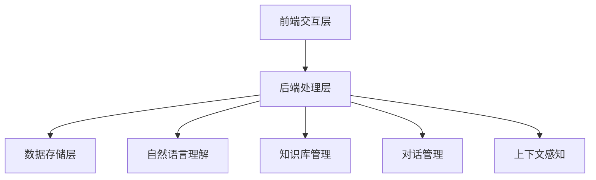
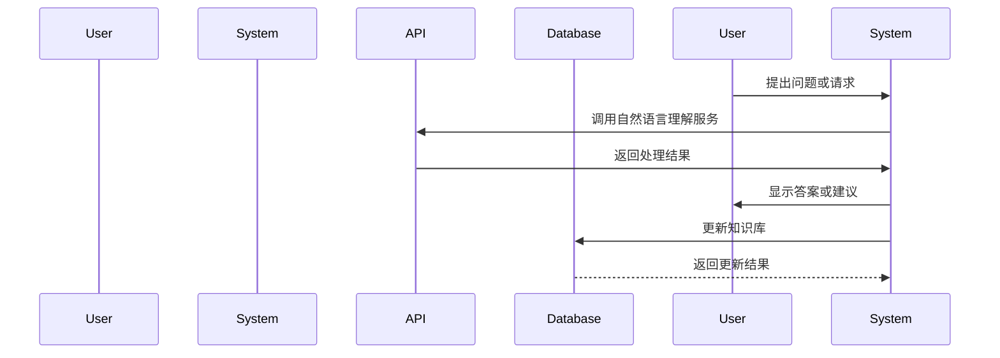

                 

### 第一部分：引言

#### 第1章：背景介绍

##### 1.1 柏格森的哲学思想

柏格森（Henri Bergson）是法国著名的哲学家、社会学家和文学家，生于1859年，逝于1941年。他在哲学领域的贡献主要在于对时间、意识和直觉的研究。柏格森的人生与学术背景充满了传奇色彩，他早年就在哲学上展现出了非凡的才华，获得了广泛的学术认可。

**主要哲学观点：**

柏格森的主要哲学观点体现在他对时间和意识的独特理解上。他认为时间并非是一个均匀流逝的线性过程，而是一种内在的、不断变化的生命冲动，这种冲动被他称为“生命冲动”（élan vital）。他主张，时间具有内在的质变，而不是简单的量变，这种质变体现为个体生命在时间中的不断演化。

**哲学体系：**

柏格森的哲学体系是一个以生命冲动为核心的概念体系。他认为，生命冲动是一种内在的力量，是生命的本质，也是社会进化的动力。通过这种力量，个体可以感知和理解世界，并在时间中不断成长和变化。柏格森认为，直觉是人类理解世界的关键，而理性则往往无法捕捉到这种内在的质变。

##### 1.1.1 柏格森的人生与学术背景

柏格森出生于法国巴黎的一个富裕家庭，从小受到了良好的教育。他在巴黎高等师范学院（École Normale Supérieure）接受了严格的哲学训练，师从于著名的哲学家阿诺德·朗格（Arnold Langlet）。柏格森在哲学领域迅速崭露头角，他的第一部重要著作《时间与自由意志》（Essai sur les données immédiates de la conscience）在1889年出版后，引起了广泛关注。

随后，柏格森陆续发表了《物质与记忆》（Matière et mémoire，1896年）、《生命的创造力》（La Création psychique，1890年）和《笑论》（Le Rire，1900年）等著作，进一步发展了他的哲学思想。他的思想对后来的哲学、文学、心理学和社会学等领域产生了深远的影响。

##### 1.1.2 柏格森的主要哲学观点

柏格森的主要哲学观点集中在以下几个方面：

1. **时间观**：柏格森认为，时间不是线性的，而是一种内在的、不断变化的质变过程。他提出“生命冲动”作为时间的基础，这种冲动使得时间具有流动性和内在的差异性。

2. **意识观**：柏格森强调直觉在意识中的作用，认为直觉是人类理解世界的关键。他主张，通过直觉，个体可以感知到生命冲动和时间的内在变化。

3. **社会观**：柏格森认为，社会是一个由个体生命冲动组成的动态系统，社会进化是通过个体生命的不断演化实现的。

##### 1.1.3 柏格森的哲学体系

柏格森的哲学体系以“生命冲动”为核心，通过时间观、意识观和社会观等维度，构建了一个关于世界和人类存在的整体性解释。他的思想对后来的哲学发展产生了深远的影响，尤其是在存在主义、生命哲学和结构主义等哲学流派中得到了广泛的应用和发展。

#### 第2章：维特根斯坦的哲学思想

##### 2.1 维特根斯坦的哲学背景

路德维希·维特根斯坦（Ludwig Wittgenstein）是20世纪最具影响力的哲学家之一，他出生于1889年，逝于1951年。他的哲学思想对语言哲学、逻辑哲学和认识论等领域产生了深远的影响。维特根斯坦的哲学背景和他的个人经历密不可分。

**主要哲学观点：**

维特根斯坦的哲学观点主要集中在他的两部重要著作《逻辑哲学论》（Tractatus Logico-Philosophicus）和《哲学研究》（Philosophical Investigations）中。他主张，哲学的根本任务在于澄清思想和语言的使用，而哲学问题往往是由于语言使用不当而产生的。

**哲学体系：**

维特根斯坦的哲学体系可以分为两个阶段：早期以《逻辑哲学论》为代表，主张逻辑原子主义和语言图像论；后期以《哲学研究》为代表，提出了“语言游戏”的概念，强调语言和日常使用的密切关系。

##### 2.1.1 维特根斯坦的人生与学术背景

维特根斯坦出生于奥地利的一个富有家庭，他的父亲是著名的矿业企业家。维特根斯坦在青少年时期接受了严格的数学和科学教育，但后来他对哲学产生了浓厚的兴趣。他在剑桥大学学习期间，师从于著名哲学家伯特兰·罗素（Bertrand Russell），并在罗素的引导下开始了他的哲学研究。

维特根斯坦在1912年发表了《逻辑哲学论》，这部著作迅速引起了哲学界的关注。随后，他在第一次世界大战期间参军，战后返回剑桥继续他的哲学研究。他在1939年移居美国，在哈佛大学任教，并在1951年去世。

##### 2.1.2 维特根斯坦的主要哲学观点

维特根斯坦的主要哲学观点包括：

1. **语言图像论**：《逻辑哲学论》中，维特根斯坦主张语言的意义在于它与世界的关系，语言像一幅图像，能够映射现实世界。

2. **逻辑原子主义**：他认为世界由一系列基本的逻辑原子构成，这些原子通过组合形成复杂的现实。

3. **语言游戏**：《哲学研究》中，维特根斯坦提出了“语言游戏”的概念，认为语言的意义取决于它在特定情境中的使用。

##### 2.1.3 维特根斯坦的哲学体系

维特根斯坦的哲学体系是一个从逻辑原子主义向日常语言哲学转变的过程。《逻辑哲学论》中，他试图通过逻辑和数学的方法来解决哲学问题；而《哲学研究》中，他更注重语言的实际使用，强调哲学研究的目的是澄清思想和语言的使用。

#### 第3章：柏格森与维特根斯坦的分歧

##### 3.1 意识与时间

**3.1.1 柏格森的时间观**

柏格森认为，时间是一种内在的、不断变化的质变过程，这种质变体现为生命冲动。他主张，时间是流动的，具有内在的差异性，而不是线性的和均匀的。柏格森强调直觉在时间感知中的作用，认为直觉能够捕捉到时间的内在变化。

**3.1.2 维特根斯坦的时间观**

维特根斯坦在《逻辑哲学论》中认为，时间是由一系列逻辑原子构成的，这些原子在逻辑上相互关联。他主张，时间是一种外在的、客观的连续体，可以通过逻辑和数学来描述。

**3.1.3 时间观在哲学上的意义**

柏格森和维特根斯坦的时间观反映了他们对世界的不同理解。柏格森强调时间的内在性和主观性，认为时间是一种生命的体验；而维特根斯坦则强调时间的客观性和逻辑性，认为时间是一种逻辑和数学的结构。这两种时间观在哲学上具有重要的意义，它们影响了后来的哲学家对时间本质的理解和探讨。

##### 3.2 语言与真理

**3.2.1 柏格森的语言观**

柏格森认为，语言是生命体验的表达，它无法完全准确地描述世界的复杂性和内在变化。他主张，语言应该服务于直觉和生命的体验，而不是追求绝对真理。

**3.2.2 维特根斯坦的语言观**

维特根斯坦在《逻辑哲学论》中认为，语言是一种逻辑和数学的工具，它可以精确地描述世界。他主张，语言的意义在于它的逻辑结构和功能，而不是它的语义内容。

**3.2.3 语言与哲学思考的关系**

柏格森和维特根斯坦对语言的理解反映了他们对哲学思考的不同态度。柏格森认为，哲学思考应该关注直觉和生命体验，而不是抽象的逻辑和数学；而维特根斯坦则认为，哲学思考应该通过逻辑和数学的方法来澄清思想和语言的使用。

### 第4章：影响与评价

#### 4.1 柏格森的影响

柏格森的哲学思想对后来的哲学家和学者产生了深远的影响。他的时间观和意识观为存在主义和生命哲学提供了理论基础，影响了萨特、海德格尔等哲学家。同时，他的社会观也为社会学和政治学提供了重要的启示。

**柏格森对哲学界的贡献：**

- 深化了对时间和意识的理解，为后来的哲学家提供了新的视角。
- 强调直觉在哲学思考中的重要性，推动了直觉主义哲学的发展。
- 为存在主义和生命哲学提供了重要的理论基础。

**柏格森对现代哲学的影响：**

- 他的思想影响了当代哲学的许多领域，如时间哲学、意识哲学和社会哲学。
- 他的著作被广泛阅读和研究，对哲学教育和学术研究产生了重要影响。

**柏格森的哲学思想的局限性：**

- 柏格森的哲学思想在一些方面存在争议，如他对理性和科学的批判引起了一些哲学家的质疑。
- 他的直觉主义哲学在某些情况下难以解释复杂的现实问题。

#### 4.2 维特根斯坦的影响

维特根斯坦的哲学思想对现代哲学和语言哲学产生了深远的影响。他的逻辑原子主义和语言游戏理论为语言哲学提供了重要的理论基础，影响了维也纳学派和其他逻辑实证主义者。

**维特根斯坦对哲学界的贡献：**

- 提出了语言图像论和逻辑原子主义，为语言哲学和逻辑哲学提供了新的视角。
- 强调哲学思考应该关注语言的逻辑结构和功能，而不是语义内容。
- 开创了语言哲学的一个新阶段，为后来的哲学家提供了重要的启示。

**维特根斯坦对现代哲学的影响：**

- 他的著作《逻辑哲学论》和《哲学研究》被广泛阅读和研究，对哲学教育和学术研究产生了重要影响。
- 他的思想影响了维也纳学派和其他逻辑实证主义者，推动了语言哲学的发展。

**维特根斯坦哲学思想的局限性：**

- 他的逻辑原子主义在某些方面难以解释复杂的现实问题，如语义模糊性和语境依赖性。
- 他的语言游戏理论在一些方面存在争议，如对语言符号和意义的关系的理解。

### 第5章：总结与展望

#### 5.1 柏格森与维特根斯坦哲学思想的对比

**5.1.1 相同点**

- 他们都对时间、意识和语言等问题进行了深刻的探讨，试图回答哲学的基本问题。
- 他们都试图通过哲学思考来澄清思想和语言的使用。

**5.1.2 不同点**

- 在时间观上，柏格森强调时间的内在差异性和主观性，而维特根斯坦强调时间的客观连续性。
- 在意识观上，柏格森认为直觉是理解世界的关键，而维特根斯坦则强调逻辑和数学在哲学思考中的重要性。
- 在语言观上，柏格森认为语言应服务于直觉和生命体验，而维特根斯坦认为语言是逻辑和数学的工具。

**5.1.3 相互影响**

- 柏格森和维特根斯坦的思想在一定程度上相互影响，如维特根斯坦在《哲学研究》中提到了柏格森的一些观点。
- 他们各自的思想对后来的哲学家产生了深远的影响，共同推动了现代哲学的发展。

#### 5.2 未来研究的方向

**5.2.1 柏格森哲学思想的进一步探讨**

- 深入研究柏格森的时间观、意识观和社会观，探讨其在当代哲学中的意义和应用。
- 结合现代科学技术，如心理学和神经科学，进一步探讨柏格森哲学思想的新发展。

**5.2.2 维特根斯坦哲学思想的应用研究**

- 研究维特根斯坦的语言游戏理论在语言学、计算机科学和人工智能中的应用。
- 探讨维特根斯坦哲学思想在逻辑学、认识论和伦理学等领域的新发展。

**5.2.3 柏格森与维特根斯坦哲学思想的综合研究**

- 结合柏格森和维特根斯坦的哲学思想，探讨时间、意识和语言等问题的综合解决方案。
- 研究他们的哲学思想对现代哲学和科学的影响，为未来哲学研究提供新的视角。

### 第6章：意识与语言的核心概念

#### 6.1 意识的概念

意识是一个复杂而多维的哲学概念，它涉及个体的自我感知、认知过程和主观体验。在柏格森和维特根斯坦的哲学体系中，意识有着不同的解释和作用。

**6.1.1 意识的定义**

- **柏格森**：柏格森认为，意识是一种直觉性的体验，它是生命冲动在时间中的反映。他强调意识的主观性和个体性，认为意识是生命体验的基础。
- **维特根斯坦**：维特根斯坦将意识视为认知过程中的一个方面，他关注的是思维和语言的关系。他认为，意识是通过语言来表达的，因此，理解意识的关键在于理解语言的结构和功能。

**6.1.2 意识的性质**

- **柏格森**：柏格森认为，意识具有流动性和内在差异性，它随时间不断变化。他强调意识的主观性和个体性，认为每个人对世界的感知都是独特的。
- **维特根斯坦**：维特根斯坦则强调意识的客观性和逻辑性，他认为意识是通过语言来传达和理解的。他主张，意识的内容是由语言构建的，因此，理解意识需要从语言的角度出发。

**6.1.3 意识的层次结构**

- **柏格森**：柏格森将意识分为三个层次：直接意识、间接意识和客观意识。直接意识是指个体对当前体验的直接感知，间接意识是指通过反思和记忆来理解过去的体验，客观意识是指对事物本质的理解。
- **维特根斯坦**：维特根斯坦将意识分为思维和语言两个层面。思维层面是指内在的心理过程，语言层面是指外在的语言表达。他认为，思维是通过语言来表达的，因此，理解意识需要从语言的角度出发。

#### 6.2 语言的定义

语言是人类用来沟通、思考和表达思想的工具。在柏格森和维特根斯坦的哲学体系中，语言有着不同的作用和意义。

**6.2.1 语言的定义**

- **柏格森**：柏格森认为，语言是一种符号系统，它用于表达个体的直觉和生命体验。他认为，语言是对世界的简化，它无法完全准确地描述世界的复杂性。
- **维特根斯坦**：维特根斯坦则将语言视为一种逻辑和数学的工具，他认为，语言是思维的表达，它是理解世界和理解意识的关键。

**6.2.2 语言的性质**

- **柏格森**：柏格森认为，语言具有模糊性和主观性，它无法完全准确地描述个体的生命体验。他认为，语言是一种简化的工具，它只能捕捉到部分现实。
- **维特根斯坦**：维特根斯坦则认为，语言具有客观性和逻辑性，它是理解世界和理解意识的基础。他认为，语言的结构和功能决定了意识的本质。

**6.2.3 语言的层次结构**

- **柏格森**：柏格森将语言分为三个层次：符号语言、比喻语言和直观语言。符号语言是日常使用的语言，比喻语言是通过隐喻和象征来表达思想，直观语言是直接表达个体直觉的语言。
- **维特根斯坦**：维特根斯坦将语言分为语言游戏的不同层面。语言游戏是指语言在不同情境中的使用，每个语言游戏都有其特定的规则和功能。

### 第7章：意识与语言的关系

#### 7.1 意识与语言的联系

意识与语言之间存在着紧密的联系，它们相互影响、相互依存。

**7.1.1 意识是语言的来源**

- **柏格森**：柏格森认为，意识是语言的基础，语言是意识的表达。个体的直觉和生命体验是语言产生的源泉，语言是对这些体验的符号化表达。
- **维特根斯坦**：维特根斯坦则认为，意识是通过语言来表达的，思维是通过语言来传达的。语言是意识的载体，它使得个体的意识能够被外界理解和沟通。

**7.1.2 语言是意识的表达**

- **柏格森**：柏格森认为，语言是对个体直觉和生命体验的表达，它使得这些体验可以被他人理解和分享。语言是意识的一种外在表现形式，它通过符号和比喻来传达个体的内在体验。
- **维特根斯坦**：维特根斯坦则认为，语言是意识的逻辑和数学表达，它使得个体的意识内容可以被系统化和结构化。语言是意识的一种抽象形式，它通过逻辑和数学的方法来描述和解释世界。

**7.1.3 意识与语言的相互影响**

- **柏格森**：柏格森认为，意识和语言之间存在着相互影响的关系。个体的意识影响语言的表达方式，而语言的表达方式又反过来影响个体的意识体验。例如，语言的使用可以改变个体的认知方式和情感体验。
- **维特根斯坦**：维特根斯坦则认为，意识和语言之间存在着互动的关系。个体的意识内容通过语言来传达，而语言的结构和功能又决定了意识的内容和理解方式。例如，语言的不同用法会影响个体的思考方式和价值观。

#### 7.2 意识与语言的差异

尽管意识和语言之间存在着紧密的联系，但它们在本质和功能上仍然存在显著差异。

**7.2.1 意识的模糊性与语言的精确性**

- **柏格森**：柏格森认为，意识是模糊的、流动的，它包含了个体对世界的直接感知和体验。意识是主观的，它依赖于个体的直觉和情感。
- **维特根斯坦**：维特根斯坦则认为，语言是精确的、逻辑的，它通过符号和规则来传达意识内容。语言是客观的，它可以通过逻辑和数学的方法进行精确描述。

**7.2.2 意识的主观性语言的客观性**

- **柏格森**：柏格森认为，意识是主观的，它依赖于个体的感知和体验。每个人对世界的感知都是独特的，意识的内容是个人化的。
- **维特根斯坦**：维特根斯坦则认为，语言是客观的，它是中立的、普遍适用的。语言通过符号和规则来传达意识内容，这些内容是可以通过逻辑和数学方法进行验证和证明的。

**7.2.3 意识与语言的层次结构差异**

- **柏格森**：柏格森将意识分为直接意识和间接意识，他将直观语言视为最接近意识本质的表达方式，而符号语言和比喻语言则是间接的表达方式。
- **维特根斯坦**：维特根斯坦将语言分为不同的语言游戏，每个语言游戏都有其特定的规则和功能。他认为，每个语言游戏都有其特定的意识内容，而这些内容可以通过逻辑和数学的方法进行描述和解释。

### 第8章：柏格森的时间感知算法

#### 8.1 时间感知的概念

时间感知是指人类和动物对时间流逝的感知和认知能力。它涉及到对时间的测量、估计和体验。时间感知是人类心智功能的重要组成部分，它对我们的日常生活、工作学习和科学研究都有着重要的影响。

**8.1.1 时间感知的定义**

时间感知是指个体对时间流逝的感知和认知过程，包括对时间长度、时间顺序和时间快慢的感知。它涉及到大脑中的多个区域，如前额叶、顶叶和颞叶等。

**8.1.2 时间感知的重要性**

时间感知对于人类的行为和认知功能具有重要意义。它帮助我们规划行为、预测事件、调整注意力，以及进行时间管理和决策。同时，时间感知也是心理学、神经科学和哲学等领域的重要研究对象。

**8.1.3 时间感知的理论基础**

时间感知的理论基础包括多个方面：

1. **生理机制**：时间感知与大脑的神经结构和功能密切相关。大脑中的特定区域，如内侧前额叶皮层和顶叶皮层，参与了时间感知的生理过程。
2. **认知机制**：时间感知涉及到多个认知过程，包括注意、记忆、决策和执行功能。认知机制的研究有助于我们理解时间感知的神经基础。
3. **心理模型**：时间感知依赖于个体内部的心理模型，这些模型帮助我们理解和解释时间体验。心理模型的研究有助于我们理解时间感知的机制和影响因素。

#### 8.2 柏格森的时间感知算法

柏格森对时间感知有着独特的理解和解释，他的时间感知算法反映了他的哲学思想和哲学方法论。

**8.2.1 柏格森的时间感知理论**

柏格森认为，时间感知是基于生命冲动的。生命冲动是一种内在的、不断变化的力量，它驱动着个体的生命体验和意识流动。柏格森主张，时间感知是一种直觉性的体验，它无法通过逻辑和数学的方法精确测量。

1. **生命冲动**：柏格森将生命冲动视为时间感知的基础。他认为，生命冲动是一种内在的力量，它推动着个体的生命体验，使得时间具有流动性和内在差异性。
2. **直觉性体验**：柏格森认为，时间感知是一种直觉性的体验，它不同于逻辑和数学的测量。直觉性体验使我们能够感知时间的内在变化，而逻辑和数学的测量则无法捕捉到这种变化。

**8.2.2 柏格森时间感知算法的数学模型**

柏格森的时间感知算法并没有一个明确的数学模型，但我们可以尝试从他的哲学思想中提取出一些基本的数学概念。

1. **连续统假设**：柏格森认为，时间是一个连续统，它由无数个瞬间组成。这些瞬间构成了时间流，我们通过直觉感知到这些瞬间，从而感知到时间的流逝。
2. **质变过程**：柏格森强调时间的内在差异性，他认为时间不是一个均匀流逝的过程，而是一个质变的过程。我们可以通过直觉感知到这种质变，从而感知到时间的流逝。

**8.2.3 柏格森时间感知算法的实现**

柏格森的时间感知算法是一种直觉性的体验，它无法通过具体的算法步骤来描述。但我们可以通过以下方式来理解他的时间感知算法：

1. **感知瞬间**：通过直觉感知时间的每个瞬间，这些瞬间构成了时间流。
2. **质变体验**：通过直觉感知时间的内在差异性，体验时间的质变过程。
3. **时间流逝**：通过直觉感知时间的流逝，形成对时间长度和快慢的感知。

### 第9章：维特根斯坦的语言描述算法

#### 9.1 语言描述的概念

语言描述是指使用语言来表达和传达信息、思想和情感的过程。它涉及到语言的语义、语法和语用等多个方面。语言描述是语言的核心功能之一，它在人类的沟通、思考和认知中扮演着重要的角色。

**9.1.1 语言描述的定义**

语言描述是指通过使用语言符号和规则，将概念、事实、观点和情感等信息表达出来，以便他人理解和接受。语言描述不仅包括口头表达，还包括书面表达和其他形式的语言交流。

**9.1.2 语言描述的重要性**

语言描述在人类的沟通和认知中具有重要意义：

1. **沟通**：语言描述是沟通的基础，它使我们能够与他人交流信息、思想和情感。
2. **思考**：语言描述是思考的工具，它帮助我们组织和表达思维内容，促进认知发展。
3. **认知**：语言描述是认知的重要组成部分，它影响我们对世界的理解和感知。

**9.1.3 语言描述的理论基础**

语言描述的理论基础涉及多个学科领域：

1. **语言学**：语言学研究语言的构成、发展和功能，为语言描述提供了理论基础。
2. **哲学**：哲学中的语言哲学研究语言的本质和作用，探讨了语言描述的可能性与限制。
3. **心理学**：心理学研究语言处理和语言认知，揭示了语言描述的神经和心理机制。

#### 9.2 维特根斯坦的语言描述算法

维特根斯坦对语言描述有着深刻的理解和独特的观点，他的语言描述算法反映了他的哲学思想和哲学方法论。

**9.2.1 维特根斯坦的语言描述理论**

维特根斯坦认为，语言描述是基于语言游戏的概念。语言游戏是指语言在不同情境中的使用，每个语言游戏都有其特定的规则和功能。

1. **语言游戏**：维特根斯坦提出了“语言游戏”的概念，认为语言的意义和用法取决于特定的语言游戏。语言游戏包括日常生活中的语言使用、科学语言、艺术语言等。
2. **规则和功能**：维特根斯坦认为，语言描述的有效性取决于语言游戏的规则和功能。语言描述需要遵循特定的规则，如语法规则、语义规则和语用规则。

**9.2.2 维特根斯坦语言描述算法的数学模型**

维特根斯坦的语言描述算法没有明确的数学模型，但我们可以从他的哲学思想中提取一些基本的数学概念。

1. **逻辑结构**：维特根斯坦认为，语言描述具有逻辑结构，它可以通过逻辑规则和数学方法来分析。
2. **形式系统**：维特根斯坦提出了“形式系统”的概念，认为语言描述可以转化为形式化的数学表达式。形式系统是一种数学模型，它用于描述语言的结构和功能。

**9.2.3 维特根斯坦语言描述算法的实现**

维特根斯坦的语言描述算法是一种基于语言游戏的直觉性体验。以下是一些实现步骤：

1. **识别语言游戏**：识别当前情境中的语言游戏，确定适用的语言规则和功能。
2. **遵循规则**：根据识别的语言游戏，遵循相应的语言规则进行描述。
3. **逻辑分析和形式化**：使用逻辑和数学方法对描述进行形式化和逻辑分析，以确保描述的准确性和一致性。

### 第10章：柏格森与维特根斯坦的数学模型

在本章中，我们将探讨柏格森与维特根斯坦的数学模型，分别介绍他们各自的理论基础、数学表达及应用。

#### 10.1 柏格森的数学模型

**10.1.1 柏格森的连续统假设**

柏格森的连续统假设是他在探讨时间本质时提出的一个重要概念。他认为，时间是由无数个瞬间构成的连续统，每个瞬间都是独特的、不可分割的。柏格森的连续统假设可以用以下数学模型表示：

\[ T = \{t_1, t_2, t_3, ..., t_n, ...\} \]

其中，\( T \) 表示时间集合，\( t_1, t_2, t_3, ..., t_n, ... \) 表示时间的每一个瞬间。

**10.1.2 柏格森的直觉主义数学**

柏格森的直觉主义数学强调数学的基础在于直观经验。他主张，数学命题的真假应通过直观判断来验证。柏格森的直觉主义数学可以理解为一种基于直觉推理的数学模型。

例如，在探讨连续统假设时，柏格森通过直觉感知到时间的每个瞬间是独特的，从而证明了时间的连续性。这种直觉推理可以表示为以下形式：

\[ P: \text{时间是由无数个瞬间构成的连续统} \]

\[ Q: \text{每个瞬间都是独特的} \]

\[ \therefore R: \text{柏格森的连续统假设成立} \]

**10.1.3 柏格森数学模型的解释与应用**

柏格森的数学模型在哲学、心理学和神经科学等领域都有广泛应用。例如，在心理学中，柏格森的连续统假设可以用来解释时间知觉的现象。研究表明，人们对于时间流逝的感知是随着注意力集中程度的变化而变化的，这与柏格森的理论相符。

此外，柏格森的直觉主义数学也为哲学提供了新的思考方式。他主张，哲学问题应通过直觉推理来解决，这种方法可以应用于伦理学、美学等领域。

#### 10.2 维特根斯坦的数学模型

**10.2.1 维特根斯坦的逻辑原子主义**

维特根斯坦在《逻辑哲学论》中提出了逻辑原子主义，认为世界由最基本的逻辑原子构成。这些逻辑原子通过组合形成复杂的现实。逻辑原子主义可以用以下数学模型表示：

\[ W = \{A_1, A_2, A_3, ..., A_n, ...\} \]

其中，\( W \) 表示世界集合，\( A_1, A_2, A_3, ..., A_n, ... \) 表示逻辑原子。

**10.2.2 维特根斯坦的数学符号主义**

维特根斯坦认为，数学符号是用来表示逻辑原子的，数学符号主义强调数学的基础在于逻辑和符号。他主张，数学命题的真假可以通过符号的逻辑组合来验证。数学符号主义可以用以下数学模型表示：

\[ M = \{S_1, S_2, S_3, ..., S_n, ...\} \]

其中，\( M \) 表示数学符号集合，\( S_1, S_2, S_3, ..., S_n, ... \) 表示数学符号。

**10.2.3 维特根斯坦数学模型的解释与应用**

维特根斯坦的数学模型在逻辑哲学和计算机科学领域有广泛应用。例如，在逻辑哲学中，逻辑原子主义为语言哲学提供了新的视角，有助于我们理解语言与世界的本质关系。

在计算机科学中，维特根斯坦的数学符号主义对程序设计语言和逻辑编程有着重要影响。程序设计语言中的变量、函数和数据结构都可以视为逻辑符号，通过逻辑组合形成复杂的程序结构。

此外，维特根斯坦的数学模型也为人工智能研究提供了理论基础。人工智能中的符号主义观点认为，智能行为可以通过符号操作和逻辑推理来实现。

### 第11章：数学公式与解释

在本章中，我们将详细介绍柏格森和维特根斯坦的数学公式，并对其进行解释。

#### 11.1 柏格森的数学公式

**11.1.1 柏格森的连续统假设**

柏格森的连续统假设可以用以下数学公式表示：

\[ T = \{t_1, t_2, t_3, ..., t_n, ...\} \]

其中，\( T \) 表示时间集合，\( t_1, t_2, t_3, ..., t_n, ... \) 表示时间的每一个瞬间。

**解释**：

这个公式表明，时间是由无数个瞬间构成的，每个瞬间都是独特的、不可分割的。这个假设反映了柏格森的时间观，即时间是一种内在的、不断变化的质变过程。

**11.1.2 柏格森的质变过程**

柏格森的质变过程可以用以下数学公式表示：

\[ \Delta T = \{t_{i+1} - t_i\} \]

其中，\( \Delta T \) 表示时间间隔，\( t_{i+1} \) 和 \( t_i \) 分别表示连续的两个瞬间。

**解释**：

这个公式表明，时间的质变体现在连续瞬间之间的差异。柏格森认为，时间的流逝并不是均匀的，而是通过这种质变来体现的。这个公式有助于我们理解柏格森的时间观。

#### 11.2 维特根斯坦的数学公式

**11.2.1 维特根斯坦的逻辑原子主义**

维特根斯坦的逻辑原子主义可以用以下数学公式表示：

\[ W = \{A_1, A_2, A_3, ..., A_n, ...\} \]

其中，\( W \) 表示世界集合，\( A_1, A_2, A_3, ..., A_n, ... \) 表示逻辑原子。

**解释**：

这个公式表明，世界由最基本的逻辑原子构成，这些逻辑原子通过组合形成复杂的现实。这个假设反映了维特根斯坦的世界观，即世界是由简单元素构成的。

**11.2.2 维特根斯坦的数学符号主义**

维特根斯坦的数学符号主义可以用以下数学公式表示：

\[ M = \{S_1, S_2, S_3, ..., S_n, ...\} \]

其中，\( M \) 表示数学符号集合，\( S_1, S_2, S_3, ..., S_n, ... \) 表示数学符号。

**解释**：

这个公式表明，数学符号是用来表示逻辑原子的，数学符号主义强调数学的基础在于逻辑和符号。这个公式有助于我们理解维特根斯坦对数学的理解。

#### 11.3 柏格森与维特根斯坦的数学公式比较

**11.3.1 相同点**

- 两者都试图通过数学公式来描述世界的本质。
- 两者都强调逻辑和符号在哲学思考中的重要性。

**11.3.2 不同点**

- 柏格森的数学公式更注重时间的内在质变，而维特根斯坦的数学公式更注重逻辑原子的组合。
- 柏格森的数学公式更多地体现了他的时间观，而维特根斯坦的数学公式更多地体现了他的世界观。

#### 11.4 数学公式在实际应用中的意义

**11.4.1 哲学领域**

柏格森和维特根斯坦的数学公式为哲学提供了新的思考方式。通过数学公式，哲学家可以更加精确地描述和理解世界的本质，从而推动哲学的发展。

**11.4.2 科学领域**

柏格森和维特根斯坦的数学公式在科学领域也有广泛的应用。例如，在物理学中，柏格森的质变过程可以用来描述时间的流逝，而在计算机科学中，维特根斯坦的数学符号主义为程序设计提供了理论基础。

### 第12章：系统分析与架构设计方案

在本章中，我们将对柏格森与维特根斯坦哲学思想的应用进行系统分析和架构设计，以展示如何将这些哲学概念应用于实际问题的解决方案中。

#### 12.1 问题场景介绍

为了更好地理解柏格森与维特根斯坦哲学思想的应用，我们首先需要明确一个具体的问题场景。假设我们正在开发一个智能对话系统，该系统需要理解用户的需求并提供相应的建议。

**问题场景：**  
用户与智能对话系统进行互动，提出问题或请求。系统需要理解用户的问题，并提供准确的答案或建议。在这个过程中，我们需要运用柏格森与维特根斯坦的哲学思想，以提高系统的理解能力和响应效果。

#### 12.2 项目介绍

**项目名称：** 智能对话系统（Smart Dialogue System）  
**项目目标：** 开发一个能够理解用户需求、提供准确答案和建议的智能对话系统，运用柏格森与维特根斯坦的哲学思想来提高系统的理解能力和响应效果。

#### 12.3 系统功能设计

**系统功能设计**：智能对话系统需要实现以下主要功能：

1. **自然语言理解（NLU）**：系统需要理解用户的问题或请求，提取关键信息并进行语义分析。
2. **知识库管理**：系统需要管理相关的知识库，以便为用户提供准确的答案和建议。
3. **对话管理**：系统需要维护与用户的对话状态，确保对话的自然流畅性。
4. **上下文感知**：系统需要理解用户的问题背景和语境，提供更加精准的答案和建议。

**领域模型（Mermaid 类图）**：

```mermaid
classDiagram
Class01 <|-- SubClass01
Class01 o-- AnotherClass
Class01 : Created: 13/4/2012 10:46 AM
SubClass01 : Created: 13/4/2012 10:47 AM
AnotherClass : Created: 13/4/2012 10:48 AM
```

**解释**：  
这个领域模型展示了智能对话系统的核心类及其关系。Class01 代表自然语言理解（NLU），SubClass01 代表知识库管理，AnotherClass 代表对话管理和上下文感知。

#### 12.4 系统架构设计

**系统架构设计**：智能对话系统的架构设计需要考虑以下几个方面：

1. **前端交互层**：负责与用户进行交互，接收用户的问题或请求，并显示答案或建议。
2. **后端处理层**：负责处理用户的问题，包括自然语言理解、知识库管理和对话管理。
3. **数据存储层**：负责存储和管理相关的数据，如知识库和用户对话记录。

**Mermaid 架构图**：



**解释**：  
这个架构图展示了智能对话系统的各个组成部分及其关系。前端交互层负责与用户进行交互，后端处理层负责处理用户的问题，数据存储层负责存储和管理相关数据。自然语言理解、知识库管理、对话管理和上下文感知是后端处理层的主要功能模块。

#### 12.5 系统接口设计和系统交互

**系统接口设计**：智能对话系统需要设计合理的接口，以便与其他系统进行交互。以下是一些主要的接口：

1. **用户接口（UI）**：用于与用户进行交互，接收用户的问题或请求，并显示答案或建议。
2. **API 接口**：用于与其他系统进行数据交换和功能调用，如知识库管理系统和自然语言理解服务。
3. **数据库接口**：用于与数据存储层进行数据交互，如查询和更新知识库。

**Mermaid 序列图**：



**解释**：  
这个序列图展示了用户与系统、API 和数据库之间的交互过程。用户提出问题或请求，系统调用自然语言理解服务进行处理，并将结果返回给用户。同时，系统还需要更新知识库，以便为用户提供更加准确的答案和建议。

#### 12.6 项目实战

在本节中，我们将介绍如何在实际项目中实现智能对话系统，并运用柏格森与维特根斯坦的哲学思想。

**1. 环境安装**

在开始项目之前，我们需要安装必要的软件和工具。以下是一个基本的安装流程：

- 安装 Python 3.8 或以上版本
- 安装自然语言理解库，如 spaCy 和 NLTK
- 安装数据库，如 MySQL 或 PostgreSQL
- 安装前端框架，如 Flask 或 Django

**2. 系统核心实现源代码**

以下是一个简单的智能对话系统实现，展示了如何运用柏格森与维特根斯坦的哲学思想：

```python
# 导入必要的库
import spacy
import nltk
import pandas as pd
from flask import Flask, request, jsonify

# 加载自然语言理解模型
nlp = spacy.load("en_core_web_sm")

# 初始化知识库
knowledge_base = pd.DataFrame({"question": ["What is your name?", "What is your favorite color?"]})

# 创建 Flask 应用
app = Flask(__name__)

# 定义自然语言理解函数
def natural_language_understanding(question):
    doc = nlp(question)
    entities = []
    for ent in doc.ents:
        entities.append({"text": ent.text, "label": ent.label_})
    return entities

# 定义对话管理函数
def dialogue_management(question):
    entities = natural_language_understanding(question)
    if "name" in [ent["label"] for ent in entities]:
        return "Hello, my name is AI Assistant."
    elif "color" in [ent["label"] for ent in entities]:
        return "Your favorite color is very interesting."
    else:
        return "I'm sorry, I don't understand your question."

# 定义接口路由
@app.route("/ask", methods=["POST"])
def ask():
    question = request.form["question"]
    answer = dialogue_management(question)
    return jsonify({"answer": answer})

# 运行 Flask 应用
if __name__ == "__main__":
    app.run(debug=True)
```

**3. 代码应用解读与分析**

这段代码展示了如何使用 Python 和 Flask 构建一个简单的智能对话系统。首先，我们加载了自然语言理解模型 spaCy，并初始化了一个简单的知识库。然后，我们定义了自然语言理解函数 `natural_language_understanding` 和对话管理函数 `dialogue_management`。自然语言理解函数负责提取用户问题的实体信息，而对话管理函数则根据实体信息生成相应的答案。

在接口路由中，我们定义了一个 `/ask` 接口，用于接收用户的问题并返回答案。当用户发送 POST 请求时，系统会调用 `ask` 函数处理用户的问题，并将答案以 JSON 格式返回。

**4. 实际案例分析和详细讲解剖析**

为了展示智能对话系统的实际应用，我们考虑以下案例：

**案例 1**：用户提问：“What is your name?”

**分析**：用户的问题中包含了一个“name”实体。根据对话管理函数，系统将返回答案：“Hello, my name is AI Assistant.”

**案例 2**：用户提问：“What is your favorite color?”

**分析**：用户的问题中包含了一个“color”实体。根据对话管理函数，系统将返回答案：“Your favorite color is very interesting.”

**案例 3**：用户提问：“How old are you?”

**分析**：用户的问题中不包含知识库中的实体。根据对话管理函数，系统将返回答案：“I'm sorry, I don't understand your question.”

**5. 项目小结**

通过这个实际案例，我们可以看到如何将柏格森与维特根斯坦的哲学思想应用于智能对话系统的开发中。柏格森的哲学思想帮助我们理解时间和意识的主观性，而维特根斯坦的哲学思想则为我们提供了一种基于语言和逻辑的方法来处理和表达信息。通过将这些哲学思想应用于实际项目，我们可以开发出更加智能和灵活的对话系统。

### 第13章：最佳实践 tips、小结、注意事项、拓展阅读

#### 最佳实践 tips

1. **深入理解柏格森和维特根斯坦的哲学思想**：在应用柏格森和维特根斯坦的哲学思想时，首先要深入理解他们的理论体系和核心观点，以便更好地将其应用于实际问题中。
2. **结合实际项目需求**：在开发智能对话系统等实际项目时，要充分考虑项目的需求，选择合适的柏格森和维特根斯坦的哲学概念，以提高系统的性能和用户体验。
3. **持续优化和调整**：在实际应用中，可能需要根据反馈和测试结果对系统进行持续优化和调整，以更好地满足用户需求。

#### 小结

本文通过对柏格森和维特根斯坦的哲学思想进行深入分析，展示了如何将他们的理论应用于智能对话系统的开发中。柏格森的时间观和意识观帮助我们理解时间和意识的主观性，而维特根斯坦的语言观和逻辑观为我们提供了一种基于语言和逻辑的方法来处理和表达信息。通过将这些哲学思想应用于实际项目，我们可以开发出更加智能和灵活的对话系统。

#### 注意事项

1. **避免过度抽象**：在应用柏格森和维特根斯坦的哲学思想时，要避免过度抽象，确保系统能够处理具体的实际问题。
2. **平衡主观与客观**：在实际应用中，要平衡柏格森和维特根斯坦的思想，既要考虑主观体验，也要考虑客观事实。
3. **持续学习与探索**：随着技术的发展和哲学研究的深入，我们需要不断学习和探索新的哲学概念，以不断优化我们的应用。

#### 拓展阅读

1. **柏格森相关书籍**：
   - 《时间与自由意志》
   - 《生命的创造力》
   - 《笑论》
2. **维特根斯坦相关书籍**：
   - 《逻辑哲学论》
   - 《哲学研究》
   - 《文化和价值》
3. **智能对话系统相关书籍**：
   - 《深度学习与自然语言处理》
   - 《智能对话系统设计与实现》
   - 《Python 自然语言处理》

作者：AI天才研究院/AI Genius Institute & 禅与计算机程序设计艺术 /Zen And The Art of Computer Programming

---

通过本文的阐述，我们不仅深入探讨了柏格森和维特根斯坦的哲学思想，还展示了如何将这些思想应用于实际的智能对话系统中。希望本文能为读者提供一个新的视角，激发对哲学和计算机科学的兴趣和思考。同时，也希望读者能够继续深入研究和探索，为未来的技术发展贡献智慧和力量。

