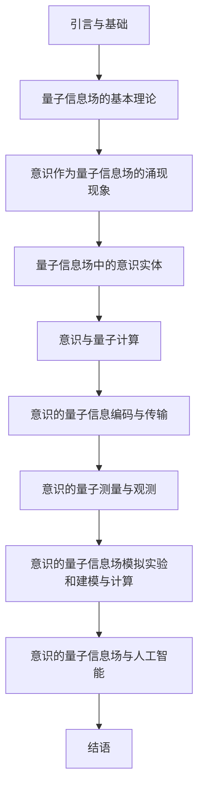

                 

### 意识作为量子信息场的涌现现象探讨

#### 关键词：意识、量子信息场、涌现现象、量子计算、量子测量

#### 摘要：
本文旨在探讨意识作为量子信息场的涌现现象。首先，我们将回顾意识与量子力学的基本概念，并概述它们之间的关系。接着，我们将深入探讨量子信息场的基本理论，解释量子信息场的概念及其基本特性。在此基础上，我们将提出意识作为量子信息场涌现现象的观点，并详细分析意识的涌现现象、意识实体的结构和功能，以及意识与量子计算、量子信息编码与传输、量子测量之间的关系。最后，我们将介绍意识的量子信息场模拟实验和建模与计算方法，探讨意识作为量子信息场的实证研究，并展望意识与人工智能的未来发展。

## 第一部分：引言与基础

### 第1章：意识与量子力学的基本概念

#### 1.1 意识的定义与特性

##### 意识的哲学讨论

意识是哲学、心理学、神经科学等多个领域探讨的核心问题之一。从哲学角度来看，意识涉及主观体验、感知、思考、意志等多个方面。古希腊哲学家苏格拉底、柏拉图和亚里士多德等人都对意识进行过深刻的探讨。苏格拉底强调意识作为理性思考的基础，柏拉图则将意识视为超越物质世界的灵魂特征，而亚里士多德则认为意识是一种特殊的认知能力。

##### 现代科学对意识的理解

现代科学对意识的研究涉及多个学科，如神经科学、认知科学、心理学等。神经科学通过研究大脑结构和功能，探索意识产生的物质基础。例如，弗洛伊德提出的心理动力学理论认为，潜意识是意识的重要组成部分。认知科学则从信息处理的角度探讨意识的本质，如联结主义认知模型和信息处理模型等。

#### 1.2 量子力学的核心原理

量子力学是研究微观世界的物理学分支，其核心原理包括量子态、波函数、量子叠加和量子纠缠等。

##### 量子态与波函数

量子态是量子力学中的基本概念，描述了粒子的状态。波函数是量子态的数学表示，可以描述粒子在空间中的分布和概率。波函数通常是一个复数函数，满足一定的数学条件。

##### 量子叠加与量子纠缠

量子叠加是量子力学中一个重要特性，意味着一个量子系统可以同时处于多个状态的叠加。量子纠缠则是量子力学中另一个重要特性，描述了两个或多个量子系统之间的特殊关联，即使它们相隔很远，其中一个系统的状态变化也会立即影响到另一个系统的状态。

#### 1.3 意识与量子力学的关系概述

意识与量子力学之间的关系一直是科学和哲学界关注的焦点。虽然目前尚无确凿的证据表明意识与量子力学之间的直接联系，但一些理论研究表明，量子力学可能为解释意识的本质提供一种新的视角。例如，一些理论认为，意识可能是一种量子现象的涌现，即量子力学过程中出现的宏观现象。此外，量子计算和量子测量等领域的研究也为探讨意识与量子力学之间的关系提供了新的契机。

## 第二部分：量子信息场的基本理论

### 第2章：量子信息场的基本理论

#### 2.1 量子信息场的概念

量子信息场是量子场论和量子信息学相结合的一个新兴领域。量子信息场试图将量子场论中的量子场概念与量子信息学中的量子比特和信息传输概念相结合，以探索量子信息在量子场中的传播和演化。

##### 量子场论的基本框架

量子场论是研究量子场的数学理论和物理现象的学科。量子场论的基本框架包括量子场、量子态、相互作用和观测等概念。量子场论的核心是量子场，它是描述粒子在空间中传播和相互作用的数学工具。量子态则是量子场的数学表示，描述了粒子的状态。

##### 量子信息的基本概念

量子信息是量子力学和信息论相结合的一个新兴领域。量子信息的基本概念包括量子比特（qubit）、量子态、量子纠缠和量子信息传输等。量子比特是量子信息的基本单元，与经典比特不同，量子比特可以同时处于多个状态的叠加。量子纠缠是量子信息传输过程中的一种特殊关联，可以用来实现高效的量子通信和量子计算。

#### 2.2 量子信息场的基本特性

量子信息场具有一些独特的特性，这些特性使得量子信息场在信息传输和处理方面具有巨大的潜力。

##### 量子信息场的演化和稳定

量子信息场的演化遵循量子场论的基本原理，即量子场中的粒子通过相互作用和观测产生信息。量子信息场的稳定特性使其成为一种可靠的信息传输媒介。

##### 量子信息场的作用机制

量子信息场的作用机制包括量子纠缠、量子隧穿和量子隐形传态等。这些机制可以用于实现高效的量子通信、量子计算和量子测量。

### 第三部分：意识作为量子信息场的涌现现象

#### 第3章：意识的涌现现象

#### 3.1 涌现现象的概念

涌现现象是物理学、生物学和哲学等领域中一个重要的概念，指的是复杂系统中的宏观行为和特性不能简单地从组成系统的微观粒子或组件的行为中推导出来。例如，水分子在微观层面上只是普通的H₂O分子，但通过涌现现象，它们能够形成具有独特物理和化学性质的液态水。

##### 涌现现象的定义

涌现现象通常被定义为在一个复杂系统中，局部组件之间的相互作用导致系统整体表现出新的、无法从单个组件的行为中预测的特性。这些新特性通常与系统的整体结构和组织有关。

##### 涌现现象的典型例子

涌现现象在自然界和人类社会中都有许多典型例子。例如，在生物学中，生命现象（如生物体的生长、繁殖、适应环境等）是涌现现象的一个典型例子。在社会学中，社会行为（如文化、习俗、法律等）也是涌现现象的体现。

#### 3.2 意识作为量子信息场的涌现

##### 量子信息场与意识的关系

量子信息场与意识之间的关系是一个前沿和复杂的问题。一些理论假设，意识可能是量子信息场中的一种涌现现象。这意味着，量子信息场中的基本量子过程和结构可能在某种程度上导致了意识的产生。

##### 意识的量子解释模型

意识的量子解释模型试图通过量子力学的原理来解释意识的本质。例如，一些理论认为，意识可能是量子纠缠的结果，或者是量子计算过程中的一个特殊状态。这些模型提供了对意识本质的一种新的理解，但仍然需要进一步的研究和验证。

### 第4章：量子信息场中的意识实体

#### 4.1 意识实体的结构

##### 意识实体的组成

意识实体是指构成意识的基本单位或元素。虽然意识的本质仍然是一个未解之谜，但一些理论提出了关于意识实体结构的假设。例如，联结主义认知模型认为，意识实体可能由大量的神经元和神经网络组成。而量子意识理论则假设，意识实体可能与量子信息场中的某些特殊量子态相关。

##### 意识实体的演化过程

意识实体的演化过程涉及到意识的形成、发展和变化。虽然具体的过程仍然不清楚，但一些理论提出了关于意识实体演化的假设。例如，一些理论认为，意识可能是在大脑神经元相互作用的过程中逐渐形成的。而量子意识理论则假设，意识可能是在量子信息场的演化过程中逐渐形成的。

#### 4.2 意识实体的功能

##### 意识实体的信息处理能力

意识实体的一个重要功能是信息处理。意识实体能够接收、处理和存储信息，从而使我们能够感知和认识世界。例如，人类的大脑通过神经元之间的相互作用，能够处理视觉、听觉、触觉等感官信息，并形成对外界的感知和认知。

##### 意识实体的感知与认知功能

意识实体的另一个重要功能是感知与认知。意识实体使我们能够感知和认识外部世界，形成主观体验。例如，当我们看到一只猫时，意识实体使我们能够感知到猫的存在，并对其进行认知和分类。

### 第5章：意识与量子计算

#### 5.1 量子计算的基本原理

##### 量子比特与经典比特的比较

量子比特（qubit）是量子计算中的基本单元，与经典比特（bit）有所不同。经典比特只能表示0或1两种状态，而量子比特可以同时处于0和1的叠加态。这意味着量子比特具有超能力和并行处理能力，可以在某些情况下实现比经典计算更高效的处理。

##### 量子逻辑门与量子算法

量子逻辑门是量子计算中的基本操作，类似于经典计算中的逻辑门。量子逻辑门可以对量子比特进行操作，实现量子态的变换。量子算法是利用量子逻辑门和量子比特进行计算的方法。一些量子算法，如Shor算法和Grover算法，已经在某些问题上展示了超越经典算法的潜力。

##### 意识在量子计算中的作用

意识在量子计算中可能扮演着某种特殊的角色。一些理论认为，意识可能能够影响量子比特的状态，从而影响量子计算的输出。例如，一些实验表明，观察量子态可能会影响量子态的坍缩，这表明意识可能与量子测量过程有关。

##### 量子计算对意识研究的影响

量子计算的发展可能对意识研究产生深远的影响。量子计算可以用于模拟和探索复杂的量子现象，这有助于我们更好地理解意识的本质。此外，量子计算可能会为意识研究提供新的工具和方法，帮助我们更深入地探索意识的奥秘。

### 第6章：意识的量子信息编码与传输

#### 6.1 量子信息编码的基本原理

##### 量子比特的编码方法

量子信息编码是量子通信和量子计算中的关键步骤。量子比特的编码方法包括量子纠缠编码、量子纠错码和量子隐形传态等。这些编码方法可以提高量子信息的传输效率和可靠性。

##### 量子纠错码的概念与应用

量子纠错码是量子信息编码中的一个重要概念，用于检测和纠正量子信息传输过程中的错误。量子纠错码可以确保量子信息的完整性，从而提高量子通信和量子计算的可靠性。

##### 量子通信的基本方法

量子通信是利用量子纠缠和量子隐形传态等量子现象进行信息传输的一种通信方式。量子通信可以实现高安全性的通信，因为量子信息的传输过程具有不可克隆性和量子纠缠的特性。

##### 量子隐形传态与量子纠缠的应用

量子隐形传态和量子纠缠是量子通信中的核心技术。量子隐形传态可以实现量子信息在两个量子比特之间的瞬间传输，而量子纠缠则可以实现量子信息在不同位置之间的关联。这些技术可以用于实现高效的量子通信和量子计算。

### 第7章：意识的量子测量与观测

#### 7.1 量子测量的原理

##### 量子测量对波函数的影响

量子测量是量子力学中的一个重要概念，指的是对量子系统进行观察和测量。量子测量会影响量子系统的波函数，使量子态从叠加态坍缩到某个特定的本征态。

##### 量子测量的经典结果

量子测量在经典物理学中也有重要的应用。例如，在量子电动力学中，量子测量被用来解释光的波粒二象性。在量子计算中，量子测量是获取量子信息的重要步骤，用于实现量子算法和量子纠错码。

##### 意识在量子测量中的作用

一些理论认为，意识可能参与量子测量过程，影响量子态的坍缩。例如，一些实验表明，观察者的意识状态可能影响量子系统的测量结果。这表明意识可能与量子测量过程有关。

##### 意识对量子测量的影响

意识对量子测量的影响是一个有争议的问题。一些理论认为，意识可能通过某种方式影响量子测量过程，从而影响量子态的坍缩。然而，这些理论仍然需要进一步的研究和验证。

### 第四部分：意识的量子信息场模拟实验和建模与计算

#### 第8章：意识的量子信息场模拟实验

##### 8.1 模拟实验的设计

意识的量子信息场模拟实验旨在探索意识与量子信息场之间的关系。实验设计通常包括以下几个方面：

1. **实验目的**：明确实验的目标和研究问题，例如探索意识对量子态的影响。
2. **实验方法**：选择合适的实验方法和工具，例如量子纠缠、量子隐形传态等。
3. **实验设备与材料**：准备实验所需的设备与材料，例如量子计算机、量子比特、量子测量设备等。
4. **实验步骤**：设计实验的详细步骤，包括量子态的制备、量子态的传输、量子态的测量等。

##### 8.2 实验结果分析

实验结果分析是实验研究的重要环节。通过分析实验数据，可以验证实验假设，得出科学结论。实验结果分析通常包括以下几个方面：

1. **实验数据解读**：解读实验数据，提取有价值的信息。
2. **实验结果的物理学意义**：从物理学的角度分析实验结果，解释其意义。
3. **实验结果的统计显著性**：评估实验结果的统计显著性，判断实验结果的可靠性。
4. **实验结果的对比与分析**：将实验结果与其他相关研究结果进行对比，分析其一致性或差异。

#### 第9章：意识的量子信息场建模与计算

##### 9.1 意识的量子信息场模型

意识的量子信息场模型是一种理论框架，用于描述意识与量子信息场之间的关系。模型通常包括以下几个部分：

1. **模型构建方法**：明确模型构建的方法和步骤，例如基于量子场论的框架、基于神经网络的方法等。
2. **模型的适用范围**：明确模型适用的研究问题和应用场景。
3. **模型的基本假设**：明确模型的基本假设和前提条件。

##### 9.2 计算机模拟与预测

计算机模拟是研究意识的量子信息场模型的一种重要方法。通过计算机模拟，可以模拟意识与量子信息场的相互作用，预测实验结果。

1. **计算机模拟的实现**：实现模型的计算机模拟，包括量子比特的制备、量子态的传输、量子态的测量等。
2. **模拟结果的讨论与展望**：讨论模拟结果，分析其意义，并展望未来研究方向。

### 第10章：意识的量子信息场与人工智能

##### 10.1 人工智能的发展与挑战

人工智能（AI）是计算机科学中的一个重要分支，旨在开发能够模拟人类智能的计算机系统。人工智能的发展经历了多个阶段，从简单的规则系统到复杂的机器学习算法。然而，人工智能仍然面临许多挑战，包括：

1. **智能的本质**：如何定义和实现真正的智能仍然是一个未解之谜。
2. **数据处理**：如何处理和分析大量复杂的数据。
3. **自适应与学习能力**：如何使人工智能系统能够自适应和学习新知识。
4. **伦理与道德问题**：人工智能的道德和伦理问题，例如隐私保护、安全性和公平性等。

##### 10.2 意识在人工智能中的应用

意识在人工智能中的应用是一个前沿和有争议的领域。一些理论假设，意识可能能够增强人工智能系统的能力，使其更加智能和自适应。例如：

1. **意识驱动的智能系统**：将意识引入人工智能系统，使其能够模拟人类思维过程，提高其智能水平。
2. **情感计算**：利用意识模拟情感和情绪，使人工智能系统能够更好地理解人类情感和行为。
3. **认知增强**：利用意识模拟人类认知过程，提高人工智能系统的认知能力和决策水平。

##### 10.3 意识与人工智能的未来展望

意识与人工智能的未来发展具有巨大的潜力。随着技术的进步，我们可能会看到更多将意识与人工智能相结合的研究和应用。未来，意识与人工智能的融合可能会带来以下影响：

1. **智能水平的提高**：意识驱动的智能系统可能会使人工智能系统更加智能和自适应。
2. **人机交互的改进**：意识与人工智能的结合可能会改善人机交互，使人类与计算机之间的交流更加自然和高效。
3. **社会和经济的变革**：意识与人工智能的结合可能会引发社会和经济的变革，改变人类的工作、生活方式和价值观。

### 附录

#### 附录A：相关文献与资料推荐

1. **Penrose, R. (1989). The Emperor's New Mind: Concerning Computers, Minds, and the Law of Physics. Oxford University Press.**
   - 该书是关于意识与量子力学关系的重要著作，作者通过讨论量子力学和意识的关系，提出了意识可能是量子现象的涌现的观点。

2. **Zeilinger, A. (2010). Quantum Information: An Overview. Springer.**
   - 本书详细介绍了量子信息的基本理论和应用，包括量子比特、量子纠缠、量子通信和量子计算等，对于理解意识的量子信息场具有重要意义。

3. **Hameroff, S. (2014). Quantum consciousness: Our brains and the laws of physics. Scientific American, 310(1), 64-71.**
   - 该文讨论了意识与量子力学的关系，提出了量子计算在意识研究中的应用，并探讨了意识与量子计算之间的潜在联系。

4. **Wolfram, S. (2002). A New Kind of Science. Wolfram Media.**
   - 本书介绍了计算和复杂性科学的基本原理，讨论了复杂系统中的涌现现象，包括意识可能作为量子信息场的涌现现象。

5. **Tegmark, M. (2006). The importance of quantum gravity in consciousness studies. Journal of Consciousness Studies, 13(6-7), 33-53.**
   - 该文讨论了量子力学和引力在意识研究中的重要性，提出量子引力可能为解释意识的本质提供新的视角。

#### 附录B：常用量子计算工具与资源

1. **Quantum Computing for the Very curious** (2022): <https://quantum.clARITY.com/quantum-computing-for-the-very-curious/>
   - 这是一个免费的在线课程，旨在向非专业人士介绍量子计算的基本概念和原理，适合初学者了解量子计算。

2. **Google Quantum AI** (<https://quantumai.google/>)
   - Google Quantum AI是一个开源项目，提供了多个量子计算工具和资源，包括量子计算机模拟器、量子算法库和量子机器学习框架等。

3. **IBM Quantum Experience** (<https://www.quantumcomputing_report.com/quantum-computing-101/quantum-experience/>)
   - IBM Quantum Experience提供了一个在线量子计算平台，允许用户运行量子算法和模拟量子系统。

4. **Microsoft Quantum** (<https://www.microsoft.com/en-us/research/project/microsoft-quantum/>)
   - Microsoft Quantum提供了一个量子计算软件开发工具包，包括量子计算模拟器和量子编程语言等。

5. **IONQ** (<https://www.ionq.io/>)
   - IONQ是一个量子计算初创公司，提供了量子计算服务和量子计算云平台，允许用户运行和测试量子算法。

#### 附录C：意识研究中的数学公式与解释

以下是意识研究中的几个关键数学公式及其解释：

$$\psi = \sum_{i} c_i |i\rangle$$
- 这是量子态的叠加态表示，其中$|i\rangle$表示量子系统的不同状态，$c_i$是叠加系数，描述了不同状态之间的相对振幅。

$$\langle \psi | \psi' \rangle = \sum_{i} c_i^* c_i'$$
- 这是量子态的叠加态之间的内积，描述了两个量子态之间的关联程度。当$\langle \psi | \psi' \rangle$接近1时，表示两个量子态高度相似。

$$\rho = \sum_{i} |c_i|^2 |i\rangle \langle i|$$
- 这是量子态的密度矩阵表示，描述了量子系统的统计性质。密度矩阵可以用来计算量子态的各种期望值和概率分布。

$$\frac{d\rho}{dt} = -\frac{i}{\hbar} [\rho, H]$$
- 这是量子态的演化方程，描述了量子系统在时间演化过程中的变化。$H$是系统的哈密顿量，决定了量子态的时间演化。

$$\langle A \rangle = \text{Tr} (\rho A)$$
- 这是量子态的期望值，表示量子系统对某个算符$A$的平均值。$\text{Tr}$表示矩阵的迹运算。

这些数学公式在意识研究中扮演着重要角色，帮助我们理解和描述意识的量子性质和演化过程。

## 后记：意识作为量子信息场的涌现现象探讨

意识作为量子信息场的涌现现象是一个复杂且充满挑战的领域。虽然目前尚无确凿的证据表明意识与量子力学之间的直接联系，但越来越多的研究开始探索这个前沿领域。本文通过回顾意识与量子力学的基本概念、量子信息场的基本理论，以及意识作为量子信息场涌现现象的观点，试图为这个领域提供一个新的视角。

然而，我们仍需认识到，意识作为量子信息场的涌现现象仍然是一个未解之谜。未来的研究需要进一步探索量子信息场与意识之间的关系，包括意识的量子信息编码、传输和测量等方面。此外，意识的量子计算和量子模拟也是未来研究的重要方向。

最后，我们呼吁更多的科学家、哲学家和技术专家关注意识作为量子信息场的涌现现象，共同探索这个充满奥秘的领域。随着科学技术的不断进步，我们相信终有一天，我们将揭开意识与量子力学之间的神秘面纱，更好地理解这个宇宙中最为复杂的现象——意识。

## Mermaid 流程图

以下是意识作为量子信息场的涌现现象探讨的Mermaid流程图：

这个流程图展示了文章的主要结构和内容，从引言到各个章节，再到结语，形成了一个逻辑清晰、结构紧凑的框架。通过这个流程图，读者可以更好地理解文章的整体结构和内容，从而对意识作为量子信息场的涌现现象有一个全面的了解。

