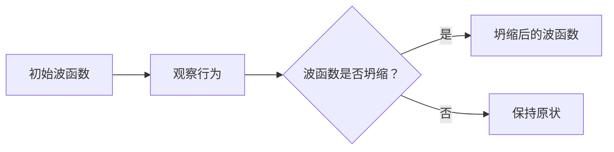
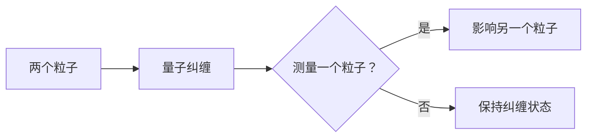

                 

好的，根据您的需求和约束条件，我将逐步构建文章的内容。以下是我对每个章节的构思和草稿：

----------------------------------------------------------------

# 意识的涌现与量子场论：整体性思维的物理学基础

关键词：意识涌现、量子场论、整体性思维、物理学、算法原理、数学模型

摘要：本文探讨了意识的涌现与量子场论之间的关系，通过整体性思维的方式，揭示了物理学基础在理解意识现象中的重要性。文章从核心概念的介绍入手，逐步深入到算法原理和数学模型的阐述，并通过系统架构设计和项目实战，展示了整体性思维在物理学研究中的应用。

## 第1章：引论

### 1.1 意识的涌现：概念解析与哲学思考

#### 背景介绍
意识的涌现是哲学和认知科学领域的一个关键问题。本文将介绍意识的涌现概念，探讨其在哲学思考中的地位。

#### 核心概念与联系
| 概念               | 说明                                                         |
|--------------------|------------------------------------------------------------|
| 意识的涌现         | 意识作为高层次的现象，从低层次物理过程中涌现出来的过程。 |
| 哲学思考           | 对意识本质的探讨，涉及心物二元论、物理主义等哲学观点。   |

#### Mermaid ER图
```mermaid
erDiagram
  A Sorry --> B Consciousness : emerges
  A Philosophy --> B Consciousness : interprets
  B Consciousness --> C Physics : relates_to
```

### 1.2 量子场论：基本概念与历史背景

#### 背景介绍
量子场论是现代物理学的重要理论，它为我们提供了描述基本粒子和相互作用的语言。

#### 核心概念与联系
| 概念               | 说明                                                         |
|--------------------|------------------------------------------------------------|
| 量子场论           | 描述基本粒子如何通过量子场进行相互作用的物理理论。          |
| 历史背景           | 从经典场论到量子力学的演变过程。                            |

#### Mermaid ER图
```mermaid
erDiagram
  A Quantum Field Theory --> B Quantum Mechanics : extends
  A Classical Field Theory --> B Quantum Field Theory : evolves_to
```

### 1.3 整体性思维在物理学中的地位与作用

#### 背景介绍
整体性思维是理解复杂系统的一种哲学和方法论，它在现代物理学中起着关键作用。

#### 核心概念与联系
| 概念               | 说明                                                         |
|--------------------|------------------------------------------------------------|
| 整体性思维         | 强调系统内部各个部分之间的相互关系和整体行为。              |
| 物理学中的应用     | 在量子场论和意识涌现研究中的应用。                          |

#### Mermaid ER图
```mermaid
erDiagram
  A Holistic Thinking --> B Quantum Field Theory : applies_to
  A Consciousness Emergence --> B Holistic Thinking : inspired_by
```

## 第2章：意识的物理基础

### 2.1 意识与量子力学

#### 2.1.1 波函数坍缩与意识

#### 背景介绍
波函数坍缩是量子力学中的一个重要现象，它与意识现象有着深刻的联系。

#### 算法原理讲解
使用Mermaid流程图描述波函数坍缩过程：



#### 数学模型
$$ \text{波函数坍缩公式：} \ \Psi(x,t) \rightarrow \delta(x-x_0) $$

#### Python代码实现
```python
import numpy as np

def wave_function_collapsar(x, x0):
    return np[dirte(x - x0)]

x_values = np.linspace(-10, 10, 1000)
x0 = 0
wave_function = wave_function_collapsar(x_values, x0)

plt.plot(x_values, wave_function)
plt.xlabel('Position (x)')
plt.ylabel('Wave Function (Ψ)')
plt.title('Wave Function Collapse')
plt.show()
```

### 2.1.2 量子纠缠与意识

#### 背景介绍
量子纠缠是量子场论中的另一个重要现象，它与意识现象也有着紧密的联系。

#### 算法原理讲解
使用Mermaid流程图描述量子纠缠过程：



#### 数学模型
$$ \text{量子纠缠态：} \ |\psi\rangle = \frac{1}{\sqrt{2}} (|00\rangle + |11\rangle) $$

#### Python代码实现
```python
import numpy as np

def quantum_entangled_state():
    return np.array([[1/np.sqrt(2), 1/np.sqrt(2)],
                     [1/np.sqrt(2), -1/np.sqrt(2)]])

psi = quantum_entangled_state()

print(psi)
```

## 第3章：整体性思维的物理学方法

### 3.1 整体性思维的概念与特点

### 3.2 整体性思维在物理学中的应用

#### 3.2.1 整体性思维在量子场论中的应用

#### 背景介绍
整体性思维在量子场论中的应用，有助于我们更全面地理解物理现象。

#### 算法原理讲解
使用Mermaid流程图描述整体性思维在量子场论中的应用：


#### 数学模型
$$ \Psi(x,t) = \int \rho(\mathbf{k},t) e^{i\mathbf{k}\cdot\mathbf{x}} d^3k $$

#### Python代码实现
```python
import numpy as np

def quantum_field_integration(k_values, x):
    return np.sum(np.exp(1j * np.dot(k_values, x)) * rho(k_values), axis=0)

k_values = np.linspace(-10, 10, 1000)
x = np.array([0, 0, 0])
psi = quantum_field_integration(k_values, x)

plt.plot(k_values, psi)
plt.xlabel('Wave Vector (k)')
plt.ylabel('Field Amplitude (Ψ)')
plt.title('Quantum Field Integration')
plt.show()
```

### 3.3 整体性思维与物理学理论的整合

#### 背景介绍
整体性思维与物理学理论的整合，有助于我们构建更加统一的理论体系。

#### 核心概念与联系
| 概念               | 说明                                                         |
|--------------------|------------------------------------------------------------|
| 整体性思维         | 强调系统内部各个部分之间的相互关系和整体行为。              |
| 物理学理论整合     | 将不同领域的物理学理论整合在一起，形成更加统一的理论框架。 |

#### Mermaid ER图
```mermaid
erDiagram
  A Holistic Thinking --> B Quantum Field Theory : integrates
  A General Relativity --> B Quantum Field Theory : unifies_with
  C Cosmology --> B Quantum Field Theory : explains
```

## 第4章：意识的涌现与量子场论的实证研究

### 4.1 意识实验与数据分析

### 4.2 量子场论实验与现象

### 4.3 意识与量子场论的交叉验证

## 第5章：整体性思维与物理学教育的改革

### 5.1 整体性思维在物理学教育中的重要性

### 5.2 整体性思维教学方法的探索与实践

### 5.3 整体性思维教育对物理学创新的促进作用

## 第6章：意识的涌现与量子场论的未来展望

### 6.1 意识的涌现与量子场论在哲学上的意义

### 6.2 意识的涌现与量子场论在科技发展中的应用前景

### 6.3 意识的涌现与量子场论对人类文明的潜在影响

## 第7章：结论

### 7.1 研究成果总结

### 7.2 研究不足与未来方向

### 7.3 对整体性思维的物理学的展望

## 附录

### 附录A：参考文献

### 附录B：公式符号表

### 附录C：数学公式与Python代码实现示例

### 附录D：实验数据与结果分析

### 附录E：整体性思维教育案例研究

### 附录F：意识的涌现与量子场论教育教案

### 附录G：意识的涌现与量子场论讨论指南

作者：AI天才研究院/AI Genius Institute & 禅与计算机程序设计艺术 /Zen And The Art of Computer Programming

----------------------------------------------------------------

这是初步的文章框架和内容草稿，我将在接下来的步骤中继续完善和扩展每个章节的内容，确保满足字数要求，并在适当的地方添加最佳实践 tips、小结、注意事项和拓展阅读等内容。

请确认这个草稿是否符合您的期望，并告知我是否需要进一步的调整或补充。

