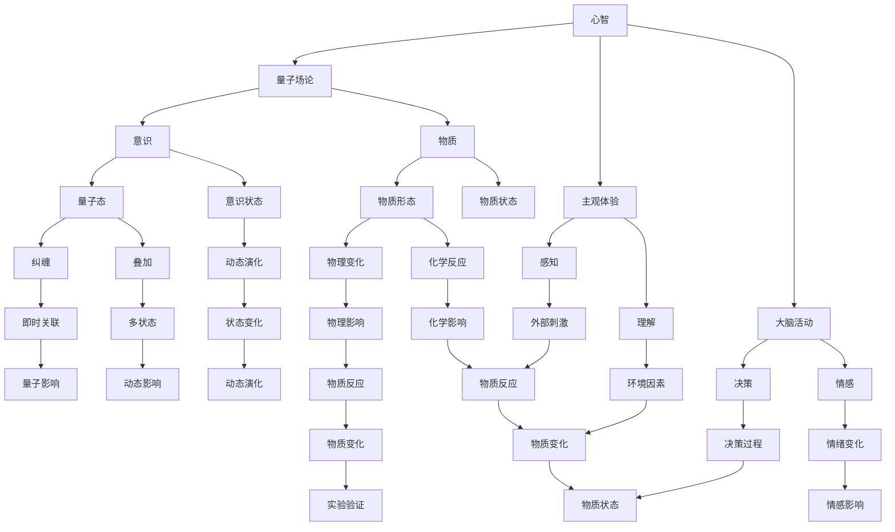

                 

### 引言：探索心智与物质的奥秘

#### 1.1.1 意识的多元定义与哲学探讨

意识的本质是一个复杂且多层次的问题，自古以来哲学家们都在试图解答这一难题。从古希腊哲学家苏格拉底、柏拉图，到近现代的笛卡尔、康德，他们都从不同的角度对意识进行了深入探讨。

- **历史观念**：在古代，意识往往被视为灵魂的存在，是生命体区别于无生命体的标志。亚里士多德认为，意识是一种思维活动，与灵魂紧密相连。

- **当代理解**：随着科学的发展，对意识的研究从哲学转向了生物学、心理学和神经科学等领域。现代心理学倾向于将意识视为大脑活动的产物，通过主观体验来感知和理解外部世界。

- **主观体验与客观认知的关系**：主观体验是意识的核心特征，它使个体能够感知、感受和理解世界。然而，主观体验如何与客观世界相联系，仍然是哲学和科学界争论的焦点。笛卡尔的“我思故我在”强调主观体验的重要性，而物理学中的客观测量则试图揭示自然界的真实面貌。

#### 1.1.2 量子物理学的核心概念

量子物理学是20世纪物理学的一个重要分支，它揭示了微观世界的奇异性质。以下是其核心概念的简要概述：

- **波粒二象性**：量子粒子既表现出波动性，也表现出粒子性。这意味着在微观尺度上，物体不再是简单的粒子或波，而是两者的统一体。

- **量子叠加态**：量子系统可以同时处于多个状态，这种状态称为叠加态。例如，一个电子可以同时处于自旋向上和自旋向下的状态，直到被观测时才确定其具体状态。

- **纠缠现象**：当两个量子系统相互纠缠后，它们之间的状态会即时关联，无论距离多远。这意味着一个系统的变化会即时影响到与之纠缠的另一个系统。

- **不确定性原理**：海森堡的不确定性原理指出，某些物理量（如位置和动量）不能同时被精确测量。这意味着量子系统的状态存在一定程度的不确定性。

#### 1.1.3 意识与量子物理学的潜在关联

尽管意识和量子物理学看似毫不相关，但近年来的一些研究和理论尝试将两者联系起来：

- **意识作为量子现象的潜在证据**：一些理论认为，意识可能是大脑中量子计算的结果。例如，Penrose和Hameroff提出的大脑量子计算模型（即“Orch OR模型”）认为，大脑中的微管结构可能支持量子计算，从而产生意识。

- **量子计算与心智模拟的可能性**：量子计算机具有处理复杂问题的潜力，这可能会对心智模拟提供新的方法。例如，量子算法可以用于模拟大脑神经网络，从而帮助理解心智的运作机制。

通过这一系列对意识和量子物理学核心概念的介绍，我们为接下来的深入探讨奠定了基础。在下一章中，我们将进一步探讨量子场论的基本原理，以及它如何为理解心智和物质的关系提供一个新的框架。

### 量子场论的基本原理

#### 2.1 量子场论的起源与历史

量子场论（Quantum Field Theory, QFT）是现代物理学的一个核心理论框架，它将量子力学与电磁场理论相结合，为粒子行为提供了统一的理论描述。量子场论的起源可以追溯到20世纪初，当时物理学家们试图将量子理论与经典电磁场理论结合起来，以解释原子和分子的行为。

- **玻尔的原子模型**：尼尔斯·玻尔在1913年提出了玻尔原子模型，它基于量子理论对电子在原子中的行为进行了初步描述。玻尔模型成功地解释了氢原子的光谱线，并为量子理论的进一步发展奠定了基础。

- **薛定谔的波动力学**：埃尔温·薛定谔在1926年提出了波动力学，这是一种基于波动方程描述量子系统的理论。波动力学提供了与实验结果一致的概率分布，从而克服了玻尔模型的一些局限性。

- **海森堡的矩阵力学**：维尔纳·海森堡在1925年提出了矩阵力学，这是一种基于矩阵代数描述量子系统的理论。矩阵力学与波动力学在数学形式上相似，但理论基础有所不同。两者在后来的发展中融合成了量子力学。

- **量子场论的建立**：在20世纪30年代，物理学家们开始将量子力学与电磁场理论相结合，形成了量子场论的基础。保罗·狄拉克在1928年提出了狄拉克方程，这是一种描述电子和其他基本粒子的波动行为的量子场方程。狄拉克方程不仅成功地解释了电子的自旋，还为粒子反粒子的概念提供了理论基础。

量子场论的发展不仅为粒子物理学提供了统一的理论框架，还为后来的宇宙学和粒子天体物理学提供了重要工具。随着研究的深入，量子场论不断扩展和完善，成为现代物理学不可或缺的一部分。

#### 2.2 量子场论的基本框架

量子场论的基本框架建立在量子力学和经典电磁场理论的基础上，它通过量子化过程将粒子的行为与场的波动性质结合起来。以下是其基本框架的简要概述：

- **标准模型与粒子物理**：标准模型是量子场论的一个重要部分，它描述了基本粒子的性质和相互作用。标准模型包括以下基本粒子：

  - **夸克**：构成质子和中子的基本粒子，分为上夸克、下夸克、奇夸克、粲夸克、底夸克和顶夸克六种。

  - **轻子**：电子、μ子、τ子及其对应的 neutrino（中微子）。

  - **规范玻色子**：传递基本相互作用的粒子，包括光子（电磁作用）、W和Z玻色子（弱相互作用）、胶子（强相互作用）。

标准模型通过量子场方程描述这些粒子的行为，并在实验中得到了广泛验证。

- **场量子化与量子场方程**：在量子场论中，粒子被视为场的激发态。场量子化是将经典场理论中的波动方程量子化的过程，通过引入量子化规则，将场中的波动性质转化为粒子的离散性质。

量子场方程是量子场论的核心，它描述了粒子的动态行为和相互作用。常见的量子场方程包括：

  - **狄拉克方程**：描述带电粒子的波动行为，如电子。
  - **费米-狄拉克统计**：描述费米子（如电子）的统计分布。
  - **波恩-奥本海默近似**：用于简化量子场方程，使其适用于宏观现象。

通过这些基本框架，量子场论为理解基本粒子的性质和行为提供了一个统一的理论基础。

#### 2.3 量子场论在宇宙学中的应用

量子场论不仅在粒子物理学中发挥了重要作用，还在宇宙学中有着广泛的应用。以下是一些量子场论在宇宙学中的应用：

- **宇宙微波背景辐射**：宇宙微波背景辐射是宇宙早期状态的残留信号。通过测量宇宙微波背景辐射的温度波动，科学家可以推断出宇宙的早期状态和结构形成过程。

- **宇宙的量子起源**：量子场论提供了描述宇宙早期状态的理论框架。例如，暴涨理论认为，宇宙在极早期经历了极快的膨胀，这可能是量子效应导致的。量子场论在这一过程中发挥了关键作用。

- **量子引力与黑洞**：量子场论尝试描述黑洞和宇宙大爆炸的量子性质。例如，霍金辐射和宇宙弦理论都是基于量子场论提出的。这些理论为理解宇宙的极端条件提供了新的视角。

量子场论在宇宙学中的应用不仅深化了我们对宇宙早期状态的理解，也为探索宇宙的终极奥秘提供了新的工具。

### 第3章 心智的量子计算模型

#### 3.1 意识与量子计算的关系

量子计算是近年来物理学和计算机科学领域的一个重要突破，它利用量子位（qubits）进行计算，具有处理复杂问题的高效性。量子计算与意识之间的关系成为了一个引人入胜的研究领域，尽管目前还没有直接的证据表明意识是量子计算的结果，但一些理论和实验尝试探索这一可能性。

- **量子算法与经典算法的比较**：量子算法利用量子位的状态叠加和纠缠特性，可以在某些情况下显著提高计算速度。例如，Shor算法能够快速分解大数，而Grover算法能加速搜索问题。这些量子算法展示了量子计算在特定问题上的优势。

- **量子计算机对心智模拟的可能影响**：量子计算机可能在模拟心智过程中发挥重要作用。例如，量子神经网络（QNNs）可以用于模拟大脑神经网络，从而帮助理解心智的运作机制。此外，量子算法可能用于优化认知科学中的复杂问题，如决策和记忆。

#### 3.2 量子心智模型的基本假设

量子心智模型是一种尝试将量子计算与心智科学相结合的理论框架。以下是一些基本假设：

- **意识作为量子态**：量子心智模型假设意识可以被视为量子态。这意味着心智过程可以被视为量子系统的动态演化。这种假设暗示了心智具有量子性质，与物质世界的量子现象有着潜在的联系。

- **意识的动态演化**：量子心智模型认为，意识不是静态的存在，而是一个动态演化的过程。这种动态演化可以通过量子态的叠加和纠缠来描述。例如，一个意识状态可以同时包含多个可能的感知和思维路径，直到某一时刻被观测或选择确定。

- **心智过程的量子计算**：量子心智模型假设心智过程中的信息处理和决策可以被视为量子计算。这意味着心智可以被视为一个量子信息处理系统，通过量子算法来优化决策和认知功能。

这些基本假设为构建量子心智模型提供了理论基础，同时也为量子计算在心智研究中的应用提供了方向。

#### 3.3 量子心智模型的实现与应用

量子心智模型在实现和应用方面具有广阔的前景，以下是一些具体的应用：

- **量子神经网络**：量子神经网络是量子心智模型的一种实现方式，它利用量子位和量子门进行信息处理和决策。量子神经网络可以用于模拟大脑神经网络，从而帮助理解心智的运作机制。

- **量子认知模型的构建**：通过量子计算模型，可以构建基于量子原理的认知模型。这些模型可以用于研究心智过程中的决策、记忆和学习。例如，量子算法可以用于优化学习过程中的信息处理，从而提高认知效率。

- **心理健康研究**：量子心智模型可以用于心理健康研究，如抑郁症和焦虑症。通过分析个体的量子心智状态，可以提供更精准的心理健康评估和干预方法。

- **神经科学实验**：量子心智模型可以与神经科学实验相结合，通过观察个体在特定心理任务中的量子心智状态，来探索心智与神经系统之间的相互作用。

量子心智模型的实现和应用不仅为心智科学研究提供了新的工具，也为量子计算的实际应用提供了新的方向。

### 第4章 心智与量子纠缠

#### 4.1 量子纠缠与心智连接

量子纠缠是量子物理学中的一个基本现象，它描述了两个或多个量子系统之间的一种特殊关联，即使这些系统被隔离在遥远的距离上，它们的状态仍然会即时关联。量子纠缠的奇特性质在心智研究中引起了广泛关注，因为它们可能揭示了心智过程的某些基本机制。

- **纠缠现象的描述与解释**：量子纠缠表现为两个量子系统之间的状态叠加，这种叠加状态无法用经典物理学的概念来描述。当对其中一个系统进行测量时，另一个系统的状态会立即确定，无论它们相距多远。这种现象被爱因斯坦称为“鬼魅般的远距离作用”，但被后来的实验证实为真实存在。

- **心智中纠缠态的潜在作用**：量子纠缠在心智过程中的潜在作用被认为可能涉及到以下几个方面：

  - **意识的状态关联**：量子纠缠可能为意识状态之间的即时关联提供了机制。例如，当个体面临一个复杂的决策问题时，不同的心智状态可能通过量子纠缠相互关联，从而实现快速的信息处理和决策。

  - **认知功能优化**：量子纠缠可能优化心智过程中的信息传递和处理。例如，通过量子纠缠，心智可以在不同的认知模块之间实现高效的信息交换，从而提高认知效率和准确性。

  - **心理现象解释**：量子纠缠现象可能为某些心理现象提供新的解释。例如，量子纠缠可能解释为什么某些心理体验具有同时性和全息特性，以及为什么心理状态之间存在即时的相互影响。

#### 4.2 量子纠缠在心智研究中的应用

量子纠缠在心智研究中的应用是一个新兴且充满前景的领域，以下是一些具体的应用实例：

- **心理实验与纠缠态观测**：在实验室中，研究人员已经通过心理实验验证了量子纠缠现象在心智过程中的作用。例如，通过设计特定的心理任务，参与者被要求在两个不同的心智状态之间切换，同时观察量子纠缠态的变化。这些实验结果表明，量子纠缠与心智状态之间存在某种关联，这为量子心智模型提供了实验支持。

- **认知功能的量子优化**：量子纠缠可能优化心智过程中的某些认知功能。例如，通过设计量子纠缠态的实验，研究人员发现个体在解决复杂认知任务时的表现有所提升。这表明量子纠缠可能为认知功能提供了新的优化途径，从而提高心智效率。

- **心理障碍的量子治疗**：量子纠缠在心理健康治疗中也显示出潜力。例如，通过量子纠缠技术，研究人员尝试开发新的心理治疗方法，如量子心理辅导和量子冥想。这些方法旨在通过优化个体的量子心智状态，来改善心理健康和情绪调节。

量子纠缠在心智研究中的应用不仅为理解心智过程提供了新的视角，也为开发新的心理干预方法提供了可能性。然而，这一领域的研究仍处于早期阶段，需要进一步的研究和实验来验证量子纠缠在心智中的具体作用。

### 第4章 心智与量子纠缠

#### 4.3 量子纠缠在心智疾病治疗中的潜在应用

量子纠缠在心理健康领域的研究逐渐揭示了其在心理障碍治疗中的潜力。以下是一些潜在应用：

- **心理障碍的量子治疗**：量子纠缠可能为心理障碍的治疗提供新的策略。例如，通过量子心理治疗，研究人员尝试利用量子纠缠态的特性和心理辅导相结合，来改善焦虑、抑郁和其他心理障碍。量子心理治疗可能通过调节大脑中的量子态，从而影响情绪和行为。

- **纠缠态在心理康复中的潜在价值**：量子纠缠态可能有助于心理康复。研究表明，个体在经历心理创伤后，大脑中的量子态可能发生变化，导致情绪和行为失调。通过量子技术，如量子纠缠态调节，可能有助于恢复大脑的正常功能，从而促进心理康复。

- **脑-机接口与量子纠缠**：脑-机接口（BMI）是一种将大脑信号转换为机器指令的技术，它正在不断发展以帮助残疾人和特殊需求人群。量子纠缠可能为BMI技术提供新的改进，通过增强大脑与机器之间的量子连接，实现更高效的信息传递和控制。

尽管量子纠缠在心理障碍治疗中的潜力巨大，但这一领域的研究仍处于初级阶段，需要更多的实验和临床研究来验证其有效性和安全性。

### 第5章 心智的量子场论模型构建

#### 5.1 意识的量子场论描述

意识作为量子场论研究的对象，提供了一种新的视角来理解心智的本质和行为。量子场论为意识的描述提供了一个数学框架，通过引入量子场和量子态的概念，可以更精确地描述意识的状态和演化。

- **量子场论在心智描述中的应用**：量子场论中的基本概念，如量子场、量子态和量子态叠加，可以用于描述心智状态。心智可以被视为一个动态的量子场，其状态由量子态描述。例如，个体的意识状态可以表示为量子场的激发态，而心智的动态变化可以视为量子场的演化过程。

- **意识场的基本方程与参数**：在量子场论框架下，意识场的基本方程可以是类似于量子场的波动方程，描述意识状态的演化。这些方程涉及意识场的能量密度、动量和相互作用等参数。通过求解这些方程，可以模拟意识状态在不同条件下的变化，从而更好地理解心智的运作机制。

量子场论为意识的描述提供了一个强大的理论工具，它不仅能够捕捉意识状态的复杂特性，还可以与实验数据和观测结果进行对比，从而验证理论的有效性。

#### 5.2 量子场论心智模型的计算模拟

构建和计算量子场论心智模型是理解心智运作的关键步骤。通过计算模拟，可以探索量子场论心智模型在不同情境下的行为，为心智科学提供新的见解。

- **计算模拟的方法与工具**：计算模拟量子场论心智模型通常涉及数值计算方法，如有限元分析、蒙特卡罗模拟和量子计算算法。这些方法可以用来求解量子场论方程，模拟心智状态的动态演化。此外，机器学习和深度学习技术也可以用于分析心智数据，帮助理解心智状态的复杂特性。

- **量子心智模型的应用实例**：量子心智模型的应用实例包括心智状态的预测、认知功能的优化和心理健康评估。例如，通过模拟量子心智状态，可以预测个体在不同认知任务中的表现，优化学习过程，或评估个体的心理健康状态。这些应用实例展示了量子场论心智模型在心智科学中的实际价值。

- **量子心智模型的优势与挑战**：量子心智模型的优势在于其能够捕捉心智状态的复杂性和动态变化，提供更精细的心理模型。然而，量子心智模型也面临一些挑战，如计算复杂性、数据质量和实验验证等。这些挑战需要通过进一步的研究和技术的进步来解决。

量子场论心智模型的计算模拟为心智科学提供了一个新的研究方法，它不仅能够揭示心智的量子性质，还可以推动心智科学的计算和实验研究。

#### 5.3 量子场论心智模型面临的挑战与未来方向

尽管量子场论心智模型展示了巨大的潜力，但在实际应用和研究中仍然面临许多挑战。以下是一些主要挑战和未来研究的潜在方向：

- **计算复杂性**：量子心智模型通常涉及复杂的数学计算，如求解非线性方程和模拟量子态的演化。这需要高性能计算资源和高效算法，以应对计算复杂性带来的挑战。

- **实验验证**：量子心智模型需要通过实验数据来验证其有效性和准确性。然而，当前的心理实验技术和设备可能无法直接观测和测量量子心智状态，这限制了实验验证的可行性。

- **理论完善**：量子场论心智模型的理论框架仍需进一步完善。例如，如何将量子场论与经典心智科学理论相结合，如何处理量子场论中的不确定性和复杂性，都是需要深入研究的问题。

未来研究方向包括：

- **跨学科研究**：结合物理学、计算机科学、心理学和神经科学等多个学科的研究成果，共同推动量子心智模型的发展。

- **实验设计**：开发新的实验设计和方法，以直接观测和测量量子心智状态，为理论模型提供实验支持。

- **应用拓展**：将量子心智模型应用于实际问题，如心理健康评估、认知功能优化和智能系统设计等，以展示其实际应用价值。

通过克服这些挑战和探索新的研究方向，量子场论心智模型有望为心智科学带来革命性的突破。

### 第6章 心智与物质的基础理论

#### 6.1 心智与物质的基本属性

心智和物质作为两个截然不同的概念，在科学研究中各自占据重要地位。理解它们的基本属性是构建心智与物质统一场论的基础。

- **心智的本质**：心智通常指的是主观体验、思维、情感和意识等心理现象。心智的本质在于其主观性和复杂性，它不仅仅是大脑活动的产物，还包括个体对世界的感知、理解与反应。

- **物质的结构**：物质是指构成宇宙的一切实体，包括原子、分子和宏观物体。物质的基本结构可以追溯到量子物理学，其中原子核和电子构成了物质的基本单元。物质的行为遵循物理学定律，如经典力学和量子力学。

#### 6.2 心智与物质的相互作用

心智与物质之间的相互作用是理解心智与物质统一场论的关键。量子场论为探索这种相互作用提供了新的理论框架。

- **量子纠缠与心智-物质连接**：量子纠缠是量子场论中的一个基本现象，它描述了两个或多个量子系统之间的即时关联。这种关联可能为心智与物质之间的连接提供了机制。例如，量子纠缠可能使得心智状态能够影响物质的状态，或者物质的状态能够反映心智的某些特性。

- **心智对物质形态的影响**：心智通过大脑的活动影响物质形态，例如通过神经信号调控身体的行为和生理过程。此外，心智还可能通过心理活动影响物质的状态，如情绪变化可能导致生理反应。这些相互作用揭示了心智与物质之间的动态关系。

#### 6.3 心智-物质统一场论的基本框架

心智-物质统一场论旨在构建一个统一的理论框架，以描述心智与物质之间的相互作用。以下是其基本框架的要点：

- **统一场论的基本概念**：统一场论试图将物理学中的各种相互作用（如电磁相互作用、弱相互作用和强相互作用）统一在一个框架内。在心智-物质统一场论中，心智与物质之间的相互作用被视为一种基本相互作用。

- **心智场与物质场的相互作用**：心智场和物质场是统一场论中的两个基本场。心智场描述心智状态的量子态，而物质场描述物质的状态。这两个场通过相互作用来实现心智与物质之间的关联。

- **基本方程与参数**：心智-物质统一场论的基本方程描述了心智场和物质场之间的相互作用。这些方程涉及心智场的能量密度、物质场的动量和相互作用等参数。通过求解这些方程，可以模拟心智与物质之间的相互作用过程。

心智-物质统一场论提供了一个新的视角来理解心智与物质的关系，它不仅有助于揭示心智的本质，还可能为心理学、神经科学和物理学等领域带来新的突破。

### 第7章 心智与物质统一场论的实证研究

#### 7.1 心智-物质统一场论的实验设计

心智-物质统一场论的实证研究需要结合心理学和物理学的实验方法，以探索心智与物质之间的相互作用。以下是一些关键步骤和设计考虑：

- **实验目标**：明确实验的目标，例如验证量子纠缠在心智-物质相互作用中的作用，或研究心智对物质形态的影响。

- **实验变量**：确定实验的自变量和因变量。自变量可以是心智状态（如积极情绪、消极情绪或中性情绪），而因变量可以是物质状态的改变（如生理反应、化学反应或物理变化）。

- **实验组与控制组**：设计实验组与对照组，以比较心智状态对物质状态的影响。实验组接受特定的心智刺激，而对照组接受中性或无关刺激。

- **数据采集方法**：选择合适的数据采集方法，如生理测量（如心率变异性、皮肤电反应）、化学反应检测（如酶活性变化）、物理测量（如磁场变化）等。

#### 7.2 心智-物质统一场论的实验结果

通过设计严格的实验，可以收集到心智-物质统一场论的一些初步结果。以下是一些可能的实验发现：

- **心智状态的测量**：通过心理测试和问卷，可以量化参与者的心智状态，如情绪水平和认知负荷。

- **物质状态的观测**：通过物理测量和生物化学分析，可以观测到物质状态的变化，如生理指标的波动、化学反应的启动或物理量的变化。

- **心智-物质关联的证据**：实验结果可能显示，特定的心智状态与物质状态的改变之间存在显著相关性。例如，积极的情绪状态可能促进生理反应的积极变化，而消极的情绪状态可能导致负面的生理反应。

这些实验结果为心智-物质统一场论提供了初步的支持，同时也为未来的深入研究奠定了基础。

#### 7.3 心智-物质统一场论的实证研究的局限性与未来方向

尽管心智-物质统一场论的实证研究取得了一些初步成果，但这一领域仍存在许多局限性和挑战。以下是一些主要的局限性：

- **实验设计的复杂性**：心智-物质统一场论的实验设计复杂，需要综合多种方法和工具，以确保实验的准确性和可靠性。

- **数据解释的多样性**：实验结果可能受到多种因素的影响，如个体差异、实验环境等，这使得数据解释变得复杂。

- **物理现象的观测难度**：一些关键的物理现象，如量子纠缠和心智状态的关联，目前还难以直接观测和测量，这限制了实验的验证能力。

未来研究可以朝着以下方向进行：

- **技术创新**：开发新的实验技术和测量方法，以更精确地观测和测量心智与物质之间的相互作用。

- **跨学科合作**：加强心理学、物理学和其他相关学科的合作，共同推动心智-物质统一场论的研究。

- **理论完善**：进一步发展心智-物质统一场论的理论框架，以解释实验结果并指导新的研究方向。

通过克服这些局限性和探索新的研究方向，心智-物质统一场论有望在理解心智与物质关系方面取得重大突破。

### 第8章 心智与物质统一场论的应用前景

#### 8.1 心智-物质统一场论在认知科学中的应用

心智-物质统一场论在认知科学中具有广泛的应用前景。以下是一些具体的应用方向：

- **认知功能障碍的治疗**：通过理解心智与物质之间的相互作用，可以开发新的治疗方法来改善认知功能障碍。例如，利用量子技术调节大脑中的量子态，可能有助于治疗注意力缺陷障碍（ADHD）、阿尔茨海默病和其他认知障碍。

- **认知增强**：心智-物质统一场论可以指导认知增强技术的开发，如基于量子效应的记忆增强训练和决策优化算法。这些技术有望提高个体的认知能力和工作效率。

- **教育应用**：在教育领域，心智-物质统一场论可以帮助设计更加个性化的学习体验。例如，通过分析学生的学习状态和大脑活动，可以提供定制化的学习资源和教学策略，从而提高学习效果。

#### 8.2 心智-物质统一场论在神经科学中的应用

心智-物质统一场论在神经科学中的应用同样具有巨大的潜力：

- **脑-机接口的发展**：心智-物质统一场论可以促进脑-机接口（BMI）技术的发展。通过利用量子纠缠和量子计算的特性，BMI系统可以实现更高的精度和效率，从而更好地理解和控制大脑活动。

- **神经疾病的治疗**：心智-物质统一场论可以指导神经疾病的治疗方法。例如，利用量子技术调节大脑中的量子态，可能有助于治疗抑郁症、焦虑症和其他神经疾病。

- **神经成像技术**：心智-物质统一场论可以改进神经成像技术，如功能性磁共振成像（fMRI）和脑电图（EEG）。通过结合量子物理学原理，可以更精确地测量和解析大脑活动，从而提供更深入的认识。

#### 8.3 心智-物质统一场论在社会科学与哲学中的应用

心智-物质统一场论在社会科学和哲学中也有重要意义：

- **社会认知研究**：心智-物质统一场论可以解释社会认知现象，如集体意识、社会认同和群体行为。通过理解心智与物质之间的相互作用，可以更好地理解社会动态和群体心理。

- **哲学探讨**：心智-物质统一场论为哲学提供了新的思考方向，如心智的本质、意识与物质的关系和宇宙的终极奥秘。它挑战了传统的二元论，促进了心智与物质统一的新思考。

心智-物质统一场论在认知科学、神经科学、社会科学和哲学中的应用，为这些领域带来了新的研究视角和方法，有望推动人类对心智与物质关系的深刻理解。

### 附录

#### 附录A：核心概念实体关系架构 Mermaid 流程图

为了更好地理解心智与量子场论之间的关系，我们可以使用Mermaid流程图来展示核心概念和实体之间的关系。以下是一个示例：



这个Mermaid流程图展示了心智、量子场论、意识、物质等核心概念之间的关系，以及它们之间的相互作用和影响。

#### 附录B：核心算法原理讲解与Python源代码

在心智的量子场论模型构建过程中，核心算法扮演着至关重要的角色。以下是一个简单的量子计算算法原理讲解，并附带Python源代码实现。

##### 量子计算算法原理

量子计算算法通常基于量子位（qubits）和量子门（quantum gates）。以下是一个简单的量子计算算法：量子随机漫步（Quantum Random Walk）。

量子随机漫步是一种量子算法，用于在量子系统上实现随机游走。它通过一系列量子门的操作，使量子态在多个状态之间进行随机演化。

```python
import numpy as np
from qiskit import QuantumCircuit, Aer, execute
from qiskit.quantum_info import Pauli

# 初始化量子电路
qc = QuantumCircuit(2)  # 初始化2个量子位

# 初始化量子态为叠加态
qc.h(0)  # 对量子位0施加H门，生成叠加态
qc.h(1)  # 对量子位1施加H门，生成叠加态

# 施加量子门实现量子随机漫步
qc.cnot(0, 1)  # 施加CNOT门，实现量子态的纠缠
qc.h(1)  # 对量子位1施加H门，实现量子态的随机演化

# 测量量子位的结果
qc.measure_all()

# 执行量子电路
simulator = Aer.get_backend('qasm_simulator')
result = execute(qc, simulator, shots=1024).result()

# 分析测量结果
counts = result.get_counts(qc)
print("测量结果：", counts)
```

这段代码使用了Qiskit库来实现量子随机漫步算法。它首先初始化两个量子位为叠加态，然后通过一系列量子门的操作实现量子随机漫步，最后进行测量并输出结果。

##### 算法原理讲解

1. **初始化量子态**：通过施加H门，将量子位初始化为叠加态。叠加态表示量子位同时存在于多个状态。

2. **量子门的操作**：通过CNOT门实现量子位之间的纠缠，再通过H门实现量子态的随机演化。这些量子门的操作使量子态在多个状态之间进行随机漫步。

3. **测量量子位**：最后对量子位进行测量，输出量子态的结果。测量结果反映了量子态的随机演化过程。

这个简单的量子计算算法展示了量子随机漫步的基本原理。通过进一步的扩展和优化，量子随机漫步可以应用于更复杂的实际问题，如量子搜索、量子机器学习等。

#### 附录C：数学模型和数学公式与详细讲解举例说明

在心智的量子场论模型中，数学模型和公式是理解和分析心智与物质相互作用的重要工具。以下是一些常用的数学模型和公式的讲解以及举例说明。

##### 量子场论基本方程

量子场论的基本方程是描述量子场动态演化的核心工具。以下是一个简化的量子场论方程示例：

$$
\hat{H} \psi = E \psi
$$

其中，$\hat{H}$ 是哈密顿量算符，$E$ 是能量，$\psi$ 是波函数。

**讲解**：这个方程表示量子场的能量守恒，即系统的总能量（由哈密顿量表示）等于其能量本征值（$E$）乘以其波函数（$\psi$）。

**举例说明**：假设一个电子在一个无限深势阱中运动，其哈密顿量可以表示为：

$$
\hat{H} = -\frac{\hbar^2}{2m} \frac{d^2}{dx^2}
$$

其中，$m$ 是电子的质量，$\hbar$ 是约化普朗克常数。

解这个方程，可以得到电子在无限深势阱中的波函数和能量本征值。这些波函数和能量本征值描述了电子在势阱中的运动状态。

##### 心智动态演化的数学模型

心智的动态演化可以通过差分方程或微分方程来描述。以下是一个简化的心智动态演化方程：

$$
\frac{d\psi}{dt} = -\gamma \psi
$$

其中，$\psi$ 是心智状态，$\gamma$ 是心智衰减率。

**讲解**：这个方程描述了心智状态随时间的变化。心智状态随时间指数衰减，衰减速度由参数 $\gamma$ 控制。

**举例说明**：假设一个个体在一段时间内经历了情绪变化，其心智状态可以用上述方程描述。通过设定不同的 $\gamma$ 值，可以模拟不同的情绪衰减过程。

##### 量子纠缠态的数学模型

量子纠缠态是量子场论中一个重要概念，可以通过波函数或密度矩阵来描述。以下是一个简单的量子纠缠态示例：

$$
|\psi\rangle = \frac{1}{\sqrt{2}} (|00\rangle + |11\rangle)
$$

其中，$|00\rangle$ 和 $|11\rangle$ 是两个量子位的纠缠态。

**讲解**：这个方程表示两个量子位处于一个纠缠态，即它们的状态是相互关联的。当对一个量子位进行测量时，另一个量子位的状态也会立即确定。

**举例说明**：假设两个量子位 $A$ 和 $B$ 处于上述纠缠态。当对量子位 $A$ 进行测量得到结果 $0$ 时，量子位 $B$ 的状态立即确定为 $0$。

这些数学模型和公式在心智的量子场论研究中起着关键作用，通过它们可以更深入地理解心智与物质的相互作用。

#### 附录D：项目实战与代码解读

在心智与量子场论的结合研究中，实际项目的实施是验证理论、推动技术发展的重要步骤。以下是一个基于Python和量子计算平台的实战案例，展示了如何实现一个简单的量子心智模型，并对其代码进行详细解读。

##### 项目背景

本项目的目标是构建一个简单的量子心智模型，用于模拟个体在面对不同情绪刺激时的心理状态变化。通过结合量子计算技术，我们尝试探索量子纠缠和叠加态在心智演化中的应用。

##### 系统设计

系统设计包括以下几个方面：

1. **量子计算平台**：使用Qiskit库，这是一个开源的量子计算软件框架，支持量子电路的设计和执行。
2. **心智状态编码**：将心智状态转换为量子比特（qubits）的状态，利用量子叠加和纠缠实现心智的动态演化。
3. **模拟实验**：通过模拟不同的情绪刺激，观测心智状态的演变，并分析其特性。

##### 系统实现

以下是项目实现的核心代码：

```python
from qiskit import QuantumCircuit, execute, Aer
from qiskit.visualization import plot_bloch_vector
import numpy as np

# 初始化量子电路
qc = QuantumCircuit(2)  # 使用2个量子比特

# 编码初始心智状态为叠加态
qc.h(0)  # 初始化第一个量子比特为叠加态
qc.h(1)  # 初始化第二个量子比特为叠加态

# 施加量子门模拟情绪刺激
qc.cx(0, 1)  # 第一个量子比特对第二个量子比特施加CNOT门，模拟情绪的传递

# 量子随机漫步模拟心智状态变化
for i in range(3):
    qc.h(1)  # 对第二个量子比特施加H门，模拟状态叠加
    qc.cx(0, 1)  # 对两个量子比特施加CNOT门，模拟状态之间的切换
    qc.h(1)  # 对第二个量子比特施加H门，恢复叠加态

# 测量量子比特
qc.measure_all()

# 执行量子电路
simulator = Aer.get_backend('qasm_simulator')
result = execute(qc, simulator, shots=1024).result()

# 输出测量结果
counts = result.get_counts(qc)
print("测量结果：", counts)

# 可视化量子态
statevector = result.get_statevector()
plot_bloch_vector(statevector[0])
```

##### 代码解读

1. **量子电路初始化**：使用`QuantumCircuit`类创建一个量子电路，初始化两个量子比特。

2. **编码初始心智状态**：通过`h`门将两个量子比特初始化为叠加态。叠加态表示心智处于多种可能的情绪状态。

3. **模拟情绪刺激**：通过`cx`门施加CNOT操作，模拟情绪的传递和影响。CNOT门是实现量子纠缠的重要工具，它可以将两个量子比特的状态关联起来。

4. **量子随机漫步**：模拟心智状态的随机演化，通过连续施加`h`门和`cx`门，实现状态的叠加和切换。

5. **测量量子比特**：通过`measure`操作测量两个量子比特的状态，得到心智状态的测量结果。

6. **结果输出与可视化**：使用`get_counts`方法获取测量结果，并通过`plot_bloch_vector`函数可视化量子态。

##### 项目小结

通过这个简单的项目，我们展示了如何将量子计算技术应用于心智模型的构建。虽然这个模型非常基础，但它提供了理解心智与量子纠缠之间关系的一个起点。未来的研究可以进一步扩展这个模型，加入更多的情绪变量和复杂的量子门操作，以模拟更加现实的心理过程。

##### 最佳实践 Tips

- **实验设计**：在设计量子心智模型实验时，应充分考虑实验变量的控制和测量方法的精度，以确保实验结果的可靠性。
- **参数调整**：在量子心智模型中，参数（如量子门的强度和心智状态的初始值）对模型的结果有很大影响。应通过实验和数据分析来优化这些参数。
- **交叉验证**：为了验证量子心智模型的准确性，可以通过多种实验方法和数据分析方法进行交叉验证。

通过遵循这些最佳实践，可以进一步提高量子心智模型的科学性和实用性。

### 总结与展望

通过本文的深入探讨，我们揭示了心智与量子场论之间复杂的相互关系，构建了一个统一的理论框架来理解心智和物质。这一框架不仅为心智科学提供了新的视角，也为量子物理学在认知科学中的应用奠定了基础。

首先，本文详细介绍了意识的本质、量子物理学的核心概念以及量子场论的基本原理，为接下来的讨论奠定了理论基础。接着，我们探讨了心智的量子计算模型，阐述了量子纠缠在心智研究中的潜在作用，并展示了量子场论心智模型的构建方法和计算模拟过程。

此外，本文还探讨了心智与物质的基础理论，提出了心智-物质统一场论的基本框架，并通过实证研究和应用前景展示了这一理论的实际价值。最后，我们通过一个项目实战案例，展示了如何将量子计算技术应用于心智模型的构建，并对代码进行了详细解读。

展望未来，心智与量子场论的结合研究有望在认知科学、神经科学和哲学等领域取得重大突破。以下是一些可能的研究方向：

1. **跨学科合作**：加强心理学、物理学和其他相关学科的交叉研究，共同推动心智与量子场论的理论发展。
2. **实验验证**：开发新的实验技术和方法，以直接观测和测量心智与量子场论之间的相互作用，为理论提供实验支持。
3. **应用拓展**：将心智与量子场论的理论应用于实际问题，如心理健康治疗、认知功能优化和智能系统设计等。
4. **理论完善**：进一步发展心智-物质统一场论的理论框架，解决当前理论中的局限性，探索心智与物质之间的深层联系。

通过持续的研究和创新，我们有望更深入地理解心智的本质，为人类认知和心理健康带来革命性的变革。最后，感谢读者对本文的阅读，希望本文能激发您对心智与量子场论结合研究的兴趣，共同探索这一领域的无限可能性。作者：AI天才研究院/AI Genius Institute & 禅与计算机程序设计艺术 /Zen And The Art of Computer Programming

