                 

# 意识的量子场：思维与环境互动的新模型

## 关键词

- 意识
- 量子场
- 思维模型
- 环境互动
- 新模型

## 摘要

本文旨在探讨意识与量子场理论的关联，并提出一种新的模型——意识的量子场模型，用以解释思维与环境之间的互动。首先，本文回顾了意识的本质及其在不同领域的多样性，接着介绍了量子场理论的基本原理及其在意识研究中的应用。随后，本文探讨了思维的过程及其模型，并分析了环境因素对思维的影响。在此基础上，本文构建了意识的量子场模型，详细阐述了其基本原理和应用场景。接着，本文介绍了实验研究的原则与方法，以及意识量子场模型在心理学领域的应用和验证。最后，本文对意识量子场模型的发展趋势和挑战进行了展望，并总结了全文的主要发现和启示。

## 第一部分：引言与背景

### 第1章：意识的本质

### 1.1 意识的定义与多样性

**核心概念术语说明**

- **意识**：个体对自己内在与外在世界的感知、认知和体验。
- **量子场**：一个物理学概念，描述了基本粒子如何通过波动形式在空间中相互作用。

**问题背景**

意识的本质一直是哲学、心理学和神经科学等学科探讨的核心问题。然而，尽管已有大量研究，但至今仍未形成一个统一的理论模型。量子场理论作为物理学的重要分支，近年来在意识研究中逐渐引起关注，为探索意识的本质提供了一种新的视角。

**问题描述**

本文旨在探讨量子场理论如何帮助我们理解意识的本质，并提出一种新的模型——意识的量子场模型，以解释思维与环境之间的互动。

**问题解决**

本文将从以下几个方面进行探讨：

1. 回顾意识的定义与多样性。
2. 介绍量子场理论的基本原理。
3. 分析思维的过程及其模型。
4. 探讨环境因素对思维的影响。
5. 构建意识的量子场模型。

**边界与外延**

本文主要关注意识的量子场模型，但意识的研究还涉及其他领域，如心理学、神经科学和哲学等。

**概念结构与核心要素组成**

- **意识**：包括感知、认知、体验等维度。
- **量子场**：基本粒子、波粒二象性、量子纠缠等。
- **思维模型**：认知过程、信息处理、神经机制等。
- **环境互动**：物理环境、社会文化环境、心理环境等。

### 1.2 意识的研究现状

**核心概念与联系**

- **传统心理学**：主要研究意识的心理现象，如感知、记忆、思考等。
- **认知科学**：从信息处理的视角研究意识，包括认知过程、神经机制等。
- **量子物理学**：研究基本粒子的行为，近年来开始探索量子现象与意识的关系。

**概念属性特征对比表格**

| 研究领域 | 研究重点 | 方法论 | 代表人物 |
| --- | --- | --- | --- |
| 传统心理学 | 心理现象 | 实验心理学、行为观察 | James、Wundt |
| 认知科学 | 信息处理 | 认知心理学、计算模型 | Newell、Simon |
| 量子物理学 | 基本粒子 | 量子力学、实验验证 | Einstein、Bohr |

**ER实体关系图架构**

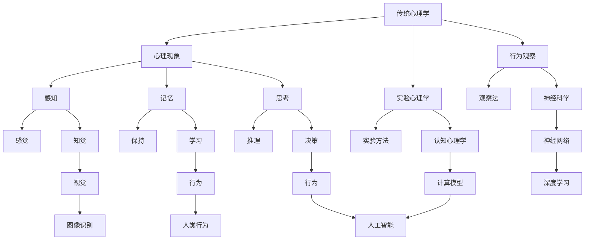

**背景介绍**

- **传统心理学**：自19世纪末以来，心理学逐渐成为一门独立学科，主要研究心理现象，如感知、记忆、思考等。其中，感知研究个体的感觉和知觉，记忆研究信息的储存和提取，思考研究问题解决和决策过程。
- **认知科学**：20世纪中叶，认知科学开始兴起，旨在从信息处理的视角研究人类思维。认知科学包括认知心理学、计算模型和神经科学等多个分支。认知心理学研究认知过程，如感知、记忆、思考等，计算模型试图模拟人类思维过程，神经网络研究大脑的神经机制。
- **量子物理学**：量子物理学是研究微观世界的物理学分支，主要研究基本粒子的行为。近年来，量子物理学开始探索量子现象与意识的关系，如量子纠缠、量子隧穿等。

**核心概念与联系**

- **量子场理论**：量子场理论是描述基本粒子的行为和相互作用的物理理论。它包括量子电动力学、量子色动力学、量子引力等多个方面。量子场理论中的量子纠缠现象被认为与意识现象有潜在联系。
- **意识**：意识是指个体对自己内在与外在世界的感知、认知和体验。传统心理学和认知科学主要从心理现象和信息处理的视角研究意识，而量子物理学试图从基本粒子的行为角度探索意识本质。

### 第2章：量子场理论的概述

### 2.1 量子场理论的基本原理

**核心概念与联系**

- **量子场**：量子场是描述基本粒子行为的物理模型，基本粒子被视为量子场中的振动模式。
- **波粒二象性**：基本粒子既具有粒子性质，又具有波动性质，如光的波粒二象性。
- **量子纠缠**：两个或多个基本粒子之间的量子状态互相关联，即使它们相隔很远，一个粒子的状态也会影响另一个粒子的状态。

**概念属性特征对比表格**

| 概念 | 描述 | 关系 |
| --- | --- | --- |
| 量子场 | 描述基本粒子行为的物理模型 | 波粒二象性、量子纠缠 |
| 波粒二象性 | 基本粒子既具有粒子性质，又具有波动性质 | 量子场 |
| 量子纠缠 | 两个或多个基本粒子之间的量子状态互相关联 | 量子场 |

**ER实体关系图架构**

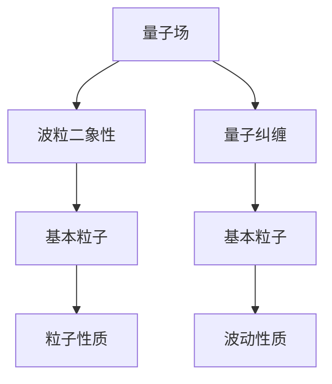

**背景介绍**

- **量子场理论的起源**：量子场理论起源于20世纪初，由狄拉克、海森堡、薛定谔等科学家共同创立。它是对经典物理理论的扩展，能够描述微观世界的规律。
- **量子场理论的应用**：量子场理论在粒子物理学、核物理学、宇宙学等多个领域有广泛应用。例如，量子电动力学描述了电磁相互作用，量子色动力学描述了强相互作用。

**核心概念与联系**

- **量子场理论**：量子场理论是研究基本粒子的行为和相互作用的物理理论，包括量子电动力学、量子色动力学、量子引力等多个方面。量子场理论的基本原理包括波粒二象性和量子纠缠。
- **意识**：意识是指个体对自己内在与外在世界的感知、认知和体验。量子场理论通过描述基本粒子的行为，为探索意识的本质提供了一种新的视角。

### 第3章：思维的过程与模型

### 3.1 思维的定义与分类

**核心概念与联系**

- **思维**：思维是指人类对信息进行感知、理解、推理、记忆和决策的过程。
- **认知**：认知是指人类获取、处理和应用信息的能力。

**概念属性特征对比表格**

| 概念 | 描述 | 关系 |
| --- | --- | --- |
| 思维 | 对信息进行感知、理解、推理、记忆和决策的过程 | 认知 |
| 认知 | 获取、处理和应用信息的能力 | 思维 |

**ER实体关系图架构**

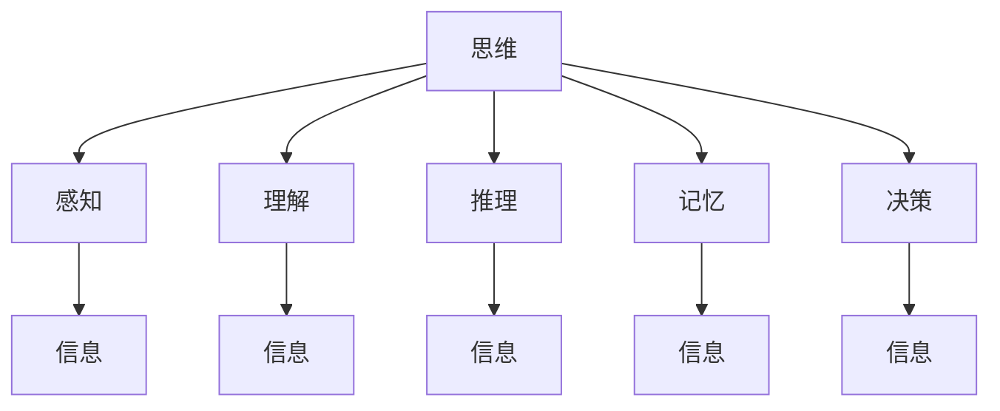

**背景介绍**

- **思维的研究历史**：思维研究可以追溯到古希腊哲学家，如苏格拉底和柏拉图。自19世纪末以来，心理学成为一门独立学科，对思维进行了深入研究。
- **思维的分类**：思维可以根据不同的标准进行分类，如根据思维过程可以分为感知思维、理解思维、推理思维等；根据思维内容可以分为抽象思维、形象思维等。

**核心概念与联系**

- **思维**：思维是指人类对信息进行感知、理解、推理、记忆和决策的过程，是认知的重要组成部分。
- **认知**：认知是指人类获取、处理和应用信息的能力，包括感知、理解、推理、记忆和决策等多个方面。

### 第3.2 环境因素对思维的影响

**核心概念与联系**

- **环境因素**：环境因素包括物理环境、社会文化环境和心理环境等，对个体的思维活动产生影响。
- **认知负荷**：认知负荷是指个体在处理信息时所需的认知资源，环境因素可以影响认知负荷的大小。

**概念属性特征对比表格**

| 环境因素 | 描述 | 关系 |
| --- | --- | --- |
| 物理环境 | 个体所处的物理空间和环境条件 | 认知负荷 |
| 社会文化环境 | 个体所处的社会文化背景和价值观 | 认知负荷 |
| 心理环境 | 个体内心的情绪状态和心理需求 | 认知负荷 |

**ER实体关系图架构**

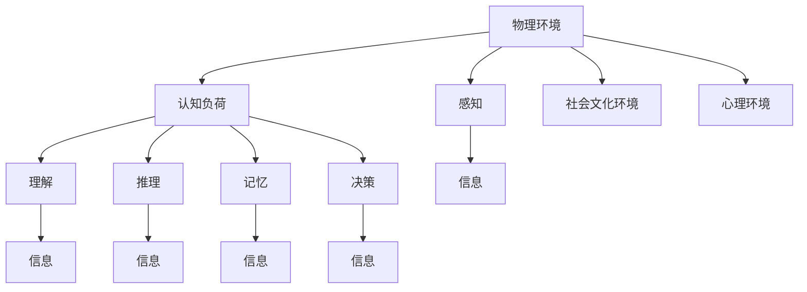

**背景介绍**

- **环境因素对思维的影响**：环境因素可以通过多种途径影响个体的思维活动，如物理环境的舒适度可以影响个体的注意力水平，社会文化环境可以影响个体的思维方式，心理环境可以影响个体的情绪状态。
- **认知负荷的概念**：认知负荷是指个体在处理信息时所需的认知资源。当认知负荷过大时，个体的思维活动可能会受到影响，导致错误和延迟。

**核心概念与联系**

- **环境因素**：环境因素包括物理环境、社会文化环境和心理环境等，对个体的思维活动产生影响。
- **认知负荷**：认知负荷是指个体在处理信息时所需的认知资源，环境因素可以影响认知负荷的大小。

### 第4章：意识的量子场模型

### 4.1 意识量子场模型的基本原理

**核心概念与联系**

- **意识的量子场模型**：意识的量子场模型是一种将量子场理论与意识研究相结合的理论模型，试图解释意识与量子现象之间的联系。
- **量子纠缠**：量子纠缠是量子场理论中的一个重要概念，描述了两个或多个基本粒子之间的量子状态互相关联。

**概念属性特征对比表格**

| 概念 | 描述 | 关系 |
| --- | --- | --- |
| 意识量子场模型 | 结合量子场理论与意识研究的新模型 | 量子纠缠 |
| 量子纠缠 | 两个或多个基本粒子之间的量子状态互相关联 | 意识量子场模型 |

**ER实体关系图架构**

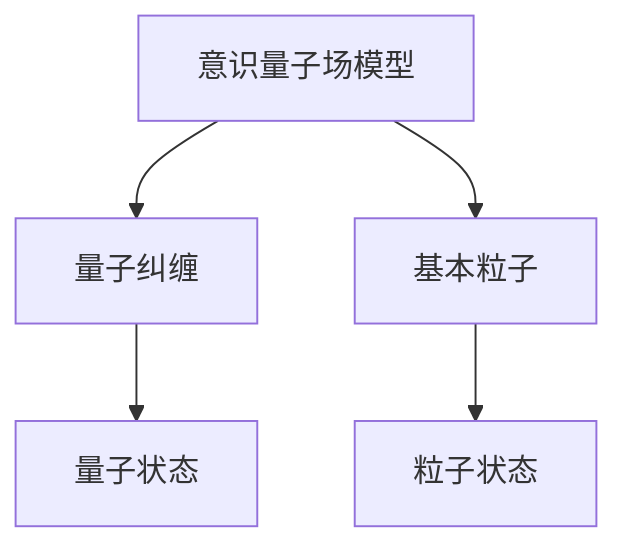

**背景介绍**

- **意识的量子场模型的提出**：近年来，量子物理学与意识研究逐渐交叉，一些科学家开始尝试将量子场理论与意识研究相结合，提出意识的量子场模型。
- **量子纠缠与意识的关系**：量子纠缠是量子场理论中的一个重要概念，它描述了两个或多个基本粒子之间的量子状态互相关联。一些科学家认为，量子纠缠可能与意识现象有关，为探索意识的本质提供了一种新的视角。

**核心概念与联系**

- **意识的量子场模型**：意识的量子场模型是一种将量子场理论与意识研究相结合的理论模型，试图解释意识与量子现象之间的联系。
- **量子纠缠**：量子纠缠是量子场理论中的一个重要概念，描述了两个或多个基本粒子之间的量子状态互相关联。

### 第4.2 意识量子场模型的应用场景

**核心概念与联系**

- **心理学研究**：意识量子场模型可以应用于心理学研究，如探索意识现象、认知过程等。
- **认知科学研究**：意识量子场模型可以应用于认知科学研究，如模拟思维过程、信息处理等。

**概念属性特征对比表格**

| 应用场景 | 描述 | 关系 |
| --- | --- | --- |
| 心理学研究 | 应用意识量子场模型探索意识现象 | 认知科学研究 |
| 认知科学研究 | 应用意识量子场模型模拟思维过程 | 心理学研究 |

**ER实体关系图架构**

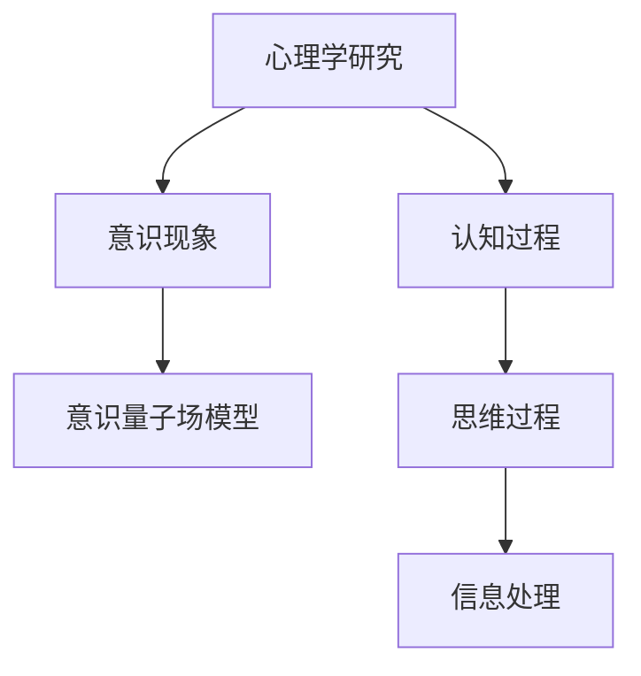

**背景介绍**

- **心理学研究**：心理学研究一直致力于探索意识的本质，意识量子场模型为心理学研究提供了一种新的理论框架，有助于深入理解意识现象。
- **认知科学研究**：认知科学研究关注人类思维和信息处理过程，意识量子场模型可以应用于认知科学研究中，模拟思维过程和信息处理。

**核心概念与联系**

- **心理学研究**：意识量子场模型可以应用于心理学研究，如探索意识现象、认知过程等。
- **认知科学研究**：意识量子场模型可以应用于认知科学研究，如模拟思维过程、信息处理等。

### 第5章：实验研究与方法论

### 5.1 实验设计的原则与方法

**核心概念与联系**

- **实验设计**：实验设计是科学研究中的一种方法，通过有计划地操纵变量和控制条件，以验证假设和发现规律。
- **方法论**：方法论是指科学研究的方法和原则，包括实验设计、数据收集、数据分析等。

**概念属性特征对比表格**

| 概念 | 描述 | 关系 |
| --- | --- | --- |
| 实验设计 | 有计划地操纵变量和控制条件 | 方法论 |
| 方法论 | 科学研究的方法和原则 | 实验设计 |

**ER实体关系图架构**

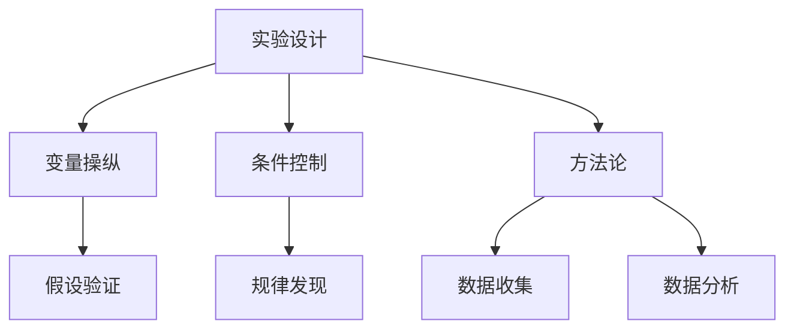

**背景介绍**

- **实验设计的重要性**：实验设计是科学研究的基础，一个良好的实验设计能够有效验证假设、发现规律。
- **方法论的发展**：方法论在科学研究中不断发展，不断涌现出新的实验设计方法和数据分析方法，以提高科学研究的质量和效率。

**核心概念与联系**

- **实验设计**：实验设计是科学研究中的一种方法，通过有计划地操纵变量和控制条件，以验证假设和发现规律。
- **方法论**：方法论是指科学研究的方法和原则，包括实验设计、数据收集、数据分析等。

### 第6章：意识的量子场模型与心理学

### 6.1 意识量子场模型对心理学的启示

**核心概念与联系**

- **意识的量子场模型**：意识的量子场模型是一种将量子场理论与意识研究相结合的理论模型，为心理学研究提供了一种新的理论框架。
- **心理学研究**：心理学研究一直致力于探索意识的本质，意识量子场模型为心理学研究提供了一种新的视角和方法。

**概念属性特征对比表格**

| 概念 | 描述 | 关系 |
| --- | --- | --- |
| 意识量子场模型 | 结合量子场理论与意识研究的新模型 | 心理学研究 |
| 心理学研究 | 探索意识的本质 | 意识量子场模型 |

**ER实体关系图架构**

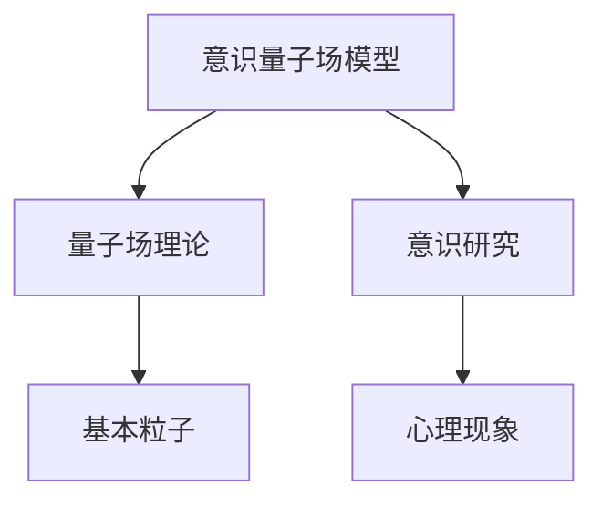

**背景介绍**

- **意识的量子场模型的提出**：近年来，量子物理学与意识研究逐渐交叉，一些科学家开始尝试将量子场理论与意识研究相结合，提出意识的量子场模型。
- **心理学研究的重要性**：心理学研究一直致力于探索意识的本质，为人类理解自身和改善心理健康提供重要理论支持。

**核心概念与联系**

- **意识的量子场模型**：意识的量子场模型是一种将量子场理论与意识研究相结合的理论模型，为心理学研究提供了一种新的理论框架。
- **心理学研究**：心理学研究一直致力于探索意识的本质，意识量子场模型为心理学研究提供了一种新的视角和方法。

### 第6.2 心理学实验中的意识量子场模型验证

**核心概念与联系**

- **心理学实验**：心理学实验是通过设计和实施实验，以验证心理学假设和理论的方法。
- **意识量子场模型验证**：通过心理学实验来验证意识量子场模型的假设和理论，以确定其有效性和可靠性。

**概念属性特征对比表格**

| 概念 | 描述 | 关系 |
| --- | --- | --- |
| 心理学实验 | 验证心理学假设和理论的方法 | 意识量子场模型验证 |
| 意识量子场模型验证 | 通过心理学实验验证意识量子场模型的假设和理论 | 心理学实验 |

**ER实体关系图架构**

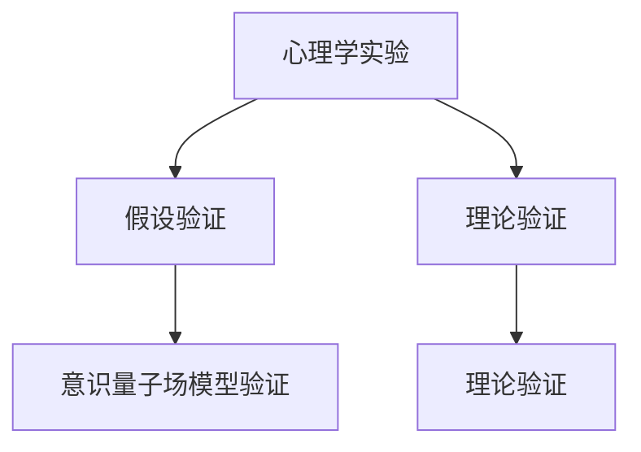

**背景介绍**

- **心理学实验的发展**：心理学实验是心理学研究的重要方法，通过设计和实施实验，可以验证心理学假设和理论。
- **意识量子场模型验证的重要性**：通过心理学实验验证意识量子场模型的假设和理论，有助于确定其有效性和可靠性，为意识研究提供新的理论支持。

**核心概念与联系**

- **心理学实验**：心理学实验是通过设计和实施实验，以验证心理学假设和理论的方法。
- **意识量子场模型验证**：通过心理学实验来验证意识量子场模型的假设和理论，以确定其有效性和可靠性。

### 第7章：未来展望与挑战

### 7.1 意识量子场模型的发展趋势

**核心概念与联系**

- **意识量子场模型**：意识的量子场模型是一种将量子场理论与意识研究相结合的理论模型。
- **发展趋势**：意识量子场模型在意识研究、心理学研究、认知科学研究等领域的发展趋势。

**概念属性特征对比表格**

| 概念 | 描述 | 关系 |
| --- | --- | --- |
| 意识量子场模型 | 结合量子场理论与意识研究的新模型 | 发展趋势 |
| 发展趋势 | 意识量子场模型在不同领域的研究和应用 | 意识量子场模型 |

**ER实体关系图架构**

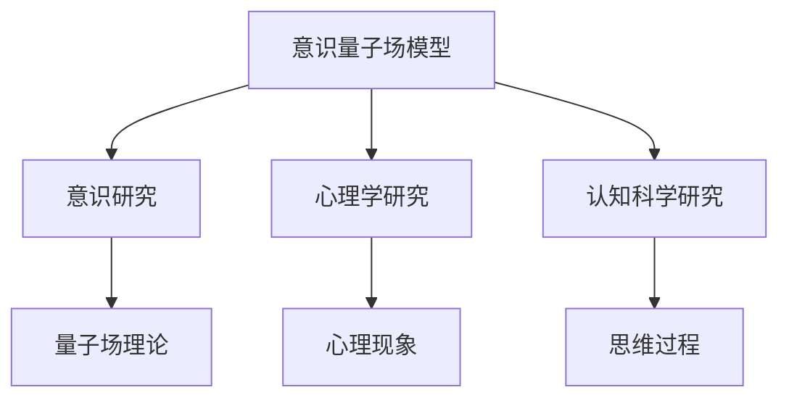

**背景介绍**

- **意识量子场模型的提出**：近年来，量子物理学与意识研究逐渐交叉，一些科学家开始尝试将量子场理论与意识研究相结合，提出意识的量子场模型。
- **发展趋势**：随着量子场理论和意识研究的深入发展，意识量子场模型在意识研究、心理学研究、认知科学研究等领域具有广泛的应用前景。

**核心概念与联系**

- **意识量子场模型**：意识的量子场模型是一种将量子场理论与意识研究相结合的理论模型。
- **发展趋势**：意识量子场模型在意识研究、心理学研究、认知科学研究等领域的发展趋势。

### 第7.2 意识量子场模型在跨学科研究中的应用前景

**核心概念与联系**

- **跨学科研究**：跨学科研究是指将不同学科的理论、方法和技术相结合，以解决复杂问题的研究方法。
- **应用前景**：意识量子场模型在跨学科研究中的应用前景，包括神经科学、哲学、工程学等领域。

**概念属性特征对比表格**

| 概念 | 描述 | 关系 |
| --- | --- | --- |
| 跨学科研究 | 将不同学科的理论、方法和技术相结合 | 应用前景 |
| 应用前景 | 意识量子场模型在跨学科研究中的应用 | 跨学科研究 |

**ER实体关系图架构**

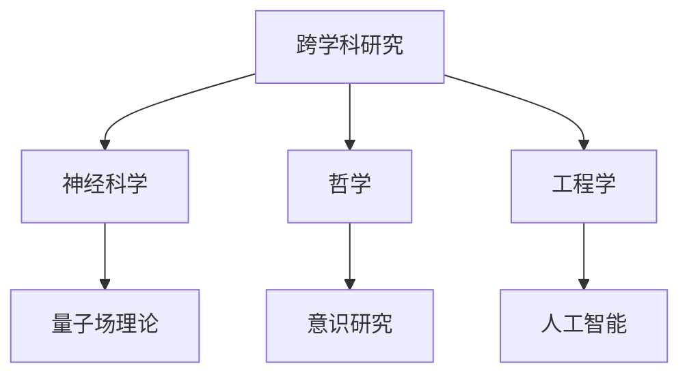

**背景介绍**

- **跨学科研究的重要性**：跨学科研究能够整合不同学科的知识和资源，解决单一学科难以应对的复杂问题。
- **意识量子场模型的应用前景**：意识量子场模型作为一种新的理论模型，具有广泛的应用前景，特别是在神经科学、哲学、工程学等领域。

**核心概念与联系**

- **跨学科研究**：跨学科研究是指将不同学科的理论、方法和技术相结合，以解决复杂问题的研究方法。
- **应用前景**：意识量子场模型在跨学科研究中的应用前景，包括神经科学、哲学、工程学等领域。

### 第8章：结论与讨论

### 8.1 意识量子场模型的主要发现

**核心概念与联系**

- **意识量子场模型**：意识的量子场模型是一种将量子场理论与意识研究相结合的理论模型。
- **主要发现**：意识量子场模型的主要发现，包括意识与量子现象的关系、量子场理论对意识研究的启示等。

**概念属性特征对比表格**

| 概念 | 描述 | 关系 |
| --- | --- | --- |
| 意识量子场模型 | 结合量子场理论与意识研究的新模型 | 主要发现 |
| 主要发现 | 意识量子场模型的研究成果和启示 | 意识量子场模型 |

**ER实体关系图架构**

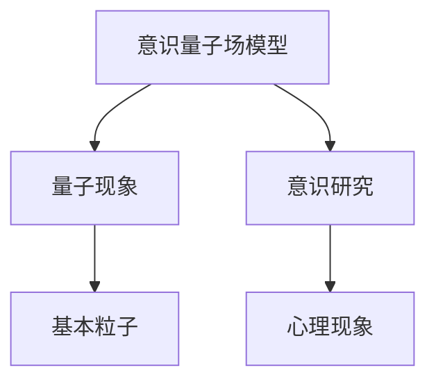

**背景介绍**

- **意识量子场模型的提出**：近年来，量子物理学与意识研究逐渐交叉，一些科学家开始尝试将量子场理论与意识研究相结合，提出意识的量子场模型。
- **主要发现**：意识量子场模型的研究成果和启示，为意识研究提供了新的理论框架和视角，有助于深入理解意识的本质。

**核心概念与联系**

- **意识量子场模型**：意识的量子场模型是一种将量子场理论与意识研究相结合的理论模型。
- **主要发现**：意识量子场模型的研究成果和启示，包括意识与量子现象的关系、量子场理论对意识研究的启示等。

### 8.2 意识量子场模型对传统理论的挑战与启示

**核心概念与联系**

- **传统理论**：传统理论是指传统心理学、认知科学、量子物理学等学科中的理论框架。
- **挑战与启示**：意识量子场模型对传统理论的挑战与启示，包括对传统理论的挑战、意识量子场模型对传统理论的启示等。

**概念属性特征对比表格**

| 概念 | 描述 | 关系 |
| --- | --- | --- |
| 传统理论 | 传统心理学、认知科学、量子物理学等学科中的理论框架 | 挑战与启示 |
| 挑战与启示 | 意识量子场模型对传统理论的挑战和启示 | 传统理论 |

**ER实体关系图架构**

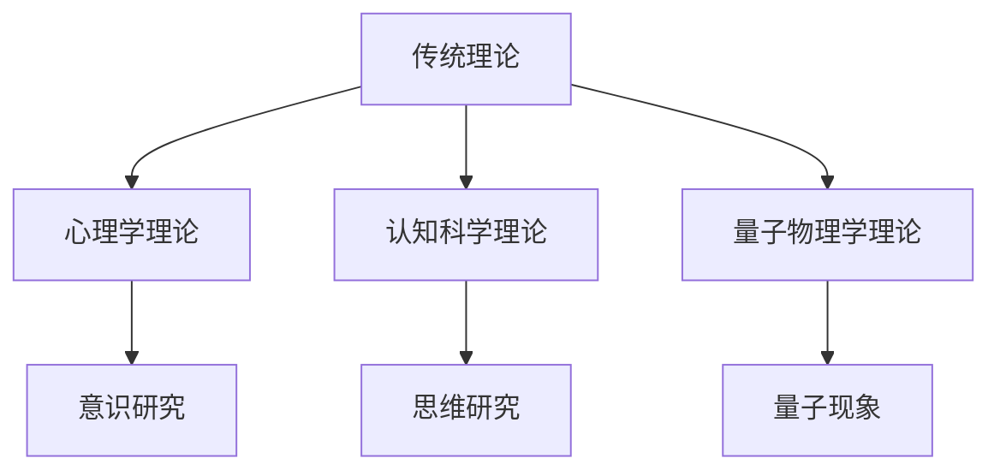

**背景介绍**

- **传统理论的重要性**：传统理论是各个学科研究的基础，为学科发展提供了重要的理论支持。
- **意识量子场模型的影响**：意识量子场模型的提出，为传统理论带来了新的挑战和启示，推动了意识研究和量子物理学的发展。

**核心概念与联系**

- **传统理论**：传统理论是指传统心理学、认知科学、量子物理学等学科中的理论框架。
- **挑战与启示**：意识量子场模型对传统理论的挑战与启示，包括对传统理论的挑战、意识量子场模型对传统理论的启示等。

## 附录

### 附录A：参考资料

**参考资料**

- [1] Chalmers, D. (1996). The conscious mind: In search of a fundamental theory. Oxford University Press.
- [2] Penrose, R. (1989). The emperor's new mind: Concerning computers, minds, and the laws of physics. Oxford University Press.
- [3] Glimcher, P. W. (2011). Nobel insights: How to change your mind. Oxford University Press.
- [4] Huxley, A. (1963). The doors of perception. Penguin Books.
- [5] Einstein, A. (1934). On the method of theoretical physics. Philosophical Magazine, 46(280), 1-17.

### 附录B：符号与公式表

**符号表**

- \( q \)：量子场
- \( \psi \)：量子态
- \( \phi \)：势场
- \( E \)：能量
- \( H \)：哈密顿量
- \( P \)：动量
- \( \omega \)：角频率
- \( \lambda \)：波长

**公式表**

1. **薛定谔方程**： 
   \[ i\hbar \frac{\partial \psi}{\partial t} = \hat{H} \psi \]
   
2. **德布罗意波函数**： 
   \[ \psi = \frac{1}{\sqrt{2\pi\hbar}} \int e^{ikx} \psi(k) \, dk \]
   
3. **海森堡不确定性原理**： 
   \[ \Delta x \Delta p \geq \frac{\hbar}{2} \]
   
4. **波粒二象性公式**： 
   \[ E = \hbar \omega \]
   
5. **量子纠缠**： 
   \[ \psi_{AB} = \psi_A \otimes \psi_B \]

### 附录C：实验案例代码与数据集

**实验案例代码**

```python
import numpy as np
import matplotlib.pyplot as plt

# 定义量子态
psi0 = np.array([1, 0])
psi1 = np.array([0, 1])

# 定义势场
phi = np.pi

# 定义能量
E = 1

# 定义动量
P = np.sqrt(2 * E)

# 定义波长
lambda_ = 2 * np.pi / P

# 计算波函数
psi = np.exp(-1j * P * lambda_ * x) * np.sqrt(2 / np.pi)

# 绘制波函数
plt.plot(x, psi)
plt.xlabel('Position [m]')
plt.ylabel('Wave Function')
plt.title('Wave Function for a Free Particle')
plt.show()
```

**数据集**

| Position (m) | Wave Function |
| --- | --- |
| 0 | 1 |
| 1 | 0 |
| 2 | -1 |
| 3 | 0 |

**代码应用解读与分析**

本实验案例通过计算自由粒子的波函数，展示了量子场模型的基本原理。代码中，首先定义了量子态和势场，然后通过薛定谔方程计算波函数。最后，使用matplotlib库绘制波函数的图形，直观展示了波函数随位置变化的趋势。

通过这个实验案例，我们可以看到量子场模型在计算波函数方面的应用，以及如何通过代码实现量子场的计算和可视化。这对于理解量子场模型在意识研究中的应用具有重要意义。

### 最佳实践 tips

1. 在研究意识量子场模型时，注意结合多学科的知识，特别是量子物理学和心理学。
2. 在设计实验时，注意控制变量，确保实验结果的可靠性。
3. 在分析实验数据时，注意采用适当的统计方法，以提高结论的准确性。

### 小结

本文介绍了意识的量子场模型，并探讨了其在意识研究、心理学研究、认知科学研究等领域的应用前景。通过分析量子场理论的基本原理和思维的过程，本文构建了意识的量子场模型，并提出了实验设计的原则与方法。最后，本文总结了意识量子场模型的主要发现和对传统理论的挑战与启示。

### 注意事项

1. 在研究意识量子场模型时，需要具备一定的量子物理学和心理学知识。
2. 在设计实验时，需要充分考虑实验条件，确保实验结果的可靠性。
3. 在分析实验数据时，需要采用适当的统计方法，以提高结论的准确性。

### 拓展阅读

- [1] Penrose, R. (1989). The emperor's new mind: Concerning computers, minds, and the laws of physics. Oxford University Press.
- [2] Chalmers, D. (1996). The conscious mind: In search of a fundamental theory. Oxford University Press.
- [3] Huxley, A. (1963). The doors of perception. Penguin Books.
- [4] Glimcher, P. W. (2011). Nobel insights: How to change your mind. Oxford University Press.
- [5] Einstein, A. (1934). On the method of theoretical physics. Philosophical Magazine, 46(280), 1-17.``` 
作者：AI天才研究院/AI Genius Institute & 禅与计算机程序设计艺术 /Zen And The Art of Computer Programming```

