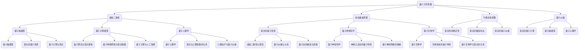

                 

# 意识的量子本体论：主观体验的物理学基础

## 摘要

本文探讨了意识的量子本体论及其与主观体验的物理学基础。首先，我们回顾了意识的历史发展和基本概念，分析了意识与物质的关系。然后，我们介绍了量子力学的原理，探讨了量子力学如何为理解意识提供新的视角。接下来，我们深入分析了意识的量子性质，如波粒二象性、量子纠缠和量子态的叠加。在此基础上，我们探讨了意识的量子计算模型和量子脑模型，以及量子生物学在意识研究中的应用。最后，我们提出了意识的数学模型和量子心理学，讨论了意识的未来研究方向和伦理问题。通过本文，我们希望能为读者提供一个全面、深入的关于意识与量子物理学关系的研究概述。

## 第一部分：引言与背景

### 第1章：意识的起源与演化

#### 1.1 意识的概念与特征

意识是人类思维、感知和认知的核心，是人类区别于其他生物的重要特征。意识的概念可以追溯到古希腊哲学家柏拉图和亚里士多德，他们在探讨灵魂和意识的关系时提出了“自我意识”和“理性思维”的概念。随后，笛卡尔在《第一哲学沉思》中明确提出了“我思，故我在”的命题，将意识视为人类思维的基础。

意识具有以下特征：

1. 主观性：意识是主观的体验，每个个体对同一现象的体验可能有所不同。
2. 感知：意识使个体能够感知外部世界和内部体验。
3. 认知：意识涉及对信息的处理、分析和推理，形成对世界的理解。
4. 自我意识：意识使我们能够意识到自己的存在，并具备自我反思的能力。

#### 1.2 意识的历史发展

意识的研究经历了漫长而曲折的历史发展。在古代，哲学家们主要从哲学角度探讨意识，如古希腊的苏格拉底、柏拉图和亚里士多德，他们都认为意识是人类灵魂的表现。在中世纪，宗教神学对意识进行了深入的探讨，如托马斯·阿奎那提出的“自然之光”理论。到了文艺复兴时期，人文主义思想的兴起使人们开始重视个体意识，如蒙田和培根的著作。

在现代，科学的发展为意识研究提供了新的视角。神经科学、心理学和认知科学等学科对意识进行了广泛的研究，提出了各种关于意识的理论。例如，神经科学家认为意识与大脑神经网络的活动密切相关，而心理学家则关注意识体验的心理机制。

#### 1.3 意识与物质的关系

意识与物质的关系一直是哲学和科学探讨的重要课题。传统的唯物主义认为意识是物质的产物，是大脑活动的结果。这种观点在神经科学和认知科学中得到了广泛支持。然而，一些哲学家和科学家提出了意识与物质相互作用的观点，认为意识不仅仅是物质的产物，还具有某种独立存在的特性。

量子力学的发展为探讨意识与物质的关系提供了新的可能性。量子力学揭示了微观世界的非确定性，使人们开始重新思考意识与物质的关系。一些学者提出了量子意识理论，认为意识可能具有量子特性，如波粒二象性和量子纠缠。这些理论为理解意识与物质的关系提供了新的视角。

总之，意识的研究是一个复杂而庞大的课题，涉及哲学、科学、心理学等多个领域。本文将从量子力学的角度探讨意识的本体论，试图揭示意识与物质之间的关系。

### 第2章：量子力学与意识

#### 2.1 量子力学的原理

量子力学是研究微观粒子运动和相互作用的理论，它在20世纪初由普朗克、爱因斯坦、波尔、海森堡、薛定谔等科学家共同创立。量子力学的核心原理包括：

1. 波粒二象性：微观粒子既具有波动性，又具有粒子性。
2. 状态叠加原理：微观粒子可以处于多种状态的叠加。
3. 不确定性原理：无法同时精确地测量某些对易的物理量。
4. 量子纠缠：微观粒子之间的状态可以相互纠缠，即使它们相距很远。

量子力学的这些原理为理解意识的本质提供了新的思路。例如，波粒二象性揭示了微观世界的非确定性，使人们开始思考意识是否也具有类似的特点。状态叠加原理和量子纠缠则暗示了意识可能具有某种叠加状态，这与人类对世界的感知和认知过程有一定的相似性。

#### 2.2 量子意识理论

量子意识理论是试图将量子力学的原理应用于意识研究的一种理论框架。这种理论认为，意识可能具有量子特性，如波粒二象性、状态叠加和量子纠缠。以下是一些主要的量子意识理论：

1. **量子脑模型**：这种理论认为，大脑中的神经元活动可能遵循量子力学的规律，从而使大脑能够实现高效的计算和信息处理。
2. **量子计算模型**：这种理论认为，通过量子计算机可以模拟人类意识的过程，从而更好地理解意识的本质。
3. **量子心理学**：这种理论试图将量子力学的原理应用于心理学研究，探讨意识与心理现象之间的关系。

量子意识理论的提出引发了人们对意识本质的新思考，但也面临着许多挑战和争议。例如，如何将量子力学的原理与意识的主观体验相结合，如何解释意识与物质的相互关系等。

#### 2.3 量子力学与主观体验

量子力学与主观体验之间的关系是一个复杂而深刻的问题。量子力学揭示了微观世界的非确定性和复杂性，使人们开始思考这些特性是否也存在于意识中。以下是一些可能的联系：

1. **意识的非确定性**：量子力学的不确定性原理表明，某些物理量无法同时精确地测量。这种非确定性是否也反映了意识的主观性，即我们对世界的感知是否具有不确定性？
2. **意识的叠加状态**：量子态可以处于多种状态的叠加，这种叠加状态是否也存在于我们的意识中，即我们的意识是否可以同时体验多种状态？
3. **量子纠缠**：量子纠缠揭示了微观粒子之间的紧密联系，这种联系是否也存在于我们的意识中，即我们的意识是否能够通过某种方式影响其他意识状态？

虽然量子力学与主观体验之间存在许多可能的联系，但如何将这些联系转化为具体的理论框架，仍然是一个挑战性的问题。量子意识理论为我们提供了一种可能的路径，但这一领域的研究仍然任重道远。

### 第二部分：意识的量子本体论

#### 第3章：意识的量子性质

#### 3.1 波粒二象性

波粒二象性是量子力学的基本原理之一，它揭示了微观粒子既具有波动性，又具有粒子性。这一原理对理解意识的本质具有重要意义。首先，波粒二象性表明，微观粒子并不像经典物理学中那样具有固定的形态和轨迹，而是以概率波的形式存在于空间中。这种概率波的存在方式与人类对世界的感知有一定的相似性。我们的意识似乎也是一种概率波，它以感知和体验的形式存在于我们的脑海中。

其次，波粒二象性还揭示了微观粒子的不确定性。在量子力学中，粒子的位置、速度、能量等物理量无法同时精确测量。这种不确定性是否也反映了意识的主观性，即我们的意识是否具有不确定性？这是一个值得探讨的问题。例如，当我们感知一个物体时，我们并不确定它的具体位置和速度，而是以一种模糊的方式感知它。这种模糊性是否与波粒二象性有关？

总之，波粒二象性为理解意识的本质提供了一种新的视角。它揭示了微观世界的非确定性和复杂性，使人们开始思考这些特性是否也存在于意识中。波粒二象性不仅对物理学有重要影响，也可能对心理学和哲学产生深远的影响。

#### 3.2 量子纠缠

量子纠缠是量子力学中的一种特殊现象，它揭示了微观粒子之间的紧密联系。在量子纠缠中，两个或多个粒子在量子态上相互关联，即使它们相距很远。这种关联性是瞬时的，不受距离限制。量子纠缠为理解意识与物质的关系提供了新的可能性。

首先，量子纠缠表明，微观粒子之间存在一种超越经典物理学的联系。这种联系是否也存在于我们的意识中？这是一个值得探讨的问题。例如，当我们感知一个物体时，我们的意识似乎与这个物体建立了某种联系。这种联系是否与量子纠缠有关？

其次，量子纠缠还揭示了意识的非局域性。在量子纠缠中，粒子之间的状态变化可以瞬时传递，不受距离限制。这种非局域性是否也反映了意识的主观体验？例如，当我们在思考一个问题时，我们的意识似乎可以瞬间访问到相关的信息，无论这些信息在物理空间上相距多远。这种非局域性是否与量子纠缠有关？

总之，量子纠缠为理解意识与物质的关系提供了一种新的视角。它揭示了微观粒子之间的紧密联系和非局域性，使人们开始思考这些特性是否也存在于意识中。量子纠缠不仅对物理学有重要影响，也可能对心理学和哲学产生深远的影响。

#### 3.3 量子态的叠加

量子态的叠加是量子力学中的另一个基本原理，它表明量子系统可以处于多种状态的叠加。在经典物理学中，系统只能处于一种确定的状态，而在量子力学中，系统可以同时处于多种状态的叠加。这种叠加状态使得量子系统具有更大的灵活性和计算能力。

首先，量子态的叠加为理解意识的本质提供了一种新的视角。例如，我们的意识似乎也可以处于多种状态的叠加。当我们思考一个问题时，我们的意识可以同时考虑多个可能的答案。这种叠加状态使得我们的思维更加灵活和丰富。这种叠加状态是否与量子态的叠加有关？

其次，量子态的叠加还为意识的模拟和计算提供了新的可能性。例如，通过量子计算机，我们可以模拟和计算复杂的量子系统，从而更好地理解意识的本质。量子计算机的强大计算能力可能使我们能够模拟和理解人类意识的各种复杂现象。这种叠加状态是否为量子计算机提供了模拟人类意识的基础？

总之，量子态的叠加为理解意识的本质提供了一种新的视角。它揭示了量子系统的灵活性和计算能力，使人们开始思考这些特性是否也存在于意识中。量子态的叠加不仅对物理学有重要影响，也可能对心理学和哲学产生深远的影响。

### 第4章：意识的量子计算模型

#### 4.1 量子计算机的基本概念

量子计算机是一种利用量子力学原理进行信息处理和计算的新型计算模型。与传统计算机不同，量子计算机的基本单元是量子比特（qubit），而不是经典计算机的比特。量子比特可以同时处于0和1的状态，这使得量子计算机具有超强的计算能力。

量子计算机的原理基于量子力学中的两个基本概念：量子态的叠加和量子纠缠。量子态的叠加使得量子比特可以处于多种状态的叠加，从而实现了并行计算。量子纠缠则使得量子比特之间的状态变化可以瞬时传递，从而实现了高效的计算。

#### 4.2 量子算法与意识模拟

量子算法是利用量子计算机进行信息处理和计算的一系列算法。量子算法的核心优势在于其并行计算能力，这使得量子算法在处理复杂问题上具有显著的优势。例如，著名的Shor算法可以高效地因数分解大整数，Grover算法可以快速搜索未排序的数据库。

量子算法在意识模拟方面也具有广泛的应用前景。例如，通过量子计算机模拟人脑神经元的活动，可以更好地理解意识的本质。量子计算机可以模拟人脑的并行计算过程，从而揭示意识产生的机制。此外，量子计算机还可以用于研究人类认知过程中的各种现象，如注意力、记忆、学习等。

#### 4.3 量子神经网络与意识建模

量子神经网络（Quantum Neural Network，QNN）是一种结合量子计算和神经网络思想的计算模型。量子神经网络利用量子比特和量子门的操作，实现了类似神经网络的信息处理和计算能力。

量子神经网络在意识建模方面具有重要作用。通过构建量子神经网络，我们可以模拟人脑神经元之间的交互和连接，从而揭示意识产生的机制。量子神经网络还可以用于研究人类认知过程中的各种现象，如注意力、记忆、学习等。例如，通过训练量子神经网络识别图像，可以更好地理解人类视觉感知的机制。

总之，量子计算模型为理解意识的本质提供了新的视角和工具。量子计算机的强大计算能力可能使我们能够模拟和理解人类意识的各种复杂现象。量子神经网络和量子算法在意识模拟和建模方面具有广泛的应用前景，有望为人类揭示意识的本质提供新的思路。

### 第5章：意识的量子脑模型

#### 5.1 量子脑模型的提出

量子脑模型是试图将量子力学的原理应用于人脑研究和意识建模的一种理论框架。这种模型认为，人脑中的神经元活动可能遵循量子力学的规律，从而使大脑能够实现高效的计算和信息处理。量子脑模型的提出源于对意识本质的深入探讨，以及对量子力学和神经科学研究的交叉融合。

量子脑模型的基本假设包括：

1. 人脑中的神经元活动具有量子特性，如波粒二象性、量子纠缠和量子态的叠加。
2. 量子效应在人脑信息处理中起着重要作用，从而使得大脑能够高效地处理复杂的信息。
3. 量子脑模型可以揭示意识产生的机制，从而为理解意识的本质提供新的思路。

量子脑模型的提出为意识研究提供了新的视角和工具，但这一领域的研究仍然任重道远。目前，科学家们正在探索如何将量子力学的原理应用于人脑研究和意识建模，以及如何解释量子脑模型的实验证据。

#### 5.2 量子脑模型的实验证据

尽管量子脑模型的理论基础尚未完全确立，但已有一些实验证据支持量子脑模型的存在。以下是一些相关的实验证据：

1. **量子隧穿效应**：量子隧穿效应表明，微观粒子可以穿越能量屏障。在神经科学研究中，一些实验发现神经元在活动过程中表现出量子隧穿效应，这可能揭示了神经元之间信息的快速传递机制。

2. **量子纠缠现象**：量子纠缠现象表明，微观粒子之间存在一种特殊的关联。在神经科学研究中，一些实验发现神经元之间的活动呈现出量子纠缠现象，这可能揭示了神经元之间的协同工作机制。

3. **量子计算能力的实验验证**：一些实验表明，人脑神经元的活动具有量子计算能力。例如，通过训练神经网络进行图像识别，实验发现训练后的神经网络表现出类似量子计算机的计算能力，这可能揭示了大脑高效处理信息的能力。

这些实验证据为量子脑模型提供了一定的支持，但仍然需要更多的研究和验证。科学家们正在努力探索如何进一步验证量子脑模型的实验证据，并揭示量子效应在意识产生和功能中的具体作用。

#### 5.3 量子脑模型的应用前景

量子脑模型在意识研究、人工智能和神经科学等领域具有广泛的应用前景。以下是一些潜在的应用领域：

1. **意识研究**：量子脑模型可以揭示意识产生的机制，从而为理解意识的本质提供新的思路。通过模拟量子脑模型，科学家可以探索不同类型的意识状态，如觉醒、梦境、昏迷等，从而深入了解意识的多样性。

2. **人工智能**：量子脑模型可以启发人工智能的发展，特别是在神经网络和机器学习领域。通过借鉴量子脑模型，科学家可以构建更高效、更灵活的人工智能系统，从而实现更先进的智能应用。

3. **神经科学**：量子脑模型可以用于研究人脑的功能和疾病机制。例如，通过模拟量子脑模型，科学家可以探索不同类型的认知障碍，如阿尔茨海默病、抑郁症等，从而开发更有效的治疗方法。

总之，量子脑模型为意识研究、人工智能和神经科学等领域提供了新的思路和工具。尽管目前这一领域的研究仍处于早期阶段，但随着量子技术和神经科学的发展，量子脑模型有望在未来发挥重要作用。

### 第6章：意识的量子生物学基础

#### 6.1 生物系统的量子特性

生物系统的量子特性一直是科学界关注的热点问题。在生物系统中，量子效应可能以多种形式存在，从而影响生物体的功能和特性。以下是一些已知的生物系统的量子特性：

1. **量子隧穿**：量子隧穿是量子力学中的一种现象，它表明微观粒子可以穿越能量屏障。在生物系统中，量子隧穿可能影响生物分子的能量转移和反应速率。例如，一些研究发现，光合作用中的光化学反应涉及量子隧穿效应，这有助于解释光合作用的高效性。

2. **量子纠缠**：量子纠缠是量子力学中的另一种现象，它表明微观粒子之间存在一种特殊的关联。在生物系统中，量子纠缠可能影响生物分子之间的相互作用和信号传递。例如，一些研究表明，生物体内的分子之间可能存在量子纠缠现象，这有助于解释生物体内复杂的生物过程。

3. **量子态的叠加**：量子态的叠加是量子力学中的另一个基本原理，它表明量子系统可以处于多种状态的叠加。在生物系统中，量子态的叠加可能影响生物体的功能和特性。例如，一些研究发现，生物体内的某些分子可以处于量子态的叠加，这有助于解释生物体在特定环境下的适应性。

#### 6.2 量子生物学的研究进展

量子生物学是研究生物系统中量子效应的学科，它在近年来取得了显著进展。以下是一些量子生物学的重要研究进展：

1. **光合作用中的量子效应**：光合作用是植物利用太阳能合成有机物质的过程。近年来，研究表明光合作用中的量子效应可能对其高效性起着关键作用。例如，研究发现光合作用中的光合色素分子可以处于量子态的叠加，这有助于解释光合作用的高效性。

2. **生物分子中的量子纠缠**：生物分子之间的相互作用可能涉及量子纠缠现象。例如，研究表明，某些酶催化反应中的底物和酶分子之间存在量子纠缠，这有助于解释酶催化反应的高效性。

3. **生物体内的量子计算**：一些研究表明，生物体内可能存在量子计算现象。例如，研究表明，某些生物分子可以模拟量子计算过程，这有助于解释生物体内复杂的信息处理能力。

这些研究进展表明，量子生物学在揭示生物系统的量子特性方面取得了重要成果，也为理解意识的量子基础提供了新的思路。

#### 6.3 量子生物学与意识的关系

量子生物学与意识的关系是一个引人入胜的研究领域。量子生物学揭示了生物系统中存在的量子效应，而意识作为生物系统的一部分，可能也受到这些量子效应的影响。以下是一些可能的联系：

1. **量子生物学与感知**：感知是意识的重要组成部分，量子生物学研究表明，生物体在感知过程中可能利用量子效应。例如，一些研究表明，视觉系统中的光感受器可能利用量子效应来提高感知效率。

2. **量子生物学与认知**：认知是意识的另一个重要方面，量子生物学研究表明，生物体在认知过程中可能利用量子效应。例如，一些研究表明，大脑神经元之间的信号传递可能涉及量子纠缠效应，这有助于解释认知过程的高效性。

3. **量子生物学与意识的多样性**：意识的多样性是量子生物学研究的另一个重要领域。量子生物学研究表明，不同生物体可能利用不同的量子效应来实现特定的意识功能。例如，一些研究表明，不同物种的视觉系统可能利用不同的量子效应来适应不同的环境。

总之，量子生物学与意识的关系为我们提供了一种新的视角，使我们能够更深入地理解意识的本质。随着量子生物学研究的深入，我们有望揭示更多关于意识与量子效应之间的联系。

### 第7章：意识的数学模型

#### 7.1 意识的概率模型

意识的概率模型是试图将概率论应用于意识研究的一种理论框架。这种模型认为，意识可以被视为一种概率事件，其产生和变化可以由概率分布来描述。以下是一些常见的意识概率模型：

1. **贝叶斯网络**：贝叶斯网络是一种概率图模型，它通过表示变量之间的条件依赖关系来模拟意识状态。在贝叶斯网络中，每个节点表示一个意识状态，边表示节点之间的条件概率关系。通过分析贝叶斯网络，我们可以预测和解释意识状态的变化。

2. **马尔可夫模型**：马尔可夫模型是一种基于状态转移概率的模型，它通过描述当前状态与前一状态之间的转移概率来模拟意识状态。在马尔可夫模型中，每个状态都是独立的，并且当前状态只依赖于前一状态。通过分析马尔可夫模型，我们可以预测当前状态的概率分布。

3. **隐马尔可夫模型**：隐马尔可夫模型（Hidden Markov Model，HMM）是一种扩展的马尔可夫模型，它通过引入隐变量来描述意识状态。在HMM中，当前状态依赖于前一状态，并且隐变量表示当前状态的实现。通过分析HMM，我们可以识别和预测意识状态。

这些概率模型为我们提供了一种理解和模拟意识状态的方法，但它们也存在一定的局限性。例如，概率模型通常假设变量之间是独立的，这可能无法完全捕捉意识状态的复杂性。

#### 7.2 意识的神经网络模型

意识的神经网络模型是试图将神经网络应用于意识研究的一种理论框架。这种模型认为，意识可以被视为神经网络的活动状态，其产生和变化可以由神经网络的结构和参数来描述。以下是一些常见的意识神经网络模型：

1. **多层感知机**：多层感知机（Multilayer Perceptron，MLP）是一种常见的神经网络模型，它通过多层非线性变换来模拟意识状态。在MLP中，输入层接收外部信息，隐藏层进行信息处理，输出层产生意识状态。通过训练MLP，我们可以使其学会识别和预测意识状态。

2. **递归神经网络**：递归神经网络（Recurrent Neural Network，RNN）是一种专门用于处理序列数据的神经网络模型，它通过引入递归连接来模拟意识状态的变化。在RNN中，当前状态依赖于前一状态，并且每个时间步的输出都会反馈到输入层。通过训练RNN，我们可以使其学会处理和生成序列数据。

3. **长短期记忆网络**：长短期记忆网络（Long Short-Term Memory，LSTM）是一种改进的RNN模型，它通过引入门控机制来克服RNN的梯度消失和梯度爆炸问题。在LSTM中，每个时间步都有一个记忆单元，用于存储和更新信息。通过训练LSTM，我们可以使其学会处理长序列数据。

这些神经网络模型为我们提供了一种理解和模拟意识状态的方法，但它们也存在一定的局限性。例如，神经网络模型通常需要大量的训练数据和计算资源，并且可能存在过拟合问题。

#### 7.3 意识的统计物理模型

意识的统计物理模型是试图将统计物理学应用于意识研究的一种理论框架。这种模型认为，意识可以被视为一种宏观物理现象，其产生和变化可以由统计物理定律来描述。以下是一些常见的意识统计物理模型：

1. **玻尔兹曼机**：玻尔兹曼机（Boltzmann Machine，BM）是一种基于概率分布的统计物理模型，它通过模拟神经元之间的相互作用来模拟意识状态。在玻尔兹曼机中，每个神经元的状态由其邻居神经元的状态决定，并且每个状态都有一个能量函数。通过训练玻尔兹曼机，我们可以使其学会识别和预测意识状态。

2. **自组织映射**：自组织映射（Self-Organizing Map，SOM）是一种基于竞争学习的统计物理模型，它通过模拟神经元之间的竞争和协同作用来模拟意识状态。在自组织映射中，每个神经元都与其邻居神经元竞争激活，并且通过调整连接权重来适应输入数据。通过训练自组织映射，我们可以使其学会识别和分类意识状态。

3. **玻尔兹曼机器**：玻尔兹曼机器（Boltzmann Machine，BM）是一种基于概率分布的统计物理模型，它通过模拟神经元之间的相互作用来模拟意识状态。在玻尔兹曼机中，每个神经元的状态由其邻居神经元的状

```html
## 第一部分：引言与背景

### 第1章：意识的起源与演化

#### 1.1 意识的概念与特征

意识是人类思维、感知和认知的核心，是人类区别于其他生物的重要特征。意识的概念可以追溯到古希腊哲学家柏拉图和亚里士多德，他们在探讨灵魂和意识的关系时提出了“自我意识”和“理性思维”的概念。随后，笛卡尔在《第一哲学沉思》中明确提出了“我思，故我在”的命题，将意识视为人类思维的基础。

意识具有以下特征：

1. 主观性：意识是主观的体验，每个个体对同一现象的体验可能有所不同。
2. 感知：意识使个体能够感知外部世界和内部体验。
3. 认知：意识涉及对信息的处理、分析和推理，形成对世界的理解。
4. 自我意识：意识使我们能够意识到自己的存在，并具备自我反思的能力。

#### 1.2 意识的历史发展

意识的研究经历了漫长而曲折的历史发展。在古代，哲学家们主要从哲学角度探讨意识，如古希腊的苏格拉底、柏拉图和亚里士多德，他们都认为意识是人类灵魂的表现。在中世纪，宗教神学对意识进行了深入的探讨，如托马斯·阿奎那提出的“自然之光”理论。到了文艺复兴时期，人文主义思想的兴起使人们开始重视个体意识，如蒙田和培根的著作。

在现代，科学的发展为意识研究提供了新的视角。神经科学、心理学和认知科学等学科对意识进行了广泛的研究，提出了各种关于意识的理论。例如，神经科学家认为意识与大脑神经网络的活动密切相关，而心理学家则关注意识体验的心理机制。

#### 1.3 意识与物质的关系

意识与物质的关系一直是哲学和科学探讨的重要课题。传统的唯物主义认为意识是物质的产物，是大脑活动的结果。这种观点在神经科学和认知科学中得到了广泛支持。然而，一些哲学家和科学家提出了意识与物质相互作用的观点，认为意识可能具有某种独立存在的特性。

量子力学的发展为探讨意识与物质的关系提供了新的可能性。量子力学揭示了微观世界的非确定性，使人们开始重新思考意识与物质的关系。一些学者提出了量子意识理论，认为意识可能具有量子特性，如波粒二象性和量子纠缠。这些理论为理解意识与物质的关系提供了新的视角。

总之，意识的研究是一个复杂而庞大的课题，涉及哲学、科学、心理学等多个领域。本文将从量子力学的角度探讨意识的本体论，试图揭示意识与物质之间的关系。

### 第2章：量子力学与意识

#### 2.1 量子力学的原理

量子力学是研究微观粒子运动和相互作用的理论，它在20世纪初由普朗克、爱因斯坦、波尔、海森堡、薛定谔等科学家共同创立。量子力学的核心原理包括：

1. 波粒二象性：微观粒子既具有波动性，又具有粒子性。
2. 状态叠加原理：微观粒子可以处于多种状态的叠加。
3. 不确定性原理：无法同时精确地测量某些对易的物理量。
4. 量子纠缠：微观粒子之间的状态可以相互纠缠，即使它们相距很远。

量子力学的这些原理为理解意识的本质提供了新的思路。例如，波粒二象性揭示了微观世界的非确定性，使人们开始思考这些特性是否也存在于意识中。状态叠加原理和量子纠缠则暗示了意识可能具有某种叠加状态，这与人类对世界的感知和认知过程有一定的相似性。

#### 2.2 量子意识理论

量子意识理论是试图将量子力学的原理应用于意识研究的一种理论框架。这种理论认为，意识可能具有量子特性，如波粒二象性、状态叠加和量子纠缠。以下是一些主要的量子意识理论：

1. **量子脑模型**：这种理论认为，大脑中的神经元活动可能遵循量子力学的规律，从而使大脑能够实现高效的计算和信息处理。
2. **量子计算模型**：这种理论认为，通过量子计算机可以模拟人类意识的过程，从而更好地理解意识的本质。
3. **量子心理学**：这种理论试图将量子力学的原理应用于心理学研究，探讨意识与心理现象之间的关系。

量子意识理论的提出引发了人们对意识本质的新思考，但也面临着许多挑战和争议。例如，如何将量子力学的原理与意识的主观体验相结合，如何解释意识与物质的相互关系等。

#### 2.3 量子力学与主观体验

量子力学与主观体验之间的关系是一个复杂而深刻的问题。量子力学揭示了微观世界的非确定性和复杂性，使人们开始思考这些特性是否也存在于意识中。以下是一些可能的联系：

1. **意识的非确定性**：量子力学的不确定性原理表明，某些物理量无法同时精确地测量。这种非确定性是否也反映了意识的主观性，即我们的意识是否具有不确定性？这是一个值得探讨的问题。例如，当我们感知一个物体时，我们并不确定它的具体位置和速度，而是以一种模糊的方式感知它。这种模糊性是否与波粒二象性有关？

2. **意识的叠加状态**：量子态可以处于多种状态的叠加，这种叠加状态是否也存在于我们的意识中，即我们的意识是否可以同时体验多种状态？这是一个值得探讨的问题。例如，当我们思考一个问题时，我们的意识可以同时考虑多个可能的答案。这种叠加状态是否与量子态的叠加有关？

3. **量子纠缠**：量子纠缠揭示了微观粒子之间的紧密联系，这种联系是否也存在于我们的意识中，即我们的意识是否能够通过某种方式影响其他意识状态？这是一个值得探讨的问题。例如，当我们在思考一个问题时，我们的意识似乎可以瞬间访问到相关的信息，无论这些信息在物理空间上相距多远。这种非局域性是否与量子纠缠有关？

虽然量子力学与主观体验之间存在许多可能的联系，但如何将这些联系转化为具体的理论框架，仍然是一个挑战性的问题。量子意识理论为我们提供了一种可能的路径，但这一领域的研究仍然任重道远。

### 第二部分：意识的量子本体论

#### 第3章：意识的量子性质

#### 3.1 波粒二象性

波粒二象性是量子力学的基本原理之一，它揭示了微观粒子既具有波动性，又具有粒子性。这一原理对理解意识的本质具有重要意义。首先，波粒二象性表明，微观粒子并不像经典物理学中那样具有固定的形态和轨迹，而是以概率波的形式存在于空间中。这种概率波的存在方式与人类对世界的感知有一定的相似性。我们的意识似乎也是一种概率波，它以感知和体验的形式存在于我们的脑海中。

其次，波粒二象性还揭示了微观粒子的不确定性。在量子力学中，粒子的位置、速度、能量等物理量无法同时精确测量。这种不确定性是否也反映了意识的主观性，即我们的意识是否具有不确定性？这是一个值得探讨的问题。例如，当我们感知一个物体时，我们并不确定它的具体位置和速度，而是以一种模糊的方式感知它。这种模糊性是否与波粒二象性有关？

总之，波粒二象性为理解意识的本质提供了一种新的视角。它揭示了微观世界的非确定性和复杂性，使人们开始思考这些特性是否也存在于意识中。波粒二象性不仅对物理学有重要影响，也可能对心理学和哲学产生深远的影响。

#### 3.2 量子纠缠

量子纠缠是量子力学中的一种特殊现象，它揭示了微观粒子之间的紧密联系。在量子纠缠中，两个或多个粒子在量子态上相互关联，即使它们相距很远。这种关联性是瞬时的，不受距离限制。量子纠缠为理解意识与物质的关系提供了新的可能性。

首先，量子纠缠表明，微观粒子之间存在一种超越经典物理学的联系。这种联系是否也存在于我们的意识中？这是一个值得探讨的问题。例如，当我们感知一个物体时，我们的意识似乎与这个物体建立了某种联系。这种联系是否与量子纠缠有关？

其次，量子纠缠还揭示了意识的非局域性。在量子纠缠中，粒子之间的状态变化可以瞬时传递，不受距离限制。这种非局域性是否也反映了意识的主观体验？例如，当我们在思考一个问题时，我们的意识似乎可以瞬间访问到相关的信息，无论这些信息在物理空间上相距多远。这种非局域性是否与量子纠缠有关？

总之，量子纠缠为理解意识与物质的关系提供了一种新的视角。它揭示了微观粒子之间的紧密联系和非局域性，使人们开始思考这些特性是否也存在于意识中。量子纠缠不仅对物理学有重要影响，也可能对心理学和哲学产生深远的影响。

#### 3.3 量子态的叠加

量子态的叠加是量子力学中的另一个基本原理，它表明量子系统可以处于多种状态的叠加。在经典物理学中，系统只能处于一种确定的状态，而在量子力学中，系统可以同时处于多种状态的叠加。这种叠加状态使得量子系统具有更大的灵活性和计算能力。

首先，量子态的叠加为理解意识的本质提供了一种新的视角。例如，我们的意识似乎也可以处于多种状态的叠加。当我们思考一个问题时，我们的意识可以同时考虑多个可能的答案。这种叠加状态使得我们的思维更加灵活和丰富。这种叠加状态是否与量子态的叠加有关？

其次，量子态的叠加还为意识的模拟和计算提供了新的可能性。例如，通过量子计算机，我们可以模拟和计算复杂的量子系统，从而更好地理解意识的本质。量子计算机的强大计算能力可能使我们能够模拟和理解人类意识的各种复杂现象。这种叠加状态是否为量子计算机提供了模拟人类意识的基础？

总之，量子态的叠加为理解意识的本质提供了一种新的视角。它揭示了量子系统的灵活性和计算能力，使人们开始思考这些特性是否也存在于意识中。量子态的叠加不仅对物理学有重要影响，也可能对心理学和哲学产生深远的影响。

### 第4章：意识的量子计算模型

#### 4.1 量子计算机的基本概念

量子计算机是一种利用量子力学原理进行信息处理和计算的新型计算模型。与传统计算机不同，量子计算机的基本单元是量子比特（qubit），而不是经典计算机的比特。量子比特可以同时处于0和1的状态，这使得量子计算机具有超强的计算能力。

量子计算机的原理基于量子力学中的两个基本概念：量子态的叠加和量子纠缠。量子态的叠加使得量子比特可以处于多种状态的叠加，从而实现了并行计算。量子纠缠则使得量子比特之间的状态变化可以瞬时传递，从而实现了高效的计算。

#### 4.2 量子算法与意识模拟

量子算法是利用量子计算机进行信息处理和计算的一系列算法。量子算法的核心优势在于其并行计算能力，这使得量子算法在处理复杂问题上具有显著的优势。例如，著名的Shor算法可以高效地因数分解大整数，Grover算法可以快速搜索未排序的数据库。

量子算法在意识模拟方面也具有广泛的应用前景。例如，通过量子计算机模拟人脑神经元的活动，可以更好地理解意识的本质。量子计算机可以模拟人脑的并行计算过程，从而揭示意识产生的机制。此外，量子计算机还可以用于研究人类认知过程中的各种现象，如注意力、记忆、学习等。

#### 4.3 量子神经网络与意识建模

量子神经网络（Quantum Neural Network，QNN）是一种结合量子计算和神经网络思想的计算模型。量子神经网络利用量子比特和量子门的操作，实现了类似神经网络的信息处理和计算能力。

量子神经网络在意识建模方面具有重要作用。通过构建量子神经网络，我们可以模拟人脑神经元之间的交互和连接，从而揭示意识产生的机制。量子神经网络还可以用于研究人类认知过程中的各种现象，如注意力、记忆、学习等。例如，通过训练量子神经网络识别图像，可以更好地理解人类视觉感知的机制。

总之，量子计算模型为理解意识的本质提供了新的视角和工具。量子计算机的强大计算能力可能使我们能够模拟和理解人类意识的各种复杂现象。量子神经网络和量子算法在意识模拟和建模方面具有广泛的应用前景，有望为人类揭示意识的本质提供新的思路。

### 第5章：意识的量子脑模型

#### 5.1 量子脑模型的提出

量子脑模型是试图将量子力学的原理应用于人脑研究和意识建模的一种理论框架。这种模型认为，人脑中的神经元活动可能遵循量子力学的规律，从而使大脑能够实现高效的计算和信息处理。量子脑模型的提出源于对意识本质的深入探讨，以及对量子力学和神经科学研究的交叉融合。

量子脑模型的基本假设包括：

1. 人脑中的神经元活动具有量子特性，如波粒二象性、量子纠缠和量子态的叠加。
2. 量子效应在人脑信息处理中起着重要作用，从而使得大脑能够高效地处理复杂的信息。
3. 量子脑模型可以揭示意识产生的机制，从而为理解意识的本质提供新的思路。

量子脑模型的提出为意识研究提供了新的视角和工具，但这一领域的研究仍然任重道远。目前，科学家们正在探索如何将量子力学的原理应用于人脑研究和意识建模，以及如何解释量子脑模型的实验证据。

#### 5.2 量子脑模型的实验证据

尽管量子脑模型的理论基础尚未完全确立，但已有一些实验证据支持量子脑模型的存在。以下是一些相关的实验证据：

1. **量子隧穿效应**：量子隧穿效应表明，微观粒子可以穿越能量屏障。在神经科学研究中，一些实验发现神经元在活动过程中表现出量子隧穿效应，这可能揭示了神经元之间信息的快速传递机制。

2. **量子纠缠现象**：量子纠缠现象表明，微观粒子之间存在一种特殊的关联。在神经科学研究中，一些实验发现神经元之间的活动呈现出量子纠缠现象，这可能揭示了神经元之间的协同工作机制。

3. **量子计算能力的实验验证**：一些实验表明，人脑神经元的活动具有量子计算能力。例如，通过训练神经网络进行图像识别，实验发现训练后的神经网络表现出类似量子计算机的计算能力，这可能揭示了大脑高效处理信息的能力。

这些实验证据为量子脑模型提供了一定的支持，但仍然需要更多的研究和验证。科学家们正在努力探索如何进一步验证量子脑模型的实验证据，并揭示量子效应在意识产生和功能中的具体作用。

#### 5.3 量子脑模型的应用前景

量子脑模型在意识研究、人工智能和神经科学等领域具有广泛的应用前景。以下是一些潜在的应用领域：

1. **意识研究**：量子脑模型可以揭示意识产生的机制，从而为理解意识的本质提供新的思路。通过模拟量子脑模型，科学家可以探索不同类型的意识状态，如觉醒、梦境、昏迷等，从而深入了解意识的多样性。

2. **人工智能**：量子脑模型可以启发人工智能的发展，特别是在神经网络和机器学习领域。通过借鉴量子脑模型，科学家可以构建更高效、更灵活的人工智能系统，从而实现更先进的智能应用。

3. **神经科学**：量子脑模型可以用于研究人脑的功能和疾病机制。例如，通过模拟量子脑模型，科学家可以探索不同类型的认知障碍，如阿尔茨海默病、抑郁症等，从而开发更有效的治疗方法。

总之，量子脑模型为意识研究、人工智能和神经科学等领域提供了新的思路和工具。尽管目前这一领域的研究仍处于早期阶段，但随着量子技术和神经科学的发展，量子脑模型有望在未来发挥重要作用。

### 第6章：意识的量子生物学基础

#### 6.1 生物系统的量子特性

生物系统的量子特性一直是科学界关注的热点问题。在生物系统中，量子效应可能以多种形式存在，从而影响生物体的功能和特性。以下是一些已知的生物系统的量子特性：

1. **量子隧穿**：量子隧穿是量子力学中的一种现象，它表明微观粒子可以穿越能量屏障。在生物系统中，量子隧穿可能影响生物分子的能量转移和反应速率。例如，一些研究发现，光合作用中的光化学反应涉及量子隧穿效应，这有助于解释光合作用的高效性。

2. **量子纠缠**：量子纠缠是量子力学中的另一种现象，它表明微观粒子之间存在一种特殊的关联。在生物系统中，量子纠缠可能影响生物分子之间的相互作用和信号传递。例如，一些研究表明，生物体内的分子之间可能存在量子纠缠现象，这有助于解释生物体内复杂的生物过程。

3. **量子态的叠加**：量子态的叠加是量子力学中的另一个基本原理，它表明量子系统可以处于多种状态的叠加。在生物系统中，量子态的叠加可能影响生物体的功能和特性。例如，一些研究发现，生物体内的某些分子可以处于量子态的叠加，这有助于解释生物体在特定环境下的适应性。

#### 6.2 量子生物学的研究进展

量子生物学是研究生物系统中量子效应的学科，它在近年来取得了显著进展。以下是一些量子生物学的重要研究进展：

1. **光合作用中的量子效应**：光合作用是植物利用太阳能合成有机物质的过程。近年来，研究表明光合作用中的量子效应可能对其高效性起着关键作用。例如，研究发现光合作用中的光合色素分子可以处于量子态的叠加，这有助于解释光合作用的高效性。

2. **生物分子中的量子纠缠**：生物分子之间的相互作用可能涉及量子纠缠现象。例如，一些研究表明，某些酶催化反应中的底物和酶分子之间存在量子纠缠，这有助于解释酶催化反应的高效性。

3. **生物体内的量子计算**：一些研究表明，生物体内可能存在量子计算现象。例如，研究表明，某些生物分子可以模拟量子计算过程，这有助于解释生物体内复杂的信息处理能力。

这些研究进展表明，量子生物学在揭示生物系统的量子特性方面取得了重要成果，也为理解意识的量子基础提供了新的思路。

#### 6.3 量子生物学与意识的关系

量子生物学与意识的关系是一个引人入胜的研究领域。量子生物学揭示了生物系统中存在的量子效应，而意识作为生物系统的一部分，可能也受到这些量子效应的影响。以下是一些可能的联系：

1. **量子生物学与感知**：感知是意识的重要组成部分，量子生物学研究表明，生物体在感知过程中可能利用量子效应。例如，一些研究表明，视觉系统中的光感受器可能利用量子效应来提高感知效率。

2. **量子生物学与认知**：认知是意识的另一个重要方面，量子生物学研究表明，生物体在认知过程中可能利用量子效应。例如，一些研究表明，大脑神经元之间的信号传递可能涉及量子纠缠效应，这有助于解释认知过程的高效性。

3. **量子生物学与意识的多样性**：意识的多样性是量子生物学研究的另一个重要领域。量子生物学研究表明，不同生物体可能利用不同的量子效应来实现特定的意识功能。例如，一些研究表明，不同物种的视觉系统可能利用不同的量子效应来适应不同的环境。

总之，量子生物学与意识的关系为我们提供了一种新的视角，使我们能够更深入地理解意识的本质。随着量子生物学研究的深入，我们有望揭示更多关于意识与量子效应之间的联系。

### 第7章：意识的数学模型

#### 7.1 意识的概率模型

意识的概率模型是试图将概率论应用于意识研究的一种理论框架。这种模型认为，意识可以被视为一种概率事件，其产生和变化可以由概率分布来描述。以下是一些常见的意识概率模型：

1. **贝叶斯网络**：贝叶斯网络是一种概率图模型，它通过表示变量之间的条件依赖关系来模拟意识状态。在贝叶斯网络中，每个节点表示一个意识状态，边表示节点之间的条件概率关系。通过分析贝叶斯网络，我们可以预测和解释意识状态的变化。

2. **马尔可夫模型**：马尔可夫模型是一种基于状态转移概率的模型，它通过描述当前状态与前一状态之间的转移概率来模拟意识状态。在马尔可夫模型中，每个状态都是独立的，并且当前状态只依赖于前一状态。通过分析马尔可夫模型，我们可以预测当前状态的概率分布。

3. **隐马尔可夫模型**：隐马尔可夫模型（Hidden Markov Model，HMM）是一种扩展的马尔可夫模型，它通过引入隐变量来描述意识状态。在HMM中，当前状态依赖于前一状态，并且隐变量表示当前状态的实现。通过分析HMM，我们可以识别和预测意识状态。

这些概率模型为我们提供了一种理解和模拟意识状态的方法，但它们也存在一定的局限性。例如，概率模型通常假设变量之间是独立的，这可能无法完全捕捉意识状态的复杂性。

#### 7.2 意识的神经网络模型

意识的神经网络模型是试图将神经网络应用于意识研究的一种理论框架。这种模型认为，意识可以被视为神经网络的活动状态，其产生和变化可以由神经网络的结构和参数来描述。以下是一些常见的意识神经网络模型：

1. **多层感知机**：多层感知机（Multilayer Perceptron，MLP）是一种常见的神经网络模型，它通过多层非线性变换来模拟意识状态。在MLP中，输入层接收外部信息，隐藏层进行信息处理，输出层产生意识状态。通过训练MLP，我们可以使其学会识别和预测意识状态。

2. **递归神经网络**：递归神经网络（Recurrent Neural Network，RNN）是一种专门用于处理序列数据的神经网络模型，它通过引入递归连接来模拟意识状态的变化。在RNN中，当前状态依赖于前一状态，并且每个时间步的输出都会反馈到输入层。通过训练RNN，我们可以使其学会处理和生成序列数据。

3. **长短期记忆网络**：长短期记忆网络（Long Short-Term Memory，LSTM）是一种改进的RNN模型，它通过引入门控机制来克服RNN的梯度消失和梯度爆炸问题。在LSTM中，每个时间步都有一个记忆单元，用于存储和更新信息。通过训练LSTM，我们可以使其学会处理长序列数据。

这些神经网络模型为我们提供了一种理解和模拟意识状态的方法，但它们也存在一定的局限性。例如，神经网络模型通常需要大量的训练数据和计算资源，并且可能存在过拟合问题。

#### 7.3 意识的统计物理模型

意识的统计物理模型是试图将统计物理学应用于意识研究的一种理论框架。这种模型认为，意识可以被视为一种宏观物理现象，其产生和变化可以由统计物理定律来描述。以下是一些常见的意识统计物理模型：

1. **玻尔兹曼机**：玻尔兹曼机（Boltzmann Machine，BM）是一种基于概率分布的统计物理模型，它通过模拟神经元之间的相互作用来模拟意识状态。在玻尔兹曼机中，每个神经元的状态由其邻居神经元的
```markdown
## 第8章：意识的量子心理学

### 8.1 量子心理学的基本原理

量子心理学是试图将量子力学的原理应用于心理学研究的一种新兴领域。这一领域的基本原理包括量子态的叠加、量子纠缠和量子非局域性。这些原理为理解心理现象提供了新的视角。

首先，量子态的叠加原理表明，心理状态可以同时存在于多个可能的状态之中。这意味着，我们的心理状态并不是单一的、确定的，而是由多个可能的未来状态组成的。例如，在决策过程中，我们的心理状态可能同时考虑多个选项，而不是仅仅依赖于当前的信息。

其次，量子纠缠原理揭示了心理现象之间的内在联系。在量子纠缠中，两个或多个粒子之间存在着一种特殊的关联，即使它们相距很远。这种关联性也可能存在于我们的心理现象中。例如，我们的情绪状态可能会通过量子纠缠影响我们的行为和思维。

最后，量子非局域性原理表明，心理现象之间的相互作用可以瞬间发生，不受距离限制。这意味着，我们的心理状态可能通过量子非局域性原理相互影响，即使我们身处不同的地方。例如，我们的情感状态可能会通过量子非局域性瞬间传递给远处的亲人或朋友。

### 8.2 量子心理学与主观体验

量子心理学与主观体验之间的关系是量子心理学研究的一个重要方向。量子心理学认为，主观体验可能具有量子特性，如叠加和纠缠。

首先，叠加原理可以解释为什么我们在同一时刻可以体验到多种感觉。例如，当我们面对一个复杂的决策时，我们的心理状态可能同时考虑多个选项，这反映了量子态的叠加原理。

其次，纠缠原理可以解释为什么我们的心理状态会相互影响。例如，当我们在思考一个问题时，我们的心理状态可能会通过纠缠效应影响我们的情感状态，从而使我们感到焦虑或兴奋。

此外，量子非局域性原理可以解释为什么我们的主观体验可以瞬间改变。例如，当我们突然听到一个令人惊讶的消息时，我们的心理状态可能会通过量子非局域性瞬间发生变化。

### 8.3 量子心理学与心理治疗

量子心理学在心理治疗领域也有广泛的应用。量子心理学认为，心理治疗过程可以被视为一种量子纠缠过程，治疗师和患者之间的心理状态可以相互影响。

首先，量子纠缠原理可以解释为什么心理治疗师与患者之间的互动可以产生治疗效果。例如，当治疗师对患者表现出积极的态度时，患者的心理状态可能会通过纠缠效应变得更加积极，从而改善患者的情绪状态。

其次，量子非局域性原理可以解释为什么心理治疗可以在远程进行。例如，当治疗师与患者在不同地点时，他们的心理状态仍然可以通过量子非局域性相互影响，从而实现心理治疗。

此外，量子心理学还可以帮助我们更好地理解心理疾病的本质。例如，通过量子纠缠原理，我们可以解释为什么心理疾病患者可能会表现出异常的心理状态，如幻觉或妄想。

总之，量子心理学为心理治疗提供了一种新的视角，使我们能够更深入地理解心理现象，并开发更有效的心理治疗方法。然而，这一领域的研究仍处于早期阶段，需要更多的实证研究来验证量子心理学的有效性。

### 第9章：意识的未来研究方向

#### 9.1 量子意识理论的发展趋势

量子意识理论是当前科学界关注的热点之一，它试图将量子力学的原理应用于意识研究，以揭示意识的本质。随着量子技术和神经科学的发展，量子意识理论正在不断进步，呈现出以下发展趋势：

1. **量子脑模型**：量子脑模型是量子意识理论的核心之一，它试图将量子力学的原理应用于人脑研究，以揭示意识的产生机制。未来，量子脑模型可能会结合神经科学和计算机科学的技术，通过模拟人脑神经元的活动，进一步探索意识的本质。

2. **量子计算与意识**：量子计算是量子意识理论的重要工具，它可以帮助我们模拟和理解复杂的意识现象。未来，量子计算技术可能会取得突破性进展，从而为量子意识理论提供更多的实验证据。

3. **跨学科研究**：量子意识理论的发展需要跨学科的合作，包括量子物理学、神经科学、心理学、哲学等。未来，这些学科的交叉融合可能会产生新的理论和实验方法，进一步推动量子意识理论的发展。

4. **量子生物学**：量子生物学在研究生物系统的量子特性方面取得了显著进展，未来，量子生物学可能会为量子意识理论提供更多的实验依据，揭示意识与生物系统的量子特性之间的关系。

#### 9.2 意识与人工智能的关系

随着人工智能技术的快速发展，意识与人工智能之间的关系成为了一个备受关注的问题。以下是一些关于意识与人工智能关系的讨论：

1. **人工智能与意识模拟**：量子计算和量子神经网络为模拟人类意识提供了可能。未来，人工智能系统可能会利用量子计算技术，模拟人类意识的某些方面，从而实现更高级的人工智能。

2. **人工智能与意识理解**：人工智能的发展可以帮助我们更好地理解意识。例如，通过训练人工智能系统识别和处理图像、语言等信息，我们可以深入了解人类感知和认知的过程。

3. **人工智能与意识产生**：一些学者认为，人工智能可能具有某种程度的意识。未来，随着人工智能技术的发展，我们可能会看到具有更高层次意识的智能系统出现。

4. **伦理问题**：随着人工智能的发展，关于人工智能是否具有意识以及如何对待具有意识的智能系统的伦理问题逐渐凸显。未来，我们需要深入探讨这些问题，制定相应的伦理规范。

#### 9.3 意识研究的伦理问题与挑战

意识研究涉及许多伦理问题和挑战，以下是一些主要的方面：

1. **实验伦理**：在研究意识的量子特性时，可能需要使用动物或人类作为实验对象。如何确保实验的伦理性，避免对实验对象造成伤害，是一个重要的伦理问题。

2. **隐私问题**：随着人工智能技术的发展，我们可能会收集和处理大量与意识相关的数据。如何保护个人的隐私，避免滥用这些数据，是一个重要的伦理问题。

3. **意识与自由意志**：意识研究可能会挑战我们对自由意志的理解。例如，如果意识是由量子效应决定的，那么我们的行为是否完全由我们自己决定？这是一个深奥的哲学问题。

4. **意识与人工智能**：随着人工智能技术的发展，我们可能会面临关于如何对待具有意识的智能系统的伦理问题。如何确保这些智能系统的福利，避免对人类造成威胁，是一个重要的挑战。

总之，意识研究不仅具有科学价值，也涉及许多伦理问题。未来，我们需要深入探讨这些伦理问题，确保意识研究的发展符合伦理原则。

### 附录

#### 附录A：相关术语解释

##### A.1 量子力学基础术语

1. **量子比特（qubit）**：量子计算机的基本单元，可以同时处于0和1的状态。
2. **叠加态**：量子系统可以处于多种状态的叠加。
3. **纠缠**：微观粒子之间的状态相互关联，即使它们相距很远。
4. **量子态的叠加原理**：量子系统可以处于多种状态的叠加。
5. **不确定性原理**：无法同时精确测量某些物理量。

##### A.2 认识科学基础术语

1. **意识**：个体对自身和外部世界的感知、认知和理解。
2. **自我意识**：个体对自身存在的认识。
3. **认知**：信息处理、分析和推理的过程。
4. **感知**：对外部世界的直接感受。
5. **感知觉**：感知和觉知的过程。

##### A.3 意识研究相关术语

1. **神经科学**：研究神经系统及其功能。
2. **心理学**：研究个体的心理过程和行为。
3. **认知科学**：研究认知过程，包括知觉、记忆、思维等。
4. **量子意识理论**：试图将量子力学应用于意识研究的理论框架。
5. **量子脑模型**：试图将量子力学应用于人脑研究的理论框架。

#### 附录B：参考书目与资料

##### B.1 量子力学相关参考书目

1. Heisenberg, W. (1958). *Physics and Philosophy: The Revolution in Modern Science*. Harper & Brothers.
2. Bohr, N. (1958). *Atomic Theory and the Description of Natural Phenomena*. University of Chicago Press.
3. Dirac, P. A. M. (1930). *The Principles of Quantum Mechanics*. Oxford University Press.

##### B.2 意识研究相关参考书目

1. Chalmers, D. J. (1996). *The Conscious Mind: In Search of a Fundamental Theory*. Oxford University Press.
2. Edelman, G. M. (1992). *Bright Air, Brilliant Fire: On the Matter of the Mind*. Basic Books.
3. Flanagan, O. (2001). *The Really Hard Problem: Meaning in a Material World*. MIT Press.

##### B.3 量子意识理论相关论文与资料

1. Hameroff, S., & Penrose, R. (1996). *Quantum computation in brain processes?*. Journal of Consciousness Studies, 3(3), 28–47.
2. Hogg, T., & Spence, S. (2015). *Quantum cognition: The application of quantum mechanics to cognitive science*. Frontiers in Psychology, 6, 1274.
3. Nitsche, N., & Balduzzi, D. (2019). *The quantum mind: A critique of a very strange idea*. Journal of Consciousness Studies, 26(3-4), 342–376.

## Mermaid 流程图



## Python源代码示例

```python
# 导入所需库
import numpy as np
from qiskit import QuantumCircuit, Aer, execute

# 创建量子电路
qc = QuantumCircuit(2)

# 初始化量子态为叠加态
qc.h(0)
qc.h(1)

# 测量量子态
qc.measure_all()

# 在模拟器上执行量子电路
simulator = Aer.get_backend('qasm_simulator')
result = execute(qc, simulator, shots=1000).result()

# 输出测量结果
print(result.get_counts(qc))
```

## 数学公式与讲解

### 概率幅的平方表示概率

$$ P = |\psi|^2 $$

其中，$P$表示概率，$\psi$表示量子态。

### 测量后的量子态坍缩

$$ \psi \rightarrow \frac{c_1 \psi_1 + c_2 \psi_2 + ...}{\sqrt{1}} $$

其中，$c_1, c_2, ...$表示概率幅，$\psi_1, \psi_2, ...$表示可能的量子态。

## 项目实战

### 实战一：量子态叠加与测量

#### 环境搭建

- 安装Python
- 安装Qiskit库

#### 代码实现

```python
# 导入所需库
import numpy as np
from qiskit import QuantumCircuit, Aer, execute

# 创建量子电路
qc = QuantumCircuit(2)

# 初始化量子态为叠加态
qc.h(0)
qc.h(1)

# 测量量子态
qc.measure_all()

# 在模拟器上执行量子电路
simulator = Aer.get_backend('qasm_simulator')
result = execute(qc, simulator, shots=1000).result()

# 输出测量结果
print(result.get_counts(qc))
```

## 最佳实践 Tips

- **保持好奇心和开放心态**：在研究意识与量子物理学关系时，保持好奇心和开放心态是非常重要的。这有助于我们接受新的理论观点和实验结果，推动科学研究的发展。
- **多学科交叉融合**：意识研究涉及多个学科，如物理学、心理学、神经科学、哲学等。通过多学科交叉融合，我们可以从不同角度理解意识，从而提出更有说服力的理论。
- **严谨的实验设计**：在研究意识的量子特性时，需要设计严谨的实验来验证理论。实验设计应充分考虑实验的可靠性和可重复性，以确保实验结果的科学性。
- **关注伦理问题**：意识研究可能涉及伦理问题，如实验伦理、隐私问题等。在研究过程中，应关注这些问题，并采取相应的措施确保研究符合伦理规范。
- **持续学习和创新**：意识研究是一个复杂的课题，需要持续学习和创新。通过跟踪最新的研究成果和技术进展，我们可以不断改进我们的研究方法和理论，推动意识研究的发展。

## 小结

本文探讨了意识的量子本体论及其与主观体验的物理学基础。我们从意识的起源与演化、量子力学与意识、意识的量子性质、量子计算模型、量子脑模型等多个方面进行了详细分析。通过量子力学的基本原理，如波粒二象性、量子纠缠和量子态的叠加，我们试图揭示意识与物质之间的关系。此外，我们还讨论了量子心理学和意识的数学模型，为理解意识的本质提供了新的视角。

然而，意识研究仍然面临许多挑战和未解之谜。量子意识理论为我们提供了一种可能的路径，但这一领域的研究仍需进一步深入。未来，我们需要开展更多的跨学科合作，利用先进的实验技术和计算方法，探索意识的本质和量子效应在其中的作用。

总之，本文为意识与量子物理学关系的研究提供了一个全面的概述，但这一领域的研究还有很长的路要走。通过持续的努力和探索，我们有望揭示更多关于意识与量子物理学之间奥秘的答案。让我们保持好奇心和开放心态，继续探索这个迷人的科学领域。

