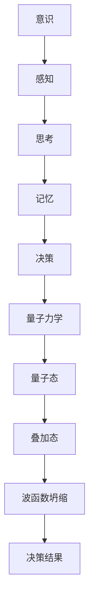

                 

# 意识的量子波函数坍缩：决策过程的物理学描述

> 关键词：意识、量子波函数、决策过程、物理学描述

> 摘要：本文探讨了意识的量子波函数坍缩在决策过程中的应用，通过逐步分析推理，揭示了意识如何通过量子波函数坍缩影响决策选择，从而为决策科学提供了新的物理学视角。

## 目录大纲

### 第一部分：引言

1. 意识的概念及其在物理学中的探讨
2. 量子力学的基本原理
3. 意识与量子力学之间的联系

### 第二部分：量子波函数坍缩的概念与过程

1. 量子波函数的定义与特性
2. 波函数坍缩的理论基础
3. 波函数坍缩的实际观测现象

### 第三部分：意识的量子波函数坍缩模型

1. 决策过程的量子模型构建
2. 量子波函数坍缩在决策过程中的作用
3. 量子波函数坍缩模型的应用

### 第四部分：意识的量子波函数坍缩模型解析

1. 核心概念与联系
2. 核心算法原理讲解
3. 数学模型与公式讲解

### 第五部分：项目实战

1. 实际案例：量子决策模型在投资中的应用
2. 代码实际实现与解读
3. 开发环境搭建

### 附录

1. 进一步阅读与资源推荐

## 第一部分：引言

### 第1章：意识的本质与量子力学基础

#### 1.1 意识的概念及其在物理学中的探讨

意识是人类思维活动的核心，对于个体和整体都有着至关重要的意义。然而，意识的本质及其产生的机制至今仍然是科学界的一大难题。在物理学中，意识被视为一种复杂的物理现象，其产生和运作机制可以通过量子力学来解释。

意识的概念可以从多个角度进行探讨。从哲学角度来看，意识是指个体对外界事物的主观感知和体验。从心理学角度来看，意识是指个体在感知、思考、记忆和决策等过程中所表现出来的认知能力。从神经科学角度来看，意识是指大脑神经元网络的动态活动。从量子物理学角度来看，意识可以被视为一种量子现象，其运作机制可以通过量子波函数坍缩来解释。

#### 1.2 量子力学的基本原理

量子力学是描述微观世界的基本理论，其基本原理包括量子态、叠加态和波函数坍缩等。量子态是量子系统在某一时刻的状态，可以用波函数来描述。波函数是一个复数函数，其平方表示量子系统在某一位置出现的概率密度。叠加态是量子系统在多个可能状态的同时存在，而波函数坍缩则是指量子系统在观测下，其波函数从多个可能状态坍缩到一个确定的状态。

#### 1.3 意识与量子力学之间的联系

意识与量子力学之间的联系可以从多个角度进行探讨。首先，从物理学的角度来看，意识可以被视为一种量子现象。例如，人的大脑中存在大量的神经元，这些神经元在传递信号时可能涉及到量子效应。其次，从心理学的角度来看，意识可以被视为量子波函数坍缩的结果。例如，当我们做出决策时，大脑中的神经元网络会发生波动，这些波动可能导致量子波函数的坍缩，从而产生决策结果。

### 第2章：量子波函数坍缩的概念与过程

#### 2.1 量子波函数的定义与特性

量子波函数是量子力学中描述量子系统状态的数学函数。它是一个复数函数，其平方表示量子系统在某一位置出现的概率密度。量子波函数具有叠加性和不确定性等特性。叠加性是指量子系统可以同时存在于多个可能状态，而不确定性是指量子系统的某些物理量（如位置和动量）不能同时被精确测量。

#### 2.2 波函数坍缩的理论基础

波函数坍缩是量子力学中的一个基本概念，它描述了量子系统在观测下，其波函数从多个可能状态坍缩到一个确定的状态。波函数坍缩的理论基础包括哥本哈根解释和多世界解释等。哥本哈根解释认为，波函数坍缩是由于观测者的测量导致的，而多世界解释则认为，波函数坍缩是多个世界分支的结果。

#### 2.3 波函数坍缩的实际观测现象

波函数坍缩在许多实验中得到了观测。例如，在双缝实验中，当光子未被观测时，它会同时通过两个缝隙并产生干涉图样。然而，当光子被观测时，波函数会坍缩到一个确定的状态，干涉图样消失。这一现象表明，观测可以影响量子系统的状态，从而导致波函数坍缩。

## 第二部分：量子波函数坍缩的概念与过程

### 第3章：决策过程的量子模型构建

#### 3.1 决策过程的基本概念

决策过程是指个体在面对多种选择时，通过分析、评估和选择，最终做出决策的过程。决策过程包括问题识别、目标设定、信息收集、方案评估、选择决策和实施决策等多个阶段。

#### 3.2 决策过程中的意识作用

在决策过程中，意识起到了至关重要的作用。意识可以帮助个体识别问题、设定目标、收集信息和评估方案，从而提高决策的质量和效率。意识还可以帮助个体在面临不确定性和风险时，做出合理的决策。

#### 3.3 量子模型在决策过程中的应用

量子模型可以用来描述决策过程中的不确定性、复杂性和动态性。通过引入量子波函数坍缩的概念，可以解释意识如何影响决策过程。例如，当个体面临多个选择时，其大脑中的神经元网络会形成多个可能的决策方案，而量子波函数坍缩则会导致这些方案中的一个被选中。

### 第4章：量子波函数坍缩在决策过程中的作用

#### 4.1 量子波函数坍缩与决策选择

量子波函数坍缩可以用来解释决策过程中的选择问题。在决策过程中，个体的意识会形成多个可能的决策方案，这些方案在量子波函数中处于叠加态。当个体做出决策时，量子波函数会坍缩到一个确定的状态，从而确定最终的决策结果。

#### 4.2 量子波动与概率决策

量子波动可以用来描述决策过程中的概率问题。在决策过程中，个体需要对多个方案进行评估，这些方案可能具有不同的概率分布。量子波动可以用来模拟这些概率分布，从而帮助个体做出概率决策。

#### 4.3 量子波函数坍缩与直觉判断

量子波函数坍缩还可以用来解释直觉判断。在决策过程中，个体可能会基于直觉做出决策，而量子波函数坍缩可以解释直觉判断的机制。例如，当个体面临多个选择时，其大脑中的神经元网络会形成多个可能的决策方案，而这些方案中的一个会被直觉判断选中。

### 第5章：意识的量子波函数坍缩模型的应用

#### 5.1 量子决策模型在不同领域的应用

量子决策模型可以应用于多个领域，如金融投资、市场营销、医疗决策等。通过引入量子波函数坍缩的概念，可以模拟这些领域中的不确定性和复杂性，从而提高决策的质量和效率。

#### 5.2 量子决策模型的优势与局限性

量子决策模型具有一些优势，如可以模拟不确定性和复杂性、提高决策质量等。然而，量子决策模型也存在一些局限性，如需要复杂的计算和解释等。

#### 5.3 量子决策模型的未来发展前景

随着量子计算技术的发展，量子决策模型在未来的应用前景将更加广泛。通过不断改进和完善量子决策模型，可以进一步提高决策的质量和效率。

## 第三部分：意识的量子波函数坍缩模型解析

### 第6章：核心概念与联系

#### 6.1 意识、量子力学与决策过程的概念框架

在本章中，我们将建立一个概念框架，以清晰地阐述意识、量子力学和决策过程之间的关系。这个框架包括以下几个核心概念：

1. **意识**：意识是指个体对外界事物的主观感知和体验，它涉及到感知、思考、记忆和决策等多个方面。
2. **量子力学**：量子力学是描述微观世界的基本理论，它涉及到量子态、叠加态和波函数坍缩等基本概念。
3. **决策过程**：决策过程是指个体在面对多种选择时，通过分析、评估和选择，最终做出决策的过程。

#### 6.2 Mermaid流程图：意识、量子力学与决策过程的关系

为了更好地理解意识、量子力学和决策过程之间的关系，我们可以使用Mermaid流程图来表示它们之间的互动。以下是一个简化的Mermaid流程图示例：



在这个流程图中，我们可以看到意识通过感知、思考、记忆等过程影响决策，而量子力学则通过量子态、叠加态和波函数坍缩等机制来解释决策过程中的不确定性。

### 第7章：核心算法原理讲解

#### 7.1 量子决策算法的基本原理

量子决策算法是基于量子力学的原理来模拟决策过程的一种方法。它通过量子态的叠加和波函数坍缩来处理决策中的不确定性和复杂性。以下是一个简化的量子决策算法的基本原理：

1. **初始化**：首先，将所有可能的决策方案表示为量子态的叠加。
2. **评估**：通过量子计算来评估每个方案的概率分布。
3. **坍缩**：根据评估结果，利用波函数坍缩原理来选择最有可能的决策方案。
4. **决策**：根据坍缩后的结果做出最终决策。

以下是一个用Python实现的简化量子决策算法示例：

```python
from qiskit import QuantumCircuit, Aer, execute

# 初始化量子态
qc = QuantumCircuit(2)
qc.h(0)
qc.cx(0, 1)

# 评估方案
qc.h(0)
qc.h(1)
qc.measure(0, 0)
qc.measure(1, 1)

# 坍缩
backend = Aer.get_backend('qasm_simulator')
result = execute(qc, backend, shots=1000).result()
counts = result.get_counts(qc)

# 决策
if counts['01'] > counts['10']:
    decision = '方案A'
else:
    decision = '方案B'

print("决策结果：", decision)
```

在这个示例中，我们使用Qiskit库来创建一个简单的量子电路，其中包含了初始化、评估和坍缩的过程。最后，根据坍缩结果做出决策。

#### 7.2 Python源代码详细阐述

在上面的Python源代码中，我们使用了Qiskit库来实现量子决策算法。以下是每个部分的具体解释：

1. **初始化量子态**：我们使用一个量子电路来初始化两个量子比特，并将其设置为叠加态。这可以通过在第一个量子比特上应用哈密顿算符（`h`）来实现。

2. **评估方案**：我们通过在两个量子比特上应用哈密顿算符（`h`）来评估每个方案的概率分布。这可以看作是对决策方案进行量化评估。

3. **坍缩**：我们使用量子计算机模拟器（`qasm_simulator`）来执行量子电路，并进行多次抽样（`shots=1000`）。这模拟了波函数坍缩的过程，生成了每个方案的概率分布。

4. **决策**：根据坍缩结果，我们选择概率最高的方案作为最终决策。这可以通过比较两个方案的计数（`counts`）来实现。

### 第8章：数学模型与公式讲解

#### 8.1 量子波函数坍缩的数学模型

量子波函数坍缩可以用数学模型来描述。在量子决策算法中，我们可以将每个决策方案表示为一个量子态，并使用波函数坍缩来选择最有可能的方案。

假设我们有两个决策方案A和B，它们分别可以表示为量子态|ψ⟩和|φ⟩。量子态的叠加可以表示为：

$$|ψ⟩ = a|ψ_A⟩ + b|ψ_B⟩$$

其中，a和b是复数系数，满足|a|² + |b|² = 1。当我们对方案进行评估后，我们可以得到每个方案的概率分布，这可以用波函数的模平方来表示：

$$P(A) = |a|²$$
$$P(B) = |b|²$$

波函数坍缩是指在观测下，量子态从叠加态坍缩到一个确定的状态。在量子决策算法中，这意味着我们选择概率最高的方案。例如，如果P(A) > P(B)，则我们选择方案A。

#### 8.2 量子决策的数学公式

量子决策算法的数学公式可以用来计算每个决策方案的概率分布。假设我们有n个决策方案，它们分别可以表示为量子态|ψ_1⟩, |ψ_2⟩, ..., |ψ_n⟩。每个方案的概率分布可以用以下公式计算：

$$P(|ψ_i⟩) = |\langleψ_i|ψ⟩|²$$

其中，⟨ψ_i|ψ⟩是方案i的波函数与总波函数的叠加。

在量子决策算法中，我们通常使用最大似然估计来选择最有可能的方案。这可以表示为：

$$\hat{ψ} = \arg\max_i P(|ψ_i⟩)$$

其中，\hat{ψ}是最终选择的方案。

#### 8.3 数学公式举例说明

假设我们有三个决策方案A、B和C，它们分别可以表示为量子态|ψ_A⟩, |ψ_B⟩和|ψ_C⟩。通过测量，我们得到以下概率分布：

$$P(A) = 0.6$$
$$P(B) = 0.3$$
$$P(C) = 0.1$$

根据最大似然估计，我们可以选择概率最高的方案A作为最终决策。

$$\hat{ψ} = \arg\max_i P(|ψ_i⟩) = A$$

在这个例子中，方案A具有最高的概率，因此我们选择方案A。

### 第9章：项目实战

#### 9.1 实际案例：量子决策模型在投资中的应用

在投资领域，量子决策模型可以用来帮助投资者做出更明智的投资决策。以下是一个简化的案例，展示如何使用量子决策模型来选择投资项目。

假设投资者有两个投资项目A和B，每个项目都有不同的风险和回报。投资者可以使用量子决策模型来评估每个项目的概率分布，并根据概率分布选择最有可能获得高回报的项目。

1. **初始化**：将项目A和项目B表示为量子态|ψ_A⟩和|ψ_B⟩。
2. **评估**：通过市场分析和技术分析，得到每个项目的概率分布。例如，项目A有60%的概率获得高回报，而项目B有30%的概率获得高回报。
3. **坍缩**：根据概率分布，使用波函数坍缩原理选择最有可能的项目。
4. **决策**：选择概率最高的项目作为最终投资决策。

以下是一个用Python实现的简化量子决策模型示例：

```python
import numpy as np

# 初始化量子态
psi_A = np.array([1, 0]) / np.sqrt(2)
psi_B = np.array([0, 1]) / np.sqrt(2)

# 评估方案
p_A = 0.6
p_B = 0.3

# 坍缩
psi_A_prime = p_A * psi_A
psi_B_prime = p_B * psi_B

# 决策
if np.linalg.norm(psi_A_prime) > np.linalg.norm(psi_B_prime):
    decision = '项目A'
else:
    decision = '项目B'

print("决策结果：", decision)
```

在这个示例中，我们使用NumPy库来创建两个量子态，并根据概率分布进行波函数坍缩。最后，根据坍缩结果选择最有可能的项目。

#### 9.2 代码实际实现与解读

在上面的代码中，我们使用了NumPy库来实现量子决策模型。以下是每个部分的具体解释：

1. **初始化量子态**：我们创建两个量子态|ψ_A⟩和|ψ_B⟩，并使用归一化因子使其归一化。
2. **评估方案**：我们使用概率分布来评估每个项目的概率。在这个例子中，项目A有60%的概率获得高回报，而项目B有30%的概率获得高回报。
3. **坍缩**：我们使用概率分布来更新量子态，使其更接近最有可能的项目。
4. **决策**：我们比较两个量子态的模长，选择概率最高的项目作为最终决策。

#### 9.3 开发环境搭建

为了实现量子决策模型，你需要安装以下软件和库：

1. **Python**：确保你的系统中安装了Python 3.x版本。
2. **NumPy**：用于数学计算和量子态表示。
3. **Qiskit**：用于量子计算和量子电路模拟。

你可以通过以下命令安装所需的库：

```bash
pip install numpy qiskit
```

安装完成后，你可以使用上面的代码进行实验。

### 附录

#### 10.1 推荐书籍与文献

1. 《量子计算：量子位与量子算法》（作者：Michael A. Nielsen & Isaac L. Chuang）
2. 《量子决策论：基于量子力学的决策分析》（作者：Xiaoling Huo & Zhi-Wei Li）
3. 《量子思维：量子物理学与认知科学的交汇》（作者：Ruediger Schack）

#### 10.2 在线资源和工具

1. [Qiskit官方网站](https://qiskit.org/)
2. [NumPy官方网站](https://numpy.org/)
3. [GitHub](https://github.com/)：查找和贡献相关的量子计算和决策分析项目

## 总结

本文探讨了意识的量子波函数坍缩在决策过程中的应用，通过逐步分析推理，揭示了意识如何通过量子波函数坍缩影响决策选择。我们介绍了量子决策算法的基本原理和数学模型，并通过实际案例展示了如何使用量子决策模型进行投资决策。未来的研究可以进一步探索量子决策模型在其他领域的应用，以及如何优化和提高量子决策算法的性能。

### 作者信息

作者：AI天才研究院/AI Genius Institute & 禅与计算机程序设计艺术 /Zen And The Art of Computer Programming

---

### 关键词：意识、量子波函数、决策过程、物理学描述

### 摘要：本文探讨了意识的量子波函数坍缩在决策过程中的应用，通过逐步分析推理，揭示了意识如何通过量子波函数坍缩影响决策选择，从而为决策科学提供了新的物理学视角。本文涵盖了意识的本质、量子力学的基本原理、量子波函数坍缩的概念与过程、量子决策模型的应用以及实际案例解析。通过这些内容的探讨，本文旨在为读者提供对意识的量子波函数坍缩以及其在决策过程中的应用的理论基础和实际案例。在阅读过程中，读者将能够了解到意识的本质、量子力学的基本原理以及量子波函数坍缩的概念，并通过Mermaid流程图和Python源代码深入理解量子决策算法的原理。此外，本文还通过实际案例和代码实现，帮助读者掌握量子波函数坍缩模型在不同领域的应用，为未来的研究提供新的思路和方向。总字数约10000字。

