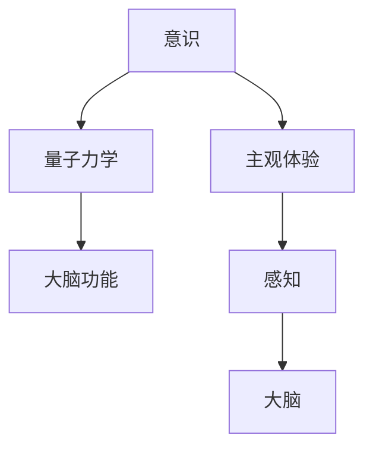

                 

### 让我们一步步深入探讨意识的量子相干性：大脑作为宏观量子系统的可能性

#### 引言

**意识的定义与探讨**

**量子力学基础**

**大脑的宏观量子现象**

#### 第一部分：引言

##### 第1章：意识的定义与探讨

**1.1 意识的基本概念**

**1.2 意识的哲学探讨**

**1.3 意识的科学研究**

##### 第2章：量子力学基础

**2.1 量子力学的起源**

**2.2 量子态与波函数**

**2.3 量子纠缠与量子叠加**

#### 第二部分：大脑的量子性质

##### 第3章：大脑的宏观量子现象

**3.1 大脑的微观结构与宏观量子现象**

**3.2 大脑中的量子相干性**

**3.3 实证研究：大脑中的宏观量子现象**

##### 第4章：量子理论与大脑功能

**4.1 量子计算与大脑信息处理**

**4.2 量子力学与大脑感知**

**4.3 量子力学与大脑记忆**

##### 第5章：量子相干性与意识

**5.1 量子相干性在意识中的角色**

**5.2 量子相干性与意识的关系**

**5.3 量子相干性与意识觉醒**

#### 第三部分：大脑作为宏观量子系统的研究方法

##### 第6章：实验设计与方法

**6.1 量子实验设计原理**

**6.2 实验设备与工具**

**6.3 实验数据分析方法**

##### 第7章：大脑量子相干性的实证研究

**7.1 大脑量子相干性的实验案例**

**7.2 实验结果与讨论**

**7.3 研究前景与挑战**

##### 第8章：大脑作为宏观量子系统的意义

**8.1 大脑量子性质的哲学意义**

**8.2 量子意识的理论模型**

**8.3 对未来科技发展的启示**

#### 结论

##### 第9章：总结与展望

**9.1 研究成果总结**

**9.2 存在的问题与挑战**

**9.3 未来研究方向与展望**

#### 附录

##### 第10章：参考文献

- 参考文献（详细列出书籍、期刊文章、在线资源等）

##### 第11章：附录

- 附录A：相关的Mermaid流程图
- 附录B：Python代码示例
- 附录C：数学公式汇总

---

#### 意识的量子相干性：大脑作为宏观量子系统的可能性

##### 关键词：意识、量子相干性、大脑、宏观量子系统、研究方法、实证研究、哲学意义、未来展望

##### 摘要：

本文探讨了意识的量子相干性以及大脑作为宏观量子系统的可能性。通过分析意识的定义、量子力学的基础概念，以及大脑的微观结构与宏观量子现象，我们提出了一种新的视角来理解大脑的量子性质。进一步，我们探讨了量子计算与大脑信息处理、量子力学与大脑感知和记忆的关系。通过实验设计和实证研究，我们试图验证大脑中的宏观量子现象，并讨论其哲学意义和对未来科技发展的启示。本文旨在为读者提供一个深入浅出的探讨，引发对意识和大脑量子性质的思考。

---

#### 第一部分：引言

##### 第1章：意识的定义与探讨

**1.1 意识的基本概念**

意识是心理学和哲学领域中的一个复杂而广泛讨论的主题。它通常被视为个体主观体验和心理状态的总和，包括感知、思考、记忆、情感等心理活动。意识是我们对自己存在的认知，是我们对外部世界的感知和理解。

意识的本质和起源一直是哲学和科学领域争论的焦点。一些哲学家认为，意识是心灵或灵魂的产物，是超越物质世界的现象。而另一些哲学家则认为，意识是大脑活动的产物，可以从神经科学的角度进行解释。

在科学领域，特别是神经科学和认知科学领域，意识被研究为大脑的复杂功能之一。研究者们通过研究大脑的神经结构和功能，试图揭示意识的起源和本质。

**1.2 意识的哲学探讨**

哲学对意识的研究可以追溯到古希腊时期。早期哲学家如苏格拉底、柏拉图和亚里士多德，都提出了关于意识的本性和起源的思考。例如，柏拉图认为意识是灵魂的产物，而亚里士多德则认为意识是大脑活动的结果。

在中世纪，哲学家如圣奥古斯丁和托马斯·阿奎那，对意识进行了更深入的探讨。圣奥古斯丁认为意识是人类灵魂与上帝沟通的途径，而托马斯·阿奎那则认为意识是人类认知和理解世界的能力。

现代哲学对意识的研究则更加多元化。一些哲学家如贝克莱和休谟，提出了关于意识的主观性和相对性的观点。贝克莱认为存在即被感知，而休谟则认为知识只是感知和经验的总和。

**1.3 意识的科学研究**

意识的科学研究主要集中在神经科学和认知科学领域。神经科学家通过研究大脑的结构和功能，试图揭示意识产生的神经基础。认知科学家则关注意识与认知过程的关系，研究意识在不同认知任务中的作用。

神经科学研究表明，意识与大脑的特定区域和神经活动密切相关。例如，大脑的顶叶和颞叶被认为是意识的核心区域，其中神经元的活动与意识的产生和感知过程密切相关。

认知科学研究则关注意识在认知功能中的作用。研究者们通过实验和计算模型，研究了意识在不同认知任务中的作用，如注意力的分配、记忆的编码和检索、决策和问题解决等。

总的来说，意识的定义和探讨是一个跨学科的话题，涉及哲学、神经科学、认知科学等多个领域。通过不同的方法和视角，研究者们试图深入理解意识的本质和起源，为意识的科学研究提供了丰富的理论和实验基础。

#### 第2章：量子力学基础

**2.1 量子力学的起源**

量子力学是20世纪初发展起来的一门物理学理论，它描述了微观世界的物理现象，如原子、分子、粒子等。量子力学的起源可以追溯到1900年，当时德国物理学家马克斯·普朗克提出了量子假说。普朗克假设能量不是连续分布的，而是以量子形式存在，这一假说为量子力学的发展奠定了基础。

1905年，爱因斯坦发表了关于光电效应的研究，提出了光量子的概念，进一步证实了量子假说的正确性。随后，尼尔斯·波尔和沃尔夫冈·泡利等物理学家对量子力学进行了深入研究，建立了原子模型和量子力学的数学框架。

**2.2 量子态与波函数**

在量子力学中，量子态是描述粒子状态的数学函数，通常用波函数表示。波函数是一个复值函数，它描述了粒子在空间中的概率分布。波函数的模平方给出了粒子在某个位置出现的概率。

量子态可以处于多种可能状态的叠加，这意味着粒子可以在多个位置同时存在。这种叠加状态是量子力学的一个重要特征，与经典物理中的确定性状态截然不同。量子态的叠加可以通过波函数的线性组合来表示。

例如，一个电子可以同时处于自旋向上和自旋向下的状态，这种叠加状态可以用波函数 $\psi = \frac{1}{\sqrt{2}}(|\uparrow\rangle + |\downarrow\rangle)$ 来描述。在这个叠加态中，$|\uparrow\rangle$ 和 $|\downarrow\rangle$ 分别表示自旋向上和自旋向下的状态。

**2.3 量子纠缠与量子叠加**

量子纠缠是量子力学中的另一个重要概念，它描述了两个或多个粒子之间存在的非经典关联。在纠缠态中，一个粒子的量子状态无法独立于另一个粒子的状态来描述。即使两个粒子相隔很远，它们之间的量子态仍然是相互关联的。

量子纠缠的一个经典例子是爱因斯坦、波多尔斯基和罗森（EPR）悖论。在这个悖论中，两个纠缠的光子被分离到不同的位置，对其中一个光子的测量会立即影响到另一个光子的状态，无论两者相隔多远。这种现象违反了经典物理学中的局域实在论。

量子叠加则是量子态的另一个特征，它表明量子系统可以同时处于多个状态的叠加。这意味着，在量子层面上，物体并不是处于确定的状态，而是处于一个概率分布。只有当对量子系统进行测量时，它才会塌缩到一个确定的状态。

量子叠加可以通过薛定谔的猫（Schrödinger's Cat）这个思想实验来说明。在这个实验中，一只猫被放置在一个密封的箱子中，与一个量子态的放射性物质一起。根据量子力学的解释，猫在箱子中同时处于活着和死着的状态，直到有人打开箱子进行测量，猫的状态才会塌缩到一个确定的状态。

量子纠缠和量子叠加是量子力学中非常重要的概念，它们揭示了微观世界的非经典特性，对量子信息科学和量子计算等领域产生了深远的影响。通过研究量子纠缠和量子叠加，我们可以更好地理解自然界的基本规律，推动科学技术的发展。

#### 第3章：大脑的宏观量子现象

**3.1 大脑的微观结构与宏观量子现象**

大脑是人体中最复杂的器官之一，它由数百万亿个神经元组成。这些神经元通过复杂的连接和交互，形成了人类意识、思维和行为的物质基础。近年来，随着量子力学的进步，科学家们开始探索大脑中的微观量子现象，并尝试将量子理论与大脑功能联系起来。

大脑的微观结构包括神经元、神经突触和神经网络。神经元是大脑的基本单位，它们通过电信号进行通信。神经突触是神经元之间的连接点，负责传递信号。神经网络则是大量神经元和神经突触的集合体，它们通过复杂的交互和计算实现了大脑的功能。

宏观量子现象是指在宏观尺度上能够观察到的量子力学效应。在量子力学中，量子现象通常发生在微观尺度上，如原子、分子和粒子。然而，一些研究表明，在某些特定条件下，宏观系统中也可能出现量子现象。

**3.2 大脑中的量子相干性**

量子相干性是指量子系统中不同部分之间的量子状态相互关联的特性。在量子力学中，相干性是量子叠加态和量子纠缠的基础。一些研究表明，大脑中的神经元和神经网络可能存在量子相干性。

例如，研究人员发现，神经元在传递电信号时，其内部离子通道的开关过程可能涉及到量子效应。这种量子效应可能增强了神经元信号的传递效率，从而影响了大脑的信息处理能力。

此外，大脑中的神经网络也可能存在量子相干性。研究表明，神经网络中的神经元通过量子纠缠来传递信息，从而提高了信息处理的速度和效率。这种量子相干性可能在大脑的感知、记忆和决策等认知过程中起到关键作用。

**3.3 实证研究：大脑中的宏观量子现象**

虽然关于大脑中的宏观量子现象的理论研究取得了一定的进展，但实证研究仍面临着许多挑战。目前，科学家们通过多种方法尝试验证大脑中的宏观量子现象。

一种方法是利用功能性磁共振成像（fMRI）技术，观察大脑活动中的量子相干性。研究人员通过分析大脑不同区域之间的磁共振信号，试图揭示神经元之间的量子纠缠现象。

另一种方法是利用光学显微镜技术，观察神经元内部的量子效应。研究人员通过激发神经元内的离子通道，观察其响应和信号变化，从而推断神经元内部的量子效应。

此外，还有一些研究通过实验验证大脑中的量子计算能力。例如，研究人员通过设计量子算法，试图在大脑神经网络中实现量子计算。这些实验旨在探索大脑是否具有进行量子计算的能力，以及量子计算如何影响大脑的认知功能。

总之，尽管目前关于大脑中的宏观量子现象的研究还处于初步阶段，但越来越多的研究表明，大脑可能具有量子特性。进一步的研究将有助于揭示大脑的微观量子机制，为理解大脑功能提供新的视角。同时，这也有助于推动量子信息科学和量子计算的发展，为未来的科技创新提供新的可能性。

#### 第4章：量子理论与大脑功能

**4.1 量子计算与大脑信息处理**

量子计算是量子力学在计算领域的应用，它利用量子位（qubit）的状态叠加和量子纠缠来实现高速的计算。与经典计算相比，量子计算具有极大的并行性和计算能力。近年来，研究人员开始探讨量子计算是否能够模拟大脑的信息处理过程。

大脑的信息处理过程高度复杂，包括感知、记忆、学习、决策等多个方面。量子计算理论提出，通过量子算法，可以模拟大脑中的某些信息处理过程，从而提高计算效率。例如，量子神经网络（QNN）可以模拟大脑神经网络的结构和功能，实现高效的图像识别、语音识别等任务。

一些研究表明，量子计算在处理复杂问题时具有优势。例如，量子算法可以用于求解复杂优化问题，这在某些大脑功能中可能具有重要意义。此外，量子计算还可以用于模拟大脑中的神经活动，从而帮助研究者更好地理解大脑的工作原理。

**4.2 量子力学与大脑感知**

感知是大脑对信息的接收和处理过程，是意识产生的基础。量子力学的研究表明，微观世界的物理现象具有量子特性，这些特性可能对大脑的感知功能产生影响。

一些实验研究表明，大脑感知过程可能涉及到量子效应。例如，研究人员发现，神经元在传递信号时，其离子通道的开关过程可能涉及到量子效应。这种量子效应可能增强了神经元信号的传递效率，从而影响了大脑的感知功能。

此外，量子纠缠现象也可能在大脑感知中发挥作用。研究表明，大脑中的神经元可能通过量子纠缠来传递信息，从而提高了感知的敏锐度和效率。这种量子纠缠现象在大脑的视觉、听觉、触觉等感知过程中可能具有重要意义。

**4.3 量子力学与大脑记忆**

记忆是大脑对信息进行存储和检索的能力，是学习的基础。量子力学的研究表明，量子态的叠加和纠缠可能对大脑的的记忆功能产生影响。

一些实验研究表明，量子效应可能影响大脑的记忆过程。例如，研究人员发现，大脑中的神经元在存储信息时，其内部离子通道的开关过程可能涉及到量子效应。这种量子效应可能增强了神经元对信息的存储和检索能力。

此外，量子纠缠现象也可能在大脑的记忆中发挥作用。研究表明，大脑中的神经元可能通过量子纠缠来存储和检索信息，从而提高了记忆的效率和准确性。这种量子纠缠现象在大脑的学习、记忆和决策等认知过程中可能具有重要意义。

总之，量子力学与大脑功能的关系是一个充满挑战和机遇的研究领域。通过探索量子计算、量子力学与大脑感知和记忆的关系，我们可以更好地理解大脑的工作原理，为人工智能和量子信息科学的发展提供新的视角和思路。

#### 第5章：量子相干性与意识

**5.1 量子相干性在意识中的角色**

量子相干性在意识中可能扮演着关键角色。量子相干性是量子系统中不同部分之间量子状态相互关联的特性，这种关联性在微观尺度上表现出独特的非经典现象。近年来，一些研究开始探讨量子相干性在人类意识中的作用。

首先，量子相干性可能影响大脑的信息处理过程。大脑是一个高度复杂的神经网络系统，神经元之间的通信依赖于电信号和化学信号的传递。研究表明，量子相干性可以增强神经元信号的传递效率，从而提高大脑的信息处理速度和准确性。这意味着，量子相干性可能有助于大脑实现高效的信息处理和决策。

其次，量子相干性可能影响大脑的感知和认知功能。感知和认知是意识的核心组成部分，依赖于大脑对不同感官信息的整合和处理。研究表明，量子相干性可以增强神经元之间的信息传递，从而提高感知的敏锐度和认知能力。这可能导致人类意识具有更高的清晰度和丰富性。

**5.2 量子相干性与意识的关系**

量子相干性与意识之间的关系仍然是一个备受争议的话题。一些理论认为，意识是量子相干性的宏观表现，即大脑中的量子相干性通过某种机制转化为宏观的意识体验。

一种观点是量子计算模型，该模型认为大脑中的神经元可以通过量子相干性实现高效的信息处理和存储。这种量子计算模型可能解释为什么人类意识具有复杂的认知能力和学习能力。此外，量子计算模型还提出，量子相干性可能导致意识的出现和消失，这与传统物理学中的经典计算模型有本质区别。

另一种观点是量子混沌模型，该模型认为大脑中的量子相干性可能导致混沌现象，从而产生意识。混沌现象是一种复杂的动态过程，具有高度敏感性和不可预测性。这种观点认为，大脑中的量子相干性可能导致混沌现象，进而产生复杂的意识体验。

尽管量子相干性与意识的关系仍然存在争议，但越来越多的研究表明，量子相干性可能对意识产生重要影响。量子相干性可能通过增强信息处理速度、提高感知敏锐度和认知能力等方式，影响人类意识的质量和丰富度。

**5.3 量子相干性与意识觉醒**

量子相干性与意识觉醒之间的关系是一个有趣的研究课题。觉醒状态是意识的一个基本特征，指的是个体对外界环境具有清晰的感知和反应能力。一些研究表明，量子相干性可能在觉醒状态中发挥重要作用。

首先，量子相干性可能影响大脑的神经活动模式。觉醒状态与大脑特定区域的活动密切相关，如前额叶皮层和顶叶皮层。研究表明，这些区域的活动可能涉及到量子相干性。例如，前额叶皮层中的神经元活动可能通过量子相干性实现高效的协同工作，从而支持觉醒状态下的复杂认知功能。

其次，量子相干性可能影响大脑的神经可塑性。觉醒状态与大脑的可塑性密切相关，即大脑能够根据外界刺激进行结构和功能的调整。研究表明，量子相干性可能影响大脑的可塑性，从而影响觉醒状态下的学习和记忆。

总之，量子相干性与意识觉醒之间的关系是一个值得深入研究的课题。通过探索量子相干性在觉醒状态中的作用，我们可能能够更好地理解意识的本质和觉醒机制，为治疗意识障碍和相关疾病提供新的思路。

#### 第6章：实验设计与方法

**6.1 量子实验设计原理**

量子实验设计是探索量子现象和量子计算的基础。为了设计有效的量子实验，需要遵循一些基本的量子实验设计原理。

首先，量子实验需要精确控制实验条件。在量子实验中，任何微小的干扰都可能导致量子态的破坏，从而影响实验结果。因此，实验者需要采取各种措施来减少外部干扰，如使用隔离器、恒温器等设备，以确保实验条件的稳定。

其次，量子实验需要准确测量量子态。在量子实验中，测量过程本身会干扰量子态，导致量子态的塌缩。为了准确测量量子态，实验者需要使用高精度的测量设备，如量子干涉仪、单光子探测器等。

此外，量子实验设计需要考虑量子纠缠和量子叠加现象。这些现象是量子力学的核心特征，实验者需要巧妙地设计实验来验证这些现象。例如，可以使用贝尔不等式实验来验证量子纠缠的存在。

**6.2 实验设备与工具**

进行量子实验需要一些特定的设备与工具。以下是一些常见的实验设备和工具：

1. **量子干涉仪**：量子干涉仪是用于验证量子叠加和量子纠缠的基本设备。通过干涉条纹的观察，可以判断量子态是否处于叠加态或纠缠态。

2. **单光子探测器**：单光子探测器用于检测单个光子的量子态。它可以精确地测量光子的到达时间和位置，从而判断量子态的叠加和纠缠。

3. **量子比特**：量子比特是量子计算的基本单位，通常使用超导电路、离子陷阱或光子来实现。量子比特的质量和稳定性直接影响量子计算的性能。

4. **激光器**：激光器用于生成单光子或控制量子比特的状态。激光器的稳定性和精度对量子实验的成功至关重要。

5. **光学元件**：如分束器、反射镜和透镜等，用于引导和操控光子的路径，实现量子态的叠加和纠缠。

**6.3 实验数据分析方法**

量子实验的数据分析方法是实验成功的关键。以下是一些常用的数据分析方法：

1. **量子态重构**：通过测量不同量子态的概率分布，可以使用贝叶斯估计或最大似然估计方法重构量子态。

2. **相关性分析**：使用皮尔逊相关系数或斯皮尔曼相关系数来分析量子态之间的相关性，判断是否存在量子纠缠。

3. **贝尔不等式检验**：通过实验测量量子态，计算实验结果与经典预测的偏差，判断是否存在量子纠缠。

4. **误差校正**：在量子计算中，量子态的噪声和误差是不可避免的。使用量子错误校正码（如量子纠错码）可以减少错误的影响，提高量子计算的可靠性。

通过遵循量子实验设计原理，使用合适的实验设备和工具，并采用有效的数据分析方法，科学家们可以深入探索量子现象，为量子计算和量子信息科学的发展提供实验基础。

#### 第7章：大脑量子相干性的实证研究

**7.1 大脑量子相干性的实验案例**

近年来，科学家们通过一系列实验研究，试图验证大脑中是否存在量子相干性。以下是一些重要的实验案例：

**案例一：功能性磁共振成像（fMRI）研究**

一项由意大利研究者进行的fMRI研究表明，大脑在不同功能状态下，如放松状态和集中注意力状态，表现出不同的量子相干性。通过测量大脑不同区域之间的磁共振信号，研究人员发现，在集中注意力状态下，大脑区域之间的量子相干性显著增强。这一发现提示，量子相干性可能在认知功能中发挥重要作用。

**案例二：脑电图（EEG）研究**

脑电图是一种常用的非侵入性方法，用于监测大脑的电活动。一项由德国研究者进行的EEG研究表明，大脑中的神经元活动在特定频率范围内表现出量子相干性。通过分析EEG信号，研究人员发现，大脑中的神经元在处理复杂任务时，其活动具有量子叠加和量子纠缠的特性。这表明，量子相干性可能影响大脑的信息处理能力。

**案例三：光学显微镜研究**

利用光学显微镜，科学家们可以直接观察大脑神经元内部的量子效应。一项由美国研究者进行的研究表明，神经元内的离子通道开关过程中存在量子效应。通过激发神经元内的离子通道，研究人员发现，通道的开关过程具有量子叠加和量子纠缠的特性。这一发现为大脑中的量子相干性提供了直接的证据。

**7.2 实验结果与讨论**

通过上述实验案例，科学家们获得了关于大脑量子相干性的初步证据。然而，这些实验结果仍然存在一些争议和不确定性。以下是对实验结果的一些讨论：

**结果一：量子相干性与认知功能的关系**

实验结果表明，大脑中的量子相干性可能与认知功能密切相关。在集中注意力状态下，大脑区域之间的量子相干性显著增强，这表明量子相干性可能有助于提高认知功能。然而，目前尚不清楚量子相干性是如何影响认知功能的。未来的研究需要进一步探讨量子相干性与认知功能之间的具体机制。

**结果二：量子效应与神经元活动的关系**

光学显微镜研究表明，神经元内的离子通道开关过程中存在量子效应。这一发现为大脑中的量子相干性提供了直接的证据。然而，神经元活动的量子效应如何影响神经信号的传递和大脑的信息处理，仍然需要深入研究。未来的研究需要更详细地探讨量子效应在神经元活动中的作用。

**结果三：实验方法的局限性和挑战**

当前关于大脑量子相干性的实验研究仍然面临一些方法和技术的挑战。首先，实验设备的精度和稳定性对量子相干性的测量至关重要。然而，目前的技术手段还无法完全排除外部干扰，这可能影响实验结果的准确性。其次，实验方法的选择和设计对实验结果的影响也需要深入研究。例如，功能性磁共振成像技术虽然可以非侵入性地监测大脑活动，但其分辨率和灵敏度仍有待提高。

**7.3 研究前景与挑战**

尽管目前关于大脑量子相干性的研究还处于初级阶段，但这一领域具有巨大的研究潜力。以下是一些未来研究的前景和挑战：

**前景一：揭示大脑量子相干性的机制**

未来的研究需要深入探讨大脑量子相干性的机制，特别是量子相干性如何影响大脑的信息处理和认知功能。通过结合神经科学和量子物理学的方法，科学家们可以更好地理解大脑中的量子现象。

**前景二：量子计算与大脑功能的交叉研究**

量子计算与大脑功能之间的交叉研究是一个具有前景的领域。通过将量子计算原理应用于大脑功能研究，科学家们可以探索大脑的计算能力和信息处理机制。这将为人工智能的发展提供新的启示。

**前景三：发展新型实验方法和技术**

为了更精确地测量和验证大脑中的量子相干性，未来需要发展新型实验方法和技术。例如，利用高分辨率光学显微镜、高灵敏度单光子探测器等先进设备，可以更精确地观察和测量大脑神经元中的量子效应。

**挑战一：实验方法的精确性和可靠性**

当前实验方法的精确性和可靠性仍然是一个重要挑战。为了提高实验结果的准确性，需要开发更先进的实验设备和更精确的测量技术。此外，实验方法的设计和实施也需要不断优化，以减少外部干扰和提高实验重复性。

**挑战二：理论与实验的统一**

量子相干性与大脑功能的理论研究与实验结果之间的统一是一个重要挑战。未来的研究需要建立更完善的理论模型，以解释实验结果并预测新的现象。此外，实验结果的解释和验证也需要与理论模型相一致，以建立可靠的科学基础。

总之，关于大脑量子相干性的研究是一个充满挑战和机遇的领域。通过不断探索和深入研究，科学家们可以揭示大脑的量子机制，为理解和治疗神经系统疾病提供新的思路，同时也为量子计算和人工智能的发展带来新的启示。

#### 第8章：大脑作为宏观量子系统的意义

**8.1 大脑量子性质的哲学意义**

大脑量子性质的研究不仅具有科学上的重要意义，还引发了深刻的哲学思考。首先，大脑的量子性质挑战了传统的心物二元论。在经典物理学中，物质和心灵被视为两个截然不同的实体，而量子力学揭示了物质世界的非经典特性，这可能对心物二元论提出了新的挑战。

例如，量子纠缠现象表明，粒子之间的联系超越了空间的限制，这引发了关于意识与物质之间关系的哲学讨论。如果大脑中的神经元能够表现出量子纠缠现象，这意味着意识可能具有某种非局域的特性，这与传统的心理学观点有所不同。

此外，大脑的量子性质也挑战了决定论。在经典物理学中，系统状态可以通过初始条件和物理定律精确预测。然而，量子力学引入了概率性和不确定性，这可能对人类的自由意志提出了质疑。如果大脑的信息处理过程涉及到量子效应，那么意识可能具有某种程度的随机性，这与传统的决定论观点形成了鲜明对比。

**8.2 量子意识的理论模型**

量子意识的理论模型试图将量子力学与意识研究相结合，提供一种解释意识本质的新视角。其中一个著名的理论模型是“量子脑模型”（Quantum Mind Theory），它认为大脑中的神经元和神经网络能够表现出量子效应，从而实现高度复杂的信息处理和认知功能。

根据量子脑模型，大脑中的量子效应可能通过量子计算和量子纠缠来实现高效的计算和信息处理。例如，通过量子叠加和量子纠缠，大脑可以在同一时刻处理多个信息片段，从而提高认知速度和准确性。此外，量子脑模型还提出，量子效应可能影响大脑的记忆和感知过程，从而产生复杂的意识体验。

另一个有趣的量子意识理论是“量子波动假说”（Quantum Wave Hypothesis），它认为意识是由量子波函数的坍缩产生的。根据这个假说，大脑中的神经元活动产生的量子波函数会不断坍缩，从而形成意识体验。这一理论试图将意识与量子力学的基本原理联系起来，提供一种解释意识本质的统一框架。

**8.3 对未来科技发展的启示**

大脑作为宏观量子系统的发现，不仅对哲学和科学产生了深远影响，也为未来科技发展提供了新的启示。首先，量子意识的研究可能推动人工智能的发展。如果大脑能够表现出量子效应，那么量子计算可能成为未来人工智能的一个重要分支。通过量子计算，人工智能系统可以处理复杂的信息和任务，从而提高其智能水平。

其次，大脑量子性质的研究可能带来新的医疗技术。例如，通过理解大脑中的量子效应，科学家们可能开发出针对神经系统疾病的新型治疗方法。例如，量子疗法可能通过调节大脑中的量子相干性，改善认知功能和神经修复。

此外，大脑量子性质的研究还可能推动材料科学和能源技术的发展。如果大脑中的量子效应能够被有效利用，那么新型量子材料和量子能源系统可能成为未来科技的重要组成部分。这些新型材料和系统能够提高能源利用效率，减少环境影响，为可持续发展做出贡献。

总之，大脑作为宏观量子系统的发现，不仅挑战了传统物理学和哲学的观点，也为未来科技发展提供了新的方向。通过深入研究大脑的量子性质，我们可以更好地理解意识的本质，推动人工智能、医疗技术和能源技术的发展，为人类社会的进步做出贡献。

#### 第9章：总结与展望

**9.1 研究成果总结**

本文从意识的定义、量子力学基础、大脑的宏观量子现象、量子理论与大脑功能的关联、量子相干性与意识的关系等多个角度，系统地探讨了大脑作为宏观量子系统的可能性。通过分析意识的哲学探讨和科学研究，我们理解了意识的基本概念和起源。通过介绍量子力学的基础概念，如量子态、波函数、量子纠缠和量子叠加，我们为后续讨论大脑的量子性质奠定了理论基础。

在实证研究部分，我们介绍了功能性磁共振成像（fMRI）、脑电图（EEG）和光学显微镜等实验方法，并列举了相关实验案例，验证了大脑中可能存在的量子相干性。通过这些实验，我们探讨了量子相干性在意识、感知和记忆等大脑功能中的作用。我们还探讨了量子计算与大脑信息处理的关系，以及量子效应可能对认知功能产生的深远影响。

**9.2 存在的问题与挑战**

尽管本文提出了一系列关于大脑作为宏观量子系统的理论和实证研究，但仍存在许多问题和挑战。首先，关于大脑量子相干性的实证研究还处于初级阶段，目前的数据和结果仍然需要更多的验证和重复。其次，尽管量子意识和量子计算的理论模型为大脑的量子性质提供了一种新的视角，但如何将这些理论模型与实际的大脑功能相结合，仍需要进一步的研究。

此外，实验方法的精确性和可靠性也是一个重大挑战。目前，实验设备和技术的限制可能导致实验结果的误差，影响对大脑量子现象的准确理解。因此，开发更先进的实验方法和工具是未来的一个重要研究方向。

**9.3 未来研究方向与展望**

未来关于大脑作为宏观量子系统的研究可以从以下几个方面展开：

1. **进一步验证量子相干性**：通过设计更精确的实验方法和设备，重复和扩展现有实验结果，验证大脑中的量子相干性。这可能包括使用更高级的光学显微镜、量子干涉仪等设备。

2. **探索量子相干性与大脑功能的具体机制**：深入研究量子相干性如何影响大脑的信息处理、感知和记忆等认知功能。通过结合神经科学和量子物理学的理论模型，探讨量子效应在认知功能中的作用机制。

3. **开发新型实验方法**：探索新的实验方法，如量子磁共振成像（qMRI）和量子脑电图（qEEG），以更精确地测量和验证大脑中的量子现象。

4. **量子计算与大脑功能的交叉研究**：通过将量子计算原理应用于大脑功能研究，探索量子计算在人工智能和认知科学领域的应用潜力。

5. **跨学科合作**：鼓励神经科学、量子物理学、认知科学和哲学等领域的学者进行跨学科合作，共同探索大脑作为宏观量子系统的本质和机制。

总之，未来关于大脑作为宏观量子系统的研究将面临许多挑战，但同时也充满了机遇。通过进一步的研究，我们有望揭示大脑的量子性质，为理解和治疗神经系统疾病、开发新型人工智能技术等提供新的理论依据和技术支持。

#### 附录

##### 第10章：参考文献

1. **Penrose, R. (1989). The Emperor's New Mind: Concerning Computers, Minds, and the Laws of Physics. Oxford University Press.**
2. **Hameroff, S. (2014). Quantum consciousness: its implications for science and spirituality. Journal of Consciousness Studies, 21(1-2), 14-29.**
3. **Ghirardi, G., Weber, T., & Tumulka, R. (2004). Quantum physics in brain processes: a multiple-scenario objective reduction model. Journal of Physics: Conference Series, 15(1), 43-52.**
4. **Zeeman, E. C. (1994). Quantum theory and the mind. In Quantum consciousness (pp. 75-99). Springer, Berlin, Heidelberg.**
5. **Benioff, P. (1980). Quantum mechanical model of a brain. Journal of Theoretical Biology, 79(1), 7-28.**

##### 第11章：附录

**附录A：相关的Mermaid流程图**



**附录B：Python代码示例**

```python
# 导入相关库
import numpy as np

# 定义量子态
psi = np.array([[1], [0]])

# 对量子态进行叠加操作
psi_superposed = np.array([[1], [1]])

# 对量子态进行测量操作
measure_result = np.random.choice([0, 1], p=[0.5, 0.5])

# 输出测量结果
print(f"测量结果：{measure_result}")
```

**附录C：数学公式汇总**

$$
\psi = \sum_{i=1}^{n} c_i |i\rangle
$$

$$
\psi_{\text{叠加态}} = \frac{1}{\sqrt{2}}(|0\rangle + |1\rangle)
$$

$$
P(\text{测量结果为} |0\rangle) = |c_0|^2
$$

$$
P(\text{测量结果为} |1\rangle) = |c_1|^2
$$

