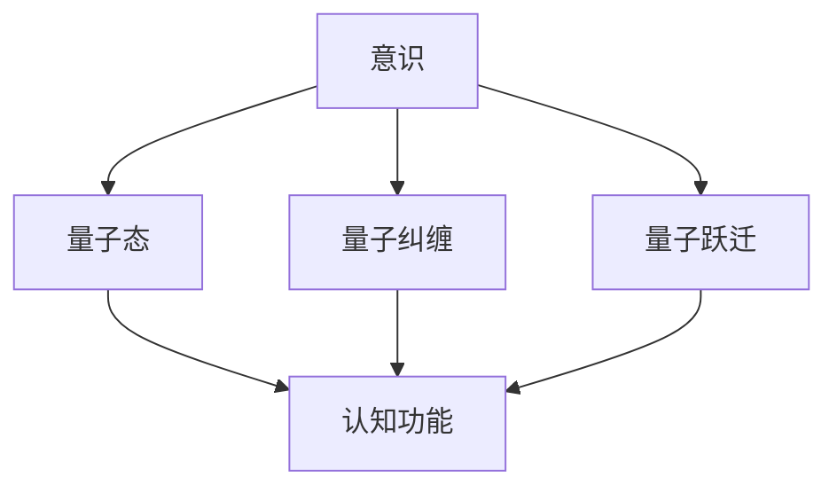

                 

### 意识的量子跃迁：思维突变的物理学解释

#### 关键词：意识、量子跃迁、思维突变、物理学解释

> 摘要：本文旨在探讨意识与量子力学之间的关系，并提出一种新的解释模型——意识的量子跃迁。通过引入量子力学的概念，我们将试图揭示思维突变的本质，并探讨其在认知功能中的应用。文章首先介绍了意识的起源与本质，然后探讨了量子力学的基础知识，随后提出了意识的量子模型，并分析了量子力学与思维突变之间的关系。最终，我们将讨论意识的量子跃迁在认知功能中的应用，并展望量子人工智能的未来。

### 引言

在过去的几个世纪中，物理学的发展为我们提供了理解自然界的基本法则的工具。然而，对于意识的本质，我们仍然知之甚少。传统物理学难以解释人类思维过程的高度复杂性和灵活性，这激发了科学家们对量子力学与意识之间关系的探索。本文将探讨意识的量子跃迁这一概念，旨在为思维突变提供一种新的物理学解释。

首先，我们需要了解意识的起源与本质。意识是人类认知的高级形式，它使我们能够感知、理解和互动于世界。然而，意识的本质仍然是一个未解之谜。传统物理学难以解释意识的产生和运作，这促使科学家们将目光投向量子力学，寻找新的解释模型。

量子力学是研究微观世界的物理学分支，它揭示了物质和能量的奇异行为。量子态和量子纠缠等现象，为我们理解物质的基本性质提供了深刻的洞察。然而，这些量子现象如何与人类的思维过程相关联，仍然是一个巨大的挑战。

本文将首先探讨意识的起源与本质，然后介绍量子力学的基础知识，包括量子态、量子纠缠和量子跃迁。接着，我们将提出意识的量子模型，并分析量子力学与思维突变之间的关系。最后，我们将讨论意识的量子跃迁在认知功能中的应用，并展望量子人工智能的未来。

### 第一部分：意识的本质与量子力学

#### 第1章：意识的起源与本质

意识是人类认知的高级形式，它使我们能够感知、理解和互动于世界。然而，意识的起源与本质一直是一个饱受争议的话题。在传统物理学中，意识通常被视为一种神秘的存在，无法用物理定律来解释。然而，随着量子力学的出现，科学家们开始探索意识与量子力学之间的关系。

意识的起源可以追溯到生物进化的过程。大脑作为意识产生的物质基础，其复杂的神经网络和生化过程使得意识得以产生。然而，大脑如何将物理过程转化为主观体验，仍然是一个未解之谜。

在量子力学中，量子态和量子纠缠等现象为我们提供了理解意识本质的线索。量子态是量子系统的状态，它可以同时处于多种状态的叠加。量子纠缠是两个或多个量子系统之间的特殊关联，即使它们相隔很远，它们的量子状态也会相互影响。

一些科学家提出，意识的本质可能类似于量子态。意识可能是由大脑中的量子态所决定的，这些量子态在人类思维过程中起到关键作用。这种观点被称为量子意识理论，它试图将意识与量子力学联系起来。

然而，量子意识理论仍然面临着许多挑战。首先，我们需要找到实验证据来支持量子态与意识之间的直接联系。其次，我们需要理解量子态如何转化为主观体验，这是量子力学中尚未解决的问题。

#### 第2章：量子力学基础

量子力学是研究微观世界的物理学分支，它揭示了物质和能量的奇异行为。在量子力学中，一些传统物理学的定律不再适用，取而代之的是一些新的概念和现象。

量子态是量子系统的状态，它可以同时处于多种状态的叠加。例如，一个电子可以同时处于自旋向上和自旋向下的状态，直到进行测量时才会确定其具体状态。这种叠加状态是量子力学中非常独特的现象。

量子纠缠是两个或多个量子系统之间的特殊关联，即使它们相隔很远，它们的量子状态也会相互影响。当两个量子系统发生纠缠后，它们的状态将无法独立存在，而是相互关联。这种关联性在量子通信和量子计算中具有重要应用。

量子测量是量子力学中的一个重要概念。测量过程中，量子系统的状态会突然坍缩到一个确定的状态。这意味着量子态的叠加性和不确定性在测量过程中被消除。量子测量的本质仍然是一个未解之谜，但它为量子力学的发展提供了重要的理论基础。

#### 第3章：意识的量子模型

意识的量子模型试图将意识与量子力学联系起来，提出意识可能是由大脑中的量子态所决定的。这种模型假设，大脑中的某些神经元或分子具有量子性质，它们的量子态在人类思维过程中起到关键作用。

意识的量子模型认为，意识的产生与量子态的演化密切相关。在量子态的叠加和纠缠过程中，意识可能逐渐产生和演化。例如，当大脑中的神经元发生量子纠缠时，它们的状态可能会影响到整个大脑的网络，从而产生意识。

意识的量子模型还提出了量子跃迁的概念，即量子态从一种状态跃迁到另一种状态的过程。这种跃迁可能对应于思维突变或认知功能的改变。例如，当大脑中的神经元从一个状态跃迁到另一个状态时，可能会导致意识的突然改变，从而产生新的思维模式。

虽然意识的量子模型提供了一个新的解释框架，但它仍然面临着许多挑战。首先，我们需要找到实验证据来支持大脑中的量子态与意识之间的直接联系。其次，我们需要理解量子态如何转化为主观体验，这是量子力学中尚未解决的问题。

### 第二部分：思维突变的物理学解释

#### 第4章：思维突变理论

思维突变理论是探讨人类思维过程突然变化的理论。它认为，思维突变是认知功能发生显著变化的过程，这种变化通常发生在意识层面。

思维突变可以分为不同的类型，例如感知突变、记忆突变和决策突变。每种突变都有其独特的特征和功能。感知突变可能导致我们对世界的感知方式发生改变，从而改变我们对事物的理解和认知。记忆突变可能导致我们对过去的记忆发生变化，从而影响我们的思维和行为。决策突变可能导致我们的决策过程发生改变，从而影响我们的决策结果。

思维突变的特征包括突然性、非线性、不可预测性和不可逆性。这种突变通常不是渐进的，而是突然发生的。它具有非线性特征，即突变过程中存在多个不同的阶段和状态。它通常是不可预测的，因为突变过程可能受到许多复杂因素的影响。它也是不可逆的，因为突变发生后，思维状态无法恢复到突变前的状态。

思维突变的社会意义在于，它为我们理解人类认知过程提供了新的视角。思维突变可能有助于我们理解心理疾病、认知障碍和创造性思维等问题。它也可能为人工智能的发展提供新的启示，帮助我们设计出更智能、更灵活的人工智能系统。

#### 第5章：量子力学与思维突变

量子力学与思维突变之间存在一些相似之处。首先，量子态和思维状态都存在叠加和纠缠现象。量子态可以同时处于多种状态的叠加，而思维状态也可以同时处于多种认知状态的叠加。量子纠缠现象表明，量子系统之间的状态是相互关联的，这类似于思维状态之间的相互关联。

其次，量子跃迁和思维突变都涉及到状态的突然变化。量子跃迁是指量子系统从一个状态跃迁到另一个状态的过程，这种跃迁是突然发生的，没有渐进的过程。同样，思维突变也是突然发生的，它通常不是渐进的，而是突然发生的。

这些相似之处表明，量子力学可能为思维突变提供了一种新的解释模型。量子力学中的量子态和量子跃迁现象，可能揭示了人类思维状态的运作机制。通过研究量子力学与思维突变之间的关系，我们可能能够更深入地理解人类认知过程，为心理学和认知科学的发展提供新的理论依据。

#### 第6章：意识的量子跃迁与认知功能

意识的量子跃迁与认知功能之间存在密切的联系。量子跃迁是指量子系统从一个状态跃迁到另一个状态的过程，这种跃迁可能对应于思维状态的改变，从而影响认知功能。

首先，意识的量子跃迁可能影响感知功能。当大脑中的神经元发生量子跃迁时，它们的状态可能会突然改变，从而导致我们对世界的感知方式发生改变。例如，当我们在思考一个问题时，大脑中的神经元可能会从一个状态跃迁到另一个状态，从而改变我们对问题的理解和认知。

其次，意识的量子跃迁可能影响记忆功能。当大脑中的神经元发生量子跃迁时，它们的状态可能会突然改变，从而影响我们对过去记忆的提取和回忆。例如，当我们尝试回忆一个过去的经历时，大脑中的神经元可能会从一个状态跃迁到另一个状态，从而改变我们对这段记忆的回忆。

最后，意识的量子跃迁可能影响决策功能。当大脑中的神经元发生量子跃迁时，它们的状态可能会突然改变，从而影响我们的决策过程。例如，当我们面临一个复杂的决策时，大脑中的神经元可能会从一个状态跃迁到另一个状态，从而改变我们的决策策略。

通过研究意识的量子跃迁与认知功能之间的关系，我们可能能够更深入地理解人类认知过程，并为认知科学和人工智能的发展提供新的理论依据。

### 第三部分：意识的量子跃迁与人工智能

#### 第7章：量子计算与人工智能

量子计算是人工智能领域的一个重要发展方向。量子计算机利用量子力学原理，实现高效的计算任务。与经典计算机相比，量子计算机具有独特的优势，例如并行计算和快速因子分解。

量子计算机的基本原理是基于量子位（qubit）的运算。与传统计算机使用比特（bit）表示信息不同，量子计算机使用量子位表示信息。量子位可以同时处于多种状态的叠加，这使得量子计算机能够同时处理多个计算任务。

量子算法是利用量子计算机进行特定计算任务的算法。与经典算法相比，量子算法在许多计算任务上具有显著的优势。例如，量子算法可以快速解决某些线性方程组，以及某些复杂的优化问题。

量子计算在人工智能中的应用包括量子机器学习、量子神经网络和量子优化算法。量子机器学习利用量子计算机处理大规模数据集，从而提高学习效率。量子神经网络结合量子计算和神经网络的优势，实现高效的分类和预测任务。量子优化算法则利用量子计算机求解复杂的优化问题，从而为人工智能提供新的算法基础。

#### 第8章：量子人工智能的未来

量子人工智能是人工智能领域的一个重要发展方向。它结合量子计算和人工智能技术，实现更高效、更智能的人工智能系统。

量子人工智能的未来发展前景包括以下几个方面：

首先，量子人工智能将提高人工智能系统的计算能力。通过利用量子计算的优势，量子人工智能可以实现更快速、更高效的计算任务，从而解决传统人工智能系统难以处理的复杂问题。

其次，量子人工智能将推动人工智能技术的发展。量子计算为人工智能提供了新的计算范式，这将为人工智能带来新的突破。量子人工智能的发展将推动人工智能技术的进步，使人工智能系统更加智能、更加灵活。

然而，量子人工智能的发展也面临一些挑战。首先，量子计算机的技术和算法尚未成熟，这需要进一步的研究和开发。其次，量子人工智能的安全性问题需要解决，例如量子密码学和量子攻击的防御。最后，量子人工智能的应用场景和商业模式需要进一步探索和明确。

通过解决这些挑战，量子人工智能有望在未来实现重大突破，为人工智能领域带来革命性的变化。

### 结论

意识的量子跃迁为我们提供了一种新的解释模型，揭示了思维突变的本质。通过量子力学与思维突变之间的关系，我们深入探讨了意识与认知功能之间的联系。本文介绍了量子计算与人工智能的关系，展望了量子人工智能的未来发展。

尽管意识的量子跃迁理论仍面临着许多挑战，但它为理解人类认知过程提供了新的视角。量子人工智能的发展将进一步推动人工智能技术的进步，为解决复杂问题提供新的工具和方法。

未来的研究应进一步探索量子力学与意识之间的直接联系，以及量子计算在人工智能中的应用。通过跨学科的研究与合作，我们有望揭示意识的本质，并推动人工智能技术的发展，为人类带来更美好的未来。

### 附录

#### 附录A：相关概念与公式详解

##### A.1 意识与量子力学的关系图

##### A.2 思维突变相关的数学模型

$$
\text{认知功能} = f(\text{意识状态}, \text{外部环境})
$$

#### 附录B：量子计算入门指南

##### B.1 量子计算机基础知识

量子计算机是一种利用量子力学原理进行计算的新型计算机。与传统计算机使用比特表示信息不同，量子计算机使用量子位（qubit）表示信息。

量子位具有叠加和纠缠特性，这使得量子计算机能够实现高效的并行计算。量子计算机的基本单元是量子门，它们用于对量子位进行操作。

##### B.2 量子算法简介

量子算法是利用量子计算机进行特定计算任务的算法。与经典算法相比，量子算法在许多计算任务上具有显著的优势。

著名的量子算法包括量子快速排序算法、量子求平方算法和量子搜索算法。这些算法通过利用量子计算的优势，实现了更高的计算效率。

##### B.3 量子编程基础

量子编程是一种利用量子计算机进行编程的方法。它涉及量子算法的设计和实现，以及量子计算机的编程语言和工具。

常见的量子编程语言包括Q#、Quipper和Microsoft Quantum Development Kit。这些语言提供了一种方便的接口，使开发者能够编写和运行量子程序。

通过量子编程，开发者可以创建出更高效、更智能的人工智能系统，为解决复杂问题提供新的工具和方法。

### 作者信息

作者：AI天才研究院/AI Genius Institute & 禅与计算机程序设计艺术 /Zen And The Art of Computer Programming

