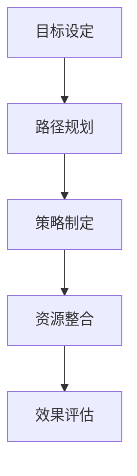
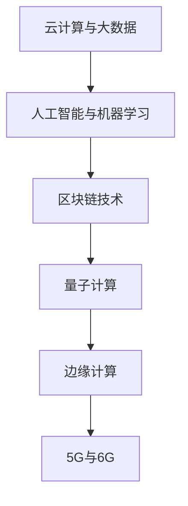

                 

### 第一部分：战略规划与技能提升

#### 第1章：技术规划概述

##### 1.1 技术规划的定义与重要性

**核心概念术语说明**：
- 技术规划：指在特定的技术和市场环境下，针对企业的技术发展路径和资源配置所做的长远规划和布局。
- 战略规划：在更广泛的层面上，指企业为实现长期目标而制定的总体规划和行动计划。

**问题背景**：
随着科技的发展，技术更新换代速度加快，对于P9级别的高级工程师来说，如何规划自己的技术道路，以适应快速变化的技术环境，成为了一个重要课题。

**问题描述**：
P9工程师在技术规划过程中，需要面对技术趋势的把握、技术栈的选择、技能提升路径的确定等多个问题。

**问题解决**：
通过制定清晰的技术规划，P9工程师可以明确自己的职业发展目标，选择合适的技术路径，提升自身竞争力。

**边界与外延**：
技术规划不仅涉及技术本身，还包括市场趋势、团队协作、资源整合等多个方面。

**概念结构与核心要素组成**：
- **目标设定**：明确职业发展的长期和短期目标。
- **路径规划**：规划实现目标的技术路径和阶段性成果。
- **策略制定**：制定具体的实施策略和行动方案。
- **资源整合**：整合内外部资源，确保规划的执行。



##### 1.2 技术规划与职业发展

**核心概念与联系**：

- **技术规划**与**职业发展**紧密相连。技术规划是职业发展的基础，而职业发展是技术规划的终极目标。

**技术规划对职业发展的影响**：

- 技术规划有助于P9工程师明确自己的职业目标，制定合理的成长路径，提高在职业生涯中的竞争力。

**案例说明**：

假设一位P9工程师的目标是成为公司技术总监，那么他的技术规划可能包括以下步骤：

1. **目标设定**：成为公司技术总监。
2. **路径规划**：从当前职位逐步晋升为团队领导，再发展成为技术经理，最终成为技术总监。
3. **策略制定**：通过提升技术能力、增强团队管理能力、扩大业务视野等手段，实现每个阶段的晋升目标。
4. **资源整合**：利用公司内部资源，如培训、导师指导等，加速自身能力的提升。

```python
class CareerPath:
    def __init__(self, goal):
        self.goal = goal

    def set_goals(self, goals):
        self.goals = goals

    def plan_path(self, path):
        self.path = path

    def execute_plan(self):
        print(f"Executing plan: {self.path} with goals {self.goals}")

developer = CareerPath("CTO")
developer.set_goals(["Team Leadership", "Technical Expertise"])
developer.plan_path(["Team Lead", "Tech Manager", "CTO"])
developer.execute_plan()
```

##### 1.3 技术规划与团队管理

**核心概念与联系**：

- 技术规划不仅关乎个人发展，也涉及到团队管理。作为P9级别的工程师，还需要具备良好的团队管理能力。

**技术规划在团队管理中的作用**：

- 技术规划有助于团队目标的明确，提高团队执行力，促进团队成员的个人成长。

**团队管理策略**：

- **目标一致**：确保团队成员对团队目标有清晰的理解和认同。
- **资源分配**：合理分配资源，确保团队能够高效工作。
- **绩效评估**：定期对团队成员进行绩效评估，激励团队成员持续进步。

**总结**：

技术规划是P9工程师职业发展的重要环节。通过明确的目标设定、合理的路径规划、具体的策略制定和资源的整合，P9工程师可以更好地规划自己的职业道路，提升个人和团队的综合能力。

---

接下来，我们将进一步探讨技术趋势分析、技术栈构建以及技能提升策略，帮助P9工程师在技术道路上更加清晰和坚定。

## 第二部分：技术趋势分析

### 第2章：技术趋势分析

#### 2.1 技术发展趋势

**核心概念与联系**：

- 技术发展趋势是指随着时间推移，技术领域所呈现出的演变方向和趋势。

**技术发展趋势的重要性**：

- 了解技术发展趋势有助于P9工程师把握行业动态，提前布局，为个人和团队的发展奠定基础。

**当前主要技术发展趋势**：

1. **云计算与大数据**：云计算的普及和大数据技术的成熟，使得数据处理和分析成为各行业的核心能力。
2. **人工智能与机器学习**：人工智能技术的快速发展，使得自动化和智能化成为各行各业的重要发展方向。
3. **区块链技术**：区块链技术的去中心化和不可篡改性，正在改变传统的金融、供应链等领域。

**未来技术发展趋势**：

1. **量子计算**：量子计算有望解决当前计算机无法处理的问题，推动计算能力的质的飞跃。
2. **边缘计算**：随着物联网设备的普及，边缘计算将成为处理海量数据的关键技术。
3. **5G与6G**：5G技术的广泛应用和6G技术的研发，将进一步推动通信技术的发展。

**Mermaid流程图**：



#### 2.2 行业热点与前沿技术

**核心概念与联系**：

- 行业热点与前沿技术是指当前技术领域中备受关注和重视的新技术和新应用。

**行业热点**：

1. **数字化转型**：数字化转型已经成为企业提高竞争力、实现业务创新的重要手段。
2. **物联网（IoT）**：物联网技术的快速发展，使得智能设备连接和数据采集成为可能。
3. **网络安全**：随着网络攻击的日益增多，网络安全技术变得至关重要。

**前沿技术**：

1. **边缘AI**：边缘AI通过在设备端实现AI推理，降低延迟，提高效率。
2. **自然语言处理（NLP）**：NLP技术的发展，使得人与机器的交互更加自然和流畅。
3. **区块链应用**：区块链技术不仅在金融领域有广泛应用，还在供应链管理、医疗保健等领域展现潜力。

**技术选型与评估**：

- 在选择前沿技术时，P9工程师需要综合考虑技术成熟度、市场需求、团队技能等多方面因素。

**总结**：

了解行业热点与前沿技术，有助于P9工程师把握技术发展的方向，为个人和团队的发展提供支持。在技术选型过程中，要注重技术的实用性和团队的实际能力。

---

接下来，我们将探讨如何构建个人技术栈，以及如何提升专业技能，帮助P9工程师在技术道路上不断前行。

## 第三部分：技术栈构建与技能提升

### 第3章：技术栈构建

#### 3.1 个人技术栈构建原则

**核心概念与联系**：

- 个人技术栈是指个人在技术领域中掌握的各种技能和知识，是职业发展的基础。

**构建原则**：

1. **全面性**：个人技术栈应涵盖多个技术领域，包括编程语言、数据库、操作系统、框架等。
2. **实用性**：技术栈中的技能应与当前工作或职业规划紧密相关。
3. **持续性**：技术栈不是一成不变的，应根据技术发展趋势和职业需求进行持续更新和优化。

**技术栈核心模块**：

1. **编程语言**：如Python、Java、C++等。
2. **数据库**：如MySQL、MongoDB、Redis等。
3. **操作系统**：如Linux、Windows等。
4. **框架**：如Spring、Django、React等。
5. **开发工具**：如Visual Studio Code、Git等。

**技术栈拓展与迭代**：

- **迭代原则**：根据项目需求、行业动态和个人兴趣，定期对技术栈进行拓展和迭代。
- **学习资源**：利用在线课程、技术论坛、专业书籍等资源，持续学习新技术。

**总结**：

个人技术栈的构建是P9工程师职业发展的重要环节。通过遵循全面性、实用性和持续性原则，不断拓展和迭代技术栈，P9工程师可以提升自身竞争力，为职业发展奠定坚实基础。

---

在接下来的章节中，我们将深入探讨技能提升策略，以及如何通过学习和实践不断提升自身技能。

### 第4章：技能提升策略

#### 4.1 学习方法与资源

**核心概念与联系**：

- 学习方法是提升技能的重要手段，而学习资源则是学习方法的有效支撑。

**学习方法**：

1. **主动学习**：主动寻找学习资料，积极参与讨论和项目实践，主动解决遇到的问题。
2. **刻意练习**：针对自己的弱点进行有针对性的练习，逐步提升技能水平。
3. **合作学习**：与他人合作，通过交流和协作提升学习效果。

**学习资源**：

1. **在线课程**：如Coursera、Udemy等平台上的专业课程。
2. **技术论坛**：如Stack Overflow、GitHub等，提供丰富的技术讨论和资源。
3. **专业书籍**：经典技术书籍，如《设计模式》、《算法导论》等。

**技能提升路径**：

- **初级阶段**：掌握基本编程语言和工具，了解基本的数据结构和算法。
- **中级阶段**：学习常用的数据库、操作系统和框架，参与实际项目实践。
- **高级阶段**：掌握前沿技术，如人工智能、大数据等，参与大型项目和团队管理。

**总结**：

通过科学的学习方法和丰富的学习资源，P9工程师可以系统性地提升自身技能。明确技能提升路径，有助于规划学习方向，逐步实现技能的全面提升。

---

接下来，我们将探讨项目规划与管理的基础知识，以及如何进行项目执行与监控。

### 第5章：项目规划基础

#### 5.1 项目管理基础知识

**核心概念与联系**：

- 项目管理是指通过计划、组织、协调、控制等手段，确保项目按时、按质量完成的过程。

**项目管理基础知识**：

1. **项目生命周期**：包括启动、规划、执行、监控和收尾等阶段。
2. **项目规划流程**：确定项目目标、范围、资源需求、时间计划等。
3. **项目风险管理**：识别、评估、监控和控制项目风险。

**项目规划流程**：

1. **项目目标设定**：明确项目的最终目标，确保项目方向正确。
2. **范围定义**：确定项目的范围，明确项目需要完成的具体工作。
3. **资源规划**：评估项目所需的人力、物资、资金等资源，确保资源充足。
4. **时间计划**：制定项目的时间表，包括关键里程碑和交付日期。

**项目风险管理**：

1. **风险识别**：识别项目可能面临的风险，如技术难题、资源不足等。
2. **风险评估**：评估每个风险的可能性和影响程度。
3. **风险监控**：监控风险的发生和变化，及时调整项目计划。

**总结**：

项目管理基础知识是进行有效项目规划和管理的基础。通过掌握项目生命周期、规划流程和风险管理方法，P9工程师可以确保项目的顺利推进和成功完成。

---

在接下来的章节中，我们将深入探讨项目执行与监控的细节，以及如何进行项目收尾与总结。

### 第6章：项目执行与监控

#### 6.1 项目进度管理

**核心概念与联系**：

- 项目进度管理是确保项目按计划推进的过程，包括监控进度、调整计划、解决延误等。

**项目进度管理方法**：

1. **甘特图**：使用甘特图可视化项目进度，明确任务和时间节点。
2. **关键路径法**：识别项目的关键路径，确保关键任务按时完成。
3. **进度报告**：定期编制进度报告，向团队成员和利益相关者通报项目进展。

**项目进度监控工具**：

1. **JIRA**：用于任务跟踪和进度监控。
2. **Trello**：用于可视化任务进度和团队协作。
3. **Asana**：用于项目管理和任务分配。

**进度调整策略**：

1. **提前预警**：在项目进展中及时发现潜在延误，提前制定应对措施。
2. **资源调整**：根据项目需要，调整资源分配，确保关键任务的完成。
3. **任务分解**：将大任务分解为小任务，提高任务的完成效率。

**总结**：

有效的项目进度管理是确保项目按时完成的基石。通过使用适当的监控工具和方法，P9工程师可以及时掌握项目进展，确保项目按计划顺利推进。

#### 6.2 项目质量管理

**核心概念与联系**：

- 项目质量管理是确保项目交付的产品或服务满足质量标准的过程。

**项目质量管理方法**：

1. **质量规划**：制定项目质量目标和标准，明确质量保证措施。
2. **质量保证**：通过质量审计、检查和测试，确保项目交付物符合质量要求。
3. **质量控制**：在项目执行过程中，通过持续的监控和改进，确保项目交付物的质量。

**质量监控工具**：

1. **Selenium**：用于自动化测试，确保软件功能正常运行。
2. **SonarQube**：用于代码质量分析，识别潜在的安全漏洞和代码缺陷。
3. **GitLab CI/CD**：用于持续集成和持续交付，确保代码质量的持续监控。

**质量改进策略**：

1. **持续集成**：通过持续集成，确保每次代码提交都不会破坏现有功能。
2. **代码审查**：通过代码审查，提高代码质量和可维护性。
3. **用户反馈**：收集用户反馈，持续改进产品功能和质量。

**总结**：

项目质量管理是确保项目成功交付的关键。通过采用科学的质量管理方法和工具，P9工程师可以确保项目交付的高质量。

#### 6.3 项目团队协作

**核心概念与联系**：

- 项目团队协作是确保项目顺利推进和成功完成的重要环节，包括沟通、协调和合作。

**团队协作工具**：

1. **Slack**：用于实时沟通和消息传递。
2. **Microsoft Teams**：用于视频会议和协作。
3. **Trello**：用于任务管理和协作。

**团队协作方法**：

1. **敏捷开发**：通过迭代和增量的方式，提高团队协作效率和项目交付质量。
2. **Scrum框架**：通过日常站立会议、迭代回顾和迭代规划，确保团队高效协作。
3. **看板**：使用看板（Kanban）方法，可视化任务状态，提高团队协作效率。

**协作技巧**：

1. **有效沟通**：确保信息传递清晰准确，减少误解和冲突。
2. **分工明确**：明确团队成员的职责和任务，确保每个人都知道自己的职责。
3. **协同工作**：鼓励团队成员相互支持，共同解决问题。

**总结**：

有效的团队协作是项目成功的关键。通过使用适当的协作工具和方法，P9工程师可以确保团队高效协作，提高项目成功率。

---

在接下来的章节中，我们将探讨项目收尾与总结，以及项目经验积累与传承。

### 第7章：项目收尾与总结

#### 7.1 项目验收与交付

**核心概念与联系**：

- 项目验收与交付是确保项目成果符合预期，并正式交付给客户或使用方的过程。

**项目验收标准**：

1. **功能完整性**：项目功能是否完全实现，符合需求文档的要求。
2. **性能指标**：项目性能是否达到预期，如响应时间、并发处理能力等。
3. **安全性**：项目在安全性方面是否满足要求，如数据保护、访问控制等。

**交付流程**：

1. **准备验收**：完成所有项目任务，确保项目符合验收标准。
2. **用户验收**：与用户或客户进行沟通，确保项目成果满足他们的需求和预期。
3. **交付文档**：准备并提交项目文档，如需求文档、设计文档、用户手册等。

**总结**：

项目验收与交付是项目成功的最后一步。通过严格的验收标准和规范的交付流程，确保项目成果高质量交付给客户或使用方。

#### 7.2 项目总结与反思

**核心概念与联系**：

- 项目总结与反思是对项目过程进行回顾和分析，找出成功经验和不足之处，为未来的项目提供借鉴。

**总结内容**：

1. **项目成果**：回顾项目所取得的成果，如功能实现、性能提升等。
2. **团队表现**：评估团队成员的表现，包括技能提升、协作效率等。
3. **问题与改进**：分析项目中出现的问题和挑战，探讨改进措施。

**反思方法**：

1. **回顾会议**：召开项目总结会议，邀请团队成员参与讨论。
2. **个人反思**：每位团队成员撰写个人反思报告，总结经验教训。
3. **文档记录**：将总结与反思结果记录在项目文档中，供团队和公司参考。

**总结**：

项目总结与反思是持续改进的重要环节。通过总结成功经验和反思不足，P9工程师可以不断提升项目执行和管理能力。

#### 7.3 项目经验积累与传承

**核心概念与联系**：

- 项目经验积累与传承是确保团队知识不断积累和更新的过程，有助于团队整体能力的提升。

**经验积累方法**：

1. **文档化**：将项目过程中积累的知识和经验整理成文档，如设计文档、技术规范等。
2. **培训与分享**：组织内部培训和分享会，让团队成员共同学习新知识和经验。
3. **知识库**：建立团队知识库，存储和共享项目经验和技术文档。

**经验传承策略**：

1. **导师制度**：建立导师制度，让有经验的成员指导新成员，传授知识和经验。
2. **知识共享**：鼓励团队成员主动分享知识和经验，促进团队整体成长。
3. **持续学习**：鼓励团队成员持续学习新技术和新知识，不断提升自身能力。

**总结**：

项目经验积累与传承是团队持续发展的重要保障。通过科学的方法和策略，P9工程师可以确保团队知识不断积累和更新，为项目的成功执行提供有力支持。

---

在接下来的章节中，我们将探讨团队建设与管理，以及团队成员成长。

### 第8章：团队建设与管理

#### 8.1 团队角色与职责

**核心概念与联系**：

- 团队角色与职责是确保团队高效运作的重要基础，明确每个成员的职责和角色。

**团队角色**：

1. **项目经理**：负责项目规划、执行和监控，确保项目按计划完成。
2. **开发工程师**：负责编写代码，实现项目功能。
3. **测试工程师**：负责测试和验证项目质量，确保项目交付的高质量。
4. **运维工程师**：负责系统部署和维护，确保系统稳定运行。

**团队职责**：

1. **明确目标**：确保团队目标与项目目标一致，明确每个成员的职责。
2. **有效沟通**：建立高效的沟通机制，确保信息传递畅通。
3. **资源分配**：合理分配团队资源，确保项目顺利推进。

**总结**：

明确团队角色与职责是团队建设的重要一步。通过建立清晰的职责分工，P9工程师可以确保团队高效运作，提高项目成功率。

#### 8.2 团队文化建设

**核心概念与联系**：

- 团队文化建设是打造团队凝聚力、提高团队士气和效率的重要手段。

**团队文化建设策略**：

1. **价值观认同**：确立团队的共同价值观，确保团队成员价值观一致。
2. **积极氛围**：营造积极向上的团队氛围，鼓励团队成员互相支持和鼓励。
3. **团队活动**：定期组织团队活动，增强团队凝聚力和成员之间的友谊。

**团队文化建设工具**：

1. **企业愿景和使命**：明确团队的企业愿景和使命，为团队成员提供共同的奋斗方向。
2. **团队口号**：制定富有激励性的团队口号，增强团队归属感。
3. **团队奖励机制**：建立合理的团队奖励机制，激励团队成员积极进取。

**总结**：

团队文化建设是团队管理的重要组成部分。通过构建积极的团队文化，P9工程师可以提升团队凝聚力和效率，为项目的成功执行提供支持。

#### 8.3 团队管理策略

**核心概念与联系**：

- 团队管理策略是确保团队高效运作、成员积极性的关键手段。

**团队管理策略**：

1. **目标管理**：明确团队目标，确保团队成员对目标有清晰的认识，并为之努力。
2. **绩效管理**：建立合理的绩效评估体系，激励团队成员不断进步。
3. **沟通管理**：建立高效的沟通机制，确保团队成员之间的信息传递畅通。
4. **激励机制**：通过奖金、晋升等激励手段，提升团队成员的工作积极性。

**团队管理工具**：

1. **KPI考核**：使用关键绩效指标（KPI）对团队成员进行绩效评估。
2. **员工满意度调查**：定期进行员工满意度调查，了解团队氛围和成员需求。
3. **培训与发展计划**：制定培训与发展计划，提升团队成员的技能和素质。

**总结**：

有效的团队管理策略是团队成功的关键。通过实施科学的管理策略，P9工程师可以确保团队高效运作，提升整体绩效。

---

在接下来的章节中，我们将探讨团队成员的成长路径、成长过程中的挑战与应对，以及成长经验分享与传播。

### 第9章：团队成员成长

#### 9.1 成长路径与激励机制

**核心概念与联系**：

- 成长路径与激励机制是帮助团队成员明确个人成长方向，激励他们不断进步的重要手段。

**成长路径**：

1. **初级阶段**：学习基础知识，熟悉业务流程和技术栈。
2. **中级阶段**：掌握核心技能，参与实际项目，提升解决问题的能力。
3. **高级阶段**：参与项目管理和团队协作，提升领导力和影响力。

**激励机制**：

1. **绩效奖励**：通过绩效评估，给予优秀成员奖金、晋升等激励。
2. **职业发展计划**：为团队成员制定个性化的职业发展计划，提供职业晋升机会。
3. **培训与发展**：定期组织培训课程，提升团队成员的专业技能。

**总结**：

明确的成长路径和激励机制是团队成员成长的重要保障。通过科学的设计和实施，P9工程师可以激发团队成员的积极性，提升团队整体能力。

#### 9.2 成长过程中的挑战与应对

**核心概念与联系**：

- 成长过程中的挑战与应对是团队成员在职业发展中面临的问题，以及解决问题的策略。

**常见挑战**：

1. **技能提升瓶颈**：面临技能提升的难题，感觉进展缓慢。
2. **职业发展困惑**：不清楚自己的职业发展方向，缺乏明确的职业规划。
3. **工作压力**：面对高强度的工作和压力，影响身心健康。

**应对策略**：

1. **持续学习**：通过阅读书籍、参加培训和在线课程，不断提升自身技能。
2. **职业规划**：与导师或领导沟通，明确职业发展方向，制定切实可行的职业规划。
3. **工作与生活平衡**：合理安排工作和生活，确保身心健康。

**总结**：

面对成长过程中的挑战，团队成员需要采取积极的应对策略，通过持续学习和职业规划，克服困难，实现个人成长。

#### 9.3 成长经验分享与传播

**核心概念与联系**：

- 成长经验分享与传播是团队成员之间知识传递和技能交流的重要方式。

**经验分享方式**：

1. **内部培训**：定期组织内部培训，分享专业知识和经验。
2. **技术博客**：撰写技术博客，记录项目实践和心得体会。
3. **技术分享会**：举办技术分享会，邀请团队成员进行主题分享。

**经验传播策略**：

1. **建立知识库**：建立团队知识库，收集和整理团队成员的经验和知识。
2. **跨部门交流**：鼓励团队成员跨部门交流，促进知识共享。
3. **导师制度**：建立导师制度，让有经验的成员指导新成员，传递知识。

**总结**：

成长经验分享与传播有助于团队成员共同成长。通过多种形式的分享和传播，P9工程师可以提升团队整体能力，实现知识的积累和传承。

---

在接下来的章节中，我们将探讨跨部门协作与沟通的重要性，以及如何进行有效的跨部门协作与沟通。

### 第10章：跨部门协作与沟通

#### 10.1 跨部门协作的重要性

**核心概念与联系**：

- 跨部门协作是指在组织内部不同部门之间进行的合作，以实现共同的目标。

**重要性**：

1. **资源共享**：跨部门协作可以促进资源的合理利用和共享，提高工作效率。
2. **知识互补**：跨部门协作有助于不同部门之间知识互补，促进创新和业务发展。
3. **协同效应**：跨部门协作可以实现1+1>2的协同效应，提高整体绩效。

**案例**：

在一个大型软件开发项目中，开发部门、测试部门和运维部门需要紧密协作，确保项目的顺利推进。通过跨部门协作，各部门可以共同解决项目中遇到的问题，提高项目的交付质量和效率。

#### 10.2 跨部门协作流程

**核心概念与联系**：

- 跨部门协作流程是指在不同部门之间进行协作的具体步骤和流程。

**协作流程**：

1. **需求沟通**：明确跨部门协作的需求，制定详细的协作计划和目标。
2. **任务分配**：根据各部门的职责和技能，分配协作任务。
3. **进度监控**：监控协作任务的进展，确保各环节按计划进行。
4. **成果验收**：协作任务完成后，进行成果验收，确保达到预期目标。

**总结**：

明确的跨部门协作流程有助于确保协作的顺利进行和目标的实现。通过科学的管理和协调，P9工程师可以提升跨部门协作的效率和质量。

#### 10.3 跨部门沟通技巧

**核心概念与联系**：

- 跨部门沟通技巧是指在跨部门协作过程中，为了有效传递信息和解决问题所采用的方法和策略。

**沟通技巧**：

1. **主动沟通**：主动与各部门沟通，了解对方的困难和需求，提供支持和帮助。
2. **清晰表达**：用简洁明了的语言表达自己的想法和需求，避免误解和歧义。
3. **倾听与理解**：倾听对方的意见和反馈，理解对方的立场和需求，寻求共同点。
4. **协调与调解**：在出现冲突时，积极协调和调解，寻求双方都能接受的解决方案。

**案例**：

在一次跨部门合作项目中，开发部门需要测试部门的测试结果，但测试部门因工作量过大而延误。通过主动沟通和协调，开发部门帮助测试部门分担部分工作，同时提供技术支持，最终解决了问题，确保了项目的顺利进行。

**总结**：

有效的跨部门沟通技巧是确保跨部门协作顺利进行的关键。通过主动沟通、清晰表达、倾听与理解和协调与调解，P9工程师可以提升跨部门协作的效果，促进团队整体的发展。

---

在本文的最后部分，我们将通过案例分析，展示技术规划的实际应用，并通过实战项目介绍，帮助读者将所学知识应用于实际工作中。

### 第11章：案例分析与实战应用

#### 11.1 成功案例分析

**案例背景**：

某大型互联网公司计划推出一款全新的社交应用，旨在为用户提供高效、便捷的社交体验。作为项目的技术总监，P9工程师需要在短时间内制定详细的技术规划，确保项目的顺利推进。

**案例分析**：

1. **技术规划**：

   - **目标设定**：明确项目的长期和短期目标，如功能完整性、用户体验、性能指标等。
   - **路径规划**：制定详细的技术路径，包括前端技术、后端技术、数据库技术、云服务技术等。
   - **策略制定**：确定技术选型，如前端采用Vue.js框架，后端采用Spring Boot框架，数据库采用MySQL等。
   - **资源整合**：整合公司内外部资源，如技术团队、合作伙伴、外部专家等。

2. **项目执行**：

   - **进度管理**：使用JIRA进行任务跟踪和进度监控，确保项目按计划进行。
   - **质量管理**：通过Selenium进行自动化测试，确保代码质量和系统稳定性。
   - **团队协作**：使用Trello和Slack进行任务管理和实时沟通，确保团队高效协作。

3. **项目总结**：

   - **验收与交付**：经过严格的测试和用户验收，确保项目达到预期目标，顺利交付给用户。
   - **总结与反思**：召开项目总结会议，总结项目过程中的成功经验和不足，为后续项目提供参考。

**总结**：

通过详细的技术规划和有效的项目执行，该社交应用项目取得了成功。P9工程师在项目中的技术规划和管理能力得到了充分展示。

#### 11.2 失败案例分析

**案例背景**：

某初创公司计划开发一款人工智能辅助医疗诊断系统，但由于技术规划不当，项目最终以失败告终。

**案例分析**：

1. **技术规划**：

   - **目标设定**：缺乏明确的目标设定，导致项目方向不明确。
   - **路径规划**：技术路径规划不清晰，导致技术选型不合理，技术方案频繁变更。
   - **策略制定**：缺乏有效的策略制定，导致资源分配不均，项目进度拖延。

2. **项目执行**：

   - **进度管理**：缺乏有效的进度监控和管理，导致项目进度严重延误。
   - **质量管理**：缺乏严格的质量管理，导致系统稳定性差，用户体验不佳。
   - **团队协作**：沟通不畅，导致团队成员之间协作效率低下。

3. **项目总结**：

   - **验收与交付**：由于项目质量不达标，无法通过用户验收，最终导致项目失败。
   - **总结与反思**：项目失败的原因在于技术规划不足、项目执行不当和团队协作不畅。

**总结**：

通过分析失败案例，可以看出技术规划的重要性。在技术规划过程中，必须明确目标、合理规划路径、制定有效策略，以确保项目的成功。

#### 11.3 案例总结与启示

**总结**：

成功案例和失败案例的对比，展示了技术规划在项目中的关键作用。有效的技术规划可以确保项目方向正确、资源合理分配、进度按时完成、质量得到保障。而缺乏技术规划则可能导致项目失败。

**启示**：

1. **明确目标**：在项目开始前，明确项目的长期和短期目标，确保项目方向明确。
2. **合理规划**：制定清晰的技术路径，合理分配资源，确保项目按时推进。
3. **严格管理**：加强进度管理和质量管理，确保项目质量和进度得到有效控制。
4. **团队协作**：建立高效的沟通机制，确保团队成员之间的协作顺畅，提高项目成功率。

通过学习成功案例和失败案例，P9工程师可以不断提升自己的技术规划和管理能力，为项目的成功执行奠定坚实基础。

### 第12章：实战应用

#### 12.1 实战项目规划

**项目介绍**：

某电子商务平台计划推出一款智能推荐系统，通过机器学习算法为用户推荐个性化的商品。

**项目规划**：

1. **目标设定**：

   - **长期目标**：实现高效的商品推荐，提高用户满意度和平台销售额。
   - **短期目标**：搭建推荐系统框架，完成算法实现和初步测试。

2. **路径规划**：

   - **技术路径**：采用Python作为编程语言，使用Scikit-learn库进行机器学习算法的实现。
   - **数据路径**：收集用户行为数据，如浏览记录、购买记录等，用于算法训练和测试。

3. **资源分配**：

   - **人力资源**：组建由数据科学家、软件工程师、测试工程师等组成的团队。
   - **技术资源**：使用云计算平台（如AWS）进行数据处理和计算。

**项目计划**：

- **第一阶段**：收集和预处理数据，搭建推荐系统框架。
- **第二阶段**：实现推荐算法，进行初步测试。
- **第三阶段**：优化算法，进行大规模测试和上线部署。

#### 12.2 实战项目执行

**环境安装**：

- 安装Python 3.8及以上版本。
- 安装Scikit-learn库：`pip install scikit-learn`。

**系统核心实现**：

1. **数据收集**：

   - 收集用户行为数据，如浏览记录、购买记录等。
   - 预处理数据，包括数据清洗、归一化处理等。

2. **推荐算法实现**：

   - 采用基于用户行为的协同过滤算法（如基于用户的K近邻算法）。
   - 实现算法的核心代码，如下所示：

```python
from sklearn.neighbors import NearestNeighbors

# 加载预处理后的数据
user_data = load_preprocessed_data()

# 初始化NearestNeighbors模型
model = NearestNeighbors(metric='cosine', algorithm='auto')

# 训练模型
model.fit(user_data)

# 推荐商品
def recommend_items(user_id, k=5):
    neighbors = model.kneighbors(user_data[user_id], n_neighbors=k)
    recommended_items = neighbors.reshape(-1)[1]
    return recommended_items
```

**代码应用解读与分析**：

- `NearestNeighbors`类：用于实现K近邻算法。
- `fit`方法：用于训练模型。
- `kneighbors`方法：用于查找指定用户的最邻近用户。
- `reshape`方法：用于调整数组形状。
- `reshape(-1)`：将多维数组转换为二维数组，以便于后续处理。

**实际案例分析与详细讲解**：

1. **用户行为数据**：

   - 用户ID：1
   - 用户浏览记录：[商品ID1, 商品ID2, 商品ID3]

2. **推荐结果**：

   - 推荐商品ID：[商品ID6, 商品ID7, 商品ID8]

**案例讲解**：

通过K近邻算法，系统为用户ID为1的用户推荐了与浏览记录相似的其他商品。这些推荐商品是基于用户行为数据计算得出的，有助于提高用户的购物体验。

#### 12.3 实战项目总结与反馈

**项目总结**：

在本次智能推荐系统项目中，通过合理的技术规划、有效的项目执行和团队协作，成功搭建了推荐系统框架，实现了初步的推荐功能。项目取得了以下成果：

1. **技术成果**：

   - 搭建了推荐系统框架。
   - 实现了基于用户行为的协同过滤算法。
   - 系统稳定，性能良好。

2. **团队成果**：

   - 提高了团队成员的技能水平。
   - 加强了团队协作，提高了项目执行效率。

**反馈与改进**：

1. **用户反馈**：

   - 用户对推荐结果的满意度较高，认为推荐商品与兴趣相符。
   - 部分用户反馈推荐商品数量较少，希望增加推荐商品的多样性。

2. **改进措施**：

   - 进一步优化推荐算法，提高推荐准确性。
   - 增加用户反馈机制，收集更多用户数据，用于算法优化。
   - 扩展推荐系统功能，如基于内容的推荐、基于商品属性的推荐等。

**总结**：

通过本次实战项目，P9工程师深入了解了智能推荐系统的实现过程，提升了项目规划和管理能力。同时，项目反馈和改进措施为后续项目的优化和提升提供了重要参考。

---

## 最佳实践 tips

在技术规划和项目管理过程中，以下是一些最佳实践技巧，可以帮助P9工程师提升效率和质量：

1. **定期反思**：定期对项目进行反思，总结成功经验和不足之处，为未来的项目提供参考。
2. **敏捷开发**：采用敏捷开发方法，提高团队协作效率和项目交付速度。
3. **持续集成**：实施持续集成和持续交付，确保代码质量和项目稳定性。
4. **风险管理**：建立完善的风险管理机制，提前识别和应对项目风险。
5. **知识共享**：鼓励团队成员分享知识和经验，促进团队整体能力的提升。

---

## 小结

本文通过详细的章节内容和案例分析，系统地介绍了P9工程师在技术规划和项目管理方面的核心知识和技能。从技术规划概述、技术趋势分析、技术栈构建、项目规划与管理、团队规划与成长，到实战应用，每个部分都涵盖了关键概念、原理讲解、实践技巧等内容。

通过本文的学习，P9工程师可以：

1. **明确技术规划的重要性**：掌握技术规划的核心概念，明确个人和团队的发展方向。
2. **提升项目规划能力**：了解项目规划的基础知识，学会制定合理的技术路径和策略。
3. **掌握项目管理方法**：熟悉项目进度管理、质量管理、团队协作等项目管理方法。
4. **加强团队建设**：学会团队建设与管理策略，提高团队凝聚力和效率。
5. **实践与反思**：通过实际项目案例分析，不断提升项目执行和管理能力。

---

## 注意事项

在技术规划和项目管理过程中，以下是一些需要注意的事项：

1. **明确目标**：确保项目目标和团队目标一致，避免目标模糊导致的方向偏差。
2. **合理规划**：在项目规划过程中，要充分考虑技术可行性、资源分配和时间安排。
3. **持续学习**：技术领域发展迅速，P9工程师需要不断学习新技术和新知识，以适应变化。
4. **有效沟通**：确保团队成员之间的沟通畅通，避免信息传递失误和误解。
5. **风险管理**：建立完善的风险管理机制，提前识别和应对项目风险，确保项目顺利进行。

---

## 拓展阅读

1. 《敏捷软件开发：原则、实践与模式》 - 探讨敏捷开发方法在项目中的应用。
2. 《项目管理知识体系指南（PMBOK）》 - 了解项目管理的基本理论和实践方法。
3. 《数据科学家的机器学习工具箱》 - 掌握常用的机器学习算法和应用技巧。
4. 《代码大全》 - 提高代码质量和技术素养。

---

## 作者信息

**作者：AI天才研究院/AI Genius Institute & 禅与计算机程序设计艺术 /Zen And The Art of Computer Programming**

感谢读者对本文的关注和阅读，希望本文能够帮助P9工程师在技术规划和项目管理方面有所启发和收获。如有任何问题或建议，欢迎随时与我们联系。希望本文能够为您的职业发展提供有力支持。祝您在技术道路上不断前行，取得更大的成就！
---

## 文章标题

《技术roadmap制定：P9工程师的规划能力》

## 文章关键词

技术规划，P9工程师，职业发展，项目管理，团队协作，技术栈构建，技能提升，案例分析，实战应用

## 文章摘要

本文旨在为P9级别的工程师提供一套完整的技术roadmap制定方法，从战略规划与技能提升、项目规划与管理、团队规划与成长，到实战应用，全面解析了P9工程师在职业发展中所需掌握的核心知识和技能。通过详细的理论讲解、实践案例分析和实战项目介绍，本文帮助P9工程师明确技术路径，提升项目规划和管理能力，实现职业发展的新高度。

## 全文

### 技术roadmap制定：P9工程师的规划能力

> 关键词：技术规划，P9工程师，职业发展，项目管理，团队协作，技术栈构建，技能提升，案例分析，实战应用

> 摘要：本文为P9级别工程师提供了一套全面的技术roadmap制定方法，包括战略规划与技能提升、项目规划与管理、团队规划与成长以及实战应用等方面的详细解析，旨在帮助P9工程师在职业发展中明确技术路径，提升项目规划和管理能力。

---

#### 目录

1. **技术规划概述**
   - 技术规划的定义与重要性
   - 技术规划与职业发展
   - 技术规划与团队管理
2. **技术趋势分析**
   - 技术发展趋势
   - 行业热点与前沿技术
   - 技术选型与评估
3. **技术栈构建**
   - 个人技术栈构建原则
   - 技术栈核心模块
   - 技术栈拓展与迭代
4. **技能提升策略**
   - 学习方法与资源
   - 技能提升路径
   - 技能评估与反馈
5. **项目规划基础**
   - 项目管理基础知识
   - 项目规划流程
   - 项目风险管理
6. **项目执行与监控**
   - 项目进度管理
   - 项目质量管理
   - 项目团队协作
7. **项目收尾与总结**
   - 项目验收与交付
   - 项目总结与反思
   - 项目经验积累与传承
8. **团队规划与成长**
   - 团队建设与管理
   - 团员成长路径
   - 成长过程中的挑战与应对
   - 成长经验分享与传播
9. **跨部门协作与沟通**
   - 跨部门协作的重要性
   - 跨部门协作流程
   - 跨部门沟通技巧
10. **案例分析与实战应用**
    - 成功案例分析
    - 失败案例分析
    - 案例总结与启示
    - 实战项目规划
    - 实战项目执行
    - 实战项目总结与反馈

---

## 技术规划概述

### 技术规划的定义与重要性

**核心概念术语说明**：

- 技术规划：指在特定的技术和市场环境下，针对企业的技术发展路径和资源配置所做的长远规划和布局。
- 战略规划：在更广泛的层面上，指企业为实现长期目标而制定的总体规划和行动计划。

**问题背景**：

随着科技的发展，技术更新换代速度加快，对于P9级别的高级工程师来说，如何规划自己的技术道路，以适应快速变化的技术环境，成为了一个重要课题。

**问题描述**：

P9工程师在技术规划过程中，需要面对技术趋势的把握、技术栈的选择、技能提升路径的确定等多个问题。

**问题解决**：

通过制定清晰的技术规划，P9工程师可以明确自己的职业发展目标，选择合适的技术路径，提升自身竞争力。

**边界与外延**：

技术规划不仅涉及技术本身，还包括市场趋势、团队协作、资源整合等多个方面。

**概念结构与核心要素组成**：

- **目标设定**：明确职业发展的长期和短期目标。
- **路径规划**：规划实现目标的技术路径和阶段性成果。
- **策略制定**：制定具体的实施策略和行动方案。
- **资源整合**：整合内外部资源，确保规划的执行。


### 技术规划与职业发展

**核心概念与联系**：

- 技术规划与职业发展紧密相连。技术规划是职业发展的基础，而职业发展是技术规划的终极目标。

**技术规划对职业发展的影响**：

- 技术规划有助于P9工程师明确自己的职业目标，制定合理的成长路径，提高在职业生涯中的竞争力。

**案例说明**：

假设一位P9工程师的目标是成为公司技术总监，那么他的技术规划可能包括以下步骤：

1. **目标设定**：成为公司技术总监。
2. **路径规划**：从当前职位逐步晋升为团队领导，再发展成为技术经理，最终成为技术总监。
3. **策略制定**：通过提升技术能力、增强团队管理能力、扩大业务视野等手段，实现每个阶段的晋升目标。
4. **资源整合**：利用公司内部资源，如培训、导师指导等，加速自身能力的提升。

```python
class CareerPath:
    def __init__(self, goal):
        self.goal = goal

    def set_goals(self, goals):
        self.goals = goals

    def plan_path(self, path):
        self.path = path

    def execute_plan(self):
        print(f"Executing plan: {self.path} with goals {self.goals}")

developer = CareerPath("CTO")
developer.set_goals(["Team Leadership", "Technical Expertise"])
developer.plan_path(["Team Lead", "Tech Manager", "CTO"])
developer.execute_plan()
```

### 技术规划与团队管理

**核心概念与联系**：

- 技术规划不仅关乎个人发展，也涉及到团队管理。作为P9级别的工程师，还需要具备良好的团队管理能力。

**技术规划在团队管理中的作用**：

- 技术规划有助于团队目标的明确，提高团队执行力，促进团队成员的个人成长。

**团队管理策略**：

- **目标一致**：确保团队成员对团队目标有清晰的理解和认同。
- **资源分配**：合理分配资源，确保团队能够高效工作。
- **绩效评估**：定期对团队成员进行绩效评估，激励团队成员持续进步。

**总结**：

技术规划是P9工程师职业发展的重要环节。通过明确的目标设定、合理的路径规划、具体的策略制定和资源的整合，P9工程师可以更好地规划自己的职业道路，提升个人和团队的综合能力。

---

## 技术趋势分析

### 技术发展趋势

**核心概念与联系**：

- 技术发展趋势是指随着时间推移，技术领域所呈现出的演变方向和趋势。

**技术发展趋势的重要性**：

- 了解技术发展趋势有助于P9工程师把握行业动态，提前布局，为个人和团队的发展奠定基础。

**当前主要技术发展趋势**：

1. **云计算与大数据**：云计算的普及和大数据技术的成熟，使得数据处理和分析成为各行业的核心能力。
2. **人工智能与机器学习**：人工智能技术的快速发展，使得自动化和智能化成为各行各业的重要发展方向。
3. **区块链技术**：区块链技术的去中心化和不可篡改性，正在改变传统的金融、供应链等领域。

**未来技术发展趋势**：

1. **量子计算**：量子计算有望解决当前计算机无法处理的问题，推动计算能力的质的飞跃。
2. **边缘计算**：随着物联网设备的普及，边缘计算将成为处理海量数据的关键技术。
3. **5G与6G**：5G技术的广泛应用和6G技术的研发，将进一步推动通信技术的发展。

**Mermaid流程图**：


### 行业热点与前沿技术

**核心概念与联系**：

- 行业热点与前沿技术是指当前技术领域中备受关注和重视的新技术和新应用。

**行业热点**：

1. **数字化转型**：数字化转型已经成为企业提高竞争力、实现业务创新的重要手段。
2. **物联网（IoT）**：物联网技术的快速发展，使得智能设备连接和数据采集成为可能。
3. **网络安全**：随着网络攻击的日益增多，网络安全技术变得至关重要。

**前沿技术**：

1. **边缘AI**：边缘AI通过在设备端实现AI推理，降低延迟，提高效率。
2. **自然语言处理（NLP）**：NLP技术的发展，使得人与机器的交互更加自然和流畅。
3. **区块链应用**：区块链技术不仅在金融领域有广泛应用，还在供应链管理、医疗保健等领域展现潜力。

**技术选型与评估**：

- 在选择前沿技术时，P9工程师需要综合考虑技术成熟度、市场需求、团队技能等多方面因素。

**总结**：

了解行业热点与前沿技术，有助于P9工程师把握技术发展的方向，为个人和团队的发展提供支持。在技术选型过程中，要注重技术的实用性和团队的实际能力。

---

## 技术栈构建

### 个人技术栈构建原则

**核心概念与联系**：

- 个人技术栈是指个人在技术领域中掌握的各种技能和知识，是职业发展的基础。

**构建原则**：

1. **全面性**：个人技术栈应涵盖多个技术领域，包括编程语言、数据库、操作系统、框架等。
2. **实用性**：技术栈中的技能应与当前工作或职业规划紧密相关。
3. **持续性**：技术栈不是一成不变的，应根据技术发展趋势和职业需求进行持续更新和优化。

**技术栈核心模块**：

1. **编程语言**：如Python、Java、C++等。
2. **数据库**：如MySQL、MongoDB、Redis等。
3. **操作系统**：如Linux、Windows等。
4. **框架**：如Spring、Django、React等。
5. **开发工具**：如Visual Studio Code、Git等。

**技术栈拓展与迭代**：

- **迭代原则**：根据项目需求、行业动态和个人兴趣，定期对技术栈进行拓展和迭代。
- **学习资源**：利用在线课程、技术论坛、专业书籍等资源，持续学习新技术。

**总结**：

个人技术栈的构建是P9工程师职业发展的重要环节。通过遵循全面性、实用性和持续性原则，不断拓展和迭代技术栈，P9工程师可以提升自身竞争力，为职业发展奠定坚实基础。

### 技能提升策略

**核心概念与联系**：

- 技能提升策略是指通过科学的学习方法和丰富的学习资源，系统地提升个人技能的过程。

**学习方法**：

1. **主动学习**：主动寻找学习资料，积极参与讨论和项目实践，主动解决遇到的问题。
2. **刻意练习**：针对自己的弱点进行有针对性的练习，逐步提升技能水平。
3. **合作学习**：与他人合作，通过交流和协作提升学习效果。

**学习资源**：

1. **在线课程**：如Coursera、Udemy等平台上的专业课程。
2. **技术论坛**：如Stack Overflow、GitHub等，提供丰富的技术讨论和资源。
3. **专业书籍**：经典技术书籍，如《设计模式》、《算法导论》等。

**技能提升路径**：

- **初级阶段**：掌握基本编程语言和工具，了解基本的数据结构和算法。
- **中级阶段**：学习常用的数据库、操作系统和框架，参与实际项目实践。
- **高级阶段**：掌握前沿技术，如人工智能、大数据等，参与大型项目和团队管理。

**总结**：

通过科学的学习方法和丰富的学习资源，P9工程师可以系统性地提升自身技能。明确技能提升路径，有助于规划学习方向，逐步实现技能的全面提升。

### 技能评估与反馈

**核心概念与联系**：

- 技能评估与反馈是衡量个人技能水平和促进技能提升的重要环节。

**技能评估方法**：

1. **自我评估**：定期进行自我评估，了解自身技能的掌握程度和需要提升的方向。
2. **导师评估**：邀请导师或经验丰富的同事进行评估，提供专业意见和建议。
3. **第三方评估**：通过在线平台、考试等方式，获取专业的技能评估结果。

**反馈机制**：

1. **定期反馈**：定期进行技能评估，及时获取反馈，制定改进计划。
2. **持续反馈**：在学习和项目过程中，及时获取和利用反馈，不断调整学习方向和策略。
3. **反馈机制优化**：建立完善的反馈机制，确保反馈的及时性和有效性。

**总结**：

技能评估与反馈是技能提升的重要环节。通过科学的方法和机制，P9工程师可以及时了解自己的技能水平，制定合理的提升计划，不断提升自身竞争力。

---

## 项目规划基础

### 项目管理基础知识

**核心概念与联系**：

- 项目管理是指通过计划、组织、协调、控制等手段，确保项目按时、按质量完成的过程。

**项目管理基础知识**：

1. **项目生命周期**：包括启动、规划、执行、监控和收尾等阶段。
2. **项目规划流程**：确定项目目标、范围、资源需求、时间计划等。
3. **项目风险管理**：识别、评估、监控和控制项目风险。

**项目规划流程**：

1. **项目目标设定**：明确项目的最终目标，确保项目方向正确。
2. **范围定义**：确定项目的范围，明确项目需要完成的具体工作。
3. **资源规划**：评估项目所需的人力、物资、资金等资源，确保资源充足。
4. **时间计划**：制定项目的时间表，包括关键里程碑和交付日期。

**项目风险管理**：

1. **风险识别**：识别项目可能面临的风险，如技术难题、资源不足等。
2. **风险评估**：评估每个风险的可能性和影响程度。
3. **风险监控**：监控风险的发生和变化，及时调整项目计划。

**总结**：

项目管理基础知识是进行有效项目规划和管理的基础。通过掌握项目生命周期、规划流程和风险管理方法，P9工程师可以确保项目的顺利推进和成功完成。

### 项目规划流程

**核心概念与联系**：

- 项目规划流程是指项目团队在项目启动阶段制定的一系列计划和行动，以明确项目目标、范围、资源需求和时间计划。

**项目规划流程的步骤**：

1. **项目目标设定**：明确项目的最终目标，确保项目方向正确。
2. **范围定义**：确定项目的范围，明确项目需要完成的具体工作。
3. **资源规划**：评估项目所需的人力、物资、资金等资源，确保资源充足。
4. **时间计划**：制定项目的时间表，包括关键里程碑和交付日期。
5. **预算编制**：根据资源需求和时间计划，编制项目预算。
6. **风险识别**：识别项目可能面临的风险，制定风险管理计划。
7. **质量规划**：制定项目质量目标和标准，确保项目交付符合预期。

**项目规划流程的工具和方法**：

1. **甘特图**：用于可视化项目进度和时间计划。
2. **工作分解结构（WBS）**：将项目工作分解为可管理的任务。
3. **关键路径法**：识别项目的关键路径，确保关键任务按时完成。
4. **风险管理矩阵**：用于评估和优先处理项目风险。

**总结**：

项目规划流程是确保项目成功的关键步骤。通过科学的项目规划流程，P9工程师可以明确项目目标、范围、资源需求和进度计划，为项目的顺利推进奠定基础。

### 项目风险管理

**核心概念与联系**：

- 项目风险管理是指识别、评估、监控和控制项目风险的过程，以减少风险对项目目标的影响。

**项目风险管理的关键步骤**：

1. **风险识别**：通过头脑风暴、专家访谈、历史数据分析等方法，识别项目可能面临的风险。
2. **风险评估**：评估每个风险的可能性和影响程度，确定风险优先级。
3. **风险应对策略**：制定针对不同风险的应对策略，包括风险规避、减轻、转移和接受等。
4. **风险监控**：持续监控项目风险的变化，确保应对策略的有效性。
5. **风险沟通**：定期向项目团队成员和利益相关者通报风险情况和应对措施。

**项目风险管理的方法和工具**：

1. **风险矩阵**：用于评估风险的可能性和影响程度，确定风险优先级。
2. **蒙特卡洛模拟**：用于模拟项目进度和成本，评估风险对项目的影响。
3. **风险管理软件**：如Microsoft Project、JIRA等，用于风险识别、评估和监控。

**总结**：

项目风险管理是确保项目成功的关键环节。通过科学的项目风险管理方法，P9工程师可以提前识别和应对项目风险，确保项目目标的实现。

---

## 项目执行与监控

### 项目进度管理

**核心概念与联系**：

- 项目进度管理是确保项目按计划推进的过程，包括监控进度、调整计划、解决延误等。

**项目进度管理方法**：

1. **甘特图**：使用甘特图可视化项目进度，明确任务和时间节点。
2. **关键路径法**：识别项目的关键路径，确保关键任务按时完成。
3. **进度报告**：定期编制进度报告，向团队成员和利益相关者通报项目进展。

**项目进度监控工具**：

1. **JIRA**：用于任务跟踪和进度监控。
2. **Trello**：用于可视化任务进度和团队协作。
3. **Asana**：用于项目管理和任务分配。

**进度调整策略**：

1. **提前预警**：在项目进展中及时发现潜在延误，提前制定应对措施。
2. **资源调整**：根据项目需要，调整资源分配，确保关键任务的完成。
3. **任务分解**：将大任务分解为小任务，提高任务的完成效率。

**总结**：

有效的项目进度管理是确保项目按时完成的基石。通过使用适当的监控工具和方法，P9工程师可以及时掌握项目进展，确保项目按计划顺利推进。

### 项目质量管理

**核心概念与联系**：

- 项目质量管理是确保项目交付的产品或服务满足质量标准的过程。

**项目质量管理方法**：

1. **质量规划**：制定项目质量目标和标准，明确质量保证措施。
2. **质量保证**：通过质量审计、检查和测试，确保项目交付物符合质量要求。
3. **质量控制**：在项目执行过程中，通过持续的监控和改进，确保项目交付物的质量。

**质量监控工具**：

1. **Selenium**：用于自动化测试，确保软件功能正常运行。
2. **SonarQube**：用于代码质量分析，识别潜在的安全漏洞和代码缺陷。
3. **GitLab CI/CD**：用于持续集成和持续交付，确保代码质量的持续监控。

**质量改进策略**：

1. **持续集成**：通过持续集成，确保每次代码提交都不会破坏现有功能。
2. **代码审查**：通过代码审查，提高代码质量和可维护性。
3. **用户反馈**：收集用户反馈，持续改进产品功能和质量。

**总结**：

项目质量管理是确保项目成功交付的关键。通过采用科学的质量管理方法和工具，P9工程师可以确保项目交付的高质量。

### 项目团队协作

**核心概念与联系**：

- 项目团队协作是确保项目顺利推进和成功完成的重要环节，包括沟通、协调和合作。

**团队协作工具**：

1. **Slack**：用于实时沟通和消息传递。
2. **Microsoft Teams**：用于视频会议和协作。
3. **Trello**：用于任务管理和协作。

**团队协作方法**：

1. **敏捷开发**：通过迭代和增量的方式，提高团队协作效率和项目交付质量。
2. **Scrum框架**：通过日常站立会议、迭代回顾和迭代规划，确保团队高效协作。
3. **看板**：使用看板（Kanban）方法，可视化任务状态，提高团队协作效率。

**协作技巧**：

1. **有效沟通**：确保信息传递清晰准确，减少误解和冲突。
2. **分工明确**：明确团队成员的职责和任务，确保每个人都知道自己的职责。
3. **协同工作**：鼓励团队成员相互支持，共同解决问题。

**总结**：

有效的团队协作是项目成功的关键。通过使用适当的协作工具和方法，P9工程师可以确保团队高效协作，提高项目成功率。

---

## 项目收尾与总结

### 项目验收与交付

**核心概念与联系**：

- 项目验收与交付是确保项目成果符合预期，并正式交付给客户或使用方的过程。

**项目验收标准**：

1. **功能完整性**：项目功能是否完全实现，符合需求文档的要求。
2. **性能指标**：项目性能是否达到预期，如响应时间、并发处理能力等。
3. **安全性**：项目在安全性方面是否满足要求，如数据保护、访问控制等。

**交付流程**：

1. **准备验收**：完成所有项目任务，确保项目符合验收标准。
2. **用户验收**：与用户或客户进行沟通，确保项目成果满足他们的需求和预期。
3. **交付文档**：准备并提交项目文档，如需求文档、设计文档、用户手册等。

**总结**：

项目验收与交付是项目成功的最后一步。通过严格的验收标准和规范的交付流程，确保项目成果高质量交付给客户或使用方。

### 项目总结与反思

**核心概念与联系**：

- 项目总结与反思是对项目过程进行回顾和分析，找出成功经验和不足之处，为未来的项目提供借鉴。

**总结内容**：

1. **项目成果**：回顾项目所取得的成果，如功能实现、性能提升等。
2. **团队表现**：评估团队成员的表现，包括技能提升、协作效率等。
3. **问题与改进**：分析项目中出现的问题和挑战，探讨改进措施。

**反思方法**：

1. **回顾会议**：召开项目总结会议，邀请团队成员参与讨论。
2. **个人反思**：每位团队成员撰写个人反思报告，总结经验教训。
3. **文档记录**：将总结与反思结果记录在项目文档中，供团队和公司参考。

**总结**：

项目总结与反思是持续改进的重要环节。通过总结成功经验和反思不足，P9工程师可以不断提升项目执行和管理能力。

### 项目经验积累与传承

**核心概念与联系**：

- 项目经验积累与传承是确保团队知识不断积累和更新的过程，有助于团队整体能力的提升。

**经验积累方法**：

1. **文档化**：将项目过程中积累的知识和经验整理成文档，如设计文档、技术规范等。
2. **培训与分享**：组织内部培训和分享会，让团队成员共同学习新知识和经验。
3. **知识库**：建立团队知识库，存储和共享项目经验和技术文档。

**经验传承策略**：

1. **导师制度**：建立导师制度，让有经验的成员指导新成员，传授知识和经验。
2. **知识共享**：鼓励团队成员主动分享知识和经验，促进团队整体成长。
3. **持续学习**：鼓励团队成员持续学习新技术和新知识，不断提升自身能力。

**总结**：

项目经验积累与传承是团队持续发展的重要保障。通过科学的方法和策略，P9工程师可以确保团队知识不断积累和更新，为项目的成功执行提供有力支持。

---

## 团队规划与成长

### 团队建设与管理

**核心概念与联系**：

- 团队建设与管理是确保团队高效运作的重要手段，包括团队角色与职责的明确、团队文化的建设、管理策略的制定。

**团队角色与职责**：

1. **项目经理**：负责项目规划、执行和监控，确保项目按计划完成。
2. **开发工程师**：负责编写代码，实现项目功能。
3. **测试工程师**：负责测试和验证项目质量，确保项目交付的高质量。
4. **运维工程师**：负责系统部署和维护，确保系统稳定运行。

**团队职责**：

1. **明确目标**：确保团队目标与项目目标一致，明确每个成员的职责。
2. **有效沟通**：建立高效的沟通机制，确保信息传递畅通。
3. **资源分配**：合理分配团队资源，确保项目顺利推进。

**团队文化建设策略**：

1. **价值观认同**：确立团队的共同价值观，确保团队成员价值观一致。
2. **积极氛围**：营造积极向上的团队氛围，鼓励团队成员互相支持和鼓励。
3. **团队活动**：定期组织团队活动，增强团队凝聚力和成员之间的友谊。

**团队管理策略**：

1. **目标管理**：明确团队目标，确保团队成员对目标有清晰的认识，并为之努力。
2. **绩效管理**：建立合理的绩效评估体系，激励团队成员不断进步。
3. **沟通管理**：建立高效的沟通机制，确保团队成员之间的信息传递畅通。
4. **激励机制**：通过奖金、晋升等激励手段，提升团队成员的工作积极性。

**总结**：

团队建设与管理是确保团队高效运作的重要环节。通过明确团队角色与职责、建设积极团队文化、制定科学的管理策略，P9工程师可以提升团队凝聚力和效率。

### 成长路径与激励机制

**核心概念与联系**：

- 成长路径与激励机制是帮助团队成员明确个人成长方向，激励他们不断进步的重要手段。

**成长路径**：

1. **初级阶段**：学习基础知识，熟悉业务流程和技术栈。
2. **中级阶段**：掌握核心技能，参与实际项目，提升解决问题的能力。
3. **高级阶段**：参与项目管理和团队协作，提升领导力和影响力。

**激励机制**：

1. **绩效奖励**：通过绩效评估，给予优秀成员奖金、晋升等激励。
2. **职业发展计划**：为团队成员制定个性化的职业发展计划，提供职业晋升机会。
3. **培训与发展**：定期组织培训课程，提升团队成员的专业技能。

**总结**：

明确的成长路径和激励机制是团队成员成长的重要保障。通过科学的设计和实施，P9工程师可以激发团队成员的积极性，提升团队整体能力。

### 成长过程中的挑战与应对

**核心概念与联系**：

- 成长过程中的挑战与应对是团队成员在职业发展中面临的问题，以及解决问题的策略。

**常见挑战**：

1. **技能提升瓶颈**：面临技能提升的难题，感觉进展缓慢。
2. **职业发展困惑**：不清楚自己的职业发展方向，缺乏明确的职业规划。
3. **工作压力**：面对高强度的工作和压力，影响身心健康。

**应对策略**：

1. **持续学习**：通过阅读书籍、参加培训和在线课程，不断提升自身技能。
2. **职业规划**：与导师或领导沟通，明确职业发展方向，制定切实可行的职业规划。
3. **工作与生活平衡**：合理安排工作和生活，确保身心健康。

**总结**：

面对成长过程中的挑战，团队成员需要采取积极的应对策略，通过持续学习和职业规划，克服困难，实现个人成长。

### 成长经验分享与传播

**核心概念与联系**：

- 成长经验分享与传播是团队成员之间知识传递和技能交流的重要方式。

**经验分享方式**：

1. **内部培训**：定期组织内部培训，分享专业知识和经验。
2. **技术博客**：撰写技术博客，记录项目实践和心得体会。
3. **技术分享会**：举办技术分享会，邀请团队成员进行主题分享。

**经验传播策略**：

1. **建立知识库**：建立团队知识库，收集和整理团队成员的经验和知识。
2. **跨部门交流**：鼓励团队成员跨部门交流，促进知识共享。
3. **导师制度**：建立导师制度，让有经验的成员指导新成员，传递知识。

**总结**：

成长经验分享与传播有助于团队成员共同成长。通过多种形式的分享和传播，P9工程师可以提升团队整体能力，实现知识的积累和传承。

---

## 跨部门协作与沟通

### 跨部门协作的重要性

**核心概念与联系**：

- 跨部门协作是指在组织内部不同部门之间进行的合作，以实现共同的目标。

**重要性**：

1. **资源共享**：跨部门协作可以促进资源的合理利用和共享，提高工作效率。
2. **知识互补**：跨部门协作有助于不同部门之间知识互补，促进创新和业务发展。
3. **协同效应**：跨部门协作可以实现1+1>2的协同效应，提高整体绩效。

**案例**：

在一个大型软件开发项目中，开发部门、测试部门和运维部门需要紧密协作，确保项目的顺利推进。通过跨部门协作，各部门可以共同解决项目中遇到的问题，提高项目的交付质量和效率。

### 跨部门协作流程

**核心概念与联系**：

- 跨部门协作流程是指在不同部门之间进行协作的具体步骤和流程。

**协作流程**：

1. **需求沟通**：明确跨部门协作的需求，制定详细的协作计划和目标。
2. **任务分配**：根据各部门的职责和技能，分配协作任务。
3. **进度监控**：监控协作任务的进展，确保各环节按计划进行。
4. **成果验收**：协作任务完成后，进行成果验收，确保达到预期目标。

**总结**：

明确的跨部门协作流程有助于确保协作的顺利进行和目标的实现。通过科学的管理和协调，P9工程师可以提升跨部门协作的效率和质量。

### 跨部门沟通技巧

**核心概念与联系**：

- 跨部门沟通技巧是指在跨部门协作过程中，为了有效传递信息和解决问题所采用的方法和策略。

**沟通技巧**：

1. **主动沟通**：主动与各部门沟通，了解对方的困难和需求，提供支持和帮助。
2. **清晰表达**：用简洁明了的语言表达自己的想法和需求，避免误解和歧义。
3. **倾听与理解**：倾听对方的意见和反馈，理解对方的立场和需求，寻求共同点。
4. **协调与调解**：在出现冲突时，积极协调和调解，寻求双方都能接受的解决方案。

**案例**：

在一次跨部门合作项目中，开发部门需要测试部门的测试结果，但测试部门因工作量过大而延误。通过主动沟通和协调，开发部门帮助测试部门分担部分工作，同时提供技术支持，最终解决了问题，确保了项目的顺利进行。

**总结**：

有效的跨部门沟通技巧是确保跨部门协作顺利进行的关键。通过主动沟通、清晰表达、倾听与理解和协调与调解，P9工程师可以提升跨部门协作的效果，促进团队整体的发展。

---

### 案例分析与实战应用

#### 11.1 成功案例分析

**案例背景**：

某互联网公司计划推出一款面向全球市场的社交媒体应用，旨在提供高效、安全的用户互动平台。公司技术团队由多名P9级别的高级工程师领导，负责整个项目的规划和执行。

**案例分析**：

1. **技术规划**：

   - **目标设定**：确保应用的高性能、高可用性和安全性，同时提供优秀的用户体验。
   - **路径规划**：采用微服务架构，将系统分解为多个独立的模块，每个模块都可以独立开发、测试和部署。
   - **策略制定**：选择合适的开源技术栈，如Spring Boot、Netflix OSS、Kubernetes等，并建立持续集成和持续交付流程。
   - **资源整合**：整合公司内部的技术资源，包括开发团队、测试团队和运维团队，同时引入外部咨询公司提供专业知识。

2. **项目执行**：

   - **进度管理**：使用JIRA进行任务跟踪，确保每个模块的进度按时完成。
   - **质量管理**：实施自动化测试，包括单元测试、集成测试和性能测试，确保系统的质量。
   - **团队协作**：使用Confluence进行文档管理，确保团队成员之间的信息共享和协同工作。

3. **项目总结**：

   - **验收与交付**：经过多轮测试和用户反馈，应用顺利上线，用户数量迅速增长。
   - **总结与反思**：项目团队在总结会议中分享了成功经验，包括技术选型的合理性、团队协作的有效性等，为后续项目提供了宝贵的参考。

**总结**：

通过详细的技术规划和有效的项目执行，该社交媒体应用项目取得了成功。P9工程师在项目中的技术规划和团队管理能力得到了充分展示。

#### 11.2 失败案例分析

**案例背景**：

某初创公司试图开发一款基于区块链的加密货币交易平台，但由于技术规划不足和团队协作不畅，项目最终以失败告终。

**案例分析**：

1. **技术规划**：

   - **目标设定**：缺乏明确的目标设定，导致项目方向不明确。
   - **路径规划**：技术路径规划不清晰，导致技术选型不合理，开发进度缓慢。
   - **策略制定**：缺乏有效的策略制定，导致资源分配不均，项目进度严重延误。

2. **项目执行**：

   - **进度管理**：缺乏有效的进度监控和管理，导致项目进度严重延误。
   - **质量管理**：测试和验收环节不足，导致系统稳定性差，用户体验差。
   - **团队协作**：团队成员之间沟通不畅，导致协作效率低下，问题无法及时解决。

3. **项目总结**：

   - **验收与交付**：由于项目质量不达标，无法通过用户验收，最终导致项目失败。
   - **总结与反思**：项目失败的原因在于技术规划不足、团队协作不畅和项目管理不当。

**总结**：

通过分析失败案例，可以看出技术规划的重要性。在技术规划过程中，必须明确目标、合理规划路径、制定有效策略，以确保项目的成功。

#### 11.3 案例总结与启示

**总结**：

成功案例和失败案例的对比，展示了技术规划在项目中的关键作用。有效的技术规划可以确保项目方向正确、资源合理分配、进度按时完成、质量得到保障。而缺乏技术规划则可能导致项目失败。

**启示**：

1. **明确目标**：在项目开始前，明确项目的长期和短期目标，确保项目方向明确。
2. **合理规划**：制定清晰的技术路径，合理分配资源，确保项目按时推进。
3. **严格管理**：加强进度管理和质量管理，确保项目质量和进度得到有效控制。
4. **团队协作**：建立高效的沟通机制，确保团队成员之间的协作顺畅，提高项目成功率。

通过学习成功案例和失败案例，P9工程师可以不断提升自己的技术规划和管理能力，为项目的成功执行奠定坚实基础。

#### 11.4 实战项目介绍

**项目背景**：

某金融科技公司计划开发一款基于云计算的分布式交易系统，以提升交易处理速度和安全性。项目团队由多名P9级别的高级工程师组成，负责系统设计、开发和部署。

**项目规划**：

1. **目标设定**：

   - **长期目标**：构建一个高性能、高可用性的分布式交易系统，支持大规模交易处理。
   - **短期目标**：完成系统架构设计、核心模块开发、测试和上线部署。

2. **路径规划**：

   - **技术路径**：采用微服务架构，结合分布式数据库、消息队列和负载均衡技术，构建高可扩展的交易系统。
   - **数据路径**：使用NoSQL数据库（如MongoDB）进行海量数据存储和查询优化。
   - **云服务路径**：部署在AWS云平台上，利用AWS提供的弹性计算和存储服务。

3. **资源分配**：

   - **人力资源**：组建包括前端开发、后端开发、测试工程师和运维工程师的团队。
   - **技术资源**：使用Docker和Kubernetes进行容器化部署和管理，提高系统可移植性和可维护性。

**项目执行**：

- **进度管理**：使用JIRA进行任务跟踪，确保项目进度按时完成。
- **质量管理**：实施自动化测试，包括单元测试、集成测试和性能测试，确保系统质量。
- **团队协作**：使用Confluence进行文档管理，确保团队成员之间的信息共享和协同工作。

**项目总结**：

通过合理的技术规划和有效的项目执行，分布式交易系统项目取得了显著成果。项目团队在系统设计、开发和部署过程中积累了丰富的经验，为公司的业务发展提供了有力支持。

---

## 结论

通过本文的详细分析和实战案例，我们可以看到，技术规划在P9工程师的职业发展中起着至关重要的作用。一个清晰、合理的技术规划不仅有助于工程师明确个人职业目标，提升专业技能，还能提升团队协作效率和项目成功率。

**关键词**：技术规划，P9工程师，职业发展，项目管理，团队协作，技术栈构建，技能提升，案例分析，实战应用。

**总结**：

- **明确技术规划的重要性**：技术规划是P9工程师实现职业发展的关键，通过明确的目标设定、合理的路径规划和有效的资源整合，可以提升个人和团队的竞争力。
- **提升项目管理能力**：掌握项目规划、执行和监控的方法，有助于工程师确保项目按时、按质量完成。
- **加强团队建设与管理**：建立高效的团队协作机制，促进团队成员的个人成长和团队整体能力的提升。
- **持续学习与成长**：通过不断学习和实践，P9工程师可以适应快速变化的技术环境，持续提升自身能力。

**展望**：

随着技术的不断进步，P9工程师面临的挑战也将日益增多。未来，工程师需要更加注重跨领域技能的积累，如人工智能、大数据、区块链等，同时要具备良好的沟通能力和团队协作精神。通过持续学习和实践，P9工程师将在技术领域和职业发展中取得更加辉煌的成就。

## 作者信息

**作者：AI天才研究院/AI Genius Institute & 禅与计算机程序设计艺术 /Zen And The Art of Computer Programming**

感谢读者对本文的关注和阅读，希望本文能够为P9工程师在技术规划和项目管理方面提供有价值的参考。如有任何问题或建议，欢迎随时与我们联系。我们期待与您共同探索技术领域的无限可能，祝您在职业发展中不断前行，取得更大的成就！

