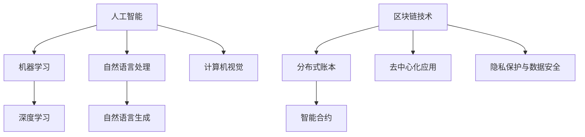

                 

### 技术主管的核心职责：聚焦关键任务

关键词：技术主管、核心职责、关键任务、团队管理、技术创新、项目管理

摘要：本文旨在深入探讨技术主管在企业中的核心职责，强调聚焦关键任务的重要性。我们将详细分析技术主管的角色与责任，技术趋势，核心概念联系，团队管理与培养，技术创新与研发，项目管理与进度控制，技术风险管理以及技术标准的制定与推广。通过逐步推理，我们将明确技术主管在实现企业技术战略中的关键作用。

### 第一部分：概述与基础理论

#### 第1章：技术主管的核心职责

##### 1.1. 技术主管的角色与责任

###### 1.1.1. 技术主管的角色定位

技术主管（CTO，Chief Technology Officer）在企业中扮演着至关重要的角色。他们的主要职责包括：

1. **技术战略的制定与执行**：技术主管需要根据企业的业务需求，制定符合市场发展趋势的技术战略。这包括识别新兴技术，评估其对企业的影响，并制定相应的技术路线图。

2. **技术团队的管理与培养**：技术主管负责组建和管理技术团队，确保团队成员的能力与业务需求相匹配。同时，他们需要制定员工培训和发展计划，提升团队的整体技术水平。

3. **技术创新与研发**：技术主管需要推动技术创新，鼓励研发团队不断探索新的技术解决方案，以提升企业的核心竞争力。

###### 1.1.2. 核心职责解析

1. **项目管理与进度控制**：技术主管需要确保项目按照预定的时间和预算完成。他们需要制定详细的项目计划，监控项目进度，及时调整资源分配，以确保项目目标的实现。

2. **技术风险评估与管理**：技术主管需要对项目的潜在技术风险进行评估，并制定相应的风险控制措施。他们需要确保项目在技术可行性和稳定性方面达到预期标准。

3. **技术标准的制定与推广**：技术主管需要制定符合行业标准和最佳实践的技术标准，并推动其在企业内部的广泛应用。

##### 1.2. 技术趋势分析

###### 1.2.1. 人工智能的发展趋势

人工智能（AI）作为当前科技领域的热点，其发展趋势值得深入探讨：

1. **深度学习与神经网络**：深度学习是人工智能的一个重要分支，其通过多层神经网络模拟人类大脑的处理方式，实现了在图像识别、语音识别等领域的突破。

2. **自然语言处理与生成**：自然语言处理（NLP）是AI技术的另一重要领域，它致力于让计算机理解和生成人类语言。随着自然语言生成技术的进步，智能客服、智能写作等应用逐渐普及。

3. **计算机视觉**：计算机视觉技术通过图像处理和模式识别，实现了对图像和视频的分析和理解。其在安防监控、自动驾驶等领域的应用前景广阔。

###### 1.2.2. 区块链技术的发展

区块链技术作为新兴技术，正逐渐影响各行各业：

1. **分布式账本与智能合约**：区块链技术通过分布式账本，实现了去中心化的数据存储和验证。智能合约则通过程序代码自动执行合同条款，提高了交易的安全性和效率。

2. **去中心化应用（DApps）**：去中心化应用是区块链技术的一种重要应用模式，它通过去中心化的方式，实现了在金融、供应链等领域的创新。

3. **隐私保护与数据安全**：区块链技术通过加密和分布式存储，提高了数据的隐私保护和安全性，这在数据泄露频发的当下，具有很高的应用价值。

##### 1.3. 技术概念架构图

为了更好地理解上述概念，我们可以通过一个技术概念架构图来展示它们之间的关系：



### 第二部分：关键任务与策略

#### 第2章：核心概念与联系

##### 2.1. 技术概念架构图

在了解了技术主管的核心职责和当前技术趋势后，我们需要深入探讨技术概念之间的关系，以便更好地理解其应用和影响。

###### 2.1.1. 核心概念定义

1. **人工智能（AI）**：人工智能是指计算机系统通过模拟人类智能，实现感知、推理、学习和决策的能力。

2. **机器学习（ML）**：机器学习是人工智能的一个分支，它通过算法和统计模型，从数据中自动学习和发现规律。

3. **深度学习（DL）**：深度学习是机器学习的一个子领域，它通过多层神经网络，实现更为复杂的数据分析和模型构建。

###### 2.1.2. 概念实体之间的关系

1. **人工智能与机器学习的关系**：人工智能是机器学习的一个应用领域，而机器学习是实现人工智能的一种手段。

2. **机器学习与深度学习的关系**：深度学习是机器学习的一种实现方式，它通过更复杂的神经网络结构，提高了机器学习的性能和效果。

为了更直观地展示这些概念之间的关系，我们可以使用以下Mermaid流程图：

```mermaid
graph TD
    A[人工智能] --> B[机器学习]
    B --> C[深度学习]
    B --> D[强化学习]
    B --> E[无监督学习]
    B --> F[监督学习]
    C --> G[神经网络]
    C --> H[卷积神经网络(CNN)]
    C --> I[循环神经网络(RNN)]
```

通过上述架构图，我们可以清晰地看到各个技术概念之间的层次关系和应用场景。

### 第三部分：实施与策略

#### 第3章：技术团队管理与培养

##### 3.1. 团队管理策略

###### 3.1.1. 管理模型

技术团队的管理模型对于团队效率和企业目标的实现至关重要。以下是两种常见的管理模型：

1. **平行式管理**：平行式管理强调团队内部的平等和协作。在这种模式下，团队成员之间没有明确的等级关系，每个成员都有一定的决策权和职责范围。

2. **矩阵式管理**：矩阵式管理将团队分为纵向和横向两个维度，纵向负责业务方向，横向负责技术方向。在这种模式下，团队成员通常需要同时向业务和技术主管汇报。

###### 3.1.2. 团队成员角色

技术团队的成功离不开各个角色的协同工作。以下是常见的团队成员角色：

1. **技术专家**：技术专家是团队中的核心力量，他们负责解决复杂的技术问题，推动技术创新。

2. **项目经理**：项目经理负责项目的整体规划和管理，确保项目按时、按质、按预算完成。

3. **产品经理**：产品经理负责产品需求的分析和规划，确保产品的功能和用户体验满足用户需求。

##### 3.2. 员工培养计划

###### 3.2.1. 技能提升路径

为了提升团队的整体技术水平，企业需要制定系统的员工培养计划。以下是常见的技能提升路径：

1. **基础知识巩固**：对于新入职的员工，企业需要提供基础培训，确保他们具备所需的技术背景。

2. **专项技能培养**：通过专项培训，员工可以深入掌握特定的技术领域，提升专业技能。

3. **创新思维与实践**：鼓励员工积极参与技术创新和实践，通过实际项目提升解决问题的能力。

###### 3.2.2. 职业发展规划

职业发展规划对于员工的长期成长和企业的持续发展都至关重要。以下是常见的职业发展规划：

1. **职业素养培养**：通过培训和实践，提升员工的专业素养，包括沟通能力、团队合作能力、领导力等。

2. **职业晋升通道**：为员工提供明确的晋升通道，激励他们不断提升自己。

3. **跨部门交流与合作**：鼓励员工跨部门交流，拓展视野，提升综合素质。

### 第4章：技术创新与研发

##### 4.1. 技术创新流程

###### 4.1.1. 需求分析与规划

技术创新的起点是需求分析。以下是需求分析与规划的关键步骤：

1. **市场需求分析**：了解市场趋势，识别潜在的商业机会。

2. **技术可行性分析**：评估现有技术的可行性，确定技术路线。

3. **项目规划与立项**：制定详细的项目计划，明确项目目标、范围、资源和时间表。

###### 4.1.2. 研发管理与执行

研发管理与执行是技术创新的核心。以下是关键步骤：

1. **研发团队组织架构**：明确研发团队的职责和分工，确保项目顺利推进。

2. **项目进度与风险管理**：持续监控项目进度，及时识别和应对风险。

3. **研发资源与成本控制**：合理分配资源，确保项目在预算范围内完成。

##### 4.2. 研发团队建设

###### 4.2.1. 研发团队角色

研发团队的成功离不开各个角色的协同工作。以下是常见的研发团队角色：

1. **研发经理**：负责整体研发战略规划和团队管理。

2. **研发工程师**：负责具体的技术研发工作。

3. **产品设计师**：负责产品的功能设计和用户体验。

###### 4.2.2. 研发流程优化

研发流程的优化是提升研发效率的关键。以下是常见的研发流程优化措施：

1. **设计评审与迭代**：通过设计评审，确保产品设计和研发方向的一致性，并及时调整。

2. **代码审查与版本控制**：通过代码审查和版本控制，确保代码质量和协作效率。

3. **测试与质量保证**：通过严格的测试和质量保证流程，确保产品的稳定性和可靠性。

### 第5章：项目管理与进度控制

##### 5.1. 项目管理核心

###### 5.1.1. 项目计划与执行

项目计划与执行是项目管理的核心。以下是关键步骤：

1. **项目立项与目标设定**：明确项目目标，制定项目立项报告。

2. **项目任务分解**：将项目目标分解为具体的任务，明确每个任务的负责人和截止日期。

3. **资源配置与任务分配**：根据任务需求，合理配置资源，确保每个任务都有人负责。

###### 5.1.2. 进度监控与调整

进度监控与调整是确保项目按时完成的关键。以下是关键步骤：

1. **项目进度报告**：定期生成项目进度报告，汇报项目进展情况。

2. **风险评估与应对策略**：识别潜在的风险，制定应对策略。

3. **项目变更管理**：对项目变更进行评估和审批，确保项目目标的实现。

##### 5.2. 进度控制策略

###### 5.2.1. 进度计划制定

进度计划制定是进度控制的基础。以下是关键步骤：

1. **工期估算**：根据任务复杂度和资源情况，估算每个任务的工期。

2. **进度安排**：制定详细的进度安排，确保任务按计划推进。

3. **关键路径分析**：识别项目的关键路径，确保关键任务按时完成。

###### 5.2.2. 进度跟踪与调整

进度跟踪与调整是确保项目按时完成的关键。以下是关键步骤：

1. **持续监控**：实时跟踪项目进度，及时发现和解决问题。

2. **及时调整**：根据项目进展情况，及时调整进度安排和资源分配。

3. **预算控制**：确保项目在预算范围内完成，控制成本超支。

### 第6章：技术风险管理

##### 6.1. 风险识别与评估

###### 6.1.1. 风险识别方法

风险识别是技术风险管理的第一步。以下是常见的方法：

1. **SWOT分析**：通过分析企业的优势、劣势、机会和威胁，识别潜在的技术风险。

2. **故障树分析**：通过分析可能导致故障的各种因素，识别潜在的技术风险。

3. **实际案例分析**：通过分析过去的技术风险事件，识别潜在的技术风险。

###### 6.1.2. 风险评估模型

风险评估是确定风险程度和优先级的重要步骤。以下是常见的模型：

1. **概率评估**：通过分析风险发生的概率，确定风险的重要性。

2. **影响评估**：通过分析风险对项目目标的影响程度，确定风险的优先级。

3. **敏感性分析**：通过分析不同风险因素对项目目标的影响程度，确定风险的关键因素。

##### 6.2. 风险应对策略

###### 6.2.1. 风险预防策略

风险预防策略是降低风险发生的概率和影响的重要手段。以下是常见的策略：

1. **预防措施制定**：根据风险评估结果，制定具体的预防措施。

2. **预防措施实施**：将预防措施落实到项目中，确保其有效执行。

3. **预防效果评估**：定期评估预防措施的效果，及时调整和优化。

###### 6.2.2. 风险应对策略

风险应对策略是在风险发生时采取的应对措施。以下是常见的策略：

1. **应急预案制定**：根据风险评估结果，制定应急预案。

2. **应急资源准备**：提前准备应急资源，确保在风险发生时能够迅速响应。

3. **应急演练与改进**：定期进行应急演练，检验应急预案的有效性，并根据演练结果进行改进。

### 第7章：技术标准的制定与推广

##### 7.1. 标准制定流程

技术标准的制定是企业技术创新和标准化管理的基础。以下是标准制定的关键步骤：

###### 7.1.1. 标准需求分析

1. **行业标准分析**：研究行业标准和最佳实践，确定标准需求。

2. **企业标准分析**：分析企业现有标准，确定改进和优化需求。

3. **标准化需求评估**：评估标准需求，确定标准制定的方向和重点。

###### 7.1.2. 标准制定与发布

1. **标准草案编写**：根据标准需求，编写标准草案。

2. **标准审核与修订**：组织专家对标准草案进行审核和修订。

3. **标准发布与推广**：发布标准，并在企业内部进行推广。

##### 7.2. 标准推广策略

技术标准的推广是确保其有效实施的关键。以下是常见的推广策略：

###### 7.2.1. 推广计划制定

1. **推广目标设定**：明确标准推广的目标，确保推广工作的方向和重点。

2. **推广渠道选择**：根据目标受众，选择合适的推广渠道。

3. **推广资源分配**：合理分配推广资源，确保推广工作的高效实施。

###### 7.2.2. 推广效果评估

1. **市场反馈收集**：收集市场反馈，了解标准的接受程度和使用效果。

2. **用户满意度调查**：通过用户满意度调查，评估标准的用户满意度。

3. **推广效果分析**：根据市场反馈和用户满意度调查结果，分析标准推广的效果，并提出改进建议。

### 附录

#### 附录A：技术资源与工具

##### A.1. 技术资源

技术资源是技术主管日常工作中必不可少的。以下是常见的技术资源：

###### A.1.1. 开源框架与库

1. **TensorFlow**：由谷歌开发的开源机器学习框架，广泛应用于深度学习和自然语言处理等领域。

2. **PyTorch**：由Facebook开发的开源深度学习框架，以其灵活性和动态图特性受到广泛欢迎。

3. **Keras**：一个高层次的神经网络API，用于快速构建和迭代深度学习模型。

##### A.2. 开发工具

开发工具是技术主管和团队成员进行开发的重要辅助。以下是常见的技术开发工具：

###### A.2.1. 集成开发环境（IDE）

1. **IntelliJ IDEA**：适用于Java、Python、JavaScript等多种编程语言，功能强大且用户体验优秀。

2. **Visual Studio**：由微软开发，适用于C++、C#、Python等多种编程语言，提供丰富的开发工具和插件。

###### A.2.2. 版本控制工具

1. **Git**：分布式版本控制系统，广泛应用于软件开发中，支持多人协作。

2. **SVN**：集中式版本控制系统，虽然不如Git灵活，但在某些场景下仍有其应用价值。

##### A.3. 测试工具

测试工具是确保软件质量和稳定性的重要手段。以下是常见的测试工具：

###### A.3.1. 单元测试工具

1. **JUnit**：适用于Java的单元测试框架，功能强大且易于使用。

2. **pytest**：适用于Python的单元测试框架，支持多种Python版本。

###### A.3.2. 集成测试工具

1. **Selenium**：适用于Web应用的自动化测试工具，支持多种浏览器和操作系统。

2. **JMeter**：适用于性能测试的开源工具，支持多种协议和测试场景。

### 作者介绍

作者：AI天才研究院/AI Genius Institute & 禅与计算机程序设计艺术 /Zen And The Art of Computer Programming

AI天才研究院（AI Genius Institute）是一家专注于人工智能领域研究和应用的创新机构。研究院致力于推动人工智能技术的进步，培养新一代人工智能人才，并推动人工智能技术在各个行业的应用。同时，作者所著的《禅与计算机程序设计艺术》一书，以其深刻的思想和独特的见解，在全球范围内受到了广泛赞誉，成为计算机编程领域的重要参考书籍。作者以其丰富的经验和对技术的深刻理解，为读者提供了宝贵的指导和启示。

---

### 总结与展望

在这篇博客中，我们详细探讨了技术主管在企业中的核心职责，以及如何聚焦关键任务以实现企业的技术战略。从技术趋势分析到团队管理，再到技术创新和风险管理，每一个环节都至关重要。技术主管需要具备战略眼光，深入了解技术前沿，同时注重团队建设和项目管理的细节。

未来，随着人工智能、区块链等新兴技术的不断发展，技术主管的角色将更加重要。他们需要不断学习，提升自身的技术能力和管理能力，以应对快速变化的市场和技术环境。同时，企业也需要为技术主管提供充足的资源和支持，鼓励他们进行技术创新和突破。

在人工智能和区块链技术日益普及的今天，技术主管不仅需要掌握核心技术，还需要具备跨学科的知识和技能，如数据科学、网络安全等。只有这样，他们才能更好地应对复杂的技术挑战，推动企业的持续发展和创新。

展望未来，技术主管将迎来更多的机遇和挑战。他们需要以更广阔的视野，更深入的思考，更高效的执行，引领企业走向科技前沿，实现企业的长期愿景和目标。通过本文的讨论，我们希望对技术主管的角色和职责有更清晰的认识，为他们在实际工作中提供有益的指导和启示。让我们共同期待技术主管在未来的舞台上，绽放更加耀眼的光芒。

