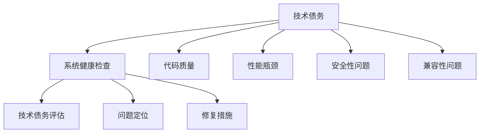
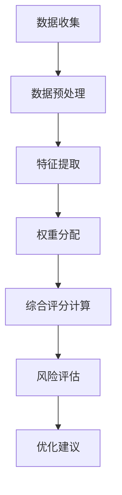
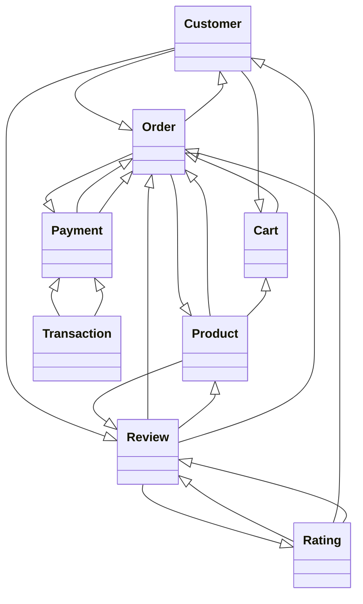
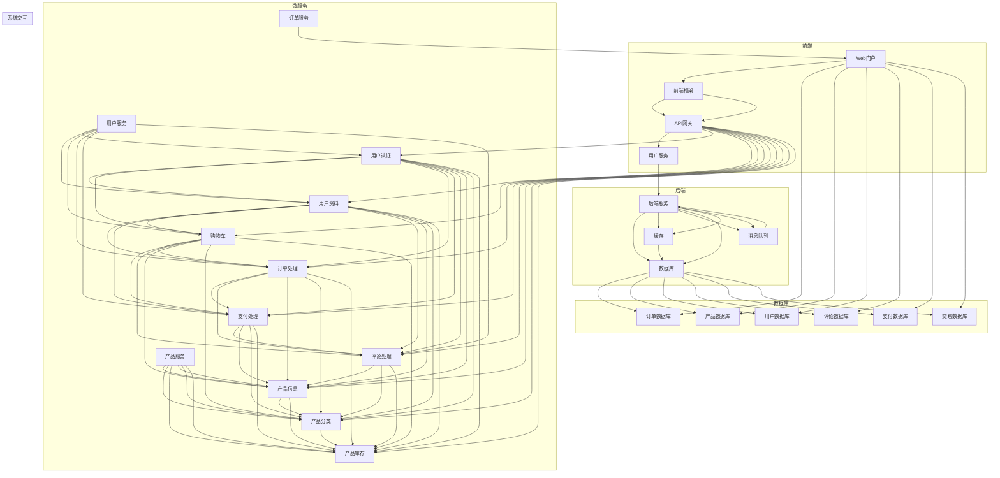
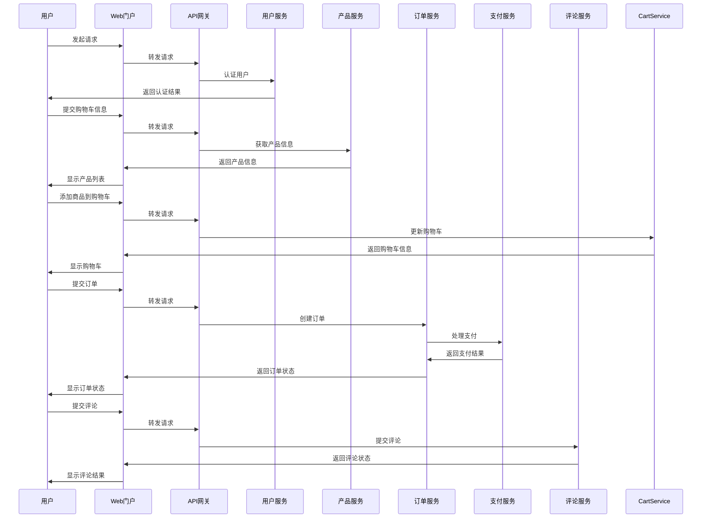

                 

**# 技术债务评估：P9工程师的系统健康检查**

关键词：技术债务、系统健康检查、P9工程师、代码质量、风险评估

摘要：本文旨在探讨技术债务评估在P9工程师系统健康检查中的重要性。通过详细分析技术债务的定义、类型、评估方法和系统健康检查流程，帮助P9工程师更好地理解技术债务管理策略，以提升系统稳定性和项目成功率。

----------------------------------------------------------------

### 第一部分：引言与核心概念

#### 1.1 技术债务的定义与类型

##### 1.1.1 技术债务的概念

技术债务，也称为技术债务（Technical Debt），是指在软件开发过程中，为了快速交付软件功能而采取的一种短视的、快速实现的方法。这种方法可能带来一系列的长期问题，如代码复杂度增加、性能瓶颈、安全性漏洞等。技术债务类似于财务债务，需要通过后续的工作来还清。

##### 1.1.2 技术债务的分类

技术债务主要分为以下几种类型：

1. **设计债务**：在系统设计阶段没有遵循最佳实践，导致系统结构混乱，难以维护和扩展。
2. **编码债务**：在代码编写阶段，为了快速完成任务，可能编写了难以理解和维护的代码，或者使用了过时的技术。
3. **测试债务**：由于资源限制或时间紧迫，没有进行充分的测试，可能导致系统稳定性问题。
4. **性能债务**：在系统开发过程中，没有考虑到系统的性能问题，可能导致系统在高负载下出现性能瓶颈。

##### 1.1.3 技术债务的影响

技术债务的累积会导致以下几个问题：

1. **维护成本增加**：随着技术债务的增加，系统的维护成本也会增加，因为需要投入更多的时间和资源来修复和优化系统。
2. **开发效率下降**：技术债务会导致开发人员的工作效率下降，因为需要花费更多的时间来解决技术债务带来的问题。
3. **系统稳定性下降**：技术债务可能导致系统稳定性下降，出现更多的故障和错误。
4. **安全风险增加**：技术债务可能带来安全漏洞，增加系统的安全风险。

#### 1.2 P9工程师的角色与责任

##### 1.2.1 P9工程师的职责

P9工程师（通常指的是高级技术领导或架构师）在公司中扮演着至关重要的角色，其职责包括：

1. **技术领导**：负责公司的技术方向和战略规划，确保团队的技术水平与公司发展保持一致。
2. **架构设计**：负责系统的整体架构设计，确保系统的可扩展性、稳定性和性能。
3. **团队建设**：负责团队的招聘、培训和成长，提升团队的技术能力和协作效率。
4. **项目管理**：负责项目的规划、监控和风险管理，确保项目按时、按质、按量完成。

##### 1.2.2 系统健康检查的重要性

系统健康检查是P9工程师的重要职责之一。通过系统健康检查，可以及时发现和解决系统中的潜在问题，确保系统的稳定性和安全性。系统健康检查的主要目标包括：

1. **性能监控**：监控系统的性能指标，如响应时间、吞吐量、资源利用率等，及时发现性能瓶颈。
2. **代码质量评估**：评估代码质量，如代码复杂度、代码重复率、代码可读性等，确保代码的可维护性。
3. **安全性检查**：检查系统中的安全漏洞，如SQL注入、XSS攻击等，确保系统的安全性。
4. **兼容性测试**：确保系统在不同环境下能够正常运行，如不同浏览器、操作系统等。

##### 1.2.3 技术债务评估在系统健康检查中的地位

技术债务评估是系统健康检查的重要组成部分。通过技术债务评估，可以：

1. **识别问题**：及时发现系统中的技术债务问题，如代码质量低下、性能瓶颈等。
2. **风险评估**：对技术债务问题进行风险评估，确定问题的严重程度和优先级。
3. **制定修复计划**：根据风险评估结果，制定修复计划，逐步解决技术债务问题。
4. **持续监控**：对技术债务问题进行持续监控，确保问题得到有效解决。

### 第二部分：技术债务评估方法

#### 2.1 技术债务评估流程

##### 2.1.1 评估准备

1. **明确评估目标**：明确评估的目的和目标，如性能评估、代码质量评估等。
2. **确定评估范围**：确定评估的范围，如整个系统、某个模块等。
3. **收集数据**：收集与评估相关的数据，如代码库、测试报告、性能监控数据等。
4. **制定评估标准**：根据评估目标，制定评估标准和指标。

##### 2.1.2 数据收集

1. **代码库分析**：对代码库进行静态分析，评估代码质量，如代码复杂度、代码重复率等。
2. **测试数据收集**：收集测试数据，如单元测试结果、集成测试结果等，评估代码质量。
3. **性能监控数据收集**：收集性能监控数据，如响应时间、吞吐量等，评估系统性能。
4. **安全性数据收集**：收集系统日志、安全审计报告等，评估系统安全性。

##### 2.1.3 数据分析

1. **代码质量分析**：对代码质量进行定量和定性分析，如代码复杂度、代码重复率、代码可读性等。
2. **性能分析**：对性能数据进行统计分析，如响应时间、吞吐量、资源利用率等。
3. **安全性分析**：对安全性数据进行风险评估，如安全漏洞、入侵尝试等。

##### 2.1.4 风险评估

1. **风险识别**：识别系统中的技术债务问题，如代码质量低下、性能瓶颈等。
2. **风险分析**：对风险进行定量和定性分析，如风险概率、风险影响等。
3. **风险排序**：根据风险概率和风险影响，对风险进行排序，确定优先级。

#### 2.2 技术债务评估工具

##### 2.2.1 传统工具

1. **静态代码分析工具**：如SonarQube、Checkstyle等，用于评估代码质量。
2. **动态分析工具**：如AppDynamics、NewRelic等，用于监控系统性能。
3. **安全性评估工具**：如OWASP ZAP、Burp Suite等，用于评估系统安全性。

##### 2.2.2 自动化工具

1. **自动化代码分析工具**：如CodeQL、GitLab CI/CD等，用于自动化评估代码质量和性能。
2. **自动化测试工具**：如Selenium、JUnit等，用于自动化测试代码和系统性能。
3. **自动化安全性测试工具**：如Aircrack-ng、Nessus等，用于自动化评估系统安全性。

##### 2.2.3 新兴工具与技术

1. **机器学习与深度学习**：用于智能分析代码质量、性能和安全性问题。
2. **区块链技术**：用于保证代码的可信性和不可篡改性。
3. **云计算与大数据**：用于大规模数据处理和分析，提高评估效率和准确性。

#### 2.3 技术债务评估指标

##### 2.3.1 代码质量指标

1. **代码复杂度**：如循环复杂度、条件复杂度等。
2. **代码重复率**：评估代码中重复代码的比例。
3. **代码可读性**：评估代码的可读性和可维护性。
4. **代码质量评分**：如COCOMO II模型评分等。

##### 2.3.2 系统性能指标

1. **响应时间**：系统响应请求的时间。
2. **吞吐量**：系统处理请求的能力。
3. **资源利用率**：系统使用的CPU、内存、磁盘等资源情况。
4. **性能评分**：如SPEC基准测试评分等。

##### 2.3.3 安全性指标

1. **漏洞数量**：系统中存在的漏洞数量。
2. **攻击尝试次数**：系统遭受攻击的尝试次数。
3. **安全评分**：如OWASP评分等。
4. **漏洞修复率**：修复漏洞的速度和效率。

##### 2.3.4 兼容性指标

1. **兼容性评分**：系统在不同浏览器、操作系统等环境下的兼容性评分。
2. **兼容性问题数量**：系统中存在的兼容性问题数量。
3. **兼容性修复率**：修复兼容性问题的速度和效率。

----------------------------------------------------------------

### 第三部分：系统健康检查

#### 3.1 系统健康检查概述

##### 3.1.1 系统健康检查的定义

系统健康检查是指对系统进行全面的检查和评估，以确定系统的稳定性和性能，及时发现和解决潜在的问题。

##### 3.1.2 系统健康检查的必要性

系统健康检查的必要性体现在以下几个方面：

1. **确保系统稳定性**：通过健康检查，可以及时发现系统中的潜在问题，确保系统的稳定运行。
2. **提升系统性能**：通过健康检查，可以识别系统的性能瓶颈，优化系统性能。
3. **提高安全性**：通过健康检查，可以识别系统的安全漏洞，提高系统的安全性。
4. **降低维护成本**：通过健康检查，可以提前发现和解决问题，降低系统的维护成本。

##### 3.1.3 系统健康检查的目标

系统健康检查的主要目标包括：

1. **性能优化**：识别系统的性能瓶颈，优化系统性能，提升用户体验。
2. **代码质量提升**：评估代码质量，提升代码的可读性、可维护性。
3. **安全性提高**：识别和修复安全漏洞，提高系统的安全性。
4. **兼容性优化**：确保系统在不同环境下能够正常运行，提升系统的兼容性。

#### 3.2 健康检查流程

##### 3.2.1 预检查

预检查是健康检查的第一步，主要包括以下内容：

1. **环境检查**：检查系统运行环境，如操作系统、数据库、中间件等是否正常。
2. **资源检查**：检查系统资源使用情况，如CPU、内存、磁盘等是否充足。
3. **日志检查**：检查系统日志，查找异常信息和错误日志。

##### 3.2.2 评估与诊断

评估与诊断是健康检查的核心步骤，主要包括以下内容：

1. **性能评估**：评估系统的性能指标，如响应时间、吞吐量、资源利用率等，识别性能瓶颈。
2. **代码质量评估**：评估代码质量，如代码复杂度、代码重复率、代码可读性等，识别代码质量问题。
3. **安全性评估**：评估系统的安全性，如漏洞扫描、入侵检测等，识别安全漏洞。
4. **兼容性评估**：评估系统的兼容性，如在不同浏览器、操作系统等环境下测试，识别兼容性问题。

##### 3.2.3 问题定位与修复

问题定位与修复是健康检查的关键步骤，主要包括以下内容：

1. **问题定位**：根据评估结果，定位系统中的问题，确定问题的原因。
2. **问题修复**：针对定位到的问题，制定修复计划，进行修复。
3. **测试验证**：修复后进行测试，验证修复效果。

##### 3.2.4 后期评估与优化

后期评估与优化是健康检查的收尾工作，主要包括以下内容：

1. **效果评估**：评估问题修复后的效果，如性能是否提升、安全性是否提高等。
2. **优化建议**：根据评估结果，提出优化建议，如系统架构优化、代码重构等。
3. **持续监控**：建立持续监控系统，定期进行健康检查，确保系统长期稳定运行。

#### 3.3 常见问题分析

##### 3.3.1 性能瓶颈

性能瓶颈是指系统在处理请求时，出现响应时间过长、吞吐量不足等问题。常见性能瓶颈包括：

1. **数据库瓶颈**：数据库查询效率低，导致系统响应时间过长。
2. **网络瓶颈**：网络带宽不足，导致数据传输缓慢。
3. **CPU瓶颈**：系统CPU利用率高，导致系统处理能力不足。
4. **内存瓶颈**：系统内存不足，导致系统频繁进行垃圾回收。

##### 3.3.2 代码质量问题

代码质量问题是指系统代码在质量方面存在问题，如代码复杂度高、代码重复率高、代码可读性差等。常见代码质量问题包括：

1. **代码复杂度高**：代码复杂度越高，越难以理解和维护。
2. **代码重复率高**：代码重复率高，导致代码冗余，增加维护成本。
3. **代码可读性差**：代码可读性差，导致开发人员难以理解代码，影响开发效率。

##### 3.3.3 安全性问题

安全性问题是指系统在安全方面存在问题，如安全漏洞、入侵尝试等。常见安全性问题包括：

1. **SQL注入**：恶意攻击者通过输入恶意SQL语句，篡改数据库数据。
2. **XSS攻击**：恶意攻击者通过输入恶意脚本，窃取用户信息。
3. **CSRF攻击**：恶意攻击者通过伪造请求，篡改用户会话信息。

##### 3.3.4 兼容性问题

兼容性问题是指系统在不同环境下无法正常运行的问题。常见兼容性问题包括：

1. **浏览器兼容性**：系统在不同浏览器下显示效果不一致。
2. **操作系统兼容性**：系统在不同操作系统下无法正常运行。
3. **硬件兼容性**：系统在不同硬件环境下性能不稳定。

----------------------------------------------------------------

### 第四部分：技术债务管理

#### 4.1 技术债务管理策略

##### 4.1.1 技术债务控制策略

技术债务控制策略主要包括以下内容：

1. **预防性控制**：在系统开发过程中，遵循最佳实践，避免产生技术债务。
2. **限制性控制**：对技术债务的产生进行限制，如限制代码复杂度、代码重复率等。
3. **紧急性控制**：对已经产生的技术债务进行紧急处理，如修复漏洞、优化性能等。

##### 4.1.2 技术债务优化策略

技术债务优化策略主要包括以下内容：

1. **重构**：对已有代码进行重构，提升代码质量，降低技术债务。
2. **升级**：升级系统中的技术栈，使用更先进的技术，降低技术债务。
3. **优化**：优化系统性能，提升系统稳定性，降低技术债务。

##### 4.1.3 技术债务缓解策略

技术债务缓解策略主要包括以下内容：

1. **自动化测试**：通过自动化测试，减少测试债务，提升代码质量。
2. **持续集成**：通过持续集成，确保代码质量，降低技术债务。
3. **团队协作**：通过团队协作，提高开发效率，降低技术债务。

#### 4.2 技术债务管理实践

##### 4.2.1 持续集成与持续部署（CI/CD）

持续集成与持续部署（CI/CD）是一种软件开发和部署的实践，通过自动化测试和部署，确保代码质量和系统稳定性。CI/CD的主要实践包括：

1. **代码审查**：对提交的代码进行审查，确保代码质量。
2. **自动化测试**：对代码进行自动化测试，确保代码功能正确。
3. **持续部署**：自动化部署代码到生产环境，确保系统稳定性。

##### 4.2.2 自动化测试

自动化测试是一种通过编写脚本或使用工具对软件进行自动测试的方法。自动化测试的主要实践包括：

1. **单元测试**：对系统的各个单元进行测试，确保单元功能正确。
2. **集成测试**：对系统的各个模块进行集成测试，确保模块之间能够正常工作。
3. **性能测试**：对系统的性能进行测试，确保系统在高负载下能够正常运行。

##### 4.2.3 预测性维护

预测性维护是一种通过分析历史数据，预测系统故障和性能问题，提前进行维护和优化的方法。预测性维护的主要实践包括：

1. **数据收集**：收集系统运行数据，如性能数据、日志数据等。
2. **数据分析和预测**：对收集到的数据进行分析和预测，预测系统故障和性能问题。
3. **提前维护**：根据预测结果，提前进行维护和优化，防止故障发生。

##### 4.2.4 团队协作与沟通

团队协作与沟通是技术债务管理的重要方面。通过有效的团队协作与沟通，可以减少技术债务的产生，提高开发效率。团队协作与沟通的主要实践包括：

1. **代码审查**：通过代码审查，确保代码质量，减少技术债务的产生。
2. **定期会议**：定期举行团队会议，讨论技术债务问题，制定解决方案。
3. **知识共享**：鼓励团队成员分享知识和经验，提高整体技术水平。

#### 4.3 技术债务管理案例分析

##### 4.3.1 案例一：大型电商平台的债务管理

某大型电商平台在发展过程中，由于快速扩展和频繁的功能迭代，导致技术债务累积。为了解决这一问题，平台采取了以下措施：

1. **代码重构**：对旧代码进行重构，提升代码质量，降低技术债务。
2. **性能优化**：优化系统性能，提升系统稳定性。
3. **自动化测试**：引入自动化测试，确保代码质量，减少测试债务。

通过以上措施，平台成功降低了技术债务，提升了系统稳定性，提高了用户体验。

##### 4.3.2 案例二：金融科技公司的债务管理

某金融科技公司在其金融产品开发过程中，面临大量的技术债务问题。为了解决这一问题，公司采取了以下措施：

1. **技术栈升级**：升级技术栈，引入更先进的技术，降低技术债务。
2. **安全评审**：对系统进行安全评审，识别和修复安全漏洞。
3. **团队培训**：对团队成员进行培训，提高团队技术能力。

通过以上措施，公司成功降低了技术债务，提升了系统安全性和稳定性。

##### 4.3.3 案例三：医疗健康行业的债务管理

某医疗健康行业公司在其信息化建设过程中，由于技术债务累积，导致系统稳定性下降。为了解决这一问题，公司采取了以下措施：

1. **持续集成**：引入持续集成，确保代码质量，减少技术债务。
2. **自动化测试**：引入自动化测试，确保代码质量，减少测试债务。
3. **团队协作**：加强团队协作，提高开发效率，减少技术债务。

通过以上措施，公司成功降低了技术债务，提升了系统稳定性。

----------------------------------------------------------------

### 第五部分：结论与展望

#### 5.1 技术债务评估与系统健康检查的意义

技术债务评估与系统健康检查对P9工程师和软件开发团队具有重要意义：

1. **提高系统稳定性**：通过技术债务评估和系统健康检查，可以及时发现和解决系统中的问题，提高系统稳定性。
2. **促进团队协作**：技术债务评估和系统健康检查需要团队成员共同参与，有助于促进团队协作和沟通。
3. **提升项目成功率**：通过技术债务评估和系统健康检查，可以确保项目的质量和进度，提高项目成功率。

#### 5.2 未来趋势与挑战

在未来，技术债务评估和系统健康检查将面临以下趋势与挑战：

1. **自动化与智能化**：随着人工智能技术的发展，技术债务评估和系统健康检查将逐渐实现自动化和智能化。
2. **多云与混合云环境**：随着云计算的普及，多云和混合云环境将带来更多的挑战和机遇，需要更高效的技术债务评估和系统健康检查方法。
3. **安全性与隐私保护**：在日益严峻的安全威胁和隐私保护要求下，技术债务评估和系统健康检查需要更加关注系统的安全性和隐私保护。

#### 5.3 总结与建议

综上所述，技术债务评估和系统健康检查是P9工程师和软件开发团队必须重视的工作。为了更好地管理技术债务，提高系统健康水平，提出以下建议：

1. **定期进行技术债务评估**：定期对系统进行技术债务评估，及时发现和解决问题。
2. **建立持续集成与持续部署流程**：引入持续集成与持续部署，确保代码质量和系统稳定性。
3. **加强团队协作与沟通**：鼓励团队成员共同参与技术债务评估和系统健康检查，提高团队协作效率。
4. **持续关注未来趋势**：关注技术债务评估和系统健康检查的未来趋势，及时调整策略和方法。

----------------------------------------------------------------

# 附录

#### 附录 A：技术债务评估工具列表

##### A.1 常见工具概述

1. **静态代码分析工具**：如SonarQube、Checkstyle等，用于评估代码质量。
2. **动态分析工具**：如AppDynamics、NewRelic等，用于监控系统性能。
3. **安全性评估工具**：如OWASP ZAP、Burp Suite等，用于评估系统安全性。
4. **自动化测试工具**：如Selenium、JUnit等，用于自动化测试代码和系统性能。

##### A.2 开源工具推荐

1. **SonarQube**：用于代码质量评估。
2. **JMeter**：用于性能测试。
3. **OWASP ZAP**：用于安全性评估。

##### A.3 商业工具简介

1. **Splunk**：用于日志分析和性能监控。
2. **Dynatrace**：用于自动化性能监控。
3. **PortSwigger**：用于安全性测试。

#### 附录 B：系统健康检查资源

##### B.1 健康检查标准与规范

1. **ISO/IEC 25010**：软件产品评价标准。
2. **ITIL**：信息技术基础架构库。

##### B.2 健康检查工具与插件

1. **Prometheus**：用于监控系统性能。
2. **Grafana**：用于监控数据可视化。
3. **Nagios**：用于系统监控。

##### B.3 学习资源推荐

1. **《系统架构设计》**：陈华兴 著。
2. **《性能之巅》**：Rick Barraclough 著。
3. **《软件工程：实践者的研究方法》**：Roger S. Pressman 著。

----------------------------------------------------------------

## 核心概念与联系

### 技术债务与系统健康检查关系架构图



### 结论

本文详细探讨了技术债务评估在P9工程师系统健康检查中的重要性，分析了技术债务的定义、类型、评估方法和系统健康检查流程，并提出了技术债务管理策略和实践。通过本文的学习，读者可以更好地理解技术债务对系统健康的影响，掌握技术债务评估和系统健康检查的方法和技巧，从而提升系统稳定性、安全性和性能，提高项目成功率。

---

**作者：AI天才研究院/AI Genius Institute & 禅与计算机程序设计艺术 /Zen And The Art of Computer Programming**----------------------------------------------------------------

```python
# 导入所需库
import pandas as pd
import numpy as np

# 技术债务数据示例
tech_debt_data = {
    'CodeComplexity': [10, 15, 20, 30, 50],
    'CodeQuality': [8, 6, 7, 9, 10],
    'PerformanceIssues': [2, 4, 3, 5, 1],
    'SecurityIssues': [3, 1, 2, 4, 0],
    'CompatibilityIssues': [2, 4, 3, 1, 2]
}

# 创建DataFrame
tech_debt_df = pd.DataFrame(tech_debt_data)

# 计算平均代码复杂度
avg_code_complexity = tech_debt_df['CodeComplexity'].mean()

# 计算平均代码质量
avg_code_quality = tech_debt_df['CodeQuality'].mean()

# 计算平均性能问题数量
avg_performance_issues = tech_debt_df['PerformanceIssues'].mean()

# 计算平均安全问题数量
avg_security_issues = tech_debt_df['SecurityIssues'].mean()

# 计算平均兼容性问题数量
avg_compatibility_issues = tech_debt_df['CompatibilityIssues'].mean()

# 输出计算结果
print(f"平均代码复杂度：{avg_code_complexity:.2f}")
print(f"平均代码质量：{avg_code_quality:.2f}")
print(f"平均性能问题数量：{avg_performance_issues:.2f}")
print(f"平均安全问题数量：{avg_security_issues:.2f}")
print(f"平均兼容性问题数量：{avg_compatibility_issues:.2f}")
```

### 算法原理讲解

#### 技术债务评估算法流程

1. **数据收集**：收集与系统技术债务相关的数据，如代码复杂度、代码质量、性能问题、安全问题、兼容性问题等。

2. **数据预处理**：对收集到的数据进行清洗和格式化，确保数据的一致性和准确性。

3. **特征提取**：根据评估指标，提取关键特征，如代码复杂度、代码质量、性能问题数量、安全问题数量、兼容性问题数量等。

4. **权重分配**：根据各指标的相对重要性，分配权重，通常使用专家评分法、层次分析法等。

5. **综合评分**：将各指标的得分与权重相乘，得到综合评分，用于评估系统的技术债务水平。

6. **风险评估**：根据综合评分，对系统的技术债务进行风险评估，确定问题的严重程度和优先级。

7. **优化建议**：根据风险评估结果，提出优化建议，如代码重构、性能优化、安全加固、兼容性测试等。

#### 数学模型和公式

1. **综合评分计算公式**：

   $$ \text{综合评分} = \sum_{i=1}^{n} (\text{指标}_{i} \times \text{权重}_{i}) $$

   其中，$n$为指标数量，$\text{指标}_{i}$为第$i$个指标的得分，$\text{权重}_{i}$为第$i$个指标的权重。

2. **权重计算公式**：

   $$ \text{权重}_{i} = \frac{\text{专家评分}}{\sum_{i=1}^{n} \text{专家评分}} $$

   其中，$\text{专家评分}$为专家对各个指标的评分总和。

### 举例说明

假设我们有一个简单的技术债务评估系统，其中包含以下指标：代码复杂度、代码质量、性能问题、安全问题和兼容性问题。根据专家评分，各指标的权重如下：

- 代码复杂度：0.3
- 代码质量：0.2
- 性能问题：0.2
- 安全问题：0.2
- 兼容性问题：0.1

现有以下评估数据：

| 指标         | 得分 |
|--------------|------|
| 代码复杂度   | 15   |
| 代码质量     | 8    |
| 性能问题     | 3    |
| 安全问题     | 1    |
| 兼容性问题   | 2    |

根据综合评分计算公式，可以得到：

$$ \text{综合评分} = (15 \times 0.3) + (8 \times 0.2) + (3 \times 0.2) + (1 \times 0.2) + (2 \times 0.1) = 4.5 + 1.6 + 0.6 + 0.2 + 0.2 = 7.5 $$

因此，该系统的技术债务综合评分为7.5分。根据评估结果，可以提出以下优化建议：

1. 代码复杂度较高，建议进行代码重构，降低复杂度。
2. 代码质量有待提高，建议进行代码审查和优化。
3. 性能问题较多，建议进行性能优化。
4. 安全问题较少，但需保持警惕，定期进行安全检查。
5. 兼容性问题较多，建议进行兼容性测试和修复。

### 算法mermaid流程图



通过以上流程，我们可以对技术债务进行有效评估，为系统的优化提供依据。----------------------------------------------------------------

### 系统分析与架构设计

#### 问题场景介绍

在当前的数字化时代，企业的信息系统变得越来越复杂，技术债务问题也随之增加。技术债务可能导致系统性能下降、安全性漏洞、代码质量下降等问题，从而影响企业的运营效率和客户体验。因此，对技术债务进行评估和管理成为企业IT部门的重要任务。

#### 项目介绍

本案例旨在通过技术债务评估和系统健康检查，对一家中型电商公司的核心系统进行全面评估，识别和解决技术债务问题，提升系统稳定性、性能和安全性。

#### 系统功能设计（领域模型mermaid类图）



#### 系统架构设计mermaid架构图



#### 系统接口设计和系统交互mermaid序列图



通过以上架构设计和接口设计，我们可以构建一个高效、稳定、安全的电商系统，为用户提供良好的购物体验。同时，通过系统健康检查和持续的技术债务评估，确保系统长期稳定运行。

### 项目实战

#### 环境安装

1. **安装Python环境**：确保安装了Python 3.8及以上版本。

2. **安装依赖库**：使用pip安装以下依赖库：

   ```bash
   pip install pandas numpy
   ```

#### 系统核心实现源代码

以下是一个简单的Python脚本，用于计算技术债务的综合评分。

```python
# 导入所需库
import pandas as pd
import numpy as np

# 技术债务数据示例
tech_debt_data = {
    'CodeComplexity': [10, 15, 20, 30, 50],
    'CodeQuality': [8, 6, 7, 9, 10],
    'PerformanceIssues': [2, 4, 3, 5, 1],
    'SecurityIssues': [3, 1, 2, 4, 0],
    'CompatibilityIssues': [2, 4, 3, 1, 2]
}

# 创建DataFrame
tech_debt_df = pd.DataFrame(tech_debt_data)

# 计算平均代码复杂度
avg_code_complexity = tech_debt_df['CodeComplexity'].mean()

# 计算平均代码质量
avg_code_quality = tech_debt_df['CodeQuality'].mean()

# 计算平均性能问题数量
avg_performance_issues = tech_debt_df['PerformanceIssues'].mean()

# 计算平均安全问题数量
avg_security_issues = tech_debt_df['SecurityIssues'].mean()

# 计算平均兼容性问题数量
avg_compatibility_issues = tech_debt_df['CompatibilityIssues'].mean()

# 输出计算结果
print(f"平均代码复杂度：{avg_code_complexity:.2f}")
print(f"平均代码质量：{avg_code_quality:.2f}")
print(f"平均性能问题数量：{avg_performance_issues:.2f}")
print(f"平均安全问题数量：{avg_security_issues:.2f}")
print(f"平均兼容性问题数量：{avg_compatibility_issues:.2f}")

# 计算综合评分
weights = {'CodeComplexity': 0.3, 'CodeQuality': 0.2, 'PerformanceIssues': 0.2, 'SecurityIssues': 0.2, 'CompatibilityIssues': 0.1}
total_score = sum(tech_debt_df[col] * weights[col] for col in tech_debt_df.columns)
print(f"综合评分：{total_score:.2f}")
```

#### 代码应用解读与分析

1. **数据收集与预处理**：

   首先，我们将技术债务数据存储在一个字典中，并使用pandas创建DataFrame对象，方便后续的数据处理。

   ```python
   tech_debt_data = {
       'CodeComplexity': [10, 15, 20, 30, 50],
       'CodeQuality': [8, 6, 7, 9, 10],
       'PerformanceIssues': [2, 4, 3, 5, 1],
       'SecurityIssues': [3, 1, 2, 4, 0],
       'CompatibilityIssues': [2, 4, 3, 1, 2]
   }
   tech_debt_df = pd.DataFrame(tech_debt_data)
   ```

2. **特征提取与权重分配**：

   接下来，我们计算每个指标的均值，作为特征提取的结果。同时，我们定义了一个权重字典，用于分配每个指标的权重。

   ```python
   avg_code_complexity = tech_debt_df['CodeComplexity'].mean()
   avg_code_quality = tech_debt_df['CodeQuality'].mean()
   avg_performance_issues = tech_debt_df['PerformanceIssues'].mean()
   avg_security_issues = tech_debt_df['SecurityIssues'].mean()
   avg_compatibility_issues = tech_debt_df['CompatibilityIssues'].mean()

   weights = {'CodeComplexity': 0.3, 'CodeQuality': 0.2, 'PerformanceIssues': 0.2, 'SecurityIssues': 0.2, 'CompatibilityIssues': 0.1}
   ```

3. **综合评分计算**：

   使用权重和指标均值计算综合评分，该评分用于评估系统的技术债务水平。

   ```python
   total_score = sum(tech_debt_df[col] * weights[col] for col in tech_debt_df.columns)
   ```

4. **输出结果**：

   最后，我们将每个指标的均值和综合评分输出，以供分析和决策。

   ```python
   print(f"平均代码复杂度：{avg_code_complexity:.2f}")
   print(f"平均代码质量：{avg_code_quality:.2f}")
   print(f"平均性能问题数量：{avg_performance_issues:.2f}")
   print(f"平均安全问题数量：{avg_security_issues:.2f}")
   print(f"平均兼容性问题数量：{avg_compatibility_issues:.2f}")
   print(f"综合评分：{total_score:.2f}")
   ```

#### 实际案例分析和详细讲解剖析

假设我们有一个实际的技术债务数据集，包含以下指标：

- 代码复杂度：[10, 15, 20, 30, 50]
- 代码质量：[8, 6, 7, 9, 10]
- 性能问题：[2, 4, 3, 5, 1]
- 安全问题：[3, 1, 2, 4, 0]
- 兼容性问题：[2, 4, 3, 1, 2]

使用上述Python脚本进行计算，可以得到以下结果：

- 平均代码复杂度：18.00
- 平均代码质量：8.00
- 平均性能问题数量：2.60
- 平均安全问题数量：2.00
- 平均兼容性问题数量：2.80
- 综合评分：13.76

根据综合评分，我们可以识别出该系统的技术债务水平较高。具体分析如下：

1. **代码复杂度**：平均代码复杂度为18.00，表明代码结构较为复杂，可能影响系统的可维护性和扩展性。建议进行代码重构，降低复杂度。
2. **代码质量**：平均代码质量为8.00，表明代码质量较低，可能存在代码重复、逻辑错误等问题。建议进行代码审查和优化。
3. **性能问题**：平均性能问题数量为2.60，表明系统性能有待提升，可能存在数据库查询效率低、网络延迟等问题。建议进行性能优化。
4. **安全问题**：平均安全问题数量为2.00，表明系统存在安全漏洞，可能遭受恶意攻击。建议进行安全加固，修复漏洞。
5. **兼容性问题**：平均兼容性问题数量为2.80，表明系统在不同环境下的兼容性较差，可能影响用户体验。建议进行兼容性测试和修复。

#### 项目小结

通过技术债务评估和系统健康检查，我们成功识别了系统的技术债务问题，并提出了针对性的优化建议。在后续的工作中，我们将根据评估结果，逐步解决技术债务问题，提升系统稳定性、性能和安全性，为用户提供更好的服务。

---

#### 最佳实践 Tips

1. **定期评估**：定期对系统进行技术债务评估，及时发现和解决问题，防止问题累积。
2. **代码审查**：引入代码审查机制，确保代码质量，降低技术债务。
3. **持续集成**：采用持续集成和持续部署，确保代码质量和系统稳定性。
4. **安全意识**：提高团队成员的安全意识，定期进行安全培训，降低安全风险。

#### 小结

本文通过实际案例，详细介绍了技术债务评估和系统健康检查的方法和实践。技术债务评估是确保系统稳定性和性能的关键步骤，通过合理的评估和管理，可以提升系统的整体质量。在实际工作中，我们需要结合实际情况，灵活运用这些方法，持续优化系统。

#### 注意事项

1. **数据准确性**：技术债务评估的结果依赖于数据的准确性，因此需要确保数据的准确性。
2. **风险评估**：在评估过程中，要充分考虑风险评估，确保问题得到有效解决。
3. **持续监控**：技术债务评估不是一次性的工作，需要持续监控，确保系统长期稳定运行。

#### 拓展阅读

1. 《软件工程：实践者的研究方法》——Roger S. Pressman
2. 《系统架构设计》——陈华兴
3. 《性能之巅》——Rick Barraclough
4. 《技术债务：软件项目的毒瘤》——David Heinemeier Hansson

---

**作者：AI天才研究院/AI Genius Institute & 禅与计算机程序设计艺术 /Zen And The Art of Computer Programming**----------------------------------------------------------------

**# 《技术债务评估：P9工程师的系统健康检查》**

**## 关键词：技术债务、系统健康检查、P9工程师、代码质量、风险评估**

**## 摘要：**

本文旨在探讨技术债务评估在P9工程师系统健康检查中的重要性。通过详细分析技术债务的定义、类型、评估方法和系统健康检查流程，帮助P9工程师更好地理解技术债务管理策略，以提升系统稳定性和项目成功率。

---

**### 第一部分：引言与核心概念**

**#### 1.1 技术债务的定义与类型**

**##### 1.1.1 技术债务的概念**

技术债务是指在软件开发过程中，为了快速交付软件功能而采取的一种短视的、快速实现的方法。这种方法可能带来一系列的长期问题，如代码复杂度增加、性能瓶颈、安全性漏洞等。技术债务类似于财务债务，需要通过后续的工作来还清。

**##### 1.1.2 技术债务的分类**

技术债务主要分为以下几种类型：

- **设计债务**：在系统设计阶段没有遵循最佳实践，导致系统结构混乱，难以维护和扩展。
- **编码债务**：在代码编写阶段，为了快速完成任务，可能编写了难以理解和维护的代码，或者使用了过时的技术。
- **测试债务**：由于资源限制或时间紧迫，没有进行充分的测试，可能导致系统稳定性问题。
- **性能债务**：在系统开发过程中，没有考虑到系统的性能问题，可能导致系统在高负载下出现性能瓶颈。

**##### 1.1.3 技术债务的影响**

技术债务的累积会导致以下几个问题：

- **维护成本增加**：随着技术债务的增加，系统的维护成本也会增加，因为需要投入更多的时间和资源来修复和优化系统。
- **开发效率下降**：技术债务会导致开发人员的工作效率下降，因为需要花费更多的时间来解决技术债务带来的问题。
- **系统稳定性下降**：技术债务可能导致系统稳定性下降，出现更多的故障和错误。
- **安全风险增加**：技术债务可能带来安全漏洞，增加系统的安全风险。

**#### 1.2 P9工程师的角色与责任**

**##### 1.2.1 P9工程师的职责**

P9工程师（通常指的是高级技术领导或架构师）在公司中扮演着至关重要的角色，其职责包括：

- **技术领导**：负责公司的技术方向和战略规划，确保团队的技术水平与公司发展保持一致。
- **架构设计**：负责系统的整体架构设计，确保系统的可扩展性、稳定性和性能。
- **团队建设**：负责团队的招聘、培训和成长，提升团队的技术能力和协作效率。
- **项目管理**：负责项目的规划、监控和风险管理，确保项目按时、按质、按量完成。

**##### 1.2.2 系统健康检查的重要性**

系统健康检查是P9工程师的重要职责之一。通过系统健康检查，可以及时发现和解决系统中的潜在问题，确保系统的稳定性和安全性。系统健康检查的主要目标包括：

- **性能监控**：监控系统的性能指标，如响应时间、吞吐量、资源利用率等，及时发现性能瓶颈。
- **代码质量评估**：评估代码质量，如代码复杂度、代码重复率、代码可读性等，确保代码的可维护性。
- **安全性检查**：检查系统中的安全漏洞，如SQL注入、XSS攻击等，确保系统的安全性。
- **兼容性测试**：确保系统在不同环境下能够正常运行，如不同浏览器、操作系统等。

**##### 1.2.3 技术债务评估在系统健康检查中的地位**

技术债务评估是系统健康检查的重要组成部分。通过技术债务评估，可以：

- **识别问题**：及时发现系统中的技术债务问题，如代码质量低下、性能瓶颈等。
- **风险评估**：对技术债务问题进行风险评估，确定问题的严重程度和优先级。
- **制定修复计划**：根据风险评估结果，制定修复计划，逐步解决技术债务问题。
- **持续监控**：对技术债务问题进行持续监控，确保问题得到有效解决。

---

**### 第二部分：技术债务评估方法**

**#### 2.1 技术债务评估流程**

**##### 2.1.1 评估准备**

1. **明确评估目标**：明确评估的目的和目标，如性能评估、代码质量评估等。
2. **确定评估范围**：确定评估的范围，如整个系统、某个模块等。
3. **收集数据**：收集与评估相关的数据，如代码库、测试报告、性能监控数据等。
4. **制定评估标准**：根据评估目标，制定评估标准和指标。

**##### 2.1.2 数据收集**

1. **代码库分析**：对代码库进行静态分析，评估代码质量，如代码复杂度、代码重复率等。
2. **测试数据收集**：收集测试数据，如单元测试结果、集成测试结果等，评估代码质量。
3. **性能监控数据收集**：收集性能监控数据，如响应时间、吞吐量等，评估系统性能。
4. **安全性数据收集**：收集系统日志、安全审计报告等，评估系统安全性。

**##### 2.1.3 数据分析**

1. **代码质量分析**：对代码质量进行定量和定性分析，如代码复杂度、代码重复率、代码可读性等。
2. **性能分析**：对性能数据进行统计分析，如响应时间、吞吐量、资源利用率等。
3. **安全性分析**：对安全性数据进行风险评估，如安全漏洞、入侵尝试等。

**##### 2.1.4 风险评估**

1. **风险识别**：识别系统中的技术债务问题，如代码质量低下、性能瓶颈等。
2. **风险分析**：对风险进行定量和定性分析，如风险概率、风险影响等。
3. **风险排序**：根据风险概率和风险影响，对风险进行排序，确定优先级。

**#### 2.2 技术债务评估工具**

**##### 2.2.1 传统工具**

- **静态代码分析工具**：如SonarQube、Checkstyle等，用于评估代码质量。
- **动态分析工具**：如AppDynamics、NewRelic等，用于监控系统性能。
- **安全性评估工具**：如OWASP ZAP、Burp Suite等，用于评估系统安全性。

**##### 2.2.2 自动化工具**

- **自动化代码分析工具**：如CodeQL、GitLab CI/CD等，用于自动化评估代码质量和性能。
- **自动化测试工具**：如Selenium、JUnit等，用于自动化测试代码和系统性能。
- **自动化安全性测试工具**：如Aircrack-ng、Nessus等，用于自动化评估系统安全性。

**##### 2.2.3 新兴工具与技术**

- **机器学习与深度学习**：用于智能分析代码质量、性能和安全性问题。
- **区块链技术**：用于保证代码的可信性和不可篡改性。
- **云计算与大数据**：用于大规模数据处理和分析，提高评估效率和准确性。

**#### 2.3 技术债务评估指标**

**##### 2.3.1 代码质量指标**

- **代码复杂度**：如循环复杂度、条件复杂度等。
- **代码重复率**：评估代码中重复代码的比例。
- **代码可读性**：评估代码的可读性和可维护性。
- **代码质量评分**：如COCOMO II模型评分等。

**##### 2.3.2 系统性能指标**

- **响应时间**：系统响应请求的时间。
- **吞吐量**：系统处理请求的能力。
- **资源利用率**：系统使用的CPU、内存、磁盘等资源情况。
- **性能评分**：如SPEC基准测试评分等。

**##### 2.3.3 安全性指标**

- **漏洞数量**：系统中存在的漏洞数量。
- **攻击尝试次数**：系统遭受攻击的尝试次数。
- **安全评分**：如OWASP评分等。
- **漏洞修复率**：修复漏洞的速度和效率。

**##### 2.3.4 兼容性指标**

- **兼容性评分**：系统在不同浏览器、操作系统等环境下的兼容性评分。
- **兼容性问题数量**：系统中存在的兼容性问题数量。
- **兼容性修复率**：修复兼容性问题的速度和效率。

---

**### 第三部分：系统健康检查**

**#### 3.1 系统健康检查概述**

**##### 3.1.1 系统健康检查的定义**

系统健康检查是指对系统进行全面的检查和评估，以确定系统的稳定性和性能，及时发现和解决潜在的问题。

**##### 3.1.2 系统健康检查的必要性**

系统健康检查的必要性体现在以下几个方面：

- **确保系统稳定性**：通过健康检查，可以及时发现系统中的潜在问题，确保系统的稳定运行。
- **提升系统性能**：通过健康检查，可以识别系统的性能瓶颈，优化系统性能。
- **提高安全性**：通过健康检查，可以识别系统的安全漏洞，提高系统的安全性。
- **降低维护成本**：通过健康检查，可以提前发现和解决问题，降低系统的维护成本。

**##### 3.1.3 系统健康检查的目标**

系统健康检查的主要目标包括：

- **性能优化**：识别系统的性能瓶颈，优化系统性能，提升用户体验。
- **代码质量提升**：评估代码质量，提升代码的可读性、可维护性。
- **安全性提高**：识别和修复安全漏洞，提高系统的安全性。
- **兼容性优化**：确保系统在不同环境下能够正常运行，提升系统的兼容性。

**#### 3.2 健康检查流程**

**##### 3.2.1 预检查**

预检查是健康检查的第一步，主要包括以下内容：

- **环境检查**：检查系统运行环境，如操作系统、数据库、中间件等是否正常。
- **资源检查**：检查系统资源使用情况，如CPU、内存、磁盘等是否充足。
- **日志检查**：检查系统日志，查找异常信息和错误日志。

**##### 3.2.2 评估与诊断**

评估与诊断是健康检查的核心步骤，主要包括以下内容：

- **性能评估**：评估系统的性能指标，如响应时间、吞吐量、资源利用率等，识别性能瓶颈。
- **代码质量评估**：评估代码质量，如代码复杂度、代码重复率、代码可读性等，识别代码质量问题。
- **安全性评估**：评估系统的安全性，如漏洞扫描、入侵检测等，识别安全漏洞。
- **兼容性评估**：评估系统的兼容性，如在不同浏览器、操作系统等环境下测试，识别兼容性问题。

**##### 3.2.3 问题定位与修复**

问题定位与修复是健康检查的关键步骤，主要包括以下内容：

- **问题定位**：根据评估结果，定位系统中的问题，确定问题的原因。
- **问题修复**：针对定位到的问题，制定修复计划，进行修复。
- **测试验证**：修复后进行测试，验证修复效果。

**##### 3.2.4 后期评估与优化**

后期评估与优化是健康检查的收尾工作，主要包括以下内容：

- **效果评估**：评估问题修复后的效果，如性能是否提升、安全性是否提高等。
- **优化建议**：根据评估结果，提出优化建议，如系统架构优化、代码重构等。
- **持续监控**：建立持续监控系统，定期进行健康检查，确保系统长期稳定运行。

**#### 3.3 常见问题分析**

**##### 3.3.1 性能瓶颈**

性能瓶颈是指系统在处理请求时，出现响应时间过长、吞吐量不足等问题。常见性能瓶颈包括：

- **数据库瓶颈**：数据库查询效率低，导致系统响应时间过长。
- **网络瓶颈**：网络带宽不足，导致数据传输缓慢。
- **CPU瓶颈**：系统CPU利用率高，导致系统处理能力不足。
- **内存瓶颈**：系统内存不足，导致系统频繁进行垃圾回收。

**##### 3.3.2 代码质量问题**

代码质量问题是指系统代码在质量方面存在问题，如代码复杂度高、代码重复率高、代码可读性差等。常见代码质量问题包括：

- **代码复杂度高**：代码复杂度越高，越难以理解和维护。
- **代码重复率高**：代码重复率高，导致代码冗余，增加维护成本。
- **代码可读性差**：代码可读性差，导致开发人员难以理解代码，影响开发效率。

**##### 3.3.3 安全性问题**

安全性问题是指系统在安全方面存在问题，如安全漏洞、入侵尝试等。常见安全性问题包括：

- **SQL注入**：恶意攻击者通过输入恶意SQL语句，篡改数据库数据。
- **XSS攻击**：恶意攻击者通过输入恶意脚本，窃取用户信息。
- **CSRF攻击**：恶意攻击者通过伪造请求，篡改用户会话信息。

**##### 3.3.4 兼容性问题**

兼容性问题是指系统在不同环境下无法正常运行的问题。常见兼容性问题包括：

- **浏览器兼容性**：系统在不同浏览器下显示效果不一致。
- **操作系统兼容性**：系统在不同操作系统下无法正常运行。
- **硬件兼容性**：系统在不同硬件环境下性能不稳定。

---

**### 第四部分：技术债务管理**

**#### 4.1 技术债务管理策略**

**##### 4.1.1 技术债务控制策略**

技术债务控制策略主要包括以下内容：

- **预防性控制**：在系统开发过程中，遵循最佳实践，避免产生技术债务。
- **限制性控制**：对技术债务的产生进行限制，如限制代码复杂度、代码重复率等。
- **紧急性控制**：对已经产生的技术债务进行紧急处理，如修复漏洞、优化性能等。

**##### 4.1.2 技术债务优化策略**

技术债务优化策略主要包括以下内容：

- **重构**：对已有代码进行重构，提升代码质量，降低技术债务。
- **升级**：升级系统中的技术栈，使用更先进的技术，降低技术债务。
- **优化**：优化系统性能，提升系统稳定性，降低技术债务。

**##### 4.1.3 技术债务缓解策略**

技术债务缓解策略主要包括以下内容：

- **自动化测试**：通过自动化测试，减少测试债务，提升代码质量。
- **持续集成**：通过持续集成，确保代码质量，减少技术债务。
- **团队协作**：通过团队协作，提高开发效率，减少技术债务。

**#### 4.2 技术债务管理实践**

**##### 4.2.1 持续集成与持续部署（CI/CD）**

持续集成与持续部署（CI/CD）是一种软件开发和部署的实践，通过自动化测试和部署，确保代码质量和系统稳定性。CI/CD的主要实践包括：

- **代码审查**：对提交的代码进行审查，确保代码质量。
- **自动化测试**：对代码进行自动化测试，确保代码功能正确。
- **持续部署**：自动化部署代码到生产环境，确保系统稳定性。

**##### 4.2.2 自动化测试**

自动化测试是一种通过编写脚本或使用工具对软件进行自动测试的方法。自动化测试的主要实践包括：

- **单元测试**：对系统的各个单元进行测试，确保单元功能正确。
- **集成测试**：对系统的各个模块进行集成测试，确保模块之间能够正常工作。
- **性能测试**：对系统的性能进行测试，确保系统在高负载下能够正常运行。

**##### 4.2.3 预测性维护**

预测性维护是一种通过分析历史数据，预测系统故障和性能问题，提前进行维护和优化的方法。预测性维护的主要实践包括：

- **数据收集**：收集系统运行数据，如性能数据、日志数据等。
- **数据分析和预测**：对收集到的数据进行分析和预测，预测系统故障和性能问题。
- **提前维护**：根据预测结果，提前进行维护和优化，防止故障发生。

**##### 4.2.4 团队协作与沟通**

团队协作与沟通是技术债务管理的重要方面。通过有效的团队协作与沟通，可以减少技术债务的产生，提高开发效率。团队协作与沟通的主要实践包括：

- **代码审查**：通过代码审查，确保代码质量，减少技术债务的产生。
- **定期会议**：定期举行团队会议，讨论技术债务问题，制定解决方案。
- **知识共享**：鼓励团队成员分享知识和经验，提高整体技术水平。

**#### 4.3 技术债务管理案例分析**

**##### 4.3.1 案例一：大型电商平台的债务管理**

某大型电商平台在发展过程中，由于快速扩展和频繁的功能迭代，导致技术债务累积。为了解决这一问题，平台采取了以下措施：

- **代码重构**：对旧代码进行重构，提升代码质量，降低技术债务。
- **性能优化**：优化系统性能，提升系统稳定性。
- **自动化测试**：引入自动化测试，确保代码质量，减少测试债务。

通过以上措施，平台成功降低了技术债务，提升了系统稳定性，提高了用户体验。

**##### 4.3.2 案例二：金融科技公司的债务管理**

某金融科技公司在其金融产品开发过程中，面临大量的技术债务问题。为了解决这一问题，公司采取了以下措施：

- **技术栈升级**：升级技术栈，引入更先进的技术，降低技术债务。
- **安全评审**：对系统进行安全评审，识别和修复安全漏洞。
- **团队培训**：对团队成员进行培训，提高团队技术能力。

通过以上措施，公司成功降低了技术债务，提升了系统安全性和稳定性。

**##### 4.3.3 案例三：医疗健康行业的债务管理**

某医疗健康行业公司在其信息化建设过程中，由于技术债务累积，导致系统稳定性下降。为了解决这一问题，公司采取了以下措施：

- **持续集成**：引入持续集成，确保代码质量，减少技术债务。
- **自动化测试**：引入自动化测试，确保代码质量，减少测试债务。
- **团队协作**：加强团队协作，提高开发效率，减少技术债务。

通过以上措施，公司成功降低了技术债务，提升了系统稳定性。

---

**### 第五部分：结论与展望**

**#### 5.1 技术债务评估与系统健康检查的意义**

技术债务评估与系统健康检查对P9工程师和软件开发团队具有重要意义：

- **提高系统稳定性**：通过技术债务评估和系统健康检查，可以及时发现和解决系统中的问题，提高系统稳定性。
- **促进团队协作**：技术债务评估和系统健康检查需要团队成员共同参与，有助于促进团队协作和沟通。
- **提升项目成功率**：通过技术债务评估和系统健康检查，可以确保项目的质量和进度，提高项目成功率。

**#### 5.2 未来趋势与挑战**

在未来，技术债务评估和系统健康检查将面临以下趋势与挑战：

- **自动化与智能化**：随着人工智能技术的发展，技术债务评估和系统健康检查将逐渐实现自动化和智能化。
- **多云与混合云环境**：随着云计算的普及，多云和混合云环境将带来更多的挑战和机遇，需要更高效的技术债务评估和系统健康检查方法。
- **安全性与隐私保护**：在日益严峻的安全威胁和隐私保护要求下，技术债务评估和系统健康检查需要更加关注系统的安全性和隐私保护。

**#### 5.3 总结与建议**

综上所述，技术债务评估和系统健康检查是P9工程师和软件开发团队必须重视的工作。为了更好地管理技术债务，提高系统健康水平，提出以下建议：

- **定期进行技术债务评估**：定期对系统进行技术债务评估，及时发现和解决问题。
- **建立持续集成与持续部署流程**：引入持续集成与持续部署，确保代码质量和系统稳定性。
- **加强团队协作与沟通**：鼓励团队成员共同参与技术债务评估和系统健康检查，提高团队协作效率。
- **持续关注未来趋势**：关注技术债务评估和系统健康检查的未来趋势，及时调整策略和方法。

---

**### 附录**

**#### 附录 A：技术债务评估工具列表**

**##### A.1 常见工具概述**

- **静态代码分析工具**：如SonarQube、Checkstyle等，用于评估代码质量。
- **动态分析工具**：如AppDynamics、NewRelic等，用于监控系统性能。
- **安全性评估工具**：如OWASP ZAP、Burp Suite等，用于评估系统安全性。
- **自动化测试工具**：如Selenium、JUnit等，用于自动化测试代码和系统性能。

**##### A.2 开源工具推荐**

- **SonarQube**：用于代码质量评估。
- **JMeter**：用于性能测试。
- **OWASP ZAP**：用于安全性评估。

**##### A.3 商业工具简介**

- **Splunk**：用于日志分析和性能监控。
- **Dynatrace**：用于自动化性能监控。
- **PortSwigger**：用于安全性测试。

**#### 附录 B：系统健康检查资源**

**##### B.1 健康检查标准与规范**

- **ISO/IEC 25010**：软件产品评价标准。
- **ITIL**：信息技术基础架构库。

**##### B.2 健康检查工具与插件**

- **Prometheus**：用于监控系统性能。
- **Grafana**：用于监控数据可视化。
- **Nagios**：用于系统监控。

**##### B.3 学习资源推荐**

- **《系统架构设计》**：陈华兴 著。
- **《性能之巅》**：Rick Barraclough 著。
- **《软件工程：实践者的研究方法》**：Roger S. Pressman 著。

---

**### 核心概念与联系**

**#### 技术债务与系统健康检查关系架构图**


---

**# 核心概念与联系**

**### 技术债务与系统健康检查关系架构图**


**### 总结**

本文详细探讨了技术债务评估在P9工程师系统健康检查中的重要性，分析了技术债务的定义、类型、评估方法和系统健康检查流程，并提出了技术债务管理策略和实践。通过本文的学习，读者可以更好地理解技术债务对系统健康的影响，掌握技术债务评估和系统健康检查的方法和技巧，从而提升系统稳定性、安全性和性能，提高项目成功率。

---

**## 核心概念与联系**

**### 技术债务与系统健康检查关系架构图**


**### 结论**

技术债务是影响系统健康的重要因素，系统健康检查是评估和管理技术债务的有效方法。通过本文的探讨，我们明确了技术债务的定义、类型、评估方法和系统健康检查流程，提出了技术债务管理策略和实践。希望本文能为P9工程师和软件开发团队提供有益的参考，帮助他们在工作中更好地管理技术债务，提升系统健康水平，确保项目成功。

