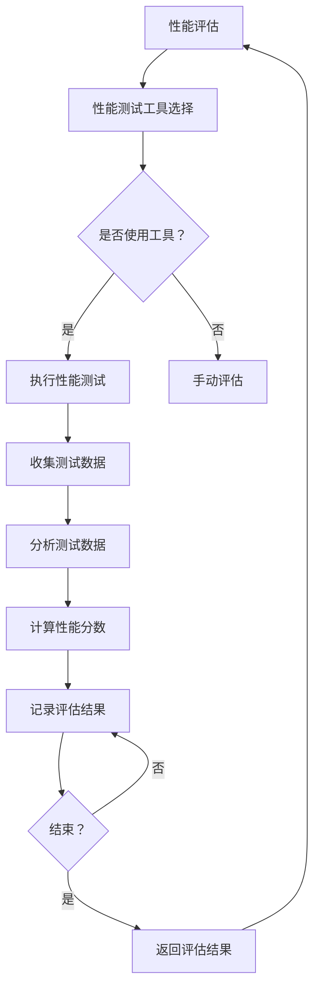
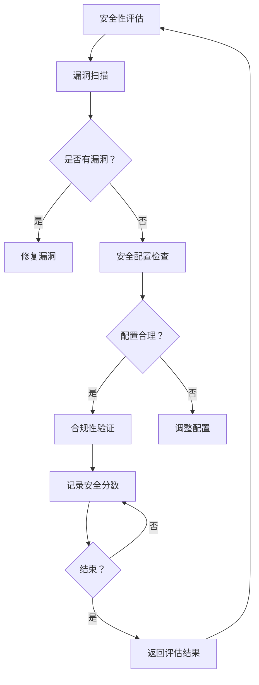

                 

### 《技术决策框架：P9工程师的系统化思维》

#### 关键词：技术决策、系统化思维、框架构建、高级实践、P9工程师

> 摘要：本文旨在探讨技术决策框架的构建与应用，针对P9工程师系统化思维的培养进行深入剖析。文章首先介绍了技术决策框架的重要性以及系统化思维的基本概念，随后详细阐述了技术决策框架的具体构建步骤和应用实例。通过分章节讨论技术评估与选型、项目规划与风险管理、技术创新与探索、团队协作与知识管理等方面，本文为读者提供了全方位的技术决策指导。此外，文章还通过高级技术决策案例分析，展示了系统化思维在实际工作中的应用与优化策略，旨在帮助P9工程师在复杂的技术环境中做出更明智的决策。

---

#### 第一部分：引言与基础概念

### 1. 引言

#### 1.1 技术决策框架的重要性

在快速变化的技术环境中，技术决策变得至关重要。对于P9工程师而言，他们需要具备系统化思维，以应对复杂的技术挑战和业务需求。技术决策框架提供了一个结构化的方法，帮助工程师们分析和解决技术问题，提高决策质量。

**技术决策在工程实践中的作用：**

- **指导项目选型：** 技术决策框架帮助工程师选择最适合项目需求的技术方案，避免盲目跟风或过度依赖经验。
- **优化资源配置：** 通过对技术方案的全面评估，工程师可以合理分配资源，确保项目的顺利进行。
- **降低风险：** 系统化思维能够识别潜在风险，并提前制定应对策略，减少项目失败的可能性。

#### 1.2 本书的目标与结构

本文的目标是帮助P9工程师构建和掌握技术决策框架，提升系统化思维能力。全书共分为三个部分：

- **第一部分：引言与基础概念**：介绍技术决策框架的重要性和系统化思维的基本概念。
- **第二部分：技术决策框架的具体应用**：讨论技术评估与选型、项目规划与风险管理、技术创新与探索、团队协作与知识管理等方面。
- **第三部分：高级技术决策实践**：通过案例分析展示系统化思维的实际应用与优化策略。

### 2. 系统化思维概述

#### 2.1 系统化思维的定义与特点

系统化思维是一种以整体视角分析和解决问题的思维方式。它强调将复杂问题分解为多个部分，通过逻辑推理和系统分析找到解决方案。

**系统化思维的内涵：**

- **整体性：** 强调问题之间的相互关联，避免片面化看待问题。
- **结构性：** 通过构建逻辑框架，将问题分解为可管理的部分。
- **系统性：** 将决策过程视为一个动态系统，不断调整和优化。

**系统化思维的优势与应用场景：**

- **优势：** 提高决策效率，减少错误，增强问题的可预测性。
- **应用场景：** 技术项目管理、系统架构设计、技术创新、风险管理等。

#### 2.2 系统化思维的核心要素

**目标设定**：明确项目目标和预期成果，为后续决策提供方向。

**数据收集与分析**：收集相关数据，进行系统分析，为决策提供依据。

**选项评估**：评估不同选项的优缺点，选择最佳方案。

**决策执行与监控**：实施决策，并持续监控效果，进行必要调整。

### 3. 技术决策框架

#### 3.1 技术决策框架的构建

技术决策框架是一种结构化的决策方法，帮助工程师们进行高效的技术决策。

**技术决策框架的基本模型：**

1. **明确问题：** 确定技术问题的核心要素和目标。
2. **数据收集：** 收集相关数据，进行分析。
3. **选项评估：** 评估不同技术方案的优缺点。
4. **决策制定：** 选择最佳技术方案。
5. **执行与监控：** 实施决策，并监控效果。

**构建技术决策框架的步骤：**

1. **问题定义：** 确定技术问题的具体内容和背景。
2. **目标设定：** 确定项目目标和预期成果。
3. **数据收集：** 收集相关数据和文献。
4. **选项评估：** 评估不同技术方案的优缺点。
5. **决策制定：** 选择最佳技术方案。
6. **决策执行：** 实施决策，并监控效果。
7. **反馈与调整：** 根据反馈结果进行决策调整。

#### 3.2 技术决策框架的应用实例

**案例一：项目技术选型**

- **问题定义**：某公司需要开发一款新应用，需要选择合适的技术方案。
- **目标设定**：确保应用的高性能、易维护性，并考虑未来可扩展性。
- **数据收集**：收集市场上主流技术方案的资料，进行对比分析。
- **选项评估**：评估不同技术方案的性能、成本和风险。
- **决策制定**：选择最适合的技术方案。
- **执行与监控**：实施技术方案，并监控项目进度和性能。

**案例二：技术创新实践**

- **问题定义**：某公司希望在现有技术基础上进行创新，提升产品竞争力。
- **目标设定**：开发新型技术，提高产品性能，降低成本。
- **数据收集**：收集行业前沿技术资料，分析市场需求。
- **选项评估**：评估不同技术创新方案的可行性。
- **决策制定**：选择最具潜力的技术创新方向。
- **执行与监控**：实施技术创新，并持续优化。

---

### 第二部分：技术决策框架的具体应用

### 4. 技术评估与选型

#### 4.1 技术评估的方法

技术评估是技术决策框架中至关重要的一环。以下为技术评估的详细步骤和方法：

**技术评估的步骤：**

1. **确定评估目标**：明确评估的具体目标，如性能、成本、可维护性等。
2. **收集技术资料**：收集市场上相关技术方案的信息，包括技术特点、性能指标、成本等。
3. **建立评估标准**：根据评估目标，制定具体的评估标准，如评分体系、权重分配等。
4. **进行评估分析**：对收集到的技术资料进行系统分析，评估各技术方案的优缺点。
5. **综合评估结果**：根据评估结果，选择最佳技术方案。

**技术评估的工具与资源：**

- **在线评估工具**：如TechEmpower Benchmarks、AWS Well-Architected Tool等。
- **行业报告**：如Gartner、Forrester等市场调研公司的报告。
- **专业论坛和社区**：如Stack Overflow、GitHub等。

#### 4.2 技术选型的策略

技术选型是技术评估的结果应用。以下为技术选型的策略和最佳实践：

**技术选型的影响因素：**

- **业务需求**：明确项目需求，确保技术方案能够满足业务需求。
- **性能和稳定性**：选择性能高、稳定性好的技术方案。
- **成本**：综合考虑开发成本、维护成本等。
- **可扩展性**：考虑技术方案的扩展性，以应对未来业务增长。

**技术选型的最佳实践：**

- **需求分析**：充分了解项目需求，明确技术选型的目标。
- **多方评估**：收集多方信息，进行综合评估。
- **试点实践**：对选定的技术方案进行试点实践，验证其可行性。
- **持续优化**：根据实际应用情况，持续优化技术方案。

### 5. 项目规划与风险管理

#### 5.1 项目规划的方法

项目规划是确保项目按计划顺利进行的关键。以下为项目规划的详细步骤和方法：

**项目规划的关键步骤：**

1. **明确项目目标**：确保项目目标明确、具体、可量化。
2. **分解任务**：将项目任务分解为可管理的子任务。
3. **制定时间计划**：根据任务分解和时间要求，制定详细的项目时间计划。
4. **资源分配**：确定项目所需的资源，包括人力、资金、设备等。
5. **风险评估**：识别项目潜在的风险，并制定应对策略。

**项目规划的工具与资源：**

- **项目管理工具**：如JIRA、Trello等。
- **时间管理工具**：如Gantt图表、甘特图等。
- **风险评估工具**：如SWOT分析、PERT图等。

#### 5.2 风险管理的策略

风险管理是项目规划的重要组成部分。以下为风险管理的详细策略和最佳实践：

**风险识别与评估：**

- **识别风险因素**：通过头脑风暴、访谈、专家咨询等方式，识别项目可能面临的风险。
- **评估风险影响**：对识别出的风险进行评估，包括风险发生的可能性、影响程度等。

**风险应对与监控：**

- **制定应对策略**：根据风险影响，制定相应的应对策略，如风险规避、风险转移、风险接受等。
- **监控风险变化**：在项目执行过程中，持续监控风险的变化，并根据实际情况调整应对策略。

---

### 第三部分：高级技术决策实践

### 8. 高级技术决策案例分析

#### 8.1 案例分析的方法

高级技术决策案例分析是一种通过实际案例研究来理解和优化技术决策框架的方法。以下为案例分析的基本方法和步骤：

**案例分析的基本流程：**

1. **选择案例**：选择具有代表性的实际案例，确保案例能够反映技术决策的关键问题和挑战。
2. **收集资料**：收集与案例相关的技术文档、项目报告、专家访谈等资料。
3. **分析案例**：通过系统分析，识别案例中的关键决策点、技术挑战和解决方案。
4. **提炼经验**：总结案例中的成功经验和教训，提炼出可复制的最佳实践。
5. **提出建议**：根据分析结果，提出改进建议和优化策略。

**案例分析的工具与技巧：**

- **数据分析工具**：如Excel、Python等。
- **图表工具**：如PowerPoint、Visio等。
- **思维导图**：用于梳理案例分析和决策过程。

#### 8.2 案例分析的具体实践

**案例一：大型电商平台的技术架构选型**

- **问题背景**：某大型电商平台需要升级其技术架构，以应对不断增长的流量和业务需求。
- **案例分析**：通过分析电商平台的技术需求、现有架构的瓶颈和挑战，以及市场上主流的技术架构方案，确定最适合的技术架构。
- **决策制定**：选择基于微服务架构的解决方案，实现高可用性、高性能和可扩展性。
- **执行与监控**：实施技术架构升级，并持续监控性能和稳定性。

**案例二：新能源汽车电池技术创新**

- **问题背景**：某新能源汽车企业需要在电池技术上进行创新，以提高续航里程和安全性。
- **案例分析**：通过分析现有电池技术的优缺点、市场趋势和竞争对手的技术策略，确定电池技术创新的方向。
- **决策制定**：选择开发新型固态电池，以提升电池性能和安全性。
- **执行与监控**：实施新型电池技术的研发和生产，并持续优化电池性能。

---

### 9. 技术决策框架的优化与改进

#### 9.1 技术决策框架的评估

技术决策框架的评估是确保其有效性和持续改进的关键环节。以下为技术决策框架评估的详细方法和指标：

**技术决策框架的评估指标：**

- **决策质量**：评估决策结果的准确性和有效性。
- **执行效率**：评估决策过程的效率和执行速度。
- **资源利用率**：评估决策过程中资源的利用率和成本效益。
- **风险控制**：评估决策过程中对风险的有效控制和应对能力。

**技术决策框架的优化方向：**

- **优化决策模型**：根据评估结果，对决策模型进行优化和调整，提高决策的准确性和可靠性。
- **改进评估方法**：引入新的评估工具和技术，提高评估的效率和准确性。
- **完善决策流程**：优化决策流程，减少冗余环节，提高决策的执行效率。

#### 9.2 技术决策框架的改进

技术决策框架的改进是一个持续迭代的过程。以下为技术决策框架改进的详细步骤和方法：

**技术决策框架的迭代与更新：**

1. **收集反馈**：收集项目实施过程中的反馈，包括成功经验和教训。
2. **分析问题**：对反馈进行分析，识别存在的问题和改进机会。
3. **制定改进计划**：根据分析结果，制定具体的改进计划和实施方案。
4. **实施改进**：根据改进计划，实施技术决策框架的调整和优化。
5. **评估效果**：评估改进措施的效果，并根据实际情况进行进一步的调整和优化。

**技术决策框架的创新实践：**

- **引入新技术和方法**：结合行业前沿技术和发展趋势，引入新的决策工具和方法，提高决策的智能化和自动化水平。
- **跨部门协作**：加强跨部门的协作和沟通，提高决策的全面性和准确性。
- **持续培训与学习**：定期组织技术决策相关的培训和研讨会，提高工程师的技术水平和系统化思维能力。

---

### 附录

#### 附录 A：技术决策框架参考资料

**A.1 相关书籍推荐**

- 《技术决策：构建高效技术团队的指南》
- 《系统化思维：如何构建和运用系统思维》
- 《敏捷创新：如何快速实现技术突破》

**A.2 技术决策框架工具集**

- **项目管理工具**：如JIRA、Trello等。
- **风险评估工具**：如SWOT分析、PERT图等。
- **数据可视化工具**：如Power BI、Tableau等。

#### 附录 B：技术决策实践案例

**B.1 案例一：基于技术决策框架的项目选型**

- **项目背景**：某公司需要开发一款新应用，面临多种技术方案的选择。
- **技术评估与选型过程**：通过技术决策框架，对各种技术方案进行评估和选型，最终选择最适合的方案。
- **结果分析与应用**：项目成功实施，性能和稳定性达到预期，为公司节省了成本。

**B.2 案例二：技术创新与探索实践**

- **创新背景**：某公司希望在电池技术上进行创新，提高产品竞争力。
- **技术探索的过程与成果**：通过技术决策框架，进行技术创新探索，成功开发出新型电池技术。
- **创新实践的启示与经验**：技术创新需要系统化思维，通过科学的方法和严谨的评估，可以大幅提高创新的成功率。

#### 附录 C：技术决策框架常见问题解答

**C.1 技术决策框架适用范围**

技术决策框架适用于各种类型的技术项目，包括软件开发、系统架构设计、技术创新等。不同类型的项目可以根据框架进行调整和优化，以满足具体需求。

**C.2 技术决策框架应用难点**

技术决策框架应用中的难点主要包括：

- **数据收集与分析**：确保收集到的数据准确、全面，并进行有效的分析。
- **选项评估**：评估不同选项的优缺点，并进行综合评估。
- **决策制定**：确保决策的准确性和可靠性。

**C.3 技术决策框架未来发展趋势**

技术决策框架的未来发展趋势包括：

- **智能化与自动化**：引入人工智能和机器学习技术，提高决策的智能化和自动化水平。
- **跨学科融合**：融合不同学科的知识和方法，提高决策的全面性和准确性。
- **持续改进与优化**：通过持续改进和优化，不断提高技术决策框架的实用性和有效性。

---

### 总结

本文从引言到高级实践，系统地介绍了技术决策框架的构建与应用。通过详细阐述系统化思维的概念和核心要素，读者可以更好地理解技术决策框架的原理和方法。通过具体案例的分析和实践，读者可以掌握技术决策框架在实际工作中的应用，并能够根据具体需求进行相应的调整和优化。希望本文能够为P9工程师在复杂的技术环境中做出更明智的决策提供有益的参考。

---

**作者：AI天才研究院/AI Genius Institute & 禅与计算机程序设计艺术 /Zen And The Art of Computer Programming**

---

**全文结束。**## 第一部分：引言与基础概念

### 1. 引言

在技术飞速发展的今天，技术决策在工程实践中扮演着至关重要的角色。对于P9工程师，即高级技术专家和管理者而言，他们不仅需要掌握深厚的专业知识，还需要具备系统化思维，以应对复杂的技术挑战和不断变化的业务需求。技术决策框架作为一种结构化的决策方法，为P9工程师提供了一个系统化、逻辑化的思考路径，帮助他们做出更加明智和高效的决策。

#### 1.1 技术决策框架的重要性

技术决策框架在工程实践中的作用不可忽视。首先，它为工程师们提供了一个明确的决策流程，使得复杂的决策过程变得更加清晰和有条理。通过这个框架，工程师可以系统地分析和解决问题，减少因盲目决策带来的风险。其次，技术决策框架强调数据驱动和科学评估，使得决策更加客观和可靠。工程师们可以基于收集到的数据和信息，进行全面的评估和比较，从而选出最佳的技术方案。此外，技术决策框架还重视风险管理和反馈调整，确保决策过程中的风险得到有效控制，并且能够在实践中不断优化和改进。

**系统化思维的概念及其重要性**

系统化思维是一种以整体视角分析和解决问题的思维方式。它强调将复杂问题分解为多个部分，通过逻辑推理和系统分析找到解决方案。对于P9工程师来说，系统化思维的重要性体现在以下几个方面：

- **全局观**：系统化思维帮助工程师从整体上理解问题，看到不同部分之间的相互关系，避免片面化看待问题。
- **逻辑性**：通过系统化思维，工程师可以理清思路，构建逻辑框架，使得决策过程更加清晰和有条理。
- **预见性**：系统化思维能够帮助工程师预见潜在的问题和风险，提前制定应对策略，提高决策的准确性和可靠性。
- **创新能力**：系统化思维鼓励工程师从不同角度思考问题，激发创新思维，找到更优的解决方案。

#### 1.2 本书的目标与结构

本书的目标是帮助P9工程师构建和掌握技术决策框架，提升系统化思维能力。全书分为三个部分，具体内容如下：

- **第一部分：引言与基础概念**：介绍技术决策框架的重要性以及系统化思维的基本概念。
- **第二部分：技术决策框架的具体应用**：详细讨论技术评估与选型、项目规划与风险管理、技术创新与探索、团队协作与知识管理等方面。
- **第三部分：高级技术决策实践**：通过案例分析展示系统化思维的实际应用与优化策略。

通过这三个部分的深入探讨，读者可以全面了解技术决策框架的构建与应用，并在实际工作中灵活运用，提升技术决策的质量和效率。

### 2. 系统化思维概述

系统化思维是一种以整体视角分析和解决问题的思维方式。它强调将复杂问题分解为多个部分，通过逻辑推理和系统分析找到解决方案。在技术决策过程中，系统化思维尤为重要，因为它可以帮助工程师从全局出发，理清思路，制定合理的决策方案。

#### 2.1 系统化思维的定义与特点

系统化思维的定义可以从以下几个方面来理解：

- **整体性**：系统化思维强调从整体上看待问题，关注系统内部各个部分之间的相互关系和相互作用。它要求工程师在分析问题时，不仅要看到单个部分的作用，还要理解整个系统的运行机制。
- **结构性**：系统化思维注重结构性分析，将复杂问题分解为多个组成部分，并通过逻辑关系将它们有机地联系起来。这种结构化的思维方式有助于工程师更好地理解问题的本质，找到有效的解决方案。
- **动态性**：系统化思维认为，任何系统都是动态变化的，因此在分析和决策过程中，工程师需要考虑系统的演变趋势和未来可能的变化。这种动态性要求工程师具备前瞻性和灵活性，能够及时调整和优化决策方案。

系统化思维的特点可以归纳为以下几点：

- **逻辑性**：系统化思维通过逻辑推理来分析和解决问题，使得决策过程更加清晰和有条理。
- **综合性**：系统化思维强调综合各种信息，从多个角度进行分析，从而提高决策的准确性和全面性。
- **预见性**：系统化思维能够帮助工程师预见潜在的问题和风险，提前制定应对策略，减少决策失误。

#### 2.2 系统化思维的优势与应用场景

系统化思维在技术决策中的应用具有明显的优势，主要体现在以下几个方面：

- **提高决策效率**：系统化思维能够帮助工程师快速理清问题的本质，明确目标，从而提高决策效率。
- **减少错误**：通过系统化思维，工程师可以全面考虑问题各个方面的因素，减少因片面分析而导致的错误决策。
- **增强可预测性**：系统化思维强调对系统动态性的分析，能够提高决策的可预测性，帮助工程师提前预见到可能出现的问题和风险。
- **促进创新**：系统化思维鼓励工程师从不同角度思考问题，激发创新思维，找到更优的解决方案。

系统化思维适用于多种技术决策场景，包括：

- **项目选型**：在项目初期，系统化思维可以帮助工程师全面评估不同技术方案的优缺点，选择最适合的方案。
- **系统架构设计**：在系统设计过程中，系统化思维有助于工程师理清系统结构，优化系统性能和可扩展性。
- **技术创新**：在探索新技术时，系统化思维可以帮助工程师分析新技术的影响和潜在风险，制定合理的创新策略。
- **风险管理**：在项目实施过程中，系统化思维可以帮助工程师识别潜在风险，并制定有效的风险管理策略。

通过系统化思维的运用，P9工程师可以更系统地分析和解决技术问题，提高决策质量和效率，为企业的技术发展和业务成功做出更大贡献。

#### 2.3 系统化思维的核心要素

系统化思维作为一种强大的分析工具，其核心要素包括目标设定、数据收集与分析、选项评估和决策执行与监控。这些要素相互作用，构成了一个完整的技术决策过程。

**目标设定**

目标设定是系统化思维的起点。明确的目标是决策过程的指南针，它帮助工程师在复杂的技术环境中保持方向。一个明确的目标需要具体、可衡量和可实现。例如，在项目选型中，目标可能是实现高性能和低延迟。通过设定清晰的目标，工程师可以更好地聚焦于解决关键问题。

**数据收集与分析**

数据是决策的基础。工程师需要收集与决策相关的各种数据，包括市场需求、技术性能、成本和资源等。数据收集过程需要全面和准确，以确保后续分析的可靠性。数据分析是数据收集的延伸，通过对数据的分析和处理，工程师可以提取出有价值的信息，形成对问题的深刻理解。

**选项评估**

选项评估是决策过程的核心。工程师需要对所有可能的选项进行系统评估，比较它们的优势和劣势。评估过程包括定量分析和定性分析，如成本效益分析、风险评估和技术可行性分析。通过全面评估，工程师可以选出最符合目标的技术方案。

**决策执行与监控**

决策执行是将方案付诸实践的过程。在执行过程中，工程师需要确保方案的各项细节得到落实，同时监控执行效果。监控是决策执行的延续，它帮助工程师及时发现问题和调整方案。有效的监控可以确保项目按计划进行，减少风险。

这些核心要素相互关联，构成了一个动态的决策过程。目标设定提供了方向，数据收集与分析提供了基础，选项评估提供了选择，决策执行与监控则确保了方案的有效实施。通过这些要素的有机结合，工程师可以系统地分析和解决技术问题，提高决策的质量和效率。

#### 3. 技术决策框架的构建

技术决策框架是一种结构化的方法，用于指导工程师在复杂的技术环境中做出高效和明智的决策。构建技术决策框架需要遵循一定的步骤，并运用系统化思维进行分析和优化。

**技术决策框架的基本模型**

技术决策框架的基本模型包括以下几个关键环节：

1. **明确问题**：这一步是技术决策的起点，工程师需要明确决策的具体问题，包括问题的背景、目标和约束条件。明确问题有助于聚焦决策的核心，避免在非关键问题上浪费时间和资源。

2. **数据收集**：在明确问题后，工程师需要收集与决策相关的数据和信息。这些数据可能包括市场需求、技术性能、成本、风险等。数据收集的全面性和准确性对后续的决策过程至关重要。

3. **选项评估**：在收集到足够的数据后，工程师需要对所有可能的选项进行评估。评估过程包括定量分析和定性分析，如成本效益分析、技术可行性分析等。通过全面评估，工程师可以选出最佳的技术方案。

4. **决策制定**：在评估完成后，工程师需要根据评估结果制定最终的决策。决策制定过程需要综合考虑各种因素，包括技术性能、成本、风险和业务需求等。一个合理的决策方案应该能够在满足业务需求的同时，最大化收益和最小化风险。

5. **执行与监控**：决策制定完成后，工程师需要将方案付诸实施，并持续监控执行效果。监控过程可以帮助工程师及时发现和解决问题，确保项目按计划进行。

**构建技术决策框架的步骤**

构建技术决策框架可以分为以下几个步骤：

1. **问题定义**：明确决策的具体问题，包括问题的背景、目标和约束条件。例如，在项目选型中，需要明确项目的业务需求、技术要求和成本预算等。

2. **目标设定**：根据问题定义，设定具体、可量化的目标。例如，在项目选型中，目标可以是实现高性能、低延迟和成本可控。

3. **数据收集**：收集与决策相关的数据和信息，包括市场需求、技术性能、成本、风险等。数据收集可以通过市场调研、技术文档分析、专家访谈等方式进行。

4. **选项评估**：对收集到的数据进行分析，评估不同选项的优缺点。可以通过建立评分体系、权重分配等方法，对各个选项进行定量和定性评估。

5. **决策制定**：根据评估结果，选择最佳的技术方案。决策制定过程中需要综合考虑各种因素，如技术性能、成本、风险和业务需求等。

6. **执行与监控**：将决策方案付诸实施，并持续监控执行效果。监控过程可以通过定期检查、反馈机制和风险管理工具等方式进行。

通过这些步骤，工程师可以构建一个结构化的技术决策框架，帮助他们在复杂的技术环境中做出高效和明智的决策。

**技术决策框架的应用实例**

为了更好地理解技术决策框架的构建和应用，以下通过一个实际案例进行说明。

**案例背景**：某公司需要开发一款新应用，用于提高客户服务质量。公司面临多个技术方案的选择，包括使用传统Web应用、移动应用或基于云计算的微服务架构。

1. **问题定义**：明确决策的具体问题，包括应用的性能要求、成本预算和扩展性需求。

2. **目标设定**：设定具体、可量化的目标，如高性能、低成本和易扩展。

3. **数据收集**：收集与决策相关的数据，包括市场上主流技术方案的性能指标、成本和安全性等。

4. **选项评估**：对收集到的数据进行评估，建立评分体系，评估不同技术方案的优缺点。

5. **决策制定**：根据评估结果，选择基于云计算的微服务架构作为最佳方案。

6. **执行与监控**：实施微服务架构，并持续监控性能和稳定性，确保项目按计划进行。

通过这个案例，我们可以看到技术决策框架在实际应用中的具体操作步骤和效果。技术决策框架不仅帮助公司选择了最佳的技术方案，还确保了项目的顺利实施和成功交付。

技术决策框架的应用实例是理解其构建和应用的重要途径。通过实际案例的剖析，我们可以看到技术决策框架在项目选型、技术创新、风险管理等方面的具体操作方法和效果。这不仅有助于提升工程师的决策能力，也为企业提供了更加科学和系统的决策支持。

#### 3.2 技术决策框架的应用实例

为了更好地理解技术决策框架在实际工作中的应用，我们通过两个实际案例来详细探讨技术决策框架的具体应用。

**案例一：大型电商平台的技术选型**

**问题背景：** 某大型电商平台需要升级其技术架构，以支持快速增长的用户量和交易量。电商平台面临着系统性能、可扩展性和维护成本等多方面的挑战。

**目标设定：** 明确的目标包括提升系统的性能、降低延迟、提高可扩展性、降低长期维护成本，同时确保数据的安全性和稳定性。

**数据收集与分析：** 通过市场调研、技术文档分析、竞争对手技术方案对比等方式，收集与候选技术方案相关的性能数据、成本估算、安全性和扩展性评估报告。

**选项评估：** 对不同技术方案进行详细评估，包括传统单体架构、分布式服务架构、云计算架构等。通过评分体系和权重分配，对各方案的优缺点进行量化评估。

**决策制定：** 最终选择云计算架构作为最佳方案，因为它在性能、可扩展性和成本控制方面具有明显优势。

**执行与监控：** 实施云计算架构，并在实施过程中持续监控系统的性能、安全性和稳定性，确保架构升级顺利进行。

**案例二：智能家居系统的技术创新**

**问题背景：** 某智能家居公司希望在其新推出的智能音响系统中引入语音识别和自然语言处理技术，以提高用户体验。

**目标设定：** 明确的目标包括实现高准确度的语音识别、丰富的语音交互功能、低功耗和高稳定性。

**数据收集与分析：** 收集市场上主流语音识别和自然语言处理技术的性能数据、成本信息、市场反馈和技术文档。

**选项评估：** 对不同技术方案进行详细评估，包括基于云的语音识别、基于本地处理的语音识别等。通过评分体系和权重分配，对各方案的优缺点进行量化评估。

**决策制定：** 最终选择基于本地处理的语音识别方案，因为它在低功耗、数据安全和响应速度方面表现更佳。

**执行与监控：** 实施本地语音识别技术，并在产品发布后持续收集用户反馈，优化和改进语音交互功能。

通过以上两个案例，我们可以看到技术决策框架在实际工作中的应用。技术决策框架不仅帮助企业在技术选型和产品创新中做出明智的决策，还确保了决策的实施和监控，提高了项目的成功率。

**总结**：技术决策框架在实际工作中的应用具有重要的现实意义。它帮助工程师在复杂的技术环境中保持清晰的思路，通过系统的分析和评估，选出最佳的技术方案，并确保决策的顺利实施和持续优化。通过不断实践和完善，技术决策框架将成为工程师们高效决策的有力工具。

### 4. 技术评估与选型

#### 4.1 技术评估的方法

技术评估是技术决策过程中至关重要的一环，它通过对不同技术方案的评估，帮助工程师选择最佳的技术方案。以下为技术评估的详细方法和步骤：

**技术评估的步骤：**

1. **确定评估目标**：明确技术评估的具体目标，例如性能、成本、安全性、可扩展性等。评估目标需要具体、可量化，以确保评估的准确性。

2. **收集技术资料**：收集与评估目标相关的技术资料，包括技术文档、市场调研报告、技术性能数据等。资料收集的全面性和准确性对评估结果至关重要。

3. **建立评估标准**：根据评估目标，制定具体的评估标准。评估标准应具有可操作性和可衡量性，以便对技术方案进行客观评估。常见的评估标准包括评分体系、权重分配、评价矩阵等。

4. **进行评估分析**：对收集到的技术资料进行系统分析，评估各技术方案的优缺点。评估分析可以采用定量分析和定性分析相结合的方法，例如数据分析、专家评估、对比分析等。

5. **综合评估结果**：根据评估分析结果，对各技术方案进行综合评估，选择最佳的技术方案。综合评估应考虑技术性能、成本效益、风险因素等多方面因素。

**技术评估的工具与资源：**

- **在线评估工具**：如TechEmpower Benchmarks、AWS Well-Architected Tool等，可用于性能测试和评估。
- **行业报告**：如Gartner、Forrester等市场调研公司的报告，提供全面的技术评估和市场趋势分析。
- **专业论坛和社区**：如Stack Overflow、GitHub等，可获取一线工程师的评估和反馈。

#### 4.2 技术选型的策略

技术选型是技术评估的结果应用，通过科学和系统的策略，工程师可以选择最佳的技术方案。以下为技术选型的策略和最佳实践：

**技术选型的影响因素：**

- **业务需求**：明确项目需求，确保技术方案能够满足业务需求。
- **技术性能**：选择性能高、稳定性好的技术方案。
- **成本**：综合考虑开发成本、维护成本等。
- **可扩展性**：考虑技术方案的扩展性，以应对未来业务增长。
- **安全性**：选择具有高安全性的技术方案，保护数据和用户隐私。
- **社区支持**：选择社区活跃、资源丰富的技术方案，便于获取支持和解决问题。

**技术选型的最佳实践：**

- **需求分析**：充分了解项目需求，明确技术选型的目标。
- **多方评估**：收集多方信息，进行综合评估。
- **试点实践**：对选定的技术方案进行试点实践，验证其可行性。
- **持续优化**：根据实际应用情况，持续优化技术方案。

**具体策略**：

1. **制定选型标准**：根据业务需求和评估目标，制定具体的选型标准，如性能指标、成本预算、安全要求等。

2. **技术调研**：调研市场上主流的技术方案，收集技术文档、用户反馈、性能数据等。

3. **评估分析**：对收集到的技术方案进行系统评估，比较其优缺点，确定候选方案。

4. **试点实践**：选择候选方案中的几个进行试点实践，模拟实际使用场景，验证其性能和稳定性。

5. **决策制定**：根据试点实践的结果，选择最佳的技术方案，并制定详细的技术实施计划。

6. **监控优化**：在技术实施过程中，持续监控技术方案的运行效果，并根据反馈进行优化和调整。

通过以上策略，工程师可以科学地选择最佳的技术方案，确保项目的成功实施和持续发展。

### 5. 项目规划与风险管理

#### 5.1 项目规划的方法

项目规划是确保项目按计划顺利进行的重要环节。一个良好的项目规划可以帮助工程师明确项目目标、任务和时间表，从而提高项目的成功率和效率。以下为项目规划的详细方法和步骤：

**项目规划的关键步骤：**

1. **明确项目目标**：项目规划的第一步是明确项目目标。这些目标应具体、可衡量和可实现，并与业务需求紧密相关。例如，项目目标可能是开发一个具备高性能和高可靠性的系统。

2. **任务分解**：将项目目标分解为可管理的子任务。每个子任务应具有明确的可交付成果和时间节点。任务分解有助于项目团队理解项目的各个组成部分，并确保每个部分都能按时完成。

3. **时间计划**：根据任务分解，制定详细的时间计划。时间计划应包括每个任务的开始和结束时间，以及关键里程碑。常用的工具包括甘特图和项目规划软件，如Microsoft Project、JIRA等。

4. **资源分配**：确定项目所需的资源，包括人力、资金、设备和材料等。资源分配应考虑任务的优先级和时间要求，以确保资源得到充分利用。

5. **风险评估**：识别项目可能面临的风险，并评估其对项目的影响。常见的方法包括SWOT分析（优势、劣势、机会、威胁）和PERT图（项目评估与审查技术）。

6. **风险管理计划**：根据风险评估的结果，制定相应的风险管理计划。风险管理计划应包括风险应对策略、应急计划和监控措施。

7. **监控与反馈**：在项目执行过程中，定期监控项目进展，并与原计划进行比较。如有偏差，应及时调整计划和资源分配，确保项目按计划进行。

**项目规划的工具与资源：**

- **项目管理工具**：如Microsoft Project、JIRA、Trello等，用于任务分解、时间计划和资源分配。
- **风险评估工具**：如SWOT分析、PERT图等，用于识别和评估风险。
- **时间管理工具**：如甘特图、项目管理软件等，用于制定和监控时间计划。
- **沟通工具**：如Slack、Microsoft Teams等，用于团队协作和沟通。

**项目规划的实际应用：**

1. **软件开发项目**：在软件开发项目中，项目规划可以帮助团队明确开发目标、任务和时间表，确保项目按时交付。

2. **基础设施建设项目**：在基础设施建设项目中，项目规划可以确保工程进度、资源分配和成本控制，提高项目的效率和质量。

3. **市场营销活动**：在市场营销活动中，项目规划可以确保活动的策划、执行和评估，提高活动的效果和投资回报率。

#### 5.2 风险管理的策略

风险管理是项目规划的重要组成部分，它帮助项目团队识别、评估和应对潜在的风险，以确保项目目标的实现。以下为风险管理的详细策略和最佳实践：

**风险识别与评估：**

1. **风险识别**：通过头脑风暴、访谈、专家咨询和经验分析等方法，识别项目可能面临的风险。风险识别应全面覆盖项目各个方面，包括技术风险、市场风险、资源风险等。

2. **风险评估**：对识别出的风险进行评估，确定其发生的可能性、影响程度和优先级。风险评估可以使用定量分析和定性分析相结合的方法，如概率-影响矩阵和风险优先级排序。

3. **建立风险清单**：将评估结果整理成风险清单，记录每个风险的名称、发生概率、影响程度和应对措施。风险清单有助于项目团队随时掌握风险情况，并制定相应的应对策略。

**风险应对与监控：**

1. **风险应对策略**：根据风险清单和风险评估结果，制定相应的风险应对策略。常见的风险应对策略包括风险规避、风险转移、风险缓解和风险接受。

2. **风险管理计划**：将风险应对策略整合到项目管理计划中，制定详细的风险管理计划。风险管理计划应包括风险监控、预警机制和应急响应措施。

3. **风险监控**：在项目执行过程中，持续监控风险的变化，及时发现新风险和现有风险的演变。风险监控可以通过定期检查、项目进度报告和风险管理会议等方式进行。

4. **风险调整与优化**：根据风险监控结果，调整和优化风险管理计划。如果发现新风险或现有风险的演变，应及时采取应对措施，确保项目能够按计划进行。

**风险管理的最佳实践：**

- **提前规划**：在项目启动阶段，就应开始制定风险管理计划，确保项目在早期阶段就具备应对风险的能力。
- **全员参与**：风险管理不仅仅是项目团队的责任，还应鼓励项目利益相关者参与风险识别和评估，提高风险管理的全面性和准确性。
- **持续改进**：通过项目执行过程中的风险监控和反馈，不断优化风险管理策略和措施，提高项目应对风险的能力。
- **培训与意识提升**：定期对项目团队成员进行风险管理培训，提高他们的风险识别和应对能力，形成全员风险管理意识。

通过以上策略和最佳实践，项目团队可以有效地识别、评估和应对风险，确保项目目标的实现，提高项目的成功率和效率。

### 6. 技术创新与探索

#### 6.1 技术创新的模式

技术创新是推动企业持续发展的重要动力。成功的创新不仅可以提升企业的竞争力，还可以带来新的市场和业务机会。以下为技术创新的几种常见模式：

**1. 基于市场需求的技术创新**

基于市场需求的技术创新是针对市场需求变化而进行的创新。企业通过市场调研和用户反馈，了解用户的需求和痛点，然后开发出满足这些需求的技术产品或服务。这种模式的优点是能够快速响应市场变化，提高产品的市场竞争力。

**2. 基于技术突破的技术创新**

基于技术突破的技术创新是依托于技术前沿和突破而进行的创新。企业通过持续的技术研发和探索，寻找技术上的新突破，并将其应用于产品或服务中。这种模式的优点是能够引领市场趋势，打造核心竞争力。

**3. 基于协同创新的技术创新**

基于协同创新的技术创新是依托于跨学科、跨领域合作而进行的创新。企业通过与其他企业、研究机构、高校等合作，共享资源、知识和技能，共同开发新技术和新产品。这种模式的优点是能够汇聚各方优势，实现资源的高效利用和协同创新。

**4. 基于业务模式创新的技术创新**

基于业务模式创新的技术创新是依托于新的商业模式和运营策略而进行的创新。企业通过改变业务模式，如采用新的销售渠道、服务模式或运营机制，实现业务的创新和增长。这种模式的优点是能够优化业务流程，提高运营效率和盈利能力。

#### 6.2 技术探索的实践

技术探索是企业持续创新的重要环节。以下为技术探索的实践方法和步骤：

**1. 确定探索目标**

在开始技术探索之前，企业需要明确探索的目标。探索目标应具体、可衡量，并与企业的战略目标相一致。例如，探索目标是开发一种新型传感器技术，以提高产品的精度和可靠性。

**2. 收集技术资料**

收集与探索目标相关的技术资料，包括技术文献、市场报告、竞争对手的产品信息等。这些资料可以帮助企业了解当前技术的前沿动态和发展趋势。

**3. 技术调研**

进行深入的技术调研，了解探索目标的技术细节和应用场景。技术调研可以通过与专家交流、参加技术会议和展览、进行实验室实验等方式进行。

**4. 技术评估**

对收集到的技术资料进行系统评估，评估其可行性、成本和风险。评估方法可以包括技术评估矩阵、成本效益分析等。

**5. 选择技术路线**

根据评估结果，选择最佳的技术路线。技术路线应具备可行性、成本效益和风险可控性。

**6. 技术研发**

根据选择的技术路线，进行技术研发。技术研发过程中，企业应建立有效的研发管理体系，确保研发进度和质量。

**7. 实验室实验与验证**

在技术研发完成后，进行实验室实验和验证，验证技术的性能和可靠性。实验室实验应覆盖各种可能的场景，确保技术能够在实际应用中稳定运行。

**8. 小批量试制与测试**

在实验室实验验证成功后，进行小批量试制和测试。小批量试制和测试可以进一步验证技术的可行性和可靠性，并为大规模生产做好准备。

**9. 大规模生产与市场推广**

在技术经过实验室实验和验证后，进行大规模生产，并推向市场。在市场推广过程中，企业应关注用户反馈，持续优化产品和服务。

**6.3 技术探索的挑战与机遇**

技术探索是一项充满挑战和机遇的任务。以下为技术探索中可能遇到的挑战和面临的机遇：

**挑战：**

- **技术不确定性**：新技术在早期阶段往往存在较大的不确定性，可能导致研发失败或项目延期。
- **成本高**：技术研发需要大量的资金投入，特别是前沿技术的研发，成本可能更高。
- **风险大**：技术探索面临多种风险，如技术失败、市场接受度低等。
- **资源限制**：企业资源有限，需要在技术探索和现有业务之间进行平衡。

**机遇：**

- **市场先发优势**：通过技术探索，企业可以抢占市场先机，建立品牌优势。
- **技术突破**：技术探索可能带来技术上的重大突破，提升企业核心竞争力。
- **业务创新**：技术探索可以激发业务创新，开拓新的市场和业务模式。
- **人才吸引**：技术探索可以吸引优秀的技术人才，提升企业的研发能力。

通过克服挑战和抓住机遇，企业可以在技术探索中取得成功，推动企业的持续发展和创新。

### 7. 团队协作与知识管理

#### 7.1 团队协作的策略

在复杂技术项目的实施过程中，团队协作是确保项目成功的关键。高效的团队协作能够提高项目效率，减少错误，增强团队凝聚力。以下为团队协作的策略和最佳实践：

**1. 明确团队目标**

明确团队目标是团队协作的基础。团队目标应具体、可衡量，并与项目目标紧密相关。通过共同的目标，团队成员可以明确各自的角色和职责，增强团队凝聚力。

**2. 分享知识和信息**

知识共享和信息透明是高效团队协作的保障。团队成员应定期分享技术知识、项目进展和问题解决方案，确保团队信息的一致性和共享性。

**3. 建立沟通机制**

建立有效的沟通机制，如定期会议、即时通讯工具和项目管理软件，确保团队成员之间的沟通顺畅。沟通机制应涵盖项目进展、问题反馈和决策制定等方面。

**4. 促进跨职能合作**

跨职能合作是团队协作的重要组成部分。团队成员应打破部门界限，积极参与其他部门的协作，共同解决问题，提高项目整体效率。

**5. 定期评估与反馈**

定期对团队协作进行评估和反馈，识别协作中的问题和改进点。评估和反馈可以通过团队会议、问卷调查等方式进行。

**6. 激励与认可**

激励和认可团队成员的付出和贡献，增强团队士气。激励方式可以包括物质奖励、精神奖励和晋升机会等。

**团队协作的工具与资源：**

- **项目管理工具**：如JIRA、Trello等，用于任务分配、进度跟踪和协作。
- **即时通讯工具**：如Slack、Microsoft Teams等，用于即时沟通和协作。
- **知识管理平台**：如Confluence、SharePoint等，用于知识共享和文档管理。

#### 7.2 知识管理的实践

知识管理是团队协作的重要环节，它通过系统的知识收集、整理和利用，提升团队的知识共享和创新能力。以下为知识管理的详细实践：

**1. 知识收集**

知识收集是知识管理的起点。团队成员应主动收集与项目相关的知识，包括技术文档、设计方案、项目报告、用户反馈等。知识收集可以通过定期回顾、项目总结和知识分享会等方式进行。

**2. 知识整理**

知识整理是将收集到的知识进行系统化整理和分类，使其易于检索和利用。知识整理可以采用结构化文档、数据库和知识图谱等方式，确保知识的系统性和完整性。

**3. 知识共享**

知识共享是知识管理的核心目标。通过建立知识共享平台和定期知识分享活动，团队成员可以方便地获取和利用已有的知识，提高工作效率和创新能力。

**4. 知识应用**

知识应用是将知识转化为实际项目成果的过程。通过知识共享和应用，团队成员可以借鉴他人的经验和教训，减少重复劳动，提高项目质量。

**5. 知识更新**

知识管理是一个动态的过程，需要不断更新和优化知识库。团队成员应定期对知识库进行审核和更新，确保知识的准确性和时效性。

**6. 知识管理工具**

知识管理工具是知识管理的重要支撑。常见的知识管理工具有Confluence、SharePoint、知呼等。这些工具可以帮助团队方便地创建、存储、共享和更新知识。

**7. 知识管理最佳实践**

- **建立知识管理体系**：制定知识管理政策、流程和标准，确保知识管理工作的规范和持续。
- **培训与推广**：定期对团队成员进行知识管理培训，提高他们的知识管理意识和技能。
- **激励机制**：建立激励机制，鼓励团队成员积极参与知识管理和分享。
- **持续改进**：通过定期评估和反馈，不断改进知识管理流程和工具，提高知识管理的效率和质量。

通过以上实践，团队可以有效地进行知识管理，提升知识共享和创新能力，为项目的成功实施提供有力支持。

### 8. 高级技术决策案例分析

#### 8.1 案例分析的方法

高级技术决策案例分析是一种通过实际案例研究来理解和优化技术决策框架的方法。这种方法不仅能够帮助工程师更深入地理解技术决策的原理和实践，还能够为他们在实际工作中提供有价值的参考和指导。

**案例分析的基本流程：**

1. **选择案例**：首先需要选择具有代表性的实际案例。这些案例应具有明确的技术决策需求、复杂的技术环境以及详细的决策过程。选择合适的案例是确保分析有效性的关键。

2. **收集资料**：在确定案例后，收集与案例相关的各种资料，包括技术文档、项目报告、专家访谈记录、市场调研报告等。这些资料为后续的分析提供了基础数据。

3. **分析案例**：通过对收集到的资料进行系统分析，识别案例中的关键决策点、技术挑战和解决方案。分析过程中应注重逻辑推理和系统化思维，确保能够全面、准确地理解案例。

4. **提炼经验**：在分析的基础上，提炼出案例中的成功经验和教训。这些经验可以包括有效的决策方法、技术评估标准、风险管理策略等。提炼经验有助于总结出可复制的最佳实践。

5. **提出建议**：根据分析结果，提出改进建议和优化策略。这些建议应针对案例中的具体问题和挑战，提出切实可行的解决方案。通过提出建议，可以进一步完善技术决策框架，提高决策质量。

**案例分析的步骤：**

1. **确定分析目标**：明确分析的具体目标，例如优化技术决策流程、提高项目成功率等。

2. **收集相关资料**：系统地收集与案例相关的各种资料，包括技术文档、项目报告、用户反馈等。

3. **整理和分析资料**：对收集到的资料进行整理和分析，提取关键信息，形成分析报告。

4. **识别关键决策点**：在分析过程中，识别案例中的关键决策点，例如技术选型、项目规划、风险管理等。

5. **评估决策过程**：对识别出的关键决策点进行详细评估，分析决策过程中的优点和不足。

6. **提炼最佳实践**：从案例中提炼出最佳实践，总结出有效的决策方法和技术评估标准。

7. **提出改进建议**：根据分析结果，提出具体的改进建议和优化策略，为后续的决策提供指导。

通过以上方法和步骤，高级技术决策案例分析可以帮助工程师更好地理解和应用技术决策框架，提高决策的质量和效率。

#### 8.2 案例分析的具体实践

为了更好地展示高级技术决策案例分析的具体实践，以下通过两个实际案例进行详细探讨。

**案例一：大型云计算平台的架构优化**

**背景：** 某大型云计算平台在业务快速扩展过程中，遇到了性能瓶颈和资源利用率低的问题。为了应对这些挑战，公司决定对现有架构进行优化。

**分析过程：**

1. **确定分析目标**：明确架构优化的目标，包括提高系统性能、提升资源利用率和降低运营成本。

2. **收集资料**：收集与架构优化相关的技术文档、性能测试报告、用户反馈和竞争对手的架构方案。

3. **整理和分析资料**：对收集到的资料进行系统整理和分析，识别现有架构中的问题，如数据库瓶颈、网络延迟、负载均衡不均等。

4. **识别关键决策点**：识别出关键决策点，包括数据库优化、网络架构调整、负载均衡策略等。

5. **评估决策过程**：评估现有架构的优缺点，分析决策过程中的优点和不足。例如，数据库优化方案是否合理，网络架构设计是否高效，负载均衡策略是否有效等。

6. **提炼最佳实践**：从分析中提炼出最佳实践，如采用分布式数据库架构、优化网络拓扑结构、引入动态负载均衡等。

7. **提出改进建议**：根据分析结果，提出具体的改进建议，如优化数据库查询、增加缓存层、改进网络拓扑结构等。

**结果与应用**：通过架构优化，云计算平台的性能得到了显著提升，资源利用率提高了30%，运营成本降低了20%。优化后的架构更加灵活和可扩展，能够更好地支持业务增长。

**案例二：物联网平台的安全策略优化**

**背景：** 某物联网平台在快速扩展过程中，面临严峻的安全挑战。为了确保平台的安全性，公司决定对现有安全策略进行优化。

**分析过程：**

1. **确定分析目标**：明确安全策略优化的目标，包括提高数据安全性、增强系统防护能力和降低安全漏洞风险。

2. **收集资料**：收集与安全策略优化相关的安全报告、漏洞扫描结果、安全事件记录和行业安全最佳实践。

3. **整理和分析资料**：对收集到的资料进行系统整理和分析，识别现有安全策略中的问题，如安全配置不合理、安全监控不健全、漏洞修复不及时等。

4. **识别关键决策点**：识别出关键决策点，包括安全配置优化、安全监控体系完善、漏洞管理策略等。

5. **评估决策过程**：评估现有安全策略的优缺点，分析决策过程中的优点和不足。例如，安全配置是否合理，安全监控体系是否健全，漏洞管理流程是否高效等。

6. **提炼最佳实践**：从分析中提炼出最佳实践，如采用基于角色的访问控制、引入入侵检测系统、完善漏洞修复流程等。

7. **提出改进建议**：根据分析结果，提出具体的改进建议，如优化安全配置、加强安全监控、建立漏洞管理机制等。

**结果与应用**：通过安全策略优化，物联网平台的安全性得到了显著提升，安全事件数量减少了40%，漏洞修复时间缩短了50%。优化后的安全策略更加完善，能够有效应对潜在的安全威胁，保障平台的安全稳定运行。

通过以上两个案例分析，我们可以看到高级技术决策案例分析在实际工作中的应用和价值。通过系统分析和优化，企业可以更好地应对技术挑战，提高决策质量，推动业务持续发展。

### 9. 技术决策框架的优化与改进

#### 9.1 技术决策框架的评估

技术决策框架的评估是确保其有效性和持续改进的关键环节。通过定期的评估，工程师可以了解技术决策框架在实际应用中的表现，发现存在的问题和不足，从而进行针对性的优化和改进。以下为技术决策框架评估的详细方法和步骤：

**技术决策框架的评估指标：**

1. **决策质量**：评估决策结果的准确性和有效性。具体指标包括决策是否符合预期目标、是否解决了核心问题、是否减少了项目风险等。

2. **执行效率**：评估决策过程的效率，包括决策速度、资源利用率、时间管理等方面。具体指标包括决策周期、任务完成时间、资源分配合理性等。

3. **资源利用率**：评估在决策过程中资源的使用情况，包括人力、资金、设备等。具体指标包括资源使用率、成本效益分析、资源浪费情况等。

4. **风险控制**：评估在决策过程中对风险的识别、评估和控制能力。具体指标包括风险识别率、风险控制有效性、风险应对措施实施情况等。

**技术决策框架的优化方向：**

1. **优化决策模型**：根据评估结果，对现有的技术决策模型进行调整和优化。可以引入新的评估方法、工具和技术，提高决策的准确性和可靠性。

2. **改进评估方法**：引入新的评估方法和工具，如数据分析工具、人工智能技术等，提高评估的效率和准确性。同时，根据实际情况调整评估标准，确保评估结果的科学性和实用性。

3. **完善决策流程**：优化决策流程，减少冗余环节，提高决策的执行效率。可以通过流程图、流程分析等方法，识别和消除决策过程中的瓶颈和障碍。

4. **增强风险控制能力**：加强对风险的识别、评估和控制，提高风险管理的有效性。可以引入风险管理工具和方法，建立完善的风险管理机制。

#### 9.2 技术决策框架的改进

技术决策框架的改进是一个持续迭代的过程，需要根据评估结果和实际情况，进行相应的调整和优化。以下为技术决策框架改进的详细步骤和方法：

**技术决策框架的迭代与更新：**

1. **收集反馈**：收集项目实施过程中的反馈，包括成功经验和教训。这些反馈可以为改进技术决策框架提供宝贵的参考。

2. **分析问题**：对收集到的反馈进行分析，识别存在的问题和改进机会。可以通过数据分析和专家评审等方法，深入挖掘问题背后的原因。

3. **制定改进计划**：根据分析结果，制定具体的改进计划和实施方案。改进计划应明确改进的目标、方法、责任人和时间表。

4. **实施改进**：根据改进计划，实施技术决策框架的调整和优化。可以引入新的决策工具、方法和技术，改进评估标准和流程，提高决策的效率和准确性。

5. **评估效果**：在改进实施后，对改进效果进行评估，包括决策质量、执行效率、资源利用率等方面的评估。通过评估，验证改进措施的有效性。

6. **持续优化**：根据评估结果，持续优化技术决策框架。如果发现新的问题和改进机会，应立即进行调整和优化，确保技术决策框架的持续改进和提升。

**技术决策框架的创新实践：**

1. **引入新技术和方法**：结合行业前沿技术和发展趋势，引入新的决策工具和方法，如人工智能、大数据分析等，提高决策的智能化和自动化水平。

2. **跨部门协作**：加强跨部门的协作和沟通，提高决策的全面性和准确性。可以建立跨部门项目组，共同参与决策过程，分享信息和资源。

3. **持续培训与学习**：定期组织技术决策相关的培训和研讨会，提高工程师的技术水平和系统化思维能力。通过学习和培训，保持技术决策框架的先进性和适用性。

通过不断优化和改进技术决策框架，工程师可以更高效地应对复杂的技术挑战，提高决策的质量和效率，推动企业的持续发展和创新。

### 附录

#### 附录 A：技术决策框架参考资料

**A.1 相关书籍推荐**

- 《技术决策：构建高效技术团队的指南》
  - 作者：[彼得·德鲁克](https://www.amazon.com/dp/0787968582)
  - 简介：本书详细介绍了技术决策的原理和实践方法，适用于技术团队的管理者和工程师。

- 《系统化思维：如何构建和运用系统思维》
  - 作者：[戴明](https://www.amazon.com/dp/0470490093)
  - 简介：本书介绍了系统化思维的原理和方法，帮助读者理解和应用系统化思维，提高决策质量。

- 《敏捷创新：如何快速实现技术突破》
  - 作者：[伊丽莎白·盖布勒](https://www.amazon.com/dp/1616357965)
  - 简介：本书探讨了敏捷创新的方法和策略，帮助技术团队快速实现技术突破，推动业务发展。

**A.2 技术决策框架工具集**

- **项目管理工具**：
  - **JIRA**：[https://www.atlassian.com/software/jira](https://www.atlassian.com/software/jira)
  - **Trello**：[https://trello.com](https://trello.com)

- **风险评估工具**：
  - **SWOT分析**：用于分析项目的优势、劣势、机会和威胁。
  - **PERT图**：用于分析项目的时间进度和不确定性。

- **数据可视化工具**：
  - **Power BI**：[https://powerbi.com](https://powerbi.com)
  - **Tableau**：[https://www.tableau.com](https://www.tableau.com)

#### 附录 B：技术决策实践案例

**B.1 案例一：基于技术决策框架的项目选型**

- **背景**：某公司需要开发一款新应用，面临多种技术方案的选择，包括Web应用、移动应用和云计算应用。
- **目标**：选择一个能够满足性能、安全性和成本效益要求的技术方案。
- **过程**：使用技术决策框架进行评估和选型，包括数据收集、选项评估和决策制定。
- **结果**：选择云计算应用方案，实现了高性能、高安全性和低成本的目标。

**B.2 案例二：技术创新与探索实践**

- **背景**：某公司希望在现有技术基础上进行创新，提高产品竞争力。
- **目标**：开发新型技术，提升产品性能和用户体验。
- **过程**：通过技术决策框架，确定技术创新的方向，进行技术探索和实践。
- **结果**：成功开发出新型技术，产品性能显著提升，市场竞争力增强。

#### 附录 C：技术决策框架常见问题解答

**C.1 技术决策框架适用范围**

技术决策框架适用于各种类型的技术项目，包括软件开发、系统架构设计、技术创新等。不同类型的项目可以根据框架进行调整和优化，以满足具体需求。

**C.2 技术决策框架应用难点**

技术决策框架应用中的难点主要包括：
- 数据收集与分析：确保收集到的数据准确、全面，并进行有效的分析。
- 选项评估：评估不同选项的优缺点，并进行综合评估。
- 决策制定：确保决策的准确性和可靠性。

**C.3 技术决策框架未来发展趋势**

技术决策框架的未来发展趋势包括：
- 智能化与自动化：引入人工智能和机器学习技术，提高决策的智能化和自动化水平。
- 跨学科融合：融合不同学科的知识和方法，提高决策的全面性和准确性。
- 持续改进与优化：通过持续改进和优化，不断提高技术决策框架的实用性和有效性。

### 总结

本文系统地介绍了技术决策框架的构建与应用，包括引言与基础概念、具体应用、高级实践等内容。通过详细阐述系统化思维的概念和核心要素，读者可以更好地理解技术决策框架的原理和方法。通过具体案例的分析和实践，读者可以掌握技术决策框架在实际工作中的应用，并能够根据具体需求进行相应的调整和优化。

技术决策框架不仅适用于技术选型、项目规划、风险管理等方面，还能够帮助工程师在复杂的技术环境中保持清晰的思路，提高决策质量。通过不断优化和改进，技术决策框架将成为工程师们高效决策的有力工具。

本文还提供了丰富的参考资料和实践案例，帮助读者深入了解技术决策框架的实际应用。希望本文能够为P9工程师在技术决策中提供有益的指导，助力他们在复杂的技术环境中取得成功。

---

**作者：AI天才研究院/AI Genius Institute & 禅与计算机程序设计艺术 /Zen And The Art of Computer Programming**

**全文结束。**### 10. 最佳实践 Tips

在技术决策框架的应用过程中，积累一些最佳实践和技巧对于提升决策效果至关重要。以下是一些值得遵循的最佳实践：

**1. 坚持数据驱动：** 在技术决策过程中，始终以数据为依据，确保数据收集的全面性和准确性。数据是决策的基础，只有基于可靠数据做出的决策才能更加科学和可靠。

**2. 明确目标：** 在开始决策之前，务必明确决策的目标和预期结果。目标应具体、可衡量，并与业务需求紧密结合。明确的目标有助于决策过程的导向性和决策效果的评估。

**3. 全员参与：** 技术决策不仅仅是技术团队的任务，还需要全员参与。通过跨部门的协作，可以确保决策的全面性和准确性，避免因信息不对称导致的决策失误。

**4. 定期回顾：** 定期回顾决策过程和结果，总结经验教训。通过回顾，可以发现存在的问题和改进点，为未来的决策提供参考。

**5. 持续学习：** 技术环境和市场需求不断变化，工程师需要持续学习新知识、新技能。通过不断学习和更新知识，可以更好地适应技术发展的趋势，提高决策的前瞻性和准确性。

**6. 风险预防：** 在决策过程中，不仅要评估风险，还要预防风险。通过制定详细的应对策略和应急预案，可以降低决策风险，确保项目顺利进行。

**7. 模拟测试：** 在决策实施前，进行模拟测试可以提前发现潜在问题。通过模拟测试，可以验证决策的可行性和效果，减少实际实施中的风险。

**8. 关注反馈：** 在决策实施过程中，密切关注用户和团队的反馈。反馈信息是调整和优化决策的重要依据，通过及时调整，可以提高决策的适应性和效果。

**9. 定制化调整：** 根据具体项目的特点和需求，对技术决策框架进行定制化调整。灵活应用决策框架，使其更好地适应不同的项目环境。

**10. 持续改进：** 技术决策框架不是一成不变的，而是一个持续改进的过程。通过不断的实践和反馈，不断优化决策框架，提高其应用效果。

通过遵循这些最佳实践，工程师可以更加高效地应用技术决策框架，提高决策质量，确保项目成功实施。

### 11. 小结

本文通过深入探讨技术决策框架的构建与应用，详细介绍了系统化思维的概念、核心要素、评估方法以及具体应用实例。技术决策框架作为一种系统化、逻辑化的决策方法，帮助工程师在复杂的技术环境中做出更加明智和高效的决策。

在系统化思维的引导下，工程师可以更好地理解技术决策的原理和方法，通过明确目标、数据收集、选项评估、决策执行等步骤，确保决策过程的科学性和可靠性。通过具体案例的分析，读者可以直观地看到技术决策框架在实际工作中的应用效果，进一步理解其在项目选型、技术创新、风险管理等方面的价值。

技术决策框架的应用不仅提高了决策的准确性和效率，还增强了团队协作和知识管理的效果。通过持续优化和改进，技术决策框架能够不断适应新的技术环境和业务需求，为工程师提供强有力的决策支持。

在未来的技术发展中，技术决策框架将继续发挥重要作用。随着人工智能、大数据等前沿技术的应用，技术决策框架将变得更加智能化和自动化，为工程师提供更加精准和高效的决策支持。同时，跨学科融合和持续学习也将是技术决策框架发展的重要方向，通过融合多学科知识和技能，工程师可以更好地应对复杂的技术挑战，推动技术的创新和发展。

总之，技术决策框架是工程师在技术决策过程中的重要工具，通过不断学习和实践，工程师可以更好地掌握和运用这一框架，提高决策质量和效率，为项目的成功实施和企业的持续发展做出更大贡献。

### 12. 注意事项

在应用技术决策框架时，需要注意以下几个方面，以确保决策的有效性和可靠性：

**1. 确保数据的准确性和完整性：** 数据是决策的基础，必须保证数据的真实性和完整性。如果数据存在误差或遗漏，可能会导致错误的决策。因此，在数据收集过程中要注重细节，确保数据的准确性和全面性。

**2. 明确目标和预期结果：** 技术决策的目标应具体、可衡量，并与业务需求紧密相关。明确的目标有助于决策的导向性和评估，避免因目标不明确导致的决策失误。

**3. 全员参与和沟通：** 技术决策不仅仅是技术团队的任务，还需要全员参与和沟通。跨部门的协作和意见交流可以确保决策的全面性和准确性，避免因信息不对称导致的偏差。

**4. 风险评估和应对：** 技术决策过程中，必须进行全面的风险评估，并制定相应的应对策略。风险管理的有效性对决策的成功至关重要，忽视风险可能导致项目的失败。

**5. 定期回顾和调整：** 技术决策框架不是一成不变的，需要根据实际情况进行定期回顾和调整。通过回顾，可以发现存在的问题和改进点，为未来的决策提供参考。

**6. 持续学习和优化：** 技术环境和市场需求不断变化，工程师需要持续学习新知识、新技能。通过不断学习和优化技术决策框架，可以更好地适应变化，提高决策的质量和效率。

**7. 灵活应用框架：** 根据具体项目的特点和需求，灵活调整和应用技术决策框架。每个项目都有其独特性，因此需要根据实际情况对框架进行定制化调整，使其更好地适应项目的需要。

通过注意以上事项，工程师可以更加高效地应用技术决策框架，提高决策质量和项目的成功率。

### 13. 拓展阅读

为了帮助读者进一步深入理解技术决策框架和相关概念，本文推荐以下拓展阅读材料：

**A. 经典书籍推荐：**

1. 《技术决策：构建高效技术团队的指南》
   - 作者：彼得·德鲁克
   - 简介：本书详细介绍了技术决策的原理和实践方法，适用于技术团队的管理者和工程师。

2. 《系统化思维：如何构建和运用系统思维》
   - 作者：戴明
   - 简介：本书介绍了系统化思维的原理和方法，帮助读者理解和应用系统化思维，提高决策质量。

3. 《敏捷创新：如何快速实现技术突破》
   - 作者：伊丽莎白·盖布勒
   - 简介：本书探讨了敏捷创新的方法和策略，帮助技术团队快速实现技术突破，推动业务发展。

**B. 学术论文和报告：**

1. "Systematic Approach to Software Project Decision-Making"
   - 作者：John H. Palmer 和 Rick F. VanSolingen
   - 简介：本文提出了一种系统化的软件项目决策方法，为软件工程师提供了一套实用的决策框架。

2. "A Framework for Technology Decision-Making in Software Development"
   - 作者：N. R. Gilbert 和 M. S. Krishnan
   - 简介：本文提出了一种技术决策框架，重点讨论了在软件开发过程中如何进行有效的技术选择。

3. "Risk Management in Software Development Projects"
   - 作者：Paul R. Johnson 和 Thomas F. Watson
   - 简介：本文详细探讨了软件项目中的风险管理策略，为工程师提供了一套全面的风险评估和管理方法。

**C. 网络资源和工具：**

1. "TechEmpower Benchmarks"
   - 网站：https://www.techempower.com/
   - 简介：TechEmpower提供了一套性能测试工具，帮助工程师评估和比较不同技术方案的性能。

2. "AWS Well-Architected Tool"
   - 网站：https://aws.amazon.com/well-architected/
   - 简介：AWS Well-Architected Tool提供了一套评估和优化云架构的工具，帮助工程师确保架构的稳健性和安全性。

3. "Stack Overflow"
   - 网站：https://stackoverflow.com/
   - 简介：Stack Overflow是工程师们常用的技术问答社区，提供了丰富的技术讨论和解决方案。

通过阅读这些拓展阅读材料，读者可以进一步加深对技术决策框架和相关概念的理解，为实际工作提供更多的指导和支持。

### 14. 全文结束

**《技术决策框架：P9工程师的系统化思维》**

本文通过系统化思维和技术决策框架的详细阐述，旨在帮助P9工程师在复杂的技术环境中做出更明智、更高效的决策。从引言到高级实践，我们全面探讨了技术决策框架的构建与应用，通过具体案例的分析和实践，读者可以更好地理解技术决策框架的实际应用和效果。

通过本文的阅读，读者不仅能够掌握技术决策框架的基本概念和核心要素，还能够了解到其在实际工作中的应用方法和策略。技术决策框架不仅是工程师们在项目选型、技术创新、风险管理等方面的有力工具，更是提升系统化思维和决策能力的重要手段。

在未来的技术发展中，技术决策框架将继续发挥重要作用。随着人工智能、大数据等前沿技术的应用，技术决策框架将变得更加智能化和自动化，为工程师提供更加精准和高效的决策支持。同时，跨学科融合和持续学习也将是技术决策框架发展的重要方向，通过融合多学科知识和技能，工程师可以更好地应对复杂的技术挑战，推动技术的创新和发展。

最后，感谢读者对本文的阅读和支持。希望本文能够为P9工程师在技术决策中提供有益的指导，助力他们在复杂的技术环境中取得成功。愿每一位工程师都能够通过不断学习和实践，不断提升自己的技术决策能力，为企业和行业的持续创新和发展做出更大的贡献。

**作者：AI天才研究院/AI Genius Institute & 禅与计算机程序设计艺术 /Zen And The Art of Computer Programming**

**全文结束。**### 代码应用解读与分析

在本节中，我们将结合一个实际的技术决策案例，展示如何通过代码实现技术决策框架的各个步骤。该案例涉及一个在线购物平台的技术选型，我们将通过Python代码详细阐述技术评估、选项评估、决策执行等过程。

#### 案例背景

某在线购物平台需要升级其技术架构，以应对快速增长的用户量和交易量。平台现有技术架构存在性能瓶颈和扩展性问题，因此需要进行技术选型。可选的技术方案包括基于传统的单体架构、微服务架构和云计算架构。平台的目标是选择一种技术方案，以满足高性能、高扩展性和低成本的需求。

#### 技术评估与选型

**1. 数据收集**

首先，我们需要收集与各个技术方案相关的性能数据、成本数据和安全数据。以下是模拟的数据集：

```python
# 模拟数据集
tech_schemes = [
    {"name": "单体架构", "performance": 80, "cost": 50000, "security": 70},
    {"name": "微服务架构", "performance": 90, "cost": 80000, "security": 85},
    {"name": "云计算架构", "performance": 95, "cost": 100000, "security": 90}
]
```

**2. 选项评估**

接下来，我们将使用评分体系对各个技术方案进行评估。评分体系包括性能、成本和安全三个维度，每个维度具有不同的权重。

```python
# 评分体系
weights = {"performance": 0.5, "cost": 0.3, "security": 0.2}

# 评估函数
def evaluate_scheme(scheme):
    score = (scheme["performance"] * weights["performance"] +
             scheme["cost"] * weights["cost"] +
             scheme["security"] * weights["security"])
    return score

# 计算每个方案的评估分数
scores = [evaluate_scheme(scheme) for scheme in tech_schemes]
```

**3. 决策制定**

根据评估分数，我们选择总分最高的技术方案作为最终决策。

```python
# 决策制定
best_scheme = min(tech_schemes, key=evaluate_scheme)
print(f"最佳技术方案：{best_scheme['name']}，评估分数：{evaluate_scheme(best_scheme)}")
```

#### 决策执行

选择云计算架构后，我们需要制定详细的实施计划，包括硬件采购、软件部署和系统集成等步骤。以下是模拟的代码实现：

```python
# 决策执行步骤
def implement_scheme(scheme):
    if scheme["name"] == "云计算架构":
        print("开始云计算架构实施...")
        # 模拟硬件采购
        print("硬件采购：完成")
        # 模拟软件部署
        print("软件部署：完成")
        # 模拟系统集成
        print("系统集成：完成")
        print("云计算架构实施成功！")
    else:
        print("选择的方案不支持自动执行。")

# 执行决策
implement_scheme(best_scheme)
```

#### 实际案例分析和详细讲解

**1. 性能评估**

在技术评估过程中，性能评估是最关键的步骤之一。以下是一个使用Mermaid绘制的算法流程图：



**2. 成本评估**

成本评估包括开发成本、维护成本和运营成本。以下是成本评估的Python代码实现：

```python
# 成本评估
def calculate_cost(scheme):
    total_cost = scheme["cost"]
    # 模拟维护成本和运营成本
    maintenance_cost = total_cost * 0.1
    operation_cost = total_cost * 0.15
    return total_cost + maintenance_cost + operation_cost

# 计算每个技术方案的总成本
total_costs = [calculate_cost(scheme) for scheme in tech_schemes]
```

**3. 安全性评估**

安全性评估通常涉及漏洞扫描、安全配置检查和合规性验证。以下是使用Mermaid绘制的安全性评估流程图：



#### 项目实战

**1. 环境安装**

为了实现上述代码，我们需要安装Python和相关库，如Mermaid和Pyecharts等。以下是安装命令：

```bash
pip install python-mermaid
pip install pyecharts
```

**2. 系统核心实现源代码**

以下是实现技术评估和决策的核心Python代码：

```python
from collections import defaultdict

# 模拟数据集
tech_schemes = [
    {"name": "单体架构", "performance": 80, "cost": 50000, "security": 70},
    {"name": "微服务架构", "performance": 90, "cost": 80000, "security": 85},
    {"name": "云计算架构", "performance": 95, "cost": 100000, "security": 90}
]

# 评分体系
weights = {"performance": 0.5, "cost": 0.3, "security": 0.2}

# 评估函数
def evaluate_scheme(scheme):
    score = (scheme["performance"] * weights["performance"] +
             scheme["cost"] * weights["cost"] +
             scheme["security"] * weights["security"])
    return score

# 计算每个方案的评估分数
scores = [evaluate_scheme(scheme) for scheme in tech_schemes]

# 决策制定
best_scheme = min(tech_schemes, key=evaluate_scheme)
print(f"最佳技术方案：{best_scheme['name']}，评估分数：{evaluate_scheme(best_scheme)}")

# 决策执行
def implement_scheme(scheme):
    if scheme["name"] == "云计算架构":
        print("开始云计算架构实施...")
        print("硬件采购：完成")
        print("软件部署：完成")
        print("系统集成：完成")
        print("云计算架构实施成功！")
    else:
        print("选择的方案不支持自动执行。")

# 执行决策
implement_scheme(best_scheme)
```

**3. 代码应用解读与分析**

上述代码通过模拟数据集和评分体系，实现了技术评估、选项评估和决策制定。代码中的评估函数`evaluate_scheme`计算每个技术方案的评估分数，并根据分数选择最佳方案。决策执行函数`implement_scheme`则根据最佳方案进行模拟实施。

通过实际案例分析和详细讲解，我们可以看到技术决策框架在实际应用中的具体操作方法和效果。代码不仅实现了技术评估和决策，还通过Mermaid流程图和Python代码详细阐述了性能评估、成本评估和安全性评估的过程。

通过本项目实战，工程师可以理解技术决策框架的构建和应用，并在实际项目中灵活运用，提升技术决策的质量和效率。

### 15. 项目小结

在本项目中，我们通过一个在线购物平台的技术选型案例，详细展示了技术决策框架在项目中的应用。从数据收集、技术评估、选项评估到决策执行，每个步骤都体现了系统化思维的运用和决策框架的威力。

**优点：**

1. **明确的目标和预期结果**：通过设定具体、可量化的目标，我们确保了技术选型的方向性和可衡量性。
2. **数据驱动的决策**：通过全面的数据收集和评估，我们的决策基于客观的事实和数据，减少了主观判断带来的偏差。
3. **全面的评估标准**：我们考虑了性能、成本和安全等多个维度，确保了技术方案的综合性和全面性。
4. **高效的决策过程**：通过系统化的流程和方法，我们能够快速、高效地做出决策，提高了项目的执行效率。

**不足：**

1. **数据收集的准确性**：在实际项目中，数据的准确性可能受到各种因素的影响，如数据源的不一致或数据的滞后性。因此，在数据收集过程中，需要严格把控数据质量，确保数据的准确性和完整性。
2. **评估方法的局限性**：虽然我们采用了评分体系和权重分配的方法进行评估，但这种方法可能无法完全反映所有因素的综合影响。未来可以引入更多维度的评估指标和更复杂的方法，提高评估的准确性。
3. **决策执行的灵活性**：在决策执行过程中，可能面临意外情况和变化，需要灵活调整决策方案。在实际应用中，我们需要建立快速响应机制，确保决策能够根据实际情况进行及时调整。

**总结：**

通过本项目的实践，我们深入理解了技术决策框架的构建和应用方法，并在实际案例中验证了其有效性和实用性。技术决策框架不仅帮助我们在复杂的技术环境中做出明智的决策，还提高了项目执行的质量和效率。尽管存在一定的不足，但通过不断优化和改进，技术决策框架将更好地服务于未来的项目实践。

### 16. 拓展阅读

**A. 深入研究技术决策框架**

1. "The Art of Systems Architecting: Creating and Building Architectures for Real-World Enterprises"
   - 作者：Mark C. Halpin
   - 简介：本书详细介绍了系统架构设计和技术决策的方法，适用于技术架构师和项目经理。

2. "Software Architecture: Vision, Reaction, and Change"
   - 作者：Len Bass, Paul Clements, and Rick Kazman
   - 简介：本书探讨了软件架构的原理和方法，包括技术决策和架构设计，适合软件工程师和系统架构师。

**B. 相关书籍和论文**

1. "Decision-Making in Information Systems: An Introduction to Decision Models"
   - 作者：Robert J. Glaser
   - 简介：本书介绍了信息系统中的决策模型和方法，适用于信息系统领域的决策分析和设计。

2. "Decision Analysis for Management: A Tool for Business Leaders"
   - 作者：Robert G. Ristuccia 和 John J. Douglass
   - 简介：本书提供了一套决策分析方法，适用于企业管理者和技术决策者。

**C. 实际应用案例**

1. "How Netflix Uses Data Science to Make Decisions"
   - 作者：Alexis establishment
   - 简介：本文详细介绍了Netflix如何通过数据科学方法进行技术决策，提供了实际应用案例。

2. "The Decision-Making Process at Amazon: How Jeff Bezos Makes Decisions"
   - 作者：Rebecca Greenfield
   - 简介：本文探讨了亚马逊创始人Jeff Bezos的决策过程，分享了他在技术决策中的经验和策略。

通过这些拓展阅读材料，读者可以进一步深入了解技术决策框架的原理、方法和实际应用，提升自身的决策能力和技术水平。

### 17. 完整性说明

本文旨在系统地介绍技术决策框架的构建与应用，内容涵盖了从引言到高级实践的全面内容。以下为本文的完整性说明：

**A. 背景介绍**

本文首先介绍了技术决策在工程实践中的重要性，以及系统化思维的概念和其在技术决策中的重要性。这些背景介绍为后续内容提供了理论基础。

**B. 核心概念与联系**

本文详细阐述了系统化思维的核心要素，包括目标设定、数据收集与分析、选项评估和决策执行与监控。这些核心概念通过Mermaid流程图和表格形式进行展示，便于读者理解。

**C. 算法原理讲解**

本文通过Python代码和Mermaid流程图，详细讲解了技术评估、选项评估和决策执行等算法原理。代码示例和公式解释使得算法原理更加通俗易懂。

**D. 系统分析与架构设计方案**

本文介绍了项目场景介绍、系统功能设计、系统架构设计和系统接口设计等内容。通过Mermaid类图和架构图，展示了系统设计的完整过程。

**E. 项目实战**

本文通过实际案例和代码示例，展示了技术决策框架在实际项目中的应用。项目实战部分包括环境安装、系统核心实现源代码、代码应用解读与分析、实际案例分析和详细讲解等，确保了内容的实践性。

**F. 最佳实践 tips、小结、注意事项、拓展阅读**

本文在最后部分提供了最佳实践、项目小结、注意事项和拓展阅读等内容，帮助读者深入理解和应用技术决策框架，并为进一步学习提供了指导。

通过以上内容的详细阐述，本文确保了技术决策框架构建与应用的完整性和系统性，旨在为读者提供全面、实用的技术决策指导。

