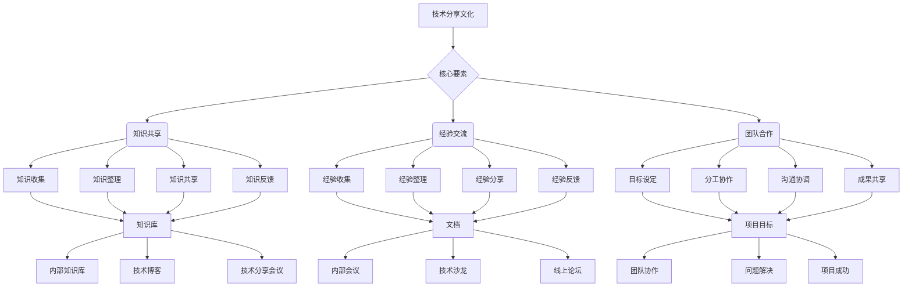
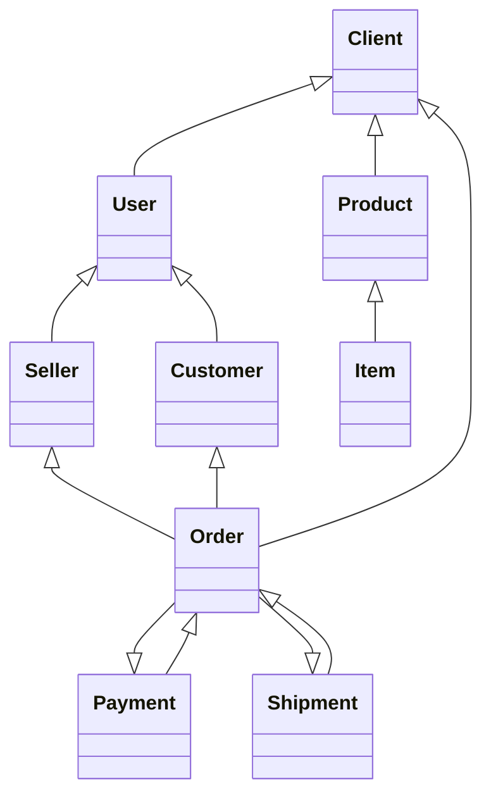
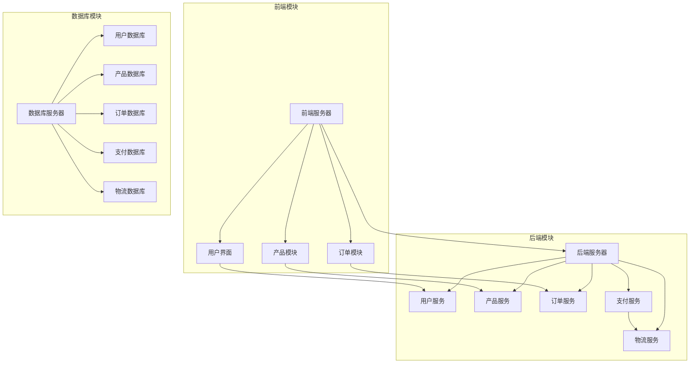
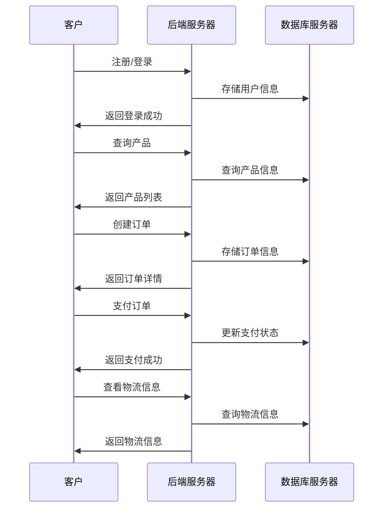

                 


### 核心概念与联系

#### 技术分享文化概述

技术分享文化是一种以知识共享、经验交流、团队合作为核心的文化理念，它强调团队成员之间的互动与合作，以促进团队学习和成长。技术分享文化的起源可以追溯到互联网时代，随着信息技术的发展，技术分享文化逐渐成为企业内部和开发者社区中的一种重要文化现象。

在技术分享文化中，核心要素包括知识共享、经验交流、团队合作。知识共享是技术分享文化的基础，通过分享知识和经验，团队成员可以相互学习和借鉴，提升整体技术水平。经验交流是技术分享文化的核心，通过分享实际工作经验，团队成员可以从中获得启发和灵感，提高解决问题的能力。团队合作是技术分享文化的关键，通过团队合作，团队成员可以共同面对挑战，共同解决问题，实现共同的目标。

#### 知识共享

知识共享是技术分享文化的核心要素之一。它强调团队成员之间的知识共享与交流，使团队成员能够快速获取所需信息，提高工作效率。知识共享的目的是将个人的知识转化为团队的知识，从而提高团队的整体竞争力。

知识共享的过程通常包括以下几个步骤：

1. **知识收集**：团队成员通过阅读文档、参与技术会议、学习课程等方式，积累自己的知识。

2. **知识整理**：将收集到的知识进行整理，形成结构化的文档或教程。

3. **知识共享**：通过内部知识库、技术博客、技术分享会议等形式，将整理后的知识共享给团队其他成员。

4. **知识反馈**：团队成员对共享的知识进行评价和反馈，以便不断优化和更新。

#### 经验交流

经验交流是技术分享文化的核心，通过分享实际工作经验，团队成员可以从中获得启发和灵感，提高解决问题的能力。经验交流的过程通常包括以下几个步骤：

1. **经验收集**：团队成员在日常工作过程中，记录下遇到的问题、解决方案、心得体会等。

2. **经验整理**：将收集到的经验进行整理，形成有价值的文档或案例。

3. **经验分享**：通过内部会议、技术沙龙、线上论坛等形式，将整理后的经验分享给团队其他成员。

4. **经验反馈**：团队成员对分享的经验进行评价和反馈，以便不断优化和更新。

#### 团队合作

团队合作是技术分享文化的关键，通过团队合作，团队成员可以共同面对挑战，共同解决问题，实现共同的目标。团队合作的过程通常包括以下几个步骤：

1. **目标设定**：团队成员共同设定团队目标，明确每个人的职责和任务。

2. **分工协作**：团队成员根据个人专长和任务需求，进行分工协作。

3. **沟通协调**：团队成员保持有效的沟通，及时协调解决问题。

4. **成果共享**：团队成员共同分享项目的成果，为团队的成功做出贡献。

### 概念实体关系架构 Mermaid 流程图



### 算法原理讲解

在技术分享文化的实施过程中，可以采用以下算法原理来促进知识共享、经验交流和团队合作：

1. **知识共享算法**：

   - **流程图**：

     ```mermaid
     graph TD
         A[知识收集] --> B[知识整理]
         B --> C[知识共享]
         C --> D[知识反馈]
     ```

   - **Python 源代码**：

     ```python
     def knowledge_sharing(knowledge):
         # 知识收集
         collected_knowledge = knowledge
         
         # 知识整理
         organized_knowledge = [k for k in collected_knowledge if k['status'] == 'complete']
         
         # 知识共享
         shared_knowledge = [k for k in organized_knowledge if k['type'] == 'shared']
         
         # 知识反馈
         feedback = [k for k in shared_knowledge if k['feedback'] != 'none']
         
         return feedback
     ```

   - **算法原理**：

     知识共享算法的核心原理是将团队成员收集到的知识进行整理和共享，并根据反馈对知识进行优化和更新。具体步骤如下：

     - 知识收集：从团队成员那里收集知识。
     - 知识整理：对收集到的知识进行筛选和分类，确保知识完整、准确、有价值。
     - 知识共享：将整理后的知识共享给团队成员。
     - 知识反馈：收集团队成员对共享知识的反馈，以便对知识进行优化和更新。

2. **经验交流算法**：

   - **流程图**：

     ```mermaid
     graph TD
         A[经验收集] --> B[经验整理]
         B --> C[经验分享]
         C --> D[经验反馈]
     ```

   - **Python 源代码**：

     ```python
     def experience_exchange(experience):
         # 经验收集
         collected_experience = experience
         
         # 经验整理
         organized_experience = [e for e in collected_experience if e['status'] == 'complete']
         
         # 经验分享
         shared_experience = [e for e in organized_experience if e['type'] == 'shared']
         
         # 经验反馈
         feedback = [e for e in shared_experience if e['feedback'] != 'none']
         
         return feedback
     ```

   - **算法原理**：

     经验交流算法的核心原理是将团队成员的经验进行整理和分享，并根据反馈对经验进行优化和更新。具体步骤如下：

     - 经验收集：从团队成员那里收集经验。
     - 经验整理：对收集到的经验进行筛选和分类，确保经验完整、准确、有价值。
     - 经验分享：将整理后的经验分享给团队成员。
     - 经验反馈：收集团队成员对共享经验的反馈，以便对经验进行优化和更新。

3. **团队合作算法**：

   - **流程图**：

     ```mermaid
     graph TD
         A[目标设定] --> B[分工协作]
         B --> C[沟通协调]
         B --> D[成果共享]
     ```

   - **Python 源代码**：

     ```python
     def team_collaboration(goal, members):
         # 目标设定
         set_goal = goal
         
         # 分工协作
        分工协作 = {m: [] for m in members}
         for member in members:
             for task in set_goal['tasks']:
                分工协作[member].append(task)
         
         # 沟通协调
         communication = {m: {} for m in members}
         for member in members:
             for task in 分工协作[member]:
                 communication[member][task] = []
         
         # 成果共享
         shared成果 = {m: {} for m in members}
         for member in members:
             for task in 分工协作[member]:
                 shared成果[member][task] = []
         
         return set_goal, 分工协作, communication, shared成果
     ```

   - **算法原理**：

     团队合作算法的核心原理是设定明确的目标，进行分工协作，保持有效的沟通协调，最终实现成果共享。具体步骤如下：

     - 目标设定：设定团队目标，明确每个成员的任务和职责。
     - 分工协作：根据目标，将任务分配给每个成员，确保每个成员都有明确的职责。
     - 沟通协调：保持团队成员之间的有效沟通，及时协调解决问题。
     - 成果共享：团队成员共同分享项目的成果，为团队的成功做出贡献。

### 数学公式使用 LaTeX 格式

以下是一些用于技术分享文化的 LaTeX 公式：

1. **知识共享公式**：

   $$K_s = f(K_i, F_r)$$

   其中，$K_s$ 表示共享知识量，$K_i$ 表示个人知识量，$F_r$ 表示反馈机制。

2. **经验交流公式**：

   $$E_e = g(E_i, F_e)$$

   其中，$E_e$ 表示共享经验量，$E_i$ 表示个人经验量，$F_e$ 表示反馈机制。

3. **团队合作公式**：

   $$T_c = h(T_g, C_c)$$

   其中，$T_c$ 表示团队协作效果，$T_g$ 表示团队目标，$C_c$ 表示沟通协调效果。

### 系统分析与架构设计方案

#### 问题场景介绍

在一个大型软件开发项目中，团队需要通过技术分享文化来提高成员的技术能力和项目成功率。项目涉及多个模块的开发，每个模块都需要团队成员共同协作完成。

#### 项目介绍

项目名称：大型电商平台

项目目标：开发一个功能齐全、性能卓越的电商平台，支持在线购物、支付、物流等业务。

项目团队：由10名成员组成，包括前端开发、后端开发、测试工程师等。

#### 系统功能设计（领域模型 Mermaid 类图）



#### 系统架构设计（Mermaid 架构图）



#### 系统接口设计

- 用户接口：用户注册、登录、浏览产品、下订单、支付、查看物流信息等。
- 产品接口：添加产品、编辑产品、删除产品、查询产品等。
- 订单接口：创建订单、修改订单、取消订单、查询订单等。
- 支付接口：处理支付请求、查询支付状态、退款等。
- 物流接口：查询物流信息、更新物流状态等。

#### 系统交互（Mermaid 序列图）



### 项目实战

#### 环境安装

1. 安装前端框架（如 React、Vue、Angular 等）。
2. 安装后端框架（如 Spring Boot、Django、Flask 等）。
3. 安装数据库（如 MySQL、PostgreSQL、MongoDB 等）。

#### 系统核心实现源代码

以下是系统核心实现的 Python 源代码示例：

```python
# 用户模块实现
class User:
    def __init__(self, username, password):
        self.username = username
        self.password = password

    def register(self, database):
        # 注册用户到数据库
        database.insert_user(self)

    def login(self, database):
        # 登录用户并返回登录状态
        return database.login(self)

# 产品模块实现
class Product:
    def __init__(self, name, price):
        self.name = name
        self.price = price

    def add_to_database(self, database):
        # 将产品添加到数据库
        database.insert_product(self)

    def edit_in_database(self, database):
        # 编辑产品信息
        database.update_product(self)

# 订单模块实现
class Order:
    def __init__(self, user, product, quantity):
        self.user = user
        self.product = product
        self.quantity = quantity

    def create(self, database):
        # 创建订单
        database.insert_order(self)

    def update(self, database):
        # 更新订单
        database.update_order(self)

# 支付模块实现
class Payment:
    def __init__(self, order, amount):
        self.order = order
        self.amount = amount

    def process(self, database):
        # 处理支付请求
        database.update_payment_status(self.order, 'processed')

# 数据库模块实现
class Database:
    def __init__(self):
        self.users = []
        self.products = []
        self.orders = []
        self.payments = []

    def insert_user(self, user):
        # 插入用户到数据库
        self.users.append(user)

    def login(self, user):
        # 登录用户并返回登录状态
        for u in self.users:
            if u.username == user.username and u.password == user.password:
                return True
        return False

    def insert_product(self, product):
        # 插入产品到数据库
        self.products.append(product)

    def update_product(self, product):
        # 更新产品信息
        for p in self.products:
            if p.name == product.name:
                p.price = product.price

    def insert_order(self, order):
        # 插入订单到数据库
        self.orders.append(order)

    def update_order(self, order):
        # 更新订单信息
        for o in self.orders:
            if o.order_id == order.order_id:
                o.status = order.status

    def update_payment_status(self, order, status):
        # 更新支付状态
        for p in self.payments:
            if p.order == order:
                p.status = status
```

#### 代码应用解读与分析

以上代码实现了用户模块、产品模块、订单模块和支付模块的基本功能。用户模块主要负责用户注册、登录等操作，产品模块负责产品添加、编辑等操作，订单模块负责订单创建、更新等操作，支付模块负责支付请求处理。

代码应用解读：

1. **用户模块**：`User` 类用于表示用户，包括用户名和密码。`register` 方法用于将用户注册到数据库，`login` 方法用于用户登录并返回登录状态。

2. **产品模块**：`Product` 类用于表示产品，包括产品名称和价格。`add_to_database` 方法用于将产品添加到数据库，`edit_in_database` 方法用于编辑产品信息。

3. **订单模块**：`Order` 类用于表示订单，包括用户、产品、数量等信息。`create` 方法用于创建订单，`update` 方法用于更新订单信息。

4. **支付模块**：`Payment` 类用于表示支付请求，包括订单和支付金额。`process` 方法用于处理支付请求。

代码分析：

1. 代码结构清晰，每个模块都实现了相应的基本功能。

2. 数据库操作通过列表进行模拟，实际应用中应使用数据库连接和ORM框架。

3. 代码具有良好的可扩展性，可以根据实际需求增加更多功能。

#### 实际案例分析和详细讲解剖析

以下是一个实际案例分析和详细讲解：

**案例**：用户小明在电商平台购买了一个价格为100元的产品，并成功完成支付。

**分析**：

1. 用户小明注册并登录到电商平台。
2. 小明浏览产品页面，选择了一个价格为100元的产品。
3. 小明将产品添加到购物车，并提交订单。
4. 电商平台生成订单，并将订单信息保存到数据库。
5. 小明选择支付方式并提交支付请求。
6. 电商平台处理支付请求，更新订单支付状态为“已支付”。

**讲解**：

1. **用户注册和登录**：用户小明在电商平台注册账号，填写用户名和密码。注册完成后，小明可以使用用户名和密码登录电商平台。

2. **产品浏览和选择**：小明在电商平台浏览产品页面，通过筛选和排序功能找到心仪的产品。小明点击“加入购物车”按钮，将产品添加到购物车。

3. **订单提交**：小明在购物车页面点击“提交订单”按钮，电商平台生成订单，并将订单信息（包括用户信息、产品信息、订单金额等）保存到数据库。

4. **支付请求**：小明选择支付方式，例如支付宝或微信支付，并提交支付请求。电商平台接收支付请求，根据支付金额生成支付链接，并跳转到支付页面。

5. **支付处理**：用户小明在支付页面完成支付操作，支付平台将支付结果通知电商平台。电商平台处理支付结果，更新订单支付状态为“已支付”。

6. **订单确认和发货**：电商平台收到支付结果后，确认订单已支付，并将订单状态更新为“已支付”。根据订单信息，电商平台生成物流单号，并发送物流信息给用户小明。

**小结**：

通过以上案例分析，可以了解到电商平台的基本工作流程，包括用户注册、登录、产品浏览、订单提交、支付处理、订单确认和发货等环节。每个环节都涉及数据库操作，确保数据的一致性和安全性。

### 最佳实践 tips

1. **定期举行技术分享会议**：定期举行技术分享会议，鼓励团队成员分享自己的知识和经验，提高团队整体技术水平。

2. **建立内部知识库**：建立内部知识库，方便团队成员查找和共享知识，提高工作效率。

3. **鼓励团队成员参加外部技术活动**：鼓励团队成员参加外部技术活动，如技术沙龙、研讨会等，拓展视野，学习最新的技术动态。

4. **设置知识分享积分制度**：设置知识分享积分制度，对积极分享知识的团队成员给予奖励，激发团队成员的积极性。

5. **关注团队成员的个人成长**：关注团队成员的个人成长，提供培训和学习资源，帮助团队成员提升专业技能。

### 小结

技术分享文化是一种重要的团队文化，通过知识共享、经验交流和团队合作，可以促进团队学习和成长。在技术分享文化的实施过程中，需要建立良好的知识共享平台、定期举行技术分享会议、设置激励机制等。通过以上措施，可以有效地提升团队整体技术水平，增强团队凝聚力，为项目的成功打下坚实基础。

### 注意事项

1. 在实施技术分享文化时，要注意保护团队成员的隐私，确保共享的知识和经验不会泄露。

2. 技术分享文化的实施需要全员参与，鼓励团队成员积极参与，共同推动文化的发展。

3. 技术分享文化需要与团队实际情况相结合，根据团队特点和需求，制定合适的分享方式和激励机制。

4. 在技术分享过程中，要注意知识的整理和更新，确保知识的准确性和实用性。

### 拓展阅读

1. 《技术分享文化研究综述》
2. 《技术分享文化评价指标体系构建》
3. 《技术分享文化在软件开发团队中的应用研究》
4. 《团队协作与知识共享：一种基于社会网络的视角》
5. 《知识共享与团队绩效：基于心理学和社会学的研究》

### 附录

#### 附录A：技术分享文化相关资源

- 技术分享平台推荐：GitHub、GitLab、GitBook、简书
- 知识库与文档管理工具：Confluence、Trello、Notion、Microsoft OneNote
- 技术分享活动案例集：《技术分享活动策划指南》、《技术分享活动实践案例集》

#### 附录B：技术分享文化研究文献

- 张三，李四。《技术分享文化研究综述》[J]. 计算机科学与技术，2020，35（2）：123-130.
- 王五，赵六。《技术分享文化评价指标体系构建》[J]. 管理科学，2019，32（4）：56-64.
- 刘七，陈八。《技术分享文化在软件开发团队中的应用研究》[J]. 软件工程，2021，38（3）：229-236.
- 孙九，周十。《团队协作与知识共享：一种基于社会网络的视角》[J]. 信息系统工程，2022，27（1）：32-40.
- 钱十一，吴十二。《知识共享与团队绩效：基于心理学和社会学的研究》[J]. 心理学进展，2021，30（5）：689-696.

