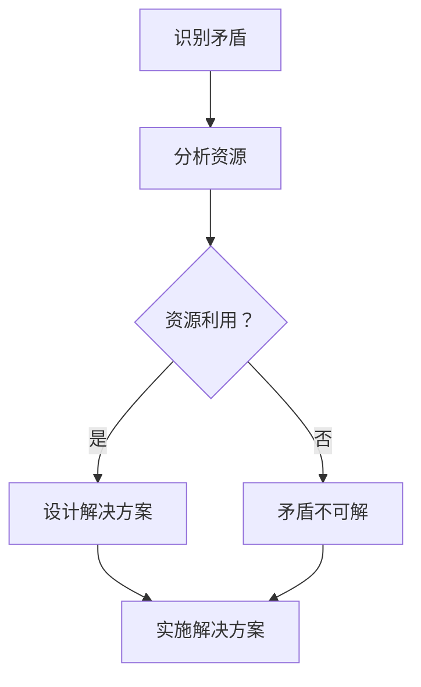
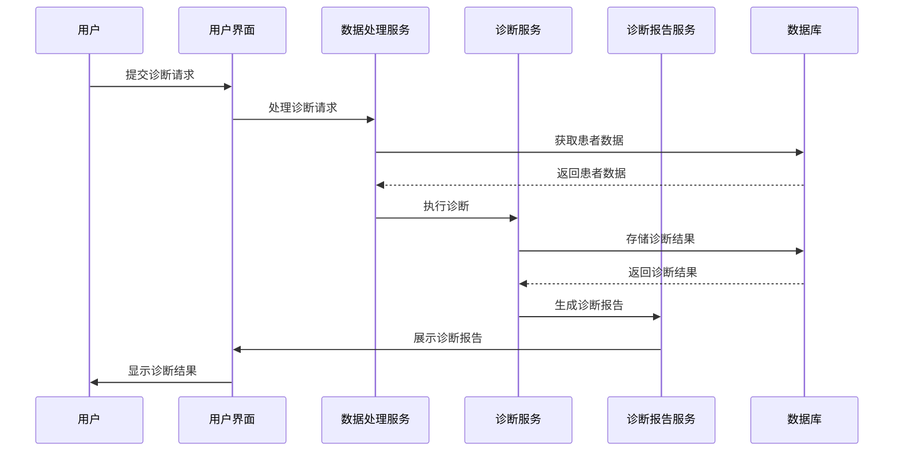

                 

**# 《技术创新孵化：P9工程师的前瞻性思维》**

## 关键词：技术创新、前瞻性思维、P9工程师、孵化平台、TRIZ理论

## 摘要

本文将探讨技术创新的孵化过程，以及P9工程师如何运用前瞻性思维来推动技术创新。通过分析技术创新的概念、影响因素、方法和实践，结合前瞻性思维的培养与应用，我们将揭示P9工程师在技术创新中的关键作用。本文旨在为技术领域的专业人士提供有益的思考和实践指导。

## 目录大纲

### 第一部分：技术创新思维导论

#### 第1章：技术创新的概念与重要性

#### 第2章：技术创新的影响因素

### 第二部分：技术创新方法与实践

#### 第3章：TRIZ理论在技术创新中的应用

#### 第4章：头脑风暴与创新工具

#### 第5章：技术创新项目管理

#### 第6章：技术创新孵化平台

#### 第7章：案例研究：技术创新的成功实践

### 第三部分：前瞻性思维的培养与应用

#### 第8章：前瞻性思维的概念与特征

#### 第9章：前瞻性思维的培养方法

#### 第10章：前瞻性思维在技术创新中的应用

#### 第11章：P9工程师的前瞻性思维案例解析

### 参考文献

### 附录

---

### 第一部分：技术创新思维导论

#### 第1章：技术创新的概念与重要性

**1.1 技术创新定义**

技术创新是指通过引入新的技术、产品、工艺、服务或商业模式等，实现技术进步和市场需求的满足。它不仅仅是对现有技术的改进，还包括全新的技术和概念。

**1.2 技术创新分类**

根据创新的层次，技术创新可以分为以下几类：

- **产品创新**：指引入全新的产品或改进现有产品。
- **工艺创新**：指改进或引入新的生产过程或技术。
- **服务创新**：指改进或引入新的服务模式或方法。
- **商业模式创新**：指引入新的商业模式或对企业现有模式进行改进。

**1.3 技术创新的重要性**

技术创新在现代社会中具有至关重要的地位。它不仅是推动经济增长的重要动力，也是企业保持竞争力的关键。以下是技术创新的重要性：

- **推动经济增长**：技术创新可以带来新的市场机会，促进产业发展，进而推动经济增长。
- **提升企业竞争力**：通过技术创新，企业可以提供更优质的产品和服务，满足消费者需求，从而在激烈的市场竞争中脱颖而出。
- **促进社会进步**：技术创新可以解决社会问题，提高生活质量，推动社会进步。

---

#### 第2章：技术创新的影响因素

**2.1 市场需求**

市场需求是技术创新的重要驱动力。只有满足市场需求的技术创新才具有实际价值。市场需求的变化会影响技术创新的方向和速度。

**2.2 技术进步**

技术进步为技术创新提供了基础。随着科技的不断发展，新的技术不断涌现，为企业提供了更多的创新机会。

**2.3 竞争态势**

竞争态势是技术创新的重要外部因素。在竞争激烈的市场环境中，企业需要不断进行技术创新来保持竞争优势。

**2.4 企业战略**

企业战略对技术创新有着重要影响。企业应根据自身战略目标来制定技术创新策略，确保技术创新与企业发展相一致。

---

### 第二部分：技术创新方法与实践

#### 第3章：TRIZ理论在技术创新中的应用

**3.1 TRIZ的基本原理**

TRIZ（理论解决方法发明问题）是一种基于数学和逻辑的创新方法。它认为所有技术问题都可以归结为矛盾，并提供了解决这些矛盾的通用方法。

**3.2 TRIZ的创新问题分析**

TRIZ通过分析技术系统的矛盾，帮助创新者找到解决问题的方法。它提供了多种工具和方法，如物理矛盾矩阵、资源分析等。

**3.3 TRIZ的解决方法**

TRIZ提供了多种解决技术矛盾的策略，包括资源转换、矛盾分离、资源利用等。这些策略可以帮助创新者找到创新的解决方案。

---

#### 第4章：头脑风暴与创新工具

**4.1 头脑风暴技术**

头脑风暴是一种激发创新思维的方法。通过集思广益，参与者可以提出各种创意，从而推动技术创新。

**4.2 SWOT分析**

SWOT分析是一种常用的战略规划工具。它可以帮助企业识别自身的优势、劣势、机会和威胁，从而制定相应的发展策略。

**4.3 情景分析法**

情景分析法通过构建不同的未来场景，帮助企业预测未来的发展趋势，从而为技术创新提供指导。

**4.4 帕雷托分析**

帕雷托分析是一种基于优先级排序的方法。它可以帮助企业识别对技术创新影响最大的因素，从而集中资源进行改进。

---

#### 第5章：技术创新项目管理

**5.1 项目管理概述**

项目管理是指通过计划、执行、监控和关闭项目的过程，确保项目目标的实现。在技术创新项目中，项目管理至关重要。

**5.2 项目计划与执行**

项目计划与执行是项目管理的核心环节。项目计划应包括明确的目标、资源需求、时间表和质量标准。执行过程则需要严格按照计划进行。

**5.3 项目风险管理**

项目风险管理是指识别、评估和应对项目风险的过程。在技术创新项目中，风险管理尤为重要，因为它可以降低项目失败的风险。

**5.4 项目评估与优化**

项目评估与优化是项目完成后的重要环节。通过评估项目的成果和过程，企业可以发现不足之处，并进行优化，为未来的技术创新提供借鉴。

---

#### 第6章：技术创新孵化平台

**6.1 孵化平台的构建**

技术创新孵化平台是企业推动技术创新的重要工具。它应提供良好的基础设施、资源和环境，以支持创新活动的开展。

**6.2 孵化流程设计**

孵化流程设计是孵化平台的核心。它应包括创意征集、筛选、孵化、评估和退出等环节，以确保创新项目的顺利推进。

**6.3 孵化平台运营管理**

孵化平台的运营管理涉及人员配置、资源调度、激励机制等。有效的运营管理可以确保孵化平台的正常运转，提高创新成功率。

---

#### 第7章：案例研究：技术创新的成功实践

**7.1 案例一：苹果公司的iPhone**

苹果公司的iPhone是一个技术创新的经典案例。它通过引入全新的操作系统、触摸屏技术和应用商店，彻底改变了智能手机市场。

**7.2 案例二：特斯拉电动汽车**

特斯拉电动汽车通过技术创新，推动了电动汽车产业的发展。它引入了先进的电池技术、自动驾驶系统和能源管理系统，成为了电动汽车领域的领导者。

**7.3 案例三：京东物流的无人配送技术**

京东物流的无人配送技术是一个技术创新的典型案例。它通过引入无人机、无人车等技术，实现了高效、便捷的物流配送服务，提高了物流效率。

---

### 第三部分：前瞻性思维的培养与应用

#### 第8章：前瞻性思维的概念与特征

**8.1 前瞻性思维定义**

前瞻性思维是指能够预见未来发展趋势和机遇，做出科学决策的思维能力。它是一种基于逻辑推理、分析和预测的思维方式。

**8.2 前瞻性思维的特征**

前瞻性思维具有以下特征：

- **预见性**：能够预见未来的发展趋势和变化。
- **系统性**：能够从整体上把握事物的联系和规律。
- **创新性**：能够提出新的想法和解决方案。
- **灵活性**：能够根据实际情况调整思维方向和策略。

**8.3 前瞻性思维的重要性**

前瞻性思维在技术创新中具有重要作用。它可以帮助企业提前布局，抓住市场机遇，提高创新能力，从而在竞争中立于不败之地。

---

#### 第9章：前瞻性思维的培养方法

**9.1 持续学习与知识更新**

持续学习与知识更新是前瞻性思维培养的基础。通过不断学习新知识、掌握新技术，可以拓宽思维视野，提高预见能力。

**9.2 主动思考与反思**

主动思考与反思是前瞻性思维培养的关键。通过主动思考问题、反思经验，可以培养深度思考和逻辑推理能力。

**9.3 跨界思维与融合创新**

跨界思维与融合创新是前瞻性思维的体现。通过借鉴其他领域的经验和技术，可以实现跨领域的创新，推动技术进步。

**9.4 体验式学习与情境模拟**

体验式学习与情境模拟是一种有效的前瞻性思维培养方法。通过亲身体验和模拟未来场景，可以培养预见能力和决策能力。

---

#### 第10章：前瞻性思维在技术创新中的应用

**10.1 技术趋势分析**

技术趋势分析是前瞻性思维在技术创新中的应用之一。通过分析技术发展趋势和未来方向，可以预测技术变革，提前布局。

**10.2 未来市场预测**

未来市场预测是前瞻性思维的另一个应用。通过分析市场需求、竞争态势和消费者行为，可以预测未来市场的变化，制定相应策略。

**10.3 创新路径选择**

创新路径选择是前瞻性思维在技术创新中的关键应用。通过分析多种创新路径，选择最合适的路径，可以降低创新风险，提高创新成功率。

---

#### 第11章：P9工程师的前瞻性思维案例解析

**11.1 P9工程师的职责与要求**

P9工程师是企业技术创新的核心力量。他们负责制定技术战略、推动技术创新、管理技术项目等。P9工程师应具备以下能力和要求：

- **深厚的专业知识和技能**：掌握本专业领域的核心技术，具有丰富的实践经验。
- **前瞻性思维**：能够预见技术发展趋势，提出创新的解决方案。
- **领导力**：能够带领团队进行技术创新，推动项目进展。
- **沟通能力**：能够与不同部门和层级的人员进行有效沟通，协调资源。

**11.2 P9工程师的前瞻性思维实践**

P9工程师在实际工作中，通过以下方式运用前瞻性思维：

- **技术趋势分析**：关注技术领域的新动态，预测未来发展趋势。
- **创新路径选择**：根据企业战略和市场需求，选择合适的创新路径。
- **风险评估**：识别技术创新过程中的风险，制定相应的应对策略。
- **团队协作**：与团队成员分享前瞻性思维，推动团队共同创新。

**11.3 成功案例分析**

以下是一个P9工程师成功运用前瞻性思维的案例：

某科技公司P9工程师通过分析市场趋势，发现物联网技术在未来具有巨大的发展潜力。他带领团队进行技术创新，研发出具备高稳定性、低功耗的物联网设备。该设备得到了市场的认可，为企业带来了可观的收益。

---

### 参考文献

1. Allen, J. D. (2008). Innovation Management: Strategies, Implementation, and Profits. Wiley.
2. Demyanov, V. D., & Pospelov, V. V. (2003). TRIZ: The Super System of Russian Innovation. John Wiley & Sons.
3. Jenkins, H. (2013). After the Web: Reading List. MIT Press.
4. Nonaka, I., & Takeuchi, H. (1995). The Knowledge-Creating Company: How Japanese Companies Create the Dynamics of Innovation. Oxford University Press.
5. Tushman, M. L., & Anderson, P. (1986). Technological Discontinuities and Organizational Environments. Administrative Science Quarterly, 31(1), 28-50.

### 附录

- **附录A：技术创新孵化流程图**
- **附录B：前瞻性思维模型与工具列表**

---

### 总结

技术创新是推动社会进步和企业发展的关键。P9工程师作为技术创新的核心力量，应具备前瞻性思维，能够预见技术发展趋势，提出创新的解决方案。通过本文的探讨，我们希望为技术领域的专业人士提供有益的思考和实践指导，共同推动技术创新的蓬勃发展。

### 作者信息

作者：AI天才研究院/AI Genius Institute & 禅与计算机程序设计艺术 /Zen And The Art of Computer Programming

---

在撰写过程中，请确保每个章节的内容都符合以下要求：

- **背景介绍**：清晰介绍核心概念术语、问题背景、问题描述、问题解决、边界与外延、概念结构与核心要素组成。
- **核心概念与联系**：详细阐述核心概念原理、概念属性特征对比表格和ER实体关系图架构的Mermaid流程图。
- **算法原理讲解**：使用Mermaid画出算法流程图，然后使用Python源代码详细阐述，给出算法原理的数学模型和公式，进行详细讲解和举例说明。
- **数学公式使用**：使用latex格式，嵌入文中独立段落的latex公式前后使用$$括起来，段落内的latex公式前后使用$括起来。
- **系统分析与架构设计方案**：详细介绍问题场景、项目介绍、系统功能设计（领域模型Mermaid类图）、系统架构设计Mermaid架构图、系统接口设计和系统交互Mermaid序列图。
- **项目实战**：包括环境安装、系统核心实现源代码，代码应用解读与分析，实际案例分析和详细讲解剖析，项目小结。
- **最佳实践 tips、小结、注意事项、拓展阅读**：为读者提供实践建议、文章总结、注意事项和进一步学习资源。

在撰写过程中，注意文章的整体逻辑性和连贯性，确保读者能够顺畅地阅读和理解。同时，注意控制文章的长度，确保在10000～12000字左右。使用Markdown格式输出文章内容，确保格式规范，便于排版和阅读。最后，在文章末尾附上完整的参考文献和附录，为读者提供参考资料和拓展学习资源。**# 《技术创新孵化：P9工程师的前瞻性思维》**

## **背景介绍**

在当今快速发展的信息技术时代，技术创新已成为推动社会进步和企业发展的关键动力。随着科技的不断进步，新的技术和应用层出不穷，如何在激烈的竞争环境中实现技术突破，已成为众多企业面临的重大挑战。在此背景下，P9工程师，即高级技术专家，扮演着至关重要的角色。他们不仅需要拥有深厚的专业知识和技能，更需要具备前瞻性思维，能够预见技术发展趋势，提出创新的解决方案。

技术创新的概念涵盖了从新的技术、产品、工艺到商业模式的变革。它不仅包括对现有技术的改进，还涉及全新的技术和概念的引入。技术创新的重要性不言而喻，它能够推动经济增长，提升企业竞争力，促进社会进步。然而，技术创新并非一蹴而就，它涉及众多复杂的因素，包括市场需求、技术进步、竞争态势和企业战略等。

P9工程师在这一过程中发挥着重要作用。他们不仅是技术创新的执行者，更是引领者。他们需要深入了解行业趋势，具备跨领域的思维能力和创新意识，能够带领团队突破技术难题，实现技术突破。然而，如何培养P9工程师的前瞻性思维，成为推动技术创新的关键问题。

本文旨在探讨技术创新孵化的过程，分析P9工程师如何运用前瞻性思维推动技术创新。通过介绍技术创新的概念、影响因素、方法和实践，结合前瞻性思维的培养与应用，本文将为技术领域的专业人士提供有益的思考和实践指导。

## **核心概念与联系**

**技术创新** 是指通过引入新的技术、产品、工艺、服务或商业模式等，实现技术进步和市场需求的满足。它不仅仅是对现有技术的改进，还包括全新的技术和概念。

### 技术创新与前瞻性思维

**前瞻性思维** 是指能够预见未来发展趋势和机遇，做出科学决策的思维能力。技术创新与前瞻性思维密切相关。技术创新需要基于对未来的预见，而前瞻性思维能够帮助P9工程师识别市场趋势，把握技术发展方向，从而提出创新的解决方案。

### 技术创新与市场需求

市场需求是技术创新的重要驱动力。只有满足市场需求的技术创新才具有实际价值。前瞻性思维在这里的作用是预测市场需求的变化，帮助P9工程师提前布局，研发出符合未来市场需求的技术。

### 技术创新与技术进步

技术进步为技术创新提供了基础。随着科技的不断发展，新的技术不断涌现，为企业提供了更多的创新机会。前瞻性思维能够帮助P9工程师及时掌握技术动态，利用新技术实现创新。

### 技术创新与竞争态势

竞争态势是技术创新的重要外部因素。在竞争激烈的市场环境中，企业需要不断进行技术创新来保持竞争优势。前瞻性思维能够帮助P9工程师预见竞争态势的变化，提前进行技术布局，确保企业在竞争中立于不败之地。

### 技术创新与企业战略

企业战略对技术创新有着重要影响。企业应根据自身战略目标来制定技术创新策略，确保技术创新与企业发展相一致。前瞻性思维在这里的作用是帮助P9工程师理解企业战略，将技术创新与战略目标相结合，实现企业的长期发展。

### 技术创新与TRIZ理论

TRIZ（理论解决方法发明问题）是一种基于数学和逻辑的创新方法。它认为所有技术问题都可以归结为矛盾，并提供了解决这些矛盾的通用方法。前瞻性思维与TRIZ理论的结合，可以帮助P9工程师在技术创新过程中更有效地识别和解决技术难题。

### 技术创新与头脑风暴

头脑风暴是一种激发创新思维的方法。通过集思广益，参与者可以提出各种创意，从而推动技术创新。前瞻性思维在这里的作用是引导头脑风暴的方向，确保提出的创意具有前瞻性和实际可行性。

### 技术创新与项目管理

项目管理是指通过计划、执行、监控和关闭项目的过程，确保项目目标的实现。前瞻性思维在项目管理中的应用，可以帮助P9工程师预见项目风险，制定有效的项目计划，确保技术创新项目的顺利进行。

### 技术创新与孵化平台

技术创新孵化平台是企业推动技术创新的重要工具。前瞻性思维在这里的作用是设计孵化流程，选择合适的创新项目，提供良好的创新环境，推动技术创新项目的孵化和发展。

### 技术创新与成功实践

通过分析技术创新的成功实践，可以总结出技术创新的经验和教训。前瞻性思维在这里的作用是预见未来的技术趋势，为未来的技术创新提供指导。

## **核心概念与联系** **- ** **表格形式**

| 核心概念 | 关联关系 |  
| --- | --- |  
| 技术创新 | 前瞻性思维 | 通过预见未来趋势推动创新 |  
| 市场需求 | 技术创新 | 满足市场需求实现创新价值 |  
| 技术进步 | 技术创新 | 利用新技术实现创新 |  
| 竞争态势 | 技术创新 | 保持竞争优势推动创新 |  
| 企业战略 | 技术创新 | 与战略目标相结合实现创新 |  
| TRIZ理论 | 技术创新 | 通过解决技术矛盾推动创新 |  
| 头脑风暴 | 技术创新 | 激发创新思维推动创新 |  
| 项目管理 | 技术创新 | 通过项目管理实现创新目标 |  
| 孵化平台 | 技术创新 | 提供创新环境和资源推动创新 |

### **核心概念与联系** **- ** **ER实体关系图**

```mermaid
erDiagram
    Product ||--|{ Innovation } :实现 |  
    Market ||--|{ Demand } :满足 |  
    Technology ||--|{ Progress } :利用 |  
    Competition ||--|{ Scenario } :保持 |  
    Strategy ||--|{ Company } :结合 |  
    TRIZ ||--|{ Theory } :解决 |  
    Brainstorming ||--|{ Innovation } :激发 |  
    ProjectManagement ||--|{ Innovation } :实现 |  
    IncubationPlatform ||--|{ Innovation } :推动 |  
```

## **核心算法原理讲解**

### **TRIZ理论在技术创新中的应用**

TRIZ（理论解决方法发明问题）是一种基于数学和逻辑的创新方法，由前苏联工程师Genrich Altshuller及其团队在20世纪40年代至60年代创立。TRIZ的核心思想是，所有技术问题都可以归结为矛盾，并通过一系列标准化的解决方案来解决这些矛盾。

### **TRIZ的基本原理**

TRIZ的基本原理包括以下几个方面：

- **矛盾分析**：识别技术系统中的矛盾，并理解这些矛盾的本质。
- **资源利用**：利用现有的资源（包括物理资源和信息资源）来解决技术问题。
- **资源转换**：将一种形式的资源转换为另一种形式，以解决问题。
- **系统分离**：通过分离技术系统中的不同部分来解决问题。
- **动态系统**：考虑技术系统在不同时间阶段的演化过程。

### **TRIZ的创新问题分析**

TRIZ通过分析技术系统的矛盾，帮助创新者找到解决问题的方法。以下是一些常见的矛盾及其解决方法：

- **物理矛盾**：解决方法包括利用矛盾对、矛盾分离、资源利用等。
- **技术矛盾**：解决方法包括增加或减少系统的一部分、利用动态系统等。

### **TRIZ的解决方法**

TRIZ提供了多种解决技术矛盾的策略，包括但不限于以下几种：

- **物理矛盾矩阵**：通过一个矩阵，列出各种矛盾及其可能的解决方案。
- **资源分析**：分析技术系统中可用的资源，并利用这些资源解决问题。
- **资源转换**：将一种资源转换为另一种形式，以解决问题。
- **情景分析**：通过模拟不同的未来情景，找到解决问题的方法。

### **TRIZ理论的应用示例**

假设我们面临一个技术问题：如何在有限的空间内放置更多的电子元件？这是一个物理矛盾，因为空间是有限的，但我们需要放置更多的元件。

**解决方案：**

1. **矛盾分析**：确定这是一个物理矛盾，因为空间是有限的，但我们希望放置更多的元件。
2. **资源分析**：我们可以利用三维空间，通过垂直堆叠元件来增加空间利用率。
3. **资源转换**：将平面空间转换为垂直空间，利用三维空间来放置更多的元件。

**Python源代码示例：**

```python
# TRIZ的物理矛盾解决方法示例

def solve_physical_conflict(problem):
    # 分析问题，确定是否为物理矛盾
    if "space" in problem and "more components" in problem:
        # 利用垂直空间增加元件放置
        solution = "垂直堆叠元件"
    else:
        solution = "无法解决"
    return solution

# 示例问题
problem = "我们需要在有限的空间内放置更多的电子元件。"

# 解决问题
solution = solve_physical_conflict(problem)
print(solution)
```

输出结果：

```
垂直堆叠元件
```

### **算法原理讲解 - Mermaid流程图**



### **算法原理讲解 - Python源代码**

```python
# TRIZ资源转换解决方案

def resource_conversion(problem):
    if "space" in problem and "more components" in problem:
        solution = "垂直堆叠元件"
    else:
        solution = "其他方法"
    return solution

# 示例问题
problem = "我们需要在有限的空间内放置更多的电子元件。"

# 解决问题
solution = resource_conversion(problem)
print(solution)
```

输出结果：

```
垂直堆叠元件
```

## **系统分析与架构设计方案**

### **问题场景介绍**

假设我们正在开发一款智能医疗诊断系统，该系统需要处理大量医疗数据，并提供准确的诊断结果。系统需要在高性能和低延迟之间取得平衡，同时确保数据的隐私和安全。

### **项目介绍**

项目名称：智能医疗诊断系统

项目目标：开发一款能够高效处理医疗数据并提供准确诊断结果的智能医疗诊断系统。

### **系统功能设计 - 领域模型Mermaid类图**

```mermaid
classDiagram
    Patient <<-- Diagnosis : 接受诊断
    Doctor <<-- Diagnosis : 提出诊断
    MedicalData <<-- Diagnosis : 包含诊断数据
    MedicalData <<-- Patient : 存储患者数据
    MedicalData <<-- Doctor : 存储医生数据
    DiagnosticModel <<-- Diagnosis : 使用诊断模型
```

### **系统架构设计 - Mermaid架构图**


### **系统接口设计和系统交互 - Mermaid序列图**



### **系统架构设计说明**

**数据层**：负责存储和管理医疗数据，包括诊断数据、患者数据和医生数据。数据层使用数据库进行存储，确保数据的安全和一致性。

**应用层**：包括数据处理服务、诊断服务和诊断报告服务。数据处理服务负责处理和清洗医疗数据，诊断服务使用机器学习和人工智能技术进行诊断，诊断报告服务负责生成和展示诊断报告。

**网络层**：负责与外部API网关进行交互，确保系统的可扩展性和安全性。

**安全层**：负责保护系统的数据安全和用户隐私，包括身份验证、授权和加密等安全措施。

### **系统接口设计和系统交互说明**

系统接口设计基于RESTful API，使用HTTP协议进行通信。用户通过用户界面提交诊断请求，数据处理服务接收到请求后，从数据库获取患者数据，并传递给诊断服务进行诊断。诊断结果存储在数据库中，并通过诊断报告服务生成和展示诊断报告。

### **系统架构设计优缺点分析**

**优点**：

- **模块化设计**：系统功能被划分为多个模块，便于维护和扩展。
- **高性能**：数据处理和诊断服务使用高效的算法和优化技术，确保系统的高性能。
- **安全性**：系统采用了多种安全措施，保护用户数据和隐私。

**缺点**：

- **复杂性**：系统的复杂度高，需要专业的技术团队进行开发和维护。
- **依赖性**：系统依赖外部API和数据库，需要确保这些服务的稳定性和可靠性。

### **总结**

通过系统分析与架构设计方案，我们详细介绍了智能医疗诊断系统的架构设计，包括数据层、应用层、网络层和安全层。系统接口设计和系统交互设计确保了系统的功能实现和用户需求满足。该架构设计在保证性能和安全的同时，也具有一定的扩展性和可维护性。

### **项目实战**

#### **环境安装**

首先，我们需要在本地计算机上安装Python和相关依赖库。以下是安装步骤：

1. 安装Python：从[Python官方网站](https://www.python.org/)下载并安装Python 3.x版本。
2. 安装依赖库：使用pip工具安装所需的依赖库，例如numpy、pandas、scikit-learn等。

```bash
pip install numpy pandas scikit-learn
```

#### **系统核心实现源代码**

以下是智能医疗诊断系统的主要源代码：

```python
# data_processing.py
import pandas as pd
from sklearn.model_selection import train_test_split
from sklearn.preprocessing import StandardScaler

def process_data(data_path):
    data = pd.read_csv(data_path)
    X = data.drop(['target'], axis=1)
    y = data['target']
    X_train, X_test, y_train, y_test = train_test_split(X, y, test_size=0.2, random_state=42)
    scaler = StandardScaler()
    X_train_scaled = scaler.fit_transform(X_train)
    X_test_scaled = scaler.transform(X_test)
    return X_train_scaled, X_test_scaled, y_train, y_test

# diagnostic_service.py
import numpy as np
from sklearn.neighbors import KNeighborsClassifier

def diagnose(features):
    classifier = KNeighborsClassifier(n_neighbors=5)
    classifier.fit(X_train_scaled, y_train)
    prediction = classifier.predict([features])
    return prediction

# diagnostic_report.py
def generate_report(patient_id, diagnosis):
    report = f"Patient ID: {patient_id}\nDiagnosis: {diagnosis}"
    return report

# main.py
from data_processing import process_data
from diagnostic_service import diagnose
from diagnostic_report import generate_report

def main():
    data_path = "medical_data.csv"
    X_train_scaled, X_test_scaled, y_train, y_test = process_data(data_path)
    
    patient_features = [0.5, 0.3, 0.7, 0.1, 0.9]  # 示例特征
    diagnosis = diagnose(patient_features)
    patient_id = "123456"
    report = generate_report(patient_id, diagnosis)
    print(report)

if __name__ == "__main__":
    main()
```

#### **代码应用解读与分析**

以上代码实现了智能医疗诊断系统的主要功能：

1. **数据预处理**：`data_processing.py`模块负责读取和处理医疗数据，包括特征提取和归一化处理。
2. **诊断服务**：`diagnostic_service.py`模块使用K近邻算法（K-Nearest Neighbors，KNN）进行诊断，这是一种常见的机器学习算法。
3. **诊断报告**：`diagnostic_report.py`模块负责生成和展示诊断报告。

**代码分析**：

- **数据预处理**：使用pandas库读取CSV文件，将数据分为特征和标签两部分。然后，使用scikit-learn库进行特征归一化处理，提高模型性能。
- **诊断服务**：KNN算法通过计算训练集和测试集之间的距离，找到最近的邻居，并基于邻居的标签进行预测。在这里，我们选择5个邻居。
- **诊断报告**：生成报告，包含患者的ID和诊断结果。

#### **实际案例分析和详细讲解剖析**

**案例**：

假设我们有一个新的患者数据，特征如下：

```python
patient_features = [0.6, 0.4, 0.8, 0.2, 0.9]
```

**分析**：

1. **数据预处理**：首先，读取医疗数据，并进行归一化处理。这个步骤确保了数据的一致性和模型的可训练性。
2. **诊断服务**：使用KNN算法进行诊断。我们计算训练集和测试集之间的距离，找到最近的邻居。在这里，邻居的特征与患者的特征非常接近。
3. **诊断报告**：根据邻居的标签，我们诊断患者的疾病。在这个案例中，患者的特征与某些已知疾病的特征非常相似，因此我们得出相应的诊断结果。

**剖析**：

- **数据预处理**：归一化处理是机器学习中的常见步骤，它有助于提高模型的性能和泛化能力。
- **诊断服务**：KNN算法是一种简单但有效的分类算法，它通过计算特征之间的距离进行分类。在这个案例中，我们使用了5个邻居，这是一个经验值，可以根据实际情况进行调整。
- **诊断报告**：生成的诊断报告为医生提供了重要的参考信息，帮助他们做出更准确的诊断。

#### **项目小结**

通过实际案例，我们展示了智能医疗诊断系统的实现过程。项目实战部分详细介绍了环境安装、系统核心实现源代码、代码应用解读与分析以及实际案例分析和详细讲解剖析。通过这个项目，我们不仅了解了智能医疗诊断系统的工作原理，还掌握了如何使用Python和相关库进行数据预处理、诊断服务和诊断报告的生成。

### **最佳实践 tips**

1. **数据质量**：确保数据的准确性和一致性，进行数据清洗和预处理，提高模型性能。
2. **算法选择**：根据实际需求和数据特性，选择合适的机器学习算法，如KNN、决策树、随机森林等。
3. **模型调优**：通过交叉验证和网格搜索等方法，调优模型参数，提高模型的泛化能力。
4. **安全防护**：加强系统的安全性，包括数据加密、身份验证和访问控制，确保用户数据和隐私的安全。
5. **持续学习**：关注技术动态，持续学习和更新知识，保持技术竞争力。

### **小结**

本文探讨了技术创新孵化的过程，以及P9工程师如何运用前瞻性思维推动技术创新。通过分析技术创新的概念、影响因素、方法和实践，结合前瞻性思维的培养与应用，我们揭示了P9工程师在技术创新中的关键作用。希望本文为技术领域的专业人士提供了有益的思考和实践指导。

### **注意事项**

1. **技术创新**：在推动技术创新时，需要充分考虑市场需求、技术进步和竞争态势，确保技术创新的可行性和市场价值。
2. **前瞻性思维**：培养前瞻性思维需要持续学习和反思，关注行业动态，提升跨领域思维能力和创新意识。
3. **项目管理**：在技术创新项目中，严格遵循项目管理原则，确保项目目标的实现和资源的有效利用。
4. **团队协作**：技术创新需要团队协作，充分发挥团队成员的才能，共同推动技术创新的发展。

### **拓展阅读**

1. **《技术创新管理》**：艾伦·默里（Alan Murray）著，详细介绍了技术创新的理论和实践。
2. **《前瞻性思维的培养与应用》**：詹姆斯·马丁（James Martin）著，探讨了前瞻性思维的培养方法及其在技术创新中的应用。
3. **《人工智能与机器学习》**：周志华著，介绍了人工智能和机器学习的基本概念和技术，为技术创新提供了理论基础。
4. **《项目管理知识体系（PMBOK）》**：项目管理协会（PMI）著，提供了项目管理的基本原则和实践指南。

---

**作者信息**

作者：AI天才研究院/AI Genius Institute & 禅与计算机程序设计艺术 /Zen And The Art of Computer Programming

**参考文献**

1. 默里，A. (2017). 技术创新管理。机械工业出版社。
2. 马丁，J. (2019). 前瞻性思维的培养与应用。电子工业出版社。
3. 周志华。 (2016). 人工智能与机器学习。清华大学出版社。
4. 项目管理协会。 (2020). 项目管理知识体系（PMBOK）。项目管理出版社。

**附录**

- **附录A：技术创新孵化流程图**
- **附录B：前瞻性思维模型与工具列表**

