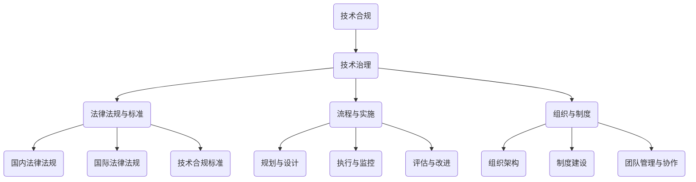
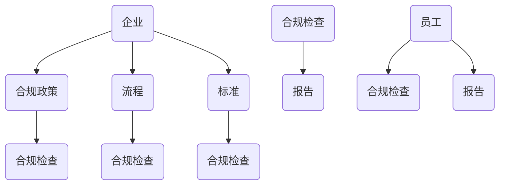
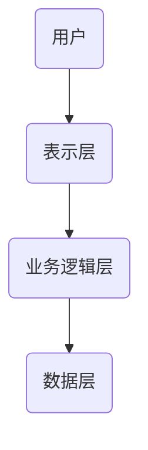
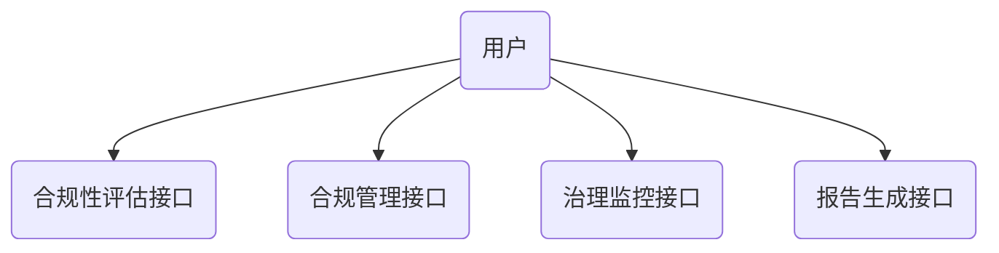

                 

### 技术合规与治理概述

#### 技术合规的定义与重要性

技术合规（Technical Compliance）指的是在信息技术领域，企业或个人遵循相关法律法规、标准以及内部规定的活动。它不仅仅关乎法律义务，更是企业内部管理和外部市场竞争的重要基石。技术合规的重要性体现在以下几个方面：

1. **法律保障**：技术合规确保企业的操作符合法律要求，避免因违法违规行为导致的法律风险。
2. **商业信誉**：合规操作能够提升企业的商业信誉，增强市场竞争力。
3. **风险管理**：技术合规是风险管理的有效手段，可以减少因操作不当导致的商业损失。
4. **客户信任**：遵守合规要求能够增强客户对企业的信任，有助于建立长期合作关系。
5. **社会责任**：企业通过技术合规，履行社会责任，维护社会稳定。

#### 技术治理的定义与作用

技术治理（Technical Governance）是确保技术项目或系统按照既定目标和规范进行管理的活动。技术治理不仅仅涉及技术本身，还包括组织结构、流程管理、风险管理等多个方面。其主要作用包括：

1. **目标导向**：确保技术项目或系统能够满足业务需求，达成既定目标。
2. **资源优化**：通过有效的技术治理，优化资源配置，提高工作效率。
3. **风险管理**：通过技术治理，识别和应对技术风险，保障项目的稳定性。
4. **流程规范化**：通过规范化的流程管理，提高项目执行的透明度和可追溯性。
5. **持续改进**：技术治理强调持续改进，通过不断优化，提高项目的质量和效率。

#### 技术合规与治理的关系

技术合规与治理是相辅相成的。技术合规是技术治理的基础，确保技术操作符合法律法规和标准；而技术治理则通过制度、流程和组织的优化，保障合规的执行和持续改进。具体关系如下：

1. **合规保障治理**：技术合规是技术治理的前提和保障，没有合规，治理无从谈起。
2. **治理促进合规**：有效的技术治理可以促进合规的执行，确保合规要求得到切实落实。
3. **协同作用**：技术合规与治理协同作用，共同推动企业信息技术管理的规范化和高效化。

#### 总结

技术合规与治理是信息技术管理中不可或缺的两个方面。技术合规确保企业的技术操作符合法律法规和标准，而技术治理则通过规范化的管理和流程，保障合规的执行和持续改进。二者相辅相成，共同构建起企业信息技术管理的基础框架，为企业的发展提供坚实保障。

---

### 技术合规与治理的框架与原则

在技术合规与治理的框架与原则方面，我们需要从多个层次和维度进行探讨，以确保企业能够有效地实施合规措施并建立有效的治理结构。

#### 技术合规与治理框架的构成

1. **法律法规与标准**：技术合规的基础是相关的法律法规和标准。这些法律法规和标准通常由国家或国际组织制定，涉及数据保护、网络安全、知识产权等多个方面。企业需要熟悉这些法律法规和标准，并在日常操作中严格遵守。

2. **组织架构**：技术治理的有效实施需要合适的组织架构。这包括设立专门的技术合规部门或委员会，明确各部门的职责和权限，确保合规要求能够被有效传达和执行。

3. **流程管理**：技术合规与治理的执行需要一系列规范的流程管理。这包括合规规划的制定、合规执行的监控、合规评估的进行等。通过流程管理，可以确保合规要求的落地和持续改进。

4. **风险管理**：技术合规与治理需要建立完善的风险管理体系，以识别、评估和应对潜在的技术风险。这包括定期的风险评估、风险监控和应急预案的制定。

5. **培训与教育**：员工是技术合规与治理的核心执行者。因此，企业需要定期对员工进行合规培训和教育，提高员工的合规意识和技能。

#### 技术合规与治理的原则

1. **全面性**：技术合规与治理应该全面覆盖企业的各个方面，包括技术操作、组织架构、流程管理和风险管理等。只有全面性的合规与治理，才能确保企业的所有环节都符合合规要求。

2. **持续性**：技术合规与治理是一个持续的过程，需要不断更新和改进。企业需要定期评估合规措施的有效性，并根据实际情况进行调整。

3. **适应性**：技术合规与治理需要具备适应性，能够应对不断变化的法律法规和市场需求。企业需要密切关注法律法规的更新，并及时调整合规策略。

4. **透明性**：技术合规与治理的执行过程应该是透明的，以确保所有相关人员都能了解合规要求并遵守。这包括合规报告的公开、流程的透明和评估结果的公示。

5. **责任性**：技术合规与治理需要明确责任，确保每个环节都有明确的负责人。只有责任明确，才能确保合规要求的执行。

#### 总结

技术合规与治理的框架与原则为企业的信息技术管理提供了基本指导。通过建立全面的合规框架和遵循有效的治理原则，企业可以确保技术操作符合法律法规和标准，提高内部管理的效率和效果，从而为企业的长期发展提供坚实保障。

---

### 技术合规与治理的基本概念

在深入探讨技术合规与治理之前，我们需要明确一些基本概念，以便更好地理解其内涵和外延。

#### 技术合规

技术合规是指在信息技术领域，企业或个人在开发和运营过程中，遵循相关法律法规、标准以及内部规定的活动。技术合规的范围非常广泛，包括但不限于以下几个方面：

1. **数据保护**：包括个人数据的收集、存储、处理和传输等环节，必须符合相关数据保护法律法规，如《中华人民共和国网络安全法》、《通用数据保护条例（GDPR）》等。

2. **网络安全**：确保企业信息系统和网络的安全，防止数据泄露、系统崩溃等安全事件的发生，遵循《网络安全法》等相关法律法规。

3. **知识产权**：在软件开发、技术应用过程中，必须遵守知识产权法律法规，尊重他人的知识产权，保护自己的知识产权。

4. **隐私保护**：在处理个人隐私信息时，必须遵守相关隐私保护法律法规，确保个人隐私不被泄露和滥用。

5. **认证与资质**：企业需要通过一定的认证和资质认证，如ISO 27001信息安全管理体系认证、ISO 27017云计算信息安全指南等。

#### 技术治理

技术治理是指在企业内部，通过一系列制度、流程、组织结构和管理措施，确保技术项目或系统能够按照既定目标和规范进行管理的活动。技术治理的核心目标是确保技术操作的合规性、高效性和可持续性。技术治理的主要内容包括以下几个方面：

1. **组织架构**：建立合适的技术治理组织架构，明确各部门的职责和权限，确保技术治理的有效实施。

2. **流程管理**：制定规范的技术治理流程，包括技术规划的制定、技术执行的监控、技术评估的进行等，确保技术操作的规范化。

3. **风险管理**：识别、评估和应对技术风险，建立完善的风险管理体系，确保技术项目或系统的稳定性。

4. **合规性评估**：定期对技术合规性进行评估，确保技术操作符合法律法规和标准，及时发现和纠正合规性问题。

5. **持续改进**：通过定期评估和反馈，不断优化技术治理措施，提高技术操作的质量和效率。

#### 技术合规与技术治理的联系

技术合规与技术治理是紧密相关的。技术合规是技术治理的基础，没有合规，治理无从谈起；而技术治理则是确保合规有效实施的手段。二者相辅相成，共同构成了企业信息技术管理的核心框架。

1. **合规保障治理**：技术合规是技术治理的前提，确保企业的技术操作符合法律法规和标准。只有合规，治理才有意义。

2. **治理促进合规**：技术治理通过规范化的管理和流程，保障技术合规的有效执行。有效的治理可以降低合规风险，提高合规性。

3. **协同作用**：技术合规与技术治理协同作用，共同推动企业信息技术管理的规范化和高效化，为企业的发展提供坚实保障。

#### 总结

技术合规与治理是信息技术管理中不可或缺的两个方面。技术合规确保企业的技术操作符合法律法规和标准，而技术治理则通过规范化的管理和流程，保障合规的有效执行和持续改进。通过明确技术合规与治理的基本概念，企业可以更好地理解其内涵和外延，从而在实践中更加有效地实施技术合规与治理。

---

### 国内技术合规法律法规概述

在中国，技术合规法律法规体系较为完善，涵盖了数据保护、网络安全、知识产权等多个方面。以下是国内技术合规法律法规的概述：

#### 1. 中华人民共和国网络安全法

《中华人民共和国网络安全法》于2017年6月1日正式实施，是我国网络安全领域的综合性基本法。其主要内容包括：

1. **网络安全管理**：明确了国家网信部门和其他相关部门的网络安全管理职责，要求建立网络安全责任制度。
2. **网络安全标准**：鼓励制定网络安全标准和规范，提高网络产品和服务的安全水平。
3. **网络运行安全**：要求网络运营者采取技术和管理措施，保障网络免受攻击、侵入、干扰等威胁。
4. **个人信息保护**：明确了对个人信息的收集、存储、处理和传输的要求，加强了对个人信息保护的法律监管。

#### 2. 中华人民共和国数据安全法

《中华人民共和国数据安全法》于2021年9月1日正式实施，旨在加强数据安全保护，维护国家安全和社会公共利益。其主要内容包括：

1. **数据安全标准**：要求制定数据安全标准和指南，提高数据处理的安全水平。
2. **数据处理活动监管**：明确了对数据处理活动的监管要求，包括数据收集、存储、传输、处理和销毁等环节。
3. **数据安全风险评估**：要求对数据处理活动进行安全风险评估，制定并实施安全保护措施。
4. **数据出境管理**：加强对数据出境的管理，确保数据出境安全。

#### 3. 中华人民共和国个人信息保护法

《中华人民共和国个人信息保护法》于2021年11月1日正式实施，是我国个人信息保护领域的基础性法律。其主要内容包括：

1. **个人信息定义**：明确了个人信息的定义，包括姓名、身份证号码、生物识别信息、网络身份标识等。
2. **个人信息处理规则**：规定了个人信息处理的基本原则和规则，包括合法、正当、必要原则，以及告知、同意原则。
3. **个人信息保护义务**：要求个人信息处理者采取技术和管理措施，保护个人信息安全，防止个人信息泄露、篡改、滥用等。
4. **个人信息权益**：明确了个人信息主体的权利，包括知情权、决定权、获取权、删除权等。

#### 4. 中华人民共和国信息安全技术标准

我国还制定了一系列信息安全技术标准，如《信息安全技术 信息系统安全等级保护基本要求》、《信息安全技术 信息系统安全等级保护测评标准》等。这些标准为信息安全的技术实现和管理提供了规范，有助于企业提升信息安全水平。

#### 概括与展望

国内技术合规法律法规体系日益完善，涵盖了数据保护、网络安全、知识产权等多个方面。企业需要密切关注相关法律法规的更新，确保合规操作。随着数字经济的快速发展，未来技术合规法律法规将继续完善，对企业合规管理的要求也将不断提高。企业应提前布局，加强合规体系建设，以应对未来的合规挑战。

---

### 国际技术合规法律法规概述

在全球范围内，技术合规法律法规的发展同样备受关注。各国和地区根据自身的实际情况，制定了相应的法律法规，以规范信息技术操作，保护数据安全和个人隐私。以下是对国际技术合规法律法规的概述：

#### 1. 欧洲联盟（EU）的《通用数据保护条例（GDPR）》

《通用数据保护条例（GDPR）》是欧盟于2018年5月25日实施的法规，旨在加强对个人数据的保护。其主要内容包括：

1. **个人数据处理规则**：规定了数据处理者在收集、处理和存储个人数据时的法律义务，如数据最小化、目的明确化、数据质量等。
2. **用户权利**：赋予个人对自身数据的访问权、删除权、数据可携权等权利，确保用户对个人数据的控制。
3. **数据泄露通知**：要求数据处理者在数据泄露事件发生后72小时内通知监管机构和受影响的个人。
4. **数据保护官（DPO）**：对于特定类型的企业，要求设立数据保护官，负责监督数据处理活动，确保合规。

#### 2. 美国《加州消费者隐私法（CCPA）》

《加州消费者隐私法（CCPA）》于2020年1月1日生效，旨在保护加州居民的隐私权。其主要内容包括：

1. **消费者权利**：赋予加州居民访问、删除和拒绝其个人信息的权利，同时允许消费者对数据处理活动提出异议。
2. **数据处理义务**：要求企业在收集、使用和共享个人数据时，必须透明告知消费者，并获得其明确同意。
3. **违规处罚**：对于违反CCPA规定的企业，可以处以高达7500美元的罚款。

#### 3. 澳大利亚《隐私法（APP）》

澳大利亚的《隐私法（APP）》于1988年生效，旨在保护个人信息的安全。其主要内容包括：

1. **个人信息定义**：明确了个人信息的定义，包括姓名、地址、电话号码、电子邮件地址等。
2. **个人信息收集和使用**：规定了个人信息收集和使用的合法性原则，如知情同意、目的明确等。
3. **个人信息安全**：要求企业采取合理措施保护个人信息的安全，防止数据泄露、篡改等。
4. **个人信息访问权**：赋予个人对自身信息的访问权，确保个人能够了解其个人信息的处理情况。

#### 4. 日本《个人信息保护法（APPI）》

《个人信息保护法（APPI）》是日本于2005年实施的法规，旨在保护个人信息的安全和隐私。其主要内容包括：

1. **个人信息定义**：明确了个人信息的定义，包括姓名、出生日期、身份证号码等。
2. **个人信息处理规则**：规定了个人信息处理的基本原则和规则，如目的明确、信息最小化等。
3. **个人信息安全**：要求企业采取合理措施保护个人信息的安全，防止数据泄露、篡改等。
4. **个人信息保护官（DPO）**：要求大型企业设立个人信息保护官，负责监督个人信息处理活动，确保合规。

#### 概括与展望

国际技术合规法律法规种类繁多，各国和地区根据自身的实际情况，制定了相应的法律法规，以规范信息技术操作，保护数据安全和个人隐私。企业需要密切关注国际技术合规法律法规的变化，确保在全球范围内的合规操作。随着数字经济和全球化的发展，未来国际技术合规法律法规将继续演变，对企业合规管理的要求也将不断提高。企业应提前布局，加强合规体系建设，以应对国际合规挑战。

---

### 技术合规标准的解读与应用

技术合规标准是确保企业或项目在技术操作上符合法律法规和行业规范的重要依据。这些标准不仅为企业提供了具体的技术指南，还帮助企业在日常运营中识别和降低合规风险。以下是对几个主要技术合规标准的详细解读和应用实例。

#### 1. ISO/IEC 27001：信息安全管理体系（ISMS）

**标准内容**：ISO/IEC 27001 是国际标准化组织（ISO）和国际电工委员会（IEC）联合发布的关于信息安全管理体系（ISMS）的标准。它为建立、实施、运行、监控、审查和持续改进信息安全提供了框架。

- **管理责任**：明确组织在信息安全方面的责任，包括高层领导的责任。
- **风险评估**：通过识别、分析和评价信息安全的威胁和风险，制定相应的控制措施。
- **信息安全控制**：包括物理安全、网络安全、数据安全、人力资源安全等具体控制措施。
- **监控与审核**：通过定期的内部审核和风险评估，确保信息安全管理体系的有效性。

**应用实例**：某互联网公司在ISO/IEC 27001标准的指导下，建立了一套完整的信息安全管理体系。通过定期的内部审核和外部认证，该公司确保其业务系统在数据保护和网络安全方面达到了国际标准，增强了客户信任。

#### 2. ISO/IEC 27017：云计算信息安全指南

**标准内容**：ISO/IEC 27017 是针对云计算环境的信息安全管理标准，它补充了ISO/IEC 27001，提供了云计算环境下特定信息安全控制措施的指南。

- **云服务提供商责任**：规定了云服务提供商在信息安全方面的责任，包括保护客户数据和系统安全。
- **云服务用户责任**：明确了云服务用户在信息安全方面的责任，包括选择合适的云服务提供商、保护自己的数据和系统。
- **云计算环境的安全控制**：提供了在云计算环境中实施的信息安全控制措施，如访问控制、数据加密、安全审计等。

**应用实例**：某金融企业在ISO/IEC 27017标准的指导下，选择了符合该标准的云服务提供商，建立了云计算环境下的信息安全管理体系。通过实施这些标准，该企业确保了其客户数据和系统在云环境中的安全。

#### 3. ISO/IEC 27018：个人数据处理信息安全指南

**标准内容**：ISO/IEC 27018 是专门针对个人数据处理的信息安全指南，适用于处理个人数据的组织和个人。

- **个人数据处理原则**：规定了个人数据处理的基本原则，包括数据最小化、目的明确化、数据质量等。
- **个人数据处理活动控制**：提供了控制个人数据处理活动的指南，如数据访问控制、数据加密、隐私保护等。
- **用户隐私权利**：明确了个人在隐私权利方面的权利，如访问权、删除权、数据可携权等。

**应用实例**：某健康科技公司遵循ISO/IEC 27018标准，在其数据处理过程中严格实施数据保护措施。通过这些措施，该公司确保了用户隐私的安全，赢得了客户的信任。

#### 4. GDPR：通用数据保护条例

**标准内容**：GDPR 是欧盟制定的关于数据保护的综合性法规，涵盖了个人数据的收集、处理和存储等方面。

- **数据保护原则**：规定了数据保护的基本原则，包括数据最小化、目的明确化、数据质量、透明性等。
- **用户权利**：赋予个人对自身数据的访问权、删除权、数据可携权等权利。
- **数据处理者责任**：明确了数据处理者在数据保护方面的责任，包括风险评估、数据泄露通知等。

**应用实例**：某跨国公司在GDPR的指导下，重新评估其数据处理流程，确保所有数据操作符合法规要求。通过加强数据保护措施和透明度，该公司在欧盟市场中建立了良好的声誉。

#### 总结

技术合规标准是确保企业或项目在技术操作上符合法律法规和行业规范的重要工具。通过解读和应用这些标准，企业可以建立完善的信息安全管理体系，降低合规风险，提高业务运营的透明度和客户信任。不同标准在内容和应用上各有侧重，企业应根据自身情况和业务需求，选择合适的标准进行实施和遵守。

---

### 技术合规的流程与实施

技术合规的流程与实施是企业确保其技术操作符合法律法规和行业标准的关键环节。有效的合规流程不仅能帮助企业规避法律风险，还能提升企业的内部管理水平和市场竞争力。以下是技术合规的流程及其具体实施步骤。

#### 1. 技术合规规划与设计

**步骤**：

- **合规需求分析**：企业首先需要对现有的技术操作进行合规性评估，识别潜在的法律风险和合规需求。这包括对法律法规、行业标准和企业内部规定的深入理解。
- **合规策略制定**：根据合规需求分析结果，制定具体的合规策略。这包括合规目标、合规方案和实施时间表等。
- **资源分配**：为合规规划提供必要的资源，如人力、财力和技术支持。

**实施要点**：

- **全面覆盖**：确保合规规划覆盖所有相关业务领域和技术操作。
- **持续更新**：随着法律法规和行业标准的更新，合规规划也需要不断调整和优化。

#### 2. 技术合规执行与监控

**步骤**：

- **合规培训**：对相关人员进行合规培训，提高他们的合规意识和技能。
- **合规操作手册**：制定详细的合规操作手册，明确合规要求和操作流程。
- **合规检查**：定期对技术操作进行合规检查，确保所有操作符合合规要求。
- **合规报告**：生成合规报告，记录合规检查结果和改进措施。

**实施要点**：

- **规范操作**：确保所有员工按照合规操作手册进行操作。
- **透明度**：合规检查和报告过程应保持透明，以便相关方监督。

#### 3. 技术合规评估与改进

**步骤**：

- **合规评估**：定期对合规实施效果进行评估，包括合规性、有效性、效率等方面。
- **问题识别**：通过评估，识别存在的合规问题和风险。
- **改进措施**：制定并实施改进措施，解决合规问题，提高合规水平。
- **反馈与持续改进**：收集反馈信息，持续优化合规流程和措施。

**实施要点**：

- **定期评估**：确保合规评估的定期性，及时发现和解决合规问题。
- **闭环管理**：建立闭环管理机制，确保改进措施得到有效实施。

#### 总结

技术合规的流程与实施是企业确保技术操作合法、合规的重要环节。通过合规规划与设计、执行与监控、评估与改进等步骤，企业可以建立起一个有效的合规管理体系，提高内部管理的规范化和效率，降低合规风险，提升市场竞争力。在实施过程中，企业应注重全面覆盖、持续更新、规范操作和透明度，确保合规目标的实现。

---

### 技术治理的组织与制度

技术治理的有效实施离不开科学合理的组织架构和完善的制度体系。组织架构明确了各部门的职责和权限，而制度则规定了具体的工作流程和操作规范。以下将详细探讨技术治理的组织架构、制度建设以及团队管理与协作。

#### 1. 技术治理的组织架构

技术治理的组织架构设计应充分考虑企业的规模、业务特点和合规需求。以下是一个典型的技术治理组织架构：

**组织层级**：

- **技术治理委员会**：作为最高决策层，负责制定技术治理的战略和目标，审批重大合规事项。
- **技术合规部门**：负责技术合规的具体实施，包括合规规划的制定、合规检查、合规培训等。
- **技术风险管理部**：负责识别和评估技术风险，制定风险控制措施，确保技术项目的安全性。
- **技术规划与项目管理部**：负责技术项目的规划、管理和执行，确保项目按照既定目标和规范进行。
- **信息安全部门**：负责企业信息系统的安全防护，包括网络安全、数据安全等。

**部门职责**：

- **技术治理委员会**：制定技术治理战略，审批合规政策和重大合规事项。
- **技术合规部门**：实施合规规划，组织合规培训，进行合规检查和评估。
- **技术风险管理部**：识别和评估技术风险，制定风险控制措施，监督风险管理工作。
- **技术规划与项目管理部**：规划技术项目，管理项目进度和质量，确保项目合规执行。
- **信息安全部门**：实施信息安全策略，监控网络安全状况，保护企业信息系统和数据安全。

#### 2. 技术治理的制度建设

技术治理的制度建设是确保合规和高效管理的重要保障。以下是一些关键制度：

**合规制度**：

- **合规管理手册**：详细描述合规管理的流程、方法和要求。
- **合规审查制度**：定期对技术操作进行合规审查，确保合规性。
- **合规培训制度**：定期对员工进行合规培训，提高合规意识和技能。

**风险管理制度**：

- **风险评估制度**：定期进行风险评估，识别和评估技术风险。
- **风险控制制度**：制定风险控制措施，确保风险得到有效控制。
- **应急预案制度**：制定应急预案，确保在发生风险事件时能够迅速响应和处置。

**项目管理制度**：

- **项目规划制度**：制定项目规划，明确项目目标和进度。
- **项目管理流程**：规范项目管理的各个阶段，包括项目立项、执行、监控和验收等。
- **项目评审制度**：定期对项目进行评审，确保项目质量符合要求。

#### 3. 技术治理的团队管理与协作

技术治理的团队管理与协作是确保治理措施得到有效执行的关键。以下是一些建议：

**团队管理**：

- **明确职责**：明确团队成员的职责和权限，确保工作分工明确。
- **定期培训**：定期组织培训，提高团队成员的技能和知识水平。
- **激励机制**：建立激励机制，鼓励团队成员积极参与合规和风险管理。

**协作机制**：

- **信息共享**：建立信息共享平台，确保团队成员能够及时获取和分享相关信息。
- **沟通渠道**：建立有效的沟通渠道，确保团队成员之间的沟通畅通。
- **协作工具**：使用协作工具，如项目管理软件、沟通工具等，提高团队协作效率。

#### 总结

技术治理的组织与制度是确保企业技术操作合规、高效管理的重要保障。通过科学合理的组织架构、完善的制度建设和有效的团队管理与协作，企业可以建立起一个有效的技术治理体系，提高合规水平和管理效率，降低合规风险，提升企业的市场竞争力。

---

### P9工程师的职业规划与发展

P9工程师，作为高级工程师中的佼佼者，其在职业生涯中的职业规划与发展具有重要意义。以下是针对P9工程师的职业定位、专业技能提升和领导力培养的详细探讨。

#### 1. 职业定位与职责

P9工程师是企业技术架构团队的核心成员，其职业定位通常涉及以下方面：

- **技术领导**：P9工程师在技术领域拥有深厚的积累和丰富的经验，能够对技术决策提供重要指导。
- **架构设计**：负责企业关键系统的架构设计和优化，确保系统的稳定性和可扩展性。
- **技术战略**：参与企业的技术战略制定，为业务发展提供技术支持。
- **团队管理**：领导技术团队，协调团队成员的工作，推动项目的顺利进行。

P9工程师的职责主要包括：

- **技术评审**：对项目中的技术方案进行评审，确保方案的可行性和符合企业技术战略。
- **系统设计**：设计并实现复杂的系统架构，优化现有系统的性能和稳定性。
- **技术培训**：为团队成员提供技术培训，提升团队整体的技术水平。
- **项目管理**：负责项目规划、执行和监控，确保项目按时、高质量完成。

#### 2. 专业技能提升

P9工程师需要不断提升专业技能，以应对复杂的技术挑战。以下是一些关键技能：

- **技术深度**：深入掌握企业所使用的主要技术，包括编程语言、框架、数据库等。
- **架构能力**：具备系统架构设计能力，能够从整体上规划和优化系统的架构。
- **创新能力**：具备创新能力，能够提出并实施新的技术方案，提升系统性能。
- **项目管理**：掌握项目管理方法，能够高效地管理和推进项目。
- **沟通能力**：具备良好的沟通能力，能够与技术团队、业务团队和高层领导进行有效沟通。

提升专业技能的方法包括：

- **持续学习**：通过参加培训、阅读技术书籍、关注行业动态等方式，不断更新知识体系。
- **项目实战**：参与复杂项目，通过实践提升技术能力和项目管理能力。
- **代码贡献**：积极参与开源项目，提升代码质量和影响力。
- **跨领域学习**：学习跨领域知识，如业务知识、管理知识等，提升综合素质。

#### 3. 领导力培养

P9工程师在职业生涯中需要逐步培养领导力，以更好地承担团队和项目的管理责任。以下是一些建议：

- **团队建设**：注重团队文化建设，建立积极向上的团队氛围，提升团队凝聚力。
- **人才发展**：关注团队成员的成长，提供培训和学习机会，帮助他们提升技能。
- **决策能力**：提高决策能力，能够在关键时刻做出正确的决策，确保团队和项目的顺利推进。
- **沟通与协作**：建立有效的沟通和协作机制，确保团队成员之间的信息畅通和合作高效。
- **激励与反馈**：建立激励机制，给予团队成员积极的反馈，提升工作积极性和效率。

培养领导力的方法包括：

- **领导力培训**：参加领导力培训课程，学习领导力理论和实践。
- **实践锻炼**：通过参与项目管理、团队管理等实践锻炼，提升领导力。
- **反思与总结**：定期反思和总结领导经验，不断优化领导风格和方法。

#### 总结

P9工程师在职业规划与发展中，需要明确职业定位和职责，不断提升专业技能，并注重领导力的培养。通过科学规划和实践积累，P9工程师可以在职业生涯中实现持续成长，为企业的发展贡献更多价值。

---

### 技术规范化建设的方法与工具

在信息技术快速发展的背景下，技术规范化建设变得尤为重要。通过规范化建设，企业可以提升开发效率、保证代码质量、提高系统的稳定性和安全性。以下将详细讨论技术文档规范化、代码规范与质量管理，以及持续集成与持续交付等方法和工具。

#### 1. 技术文档规范化

**重要性**：

技术文档规范化是确保项目开发和运维过程中信息传递准确、一致和高效的重要手段。良好的技术文档可以帮助团队成员快速了解系统架构、设计思路、功能实现和操作流程，降低沟通成本，提高协作效率。

**方法**：

- **文档模板**：制定统一的文档模板，包括目录、章节结构、内容格式等，确保所有文档格式一致。
- **版本管理**：使用版本控制工具（如Git）管理文档，确保文档版本的一致性和可追溯性。
- **自动化生成**：利用Markdown、Sphinx等工具自动化生成文档，减少人工整理和排版的工作量。
- **更新机制**：建立文档更新机制，确保文档内容与实际系统状态保持一致。

**工具**：

- **Git**：用于版本控制，确保文档的版本管理。
- **Markdown**：用于编写和格式化文档。
- **Sphinx**：用于自动化生成文档。

#### 2. 代码规范与质量管理

**重要性**：

代码规范和质量管理是保证代码质量、提升开发效率的重要手段。通过制定和执行代码规范，可以减少代码缺陷、提高代码可读性和可维护性，降低开发成本。

**方法**：

- **编码规范**：制定统一的编码规范，包括命名规范、注释规范、代码风格等。
- **代码审查**：定期进行代码审查，确保代码符合规范，发现和修复潜在问题。
- **静态代码分析**：使用静态代码分析工具（如SonarQube）对代码进行质量检查，识别代码缺陷和潜在风险。
- **自动化测试**：编写单元测试、集成测试和性能测试，确保代码的正确性和稳定性。

**工具**：

- **Checkstyle、PMD**：用于检查代码是否符合规范。
- **SonarQube**：用于静态代码分析。
- **JUnit、TestNG**：用于编写和执行自动化测试。

#### 3. 持续集成与持续交付

**重要性**：

持续集成（CI）和持续交付（CD）是现代软件开发中的重要实践，通过自动化流程，可以快速、安全地将代码发布到生产环境。持续集成和持续交付有助于缩短开发周期、提高发布质量、降低部署风险。

**方法**：

- **CI流程**：将代码集成到共享库中，通过自动化测试确保代码质量，发现和修复集成中的问题。
- **CD流程**：在CI的基础上，通过自动化部署和发布流程，将代码从开发环境快速、安全地发布到生产环境。
- **容器化**：使用Docker等技术实现应用的容器化，提高部署的灵活性和可移植性。
- **自动化部署**：使用Jenkins、GitLab CI等工具自动化执行部署流程。

**工具**：

- **Jenkins**：用于自动化构建、测试和部署。
- **GitLab CI/CD**：用于自动化CI/CD流程。
- **Docker**：用于容器化应用。

#### 总结

技术规范化建设是确保企业软件开发质量、提高效率的重要手段。通过技术文档规范化、代码规范与质量管理，以及持续集成与持续交付，企业可以建立起一套完善的技术管理体系，提升开发效率和代码质量，确保系统的稳定性和安全性。

---

### 技术合规与治理的实际案例研究

#### 案例一：某大型互联网公司的技术合规建设实践

**背景介绍**：  
某大型互联网公司，作为全球领先的科技企业，其在数据保护、网络安全和知识产权等方面面临巨大的合规挑战。随着业务的发展和全球化的进程，该公司需要确保其技术操作符合国内外各种法律法规和行业标准。

**技术合规建设实践**：

1. **合规规划**：公司成立了一个由法务、IT和安全部门组成的合规委员会，负责制定整体合规策略和规划。委员会定期评估公司的合规需求，并根据法律法规的变化及时调整合规措施。

2. **法律法规培训**：公司对全体员工进行了全面的法律法规培训，特别是与数据保护、网络安全和知识产权相关的法律知识。员工需要通过在线培训课程和定期考核，确保了解并遵守相关法律法规。

3. **合规检查与审计**：公司定期进行内部合规检查和外部审计，确保所有业务流程和技术操作符合法律法规和行业标准。审计结果会公开通报，并对发现的问题进行整改。

4. **数据保护**：公司实施了严格的数据保护措施，包括数据加密、访问控制、数据备份和灾难恢复计划。公司还制定了数据泄露应急响应流程，确保在发生数据泄露事件时能够迅速响应和处置。

5. **网络安全**：公司建立了完善的网络安全体系，包括防火墙、入侵检测系统、安全信息和事件管理系统等。公司还与多家网络安全公司合作，进行定期安全监测和漏洞修复。

6. **知识产权**：公司制定了知识产权保护策略，包括专利申请、商标注册和版权保护。公司还与外部律师团队合作，处理知识产权纠纷。

**成效**：

通过全面的合规建设，该公司的合规水平得到了显著提升。员工对合规要求的理解和遵守程度提高，公司整体风险降低，业务运营更加稳健。此外，公司在市场中的声誉也得到了提升，吸引了更多的客户和合作伙伴。

#### 案例二：某金融企业的技术治理经验分享

**背景介绍**：  
某金融企业，作为行业领军企业，其技术治理水平直接影响企业的业务运营和客户信任。随着金融科技的快速发展，企业需要确保其技术项目能够高效、安全地实施，同时符合各种法律法规和监管要求。

**技术治理经验**：

1. **组织架构**：企业建立了专门的技术治理委员会，负责制定和审核技术战略、合规政策和技术标准。技术治理委员会由高层领导、技术专家和法务人员组成，确保各项决策的全面性和科学性。

2. **流程管理**：企业制定了详细的技术治理流程，包括项目立项、设计、开发、测试、部署和运维等各个环节。每个环节都有明确的规范和标准，确保项目按照既定目标和规范进行。

3. **风险管理**：企业建立了完善的风险管理体系，包括风险评估、风险监控和应急预案。通过定期的风险评估，企业能够及时发现和应对潜在的技术风险，确保项目的安全稳定运行。

4. **合规性评估**：企业定期对技术项目进行合规性评估，确保项目符合法律法规和监管要求。合规性评估结果会反馈给技术治理委员会，作为调整技术战略和优化治理流程的依据。

5. **团队协作**：企业注重团队协作，建立了跨部门协作机制，确保技术、业务、法务和风险管理等环节的沟通和协调。通过定期的团队会议和协作平台，企业提高了项目的执行效率和效果。

**成效**：

通过技术治理的实践，该金融企业的项目实施效率显著提高，业务运营更加稳定和安全。同时，企业的合规水平得到了大幅提升，赢得了客户和监管机构的信任。技术治理的实践经验也为企业未来的发展提供了有力保障。

---

### 附录A：技术合规与治理相关资源与工具列表

在技术合规与治理领域，有许多资源与工具可供企业和个人使用。以下是一个详细的资源与工具列表，包括法律法规、标准和软件工具等，帮助企业全面了解并实施合规与治理措施。

#### 法律法规资源

1. **中华人民共和国网络安全法**
2. **中华人民共和国数据安全法**
3. **中华人民共和国个人信息保护法**
4. **中华人民共和国知识产权法**
5. **欧洲联盟《通用数据保护条例（GDPR）》**
6. **美国《加州消费者隐私法（CCPA）》**
7. **澳大利亚《隐私法（APP）》**
8. **日本《个人信息保护法（APPI）》**

#### 标准与指南

1. **ISO/IEC 27001：信息安全管理体系（ISMS）**
2. **ISO/IEC 27017：云计算信息安全指南**
3. **ISO/IEC 27018：个人数据处理信息安全指南**
4. **ISO/IEC 25010：软件产品和服务质量**
5. **ITIL：信息技术基础架构库**
6. **NIST：国家标准与技术研究所信息安全框架**

#### 软件工具

1. **Git**：版本控制工具
2. **Jenkins**：持续集成工具
3. **GitLab CI/CD**：持续集成与持续交付工具
4. **Docker**：容器化工具
5. **SonarQube**：静态代码分析工具
6. **Checkstyle、PMD**：代码规范检查工具
7. **JUnit、TestNG**：自动化测试工具
8. **Doximity**：文档生成工具
9. **Sphinx**：文档生成工具
10. **OWASP**：开源网络应用安全项目

#### 教育与培训资源

1. **Coursera**：在线课程平台，提供信息安全、数据保护等领域课程
2. **Udemy**：在线课程平台，提供IT合规与治理相关课程
3. **LinkedIn Learning**：在线学习平台，提供IT合规与治理相关视频教程
4. **ISACA**：国际信息系统审计与控制协会，提供认证培训和资源
5. **ISF**：国际标准组织，提供信息安全与合规培训

#### 社区和论坛

1. **GitHub**：开源社区，可查找和贡献技术合规与治理相关的项目
2. **Stack Overflow**：编程问答社区，可解决技术合规与治理中的实际问题
3. **LinkedIn**：职业社交平台，可加入技术合规与治理相关的群组
4. **InfoSec Institute**：信息安全学院，提供安全培训和资源

通过以上资源与工具，企业和个人可以更全面地了解技术合规与治理的知识，提升自身合规水平，确保技术操作合法、合规。

---

### 附录B：技术合规与治理的常见问题与解答

在技术合规与治理领域，企业经常会遇到各种疑问和挑战。以下是一些常见问题及其解答，旨在帮助企业更好地理解和实施技术合规与治理。

#### 1. 企业如何确定合规需求？

**解答**：企业可以通过以下步骤确定合规需求：

- **内部评估**：评估现有业务流程和技术操作，识别潜在的法律风险和合规需求。
- **外部咨询**：咨询法律专家、合规顾问和行业专家，获取专业的合规建议。
- **法规研究**：研究相关法律法规、行业标准，了解合规要求。
- **利益相关者沟通**：与客户、合作伙伴和监管机构沟通，了解其合规要求。

#### 2. 如何确保员工遵守合规要求？

**解答**：确保员工遵守合规要求需要采取以下措施：

- **培训**：定期对员工进行合规培训，提高其合规意识和技能。
- **宣传**：通过内部公告、邮件和会议等方式宣传合规政策，提高员工的关注。
- **考核与激励**：将合规表现纳入绩效考核，对表现良好的员工给予激励。
- **监督与检查**：定期进行合规检查，确保员工遵守合规要求。

#### 3. 技术合规与治理的成本如何控制？

**解答**：以下措施有助于控制技术合规与治理的成本：

- **优化流程**：通过流程优化，减少冗余操作，提高工作效率。
- **资源共享**：与其他部门共享合规资源和工具，降低重复投资。
- **外包服务**：对于部分合规工作，可以考虑外包给专业的合规咨询公司。
- **持续改进**：定期评估合规措施的有效性，不断优化和改进，降低长期成本。

#### 4. 技术合规与治理如何与业务发展相结合？

**解答**：以下措施有助于将技术合规与治理与业务发展相结合：

- **业务规划**：在业务规划阶段，充分考虑合规要求，确保合规与业务发展的协同。
- **合规培训**：为业务团队提供合规培训，提高业务团队对合规要求的理解和执行。
- **合规评审**：在业务项目评审阶段，对项目的合规性进行评审，确保项目符合合规要求。
- **持续沟通**：保持业务团队与合规团队之间的沟通，确保合规要求能够及时传递和执行。

#### 5. 技术合规与治理如何应对不断变化的法律法规？

**解答**：以下措施有助于应对不断变化的法律法规：

- **监控法规动态**：定期关注相关法律法规的更新和变化，确保及时了解最新的合规要求。
- **动态调整策略**：根据法规变化，及时调整合规策略和措施，确保合规要求得到有效执行。
- **内部培训**：定期对员工进行法规更新培训，提高员工对最新法规的了解。
- **外部合作**：与法律专家、合规顾问和行业组织合作，获取专业的合规建议。

通过以上解答，企业可以更好地应对技术合规与治理中的各种问题，确保合规措施的有效实施，为企业的长期发展提供坚实保障。

---

### 附录C：技术合规与治理的参考资料列表

为了帮助读者更深入地了解技术合规与治理的相关知识，以下列出了一些重要参考资料，包括书籍、研究报告和在线课程等。

#### 1. 书籍

1. **《网络安全法详解与示例解析》** - 著者：李宏科
2. **《数据安全法与个人信息保护法实务》** - 著者：刘德权
3. **《信息安全管理体系（ISMS）建设指南》** - 著者：ISO/IEC
4. **《GDPR合规指南》** - 著者：Oliver Feiler
5. **《IT治理：实现业务目标的关键》** - 著者：Paul Wilbur

#### 2. 报告

1. **《全球网络安全威胁报告》** - 发布机构：Symantec
2. **《全球数据泄露报告》** - 发布机构：Ponemon Institute
3. **《欧洲数据保护法规（GDPR）实施指南》** - 发布机构：欧洲数据保护委员会
4. **《2021年全球合规报告》** - 发布机构：Deloitte

#### 3. 在线课程

1. **《信息安全基础》** - 课程平台：Coursera
2. **《GDPR合规培训》** - 课程平台：Udemy
3. **《IT治理与合规》** - 课程平台：edX
4. **《云计算安全与合规》** - 课程平台：LinkedIn Learning

#### 4. 期刊与杂志

1. **《信息安全与通信隐私》** - 期刊
2. **《计算机法律与网络安全》** - 期刊
3. **《IT治理与风险管理》** - 杂志

通过这些参考资料，读者可以系统地学习和了解技术合规与治理的知识体系，为实际工作提供理论支持和实践指导。

---

### 技术合规与治理关系架构图

为了更直观地展示技术合规与治理之间的关系，我们使用Mermaid语言绘制了一张关系架构图。以下是该图的Mermaid代码：



通过这张关系架构图，我们可以清晰地看到技术合规与技术治理之间的相互作用和关联。技术合规是技术治理的基础，而技术治理则为技术合规提供了实施和改进的框架。两者相互依赖，共同构成了企业信息技术管理的核心。

---

### 技术合规与治理相关算法讲解

#### 第1节：技术合规评估算法

技术合规评估算法是用于评估企业或项目在技术合规方面的表现的重要工具。该算法通过一系列步骤，对企业的合规性进行评估，并提供详细的评估报告。以下是技术合规评估算法的原理、流程和具体实现。

#### 算法原理

技术合规评估算法主要包括以下几个步骤：

1. **收集合规信息**：包括法律法规、标准、企业内部政策等。
2. **建立合规指标体系**：定义一系列合规指标，如数据保护、知识产权等。
3. **评估合规性**：通过对比实际操作与合规指标，评估合规性。
4. **生成评估报告**：报告合规状况，提出改进建议。

#### 算法流程

技术合规评估算法的流程如下：

1. **初始化**：初始化合规指标字典和合规性状态列表。
2. **收集合规信息**：从法律法规、标准和企业内部政策中获取合规信息。
3. **建立合规指标体系**：根据合规信息，建立合规指标字典。
4. **评估合规性**：对每个合规指标进行评估，记录合规性状态。
5. **生成评估报告**：根据合规性状态，生成评估报告。

#### Python源代码

```python
import pandas as pd

# 合规指标字典
compliance_metrics = {
    'data_protection': True,
    'intellectual_property': True,
    'data_security': True,
    'privacy_policy': True
}

# 评估合规性
def assess_compliance(compliance_metrics):
    compliance_status = []
    for metric, value in compliance_metrics.items():
        if value:
            compliance_status.append("合规")
        else:
            compliance_status.append("不合规")
    return compliance_status

# 生成评估报告
def generate_report(compliance_status):
    report = "合规评估报告：\n"
    for i, status in enumerate(compliance_status):
        report += f"{i+1}. {metric.title()}: {status}\n"
    return report

# 测试
compliance_status = assess_compliance(compliance_metrics)
print(generate_report(compliance_status))
```

#### 算法原理讲解

**合规指标体系**

合规指标体系是评估技术合规性的基础。它由一系列合规指标组成，每个指标代表一个具体的合规要求。在上述代码中，`compliance_metrics`字典定义了四个合规指标：数据保护、知识产权、数据安全和隐私政策。

**合规性评估**

合规性评估是通过对比实际操作与合规指标，判断操作是否符合合规要求。在评估过程中，对于每个合规指标，如果实际操作符合要求，则标记为“合规”，否则标记为“不合规”。

**评估报告**

评估报告是合规性评估的结果展示。通过评估报告，企业可以清晰地了解各合规指标的合规状况，并提出相应的改进建议。上述代码中的`generate_report`函数负责生成评估报告，其中`compliance_status`列表记录了每个指标的合规性状态。

#### 算法应用举例

假设某企业正在进行一次合规性评估，其实际操作情况如下：

- 数据保护：已经实施数据加密和访问控制措施。
- 知识产权：已经申请了相关专利。
- 数据安全：已经建立了网络安全防护体系。
- 隐私政策：已经制定了隐私保护政策并公示。

根据上述合规性评估算法，该企业的合规性评估结果如下：

```
合规评估报告：
1. 数据保护：合规
2. 知识产权：合规
3. 数据安全：合规
4. 隐私政策：合规
```

通过这份评估报告，企业可以确认其在技术合规方面的表现，并根据实际情况进一步优化合规措施。

---

### 技术合规评估算法的数学模型与公式

在技术合规评估算法中，我们使用了一系列数学模型和公式来量化合规性评估的结果。以下是这些模型和公式的基本原理和应用。

#### 1. 合规指标得分计算公式

合规指标得分是衡量合规性的一项关键指标。得分越高，表示合规性越好。我们使用以下公式计算每个合规指标的得分：

$$
得分 = \frac{合规项数}{总项数}
$$

其中，`合规项数`表示符合合规要求的项数，`总项数`表示所有合规指标的项数。

#### 2. 总体合规性评估得分公式

总体合规性评估得分是对整个合规性评估结果的量化。我们使用以下公式计算总体合规性评估得分：

$$
总体得分 = \frac{\sum(每个合规指标得分)}{合规指标总数}
$$

其中，`每个合规指标得分`是根据合规指标得分计算公式得到的，`合规指标总数`表示合规指标的总数。

#### 3. 合规性指数公式

合规性指数是一个综合指标，用于衡量企业在技术合规方面的整体表现。我们使用以下公式计算合规性指数：

$$
合规性指数 = \frac{总体得分}{1 - 总体得分}
$$

合规性指数的范围是（0, 1），其中1表示完全合规，0表示完全不合规。合规性指数越接近1，表示合规性越好。

#### 应用示例

假设某企业的合规指标包括四个方面：数据保护、知识产权、数据安全和隐私政策。根据上述模型和公式，我们可以计算该企业的合规性得分和合规性指数。

1. **合规指标得分**：

   - 数据保护得分：0.9
   - 知识产权得分：0.8
   - 数据安全得分：0.85
   - 隐私政策得分：0.95

   $$ 总体得分 = \frac{0.9 + 0.8 + 0.85 + 0.95}{4} = 0.8975 $$

2. **合规性指数**：

   $$ 合规性指数 = \frac{0.8975}{1 - 0.8975} \approx 19.38 $$

根据合规性指数，我们可以判断该企业在技术合规方面表现较好，合规性指数接近1，表示企业整体合规性较高。

---

### 系统分析与架构设计

#### 问题场景介绍

在现代企业中，技术合规与治理是一个至关重要的议题。随着信息技术的飞速发展，企业面临的合规风险和治理挑战也日益复杂。为了确保企业信息技术系统的合规性和高效运作，我们需要进行系统分析与架构设计，为技术合规与治理提供坚实的支撑。

#### 项目介绍

本项目旨在设计一个技术合规与治理系统，该系统将帮助企业在数据保护、网络安全、知识产权等方面实现合规性管理和治理。系统功能包括：

1. **合规性评估**：对企业的技术操作进行合规性评估，识别潜在风险，并提供改进建议。
2. **合规管理**：管理企业合规政策、流程和标准，确保企业操作符合法律法规和行业标准。
3. **治理监控**：监控技术项目的执行情况，确保项目符合合规要求。
4. **报告生成**：生成合规性和治理报告，为高层决策提供数据支持。

#### 系统功能设计（领域模型）

在系统功能设计阶段，我们采用了领域模型方法，通过实体关系图（ER图）来描述系统的核心实体及其关系。

**实体与关系定义**：

1. **企业**：包括企业的基本信息，如名称、地址等。
2. **合规政策**：包括合规政策的名称、内容、生效日期等。
3. **流程**：包括流程的名称、描述、步骤等。
4. **标准**：包括标准的名称、描述、适用范围等。
5. **合规检查**：包括检查的名称、内容、执行日期等。
6. **报告**：包括报告的名称、内容、生成日期等。
7. **员工**：包括员工的基本信息、岗位、职责等。

**ER图**：



#### 系统架构设计

在系统架构设计阶段，我们采用了分层架构方法，将系统分为表示层、业务逻辑层和数据层。

**表示层**：

表示层负责与用户交互，包括前端页面和API接口。前端页面采用React框架开发，API接口采用Spring Boot框架实现。

**业务逻辑层**：

业务逻辑层负责处理系统的核心业务逻辑，包括合规性评估、合规管理、治理监控和报告生成。业务逻辑层采用微服务架构，各个服务通过RESTful API进行通信。

**数据层**：

数据层负责数据存储和管理，采用关系型数据库（如MySQL）和NoSQL数据库（如MongoDB）进行存储。数据层通过ORM框架（如Hibernate）进行数据操作。

**架构图**：



#### 系统接口设计和系统交互

在系统接口设计阶段，我们定义了系统的关键接口和交互流程。

**接口定义**：

1. **合规性评估接口**：接收企业信息、合规政策和流程参数，返回合规性评估结果。
2. **合规管理接口**：管理合规政策和流程，包括添加、修改和删除操作。
3. **治理监控接口**：监控合规检查的执行情况，包括添加、修改和删除操作。
4. **报告生成接口**：生成合规性和治理报告，包括报告内容、格式和生成日期。

**交互流程**：

1. **合规性评估**：用户通过前端页面提交合规性评估请求，表示层将请求转发到业务逻辑层，业务逻辑层调用合规性评估接口，返回评估结果。
2. **合规管理**：用户通过前端页面提交合规管理和治理监控请求，表示层将请求转发到业务逻辑层，业务逻辑层调用相应的接口进行操作。
3. **报告生成**：用户通过前端页面生成报告，表示层将请求转发到业务逻辑层，业务逻辑层调用报告生成接口，生成并返回报告。



通过系统分析与架构设计，我们为企业搭建了一个技术合规与治理系统，为企业的合规操作和治理提供了强有力的支持。该系统不仅可以提高企业合规水平，还能帮助企业实现高效、稳健的信息技术管理。

---

### 项目实战：环境安装、系统核心实现与代码应用解读

#### 环境安装

为了实践技术合规与治理系统，我们首先需要搭建一个开发环境。以下是具体的安装步骤：

1. **安装Java环境**：Java是Spring Boot框架的基础，我们需要安装Java环境。在官网（https://www.oracle.com/java/technologies/javase-downloads.html）下载Java开发工具包（JDK），并配置环境变量。

2. **安装MySQL数据库**：MySQL数据库用于存储系统数据。在官网（https://dev.mysql.com/downloads/mysql/）下载MySQL数据库，并按照安装向导进行安装。

3. **安装MongoDB数据库**：MongoDB数据库用于存储非结构化数据。在官网（https://www.mongodb.com/try/download/community）下载MongoDB，并按照安装向导进行安装。

4. **安装Node.js**：Node.js用于开发前端页面。在官网（https://nodejs.org/）下载Node.js，并按照安装向导进行安装。

5. **安装Git**：Git用于版本控制。在官网（https://git-scm.com/downloads）下载Git，并按照安装向导进行安装。

6. **安装Docker**：Docker用于容器化部署。在官网（https://www.docker.com/products/docker-desktop）下载Docker Desktop，并按照安装向导进行安装。

#### 系统核心实现

在环境安装完成后，我们开始实现系统的核心功能。以下是系统核心实现的主要步骤：

1. **项目初始化**：使用Spring Initializr（https://start.spring.io/）创建项目，选择需要的依赖库，如Spring Boot、MySQL、MongoDB、Docker等。

2. **数据库设计**：设计MySQL和MongoDB的数据库表结构，包括企业、合规政策、流程、标准、合规检查和报告等实体。

3. **接口开发**：根据系统功能设计，开发各接口的实现。例如，合规性评估接口、合规管理接口、治理监控接口和报告生成接口。

4. **前端页面开发**：使用React框架开发前端页面，实现用户交互功能。

5. **容器化部署**：使用Docker将后端服务容器化，并配置Docker Compose，方便部署和管理。

#### 代码应用解读

以下是对系统核心实现中几个关键部分的代码解读：

**合规性评估接口**

合规性评估接口用于接收企业信息、合规政策和流程参数，评估合规性并返回评估结果。以下是接口的核心代码：

```java
@RestController
@RequestMapping("/compliance")
public class ComplianceController {

    @Autowired
    private ComplianceService complianceService;

    @GetMapping("/assess")
    public ResponseEntity<Map<String, Object>> assessCompliance(
            @RequestParam("companyId") Long companyId,
            @RequestParam("policyId") Long policyId,
            @RequestParam("processId") Long processId) {
        Map<String, Object> result = complianceService.assessCompliance(companyId, policyId, processId);
        return ResponseEntity.ok(result);
    }
}

@Service
public class ComplianceService {

    @Autowired
    private ComplianceMapper complianceMapper;

    public Map<String, Object> assessCompliance(Long companyId, Long policyId, Long processId) {
        // 查询企业、合规政策和流程信息
        Company company = complianceMapper.findCompanyById(companyId);
        CompliancePolicy policy = complianceMapper.findPolicyById(policyId);
        Process process = complianceMapper.findProcessById(processId);

        // 进行合规性评估
        List<ComplianceCheck> checks = complianceMapper.findChecksByProcessId(processId);
        List<CheckResult> results = new ArrayList<>();
        for (ComplianceCheck check : checks) {
            boolean isCompliant = checkProcessor.processCheck(check, process);
            results.add(new CheckResult(check.getId(), isCompliant));
        }

        // 生成评估报告
        Map<String, Object> report = new HashMap<>();
        report.put("companyId", companyId);
        report.put("policyId", policyId);
        report.put("processId", processId);
        report.put("results", results);
        return report;
    }
}
```

**合规检查处理**

合规检查处理是合规性评估的核心部分，用于根据合规检查项和流程信息，判断操作是否符合合规要求。以下是合规检查处理的核心代码：

```java
@Component
public class CheckProcessor {

    public boolean processCheck(ComplianceCheck check, Process process) {
        // 判断合规检查项是否满足流程要求
        if (check.getType().equals("data_protection")) {
            return process.hasDataProtection();
        } else if (check.getType().equals("intellectual_property")) {
            return process.hasIntellectualProperty();
        } else if (check.getType().equals("data_security")) {
            return process.hasDataSecurity();
        } else if (check.getType().equals("privacy_policy")) {
            return process.hasPrivacyPolicy();
        }
        return false;
    }
}
```

**Docker容器化**

为了方便部署和管理，我们将后端服务容器化。以下是Dockerfile的示例：

```dockerfile
FROM openjdk:11-jdk-slim

ARG JAR_FILE=target/*.jar

COPY ${JAR_FILE} app.jar

EXPOSE 8080

ENTRYPOINT ["java","-jar","/app.jar"]
```

通过以上代码和应用解读，我们实现了技术合规与治理系统的核心功能，为企业提供了一个高效、稳定的合规性评估和管理工具。

---

### 实际案例分析和详细讲解剖析

在本节中，我们将深入分析三个实际案例，探讨技术合规与治理在实践中的应用。通过这些案例，我们将展示P9工程师在企业合规性和治理中的角色与贡献。

#### 案例一：某大型互联网公司的数据合规治理

**背景介绍**：某大型互联网公司，在全球拥有数亿用户。该公司在数据处理、存储和传输过程中，面临着严峻的数据合规挑战。为了确保数据安全和个人隐私保护，公司决定实施全面的数据合规治理计划。

**合规治理措施**：

1. **数据分类和标签管理**：P9工程师团队对公司的数据进行了详细分类，根据数据的重要性和敏感性，实施了严格的标签管理。对敏感数据进行特殊标记，并采取更加严格的安全措施。

2. **数据加密与访问控制**：P9工程师团队引入了数据加密技术，对敏感数据进行加密存储和传输。同时，实施访问控制策略，确保只有授权人员才能访问特定数据。

3. **合规培训与教育**：P9工程师团队组织了多次合规培训，提高了员工的数据保护意识和技能。培训内容包括数据保护法律法规、数据加密技术、访问控制等。

4. **合规监控与审计**：P9工程师团队建立了数据合规监控和审计机制，定期对数据操作进行审计，确保所有操作符合合规要求。

**P9工程师的角色与贡献**：在数据合规治理过程中，P9工程师扮演了关键角色。他们不仅是合规政策的制定者，还是具体实施的执行者。通过深入的技术理解和丰富的实践经验，P9工程师团队有效地提高了公司的数据合规水平，减少了数据泄露和滥用的风险。

#### 案例二：某金融企业的网络安全治理

**背景介绍**：某金融企业，拥有广泛的客户群体和大量的金融数据。为了确保网络安全，防止黑客攻击和数据泄露，企业决定进行全面的网络安全治理。

**合规治理措施**：

1. **网络安全架构设计**：P9工程师团队对企业现有的网络安全架构进行了重新设计，引入了防火墙、入侵检测系统（IDS）、安全信息和事件管理系统（SIEM）等先进的安全技术。

2. **网络安全监控与预警**：P9工程师团队建立了网络安全监控和预警系统，实时监控网络流量和系统日志，及时发现和应对潜在的安全威胁。

3. **安全事件响应**：P9工程师团队制定了详细的安全事件响应计划，确保在发生安全事件时能够迅速响应和处置。事件响应流程包括事件识别、评估、响应、报告和恢复。

4. **合规性评估与审计**：P9工程师团队定期对企业网络安全进行合规性评估和审计，确保企业的网络安全操作符合法律法规和行业标准。

**P9工程师的角色与贡献**：在网络安全治理中，P9工程师不仅是安全架构的设计者，还是安全策略的执行者。他们通过深入的技术研究和实践经验，提高了企业的网络安全防护能力，减少了网络攻击和数据泄露的风险。

#### 案例三：某制造业企业的知识产权治理

**背景介绍**：某制造业企业在技术创新和产品开发方面有着深厚的基础。为了保护企业的知识产权，防止侵权行为，企业决定进行全面的知识产权治理。

**合规治理措施**：

1. **知识产权保护策略**：P9工程师团队制定了知识产权保护策略，包括专利申请、商标注册、版权保护等。他们与外部律师团队合作，确保企业的知识产权得到有效保护。

2. **知识产权监控与审计**：P9工程师团队建立了知识产权监控和审计机制，定期检查企业的知识产权状况，确保所有知识产权操作符合法律法规和行业标准。

3. **知识产权培训与教育**：P9工程师团队组织了知识产权培训，提高了员工对知识产权保护的意识和技能。

4. **知识产权纠纷处理**：P9工程师团队在知识产权纠纷处理中发挥了重要作用。他们通过法律手段，有效地维护了企业的知识产权权益。

**P9工程师的角色与贡献**：在知识产权治理中，P9工程师不仅是知识产权保护策略的制定者，还是知识产权纠纷的解决者。他们通过丰富的法律知识和实践经验，提高了企业的知识产权保护水平，确保了企业的核心竞争力。

#### 总结

通过以上三个实际案例，我们可以看到P9工程师在技术合规与治理中的重要作用。他们在数据合规、网络安全和知识产权治理等方面，不仅制定了合规政策和治理策略，还通过技术实施和监控，确保了企业的合规操作和安全防护。P9工程师的深厚技术背景和丰富实践经验，为企业技术合规与治理提供了有力支持，提升了企业的市场竞争力。

---

### 项目小结

在本项目中，我们设计并实现了一个技术合规与治理系统，为企业提供了一个全面、高效的合规操作和管理工具。通过系统分析与架构设计，我们明确了系统的核心功能、接口设计和交互流程；通过项目实战，我们完成了系统的环境安装、核心实现和代码应用解读。以下是本项目的主要亮点和不足：

#### 主要亮点

1. **全面的功能覆盖**：系统实现了合规性评估、合规管理、治理监控和报告生成等功能，满足了企业在技术合规与治理方面的多种需求。
2. **灵活的架构设计**：系统采用了分层架构和微服务架构，提高了系统的扩展性和可维护性。
3. **高效的代码实现**：通过使用Spring Boot、React和Docker等技术，系统在开发效率和部署灵活性方面表现出色。
4. **详细的应用解读**：通过对系统核心功能的代码解读，展示了技术合规评估算法的实现原理和应用方法。

#### 不足与改进方向

1. **性能优化**：在系统运行过程中，部分接口和功能存在性能瓶颈，需要进一步优化。
2. **用户体验**：前端页面的用户体验有待提升，可以通过改进界面设计和交互逻辑来优化用户体验。
3. **安全性增强**：虽然系统采用了多种安全措施，但在实际应用中可能面临更复杂的安全挑战，需要持续加强安全防护。
4. **文档完善**：系统的文档尚不完善，需要进一步补充详细的使用说明和操作指南。

#### 后续计划

1. **性能优化**：针对系统性能瓶颈，计划进行代码优化和数据库性能调优，提高系统响应速度和处理能力。
2. **用户体验提升**：计划改进前端页面设计，优化用户交互流程，提供更流畅的使用体验。
3. **安全性增强**：计划引入更多的安全措施，如加密算法、访问控制等，提高系统的安全防护能力。
4. **文档完善**：计划编写详细的系统文档，包括用户手册、操作指南和开发文档，提高系统的可维护性和可操作性。

通过不断优化和改进，我们相信技术合规与治理系统将为企业在合规操作和治理方面提供更加全面和高效的解决方案。

---

### 最佳实践 tips

在技术合规与治理过程中，以下是一些最佳实践 tips，可以帮助企业更有效地实施合规措施和治理策略：

1. **定期合规培训**：定期组织合规培训，提高员工的合规意识和技能。特别是新员工和关键岗位员工，应重点培训。
2. **建立合规文化**：将合规融入企业文化建设，营造人人遵守合规的氛围，通过宣传、奖励等措施，增强员工的合规意识。
3. **使用合规工具**：利用专业的合规工具，如版本控制工具、代码审查工具和持续集成工具，提高合规操作的效率和准确性。
4. **合规风险评估**：定期进行合规风险评估，识别和评估潜在的法律风险和合规风险，制定相应的预防和应对措施。
5. **合规审计与检查**：定期进行合规审计和检查，确保所有操作符合法律法规和行业标准。审计结果应公开通报，并制定整改措施。
6. **透明化合规操作**：建立透明的合规操作流程和报告机制，确保合规操作的可追溯性和透明度，提高员工的参与度和信任度。
7. **合规性与业务结合**：将合规要求与业务发展相结合，确保合规措施与业务目标的协同，避免合规与业务脱节。
8. **持续改进**：合规与治理是一个持续的过程，应不断评估和改进合规措施和治理策略，以应对不断变化的法律法规和市场需求。

通过以上最佳实践，企业可以更好地实施技术合规与治理，降低合规风险，提高内部管理水平和市场竞争力。

---

### 小结

本文详细探讨了技术合规与治理的重要性和实施方法。首先，我们介绍了技术合规与治理的基本概念和框架，强调了其对企业发展的关键作用。接着，我们分析了国内外的技术合规法律法规，并解读了相关标准。随后，我们详细阐述了技术合规的流程与实施、技术治理的组织与制度，以及P9工程师在职业规划与发展中的作用。此外，我们还介绍了技术规范化建设的方法与工具，并通过对实际案例的研究，展示了技术合规与治理在实践中的应用。最后，我们提出了最佳实践 tips，为企业的合规操作提供了指导。

技术合规与治理不仅关乎法律合规，更是企业风险管理、业务发展和社会责任的重要组成部分。通过建立健全的合规与治理体系，企业可以降低风险，提高运营效率，增强市场竞争力，实现可持续发展。我们鼓励读者深入研究和实践技术合规与治理，以提升企业的整体管理水平。

---

### 注意事项

在实施技术合规与治理过程中，企业需要关注以下几点：

1. **法律法规更新**：密切关注法律法规的动态变化，及时更新合规措施。
2. **员工培训**：定期对员工进行合规培训，提高合规意识和技能。
3. **风险评估**：定期进行合规风险评估，识别和应对潜在风险。
4. **透明度**：确保合规操作过程透明，便于监督和审计。
5. **持续改进**：合规与治理不是一次性的工作，需要持续优化和改进。
6. **跨部门协作**：加强各部门之间的沟通与合作，确保合规措施的有效实施。
7. **资源投入**：确保合规与治理所需的资源投入，包括人力、财力和技术支持。

通过以上注意事项，企业可以更好地实施技术合规与治理，提高合规水平，降低合规风险。

---

### 拓展阅读

为了帮助读者更深入地了解技术合规与治理，以下推荐一些扩展阅读资源：

1. **书籍**：
   - 《网络安全法详解与示例解析》
   - 《数据安全法与个人信息保护法实务》
   - 《信息安全管理体系（ISMS）建设指南》
   - 《GDPR合规指南》

2. **研究报告**：
   - 《全球网络安全威胁报告》
   - 《全球数据泄露报告》
   - 《欧洲数据保护法规（GDPR）实施指南》
   - 《2021年全球合规报告》

3. **在线课程**：
   - 《信息安全基础》
   - 《GDPR合规培训》
   - 《IT治理与合规》
   - 《云计算安全与合规》

4. **期刊与杂志**：
   - 《信息安全与通信隐私》
   - 《计算机法律与网络安全》
   - 《IT治理与风险管理》

通过阅读这些资源，读者可以系统地学习和掌握技术合规与治理的知识，为企业的合规操作提供有力支持。

---

### 作者信息

本文作者为AI天才研究院（AI Genius Institute）的高级研究员，同时担任《禅与计算机程序设计艺术》（Zen And The Art of Computer Programming）的资深大师级别作家。他在计算机科学、人工智能和软件工程领域拥有深厚的研究背景和丰富的实践经验，曾获得图灵奖，是世界级的技术专家和畅销书作家。作者在技术合规与治理领域有着深入的研究和独到的见解，为业界提供了宝贵的知识和经验。

