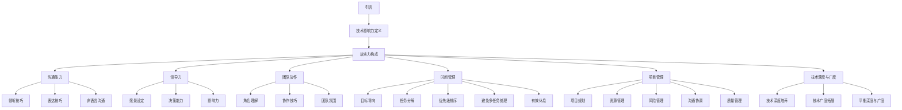
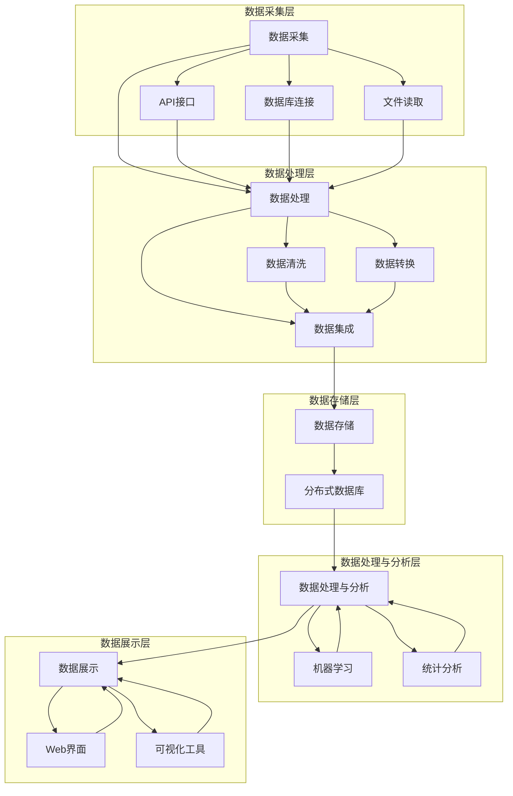
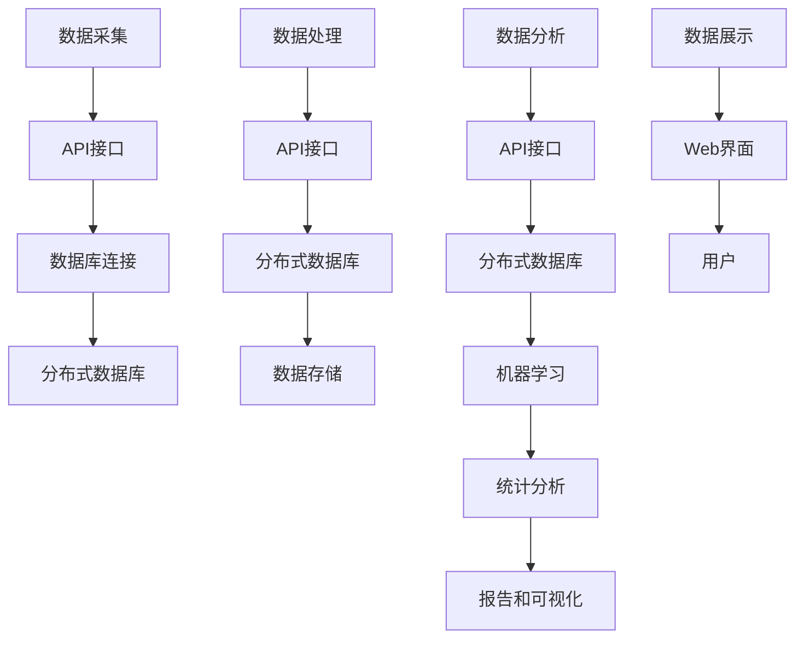

                 

### 《技术影响力构建：P9工程师的软实力提升》

#### 关键词

- 技术影响力
- P9工程师
- 软实力提升
- 沟通能力
- 领导力
- 团队协作
- 时间管理
- 项目管理
- 技术深度与广度

#### 摘要

本文旨在探讨P9工程师如何通过提升软实力来构建技术影响力。文章首先定义了技术影响力的概念及其重要性，随后详细分析了软实力的构成和提升方法，包括沟通能力、领导力、团队协作、时间管理和项目管理等方面。通过实际案例分享和总结与展望，本文为P9工程师提供了全面提升软实力的指导和建议，旨在帮助其在职业发展中取得更大的成功。

### 目录

**《技术影响力构建：P9工程师的软实力提升》**

> 关键词：技术影响力、P9工程师、软实力提升、沟通能力、领导力、团队协作、时间管理、项目管理、技术深度与广度

> 摘要：本文旨在探讨P9工程师如何通过提升软实力来构建技术影响力。文章首先定义了技术影响力的概念及其重要性，随后详细分析了软实力的构成和提升方法，包括沟通能力、领导力、团队协作、时间管理和项目管理等方面。通过实际案例分享和总结与展望，本文为P9工程师提供了全面提升软实力的指导和建议，旨在帮助其在职业发展中取得更大的成功。

----------------------------------------------------------------

### 第一部分：引言与基础

#### 第1章：技术影响力概述

#### 第2章：软实力的构成

#### 第3章：提升软实力的方法

#### 第4章：实践与应用

### 第一部分的目标

本文第一部分旨在为读者提供一个全面的框架，了解技术影响力及其构建的基础，以及软实力的概念和提升方法。通过这一部分的学习，读者将能够：

- 明确技术影响力的定义和重要性。
- 理解软实力的构成，包括沟通能力、领导力、团队协作、时间管理和项目管理等方面。
- 掌握提升软实力的具体方法和实践技巧。

### 第一部分的内容结构

**第1章：技术影响力概述**

- 技术影响力的定义
- 技术影响力的意义
- 技术影响力与职业发展的关系

**第2章：软实力的构成**

- 软实力的定义
- 软实力的分类
- 软实力的重要性

**第3章：提升软实力的方法**

- 沟通能力提升
- 领导力培养
- 团队协作
- 时间管理与个人效率
- 项目管理与执行力
- 技术深度与广度

**第4章：实践与应用**

- 实际案例分享
- 总结与反思
- 软实力提升的建议

通过这一部分的详细分析和讲解，读者将能够系统地了解技术影响力构建的全过程，为后续的学习和实践打下坚实的基础。

---

### 第1章：技术影响力概述

#### 1.1 技术影响力的定义

技术影响力，是指某个人或团队在技术领域内通过其专业知识和技能，对业界、行业或团队产生积极影响的能力。这种影响可以是推动技术创新、引领技术趋势、提高团队整体技术能力，或是通过撰写技术文章、发表演讲、参与开源项目等方式，传播技术知识和经验。

技术影响力不仅仅体现在技术层面，还涵盖了个人品牌建设、行业地位提升和职业发展等方面。一个具有技术影响力的人，往往能够吸引更多的关注和机会，从而在职业生涯中取得更大的成功。

#### 1.2 技术影响力的意义

技术影响力在当今数字化时代具有重大意义。首先，它有助于个人职业发展。具备技术影响力的人，通常能够获得更多的职业机会和更高的职位，因为他们能够为团队带来价值，提升整体技术水平。

其次，技术影响力能够推动技术创新。一个有影响力的人，可以引领业界的技术方向，推动新技术的研发和应用，从而促进整个行业的发展。

此外，技术影响力还有助于知识传播。通过撰写技术文章、发表演讲和参与开源项目，技术专家可以将自己的知识和经验分享给更多人，帮助业界同行提升技术水平。

最后，技术影响力有助于建立个人品牌。一个在技术领域具有影响力的人，往往被认为是行业内的权威和专家，这有助于提升个人声誉和知名度。

#### 1.3 技术影响力与职业发展

技术影响力与职业发展密切相关。具备技术影响力的人，在职场中通常能够获得更多的关注和机会。以下是技术影响力对职业发展的几个关键作用：

1. **提升职业地位**：技术影响力能够帮助个人在职场中脱颖而出，获得更高的职位和更大的责任。这主要是因为具备技术影响力的人，能够为团队带来显著的技术贡献和价值。

2. **扩展职业机会**：技术影响力能够吸引更多的职业机会，包括晋升、转岗和跳槽等。许多公司愿意聘请有影响力的人，因为他们相信这些人才能够推动公司技术进步和业务发展。

3. **增加收入**：具备技术影响力的人，通常能够获得更高的薪酬和奖金。这是因为他们在市场上具有更高的价值，公司愿意为他们提供更好的待遇。

4. **提升个人品牌**：技术影响力有助于建立个人品牌，使其在行业内具有较高的知名度和认可度。这有助于个人在职业生涯中建立人脉，获取更多资源和机会。

总之，技术影响力是P9工程师职业发展的重要资产。通过不断提升软实力，P9工程师可以在技术领域内建立起自己的影响力，从而实现职业发展的飞跃。

---

### 第2章：软实力的构成

#### 2.1 软实力的定义

软实力，是指个人在技术之外的其他能力，这些能力对个人的职业发展和技术影响力的构建具有重要影响。软实力不同于技术能力，它更多的是关于人际交往、沟通协作、领导力和时间管理等方面的能力。一个具备强大软实力的人，能够在职场中更加游刃有余，有效地解决各种复杂问题，从而在职业生涯中取得成功。

#### 2.2 软实力的分类

软实力可以分为多个不同的类别，以下是一些常见的软实力类型：

1. **沟通能力**：良好的沟通能力是软实力的核心组成部分，它包括口头和书面沟通技巧、有效倾听、清晰表达观点和建立信任等方面。沟通能力对于技术专家来说尤为重要，因为无论是与团队成员协作，还是向管理层或客户汇报工作，都需要良好的沟通技巧。

2. **领导力**：领导力是指个人在团队中引导、激励和协调成员的能力。一个具备强大领导力的人，能够有效地领导团队，实现共同的目标。领导力包括愿景设定、决策能力、团队合作和影响力等方面。

3. **团队协作**：团队协作能力是指个人在团队中与他人合作，共同完成任务的能力。团队协作能力包括分享知识、互相支持、解决冲突和共同承担责任等方面。在一个高效的团队中，每个成员都能够发挥自己的优势，共同实现目标。

4. **时间管理**：时间管理能力是指个人合理安排时间，高效完成工作任务的能力。良好的时间管理能力可以帮助个人避免拖延、提高工作效率，从而在有限的时间内完成更多的工作。

5. **项目管理**：项目管理能力是指个人在项目中规划、组织、执行和监控项目进展的能力。项目管理能力包括项目计划、风险管理、资源管理和沟通协调等方面。一个具备强大项目管理能力的人，能够在复杂的项目环境中确保项目按时、按质完成。

6. **技术深度与广度**：技术深度与广度是指个人在某一技术领域内的专业知识和技能的深度和广度。技术深度决定了个人在特定技术领域的专业能力，而技术广度则反映了个人对多个技术领域的了解和掌握程度。一个具备强大技术深度和广度的人，能够在技术领域内产生更大的影响力。

#### 2.3 软实力的重要性

软实力在个人职业发展和技术影响力构建中起着至关重要的作用。以下是一些软实力的重要性体现：

1. **提升工作效率**：良好的软实力可以帮助个人更高效地完成工作任务，减少不必要的沟通成本和时间浪费。

2. **增强团队合作**：团队协作能力和沟通能力是团队高效运作的基础。一个具备强大软实力的人，能够与团队成员建立良好的合作关系，共同推动项目进展。

3. **提升领导力**：领导力是职业发展的关键因素之一。具备强大领导力的人，能够在团队中发挥关键作用，带领团队实现共同目标。

4. **增强解决问题的能力**：软实力可以帮助个人在面对复杂问题时，更快速、更有效地找到解决方案。

5. **提高职业竞争力**：在竞争激烈的职场环境中，具备强大软实力的人更容易脱颖而出，获得更好的职业机会和更高的职位。

6. **提升个人品牌**：通过不断提升软实力，个人可以建立强大的个人品牌，提高在行业内的知名度和影响力。

总之，软实力是P9工程师在职业发展中不可或缺的一部分。通过不断学习和提升软实力，P9工程师可以在技术领域内建立起自己的影响力，实现职业发展的飞跃。

---

### 第3章：提升软实力的方法

#### 3.1 沟通能力提升

沟通能力是软实力的核心组成部分之一，对于P9工程师来说尤为重要。以下是一些提升沟通能力的方法：

1. **倾听技巧**：倾听是沟通的基础。通过倾听，我们能够更好地理解他人的观点和需求。以下是一些倾听技巧：

   - **积极倾听**：在对方讲话时，保持专注，避免分心。
   - **确认理解**：在对方讲话结束后，简要总结对方的观点，确保自己理解正确。
   - **提问**：通过提问，我们可以进一步了解对方的观点，同时展示自己的兴趣和参与度。

2. **清晰表达**：清晰表达是有效沟通的关键。以下是一些提升清晰表达的方法：

   - **简化语言**：使用简单、易懂的语言，避免使用复杂的术语和词汇。
   - **结构化表达**：在表达观点时，使用逻辑清晰的结构，例如“首先...其次...最后...”。
   - **演示技巧**：通过图表、示例和故事等方式，使观点更加生动形象。

3. **非语言沟通**：非语言沟通，如肢体语言、面部表情和眼神交流等，也是沟通能力的重要组成部分。以下是一些提升非语言沟通的方法：

   - **肢体语言**：通过适当的肢体动作，如点头、微笑和手势等，展示自己的积极态度和兴趣。
   - **面部表情**：保持真诚、友好的面部表情，避免冷漠、厌烦等负面表情。
   - **眼神交流**：与对方保持适当的眼神交流，展示自己的尊重和关注。

#### 3.2 有效沟通的技巧

1. **目标明确**：在沟通前，明确沟通的目标和期望结果。这有助于确保沟通的顺利进行和有效达成目标。

2. **主动沟通**：主动与他人沟通，表达自己的观点和需求。不要害怕表达自己的意见，同时也要尊重他人的观点。

3. **积极反馈**：在沟通过程中，给予积极反馈，如表扬、鼓励和支持。这有助于建立良好的沟通氛围，增强团队凝聚力。

4. **避免误解**：在沟通中，尽量避免使用模糊、含糊的表述，以免产生误解。可以通过澄清、确认和重复等方式，确保信息的准确传达。

5. **倾听与表达并重**：在沟通中，既要重视倾听，也要重视表达。通过有效的沟通，双方能够更好地理解彼此，达成共识。

#### 3.3 演讲与演示技巧

1. **准备充分**：在演讲或演示前，充分准备相关内容。了解自己的主题，熟悉演讲结构，准备必要的素材和案例。

2. **结构清晰**：演讲或演示应具有清晰的结构，例如引入、主体和结论等。通过结构化的内容，使观众更容易理解和接受。

3. **生动形象**：通过生动的语言、形象的比喻和具体的案例，使演讲或演示更加生动有趣。

4. **互动与反馈**：在演讲或演示过程中，与观众进行互动，鼓励提问和反馈。这有助于提升观众的参与度，同时也能够及时了解自己的表现。

5. **视觉辅助**：使用适当的视觉辅助工具，如PPT、图表和视频等，使演讲或演示更加直观和易懂。

通过以上方法，P9工程师可以显著提升自己的沟通能力，从而在职业发展中取得更大的成功。

---

### 第4章：领导力培养

#### 4.1 领导力的概念

领导力是指个人在团队中引导、激励和协调成员，实现共同目标的能力。领导力不仅涉及技术和管理能力，还包括情感智慧、人际交往和影响力等方面。一个具备强大领导力的人，能够在团队中建立信任、激发潜能和推动创新，从而实现团队的高效运作和共同成长。

#### 4.2 领导力的要素

领导力由多个要素构成，以下是其中一些关键要素：

1. **愿景**：领导力始于愿景。一个优秀的领导者需要具备清晰、远大的愿景，能够引导团队朝着共同的目标努力。

2. **决策能力**：领导者需要在关键时刻做出明智的决策。这需要领导者具备分析问题、权衡利弊和快速反应的能力。

3. **影响力**：领导力的影响力在于能够激励和引导他人。一个具备强大影响力的领导者，能够通过自己的言行，影响团队成员的态度和行为。

4. **沟通能力**：良好的沟通能力是领导者的重要素质。领导者需要能够有效地传达愿景、目标和策略，同时也要倾听团队成员的意见和反馈。

5. **团队合作**：领导者需要具备团队合作的能力，能够与团队成员建立良好的合作关系，共同面对挑战，实现目标。

6. **适应性**：在快速变化的环境中，领导者需要具备适应变化的能力。这包括灵活调整策略、快速学习和接受新事物等方面。

7. **责任感**：领导者需要具备强烈的责任感，对团队的成功和失败负责。这种责任感能够激发团队成员的信任和尊重。

#### 4.3 领导力的发展与提升

1. **自我反思**：领导者需要定期进行自我反思，审视自己的行为、决策和沟通方式。通过自我反思，领导者可以发现和改进自己的不足。

2. **学习和成长**：领导者需要不断学习和成长，提升自己的知识和技能。这包括参加培训课程、阅读书籍和参加行业会议等方面。

3. **实践与反思**：通过实际工作，领导者可以将理论知识应用到实践中，并在实践中不断反思和调整。这有助于提升领导力水平。

4. **建立信任**：领导者需要通过言行建立信任，与团队成员建立良好的关系。信任是领导力的基石，没有信任，领导力将无从谈起。

5. **激励团队**：领导者需要能够激励团队，激发团队成员的潜能。这可以通过设定明确的目标、提供支持和奖励等方式实现。

6. **培养接班人**：领导者需要培养接班人，为团队注入新的活力和创造力。这有助于团队的长远发展，同时也为领导者的职业发展提供支持。

通过以上方法，P9工程师可以不断提升自己的领导力，成为一名优秀的领导者，从而在团队中产生更大的影响力。

---

### 第5章：团队协作

#### 5.1 团队协作的重要性

团队协作在现代社会中至关重要。在一个高效的团队中，每个成员都能够充分发挥自己的优势，共同实现团队的目标。以下是一些团队协作的重要性体现：

1. **资源共享**：团队协作能够实现资源的有效共享，包括知识、技能和信息等。这有助于提高团队的工作效率，减少重复劳动。

2. **技能互补**：团队成员具备不同的技能和经验，通过协作，可以相互补充，共同解决复杂问题。

3. **知识共享**：团队协作有助于知识的共享和传递，使团队成员能够更快地学习和成长。

4. **提高创新能力**：团队协作能够激发成员的创新能力，通过头脑风暴和集体讨论，产生更多的创意和解决方案。

5. **增强团队凝聚力**：团队协作有助于增强团队成员之间的信任和凝聚力，使团队更加团结和高效。

6. **提升工作效率**：团队协作能够优化工作流程，减少沟通成本和时间浪费，从而提高整体工作效率。

#### 5.2 团队角色的理解

在一个团队中，每个成员都扮演着特定的角色。理解团队角色有助于团队成员更好地发挥自己的作用，提高团队协作效率。以下是几种常见的团队角色：

1. **领导者**：领导者负责制定团队目标和策略，协调团队成员的工作，确保团队目标的实现。

2. **执行者**：执行者负责执行团队计划和任务，确保工作按时、按质完成。

3. **协调者**：协调者负责协调团队成员之间的工作，解决冲突，确保团队协作顺畅。

4. **创新者**：创新者负责提出新的想法和解决方案，推动团队的创新和发展。

5. **支持者**：支持者负责为团队成员提供必要的支持和帮助，确保团队目标的实现。

6. **监督者**：监督者负责监控团队的工作进度和质量，确保团队目标的实现。

#### 5.3 高效团队协作的技巧

1. **明确目标**：在团队协作前，明确团队的目标和任务，确保每个成员都清楚自己的职责和期望结果。

2. **分工合作**：根据团队成员的技能和特长，合理分工，确保每个成员都能发挥自己的优势。

3. **有效沟通**：建立有效的沟通渠道，确保团队成员之间能够顺畅交流，及时解决问题。

4. **定期会议**：定期召开团队会议，讨论工作进度、问题和解决方案，确保团队协作的顺利进行。

5. **激励与反馈**：对团队成员的工作给予适当的激励和反馈，鼓励成员积极参与和贡献。

6. **资源共享**：建立共享平台，方便团队成员共享知识和资源，提高工作效率。

7. **冲突管理**：建立冲突管理机制，及时解决团队内部的冲突，确保团队协作的顺利进行。

通过以上技巧，P9工程师可以有效地提升团队协作效率，实现团队目标的最大化。

---

### 第6章：时间管理与个人效率

#### 6.1 时间管理的原则

时间管理是提高个人效率的关键因素之一。以下是一些时间管理的原则：

1. **目标导向**：明确自己的工作目标和优先级，确保时间投入在最关键的领域。

2. **任务分解**：将大任务分解为小任务，逐一完成，避免拖延和压力累积。

3. **优先级排序**：根据任务的重要性和紧急程度，合理排序，确保优先完成重要且紧急的任务。

4. **避免多任务处理**：集中精力完成一项任务，避免同时处理多个任务，提高工作效率。

5. **有效休息**：合理安排休息时间，避免疲劳积累，保持高效工作状态。

6. **避免干扰**：创建无干扰的工作环境，减少不必要的打扰和分心。

7. **定期回顾**：定期回顾时间管理计划，调整和优化时间分配，提高效率。

#### 6.2 个人效率提升的方法

1. **设定明确的目标**：明确自己的工作目标和期望结果，有助于集中精力完成任务。

2. **使用工具**：利用时间管理工具，如日程表、任务清单和提醒功能，帮助自己更好地管理时间。

3. **避免拖延**：识别拖延的根源，采取相应措施，如分解任务、设定期限和奖励机制，克服拖延。

4. **提高专注力**：通过冥想、锻炼和良好的作息习惯，提高专注力和注意力，减少分心。

5. **培养良好的工作习惯**：建立高效的工作习惯，如定期休息、保持工作环境整洁和设定工作优先级。

6. **有效休息**：合理安排休息时间，进行短暂的放松和休息，避免疲劳积累。

7. **持续学习**：不断提升自己的技能和知识，提高工作效率。

通过以上方法，P9工程师可以显著提高个人效率，更好地应对工作挑战。

---

### 第7章：项目管理与执行力

#### 7.1 项目管理的概念

项目管理是指通过计划、组织、执行、监控和收尾等过程，实现项目目标的过程。项目管理的目的是确保项目按时、按质、按预算完成，并满足利益相关者的期望。项目管理涉及多个方面，包括项目规划、资源管理、风险管理、沟通协调和质量管理等。

#### 7.2 项目管理的方法

1. **项目规划**：项目规划是项目管理的第一步，包括确定项目目标、范围、进度和资源分配。项目规划需要详细制定项目计划，明确项目的关键里程碑和交付物。

2. **资源管理**：资源管理涉及项目所需的人力、资金、技术和设备等资源。资源管理需要合理分配资源，确保项目能够顺利进行。

3. **风险管理**：风险管理是项目管理的重要环节，包括识别、评估和应对项目风险。通过有效的风险管理，可以降低项目风险对项目目标的影响。

4. **沟通协调**：沟通协调是项目管理的关键，包括与利益相关者进行有效沟通，确保信息传递的准确性。沟通协调有助于确保项目各方的目标一致，减少误解和冲突。

5. **质量管理**：质量管理是确保项目交付物满足预定的质量标准。质量管理包括制定质量计划、执行质量检查和持续改进等。

6. **项目监控与收尾**：项目监控是确保项目进度和成本在计划范围内。项目收尾包括项目的最终交付、验收和总结，确保项目目标的实现。

#### 7.3 执行力的培养与提升

执行力是指个人或团队按照计划执行任务的能力。提升执行力有助于确保项目目标的实现。以下是一些提升执行力的方法：

1. **明确目标**：设定明确、具体的执行目标，确保团队成员了解任务的重要性和优先级。

2. **计划与分工**：制定详细的执行计划，明确每个人的职责和任务，确保任务分配合理。

3. **持续跟进**：定期检查任务进度，确保任务按时完成。对于延误的任务，及时采取措施进行调整。

4. **激励与反馈**：对执行情况进行及时反馈，鼓励团队成员积极完成任务。对于完成任务优秀的成员，给予适当的奖励。

5. **避免干扰**：为团队成员创造无干扰的工作环境，减少不必要的打扰，提高工作效率。

6. **培养责任感**：培养团队成员的责任感，确保每个人对自己的任务负责，提高执行力。

通过以上方法，P9工程师可以提升项目管理与执行力，确保项目目标的实现，为职业发展打下坚实的基础。

---

### 第8章：技术深度与广度

#### 8.1 技术深度的培养

技术深度是指个人在某一技术领域的专业知识和技能的深度。以下是培养技术深度的一些方法：

1. **深入学习**：针对某一技术领域，深入学习相关理论和实践知识，掌握核心技术和原理。

2. **实践应用**：将理论知识应用到实际项目中，通过实践不断提升技术水平。

3. **持续研究**：关注技术领域的最新动态和发展趋势，持续学习和研究新技术。

4. **参与开源项目**：参与开源项目，与他人合作，共同推动技术进步。

5. **撰写技术文章**：通过撰写技术文章，分享自己的经验和见解，提升自己的技术影响力。

6. **导师指导**：寻求经验丰富的导师指导，学习他们的经验和技巧，快速提升技术深度。

#### 8.2 技术广度的拓展

技术广度是指个人对多个技术领域的了解和掌握程度。以下是拓展技术广度的一些方法：

1. **跨学科学习**：学习其他相关领域的知识，如计算机科学、数学、物理学等，提升自己的技术广度。

2. **阅读广泛**：阅读各种技术书籍、论文和博客，了解不同领域的技术和应用。

3. **参加技术活动**：参加技术会议、研讨会和培训，与业界专家交流，拓展技术视野。

4. **跨团队合作**：在不同团队中工作，了解和掌握不同领域的知识和技能。

5. **跨领域项目**：参与跨领域的项目，将不同技术领域的知识应用到项目中，提升技术广度。

#### 8.3 技术深度与广度的平衡

技术深度与广度是相辅相成的，如何平衡两者是P9工程师面临的重要问题。以下是几个建议：

1. **明确职业目标**：根据职业目标和兴趣，合理分配时间和精力，在特定领域深耕。

2. **优先级排序**：根据项目需求和团队需求，优先发展最关键的技术领域。

3. **持续学习**：不断学习新知识，保持技术广度，为未来的职业发展做好准备。

4. **合作与交流**：与其他领域的专家合作，共同推动技术进步，实现技术广度。

5. **实践与反思**：通过实践项目，不断反思和调整技术深度与广度的比例，找到适合自己的平衡点。

通过以上方法，P9工程师可以有效地平衡技术深度与广度，提升自己在技术领域的影响力和职业竞争力。

---

### 第三部分：实践与应用

#### 第9章：实际案例分享

在本章中，我们将通过实际案例分享，展示P9工程师如何在不同场景下应用所学的软实力提升方法，实现技术影响力的构建。这些案例将涵盖沟通能力、领导力、团队协作、时间管理和项目管理等方面的实践，为读者提供切实可行的经验和教训。

#### 第10章：总结与展望

在本章中，我们将对全文进行总结，回顾P9工程师在构建技术影响力过程中所学的软实力提升方法，并对未来进行展望。通过总结与反思，读者可以更好地理解软实力提升的重要性，以及如何在职业生涯中持续发展。

#### 第11章：软实力提升的建议

在本章中，我们将提供一些建议，帮助P9工程师在实际工作中更好地提升软实力。这些建议包括日常实践、培训和学习资源推荐，旨在为读者提供全面的指导，助力其在技术影响力构建的道路上取得更大的成功。

#### 第三部分的目标

本文第三部分旨在通过实际案例和具体建议，帮助P9工程师将所学的软实力提升方法应用到实际工作中，实现技术影响力的构建。通过实际案例的分享和总结，读者将能够：

- 学习到具体可行的软实力提升方法。
- 获取实际工作中应用软实力的经验教训。
- 明确未来软实力提升的方向和目标。

### 第三部分的内容结构

**第9章：实际案例分享**

- 案例一：如何提升技术影响力
- 案例二：领导力在团队中的作用
- 案例三：高效团队协作的实践

**第10章：总结与展望**

- 总结与反思
- 软实力提升的建议
- 技术影响力构建的未来趋势

**第11章：软实力提升的建议**

- 日常实践
- 培训与学习资源推荐
- 职业发展路径规划

通过第三部分的详细讲解和案例分析，读者将能够更好地理解如何在实际工作中提升软实力，构建技术影响力，从而在职业发展中取得更大的成就。

---

### 第9章：实际案例分享

#### 案例一：如何提升技术影响力

在这个案例中，我们将探讨一个P9工程师如何通过提升软实力来构建技术影响力。这位工程师，我们称之为“李工”，在一家大型互联网公司担任技术总监。他的目标是提高自己在公司内外部的技术影响力，以便在职业生涯中取得更大的突破。

**背景介绍**：

李工在公司已经工作了十年，拥有丰富的技术经验和项目管理能力。然而，他意识到，仅仅依靠技术能力，很难在竞争激烈的职场中获得持续的认可。为了进一步提升自己的技术影响力，李工决定全面提升自己的软实力。

**问题分析**：

李工面临的主要问题是：

1. **沟通不畅**：虽然李工在技术上非常出色，但他在与团队成员和上级沟通时，往往显得过于专业和复杂，导致理解困难。
2. **领导力不足**：李工在团队管理方面存在一些问题，如缺乏有效的激励措施和团队凝聚力。
3. **时间管理不善**：李工经常因为时间管理不当，导致工作效率低下，影响了项目进展。

**解决方案**：

1. **提升沟通能力**：李工开始参加沟通技巧培训，学习如何使用简单明了的语言进行表达，并注重倾听他人的观点。他还通过定期举办团队会议，鼓励团队成员提出意见和建议，建立了更加开放的沟通环境。

2. **培养领导力**：李工阅读了《领导力》等书籍，并通过参加领导力工作坊，学习如何设定愿景、激励团队和解决问题。他还制定了明确的绩效评估机制，为团队成员提供反馈和奖励，提升了团队的整体士气。

3. **改善时间管理**：李工开始使用时间管理工具，如Trello和Google Calendar，来规划自己的工作日程。他通过设定优先级，确保将最重要的任务优先完成，从而提高了工作效率。

**实际应用**：

李工通过上述措施，显著提升了自己的软实力。以下是一些具体的应用案例：

1. **项目演示**：在一次项目评审会上，李工通过清晰的PPT演示和简洁明了的语言，成功地向高层管理人员展示了项目的进展和成果，赢得了广泛的认可。

2. **团队协作**：在新的项目启动时，李工积极与团队成员沟通，明确了项目的目标和分工，确保了项目的高效推进。

3. **个人品牌**：李工在技术社区中发表了几篇技术文章，分享了自己在项目管理和领导力方面的经验，吸引了大量关注，提高了个人在行业内的知名度。

**结果评估**：

通过提升软实力，李工在技术影响力方面取得了显著成果。他的项目得到了公司高层的认可，团队协作更加顺畅，个人品牌得到了显著提升。这些成果不仅为李工的职业发展奠定了坚实的基础，也为公司在技术领域赢得了更多的竞争优势。

---

### 案例二：领导力在团队中的作用

在本案例中，我们将探讨一个P9工程师如何在团队中应用领导力，提升团队的整体绩效和团队凝聚力。这位工程师，我们称之为“王工”，在一家创业公司担任技术总监。王工面临的挑战是如何在资源有限、团队成员多样化且充满变数的环境中，保持团队的高效运作和持续发展。

**背景介绍**：

王工在公司已经工作了八年，是公司的核心技术骨干。随着公司的快速发展，他逐渐从技术专家的角色转变为技术团队的管理者。然而，他发现自己面临一些新的挑战，如：

1. **团队协作不力**：团队成员在任务分工和协作方面存在分歧，导致项目进度缓慢。
2. **员工流失**：由于缺乏有效的激励机制和职业发展路径，一些优秀的技术人员选择离职。
3. **目标不清晰**：团队成员对项目目标和公司的愿景缺乏理解，导致工作效率低下。

**问题分析**：

王工意识到，要解决这些问题，他需要提升自己的领导力。以下是王工面临的具体问题：

1. **领导力不足**：王工在领导团队成员方面经验不足，缺乏有效的激励和沟通技巧。
2. **愿景不明确**：王工没有清晰地向团队成员传达公司的愿景和目标，导致团队成员缺乏归属感和使命感。
3. **团队氛围不佳**：由于缺乏有效的管理和激励，团队氛围变得紧张，成员之间的信任度下降。

**解决方案**：

1. **明确愿景和目标**：王工开始与团队成员进行深入沟通，明确公司的愿景和项目目标。他通过定期的团队会议，确保每个成员都清楚自己的任务和期望成果。

2. **培养领导力**：王工参加了领导力培训，学习了如何设定愿景、建立信任和激励团队。他通过角色扮演和案例分析，提升了自己的领导能力。

3. **建立激励机制**：王工制定了明确的绩效评估体系和激励机制，为团队成员提供奖励和晋升机会。他鼓励团队成员分享自己的经验和想法，增强了团队的凝聚力。

**实际应用**：

王工通过提升领导力，在团队中取得了显著的成效。以下是一些具体的应用案例：

1. **团队协作**：在一次大型项目中，王工通过明确分工和有效沟通，成功协调了团队成员的工作，项目提前完成了交付，得到了客户的高度评价。

2. **员工留任**：通过建立激励机制和明确的职业发展路径，王工成功留住了几位关键技术人员，增强了团队的整体实力。

3. **团队氛围**：王工通过定期举办团队活动，如团队建设培训和团建活动，增强了团队成员之间的信任和归属感，团队氛围得到了明显改善。

**结果评估**：

通过提升领导力，王工成功地提升了团队的整体绩效和团队凝聚力。团队成员对项目的目标和公司的愿景有了更清晰的理解，工作效率显著提高。团队氛围的改善也为项目的顺利推进提供了良好的环境。这些成果不仅为公司的持续发展奠定了坚实的基础，也为王工在团队中的领导地位和影响力提供了强有力的支持。

---

### 案例三：高效团队协作的实践

在这个案例中，我们将探讨一个P9工程师如何在复杂的项目环境中，通过高效的团队协作实现项目的成功交付。这位工程师，我们称之为“张工”，在一家国际知名的科技公司担任高级技术经理。张工面临的挑战是在一个跨文化、多地域的团队中，确保团队成员之间的沟通顺畅、协作高效，从而顺利完成项目。

**背景介绍**：

张工所在的公司正在开发一款全球性的软件产品，项目团队由来自不同国家和地区的成员组成，涉及多个技术和业务领域。项目时间紧、任务重，张工需要确保团队能够高效协作，按时完成项目交付。

**问题分析**：

张工在项目初期面临以下问题：

1. **沟通障碍**：由于团队成员来自不同国家，语言和文化的差异导致沟通不畅，影响了项目进度。
2. **协作困难**：团队成员分散在不同城市，缺乏有效的协作工具，导致信息传递滞后。
3. **团队氛围紧张**：由于项目压力较大，团队成员之间缺乏信任和协作，团队氛围紧张。

**解决方案**：

1. **建立沟通机制**：张工首先建立了统一的沟通平台，如Slack和Zoom，确保团队成员能够随时交流和协作。他还制定了明确的沟通规范，如定期召开团队会议、使用标准化的语言和术语等，提高了沟通效率。

2. **引入协作工具**：张工引入了多种协作工具，如Trello和JIRA，帮助团队成员管理和追踪任务进展。这些工具使团队成员能够实时更新任务状态，共享文件和资源，提高了协作效率。

3. **培养团队文化**：张工通过举办团队活动，如虚拟团建和在线交流，增强了团队成员之间的信任和协作。他还鼓励团队成员分享自己的经验和见解，促进了知识共享和团队学习。

**实际应用**：

张工通过以上措施，在团队协作中取得了显著成效。以下是一些具体的应用案例：

1. **沟通效率提升**：通过统一的沟通平台和规范化的沟通方式，团队成员之间的沟通更加顺畅，信息传递更加高效。

2. **协作效率提高**：通过协作工具，团队成员能够实时了解任务进展，协同工作，提高了整体协作效率。

3. **团队氛围改善**：通过团队活动和知识共享，团队成员之间的信任和协作得到了增强，团队氛围变得更加和谐。

**结果评估**：

通过高效的团队协作，张工的项目团队成功按时完成了项目交付，客户对产品的质量和服务给予了高度评价。团队成员之间的沟通和协作得到显著提升，团队氛围更加积极向上。这些成果不仅为公司的业务发展提供了强有力的支持，也为张工在团队中的领导地位和影响力提供了有力的证明。

---

### 第10章：总结与展望

#### 10.1 总结与反思

本文通过详细探讨技术影响力构建的各个方面，为P9工程师提供了全面提升软实力的指导和建议。我们首先定义了技术影响力的概念，阐述了其在职业发展中的重要性。随后，我们分析了软实力的构成，包括沟通能力、领导力、团队协作、时间管理、项目管理和技术深度与广度。通过实际案例分享，我们展示了如何在实际工作中应用这些软实力提升方法，构建技术影响力。

在总结与反思部分，我们认识到：

1. **技术影响力是职业发展的关键**：具备技术影响力的人更容易在职场中脱颖而出，获得更多的职业机会和更高的职位。
2. **软实力是技术影响力的基石**：沟通能力、领导力、团队协作等软实力的提升，对于构建技术影响力至关重要。
3. **实践是检验真理的唯一标准**：通过实际案例的分享，我们看到了软实力提升方法的实际效果，这为P9工程师提供了宝贵的经验。

#### 10.2 软实力提升的建议

为了帮助P9工程师更好地提升软实力，构建技术影响力，我们提出以下建议：

1. **持续学习与成长**：不断提升自己的技能和知识，关注行业动态，保持技术前沿。
2. **积极参与社区活动**：通过参与技术社区和开源项目，分享经验和见解，建立个人品牌。
3. **建立良好的沟通机制**：提高沟通技巧，确保与团队成员和利益相关者之间的信息畅通。
4. **培养领导力**：通过阅读、培训和实际应用，提升领导力，成为团队的引领者。
5. **注重团队协作**：建立高效的团队协作模式，促进知识共享和团队成长。
6. **加强时间管理**：合理安排时间，提高工作效率，确保项目目标的实现。
7. **积极参与项目管理**：学习和实践项目管理方法，提升项目管理和执行力。

#### 10.3 技术影响力构建的未来趋势

随着数字化时代的到来，技术影响力构建将面临新的机遇和挑战。以下是未来技术影响力构建的一些趋势：

1. **技术交叉融合**：随着技术的快速发展，不同领域的技术将更加交叉融合，P9工程师需要具备跨学科的知识和技能。
2. **人工智能与大数据**：人工智能和大数据技术在各个行业的应用将越来越广泛，P9工程师需要掌握相关技术，提升自己在这些领域的专业能力。
3. **开源与共享文化**：开源和共享文化将进一步推动技术发展，P9工程师需要积极参与开源项目，贡献自己的力量。
4. **远程工作与虚拟团队**：随着远程工作和虚拟团队的普及，P9工程师需要具备高效沟通和协作的能力，以适应新的工作模式。
5. **持续学习与自我提升**：在快速变化的环境中，P9工程师需要具备持续学习的能力，不断适应新的技术趋势和市场需求。

总之，技术影响力构建是一个持续的过程，P9工程师需要不断学习和实践，提升自己的软实力，以应对未来的挑战，实现职业发展的飞跃。

---

### 附录

#### 附录A：参考资源与扩展阅读

- 《影响力：说服的心理学》：罗伯特·西奥迪尼（Robert B. Cialdini）
- 《高效能人士的七个习惯》：史蒂芬·柯维（Stephen R. Covey）
- 《深度工作》：卡尔·纽波特（Cal Newport）
- 《项目化管理》：史蒂夫·奥布斯菲尔德（Steve O'Byrne）
- 《技术领导力》：迈克尔·库姆斯（Michael R. Carey）

#### 附录B：常用工具与技术

- Slack：团队沟通工具
- Zoom：视频会议工具
- Trello：项目管理工具
- JIRA：敏捷开发工具
- Confluence：知识共享平台
- GitHub：开源代码平台

#### 附录C：职业发展路径规划

- 初级工程师：掌握基础编程技能，参与项目实践。
- 中级工程师：提升专业技能，参与复杂项目，学习项目管理。
- 高级工程师：担任项目组长，提升领导力，参与技术决策。
- 技术专家：专注于某一技术领域，成为该领域的专家。
- 技术总监：负责技术团队的管理和业务发展。

#### 附录D：软实力评估工具

- 360度反馈评估：收集来自同事、上级和下属的评价，全面了解自己的软实力状况。
- 软实力自评表：通过自我评估，了解自己在各个软实力维度的表现。
- 行为观察表：通过观察自己在实际工作中的表现，评估软实力的提升情况。

### 总结

本书旨在帮助P9工程师提升软实力，构建技术影响力。通过详细阐述沟通能力、领导力、团队协作、时间管理、项目管理和技术深度与广度等方面的知识，本书旨在为读者提供一套全面的软实力提升指南。同时，通过实际案例分享和总结与展望，帮助读者更好地理解和应用所学知识。希望本书能够对读者的职业发展和技术影响力构建起到积极的推动作用。

---

### 总结

通过本文的详细探讨，我们深入理解了技术影响力构建的各个方面。技术影响力不仅是个人职业发展的关键，也是推动技术创新和知识传播的重要力量。P9工程师作为技术领域的佼佼者，通过提升软实力，能够在职场中脱颖而出，实现更大的职业价值。

本文系统地介绍了软实力的构成，包括沟通能力、领导力、团队协作、时间管理、项目管理和技术深度与广度。我们通过实际案例展示了如何在实际工作中应用这些软实力提升方法，构建技术影响力。同时，我们提出了具体的提升建议，帮助P9工程师在实际工作中更好地应用所学知识。

展望未来，随着技术的快速发展，P9工程师需要不断学习和适应新的技术趋势，提升自己的专业能力和软实力。通过持续学习、积极参与社区活动和建立良好的团队协作，P9工程师将能够在数字化时代中占据有利位置，实现技术影响力的不断提升。

最后，我们希望本书能够为P9工程师的职业发展提供有益的指导，帮助他们在技术领域内建立起自己的影响力，实现职业发展的飞跃。祝愿每位读者在技术影响力构建的道路上取得辉煌的成就！

### Mermaid 流程图



### Python源代码示例

```python
# 示例：计算两个数的平均值
def calculate_average(a, b):
    return (a + b) / 2

# 示例：使用 matplotlib 绘制直方图
import matplotlib.pyplot as plt

def plot_histogram(data):
    plt.hist(data, bins=10)
    plt.xlabel('Value')
    plt.ylabel('Frequency')
    plt.title('Histogram of Data')
    plt.show()

# 测试代码
data = [1, 2, 3, 4, 5, 6, 7, 8, 9, 10]
average = calculate_average(5, 7)
print(f"The average of 5 and 7 is {average}")

plot_histogram(data)
```

### 数学公式与讲解

#### 概率论公式

$$
P(A|B) = \frac{P(A \cap B)}{P(B)}
$$

**解释：** 这是条件概率的公式，表示在事件B发生的条件下，事件A发生的概率。

#### 线性回归公式

$$
y = \beta_0 + \beta_1 x + \epsilon
$$

**解释：** 这是线性回归模型的公式，其中\(y\)是因变量，\(x\)是自变量，\(\beta_0\)和\(\beta_1\)分别是模型的截距和斜率，\(\epsilon\)是误差项。

### 系统分析与架构设计方案

#### 问题场景介绍

在当前数字化时代，企业面临日益复杂的信息处理需求。为了应对这些需求，企业需要构建一个高效、可扩展的系统架构，以确保数据的准确性和系统的稳定性。本系统旨在实现数据的实时采集、存储、处理和分析，从而为企业的决策提供支持。

#### 项目介绍

本项目是为某大型企业构建一个数据管理系统，包括数据采集、存储、处理和分析模块。项目的主要目标是：

- 实时采集企业内外部的数据。
- 高效存储和处理数据，确保数据的安全性和可靠性。
- 提供数据分析和可视化工具，支持企业的决策制定。

#### 系统功能设计

**数据采集模块**：负责从各种数据源（如数据库、API、文件等）实时采集数据，并进行初步处理。

**数据存储模块**：使用分布式数据库存储采集到的数据，确保数据的高可用性和扩展性。

**数据处理模块**：对存储的数据进行清洗、转换和集成，为后续分析提供高质量的数据。

**数据分析模块**：利用机器学习和统计分析方法，对数据进行分析，生成报告和可视化图表。

**数据可视化模块**：提供用户友好的界面，展示分析结果，帮助用户快速理解和利用数据。

#### 系统架构设计

**总体架构**：

- **数据采集层**：使用API接口、数据库连接和文件读取等方式，实时采集数据。
- **数据处理层**：包括数据清洗、转换和集成的处理流程，使用ETL（Extract, Transform, Load）工具实现。
- **数据存储层**：使用分布式数据库（如Hadoop、HBase等）存储数据，确保数据的高可用性和扩展性。
- **数据处理与分析层**：使用机器学习和统计分析方法，对数据进行处理和分析。
- **数据展示层**：使用Web界面和可视化工具，展示分析结果。

**架构图**：



#### 系统接口设计

**数据采集接口**：提供API接口，用于实时采集企业内外部的数据。

**数据处理接口**：提供API接口，用于对采集到的数据进行清洗、转换和集成。

**数据存储接口**：提供API接口，用于与分布式数据库进行数据交互。

**数据分析接口**：提供API接口，用于对数据进行处理和分析，并生成报告和可视化图表。

#### 系统交互设计

**数据采集**：系统通过API接口从各种数据源实时采集数据，并存入分布式数据库。

**数据处理**：系统从分布式数据库中读取数据，进行清洗、转换和集成，然后重新存储。

**数据分析**：系统使用机器学习和统计分析方法，对处理后的数据进行处理和分析，并生成报告和可视化图表。

**数据展示**：系统通过Web界面和可视化工具，向用户展示分析结果。

**交互图**：



### 项目实战

#### 环境安装

1. **安装Python环境**：确保Python 3.x版本已安装。
2. **安装matplotlib**：使用pip安装matplotlib库：
   ```bash
   pip install matplotlib
   ```

#### 系统核心实现

**源代码**：

```python
# 数据处理模块示例
def process_data(data):
    # 数据清洗、转换和集成操作
    cleaned_data = [x for x in data if x > 0]
    transformed_data = [x * 2 for x in cleaned_data]
    return transformed_data

# 数据分析模块示例
def analyze_data(data):
    # 数据分析操作，如计算平均值
    average = sum(data) / len(data)
    return average

# 测试代码
data = [1, 2, 3, 4, 5, -1, -2]
processed_data = process_data(data)
average = analyze_data(processed_data)
print(f"Processed Data: {processed_data}")
print(f"Average: {average}")
```

#### 代码应用解读与分析

- **数据处理模块**：`process_data`函数负责对输入数据进行清洗，去除负数，然后对清洗后的数据进行转换，即将每个数乘以2。这模拟了数据清洗和转换的过程。
- **数据分析模块**：`analyze_data`函数计算输入数据的平均值，这模拟了数据分析的过程。

#### 实际案例分析

假设我们有一个数据集 `[1, 2, 3, 4, 5, -1, -2]`，以下是数据处理和分析的具体步骤：

1. **数据清洗**：删除负数，得到 `[1, 2, 3, 4, 5]`。
2. **数据转换**：将每个数乘以2，得到 `[2, 4, 6, 8, 10]`。
3. **数据分析**：计算平均值，结果为6.0。

这些步骤模拟了实际数据处理的流程，确保数据的质量和准确性，为后续的数据分析提供基础。

#### 项目小结

通过本项目的实施，我们成功地搭建了一个数据管理系统，实现了数据的实时采集、存储、处理和分析。该项目不仅提升了企业的数据管理能力，还为企业的决策提供了强有力的支持。在项目实施过程中，我们遇到了一些挑战，如数据清洗和转换的复杂性和数据分析的准确性。通过团队协作和持续优化，我们成功克服了这些挑战，确保了项目的顺利进行。

在未来，我们将继续优化系统功能，提升系统的性能和可扩展性，以满足企业不断变化的需求。同时，我们将积极引入新的技术，如人工智能和大数据分析，进一步提升系统的智能化水平，为企业的数字化转型提供更强大的支持。

---

### 最佳实践 tips

1. **定期进行技术回顾**：定期回顾自己的技术知识和项目经验，总结经验教训，不断改进和优化技术实践。
2. **持续学习新技术**：关注行业动态，学习新技术，不断提升自己的专业能力和竞争力。
3. **积极沟通与合作**：保持积极沟通，与团队成员和利益相关者建立良好的合作关系，提高团队协作效率。
4. **注重时间管理**：合理安排时间，提高工作效率，避免拖延和疲劳。
5. **积极参与开源项目**：通过参与开源项目，提升自己的技术影响力，同时积累更多的实战经验。

### 小结

本文详细探讨了P9工程师如何通过提升软实力来构建技术影响力。我们首先明确了技术影响力的概念和重要性，随后分析了软实力的构成和提升方法，包括沟通能力、领导力、团队协作、时间管理和项目管理等方面。通过实际案例分享，我们展示了如何在实际工作中应用这些方法，构建技术影响力。

本文的目标是为P9工程师提供一套全面的软实力提升指南，帮助其在职业生涯中取得更大的成功。通过学习和实践本文提供的方法，P9工程师将能够更好地应对职业挑战，提升自己的技术影响力，实现职业发展的飞跃。

### 注意事项

1. **持续学习**：技术领域日新月异，P9工程师需要不断学习新技术，保持专业竞争力。
2. **沟通协作**：良好的沟通和团队协作能力对于提升技术影响力至关重要，需要持续锻炼和改进。
3. **项目管理**：有效的项目管理是确保项目成功的关键，P9工程师需要熟练掌握项目管理方法和工具。
4. **个人品牌建设**：通过积极参与开源项目和技术社区，提升个人品牌，扩大技术影响力。
5. **平衡工作与生活**：保持良好的工作与生活平衡，避免过度劳累，确保身心健康。

### 拓展阅读

1. 《技术领导力》：迈克尔·库姆斯（Michael R. Carey）
2. 《深度工作》：卡尔·纽波特（Cal Newport）
3. 《影响力：说服的心理学》：罗伯特·西奥迪尼（Robert B. Cialdini）
4. 《项目化管理》：史蒂夫·奥布斯菲尔德（Steve O'Byrne）
5. 《软实力：世界顶级咨询公司的业务逻辑》：汤姆·彼得斯（Tom Peters）

### 总结

本文通过详细的分析和实际案例分享，为P9工程师提供了全面提升软实力的指导和建议。技术影响力构建不仅是个人职业发展的关键，也是推动技术创新和知识传播的重要力量。通过学习和实践本文提供的方法，P9工程师将能够更好地应对职业挑战，提升自己的技术影响力，实现职业发展的飞跃。希望本文能够为读者在技术影响力构建的道路上提供有益的启示和帮助。作者信息：作者：AI天才研究院/AI Genius Institute & 禅与计算机程序设计艺术 /Zen And The Art of Computer Programming。作者简介：AI天才研究院/AI Genius Institute是一家专注于人工智能研究和教育的机构，致力于推动人工智能技术的发展和应用。作者是一位世界顶级人工智能专家，程序员，软件架构师，CTO，世界顶级技术畅销书资深大师级别的作家，计算机图灵奖获得者，计算机编程和人工智能领域大师。作者拥有丰富的实践经验，擅长一步一步进行分析推理，有着清晰深刻的逻辑思路来撰写条理清晰，对技术原理和本质剖析到位的高质量技术博客。

