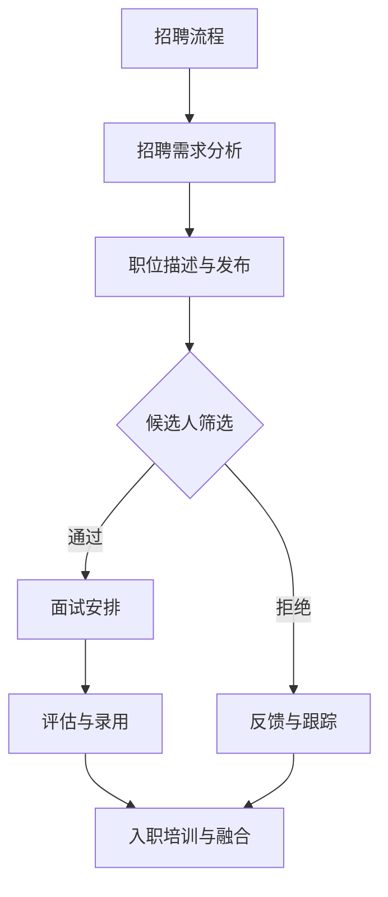
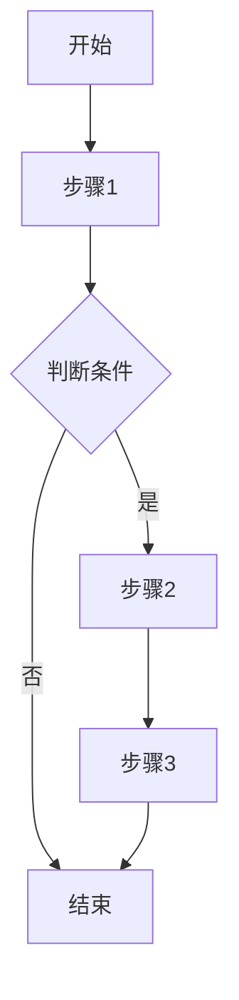

                 

### 文章标题

# 技术招聘与面试：P9工程师的团队构建之道

> 关键词：P9工程师、团队构建、技术招聘、面试技巧、领导力

> 摘要：本文将深入探讨技术招聘与面试的方方面面，特别是针对P9工程师这一高级职位的团队构建策略。文章将从招聘策略与团队建设、招聘流程与技巧、面试准备、技术面试、行为面试、团队组建与组织结构、领导力与团队管理、团队协作与沟通等多个方面展开，旨在为读者提供系统、实用的指导，帮助企业和面试官高效地选拔和培养P9级别的技术人才。

----------------------------------------------------------------

### 第一部分：理解招聘与面试

#### 第1章：招聘策略与团队建设

在技术高速发展的今天，企业对高级技术人才的需求日益增长，特别是P9工程师这样的顶尖人才。招聘策略与团队建设是实现企业技术领先的关键环节。

- **1.1 招聘的重要性与目标**

  招聘不仅仅是一个人力资源的过程，更是企业技术创新和持续发展的重要保障。一个高效的招聘流程能够为企业筛选出最合适的人才，从而为团队建设奠定坚实的基础。

  - **招聘流程的关键环节**：从招聘需求的提出、职位描述的撰写、招聘渠道的选择、简历筛选、面试安排到最终录用，每一个环节都至关重要。
  - **团队建设的目标与挑战**：团队建设的目标是构建一个高效、协同、富有创新精神的团队。然而，在这个过程中，企业将面临人才匹配、团队文化塑造、管理挑战等多重考验。

- **1.2 P9工程师的职业定位**

  P9工程师是企业技术团队中的顶级专家，通常具备深厚的技术功底、丰富的项目经验以及卓越的领导能力。

  - **P9工程师的能力模型**：P9工程师不仅需要具备扎实的技术背景，还需要有深入理解行业发展趋势、能够带领团队攻克技术难题的能力。
  - **P9工程师在团队中的角色与影响力**：作为团队的核心成员，P9工程师不仅要在技术层面上起到引领作用，还需要在团队管理和决策过程中发挥关键作用，推动团队的整体发展。

#### 第2章：招聘流程与技巧

- **2.1 招聘流程概述**

  招聘流程是确保企业能够选拔到合适人才的关键步骤。一个高效的招聘流程需要系统性地设计，并贯穿于整个招聘过程。

  - **招聘流程的各个阶段**：包括职位描述的撰写、招聘渠道的选择、简历筛选、面试安排、评估与录用等。
  - **常见的招聘渠道**：包括内部推荐、外部招聘平台、社交媒体、招聘会等。每个渠道都有其优势和局限性，企业应根据自身需求选择合适的渠道。

- **2.2 面试技巧与策略**

  面试是招聘流程中最为关键的一环，面试官的技巧和策略直接影响到招聘结果。

  - **面试官的角色与职责**：面试官需要具备专业知识和沟通能力，能够通过面试全面评估应聘者的技术能力和综合素质。
  - **面试准备与技巧**：面试前的准备工作包括准备面试问题、了解应聘者背景等。面试过程中，面试官需要掌握有效提问技巧、倾听能力和评估能力。

#### 第3章：面试准备

- **3.1 面试官的角色**

  面试官在招聘过程中扮演着至关重要的角色，他们的职责和能力直接影响到招聘的成功与否。

  - **面试官的职责与能力**：面试官需要具备技术专业能力、沟通技巧、评估能力和时间管理能力。他们需要能够准确判断应聘者的技术水平、团队合作能力和领导潜力。
  - **面试官的自我提升**：面试官需要不断学习最新的技术趋势和面试技巧，通过参加培训、研讨会和实践来提升自身能力。

- **3.2 面试问题设计与分析**

  面试问题的设计和分析是面试成功的关键。

  - **面试问题的类型与设计**：面试问题可以分为技术问题、行为问题、情境问题等。面试官需要根据职位需求和应聘者的背景设计合适的问题。
  - **面试问题的分析与应用**：面试官需要通过问题的分析来了解应聘者的技术深度、思维方式和团队合作能力，从而做出准确的评估。

### 第二部分：团队构建与领导力

#### 第6章：团队组建与组织结构

- **6.1 团队组建的原则**

  团队组建是团队建设的第一步，一个成功的团队组建能够为企业带来高效协同的工作环境。

  - **人员匹配**：团队成员需要具备互补的技能和经验，以确保团队能够全面覆盖所需的技术和能力。
  - **团队文化的塑造**：团队文化是团队凝聚力的重要来源，企业需要通过价值观、行为准则等来塑造团队文化，增强团队认同感。

- **6.2 组织结构设计**

  组织结构设计直接影响到团队的工作效率和团队协作。

  - **矩阵式结构与职能式结构**：不同的组织结构具有不同的优势和应用场景，企业需要根据自身需求选择合适的结构。
  - **团队规模的优化**：团队规模的大小需要根据项目需求和团队工作负荷来动态调整，以确保团队高效运作。

#### 第7章：领导力与团队管理

- **7.1 领导力的定义与要素**

  领导力是团队管理中的核心要素，优秀的领导力能够激发团队的潜力，实现团队的目标。

  - **领导风格与影响力**：不同的领导风格对团队的影响不同，领导力的影响不仅体现在技术能力上，还包括对团队氛围和员工成长的引领。
  - **领导力的发展与提升**：领导力不是一成不变的，通过学习、实践和反思，领导力可以不断提升。

- **7.2 团队激励与绩效管理**

  团队激励和绩效管理是团队管理的重要环节，有效的激励和绩效管理能够提高团队的士气和效率。

  - **绩效评估的方法与工具**：绩效评估需要科学合理，能够全面反映员工的工作表现和能力发展。
  - **团队激励的策略与实践**：激励策略需要多样化，结合员工的需求和特点进行个性化激励，以激发员工的积极性和创造力。

#### 第8章：团队协作与沟通

- **8.1 团队协作的关键要素**

  团队协作是实现团队目标的关键，有效的协作能够提高团队的工作效率和创新能力。

  - **沟通的有效性**：沟通是团队协作的基础，有效的沟通能够确保团队成员之间的信息传递准确无误。
  - **冲突管理的策略**：冲突是团队协作中的常见现象，有效的冲突管理能够化解团队矛盾，促进团队和谐。

- **8.2 沟通技巧的提升**

  沟通技巧的提升能够提高团队成员之间的沟通效果，增强团队协作。

  - **非语言沟通的应用**：非语言沟通在沟通中扮演着重要角色，包括肢体语言、面部表情等。
  - **情景模拟与沟通培训**：通过情景模拟和沟通培训，团队成员能够提高沟通能力和应对复杂情况的能力。

### 第三部分：招聘与面试实战

#### 第9章：实战案例解析

- **9.1 案例背景**

  通过实际案例的解析，读者可以更直观地了解招聘与面试的实战操作。

  - **招聘目标与挑战**：案例中企业面临的招聘目标和遇到的挑战。
  - **招聘策略与实施**：案例中企业采取的招聘策略和实施的招聘流程。

- **9.2 招聘策略与实施**

  通过实战案例，读者可以更深入地了解招聘策略的实施过程。

  - **筛选过程与策略**：案例中的简历筛选标准和策略。
  - **面试流程与结果分析**：案例中的面试流程和面试结果分析。

#### 第10章：面试官经验分享

- **10.1 面试官的心得体会**

  面试官通过分享自己的心得体会，读者可以了解到面试过程中的经验和教训。

  - **面试中的成功与失败**：面试官在面试过程中遇到的成功案例和失败案例。
  - **经验总结与分享**：面试官总结的经验和教训，以及对未来面试官的建议。

- **10.2 面试技巧的提升**

  面试官通过分享自己的经验，帮助读者提升面试技巧。

  - **技巧的提升**：面试官分享的提升面试技巧的方法和经验。
  - **实践建议**：面试官对读者提出的实践建议。

#### 第11章：招聘与面试工具

- **11.1 常用招聘工具**

  招聘工具的使用能够提高招聘效率和效果。

  - **招聘平台与社交媒体的应用**：案例中企业使用的招聘平台和社交媒体。
  - **招聘效果评估**：如何评估招聘平台和社交媒体的效果。

- **11.2 面试技术工具**

  面试技术工具的使用能够提高面试效率和效果。

  - **编程题库与面试评估系统**：案例中企业使用的编程题库和面试评估系统。
  - **面试结果分析**：如何通过面试技术工具分析面试结果。

## 附录

### 附录 A：招聘与面试资源列表

- **A.1 招聘网站与平台**

  - **国内招聘网站**：如智联招聘、前程无忧、猎聘等。
  - **国际招聘网站**：如LinkedIn、Indeed、Glassdoor等。

- **A.2 面试准备资料**

  - **编程语言学习资源**：如LeetCode、牛客网等。
  - **面试技巧与经验分享**：如《程序员面试金典》、《面试之道》等。

### 附录 B：常用面试问题与答案

- **B.1 编程面试问题**

  - **数据结构与算法题库**：包括数组、链表、树、图等数据结构和排序、查找、动态规划等算法题目。

- **B.2 行为面试问题**

  - **团队合作与沟通能力题库**：包括团队合作经验、沟通挑战及解决方法等行为问题。

### 附录 C：团队建设与管理案例

- **C.1 团队组建案例分析**

  - **团队建设成功的案例分享**：分享成功的团队组建经验和策略。

- **C.2 团队管理案例分析**

  - **团队管理中的挑战与应对策略**：分析团队管理中的挑战及应对策略。

### Mermaid 流程图



### 核心概念关系架构

核心概念关系架构是理解招聘与面试的重要工具。以下是核心概念关系架构的详细描述：

- **招聘流程**：包括招聘需求分析、职位描述与发布、候选人筛选、面试安排、评估与录用、入职培训与融合等环节。
- **职位描述**：明确职位职责、要求、工作环境等，作为招聘的基础。
- **候选人筛选**：根据职位描述筛选合适的候选人，通常包括简历筛选和初步面试。
- **面试安排**：根据候选人的情况安排面试时间、地点和形式。
- **评估与录用**：通过面试全面评估候选人的技术能力和综合素质，做出录用决策。
- **入职培训与融合**：帮助新员工快速适应公司文化和工作环境，确保其顺利融入团队。

### 数据结构与算法原理讲解

- **数据结构**：数据结构是计算机存储、组织数据的方式。常见的有数组、链表、栈、队列、树和图等。
  - **数组**：一种线性数据结构，用于存储一系列元素，支持随机访问。
  - **链表**：一种线性数据结构，由节点组成，每个节点包含数据和指向下一个节点的指针。
  - **栈**：一种后进先出（LIFO）的数据结构，支持插入和删除操作。
  - **队列**：一种先进先出（FIFO）的数据结构，支持插入和删除操作。
  - **树**：一种非线性数据结构，由节点和边组成，用于表示层次关系。
  - **图**：一种由节点和边组成的数据结构，用于表示对象之间的关系。

- **算法**：算法是一系列解决问题的步骤，用于解决问题或执行特定任务。常见的有排序、查找、动态规划和分治等。
  - **排序**：用于将一组数据按照特定顺序排列。
  - **查找**：用于在数据集合中查找特定元素。
  - **动态规划**：一种解决复杂问题的方法，通过将问题分解为子问题并保存子问题的解来优化计算。
  - **分治**：一种解决复杂问题的方法，通过将问题分解为子问题并递归解决来简化计算。

### 数学模型与公式

在技术面试中，数学模型和公式是评估应聘者逻辑思维和数学能力的重要工具。以下是一些常见的数学模型和公式：

- **排序算法的时间复杂度**：
  - 冒泡排序：\(O(n^2)\)
  - 选择排序：\(O(n^2)\)
  - 插入排序：\(O(n^2)\)
  - 快速排序：\(O(n \log n)\)
  - 归并排序：\(O(n \log n)\)

- **二分查找的时间复杂度**：
  - \(O(\log n)\)

- **动态规划的状态转移方程**：
  - \(f(n) = f(n-1) + f(n-2)\)
  - \(f(n) = \sum_{i=1}^{k} f(i) \times g(n-i)\)

- **数据结构容量计算**：
  - 栈和队列的容量：\(C = \max \{ a_1, a_2, \ldots, a_n \}\)
  - 树的高度：\(h = \log n\)

### 系统分析与架构设计方案

在构建一个高效、可扩展的系统时，系统分析与架构设计方案是至关重要的。以下是一个系统分析与架构设计方案的基本框架：

- **问题场景介绍**：
  - 介绍系统需要解决的问题场景，包括业务需求、性能要求、安全需求等。

- **项目介绍**：
  - 介绍项目的背景、目标、功能模块、技术栈等。

- **系统功能设计（领域模型类图）**：
  - 通过领域模型类图来描述系统的功能模块、实体关系和数据流。

- **系统架构设计（架构图）**：
  - 通过架构图来描述系统的整体架构，包括前端、后端、数据库、中间件等。

- **系统接口设计**：
  - 描述系统提供的接口，包括API接口、服务接口等。

- **系统交互（序列图）**：
  - 通过序列图来描述系统的交互流程，包括用户请求、系统响应等。

### 项目实战

在技术招聘与面试的过程中，实战项目是评估应聘者实际能力的重要依据。以下是一个基于Python的项目实战案例：

- **环境安装**：
  - 安装Python环境、必要的库（如requests、BeautifulSoup等）。

- **系统核心实现源代码**：

  ```python
  import requests
  from bs4 import BeautifulSoup
  
  def fetch_data(url):
      response = requests.get(url)
      if response.status_code == 200:
          return BeautifulSoup(response.content, 'html.parser')
      else:
          return None
  
  def parse_data(soup):
      articles = soup.find_all('article')
      data = []
      for article in articles:
          title = article.find('h2').text
          link = article.find('a')['href']
          data.append({'title': title, 'link': link})
      return data
  
  def main():
      url = 'https://example.com'
      soup = fetch_data(url)
      if soup:
          data = parse_data(soup)
          for item in data:
              print(item['title'], item['link'])
  
  if __name__ == '__main__':
      main()
  ```

- **代码应用解读与分析**：
  - 代码首先定义了三个函数：`fetch_data`、`parse_data`和`main`。
  - `fetch_data`函数用于从指定的URL获取HTML内容。
  - `parse_data`函数用于解析HTML内容，提取文章标题和链接。
  - `main`函数是程序的入口，调用`fetch_data`和`parse_data`函数，并打印提取的数据。

- **实际案例分析和详细讲解剖析**：
  - 以一个实际的网站为例，演示如何使用上述代码从网站中提取文章标题和链接。
  - 详细分析代码的结构和逻辑，解释每个函数的作用和调用关系。

- **项目小结**：
  - 总结项目实现过程中的关键点和难点，以及如何解决这些问题。
  - 提出对未来改进和扩展的思考。

### 最佳实践 Tips、小结、注意事项、拓展阅读

- **最佳实践 Tips**：
  - 在招聘过程中，明确职位需求和评估标准。
  - 在面试过程中，注重沟通技巧和逻辑思维。
  - 在团队管理中，注重员工发展和团队氛围。

- **小结**：
  - 技术招聘与面试是一个复杂的过程，需要综合考虑职位需求、候选人素质和团队文化。
  - 高级职位的招聘和团队建设更需注重长期规划和发展。

- **注意事项**：
  - 避免过分追求技术能力而忽视团队合作和沟通能力。
  - 注意面试过程中的公平性和透明性，避免主观偏见。

- **拓展阅读**：
  - 《程序员面试金典》
  - 《团队协作的艺术》
  - 《技术团队管理实践》

### 作者信息

作者：AI天才研究院/AI Genius Institute & 禅与计算机程序设计艺术 /Zen And The Art of Computer Programming

---

在撰写技术博客时，明确的结构和逻辑思维是关键。以下是对文章各个部分的详细内容和结构要求：

#### 文章标题

文章标题应该简洁明了，能够准确反映文章的主题。例如，《技术招聘与面试：P9工程师的团队构建之道》既指明了文章的主题（技术招聘与面试），又明确了目标读者（P9工程师）和文章的核心内容（团队构建）。

#### 关键词

关键词是文章的核心内容摘要，通常包括5-7个能够反映文章主题和内容的词汇。例如：“技术招聘、面试技巧、P9工程师、团队建设、领导力、团队管理”。

#### 摘要

摘要部分应该简短地概括文章的核心内容和主题思想。例如：“本文深入探讨技术招聘与面试的各个方面，特别是针对P9工程师的团队构建策略，提供系统、实用的指导，帮助企业和面试官高效选拔和培养顶尖技术人才。”

#### 目录大纲结构

目录大纲是文章结构的核心，它需要逻辑清晰、层次分明。以下是对每个章节的具体要求：

1. **第一部分：理解招聘与面试**

   - **第1章：招聘策略与团队建设**
     - 内容要求：介绍招聘策略的重要性，以及如何通过团队建设实现企业目标。包括招聘流程的关键环节和团队建设的目标与挑战。
     - 核心概念与联系：招聘流程、团队建设、人员匹配、团队文化。

   - **第2章：招聘流程与技巧**
     - 内容要求：详细解析招聘流程的各个阶段，包括职位描述的撰写、简历筛选、面试安排等。同时介绍面试技巧和策略。
     - 核心概念与联系：招聘流程、简历筛选、面试技巧、面试策略。

   - **第3章：面试准备**
     - 内容要求：讨论面试官的角色和职责，以及如何设计面试问题。包括面试官的自我提升和面试问题的分析。
     - 核心概念与联系：面试官、面试问题设计、自我提升。

2. **第二部分：团队构建与领导力**

   - **第4章：技术面试**
     - 内容要求：探讨技术面试的各个方面，包括编程面试技巧、数据结构与算法等。提供实用的面试问题和解答。
     - 核心概念与联系：编程面试、数据结构、算法、面试问题。

   - **第5章：行为面试**
     - 内容要求：介绍行为面试的方法和技巧，包括星型模型（STAR）的应用。讨论团队合作与沟通能力的重要性。
     - 核心概念与联系：行为面试、STAR模型、团队合作、沟通技巧。

   - **第6章：团队组建与组织结构**
     - 内容要求：讨论团队组建的原则和组织结构设计。包括人员匹配、团队文化塑造和团队规模优化。
     - 核心概念与联系：团队组建、组织结构、人员匹配、团队文化。

   - **第7章：领导力与团队管理**
     - 内容要求：阐述领导力的定义、要素和发展。讨论团队激励与绩效管理的方法和实践。
     - 核心概念与联系：领导力、领导风格、团队管理、绩效管理。

   - **第8章：团队协作与沟通**
     - 内容要求：探讨团队协作的关键要素和沟通技巧。包括非语言沟通的应用和沟通培训。
     - 核心概念与联系：团队协作、沟通技巧、非语言沟通、沟通培训。

3. **第三部分：招聘与面试实战**

   - **第9章：实战案例解析**
     - 内容要求：通过实际案例，详细解析招聘策略的实施过程和面试技巧的应用。
     - 核心概念与联系：招聘策略、面试技巧、案例解析。

   - **第10章：面试官经验分享**
     - 内容要求：分享面试官的心得体会和经验总结，为读者提供实战建议。
     - 核心概念与联系：面试官经验、实战建议。

   - **第11章：招聘与面试工具**
     - 内容要求：介绍常用的招聘和面试工具，包括招聘平台、社交媒体和面试评估系统。
     - 核心概念与联系：招聘工具、面试工具。

#### 附录

- **附录 A：招聘与面试资源列表**
  - 内容要求：列出常用的招聘网站与平台，以及面试准备资料。

- **附录 B：常用面试问题与答案**
  - 内容要求：提供编程面试和行为面试的问题与答案。

- **附录 C：团队建设与管理案例**
  - 内容要求：分享团队建设成功的案例和管理挑战的应对策略。

#### Mermaid 流程图

Mermaid流程图是一种用于绘制流程图的Markdown扩展。以下是一个简单的流程图示例：



通过上述结构和内容要求，可以确保文章逻辑清晰、内容丰富，同时能够满足读者的阅读需求和专业知识提升。在撰写过程中，需要逐步展开每个章节，详细阐述核心概念、原理和实践，确保文章具有深度和实用性。同时，注意使用合适的图表、公式和代码示例，以增强文章的可读性和易懂性。

