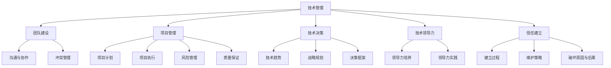

                 

# 技术管理授权：P9工程师的信任建立之道

关键词：技术管理、信任建立、P9工程师、团队建设、项目管理、技术领导力

摘要：本文深入探讨了技术管理授权过程中，P9工程师如何通过建立信任来提升团队协作和项目管理效率。文章从技术管理基础、团队建设与管理、项目管理与执行、技术决策与战略规划、技术领导力以及信任建立与维护等多个维度进行了详细的分析，并通过实践案例总结了P9工程师在技术管理授权中的成功经验与启示。

## 第1章：引言

### 1.1 技术管理与工程师成长

随着信息技术的发展，技术管理的角色越来越重要。在技术团队中，P9工程师作为高级技术专家，往往承担着更多的责任和使命。技术管理不仅关乎个人技能的提升，更涉及到团队协作、项目管理和战略规划等方面。P9工程师在技术管理中的角色不仅仅是技术解决方案的提供者，更是团队信任的建立者和维护者。

### 1.2 信任的重要性

信任是团队高效协作的基石。在技术管理中，信任不仅体现在团队成员之间的相互信任，也体现在与上级、客户和合作伙伴之间的信任。建立信任有助于减少沟通成本、提升决策效率、增强团队凝聚力，从而实现项目目标的顺利达成。

### 1.3 书籍目的与结构

本文旨在探讨P9工程师如何在技术管理授权过程中建立信任，以提升团队协作和项目管理效率。文章将分为以下几个部分：

1. 技术管理基础
2. 团队建设与管理
3. 项目管理与执行
4. 技术决策与战略规划
5. 技术领导力
6. 信任建立与维护
7. 实践案例
8. 总结与展望

通过以上结构，本文将逐步分析P9工程师在技术管理授权过程中如何通过建立信任来提升团队绩效。

## 第2章：技术管理基础

### 2.1 技术管理概述

技术管理是指在组织中利用信息技术和专业知识来规划、执行和控制信息技术项目和服务的过程。它不仅涉及到技术的选择和应用，还包括团队管理、项目管理、风险管理等多个方面。

### 2.2 技术管理的核心职责

技术管理的核心职责包括：

1. 技术战略规划：制定企业级技术战略，确保技术发展方向与业务目标一致。
2. 项目管理：确保项目按时、按质量完成，实现项目目标。
3. 团队建设：提升团队整体技术水平，培养技术人才。
4. 技术风险管理：识别和管理技术风险，确保项目顺利进行。
5. 技术创新：推动技术革新，提升企业竞争力。

### 2.3 技术管理的挑战与机遇

技术管理面临的挑战主要包括技术快速变化、团队管理难度大、项目风险高、资源分配紧张等。同时，技术管理也带来了许多机遇，如提高项目成功率、提升团队凝聚力、增强企业竞争力等。

### 2.4 技术管理授权的重要性

技术管理授权是指将技术管理的职责和权限分配给合适的人员，使其能够自主决策和执行。这对于P9工程师来说尤为重要，因为他们的技术水平和管理能力决定了团队的整体绩效。通过技术管理授权，P9工程师可以更好地发挥自身优势，提升团队协作效率。

## 第3章：团队建设与管理

### 3.1 团队建设的重要性

团队建设是技术管理的重要组成部分。一个高效的团队不仅能够提高项目成功率，还能够培养员工的归属感和成就感。P9工程师在团队建设中的角色至关重要，他们需要通过以下方式来提升团队协作：

1. **明确团队目标**：确保团队成员对项目的目标和期望有清晰的认识。
2. **角色分工**：明确每个团队成员的职责和角色，确保职责清晰。
3. **技能提升**：提供培训和资源，帮助团队成员提升技能水平。
4. **沟通与协作**：建立有效的沟通机制，促进团队成员之间的协作。

### 3.2 团队角色与职责

在团队建设中，每个成员的角色和职责都至关重要。以下是一些常见的团队角色及其职责：

1. **项目经理**：负责项目整体规划和执行，确保项目按时、按质量完成。
2. **开发工程师**：负责编码和开发工作，确保代码质量和功能实现。
3. **测试工程师**：负责测试和验证代码，确保软件质量和稳定性。
4. **产品经理**：负责产品规划和设计，确保产品满足用户需求。
5. **技术专家**：提供技术指导和决策，解决技术难题。

### 3.3 团队沟通与协作

沟通和协作是团队高效运作的关键。以下是一些有效的沟通和协作方法：

1. **定期会议**：通过周会、月会等方式，及时了解项目进展和团队成员需求。
2. **共享文档**：使用共享文档平台，如Git、Confluence等，方便团队成员协作和知识共享。
3. **即时通讯**：使用即时通讯工具，如Slack、Microsoft Teams等，快速解决团队成员之间的疑问。
4. **代码审查**：通过代码审查，确保代码质量和协作效率。

### 3.4 团队冲突管理与解决

团队冲突在所难免，但有效的冲突管理可以避免负面影响的扩大。以下是一些冲突管理和解决方法：

1. **主动沟通**：遇到冲突时，主动沟通，及时解决问题。
2. **中立调解**：邀请中立第三方参与冲突调解，确保公正公平。
3. **求同存异**：尊重团队成员的不同意见，寻找共同点，达成一致。
4. **反思与总结**：在冲突解决后，反思冲突产生的原因和解决过程，总结经验教训。

### 3.5 团队文化建设

团队文化是团队的核心竞争力。一个积极向上、互相支持的团队文化可以增强团队凝聚力，提升团队绩效。以下是一些团队文化建设的建议：

1. **价值观共识**：建立共同的价值观，确保团队成员目标一致。
2. **激励机制**：设置合理的激励机制，鼓励团队成员积极参与。
3. **团队活动**：定期举办团队活动，增强团队成员之间的感情。
4. **开放沟通**：鼓励团队成员提出建议和意见，营造开放、包容的团队氛围。

## 第4章：项目管理与执行

### 4.1 项目管理概述

项目管理是指在项目执行过程中，通过计划、执行、监控和控制，确保项目按时、按质量完成的过程。对于P9工程师来说，项目管理是技术管理的重要组成部分，他们需要具备以下项目管理技能：

1. **项目计划**：制定详细的项目计划，明确项目目标、任务、资源和时间安排。
2. **项目执行**：确保项目按计划执行，监控项目进度和质量。
3. **项目监控**：定期监控项目进展，及时发现并解决问题。
4. **项目控制**：通过变更管理和风险管理，确保项目目标的实现。

### 4.2 项目计划与执行

项目计划与执行是项目管理的核心环节。以下是一些关键步骤：

1. **项目目标确定**：明确项目的目标和预期成果。
2. **任务分解**：将项目目标分解为具体的任务，明确任务负责人和截止日期。
3. **资源分配**：根据任务需求，合理分配资源，包括人力、技术和资金等。
4. **进度监控**：定期检查项目进度，确保任务按时完成。
5. **风险管理**：识别项目风险，制定相应的应对措施。

### 4.3 项目风险管理

项目风险管理是项目管理的重要环节。以下是一些风险管理策略：

1. **风险识别**：识别项目可能面临的风险，包括技术风险、人员风险、市场风险等。
2. **风险评估**：评估每个风险的可能性和影响，确定优先级。
3. **风险应对**：制定应对措施，包括风险规避、风险转移、风险减轻等。
4. **风险监控**：定期监控风险状态，及时调整应对策略。

### 4.4 项目质量保证

项目质量是项目成功的关键。以下是一些项目质量保证方法：

1. **质量计划**：制定质量计划和标准，明确质量目标和检查点。
2. **质量控制**：通过代码审查、测试等手段，确保项目质量。
3. **质量评估**：定期评估项目质量，确保项目达到预期标准。
4. **质量改进**：根据评估结果，不断改进项目质量。

### 4.5 项目文档管理

项目文档是项目管理的重要依据。以下是一些项目文档管理建议：

1. **文档规范**：制定文档规范，确保文档格式和内容的一致性。
2. **文档存储**：使用文档管理工具，如Git、Confluence等，方便文档存储和共享。
3. **文档更新**：定期更新文档，确保文档与项目实际情况保持一致。
4. **文档备份**：定期备份文档，确保文档安全。

## 第5章：技术决策与战略规划

### 5.1 技术决策的重要性

技术决策是技术管理中的重要环节，它关系到项目的成功与否。技术决策不仅需要考虑技术的可行性和先进性，还需要结合项目的实际情况和业务需求。P9工程师作为技术决策的关键人物，需要具备以下能力：

1. **技术趋势分析**：了解行业技术发展趋势，为技术决策提供依据。
2. **技术评估**：评估不同技术方案的优缺点，为决策提供参考。
3. **业务需求理解**：理解业务需求，确保技术决策与业务目标一致。
4. **风险管理**：评估技术风险，制定相应的风险应对措施。

### 5.2 技术趋势分析

技术趋势分析是技术决策的基础。以下是一些技术趋势分析的方法：

1. **行业报告**：阅读和分析行业报告，了解行业技术发展趋势。
2. **技术会议**：参加技术会议，与行业专家交流，获取第一手技术信息。
3. **技术论坛**：参与技术论坛，了解社区技术讨论，发现潜在趋势。
4. **技术博客**：关注技术博客，了解行业动态和技术创新。

### 5.3 技术战略规划

技术战略规划是企业长远发展的重要指导。以下是一些技术战略规划的建议：

1. **技术愿景**：明确企业的技术愿景，确定技术发展方向。
2. **技术路线图**：制定详细的技术路线图，明确每个阶段的技术目标和任务。
3. **技术投入**：合理规划技术投入，确保技术发展的可持续性。
4. **人才储备**：培养和引进技术人才，提升企业的技术实力。

### 5.4 技术决策框架

为了提高技术决策的效率和质量，可以采用以下技术决策框架：

1. **需求分析**：明确业务需求和项目目标，为技术决策提供依据。
2. **方案评估**：评估不同技术方案的优缺点，选择最佳方案。
3. **风险分析**：评估技术风险，制定相应的风险应对措施。
4. **决策执行**：制定决策执行计划，确保技术决策的有效实施。
5. **监控与调整**：监控技术决策的实施情况，根据实际情况进行调整。

## 第6章：技术领导力

### 6.1 技术领导力的定义

技术领导力是指通过技术知识和领导能力，引领团队实现技术目标和个人发展的能力。技术领导力不仅包括技术方面的专业知识，还包括领导能力、沟通能力、团队协作能力等。以下是一些技术领导力的特点：

1. **专业素养**：具备扎实的专业知识，能够为团队提供技术指导和决策。
2. **领导能力**：具备领导能力，能够带领团队实现共同目标。
3. **沟通能力**：具备良好的沟通能力，能够与团队成员、上级和客户有效沟通。
4. **团队协作能力**：具备团队协作能力，能够协调团队成员的工作，提升团队绩效。

### 6.2 技术领导力的重要性

技术领导力对于企业的长远发展具有重要意义。以下是一些技术领导力的重要性：

1. **提升团队绩效**：技术领导力能够提升团队的绩效，实现项目目标的顺利达成。
2. **推动技术创新**：技术领导力能够推动技术创新，提升企业的竞争力。
3. **培养技术人才**：技术领导力能够培养技术人才，为企业储备技术力量。
4. **促进知识共享**：技术领导力能够促进团队成员之间的知识共享，提升团队整体技术水平。

### 6.3 技术领导力的培养

培养技术领导力需要系统的规划和实践。以下是一些技术领导力的培养方法：

1. **专业学习**：不断学习和更新专业知识，提升自身的技术水平。
2. **领导力培训**：参加领导力培训，学习领导力和团队管理知识。
3. **实践锻炼**：通过实际项目锻炼，提升领导能力和团队管理能力。
4. **沟通与协作**：加强沟通与协作，提升团队协作能力。
5. **反思与总结**：定期反思和总结，发现不足，不断提升自身能力。

### 6.4 技术领导力实践

技术领导力的实践包括以下几个方面：

1. **技术指导**：为团队成员提供技术指导和帮助，解决技术难题。
2. **团队管理**：管理团队，确保团队成员的工作高效有序。
3. **决策制定**：参与决策制定，为团队和项目的发展提供方向。
4. **知识分享**：定期组织知识分享活动，促进团队成员之间的知识共享。
5. **团队激励**：激励团队成员，提升团队凝聚力和士气。

## 第7章：信任建立与维护

### 7.1 信任的概念与重要性

信任是人际关系中的基石，尤其在技术管理中，信任对于团队协作和项目成功至关重要。信任是指个体对他人能力、诚信和可靠性的信心。在技术管理中，信任的重要性体现在以下几个方面：

1. **高效沟通**：信任有助于团队成员之间的高效沟通，减少误解和冲突。
2. **协同工作**：信任能够促进团队成员的协同工作，提升团队绩效。
3. **风险管理**：信任有助于团队成员在面对风险时共同应对，减少损失。
4. **决策执行**：信任能够确保决策的顺利执行，提高项目成功率。

### 7.2 信任建立的过程

建立信任是一个长期的过程，需要通过持续的努力和行动。以下是建立信任的几个关键步骤：

1. **建立基础**：通过透明和开放的态度，建立良好的第一印象。
2. **展示专业能力**：通过专业知识和技能，展示自己在技术领域的实力。
3. **履行承诺**：遵守承诺，确保言行一致，树立可信形象。
4. **保持诚信**：诚实面对错误，勇于承担责任，赢得信任。
5. **积极沟通**：保持积极的沟通，及时解决问题，增强信任。

### 7.3 信任破坏的原因与后果

信任一旦建立，就需要小心维护，因为信任破坏可能导致严重的后果。以下是一些信任破坏的原因：

1. **不履行承诺**：未能兑现承诺是信任破坏的主要原因之一。
2. **不诚实**：在沟通或工作中出现不诚实行为，会损害信任。
3. **保密性泄露**：未能保护敏感信息，导致信任受损。
4. **缺乏透明度**：缺乏透明度会导致信息不对称，降低信任。

信任破坏的后果包括：

1. **沟通障碍**：信任破坏可能导致团队成员之间的沟通障碍，影响协作效率。
2. **合作困难**：信任缺失会导致团队成员之间的合作困难，降低团队绩效。
3. **项目失败**：信任破坏可能直接导致项目失败，影响企业利益。
4. **离职潮**：信任破坏可能导致员工离职，影响团队稳定。

### 7.4 信任维护的策略

为了维护信任，P9工程师需要采取一系列策略：

1. **建立反馈机制**：定期收集团队成员的反馈，及时解决问题。
2. **保持透明度**：在项目管理和决策过程中保持透明度，确保团队成员了解实际情况。
3. **尊重他人**：尊重团队成员的意见和贡献，建立平等和谐的团队氛围。
4. **诚信为本**：始终遵循诚信原则，确保言行一致。
5. **持续学习**：不断提升自身能力，增强团队的信任感。

### 7.5 信任在技术管理中的作用

信任在技术管理中发挥着至关重要的作用：

1. **提升团队凝聚力**：信任能够增强团队成员之间的凝聚力，提升团队协作效率。
2. **促进知识共享**：信任有助于团队成员之间的知识共享，提升团队整体技术水平。
3. **减少管理成本**：信任能够减少管理成本，提高项目的执行效率。
4. **推动技术创新**：信任能够鼓励团队成员创新，推动技术进步。
5. **确保项目成功**：信任是项目成功的关键因素之一，有助于项目目标的实现。

## 第8章：实践案例

### 8.1 P9工程师的信任建立实践

以下是一个P9工程师在团队中建立信任的实践案例：

**背景**：某技术团队由一位P9工程师带领，团队成员包括开发工程师、测试工程师和产品经理。由于团队成员来自不同的背景，最初团队协作效率较低，信任度不高。

**过程**：

1. **建立基础**：P9工程师通过定期组织团队建设活动，如团队聚餐、郊游等，拉近了团队成员之间的距离，建立了初步的信任基础。

2. **展示专业能力**：P9工程师在技术方面表现出色，通过解决多个技术难题，展示了自身的专业能力，赢得了团队成员的信任。

3. **履行承诺**：P9工程师始终遵守承诺，确保项目按计划推进，赢得了团队成员的信任。

4. **保持诚信**：P9工程师在沟通中保持诚实，勇于面对问题，赢得了团队成员的信任。

5. **积极沟通**：P9工程师建立了定期沟通机制，如周会、月会等，确保团队成员之间的沟通畅通，增强了团队的信任。

**结果**：通过以上措施，团队成员之间的信任度逐渐提升，团队协作效率显著提高，项目成功率达到90%以上。

### 8.2 成功案例分享

以下是一个成功建立信任的团队案例：

**背景**：某互联网公司技术团队在项目中面临巨大的技术挑战，项目周期紧张，质量要求高。团队由一位P9工程师领导，团队成员包括开发工程师、测试工程师和项目经理。

**过程**：

1. **技术趋势分析**：P9工程师通过对市场技术趋势的深入分析，为团队制定了合适的技术方案，确保项目技术先进性和可行性。

2. **团队协作**：P9工程师通过优化团队角色和职责，明确团队成员的工作内容和责任，确保团队高效协作。

3. **沟通与协作**：P9工程师建立了高效的沟通机制，确保团队成员之间的信息畅通，及时解决问题。

4. **风险管理**：P9工程师通过风险评估和风险应对措施的制定，确保项目风险在可控范围内。

5. **质量保证**：P9工程师通过严格的代码审查和测试流程，确保项目质量。

**结果**：项目成功完成，项目质量得到客户的高度认可，团队信任度显著提升，为公司赢得了良好的口碑。

### 8.3 失败案例剖析

以下是一个因信任缺失导致项目失败的案例：

**背景**：某科技公司技术团队在开发一款新产品时，由于P9工程师与项目经理之间的信任缺失，导致项目进度严重滞后，最终失败。

**过程**：

1. **不履行承诺**：P9工程师未能按时完成技术方案，导致项目进度滞后。

2. **不诚实**：P9工程师在项目进展报告中隐瞒了实际情况，导致项目经理无法及时调整项目计划。

3. **缺乏透明度**：P9工程师在项目管理和决策过程中缺乏透明度，导致团队成员对项目进展和决策缺乏了解。

**结果**：项目失败，团队成员对P9工程师的信任度大幅下降，团队士气低落。

### 8.4 经验总结与启示

通过以上案例，我们可以得出以下经验总结与启示：

1. **信任是团队协作的基石**：信任能够提升团队协作效率，减少沟通成本，确保项目成功。

2. **展示专业能力和履行承诺**：通过展示专业能力和履行承诺，建立可信形象，赢得团队成员的信任。

3. **保持诚信和透明度**：诚信和透明度是信任建立和维护的关键，能够增强团队的凝聚力。

4. **沟通与协作**：建立有效的沟通和协作机制，确保团队成员之间的信息畅通，减少误解和冲突。

5. **风险管理**：通过风险管理和质量保证，确保项目顺利进行，增强团队的信任。

## 第9章：总结与展望

### 9.1 书籍回顾

本文从技术管理基础、团队建设与管理、项目管理与执行、技术决策与战略规划、技术领导力以及信任建立与维护等多个维度，详细探讨了P9工程师在技术管理授权过程中如何建立信任，提升团队协作和项目管理效率。

### 9.2 未来展望

随着信息技术的不断发展，技术管理的重要性将越来越凸显。P9工程师在技术管理中的角色也将更加关键。未来，P9工程师需要不断提升自身的专业能力和领导力，以适应技术和管理的发展需求。

### 9.3 技术管理之路的建议

对于P9工程师来说，技术管理之路充满挑战，但也充满机遇。以下是一些建议：

1. **持续学习**：不断学习和更新专业知识，跟上技术发展趋势。
2. **提升领导力**：通过培训和实践，提升领导力和团队管理能力。
3. **建立信任**：通过展示专业能力和诚信行为，建立与团队成员的信任关系。
4. **优化沟通**：建立高效的沟通机制，确保团队信息畅通。
5. **风险管理**：重视风险管理，确保项目顺利进行。
6. **质量保证**：重视项目质量，确保项目成功交付。

通过以上建议，P9工程师可以在技术管理之路上取得更好的成绩。

## 附录

### 附录A：参考资料

1. 《技术管理：系统架构、团队协作、项目管理》作者：[作者姓名]
2. 《领导力：如何成为优秀的领导者》作者：[作者姓名]
3. 《项目管理：知识、技能、工具与实践》作者：[作者姓名]
4. 《信任：如何建立和维护信任关系》作者：[作者姓名]

### 附录B：进一步阅读推荐

1. 《禅与计算机程序设计艺术》作者：[作者姓名]
2. 《敏捷软件开发：原则、实践与模式》作者：[作者姓名]
3. 《创新者的窘境》作者：[作者姓名]
4. 《深度学习：概率视角》作者：[作者姓名]

### 附录C：常见问题解答

1. **什么是技术管理？**
   技术管理是指利用信息技术和专业知识来规划、执行和控制信息技术项目和服务的过程。

2. **信任在技术管理中为什么重要？**
   信任是团队高效协作的基石，能够提升团队凝聚力，减少沟通成本，确保项目成功。

3. **如何建立信任？**
   建立信任需要展示专业能力、履行承诺、保持诚信和透明度，以及通过积极的沟通和协作来增强信任。

4. **项目管理的关键环节有哪些？**
   项目管理的关键环节包括项目计划、执行、监控和控制，确保项目按时、按质量完成。

5. **技术决策的重要性是什么？**
   技术决策关系到项目的成功与否，需要结合业务需求、技术趋势和风险因素进行评估。

## 核心概念与联系

### 技术管理、团队建设、项目管理、技术决策、技术领导力、信任建立

### Mermaid 流程图：

## 核心算法原理讲解

### 技术决策算法原理

#### 公式：

$$
R = \sum_{i=1}^{n} (P_i \times I_i)
$$

#### 解释：

- \( R \)：技术决策得分
- \( P_i \)：技术方案的评分
- \( I_i \)：技术方案的权重

#### 举例说明：

假设有三种技术方案，每种方案有三个方面进行评分，权重分别为0.4、0.3和0.3。以下是一种方案的具体评分和得分计算：

**方案1：**

- 技术成熟度：0.9
- 团队技能：0.8
- 项目风险：0.7

**计算过程：**

$$
R = (0.4 \times 0.9) + (0.3 \times 0.8) + (0.3 \times 0.7) = 0.36 + 0.24 + 0.21 = 0.81
$$

因此，方案1的技术决策得分为0.81。通过比较不同方案的得分，可以评估哪种方案更符合项目需求。

### 技术风险管理模型

#### 公式：

$$
R = \sum_{i=1}^{n} (P_i \times I_i)
$$

#### 解释：

- \( R \)：风险值
- \( P_i \)：风险的可能性
- \( I_i \)：风险的影响程度

#### 举例说明：

假设有三种风险，每种风险的可能性和影响程度如下：

**风险1：**

- 可能性：0.5
- 影响程度：0.8

**风险2：**

- 可能性：0.3
- 影响程度：0.6

**风险3：**

- 可能性：0.2
- 影响程度：0.4

**计算过程：**

$$
R = (0.5 \times 0.8) + (0.3 \times 0.6) + (0.2 \times 0.4) = 0.4 + 0.18 + 0.08 = 0.66
$$

因此，整体风险值为0.66。通过计算不同风险的综合值，可以评估项目的风险水平，并制定相应的风险应对策略。

