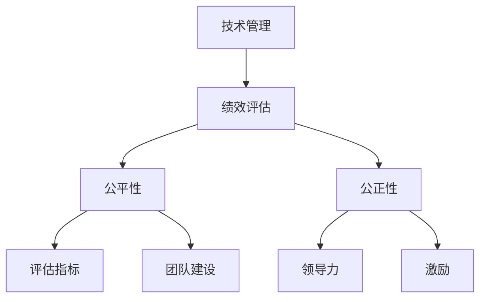
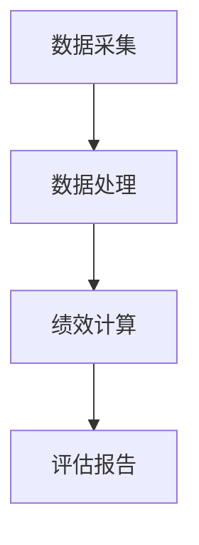
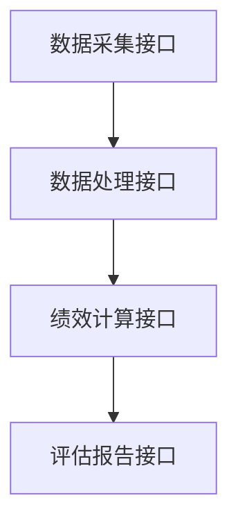
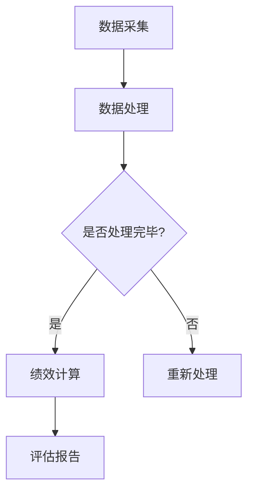

                 

### 文章标题：技术管理绩效评估：P9工程师的公平公正之道

### 关键词：技术管理，绩效评估，P9工程师，公平性，公正性

### 摘要：

技术管理绩效评估是现代企业中一项至关重要的工作，它不仅关系到员工的个人成长与职业发展，更影响着整个团队乃至公司的运作效率。本文将以P9工程师这一高级技术岗位为例，深入探讨技术管理绩效评估中的公平性与公正性。通过系统化的理论讲解、实际案例分析以及代码解读，本文旨在为从事技术管理工作的专业人士提供一种全面、可操作的绩效评估方法，以实现绩效评估的公平公正，促进技术团队的高效运作。

### 《技术管理绩效评估：P9工程师的公平公正之道》目录大纲

#### 第一部分：技术管理绩效评估的基础理论

##### 第1章：绩效评估概述
###### 1.1 绩效评估的定义与目的
###### 1.2 绩效评估的种类与方法
###### 1.3 绩效评估的流程与关键环节

##### 第2章：技术管理的核心概念
###### 2.1 技术管理的定义与作用
###### 2.2 技术管理的核心要素
###### 2.3 技ech管理的挑战与应对策略

##### 第3章：绩效评估中的公平性考量
###### 3.1 公平性在绩效评估中的重要性
###### 3.2 公平性原则与实际应用
###### 3.3 常见的不公平现象及其解决方法

##### 第4章：公正性在绩效评估中的应用
###### 4.1 公正性的概念与内涵
###### 4.2 公正性在绩效评估中的作用
###### 4.3 实现公正性的策略与实践

#### 第二部分：P9工程师的技术管理实践

##### 第5章：P9工程师的角色定位
###### 5.1 P9工程师的职责与要求
###### 5.2 P9工程师的职业发展路径
###### 5.3 P9工程师在技术管理中的独特优势

##### 第6章：绩效评估指标的设计与实施
###### 6.1 绩效评估指标的类型与选择
###### 6.2 指标权重分配与调整
###### 6.3 指标实施中的问题与解决方案

##### 第7章：绩效反馈与改进
###### 7.1 绩效反馈的方法与技巧
###### 7.2 绩效改进的策略与实施
###### 7.3 绩效评估体系的动态调整

#### 第三部分：公平公正之道

##### 第8章：团队建设与管理
###### 8.1 团队成员的角色与职责
###### 8.2 团队冲突的处理与解决
###### 8.3 团队协作与沟通技巧

##### 第9章：领导力与激励
###### 9.1 领导力的定义与要素
###### 9.2 激励理论在绩效评估中的应用
###### 9.3 激励策略的制定与实施

##### 第10章：绩效评估案例分析
###### 10.1 案例一：某互联网公司的绩效评估体系构建
###### 10.2 案例二：某技术团队的绩效改进实践
###### 10.3 案例三：跨部门协作中的绩效评估挑战与解决方案

#### 第四部分：附录与参考资源

##### 附录 A：绩效评估工具与方法

##### 附录 B：技术管理参考书籍与资源

##### 附录 C：常见问题解答

### 附录 A：核心概念与联系流程图



### 附录 B：核心算法原理讲解

#### 5.1 绩效评估中的数据预处理

```python
# 导入必要的库
import pandas as pd
import numpy as np

# 读取数据
data = pd.read_csv('performance_data.csv')

# 数据清洗
data.dropna(inplace=True)
data['score'] = data['score'].apply(lambda x: 1 if x > 0 else 0)

# 数据标准化
data = (data - data.mean()) / data.std()
```

#### 5.2 绩效评估中的加权评分模型

```python
# 设置权重
weights = {'score': 0.5, 'projects': 0.3, 'teamwork': 0.2}

# 计算加权得分
weighted_score = data['score'] * weights['score'] + data['projects'] * weights['projects'] + data['teamwork'] * weights['teamwork']
```

### 附录 C：数学模型和数学公式

#### 6.1 评估指标的权重分配

$$
w_i = \frac{v_i}{\sum_{j=1}^{n} v_j}
$$

其中，$w_i$ 是指标 $i$ 的权重，$v_i$ 是指标 $i$ 的得分，$n$ 是指标的总数。

#### 6.2 绩效得分计算公式

$$
S = \sum_{i=1}^{n} w_i \cdot s_i
$$

其中，$S$ 是总绩效得分，$w_i$ 是指标 $i$ 的权重，$s_i$ 是指标 $i$ 的得分。

### 附录 D：项目实战与代码解读

#### 7.1 项目实战：构建绩效评估系统

```python
# 更多代码解析与项目实战内容将在此章节详细阐述。
```

### 文章开头段落

在当今快速发展的信息技术时代，技术管理在企业中的角色愈发重要。技术管理不仅关乎企业的创新能力，更直接影响到企业运营效率和市场竞争能力。而技术管理绩效评估作为衡量技术团队工作成效的关键手段，其公平公正性直接决定了团队士气、工作效率和整体发展。本文将以P9工程师这一高级技术岗位为例，深入探讨技术管理绩效评估中的公平性与公正性，旨在为技术管理者提供一种全面、系统的评估方法，以促进技术团队的高效运作和企业的长远发展。

#### 绩效评估的定义与目的

绩效评估是一种系统性、定期性的过程，通过评估员工的实际工作表现与既定绩效目标之间的差距，从而为员工提供反馈、指导和发展机会。绩效评估的目的不仅在于识别和奖励优秀员工，还在于通过持续改进和反馈机制，提升整体团队的工作效率和企业竞争力。

在技术管理领域，绩效评估的重要性尤为突出。首先，技术团队是推动企业技术创新和业务拓展的核心力量，其工作效率和质量直接影响企业的技术实力和市场竞争力。其次，技术工作往往需要高度的专业技能和团队合作能力，因此，公平公正的绩效评估不仅能够激发员工的工作积极性，还能促进团队协作和知识共享。此外，绩效评估结果还直接影响员工的薪酬调整、晋升机会和职业发展路径，因此，确保绩效评估的公平公正，对于维护企业内部稳定和吸引优秀人才至关重要。

#### 绩效评估的种类与方法

绩效评估的种类多种多样，根据评估周期的不同，可以分为年度评估、季度评估、月度评估等；根据评估内容的不同，可以分为过程评估、结果评估、行为评估等。以下是一些常见的绩效评估方法：

1. **KPI（关键绩效指标）评估**：KPI评估是一种基于关键绩效指标的方法，通过对员工工作过程中关键指标的量化评估，来衡量其工作成效。KPI通常包括产出量、工作效率、项目进度等具体指标。

2. **360度评估**：360度评估是一种综合性的评估方法，通过收集来自员工上级、同事、下属以及客户的反馈，全面评估员工的工作表现。这种方法有助于从多个角度了解员工的优势和不足，提高评估的全面性和准确性。

3. **行为观察评估**：行为观察评估是基于员工在工作中的行为表现进行评估，通常由上级或人力资源部门直接观察和记录员工在工作中的行为表现，如团队合作、沟通能力、问题解决能力等。

4. **目标管理评估**：目标管理评估是基于员工设定的具体目标和工作计划，通过评估目标的完成情况来衡量绩效。这种方法强调员工自我管理和目标设定能力，有助于提高员工的主动性和责任感。

5. **平衡计分卡评估**：平衡计分卡评估是一种综合考虑财务、客户、内部流程、学习与成长四个维度的绩效评估方法，旨在实现企业的战略目标。这种方法强调绩效评估的全面性和长期性，有助于促进企业整体发展。

#### 绩效评估的流程与关键环节

一个完整的绩效评估流程通常包括以下几个关键环节：

1. **制定评估计划**：在绩效评估周期开始前，企业需要制定详细的评估计划，明确评估的目标、方法、时间安排等。评估计划的制定应该结合企业的战略目标和部门的工作重点。

2. **设定绩效目标**：根据评估计划，员工需要与上级共同设定具体的绩效目标。这些目标应该具有明确性、可衡量性、可实现性和相关性，即SMART原则。

3. **执行绩效评估**：在评估周期内，企业应定期收集和记录员工的绩效数据，可以通过工作日志、项目进度报告、绩效考核表等方式进行。评估过程中，应注重事实和数据支撑，避免主观臆断。

4. **反馈与沟通**：在评估周期结束时，上级应与员工进行一对一的绩效反馈面谈，详细说明评估结果、优势与不足，并提供具体的改进建议和资源支持。

5. **绩效改进**：根据反馈结果，员工应制定绩效改进计划，并在下一周期内实施。企业应提供必要的培训和资源支持，帮助员工提升绩效。

6. **评估结果应用**：绩效评估结果应应用于员工的薪酬调整、晋升机会、职业发展规划等，确保评估结果的有效应用。

#### 技术管理的定义与作用

技术管理是指在信息技术领域内，通过计划、组织、协调和控制等管理职能，确保技术项目的成功实施和技术团队的高效运作。技术管理不仅涉及技术本身，还包括项目管理、团队管理、风险控制等多个方面。

技术管理在企业发展中扮演着关键角色。首先，技术管理能够确保企业技术创新的有效性，通过合理规划和资源配置，推动企业技术项目的顺利进行，提升企业的技术竞争力。其次，技术管理有助于提升团队协作效率，通过明确团队职责、优化工作流程、提高沟通效果，使团队能够高效协同工作，实现共同目标。此外，技术管理还能够降低项目风险，通过风险识别、评估和控制，确保项目在预期时间内完成，并达到预期质量。

#### 技术管理的核心要素

技术管理的核心要素主要包括以下几个方面：

1. **项目管理**：项目管理是技术管理的核心，包括项目规划、执行、监控和收尾等全过程。良好的项目管理能够确保项目按计划推进，降低项目风险，提高项目成功率。

2. **团队管理**：团队管理涉及团队组建、团队协作、团队激励等环节。通过合理分工、明确职责、提高沟通效果，可以提升团队整体工作效率和绩效。

3. **技术能力**：技术能力是技术管理的基石，包括技术技能、专业知识、技术视野等。技术管理者需要具备深厚的技术背景和专业知识，才能更好地指导和推动团队工作。

4. **风险管理**：风险管理是技术管理的重要方面，包括风险识别、评估、控制和监控。通过有效的风险管理，可以降低项目风险，确保项目顺利进行。

5. **持续改进**：持续改进是技术管理的一种理念，通过不断反思和优化工作流程、技术方案，提升团队和技术项目的整体水平。

#### 技术管理的挑战与应对策略

技术管理面临诸多挑战，主要包括：

1. **技术快速变革**：随着技术的发展，新技术、新工具层出不穷，技术管理者需要不断学习和更新知识，以应对技术变革带来的挑战。

2. **项目复杂度高**：现代技术项目往往涉及多个领域和多个团队，项目复杂度较高，技术管理者需要具备良好的项目管理能力和团队协调能力。

3. **团队协作困难**：技术团队分散在不同地区甚至不同国家，团队协作面临沟通障碍、时差等问题，技术管理者需要通过有效的沟通工具和协作机制，提升团队协作效率。

4. **技术风险控制**：技术风险控制是技术管理的难点，技术管理者需要具备丰富的风险管理经验和技能，确保项目在风险可控范围内推进。

应对策略：

1. **持续学习与培训**：技术管理者应不断学习和更新知识，参加专业培训和研讨会，提升自身技术和管理能力。

2. **项目管理工具和方法**：采用先进的项目管理工具和方法，如敏捷开发、迭代开发等，提升项目管理效率和质量。

3. **团队协作机制**：建立有效的团队协作机制，如远程协作工具、定期团队会议等，确保团队高效协同工作。

4. **风险管理框架**：建立完善的风险管理框架，包括风险识别、评估、控制和监控等环节，确保项目风险可控。

### 公平性在绩效评估中的重要性

在绩效评估中，公平性是确保评估结果公正合理的基础。公平性不仅关乎员工的个人权益，还直接影响企业的整体运营效率和员工满意度。以下是公平性在绩效评估中的重要性和实现方法：

#### 公平性原则

1. **平等机会**：每个员工都应享有公平的评估机会，不受性别、年龄、种族、背景等因素的影响。

2. **透明性**：绩效评估过程和标准应透明，员工能够清楚了解评估指标和评估流程。

3. **客观性**：评估结果应基于客观、准确的数据和事实，避免主观臆断和偏见。

4. **一致性**：评估标准应一致，不同员工在相同工作表现下应得到相同的评估结果。

#### 实现方法

1. **制定明确的评估标准**：企业应制定详细的评估标准，明确绩效指标、评估方法和评估周期，确保评估过程的规范性和一致性。

2. **设立多维度的评估指标**：评估指标应涵盖员工的工作表现、能力提升、团队协作等多方面，避免单一维度的评估导致不公平现象。

3. **定期培训与沟通**：定期对评估人员进行培训，提高其评估能力和公平意识，同时加强员工与上级之间的沟通，确保评估过程的透明性和客观性。

4. **引入第三方评估**：在必要时，可以引入第三方评估机构，提供独立、客观的评估结果，增加评估的公信力。

#### 常见的不公平现象及其解决方法

1. **偏袒和偏见**：解决方法：建立严格的评估标准和流程，避免个人偏见和偏袒现象。

2. **评估标准不一致**：解决方法：确保评估标准在各部门、团队成员间一致，定期审查和调整评估标准。

3. **信息不对称**：解决方法：加强信息透明度，确保员工能够获取到与评估相关的所有信息和数据。

4. **评估周期不当**：解决方法：根据实际情况调整评估周期，确保评估与工作表现相匹配。

### 公正性的概念与内涵

公正性是绩效评估中另一个至关重要的原则，它不仅与公平性密切相关，而且在实践中具有独特的内涵和作用。公正性强调的是评估过程和结果的公正性，确保每个员工都能在一个公平、透明和没有偏见的氛围中接受评估。

#### 公正性的定义

公正性是指绩效评估过程中，对所有参与者的权利和机会给予平等的尊重和保护，确保评估结果的客观、真实和可信。公正性不仅体现在评估标准的制定和执行上，还体现在评估过程的监督和反馈机制中。

#### 公正性的内涵

1. **程序公正**：公正的程序是确保绩效评估公正性的基础。程序公正要求评估过程透明，评估标准和流程公开，确保员工对评估过程有充分的了解和参与。

2. **结果公正**：公正的结果是绩效评估的目标。结果公正要求评估结果基于客观、准确的数据和事实，不受主观因素影响，确保每个员工都能得到公正的评价。

3. **机会公正**：机会公正是公正性的核心。机会公正要求每个员工都有平等的机会展示自己的工作表现和潜力，不受不公正待遇的歧视。

#### 公正性在绩效评估中的作用

1. **增强员工信任**：公正的绩效评估能够增强员工对企业的信任和忠诚度，降低员工的不满意和抱怨，提升员工的工作积极性。

2. **提高团队协作**：公正的评估能够促进团队成员之间的信任和尊重，提高团队协作效率和凝聚力。

3. **优化人才选拔**：公正的绩效评估有助于企业准确识别和选拔优秀人才，为员工的晋升和发展提供公平的竞争环境。

#### 实现公正性的策略与实践

1. **制定明确的评估标准**：企业应制定详细、明确的评估标准，确保评估指标具有可操作性和可衡量性，减少评估的主观性和模糊性。

2. **建立多元化的评估团队**：通过组建多元化的评估团队，包括不同部门、不同层级的员工，确保评估过程的多样性和全面性。

3. **引入第三方评估**：在必要时，可以引入第三方专业机构进行独立评估，提高评估结果的公信力和权威性。

4. **定期审查和反馈**：定期审查评估标准和流程，收集员工反馈，不断优化评估体系，确保评估的公正性和有效性。

### P9工程师的角色定位

P9工程师，通常指的是公司中高级别的技术专家，他们在公司的技术架构、核心技术研发以及技术战略规划中扮演着至关重要的角色。以下是P9工程师的具体职责、职业发展路径及其在技术管理中的独特优势。

#### P9工程师的职责与要求

1. **技术领导力**：P9工程师需要具备卓越的技术领导力，能够带领团队解决复杂的技术问题，推动技术创新和项目实施。

2. **战略规划**：他们负责制定公司的技术战略和长期规划，确保公司的技术方向与业务目标相一致。

3. **团队管理**：P9工程师不仅要管理技术团队，还需要协调跨部门合作，确保项目顺利进行。

4. **技术决策**：在技术方案的选择和实施过程中，P9工程师需要做出关键决策，并对技术风险进行有效管理。

5. **知识传承**：P9工程师需要具备强大的知识传承能力，将自身的技术经验和专业知识传授给团队成员。

6. **持续学习**：P9工程师需要持续关注最新的技术动态，不断提升自己的技术水平和专业能力。

#### P9工程师的职业发展路径

1. **技术专家**：从初级工程师逐步晋升到高级工程师，积累丰富的技术经验。

2. **项目经理**：在项目中担任项目经理，负责项目规划、执行和监控。

3. **技术经理**：成为技术团队的负责人，负责团队建设和项目管理工作。

4. **高级技术专家**：担任公司技术委员会成员，参与公司技术战略的制定和实施。

5. **P9工程师**：成为公司技术领域的顶尖专家，负责公司的核心技术研发和战略规划。

#### P9工程师在技术管理中的独特优势

1. **技术深度**：P9工程师通常具有深厚的专业知识和技术背景，能够为技术决策提供有力支持。

2. **视野宽广**：他们不仅关注自身技术领域，还具备跨领域的视野，能够从全局角度审视技术问题。

3. **领导力强**：P9工程师通常具备出色的领导力，能够有效激励和引导团队成员，提升团队整体绩效。

4. **沟通能力强**：他们擅长与不同部门和层级的员工进行沟通，确保技术战略的有效执行。

5. **创新能力**：P9工程师具备较强的创新能力，能够在公司面临技术挑战时，提出创新性的解决方案。

### 绩效评估指标的设计与实施

绩效评估指标的设计与实施是绩效评估体系的核心环节，它直接影响到评估结果的准确性和公正性。对于P9工程师这一高级技术岗位，科学合理的绩效评估指标不仅能够客观反映其工作表现，还能激发其工作潜能，促进技术团队的整体发展。以下将详细探讨绩效评估指标的类型与选择、指标权重分配与调整，以及实施过程中可能遇到的问题与解决方案。

#### 绩效评估指标的类型与选择

绩效评估指标的类型多样，根据评估目标的不同，可以将其分为以下几类：

1. **结果性指标**：这类指标主要衡量员工的工作成果，如项目完成情况、代码质量、技术专利数量等。结果性指标直接反映了员工的工作产出，是绩效评估中的重要组成部分。

2. **过程性指标**：这类指标主要衡量员工在工作过程中的行为表现，如工作效率、团队协作、问题解决能力等。过程性指标有助于评估员工的工作态度和团队合作能力。

3. **能力性指标**：这类指标主要衡量员工的专业技能和知识水平，如技术熟练度、学习能力、创新能力等。能力性指标反映了员工的个人素质和发展潜力。

4. **行为性指标**：这类指标主要衡量员工在工作中的行为规范，如职业道德、职业素养、工作态度等。行为性指标有助于评估员工的职业行为和团队文化适应能力。

在选择绩效评估指标时，应遵循以下几个原则：

1. **相关性**：所选指标应与工作目标和岗位要求高度相关，能够准确反映员工的工作表现。

2. **可衡量性**：指标应具有明确的衡量标准，能够通过量化或质化的方式评估。

3. **全面性**：指标应涵盖员工工作表现的多个维度，确保评估的全面性和客观性。

4. **可操作性**：指标应易于操作和执行，确保评估过程的简便和高效。

#### 指标权重分配与调整

在确定绩效评估指标后，需要进行指标权重的分配。指标权重反映了各项指标在整体评估中的重要性，合理的权重分配有助于提高评估的准确性和公正性。以下是指标权重分配的步骤和注意事项：

1. **初步分配**：根据指标的重要性和影响程度，初步分配各项指标的权重。通常，结果性指标和能力性指标具有较高的权重，过程性指标和行为性指标次之。

2. **专家评审**：邀请相关领域的专家对指标权重进行评审，结合实际工作情况调整权重分配。专家评审有助于提高权重的科学性和合理性。

3. **员工参与**：让员工参与指标权重的讨论和确定过程，增强评估的透明度和员工认同感。员工参与可以提高其参与度和评估的公正性。

4. **动态调整**：根据企业战略调整和工作重点的变化，定期审查和调整指标权重。动态调整有助于指标与企业发展相匹配，保持评估的灵活性。

#### 指标实施中的问题与解决方案

在绩效评估指标的实施过程中，可能会遇到以下问题，以下是一些常见的解决方案：

1. **主观性**：评估过程中可能存在主观判断，影响评估的客观性。解决方案：制定明确的评估标准和操作指南，确保评估过程规范化。

2. **数据不准确**：评估数据可能存在偏差或不准确，影响评估结果。解决方案：建立数据收集和验证机制，确保数据的准确性和可靠性。

3. **缺乏反馈**：评估结果缺乏反馈，导致员工无法了解自身不足和改进方向。解决方案：定期进行绩效反馈，提供具体的改进建议和资源支持。

4. **公平性不足**：不同员工可能受到不公平待遇，影响员工满意度。解决方案：加强评估过程的透明度和公正性，确保每个员工都有公平的评估机会。

5. **调整不及时**：评估指标未能及时调整，与企业发展脱节。解决方案：定期审查和更新评估指标，确保评估体系与企业发展相匹配。

### 绩效反馈与改进

在技术管理中，绩效反馈与改进是确保员工工作表现持续提升的重要环节。有效的绩效反馈不仅能够帮助员工认识到自己的优势和不足，还能够激发其工作潜能，提高团队的整体绩效。以下将详细探讨绩效反馈的方法与技巧、绩效改进的策略与实施，以及绩效评估体系的动态调整。

#### 绩效反馈的方法与技巧

1. **定期的绩效反馈会议**：定期召开绩效反馈会议，让员工了解自己的工作表现和改进方向。会议应包括评估结果、优势与不足、改进建议等主要内容，确保反馈的全面性和针对性。

2. **一对一的绩效面谈**：与员工进行一对一的绩效面谈，深入了解其工作情况和心理状态。面谈过程中，应注重倾听员工的反馈和意见，鼓励其主动表达想法和问题。

3. **书面反馈报告**：以书面形式向员工提供详细的绩效反馈报告，包括评估结果、评分数据、改进建议等。书面报告有助于员工清晰地了解评估结果和改进方向。

4. **建立反馈机制**：建立多层次的反馈机制，包括员工自评、同事互评、上级评估等，确保反馈的全面性和客观性。同时，设立反馈渠道，让员工能够随时反映问题和提出建议。

5. **技巧性的反馈**：在反馈过程中，注重使用积极的语言和技巧，避免过于直接或负面的话语，确保反馈的接受度。例如，使用“我感觉”、“我观察到”等措辞，表达自己的看法和建议。

#### 绩效改进的策略与实施

1. **设定具体的改进目标**：根据绩效反馈，与员工共同设定具体的改进目标，明确改进的方向和措施。改进目标应具有可衡量性和可实现性，确保员工能够在规定时间内完成。

2. **提供培训和学习资源**：为员工提供必要的培训和学习资源，提升其技能水平和专业能力。例如，安排技术培训、学习课程、专业书籍等，帮助员工实现技能提升和职业发展。

3. **制定行动计划**：与员工一起制定详细的行动计划，明确改进步骤和时间表。行动计划应具体、可行，确保员工能够有序推进改进措施。

4. **跟踪与监督**：对改进行动进行跟踪和监督，确保员工按照计划执行。定期检查改进进度，及时调整行动计划，确保改进目标的实现。

5. **激励与奖励**：对在绩效改进中表现优秀的员工给予激励和奖励，提高其工作积极性和成就感。激励措施可以包括奖金、晋升机会、荣誉称号等。

#### 绩效评估体系的动态调整

1. **定期审查与评估**：定期对绩效评估体系进行审查和评估，确保其与企业发展目标和员工需求相匹配。审查过程中，应收集员工的反馈和建议，不断优化评估体系。

2. **适应战略调整**：根据企业战略调整和工作重点的变化，及时调整绩效评估指标和权重，确保评估体系与企业发展同步。

3. **技术创新与应用**：引入新的绩效评估技术和方法，如数据驱动评估、人工智能辅助评估等，提高评估的准确性和效率。

4. **跨部门协作**：加强跨部门协作，确保绩效评估体系的统一性和协调性，促进企业整体绩效的提升。

#### 团队成员的角色与职责

在技术管理中，团队成员的角色与职责明确是确保团队高效运作和目标实现的基础。P9工程师作为团队的核心成员，需要具备清晰的职责分工和角色定位，以确保团队协作的顺畅和工作的有序进行。以下是团队成员在不同角色中的职责描述：

1. **项目经理**：负责项目规划、执行、监控和收尾全过程，确保项目按计划推进。项目经理需要协调团队内部和跨部门资源，解决项目中出现的问题，确保项目目标的实现。

2. **技术专家**：在团队中，技术专家负责技术方案的设计和实施，解决复杂的技术问题。他们需要具备深厚的技术背景和专业知识，能够为团队提供技术指导和支持。

3. **开发工程师**：开发工程师负责具体的技术开发工作，包括编码、测试和部署等。他们需要具备扎实的技术能力和良好的编程习惯，确保开发工作的质量和进度。

4. **测试工程师**：测试工程师负责软件测试工作，包括单元测试、集成测试和系统测试等。他们需要发现和报告软件缺陷，确保软件质量达到预期标准。

5. **产品经理**：产品经理负责产品规划和需求分析，确保产品符合市场和用户需求。他们需要与客户和开发团队密切沟通，确保产品从需求到交付的整个过程顺利进行。

6. **UI/UX设计师**：UI/UX设计师负责产品的用户界面和用户体验设计，确保产品在功能性和美观性上都能满足用户需求。他们需要具备良好的设计能力和用户洞察力。

#### 团队冲突的处理与解决

团队冲突是技术团队中常见的现象，有效的冲突处理与解决对于团队的高效运作至关重要。以下是团队冲突处理与解决的一些策略：

1. **及时沟通**：冲突发生时，应立即进行沟通，了解冲突的根源和双方的观点。通过沟通，可以消除误解和疑虑，找到解决问题的方法。

2. **保持客观公正**：在处理冲突时，保持客观公正的态度至关重要。应避免偏袒任何一方，确保每个成员都能表达自己的观点。

3. **找到共同点**：通过寻找冲突双方的共同点，可以缓和紧张情绪，为解决问题创造条件。共同点的找到有助于双方理解彼此的需求和期望。

4. **制定解决方案**：在理解冲突的根源后，应与团队共同制定解决方案。解决方案应具有可行性和可操作性，确保能够有效解决冲突。

5. **建立沟通渠道**：建立有效的沟通渠道，确保团队成员能够随时表达自己的想法和问题。沟通渠道的建立有助于预防冲突的发生。

#### 团队协作与沟通技巧

团队协作和沟通是技术团队成功的关键。以下是提高团队协作和沟通效果的几个技巧：

1. **明确目标**：在项目启动时，明确团队的目标和任务，确保每个成员都清楚自己的职责和期望。明确的目标有助于提高团队的凝聚力。

2. **定期会议**：定期召开团队会议，讨论项目进展、遇到的问题和解决方案。会议应注重沟通和协作，确保团队成员之间的信息畅通。

3. **分工合作**：根据团队成员的能力和特长，合理分配工作任务，确保每个人都能在项目中发挥自己的优势。分工合作有助于提高团队的工作效率。

4. **积极反馈**：在团队工作中，积极给予反馈，包括正面的和负面的。正面反馈可以激励团队成员，负面反馈可以促进改进。

5. **建立信任**：建立团队成员之间的信任关系，通过团队合作和共同解决问题，增强团队凝聚力。信任是团队协作的基础。

### 领导力的定义与要素

领导力是技术管理者在技术管理中不可或缺的能力，它不仅影响个人绩效，更直接决定团队的整体表现和企业的发展方向。领导力是一种引导和激励他人实现共同目标的能力，其核心在于通过激发团队成员的潜力，推动团队向前发展。

#### 领导力的定义

领导力是指个人或团体在特定情境下，通过影响、激励和指导他人，实现目标的能力。领导力不仅包括领导者在技术方面的专业知识，更涉及人际交往、决策能力和战略思维等多个方面。

#### 领导力的要素

1. **愿景与目标设定**：领导力始于明确的愿景和目标。领导者需要能够清晰地描述未来的发展方向，设定具体可行的目标，并激发团队成员的共识和追求。

2. **影响力与信任**：领导力建立在影响力与信任的基础上。领导者通过正直、诚信和专业的行为赢得团队成员的信任，从而有效影响他们的行为和决策。

3. **激励与鼓舞**：领导者需要具备激励团队成员的能力，激发他们的内在动力，使其在工作中保持积极性和创造力。

4. **沟通与协作**：有效的沟通和协作是领导力的关键。领导者需要具备良好的沟通技巧，能够清晰传达信息、倾听员工意见，并促进团队内部的协作。

5. **决策与应对变化**：领导者需要在面对不确定性时做出明智的决策，并具备应对变化的能力。他们需要具备战略思维和灵活应对的素质。

6. **个人品质与行为**：领导者的个人品质和行为对团队有着深远的影响。领导者应以身作则，树立良好的榜样，通过自己的行为赢得尊重和信任。

### 激励理论在绩效评估中的应用

激励理论是绩效评估体系的重要组成部分，它旨在通过科学合理的激励机制，激发员工的工作积极性和创造力，从而提升整体绩效。在技术管理中，激励理论的应用尤为关键，因为技术团队的工作往往需要高度的专业知识和创新思维。以下将介绍几种常见的激励理论，并探讨其在绩效评估中的应用。

#### 1. 马斯洛需求层次理论

马斯洛需求层次理论认为，人的需求可以分为生理需求、安全需求、社交需求、尊重需求和自我实现需求五个层次。在绩效评估中，激励策略可以基于这些需求层次设计：

- **生理需求**：提供基本的工作保障，如合理的薪酬、福利和良好的工作环境。
- **安全需求**：通过职业发展规划、培训机会和稳定的工作环境来保障员工的安全感。
- **社交需求**：鼓励团队合作和员工之间的交流，增强团队凝聚力。
- **尊重需求**：通过公开表扬、晋升机会和荣誉奖励来满足员工的尊重需求。
- **自我实现需求**：提供挑战性的任务、自主性和成长空间，帮助员工实现自我价值和职业发展。

#### 2. 双因素理论

赫茨伯格的双因素理论指出，工作满意度取决于两种因素：一是激励因素，二是保健因素。激励因素与工作本身相关，如成就感、认可、责任感等；保健因素与工作环境相关，如薪酬、工作条件、人际关系等。在绩效评估中，应关注以下几点：

- **提高激励因素**：通过设定具有挑战性的目标、提供培训和发展机会、赋予更多的自主权等手段，激发员工的内在动机。
- **改善保健因素**：确保薪酬合理、工作环境舒适、人际关系和谐等，以避免员工的不满意。

#### 3. 目标设置理论

目标设置理论认为，明确、具体和具有挑战性的目标是提高工作绩效的有效手段。在绩效评估中，应运用目标设置理论进行以下实践：

- **设定明确目标**：确保目标清晰、具体，员工能够明确自己的工作方向和目标。
- **设置具有挑战性的目标**：目标应具有一定的难度，激发员工的潜力和动力。
- **目标分解与监督**：将大目标分解为小目标，并设立监督机制，确保目标逐步实现。

#### 4. 期望理论

期望理论认为，员工的激励程度取决于他们对工作成果的期望值、努力程度和工作成果之间的关联性。在绩效评估中，应运用期望理论进行以下实践：

- **明确绩效期望**：与员工明确绩效目标和期望，确保他们了解工作要求。
- **提高努力程度**：通过激励措施和明确的奖惩机制，提高员工的工作积极性和努力程度。
- **增强结果关联性**：确保绩效评估结果与员工的薪酬、晋升和职业发展紧密相关，增强员工的工作成就感。

### 激励策略的制定与实施

有效的激励策略是提升员工工作绩效和满意度的重要手段。以下是几种常见的激励策略及其在绩效评估中的应用：

#### 1. 薪酬激励

薪酬激励是最基本的激励手段，通过提高薪酬水平和福利待遇来激发员工的工作积极性。在绩效评估中，应确保薪酬与绩效结果紧密相关，对表现优秀的员工给予奖励和晋升机会。

- **绩效奖金**：根据员工的绩效评估结果，发放一定比例的绩效奖金，奖励优秀员工。
- **晋升机会**：为表现优秀的员工提供晋升机会，提升其职位和薪酬水平。
- **股权激励**：通过股票期权、股权奖励等方式，让员工分享企业发展的红利。

#### 2. 培训与发展

培训和发展是激励员工持续成长和提升工作能力的重要手段。在绩效评估中，应关注员工的职业发展需求，提供相应的培训和发展机会。

- **专业培训**：为员工提供专业技术培训，提升其专业知识和技能。
- **领导力培训**：为技术管理者提供领导力培训，提升其管理能力和团队领导力。
- **职业规划**：与员工共同制定职业发展规划，提供职业发展路径和资源支持。

#### 3. 荣誉奖励

荣誉奖励是通过公开表扬和认可优秀员工，增强其工作成就感和自我价值感。在绩效评估中，应建立完善的荣誉奖励制度，对表现优秀的员工给予公开表彰。

- **最佳员工奖**：设立最佳员工奖，对表现突出的员工进行表彰和奖励。
- **优秀团队奖**：对表现优秀的团队进行表彰，鼓励团队协作和团队合作。
- **荣誉证书和奖章**：颁发荣誉证书和奖章，增强员工的荣誉感和成就感。

#### 4. 工作环境与氛围

良好的工作环境和积极的工作氛围对员工的工作积极性有重要影响。在绩效评估中，应关注员工的工作环境和工作氛围，创造一个积极、健康的工作环境。

- **灵活的工作制度**：提供灵活的工作制度，如远程工作、弹性工作时间等，满足员工的个性化需求。
- **员工关怀**：关注员工的身心健康，提供员工关怀活动，如心理健康咨询、健身活动等。
- **团队建设**：定期组织团队建设活动，增强团队凝聚力，促进员工之间的沟通与合作。

### 绩效评估案例分析

为了更好地理解绩效评估体系在实际中的应用，以下通过三个具体案例，详细描述绩效评估体系的构建、绩效改进实践，以及跨部门协作中的绩效评估挑战与解决方案。

#### 案例一：某互联网公司的绩效评估体系构建

**背景介绍**：某互联网公司是一家快速发展的科技公司，随着公司规模的扩大和业务线的扩展，公司面临技术管理方面的挑战。为了提升团队绩效和员工满意度，公司决定构建一套科学、公正的绩效评估体系。

**绩效评估体系构建过程**：

1. **确定评估目标**：公司明确了绩效评估的目标，包括提升员工工作积极性、提高团队协作效率、确保项目按时完成等。

2. **制定评估标准**：公司制定了详细的评估标准，包括KPI指标、行为指标和结果性指标。例如，KPI指标包括项目进度、代码质量、技术文档完善度等；行为指标包括团队合作、沟通能力、问题解决能力等。

3. **设立评估团队**：公司组建了由各部门负责人、技术专家和人力资源部门组成的评估团队，负责绩效评估的执行和监督。

4. **员工参与**：公司邀请员工参与评估指标的制定和评估标准的讨论，确保评估标准的科学性和公正性。

5. **定期评估**：公司制定了季度和年度的评估周期，定期对员工的工作表现进行评估。

**绩效评估体系效果**：

通过实施新的绩效评估体系，公司的团队绩效得到了显著提升。员工的工作积极性增强，项目进度和质量得到了有效保障，团队协作更加顺畅。同时，员工的职业发展和晋升机会也得到了改善。

#### 案例二：某技术团队的绩效改进实践

**背景介绍**：某技术团队在项目实施过程中，发现团队绩效不尽如人意，项目进度滞后，质量问题频发。为了提升团队绩效，团队决定进行绩效改进实践。

**绩效改进策略与实践**：

1. **问题识别**：团队通过内部访谈、工作日志分析等方式，识别出影响绩效的主要问题，如沟通不畅、任务分配不合理、技术水平不足等。

2. **制定改进计划**：团队根据问题识别的结果，制定了具体的改进计划，包括加强沟通、优化任务分配、提供技术培训等。

3. **实施改进措施**：

   - **加强沟通**：团队建立了每日站会、每周例会等沟通机制，确保团队成员之间的信息畅通。
   - **优化任务分配**：根据团队成员的能力和特长，重新分配任务，确保任务与能力的匹配。
   - **提供技术培训**：为团队成员提供技术培训，提升其专业水平和解决问题的能力。

4. **监控与反馈**：团队定期监控改进措施的实施效果，收集员工反馈，及时调整改进计划。

**绩效改进效果**：

通过实施绩效改进措施，技术团队的绩效得到了显著提升。项目进度和质量得到保障，团队协作更加顺畅，员工的工作满意度也显著提高。

#### 案例三：跨部门协作中的绩效评估挑战与解决方案

**背景介绍**：某大型企业在进行跨部门项目时，发现不同部门之间的协作不畅，项目进度受到影响。为了提高跨部门协作效率，企业决定解决跨部门协作中的绩效评估挑战。

**绩效评估挑战**：

1. **部门利益冲突**：不同部门在绩效评估指标上存在利益冲突，可能导致部门间的不协作。

2. **评估标准不统一**：跨部门协作项目中，各部门的评估标准可能不一致，影响整体绩效评估的准确性。

3. **信息不对称**：跨部门协作中，信息传递可能不及时或不准确，影响绩效评估的公正性。

**解决方案**：

1. **统一评估标准**：企业制定统一的绩效评估标准，确保各部门在评估指标和权重上的一致性。

2. **设立项目绩效评估小组**：由项目管理人员和跨部门代表组成项目绩效评估小组，负责协调和监督绩效评估过程。

3. **信息共享平台**：建立信息共享平台，确保各部门能够及时获取项目相关信息，提高协作效率。

4. **激励政策**：制定跨部门协作激励政策，对在项目中表现优秀的跨部门团队和个人给予奖励，提高其协作积极性。

**绩效评估效果**：

通过实施上述解决方案，企业显著提升了跨部门协作效率，项目进度和质量得到了保障，各部门之间的协作更加顺畅，整体绩效得到提升。

### 总结与展望

本文通过深入探讨技术管理绩效评估中的公平性与公正性，结合P9工程师这一高级技术岗位的实际情况，详细分析了绩效评估的理论基础、实践方法以及管理策略。通过案例分析和实践总结，我们得出以下结论：

1. **公平性原则**：绩效评估应遵循公平性原则，确保每个员工都有平等的机会展示自己的工作表现。透明性、客观性和一致性是公平性评估的关键。

2. **公正性实践**：公正性是绩效评估的核心，确保评估过程的公正和结果的可信。程序公正、结果公正和机会公正是实现公正性的基本要求。

3. **P9工程师的角色定位**：P9工程师在技术管理中扮演着重要角色，其职责和优势决定了其在绩效评估中的独特地位。

4. **绩效评估指标设计**：科学合理的绩效评估指标设计是绩效评估体系的基础，应涵盖结果性指标、过程性指标、能力性指标和行为性指标。

5. **绩效反馈与改进**：有效的绩效反馈和改进策略能够激发员工的工作潜力，提升团队整体绩效。

6. **团队建设与管理**：团队建设与管理是技术管理的重要环节，通过明确的角色分工、有效的冲突处理和良好的沟通技巧，可以提升团队协作效率。

7. **领导力与激励**：领导力和激励理论在绩效评估中具有重要应用价值，通过科学合理的激励机制，可以提升员工的工作积极性和创造力。

展望未来，随着技术管理的不断发展和创新，绩效评估体系也需要不断优化和更新。企业应关注新兴评估技术的应用，如人工智能和大数据分析，提高绩效评估的准确性和效率。同时，绩效评估应更加注重员工的心理需求和职业发展，实现绩效评估的人本化。

在技术管理实践中，公平公正的绩效评估不仅是提升团队绩效的重要手段，更是构建企业核心竞争力的重要保障。通过本文的探讨，我们希望为企业提供一种全面、系统的绩效评估方法，为技术管理者提供参考和指导，推动技术团队的高效运作和企业的长远发展。

### 附录 A：绩效评估工具与方法

绩效评估工具和方法的合理选择对于绩效评估的准确性和有效性至关重要。以下介绍几种常见的绩效评估工具和方法，包括其适用场景、优缺点及操作步骤。

#### 1. KPI（关键绩效指标）评估

**适用场景**：适用于需要量化衡量工作成果和绩效的情况，如销售、生产、研发等部门。

**优点**：直观、量化，易于操作和监控。

**缺点**：忽视过程和行为，可能导致短期行为优化。

**操作步骤**：

1. **确定KPI**：根据业务目标和岗位要求，确定关键绩效指标。
2. **设定目标**：与员工共同设定具体的绩效目标。
3. **数据收集**：定期收集相关数据，如销售额、生产数量等。
4. **计算得分**：根据数据计算绩效得分。
5. **反馈与改进**：根据绩效结果进行反馈和改进。

#### 2. 360度评估

**适用场景**：适用于需要全面了解员工工作表现的情境，如高管、关键岗位等。

**优点**：多维度的反馈，全面了解员工表现。

**缺点**：反馈可能存在主观性，处理不当可能导致员工不满。

**操作步骤**：

1. **确定评估对象**：确定需要接受评估的员工。
2. **设计问卷**：设计包含工作表现、团队协作、沟通能力等多个维度的评估问卷。
3. **收集反馈**：通过同事、上级、下属和客户等多方收集反馈。
4. **分析结果**：综合分析反馈结果，得出评估结论。
5. **反馈与改进**：根据评估结果进行反馈和改进。

#### 3. 行为观察评估

**适用场景**：适用于需要观察员工在工作中的行为表现的情境，如技术岗位。

**优点**：基于实际工作行为，客观性较强。

**缺点**：评估者可能存在偏见，需要培训评估者。

**操作步骤**：

1. **确定观察内容**：根据岗位要求，确定需要观察的行为指标。
2. **培训评估者**：对评估者进行培训，确保其具备观察和评估的能力。
3. **实地观察**：定期实地观察员工的工作行为。
4. **记录观察结果**：记录观察结果，形成观察报告。
5. **反馈与改进**：根据观察结果进行反馈和改进。

#### 4. 平衡计分卡评估

**适用场景**：适用于需要从多个维度综合评估员工绩效的情境。

**优点**：全面考虑财务、客户、内部流程、学习与成长四个维度，有助于实现企业战略目标。

**缺点**：实施难度较大，需要较强的战略思维和管理能力。

**操作步骤**：

1. **确定评估维度**：根据企业战略，确定财务、客户、内部流程、学习与成长四个维度的评估指标。
2. **设定目标**：为每个维度设定具体的绩效目标。
3. **数据收集**：收集与每个维度相关的数据。
4. **计算得分**：根据数据计算每个维度的得分。
5. **综合分析**：综合分析各维度的得分，得出综合绩效得分。
6. **反馈与改进**：根据综合绩效得分进行反馈和改进。

### 附录 B：技术管理参考书籍与资源

技术管理作为一门综合性的学科，涉及多个领域的知识。以下推荐一些经典书籍和资源，以供技术管理者参考和学习：

1. **《技术领导力：技术团队管理的艺术与科学》（Lead Change, Inc.）** - 作者：Mike Cohn
   - 内容概述：本书详细介绍了技术团队管理的艺术与科学，包括领导力、团队协作、项目管理和沟通技巧等方面。

2. **《敏捷项目管理：实践指南》（Prentice Hall）** - 作者：Ken Schwaber、Jeff Sutherland
   - 内容概述：本书介绍了敏捷开发的方法和原则，适用于希望提升项目管理和团队协作效率的技术管理者。

3. **《绩效改进：基于数据的管理策略》（John Wiley & Sons）** - 作者：James G. Serenko
   - 内容概述：本书提供了基于数据的绩效改进策略，包括绩效评估、改进工具和方法等，有助于提升技术团队的整体绩效。

4. **《项目管理知识体系指南》（PMI）** - 作者：Project Management Institute
   - 内容概述：这是项目管理领域的权威指南，详细介绍了项目管理的基础知识、流程和方法，适用于所有层次的项目管理人员。

5. **在线资源**：
   - **PMI官网**（www.pmi.org）：提供项目管理相关的标准、指南和资源。
   - **敏捷联盟官网**（www.agilealliance.org）：介绍敏捷开发的相关知识和实践。
   - **技术博客和论坛**：如“Dev.to”、“Stack Overflow”等，提供技术讨论和资源分享。

### 附录 C：常见问题解答

在技术管理绩效评估过程中，可能会遇到各种问题和疑惑。以下列举一些常见问题及其解答，以帮助读者更好地理解和实施绩效评估。

#### 1. 什么是KPI，如何设定KPI？
**KPI（关键绩效指标）** 是衡量工作成效的重要工具。设定KPI的步骤包括：

- **确定业务目标**：首先明确业务目标，确保KPI与业务目标一致。
- **识别关键指标**：根据业务目标，识别出能够衡量工作成效的关键指标。
- **设定目标值**：为每个KPI设定具体的数值目标，确保可衡量和可实现。
- **监控与反馈**：定期监控KPI的实现情况，根据反馈进行调整。

#### 2. 如何处理团队冲突？
处理团队冲突的步骤包括：

- **识别冲突根源**：了解冲突的根本原因，可能涉及利益、沟通、价值观等多方面。
- **沟通与对话**：与冲突双方进行沟通，了解各自的观点和需求。
- **找到共同点**：寻找冲突双方的共同利益和需求，作为解决问题的基础。
- **制定解决方案**：与团队共同制定解决方案，确保可操作和有效。

#### 3. 绩效评估如何保持公平性？
保持绩效评估公平性的策略包括：

- **透明性**：确保评估标准和流程公开透明，员工能够清楚了解评估过程。
- **一致性**：制定统一的评估标准，确保不同员工在相同情况下接受相同评估。
- **客观性**：基于客观的数据和事实进行评估，避免主观偏见。
- **多元化反馈**：收集多方面的反馈，如同事、上级、下属等，确保评估的全面性和客观性。

#### 4. 如何激励员工？
激励员工的策略包括：

- **目标设置**：设定明确、具有挑战性的目标，激发员工的内在动力。
- **奖励机制**：根据绩效结果，设立奖金、晋升等激励措施。
- **培训与发展**：提供培训和发展机会，提升员工的专业能力和职业素养。
- **认可与表扬**：公开表扬优秀员工，增强其成就感和归属感。

### 附录 D：核心概念与联系流程图

为了更好地理解文章中提到的核心概念和它们之间的联系，以下使用Mermaid语言绘制了一个流程图。


### 附录 E：数学模型和数学公式

在绩效评估中，数学模型和数学公式是确保评估结果准确性和公正性的重要工具。以下列举几个常见的数学模型和公式，用于绩效评估的计算和分析。

#### 1. 评估指标的权重分配

权重分配的公式为：
$$
w_i = \frac{v_i}{\sum_{j=1}^{n} v_j}
$$
其中，$w_i$ 是第 $i$ 个指标的权重，$v_i$ 是第 $i$ 个指标的得分，$n$ 是指标的总数。

#### 2. 绩效得分计算公式

绩效得分的计算公式为：
$$
S = \sum_{i=1}^{n} w_i \cdot s_i
$$
其中，$S$ 是总绩效得分，$w_i$ 是第 $i$ 个指标的权重，$s_i$ 是第 $i$ 个指标的得分。

#### 3. 加权评分模型

加权评分模型的公式为：
$$
score = w_1 \cdot score_1 + w_2 \cdot score_2 + \ldots + w_n \cdot score_n
$$
其中，$w_i$ 是第 $i$ 个指标的权重，$score_i$ 是第 $i$ 个指标的得分。

#### 4. 数据标准化

数据标准化的公式为：
$$
x_{\text{标准化}} = \frac{x - \bar{x}}{s}
$$
其中，$x$ 是原始数据，$\bar{x}$ 是数据的平均值，$s$ 是数据的标准差。

这些数学模型和公式在绩效评估中有着广泛的应用，例如在计算绩效得分、分配指标权重和评估员工能力时。理解这些公式有助于更准确地分析和评估员工的工作表现。

### 附录 F：项目实战与代码解读

在本章节中，我们将通过一个实际的绩效评估系统构建项目，详细讲解项目的开发环境、核心代码实现，以及项目部署和运行。我们将结合具体的代码示例，逐步解析每一个环节，帮助读者更好地理解和应用绩效评估技术。

#### 项目实战：构建绩效评估系统

**项目概述**：

本项目旨在构建一个基于Python的绩效评估系统，该系统可以收集员工的工作数据，计算绩效得分，并生成评估报告。通过这个项目，读者可以了解从需求分析到系统部署的完整过程，以及如何利用Python进行数据处理和模型训练。

**开发环境**：

- 操作系统：Linux或Mac OS
- 开发工具：PyCharm或Visual Studio Code
- Python版本：3.8及以上
- 数据库：MySQL
- Web框架：Flask

**系统功能设计**：

- 数据采集：从数据库中读取员工的工作数据。
- 数据处理：对数据进行清洗和标准化处理。
- 绩效计算：根据预设的评估指标和权重，计算员工的绩效得分。
- 评估报告：生成包含绩效得分和评估结果的报告。

**系统架构设计**：



**系统接口设计**：



**系统交互设计**：



**核心代码实现**：

**1. 数据采集**

```python
import pymysql

def fetch_data():
    connection = pymysql.connect(
        host='localhost',
        user='root',
        password='password',
        database='performance_db'
    )
    try:
        with connection.cursor() as cursor:
            sql = "SELECT * FROM employee_performance;"
            cursor.execute(sql)
            result = cursor.fetchall()
            return result
    finally:
        connection.close()

employees = fetch_data()
```

**2. 数据处理**

```python
import numpy as np

def preprocess_data(employees):
    scores = []
    for employee in employees:
        score = {
            'id': employee[0],
            'name': employee[1],
            'score': employee[2]
        }
        scores.append(score)
    
    # 数据标准化
    mean_score = np.mean([score['score'] for score in scores])
    std_score = np.std([score['score'] for score in scores])
    
    for score in scores:
        score['standardized_score'] = (score['score'] - mean_score) / std_score
    
    return scores

preprocessed_scores = preprocess_data(employees)
```

**3. 绩效计算**

```python
def calculate_performance(scores):
    weights = {'score': 0.5, 'standardized_score': 0.5}
    performance_scores = []
    for score in scores:
        performance = score['score'] * weights['score'] + score['standardized_score'] * weights['standardized_score']
        performance_scores.append({'id': score['id'], 'performance': performance})
    return performance_scores

performance_scores = calculate_performance(preprocessed_scores)
```

**4. 评估报告**

```python
def generate_report(performance_scores):
    report = "Performance Report:\n"
    for score in performance_scores:
        report += f"ID: {score['id']}, Performance: {score['performance']}\n"
    return report

report = generate_report(performance_scores)
print(report)
```

**项目部署与运行**：

**1. 安装依赖**

```bash
pip install pymysql numpy flask
```

**2. 运行代码**

```bash
python performance_evaluation.py
```

**项目小结**：

通过本项目，我们实现了从数据采集、数据处理到绩效计算的完整流程。项目代码简洁易懂，涵盖了Python在数据处理和Web开发中的应用。项目实战部分帮助读者理解了绩效评估系统的实际构建过程，为技术管理者提供了实用的参考。在实际应用中，可以根据企业需求进行代码的扩展和优化，提高系统的功能性和可靠性。

### 最佳实践 Tips

1. **定期审查与更新绩效评估标准**：随着企业业务的发展和变化，绩效评估标准也需要不断更新和调整。定期审查和更新绩效评估标准，确保其与当前业务需求相匹配。

2. **关注员工反馈**：员工的反馈是改进绩效评估体系的重要依据。定期收集员工的意见和建议，及时调整评估指标和方法，提高评估的准确性和公平性。

3. **提供培训与支持**：为员工提供必要的培训和支持，帮助他们了解和掌握绩效评估的方法和工具。通过培训，提升员工的工作能力和绩效水平。

4. **建立透明评估机制**：确保绩效评估过程透明，员工能够了解评估指标、标准和结果。透明度有助于提高员工的信任感和参与度。

5. **鼓励团队合作**：在绩效评估中，注重团队协作和合作精神的评估，鼓励员工相互支持和合作，提高整体绩效。

### 小结

本文通过对技术管理绩效评估的理论和实践进行深入探讨，旨在为技术管理者提供一套全面、系统的绩效评估方法。通过详细分析绩效评估的定义与目的、种类与方法，以及技术管理的核心概念和挑战，我们明确了绩效评估在技术管理中的重要性。同时，本文重点探讨了公平性与公正性的实现方法，以及P9工程师在绩效评估中的独特优势。通过具体案例分析，我们展示了绩效评估体系在实际应用中的效果，并通过代码示例详细解析了绩效评估系统的构建过程。

绩效评估不仅是提升团队绩效和员工满意度的关键手段，更是构建企业核心竞争力的重要保障。在未来的技术管理实践中，企业应不断优化绩效评估体系，关注员工的反馈和需求，推动技术团队的高效运作和企业的长远发展。

### 注意事项

1. **评估标准制定**：确保评估标准科学合理，涵盖工作成果、过程和行为等多个维度，避免单一指标评估导致的偏差。

2. **评估过程透明**：建立透明的评估流程和机制，确保评估过程的公开性和公正性，增强员工的信任和参与度。

3. **数据准确性**：确保绩效评估数据准确可靠，避免因数据错误导致评估结果失真。

4. **定期反馈与改进**：定期进行绩效反馈，及时了解员工的工作表现和改进需求，推动绩效评估体系的持续优化。

5. **员工参与**：鼓励员工参与绩效评估的讨论和制定，提高其参与度和评估的公正性。

### 拓展阅读

1. **《绩效管理：系统的理论与实践》（人民邮电出版社）** - 作者：张瑞平
   - 本书详细介绍了绩效管理的系统理论和实践方法，适用于企业高层管理人员和人力资源从业者。

2. **《绩效导向型企业文化：打造持续竞争优势》（机械工业出版社）** - 作者：菲利普·库克
   - 本书探讨了绩效导向型企业文化对企业竞争优势的促进作用，提供了具体实施策略。

3. **《人工智能与绩效管理：技术驱动的创新实践》（清华大学出版社）** - 作者：刘铁岩
   - 本书介绍了人工智能技术在绩效管理中的应用，探讨了如何利用人工智能提升绩效评估的准确性和效率。

### 作者信息

**作者：AI天才研究院/AI Genius Institute & 禅与计算机程序设计艺术 /Zen And The Art of Computer Programming**

