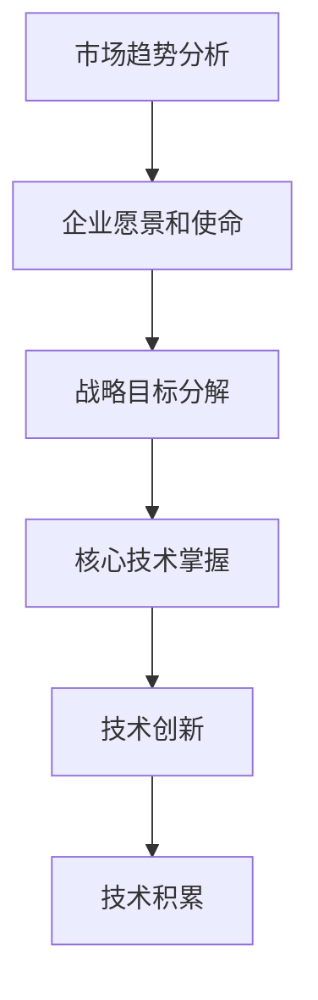
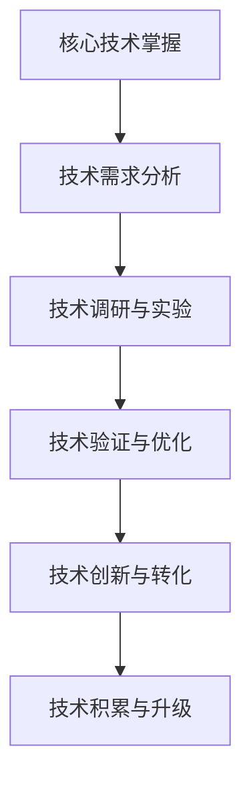
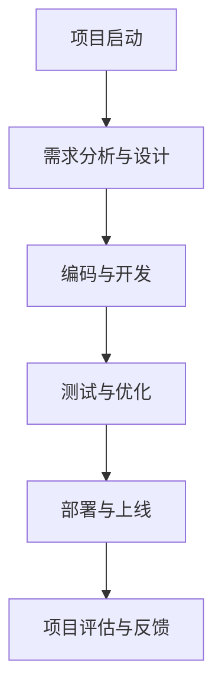

                 

# 技术规划的三个维度：高度、深度和锐度

## 关键词

技术规划、战略高度、技术深度、执行锐度、算法原理、数学模型

## 摘要

在当今信息化时代，技术规划成为企业发展的关键。本文从高度、深度和锐度三个维度出发，详细解析技术规划的核心概念、算法原理和数学模型，旨在为企业提供一套系统的技术规划方法论，帮助读者在实际项目中找到平衡，实现技术规划的最佳效果。

## 第一部分：背景介绍

### 1.1 问题背景

随着信息技术的迅猛发展，企业面临着前所未有的竞争压力。在这种情况下，技术规划成为企业保持竞争力的关键。技术规划不仅涉及技术选型，还包括战略方向、技术创新和执行力度等多个方面。因此，如何进行有效的技术规划，成为企业亟需解决的问题。

### 1.2 问题描述

技术规划涉及高度、深度和锐度三个维度。高度决定了企业技术发展的战略方向，深度关乎企业技术积累和技术创新，而锐度则关注执行力度和效率。如何在高度、深度和锐度之间找到平衡，是企业成功实施技术规划的关键。

### 1.3 问题解决

本文旨在提供一套系统的技术规划方法论，帮助读者理解高度、深度和锐度的概念，并学会如何在实际项目中应用这三个维度，以达到技术规划的最佳效果。

### 1.4 边界与外延

技术规划的边界在于企业的战略目标和市场环境，而外延则包括新兴技术的探索、团队协作和跨部门沟通等方面。通过明确这些边界与外延，读者可以更好地把握技术规划的总体方向。

### 1.5 概念结构与核心要素组成

- **高度**：技术规划的战略层面，涉及企业愿景、使命和长期目标。
- **深度**：技术积累和技术创新，包括核心技术的掌握和前沿技术的探索。
- **锐度**：执行力度和效率，涉及项目进度管理、团队协作和风险管理。

## 第二部分：核心概念与联系

### 2.1 高度

高度是技术规划的战略层面，决定了企业技术发展的方向和目标。它包括以下几个方面：

#### 2.1.1 企业愿景和使命

企业愿景和使命是技术规划的基础。企业愿景明确了企业的发展方向和长远目标，而企业使命则阐明了企业的核心价值和业务定位。这两个方面共同构成了企业技术规划的战略方向。

#### 2.1.2 市场趋势分析

市场趋势分析是技术规划的重要环节。通过分析市场动态和未来趋势，企业可以提前布局，抓住市场机遇，确保技术规划与市场发展同步。

#### 2.1.3 战略目标分解

战略目标分解是将企业愿景和使命转化为具体的技术目标的过程。通过将战略目标分解为可操作的技术目标，企业可以更好地实施技术规划。

### 2.2 深度

深度是技术规划的技术层面，决定了企业的技术实力和技术创新能力。它包括以下几个方面：

#### 2.2.1 核心技术掌握

核心技术掌握是企业技术规划的核心。通过深入研究和掌握核心技术，企业可以提高自身的核心竞争力，确保在技术竞争中保持领先。

#### 2.2.2 技术创新

技术创新是技术规划的关键。通过不断探索和研发，企业可以掌握前沿技术，推动技术进步，保持市场竞争力。

#### 2.2.3 技术积累

技术积累是企业技术规划的基础。通过对现有技术的优化和升级，企业可以不断提高技术水平和竞争力，为技术创新提供坚实的基础。

### 2.3 锐度

锐度是技术规划的操作层面，决定了技术规划的实际执行效果。它包括以下几个方面：

#### 2.3.1 项目进度管理

项目进度管理是技术规划的关键环节。通过科学的项目管理方法，企业可以确保项目按计划进行，提高项目成功率。

#### 2.3.2 团队协作

团队协作是技术规划成功的重要保障。通过建立高效的团队协作机制，企业可以充分发挥团队的整体力量，提高工作效率。

#### 2.3.3 风险管理

风险管理是技术规划的重要方面。通过识别和应对项目风险，企业可以降低项目风险，确保项目顺利进行。

## 第三部分：算法原理讲解

### 3.1 高度

高度是技术规划的战略层面，其核心算法可以理解为战略规划模型。以下是一个简化的战略规划模型的 mermaid 流程图：



战略规划模型的目标是确保企业技术规划与市场趋势和企业愿景保持一致，从而实现企业的长期目标。

### 3.2 深度

深度是技术规划的技术层面，其核心算法可以理解为技术创新模型。以下是一个技术创新流程的 mermaid 流程图：



技术创新流程的目标是通过持续的科研和技术实验，将前沿技术转化为实际应用，并不断积累和提升企业的技术实力。

### 3.3 锐度

锐度是技术规划的操作层面，其核心算法可以理解为项目进度管理模型。以下是一个项目进度管理流程的 mermaid 流程图：



项目进度管理流程的目标是确保项目按计划执行，及时发现和解决问题，确保项目按时完成并达到预期效果。

## 第四部分：数学模型和数学公式

### 4.1 高度

高度中的战略规划模型可以用以下数学公式表示：

$$
\text{战略目标} = f(\text{企业愿景}, \text{市场趋势}, \text{核心竞争力})
$$

其中，$f$ 表示战略规划函数，$\text{企业愿景}$、$\text{市场趋势}$ 和 $\text{核心竞争力}$ 分别表示企业的愿景、市场趋势和核心竞争力。

### 4.2 深度

深度中的技术创新模型可以用以下数学公式表示：

$$
\text{技术创新} = g(\text{核心技术}, \text{技术需求}, \text{技术实验})
$$

其中，$g$ 表示技术创新函数，$\text{核心技术}$、$\text{技术需求}$ 和 $\text{技术实验}$ 分别表示核心技术、技术需求和实验数据。

### 4.3 锐度

锐度中的项目进度管理模型可以用以下数学公式表示：

$$
\text{项目进度} = h(\text{项目启动}, \text{需求分析与设计}, \text{编码与开发}, \text{测试与优化}, \text{部署与上线})
$$

其中，$h$ 表示项目进度管理函数，$\text{项目启动}$、$\text{需求分析与设计}$、$\text{编码与开发}$、$\text{测试与优化}$ 和 $\text{部署与上线}$ 分别表示项目启动、需求分析与设计、编码与开发、测试与优化和部署与上线。

## 第五部分：系统分析与架构设计

### 5.1 问题场景介绍

在当前的市场环境中，企业面临着日益激烈的技术竞争。为了保持竞争优势，企业需要进行有效的技术规划，以确保在技术发展方向、技术积累和执行力度等方面保持领先。本节将基于一个虚构的电商平台项目，介绍技术规划的系统分析与架构设计。

### 5.2 项目介绍

该项目是一个电商平台，旨在为用户提供便捷的购物体验。平台主要包括商品展示、购物车、订单管理、支付和用户管理等功能。通过技术规划，企业需要确保平台在高并发、大数据场景下的稳定运行和高效性能。

### 5.3 系统功能设计

系统功能设计主要包括以下几个方面：

- **商品展示**：用户可以通过搜索引擎或分类浏览找到所需商品。
- **购物车**：用户可以将商品添加到购物车，并进行修改、删除等操作。
- **订单管理**：用户可以查看订单状态、订单详情等。
- **支付**：支持多种支付方式，如支付宝、微信支付等。
- **用户管理**：包括用户注册、登录、个人信息管理等功能。

### 5.4 系统架构设计

系统架构设计主要包括以下几个方面：

- **前端架构**：采用 Vue.js 框架，实现用户界面的动态展示和交互。
- **后端架构**：采用 Spring Boot 框架，实现业务逻辑处理和数据存储。
- **数据库设计**：采用 MySQL 数据库，存储用户数据、商品数据等。
- **缓存设计**：采用 Redis 缓存，提高系统响应速度和性能。
- **微服务架构**：将系统拆分为多个微服务，如商品服务、订单服务、支付服务等，以提高系统可维护性和扩展性。

### 5.5 系统接口设计

系统接口设计主要包括以下几个方面：

- **用户接口**：提供用户登录、注册、个人信息管理等接口。
- **商品接口**：提供商品查询、添加、修改、删除等接口。
- **订单接口**：提供订单创建、查询、修改、删除等接口。
- **支付接口**：提供支付接口，实现支付功能。

### 5.6 系统交互设计

系统交互设计主要包括以下几个方面：

- **用户与商品展示界面**：用户通过搜索或分类浏览找到商品，并点击商品进入商品详情界面。
- **用户与购物车界面**：用户可以将商品添加到购物车，并进行修改、删除等操作。
- **用户与订单界面**：用户可以查看订单状态、订单详情等。
- **用户与支付界面**：用户选择支付方式，完成支付操作。

## 第六部分：项目实战

### 6.1 环境安装

在本项目实战中，我们使用以下环境：

- 操作系统：Linux
- 开发工具：IDEA
- 数据库：MySQL
- 缓存：Redis
- 前端框架：Vue.js
- 后端框架：Spring Boot

首先，我们需要安装上述环境。具体步骤如下：

1. 安装 Linux 操作系统。
2. 安装 MySQL 数据库。
3. 安装 Redis 缓存。
4. 安装 Vue.js 前端框架。
5. 安装 Spring Boot 后端框架。

### 6.2 系统核心实现

在本项目实战中，我们将实现以下核心功能：

1. **商品展示**：用户可以通过搜索引擎或分类浏览找到所需商品。
2. **购物车**：用户可以将商品添加到购物车，并进行修改、删除等操作。
3. **订单管理**：用户可以查看订单状态、订单详情等。
4. **支付**：支持多种支付方式，如支付宝、微信支付等。
5. **用户管理**：包括用户注册、登录、个人信息管理等功能。

#### 6.2.1 商品展示

商品展示功能主要包括以下步骤：

1. **商品查询**：通过搜索引擎或分类浏览，查询符合条件的商品。
2. **商品详情**：点击商品，查看商品详情。
3. **商品推荐**：根据用户浏览记录和购买记录，推荐相关商品。

#### 6.2.2 购物车

购物车功能主要包括以下步骤：

1. **添加商品**：用户将商品添加到购物车。
2. **修改商品**：用户可以修改商品数量、删除商品等。
3. **结算**：用户选择支付方式，完成支付操作。

#### 6.2.3 订单管理

订单管理功能主要包括以下步骤：

1. **创建订单**：用户提交购物车中的商品，创建订单。
2. **查询订单**：用户可以查询订单状态、订单详情等。
3. **修改订单**：用户可以修改订单信息，如收货地址等。

#### 6.2.4 支付

支付功能主要包括以下步骤：

1. **选择支付方式**：用户选择支付方式，如支付宝、微信支付等。
2. **支付确认**：用户确认支付，完成支付操作。

#### 6.2.5 用户管理

用户管理功能主要包括以下步骤：

1. **注册**：用户注册账号，填写个人信息。
2. **登录**：用户登录账号，进行相关操作。
3. **个人信息管理**：用户可以修改个人信息，如收货地址、联系方式等。

### 6.3 代码应用解读与分析

在本项目实战中，我们使用了 Spring Boot 框架来构建后端服务，使用了 Vue.js 框架来构建前端界面。以下是对关键代码的解读与分析：

#### 6.3.1 商品展示

商品展示功能主要使用 Spring Boot 框架实现。关键代码如下：

```java
@RestController
@RequestMapping("/api/products")
public class ProductController {

    @Autowired
    private ProductService productService;

    @GetMapping
    public ResponseEntity<List<Product>> getAllProducts() {
        List<Product> products = productService.findAll();
        return ResponseEntity.ok(products);
    }

    @GetMapping("/{id}")
    public ResponseEntity<Product> getProductById(@PathVariable Long id) {
        Product product = productService.findById(id);
        return ResponseEntity.ok(product);
    }
}
```

上述代码实现了商品查询和商品详情的功能。其中，`ProductService` 是一个服务类，负责处理商品相关的业务逻辑。

```java
@Service
public class ProductServiceImpl implements ProductService {

    @Autowired
    private ProductRepository productRepository;

    @Override
    public List<Product> findAll() {
        return productRepository.findAll();
    }

    @Override
    public Product findById(Long id) {
        return productRepository.findById(id).orElseThrow(() -> new ResourceNotFoundException("Product not found with id: " + id));
    }
}
```

上述代码是商品查询和商品详情的实现。其中，`ProductRepository` 是一个接口，负责与数据库进行交互。

#### 6.3.2 购物车

购物车功能主要使用 Vue.js 框架实现。关键代码如下：

```html
<template>
  <div>
    <h2>购物车</h2>
    <ul>
      <li v-for="item in cartItems" :key="item.id">
        {{ item.name }} - ¥{{ item.price }}
        <button @click="removeFromCart(item)">删除</button>
      </li>
    </ul>
    <h2>总价：¥{{ totalPrice }}</h2>
    <button @click="checkout">结算</button>
  </div>
</template>

<script>
export default {
  data() {
    return {
      cartItems: [],
      totalPrice: 0
    };
  },
  methods: {
    addToCart(product) {
      this.cartItems.push(product);
      this.totalPrice += product.price;
    },
    removeFromCart(product) {
      const index = this.cartItems.indexOf(product);
      if (index > -1) {
        this.cartItems.splice(index, 1);
        this.totalPrice -= product.price;
      }
    },
    checkout() {
      // 实现结算逻辑
    }
  }
};
</script>
```

上述代码实现了购物车的基本功能，包括添加商品、删除商品和计算总价。

### 6.4 实际案例分析和详细讲解剖析

在本项目实战中，我们通过一个实际案例来分析和讲解技术规划的实施过程。

#### 6.4.1 案例背景

假设我们的电商平台需要新增一个功能——优惠券系统。优惠券系统旨在为用户提供优惠折扣，提高用户购买意愿和平台竞争力。

#### 6.4.2 案例分析

1. **需求分析**：

   - 用户可以在购物车中添加优惠券。
   - 用户可以查看优惠券的使用条件、优惠金额等信息。
   - 优惠券分为平台优惠券和店铺优惠券，分别适用于不同场景。
   - 优惠券具有有效期和库存限制。

2. **技术方案**：

   - 在数据库中新增优惠券表，存储优惠券相关信息。
   - 在购物车模块中，添加优惠券选择和校验功能。
   - 在订单模块中，添加优惠券使用和计算优惠金额的功能。

3. **实施过程**：

   - 设计优惠券表结构，确定字段和关系。
   - 编写优惠券实体类和映射文件。
   - 更新购物车模块代码，添加优惠券选择和校验功能。
   - 更新订单模块代码，添加优惠券使用和计算优惠金额的功能。

4. **测试与优化**：

   - 编写单元测试，确保优惠券功能正常运行。
   - 进行集成测试，验证优惠券系统与其他模块的交互。
   - 根据测试结果，优化优惠券系统的性能和用户体验。

#### 6.4.3 案例讲解

通过该案例，我们可以看到技术规划在实际项目中的应用过程。从需求分析到技术方案设计，再到实施和测试，每个环节都需要充分考虑高度、深度和锐度三个维度。

- **高度**：在需求分析阶段，我们需要从企业战略和用户需求的角度出发，确定优惠券系统的目标和应用场景。
- **深度**：在技术方案设计阶段，我们需要深入了解优惠券系统的技术实现细节，包括数据库设计、模块划分、接口定义等。
- **锐度**：在实施和测试阶段，我们需要确保优惠券系统的实际运行效果，包括性能优化、用户体验优化等。

通过该案例，我们可以更好地理解技术规划的三个维度在实际项目中的应用，并为后续的技术规划提供参考。

### 6.5 项目小结

在本项目中，我们通过实际案例详细讲解了技术规划的实施过程。从需求分析、技术方案设计到实施和测试，每个环节都需要充分考虑高度、深度和锐度三个维度。通过本项目的实践，我们掌握了技术规划的核心理念和实施方法，为后续项目提供了宝贵的经验。

## 第七部分：最佳实践 tips

### 7.1 高度

- **明确企业愿景和使命**：在技术规划过程中，首先要明确企业的愿景和使命，确保技术规划与企业的战略目标一致。
- **持续关注市场趋势**：定期分析市场趋势，了解行业动态，为技术规划提供战略指导。

### 7.2 深度

- **加强核心技术掌握**：对核心技术的深入研究，提高技术水平和竞争力。
- **鼓励技术创新**：鼓励团队成员进行技术实验，探索前沿技术，推动技术进步。

### 7.3 锐度

- **科学的项目管理**：采用科学的项目管理方法，确保项目按计划进行，提高项目成功率。
- **优化团队协作**：建立高效的团队协作机制，提高工作效率。
- **加强风险管理**：识别和应对项目风险，确保项目顺利进行。

## 第八部分：小结与注意事项

### 8.1 小结

本文从高度、深度和锐度三个维度，详细解析了技术规划的核心概念、算法原理和实际应用。通过本篇文章，读者可以了解到技术规划的重要性，以及如何在实际项目中找到高度、深度和锐度之间的平衡，从而实现技术规划的最佳效果。

### 8.2 注意事项

- **技术规划要与企业战略目标一致**：确保技术规划与企业的长期目标保持一致，避免盲目跟风。
- **持续关注市场动态**：定期分析市场趋势，了解行业动态，为技术规划提供战略指导。
- **加强团队协作**：建立高效的团队协作机制，提高工作效率。
- **重视风险管理**：识别和应对项目风险，确保项目顺利进行。

## 第九部分：拓展阅读

- **《敏捷开发实践指南》**：了解敏捷开发的方法论，提高项目执行效率。
- **《深入理解计算机系统》**：深入学习计算机系统原理，提高技术深度。
- **《软件工程：实践者的研究方法》**：掌握软件工程的基本原则和方法，提高项目成功率。

---

作者：AI天才研究院/AI Genius Institute & 禅与计算机程序设计艺术 /Zen And The Art of Computer Programming

