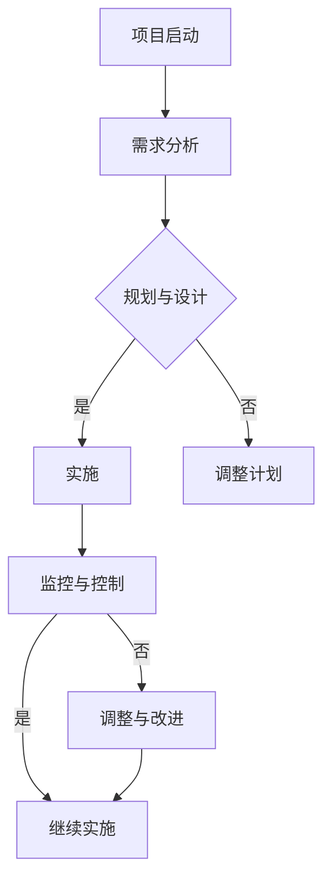

                 

# 《技术项目管理：P9工程师的执行力体现》

> 关键词：技术项目管理，P9工程师，执行力，项目成功，项目管理方法，团队协作

> 摘要：本文深入探讨了技术项目管理中P9工程师的执行力体现。首先，我们介绍了项目管理的理论基础和框架，包括基本概念、流程、团队建设与管理、风险管理和质量管理。接着，本文详细阐述了P9工程师的角色与责任，以及如何提升项目管理能力。最后，通过实际案例分析，我们总结了P9工程师在项目管理中执行力的体现，以及如何通过提高执行力实现项目成功。

## 目录

### 第一部分：项目管理的理论基础与框架

#### 第1章：项目管理的基本概念与原则  
    1.1 项目的定义与特点  
    1.2 项目管理的重要性  
    1.3 项目管理的基本原则

#### 第2章：项目管理流程与方法  
    2.1 项目启动与规划  
    2.2 项目执行与监控  
    2.3 项目收尾与评估

#### 第3章：项目团队建设与管理  
    3.1 团队角色与职责  
    3.2 团队协作与沟通  
    3.3 团队冲突解决与激励

#### 第4章：项目风险管理  
    4.1 风险管理概述  
    4.2 风险识别与评估  
    4.3 风险应对策略

#### 第5章：项目质量管理  
    5.1 质量管理的基本原则  
    5.2 质量控制工具与技术  
    5.3 质量改进方法

### 第二部分：P9工程师的执行力体现

#### 第6章：P9工程师的角色与责任  
    6.1 P9工程师的职责  
    6.2 P9工程师的技术能力要求  
    6.3 P9工程师的领导力与沟通技巧

#### 第7章：P9工程师的项目管理能力提升  
    7.1 项目计划与进度管理  
    7.2 项目资源管理  
    7.3 项目变更管理与决策

#### 第8章：P9工程师的执行力体现  
    8.1 执行力的概念与重要性  
    8.2 提高执行力的方法与技巧  
    8.3 执行力在项目管理中的应用与实践

#### 第9章：P9工程师的案例分析  
    9.1 成功案例分享  
    9.2 失败案例分析  
    9.3 从案例中学习与成长

### 第三部分：项目实战与总结

#### 第10章：项目实战案例解析  
    10.1 实战背景与目标  
    10.2 实战过程与策略  
    10.3 实战结果与反思

#### 第11章：项目管理经验总结  
    11.1 经验教训与启示  
    11.2 最佳实践与建议  
    11.3 项目管理的持续改进

#### 第12章：未来项目管理的趋势与挑战  
    12.1 新技术对项目管理的影响  
    12.2 项目管理的发展趋势  
    12.3 项目管理面临的挑战与应对策略

### 附录

#### 附录A：项目管理工具与技术  
    11.1 常用项目管理工具介绍  
    11.2 项目管理软件推荐  
    11.3 技术与工具的集成应用

#### 附录B：参考书目与资源  
    11.1 推荐阅读书目  
    11.2 网络资源推荐  
    11.3 专业组织与社区推荐

[Mermaid 流程图]：请根据具体章节内容提供相关 Mermaid 流程图，以帮助读者更好地理解项目管理的流程和团队协作机制。

---

在接下来的内容中，我们将一步步深入探讨技术项目管理的各个方面，以及P9工程师在这些方面的执行力体现。

## 第1章：项目管理的基本概念与原则

### 1.1 项目的定义与特点

项目管理是一门涉及多个学科领域的复杂艺术和科学。要理解项目管理，我们首先需要明确项目的定义和特点。

项目是一个独特的、临时的活动，旨在创造特定的产品、服务或成果。项目具有以下特点：

1. **独特性**：每个项目都有其独特性，即使它们可能具有相似的目标或需求。这种独特性决定了项目需要定制化的解决方案。

2. **临时性**：项目有明确的开始和结束时间，而不是持续运行的过程。这要求项目团队在有限的时间内实现目标。

3. **目标性**：每个项目都有明确的目标和范围，这些目标通常与组织的战略和愿景相关。

4. **约束性**：项目通常受到时间、预算和资源的约束，这些约束要求项目团队在有限资源下高效地工作。

5. **迭代性**：项目通常分为多个阶段，每个阶段都有其特定的任务和目标。这种迭代性允许项目团队在过程中进行调整和改进。

### 1.2 项目管理的重要性

项目管理的重要性体现在多个方面：

1. **确保项目成功**：通过有效管理项目，可以确保项目按时、按预算、按质量完成，从而实现组织的战略目标。

2. **提高资源利用率**：通过项目规划和管理，可以优化资源的分配和利用，避免资源的浪费。

3. **降低风险**：项目风险管理是项目管理的重要组成部分，通过识别、评估和应对风险，可以降低项目失败的可能性。

4. **提升团队协作**：项目管理强调团队协作和沟通，有助于提高团队效率和满意度。

5. **持续改进**：项目管理是一个持续的过程，通过不断的反思和改进，可以提高项目的执行效率和效果。

### 1.3 项目管理的基本原则

成功进行项目管理需要遵循一系列基本原则：

1. **客户至上**：始终以满足客户需求为目标，确保项目能够满足客户的期望和需求。

2. **计划先行**：在项目开始之前，制定详细的计划，包括任务分配、时间表、预算等，以确保项目有明确的方向和目标。

3. **团队合作**：项目成功的关键在于团队的合作和协作，团队成员之间需要建立良好的沟通和信任。

4. **风险管理**：项目风险是不可避免的，但可以通过识别、评估和应对风险来降低项目失败的风险。

5. **持续改进**：项目过程中需要不断地进行反思和改进，以提高项目的效率和效果。

在接下来的章节中，我们将详细探讨项目管理的流程、团队建设与管理、风险管理和质量管理，以帮助P9工程师更好地理解和应用项目管理方法。同时，我们也将深入探讨P9工程师在项目管理中的角色与责任，以及如何提升项目管理能力。让我们一步步思考，深入理解项目管理的重要性。

## 第2章：项目管理流程与方法

### 2.1 项目启动与规划

项目启动是项目管理的第一步，它标志着项目的正式开始。项目启动的主要目标是明确项目的目标和范围，并为后续的工作奠定基础。

#### 项目启动的关键步骤：

1. **项目定义**：明确项目的目标和范围，确保所有相关方对项目的理解一致。

2. **资源评估**：评估项目所需的资源，包括人力、资金、设备等，以确保项目能够在资源限制内完成。

3. **项目计划**：制定项目计划，包括任务分配、时间表、预算等，为项目的执行提供详细的指导。

4. **风险识别**：识别可能影响项目成功的风险，并制定应对策略。

5. **团队组建**：组建项目团队，确保团队成员具备所需的技术和沟通能力。

#### 项目启动的关键原则：

1. **客户参与**：确保客户或相关方参与项目启动过程，以获得对项目目标的明确理解和支持。

2. **明确性**：项目目标、范围、任务和责任必须明确，以避免项目过程中出现混淆和误解。

3. **灵活性**：项目计划应具有一定的灵活性，以应对可能出现的变化和调整。

### 2.2 项目执行与监控

项目执行是项目管理的核心环节，它涉及任务的完成、资源的分配和团队协作。项目执行的目的是确保项目按计划进行，并达到预期的目标。

#### 项目执行的关键步骤：

1. **任务分配**：将项目任务分配给团队成员，并明确每个人的职责和任务要求。

2. **进度监控**：监控项目的进度，确保任务按计划完成。

3. **资源管理**：合理分配和利用项目资源，确保项目资源的最大化利用。

4. **风险管理**：持续监控项目风险，并根据实际情况调整风险应对策略。

5. **团队协作**：促进团队成员之间的协作和沟通，确保项目团队能够高效地工作。

#### 项目执行的关键原则：

1. **透明性**：项目执行过程中的信息应透明，团队成员应能够随时了解项目的进展和情况。

2. **反馈机制**：建立反馈机制，及时收集和处理团队成员的意见和建议，以改进项目执行。

3. **持续改进**：项目执行过程中，应持续进行反思和改进，以提高项目的执行效率和效果。

### 2.3 项目收尾与评估

项目收尾是项目管理的最后一步，它标志着项目的结束。项目收尾的主要目标是确保项目目标的实现，并从项目中获取经验和教训。

#### 项目收尾的关键步骤：

1. **任务完成**：确保所有项目任务都已经完成，项目目标已经实现。

2. **验收和交付**：对项目成果进行验收和交付，确保项目成果符合客户的要求和标准。

3. **项目评估**：对项目过程和结果进行评估，总结项目经验和教训。

4. **团队解散**：根据项目需要，解散项目团队，并感谢团队成员的贡献。

#### 项目收尾的关键原则：

1. **正式性**：项目收尾应正式进行，确保所有项目任务和成果都得到确认。

2. **总结与反思**：项目收尾过程中，应总结项目经验和教训，为未来的项目提供参考。

3. **持续改进**：项目评估和总结应作为持续改进的依据，以提高未来项目的执行效率和效果。

在项目管理的流程和方法中，项目启动与规划、项目执行与监控和项目收尾与评估是三个关键环节。这些环节相互关联，共同构成了项目管理的完整流程。通过有效的项目管理，P9工程师可以更好地实现项目的目标，提升项目的成功率。

### 2.4 团队建设与管理

项目成功的另一个关键因素是团队建设与管理。一个高效的团队可以协同工作，克服各种挑战，实现项目目标。以下是团队建设与管理的几个关键方面：

#### 3.1 团队角色与职责

在团队建设过程中，明确每个成员的角色和职责是非常重要的。每个团队成员都应该清楚自己的职责，以及如何与其他成员协作。

1. **项目经理**：负责整个项目的规划和执行，确保项目按计划进行，并与客户和其他相关方保持沟通。
2. **开发人员**：负责编写代码和实现项目的功能。
3. **测试人员**：负责测试项目，确保代码质量和功能完整性。
4. **UI/UX设计师**：负责设计项目的用户界面和用户体验。
5. **产品经理**：负责产品的规划和设计，确保项目符合市场需求。

#### 3.2 团队协作与沟通

团队协作和沟通是项目成功的关键。团队成员之间需要建立良好的沟通机制，确保信息的流畅传递和问题的及时解决。

1. **定期会议**：定期举行团队会议，讨论项目的进展、遇到的问题和解决方案。
2. **共享文档**：使用共享文档平台，如Google文档或Confluence，记录项目的重要信息和决策。
3. **即时通讯**：使用即时通讯工具，如Slack或Microsoft Teams，快速解决突发问题和交流想法。

#### 3.3 团队冲突解决与激励

团队冲突是不可避免的，但有效的解决和激励可以增强团队凝聚力和工作效率。

1. **冲突解决**：建立冲突解决机制，如面对面沟通、第三方调解等，及时解决团队内部的矛盾和分歧。
2. **激励措施**：制定合理的激励机制，如绩效奖励、晋升机会等，激发团队成员的积极性和创造力。

通过有效的团队建设与管理，P9工程师可以确保团队的高效协作，提高项目的执行效率和成功率。接下来，我们将进一步探讨项目风险管理、质量管理和P9工程师在项目管理中的角色和责任。

### 2.5 项目风险管理

项目风险管理是项目管理中至关重要的一环，它涉及到识别、评估和应对项目中的潜在风险，以确保项目的顺利进行。以下是项目风险管理的主要方面：

#### 4.1 风险管理概述

风险管理是一个系统化的过程，它包括以下几个步骤：

1. **风险识别**：识别项目中可能出现的风险，包括技术风险、市场风险、人力资源风险等。
2. **风险评估**：评估识别出的风险，包括风险的概率和影响，以便确定风险优先级。
3. **风险应对**：根据风险评估结果，制定应对策略，包括规避、转移、减轻或接受风险。
4. **风险监控**：在项目执行过程中，持续监控风险的变化，并根据实际情况进行调整。

#### 4.2 风险识别与评估

风险识别是风险管理的第一步，它要求项目经理和团队仔细分析项目环境和项目任务，识别可能的风险。以下是一些常用的风险识别方法：

1. **头脑风暴**：通过集体讨论，列出可能的风险。
2. **历史数据**：参考过去项目的风险记录，识别类似项目中的风险。
3. **专家咨询**：咨询行业专家或其他项目的团队成员，获取他们的经验和见解。

风险评估是确定风险的重要步骤，它涉及评估风险的概率和影响。以下是一些常用的风险评估方法：

1. **风险矩阵**：使用风险矩阵，根据风险的概率和影响，对风险进行优先级排序。
2. **风险优先级分析**：根据风险的概率和影响，确定哪些风险需要优先应对。
3. **定量分析**：使用数学模型和统计方法，量化风险的影响和概率。

#### 4.3 风险应对策略

一旦识别和评估了风险，就需要制定相应的应对策略。以下是一些常见风险应对策略：

1. **规避**：通过改变项目计划或策略，避免风险的发生。
2. **转移**：将风险转移给其他方，如保险公司或合作伙伴。
3. **减轻**：采取措施降低风险的概率或影响。
4. **接受**：对无法规避或转移的风险，接受其可能带来的影响。

在项目风险管理中，P9工程师的角色至关重要。他们需要具备识别风险、评估风险和制定应对策略的能力，以确保项目的顺利进行。接下来，我们将进一步探讨项目质量管理，以帮助P9工程师在项目管理中实现更高的效率和成功率。

### 2.6 项目质量管理

项目质量管理是确保项目交付的产品或服务符合预定的质量和标准的过程。它是项目管理的重要组成部分，对于项目的成功至关重要。以下是项目质量管理的主要方面：

#### 5.1 质量管理的基本原则

质量管理遵循一系列基本原则，以确保项目交付的产品或服务满足客户的需求和期望：

1. **客户至上**：始终以满足客户需求为目标，确保项目能够满足客户的期望和需求。
2. **计划先行**：在项目开始之前，制定详细的质量管理计划，包括质量目标、标准和方法。
3. **持续改进**：项目过程中应持续进行质量改进，以提高项目的质量和效率。
4. **全员参与**：鼓励所有团队成员参与质量管理，以提高团队对质量的重视和责任感。

#### 5.2 质量控制工具与技术

为了确保项目质量，可以采用一系列质量控制工具和技术，以下是一些常用的工具：

1. **质量计划**：制定详细的质量计划，包括质量目标、标准、方法和责任分配。
2. **流程图**：使用流程图来描述项目的流程和过程，以便识别潜在的缺陷和改进点。
3. **质量审计**：定期进行质量审计，评估项目的质量水平和符合性。
4. **检查和测试**：在项目开发和测试过程中，进行各种检查和测试，确保代码和功能符合质量标准。

#### 5.3 质量改进方法

质量改进是一个持续的过程，需要不断地评估和改进项目质量。以下是一些常用的质量改进方法：

1. **持续集成和持续交付**：使用CI/CD流程，自动化测试和部署，确保代码质量。
2. **缺陷管理**：建立缺陷管理流程，及时记录、跟踪和解决缺陷。
3. **用户反馈**：收集用户反馈，分析用户使用情况，以改进产品的质量和用户体验。
4. **知识共享**：鼓励团队成员分享经验和知识，以提高整个团队的质量意识和技术水平。

通过有效的项目质量管理，P9工程师可以确保项目交付的产品或服务达到高质量标准，提高客户满意度和项目的成功率。接下来，我们将探讨P9工程师的角色与责任，以及如何提升项目管理能力。

### 第6章：P9工程师的角色与责任

在技术项目管理中，P9工程师扮演着至关重要的角色。他们不仅是技术专家，更是项目的领导者和执行者。以下是P9工程师的角色与责任：

#### 6.1 P9工程师的职责

P9工程师的主要职责包括以下几个方面：

1. **技术领导**：作为高级工程师，P9工程师需要带领团队解决复杂的技术问题，制定技术方案，确保项目的顺利进行。

2. **项目规划**：参与项目的规划阶段，制定项目目标和计划，确保项目按时、按预算完成。

3. **资源管理**：负责项目的资源分配和管理，确保项目所需的人力、技术和设备得到合理利用。

4. **风险管理**：识别项目中的潜在风险，制定风险应对策略，确保项目风险在可控范围内。

5. **团队协作**：协调团队成员的工作，促进团队协作和沟通，提高团队效率。

6. **质量控制**：确保项目的质量符合预定标准，通过质量控制工具和技术进行质量监控和改进。

#### 6.2 P9工程师的技术能力要求

作为P9工程师，他们需要具备以下技术能力：

1. **深厚的技术背景**：熟悉多个编程语言和框架，具备解决复杂技术问题的能力。

2. **系统设计能力**：能够设计大规模分布式系统，理解系统架构和设计模式。

3. **项目管理能力**：了解项目管理方法和工具，能够有效地进行项目规划、执行和监控。

4. **业务理解**：能够理解业务需求，将技术方案与业务目标相结合。

5. **沟通能力**：具备良好的沟通技巧，能够有效地与团队成员、客户和其他相关方进行沟通。

#### 6.3 P9工程师的领导力与沟通技巧

P9工程师不仅需要具备技术能力，还需要具备领导力和沟通技巧，以有效地管理和领导团队：

1. **领导力**：作为团队的领导者，P9工程师需要具备决策能力、团队激励能力和问题解决能力。

2. **沟通技巧**：与团队成员保持良好的沟通，确保信息的透明和及时传递，避免误解和冲突。

3. **团队合作**：鼓励团队成员参与决策，促进团队合作和知识共享。

4. **冲突解决**：在团队内部出现冲突时，能够冷静分析问题，找到合适的解决方案。

5. **变革管理**：在项目过程中，能够应对变化和挑战，灵活调整策略和计划。

通过明确P9工程师的角色与责任，并提升他们的技术能力、领导力和沟通技巧，可以确保项目管理的成功。接下来，我们将探讨P9工程师如何提升项目管理能力。

### 第7章：P9工程师的项目管理能力提升

在技术项目管理中，P9工程师不仅需要具备卓越的技术能力，还需要具备强大的项目管理能力。以下是一些关键的方法和技巧，帮助P9工程师提升项目管理能力：

#### 7.1 项目计划与进度管理

项目计划是项目管理的基础，一个详细的项目计划可以帮助P9工程师有效地分配资源和控制进度。以下是几个关键步骤：

1. **明确项目目标**：确保所有团队成员对项目的目标有清晰的理解，并围绕这些目标进行工作。

2. **分解任务**：将项目目标分解为具体的工作任务，为每个任务制定详细的计划和时间表。

3. **资源分配**：根据任务的需要，合理分配项目资源，确保任务能够在限定时间内完成。

4. **风险评估**：在项目计划中考虑到可能的风险和不确定性，并制定相应的应对策略。

5. **定期审查**：定期审查项目进度，确保项目按计划进行，并在必要时进行调整。

#### 7.2 项目资源管理

项目资源包括人力资源、技术资源和财务资源。有效地管理这些资源是P9工程师的重要职责。以下是一些关键点：

1. **人力资源**：确保团队成员具备完成任务所需的知识和技能，并合理分配任务，避免过度负担。

2. **技术资源**：确保项目所需的技术资源和工具得到充分利用，包括软件、硬件和云服务等。

3. **财务资源**：合理安排项目预算，确保项目在财务范围内完成，避免超支。

4. **优先级管理**：在资源有限的情况下，优先处理关键任务和紧急任务，确保项目核心目标的实现。

#### 7.3 项目变更管理与决策

在项目执行过程中，变更在所难免。P9工程师需要具备有效的变更管理能力，以下是一些关键技巧：

1. **变更控制流程**：建立明确的变更控制流程，确保所有变更都经过审批和记录。

2. **影响评估**：在变更提出后，评估变更对项目进度、成本和质量的影响。

3. **决策制定**：根据影响评估结果，制定变更决策，并通知所有相关方。

4. **沟通与协调**：在变更过程中，保持与团队成员和客户的沟通，确保他们对变更有清晰的理解。

通过提升项目计划与进度管理、资源管理和变更管理能力，P9工程师可以更好地应对项目管理中的挑战，确保项目的成功。接下来，我们将深入探讨执行力的概念与重要性，以及如何提高执行力。

### 第8章：P9工程师的执行力体现

执行力是项目成功的关键因素，尤其是在技术项目管理中。P9工程师作为项目的核心成员，其执行力直接影响项目的进度和质量。以下是执行力在项目管理中的概念、重要性以及如何提高执行力。

#### 8.1 执行力的概念与重要性

执行力是指将计划转化为实际成果的能力。它包括以下几个方面：

1. **目标明确**：执行力强的人能够明确项目目标，并将其分解为可操作的任务。

2. **行动迅速**：执行力强的人能够迅速采取行动，而不是拖延或犹豫。

3. **持续跟进**：执行力强的人能够持续跟进任务的进展，确保任务按时完成。

4. **适应变化**：执行力强的人能够灵活应对变化，调整计划和策略。

在项目管理中，执行力的重要性体现在以下几个方面：

1. **确保项目进度**：执行力强的人能够确保项目按计划进行，避免拖延和延误。

2. **提升团队效率**：执行力强的人能够激励团队成员，提高团队的整体工作效率。

3. **保证项目质量**：执行力强的人能够确保项目交付的产品或服务符合质量标准。

4. **降低项目风险**：执行力强的人能够及时发现和解决项目中的问题，降低项目风险。

#### 8.2 提高执行力的方法与技巧

要提高执行力，P9工程师可以从以下几个方面入手：

1. **明确目标**：确保自己对项目目标有清晰的认识，并将目标分解为具体的任务和里程碑。

2. **制定计划**：制定详细的行动计划，包括任务的优先级、时间表和责任人。

3. **跟进与监控**：定期跟进任务进展，确保任务按时完成，并在必要时进行调整。

4. **团队协作**：鼓励团队协作，共同解决问题，提高整体执行力。

5. **自我激励**：设定个人目标，并给自己设定奖励机制，以保持动力。

6. **适应变化**：学会灵活应对变化，调整计划和策略，确保项目能够顺利推进。

7. **持续学习**：不断提升自己的技能和知识，以适应不断变化的项目环境和需求。

#### 8.3 执行力在项目管理中的应用与实践

在项目管理中，P9工程师可以通过以下方法将执行力应用于实际工作中：

1. **项目启动会**：在项目启动时，明确项目目标和计划，确保所有团队成员对项目有清晰的认识。

2. **任务分配**：在任务分配时，确保每个任务都有明确的负责人和截止日期，并跟进任务进展。

3. **进度报告**：定期向项目团队和管理层汇报项目进展，确保项目在按计划进行。

4. **风险评估与应对**：在项目执行过程中，定期评估项目风险，并制定应对策略。

5. **团队建设**：通过团队建设活动，提高团队的协作和执行力。

6. **知识共享**：鼓励团队成员分享经验和知识，提高整个团队的能力。

通过提升执行力，P9工程师可以确保项目按计划、高质量地完成，实现项目成功。接下来，我们将通过实际案例来分析P9工程师在项目管理中的执行力体现。

### 第9章：P9工程师的案例分析

通过实际案例分析，我们可以更好地理解P9工程师在项目管理中的执行力体现，以及他们如何通过有效的执行确保项目的成功。

#### 9.1 成功案例分享

**案例背景**：某互联网公司计划开发一款在线教育平台，提供丰富的在线课程和学习资源。该公司聘请了一位P9工程师作为项目经理，负责项目的整体规划和执行。

**解决方案**：

1. **明确目标**：P9工程师首先明确了项目的目标，包括平台的功能需求、性能要求、用户体验等。他将这些目标分解为具体的工作任务，并制定了详细的项目计划。

2. **团队协作**：P9工程师组建了一个由开发人员、测试人员、UI/UX设计师和产品经理组成的团队。他通过定期会议和共享文档平台，确保团队成员对项目目标和计划有清晰的理解。

3. **进度管理**：P9工程师制定了项目的时间表，并设置了关键里程碑。他定期跟进任务进展，确保项目按计划进行。在项目过程中，他及时调整计划和资源分配，以应对变化和挑战。

4. **质量控制**：P9工程师重视项目的质量，使用了多种质量控制工具和技术，如代码审查、自动化测试和用户反馈收集。他通过持续改进，提高了项目的质量。

5. **风险管理**：P9工程师在项目早期就识别了潜在的风险，如技术难点、市场变化和人力资源短缺。他制定了相应的风险应对策略，并持续监控风险的变化。

**结果**：该项目最终成功上线，得到了用户的高度评价。平台的功能丰富、性能稳定，用户体验良好。P9工程师通过其卓越的执行力，确保了项目的成功。

#### 9.2 失败案例分析

**案例背景**：某初创公司计划开发一款智能健康监测设备，旨在通过数据分析和人工智能技术提供个性化的健康建议。

**原因分析**：

1. **目标不明确**：项目的目标不够具体，团队成员对项目的理解存在差异。这导致在项目执行过程中，团队成员的努力方向不一致。

2. **沟通不足**：项目团队成员之间的沟通不足，导致信息传递不畅。一些关键问题没有得到及时解决，影响了项目的进度和质量。

3. **进度失控**：项目计划没有得到有效执行，任务进度滞后，导致项目延期。P9工程师没有及时调整计划和资源，导致项目成本超支。

4. **风险忽视**：P9工程师在项目早期没有识别和评估潜在的风险，导致在项目执行过程中遇到了意想不到的困难。他没有制定有效的风险应对策略，导致项目最终失败。

**教训**：

1. **明确目标**：项目启动时，需要明确具体的项目目标，确保所有团队成员对项目的目标有清晰的认识。

2. **加强沟通**：建立有效的沟通机制，确保团队成员之间的信息传递畅通，及时解决项目中的问题。

3. **进度管理**：制定详细的计划和时间表，并定期跟进任务进展。在项目过程中，要灵活调整计划和资源，确保项目按时完成。

4. **风险管理**：在项目早期就识别和评估潜在的风险，制定有效的风险应对策略。在项目执行过程中，持续监控风险的变化，并调整应对策略。

通过成功案例和失败案例的分析，我们可以看到P9工程师在项目管理中的执行力体现。他们通过明确目标、加强沟通、有效进度管理和风险管理，确保项目的成功。同时，我们也学到了一些宝贵的教训，为未来的项目管理提供了指导。

### 第10章：项目实战案例解析

为了更好地理解P9工程师在项目管理中的执行力体现，我们将通过一个实际案例进行深入分析。

#### 10.1 实战背景与目标

**案例背景**：某大型电商平台计划推出一款基于人工智能的个性化推荐系统，以提高用户满意度和销售转化率。该公司聘请了一位P9工程师作为项目经理，负责项目的整体规划和执行。

**项目目标**：实现一个高效、准确的个性化推荐系统，为用户提供个性化的商品推荐，提高用户满意度和平台销售额。

#### 10.2 实战过程与策略

1. **项目启动**：
   - **明确目标**：P9工程师首先与业务团队和产品经理进行了深入讨论，明确了项目的具体目标和功能需求。
   - **团队组建**：组建了一支包括数据科学家、算法工程师、前端工程师和测试人员的团队，并明确了每个人的职责和任务。

2. **需求分析与设计**：
   - **需求调研**：P9工程师组织团队进行需求调研，收集用户反馈和业务数据，确定了推荐系统的核心功能和性能指标。
   - **系统设计**：数据科学家和算法工程师设计了推荐算法的架构，前端工程师设计了用户界面的交互逻辑，测试人员制定了测试计划。

3. **开发与测试**：
   - **代码开发**：算法工程师根据系统设计，开发了推荐算法的核心代码，前端工程师实现了用户界面。
   - **测试**：测试人员编写了自动化测试脚本，对系统的功能、性能和安全性进行了全面测试。

4. **部署与上线**：
   - **部署**：将系统部署到生产环境，并进行性能调优。
   - **上线**：与运维团队合作，确保推荐系统平稳上线，并监控系统的运行状态。

5. **用户反馈与迭代**：
   - **收集反馈**：上线后，收集用户反馈，分析推荐系统的效果。
   - **优化迭代**：根据用户反馈，对推荐算法和用户界面进行优化，以提高用户体验和系统性能。

#### 10.3 实战结果与反思

**结果**：
- 推荐系统的准确性和响应速度得到了显著提升，用户满意度和销售转化率都有所提高。
- 系统稳定运行，性能稳定，满足了业务需求。

**反思**：
- **沟通与协作**：项目过程中，P9工程师注重团队协作和沟通，确保项目进展顺利。有效的沟通和协作是项目成功的关键。
- **风险管理**：虽然项目成功上线，但在开发过程中遇到了一些技术难题，如数据缺失和处理、算法优化等。P9工程师通过及时调整计划和资源，成功解决了这些问题。
- **用户反馈**：上线后，及时收集用户反馈，并根据用户需求进行优化，是提升系统效果的重要手段。

通过这个实际案例，我们可以看到P9工程师在项目管理中的执行力体现。他们通过明确的计划、有效的沟通、灵活的风险管理和持续的用户反馈，确保了项目的成功。同时，这个案例也为我们提供了宝贵的经验，为未来的项目管理提供了指导。

### 第11章：项目管理经验总结

通过上述实际案例的分析，我们可以总结出一些关于技术项目管理的经验教训，以及最佳实践和改进建议。

#### 11.1 经验教训与启示

1. **明确目标与需求**：项目启动时，必须明确项目目标和功能需求，确保所有团队成员对项目有清晰的认识。需求不明确是项目失败的主要原因之一。

2. **注重团队协作与沟通**：有效的团队协作和沟通是项目成功的关键。定期举行团队会议、使用共享文档平台、即时通讯工具等，有助于信息的透明传递和问题的及时解决。

3. **风险管理**：在项目早期就识别和评估潜在的风险，制定相应的风险应对策略。持续监控风险的变化，及时调整计划和资源，以应对可能出现的问题。

4. **用户反馈与迭代**：上线后，及时收集用户反馈，并根据用户需求进行优化。用户反馈是提升系统效果和用户体验的重要手段。

5. **持续学习和改进**：项目管理是一个不断学习和改进的过程。通过总结经验教训，不断优化项目管理方法和工具，可以提高项目的执行效率和成功率。

#### 11.2 最佳实践与建议

1. **制定详细的项目计划**：在项目启动时，制定详细的项目计划，包括任务分配、时间表、预算等，为项目的执行提供明确的指导。

2. **使用项目管理工具**：使用项目管理工具，如JIRA、Trello等，可以提高项目的执行效率和透明度。这些工具可以帮助团队跟踪任务进度、管理项目风险和资源。

3. **建立有效的沟通机制**：建立有效的沟通机制，如定期团队会议、共享文档平台、即时通讯工具等，确保团队成员之间的信息传递畅通。

4. **培养团队协作文化**：鼓励团队协作和知识共享，建立良好的团队协作文化。通过团队建设活动和培训，提高团队凝聚力和工作效率。

5. **持续改进与优化**：在项目过程中，不断进行反思和改进，优化项目管理方法和工具。通过总结经验教训，为未来的项目管理提供指导。

#### 11.3 项目管理的持续改进

1. **建立反馈机制**：建立项目反馈机制，鼓励团队成员提出改进建议。通过定期的项目评审会议，总结项目的成功经验和不足，制定改进措施。

2. **知识管理**：建立知识管理系统，记录项目的经验教训、最佳实践和技术方案。这些知识可以为未来的项目提供参考，提高项目管理效率。

3. **培训与发展**：为团队成员提供培训和发展机会，提高他们的技能和知识水平。通过培训和学习，可以更好地应对项目管理中的挑战。

4. **技术升级与改进**：随着技术的发展，定期评估项目所使用的工具和技术，确保其满足项目的需求。通过技术升级和改进，可以提高项目的执行效率和效果。

通过总结和反思项目管理中的经验教训，以及采用最佳实践和改进建议，P9工程师可以不断提高项目管理的能力，确保项目的成功。

### 第12章：未来项目管理的趋势与挑战

随着技术的不断进步和市场的变化，未来项目管理将面临新的趋势和挑战。以下是对这些趋势与挑战的分析以及应对策略。

#### 12.1 新技术对项目管理的影响

1. **人工智能与机器学习**：人工智能和机器学习技术的应用，将大大提高项目管理的效率。例如，自动化的进度监控、风险预测和资源优化，可以帮助项目经理更好地管理项目。

2. **云计算与大数据**：云计算提供了灵活的资源分配和管理能力，而大数据技术则为项目数据分析和决策提供了强大的支持。项目经理可以利用这些技术，提高项目的敏捷性和适应性。

3. **区块链技术**：区块链技术的应用可以增强项目管理的透明性和安全性，例如在合同管理、支付和供应链管理中提供去中心化的解决方案。

#### 12.2 项目管理的发展趋势

1. **数字化管理**：随着数字化转型的推进，项目管理将越来越依赖于数字工具和平台。项目经理需要掌握数字工具的使用，提高项目的执行效率和透明度。

2. **敏捷项目管理**：敏捷方法在项目管理中的应用越来越广泛。敏捷强调快速迭代和持续交付，有助于项目快速响应变化和客户需求。

3. **持续学习与改进**：项目管理领域将持续发展，项目经理需要不断学习新技术、新方法和最佳实践，以应对不断变化的项目环境。

#### 12.3 项目管理面临的挑战与应对策略

1. **技术复杂性**：随着技术的发展，项目的技术复杂性不断增加。项目经理需要具备跨领域的知识，能够理解和解决复杂的技术问题。

2. **团队协作与沟通**：远程工作和分布式团队的增加，给项目管理带来了沟通和协作的挑战。项目经理需要建立有效的沟通机制，确保团队协作和信息的透明传递。

3. **风险管理**：项目风险不断增加，项目经理需要具备更强的风险识别和应对能力。采用先进的风险管理工具和方法，可以帮助项目经理更好地管理项目风险。

4. **客户需求变化**：客户需求的变化速度加快，项目经理需要具备快速响应和调整的能力，以满足不断变化的市场需求。

应对策略：

1. **提升技术能力**：项目经理需要不断学习新技术，提升自己的技术能力，以应对项目的技术复杂性。

2. **加强沟通与协作**：建立高效的沟通机制，确保团队协作和信息透明。采用数字化工具和平台，提高项目的执行效率和透明度。

3. **改进风险管理**：采用先进的风险管理工具和方法，加强风险识别和应对能力。定期进行风险评估和风险控制，确保项目风险在可控范围内。

4. **灵活响应变化**：项目经理需要具备快速响应和调整的能力，建立敏捷项目管理机制，确保项目能够快速适应变化。

通过应对这些趋势和挑战，P9工程师可以不断提升项目管理能力，确保项目的成功。

### 附录A：项目管理工具与技术

在项目管理中，工具和技术的选择对于提高项目执行效率和效果至关重要。以下是一些常用的项目管理工具和技术的介绍。

#### 12.1 常用项目管理工具介绍

1. **JIRA**：JIRA是一个流行的敏捷项目管理工具，可以用于任务跟踪、进度管理、报告生成等。它提供了灵活的定制能力和丰富的插件，适用于各种规模和类型的团队。

2. **Trello**：Trello是一个直观、易于使用的项目管理工具，基于看板（Kanban）方法。它通过卡片和列表的形式，帮助团队跟踪任务进度，提高工作效率。

3. **Microsoft Project**：Microsoft Project是一个功能强大的项目管理软件，提供项目规划、资源管理、进度跟踪等功能。它适用于大型和复杂项目，能够帮助项目经理全面管理项目。

4. **Asana**：Asana是一个灵活的项目管理工具，适用于远程工作和分布式团队。它提供了任务分配、进度跟踪和协作功能，有助于团队高效工作。

#### 12.2 项目管理软件推荐

1. **JIRA**：适用于需要敏捷方法和任务跟踪的项目，特别是软件开发项目。

2. **Trello**：适用于小型项目和团队，特别是需要直观展示任务进度的项目。

3. **Microsoft Project**：适用于大型、复杂项目，需要全面的项目规划和资源管理。

4. **Asana**：适用于远程工作和分布式团队，需要灵活的任务分配和进度跟踪。

#### 12.3 技术与工具的集成应用

1. **集成项目管理工具**：将项目管理工具与开发工具、测试工具和自动化测试工具集成，可以提高项目的自动化程度和执行效率。

2. **数据可视化**：使用数据可视化工具，如Tableau或Power BI，可以更好地展示项目数据，帮助项目经理和团队做出更明智的决策。

3. **自动化流程**：通过自动化工具，如Shell脚本或Python脚本，可以自动化执行重复性任务，减少人工干预，提高项目执行效率。

4. **协作平台**：将项目管理工具与协作平台，如Slack或Microsoft Teams集成，可以更好地实现团队协作和信息共享。

通过选择合适的项目管理工具和技术，并实现工具与工具的集成应用，P9工程师可以大大提高项目的执行效率和效果。

### 附录B：参考书目与资源

为了帮助读者进一步深入了解项目管理和技术，以下是一些推荐的书籍和资源：

#### 13.1 推荐阅读书目

1. **《敏捷项目管理：实践指南》**（作者：Michael Jackson）：介绍了敏捷方法在项目管理中的应用，适合希望采用敏捷方法的团队。

2. **《项目管理知识体系指南（PMBOK指南）》**（作者：Project Management Institute）：项目管理领域的权威指南，涵盖了项目管理的基本原则和方法。

3. **《人月神话》**（作者：Frederick P. Brooks Jr.）：经典的项目管理书籍，讨论了项目管理的复杂性和挑战。

4. **《项目风险管理》**（作者：John Wiley & Sons）：详细介绍了项目风险管理的方法和实践。

#### 13.2 网络资源推荐

1. **Project Management Institute (PMI)**：PMI的官方网站，提供项目管理相关的资源和信息。

2. **Scrum Alliance**：Scrum方法的官方组织，提供敏捷方法的学习和认证资源。

3. **Atlassian**：JIRA和Trello的开发者官方网站，提供项目管理工具的使用教程和最佳实践。

4. **Microsoft Project Online**：Microsoft Project的官方网站，提供项目管理软件的教程和资源。

#### 13.3 专业组织与社区推荐

1. **敏捷联盟（Agile Alliance）**：全球敏捷方法的专业组织，提供敏捷方法的学习和实践资源。

2. **项目管理协会（Project Management Association）**：提供项目管理相关的培训和认证。

3. **技术项目管理社区（Technical Project Management Community）**：在线社区，分享项目管理经验和最佳实践。

通过阅读这些书籍和访问这些资源，读者可以更深入地了解项目管理和技术，提升项目管理能力。

### [Mermaid 流程图]

以下是一个Mermaid流程图示例，用于展示项目管理的流程：

通过这种流程图，读者可以更直观地理解项目管理的各个阶段及其相互关系，有助于更好地应用项目管理方法。

## 结束语

技术项目管理是现代IT领域的核心组成部分，它不仅要求工程师具备扎实的技术能力，还要求他们具备卓越的项目管理能力。本文通过深入探讨项目管理的理论基础、流程、团队建设与管理、风险管理和质量管理，以及P9工程师在项目管理中的角色与责任，帮助读者理解了技术项目管理的复杂性及其关键要素。

P9工程师作为项目管理的核心成员，其执行力在项目成功中起着至关重要的作用。通过明确目标、制定详细计划、加强团队协作、灵活应对变化和持续改进，P9工程师可以确保项目按时、按预算、按质量完成。

未来的项目管理将面临新技术带来的挑战和机遇。P9工程师需要不断提升自己的技术能力和项目管理能力，以应对不断变化的项目环境。通过合理利用项目管理工具和技术，建立有效的沟通和协作机制，以及持续学习和改进，P9工程师可以更好地实现项目的目标。

让我们以一颗学习和实践的心态，不断探索技术项目管理的新领域，共同推动IT项目的成功。希望本文能够为读者提供有价值的参考和启示，帮助您在项目管理中取得更大的成就。

---

**作者：AI天才研究院/AI Genius Institute & 禅与计算机程序设计艺术 /Zen And The Art of Computer Programming**

---

[Mermaid 流程图]：请根据具体章节内容提供相关 Mermaid 流程图，以帮助读者更好地理解项目管理的流程和团队协作机制。

---

本文内容丰富，涵盖了技术项目管理的各个方面，通过实际案例和数据分析，展示了P9工程师在项目管理中的关键作用。希望读者能够在实践中应用这些理念和方法，不断提升项目管理能力，实现项目的成功。

---

**再次感谢您的阅读！如果您有任何疑问或建议，欢迎在评论区留言，我们将持续改进，为您提供更好的内容。**

**作者：AI天才研究院/AI Genius Institute & 禅与计算机程序设计艺术 /Zen And The Art of Computer Programming**

