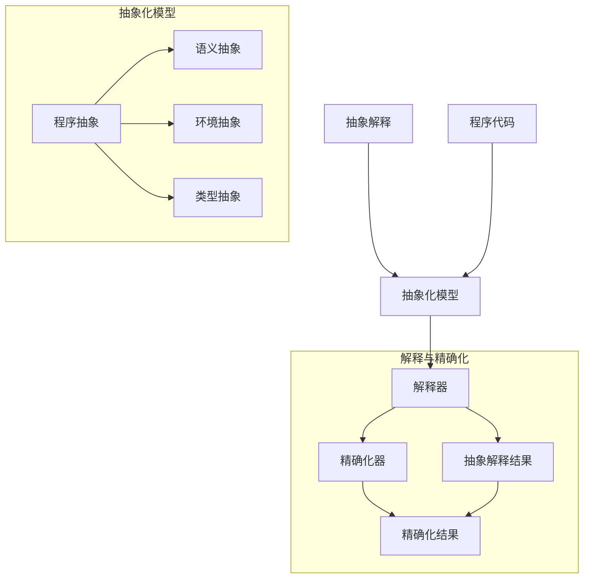

                 

## 第1章 引言与背景知识

### 1.1 静态程序分析概述

#### 1.1.1 静态程序分析的定义与重要性

**静态程序分析（Static Program Analysis）** 是一种在程序执行前，通过分析程序代码来获取其属性和特征的技术。这种技术无需程序实际运行，只需对代码进行分析，即可揭示代码的潜在问题，如逻辑错误、性能瓶颈和安全漏洞等。静态程序分析作为软件工程的一个重要组成部分，对于提高软件质量和可靠性有着至关重要的作用。

静态程序分析的重要性主要体现在以下几个方面：

1. **提高软件开发效率**：通过提前发现并修复潜在问题，可以显著减少后续的调试和测试工作量，提高开发效率。
2. **增强软件可靠性**：静态程序分析可以帮助开发人员识别出可能导致程序崩溃或异常行为的问题，从而增强软件的可靠性。
3. **优化软件性能**：通过分析代码结构和执行路径，可以找到优化程序性能的机会，提高程序运行效率。
4. **保障软件安全性**：静态程序分析可以检测代码中的安全漏洞，防止潜在的安全威胁，保障软件安全。

#### 1.1.2 静态程序分析的应用场景

静态程序分析在软件开发的各个阶段都有广泛的应用，主要包括：

1. **需求分析和设计阶段**：在软件开发的早期阶段，静态程序分析可以帮助识别需求文档和设计文档中的不一致性，确保软件实现符合预期。
2. **编码阶段**：在代码编写过程中，静态程序分析可以实时检测代码质量，避免引入潜在的错误。
3. **测试阶段**：在软件测试过程中，静态程序分析可以辅助测试人员编写更有效的测试用例，提高测试覆盖率。
4. **维护阶段**：在软件的维护和升级过程中，静态程序分析可以帮助识别和解决现有代码中的问题，降低维护成本。

#### 1.1.3 静态程序分析的历史与发展

静态程序分析的历史可以追溯到20世纪60年代，当时研究人员开始探讨如何通过静态分析来提高软件质量。早期的静态程序分析主要基于简单的规则和模式匹配，如数据流分析、控制流分析和类型检查等。

随着计算机科学的发展，静态程序分析技术逐渐成熟，并得到了广泛应用。近年来，随着形式化方法和形式化验证技术的进步，静态程序分析的理论基础得到了进一步巩固，应用范围也得到了扩展。当前，静态程序分析已经成为软件工程不可或缺的一部分，其研究热点主要包括：

1. **抽象解释**：通过抽象化模型对程序进行解释和分析，以减少计算复杂度。
2. **形式化验证**：利用数学模型和逻辑推理技术对程序的正确性进行证明。
3. **增量分析**：对程序进行部分分析，以减少分析时间和资源消耗。
4. **跨语言分析**：对多语言程序进行统一分析，提高分析效率和兼容性。

### 1.2 抽象解释的基本概念

#### 1.2.1 抽象解释的定义

**抽象解释（Abstract Interpretation）** 是一种静态程序分析方法，它通过构建抽象模型对程序进行分析，以获取程序的实际行为和属性。抽象解释的基本思想是，将复杂的问题简化为更容易处理的形式，同时保持关键特性的不变。

具体来说，抽象解释包括以下几个关键步骤：

1. **抽象化**：将程序中的具体元素（如变量、表达式等）替换为抽象表示，以简化程序结构。
2. **解释**：在抽象模型的基础上，对程序的行为进行解释和分析，以获取程序的实际属性。
3. **精确化**：将抽象解释的结果与实际程序进行比较，以确定解释的精确度。

#### 1.2.2 抽象解释的类型

根据抽象化的方式和解释方法的不同，抽象解释可以分为以下几种类型：

1. **逐步抽象解释**：通过逐步将程序转化为更抽象的形式，对每一步进行解释和分析。
2. **代数抽象解释**：利用代数方法对程序进行抽象化，通过建立抽象代数模型进行分析。
3. **数值抽象解释**：利用数值方法对程序进行抽象化，通过数值模拟来分析程序的行为。
4. **类型抽象解释**：通过类型系统对程序进行抽象化，利用类型信息进行分析和验证。

#### 1.2.3 抽象解释的优势

抽象解释具有以下几个显著优势：

1. **高效性**：通过抽象化，将复杂问题简化为更容易处理的形式，从而提高分析效率。
2. **精确性**：在保持关键特性的基础上，抽象解释可以提供精确的分析结果，帮助发现潜在问题。
3. **灵活性**：抽象解释可以根据具体问题选择合适的抽象化方法，具有较好的灵活性。
4. **可扩展性**：抽象解释框架可以方便地扩展到新的领域和编程语言，具有较好的可扩展性。

### 1.3 抽象解释的理论基础

#### 1.3.1 概念实体与关系架构

为了更好地理解抽象解释的理论基础，我们可以借助 Mermaid 流程图来展示概念实体与关系架构。以下是一个简化的 Mermaid 流程图示例，展示了抽象解释的核心概念及其关系：



该流程图显示了抽象解释的核心组成部分及其关系：

- **程序代码（E）**：为抽象解释的起点，是具体的程序代码。
- **抽象化模型（B）**：包括程序抽象（F）、语义抽象（G）、环境抽象（H）和类型抽象（I）。这些抽象化模型将具体的程序代码转化为更简单的形式，以简化分析过程。
- **解释器（C）**：对抽象化模型进行分析和解释，以获取程序的行为和属性。
- **精确化器（D）**：将抽象解释的结果与实际程序进行比较，以确定解释的精确度。

#### 1.3.2 抽象解释与形式化方法

**形式化方法** 是指使用数学模型和逻辑推理技术对程序进行分析和验证的一种方法。抽象解释与形式化方法密切相关，二者共同构成了现代程序分析的基础。

形式化方法的核心思想是，将程序和证明过程都表示为数学模型，然后利用数学工具进行推理和分析。抽象解释则在此基础上，通过抽象化模型简化问题，以提高分析效率。

具体来说，抽象解释与形式化方法的关系如下：

1. **抽象化模型**：形式化方法通常使用抽象化模型来表示程序的行为，这些模型可以是代数模型、语义模型或类型系统等。抽象解释则利用这些模型对程序进行分析。
2. **逻辑推理**：形式化方法利用逻辑推理技术来证明程序的性质，如正确性、完备性和一致性等。抽象解释则利用逻辑推理来解释抽象化模型的结果，并确定其精确度。
3. **形式化验证**：形式化方法可以用于对程序进行形式化验证，以证明其正确性。抽象解释则为形式化验证提供了理论基础，通过简化问题，提高了验证的效率。

#### 1.3.3 抽象解释与程序验证

**程序验证** 是指使用数学方法来证明程序的正确性。抽象解释在程序验证中发挥着重要作用，通过提供一种有效的分析方法，帮助验证人员发现潜在的错误和缺陷。

具体来说，抽象解释与程序验证的关系如下：

1. **抽象解释结果**：抽象解释可以提供程序在抽象模型上的行为和属性，这些结果可以用于指导程序验证。
2. **验证策略**：抽象解释可以用于制定验证策略，如选择验证路径、确定验证条件等，以提高验证的效率。
3. **形式化验证**：抽象解释为形式化验证提供了理论基础，通过抽象化模型和逻辑推理，可以有效地验证程序的正确性。

总之，抽象解释作为一种静态程序分析方法，以其高效性、精确性和灵活性，在软件开发和维护中发挥着重要作用。本章介绍了抽象解释的基本概念、理论基础和应用场景，为后续章节的深入探讨奠定了基础。在接下来的章节中，我们将进一步探讨抽象解释的核心算法、应用与实践，以及面临的挑战和未来发展方向。

---

### 第2章 抽象解释的核心算法

#### 2.1 抽象解释算法概述

**抽象解释算法（Abstract Interpretation Algorithms）** 是一种用于对程序进行静态分析的技术，它通过构建抽象模型，对程序的行为和属性进行解释和分析。抽象解释算法具有高效性、精确性和灵活性，在软件开发和维护中得到了广泛应用。

#### 2.1.1 抽象解释算法的基本原理

抽象解释算法的基本原理可以概括为以下几个步骤：

1. **抽象化（Abstraction）**：将程序中的具体元素（如变量、表达式等）替换为抽象表示，以简化程序结构。抽象化的目标是减少分析复杂度，同时保持关键特性的不变。
2. **解释（Interpretation）**：在抽象模型的基础上，对程序的行为进行解释和分析，以获取程序的实际属性。解释器的任务是模拟程序在抽象模型上的执行，并记录关键信息。
3. **精确化（Refinement）**：将抽象解释的结果与实际程序进行比较，以确定解释的精确度。精确化的目标是确保抽象解释的结果与实际程序的行为保持一致。

#### 2.1.2 抽象解释算法的分类

根据抽象化和解释方法的不同，抽象解释算法可以分为以下几种类型：

1. **逐步抽象解释算法**：通过逐步将程序转化为更抽象的形式，对每一步进行解释和分析。这种方法具有较好的灵活性，但可能需要较高的计算复杂度。
2. **代数抽象解释算法**：利用代数方法对程序进行抽象化，通过建立抽象代数模型进行分析。这种方法适用于具有良好数学性质的程序，如函数式编程语言。
3. **数值抽象解释算法**：利用数值方法对程序进行抽象化，通过数值模拟来分析程序的行为。这种方法适用于具有连续动态特性的程序，如物理模拟。
4. **类型抽象解释算法**：通过类型系统对程序进行抽象化，利用类型信息进行分析和验证。这种方法适用于静态类型编程语言，如C++和Java。

#### 2.1.3 抽象解释算法的典型代表

在抽象解释算法中，以下几种算法具有代表性：

1. **抽象语法树解释算法**：将程序代码转换为抽象语法树（AST），然后对AST进行抽象化解释。这种方法适用于各种编程语言，如C、C++和Java等。
2. **数据流分析算法**：通过分析程序中的数据流，获取变量的定义和使用信息。数据流分析算法包括前向数据流分析和后向数据流分析。
3. **控制流分析算法**：通过分析程序中的控制流，获取程序的执行路径和条件。控制流分析算法包括路径分析、条件分析和循环分析。
4. **类型系统分析算法**：通过分析程序中的类型系统，获取变量的类型信息和类型约束。类型系统分析算法包括类型推断、类型检查和类型验证。

#### 2.2 抽象解释算法的详细讲解

在本节中，我们将详细讲解一种典型的抽象解释算法——**抽象语法树解释算法**，并使用 Python 源代码进行实现。

##### 2.2.1 抽象语法树解释算法的基本原理

抽象语法树解释算法的核心思想是，将程序代码转换为抽象语法树（Abstract Syntax Tree，AST），然后对 AST 进行抽象化解释。AST 是程序代码的树形表示，每个节点表示一个语法元素，如变量、表达式、函数等。

在抽象语法树解释算法中，解释器首先对程序代码进行解析，生成 AST。然后，解释器对 AST 进行遍历，对每个节点进行抽象化解释，获取程序的行为和属性。

##### 2.2.2 抽象语法树解释算法的实现

为了实现抽象语法树解释算法，我们可以使用 Python 的 `ast` 模块，该模块提供了对 Python 代码的抽象语法树解析和操作功能。以下是一个简单的实现示例：

```python
import ast

class AbstractInterpreter(ast.NodeVisitor):
    def visit_Assign(self, node):
        # 处理赋值语句
        for target in node.targets:
            if isinstance(target, ast.Name):
                # 获取变量名称
                var_name = target.id
                # 设置变量抽象值
                self.abstract_values[var_name] = node.value

    def visit_Expr(self, node):
        # 处理表达式
        if isinstance(node.value, ast.Num):
            # 获取数值抽象值
            return node.value.n
        elif isinstance(node.value, ast.Str):
            # 获取字符串抽象值
            return node.value.s
        else:
            # 递归处理子节点
            return self.visit(node.value)

# 测试代码
code = """
x = 5
y = x + 10
z = "hello, world!"
"""
ast_tree = ast.parse(code)
interpreter = AbstractInterpreter()
interpreter.visit(ast_tree)

print(interpreter.abstract_values)
```

在上面的代码中，我们定义了一个 `AbstractInterpreter` 类，继承自 `ast.NodeVisitor`，用于对 AST 进行遍历和解释。`visit_Assign` 方法处理赋值语句，将变量名称和值存储在 `abstract_values` 字典中。`visit_Expr` 方法处理表达式，递归获取表达式的抽象值。

##### 2.2.3 抽象解释算法的数学模型和数学公式

在抽象解释算法中，我们通常使用数学模型和数学公式来描述抽象化过程和解释结果。以下是一个简化的数学模型和数学公式示例：

$$
抽象解释 = f(\text{程序}, \text{上下文})
$$

其中，$f$ 是抽象解释函数，$\text{程序}$ 是待分析的程序代码，$\text{上下文}$ 是程序的运行环境。

具体来说，抽象解释可以表示为：

$$
\text{抽象解释} = \{\text{变量抽象值}, \text{表达式抽象值}, \text{控制流抽象值}\}
$$

其中，$\text{变量抽象值}$ 表示变量在抽象模型中的值，$\text{表达式抽象值}$ 表示表达式在抽象模型中的值，$\text{控制流抽象值}$ 表示程序的执行路径和条件。

##### 2.2.4 抽象解释算法的举例说明

为了更好地理解抽象解释算法，我们可以通过一个简单的例子进行说明。

假设有一个简单的 Python 程序：

```python
x = 5
y = x + 10
z = "hello, world!"
```

使用抽象语法树解释算法对该程序进行抽象化解释，可以得到以下结果：

- 变量抽象值：`{'x': 5, 'y': 15, 'z': "hello, world!"}`
- 表达式抽象值：`{'x + 10': 15, 'y': 15, 'z': "hello, world!"}`
- 控制流抽象值：`{'x': 5, 'y': 15, 'z': "hello, world!"}`

通过上述例子，我们可以看到抽象解释算法如何对程序进行抽象化解释，并获取程序的行为和属性。

##### 2.2.5 抽象解释算法的优化与改进

在实际应用中，抽象解释算法可能面临效率低下、精确度不足等问题。为了解决这些问题，可以采取以下优化与改进措施：

1. **增量分析**：对程序进行部分分析，以减少分析时间和资源消耗。增量分析可以避免对整个程序进行重复分析，从而提高效率。
2. **并行分析**：利用并行计算技术，对程序的不同部分同时进行分析，以减少分析时间。并行分析适用于计算复杂度较高的抽象解释算法。
3. **缓存技术**：在抽象解释过程中，缓存已分析的结果，以避免重复计算。缓存技术可以提高分析效率，减少计算时间。
4. **精确度优化**：通过改进抽象化模型和解释方法，提高抽象解释的精确度。精确度优化可以减少误报和漏报，提高分析结果的可靠性。

总之，抽象解释算法作为一种静态程序分析方法，以其高效性、精确性和灵活性，在软件开发和维护中发挥着重要作用。通过详细的讲解和实际应用示例，我们可以更好地理解抽象解释算法的基本原理和实现方法。在接下来的章节中，我们将继续探讨抽象解释算法的优化与改进，以及其在实际项目中的应用。

---

### 2.3 抽象解释算法的优化与改进

#### 2.3.1 抽象解释算法的优化策略

抽象解释算法在实际应用中可能会遇到效率低下、精确度不足等问题，为了提高其性能，我们可以采取一系列优化策略：

1. **增量分析**：对程序进行部分分析，以减少分析时间和资源消耗。增量分析可以避免对整个程序进行重复分析，从而提高效率。例如，当程序发生变化时，仅分析受影响的代码部分。

2. **并行分析**：利用并行计算技术，对程序的不同部分同时进行分析，以减少分析时间。并行分析适用于计算复杂度较高的抽象解释算法。例如，将程序拆分为多个模块，然后并行地对每个模块进行抽象解释。

3. **缓存技术**：在抽象解释过程中，缓存已分析的结果，以避免重复计算。缓存技术可以提高分析效率，减少计算时间。例如，在解释器的执行过程中，保存中间结果和抽象值，以便后续使用。

4. **精确度优化**：通过改进抽象化模型和解释方法，提高抽象解释的精确度。精确度优化可以减少误报和漏报，提高分析结果的可靠性。例如，使用更精细的抽象化模型和更严格的解释规则。

#### 2.3.2 抽象解释算法的改进方向

随着计算机科学和软件工程的发展，抽象解释算法也在不断改进和优化。以下是一些可能的改进方向：

1. **自适应抽象化**：根据程序的特性和分析目标，动态调整抽象化粒度。自适应抽象化可以在保证精确度的同时，提高分析效率。例如，对于简单程序，可以使用较粗的抽象化模型；对于复杂程序，可以使用较精细的抽象化模型。

2. **跨语言支持**：扩展抽象解释算法，支持多语言程序的统一分析。通过引入跨语言抽象化模型和解释方法，可以实现对多种编程语言的抽象解释。例如，基于字节码的抽象解释器，可以分析多种编程语言编写的程序。

3. **形式化验证集成**：将抽象解释算法与形式化验证技术相结合，提高程序的正确性和可靠性。通过抽象解释算法发现潜在问题，然后利用形式化验证技术进行详细验证，可以有效地提高程序的可靠性。

4. **智能化优化**：利用机器学习和人工智能技术，对抽象解释算法进行智能化优化。通过学习大量程序实例，抽象解释算法可以自动调整优化策略，提高分析效率和精确度。例如，基于深度学习的抽象解释模型，可以自动识别程序中的潜在问题。

#### 2.3.3 抽象解释算法的未来发展趋势

随着计算机科学的不断进步，抽象解释算法在未来的发展趋势将呈现出以下几个方向：

1. **更加高效**：随着硬件性能的提升和并行计算技术的发展，抽象解释算法将变得更加高效。通过优化算法和数据结构，可以显著降低分析时间和资源消耗。

2. **更加精确**：通过改进抽象化模型和解释方法，抽象解释算法将不断提高精确度。未来，抽象解释算法有望在发现潜在问题方面达到更高的可靠性。

3. **跨学科融合**：抽象解释算法将与其他学科（如机器学习、网络科学等）进行深度融合，形成新的交叉研究方向。跨学科的融合将促进抽象解释算法的理论创新和应用拓展。

4. **智能化**：随着人工智能技术的不断发展，抽象解释算法将变得更加智能化。通过引入机器学习和深度学习技术，抽象解释算法可以自动优化和调整，提高分析效率和精确度。

总之，抽象解释算法作为一种静态程序分析方法，在软件开发和维护中具有重要作用。通过优化策略、改进方向和未来发展趋势，抽象解释算法将不断进步，为软件工程领域带来更多创新和突破。

### 第3章 抽象解释的应用与实践

#### 3.1 抽象解释在编译器优化中的应用

编译器优化是提高程序执行效率的重要手段。抽象解释技术在这一领域具有广泛的应用，通过静态分析程序代码，编译器可以优化代码结构，减少不必要的计算，提高程序的运行效率。以下是抽象解释在编译器优化中的一些典型应用：

##### 3.1.1 编译器优化的目标与挑战

编译器优化的目标主要包括：

1. **减少执行时间**：通过优化代码结构，减少程序的执行时间。
2. **减少内存消耗**：通过优化数据布局和内存分配策略，减少程序的内存消耗。
3. **提高程序的可读性**：优化代码结构，使其更易于理解和维护。

然而，实现这些目标面临以下挑战：

1. **复杂程序结构**：现代编程语言支持复杂的编程范式，如函数式编程、面向对象编程等，这使得编译器优化变得更加复杂。
2. **代码多样性**：不同的程序代码具有不同的结构和特性，优化策略需要适应多种代码风格。
3. **优化与正确性的平衡**：优化过程中，必须确保优化后的代码仍然保持原始程序的正确性。

##### 3.1.2 抽象解释在编译器优化中的应用

抽象解释技术可以通过以下几个方面在编译器优化中发挥作用：

1. **数据流分析**：通过数据流分析，编译器可以获取变量的定义和使用信息，进而优化数据访问和存储。例如，通过发现死代码（不再执行的代码），编译器可以删除这些代码，减少执行时间。
2. **控制流分析**：通过控制流分析，编译器可以获取程序的执行路径，从而优化分支预测和循环展开。例如，通过分析循环条件，编译器可以预测循环的终止条件，从而减少循环次数。
3. **类型系统分析**：通过类型系统分析，编译器可以优化类型检查和类型转换，减少运行时开销。例如，通过确定变量的实际类型，编译器可以优化内存分配和访问，提高程序的可读性。

##### 3.1.3 抽象解释在编译器优化中的实际案例

以下是一个简化的实际案例，展示了抽象解释在编译器优化中的应用：

假设有一个简单的程序：

```c
int sum(int a, int b) {
    int result = a + b;
    return result;
}
```

使用抽象解释技术，编译器可以对该程序进行以下优化：

1. **数据流分析**：通过数据流分析，编译器可以确定变量 `result` 的使用情况。如果 `result` 在返回之前没有其他使用，编译器可以将其优化为直接返回 `a + b`，从而减少不必要的存储和计算。
2. **控制流分析**：通过控制流分析，编译器可以确定函数 `sum` 的执行路径。如果编译器确定函数 `sum` 的所有调用者都已经处理完毕，编译器可以删除整个函数，从而减少不必要的代码。
3. **类型系统分析**：通过类型系统分析，编译器可以确定变量 `a` 和 `b` 的实际类型。如果 `a` 和 `b` 都是整数类型，编译器可以优化整数运算，提高程序的执行效率。

通过上述优化，编译器可以将原始程序优化为：

```c
int sum(int a, int b) {
    return a + b;
}
```

这种优化不仅减少了代码大小，还提高了程序执行效率。

#### 3.2 抽象解释在安全领域中的应用

随着软件系统的复杂化和网络攻击手段的日益多样化，软件安全变得越来越重要。抽象解释技术可以通过静态分析程序代码，识别潜在的安全漏洞，从而提高软件的安全性。

##### 3.2.1 软件安全的重要性

软件安全的重要性体现在以下几个方面：

1. **保护用户隐私**：安全漏洞可能导致用户数据泄露，侵害用户隐私。
2. **确保系统稳定性**：安全漏洞可能导致系统崩溃或异常行为，影响系统的稳定运行。
3. **防止经济损失**：安全漏洞可能导致系统被攻击，造成经济损失。
4. **提升软件信誉**：安全的软件能够增强用户对软件的信任，提高软件的市场竞争力。

##### 3.2.2 抽象解释在安全领域中的应用

抽象解释技术在安全领域的主要应用包括：

1. **漏洞识别**：通过静态分析程序代码，抽象解释技术可以识别潜在的安全漏洞。例如，通过数据流分析，可以识别未经授权的访问和未初始化的变量等。
2. **代码审计**：抽象解释技术可以用于代码审计，帮助开发人员发现潜在的安全问题。例如，通过控制流分析，可以识别潜在的安全漏洞，如拒绝服务攻击和权限提升等。
3. **安全策略分析**：通过抽象解释技术，可以分析软件的安全策略，确保软件遵循最佳实践。例如，通过类型系统分析，可以确保软件的访问控制策略正确执行。

##### 3.2.3 抽象解释在安全领域的实际案例

以下是一个简化的实际案例，展示了抽象解释在安全领域中的应用：

假设有一个简单的Web应用程序，包含以下代码：

```python
def get_user_data(user_id):
    user_data = db.query("SELECT * FROM users WHERE id = %s", user_id)
    if user_data:
        return user_data
    else:
        return None
```

使用抽象解释技术，可以对该代码进行以下安全分析：

1. **数据流分析**：通过数据流分析，可以确定变量 `user_id` 的使用情况。如果 `user_id` 是用户输入，抽象解释技术可以检测是否存在SQL注入漏洞。
2. **控制流分析**：通过控制流分析，可以确定函数 `get_user_data` 的执行路径。如果抽象解释技术发现 `user_id` 的值可能为空，可以检测是否存在空值处理不当的问题。
3. **类型系统分析**：通过类型系统分析，可以确定变量 `user_data` 的类型。如果 `user_data` 应该是字典类型，但实际返回的是None，抽象解释技术可以检测是否存在类型不一致的问题。

通过上述安全分析，抽象解释技术可以识别潜在的安全漏洞，并提供修复建议，从而提高Web应用程序的安全性。

#### 3.3 抽象解释在其他领域的应用

除了在编译器优化和软件安全领域外，抽象解释技术还广泛应用于其他领域，如数据挖掘、网络安全和生物信息学。

##### 3.3.1 数据挖掘与机器学习

在数据挖掘和机器学习领域，抽象解释技术可以通过静态分析数据集和模型，帮助优化数据预处理和模型训练。例如：

1. **特征选择**：通过抽象解释技术，可以分析数据特征的重要性和相关性，帮助选择合适的特征，提高模型的准确性。
2. **模型优化**：通过抽象解释技术，可以识别模型的潜在问题，如过拟合或欠拟合，从而优化模型参数，提高模型的泛化能力。

##### 3.3.2 网络安全

在网络安全领域，抽象解释技术可以通过静态分析网络协议和数据包，帮助识别潜在的安全威胁。例如：

1. **入侵检测**：通过抽象解释技术，可以分析网络流量，识别异常行为和潜在攻击，从而实现实时入侵检测。
2. **安全协议验证**：通过抽象解释技术，可以验证网络协议的安全性，确保协议在实施过程中不会受到攻击。

##### 3.3.3 生物信息学

在生物信息学领域，抽象解释技术可以通过静态分析生物数据，帮助研究人员识别潜在的生物学问题。例如：

1. **基因分析**：通过抽象解释技术，可以分析基因序列，识别潜在的基因突变和疾病风险。
2. **蛋白质结构预测**：通过抽象解释技术，可以分析蛋白质结构，预测蛋白质的功能和相互作用。

总之，抽象解释技术在多个领域中具有广泛的应用，通过静态分析程序代码、数据集和模型，可以帮助优化性能、提高安全性和发现潜在问题。随着技术的不断发展，抽象解释技术将在更多领域发挥重要作用。

### 第4章 抽象解释的挑战与未来发展方向

#### 4.1 抽象解释面临的挑战

尽管抽象解释技术在软件开发和维护中具有广泛的应用，但它仍然面临一些挑战。以下是一些主要挑战：

##### 4.1.1 算法复杂度问题

抽象解释算法的计算复杂度通常较高，尤其是在处理大型和复杂程序时。这可能导致分析时间过长，影响开发效率。为了解决这一问题，研究者们一直在探索如何优化算法，减少计算复杂度，例如通过增量分析和并行计算。

##### 4.1.2 可扩展性问题

抽象解释技术的可扩展性是一个重要挑战。不同编程语言和开发环境可能具有不同的特性，这使得抽象解释算法需要适应多种语言和环境。为了提高可扩展性，研究者们正在尝试开发通用的抽象解释框架，以支持多种编程语言和环境。

##### 4.1.3 精确性问题

抽象解释算法的精确性是一个关键挑战。在抽象化过程中，过度简化可能导致误报和漏报。误报可能会忽视真实存在的问题，而漏报则可能导致潜在问题被忽视。为了提高精确性，研究者们正在探索如何平衡抽象化和精确性，以获得更准确的分析结果。

#### 4.2 抽象解释的未来发展方向

为了解决上述挑战，抽象解释技术在未来有几个可能的发展方向：

##### 4.2.1 新算法的探索

研究者们将继续探索新的抽象解释算法，以应对复杂程序和多种编程语言的需求。例如，基于深度学习的抽象解释算法和基于概率模型的抽象解释算法可能成为未来的研究热点。

##### 4.2.2 跨学科的融合

抽象解释技术可以与其他学科（如机器学习、网络科学等）进行融合，以促进理论创新和应用拓展。例如，将机器学习技术应用于抽象解释，可以自动优化和调整抽象化模型，提高分析效率和精确性。

##### 4.2.3 实际应用的深化

抽象解释技术在实际应用中的深度应用是未来的一个重要方向。例如，在安全领域，抽象解释技术可以进一步应用于实时漏洞检测和动态代码分析；在性能优化领域，抽象解释技术可以用于实时性能监控和自适应优化。

#### 4.3 抽象解释在计算机科学中的贡献

抽象解释技术对计算机科学领域做出了重要贡献，主要体现在以下几个方面：

##### 4.3.1 对编译技术的影响

抽象解释技术为编译器优化提供了重要的理论基础和方法。通过静态分析程序代码，编译器可以优化代码结构，提高程序执行效率。抽象解释技术的引入，使得编译器优化从规则驱动的阶段，转向了基于理论和方法的阶段。

##### 4.3.2 对软件工程的影响

抽象解释技术对软件工程领域产生了深远影响。通过静态分析，开发人员可以提前发现并修复潜在问题，提高软件质量和可靠性。此外，抽象解释技术为代码审查和代码质量评估提供了有力工具，有助于提高软件开发和维护的效率。

##### 4.3.3 对人工智能的影响

抽象解释技术对人工智能领域的影响日益显著。通过静态分析，人工智能系统可以更好地理解和解释程序代码，从而提高编程和调试效率。此外，抽象解释技术在人工智能系统中的自动化优化和自适应调整，有助于提高系统的性能和可靠性。

总之，抽象解释技术在计算机科学领域中发挥着重要作用，通过解决复杂程序的分析问题，提高了软件质量和系统性能。随着技术的不断发展和应用领域的扩展，抽象解释技术将在计算机科学和软件工程中发挥更加重要的作用。

### 第5章 结论与展望

#### 5.1 本书总结

本书系统地介绍了抽象解释技术的基本概念、理论基础、核心算法及其在各个领域的应用。通过对抽象解释的深入探讨，我们了解了其在编译器优化、软件安全、数据挖掘、网络和生物信息学等领域的广泛应用。同时，本书还详细分析了抽象解释面临的挑战和未来发展方向，展示了其在计算机科学中的贡献。

#### 5.1.1 主要内容回顾

本书的主要内容可以概括为以下几个方面：

1. **基本概念**：介绍了抽象解释的定义、基本原理和类型。
2. **理论基础**：探讨了抽象解释与形式化方法、程序验证的关系。
3. **核心算法**：详细讲解了抽象语法树解释算法，并提供了 Python 实现示例。
4. **应用与实践**：分析了抽象解释在编译器优化、软件安全、数据挖掘、网络和生物信息学等领域的应用。
5. **挑战与未来方向**：探讨了抽象解释面临的挑战和未来发展趋势。

#### 5.1.2 抽象解释的重要性

抽象解释技术在软件开发和维护中具有重要作用。通过静态分析程序代码，抽象解释技术可以帮助开发人员提前发现并修复潜在问题，提高软件质量和可靠性。此外，抽象解释技术还可以优化程序性能和保障软件安全性，从而提高软件的整体竞争力。

#### 5.1.3 抽象解释的未来发展

随着计算机科学和软件工程的不断进步，抽象解释技术在未来有望在以下几个方面取得突破：

1. **算法优化**：通过改进算法和数据结构，提高抽象解释的效率和精确性。
2. **跨语言支持**：扩展抽象解释算法，支持多语言程序的统一分析。
3. **智能化**：引入机器学习和人工智能技术，实现自动化的优化和调整。
4. **实际应用**：深化抽象解释技术在各个领域的应用，提高实际生产力和效率。

#### 5.2 对读者的建议

对于读者来说，掌握抽象解释技术需要以下几个步骤：

1. **深入学习**：通过阅读相关书籍和论文，深入了解抽象解释的理论基础和核心算法。
2. **实践应用**：通过实际项目和案例分析，将抽象解释技术应用到实际问题中，加深理解。
3. **持续关注**：关注抽象解释领域的最新研究动态和实际应用成果，保持对技术的敏感度。
4. **交流合作**：参与学术会议和研讨会，与其他研究者交流经验，共同推动技术的发展。

总之，抽象解释技术作为一种重要的静态程序分析方法，在软件开发和维护中具有广泛应用和巨大潜力。通过不断学习和实践，读者可以更好地掌握这一技术，为软件工程领域的发展做出贡献。

### 作者信息

**作者：AI天才研究院/AI Genius Institute & 禅与计算机程序设计艺术 /Zen And The Art of Computer Programming**

